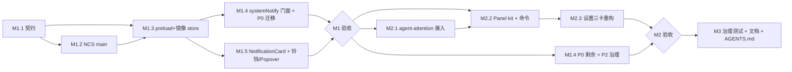

# 统一消息中心 · 实施方案

> 状态：待评审 · 日期：2026-07-24
> 配套设计文档：`../specs/2026-07-24-unified-notification-center-design.md`（架构/契约/UI 以该文档为准，本文档只回答"怎么落地、按什么顺序、做到什么程度算完"）。
> UI 原型：`../specs/2026-07-24-notification-center-prototype.html`。

---

## 0. 实施总则

1. **三个里程碑，各自可独立合并、独立回滚**：M1 流水线+最小 UI → M2 agent 融合+完整 UI → M3 治理收尾。每个里程碑结束都是可发布状态（旧行为不劣化）。
2. **契约先行**：每个里程碑第一步都是 `src/shared/contracts/` 落 schema，main / preload / renderer 三端围绕契约并行推进。
3. **零破坏原则**：sonner 调用约定（宿主 `import { toast } from "sonner"`）、`agentAttention.*` 偏好 key、`window.pier.notifications` 通道**全部不改**；新能力全部走新增文件。
4. **范围修正（相对设计文档 §4）**：设计文档中的"sonner 全局 tap-in"在实施中收窄为**显式门面** `systemNotify()`——系统事件是可枚举的少数调用点（P0 共 7 处），逐个迁移到门面比全局钩子更可控、可测试；用户动作 toast 完全不经过新代码。
5. 每里程碑都要过：`pnpm typecheck && pnpm lint && pnpm test`（unit+component 相关域）。

## 1. 里程碑总览

| 里程碑 | 目标 | 主要产出 | 预估 | 验收一句话 |
|---|---|---|---|---|
| **M1** 流水线 + 铃铛/Popover | 消息能进、能存、能看 | NCS(main) + 契约 + 镜像 store + 门面 + 铃铛 + Popover + P0 迁移 | 5–7 人日 | 更新就绪/任务终态消息进消息中心，toast 行为不变 |
| **M2** agent 融合 + Panel + 设置 | 消息中心成为完整产品面 | agent-attention 接入 + Panel kit + 设置三卡重构 + 深链聚焦 | 6–8 人日 | 「需要你处理」可在消息中心回看并点击聚焦 agent |
| **M3** 治理 + 收尾 | 纪律固化 | 去重下沉 + 治理测试 + 命令/快捷键 + AGENTS.md + 文档 | 2–3 人日 | 新增系统消息不走门面会被测试拦住 |

依赖关系：M1 → M2 → M3 严格串行（M2 的 Panel 依赖 M1 的 store；M3 的治理测试锁定 M1/M2 的全部约定）。

## 1.1 目标文件目录结构

全部新建（✚）与修改（✎）文件一览（按进程分层，与任务编号对应）：

```
src/
├── shared/
│   ├── notification-delivery.ts            ✚ M1.2  路由矩阵纯函数（facade 与 NCS 共用，见偏差 1）
│   ├── contracts/
│   │   ├── notification-center.ts          ✚ M1.1  AppNotification / Snapshot / prefs schema
│   │   └── preferences.ts                  ✎ M1.1  +notificationCenter 字段
│   └── ipc-channels.ts                     ✎ M1.1  +PIER_BROADCAST.NOTIFICATION_CENTER_CHANGED 等
├── main/
│   ├── services/
│   │   ├── notification-center/            ✚ M1.2  新模块（边界：不 import services/agents/）
│   │   │   ├── service.ts                  ✚ M1.2  ingest/normalize/dedupe/广播/读写入口
│   │   │   ├── dedupe.ts                   ✚ M1.2  dedupeKey + 冷却合并
│   │   │   └── store.ts                    ✚ M1.2  ring buffer + 过期清理 + 持久化
│   │   └── agent-attention/
│   │       └── service.ts        ✎ M2.1  事件同步 ingest 到 NCS
│   ├── ipc/
│   │   └── notification-center.ts          ✚ M1.2  registerNotificationCenterIpc
│   ├── state/
│   │   └── preferences.ts                  ✎ M1.1  DEFAULTS 补默认值
│   └── index.ts                            ✎ M1.2  注册段 +1 行
├── preload/
│   ├── notification-center-api.ts          ✚ M1.3  window.pier.notificationCenter
│   └── index.ts                            ✎ M1.3  PierWindowAPI + api 各 +1 行
└── renderer/
    ├── stores/
    │   ├── notification-center.store.ts    ✚ M1.3  镜像 store（seq 守卫）
    │   ├── notification-center-prefs.store.ts ✚ M2.3 偏好镜像（乐观更新+writeChain）
    │   ├── workspace.store.ts              ✎ M2.2  +openNotificationsPanel（单例）
    │   ├── app-update.store.ts             ✎ M1.4  P0 #1 #2 → systemNotify
    │   └── agent-runtime-index.store.ts    ✎ M2.4  P0 #5 启动失败降级
    ├── lib/
    │   ├── notifications/
    │   │   └── system-notify.ts            ✚ M1.4  系统事件门面（toast 双写 + 上报）
    │   ├── actions/
    │   │   ├── notification-center-actions.ts ✚ M2.2 命令贡献（open/toggleDnd/markAllRead）
    │   │   └── all-action-contributions.ts ✎ M2.2  登记 +1 行
    │   └── plugins/
    │       ├── host-context.ts             ✎ M1.4  notifications 门面 +meta 透传
    │       └── external-context.ts  ✎ M1.4  同上
    ├── components/
    │   ├── common/
    │   │   ├── notification-card.tsx       ✚ M1.5  唯一消息卡片（compact/standard）
    │   │   ├── notification-action-button.tsx ✚ M1.5 统一 action 渲染器
    │   │   ├── notification-center-control.tsx ✚ M1.5 标题栏铃铛
    │   │   ├── notification-center-popover.tsx ✚ M1.5 Popover
    │   │   ├── notification-center-bridge.tsx ✚ M1.3 镜像水合桥
    │   │   ├── app-shell.tsx               ✎ M1.3  挂 bridge
    │   │   ├── title-bar.tsx               ✎ M1.5  mac 标题栏右簇 +铃铛
    │   │   ├── agent-index-chrome-bar.tsx  ✎ M1.5  非 mac 同位 +铃铛
    │   │   ├── agent-runtime-index-bridge.tsx ✎ M1.4 P0 #4 → systemNotify
    │   │   └── task-runs-error-bridge.tsx  ✎ M2.4  P0 #6 补 inbox 留痕
    │   ├── workspace/
    │   │   └── panel-registry.ts           ✎ M2.2  panelKits +notifications
    │   └── primitives/
    │       └── sonner.tsx                  ✎ M1.5  action 样式与卡片共用 token
    ├── panel-kits/
    │   ├── notifications/                  ✚ M2.2  消息中心 core panel kit
    │   │   ├── notifications-panel.tsx     ✚ M2.2  过滤/搜索/日期分组/空态
    │   │   └── index.tsx                   ✚ M2.2  kit 导出
    │   └── terminal/
    │       └── notify-task-run-finished.ts ✎ M1.4  P0 #3 ×5 → systemNotify
    ├── pages/settings/components/
    │   ├── notifications-section.tsx       ✎ M2.3  三卡重构（记录→内容→通道）
    │   └── notification-sound-block.tsx    ✎ M2.3  迁入 Card 3（组件本身不动）
    └── i18n/locales/
        ├── en/notifications-center.ts      ✚ M2.3  新 locale 域
        ├── zh-CN/notifications-center.ts   ✚ M2.3
        ├── en/index.ts                     ✎ M2.3  +1 行
        └── zh-CN/index.ts                  ✎ M2.3  +1 行

packages/
└── plugin-api/src/peer-sync/
    └── notify-failures.ts                  ✎ M1.4  P0 #7 传 meta 上报

tests/
├── unit/
│   ├── shared/notification-center-contract.test.ts      ✚ M1.1
│   ├── main/
│   │   ├── notification-center-service.test.ts          ✚ M1.2
│   │   ├── notification-center-routing.test.ts          ✚ M1.2
│   │   ├── notification-center-store.test.ts            ✚ M1.2
│   │   ├── agent-attention-ncs-ingest.test.ts           ✚ M2.1
│   │   └── notification-center-governance.test.ts       ✚ M3
│   └── renderer/
│       ├── notification-center-store.test.ts            ✚ M1.3
│       ├── system-notify.test.ts                        ✚ M1.4
│       ├── notification-deep-link.test.tsx              ✚ M2.1
│       ├── open-notifications-panel.test.ts             ✚ M2.2
│       └── notification-center-governance.test.ts       ✚ M3
└── component/
    ├── notification-card.test.tsx                       ✚ M1.5
    ├── notification-center-popover.test.tsx             ✚ M1.5
    ├── notifications-panel.test.tsx                     ✚ M2.2
    └── notifications-section.test.tsx                   ✚ M2.3

docs/ 与治理
├── AGENTS.md                               ✎ M3   反馈规范决策树 + 消息中心小节
└── docs/                                   ✎ M3   用户文档 + CHANGELOG [Unreleased]
```

规模合计：**新建 28 个文件，修改 21 个文件**（其中 18 处修改为「+1 行」级别的登记/接线）。

## 1.2 实施偏差记录（M1 落地后更新）

M1 已完成并全部验证（typecheck / lint / unit 全绿）。与 §1.1/§2 计划的偏差：

1. **routing.ts 上移 shared**：`src/shared/notification-delivery.ts` 替代 `main/services/notification-center/routing.ts`。原因：toast 决策在 renderer 门面本地完成（不等 main 往返），同一路由纯函数须被门面与 NCS（M2）共用。
2. **runAction 通道取消**：preload/契约均无 `run-action` 通道。action 全部在 renderer 本地分发（`lib/notifications/actions.ts`），执行后调 `markRead`——action 上下文（workspace api、stores）本就在 renderer，跨进程转发无收益。
3. **本地 toast 节流保留**：`readyToastVersion` / `notifiedRunIds` / `toasted` 未删。实测 facade 的镜像去重无法覆盖同步连发（同一 tick 内 mirror 尚未水合），本地守卫仍承载「会话内同步去重」；NCS dedupeKey 负责「跨会话记录去重」。M3 治理时再评估是否完全下沉。
4. **Popover footer「打开消息中心」M1 未渲染**：panel 未落地前无有效深链，M2.2 随单例 panel 一起接入。
5. **`biome.jsonc` 新增 `!docs/**/*.html` 忽略**：docs 下的原型稿 HTML 是设计资产非产品代码。
6. 契约增补 `actionParams` 字段（`open-output` action 需要 runId 上下文）；`notificationReportSchema` 为 `.strict()`（拒绝夹带服务端分配字段）。

## 1.3 实施偏差记录（M2/M3 落地后更新）

M2/M3 已完成并全部验证。与 §3/§4 计划的偏差：

1. **agent ingest 门闸**：接入点在「分类 → 聚焦抑制」之后、冷却之前——被聚焦抑制的事件不进 inbox（用户正在看）；冷却只约束 OS 通知，inbox 每次边沿都记（NCS dedupe 合并为 repeatCount）。
2. **focus-panel action 实现**：经 `agentRuntimeIndex.focus(agentRef)`（跨窗聚焦 + 统一失败反馈），而非裸 panel activate——panel 可能在本机另一窗口。
3. **toast 预览桥**：新增 `notification-toast-preview-bridge.tsx`，只预览不经门面的 kind（agent.attention / agent.turn-finished），防止与 facade 双 toast。
4. **快捷键**：`pier.notifications.open` 等三个命令只进命令面板，不分配默认键位（避免与既有键位冲突；后续按使用频率再评）。
5. **设置页 Card 2 门闸语义**：agent 组开关（enabled/enableErrorAttention/turnNotifyMode）是「分类门闸」——关闭后事件不进 inbox；任务与系统组（mutedKinds）只静音 toast、记录照进。两组 desc 文案已按此如实区分。
6. **治理扫描器约定**：`systemNotify({...})` 调用要求 `kind` / `severity` 显式写在调用点（可解构简写），不放公共 base 对象——保证静态扫描可判定。
7. **文件行数硬顶（500）拆分**：`notifications-section.tsx` 拆为 `pages/settings/components/notifications/`（message-center-card / content-card / delivery-card + group-legend，section 只留编排与 re-export）；`openNotificationsPanel` 抽至 `lib/workspace/open-notifications-panel.ts`；插件上报助手合并为 `lib/plugins/notification-report.ts`（builtin/external 门面共用，去重）。
8. **命令注册连带义务**：新增 core action 必须同步 `src/shared/plugin-core-contribution-ids.ts` 的 `CORE_RESERVED_ACTION_IDS`（action-registry 测试锁定）；`pier.notifications.{open,toggleDnd,markAllRead}` 已登记。
9. **import 环规避**：`workspace.store` 不得 import panel kit 实现（panel → notification-card → notification-actions → task-run-operations → workspace.store 成环）；标题解析与单例逻辑放 `lib/workspace/`。
10. **铃铛拖拽区逃逸**：mac 标题栏是 `app-drag` 窗口拖拽区，铃铛 Button 必须带 `app-no-drag`（对齐 AgentIndexCountsControl / AppUpdateControl），否则点击被窗口拖动吃掉——已加组件测试锁定。
11. **mutedKinds 运行时接入**（M2 尾巴）：facade 与 toast 预览桥的 `routeDelivery` 第二参读 `notification-center-prefs` 镜像，设置页「任务与系统」组开关即时生效。
12. **NCS 偏好运行时同步**：service 增 `syncPrefs`；ipc 经 `appCore.eventBus` 订阅 `preferences.changed`（changedKeys 含 `notificationCenter`）——设置页改保留策略/静音/DND 无需重启即生效（对齐 agent-attention settings-cache 先例）。
13. **非 modal popover 在原生终端上的两件套**：通知 popover 打开期间必须挂 `registerTerminalFullscreenWebOverlay`（终端 NSView 点击默认被 native 消费，Radix outside-pointerdown 收不到 → 不收起）+ `requestTerminalWebFocus`（键盘钉在 web，全局快捷键与 Escape 保持可达）；**刻意不 `pushBlockingScope`**（参照设置页），避免吞掉命令面板/设置快捷键。模式源自 `add-panel-action.tsx` 与 `content-preview-host.tsx`，组件测试锁定注册/释放生命周期。
14. **popover 必须给其他 Dialog 让路（本次快捷键失效的真实根因）**：`@pier/ui` 的 Dialog/AlertDialog 对 controlled open 做 deferred-open——DOM 中存在 `popover-content`（含本 popover）即视为打开阻塞，等 1s 后**放弃挂载**（`schedule-after-overlay`），命令面板/设置看似「快捷键失效」。修复：popover 订阅四个 Dialog 打开信号（命令面板 controller.open / 设置 isOpen / app-dialog current / content-dialog stack）即自动收起；同时给 CommandPalette 与 SettingsDialog 补 `onAbandonOpen` 复位，消除「open=true 但未挂载」的僵尸态。e2e `tests/e2e/notification-center-popover.spec.ts` 锁定全链路。
15. **action 可用性在渲染期过滤（不用模态框报告死链）**：task-runs 是内存态、agent 面板会关闭，消息深链目标必然过期。过期 action（`open-output` / `focus-panel`）在渲染时按 store 快照过滤不渲染（`isNotificationActionAvailable`），而不是点击后弹「内容已不存在」模态——可预判的降级不该伪装成运行时错误。消息本体（标题/时间/结果）即是记录，深链是尽力而为的增强。
16. **卡片四元模型定稿**：消息条目 = 标题（500 粗体单行）/ 详情（muted 次行，可选）/ 类型（Badge，与时间同排底行）/ 时间（Clock 图标 + 相对时间）；未读 = destructive 红点固定右上；操作 = 底行右簇 ≤2。设计稿 `docs/superpowers/specs/2026-07-25-notification-card-design.html`。类型徽标不放标题行/动作区（语义错位）；未读不用 primary 白点（与动作视觉混淆）。toast = 同一模型的 compact 呈现（图标 + 标题 + 主操作 + 关闭），不引入底行信息。
17. **消息类 toast 全面卡片化（废除单行文本 toast）**：`systemNotify` 与 agent 预览桥的 toast 统一经 `show-notification-toast.tsx` 渲染。~~自定义 JSX 卡片~~（已回退，见 #20）；action 直接复用消息 action 分发（`toastAction` 字段删除）。**依赖反转破环**：system-notify 被 stores 静态引用，不得静态引入 React 卡片树——toast 渲染走 `registerSystemToastRenderer` 槽位（应用引导注册，未注册静默跳过），`relaunch` 与启动失败上报走动态 import。旧断言锁死单行 sonner 行为的测试已按渲染槽重写。
18. **severity 语义定稿（产品决策）**：状态着色是 **toast 专属**（结果确认语境）；**消息中心条目一律无前置状态图标**，只有 标题/详情/类型徽标/时间 + 未读红点 + 操作。severity 只驱动行为不驱动图标：徽标只计 warning/error 未读（`attentionUnreadCount`）、toast 时长 error 10s / warning 6s / success·info 4s、DND 仅 error 弹出。「toast 专属」的边界：用户动作的结果确认纯 toast 不进 inbox；系统/后台事件（含成功类）进 inbox 但无图标。另：普通取消 severity 由 success 修正为 info（仅影响 toast 图标与分级行为）。
19. **注意力分级落地到打扰面**：① 铃铛徽标改为只计 warning/error 未读（`attentionUnreadCount`）——流水照常进 inbox 但不驱动打扰面，根治「成功记录推徽标」的虚假紧急感；popover 未读计数与「全部已读」仍覆盖全部未读（记录完整性）。② toast 时长按分级：error 10s / warning 6s / success·info 4s。

20. **toast 回到 sonner 原生结构（回退自定义卡片）**：#17 的「NotificationCard density=toast + 覆盖 CSS」被证明是对抗容器的非标做法（布局失衡、与 sonner 原生结构脱节）。最终形态：`showNotificationToast` 用 sonner 原生 icon + title + description（非 error 时展示消息详情；error 技术详情按规范只进 inbox）+ action + 按时长分级，不再自绘布局、不再覆盖容器样式；sonner 配置放开 `description` 隐藏（消息详情是合法次行，技术详情仍禁入）。inbox 侧不受影响（仍无前置图标，见 #18）。
21. **toast 双形态定稿（v3 实施）**：#20 的单一原生结构再修正为双形态——**形态 A（确认型）维持反色胶囊不动；形态 B（消息型）= 基础 `toast()`（无图标注入）+ 必备标题/详情（无详情时回退类型行）+ ≤1 outline 操作 + 关闭 X**，容器为消息中心同 surface 的 `pier-msg-toast`（胶囊基类上做最小范围覆盖：圆角/纵向内容列/outline action/close 右上；关闭按钮确认型经 `:not(.pier-msg-toast)` 保持隐藏）。UI 契约 `2026-07-25-notification-toast-forms-design.html`，e2e 实拍验收。
22. **多 agent 审查修复（第一轮）**：① 预览桥启动竞态（历史 toast 回放）改为「首次订阅回调=水合」；② 门面 dedupe 水合竞态——未水合且带 dedupeKey 时延后判定；③ 门面 dedupe 窗口与 NCS 对齐 24h（`NOTIFICATION_DEDUPE_WINDOW_MS` 契约单一来源）；④ toast 副本 action 标已读走 `markReadByDedupeKey`；⑤ NCS 历史接入退出前 flush；⑥ merge 路径与 snapshot 惰性 prune（超期未读不撑徽标）；⑦ agent dedupeKey 带事件类（`agent.attention:<kind>:<agentRef>`，waiting/error 不再互并）；⑧ toast 渲染补死链过滤与插件详情归因；⑨ sonner CSS 修 X transform/遮挡/换行；⑩ compact 密度死代码删除（含 StatusIcon 矛盾）；⑪ 测试补齐：预览桥 4 例、插件上报 3 例、dialog 信号 4/4、markReadByDedupeKey 断言、toast 消散不标已读、e2e inspect 删除 + verify 补断言；⑫ 治理新增：toast description 扫描（白名单）、插件 systemEvent 调用点白名单；⑬ AGENTS.md 消息中心规则重写（双形态+图标归属+编号修正）。**保留决策**：ready 事件在 `turnNotifyMode=unfocused` 且窗口聚焦时仍不落 inbox（聚焦抑制同时压记录，与 waiting/error 一致；文档 §3.2 已说明「inbox 恒 true」以 facade 路径为准，agent 路径以 suppress 语义为准）。
23. **多 agent 审查修复（第三轮，R2 复验 12 条低危清零）**：① `notification-verify.spec` 注释与断言同步；② focus-feedback 失败走 `operation.result` 落档（不再静默）；③ 设计文档 §6.0/§7.1/§7.2 与 AGENTS.md 检查点同步（body 可进 toast 详情行）；④ sonner content `flex: 1 1 0 !important`（action 不再被挤换行）；⑤ 插件归因详情行走 i18n key（`notificationsCenter.source.pluginDetail`）；⑥ `markReadByDedupeKey` 补 main 侧单测；⑦ 预览桥水合门控重写（#22 ① 的再修正）：「首次订阅回调=水合」在广播抢先于首拉时会把新事件误当水合吞掉，改为等待 `notificationCenterHydration` promise resolve 后灌 seen 再订阅——水合前抢先到达的广播本就包含在 main 快照内，与历史无法区分，一律按历史 prime（已进 inbox），不回放 toast；镜像 store 补 `resetNotificationCenterHydrationForTests` 测试钩子，预览桥 5 例按此语义重写。
24. **多 agent 审查修复（第四轮复验）**：① 消息卡片 focus-panel 改走 `invokeAgentRuntimeFocus`（原 IPC catch 静默，违反操作反馈规范）；② focus-feedback 的 IPC 异常 catch 补 `operation.result` 落档（与 error 结果同族，两条失败路径归档一致）；③ 镜像 store seq=-1 注释更正（只防护首个快照 seq=0 被拒；不覆盖「main 独立重启+renderer 存活」，当前架构无此路径）；④ system-notify 补本地近因 dedupe（`recentToastKeys`）：广播往返窗口与水合重放连发内同 key 不再重复 toast，窗口与 NCS 同为 24h、惰性清理；⑤ 预览桥测试 1/3/4 加正向对照（排除「订阅未生效」恒过假阳性）；⑥ focus-feedback 测试补两条落档断言、system-notify 测试补连发抑制用例。**确认无问题**（R4 推演）：守卫拒绝路径不 resolve hydration 的组合数学上不可能（拒绝 ⟹ 此前已成功 apply）；广播=全量快照乱序丢弃无丢失；id 用 UUID 无跨重启复用。**低危接受**：snapshot() 病理 hang 时延后事件丢失；200 条淘汰致镜像/main dedupe 分叉（error 静默）；首拉失败降级后窗口内同 key 仍 toast。
25. **dedupe 合并重复事件重新 toast（用户拍板）**：R4 推演发现合并保留原 id 导致预览桥 seen 命中、24h 窗口内同 agent 重复事件不再前台预览；用户确认为行为缺口。预览桥 seen 改为 `id → repeatCount` 映射，`repeatCount` 递增即重新弹预览（新用例锁定）；设计文档 §3.4 同步。附带修 `recentToastKeys` 模块级状态跨用例泄漏（补 `resetSystemNotifyRecentKeysForTests` 测试钩子，对齐 hydration 先例）。
26. **task-run 终态 toast 补详情槽位（用户验收发现）**：`notify-task-run-finished` 原不传 `body`，详情行回退为无信息量的类型行「任务」。按设计 §7「用时等摘要」补 `taskRunDetail`：时长取 run 级 `updatedAt - startedAt`（终态迁移刷新 updatedAt），经 `formatDurationShort` 本地化；成功/阻塞/失败「用时 X」，取消「已运行 X」，失败带根节点 exitCode「退出码 N · 用时 X」。中英 locale 三个新 key；测试补 body 断言。e2e 实拍复验形态 B 结构（action 在标题行右缘、详情次行）与设计稿②一致。
---

## 2. M1 · 流水线 + 铃铛/Popover（5–7 人日）

### M1.1 契约（0.5 人日）

**新建** `src/shared/contracts/notification-center.ts`：

- `NotificationSeverity` / `NotificationTrigger` / `NotificationKind` / `NotificationAction` / `AppNotification` / `NotificationCenterSnapshot`（字段照设计文档 §5，zod schema）。
- `notificationCenterPrefsSchema`：`{ dndEnabled: bool, retentionDays: 7|30, showUnreadBadge: bool, mutedKinds: NotificationKind[] }`（嵌套对象先例对齐 `agent-attention.ts` 的写法）。

**修改**：

- `src/shared/contracts/preferences.ts`：`projectPreferencesSchema` 增加 `notificationCenter: notificationCenterPrefsSchema.default(...)`。
- `src/main/state/preferences.ts`：`DEFAULTS` 补 `notificationCenter` 默认值。
- `src/shared/ipc-channels.ts`：`PIER_BROADCAST` 增加 `NOTIFICATION_CENTER_CHANGED`；invoke 通道常量 `pier:notification-center:{snapshot,report,mark-read,mark-all-read,set-dnd,run-action}`。

**测试**：`tests/unit/shared/notification-center-contract.test.ts`（schema 正/反例、snapshot seq 单调约束）。

### M1.2 main 侧 NotificationCenterService（1.5 人日）

**新建** `src/main/services/notification-center/`：

| 文件 | 职责 |
|---|---|
| `service.ts` | `createNotificationCenterService({ broadcast, persist })`：ingest → normalize → dedupe → 写 ring buffer → 广播；`markRead/markAllRead/setDnd/runAction` |
| `dedupe.ts` | `dedupeKey` → `{ lastTs, count }` 冷却窗口判定；同 key 窗口内合并为 `count++` 而非新增条目 |
| `routing.ts` | 纯函数 `routeDelivery(notification, prefs)` → `{ toast: bool, inbox: true, osNotify: bool }`（实现设计文档 §3.2 矩阵 + DND 规则；M1 只消费 toast/inbox 位，osNotify 位留给 M2） |
| `store.ts` | ring buffer（上限 200）+ `retentionDays` 过期清理 + `debouncedJsonStore` 写 `{userData}/notifications.json`（复用 `src/main/state/debounced-store.ts` 模式） |

**新建** `src/main/ipc/notification-center.ts`：`registerNotificationCenterIpc(ipcMain)`，模块级单例（对齐 `ipc/foreground-activity.ts:52` 先例），`ipcMain.handle` 六个通道 + `forwardToWindow` 广播。

**修改** `src/main/index.ts`：注册段加 `registerNotificationCenterIpc(ipcMain)` 一行。

**边界纪律**：模块内不 import `services/agents/`；M1 输入只有 renderer `report` 通道与 prefs 读取。

**测试**：`tests/unit/main/notification-center-service.test.ts`（ingest/dedupe 合并/markRead/markAllRead）、`tests/unit/main/notification-center-routing.test.ts`（路由矩阵全组合 + DND）、`tests/unit/main/notification-center-store.test.ts`（ring buffer 上限、过期清理、持久化防抖）。

### M1.3 preload + renderer 镜像（0.5 人日）

**新建** `src/preload/notification-center-api.ts`：`snapshot/report/markRead/markAllRead/setDnd/runAction/onChanged`（`onChanged` 返回 detach，对齐 foreground-activity-api）。
**修改** `src/preload/index.ts`：`PierWindowAPI` + `api` 各加一行。

**新建** `src/renderer/stores/notification-center.store.ts`：`useNotificationCenterStore`（`items / unreadCount / dndEnabled / seq` + seq 单调守卫，镜像 foreground-activity.store 结构）+ `initNotificationCenter()`（首拉 snapshot + onChanged 订阅）。
**新建** `src/renderer/components/common/notification-center-bridge.tsx`：挂载即 `initNotificationCenter()`。
**修改** `src/renderer/components/common/app-shell.tsx`：bridge 挂到 `<Toaster />` 旁。

**测试**：`tests/unit/renderer/notification-center-store.test.ts`（水合、乱序 seq 丢弃、markRead 乐观更新+回滚）。

### M1.4 系统事件门面 `systemNotify()`（1 人日）

**新建** `src/renderer/lib/notifications/system-notify.ts`：

```ts
systemNotify({
  kind, severity, titleKey, titleParams?, body?,
  dedupeKey?, actions?, panelRef?, toast?: boolean,  // 默认按路由矩阵
}): void
// 行为：本地立即 toast（走现有 sonner，含 action）+ 异步 report 到 NCS（不等往返）
```

**P0 迁移（7 处调用点，逐个点改）**：

| # | 文件 | 改动 |
|---|---|---|
| 1 | `stores/app-update.store.ts:40` | toast.success → `systemNotify({kind:"app.update", dedupeKey:\`app-update:${version}\`, actions:[relaunch]})`；删 `readyToastVersion` |
| 2 | `stores/app-update.store.ts:145` | → `systemNotify({kind:"app.update", severity:"warning", toast:false})`（只落 inbox） |
| 3 | `panel-kits/terminal/notify-task-run-finished.ts` ×5 | 5 处终态统一 → `systemNotify({kind:"task-run.finished", dedupeKey:\`task-run:${runId}\`, actions:[openOutput]})`；删 `notifiedRunIds` |
| 4 | `components/common/agent-runtime-index-bridge.tsx:33` | 裸 toast → `systemNotify({kind:"channel.health", dedupeKey:"notif-capability"})`；删 `toasted` flag |
| 5 | `packages/plugin-api/src/peer-sync/notify-failures.ts:56` | 插件侧 `context.notifications.error` 保留 + host 门面层按 kind 上报（见下） |

**插件通路**：`lib/plugins/host-context.ts` / `external-context.ts` 的 notifications 门面增加可选 `meta?: { systemEvent?: boolean; kind? }` 透传——插件代码不改接口，只有显式传 meta 的调用（peer-sync）会上报 inbox；`pluginId` 自动写入 `source`。

**测试**：`tests/unit/renderer/system-notify.test.ts`（双写行为、toast 不等 IPC、report 失败静默不炸页面）。

### M1.5 NotificationCard + 铃铛 + Popover（2 人日）

**新建**：

| 文件 | 内容 |
|---|---|
| `components/common/notification-card.tsx` | 唯一卡片组件，`density: "compact" \| "standard"`；原子：StatusIcon（`@pier/ui/status-icon` 原样）/ title+source / summary / time（relative，`@pier/ui/format`）/ actions（统一 `NotificationActionButton`，primary/quiet 两变体，≤2 个）/ unread-dot |
| `components/common/notification-action-button.tsx` | action 渲染器：按 `action.id` 分发（`focus-panel` / `open-output` / `relaunch` / `retry` / `open-settings`），M1 只实现 P0 用到的 3 个 |
| `components/common/notification-center-control.tsx` | 标题栏铃铛：28×28 icon button + primary 色未读徽标 + DND 态 BellOff；点击开 Popover |
| `components/common/notification-center-popover.tsx` | Radix Popover：header（未读数/全部已读/DND 切换）+ 最近 10 条 standard 卡片 + footer「打开消息中心」（M2 前 disabled 隐藏或先指向设置） |

**修改**：

- `components/common/title-bar.tsx:51-54` 与 `agent-index-chrome-bar.tsx`：右簇插入 `<NotificationCenterControl />`，顺序 `AgentIndexCountsControl → 铃铛 → AppUpdateControl`（两处必须一致）。
- `panel-kits/terminal/notify-task-run-finished.ts` 等迁移点 toast action 视觉对齐：`sonner.tsx` 的 `pier-toast-action` class 与 `NotificationActionButton` 共用 token（同一胶囊样式变量）。

**测试**：`tests/component/notification-card.test.tsx`（两密度快照、actions 上限、已读透明度）、`tests/component/notification-center-popover.test.tsx`（未读计数、全部已读、DND 切换写 prefs）。

### M1 验收标准

- [ ] 触发任务终态：toast 与现状一致弹出；消息中心 popover 内出现同一条记录（含「查看输出」action，点击聚焦输出面板）
- [ ] 更新就绪消息按版本去重（同版本重启 app 后不重复进 inbox）
- [ ] 杀掉 main 进程中的 notifications.json 后重启：消息中心为空态不报错
- [ ] DND 开启后系统事件 toast 静默但仍进 inbox；error 级仍弹出
- [ ] `pnpm check` 全绿

---

## 3. M2 · agent 融合 + Panel + 设置（6–8 人日）

### M2.1 agent-attention 接入 NCS（1.5 人日）

**修改** `src/main/services/agent-attention/service.ts`：`classifyAgentNotificationEvent` 判定出事件后，除现有 OS 通知 + 声音外，**同步调用 NCS ingest**（main 内部直接引用 service 单例，不走 IPC）：

- `kind: "agent.attention"` / `agent.turn-finished` / `agent.runtime`，携带 `agentRef` + `panelRef` + `dedupeKey: agent.attention:<agentRef>`；
- `turn-finished` 是否进 inbox 读 `turnNotifyMode`（off 则只记 debug 不进）；
- NCS `routing.ts` 补 agent 类规则：前台且未抑制 → toast 预览；未聚焦 → OS 通知（**OS 通知发送权仍留在 agent-attention**，NCS 只决定"是否该发"，不重复发）。

**深链**：`notification-action-button` 的 `focus-panel` action → 复用 quick-pick 的聚焦逻辑（`lib/agent-runtime/focus-feedback.ts` 的聚焦原语，panel 已消失时按现有错误路径提示）；聚焦成功后 `markRead`。

**测试**：`tests/unit/main/agent-attention-ncs-ingest.test.ts`（事件→NCS 条目映射、cooldown 与 dedupe 不双重抑制、turnNotifyMode=off 不进 inbox）、`tests/unit/renderer/notification-deep-link.test.tsx`。

### M2.2 消息中心 Panel kit（1.5 人日）

**新建** `src/renderer/panel-kits/notifications/`：

- `notifications-panel.tsx`：toolbar（kind 分段过滤：全部/未读/智能体/任务/系统 + 搜索 + 全部已读）+ 日期分组列表（standard 卡片，复用 `NotificationCard`）+ 空态 `@pier/ui/Empty` + 底部保留期提示。
- `index.tsx`：kit 导出 `{ component: "notifications", icon: Bell, kind: "web" }`。

**修改**：

- `components/workspace/panel-registry.ts`：`panelKits` 加一行（kind `web`，自动获得 `withPanelResourceBoundary`）。
- **单例逻辑（新写，仓库无先例）**：`stores/workspace.store.ts` 增加 `openNotificationsPanel(referenceGroup?)`——固定 id `"notifications"`，先 `api.panels.find(p => p.id === "notifications")` 存在则 `activateWorkspacePanel(api, id, { reveal: "always" })`，否则 `addPanel`；layout 持久化自动生效（toJSON 机制无需改动）。
- 命令：`lib/actions/notification-center-actions.ts` 导出 `NOTIFICATION_CENTER_ACTION_CONTRIBUTIONS`（`pier.notifications.open` / `pier.notifications.toggleDnd` / `pier.notifications.markAllRead`，surfaces: command-palette + 铃铛 popover footer），登记进 `all-action-contributions.ts`。
- popover footer「打开消息中心」接 `openNotificationsPanel`。

**测试**：`tests/component/notifications-panel.test.tsx`（过滤/搜索/日期分组/空态）、`tests/unit/renderer/open-notifications-panel.test.ts`（单例：重复打开只激活不新增）。

### M2.3 设置页三卡重构（1.5 人日）

**重写** `pages/settings/components/notifications-section.tsx` 为设计文档 §6.6 三卡结构（记录 → 内容 → 通道）：

| 子任务 | 说明 |
|---|---|
| Card 1 消息中心 | `retentionDays` SelectRow + `showUnreadBadge` SwitchRow；读写 `preferences.notificationCenter`（新建 `stores/notification-center-prefs.store.ts`，镜像 agent-attention-preferences.store 的乐观更新+writeChain 模式） |
| Card 2 提醒内容 | 智能体组（enabled/error/turnNotifyMode，**key 不变仅换文案与顺序**）+ 任务与系统组（写 `mutedKinds`） |
| Card 3 提醒方式 | StatusStack 顶部（`buildNotificationPolicyStatusItems` 原样保留）+ 系统通知组（DiagnosticsCard 内容并入，删独立卡）+ 提示音组（`NotificationSoundBlock` 原样迁入）+ 打扰控制组（suppressWhenFocused/cooldownMs 迁入 + 新增 dndEnabled） |
| 文案 | 全部走 `settings.notifications.*` 现有 key + 新增 key；「需要你处理」等产品词遵守文案规范 |

**i18n**：新建 locale 域 `notifications-center`（en/zh-CN 两个文件 + 两个 `locales/*/index.ts` 各加一行）；`settings-notifications` 域补新 key。

**测试**：`tests/component/notifications-section.test.tsx`（三卡顺序、现有 key 读写回归、mutedKinds 写回）、`tests/unit/renderer/settings-section-alert-layout-governance.test.ts` 扩展用例（StatusStack 仍在 Card 3 卡内顶部）。

### M2.4 P0 剩余迁移 + P2 治理（1 人日）

- #5 `stores/agent-runtime-index.store.ts:48`：启动 alert → `systemNotify({kind:"agent.runtime", severity:"warning"})`；
- #6 `components/common/task-runs-error-bridge.tsx`：confirm 保留，补 `systemNotify({kind:"channel.health", toast:false})` 留痕；
- 违规修复：`keybindings-section.tsx:175`、`managed-plugins-section.tsx:313,325` 的 `toast.error(err.message)` → `showAppAlert` + `systemNotify({kind:"operation.result", body: err.message})`。

### M2 验收标准

- [ ] agent 进入「需要你处理」：inbox 新增记录；点击「前往处理」聚焦对应面板并标记已读；窗口未聚焦时 OS 通知行为与现状一致（不重复、不缺失）
- [ ] `turnNotifyMode=off` 时回合结束不进 inbox；`unfocused` 时聚焦窗口不进、未聚焦进
- [ ] 消息中心 panel 单例：命令面板/铃铛重复打开只激活同一 panel；重启 app 后 layout 恢复
- [ ] 设置页三卡顺序 = 消息中心/提醒内容/提醒方式；旧偏好 key 值重构前后读数一致
- [ ] 启动拉取失败不再弹 alert，改为 toast+inbox

---

## 4. M3 · 治理 + 收尾（2–3 人日）

| 任务 | 文件 | 内容 |
|---|---|---|
| 去重下沉收尾 | `app-update.store.ts` / `notify-task-run-finished.ts` / `agent-runtime-index-bridge.tsx` | 删除 `readyToastVersion` / `notifiedRunIds` / `toasted` 残留（M1 已删逻辑的回归确认） |
| 治理测试 | `tests/unit/renderer/notification-center-governance.test.ts` | 静态扫描：①`systemNotify` 调用必须传 `kind`+`severity`；②系统事件路径禁止裸 `toast.*`（白名单=用户动作域目录）；③消息 UI 只允许 `NotificationCard`（禁第二套卡片 class）；④禁内联用户文案 |
| 契约守卫 | `tests/unit/main/notification-center-governance.test.ts` | NCS 模块不 import `services/agents/`（depcruise 规则补充，对齐 foreground-activity 先例） |
| AGENTS.md 更新 | 根 AGENTS.md | 「操作反馈规范」决策树补第 0 条（系统事件一律经 `systemNotify` 落消息中心）；新增「消息中心」小节（组件唯一性、路由矩阵、设置三卡结构） |
| 用户文档 | `docs/` | 消息中心使用说明（铃铛/panel/DND/保留策略） |
| 快捷键 | keybindings 契约 | `pier.notifications.open` 默认键位（建议 `Cmd+Shift+N`，避开现有占用，需查冲突表） |

**M3 验收**：人为在某个系统事件路径写裸 `toast.*`，治理测试必须红；`pnpm check` 全绿；AGENTS.md 与实现一致。

---

## 5. 测试策略矩阵

| 层 | 范围 | 位置 | 里程碑 |
|---|---|---|---|
| 纯函数 | routing 矩阵、dedupe、ring buffer、契约 schema | `tests/unit/main|shared/` | M1 |
| 镜像 store | 水合/乱序守卫/乐观更新 | `tests/unit/renderer/` | M1 |
| 门面 | systemNotify 双写、失败静默 | `tests/unit/renderer/` | M1 |
| 组件 | NotificationCard 两密度、Popover、Panel、设置三卡 | `tests/component/` | M1/M2 |
| 集成 | agent-attention → NCS 映射、深链聚焦 | `tests/unit/main/` + renderer | M2 |
| 治理 | 静态扫描纪律 | `tests/unit/renderer|main/*governance*` | M3 |
| E2E（可选） | 任务终态 → toast + inbox 双可见 | Playwright | M2 后评估 |

## 6. 兼容与回滚

- **偏好**：`preferences.notificationCenter` 带 zod default，旧 preferences.json 无此字段时自动落默认值，无需迁移脚本。
- **持久化**：`{userData}/notifications.json` 损坏/缺失 → 空 snapshot 启动（ring buffer 读取 try/catch + schema 校验失败即丢弃）。
- **回滚**：每个里程碑一个 feature flag 开关（`preferences.notificationCenter.enabled`，默认 on；off 时铃铛不渲染、门面退化为纯 toast、NCS ingest 空转）——M1 自带，M3 后评估是否移除。
- **多窗口**：M1 起已读/未读经 main 仲裁 + seq 守卫，天然多窗口一致；窗口聚焦抑制逻辑（suppressWhenFocused）保持 per-window 现状语义。

## 7. 风险登记

| 风险 | 等级 | 缓解 |
|---|---|---|
| OS 通知双发（agent-attention 与 NCS 都发） | 高 | 发送权唯一留在 agent-attention，NCS 只产 inbox 条目 + toast 决策（M2.1 测试锁定） |
| 单例 panel 无先例，layout 恢复竞态 | 中 | find-or-activate 收敛在 `openNotificationsPanel` 单点；layout 恢复时 id 固定可直接命中 |
| toast action 与卡片 action 视觉漂移 | 中 | 共用 token + M3 治理测试扫描卡片 class 唯一性 |
| 插件 meta 透传被滥用（把用户动作 feedback 塞进 inbox） | 低 | meta 只接受枚举 kind；治理测试扫描插件侧调用 |
| 提醒内容/方式大改用户习惯（设置项移位） | 低 | key 不变值不变；release note 说明 |

## 8. 任务依赖图



## 9. 开工前 Checklist

- [ ] 设计文档评审通过（路由矩阵、契约字段、设置三卡结构冻结）
- [ ] 确认 `Cmd+Shift+N` 键位无冲突（查 keybindings 契约）
- [ ] 确认 notifications panel 固定 id `"notifications"` 不与插件 panel id 冲突（插件 panel id 带插件前缀，无冲突）
- [ ] M1 建分支 `feat/notification-center-m1`
