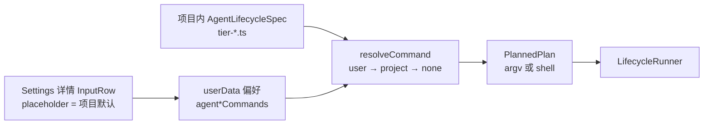
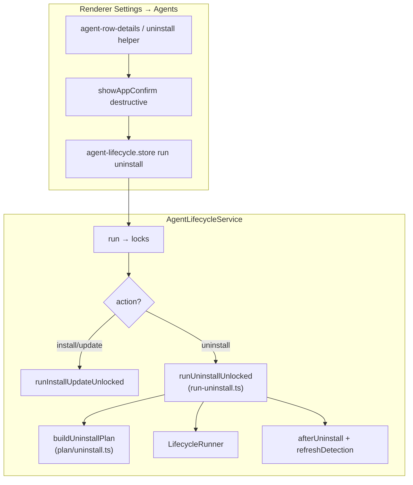
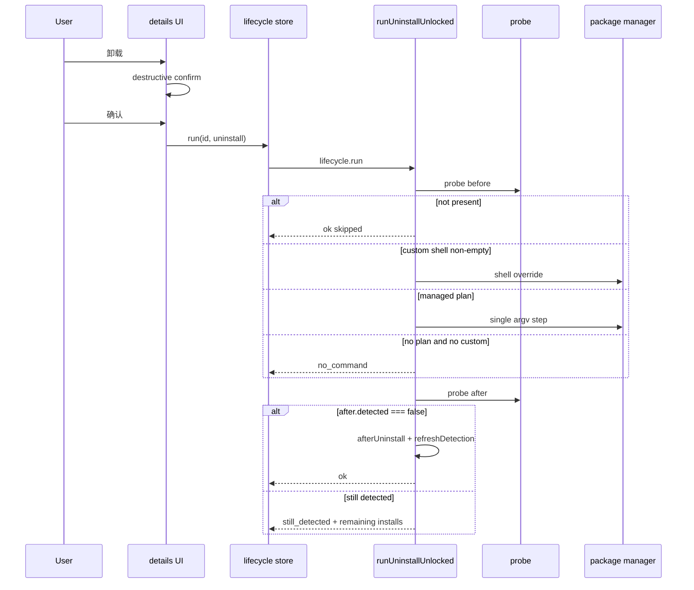

# 智能体 CLI 卸载设计（Settings → Agents）

> 日期：2026-08-06  
> 作者：TBD  
> 状态：**Draft（review-revision-3 · 配置层冻结）**  
> 范围：设置 → 智能体列表中，对机器上已安装的智能体 CLI 提供 **卸载** 能力；并统一 **安装 / 更新 / 卸载** 的命令配置模型  
> 相关：
> - 生命周期管线 `src/main/services/agents/lifecycle/`
> - **项目内默认配置** `src/main/services/agents/lifecycle/specs/`（各 agent 的 install/update/uninstall 通道与默认命令）
> - 契约 `src/shared/contracts/agent/lifecycle.ts` + `preferences.ts`（用户覆盖）
> - 设置 UI `src/renderer/pages/settings/components/agent-row.tsx` / `agent-row-details.tsx`
> - 对比（非本域）：托管插件 `plugin.uninstall`（`src/main/services/managed-plugins/`）

---

## Overview

Pier 在设置 → 智能体中已支持 **安装**、**更新**（`AgentLifecycleService`）以及 **停用**（偏好 `disabledAgentIds`，不删二进制）。用户无法从 Pier 内卸载本机智能体 CLI。

本设计在 **现有 lifecycle 管线** 上扩展 action `"uninstall"`：对 **包管理器可逆安装**（npm / Homebrew / pipx / uv）提供一键卸载；对官方脚本 / 未知 path 来源不自动 `rm`，但允许用户填写自定义卸载命令后运行。默认只卸 **PATH 默认副本** 对应通道；**不删除** 用户配置、凭据与会话历史。

**命令配置原则（产品确认 · review-revision-3）**：

- **安装 / 更新 / 卸载** 三条动作的可执行命令 **一律走配置解析**，禁止业务侧再硬编码一串 shell。
- **默认配置在项目内**（与代码同仓、可 review）：`AgentLifecycleSpec`（`lifecycle/specs/tier-*.ts`）声明各 agent 的通道与默认命令；planner 只解释配置。
- **用户覆盖在偏好里**（`userData`）：`agentInstallCommands` / `agentUpdateCommands` / `agentUninstallCommands`；非空则整段替换默认计划。
- 解析顺序：**用户覆盖 → 项目默认（source-aware）→ 无命令**。

**合入硬约束**：

1. 不得单独合入 action enum 扩展而不接 planner 三元分支 + service 专用卸载路径（防 fall-through 成 update）。
2. 卸载计划必须落在新文件 `plan/uninstall.ts`；service 卸载走 `run-uninstall.ts`（file-size 硬门禁）。
3. 自定义 `agentUninstallCommands` 可在 `canUninstall===false` 时仍启用运行（full only）。
4. install / update / uninstall **同一套**「项目默认 + 用户覆盖」模型；新增 agent 时必须在项目 specs 中补齐默认可配置项，而不是只在 UI 写死。

---

## Background & Motivation

### 现状

| 能力 | 行为 | 落点 |
| --- | --- | --- |
| 安装 / 更新 | `lifecycle.run(agentId, "install" \| "update")` | `service.ts` + `plan/build.ts`（**470 行 / 硬上限 500**） |
| 项目默认命令 | 通道声明 → plan preview 作 placeholder | `lifecycle/specs/tier-*.ts` + `defaults.ts` |
| 用户覆盖命令 | 非空 shell 整段替换 plan | prefs `agentInstallCommands` / `agentUpdateCommands` |
| 探测 | `probe` → `canInstall` / `installs[]` / `isConflict` / `updateOffered` | `probe.ts` + `sources/path-enum.ts` |
| 来源策略 | brew → brew-upgrade；npm 族 → npm-latest；path/wsl → script/self | `plan/source-policy.ts` |
| 停用 | `disabledAgentIds` | preferences + `agent-row.tsx` |
| 卸载 CLI | **无** 项目默认 / 无用户覆盖 / 无 action | — |
| 托管插件卸载 | `plugin.uninstall` 改 index | `managed-plugins/`（**非本域**） |

当前 `planLifecycle` 为 **install vs else→update** 二分；IPC 不经 zod 再校验 action。任何只改 enum 的中间态都会让 `"uninstall"` **误跑更新计划**——这是实现期最高优先级安全问题。

已有 install/update **用户覆盖**与 plan 派生默认，但卸载缺席；且「默认命令属于项目配置」未在规格层写死为三条动作的同一合同，实现时容易把卸载做成另一套旁路。

### 痛点

1. 装得上、升得上、停得了，却卸不掉。
2. 多源安装常见；盲目 `rm` 或不对称通道会留下 PATH 阴影。
3. 「停用」≠「卸载」，产品需分清。
4. 安装 / 更新 / 卸载命令若不统一为「项目默认 + 用户覆盖」，后续每个 agent 都会长出散落硬编码。

---

## Goals & Non-Goals

### Goals

1. 对 **support === full** 且安装来源属于 **可管理包管理通道**（npm 族 / brew / pipx / uv）的智能体，提供一键卸载；**不**承诺官方脚本 / 裸 path 安装的一键卸载（见 [Coverage](#coverage-managed-uninstall)）。
2. Probe 暴露 `canUninstall`、`defaultUninstallCommand`、`uninstallMode`（`managed | none`）；UI 门控与文案一致。
3. 卸载计划 **source-aware**，目标为 PATH 默认副本的 `installs[].source`。
4. **安装 / 更新 / 卸载** 命令统一为两层配置：项目内默认 + 用户偏好覆盖；三者 API / UI / boot 对称。
5. 用户自定义卸载命令（偏好）可启用运行，**即使** managed `canUninstall===false`（full only）。
6. 破坏性确认走 `showAppConfirm({ intent: "destructive" })`；成功 toast；硬失败 `showAppAlert`。
7. 成功后：`refreshDetection` + `afterUninstall`（钩子清理 + disabled/default 卫生）。
8. 成功判定：后置 probe 的 **`after.detected === false`**。若 PM 成功但阴影仍在，用显式产品合同（见 K9 / §6.3），alert 列出剩余 `installs[]`。

### Non-Goals（v1）

| 不做 | 原因 |
| --- | --- |
| 批量「卸载全部」 | 风险高 |
| 删除 `~/.claude` 等配置与会话 | 工厂重置另案 |
| 删除 agent accounts / safeStorage | 账号域独立 |
| official-script / scoop / winget / choco / 未知 path 自动 `rm` | 不可逆 |
| 调用 `plugin.uninstall` | 不同域 |
| 强制 kill 运行中 agent 终端 | 确认提示即可 |
| guided/none 自动卸载 | 无 managed plan |
| 一次勾选卸掉所有 `installs[]` 副本 | v1 单目标 PATH 默认 |
| 远程下发 / 云端改写项目默认命令 | 默认命令跟仓库版本走，不另建 remote config |
| 把项目默认写成用户 userData 再发版覆盖 | 默认在 repo；userData 只存用户覆盖 |

---

## Key Decisions

| # | 决策 | 选择 | 理由 |
| --- | --- | --- | --- |
| K1 | 实现形态 | 扩展 lifecycle；**首合并单元必须含 planner 三元 + service 专用卸载路径** | 防 uninstall→update fall-through |
| K2 | 卸载目标 | 仅 PATH 默认副本（`isPathDefault ?? installs[0]`） | 对齐 update 冲突文案 |
| K3 | 多处安装 | 确认点名路径/来源；v1 不一次卸全部 | 降低误删 |
| K4 | 通道 | npm / brew / pipx / uv 可逆；script/path/scoop/winget → managed 空 | 安全 |
| K5 | support | Service 保持 `support !== "full" → unsupported`（与现 `service.ts` install/update 同门）。`canUninstall` 仅 full+可映射源；**UI 卸载按钮与卸载命令 InputRow 亦要求 `support === "full"`**（见 K18） | 防 guided 行点卸载后硬失败 |
| K6 | 用户数据 | 默认不删配置/凭据/历史 | CLI 卸载 ≠ 重置 |
| K7 | 运行中会话 | 确认文案提示；不硬阻断 | 宽松，与插件类似 |
| K8 | 钩子 | 成功后 best-effort `integration.uninstall()`；不删 `~/.pier/hooks` 运行时；**不依赖** `agentStatusHooks` 偏好 | 对齐 `uninstallAllAgentHooks` 语义 |
| K9 | 多副本结果合同 | PM exit 0 后若 `after.detected === true`：**硬失败** `still_detected`（**非** soft）；alert **必须**列出剩余 installs；行文案区分「默认已移除、仍有其他安装」vs 命令失败 | 诚实；接受「PM 成功仍报失败」的支持成本，避免假成功 |
| K10 | 与停用 | 卸载成功且 gone 后从 `disabledAgentIds` 剔除；default 是该 id 则置 `null`（自动） | 避免幽灵状态 |
| K11 | 用户覆盖 | `agentUninstallCommands`；对 **`support === "full"`** 且 managed 空（path/script）时，**非空 custom 替换计划并允许 run**（不靠 `canUninstall`）。**不**为 guided/none 放开 custom 卸载 | path/script **full** 用户刚需；tier-c 网站型不进 |
| K12 | 批量 | API 可 `runMany` 但不暴露 UI | — |
| K13 | 文案 | 「智能体」；说明不删对话与配置 | Agents.md |
| K14 | 文件拆分 | **强制** `plan/uninstall.ts` + `run-uninstall.ts`；禁止继续涨 `build.ts`/`service.ts` 过 500 | file-size 硬门禁（build.ts 已 470） |
| K15 | `uninstallMode` | v1 仅 **`managed \| none`**（不引入 dead `guided`） | 减契约面 |
| K16 | UI 位置 | v1 **仅展开详情**底部卸载（`agent-row-details` 或薄 helper）；不进行级 chrome | 防误触 + 行文件体积 |
| K17 | Open Q#2 | v1 **不**做「继续卸载新默认」快捷按钮；用户关 alert 后再点卸载即可 | 减范围；合同靠 remaining list |
| K18 | `showUninstall` 门控 | **必须** `probe.support === "full"`，且 `(canUninstall \|\| hasCustom)`；guided 即使有 custom 偏好也不显示按钮（偏好字段可残留，InputRow 不展示） | 与 service `unsupported` 门对齐；避免确认后失败 |
| K19 | 卸载目标字段 | probe **只要**存在 PATH 默认 `defaultInstall`，**始终**写入 `uninstallTargetPath` / `uninstallTargetSource`（与 `canUninstall` 无关） | 自定义 path/script 卸载确认框不得显示「—」 |
| K20 | 命令配置统一 | **install / update / uninstall** 均：`用户偏好 shell` → 否则 **项目内 `AgentLifecycleSpec` 默认** → 否则无命令。禁止第三套硬编码旁路 | 产品确认：全可配置 + 默认在项目中 |
| K21 | 项目默认落点 | 默认在仓内 `src/main/services/agents/lifecycle/specs/`（`types` + `tier-a/b/c`）；**不**写入 userData、**不**靠远程索引 | 可 code review、与 agent 清单同版本 |
| K22 | 默认形态 | 优先 **结构化通道**（npm/brew/…）由 planner 生成 argv；path/script 等无法安全生成时，允许 spec 上声明 **显式 default shell 字符串**（仍属项目配置） | 可逆 PM 用通道；官方 installer 用显式字符串或不提供默认 |

---

## 命令配置模型（项目默认 + 用户覆盖）

三条 lifecycle 动作共用同一解析合同。



### 两层配置

| 层 | 存储 | 内容 | 谁改 | 空值含义 |
| --- | --- | --- | --- | --- |
| **L1 项目默认** | 仓库 `lifecycle/specs/*` | 每 agent 的 `install[]` / `update[]` / `uninstall[]`（及可选 `defaultShellCommands`） | 开发者 PR | 该动作无 Pier 默认计划 |
| **L2 用户覆盖** | preferences / userData | `agentInstallCommands` / `agentUpdateCommands` / `agentUninstallCommands`：`Partial<Record<AgentKind, string>>` | 用户在设置详情 InputRow | **回落到 L1**（不是「禁止运行」） |

### 解析顺序（三条动作同构）

```ts
// Conceptual — implement in service + defaults, not inline in UI
function resolveLifecycleInvocation(
  agentId: AgentKind,
  action: "install" | "update" | "uninstall",
  ctx: { installSource?: string; defaultBinPath?: string }
): PlannedPlan | null {
  const user = getLifecycleCommands()[action][agentId]?.trim();
  if (user) {
    return { steps: [{ kind: "shell", command: user }], preview: user };
  }
  // L1: project defaults — source-aware planner reads AgentLifecycleSpec only
  return planLifecycle(agentId, action, ctx); // null → no_command / can* false
}
```

- **UI placeholder / probe `default*Command`**：永远来自 **L1 项目默认**（plan preview），**不要**把用户覆盖回写进 placeholder。
- **实际 run**：先 L2，再 L1。
- **guided/none**：L1 通常无 managed plan；L2 卸载仍受 K18 限制（full only）。install/update 保持今日行为。

### 项目默认具体长什么样

**唯一所有者**：`src/main/services/agents/lifecycle/specs/`。

1. **结构化通道（主路径）** — 已有 install/update，本设计补 uninstall：

```ts
// specs/types.ts（摘录）
export interface AgentLifecycleSpec {
  readonly agentId: AgentKind;
  readonly support: AgentLifecycleSupport;
  readonly expectedBins: readonly string[];
  readonly install: readonly InstallChannel[];
  readonly update: readonly UpdateChannel[];
  /** 可逆卸载通道；omit → 从 install[] 派生；显式 [] → 声明无 managed 卸载 */
  readonly uninstall?: readonly UninstallChannel[];
  /**
   * 可选：无法由通道安全生成时的项目默认 shell 一行
   * （例如官方 installer 的推荐卸载说明命令；path 源占位）。
   * 仍属 L1，不是用户偏好。
   */
  readonly defaultShellCommands?: {
    readonly install?: string;
    readonly update?: string;
    readonly uninstall?: string;
  };
}
```

2. **派生与显式的优先级（L1 内部）**  
   - 有 source-aware 通道计划 → 用通道 argv（权威）。  
   - 通道计划为空且 `defaultShellCommands[action]` 非空 → 用该 shell 作为项目默认（可出现在 placeholder / 一键 run）。  
   - 都空 → `default*Command = null`，`can* = false`（除非 L2 用户覆盖，且 support 门允许）。

3. **登记纪律**  
   - 新增 `AgentKind` / 改官方安装方式时，**必须**在对应 `tier-*.ts` 更新 install/update/**uninstall**（或显式 `uninstall: []` + 可选 `defaultShellCommands.uninstall`）。  
   - 禁止在 `agent-row` / 随机 service 里写死 `npm uninstall -g …`。  
   - PR 审查检查点：lifecycle 相关改动是否只改了 specs + planner，而不是业务旁路。

### 与现状对齐

| 动作 | L1 今日 | L2 今日 | 本设计 |
| --- | --- | --- | --- |
| install | `install[]` → plan | `agentInstallCommands` | 保持；文档化为 K20 |
| update | `update[]` → plan | `agentUpdateCommands` | 保持；文档化为 K20 |
| uninstall | **无** | **无** | 补 `uninstall[]` 派生/声明 + `defaultShellCommands.uninstall` + `agentUninstallCommands` |

`defaults.ts` 的 `defaultCommandsFor` 扩展为三条，全部只读 L1（+ source），供 probe / InputRow placeholder。

### Boot 接线

`agent-lifecycle-boot.ts`：

```ts
getLifecycleCommands: async () => {
  const prefs = await preferences.read();
  return {
    install: prefs.agentInstallCommands ?? {},
    update: prefs.agentUpdateCommands ?? {},
    uninstall: prefs.agentUninstallCommands ?? {},
  };
};
```

Service **不得**直接读 `process.env` 拼命令；只通过 `getLifecycleCommands`（L2）+ `getAgentLifecycleSpec`（L1）解析。

---

## Coverage（managed uninstall）

**一键卸载仅覆盖 `support === "full"` 且「PATH 默认 source ∈ 可管理集合」的安装。** 官方脚本落盘到 `~/.local/bin` 等时，path-enum 源为 `"path"`，**无** managed 卸载按钮（**full** 智能体仍可填自定义命令）。Tier C `support: "guided"`（如 `rovo` / `openclaude` / `ante`）**永不**显示卸载按钮或卸载命令 InputRow。

### Agent × source 矩阵（预期）

| PATH 默认 source | 计划 | 典型智能体场景 |
| --- | --- | --- |
| `npm` / `nvm` / `fnm` / `volta` / `pnpm` / `yarn` / `bun` | `npm uninstall -g <pkg>` | gemini@npm、codex@npm |
| `brew` | `brew uninstall [--cask] <token>` | claude cask、gemini-cli formula |
| `pipx` | `pipx uninstall <pkg>` | tier 中 pipx 安装者 |
| `uv` | `uv tool uninstall <pkg>` | kimi@uv |
| `path` / `wsl`（脚本装） | **无 managed plan** | claude/codex/cursor 官方 installer |
| `scoop` / `winget` / `choco` / 未知 | **无 managed plan** | Win 侧常见 |

UI 当 `detected && !canUninstall && !hasCustomUninstallCommand`：在行上或详情 **始终** 可见「当前安装方式不支持一键卸载」+ 官网入口（不得只埋在折叠深处无任何提示）。推荐：已检测且 `uninstallMode==="none"` 时，详情展开后固定说明；若详情未展开，**不**强制行级红字（避免噪声），依赖用户进详情——但详情内说明是 **必显**。

内测优先：claude@brew、codex@npm、gemini@npm、kimi@uv；另测 claude@path 确认无误按钮 + 自定义命令可跑。

---

## Proposed Design

### 架构总览



### 数据流（单次卸载）



---

### 1. 契约扩展

文件：`src/shared/contracts/agent/lifecycle.ts`

```ts
export const agentLifecycleActionSchema = z.enum([
  "install",
  "update",
  "uninstall",
]);

/** v1: managed plan available vs not. No "guided" until a real UI path exists. */
export const agentLifecycleUninstallModeSchema = z.enum(["managed", "none"]);

// Probe
canUninstall: z.boolean(), // managed plan for PATH-default source (full only)
defaultUninstallCommand: z.string().nullable().optional(),
uninstallMode: agentLifecycleUninstallModeSchema,
/**
 * PATH-default install path/source for confirm copy.
 * Always set when installs[] has a default entry — even if canUninstall is false
 * (custom uninstall for path/script). Null only when no installs enumerated.
 */
uninstallTargetPath: z.string().nullable().optional(),
uninstallTargetSource: z.string().nullable().optional(),

// Error codes (append)
"not_installed",   // 可选；幂等 skip 可不暴露
"still_detected",  // 硬失败（isLifecycleSoftFailure 不得收录）
```

`progress` / `run` / `runMany` / `ActionResult` 的 `action` 字段共用扩展后 enum。

---

### 2. Spec / Channel 模型（项目默认 L1）

**项目默认配置的唯一落点**：`src/main/services/agents/lifecycle/specs/`（见 K20–K22）。

`specs/types.ts`：

```ts
export type UninstallChannel =
  | { kind: "npm-uninstall"; package: string }
  | { kind: "brew-uninstall"; formula: string; tap?: string; cask?: boolean }
  | { kind: "pipx-uninstall"; package: string }
  | { kind: "uv-uninstall"; package: string };

export interface AgentLifecycleSpec {
  // … existing fields …
  /** Optional override; omit → derive from install[]; explicit [] → opt-out. */
  readonly uninstall?: readonly UninstallChannel[];
  /**
   * Project-default shell one-liners when channel plans are empty or for docs/placeholder.
   * Not user preferences — ship in repo with the agent spec.
   */
  readonly defaultShellCommands?: {
    readonly install?: string;
    readonly update?: string;
    readonly uninstall?: string;
  };
}
```

派生规则：从 `install[]` 映射 npm/brew/pipx/uv；**不**映射 official-script。  
通道计划为空时回退 `defaultShellCommands[action]`（仍是 L1）。  
**任何** agent 的默认可执行命令都必须能从该 spec 追溯到，禁止 planner 外硬编码包名/公式。

---

### 3. Source policy

`plan/source-policy.ts` 增加 `filterUninstallChannels`，复用 `isNpmFamilySource` / brew / pipx / uv 分支；path-like / scoop / winget / choco / 未知 → `[]`。

---

### 4. Planner（强制新文件）

#### 4.1 文件布局（硬要求）

| 文件 | 职责 | 行数约束 |
| --- | --- | --- |
| **`plan/uninstall.ts`（新建）** | `buildUninstallPlan`、uninstall argv 步骤、host/platform null 规则、WSL 内层 posix 构建辅助 | 主逻辑 |
| `plan/build.ts` | **仅**把 `planLifecycle` 改为三元分支，调用 `buildUninstallPlan`；**禁止**在此堆卸载步骤实现 | 保持 ≤500（当前 470） |
| `plan.ts` | re-export `buildUninstallPlan` / `buildUninstallCommand` | — |
| `plan/source-policy.ts` | `filterUninstallChannels` | — |

`pnpm check:file-size` 为 **PR 合并门禁**，非可选建议。

#### 4.2 `buildUninstallPlan`

- **单步**，无 multi-channel `||` 回退。
- Host 规则对齐 `installChannelStep`：
  - `brew-uninstall`：`host === "win"` → null；`cask === true && platform !== "darwin"` → null。
  - npm/pipx/uv：全 host 可计划（env 缺 PM 时 runner 报 `package_manager_missing`）。
- Brew 包名：`brewPackageTokenFromBinPath(defaultBinPath)` 优先于 spec formula（对齐 upgrade）。
- **禁止**把 `binPath` / `uninstallTargetPath` 拼进 argv；路径只用于 token 解析与 UI。

#### 4.3 `planLifecycle` 三元 + WSL 第三臂

**必须**替换现有二分，伪代码：

```ts
export function planLifecycle(spec, action, options = {}): PlannedPlan | null {
  const host = platformKind();
  let plan: PlannedPlan | null;
  if (action === "install") {
    plan = buildInstallPlan(spec, host, { installSource: options.installSource });
  } else if (action === "uninstall") {
    plan = buildUninstallPlan(spec, {
      host,
      installSource: options.installSource,
      defaultBinPath: options.defaultBinPath,
    });
  } else {
    // update only
    plan = buildUpdatePlan(spec, { host, defaultBinPath: options.defaultBinPath, installSource: options.installSource });
  }
  if (!plan) return null;

  const distro =
    options.wslDistro ??
    (options.defaultBinPath ? wslDistroFromPath(options.defaultBinPath) : null);

  if (distro && host === "win") {
    // WSL third arm — rebuild posix plan for the same action
    let posixPlan: PlannedPlan | null;
    if (action === "install") {
      posixPlan = buildInstallPlan(spec, "posix", { installSource: options.installSource });
    } else if (action === "uninstall") {
      posixPlan = buildUninstallPlan(spec, {
        host: "posix",
        installSource: options.installSource,
        defaultBinPath: null, // self-bin not used for PM uninstall
      });
    } else {
      posixPlan = buildUpdatePlan(spec, {
        host: "posix",
        defaultBinPath: null,
        defaultBinName: spec.expectedBins[0],
        installSource: options.installSource,
      });
    }
    if (!posixPlan) return plan;
    const wslStep = { kind: "wsl" as const, distro, inner: posixPlan.steps };
    return { steps: [wslStep], preview: previewPlan([wslStep]) };
  }
  return plan;
}
```

**单测必含**：`host: win` + `wslDistro` + source `npm` → 外层 `kind: "wsl"`，内层 npm uninstall。

#### 4.4 `defaults.ts`

`defaultCommandsFor` 增加 `defaultUninstallCommand`（managed plan preview；自定义覆盖不在 probe 默认里展开，由 prefs 另存）。

---

### 5. Probe

```ts
const uninstallChannels = resolveUninstallChannels(spec); // derive or explicit
const defaultInstall = installs.find((i) => i.isPathDefault) ?? installs[0];
const source = defaultInstall?.source ?? null;
const filtered = filterUninstallChannels(uninstallChannels, source);
const uninstallPlan =
  spec.support === "full" && filtered.length > 0
    ? buildUninstallPlan(spec, {
        host: opts.host,
        installSource: source,
        defaultBinPath: defaultInstall?.path,
      })
    : null;

const uninstallMode = uninstallPlan ? "managed" : "none";
// canUninstall: managed + 已安装（含 broken-only，编码在 detected 内）
const canUninstall =
  uninstallMode === "managed" &&
  (/* returned */ detectedField) && // see §5.1
  uninstallPlan !== null;

// K19: target fields ALWAYS from PATH-default install when present —
// independent of canUninstall / uninstallMode. Custom path/script uninstall
// confirm must show real path/source, not "—".
const uninstallTargetPath = defaultInstall?.path ?? null;
const uninstallTargetSource = defaultInstall?.source ?? null;
// defaultUninstallCommand: only when managed plan exists (else null)
```

Probe 返回对象 **必须**包含上述 `uninstallTargetPath` / `uninstallTargetSource`（无 install 时为 `null`）。实现者 **禁止**写成「仅 `canUninstall` 时才填 target」。

**单测**：path 源已检测 full agent → `canUninstall === false` 且 `uninstallTargetPath`/`Source` 非空。

#### 5.1 与 `detected` 字段语义对齐

- 本地 `hasRunnable`；**返回** `detected: hasRunnable || installedButBroken`（现状）。
- **成功卸载**：后置 `after.detected === false`（已蕴含无 runnable、无 broken-only 残留）。
- 不写冗余的 `!after.detected && !after.installedButBroken`。

#### 5.2 与 `canInstall` 不对称（有意）

- 今日 `canInstall`：`buildInstallPlan(spec, host)` **不**按 installSource 过滤。
- `canUninstall`：**必须** source-filter（卸错通道代价更高）。
- 实现者 **不得** 为对称去改 `canInstall`。

#### 5.3 后置 probe 是否 deep

`runUninstallUnlocked` 内后置 probe 传 `deep: true`（与现 install 后置一致）。Renderer `probe([id], { force, checkLatest })` **不**传 deep，但 `support === "full"` 时 `shouldEnumerate` 已为 true，多 path 仍会枚举——设计依赖「service 内 deep 后置」做成功判定；UI 刷新足够。

---

### 6. Service：专用 `runUninstallUnlocked`（强制）

#### 6.1 结构切分（硬要求）

`service.ts`（当前 **422** 行）**不得**在 `runUnlocked` 内再嵌一整段卸载后置逻辑。

```ts
// service.ts
async function runUnlocked(agentId, action, runId, signal) {
  if (action === "uninstall") {
    return runUninstallUnlocked({ agentId, runId, signal, /* deps */ });
  }
  // existing install/update path only — never treat uninstall as update
  ...
}
```

新建 **`run-uninstall.ts`**（或 `lifecycle/run-uninstall.ts`）导出 `runUninstallUnlocked`。  
`pnpm check:file-size`：`service.ts` 与 `run-uninstall.ts` 均须 < 500。

#### 6.2 控制流（完整，禁止与 install 共享后置）

```
runUninstallUnlocked:
  1. support !== "full" → fail unsupported
  2. resolveEnv → env_unavailable
  3. before = probeOne(deep, !checkLatest)
  4. if !before.detected → { ok: true, skipped: true, action: uninstall }  // 幂等
  5. custom = agentUninstallCommands[agentId]?.trim()
     planned =
       custom ? { steps: [{ kind: "shell", command: custom }], preview: custom }
       : planLifecycle(spec, "uninstall", { installSource, defaultBinPath, wslDistro })
  6. if !planned → fail no_command
     // 注意：此处 **没有** 「!canUninstall → no_command」优先门；
     // managed 空 + 无 custom 才 no_command。canUninstall 只服务默认 UI。
  7. runner.run(planned)  // 单步；无 version-stuck 续跑；无 multi-channel continue
     cancel/timeout/package_manager_missing/command_failed 同现有映射
  8. after = probeOne(deep)
  9. if after.detected === true:
       return fail still_detected, {
         errorDetail: formatRemainingInstalls(after.installs), // 必含 path+source 多行
         commandPreview: planned.preview,
       }
       // 硬失败；softFailure 不得设置
  10. refreshDetection?.()
  11. afterUninstall?.(agentId)  // 绝不是 afterInstall
  12. return { ok: true, action: uninstall, runId, commandPreview }
```

**明确禁止**在卸载路径执行：

- `not_found_after_install` 成功门（那是 install 语义）
- `afterInstall`
- `version_unchanged` / self-noop 循环
- install 的 `already_installed` skip（卸载用 step 4 skipped）

#### 6.3 多副本 / `still_detected` 产品合同（冻结）

| 情况 | 结果 | 用户感知 |
| --- | --- | --- |
| PM 失败 | `command_failed` 等 | 「卸载失败」+ stderr |
| PM 成功且 `after.detected === false` | `ok` | toast 成功 |
| PM 成功且默认源已去、**其他 installs 仍在** | **`still_detected` 硬失败** | 行红字：「默认位置已处理，仍检测到其他安装」；`showAppAlert` body **必须**列出 `after.installs[]` 每行 `[source] path (version?)` |
| 未安装 | `ok` + `skipped` | toast「未安装，无需卸载」 |

**不**采用 partial-success soft toast 作为 v1 默认（见 Alternative F：评估后否决，避免「已卸载」与仍可启动并存）。

Open Question #2：**不**在 v1 alert 加「继续卸载」按钮；用户可再次打开卸载（新 PATH 默认）重复流程（K17）。

#### 6.4 自定义命令与 UI 门控（K18 冻结）

Service 第一步仍为 `support !== "full" → unsupported`（与今日 `runUnlocked` 对 install/update 相同，见 `service.ts`）。因此 UI **不得**在 guided 行展示可点卸载。

```ts
// Renderer eligibility — must stay aligned with service support gate
const hasCustom =
  (agentUninstallCommands[agentId] ?? "").trim().length > 0;
const showUninstall =
  !isBusy &&
  isDetected &&
  probe?.support === "full" && // required: tier-c guided never shows
  (probe.canUninstall === true || hasCustom);
```

- **卸载命令 InputRow**（`agentUninstallCommands`）：仅当 `probe.support === "full"` 时渲染；guided/none **不展示**（即使 preferences 里残留旧键，也不提供编辑入口）。
- K11 的 custom 覆盖 **只**服务 full + path/script 等 managed 空场景；**不**放宽 main 的 `support !== "full"` 门。

Service 信任模型：自定义 shell **等同** install/update 覆盖（本机偏好，非远程插件输入）。

#### 6.5 LifecycleCommandOverrides（仅 L2 用户层）

```ts
export interface LifecycleCommandOverrides {
  install: Partial<Record<AgentKind, string>>;
  update: Partial<Record<AgentKind, string>>;
  uninstall: Partial<Record<AgentKind, string>>;
}
```

Boot：`getLifecycleCommands` 对称读三个 prefs 字段。  
**L1 不经过此接口**——service 始终 `getAgentLifecycleSpec(agentId)` + planner / `defaultShellCommands`。

install / update 的现有覆盖路径必须与 uninstall **共用同一 resolve 辅助**（可放在 `run-resolve.ts` 或 `run-uninstall.ts` 旁的小模块），避免三条动作三套 if。

---

### 7. afterUninstall 与偏好清理

`agent-lifecycle-boot.ts`：

```ts
afterUninstall: async (agentId) => {
  // Hooks: 对齐 uninstallAllAgentHooks 注释语义——
  // 不设 detect 门控；不删除 ~/.pier/hooks/vN 共享运行时。
  // 独立于 agentStatusHooks 偏好（幂等卸载配置条目）。
  // Windows：多数 integration 无配置目标时 no-op，可接受。
  try {
    const { getAgentHookIntegration } = await import(".../integrations/registry.ts");
    const integration = getAgentHookIntegration(agentId);
    if (integration) await integration.uninstall();
  } catch (err) {
    console.warn(`[agent-lifecycle] afterUninstall hooks failed for ${agentId}`, err);
  }

  const prefs = await preferences.read();
  const disabled = prefs.disabledAgentIds.filter((id) => id !== agentId);
  let defaultAgentId = prefs.defaultAgentId;
  if (defaultAgentId === agentId) defaultAgentId = null;
  if (
    disabled.length !== prefs.disabledAgentIds.length ||
    defaultAgentId !== prefs.defaultAgentId
  ) {
    await preferences.update({ disabledAgentIds: disabled, defaultAgentId });
  }
  // 保留 agentUninstallCommands / install/update 覆盖，便于重装
},
```

可选 follow-up（非本功能阻塞）：修正 `integrations/types.ts` 中「detect false 时 uninstall 跳过」的过时注释，以 `uninstallAllAgentHooks` 为准。

**PR2 文件清单必须包含**：

- `src/shared/contracts/preferences.ts`（schema）
- `src/main/state/preferences.ts`（defaults `agentUninstallCommands: {}`）
- `src/main/services/preferences-service.ts`（**`PATCHABLE_KEYS` 加入 `agentUninstallCommands`**——漏加则 UI 写入被静默剥离）
- renderer `agent-preferences.store.ts`（字段 + `setAgentUninstallCommands` + hydrate/`snapshotFrom`）

---

### 8. 运行中会话

v1 不查 foreground-activity。确认 body 固定含运行中可能中断 + 不删配置/对话。P1 可增强活跃会话计数。

---

### 9. UI

#### 9.1 位置（冻结 K16）

- **仅** `agent-row-details.tsx`（或同目录 `agent-row-uninstall.tsx` 薄组件）底部「卸载」。
- **不**进行级 `ItemActions`，避免 `agent-row.tsx`（~399 行）再涨，并降低误触。
- Open Question #1：**已关闭** → details-only v1。

#### 9.2 可见性

- `showUninstall`：见 §6.4（**含** `support === "full"`）。
- **full** 且 `detected && uninstallMode==="none" && !hasCustom`：详情内 **必显** unsupported 说明 + 官网（`homepageUrl`）。
- **guided / none**：不显示卸载按钮、不显示卸载命令 InputRow、不显示「不支持一键卸载」卸载专用说明（避免暗示可走卸载路径）；官网入口可仍按现有 missing 行逻辑展示。

#### 9.3 确认

确认插值使用 probe 的 target 字段（K19：有 install 时必填，含 custom path/script 场景）：

```ts
await showAppConfirm({
  title: t("settings.agents.action.uninstallConfirmTitle"),
  body: t("settings.agents.action.uninstallConfirmBody", {
    name: displayName,
    // Prefer probe targets; "—" only when installs[] truly empty (should be rare if showUninstall)
    path: probe?.uninstallTargetPath ?? "—",
    source: probe?.uninstallTargetSource ?? "—",
  }),
  confirmLabel: t("settings.agents.action.uninstallConfirmContinue"),
  intent: "destructive",
  // 禁止 size
});
```

冲突时 body 追加「只会移除当前默认使用的那一处」。

#### 9.4 反馈

| 结果 | 反馈 |
| --- | --- |
| ok && !skipped | `toast.success` 已卸载 |
| ok && skipped | `toast.success` 未安装 |
| busy / cancelled | toast 短错误（soft） |
| `still_detected` | 行红字（专用文案）+ `showAppAlert`（title 短 + body 含剩余 installs 列表） |
| command_failed 等 | 行红字 + 有 detail 时 alert |

**注意**：今日 install/update 成功多依赖自然 UI（列表状态变化）而不 toast；**卸载必须 toast**，因成功后行从「已检测」变为「未安装」，用户需要明确完成信号（操作反馈规范：弱 UI 变化场景）。

#### 9.5 详情命令行（三条对称）

| InputRow | 偏好键（L2） | Placeholder（L1 only） |
| --- | --- | --- |
| 安装命令 | `agentInstallCommands` | `probe.defaultInstallCommand` |
| 更新命令 | `agentUpdateCommands` | `probe.defaultUpdateCommand` |
| 卸载命令 | `agentUninstallCommands` | `probe.defaultUninstallCommand` |

- Placeholder **只**显示项目默认（通道 preview 或 `defaultShellCommands`）；用户已填覆盖时输入框显示覆盖值，placeholder 仍可作清空后的回落提示。  
- 文案统一：「留空则使用 Pier 默认…」——默认来自**项目配置**，不是「空=不执行」。  
- 卸载 InputRow 仍受 K18：仅 `support === "full"` 展示。

---

### 10. Preferences（仅用户覆盖 L2）

见 §7 PR2 清单。Schema 与 install/update **同形**：

```ts
// preferences.ts — 三者并列
agentInstallCommands: z.partialRecord(agentKindSchema, z.string()).default({}),
agentUpdateCommands: z.partialRecord(agentKindSchema, z.string()).default({}),
agentUninstallCommands: z.partialRecord(agentKindSchema, z.string()).default({}),
```

- userData 默认均为 `{}`——**不**把项目默认拷进 preferences（避免发版后陈旧副本压过仓库更新）。  
- `PATCHABLE_KEYS` / store hydrate 三条齐全。

---

### 11. i18n（中英同步）

| Key | zh-CN | en |
| --- | --- | --- |
| `action.uninstall` | 卸载 | Uninstall |
| `action.uninstallBusy` | 卸载中 | Uninstalling |
| `action.uninstallFailed` | 无法卸载智能体 | Couldn't uninstall agent |
| `action.rowUninstallFailed` | 卸载失败 | Uninstall failed |
| `action.rowUninstallPartial` | 默认位置已处理，仍检测到其他安装 | Default install removed; others still detected |
| `action.uninstallConfirmTitle` | 卸载此智能体？ | Uninstall this agent? |
| `action.uninstallConfirmBody` | 将从本机移除「{{name}}」的命令行工具（{{source}}：{{path}}）。不会删除对话记录与本地配置。若它仍在终端中运行，当前会话可能无法继续。 | … |
| `action.uninstallConfirmContinue` | 卸载 | Uninstall |
| `action.uninstallSuccess` | 已卸载 {{name}} | Uninstalled {{name}} |
| `action.uninstallSkipped` | 未安装，无需卸载 | Not installed |
| `action.uninstallUnsupported` | 当前安装方式不支持一键卸载。可在下方填写自定义卸载命令，或打开官网查看说明。 | This install method can't be uninstalled automatically. Add a custom command below, or open the website. |
| `lifecycle.errors.still_detected` | 卸载命令已执行，但仍检测到该智能体。 | Uninstall finished, but the agent is still detected. |
| `lifecycle.errors.not_installed` | 未检测到该智能体。 | Agent not installed. |
| `row.uninstallCommand` / Desc / Placeholder | 与 install/update 对称 | … |

`still_detected` 的 alert body **追加** remaining installs 技术列表（path 等宽可接受；主 title 仍用产品句）。

---

### 12. 与 managed plugin uninstall 边界

| | Agent CLI | plugin.uninstall |
| --- | --- | --- |
| 对象 | PATH 上第三方 CLI | userData 插件包 |
| 重启 | 否 | 可能 |

禁止交叉调用。

---

### 13. Windows / WSL

| 场景 | 行为 |
| --- | --- |
| mac brew cask | `brew uninstall --cask` |
| Linux brew | formula uninstall |
| Win npm 全局 | host npm uninstall |
| Win + WSL bin path | **WSL 第三臂** posix uninstall（§4.3） |
| scoop/winget | canUninstall false；可 custom |

---

### 14. Security

- 无 official-script URL 执行。
- Argv 固定子命令 + spec 包名；**永不**把 `uninstallTargetPath`/`binPath` 传入删除类 argv。
- Brew token 仅从 realpath 解析 Cellar/Caskroom 段。
- 用户 shell 覆盖：与 install/update 同信任，非沙箱。

---

### 15. Observability

- afterUninstall warn。
- 可选：`still_detected` 时 `console.warn` 剩余 source 列表（支持排障）。
- 无远程 feature flag；回滚 = 隐藏 UI + 保留 main 安全分支。

---

## API / Interface Changes — 消费者清单（grep 驱动）

实现时逐项改齐，遗漏即坏路径：

### 契约 / 共享

| 文件 | 变更 |
| --- | --- |
| `src/shared/contracts/agent/lifecycle.ts` | action enum、probe 字段、error codes、uninstallMode |
| `src/shared/contracts/preferences.ts` | `agentUninstallCommands` |

### Main lifecycle

| 文件 | 变更 |
| --- | --- |
| `specs/types.ts` | `UninstallChannel`、可选 `uninstall?` |
| `plan/uninstall.ts` | **新建** `buildUninstallPlan` |
| `plan/build.ts` | `planLifecycle` 三元 + WSL 第三臂（薄） |
| `plan/source-policy.ts` | `filterUninstallChannels` |
| `plan.ts` | re-export uninstall builders |
| `defaults.ts` | `defaultUninstallCommand` |
| `probe.ts` | canUninstall / mode / targets |
| `run-uninstall.ts` | **新建** `runUninstallUnlocked` |
| `service.ts` | 早期分支；overrides 三键；`afterUninstall` option |
| `agent-lifecycle-boot.ts` | wire afterUninstall + getLifecycleCommands.uninstall |

### Preferences 主路径

| 文件 | 变更 |
| --- | --- |
| `main/state/preferences.ts` | default `{}` |
| `main/services/preferences-service.ts` | **`PATCHABLE_KEYS`** 含 `agentUninstallCommands` |

### IPC / Preload

| 文件 | 变更 |
| --- | --- |
| `main/ipc/agents.ts` | 类型随 action（无新 channel）；无需 zod 也可因 service 分支安全 |
| `preload/api-types.ts` | `AgentLifecycleAction` 已从 shared 导入则自动 |

### Renderer

| 文件 | 变更 |
| --- | --- |
| `stores/agent-lifecycle.store.ts` | job.action 已为 union；成功卸载仍 re-probe |
| `stores/agent-preferences.store.ts` | 字段 + setter + hydrate |
| `pages/settings/components/agent-lifecycle-format.ts` | `KNOWN_ERROR_CODES`；`lifecycleBusyStatusText` 三分支；`formatLifecycleRowFailure` uninstall / partial；**`still_detected` 不得进 soft** |
| `agent-row-details.tsx` 或 `agent-row-uninstall.tsx` | 按钮 + confirm + 调用 store.run |
| `agent-row.tsx` | 尽量不改；若需 busy 文案已由 format 覆盖 job.action |
| `i18n/locales/{zh-CN,en}/settings-agents.ts` | 上表 keys |

### 测试（非可选）

| 文件 | 变更 |
| --- | --- |
| `tests/unit/main/agents/lifecycle/plan*.ts` | uninstall matrix + WSL |
| `service-runner` 或新建 | runUninstall 成功 / still_detected / skip / custom shell |
| user-copy governance | 新文案无禁用实现词 |

---

## Data Model Changes

- preferences JSON：`agentUninstallCommands` 默认 `{}`，zod default 兼容，无迁移脚本。
- 不修改用户 agent 配置目录、transcript、插件 index。

---

## Alternatives Considered

### A. 独立 UninstallService — 拒绝  
复制 env/lock/runner；K1。

### B. 一次卸所有 installs[] — 拒绝 v1  
跨 PM 风险；K3。

### C. official-script 路径 `rm` — 拒绝  
误删；Coverage 已量化。

### D. 工厂重置配置 — 拒绝  
另案。

### E. 仅展示命令不执行 — 拒绝  
managed 源必须可执行；custom 补 path 源。

### F. PM 成功但阴影仍在 → partial success（soft + 成功 toast）  
- **优点**：不「冤枉」已成功的 brew uninstall。  
- **缺点**：列表仍「已检测」，用户以为卸干净却能启动；与操作反馈「完成信号」冲突。  
- **结论**：**拒绝**；采用 K9 硬 `still_detected` + 剩余列表 + 专用行文案（「默认已处理，仍有其他」）。未来若要 soft，需独立 errorCode/result 字段与 UX 评审。

### G. 未来 `self` 卸载 CLI（如 `claude uninstall`）  
P2 Open Question；v1 不进 UninstallChannel。

---

## Security & Privacy

见 §14。威胁模型：错误包名、用户 shell、不删密钥。缓解：spec 白名单、token 解析、非目标目录。

---

## Observability

warn afterUninstall；可选 still_detected 剩余源日志；进度广播复用。

---

## Rollout Plan

1. **PR1** 即含安全 planner + service 分支（或完整 runUninstall）+ matrix 单测 + file-size 绿。  
2. **PR2** 完整语义 + prefs + afterUninstall。  
3. **PR3** format/i18n/store。  
4. **PR4** UI。  
5. 内测 Coverage 矩阵四源 + path 负例。  
6. 回滚：UI 隐藏；main 卸载路径保留无害。

### 风险

| 风险 | 严重度 | 缓解 |
| --- | --- | --- |
| enum 先合入导致误 update | **Critical** | PR1 强制三元+专用路径；CI 单测 |
| `build.ts`/`service.ts` 超 500 行 | **High** | 强制 `uninstall.ts` + `run-uninstall.ts` |
| 自定义命令被 canUninstall 门死 | High | §6.4 顺序 |
| still_detected 被当成完全失败抱怨 | Med | 专用文案 + 列表 |
| PATCHABLE_KEYS 漏键 | High | §7 清单 |
| 覆盖率被高估 | Med | Coverage 节 + Goal #1 措辞 |

---

## Open Questions

1. ~~详情 vs 行级~~ → **冻结 details-only（K16）**。  
2. ~~alert「继续卸载」~~ → **v1 不做（K17）**。  
3. 各 CLI 官方 `uninstall` 子命令调研 → **P2**（Alternative G）。  
4. 确认框动态会话数 → **P1**。  
5. guided 外链卸载说明 → 非阻塞；v1 用 unsupported 文案 + 官网即可。

---

## Testing Plan

| 层 | 覆盖（合入 PR1/PR2，**非**可选 PR5） |
| --- | --- |
| plan matrix | `claude@brew` → brew uninstall cask；`gemini@npm` → npm uninstall -g；`kimi@uv` → uv tool uninstall；`claude@path` → null |
| WSL | win host + wslDistro + npm → kind wsl |
| host null | win + brew-uninstall → null plan |
| probe targets (K19) | path 源 full + detected → `canUninstall===false` 且 `uninstallTargetPath`/`Source` 等于 defaultInstall |
| service | ok gone；still_detected + errorDetail 含 path；skipped；custom shell 在 canUninstall false 时 ok（full only）；`support!==full` → unsupported；永不 afterInstall |
| prefs | PATCHABLE + store roundtrip |
| format | still_detected 非 soft；busy uninstall 文案 |
| UI gate (K18) | guided + hasCustom → `showUninstall===false`；full + hasCustom + path → true |
| file-size | `pnpm check:file-size` 每 PR 绿 |

---

## References

- `plan/build.ts` planLifecycle 二分（待改三元）  
- `service.ts` runUnlocked install-centric 后置  
- `source-policy.ts` / `path-enum.ts` / `brew-token.ts`  
- `uninstallAllAgentHooks`（`integrations/registry.ts`）规范语义  
- `preferences-service.ts` `PATCHABLE_KEYS`  
- Agents.md 弹窗与反馈治理  

---

## PR Plan

### PR1 — 契约 + 项目默认（L1）卸载通道 + **安全 service 入口** + matrix 单测

- **Title**: `feat(agent-lifecycle): uninstall plan, contract fields, and safe run entry`
- **必须交付**:
  1. 契约：action / probe / errors / uninstallMode `managed|none`
  2. **项目默认 L1**：`UninstallChannel` + derive + `filterUninstallChannels`；`AgentLifecycleSpec.uninstall?` + 可选 `defaultShellCommands`；`tier-*` 按 agent 补齐（或显式 `uninstall: []`）
  3. **`plan/uninstall.ts`** + `planLifecycle` **三元** + **WSL 第三臂**；通道空时回退 `defaultShellCommands.uninstall`
  4. `plan.ts` re-export；`defaults.defaultCommandsFor` 三条对称；`probe` 字段
  5. **`run-uninstall.ts` 最小可运行路径**（skip / L1 plan / runner / after.detected）且 **绝不可能** fall-through 到 update  
  6. Matrix + WSL + path→null **单测**；断言「包名/公式来自 spec 而非魔法字符串散落」
  7. **`pnpm check:file-size` 绿**
- **Files**: lifecycle contract；`specs/types.ts` + `tier-*.ts`；`plan/*`；`probe.ts`；`defaults.ts`；`run-uninstall.ts`；`service.ts` 薄分支；tests under `tests/unit/main/agents/lifecycle/`
- **Deps**: 无
- **禁止**: 只改 enum/types 的中间 merge；在 UI/service 硬编码某 agent 卸载命令

### PR2 — afterUninstall、用户覆盖（L2）闭环

- **Title**: `feat(agent-lifecycle): afterUninstall hygiene and uninstall command overrides`
- **必须交付**:
  - `LifecycleCommandOverrides` 三字段 + boot 对称读 prefs
  - **统一 resolve**：user shell → project plan（install/update 重构对齐 uninstall，避免双路径）
  - `agentUninstallCommands` schema + **defaults `{}` + PATCHABLE_KEYS** + preferences store
  - afterUninstall 钩子 + disabled/default 清理
  - still_detected errorDetail 格式化 remaining installs（若 PR1 未完）
  - service 单测：L2 覆盖优先于 L1；custom shell when `canUninstall` false；afterUninstall 调用；**不**调用 afterInstall
  - file-size 绿
- **Deps**: PR1

### PR3 — format / i18n / store 类型消费

- **Title**: `feat(settings-agents): uninstall i18n, busy/error formatting`
- **Files**: `agent-lifecycle-format.ts`；locales zh/en；lifecycle store 若需；preferences store setter（若 PR2 未含 renderer）
- **Deps**: PR1 契约；可与 PR2 部分并行
- **Acceptance**: `still_detected` 非 soft；三路 busy 文案；row failure 含 uninstall / partial

### PR4 — UI 详情卸载 + 三命令 InputRow 对称

- **Title**: `feat(settings-agents): uninstall control in agent details`
- **Files**: `agent-row-details.tsx` 和/或 `agent-row-uninstall.tsx`；component 轻测可选
- **Deps**: PR2 + PR3
- **Acceptance**:
  - destructive confirm（path/source 来自 K19 targets，非「—」）
  - `showUninstall`：`support==="full"` 且 (canUninstall \|\| L2 custom)
  - guided 无卸载按钮/无卸载 InputRow
  - **安装 / 更新 / 卸载** 三个 InputRow：placeholder = L1 `default*Command`；留空回落项目默认
  - 成功 toast；still_detected alert 列 remaining；**无**全部卸载；file-size 绿

**合并顺序**：PR1 → PR2 → PR3 → PR4。  
~~PR5~~ **取消**；matrix / still_detected 测试并入 PR1/PR2。

每 PR：`pnpm check:file-size` + 触及单测 + typecheck 相关路径通过后再合。

---

## 修订记录

| 版本 | 日期 | 说明 |
| --- | --- | --- |
| review-revision-2 | 2026-08-06 | 评审收敛：安全入口、file-size、still_detected、K18/K19 |
| review-revision-3 | 2026-08-06 | 产品确认：install/update/uninstall **全配置化**；**默认在项目 specs**；用户偏好仅覆盖（K20–K22） |
