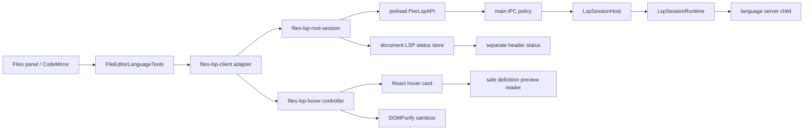
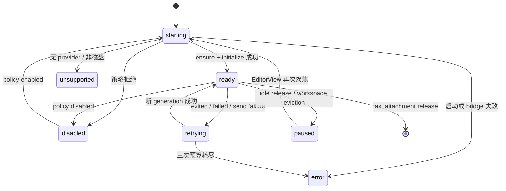

# 工作区语言服务金标准优化计划

**日期**：2026-07-29  
**状态**：待实施  
**拟议落点**：`docs/design/workspace-lsp-policy.md`  
**范围**：Files 编辑器语言服务状态、悬浮信息、定义预览、异常恢复、协议防护与进程关闭

> 本计划一次性交付完整能力，不拆成两个产品阶段。实现可按任务顺序推进，但验收只接受端到端全部完成的终态。

## 1. 目标与完成定义

最终交付必须同时满足：

1. 语言模式、文档保存状态、语言服务运行状态互不混用。
2. TypeScript、Python、Go、Rust 继续使用现有 provider；editor 与 LanguageTools 保持独立 JSON-RPC 连接。
3. 普通悬停展示签名和文档；`Cmd/Ctrl + 悬停` 立即查询定义并按服务器顺序展示多目标与 7 行源码预览，超出安全展示上限时明确告知截断。
4. `Mod+I` 和命令面板都能打开可聚焦的“符号信息”卡片；`Tab` 可访问定义目标，`Esc` 关闭并把焦点还给编辑器。
5. 所有 LSP Markdown 在写入 DOM 前统一清理；脚本、事件属性、主动内容和危险 URL 不可进入 renderer。
6. 服务端输入具备严格 header、body、未读缓冲区和 UTF-8 上限；协议违规只终止对应会话。
7. 异常退出具备共享、有限、代际安全的自动重连；同一 root 多个编辑器不得形成重连风暴。
8. 正常关闭遵循 `didClose -> shutdown response -> exit -> stdin end`，超时后才执行 `SIGTERM -> SIGKILL`。
9. 应用退出在销毁窗口前等待全部语言服务关闭；不遗留语言服务器子进程。
10. 真实 Electron 场景可观察 ready、disabled、unsupported、paused、retrying、error，并能证明真实 TypeScript 服务崩溃后只重启一次。

### 1.1 研究基准

- [VS Code Language Server Extension Guide](https://code.visualstudio.com/api/language-extensions/language-server-extension-guide) 与 [Default Settings](https://code.visualstudio.com/docs/getstarted/settings#_default-settings)：借鉴语言客户端/服务器边界、状态可见性，以及 wrap、tab size、EOL、language mode 的命名和作用域；不复制完整 IDE status bar。
- [LSP 3.17 specification](https://microsoft.github.io/language-server-protocol/specifications/lsp/3.17/specification/)：以 `Content-Length` 字节帧、`shutdown` request、`exit` notification 和 MarkupContent/MarkedString 联合作为协议依据。
- [JetBrains Quick Documentation](https://www.jetbrains.com/help/idea/viewing-reference-information.html) 与 [Code Inspections](https://www.jetbrains.com/help/idea/code-inspection.html)：借鉴“符号文档/定义位置/问题状态分层”，但保持 Pier 紧凑、非模态、单卡交互。
- [Zed Configuring Languages](https://zed.dev/docs/configuring-languages)：借鉴 workspace 语言服务开关与按语言覆盖的层级，不引入 provider picker。
- 当前锁定的 [`@codemirror/lsp-client`](https://github.com/FurqanSoftware/codemirror-languageserver) 源码：保留 completion/signature 等能力，显式替换其 hover UI；遵循 CodeMirror `TooltipView` 生命周期，不 patch `node_modules`。

这些产品只作为交互和策略基准。具体 root identity、双连接模型、panel action、主题 token、通知与插件边界以 Pier 现有契约为准。

以下任一项缺失，都不能称为完成：

- 状态 UI 仍把保存和 LSP 混在一起。
- 上游 hover 与 Pier hover 同时存在。
- Cmd/Ctrl 定义查询仍有人为 timer。
- sanitizer 只覆盖 hover，没有挂到 `LSPClientConfig.sanitizeHTML`。
- 每个 view 各自重连，或重连没有预算、稳定窗口与 generation guard。
- policy disable、LRU eviction、idle release 与自动重连互相对抗。
- main 没有等待 shutdown response，或 app quit 没有 await LSP dispose。
- framing 仍可因 Content-Length 或碎片化输入无界增长。
- 只有 mock 单测，没有真实 TypeScript server 与 Electron smoke 证据。
- 最终审查仍有 actionable finding。

## 2. 已核实现状

### 2.1 可复用基线

- `src/main/services/lsp/` 已有 TypeScript、Pyright、gopls、rust-analyzer provider registry。
- main 按 `webContents + workspaceKey + serverId + serverRoot + clientRole` 隔离会话；editor 与 LanguageTools 不共用协议连接。
- renderer 同一文件的多 CodeMirror 视图共享 `didOpen` / `didClose` 生命周期，文档版本和重复视图同步已有测试。
- `files-lsp-definition-link.ts` 已具备平台正确的 `Cmd/Ctrl` 语义、请求取消、过期结果丢弃、WorkspaceMapping 与精确目标跳转。
- 全局/工作树策略、工作区数量上限、空闲释放、provider root 解析和生产内置 TypeScript 服务均已存在。
- `FileEditorLanguageTools` 已经是 wrap、tab size 与 LSP compartment 的唯一编辑器边界。

### 2.2 必须修复的缺口

- `LanguageBadge` 内嵌隐藏保存状态，语言模式和文档状态仍在可访问性树中耦合。
- renderer 把 ensure 失败压成 `null`，没有当前文档可订阅的服务状态。
- 服务退出后只清 root cache，不恢复已挂载编辑器。
- root cache 只使用 `serverId + serverRoot`，会折叠相同 server root、不同 `workspaceKey` 的策略主体。
- `Cmd/Ctrl + 悬停` 额外等待 150ms，且只保留第一个定义目标。
- `languageServerExtensions()` 私有地安装上游 hover；当前 Markdown 通过 `innerHTML` 写入，未配置 `sanitizeHTML`。
- `LspMessageReader` 没有帧上限、fatal UTF-8、严格 header 校验或抗碎片化的线性缓冲策略。
- main 正常关闭只做 `stdin.end()` 和 `child.kill()`，没有 LSP `shutdown` / `exit`，也没有强制结束兜底。
- `disposeLspIpcHost()` 只用于测试，生产退出路径没有等待它。
- preload 的 main→renderer LSP 事件没有用共享 Zod schema 验证。

## 3. 边界与非目标

- 不迁移 Monaco，不做可固定、多标签的完整 IDE 文档工具窗口。
- 不改变 provider 选择、工作区策略默认值或 LanguageTools 只读方法集合。
- 不把 LSP 暴露到通用第三方插件 API；Files builtin 继续只使用窄 preload facade。
- 不合并 editor 与 LanguageTools 连接，不共享它们的文档版本或请求状态。
- 不收紧语言服务器环境变量继承。本轮保留 `{ ...process.env, ...launch.env }`，避免破坏 PATH、代理、证书和语言工具链管理器。环境变量脱敏属于跨产品子进程策略。
- 不新增 hover 持久化偏好；普通文档悬停采用 CodeMirror/业界默认 300ms。

单一所有权：

| 能力 | 唯一所有者 |
|---|---|
| provider、策略、进程与 framing | main `services/lsp/` |
| editor root 复用、generation 与重连 | `files-lsp-root-session.ts` |
| CodeMirror compartment | `files-lsp-client.ts` + `FileEditorLanguageTools` |
| 文档级服务状态 | `files-language-service-status.ts` |
| 悬停请求、取消与定义跳转 | `files-lsp-hover.ts` |
| 悬浮 UI | `files-lsp-hover-card.tsx` |
| LSP HTML 清理 | `files-lsp-html-sanitizer.ts` |
| CodeMirror hover 样式 | `src/shared/source-editor/editor-theme.ts` |

禁止保留第二套 hover、root cache、状态点或旧导出 shim。

## 4. 目标架构



关键不变量：

- 一个 root generation 对应一个 main session 和一个 `LSPClient`。
- 一个 root entry 可挂多个 EditorView，但只有一个 retry timer。
- attachment 只重配自己的 CodeMirror compartment；root entry 不持有 panel UI。
- 状态按 `documentId + editorSessionId` 发布；一个重复视图销毁不能清掉另一个视图。
- 所有异步结果都校验 generation、document identity、source range 和 params identity。

## 5. renderer 状态契约与 header

### 5.1 状态类型

新增 `src/plugins/builtin/files/renderer/files-language-service-status.ts`：

```ts
type FilesLanguageServiceStatus =
  | {
      state: "disabled";
      reason: "editor-disabled" | "globally-disabled" | "worktrees-disabled";
    }
  | { state: "unsupported"; reason: "non-disk" | "no-provider" | "unsupported-root" }
  | { state: "starting"; serverId?: string }
  | { state: "ready"; serverId: string }
  | {
      state: "retrying";
      serverId: string;
      attempt: 1 | 2 | 3;
      delayMs: 250 | 1000 | 4000;
      reason: "exited" | "failed" | "send-failed" | "initialize-failed";
    }
  | { state: "paused"; serverId?: string; reason: "idle-release" | "workspace-evicted" }
  | {
      state: "error";
      serverId?: string;
      reason:
        | "limit-reached"
        | "server-unavailable"
        | "launch-failed"
        | "initialize-failed"
        | "cleanup-failed"
        | "bridge-unavailable"
        | "retry-exhausted";
    };
```

Store API 必须有 owner 维度：

```ts
publishFilesLanguageServiceStatus(ownerId, documentId, status): void
clearFilesLanguageServiceStatusOwner(ownerId): void
subscribeFilesLanguageServiceStatus(listener): () => void
getFilesLanguageServiceStatus(ownerId, documentId): FilesLanguageServiceStatus | null
useFilesLanguageServiceStatus(ownerId, documentId): FilesLanguageServiceStatus | null
resetFilesLanguageServiceStatusForTests(): void
```

UI 不做跨 owner 聚合：header 必须读取本 view 的 `(ownerId, documentId)`；不提供 document-global getter。同 owner/status 重复发布不增加 revision，测试也按 owner 精确断言。

状态发布入口不能只存在于已挂载的 LSP extension 内。`FileEditorLanguageTools` 在 `#lspExtension()` 的 early return 前发布 `editor-disabled` 或 `unsupported/non-disk`；provider/policy 结果再由 root session 覆盖。document replacement 先清旧 `(ownerId, oldDocumentId)`，session dispose 清 owner，避免 stale 状态。

### 5.2 精确关闭原因

`LspSessionClosedEvent` 改为判别联合：

```ts
{ reason: "exited" | "failed"; sessionId: string }
| {
    reason: "closed";
    cause:
      | "client-release"
      | "policy-disabled"
      | "workspace-evicted"
      | "idle-release"
      | "owner-destroyed"
      | "app-quit"
    sessionId: string;
  }
```

原因不是额外遥测，而是恢复正确性所需的最小信息：`closed` 不能一律重连，否则会与 LRU、禁用策略和应用退出互相对抗。


### 5.3 header 三路分离

`file-panel-status.tsx`：

1. `DocumentStatusDot` 只负责保存、草稿和耐久状态，并自己持有 sr-only 文案。
2. `LanguageBadge` 只显示语言模式，不再嵌套 `StatusLabel hidden`。
3. `LanguageServiceStatus` 紧跟语言徽标，消费独立 store。

`editorSessionId` 同时作为 status ownerId。先提取 `file-editor-session-id.ts#createFileEditorSessionId(ownerId)` 并迁移 body、terminal-open、content-search 与 action，删除三份 `JSON.stringify([ownerId])` 私有实现。`file-panel.tsx` 与 `files-group-view.tsx` 在 panel owner 层只创建一次稳定 id，并把它同时传给 `ResolvedFilePanelActions` 和 `ResolvedFilePanel`；inline editor 的 `useRef` 也提升到该共同父层。删除 `file-panel-body.tsx` 内自行生成的第二份 id。这样 header 与 CodeMirror 必然读取同一 owner，跨 group DOM 迁移保持既有 identity。

`LanguageServiceStatus` 要求：

- `role="status"`、`aria-live="polite"`、`data-language-service-status`。
- 可聚焦；焦点或悬停显示 `@pier/ui/tooltip`，不创建没有动作的 Button。
- ready/success、starting/info、retrying/warning、error/danger、disabled/unsupported/paused/neutral，只消费语义 token。
- Tooltip 使用双语、可行动文案：达到上限时提示关闭其他工作区或调整设置；服务缺失时提示检查对应语言服务器；`cleanup-failed` 明确提示“语言服务进程未能关闭，请重启 Pier 后重试”；暂停时说明聚焦编辑器会恢复。
- 不显示 stderr、绝对路径、原始异常或实现状态码。

## 6. root session 与有限恢复

### 6.1 文件拆分和 identity

当前 `files-lsp-client.ts` 已超过 500 行。先拆分：

- `files-lsp-workspace-client.ts`：移动 `PierFilesWorkspace`、多视图文档同步和 `displayFile()`，行为不变。
- `files-lsp-root-session.ts`：facade、transport、root cache、attachment lease、generation、状态与 retry timer。
- `files-lsp-client.ts`：只保留 CodeMirror adapter、connected compartment、navigation registration、`absoluteDiskPathForDocument()`。

root cache 最终 key：

```text
workspaceKey \0 serverId \0 normalizedServerRoot
```

clientRole 不入 key，因为 cache 只管理 editor；webContents 不入 key，因为 map 只活在当前 renderer。

### 6.2 attachment

```ts
interface FilesLspRootAttachment {
  ownerId: string;
  documentId: string;
  absolutePath: string;
  connect(client: LSPClient, languageId: string): void;
  disconnect(): void;
  publish(status: FilesLanguageServiceStatus | null): void;
}
```

- 每个 `FileEditorViewSession` 在稳定基础 extensions 中只挂一次 Pier hover command/queue bridge；它持有可替换的 root accessor，直到 EditorView destroy 才销毁。generation-specific compartment 只装 `client.plugin(uri, languageId)` 及依赖该 client 的扩展，connect 时更新 bridge accessor。
- attachment 加入时立即收到 root 当前状态（新 root 先发 starting），之后每次 transition fan-out 到全部 attachment；release 只清自己的 `(ownerId, documentId)`。旧 generation 不得覆盖新 attachment 的状态。
- `disconnect` 先把 generation compartment 重配为空并注销 navigation，再通知持久 bridge 取消当前请求/卡片但保留 manual queued/resume 能力；不得销毁 EditorView 或 bridge。
- release 先判断是否最后一个 attachment。非最后一个只调用一次 `disconnect()` 并从 root 删除；最后一个先把 root 标 closing，再只调用一次 `disconnect()` 触发 `didClose`，然后取消 timer、递增 generation、等待 transport send queue 排空、disconnect client、以 `client-release` 关闭 main session并删除 root cache/status。持久 bridge 清空 current-plugin accessor，但保留由 `FileEditorLanguageTools` 提供的 resume 回调，直到 view destroy。
- 迟到的 ensure 成功结果立即关闭其 session，不能挂回已释放或更新的 attachment。
- `createSessionTransport()` 返回内部扩展契约 `{ transport, flush(), dispose() }`：`send()` 仍满足 CodeMirror 的 void 接口，但追踪每个 `facade.send` promise；`flush()` 等待当前队列，`dispose()` 只注销本 generation 的 message/closed listener。intentional close 先标 closing，排空期间的 send false 不得误触发重连。
- main 仍追踪残留 open URI，作为 renderer 崩溃或队列失败时的兜底；正常 renderer release 的测试必须证明 `didClose` 在 shutdown 之前且每个 URI 恰好一次。

### 6.3 状态机



```ts
const LSP_RECONNECT_DELAYS_MS = [250, 1_000, 4_000] as const;
const LSP_RECONNECT_RESET_MS = 30_000;
```

规则：

- 只有曾经 ready 的 generation 因 `exited`、`failed` 或 send failure 中断才自动重连；初次失败不后台自旋。
- 一个 root entry 只有一个 timer；多个 view 共用一次 ensure 和一个新 client。每次 retry ensure 先 await main policy 的 tree-cleanup admission；同 workspace 旧 `#closingTrees` 未 terminal 前不得创建 generation/client。等待 cleanup 不额外消耗 retry 次数；cleanup 耗尽直接进入 `cleanup-failed`，不伪装成 `retry-exhausted`。
- 250ms、1s、4s 三次失败后 `retry-exhausted`，不再循环。
- 恢复成功后连续稳定 30s 才重置预算，防止“短暂成功后又崩溃”的无限循环。
- 旧 session 重复 close、旧 promise、旧 timer 通过 `(sessionId, generation)` 丢弃。
- `policy-disabled` 不走 renderer 自动重连；策略重新启用且旧 session 已终止时立即启动。若旧 session 正处于 policy `closing-failed` cleanup，resume/ensure 加入该 cleanup admission 等待，成功后启动；三次清理仍失败则返回新增的 `cleanup-failed` deny/status reason，显示要求重启 Pier 的本地化错误，绝不与旧进程并跑。
- `workspace-evicted` / `idle-release` 不立即抢回资源；设 paused，EditorView 再聚焦或用户执行符号信息命令时恢复。
- `owner-destroyed`、`app-quit`、`client-release` 和 last release 取消全部恢复工作。
- Transport send false/reject 只触发当前 generation 一次故障转换，后续 closed event 去重。

## 7. hover、定义预览与键盘交互

### 7.1 彻底替换上游 hover

`languageServerExtensions()` 内含不可替换的私有 hover。改为显式等价组合：

```ts
[
  serverCompletion(),
  keymap.of([
    ...formatKeymap,
    ...renameKeymap,
    ...jumpToDefinitionKeymap,
    ...findReferencesKeymap,
  ]),
  signatureHelp(),
  serverDiagnostics(),
]
```

不得包含 `hoverTooltips()`。补全、格式化、重命名、F12、引用、签名帮助和诊断必须保持。
Pier hover 使用 CodeMirror 公共 API，不 patch package 私有函数：`files-lsp-hover.ts` 定义 typed `StateEffect` + `StateField<HoverCardState | null>`，通过 `showTooltip.from(field, value => value?.tooltip)` 提供唯一 tooltip；一个持久 `ViewPlugin` 负责 pointer/modifier/blur、timer、request cancellation、paused command queue 和 destroy。它通过 replaceable root accessor 获取当前 generation 的 `LSPPlugin/client`；paused 时插件仍存在但不发普通 pointer 请求。异步结果经 epoch guard 后 dispatch show effect，close effect 触发 `TooltipView.destroy()` 并 unmount React。`showFilesLspHover(view)` 定位该持久 ViewPlugin 并调用 manual-symbol 方法。

### 7.2 三种模式

| 模式 | 触发 | 延时 | 请求 | UI |
|---|---|---:|---|---|
| documentation | 普通鼠标悬停 | 300ms | `textDocument/hover` | 签名 + 文档，命名的非模态 `role=region` |
| definition | 精确 `Cmd/Ctrl + 悬停` | 0ms | `textDocument/definition` | 多目标 + 7 行预览，命名的非模态 `role=dialog` |
| symbol | `Mod+I` / 命令面板 | 0ms | hover 与 definition 并行 | 组合卡片，自动聚焦，命名的非模态 `role=dialog` |

modifier 保持当前规则：macOS 只接受 Meta，其他平台只接受 Ctrl；另一个主修饰键、Alt 或 Shift 会取消。

### 7.3 请求和定义

- 删除 `DEFINITION_LINK_HOVER_DELAY_MS = 150` 与 timer。
- 一个 view 只有一个 hover controller。切换 symbol、模式、document、selection、modifier、blur、destroy 时，用原 params 对象 `cancelRequest(params)`。
- controller 保存当前 pointer candidate。候选上按下精确 Cmd/Ctrl 时当次 keydown 立即从 documentation 切到 definition；先按 modifier 再移入时由首次 mousemove 立即查询。modifier 松开时，未完成或仍 transient 的 definition 取消并按新的 300ms documentation 周期重新调度；已经由 pointer/focus 变 sticky 的卡保留 prepared result，不发新请求。
- 每次请求持有 epoch、document identity、source range、params identity；resolve/reject 前全部核对。
- 每次 `textDocument/hover` / `textDocument/definition` 在创建 params 与 `WorkspaceMapping` 之前先同步调用当前 `plugin.client.sync()`，再从同步后的 view/plugin 计算位置。symbol 并行请求只 sync 一次后创建两组 params；测试必须覆盖 edit 后、diagnostics 尚未触发同步时立即 hover/Mod+I，断言 server 收到新版本后才收到请求。
- `parseDefinitions()` 接受 `Location` 和 `LocationLink`，保留服务器顺序，使用 `targetSelectionRange ?? targetRange`，去除完全相同的 `(uri,start,end)`，忽略畸形项。
- 一个 definition response 只创建一个 `WorkspaceMapping`。替换/关闭时销毁一次；选择目标后沿用当前 `workspace.displayFile()`、mapping 和 `userEvent: "select.definition"` 跳转，再销毁。
- Cmd/Ctrl 模式不发送 documentation 请求，避免重复查询和两张卡；键盘 symbol 模式才并行组合两类信息。

### 7.4 7 行源码预览

新增 `files-lsp-definition-preview.ts`：

- 同文件直接读取 `EditorView.state.doc`。
- 跨文件只允许当前 server root 内的 `file:` URI；规范化分隔符并做完整路径段边界检查，拒绝 `..` 和 root 外目标。
- 使用现有 `RendererPluginFilesFacade.readDocument({ root: normalizedServerRoot, path: rootRelativeTarget })`，只接受 `kind: "text"`，不回退 deprecated `readText()`；relative path 在通过完整路径段边界检查后才生成。
- 目标行前 3 行 + 目标行 + 后 3 行，文件边界自然收缩，显示 1-based 行号；单行预览最多 512 个 UTF-16 code units，超出时用本地化省略提示，防止超长单行撑爆卡片。
- 源码只用 React 文本节点渲染，保留截断范围内的空格、tab 和顺序，不使用 HTML。
- 多目标只惰性读取当前聚焦/悬停目标，并在本次卡片生命周期缓存；read promise 捕获 card epoch + target identity，切换目标或 unmount 后的迟到结果直接丢弃。
- 读取失败只显示目标路径与位置，不弹 toast；主导航仍可用。

### 7.5 React 卡片和无障碍

`files-lsp-hover-card.tsx` 通过 `createRoot()` 挂载到 CodeMirror `TooltipView.dom`，销毁时同步 unmount；定义目标使用 `@pier/ui/Button`，不 imperative 创建原生按钮。

- 文档卡按实际内容分区；定义卡按“Definitions (N) / 目标列表 / 源码预览”分区。每个 region/dialog 都由本地化可见标题通过 `aria-labelledby` 命名，dialog 显式 `aria-modal="false"`。
- Pier 文档 wrapper 保留 package 既有 `.cm-lsp-documentation` semantic hook，使同一个 view-scoped external-link handler 覆盖自定义卡片；该 class 只用于行为边界/共享文档排版，不允许业务色彩。
- ViewPlugin 在 create 与 `ViewUpdate.geometryChanged` 读取 `view.dom.clientWidth/clientHeight`，写入 tooltip root 的私有尺寸 CSS variables。documentation 卡最大宽度 `min(480px, 可用宽度 - 16px)`；definition/symbol 最大宽度 640px、最大高度 `min(360px, 可用高度 - 16px)`，body 单一滚动区。定义卡可用宽度 ≥560px 时为约 200px 目标列 + 弹性源码预览，低于该值改为上下堆叠；不得溢出 editor 或制造页面级滚动。
- signature/source preview 使用现有代码字体，正文使用普通 UI 字体；边框、背景、阴影、选中/hover 只消费 editor/语义 token。普通文档不塞状态图标，错误/空态用短文案，不另造 Alert/Card 产品壳。
- 新增纯函数 `normalizeLspHoverContents(contents)`，用本文件的严格 runtime guards 过滤畸形值，再处理全部合法形态：`{ language, value }` MarkedString 进入 signature/code 列表；MarkedString 数组中的 string 进入 documentation；单独 string 作为 markdown documentation；`MarkupContent` 按 kind 进入单一 documentation 区，不臆造 signature。plaintext 与 code 只走 React 文本节点；markdown 只走已配置 sanitizer 的 `plugin.docToHTML()`。空项忽略；LSP range clamp 到当前 document 后再作为 tooltip anchor。
- renderer 另设展示上限：文档输入最多 128Ki UTF-16 code units，定义目标按服务器顺序去重后最多渲染 100 个；超过时保留总数并显示本地化“仅显示前 N 项/内容已截断”。上限只约束 DOM，不改变 4MiB 协议帧边界。
- 所有用户文案从 Files locale 注入。
- 多目标与安全 HTTPS 文档链接都进入完整 Tab/Shift+Tab 顺序；目标支持 Enter/Space。focus/pointer 切换预览，激活目标后用已准备结果跳转，不重查。
- editor blur/focusout 延后一 microtask，检查 `view.hasFocus` 与当前 card root 是否包含 `document.activeElement`；焦点移入 card 不得被 blur 清掉，移到两者之外才按 transient/sticky 规则关闭。React root 通过稳定回调把 pointer/focus 状态交给同一个 controller，不另建第二套 timer。
- 鼠标卡起始 transient；指针进入或任一后代获焦后变 sticky。region 不主动抢焦点；keyboard symbol dialog 挂载后聚焦卡片根。
- sticky 卡在 modifier 松开或指针离开后仍保留；document change、session replacement、导航完成、Esc 或 editor destroy 才关闭。
- `FileEditorViewSession.detach()` 在保存 `view.state` 之前显式调用 `clearFilesLspHover(view)`：取消 timer/request、dispatch close effect、销毁 mapping 并同步 unmount；然后才写 `#savedState` 和 `view.destroy()`。不能依赖 ViewPlugin.destroy 改写已经保存的 immutable state；preview/diff 往返、group DOM 迁移和 remount 测试必须证明旧卡不复活。
- Esc 只在活动卡处理，关闭并 `view.focus()`；无卡时不吞全局 Esc。无结果显示“当前位置没有可用的符号信息”，请求失败显示可读的临时不可用说明，避免静默。

### 7.6 文案、文件读取与外链能力的数据流

悬浮 controller 不能自行访问全局 context，也不能内联用户文案。沿现有 editor adapter 链传递最小能力：

- 扩展 `FileEditorAdapterLabels`，增加完整的 `lspHover` 文案组；`createFileEditorAdapterLabels(t)` 是双语文案唯一创建点。
- 扩展 `FileEditorViewPresentation`，携带读取最新 hover labels 的 getter 和现有 `openExternal` 回调。`FileEditorViewSession` 把 getter 交给 `FileEditorLanguageTools`，locale 变化只更新 presentation，不销毁 root client 或重启语言服务器。
- `FileEditorController.attachView()` 把 `context.files.readDocument` 作为窄回调传给 coordinator/session/language-tools；definition preview 只接收这个回调，不导入 plugin host 或 `window.pier`。
- `filesLspEditorExtensions()` 的输入明确包含 `ownerId`、`documentId`、labels getter、`readDocument` 与读取最新 `openExternal` 的 getter。直接测试 callsite 提供稳定 fixture，不新增隐藏全局。
- 文档 HTML 只保留可由现有 opener 执行的、无 credentials 的 canonical `https:` 链接。稳定基础 ViewPlugin 在 create 时直接对 `view.dom.addEventListener("click", delegatedHandler)`，destroy 时按同一引用 remove；不能用只挂到 `contentDOM` 的 `EditorView.domEventHandlers`。handler 只处理当前 `view.dom` 内、最近祖先匹配 `.cm-lsp-documentation` 的 `<a href>`，覆盖 Pier hover、upstream completion documentation 和 signature documentation；keyboard-generated click 与 pointer click 都先 `preventDefault()`，再调用最新 presentation 的 `openExternal(url)`。不得让 Electron renderer 自导航。
- `LSPPlugin.docToHTML()` 因 client 级 `sanitizeHTML` 已返回清理结果，各 surface 直接消费该结果，禁止重复执行 DOMPurify。

### 7.7 用户命令

新增：

```ts
FILES_EDITOR_SHOW_HOVER_COMMAND_ID = "pier.files.editor.showHover"
```
- manifest 声明；`createFilesEditorActions()` 注册 command-palette 与 files/editor，导航组 sortOrder 2。handler 接受 optional invocation：有 `files/editor` metadata 时用同文件现有 `resolveEditorTarget()` 取得 `{documentId, editorSessionId}`；keybinding/command-palette 无 invocation 时，按 Go to Line 既有路径调用 `context.panels.getActiveInstanceId(FILES_FILE_PANEL_ID)`、`controller.documentIdForPanel(panelId)` 和新单一来源 `createFileEditorSessionId(panelId)`。
- 无 active Files panel/document 时显示本地化短错误。active panel 在 preview/diff 时先 `controller.showSourceMode(panelId)`；新增小型 `FileEditorPendingLspHover`，按 pending reveal 相同的 owner/document guard 暂存一次 manual-hover intent，`attachView()` 挂载对应 source session 后消费，避免继续膨胀 controller。新命令覆盖旧 intent，panel/document replacement 和 controller dispose 清掉。
- `src/shared/keybindings.ts` 增加 `Mod+KeyI`，scope 为 `panel:pier.files.filePanel`。当前模型不支持 VS Code 两段 chord，不伪造 `Cmd+K Cmd+I`。
- 调用链使用异步窄结果：`FileEditorController.showLspHover(editorSessionId, documentId) -> FileEditorViewSession.showLspHover() -> showFilesLspHover(view)`，返回 `Promise<"shown" | "queued" | "unavailable">`；不把 LSP 行为塞进 clipboard `FileEditorCommand` union。
- ready 时立即显示。view 未挂载时 pending helper 只保存 owner/document intent；attach 后再调用 bridge。root 为一次 initial/recovery 流程分配跨 retry generation 稳定的 `recoveryCycleId`；starting/retrying 命令绑定当前 cycle 排队，不另发 ensure。paused 时 bridge 先调用幂等 `root.resume()`，该方法创建/复用 cycle 后返回 `{ intentId, recoveryCycleId }`。ready 只消费完全匹配的 cycle/intent/owner/document/仍有效 offset；单次旧 generation 结果仍按 generation 丢弃，但同 cycle 的下一次 retry 可完成命令，不要求用户再按一次。
- disabled/unsupported/error 返回 unavailable，action 给本地化短错误；queued 后恢复失败则由状态指示和本地化错误完成反馈。新命令、document replacement、session destroy 会取消旧 queued intent。

## 8. HTML 安全边界

将当前传递依赖 `dompurify@3.4.12` 声明为直接 production dependency。新增唯一入口：

```ts
sanitizeFilesLspHtml(html: string): string
```

传给每个 `new LSPClient({ sanitizeHTML })`，不能只在 hover 局部清理，因为 completion/signature 文档也会调用 `docToHTML()`。

清理规则：

- 仅保留段落、标题、列表、引用、`pre/code`、强调、删除线、表格、span 与可执行的安全链接。
- 禁止 `script/style/iframe/object/embed/form/input/button/template/svg/math`。
- 禁止 `on*`、style、data 属性和非必要 aria 属性。
- DOMPurify 先返回 fragment；唯一入口随后遍历 `<a>`，只保留 `new URL(href)` 验证为绝对 `https:` 且 `username/password` 为空的链接，并补 `rel="noopener noreferrer"`。`http:`、`mailto:`、fragment、相对/协议相对 URL 及 `javascript:`、`data:`、`file:`、`blob:` 全部 unwrap 为纯文本。
- delegated click 只接收上述 canonical HTTPS URL 并走现有 `externalNavigation.open`；禁止 renderer 自导航。测试必须同时证明 sanitizer 保留的每种链接都能被 opener 接受。
- syntax highlight 只保留受控 `tok-*` class，不允许服务器自带任意 class。
- `dangerouslySetInnerHTML` 只接收 sanitizer 结果；定义路径、行号、错误和源码始终走文本节点。

## 9. main framing 与进程生命周期

### 9.1 线性有界 reader

`lsp-message-codec.ts` 导出：

```ts
LSP_MAX_HEADER_BYTES = 8 * 1024
LSP_MAX_CONTENT_BYTES = 4 * 1024 * 1024
LSP_MAX_BUFFER_BYTES = LSP_MAX_HEADER_BYTES + LSP_MAX_CONTENT_BYTES
```

`LspMessageReader` 改为 header/body 状态机：

- 增量识别 `\r\n\r\n`，header/body 保存切片；一帧只在解析 header 或完成 body 时 concat 一次，避免 1-byte chunks 造成 O(n²) 复制。
- header 上限包含 4 字节终止符；必须是 ASCII、每行语法有效且恰好一个大小写不敏感 `Content-Length`。
- Content-Length 只接受非负十进制安全整数；重复、缺失、负数、非数字立即失败。
- 读取 body 前检查 4MiB；一个 chunk 的多个完整帧逐帧消费，不因总 chunk 大于单帧上限误拒绝。
- body 用 `TextDecoder("utf-8", { fatal: true })`；非法 UTF-8 不允许替换后继续。
- 抛 `LspFramingError`，code 固定为 `header-too-large | invalid-header | duplicate-content-length | content-too-large | buffer-too-large | invalid-utf8`。
- framing error 视为连接失去同步：只记录 code，不记录 body，终止对应 session，不逐字节猜下一帧。

共享 `LSP_MAX_MESSAGE_BYTES` 放 `src/shared/contracts/lsp.ts`；renderer→main send 和 main→renderer message 都按 UTF-8 byte length 校验。

### 9.2 JSON-RPC 防御

- outbound `host.send()` 写 stdin 前解析 JSON、验证 JSON-RPC 2.0 基本形状和 byte 上限；失败同步返回 false。
- inbound 完整帧只 `JSON.parse` 一次。
- 无法解析时仅在 session 仍可写时返回 id=null 的标准 `-32700 Parse error`，不转发 renderer。
- request-like 非法对象仅在 session 仍可写时返回 id=null 的 `-32600 Invalid Request`；response-like 畸形对象记录并丢弃，禁止对响应再响应。
- 合法 server notification/request 与 editor 未匹配 response 继续转发；LanguageTools 负数 ID response 在 main 结算。shutdown 使用不会与两者冲突的 string id `pier:shutdown:<sessionId>`，runtime 在任何 renderer 转发前私有结算。
- 新增 `LspResponseError` 保存 server `code/message/data`；LanguageTools 对外仍映射既有 `request-failed`。

### 9.3 runtime 拆分

当前 host 接近文件上限，拆为：

- `lsp-session-host.ts`：owner key、session map、ensure/lookup/delegate、WebContents 与批量关闭。
- `lsp-session-runtime.ts`：单 session 状态、child IO、request、文档、初始化和 close promise。
- `lsp-process-termination.ts`：shutdown/exit/TERM/KILL 与 timer 清理。

Host 的 ensure/send/request/document-open/get-meta 语义保持；关闭 API 改为 Promise：

```ts
close(sessionId, cause): Promise<boolean>
closeMany(sessionIds, cause): Promise<void>
dropAllForWebContents(webContentsId): Promise<void>
dispose(): Promise<void>
```

closeMany/dispose 并行等待，避免 N 个进程把最坏关闭时长串成 `N × 4s`。

### 9.4 session state 与关闭

```text
running -> initializing -> ready -> shutting-down -> exit-sent -> terminating -> closed
```

- spawn 后 running；LanguageTools initialize 时 initializing；成功并发送 initialized 后 ready。
- editor 由 host 观察 outbound `initialized` 后标 ready。
- host 观察 editor `textDocument/didOpen` / `didClose`，与 LanguageTools 一起维护 open URI；正常关闭前为残留 URI 发送一次 didClose。
- close 开始先移除 owner cache，拒绝新 send/request/document sync；并发 close 共享一个 promise。
- 普通 pending request 立即以 `LSP session closing` 拒绝；shutdown 使用私有 correlation。
- `close(sessionId, cause)` 一旦从非 terminal state 接受请求，就把 cause 写入只读 `requestedCloseCause`。之后的自然 exit、shutdown timeout/错误、stream error、SIGTERM/SIGKILL 只能让 session outcome latch 通知一次 `{ reason: "closed", cause }`；只有在 close 开始前已被 runtime 接受的 exit/error 才能产生 `exited/failed`。session outcome 只表示协议服务不可再用；另有独立 tree-terminal latch 控制 close promise、资源释放和 observer，不能用 renderer event 冒充后代已清理。

```ts
LSP_REQUEST_TIMEOUT_MS = 30_000
LSP_SHUTDOWN_RESPONSE_TIMEOUT_MS = 2_000
LSP_EXIT_GRACE_MS = 1_000
LSP_TERM_GRACE_MS = 1_000
```

正常顺序：

1. 发送残留 didClose。
2. ready 时发送 shutdown，最多等 2s。
3. 只在成功 response 后发送 exit。
4. `stdin.end()`，等 language-server terminal 1s。
5. process tree 仍存活则走平台 graceful termination，再等 1s。
6. process tree 仍存活则强制终止整棵树。

进程树要求：

- `ProcessTreeHandle` 的 terminal 与 language-server child terminal 分离；关闭 promise 必须等两者都结算。不得使用 `child.killed`，该字段只表示发过 signal。
- POSIX 语言服务器使用独立 process group（`detached: true`）。tree liveness 始终用 `process.kill(-pgid, 0)`，即使 group leader 已 exit 也继续等待/发 `SIGTERM`/`SIGKILL`；ESRCH 才表示整组结束。
- Windows 使用持久 Job Object，而不是把祖先 PID 当 containment。新增 win32-only Node-API addon `native/lsp-windows-job/`，暴露不透明、不可继承的 JobHandle/ProcessHandle：create/open-process/assign-handle/query-active/terminate-job/terminate-process-and-wait/close；create 设置 `JOB_OBJECT_LIMIT_KILL_ON_JOB_CLOSE`，不允许 breakaway。main 先创建 job，再用当前 Electron executable + `ELECTRON_RUN_AS_NODE=1` 启动 Node-only supervisor；spawn 后立即从 child PID 打开并持有指向该进程对象的 handle，后续 assign/terminate 都用 handle，不在 await 后用可复用 PID。supervisor 在 control handshake 收到 `start` 前禁止 spawn provider；main 先 assign supervisor handle，成功后才发 start，因此实际 server 与后代从出生起自动进入同一 job。
- open-process/assignment 失败时 supervisor 尚无 child：main 先关闭 start/control pipe，再对已取得的同一 process handle 执行 `TerminateProcess`；`terminateProcessAndWait()` 用 N-API async worker 在主线程外执行有界 `WaitForSingleObject`，同时 await Node child `close`。确认 direct supervisor terminal 后才关闭 process/job handles并返回 launch-failed。若 open-process 本身因 supervisor 已退出而失败，只在 Node child `close` 已确认同一 child terminal 后收口；绝不重新按 PID 打开或只 close 一个从未包含该进程的 job。fake adapter 与真实 Windows test 覆盖 open/assign failure，断言未收到 start、provider 未 spawn、supervisor 不残留，且 Electron main 未被同步 wait 阻塞。
- supervisor 无 shell spawn provider 并透明代理 stdin/stdout/stderr；独立、8KiB 有界的 JSON-line control pipes 上报 `supervisor-ready/server-ready/server-exit/spawn-error` 并接收 start。实际 server 先退出时 supervisor 保持存活，但进程树终态以 `QueryInformationJobObject(...ActiveProcesses===0)` 为准；中间 parent 消失不会让后代脱离 job。
- Windows `ProcessTreeHandle` 持有非继承 job handle。正常 LSP/stdio grace 后，若 job 仍有 active process，最终调用 `TerminateJobObject`，等待 supervisor close 且 ActiveProcesses=0 后才结算 terminal；main 崩溃/handle close 由 kill-on-close 兜底。不得再用 `taskkill /t` 猜测已断裂的 parent hierarchy。初始化、assign 或 control 失败都视为 session failed，并关闭 job 完成同一 tree cleanup。
- electron-vite 为 Node supervisor 生成固定 `out/main/lsp-windows-process-supervisor.js`；win32 native build/packaging 把 N-API/目标架构 addon 放入 resources，并在 Electron main 从 `import.meta.url` 解析；dev/package 均不依赖 cwd。非 win32 不构建、不加载 addon。
- fake adapter 覆盖 POSIX leader 先退出但 group member 存活、Windows server 先退出但 job descendant 存活、job terminate、signal 期间自然退出和 ESRCH；另加 Windows runner 上使用真实 Job Object 的 integration：server 生成 grandchild 后先退出，断言 query-active 仍非零，terminate/close 后 supervisor 与 grandchild 都不存在。renderer closed event 只发一次；close promise 与 observer 报告必须等真实 tree terminal。
- 实际 server child/protocol outcome 后可移除 request/message 路由；host 的 outcome callback 同时携带 workspaceKey/sessionId/treeTerminal promise，`src/main/ipc/lsp.ts` 必须先同步 `policy.markTreeDraining(...)`，再向 renderer 发一次 session-closed event，不能沿用当前 `deliverSessionClosed()` 同时 unbind/release 的实现。若完整 tree 尚未 terminal，`LspSessionHost` 把 `{ workspaceKey, ProcessTreeHandle, stickyCause, notificationSent, closeDeferred }` 移入 `#closingTrees`；policy sessionIds/treeBlockers 继续保留。`retryTermination(sessionIds)` 只操作 retained handle，不重复发 renderer 事件；首次 tree terminal 通过 main-only `onTreeTerminal` 才执行 policy remove blocker/unbind、删除 closingTrees 并 resolve closeDeferred/observer，清理耗尽则 reject closeDeferred 但保留 handle/session binding/barrier。host dispose/app quit 同时处理 active sessions 与 closingTrees。
- `.github/workflows/ci.yml` 新增 required `windows-lsp` job（`windows-latest`）：frozen install、构建 N-API addon、运行真实 Job Object integration 与 packaging-resolution smoke。总 `check.needs` 必须包含 `windows-lsp`，并新增 `WINDOWS_LSP_RESULT: ${{ needs.windows-lsp.result }}` 与显式 `test "$WINDOWS_LSP_RESULT" = "success"`；不能因 `if: always()` 让失败的 Windows containment job 被 aggregate check 放过。

未初始化 session 不发送越序 shutdown/exit，直接 end stdin 后走兜底。shutdown 超时/错误也不伪装成功发送 exit。

异常 exit、spawn/stream error、framing fatal 必须清 timer、拒绝请求、移除 host owner/protocol routing、转入 closingTrees，并按“先 mark policy tree blocker、后发一次 renderer event”的顺序处理；policy session binding 只能在 tree terminal 移除。framing fatal 直接 terminating，不做正常协议交换。

stderr 限制：

```ts
LSP_STDERR_LOG_CHUNK_BYTES = 8 * 1024
LSP_STDERR_LOG_SESSION_BYTES = 64 * 1024
```

每块最多 8KiB、每 session 64KiB，超过后只记一次 suppression 提示；不记录协议 body。

## 10. IPC、preload 与应用退出

### 10.1 policy lease、tree barrier 与 eviction reservation


policy 内部把 `active: boolean` 改为 tagged phase：`inactive | reserved | active | evicting | closing | closing-failed`；对应分支持有 reservation owner、leases、sessionIds 和 `treeBlockers: Set<sessionId>`，非法组合在类型层不可表达。任何非空 treeBlockers 都是 workspace cleanup admission barrier；共享诊断 snapshot 继续从 phase 派生既有 `active` 与 `refCount` 字段，不把内部 reservation/epoch 暴露给 renderer。


`refCount` 不再代表 session 生命周期。`WorkspaceLspPolicy.acquire()` 返回 `{ leaseId, reservationId, role, waitUntilAdmitted }`；内部 `Set<leaseId>` 是 in-flight editor ensure/LanguageTools operation 的唯一计数，`sessionIds` 单独代表已绑定 session。拆成两个幂等、owner 校验的操作：`bindLeaseSession(leaseId, sessionId)` 立即登记 session 但不释放 lease；`finishLease(leaseId)` 只结束 operation lease。session tree terminal 只 `unbindSession(sessionId)`，不得再减 lease，避免 underflow。
editor ensure 在 `host.ensure` 后 bind，返回 ensure result 前 finish；LanguageTools 在 ensure 后立即 bind，但 lease 必须贯穿 initialize、document read/sync 和 JSON-RPC request，在最外层 finally 才 finish。因此 policy disable 能立刻找到并关闭其 session，而 idle/LRU 在真实请求完成前始终看见 `leases.size > 0`。现有 runtime snapshot 的 `refCount` 只派生为 `leases.size`，不再手工增减。

因此 mounted editor 在没有 in-flight lease 时可被 idle/LRU 选中。idle/eviction close 后，attachment 仍存在但 root client 断开并发布 paused；不能因 attachment 存在立即 reacquire，只有 editor focus 或用户符号命令才拿新 lease 恢复。

容量变更必须是同步 reservation，不允许“选 victim 后 await”裸奔：

1. 新 claimant 先进入 `reserved` 并计入对应 local/remote limit；首个 caller 是 reservation owner。
2. 达到上限时只选 `active && leases.size===0 && treeBlockers.size===0 && !agentBusy` 的 victim；在 `acquire()` 返回前原子标为 `evicting(reservedBy=reservationId)`，同一 victim 不能被第二个 ensure 选择。容量计算计 `active + reserved + closing + closing-failed`；只有与 claimant 同一 reservation 的 evicting victim 可暂不计，但 claimant 的 admission 必须等 victim tree terminal。
3. owner caller `await host.closeMany(victimSessions, "workspace-evicted")`。全部 tree terminal 后 `admitReservation(reservationId)` 清 victim sessions、置 inactive 并 resolve admission。close 在接受任何 session 后失败时，结构化错误携带 retained sessionIds：victim 进入 closing-failed、claimant reservation reject，绝不恢复 active；只有 preflight 阶段零 session 被接受且全部仍健康时才 rollback victim active。partial terminal 的 session 逐个 unbind，retained blocker 全清后 victim 才 inactive。
4. 同 workspace 的并发 caller 取得独立 lease 但共享 reservationId，role=follower；它必须先 await 同一个 `waitUntilAdmitted`，不得再选择/关闭 victim。不同 clientRole 随后各自进入现有 host identity cache，editor 与 LanguageTools 仍不共用协议 session。
5. 每个 launch/reuse 结果先用 `bindLeaseSession` 独立登记；只要任一 caller bind 成功，claimant 转 active。caller 的完整 operation 结束时才 `finishLease`；若全部 caller 都失败且 `leases/sessionIds` 均空，删除 claimant reservation。victim 已成功关闭时不伪造恢复，容量保持空闲。所有 admit/reject/bind/finish 幂等并校验 reservation/lease owner。
6. 每个 session outcome 回调先同步 `markTreeDraining(workspaceKey, sessionId, treeTerminal)`，再向 renderer 广播；这使 250ms retry 无法越过旧树。idle release、eviction、policy disable 与 abnormal exit 共用 main policy 唯一 cleanup controller（生命周期不依赖 WebContents owner）：tree 未 terminal 时 phase 为 closing，首次强制清理失败转 closing-failed，并按 250/1000/4000ms 调 `host.retryTermination(sessionIds)`；不得恢复 active。成功逐个 `onTreeTerminal/unbind`，blocker 全清后按当前策略和其余 live sessions 转 active 或 inactive；同 workspace acquire/re-enable/focus/retry 加入同一 cleanup admission。三次耗尽返回共享 `cleanup-failed` 并提示重启 Pier，不得 spawn/bind 新 session。tree terminal 清 timer；app quit/policy dispose 取消延时并立即 await 最后一次 cleanup，失败沿既有 quit failure 路径报告。`reapIdleWorkspaceKeys()` 只返回一次性 close reservation。
7. policy 持有单调的 `globalEpoch` 与 `worktreeEpoch`，lease 捕获 `{ globalEpoch, worktreeEpoch? }`；global disable 只递增 global，worktree disable 只递增 worktree，不能让无关的普通 workspace lease 失效。变更先原子 reject 受影响 pending reservation/follower、标记已 admission workspace closing，再异步关闭。`isLeaseValid(leaseId, token)` 同时检查 epoch 与当前有效策略；caller 在 `waitUntilAdmitted`、`provider.resolveLaunch` 等每个 await 后、`host.ensure` 之前都复核，host 还在实际 spawn/reuse 前同步调用同一 guard，堵住最后一个 TOCTOU。
8. `host.ensure` 返回后、bind 前再次复核；若 epoch 已失效，立即以 `policy-disabled` 关闭该 ensure 创建/复用的对应 workspace session，不 bind，并在 finally `finishLease`；该 reservation 的 owner/follower 全部得到 disabled 结果。bind 后发生 disable 时，sessionIds 保证 close 能命中，operation lease 继续保留到 caller finally。re-enable 创建新 epoch/lease，不复活旧 promise。测试覆盖 disable 发生在 eviction close、provider launch、spawn 前、initialization、document sync 和 active LanguageTools request 中；global 与 worktree policy 都不得在禁用后留下 ready session，idle/LRU 不得中断 active request。
9. `WorkspaceLspPolicy.hasTreeBlocker(workspaceKey)` 是最后一道同步 guard：IPC caller 在 cleanup admission resolve 后复核，`host.ensure` 在实际 spawn/reuse 前再调用；有 blocker 就等待同一 admission 或拒绝 `cleanup-failed`，不能返回新 session。main 必须在向 renderer 发 outcome event 前 mark blocker，在 tree terminal 后才 remove，顺序由单测锁定。

加 limit=1 的并发 ensure 测试：两个 claimant 不得重复选同一 victim，最多启动一个 replacement；close 失败、launch 失败、reused session、normal close 后 active/reserved/lease/session 计数都平衡。另用 fake clock 证明 mounted editor 分别收到 idle-release 与 workspace-evicted、保持 paused，直到 focus/命令才恢复。

### 10.2 IPC 与 preload
`src/main/ipc/lsp.ts`：

- 所有 close/closeMany 传明确 cause。
- eviction 必须 `await closeMany(..., "workspace-evicted")` 后再启动替代 session。
- idle=`idle-release`，偏好禁用=`policy-disabled`，WebContents=`owner-destroyed`。
- Electron 事件不能 await 时用 `void promise.catch(log)`，禁止未处理 rejection。
- close handler 改 async；preload 返回类型不变。
- `disposeLspIpcHost(): Promise<void>` 先停 policy timer，再 await host dispose(app-quit)。

`src/preload/lsp-api.ts`：

- policy、closed、message、ensure result、LanguageTools result 全部用共享 Zod schema safeParse。
- 畸形 payload 丢弃并保持 multiplexer 存活，不把 unknown 强转给 renderer。

`src/main/index.ts`：

- 在 `flushBeforeQuitConfirmed()` 中、窗口销毁前 await `disposeLspIpcHost()`。
- 不把异步关闭塞进 synchronous `finalCleanup`。
- 关闭失败进入现有 quit failure/report 路径。

### 10.3 仅 E2E 可用的进程观察缝

当且仅当 `!app.isPackaged` 且测试启动显式设置 `PIER_E2E_LSP_OBSERVER_PATH=<temp json path>` 时，main 在自身 `globalThis` 注册 observer；不新增 IPC channel、不进入 preload/plugin facade，普通 dev/production 环境完全不创建，打包应用无条件忽略该变量。Playwright 只通过 `ElectronApplication.evaluate()` 调用：

```ts
list(): readonly { sessionId; serverId; clientRole; workspaceKey; pid; processOwnerPid; processGroupId? }[]
terminate(sessionId): Promise<boolean>
closeWorkspace(workspaceKey, cause: "idle-release" | "workspace-evicted"): Promise<void>
```

`terminate` 通过 production process-tree adapter 强制终止选中真实 language-server tree，并等待该 runtime 的异常 terminal event；它既不调用正常 close，也不篡改 renderer 状态。`closeWorkspace` 走 production close-reservation → closeMany → complete/reject 路径，用于确定性制造 paused。每次返回 immutable snapshot。

`disposeLspIpcHost()` 完成后，observer 用同一 production process-tree adapter 验证所有捕获的 PID/process group 已 terminal，并原子写报告 `{ sessions, shutdownCompleted, liveProcessTrees }` 到该临时路径。E2E 在 Electron 退出后读报告，要求 `shutdownCompleted=true` 且 `liveProcessTrees=[]`；不使用 `_getActiveHandles()`、`ps` 文本匹配或 production preload 后门。测试 finally 删除临时报告。

## 11. 分步实施清单

### A. framing 与共享契约

- [ ] 在 `lsp-message-codec.test.ts` 加边界、碎片、重复 header、非法 UTF-8、连续多帧和线性消费失败测试。
- [ ] 在 `lsp-contract.test.ts` 加 UTF-8 byte 上限与 closed cause 判别联合测试。
- [ ] 实现共享常量、严格 schema、状态机 reader 与 `LspFramingError`。
- [ ] 跑两个 focused tests 至绿灯。

### B. session runtime 与规范关闭
- [ ] 加 POSIX leader-first-exit/process-group、ESRCH、Windows fake job、assign-failure direct termination、malformed JSON、framing fatal、LspResponseError、stderr budget 测试；Windows CI 用真实 addon 验证 assign 失败不残留 supervisor，以及 server-first-exit 后 grandchild 仍受 job containment、TerminateJobObject 后 active=0。
- [ ] 用 fake child 加 ready/cold/concurrent close、didClose、shutdown response 顺序、TERM/KILL、自然退出和 timer 清理失败测试；覆盖 close cause sticky、close 接受后 child 提前 exit 仍只发 requested closed cause、session outcome 已通知但 tree 未 terminal 时 policy binding/closingTrees 仍保留、tree terminal 才 unbind。
- [ ] 提取 `lsp-session-runtime.ts`、`lsp-process-termination.ts`，保持 host 外部 send/request/ensure 行为。
- [ ] 让 close 系列异步、幂等、带 cause；所有终态只回调一次。
- [ ] 跑 host/request/真实 TypeScript/真实 LanguageTools integration。

### C. IPC、preload 与 quit

- [ ] 扩展 IPC/policy lifecycle：拆分 bind/finish lease、treeBlocker admission、mounted idle/eviction pause、limit=1 并发 reservation、partial close/launch rollback、eviction 等 tree terminal 和 cause 正确；证明 abnormal exit、idle/eviction close failure 到 tree terminal 前不 spawn replacement。global/worktree disable 在 eviction wait、provider launch、spawn 前、initialization、document sync、active LanguageTools request 中使 epoch/lease 失效，禁用后不得 bind/ready，idle/LRU 不得打断 active request；cleanup 失败按 250/1000/4000 单 controller 收口，follower 等待后成功启动或得到 cleanup-failed，app quit 再收口。
- [ ] 增加 preload 畸形 event 被拒绝测试。
- [ ] 增加 app quit flush 等待 LSP dispose 与 E2E observer 报告测试。
- [ ] 实现 async IPC close、schema validation、reservation transaction、test-only observer 与 production quit 接线。

### D. renderer root client 拆分与 identity

- [ ] 先以现有 workspace 多视图测试保护提取，移动 `PierFilesWorkspace`，确认行为不变。
- [ ] 新增相同 server root、不同 workspaceKey 不复用的失败测试。
- [ ] 提取 `files-lsp-root-session.ts`，修正 cache key。
- [ ] 实现 attachment lease、generation 与迟到 ensure 关闭。
- [ ] 跑 workspace/provider focused tests 和 file-size gate。

### E. 状态 store 与有限重连

- [ ] 新增 owner/ref 安全 store 测试：全状态、same-state no-op、clear、unsubscribe、reset；相同 document 在两个 owner 下分别 ready/disabled，header 不聚合串线。
- [ ] `FileEditorLanguageTools` 测试 editor-disabled、untitled/non-disk、document replacement 清旧 key、owner teardown；hoisted inline/panel owner identity component 测试。
- [ ] fake timers 证明两个 view / 一个 root / 一个 timer。
- [ ] 覆盖 250/1000/4000、30s reset、三次耗尽、旧 generation、last release、send failure 去重。
- [ ] closed cause 表覆盖 disabled、mounted idle/eviction paused、不立即重试、focus resume、policy re-enable。

### F. header 三路分离

- [ ] 更新 files panel component test，先证明 language/save/service 独立。
- [ ] 实现纯 LanguageBadge、自持 sr-only 的 DocumentStatusDot、独立 LanguageServiceStatus + Tooltip。
- [ ] 增加 Files en/zh-CN 状态标题、行动说明与错误原因。
- [ ] 复用 standalone/group view 的共同 actions，不复制 UI。
- [ ] 跑 component 与用户文案/颜色/shadcn governance tests。

### G. HTML 清理和 client composition

- [ ] 直接声明 DOMPurify 并更新 lockfile。
- [ ] sanitizer 测试覆盖安全格式保留与 script/iframe/event/style/危险协议/credentials/任意 class 移除；唯一保留的 canonical HTTPS 链接必须从 hover、completion documentation、signature documentation 三种 surface 实际到达 opener。
- [ ] client config 测试证明五类既有能力各一次、无 upstream hover、每个 client 使用唯一 sanitizer。
- [ ] 实现 sanitizer 和显式 extension composition。

### H. 统一 hover controller 与定义预览

- [ ] 从 800+ 行定义测试拆出 `files-lsp-hover.test.tsx`。
- [ ] 先写普通 299/300ms、Cmd/Ctrl 0ms、模式切换取消、旧结果丢弃，以及 edit 后立即请求时 `sync -> params/mapping -> hover/definition` 顺序测试。
- [ ] 写 Location + LocationLink 多目标、去重、畸形结果、第二目标精确跳转且不重查。
- [ ] 写同文件/跨文件 7 行、root 外拒绝、非文本/读取失败降级、惰性缓存、512 字符单行截断测试。
- [ ] 实现 hover controller 和 preview，删除旧 timer 与 first-only 逻辑，不留旧别名。
- [ ] 保留 modifier、exclusive range、WorkspaceMapping、navigation tests。

### I. React 卡片与 Show Symbol Information

- [ ] 写 transient→sticky、named region/dialog、完整 Tab 顺序、多目标 activation、HTTPS link、Esc focus restore，以及 480/640 上限、窄宽堆叠和 geometry resize 不溢出；写 active card detach→savedState→remount 不复活。
- [ ] 写 keyboard symbol 并行请求、无结果/失败可见反馈；normalizer 覆盖 string、MarkupContent markdown/plaintext、MarkedString、MarkedString[] 与畸形项，单一内容不伪造分区。
- [ ] 写 128Ki 文档、100 定义目标展示上限与本地化截断说明；写 starting/retrying 跨 generation cycle、paused→queued→ready 自动完成、旧 queued intent 取消测试。
- [ ] action 测试覆盖 files/editor metadata、无 invocation 的 scoped keybinding、无 invocation 的 command palette、preview→source pending attach 与无 active panel 反馈。
- [ ] 实现 hover card、React root 生命周期和 semantic editor theme。
- [ ] 增加 manifest、action、controller/session/pending helper API、Mod+I panel keybinding 和双语 locale。
- [ ] 更新 LSP mocks，证明 upstream hover 未重复安装。

### J. 真实端到端验证

- [ ] `files-language-service-status.spec.ts`：真实 `.ts` ready → editor-disabled → re-enable ready → unsupported；语言和保存状态始终独立。
- [ ] `lsp-reconnect.spec.ts` 用 observer：两个 TS view 共用一个服务；杀死真实 TypeScript process tree，先断言两个 view 实际渲染 retrying，再断言只产生一个 replacement PID 且都恢复 ready。
- [ ] 同一 spec 分别通过 production close path 制造 idle-release/workspace-evicted，断言 paused 后不会自行启动，聚焦才恢复；随后连续终止未稳定 30s 的 generations，断言 retry-exhausted error 且不再启动。
- [ ] 键盘 hover smoke：symbol 上 Mod+I，卡片获焦点、有可访问名称、文档可见，Esc 后编辑器获焦点。
- [ ] app quit smoke：打开 LSP 后退出，读取 observer 报告确认所有捕获 process tree 已结束。
- [ ] 跑全部检查并完成零 finding 代码审查。

## 12. 风险—证据矩阵

| 风险 | 必须证明 | 测试层 |
|---|---|---|
| frame 内存增长 | 8KiB/4MiB 边界、碎片、多帧、fatal UTF-8 | unit/main |
| JSON-RPC 畸形输入 | -32700/-32600、畸形 response 丢弃 | unit/main |
| 关闭乱序 | shutdown response 前绝不 exit | unit/main |
| 僵尸进程 | POSIX leader-exit group、真实 Windows Job Object parent-exit descendant、natural/TERM/KILL 与 app quit 无残留 | unit + Windows integration + E2E |
| 新旧服务并跑 | outcome 先 mark treeBlocker，tree terminal 后 admission 才 resolve | unit/main + real-process integration |
| cache 串工作区 | 同 root 不同 workspaceKey 独立 | unit/renderer |
| 重连风暴 | 两 view 只有一个 timer/ensure/client | unit + E2E |
| 崩溃循环 | 三段 backoff、30s reset、耗尽停止 | unit/renderer |
| 策略对抗 | disabled/evicted/idle 不立即重连；disable-during-await 使 epoch/lease 失效 | unit/main+renderer |
| admission 并发超限 | reservation owner/follower、tree barrier、同 victim 一次、lease/epoch 平衡 | unit/main |
| 状态耦合 | language/save/service 独立 | component + E2E |
| 同文档跨 owner 串状态 | owner+document 精确读取，无聚合 | unit + component |
| XSS | active tags/attrs/URL 不进入 DOM | unit/renderer |
| hover 延迟 | 普通 300ms、Cmd/Ctrl 0ms | unit/renderer |
| 过期跳转 | params cancel + epoch/range/doc guard | unit/renderer |
| 编辑后陈旧符号 | client.sync 先于 params/mapping/request | unit/renderer |
| remount 复活旧卡 | detach 在保存 state 前清 hover field/mapping | unit/renderer |
| 多定义 | 顺序、去重、第二目标精确跳转 | unit/renderer |
| 预览越界 | 仅 root 内 text、7 行、文本渲染 | unit/renderer |
| 键盘与焦点 | Mod+I、Tab、Esc、focus restore | unit + E2E |
| 能力回归 | completion/diagnostics/F12/LanguageTools | unit/integration |

## 13. 预计修改文件

### main/shared/preload

- `src/shared/contracts/lsp.ts`
- `src/main/services/lsp/lsp-message-codec.ts`
- `src/main/services/lsp/lsp-session-host.ts`
- `src/main/services/lsp/lsp-session-runtime.ts`（新增）
- `src/main/services/lsp/lsp-process-termination.ts`（新增）
- `src/main/services/lsp/lsp-windows-process-supervisor.ts`（新增，独立 Node entry）
- `native/lsp-windows-job/{binding.gyp,package.json,src/addon.cc}`（新增，win32-only）
- `scripts/build-windows-lsp-job.mjs`（新增）
- `scripts/smoke-windows-lsp-package.mjs`（新增）
- `src/main/services/lsp/workspace-lsp-policy.ts`
- `src/main/services/lsp/lsp-e2e-observer.ts`（新增，仅环境门控）
- `src/main/ipc/lsp.ts`
- `src/preload/lsp-api.ts`
- `src/main/index.ts`
- `electron.vite.config.ts`
- `electron-builder.yml`
- `.github/workflows/ci.yml`

### Files renderer

- `files-lsp-client.ts`
- `files-lsp-workspace-client.ts`（新增）
- `files-lsp-root-session.ts`（新增）
- `files-language-service-status.ts`（新增）
- `files-lsp-hover.ts`（接管旧 definition-link）
- `files-lsp-hover-card.tsx`（新增）
- `files-lsp-definition-preview.ts`（新增）
- `files-lsp-html-sanitizer.ts`（新增）
- `file-editor-language-tools.ts`
- `file-editor-view-session.ts`
- `file-editor-view-coordinator.ts`
- `file-editor-controller.ts`
- `file-editor-pending-lsp-hover.ts`（新增）
- `code-mirror-editor.tsx`
- `file-editor-session-id.ts`（新增）
- `file-editor-adapter-types.ts`
- `file-panel-status.tsx`
- `file-panel-actions.tsx`
- `file-panel.tsx`
- `file-panel-body.tsx`
- `files-group-view.tsx`
- `files-editor-actions.ts`
- `files-content-search-open.ts`
- `files-terminal-open-url-handler.ts`
- `src/plugins/builtin/files/manifest.ts`
- Files `locales/en.json`、`locales/zh-CN.json`
- `src/shared/source-editor/editor-theme.ts`
- `src/shared/keybindings.ts`
- `package.json`、`pnpm-lock.yaml`

旧 `files-lsp-definition-link.ts` 删除；import 同次迁移，不保留 shim。

### 测试

- main：codec、host、host-request、process termination、workspace policy、editor-lifecycle（新增）、LanguageTools lifecycle/integration、TypeScript integration；Windows runner 新增真实 Job Object integration。
- preload：LSP API event validation。
- renderer：language-service-status（新增）、hover（新增）、click-definition、workspace、navigation、default-keymap。
- component：`files-file-panel.test.tsx`。
- E2E：status（新增）、reconnect（新增）、既有 lsp-settings。

## 14. 最终验证命令

```bash
pnpm exec vitest run \
  tests/unit/main/lsp-message-codec.test.ts \
  tests/unit/main/lsp-session-host.test.ts \
  tests/unit/main/lsp-session-host-request.test.ts \
  tests/unit/main/lsp-process-termination.test.ts \
  tests/unit/main/lsp-windows-job.integration.test.ts \
  tests/unit/main/workspace-lsp-policy.test.ts \
  tests/unit/main/lsp-editor-lifecycle.test.ts \
  tests/unit/main/lsp-language-tools-lifecycle.test.ts \
  tests/unit/main/lsp-language-tools-integration.test.ts \
  tests/unit/main/lsp-typescript-integration.test.ts \
  tests/unit/shared/lsp-contract.test.ts

pnpm exec vitest run \
  tests/unit/renderer/files-language-service-status.test.tsx \
  tests/unit/renderer/files-lsp-hover.test.tsx \
  tests/unit/renderer/files-lsp-click-definition.test.tsx \
  tests/unit/renderer/files-lsp-client-workspace.test.ts \
  tests/unit/renderer/files-lsp-navigation.test.ts \
  tests/unit/renderer/files-editor-actions-navigation.test.ts \
  tests/unit/default-keymap.test.ts

pnpm exec vitest run tests/component/files-file-panel.test.tsx
pnpm check
pnpm build:electron

pnpm exec playwright test \
  tests/e2e/lsp-settings.spec.ts \
  tests/e2e/files-language-service-status.spec.ts \
  tests/e2e/lsp-reconnect.spec.ts \
  --config playwright.config.ts

# 另由 required windows-lsp CI job 执行：
pnpm build:lsp-windows-job
pnpm exec vitest run tests/unit/main/lsp-windows-job.integration.test.ts
pnpm smoke:lsp-windows-package

```

最后做一次聚焦代码审查，覆盖 correctness、并发/generation、资源释放、XSS、进程信号、可访问性、用户文案、插件边界和文件大小。修复所有 finding 并重跑相关验证后，才能把状态改为“已完成”。
