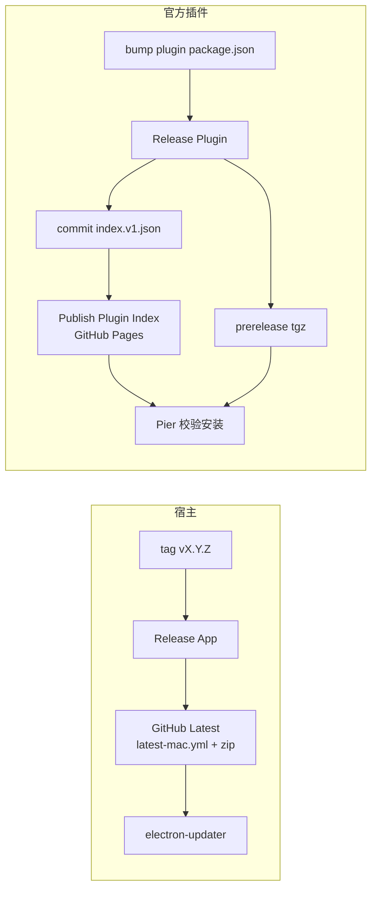
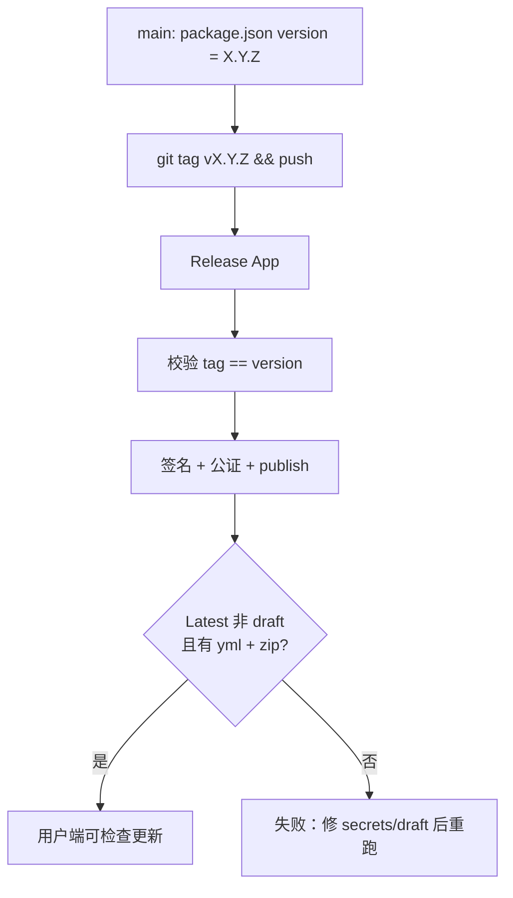
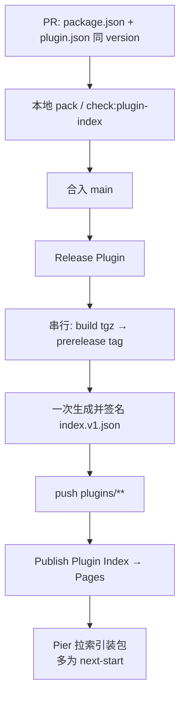

# Pier 发布

维护者入口。开发细节见链出文档，本文不重复。

## 双通道

| | 宿主应用 | 官方插件 |
|---|---|---|
| 触发 | tag `v*` / Actions **Release App** | `main` 上 `packages/plugin-*/package.json` 变更 / **Release Plugin** 恢复 |
| 产物 | dmg、mac zip、`latest-mac.yml` | `pier.<id>-<ver>.tgz` + 签名 `plugins/index.v1.json` |
| GitHub Release | **Latest**，正式 release | **prerelease**，tag `plugin-<tail>-v<ver>`，禁止 Latest |
| 客户端 | `electron-updater` → `/releases/latest` | 官方索引 → 按条目下 tgz |
| 专文 | [`app-release.md`](./app-release.md) | [`plugins.md`](./plugins.md)（开发/校验）；发布步骤见下文 |



**硬边界：** 插件 release 不得成为 Latest，否则宿主 updater 会去插件 tag 找 `latest-mac.yml`。

---

## 宿主



```bash
# main 上 version 已对齐后
git tag v0.1.2 && git push origin v0.1.2
```

验收：

```bash
gh api repos/runloom/pier/releases/latest --jq '{tag:.tag_name,assets:[.assets[].name]}'
curl -fsSL https://github.com/runloom/pier/releases/latest/download/latest-mac.yml
```

用户侧（production）：约 30s 后检查 → 后台下载 → 右上角 / Settings → Updates → 手动重启安装（或退出时安装）。  
secrets、本地 `build:dist`、CSC_LINK 开关 → [`app-release.md`](./app-release.md)。

---

## 官方插件



```bash
# 例：codex — 改 packages/plugin-codex/{package.json,plugin.json}
pnpm plugin:codex:pack
# PR 合入 main 即可；勿打宿主式 v* tag
```

- 可发布包必须有 `plugin.json`；`plugin-api` 等共享包只改 version 不会发。
- 多插件同 PR：按 tail 串行，索引只写一次。
- 恢复单插件：Actions → Release Plugin → `plugin=codex` + `version=…`。
- 索引 URL：`https://runloom.github.io/pier/plugins/index.v1.json`。
- 打包规范、运行时校验、安装回滚 → [`plugins.md`](./plugins.md)。

---

## 速查

| 意图 | 动作 |
|---|---|
| 发宿主 | `package.json` bump → `git tag vX.Y.Z && git push origin vX.Y.Z` |
| 发插件 | bump 插件两处 version → pack → 合入 `main` |
| 本地应急宿主 | `GH_TOKEN=… pnpm build:dist --publish=always`（见 app-release） |
| 本地验插件索引 | `pnpm plugins:pack && pnpm plugins:index && pnpm check:plugin-index` |

同 version 不改已发布二进制语义；修 bug 必须 bump。
