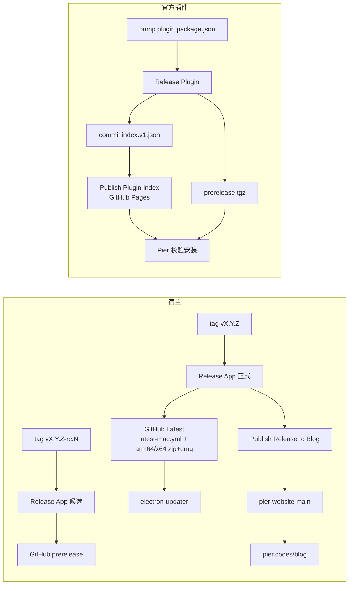
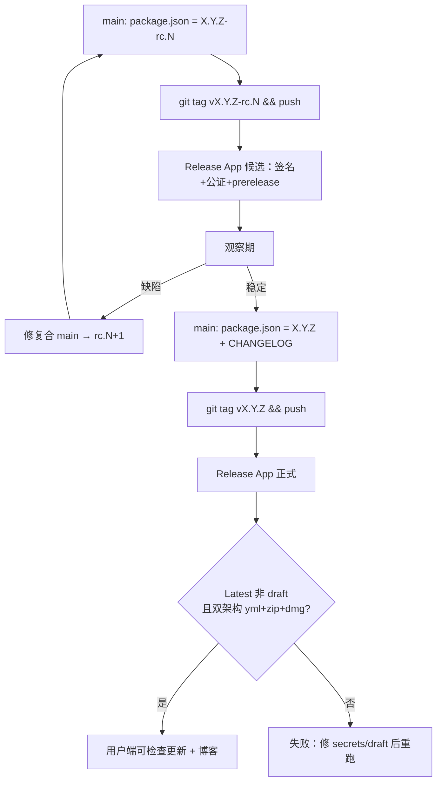
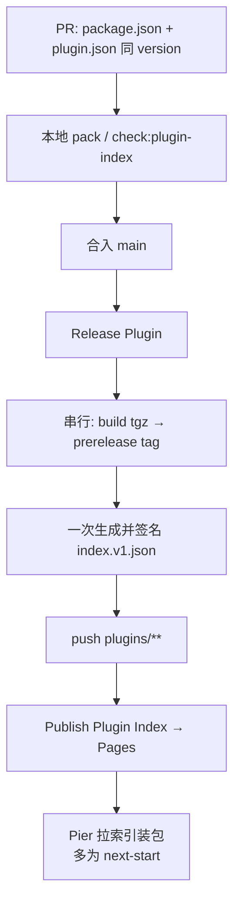

# Pier 发布

维护者入口。文档索引：[`README.md`](./README.md)。开发细节见链出文档，本文不重复。  
宿主候选版金标准：[`superpowers/specs/2026-08-29-host-release-candidate-gold-standard.md`](./superpowers/specs/2026-08-29-host-release-candidate-gold-standard.md)。

## 双通道

| | 宿主应用 | 官方插件 |
|---|---|---|
| 触发 | tag `v*` / Actions **Release App** | `main` 上 `packages/plugin-*/package.json` 变更 / **Release Plugin** 恢复 |
| 正式 | `vX.Y.Z` → **Latest**，`latest-mac.yml` + arm64/x64 dmg/zip | — |
| 候选 | `vX.Y.Z-rc.N` → **prerelease**（不占 Latest、不发博客） | 一律 **prerelease**，tag `plugin-<tail>-v<ver>`，禁止 Latest |
| 产物 | 正式与候选同构建同签名；version 与 tag 同构 | `pier.<id>-<ver>.tgz` + 签名 `plugins/index.v1.json` |
| 客户端 | `electron-updater` → `/releases/latest`（仅正式） | 官方索引 → 按条目下 tgz |
| 专文 | [`app-release.md`](./app-release.md) | [`plugins.md`](./plugins.md)（开发/校验）；发布步骤见下文 |


```mermaid
flowchart LR
  subgraph host [宿主]
    A1["tag vX.Y.Z-rc.N"] --> B1["Release App 候选"]
    B1 --> C1["GitHub prerelease"]
    A2["tag vX.Y.Z"] --> B2["Release App 正式"]
    B2 --> C2["GitHub Latest\nlatest-mac.yml + arm64/x64 zip+dmg"]
    C2 --> D["electron-updater"]
    B2 --> K["Publish Release to Blog"]
    K --> L["pier-website main"]
    L --> M["pier.codes/blog"]
  end
  subgraph plugin [官方插件]
    E["bump plugin package.json"] --> F["Release Plugin"]
    F --> G["prerelease tgz"]
    F --> H["commit index.v1.json"]
    H --> I["Publish Plugin Index\nGitHub Pages"]
    I --> J["Pier 校验安装"]
    G --> J
  end
```

**硬边界（强制门禁）：** 插件与宿主候选 release 不得成为 Latest。`Release Plugin` / `Release App` 结束后跑 `scripts/verify-github-latest-isolation.mjs`：Latest 必须是稳定宿主 `vX.Y.Z`（无 `-rc.`）+ 完整双架构 mac 资产。候选模式另传 `--candidate-tag` 校验本 tag 为 prerelease。`build:dist` 在 publish 前还跑 `verify-mac-release-artifacts.mjs`。失败则 workflow 红。

---

## 宿主


```mermaid
flowchart TD
  A["main: package.json = X.Y.Z-rc.N"] --> B["git tag vX.Y.Z-rc.N && push"]
  B --> C["Release App 候选：签名+公证+prerelease"]
  C --> D["观察期"]
  D -->|缺陷| E["修复合 main → rc.N+1"] --> A
  D -->|稳定| F["main: package.json = X.Y.Z + CHANGELOG"]
  F --> G["git tag vX.Y.Z && push"]
  G --> H["Release App 正式"]
  H --> I{"Latest 非 draft\n且双架构 yml+zip+dmg?"}
  I -->|是| J["用户端可检查更新 + 博客"]
  I -->|否| K["失败：修 secrets/draft 后重跑"]
```

```bash
# 候选（观察期）
# package.json version 已为 0.2.0-rc.1
git tag v0.2.0-rc.1 && git push origin v0.2.0-rc.1

# 晋升正式（version 已去 rc 后缀）
git tag v0.2.0 && git push origin v0.2.0
```

验收（正式）：

```bash
gh api repos/runloom/pier/releases/latest --jq '{tag:.tag_name,assets:[.assets[].name]}'
# 期望含: latest-mac.yml, Pier-*-arm64-mac.zip, Pier-*-mac.zip, Pier-*-arm64.dmg, Pier-*.dmg
curl -fsSL https://github.com/runloom/pier/releases/latest/download/latest-mac.yml
```

用户侧（production）：约 30s 后检查 → 后台下载 → 右上角 / Settings → Updates → 手动重启安装（或退出时安装）。仅吃 Latest，候选 prerelease 对自动更新不可见。  
官网博客：仅**正式** Release App 成功后从 CHANGELOG 生成并推到 `pier-website`。不要用 `on: release`。细节与 secrets → [`app-release.md`](./app-release.md)。

版本纪律：同 version（含 `X.Y.Z-rc.N`）不改已发布内容；修 bug 必须 bump。Agent skill：`.agents/skills/publish-project/SKILL.md`（候选 / 晋升 / 直接发布三路径）。

---

## 官方插件


```mermaid
flowchart TD
  A["PR: package.json + plugin.json 同 version"] --> B["本地 pack / check:plugin-index"]
  B --> C["合入 main"]
  C --> D["Release Plugin"]
  D --> E["串行: build tgz → prerelease tag"]
  E --> F["一次生成并签名 index.v1.json"]
  F --> G["push plugins/**"]
  G --> H["Publish Plugin Index → Pages"]
  H --> I["Pier 拉索引装包\n多为 next-start"]
```

```bash
# 例：codex — 改 packages/plugin-codex/{package.json,plugin.json}
pnpm plugin:codex:pack
# PR 合入 main 即可；勿打宿主式 v* tag
```

- 可发布包必须有 `plugin.json`；`plugin-api` 等共享包只改 version 不会发。
- 多插件同 PR：按 tail 串行，索引只写一次。
- 恢复单插件：Actions → Release Plugin → `plugin=codex` + `version=…`。
- 索引 URL：`https://runloom.github.io/pier/plugins/index.v1.json`。
- 打包规范、运行时校验、安装回滚 → [`plugins.md`](./plugins.md)。

---

## 会合云与移动端 Web

与宿主 / 插件解耦：协议帧版本化，过旧一侧收 `protocol_too_old`。权威设计 [`superpowers/specs/2026-08-31-mobile-relay-server-design.md`](./superpowers/specs/2026-08-31-mobile-relay-server-design.md) §10.3；操作说明 [`apps/relay/README.md`](../apps/relay/README.md)。

```bash
# 会合云（当前 workflow 为构建校验 dry-run；接入 GHCR / VM 后同一 tag 才部署）
git tag relay-v0.1.0 && git push origin relay-v0.1.0

# 移动端 Web 壳静态产物
git tag mobile-web-v0.1.0 && git push origin mobile-web-v0.1.0
```

本地先验证服务再打 tag：

```bash
pnpm dev:relay
curl -sS http://127.0.0.1:8787/healthz   # {"ok":true}
pnpm vitest run tests/unit/relay
pnpm build:mobile-web
```

---

## 速查

| 意图 | 动作 |
|---|---|
| 发宿主候选版 | `package.json` = `X.Y.Z-rc.N` → `git tag vX.Y.Z-rc.N && push` |
| 晋升正式版 | 去掉 `-rc.N` + CHANGELOG 定稿 → `git tag vX.Y.Z && push` |
| 直接发布（跳过候选） | 显式触发；正式 `X.Y.Z` 直发 Latest；报告标注 |
| 发插件 | bump 插件两处 version → pack → 合入 `main` |
| 本地应急宿主 | `GH_TOKEN=… pnpm build:dist --publish=always`（候选加 `--prerelease`；见 app-release） |
| 本地验插件索引 | `pnpm plugins:pack && pnpm plugins:index && pnpm check:plugin-index` |
| 发会合云 | `git tag relay-v*`（dry-run 构建；部署密钥接入后才上 VM） |
| 发移动端 Web 壳 | `git tag mobile-web-v*`（`pnpm build:mobile-web` 产物） |
| 本地会合 | `pnpm dev:relay`；桌面加 `PIER_RELAY_URL=ws://127.0.0.1:8787` |

同 version 不改已发布二进制语义；修 bug 必须 bump。
