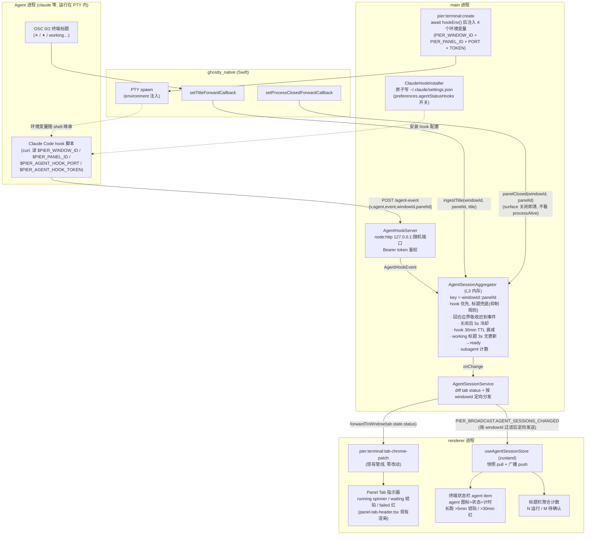
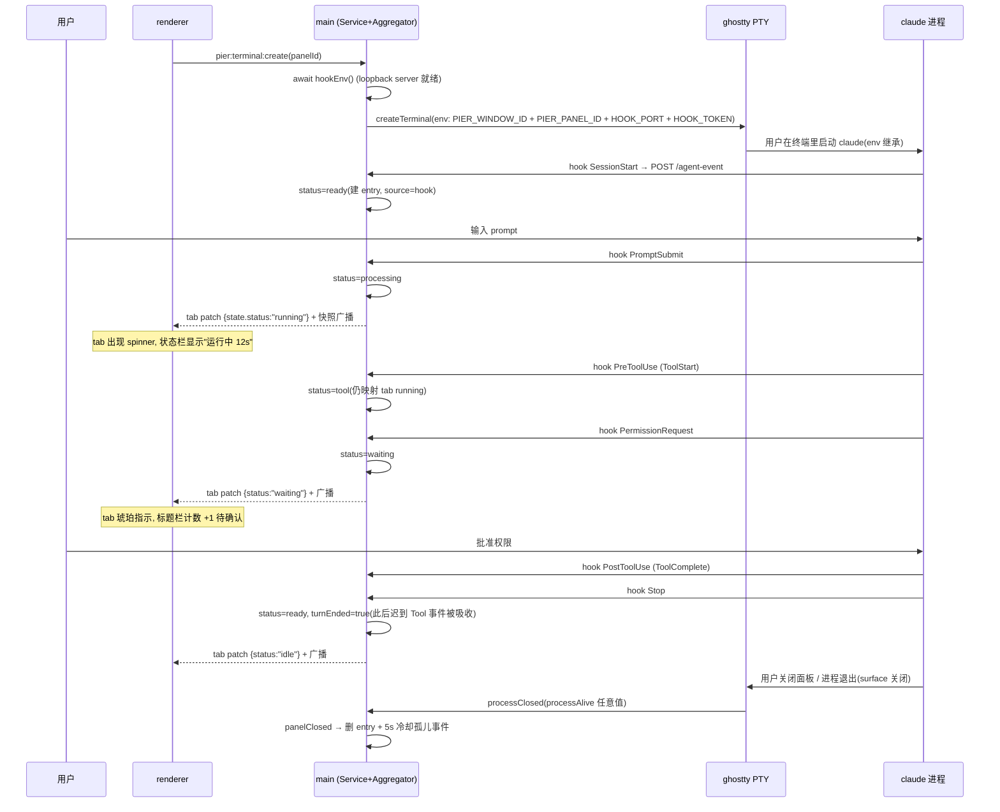
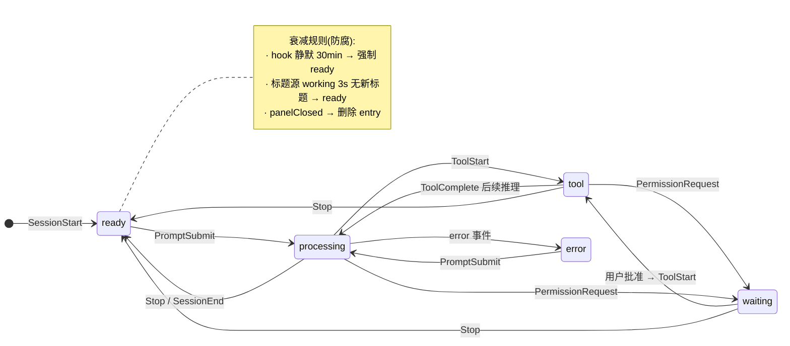
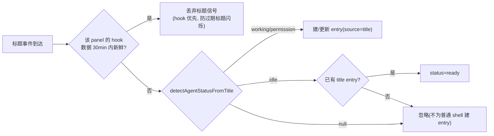

# Agent 运行状态获取与展示（Agent Session Status）实施计划

> **For agentic workers:** REQUIRED SUB-SKILL: Use superpowers:subagent-driven-development (recommended) or superpowers:executing-plans to implement this plan task-by-task. Steps use checkbox (`- [ ]`) syntax for tracking.

**Goal:** 让 Pier 实时感知每个终端面板里 CLI agent（Claude Code 等）的运行状态（processing / tool / waiting / error / ready），并通过 tab 指示器、终端状态栏、标题栏聚合计数三层 UI 展示。

**Architecture:** 主信号走「Claude Code hooks → HTTP loopback（仅 127.0.0.1，token 鉴权）」，路由靠 PTY 创建时注入的 `PIER_WINDOW_ID` + `PIER_PANEL_ID` 环境变量精确到「窗口+面板」（panelId 跨窗口不唯一，必须带 window scope，见 `src/main/ipc/terminal-panel-id.ts`）；兜底信号复用 native addon 已有的 OSC 0/2 标题回调 + 标题启发式正则。两路信号汇入 main 进程 L3 聚合器（防抖 / 回合边界吸收 / 关闭冷却 / TTL 衰减，key 为 `${windowId}::${panelId}`），向 renderer 双路下发：tab 状态复用现有 `pier:terminal:tab-chrome-patch` 管线（零 UI 新基建），全量快照**按窗口过滤**走新广播通道进 zustand store 供状态栏与标题栏消费。

**Tech Stack:** Electron 42 main（node:http loopback）、zod 契约、Zustand 5、React 19、Vitest 4。

## Global Constraints

（每个任务的要求都隐含包含本节）

- TypeScript 6 strict：禁止 `@ts-ignore`、`@ts-expect-error`、`as any`（AGENTS.md 05）。
- 进程边界：`main/` ⊥ `renderer/`；`preload/` 只可 import `shared/` + `electron`；renderer 业务代码不可直接 import dockview（AGENTS.md 03）。
- 文件大小硬上限 500 行（`pnpm check:file-size` 强制；preload/index.ts 现已 465 行，新 preload API 必须放独立文件，参照 `git-api.ts` 先例）。
- Lint/Format 用 `pnpm lint:fix`（Biome + Ultracite）；提交前 `pnpm check`（typecheck + lint + depcruise + file-size）必须全绿。
- 每个任务结束按 AGENTS.md 05 流程提交：只 stage 任务列明的明确路径 → 展示 `git diff --staged` 与拟用 Conventional Commits message → **等待用户确认后再 commit**。禁止 `git add .` / `git add -u` / force-push。
- zod schema 命名与文件组织跟随 `src/shared/contracts/` 现有风格：`xxxSchema` + `export type Xxx = z.infer<...>`，对象 schema 一律 `.strict()` 或字段级校验。
- 单测放 `tests/unit/*.test.ts`，运行命令 `pnpm vitest run tests/unit/<file> --reporter=dot`。
- i18n：所有 UI 文案必须同时加 `src/renderer/i18n/locales/zh-CN/` 与 `en/` 两份。

---

## 架构流程图

### 图 1 · 总体架构（信号源 → 聚合 → 展示）



### 图 2 · 时序：一次完整的 agent 回合



### 图 3 · 状态机与信号优先级





### 图 4 · 状态映射表

| Claude hook 事件 | pier 事件名 | AgentRuntimeStatus | PanelTabStatus（tab 指示器） | 状态栏动画 |
|---|---|---|---|---|
| `UserPromptSubmit` | `PromptSubmit` | `processing` | `running`（spinner） | pulse |
| `SubagentStart` / `SubagentStop` | 同名（并 ±1 subagent 计数） | `processing` | `running` | pulse |
| `PreToolUse` | `ToolStart` | `tool` | `running` | pulse |
| `PostToolUse` / `PostToolUseFailure` | `ToolComplete`（工具失败不算会话错误，回合仍在继续） | `tool` | `running` | pulse |
| `PermissionRequest` | `PermissionRequest`（权限弹窗专用事件；不用 `Notification`——它还覆盖 idle_prompt 等噪声） | `waiting` | `waiting`（琥珀） | steady |
| `StopFailure` | `error`（回合因 API 错误终止） | `error` | `failed`（红） | steady |
| `SessionStart` / `Stop` / `SessionEnd` | 同名 | `ready` | `idle`（无指示器） | 隐藏 |

---

## 文件结构总览

| 文件 | 责任 | 新建/修改 |
|---|---|---|
| `src/shared/contracts/agent-session.ts` | 状态枚举、hook 事件/快照 zod 契约、两张映射函数 | 新建 |
| `src/shared/agent-title-status.ts` | 标题启发式（orca 移植） | 新建 |
| `src/main/services/agents/agent-session-aggregator.ts` | 纯逻辑聚合器（无 electron 依赖，可单测） | 新建 |
| `src/main/services/agents/agent-hook-server.ts` | loopback HTTP 服务器 | 新建 |
| `src/main/services/agents/claude-hook-installer.ts` | ~/.claude/settings.json hook 安装/卸载 | 新建 |
| `src/main/ipc/agent-session.ts` | 服务组装单例 + IPC 注册 + 广播/转发 | 新建 |
| `src/main/ipc/terminal-create-launch.ts` | `withPanelStatusEnv()` 环境注入 | 修改 |
| `src/main/ipc/terminal.ts` | create 时 await hookEnv 注入 env；close 时清 agent 会话 | 修改 |
| `src/main/ipc/terminal-task-lifecycle-wiring.ts` | 标题/进程关闭回调分流到聚合器 | 修改 |
| `src/main/ipc/preferences.ts` | 偏好变更时联动 hook 安装 | 修改 |
| `src/main/index.ts` | 注册 agent-session IPC | 修改 |
| `src/shared/ipc-channels.ts` | 新广播通道常量 | 修改 |
| `src/shared/contracts/preferences.ts` | `agentStatusHooks` 偏好键 | 修改 |
| `src/preload/agent-session-api.ts` | `window.pier.agentSessions` 桥（独立文件防 500 行超限） | 新建 |
| `src/preload/index.ts` | 挂 agentSessions API | 修改 |
| `src/renderer/stores/agent-session.store.ts` | zustand store + 计数选择器 | 新建 |
| `src/renderer/components/common/agent-sessions-bridge.tsx` | 订阅初始化 + 状态栏 item 注册 | 新建 |
| `src/renderer/components/common/app-shell.tsx` | 挂 bridge | 修改 |
| `src/renderer/panel-kits/terminal/agent-status-item.tsx` | 状态栏 agent item + 长跑视觉 | 新建 |
| `src/renderer/components/common/title-bar.tsx` | 聚合计数 chip | 修改 |
| `src/renderer/pages/settings/components/agents-section.tsx` | hook 安装开关 | 修改 |
| `src/renderer/stores/agent-preferences.store.ts` | 开关状态同步 | 修改 |
| `src/renderer/i18n/locales/{zh-CN,en}/settings.ts` | 开关文案 | 修改 |

---

### Task 1: 共享契约 `agent-session.ts`

**Files:**
- Create: `src/shared/contracts/agent-session.ts`
- Test: `tests/unit/agent-session-contract.test.ts`

**Interfaces:**
- Consumes: `agentKindSchema`（`src/shared/contracts/agent.ts`）、`PanelTabStatus`（`src/shared/contracts/panel.ts`）
- Produces: `AgentRuntimeStatus`、`AgentHookEvent` + `agentHookEventSchema`、`AgentSessionSnapshot` + `agentSessionSnapshotSchema`、`AgentSessionsBroadcast` + `agentSessionsBroadcastSchema`、`runtimeStatusForHookEvent(event: string): AgentRuntimeStatus | null`、`tabStatusForAgentStatus(status: AgentRuntimeStatus): PanelTabStatus` —— 后续所有任务的类型基座。

- [ ] **Step 1: 写失败测试**

```ts
// tests/unit/agent-session-contract.test.ts
import {
  agentHookEventSchema,
  runtimeStatusForHookEvent,
  tabStatusForAgentStatus,
} from "@shared/contracts/agent-session.ts";
import { describe, expect, it } from "vitest";

describe("agentHookEventSchema", () => {
  it("接受合法 hook 事件", () => {
    const parsed = agentHookEventSchema.safeParse({
      v: 1,
      agent: "claude",
      event: "PromptSubmit",
      panelId: "panel-1",
      windowId: "3",
    });
    expect(parsed.success).toBe(true);
  });

  it("拒绝未知 agent、缺 panelId、缺 windowId", () => {
    expect(
      agentHookEventSchema.safeParse({
        v: 1,
        agent: "not-an-agent",
        event: "Stop",
        panelId: "p",
        windowId: "3",
      }).success
    ).toBe(false);
    expect(
      agentHookEventSchema.safeParse({
        v: 1,
        agent: "claude",
        event: "Stop",
        windowId: "3",
      }).success
    ).toBe(false);
    expect(
      agentHookEventSchema.safeParse({
        v: 1,
        agent: "claude",
        event: "Stop",
        panelId: "p",
      }).success
    ).toBe(false);
  });

  it("拒绝超长 event 名(>64)", () => {
    expect(
      agentHookEventSchema.safeParse({
        v: 1,
        agent: "claude",
        event: "x".repeat(65),
        panelId: "p",
        windowId: "3",
      }).success
    ).toBe(false);
  });
});

describe("runtimeStatusForHookEvent", () => {
  it.each([
    ["PermissionRequest", "waiting"],
    ["ToolStart", "tool"],
    ["ToolComplete", "tool"],
    ["error", "error"],
    ["SessionStart", "ready"],
    ["Stop", "ready"],
    ["SessionEnd", "ready"],
    ["PromptSubmit", "processing"],
    ["SubagentStart", "processing"],
    ["SubagentStop", "processing"],
  ] as const)("%s → %s", (event, status) => {
    expect(runtimeStatusForHookEvent(event)).toBe(status);
  });

  it("未知事件 → null", () => {
    expect(runtimeStatusForHookEvent("SomethingElse")).toBeNull();
  });
});

describe("tabStatusForAgentStatus", () => {
  it.each([
    ["processing", "running"],
    ["tool", "running"],
    ["waiting", "waiting"],
    ["error", "failed"],
    ["ready", "idle"],
  ] as const)("%s → %s", (status, tab) => {
    expect(tabStatusForAgentStatus(status)).toBe(tab);
  });
});
```

- [ ] **Step 2: 跑测试确认失败**

Run: `pnpm vitest run tests/unit/agent-session-contract.test.ts --reporter=dot`
Expected: FAIL — `Cannot find module '@shared/contracts/agent-session.ts'`

- [ ] **Step 3: 写实现**

```ts
// src/shared/contracts/agent-session.ts
import { z } from "zod";
import { agentKindSchema } from "./agent.ts";
import type { PanelTabStatus } from "./panel.ts";

/** agent 会话的运行时状态（借鉴 loomdesk 五态模型）。 */
export const agentRuntimeStatusSchema = z.enum([
  "ready",
  "processing",
  "tool",
  "waiting",
  "error",
]);
export type AgentRuntimeStatus = z.infer<typeof agentRuntimeStatusSchema>;

/**
 * hook 脚本 POST 到 loopback 服务器的事件体（v1）。
 * panelId 跨窗口不唯一（见 terminal-panel-id.ts），windowId 必带，
 * 二者组成会话 key `${windowId}::${panelId}`。
 */
export const agentHookEventSchema = z
  .object({
    v: z.literal(1),
    agent: agentKindSchema,
    event: z.string().min(1).max(64),
    panelId: z.string().min(1).max(128),
    sessionId: z.string().max(128).optional(),
    windowId: z.string().min(1).max(32),
  })
  .strict();
export type AgentHookEvent = z.infer<typeof agentHookEventSchema>;

export const agentSessionSourceSchema = z.enum(["hook", "title"]);
export type AgentSessionSource = z.infer<typeof agentSessionSourceSchema>;

export const agentSessionSnapshotSchema = z.object({
  agentId: agentKindSchema.optional(),
  panelId: z.string().min(1),
  source: agentSessionSourceSchema,
  /** 状态最近一次「变化」的时刻（同状态内的心跳事件不重置，供 UI 计时）。 */
  stateStartedAt: z.number(),
  status: agentRuntimeStatusSchema,
  subagentCount: z.number().int().nonnegative(),
  /** 最近一次收到任何信号的时刻（TTL 衰减依据）。 */
  updatedAt: z.number(),
  /** 所属 BrowserWindow id（String(win.id)），与 panelId 组成全局唯一 key。 */
  windowId: z.string().min(1),
});
export type AgentSessionSnapshot = z.infer<typeof agentSessionSnapshotSchema>;

export const agentSessionsBroadcastSchema = z.object({
  sessions: z.array(agentSessionSnapshotSchema),
  ts: z.number(),
});
export type AgentSessionsBroadcast = z.infer<
  typeof agentSessionsBroadcastSchema
>;

/** hook 事件名 → runtime status。null = 未知事件，调用方应忽略。 */
export function runtimeStatusForHookEvent(
  event: string
): AgentRuntimeStatus | null {
  switch (event) {
    case "PermissionRequest":
      return "waiting";
    case "ToolStart":
    case "ToolComplete":
      return "tool";
    case "error":
      return "error";
    case "SessionStart":
    case "Stop":
    case "SessionEnd":
      return "ready";
    case "PromptSubmit":
    case "SubagentStart":
    case "SubagentStop":
    case "processing":
    case "running":
      return "processing";
    default:
      return null;
  }
}

/** runtime status → 现有 tab 指示器状态。ready 映射 idle = tab 无指示器。 */
export function tabStatusForAgentStatus(
  status: AgentRuntimeStatus
): PanelTabStatus {
  switch (status) {
    case "processing":
    case "tool":
      return "running";
    case "waiting":
      return "waiting";
    case "error":
      return "failed";
    case "ready":
      return "idle";
    default:
      return "idle";
  }
}
```

- [ ] **Step 4: 跑测试确认通过**

Run: `pnpm vitest run tests/unit/agent-session-contract.test.ts --reporter=dot`
Expected: PASS（全绿）

- [ ] **Step 5: 提交**

```bash
git add src/shared/contracts/agent-session.ts tests/unit/agent-session-contract.test.ts
git commit -m "feat(agent-status): add agent session contracts and status mappings"
```

---

### Task 2: 标题启发式 `agent-title-status.ts`

**Files:**
- Create: `src/shared/agent-title-status.ts`
- Test: `tests/unit/agent-title-status.test.ts`

**Interfaces:**
- Consumes: `AgentRuntimeStatus`（Task 1）
- Produces: `detectAgentStatusFromTitle(title: string): AgentTitleStatus | null`（`"working" | "permission" | "idle" | null`）、`runtimeStatusForTitleStatus(s: AgentTitleStatus): AgentRuntimeStatus` —— Task 3 聚合器的兜底信号入口。

- [ ] **Step 1: 写失败测试**

```ts
// tests/unit/agent-title-status.test.ts
import {
  detectAgentStatusFromTitle,
  runtimeStatusForTitleStatus,
} from "@shared/agent-title-status.ts";
import { describe, expect, it } from "vitest";

describe("detectAgentStatusFromTitle", () => {
  it.each([
    ["✳ Summarizing repo", "idle"], // Claude Code 空闲前缀
    ["✦ generating code", "working"], // Gemini working
    ["⏲ background task", "working"], // Gemini silent working
    ["◇ gemini", "idle"], // Gemini idle
    ["✋ approve tool?", "permission"], // Gemini permission
    ["⠋ codex", "working"], // braille spinner
    ["Codex working on tests", "working"],
    ["claude thinking", "working"],
    ["task running", "working"],
    ["aider ready", "idle"],
    ["all done", "idle"],
  ] as const)("%s → %s", (title, expected) => {
    expect(detectAgentStatusFromTitle(title)).toBe(expected);
  });

  it.each([
    "", // 空
    "~/dev/my-working-copy", // 路径子串不得误报
    "networking-guide.md", // 连字符复合词不得误报
    "vim main.ts", // 普通标题
    "hardworking team notes", // 前缀粘连
  ])("误报防御: %s → null", (title) => {
    expect(detectAgentStatusFromTitle(title)).toBeNull();
  });
});

describe("runtimeStatusForTitleStatus", () => {
  it.each([
    ["working", "processing"],
    ["permission", "waiting"],
    ["idle", "ready"],
  ] as const)("%s → %s", (titleStatus, runtime) => {
    expect(runtimeStatusForTitleStatus(titleStatus)).toBe(runtime);
  });
});
```

- [ ] **Step 2: 跑测试确认失败**

Run: `pnpm vitest run tests/unit/agent-title-status.test.ts --reporter=dot`
Expected: FAIL — module not found

- [ ] **Step 3: 写实现**

```ts
// src/shared/agent-title-status.ts
import type { AgentRuntimeStatus } from "./contracts/agent-session.ts";

/**
 * 终端标题启发式 agent 状态探测（orca agent-detection 移植）。
 *
 * 仅作 hook 信号缺席时的兜底：聚合器在该 panel 有新鲜 hook 数据时
 * 必须抑制本信号（防过期标题把状态闪回）。
 */
export type AgentTitleStatus = "working" | "permission" | "idle";

const CLAUDE_IDLE_PREFIX = "✳"; // ✳ Claude Code 空闲标题前缀
const GEMINI_WORKING_PREFIX = "✦"; // ✦
const GEMINI_SILENT_WORKING_PREFIX = "⏲"; // ⏲
const GEMINI_IDLE_PREFIX = "◇"; // ◇
const GEMINI_PERMISSION_PREFIX = "✋"; // ✋
const BRAILLE_SPINNER_RE = /^[⠀-⣿]/;

// 非对称 lookaround：左侧排除 [\w./\\-]（路径/复合词），右侧排除 [\w-]。
const STRONG_WORKING_RE = /(?<![\w./\\-])(?:working|thinking|running)(?![\w-])/i;
const STRONG_IDLE_RE = /(?<![\w./\\-])(?:ready|idle|done)(?![\w-])/i;

export function detectAgentStatusFromTitle(
  title: string
): AgentTitleStatus | null {
  const t = title.trim();
  if (t.length === 0) {
    return null;
  }
  if (t.startsWith(GEMINI_PERMISSION_PREFIX)) {
    return "permission";
  }
  if (
    t.startsWith(GEMINI_WORKING_PREFIX) ||
    t.startsWith(GEMINI_SILENT_WORKING_PREFIX) ||
    BRAILLE_SPINNER_RE.test(t)
  ) {
    return "working";
  }
  if (t.startsWith(GEMINI_IDLE_PREFIX) || t.startsWith(CLAUDE_IDLE_PREFIX)) {
    return "idle";
  }
  if (STRONG_WORKING_RE.test(t)) {
    return "working";
  }
  if (STRONG_IDLE_RE.test(t)) {
    return "idle";
  }
  return null;
}

export function runtimeStatusForTitleStatus(
  s: AgentTitleStatus
): AgentRuntimeStatus {
  switch (s) {
    case "working":
      return "processing";
    case "permission":
      return "waiting";
    case "idle":
      return "ready";
    default:
      return "ready";
  }
}
```

- [ ] **Step 4: 跑测试确认通过**

Run: `pnpm vitest run tests/unit/agent-title-status.test.ts --reporter=dot`
Expected: PASS

- [ ] **Step 5: 提交**

```bash
git add src/shared/agent-title-status.ts tests/unit/agent-title-status.test.ts
git commit -m "feat(agent-status): add terminal-title heuristic detection (orca port)"
```

---

### Task 3: 聚合器 `agent-session-aggregator.ts`

本任务是整个功能的核心纪律层，四条防腐规则全在这里：回合边界吸收（loomdesk）、关闭冷却 5s（loomdesk）、hook 30min TTL 衰减（orca）、working 标题 3s 无更新自动归位（orca）。纯逻辑、无 electron 依赖。

**Files:**
- Create: `src/main/services/agents/agent-session-aggregator.ts`
- Test: `tests/unit/agent-session-aggregator.test.ts`

**Interfaces:**
- Consumes: Task 1 契约、Task 2 标题探测
- Produces:
  ```ts
  export interface AgentSessionAggregator {
    dispose(): void;
    ingestHookEvent(event: AgentHookEvent): void;
    ingestTitle(windowId: string, panelId: string, title: string): void;
    onChange(cb: (b: AgentSessionsBroadcast) => void): () => void;
    panelClosed(windowId: string, panelId: string): void;
    snapshot(): AgentSessionsBroadcast;
  }
  export function createAgentSessionAggregator(opts?: {
    now?: () => number;
  }): AgentSessionAggregator;
  ```
  内部会话 key 一律 `${windowId}::${panelId}`（panelId 跨窗口不唯一）。

- [ ] **Step 1: 写失败测试**

```ts
// tests/unit/agent-session-aggregator.test.ts
import { createAgentSessionAggregator } from "../../src/main/services/agents/agent-session-aggregator.ts";
import type { AgentHookEvent } from "@shared/contracts/agent-session.ts";
import { afterEach, beforeEach, describe, expect, it, vi } from "vitest";

function hookEvent(
  event: string,
  panelId = "p1",
  windowId = "1"
): AgentHookEvent {
  return { v: 1, agent: "claude", event, panelId, windowId };
}

describe("AgentSessionAggregator", () => {
  let clock = 0;
  const now = () => clock;

  beforeEach(() => {
    clock = 0;
    vi.useFakeTimers();
  });
  afterEach(() => {
    vi.useRealTimers();
  });

  function advance(ms: number): void {
    clock += ms;
    vi.advanceTimersByTime(ms);
  }

  it("hook 事件建立会话并映射状态", () => {
    const agg = createAgentSessionAggregator({ now });
    agg.ingestHookEvent(hookEvent("SessionStart"));
    agg.ingestHookEvent(hookEvent("PromptSubmit"));
    const snap = agg.snapshot();
    expect(snap.sessions).toHaveLength(1);
    expect(snap.sessions[0]?.status).toBe("processing");
    expect(snap.sessions[0]?.agentId).toBe("claude");
    expect(snap.sessions[0]?.source).toBe("hook");
    agg.dispose();
  });

  it("未知事件名被忽略", () => {
    const agg = createAgentSessionAggregator({ now });
    agg.ingestHookEvent(hookEvent("WhatIsThis"));
    expect(agg.snapshot().sessions).toHaveLength(0);
    agg.dispose();
  });

  it("stateStartedAt 只在状态变化时重置", () => {
    const agg = createAgentSessionAggregator({ now });
    agg.ingestHookEvent(hookEvent("PromptSubmit")); // processing @0
    advance(1000);
    agg.ingestHookEvent(hookEvent("ToolStart")); // tool @1000
    advance(1000);
    agg.ingestHookEvent(hookEvent("ToolComplete")); // 仍 tool
    const s = agg.snapshot().sessions[0];
    expect(s?.status).toBe("tool");
    expect(s?.stateStartedAt).toBe(1000);
    expect(s?.updatedAt).toBe(2000);
    agg.dispose();
  });

  it("回合边界吸收：Stop 之后迟到的 ToolStart 不改状态", () => {
    const agg = createAgentSessionAggregator({ now });
    agg.ingestHookEvent(hookEvent("PromptSubmit"));
    agg.ingestHookEvent(hookEvent("Stop")); // 回合结束 → ready
    agg.ingestHookEvent(hookEvent("ToolStart")); // 迟到事件, 应被吸收
    expect(agg.snapshot().sessions[0]?.status).toBe("ready");
    agg.ingestHookEvent(hookEvent("PromptSubmit")); // 新回合重置
    agg.ingestHookEvent(hookEvent("ToolStart"));
    expect(agg.snapshot().sessions[0]?.status).toBe("tool");
    agg.dispose();
  });

  it("subagent 计数：Start +1 / Stop -1, 回合边界清零", () => {
    const agg = createAgentSessionAggregator({ now });
    agg.ingestHookEvent(hookEvent("PromptSubmit"));
    agg.ingestHookEvent(hookEvent("SubagentStart"));
    agg.ingestHookEvent(hookEvent("SubagentStart"));
    expect(agg.snapshot().sessions[0]?.subagentCount).toBe(2);
    agg.ingestHookEvent(hookEvent("SubagentStop"));
    expect(agg.snapshot().sessions[0]?.subagentCount).toBe(1);
    agg.ingestHookEvent(hookEvent("Stop"));
    expect(agg.snapshot().sessions[0]?.subagentCount).toBe(0);
    agg.dispose();
  });

  it("panelClosed 删除会话并 5s 冷却孤儿事件", () => {
    const agg = createAgentSessionAggregator({ now });
    agg.ingestHookEvent(hookEvent("PromptSubmit"));
    agg.panelClosed("1", "p1");
    expect(agg.snapshot().sessions).toHaveLength(0);
    agg.ingestHookEvent(hookEvent("ToolStart")); // 冷却期内, 丢弃
    expect(agg.snapshot().sessions).toHaveLength(0);
    advance(5001);
    agg.ingestHookEvent(hookEvent("PromptSubmit")); // 冷却过后允许重建
    expect(agg.snapshot().sessions).toHaveLength(1);
    agg.dispose();
  });

  it("跨窗口同名 panelId 互不串扰", () => {
    const agg = createAgentSessionAggregator({ now });
    agg.ingestHookEvent(hookEvent("PromptSubmit", "p1", "1"));
    agg.ingestHookEvent(hookEvent("PermissionRequest", "p1", "2"));
    const sessions = agg.snapshot().sessions;
    expect(sessions).toHaveLength(2);
    expect(
      sessions.find((s) => s.windowId === "1")?.status
    ).toBe("processing");
    expect(sessions.find((s) => s.windowId === "2")?.status).toBe("waiting");
    agg.panelClosed("1", "p1"); // 只清窗口 1 的
    expect(agg.snapshot().sessions).toHaveLength(1);
    expect(agg.snapshot().sessions[0]?.windowId).toBe("2");
    agg.dispose();
  });

  it("hook 新鲜时抑制标题信号；过期后标题接管", () => {
    const agg = createAgentSessionAggregator({ now });
    agg.ingestHookEvent(hookEvent("PromptSubmit")); // hook source
    agg.ingestTitle("1", "p1", "✳ done summarizing"); // 应被抑制
    expect(agg.snapshot().sessions[0]?.status).toBe("processing");
    advance(30 * 60 * 1000 + 1); // 超过 30min TTL
    agg.ingestTitle("1", "p1", "claude working");
    const s = agg.snapshot().sessions[0];
    expect(s?.status).toBe("processing");
    expect(s?.source).toBe("title");
    agg.dispose();
  });

  it("hook 30min 静默后 processing 衰减为 ready", () => {
    const agg = createAgentSessionAggregator({ now });
    agg.ingestHookEvent(hookEvent("PromptSubmit"));
    advance(30 * 60 * 1000 + 1);
    expect(agg.snapshot().sessions[0]?.status).toBe("ready");
    agg.dispose();
  });

  it("标题信号不为普通 shell 建会话", () => {
    const agg = createAgentSessionAggregator({ now });
    agg.ingestTitle("1", "p1", "~/dev/pier");
    agg.ingestTitle("1", "p1", "✳ claude idle"); // idle 且无既有 entry
    expect(agg.snapshot().sessions).toHaveLength(0);
    agg.dispose();
  });

  it("title 源 working 3s 无新标题自动归位 ready", () => {
    const agg = createAgentSessionAggregator({ now });
    agg.ingestTitle("1", "p1", "claude working");
    expect(agg.snapshot().sessions[0]?.status).toBe("processing");
    advance(3001);
    expect(agg.snapshot().sessions[0]?.status).toBe("ready");
    agg.dispose();
  });

  it("onChange 在变更后防抖触发一次", () => {
    const agg = createAgentSessionAggregator({ now });
    const cb = vi.fn();
    agg.onChange(cb);
    agg.ingestHookEvent(hookEvent("PromptSubmit"));
    agg.ingestHookEvent(hookEvent("ToolStart"));
    expect(cb).not.toHaveBeenCalled();
    advance(100);
    expect(cb).toHaveBeenCalledTimes(1);
    expect(cb.mock.calls[0]?.[0].sessions[0]?.status).toBe("tool");
    agg.dispose();
  });
});
```

- [ ] **Step 2: 跑测试确认失败**

Run: `pnpm vitest run tests/unit/agent-session-aggregator.test.ts --reporter=dot`
Expected: FAIL — module not found

- [ ] **Step 3: 写实现**

```ts
// src/main/services/agents/agent-session-aggregator.ts
import {
  detectAgentStatusFromTitle,
  runtimeStatusForTitleStatus,
} from "@shared/agent-title-status.ts";
import {
  type AgentHookEvent,
  type AgentRuntimeStatus,
  type AgentSessionsBroadcast,
  type AgentSessionSnapshot,
  runtimeStatusForHookEvent,
} from "@shared/contracts/agent-session.ts";

const EMIT_DEBOUNCE_MS = 100;
const CLOSE_COOLDOWN_MS = 5_000;
const HOOK_FRESH_TTL_MS = 30 * 60 * 1000;
const STALE_WORKING_TITLE_MS = 3_000;

/** 回合边界：之后的迟到工具/权限事件被吸收（loomdesk turn-boundary）。 */
const TURN_BOUNDARY_EVENTS = new Set(["Stop", "SessionStart", "SessionEnd", "error"]);
/** 回合重置：新回合开始，解除吸收。 */
const TURN_RESET_EVENTS = new Set(["PromptSubmit", "processing", "running"]);

interface Entry {
  /**
   * 最近一次真实 hook 事件的时刻。抑制判断（hookIsFresh）必须用它而非
   * snapshot.updatedAt——TTL 衰减回调自身会刷新 updatedAt（UI 用途），
   * 若用 updatedAt 判断, 衰减后 hook 立刻又「新鲜」, 标题信号永远无法接管。
   */
  lastHookAt: number;
  snapshot: AgentSessionSnapshot;
  staleTimer: ReturnType<typeof setTimeout> | null;
  turnEnded: boolean;
}

/** panelId 跨窗口不唯一（terminal-panel-id.ts），会话 key 必须带 window scope。 */
function sessionKey(windowId: string, panelId: string): string {
  return `${windowId}::${panelId}`;
}

export interface AgentSessionAggregator {
  dispose(): void;
  ingestHookEvent(event: AgentHookEvent): void;
  ingestTitle(windowId: string, panelId: string, title: string): void;
  onChange(cb: (b: AgentSessionsBroadcast) => void): () => void;
  panelClosed(windowId: string, panelId: string): void;
  snapshot(): AgentSessionsBroadcast;
}

export function createAgentSessionAggregator(
  opts: { now?: () => number } = {}
): AgentSessionAggregator {
  const now = opts.now ?? Date.now;
  const entries = new Map<string, Entry>();
  const recentlyClosed = new Map<string, number>();
  const listeners = new Set<(b: AgentSessionsBroadcast) => void>();
  let emitTimer: ReturnType<typeof setTimeout> | null = null;
  let disposed = false;

  function buildBroadcast(): AgentSessionsBroadcast {
    return {
      sessions: [...entries.values()].map((e) => ({ ...e.snapshot })),
      ts: now(),
    };
  }

  function scheduleEmit(): void {
    if (disposed || emitTimer) {
      return;
    }
    emitTimer = setTimeout(() => {
      emitTimer = null;
      const b = buildBroadcast();
      for (const cb of listeners) {
        cb(b);
      }
    }, EMIT_DEBOUNCE_MS);
  }

  function clearStaleTimer(entry: Entry): void {
    if (entry.staleTimer) {
      clearTimeout(entry.staleTimer);
      entry.staleTimer = null;
    }
  }

  function setStatus(entry: Entry, status: AgentRuntimeStatus): void {
    const at = now();
    if (entry.snapshot.status !== status) {
      entry.snapshot.status = status;
      entry.snapshot.stateStartedAt = at;
    }
    entry.snapshot.updatedAt = at;
  }

  /** hook 静默 30min：processing/tool/waiting/error → ready（orca 衰减）。 */
  function armHookStaleTimer(key: string, entry: Entry): void {
    clearStaleTimer(entry);
    entry.staleTimer = setTimeout(() => {
      const current = entries.get(key);
      if (!current || current.snapshot.source !== "hook") {
        return;
      }
      current.staleTimer = null;
      if (current.snapshot.status !== "ready") {
        setStatus(current, "ready");
        scheduleEmit();
      }
    }, HOOK_FRESH_TTL_MS);
  }

  /** title 源 working 3s 无新标题 → ready（orca 过期标题清理）。 */
  function armStaleWorkingTitleTimer(key: string, entry: Entry): void {
    clearStaleTimer(entry);
    entry.staleTimer = setTimeout(() => {
      const current = entries.get(key);
      if (!current || current.snapshot.source !== "title") {
        return;
      }
      current.staleTimer = null;
      if (current.snapshot.status === "processing") {
        setStatus(current, "ready");
        scheduleEmit();
      }
    }, STALE_WORKING_TITLE_MS);
  }

  function isInCloseCooldown(key: string): boolean {
    const closedAt = recentlyClosed.get(key);
    if (closedAt === undefined) {
      return false;
    }
    if (now() - closedAt >= CLOSE_COOLDOWN_MS) {
      recentlyClosed.delete(key);
      return false;
    }
    return true;
  }

  function hookIsFresh(entry: Entry): boolean {
    return (
      entry.snapshot.source === "hook" &&
      now() - entry.lastHookAt <= HOOK_FRESH_TTL_MS
    );
  }

  return {
    ingestHookEvent(event) {
      const key = sessionKey(event.windowId, event.panelId);
      if (disposed || isInCloseCooldown(key)) {
        return;
      }
      const status = runtimeStatusForHookEvent(event.event);
      if (status === null) {
        return;
      }
      const at = now();
      let entry = entries.get(key);
      if (!entry) {
        entry = {
          lastHookAt: at,
          snapshot: {
            agentId: event.agent,
            panelId: event.panelId,
            source: "hook",
            stateStartedAt: at,
            status: "ready",
            subagentCount: 0,
            updatedAt: at,
            windowId: event.windowId,
          },
          staleTimer: null,
          turnEnded: false,
        };
        entries.set(key, entry);
      }

      const isBoundary = TURN_BOUNDARY_EVENTS.has(event.event);
      const isReset = TURN_RESET_EVENTS.has(event.event);
      if (isBoundary) {
        entry.turnEnded = true;
        entry.snapshot.subagentCount = 0;
      } else if (isReset) {
        entry.turnEnded = false;
        entry.snapshot.subagentCount = 0;
      } else if (entry.turnEnded) {
        // 回合已结束, 吸收迟到事件（防止旧回合尾巴打错状态）。
        return;
      }

      if (event.event === "SubagentStart") {
        entry.snapshot.subagentCount += 1;
      } else if (event.event === "SubagentStop") {
        entry.snapshot.subagentCount = Math.max(
          0,
          entry.snapshot.subagentCount - 1
        );
      }

      entry.lastHookAt = at;
      entry.snapshot.agentId = event.agent;
      entry.snapshot.source = "hook";
      setStatus(entry, status);
      armHookStaleTimer(key, entry);
      scheduleEmit();
    },

    ingestTitle(windowId, panelId, title) {
      const key = sessionKey(windowId, panelId);
      if (disposed || isInCloseCooldown(key)) {
        return;
      }
      const existing = entries.get(key);
      if (existing && hookIsFresh(existing)) {
        // hook 优先：显式信号新鲜时抑制标题启发式（orca 抑制规则）。
        return;
      }
      const titleStatus = detectAgentStatusFromTitle(title);
      if (titleStatus === null) {
        return;
      }
      const status = runtimeStatusForTitleStatus(titleStatus);
      let entry = existing;
      if (!entry) {
        if (status === "ready") {
          // 不为普通 shell / 空闲标题建会话, 避免全体终端都出现 agent 状态。
          return;
        }
        const at = now();
        entry = {
          lastHookAt: 0,
          snapshot: {
            panelId,
            source: "title",
            stateStartedAt: at,
            status: "ready",
            subagentCount: 0,
            updatedAt: at,
            windowId,
          },
          staleTimer: null,
          turnEnded: false,
        };
        entries.set(key, entry);
      }
      entry.snapshot.source = "title";
      setStatus(entry, status);
      if (status === "processing") {
        armStaleWorkingTitleTimer(key, entry);
      } else {
        clearStaleTimer(entry);
      }
      scheduleEmit();
    },

    panelClosed(windowId, panelId) {
      const key = sessionKey(windowId, panelId);
      const entry = entries.get(key);
      if (entry) {
        clearStaleTimer(entry);
        entries.delete(key);
        scheduleEmit();
      }
      recentlyClosed.set(key, now());
      // 顺手清理超期冷却记录, 防 map 无界增长。
      for (const [id, closedAt] of recentlyClosed) {
        if (now() - closedAt >= CLOSE_COOLDOWN_MS) {
          recentlyClosed.delete(id);
        }
      }
    },

    onChange(cb) {
      listeners.add(cb);
      return () => {
        listeners.delete(cb);
      };
    },

    snapshot: buildBroadcast,

    dispose() {
      disposed = true;
      if (emitTimer) {
        clearTimeout(emitTimer);
        emitTimer = null;
      }
      for (const entry of entries.values()) {
        clearStaleTimer(entry);
      }
      entries.clear();
      listeners.clear();
    },
  };
}
```

- [ ] **Step 4: 跑测试确认通过**

Run: `pnpm vitest run tests/unit/agent-session-aggregator.test.ts --reporter=dot`
Expected: PASS（12 个用例全绿）

- [ ] **Step 5: 提交**

```bash
git add src/main/services/agents/agent-session-aggregator.ts tests/unit/agent-session-aggregator.test.ts
git commit -m "feat(agent-status): add session aggregator with turn-boundary/cooldown/TTL discipline"
```

---

### Task 4: Loopback hook 服务器 `agent-hook-server.ts`

**Files:**
- Create: `src/main/services/agents/agent-hook-server.ts`
- Test: `tests/unit/agent-hook-server.test.ts`

**Interfaces:**
- Consumes: `agentHookEventSchema`、`AgentHookEvent`（Task 1）
- Produces:
  ```ts
  export interface AgentHookServer {
    close(): Promise<void>;
    port: number;
    token: string;
  }
  export function startAgentHookServer(
    onEvent: (event: AgentHookEvent) => void
  ): Promise<AgentHookServer>;
  ```

- [ ] **Step 1: 写失败测试**

```ts
// tests/unit/agent-hook-server.test.ts
import type { AgentHookEvent } from "@shared/contracts/agent-session.ts";
import { afterEach, describe, expect, it, vi } from "vitest";
import {
  type AgentHookServer,
  startAgentHookServer,
} from "../../src/main/services/agents/agent-hook-server.ts";

describe("agent-hook-server", () => {
  let server: AgentHookServer | null = null;

  afterEach(async () => {
    await server?.close();
    server = null;
  });

  async function post(
    s: AgentHookServer,
    body: unknown,
    opts: { path?: string; token?: string } = {}
  ): Promise<number> {
    const res = await fetch(
      `http://127.0.0.1:${s.port}${opts.path ?? "/agent-event"}`,
      {
        body: JSON.stringify(body),
        headers: {
          Authorization: `Bearer ${opts.token ?? s.token}`,
          "Content-Type": "application/json",
        },
        method: "POST",
      }
    );
    return res.status;
  }

  const valid: AgentHookEvent = {
    v: 1,
    agent: "claude",
    event: "PromptSubmit",
    panelId: "p1",
    windowId: "1",
  };

  it("合法事件 → 204 并回调", async () => {
    const onEvent = vi.fn();
    server = await startAgentHookServer(onEvent);
    expect(server.port).toBeGreaterThan(0);
    const status = await post(server, valid);
    expect(status).toBe(204);
    expect(onEvent).toHaveBeenCalledWith(valid);
  });

  it("错误 token → 401 且不回调", async () => {
    const onEvent = vi.fn();
    server = await startAgentHookServer(onEvent);
    expect(await post(server, valid, { token: "wrong" })).toBe(401);
    expect(onEvent).not.toHaveBeenCalled();
  });

  it("schema 不合法 → 400", async () => {
    const onEvent = vi.fn();
    server = await startAgentHookServer(onEvent);
    expect(await post(server, { v: 1, agent: "nope" })).toBe(400);
    expect(onEvent).not.toHaveBeenCalled();
  });

  it("非 /agent-event 路径 → 404", async () => {
    server = await startAgentHookServer(vi.fn());
    expect(await post(server, valid, { path: "/other" })).toBe(404);
  });
});
```

- [ ] **Step 2: 跑测试确认失败**

Run: `pnpm vitest run tests/unit/agent-hook-server.test.ts --reporter=dot`
Expected: FAIL — module not found

- [ ] **Step 3: 写实现**

```ts
// src/main/services/agents/agent-hook-server.ts
import { randomUUID } from "node:crypto";
import { createServer } from "node:http";
import {
  type AgentHookEvent,
  agentHookEventSchema,
} from "@shared/contracts/agent-session.ts";

const MAX_BODY_BYTES = 16 * 1024;

export interface AgentHookServer {
  close(): Promise<void>;
  port: number;
  token: string;
}

/**
 * Agent hook loopback 服务器。
 *
 * 只绑 127.0.0.1 + 随机端口 + 每次启动一次性 Bearer token（经 PTY 环境变量
 * 下发给 agent hook 脚本）。收 POST /agent-event，zod 校验后回调。
 */
export function startAgentHookServer(
  onEvent: (event: AgentHookEvent) => void
): Promise<AgentHookServer> {
  const token = randomUUID();
  const server = createServer((req, res) => {
    if (req.method !== "POST" || req.url !== "/agent-event") {
      res.statusCode = 404;
      res.end();
      return;
    }
    if (req.headers.authorization !== `Bearer ${token}`) {
      res.statusCode = 401;
      res.end();
      return;
    }
    let size = 0;
    let overflowed = false;
    const chunks: Buffer[] = [];
    req.on("data", (chunk: Buffer) => {
      size += chunk.length;
      if (size > MAX_BODY_BYTES) {
        overflowed = true;
        res.statusCode = 413;
        res.end();
        req.destroy();
        return;
      }
      chunks.push(chunk);
    });
    req.on("end", () => {
      if (overflowed) {
        return;
      }
      let parsedJson: unknown;
      try {
        parsedJson = JSON.parse(Buffer.concat(chunks).toString("utf8"));
      } catch {
        res.statusCode = 400;
        res.end();
        return;
      }
      const parsed = agentHookEventSchema.safeParse(parsedJson);
      if (!parsed.success) {
        res.statusCode = 400;
        res.end();
        return;
      }
      onEvent(parsed.data);
      res.statusCode = 204;
      res.end();
    });
  });

  return new Promise((resolve, reject) => {
    server.once("error", reject);
    server.listen(0, "127.0.0.1", () => {
      const addr = server.address();
      if (!addr || typeof addr === "string") {
        server.close();
        reject(new Error("agent-hook-server: no port assigned"));
        return;
      }
      resolve({
        close: () =>
          new Promise<void>((r) => {
            server.close(() => r());
          }),
        port: addr.port,
        token,
      });
    });
  });
}
```

- [ ] **Step 4: 跑测试确认通过**

Run: `pnpm vitest run tests/unit/agent-hook-server.test.ts --reporter=dot`
Expected: PASS

- [ ] **Step 5: 提交**

```bash
git add src/main/services/agents/agent-hook-server.ts tests/unit/agent-hook-server.test.ts
git commit -m "feat(agent-status): add loopback hook server with token auth"
```

---

### Task 5: Claude hook 安装器 `claude-hook-installer.ts`

hook 命令是**静态文本**（端口/token/panelId 全部在运行时从环境变量读），所以安装一次即可，无需每次启动重写。识别标记 = 命令中必然包含的 `PIER_AGENT_HOOK_PORT` 字符串（loomdesk 式 marker，卸载按此过滤）。

**Files:**
- Create: `src/main/services/agents/claude-hook-installer.ts`
- Test: `tests/unit/claude-hook-installer.test.ts`

**Interfaces:**
- Consumes: 无（node:fs / node:os / node:path）
- Produces:
  ```ts
  export function withPierClaudeHooks(settings: Record<string, unknown>): Record<string, unknown>;
  export function withoutPierClaudeHooks(settings: Record<string, unknown>): Record<string, unknown>;
  export async function installClaudeHooks(settingsPath?: string): Promise<void>;
  export async function uninstallClaudeHooks(settingsPath?: string): Promise<void>;
  export async function applyAgentStatusHooksPreference(enabled: boolean): Promise<void>;
  ```

- [ ] **Step 1: 写失败测试**

```ts
// tests/unit/claude-hook-installer.test.ts
import { mkdtemp, readFile, writeFile } from "node:fs/promises";
import { tmpdir } from "node:os";
import { join } from "node:path";
import { describe, expect, it } from "vitest";
import {
  installClaudeHooks,
  uninstallClaudeHooks,
  withPierClaudeHooks,
  withoutPierClaudeHooks,
} from "../../src/main/services/agents/claude-hook-installer.ts";

const MARK = "PIER_AGENT_HOOK_PORT";

function hookCommands(settings: Record<string, unknown>): string[] {
  const hooks = (settings.hooks ?? {}) as Record<
    string,
    Array<{ hooks: Array<{ command: string }> }>
  >;
  return Object.values(hooks)
    .flat()
    .flatMap((m) => m.hooks.map((h) => h.command));
}

describe("withPierClaudeHooks", () => {
  it("为 11 个 Claude hook 事件各注入一条 pier 命令", () => {
    const next = withPierClaudeHooks({});
    const hooks = next.hooks as Record<string, unknown[]>;
    for (const evt of [
      "SessionStart",
      "UserPromptSubmit",
      "PreToolUse",
      "PostToolUse",
      "PostToolUseFailure",
      "PermissionRequest",
      "Stop",
      "StopFailure",
      "SubagentStart",
      "SubagentStop",
      "SessionEnd",
    ]) {
      expect(hooks[evt], evt).toHaveLength(1);
    }
    // 不安装 Notification：它覆盖 idle_prompt/auth_success 等噪声,
    // 权限等待用专用的 PermissionRequest 事件。
    expect(hooks.Notification).toBeUndefined();
    for (const cmd of hookCommands(next)) {
      expect(cmd).toContain(MARK);
      expect(cmd).toContain("$PIER_PANEL_ID");
      expect(cmd).toContain("$PIER_WINDOW_ID");
    }
  });

  it("幂等：重复安装不产生重复条目", () => {
    const once = withPierClaudeHooks({});
    const twice = withPierClaudeHooks(once);
    expect(hookCommands(twice)).toHaveLength(hookCommands(once).length);
  });

  it("保留用户已有的无关 hook 与顶层配置", () => {
    const user = {
      model: "opus",
      hooks: {
        Stop: [{ hooks: [{ type: "command", command: "say done" }] }],
      },
    };
    const next = withPierClaudeHooks(user);
    expect(next.model).toBe("opus");
    const stop = (next.hooks as Record<string, unknown[]>).Stop;
    expect(stop).toHaveLength(2);
  });
});

describe("withoutPierClaudeHooks", () => {
  it("只移除 pier 条目, 保留用户 hook", () => {
    const user = {
      hooks: {
        Stop: [{ hooks: [{ type: "command", command: "say done" }] }],
      },
    };
    const cleaned = withoutPierClaudeHooks(withPierClaudeHooks(user));
    const cmds = hookCommands(cleaned);
    expect(cmds).toEqual(["say done"]);
    expect(
      (cleaned.hooks as Record<string, unknown>).SessionStart
    ).toBeUndefined();
  });
});

describe("install/uninstallClaudeHooks (文件 IO)", () => {
  it("往不存在的 settings.json 安装并可卸载还原", async () => {
    const dir = await mkdtemp(join(tmpdir(), "pier-hook-test-"));
    const path = join(dir, "settings.json");
    await installClaudeHooks(path);
    const installed = JSON.parse(await readFile(path, "utf8"));
    expect(hookCommands(installed).length).toBeGreaterThan(0);
    await uninstallClaudeHooks(path);
    const cleaned = JSON.parse(await readFile(path, "utf8"));
    expect(hookCommands(cleaned)).toHaveLength(0);
  });

  it("已损坏的 settings.json 不被覆盖(安装静默放弃)", async () => {
    const dir = await mkdtemp(join(tmpdir(), "pier-hook-test-"));
    const path = join(dir, "settings.json");
    await writeFile(path, "{ not json", "utf8");
    await installClaudeHooks(path);
    expect(await readFile(path, "utf8")).toBe("{ not json");
  });
});
```

- [ ] **Step 2: 跑测试确认失败**

Run: `pnpm vitest run tests/unit/claude-hook-installer.test.ts --reporter=dot`
Expected: FAIL — module not found

- [ ] **Step 3: 写实现**

```ts
// src/main/services/agents/claude-hook-installer.ts
import { mkdir, readFile, rename, writeFile } from "node:fs/promises";
import { homedir } from "node:os";
import { dirname, join } from "node:path";

/** pier hook 命令的识别标记（命令文本必然包含该环境变量名）。 */
const PIER_HOOK_MARK = "PIER_AGENT_HOOK_PORT";

/**
 * Claude Code hook 事件 → pier 事件名。
 * 依据官方 hooks reference（code.claude.com/docs/en/hooks）：
 * - 权限等待用专用 PermissionRequest 事件；不装 Notification（它还
 *   覆盖 idle_prompt / auth_success 等与状态无关的通知）。
 * - StopFailure = 回合因 API 错误终止 → pier "error" → tab failed。
 * - PostToolUseFailure = 单个工具失败, 回合仍在继续 → 视为 ToolComplete
 *   （不闪 error, error 态只留给回合级失败）。
 */
const CLAUDE_HOOK_EVENTS: ReadonlyArray<{
  claudeEvent: string;
  pierEvent: string;
}> = [
  { claudeEvent: "SessionStart", pierEvent: "SessionStart" },
  { claudeEvent: "UserPromptSubmit", pierEvent: "PromptSubmit" },
  { claudeEvent: "PreToolUse", pierEvent: "ToolStart" },
  { claudeEvent: "PostToolUse", pierEvent: "ToolComplete" },
  { claudeEvent: "PostToolUseFailure", pierEvent: "ToolComplete" },
  { claudeEvent: "PermissionRequest", pierEvent: "PermissionRequest" },
  { claudeEvent: "Stop", pierEvent: "Stop" },
  { claudeEvent: "StopFailure", pierEvent: "error" },
  { claudeEvent: "SubagentStart", pierEvent: "SubagentStart" },
  { claudeEvent: "SubagentStop", pierEvent: "SubagentStop" },
  { claudeEvent: "SessionEnd", pierEvent: "SessionEnd" },
];

interface ClaudeHookCommand {
  command: string;
  timeout?: number;
  type: "command";
}
interface ClaudeHookMatcher {
  hooks: ClaudeHookCommand[];
  matcher?: string;
}

/**
 * 生成静态 hook 命令：端口/token/panelId 运行时从环境变量读（PTY 注入,
 * shell 子进程继承），Pier 外启动的 claude 因变量缺失直接短路退出。
 * 尾部 `|| true` 保证 hook 永远 exit 0, 不干扰 agent 本体。
 */
export function pierHookCommand(pierEvent: string): string {
  const payload = `{\\"v\\":1,\\"agent\\":\\"claude\\",\\"event\\":\\"${pierEvent}\\",\\"panelId\\":\\"$PIER_PANEL_ID\\",\\"windowId\\":\\"$PIER_WINDOW_ID\\"}`;
  return (
    `[ -n "$${PIER_HOOK_MARK}" ] && [ -n "$PIER_PANEL_ID" ] && [ -n "$PIER_WINDOW_ID" ] && ` +
    `curl -fsS -m 2 -X POST "http://127.0.0.1:$${PIER_HOOK_MARK}/agent-event" ` +
    `-H "Authorization: Bearer $PIER_AGENT_HOOK_TOKEN" ` +
    `-H "Content-Type: application/json" ` +
    `-d "${payload}" >/dev/null 2>&1 || true`
  );
}

function isPierMatcher(entry: unknown): boolean {
  if (!entry || typeof entry !== "object") {
    return false;
  }
  const hooks = (entry as ClaudeHookMatcher).hooks;
  return (
    Array.isArray(hooks) &&
    hooks.some(
      (h) => typeof h?.command === "string" && h.command.includes(PIER_HOOK_MARK)
    )
  );
}

function hooksRecord(settings: Record<string, unknown>): Record<string, unknown[]> {
  const hooks = settings.hooks;
  if (hooks && typeof hooks === "object" && !Array.isArray(hooks)) {
    return { ...(hooks as Record<string, unknown[]>) };
  }
  return {};
}

/** 纯函数：注入 pier hook 条目（幂等——先剔旧再加新）。 */
export function withPierClaudeHooks(
  settings: Record<string, unknown>
): Record<string, unknown> {
  const hooks = hooksRecord(settings);
  for (const { claudeEvent, pierEvent } of CLAUDE_HOOK_EVENTS) {
    const existing = Array.isArray(hooks[claudeEvent]) ? hooks[claudeEvent] : [];
    const kept = existing.filter((entry) => !isPierMatcher(entry));
    const pierEntry: ClaudeHookMatcher = {
      hooks: [{ command: pierHookCommand(pierEvent), timeout: 5, type: "command" }],
    };
    hooks[claudeEvent] = [...kept, pierEntry];
  }
  return { ...settings, hooks };
}

/**
 * 纯函数：剔除全部 pier hook 条目, 空事件键一并删除。
 * 无 pier 条目时原样返回输入引用——启动期的「关→卸载」对齐每次都会跑,
 * 不能给从未安装过的用户凭空引入 hooks 键或触发重写。
 */
export function withoutPierClaudeHooks(
  settings: Record<string, unknown>
): Record<string, unknown> {
  const hooks = hooksRecord(settings);
  let changed = false;
  for (const key of Object.keys(hooks)) {
    const entries = Array.isArray(hooks[key]) ? hooks[key] : [];
    const kept = entries.filter((entry) => !isPierMatcher(entry));
    if (kept.length === entries.length) {
      continue;
    }
    changed = true;
    if (kept.length > 0) {
      hooks[key] = kept;
    } else {
      delete hooks[key];
    }
  }
  if (!changed) {
    return settings;
  }
  return { ...settings, hooks };
}

function defaultSettingsPath(): string {
  return join(homedir(), ".claude", "settings.json");
}

async function readSettings(
  path: string
): Promise<Record<string, unknown> | null> {
  let raw: string;
  try {
    raw = await readFile(path, "utf8");
  } catch {
    return {}; // 文件不存在 → 从空配置开始
  }
  try {
    const parsed: unknown = JSON.parse(raw);
    return parsed && typeof parsed === "object" && !Array.isArray(parsed)
      ? (parsed as Record<string, unknown>)
      : null;
  } catch {
    return null; // 已损坏 → 不动用户文件
  }
}

async function atomicWrite(path: string, data: string): Promise<void> {
  await mkdir(dirname(path), { recursive: true });
  const tmp = `${path}.pier-tmp`;
  await writeFile(tmp, data, "utf8");
  await rename(tmp, path);
}

async function transformSettings(
  path: string,
  transform: (s: Record<string, unknown>) => Record<string, unknown>
): Promise<void> {
  const settings = await readSettings(path);
  if (settings === null) {
    console.warn(
      "[claude-hook-installer] settings.json unparsable, skip:",
      path
    );
    return;
  }
  const next = transform(settings);
  // 语义无变化不落盘：保护用户文件的既有格式, 也让幂等重装/空卸载零副作用。
  if (next === settings || JSON.stringify(next) === JSON.stringify(settings)) {
    return;
  }
  await atomicWrite(path, `${JSON.stringify(next, null, 2)}\n`);
}

export async function installClaudeHooks(
  settingsPath: string = defaultSettingsPath()
): Promise<void> {
  await transformSettings(settingsPath, withPierClaudeHooks);
}

export async function uninstallClaudeHooks(
  settingsPath: string = defaultSettingsPath()
): Promise<void> {
  await transformSettings(settingsPath, withoutPierClaudeHooks);
}

export async function applyAgentStatusHooksPreference(
  enabled: boolean
): Promise<void> {
  await (enabled ? installClaudeHooks() : uninstallClaudeHooks());
}
```

- [ ] **Step 4: 跑测试确认通过**

Run: `pnpm vitest run tests/unit/claude-hook-installer.test.ts --reporter=dot`
Expected: PASS

- [ ] **Step 5: 提交**

```bash
git add src/main/services/agents/claude-hook-installer.ts tests/unit/claude-hook-installer.test.ts
git commit -m "feat(agent-status): add idempotent claude settings.json hook installer"
```

---

### Task 6: 主进程服务组装 + IPC 通道

**Files:**
- Create: `src/main/ipc/agent-session-tab-diff.ts`（`diffTabStatuses` 纯函数独立文件——agent-session.ts import 了 electron，unit test 无法直接 import 它）
- Create: `src/main/ipc/agent-session.ts`（import `diffTabStatuses` 内部使用；不 re-export——noBarrelFile lint 禁止且无消费方）
- Modify: `src/shared/ipc-channels.ts`（PIER_BROADCAST 加一行）
- Modify: `src/main/index.ts`（注册；在 `registerAgentsIpc(ipcMain)` 之后一行）
- Test: `tests/unit/agent-session-tab-diff.test.ts`（import 自 `agent-session-tab-diff.ts`）

**Interfaces:**
- Consumes: Task 3 聚合器、Task 1 `tabStatusForAgentStatus`、`forwardToWindow`（`src/main/ipc/terminal-forwarding.ts`）
- Produces:
  - `agentSessionService`（模块单例）：`hookEnv(): Promise<Record<string, string>>`（**await server 就绪**，失败 resolve `{}`）、`ingestTitle(windowId, panelId, title)`、`panelClosed(windowId, panelId)`、`snapshot(windowId?)`（可选按窗口过滤）
  - `registerAgentSessionIpc(ipcMain: IpcMain): void`（内部启动 loopback 服务器，注册 `pier:agent-session:snapshot` invoke——按调用方窗口过滤返回）
  - 纯函数 `diffTabStatuses(prev: ReadonlyMap<string, PanelTabStatus>, sessions: readonly AgentSessionSnapshot[]): Array<{ panelId: string; status: PanelTabStatus; windowId: string }>`（key 为 `${windowId}::${panelId}`，供测试）
  - `PIER_BROADCAST.AGENT_SESSIONS_CHANGED = "pier://agent-session:changed"`（**按 windowId 定向发送**，非全窗口广播）

  注：不再需要 `registerPanel`/panelRoutes——windowId 已随信号本身携带（hook payload 的 env 注入值、native 回调的 browserWindowId），路由信息自洽。

- [ ] **Step 1: 写失败测试（纯 diff 逻辑）**

```ts
// tests/unit/agent-session-tab-diff.test.ts
import type { AgentSessionSnapshot } from "@shared/contracts/agent-session.ts";
import type { PanelTabStatus } from "@shared/contracts/panel.ts";
import { describe, expect, it } from "vitest";
import { diffTabStatuses } from "../../src/main/ipc/agent-session.ts";

function session(
  panelId: string,
  status: AgentSessionSnapshot["status"],
  windowId = "1"
): AgentSessionSnapshot {
  return {
    panelId,
    source: "hook",
    stateStartedAt: 0,
    status,
    subagentCount: 0,
    updatedAt: 0,
    windowId,
  };
}

describe("diffTabStatuses", () => {
  it("新出现的 processing 会话 → running patch", () => {
    const prev = new Map<string, PanelTabStatus>();
    expect(diffTabStatuses(prev, [session("p1", "processing")])).toEqual([
      { panelId: "p1", status: "running", windowId: "1" },
    ]);
  });

  it("状态未变不产生 patch", () => {
    const prev = new Map<string, PanelTabStatus>([["1::p1", "running"]]);
    expect(diffTabStatuses(prev, [session("p1", "tool")])).toEqual([]);
  });

  it("会话消失 → 补发 idle 收尾", () => {
    const prev = new Map<string, PanelTabStatus>([["1::p1", "waiting"]]);
    expect(diffTabStatuses(prev, [])).toEqual([
      { panelId: "p1", status: "idle", windowId: "1" },
    ]);
  });

  it("waiting → error 产生 failed patch", () => {
    const prev = new Map<string, PanelTabStatus>([["1::p1", "waiting"]]);
    expect(diffTabStatuses(prev, [session("p1", "error")])).toEqual([
      { panelId: "p1", status: "failed", windowId: "1" },
    ]);
  });

  it("跨窗口同名 panelId 分别 diff", () => {
    const prev = new Map<string, PanelTabStatus>([["1::p1", "running"]]);
    expect(
      diffTabStatuses(prev, [
        session("p1", "processing", "1"),
        session("p1", "waiting", "2"),
      ])
    ).toEqual([{ panelId: "p1", status: "waiting", windowId: "2" }]);
  });
});
```

- [ ] **Step 2: 跑测试确认失败**

Run: `pnpm vitest run tests/unit/agent-session-tab-diff.test.ts --reporter=dot`
Expected: FAIL — module not found

- [ ] **Step 3: 加广播通道常量**

在 `src/shared/ipc-channels.ts` 的 `PIER_BROADCAST` 对象末尾（`TERMINAL_PRESENTATION_APPLIED` 行之后）加：

```ts
  // agent 会话状态全量快照广播 (main → 所有 renderer, payload AgentSessionsBroadcast).
  AGENT_SESSIONS_CHANGED: "pier://agent-session:changed",
```

（`ALLOWED_RENDERER_CHANNELS` 取 `Object.values(PIER_BROADCAST)`，自动纳入。）

- [ ] **Step 4: 写服务组装实现**

```ts
// src/main/ipc/agent-session.ts
import type {
  AgentSessionsBroadcast,
  AgentSessionSnapshot,
} from "@shared/contracts/agent-session.ts";
import { tabStatusForAgentStatus } from "@shared/contracts/agent-session.ts";
import type { PanelTabStatus } from "@shared/contracts/panel.ts";
import { PIER_BROADCAST } from "@shared/ipc-channels.ts";
import { BrowserWindow, type IpcMain } from "electron";
import {
  type AgentHookServer,
  startAgentHookServer,
} from "../services/agents/agent-hook-server.ts";
import { createAgentSessionAggregator } from "../services/agents/agent-session-aggregator.ts";
import { forwardToWindow } from "./terminal-forwarding.ts";

/**
 * 广播后按「窗口+面板」计算 tab 状态增量：只有 tab 映射值变化才发 patch,
 * 会话消失补发 idle 收尾。key = `${windowId}::${panelId}`。纯函数, 供单测。
 */
export function diffTabStatuses(
  prev: ReadonlyMap<string, PanelTabStatus>,
  sessions: readonly AgentSessionSnapshot[]
): Array<{ panelId: string; status: PanelTabStatus; windowId: string }> {
  const patches: Array<{
    panelId: string;
    status: PanelTabStatus;
    windowId: string;
  }> = [];
  const seen = new Set<string>();
  for (const session of sessions) {
    const key = `${session.windowId}::${session.panelId}`;
    seen.add(key);
    const next = tabStatusForAgentStatus(session.status);
    if (prev.get(key) !== next) {
      patches.push({
        panelId: session.panelId,
        status: next,
        windowId: session.windowId,
      });
    }
  }
  for (const [key, status] of prev) {
    if (!seen.has(key) && status !== "idle") {
      const idx = key.indexOf("::");
      patches.push({
        panelId: key.slice(idx + 2),
        status: "idle",
        windowId: key.slice(0, idx),
      });
    }
  }
  return patches;
}

const aggregator = createAgentSessionAggregator();
const lastTabStatus = new Map<string, PanelTabStatus>();
/** 上次广播覆盖过的窗口——会话清空时也要给这些窗口发空快照清 store。 */
const lastBroadcastWindowIds = new Set<string>();
let hookServerPromise: Promise<AgentHookServer | null> | null = null;

function sendToWindow(windowId: string, payload: AgentSessionsBroadcast): void {
  const win = BrowserWindow.fromId(Number(windowId));
  if (win && !win.isDestroyed() && !win.webContents.isDestroyed()) {
    win.webContents.send(PIER_BROADCAST.AGENT_SESSIONS_CHANGED, payload);
  }
}

function handleBroadcast(b: AgentSessionsBroadcast): void {
  // 1) 按窗口过滤后定向发送（含上轮有会话、本轮清空的窗口）。
  const byWindow = new Map<string, AgentSessionSnapshot[]>();
  for (const session of b.sessions) {
    const list = byWindow.get(session.windowId) ?? [];
    list.push(session);
    byWindow.set(session.windowId, list);
  }
  for (const windowId of new Set([
    ...byWindow.keys(),
    ...lastBroadcastWindowIds,
  ])) {
    sendToWindow(windowId, {
      sessions: byWindow.get(windowId) ?? [],
      ts: b.ts,
    });
  }
  lastBroadcastWindowIds.clear();
  for (const windowId of byWindow.keys()) {
    lastBroadcastWindowIds.add(windowId);
  }

  // 2) tab 状态增量 patch, 复用现有 tab-chrome-patch 管线。
  for (const patch of diffTabStatuses(lastTabStatus, b.sessions)) {
    const key = `${patch.windowId}::${patch.panelId}`;
    if (patch.status === "idle") {
      lastTabStatus.delete(key);
    } else {
      lastTabStatus.set(key, patch.status);
    }
    forwardToWindow(
      Number(patch.windowId),
      "pier:terminal:tab-chrome-patch",
      { panelId: patch.panelId, tab: { state: { status: patch.status } } },
      "pier-agent-tab-patch"
    );
  }
}

export const agentSessionService = {
  /**
   * PTY 注入用环境变量。await 服务器就绪后返回, 消除首批终端拿到空 env 的
   * race；启动失败 resolve {}（功能退化为标题兜底）。
   */
  async hookEnv(): Promise<Record<string, string>> {
    const server = await (hookServerPromise ?? Promise.resolve(null));
    if (!server) {
      return {};
    }
    return {
      PIER_AGENT_HOOK_PORT: String(server.port),
      PIER_AGENT_HOOK_TOKEN: server.token,
    };
  },
  ingestTitle(windowId: string, panelId: string, title: string): void {
    aggregator.ingestTitle(windowId, panelId, title);
  },
  panelClosed(windowId: string, panelId: string): void {
    aggregator.panelClosed(windowId, panelId);
  },
  snapshot(windowId?: string): AgentSessionsBroadcast {
    const b = aggregator.snapshot();
    if (windowId === undefined) {
      return b;
    }
    return {
      sessions: b.sessions.filter((s) => s.windowId === windowId),
      ts: b.ts,
    };
  },
};

export function registerAgentSessionIpc(ipcMain: IpcMain): void {
  aggregator.onChange(handleBroadcast);
  hookServerPromise = startAgentHookServer((event) =>
    aggregator.ingestHookEvent(event)
  ).catch((err) => {
    console.error("[agent-session] hook server start failed:", err);
    return null;
  });
  ipcMain.handle("pier:agent-session:snapshot", (event) => {
    const win = BrowserWindow.fromWebContents(event.sender);
    return agentSessionService.snapshot(
      win ? String(win.id) : undefined
    );
  });
}
```

- [ ] **Step 5: 在 main/index.ts 注册**

`src/main/index.ts` 顶部 import 区（`registerAgentsIpc` import 之后）加：

```ts
import { registerAgentSessionIpc } from "./ipc/agent-session.ts";
```

第 228 行 `registerAgentsIpc(ipcMain);` 之后加：

```ts
  registerAgentSessionIpc(ipcMain);
```

- [ ] **Step 6: 跑测试 + typecheck**

Run: `pnpm vitest run tests/unit/agent-session-tab-diff.test.ts --reporter=dot && pnpm typecheck`
Expected: 测试 PASS；typecheck 无错误

- [ ] **Step 7: 提交**

```bash
git add src/main/ipc/agent-session.ts src/shared/ipc-channels.ts src/main/index.ts tests/unit/agent-session-tab-diff.test.ts
git commit -m "feat(agent-status): assemble main-process service, broadcast channel and snapshot IPC"
```

---

### Task 7: PTY 环境注入 + 生命周期接线

**Files:**
- Modify: `src/main/ipc/terminal-create-launch.ts`（加 `withPanelStatusEnv`）
- Modify: `src/main/ipc/terminal.ts:176-196, 320`（create handler await 注入 env；close handler 清 agent 会话）
- Modify: `src/main/ipc/terminal-task-lifecycle-wiring.ts`（标题/进程关闭分流）
- Test: `tests/unit/terminal-panel-status-env.test.ts`

**Interfaces:**
- Consumes: `agentSessionService`（Task 6）、`ResolvedTerminalLaunchOptions`
- Produces: `withPanelStatusEnv(nativeLaunch: ResolvedTerminalLaunchOptions | undefined, panelId: string, windowId: string, hookEnv: Record<string, string>): ResolvedTerminalLaunchOptions`

- [ ] **Step 1: 写失败测试**

```ts
// tests/unit/terminal-panel-status-env.test.ts
import { describe, expect, it } from "vitest";
import { withPanelStatusEnv } from "../../src/main/ipc/terminal-create-launch.ts";

describe("withPanelStatusEnv", () => {
  const hookEnv = {
    PIER_AGENT_HOOK_PORT: "12345",
    PIER_AGENT_HOOK_TOKEN: "tok",
  };

  it("无 launch 的普通终端也注入 PIER_WINDOW_ID + PIER_PANEL_ID + hook env", () => {
    const out = withPanelStatusEnv(undefined, "panel-1", "7", hookEnv);
    expect(out.env).toEqual({
      PIER_AGENT_HOOK_PORT: "12345",
      PIER_AGENT_HOOK_TOKEN: "tok",
      PIER_PANEL_ID: "panel-1",
      PIER_WINDOW_ID: "7",
    });
  });

  it("保留已有 launch 的 command/cwd/env, PIER_* 覆盖同名键", () => {
    const out = withPanelStatusEnv(
      { command: "claude", cwd: "/w", env: { FOO: "1", PIER_PANEL_ID: "x" } },
      "panel-2",
      "7",
      hookEnv
    );
    expect(out.command).toBe("claude");
    expect(out.cwd).toBe("/w");
    expect(out.env?.FOO).toBe("1");
    expect(out.env?.PIER_PANEL_ID).toBe("panel-2");
    expect(out.env?.PIER_WINDOW_ID).toBe("7");
  });

  it("hook 服务器启动失败(hookEnv 空)时仍注入路由变量", () => {
    const out = withPanelStatusEnv(undefined, "panel-3", "7", {});
    expect(out.env).toEqual({ PIER_PANEL_ID: "panel-3", PIER_WINDOW_ID: "7" });
  });
});
```

- [ ] **Step 2: 跑测试确认失败**

Run: `pnpm vitest run tests/unit/terminal-panel-status-env.test.ts --reporter=dot`
Expected: FAIL — `withPanelStatusEnv is not a function`

- [ ] **Step 3: 实现 `withPanelStatusEnv`**

在 `src/main/ipc/terminal-create-launch.ts` 末尾加：

```ts
/**
 * 每个终端 PTY 注入面板级状态环境变量：PIER_WINDOW_ID + PIER_PANEL_ID 精确
 * 路由 agent hook 事件到「窗口+面板」（panelId 跨窗口不唯一, 见
 * terminal-panel-id.ts；无论 launcher 启动还是用户手敲 claude, shell 子进程
 * 都继承），PIER_AGENT_HOOK_PORT/TOKEN 指向本次运行的 loopback 服务器。
 */
export function withPanelStatusEnv(
  nativeLaunch: ResolvedTerminalLaunchOptions | undefined,
  panelId: string,
  windowId: string,
  hookEnv: Record<string, string>
): ResolvedTerminalLaunchOptions {
  return {
    ...(nativeLaunch ?? {}),
    env: {
      ...(nativeLaunch?.env ?? {}),
      ...hookEnv,
      PIER_PANEL_ID: panelId,
      PIER_WINDOW_ID: windowId,
    },
  };
}
```

- [ ] **Step 4: 跑测试确认通过**

Run: `pnpm vitest run tests/unit/terminal-panel-status-env.test.ts --reporter=dot`
Expected: PASS

- [ ] **Step 5: create handler 接入**

`src/main/ipc/terminal.ts`：

1. import 区加：
```ts
import { agentSessionService } from "./agent-session.ts";
```
并把 `terminal-create-launch.ts` 的 import 补上 `withPanelStatusEnv`。

2. create handler 中（现第 189-196 行）把：
```ts
        const ok = addon.createTerminal(
          handle,
          scopePanelId(win, args.panelId),
          args.frame,
          args.font.family,
          args.font.size,
          nativeLaunch
        );
```
改为（handler 已是 async，await 消除 hook server 启动 race——首批恢复/新建终端保证拿到 env）：
```ts
        const hookEnv = await agentSessionService.hookEnv();
        const ok = addon.createTerminal(
          handle,
          scopePanelId(win, args.panelId),
          args.frame,
          args.font.family,
          args.font.size,
          withPanelStatusEnv(nativeLaunch, args.panelId, String(win.id), hookEnv)
        );
```

3. `"pier:terminal:close"` handler（现约 320 行）中 `recordRendererTerminalRoute(win, "close", panelId);` 之后加（显式关闭立即清 agent 状态，含 relaunch——PTY 已销毁，冷却期同时挡住旧进程的孤儿 hook 事件）：
```ts
      agentSessionService.panelClosed(String(win.id), panelId);
```

- [ ] **Step 6: 生命周期分流**

`src/main/ipc/terminal-task-lifecycle-wiring.ts`：

1. import 区加：
```ts
import { agentSessionService } from "./agent-session.ts";
```

2. `setProcessClosedForwardCallback` 回调内、`lifecycle.completeFromNativeProcessClose` 调用之前加（**无条件清理，不看 processAlive**——Swift 语义：`processAlive=true` 表示 surface 关闭时底层进程仍存活，即用户手动关面板，agent 状态同样必须清，否则残留；见 `native/Sources/GhosttyBridge/GhosttyBridge.swift` forwardProcessClosedCallback 注释与 `terminal-task-lifecycle.ts` 对 processAlive=true 按用户关闭处理的先例）：

```ts
    agentSessionService.panelClosed(String(id), rawPanelId);
```

3. `setTitleForwardCallback` 回调内、`taskExitCode !== null` 分支 `return` 之后（即确认不是任务退出标记后）、`forwardToWindow(... "pier:terminal:title-change" ...)` 之前加：

```ts
    agentSessionService.ingestTitle(String(id), rawPanelId, title);
```

- [ ] **Step 7: typecheck + depcruise 验证边界**

Run: `pnpm typecheck && pnpm depcruise`
Expected: 全绿（ipc → services 方向合法；若 depcruise 报 `services/agents` 依赖违规，说明规则限制 services 引用 shared 之外的模块——此时把 aggregator 移到 `src/main/ipc/` 同级并更新 import，重跑）

- [ ] **Step 8: 提交**

```bash
git add src/main/ipc/terminal-create-launch.ts src/main/ipc/terminal.ts src/main/ipc/terminal-task-lifecycle-wiring.ts tests/unit/terminal-panel-status-env.test.ts
git commit -m "feat(agent-status): inject panel env into PTY and wire title/close signals"
```

---

### Task 8: 偏好键 + hook 安装联动 + 设置开关

**Files:**
- Modify: `src/shared/contracts/preferences.ts:105`（`agentCommandOverrides` 之后加键）
- Modify: `src/main/ipc/preferences.ts`（update 后联动安装）
- Modify: `src/main/ipc/agent-session.ts`（启动时按偏好安装）
- Modify: `src/renderer/stores/agent-preferences.store.ts`（同步开关）
- Modify: `src/renderer/pages/settings/components/agents-section.tsx`（SwitchRow）
- Modify: `src/renderer/i18n/locales/zh-CN/settings.ts` + `src/renderer/i18n/locales/en/settings.ts`
- Test: `tests/unit/preferences-schema.test.ts`（追加用例）

- [ ] **Step 1: 写失败测试**

在 `tests/unit/preferences-schema.test.ts` 末尾追加：

```ts
describe("agentStatusHooks preference", () => {
  it("默认 false", () => {
    const parsed = projectPreferencesSchema.parse({});
    expect(parsed.agentStatusHooks).toBe(false);
  });

  it("接受布尔覆盖", () => {
    const parsed = projectPreferencesSchema.parse({ agentStatusHooks: true });
    expect(parsed.agentStatusHooks).toBe(true);
  });
});
```

（若该测试文件没有导入 `projectPreferencesSchema`，沿用文件内既有导入方式补齐。）

- [ ] **Step 2: 跑测试确认失败**

Run: `pnpm vitest run tests/unit/preferences-schema.test.ts --reporter=dot`
Expected: FAIL — `agentStatusHooks` 不在 schema 输出中

- [ ] **Step 3: schema 加键**

`src/shared/contracts/preferences.ts` 中 `agentCommandOverrides` 字段（现 103-105 行）之后加：

```ts
  /** 是否向 ~/.claude/settings.json 安装 Pier agent 状态 hook（opt-out, 默认开; 关闭即卸载）。 */
  agentStatusHooks: z.boolean().default(true),
```

Run: `pnpm vitest run tests/unit/preferences-schema.test.ts --reporter=dot`
Expected: PASS

- [ ] **Step 4: main 侧联动**

1. `src/main/ipc/preferences.ts` 改为：

```ts
import type { IpcMain } from "electron";
import { appCore } from "../app-core/app-core.ts";
import { applyAgentStatusHooksPreference } from "../services/agents/claude-hook-installer.ts";
import type { ProjectPreferences } from "../state/preferences.ts";

export function registerPreferencesIpc(ipcMain: IpcMain): void {
  ipcMain.handle("pier:preferences:read", async () =>
    appCore.services.preferences.read()
  );

  ipcMain.handle(
    "pier:preferences:update",
    async (_event, patch: Partial<ProjectPreferences>) => {
      const merged = await appCore.services.preferences.update(patch);
      if (patch.agentStatusHooks !== undefined) {
        applyAgentStatusHooksPreference(merged.agentStatusHooks).catch(
          (err) => {
            console.error("[preferences] agent hook install failed:", err);
          }
        );
      }
      return merged;
    }
  );
}
```

2. `src/main/ipc/agent-session.ts` 的 `registerAgentSessionIpc` 末尾加启动对齐（import `readPreferences`——不可用 appCore, 见执行期修正记录; import `installClaudeHooks`/`uninstallClaudeHooks`）：

```ts
  // 启动时按偏好双向对齐 hook 安装状态（幂等）：开→装, 关→卸。
  // 关闭态必须主动卸载, 防止旧版本/外部同步写回的 hook 静默复活（orca 同款语义）。
  readPreferences()
    .then((prefs) =>
      prefs.agentStatusHooks ? installClaudeHooks() : uninstallClaudeHooks()
    )
    .catch((err) => {
      console.error("[agent-session] startup hook install failed:", err);
    });
```

- [ ] **Step 5: renderer store 同步开关**

`src/renderer/stores/agent-preferences.store.ts`：

1. `AgentPreferenceSnapshot` 加字段 `agentStatusHooks: boolean;`
2. `AgentPreferencesState` 加方法 `setAgentStatusHooks: (next: boolean) => Promise<void>;`
3. store 初值加 `agentStatusHooks: false,`；实现（照 `setDefaultAgentId` 模板）：

```ts
    async setAgentStatusHooks(next) {
      try {
        const merged = await window.pier.preferences.update({
          agentStatusHooks: next,
        });
        useAgentPreferencesStore.getState()._hydrate(snapshotFrom(merged));
      } catch (err) {
        console.error(
          "[agent-preferences.store] setAgentStatusHooks failed:",
          err
        );
      }
    },
```

4. `snapshotFrom` 返回对象加 `agentStatusHooks: prefs.agentStatusHooks,`

- [ ] **Step 6: 设置面板加开关 + i18n**

1. `src/renderer/i18n/locales/zh-CN/settings.ts` 的 `agents: {` 块内加：

```ts
    statusHooks: {
      label: "Agent 状态感知",
      description:
        "向 ~/.claude/settings.json 安装状态上报 hook，让面板实时显示 Claude Code 运行/等待状态",
    },
```

2. `src/renderer/i18n/locales/en/settings.ts` 对应位置加：

```ts
    statusHooks: {
      label: "Agent status awareness",
      description:
        "Install status hooks into ~/.claude/settings.json so panels show live Claude Code running/waiting state",
    },
```

3. `src/renderer/pages/settings/components/agents-section.tsx`：import `SwitchRow`（`@/pages/settings/components/rows/switch-row.tsx`），在 agents section 的 `DefaultAgentPicker` 所在 FieldSet 后加：

```tsx
function AgentStatusHooksRow() {
  const t = useT();
  const enabled = useAgentPreferencesStore((s) => s.agentStatusHooks);
  const setEnabled = useAgentPreferencesStore((s) => s.setAgentStatusHooks);
  return (
    <SwitchRow
      checked={enabled}
      description={t("settings.agents.statusHooks.description")}
      id="agent-status-hooks"
      label={t("settings.agents.statusHooks.label")}
      onCheckedChange={(next) => {
        setEnabled(next).catch(() => undefined);
      }}
    />
  );
}
```

并在该 section 渲染树中 `DefaultAgentPicker` 之后插入 `<AgentStatusHooksRow />`（与现有行之间用 `<FieldSeparator />` 分隔，跟随文件既有结构）。

- [ ] **Step 7: 验证**

Run: `pnpm typecheck && pnpm vitest run tests/unit/preferences-schema.test.ts --reporter=dot`
Expected: 全绿

- [ ] **Step 8: 提交**

```bash
git add src/shared/contracts/preferences.ts src/main/ipc/preferences.ts src/main/ipc/agent-session.ts src/renderer/stores/agent-preferences.store.ts src/renderer/pages/settings/components/agents-section.tsx src/renderer/i18n/locales/zh-CN/settings.ts src/renderer/i18n/locales/en/settings.ts tests/unit/preferences-schema.test.ts
git commit -m "feat(agent-status): add agentStatusHooks preference with settings toggle and installer wiring"
```

---

### Task 9: Preload 桥 + renderer store

**Files:**
- Create: `src/preload/agent-session-api.ts`
- Modify: `src/preload/index.ts`（挂 API，注意 500 行上限——只加 import + 接口字段 + api 字段共 3 处）
- Create: `src/renderer/stores/agent-session.store.ts`
- Create: `src/renderer/components/common/agent-sessions-bridge.tsx`
- Modify: `src/renderer/components/common/app-shell.tsx`
- Test: `tests/unit/agent-session-store.test.ts`

**Interfaces:**
- Consumes: Task 1 契约、Task 6 广播通道与 snapshot IPC
- Produces:
  - `window.pier.agentSessions: PierAgentSessionsAPI`（`snapshot(): Promise<AgentSessionsBroadcast>`、`onChanged(cb): () => void`）
  - `useAgentSessionStore`：`{ sessions: Record<string, AgentSessionSnapshot>; ts: number; apply(b): void }`
  - `agentSessionCounts(sessions): { running: number; waiting: number }`
  - `<AgentSessionsBridge />`（订阅初始化组件）

- [ ] **Step 1: 写失败测试**

```ts
// tests/unit/agent-session-store.test.ts
import type { AgentSessionsBroadcast } from "@shared/contracts/agent-session.ts";
import { beforeEach, describe, expect, it } from "vitest";
import {
  agentSessionCounts,
  useAgentSessionStore,
} from "../../src/renderer/stores/agent-session.store.ts";

function broadcast(
  ts: number,
  sessions: Array<{ panelId: string; status: "processing" | "tool" | "waiting" | "ready" | "error" }>
): AgentSessionsBroadcast {
  return {
    sessions: sessions.map((s) => ({
      panelId: s.panelId,
      source: "hook" as const,
      stateStartedAt: 0,
      status: s.status,
      subagentCount: 0,
      updatedAt: ts,
      windowId: "1",
    })),
    ts,
  };
}

describe("useAgentSessionStore", () => {
  beforeEach(() => {
    useAgentSessionStore.setState({ sessions: {}, ts: 0 });
  });

  it("apply 以 panelId 索引会话", () => {
    useAgentSessionStore
      .getState()
      .apply(broadcast(100, [{ panelId: "p1", status: "processing" }]));
    expect(useAgentSessionStore.getState().sessions.p1?.status).toBe(
      "processing"
    );
  });

  it("拒收过期快照(乱序广播防御)", () => {
    const { apply } = useAgentSessionStore.getState();
    apply(broadcast(200, [{ panelId: "p1", status: "waiting" }]));
    apply(broadcast(100, [{ panelId: "p1", status: "processing" }]));
    expect(useAgentSessionStore.getState().sessions.p1?.status).toBe("waiting");
  });
});

describe("agentSessionCounts", () => {
  beforeEach(() => {
    // 必须重置：上个 describe 已把 ts 推到 200, 否则本组 broadcast(1) 被单调守卫拒收。
    useAgentSessionStore.setState({ sessions: {}, ts: 0 });
  });

  it("processing/tool 计 running, waiting 计 waiting, ready/error 不计", () => {
    useAgentSessionStore.getState().apply(
      broadcast(1, [
        { panelId: "a", status: "processing" },
        { panelId: "b", status: "tool" },
        { panelId: "c", status: "waiting" },
        { panelId: "d", status: "ready" },
        { panelId: "e", status: "error" },
      ])
    );
    expect(
      agentSessionCounts(useAgentSessionStore.getState().sessions)
    ).toEqual({ running: 2, waiting: 1 });
  });
});
```

- [ ] **Step 2: 跑测试确认失败**

Run: `pnpm vitest run tests/unit/agent-session-store.test.ts --reporter=dot`
Expected: FAIL — module not found

- [ ] **Step 3: 写 store 实现**

```ts
// src/renderer/stores/agent-session.store.ts
import type {
  AgentSessionsBroadcast,
  AgentSessionSnapshot,
} from "@shared/contracts/agent-session.ts";
import { create } from "zustand";

interface AgentSessionState {
  apply: (b: AgentSessionsBroadcast) => void;
  sessions: Record<string, AgentSessionSnapshot>;
  ts: number;
}

/**
 * Agent 会话状态镜像 — main 聚合器快照的 renderer 副本。
 * 写入方: AgentSessionsBridge (初始 snapshot pull + 广播 push)。
 * 读取方: 终端状态栏 agent item、TitleBar 聚合计数。
 * ts 单调守卫拒收乱序广播。
 */
export const useAgentSessionStore = create<AgentSessionState>((set, get) => ({
  sessions: {},
  ts: 0,
  apply: (b) => {
    if (b.ts < get().ts) {
      return;
    }
    set({
      sessions: Object.fromEntries(b.sessions.map((s) => [s.panelId, s])),
      ts: b.ts,
    });
  },
}));

export function agentSessionCounts(
  sessions: Record<string, AgentSessionSnapshot>
): { running: number; waiting: number } {
  let running = 0;
  let waiting = 0;
  for (const s of Object.values(sessions)) {
    if (s.status === "processing" || s.status === "tool") {
      running += 1;
    } else if (s.status === "waiting") {
      waiting += 1;
    }
  }
  return { running, waiting };
}
```

Run: `pnpm vitest run tests/unit/agent-session-store.test.ts --reporter=dot`
Expected: PASS

- [ ] **Step 4: preload 桥**

```ts
// src/preload/agent-session-api.ts
import type { AgentSessionsBroadcast } from "@shared/contracts/agent-session.ts";
import { PIER_BROADCAST } from "@shared/ipc-channels.ts";
import { ipcRenderer } from "electron";

export interface PierAgentSessionsAPI {
  onChanged: (cb: (b: AgentSessionsBroadcast) => void) => () => void;
  snapshot: () => Promise<AgentSessionsBroadcast>;
}

export const agentSessionsApi: PierAgentSessionsAPI = {
  onChanged: (cb) => {
    const listener = (_event: unknown, payload: AgentSessionsBroadcast) => {
      cb(payload);
    };
    ipcRenderer.on(PIER_BROADCAST.AGENT_SESSIONS_CHANGED, listener);
    return () => {
      ipcRenderer.off(PIER_BROADCAST.AGENT_SESSIONS_CHANGED, listener);
    };
  },
  snapshot: () => ipcRenderer.invoke("pier:agent-session:snapshot"),
};
```

`src/preload/index.ts` 三处修改：
1. import 区加：`import { type PierAgentSessionsAPI, agentSessionsApi } from "./agent-session-api.ts";`
2. `PierWindowAPI` 接口 `agents: PierAgentsAPI;` 下一行加：`agentSessions: PierAgentSessionsAPI;`
3. `const api: PierWindowAPI = {` 的 `agents: agentsApi,` 下一行加：`agentSessions: agentSessionsApi,`

- [ ] **Step 5: bridge 组件 + 挂载**

```tsx
// src/renderer/components/common/agent-sessions-bridge.tsx
import { useEffect } from "react";
import { registerAgentStatusItem } from "@/panel-kits/terminal/agent-status-item.tsx";
import { useAgentSessionStore } from "@/stores/agent-session.store.ts";

/**
 * Agent 会话状态桥 — 不渲染任何 UI。
 * 1. 挂载时 pull 一次全量快照(新窗口/reload 补齐), 随后订阅广播 push。
 * 2. 注册终端状态栏 agent item(核心项, 不走 plugin host)。
 */
export function AgentSessionsBridge() {
  useEffect(() => {
    const apply = useAgentSessionStore.getState().apply;
    window.pier.agentSessions
      .snapshot()
      .then(apply)
      .catch(() => undefined);
    return window.pier.agentSessions.onChanged(apply);
  }, []);

  useEffect(() => registerAgentStatusItem(), []);

  return null;
}
```

（`registerAgentStatusItem` 在 Task 10 创建；本任务先建占位导出以保 typecheck——见 Step 6。）

`src/renderer/components/common/app-shell.tsx`：import `AgentSessionsBridge`，在 `<TerminalDebugSnapshotBridge />` 下一行加 `<AgentSessionsBridge />`。

- [ ] **Step 6: 占位状态栏 item（Task 10 替换为真实现）**

```tsx
// src/renderer/panel-kits/terminal/agent-status-item.tsx
/** 占位：Task 10 实现真实 agent 状态栏 item。 */
export function registerAgentStatusItem(): () => void {
  return () => undefined;
}
```

- [ ] **Step 7: 验证**

Run: `pnpm typecheck && pnpm check:file-size && pnpm vitest run tests/unit/agent-session-store.test.ts --reporter=dot`
Expected: 全绿（尤其确认 preload/index.ts 未超 500 行）

- [ ] **Step 8: 提交**

```bash
git add src/preload/agent-session-api.ts src/preload/index.ts src/renderer/stores/agent-session.store.ts src/renderer/components/common/agent-sessions-bridge.tsx src/renderer/components/common/app-shell.tsx src/renderer/panel-kits/terminal/agent-status-item.tsx tests/unit/agent-session-store.test.ts
git commit -m "feat(agent-status): bridge agent sessions to renderer via preload API and zustand store"
```

---

### Task 10: 终端状态栏 agent item（长跑警示）

**Files:**
- Modify: `src/renderer/panel-kits/terminal/agent-status-item.tsx`（替换 Task 9 占位）
- Test: `tests/unit/agent-status-visual.test.ts`

**Interfaces:**
- Consumes: `useAgentSessionStore`（Task 9）、`terminalStatusItemRegistry`（`src/renderer/panel-kits/terminal/terminal-status-bar.tsx`）、`AgentIcon`（`@/components/agent-icons/index.tsx`）
- Produces: `registerAgentStatusItem(): () => void`、纯函数 `longRunLevel(elapsedMs: number): "warn" | "danger" | null`、`formatElapsed(ms: number): string`

- [ ] **Step 1: 写失败测试**

```ts
// tests/unit/agent-status-visual.test.ts
import { describe, expect, it } from "vitest";
import {
  formatElapsed,
  longRunLevel,
} from "../../src/renderer/panel-kits/terminal/agent-status-item.tsx";

describe("longRunLevel (loomdesk 长跑警示)", () => {
  it("< 5min → null", () => {
    expect(longRunLevel(4 * 60 * 1000)).toBeNull();
  });
  it(">= 5min → warn", () => {
    expect(longRunLevel(5 * 60 * 1000)).toBe("warn");
  });
  it(">= 30min → danger", () => {
    expect(longRunLevel(30 * 60 * 1000)).toBe("danger");
  });
});

describe("formatElapsed", () => {
  it.each([
    [42_000, "42s"],
    [5 * 60 * 1000 + 12_000, "5m12s"],
    [72 * 60 * 1000, "1h12m"],
  ] as const)("%dms → %s", (ms, text) => {
    expect(formatElapsed(ms)).toBe(text);
  });
});
```

- [ ] **Step 2: 跑测试确认失败**

Run: `pnpm vitest run tests/unit/agent-status-visual.test.ts --reporter=dot`
Expected: FAIL — 导出不存在

- [ ] **Step 3: 写实现**

```tsx
// src/renderer/panel-kits/terminal/agent-status-item.tsx
import { getAgentCatalogEntry } from "@shared/agent-catalog.ts";
import type { AgentSessionSnapshot } from "@shared/contracts/agent-session.ts";
import { useEffect, useState } from "react";
import { AgentIcon } from "@/components/agent-icons/index.tsx";
import { useAgentSessionStore } from "@/stores/agent-session.store.ts";
import { terminalStatusItemRegistry } from "./terminal-status-bar.tsx";

const FIVE_MINUTES_MS = 5 * 60 * 1000;
const THIRTY_MINUTES_MS = 30 * 60 * 1000;
const TICK_MS = 1000;

export type LongRunLevel = "warn" | "danger" | null;

/** running 态长跑警示：>5min 琥珀, >30min 红（loomdesk）。 */
export function longRunLevel(elapsedMs: number): LongRunLevel {
  if (elapsedMs >= THIRTY_MINUTES_MS) {
    return "danger";
  }
  if (elapsedMs >= FIVE_MINUTES_MS) {
    return "warn";
  }
  return null;
}

export function formatElapsed(ms: number): string {
  const totalSeconds = Math.floor(ms / 1000);
  if (totalSeconds < 60) {
    return `${totalSeconds}s`;
  }
  const totalMinutes = Math.floor(totalSeconds / 60);
  if (totalMinutes < 60) {
    const s = totalSeconds % 60;
    return s > 0 ? `${totalMinutes}m${s}s` : `${totalMinutes}m`;
  }
  const h = Math.floor(totalMinutes / 60);
  const m = totalMinutes % 60;
  return m > 0 ? `${h}h${m}m` : `${h}h`;
}

function isRunning(session: AgentSessionSnapshot): boolean {
  return session.status === "processing" || session.status === "tool";
}

function dotClassName(session: AgentSessionSnapshot, level: LongRunLevel): string {
  if (session.status === "error") {
    return "bg-destructive";
  }
  if (session.status === "waiting") {
    return "bg-amber-500";
  }
  if (isRunning(session)) {
    if (level === "danger") {
      return "animate-pulse bg-destructive";
    }
    if (level === "warn") {
      return "animate-pulse bg-amber-500";
    }
    return "animate-pulse bg-primary";
  }
  return "bg-muted-foreground/40";
}

function AgentStatusItemView({ panelId }: { panelId: string }) {
  const session = useAgentSessionStore((s) => s.sessions[panelId]);
  const [nowMs, setNowMs] = useState(() => Date.now());

  const running = session ? isRunning(session) : false;
  useEffect(() => {
    if (!running) {
      return;
    }
    setNowMs(Date.now());
    const id = setInterval(() => setNowMs(Date.now()), TICK_MS);
    return () => clearInterval(id);
  }, [running]);

  if (!session || session.status === "ready") {
    return null;
  }
  const elapsed = Math.max(0, nowMs - session.stateStartedAt);
  const level = running ? longRunLevel(elapsed) : null;
  const label = session.agentId
    ? (getAgentCatalogEntry(session.agentId)?.label ?? session.agentId)
    : "agent";

  return (
    <div
      className="flex items-center gap-1.5 rounded px-1.5 text-muted-foreground text-xs"
      data-testid="agent-status-item"
      data-agent-status={session.status}
    >
      <span className={`size-1.5 rounded-full ${dotClassName(session, level)}`} />
      {session.agentId && <AgentIcon agentId={session.agentId} size={14} />}
      <span className="max-w-32 truncate">{label}</span>
      {running && <span className="tabular-nums">{formatElapsed(elapsed)}</span>}
      {session.subagentCount > 0 && (
        <span className="tabular-nums">×{session.subagentCount + 1}</span>
      )}
    </div>
  );
}

/** 注册核心 agent 状态栏 item。isVisible 恒 true, 由视图内部响应式判空。 */
export function registerAgentStatusItem(): () => void {
  return terminalStatusItemRegistry.register({
    id: "core.agent-status",
    order: -10,
    render: (ctx) => <AgentStatusItemView panelId={ctx.panelId} />,
  });
}
```

注：`AgentIcon` 实际签名为 `{ agentId: AgentKind | null | undefined; size?: number }`（`src/renderer/components/agent-icons/index.tsx:43`，默认 size=14），不接受 className——尺寸只能走 `size` prop。

- [ ] **Step 4: 跑测试 + typecheck**

Run: `pnpm vitest run tests/unit/agent-status-visual.test.ts --reporter=dot && pnpm typecheck`
Expected: 全绿

- [ ] **Step 5: 提交**

```bash
git add src/renderer/panel-kits/terminal/agent-status-item.tsx tests/unit/agent-status-visual.test.ts
git commit -m "feat(agent-status): terminal status-bar agent item with long-run warning"
```

---

### Task 11: 标题栏聚合计数

**Files:**
- Modify: `src/renderer/components/common/title-bar.tsx`

**Interfaces:**
- Consumes: `useAgentSessionStore`、`agentSessionCounts`（Task 9）

- [ ] **Step 1: 实现**

`src/renderer/components/common/title-bar.tsx`：

1. import 加：

```ts
import {
  agentSessionCounts,
  useAgentSessionStore,
} from "@/stores/agent-session.store.ts";
```

2. `TitleBar` 组件内（`const text = ...` 之前）加两个数值选择器（返回原始 number，避免对象引用抖动导致的重复渲染）：

```ts
  const runningCount = useAgentSessionStore(
    (s) => agentSessionCounts(s.sessions).running
  );
  const waitingCount = useAgentSessionStore(
    (s) => agentSessionCounts(s.sessions).waiting
  );
```

3. 外层 div 的 className 加 `relative`，`<span>{text}</span>` 之后加：

```tsx
      {(runningCount > 0 || waitingCount > 0) && (
        <div
          className="app-no-drag absolute right-3 flex items-center gap-2 text-xs"
          data-testid="titlebar-agent-counts"
        >
          {runningCount > 0 && (
            <span className="flex items-center gap-1 text-primary">
              <span className="size-1.5 animate-pulse rounded-full bg-primary" />
              {runningCount}
            </span>
          )}
          {waitingCount > 0 && (
            <span className="flex items-center gap-1 text-amber-500">
              <span className="size-1.5 rounded-full bg-amber-500" />
              {waitingCount}
            </span>
          )}
        </div>
      )}
```

（若项目无 `app-no-drag` 工具类，查 `title-bar.tsx` / 全局 css 中 `app-drag` 的反义类名并沿用；没有就去掉该类。）

- [ ] **Step 2: 验证**

Run: `pnpm typecheck && pnpm lint`
Expected: 全绿

- [ ] **Step 3: 提交**

```bash
git add src/renderer/components/common/title-bar.tsx
git commit -m "feat(agent-status): title bar aggregate running/waiting counts"
```

---

### Task 12: 全量验收

- [ ] **Step 1: 全套静态检查**

Run: `pnpm check`
Expected: typecheck + lint + depcruise + file-size 全绿。若 lint 报格式问题先 `pnpm lint:fix` 再重跑。

- [ ] **Step 2: 全量单测**

Run: `pnpm test:unit`
Expected: 全绿（含本计划新增 7 个测试文件）

- [ ] **Step 3: 手动验收（真实环境）**

```bash
pnpm dev
```

核对清单（依赖本机已安装 claude CLI）：
1. 设置 → 智能体 → 确认「Agent 状态感知」开关**默认开启**；启动后 `~/.claude/settings.json` 自动出现 11 组含 `PIER_AGENT_HOOK_PORT` 的 hook（含 `PermissionRequest`/`StopFailure`/`SubagentStart`，不含 `Notification`），且原有配置未被破坏。
2. 新建终端面板，手敲 `claude` 启动，输入一个 prompt：
   - tab 图标切换为 Claude 图标、标题变为「Claude」；tab 出现 running 指示器（spinner），状态栏出现 agent item 与计时；claude 退出/面板关闭后 tab 图标与标题回退为终端默认；
   - 触发一次权限确认 → tab 转 waiting（琥珀）、标题栏出现待确认计数；
   - 回合结束（Stop）→ 指示器消失。
3. **运行中途**手动关闭该终端面板（processAlive=true 路径）→ agent 状态立即清除、标题栏计数归零，无残留。
4. **多窗口隔离**：Cmd+N 开第二个窗口，两个窗口各跑一个 `claude`（默认布局 panelId 相同）→ 两窗口的 tab 指示器/标题栏计数互不串扰，各自只显示本窗口的会话。
5. 关闭开关 → 确认 `settings.json` 中 pier hook 条目被移除、用户自有 hook 保留。
6. 兜底验证：开关关闭状态下启动 `claude`，观察标题启发式仍能驱动 running/idle（精度低于 hook 属预期）。

Expected: 全部符合。若第 2 步无状态，用 `curl -v -X POST http://127.0.0.1:$PIER_AGENT_HOOK_PORT/agent-event ...`（在该终端面板内执行，环境变量已注入）自查 loopback 链路。

- [ ] **Step 4: 收尾提交（如有 lint:fix 产生的改动）**

用 `git status --short` 列出 lint:fix 实际改动的文件，**逐一按明确路径 stage**（禁止 `git add .` / `git add -u`），展示 `git diff --staged` 与拟用 message，等待用户确认后提交：

```bash
git add <lint:fix 改动的具体文件路径...>
git diff --staged
git commit -m "chore(agent-status): lint fixes after full check"
```

---

## Self-Review 记录

1. **Spec 覆盖**：主信号（hook→loopback→聚合）Task 4/5/6；路由（`PIER_WINDOW_ID`+`PIER_PANEL_ID` env 注入）Task 7；兜底（标题启发式+抑制）Task 2/3；四条防腐纪律 Task 3；tab 指示器 Task 6（复用现有管线）；状态栏 item + 长跑警示 Task 10；标题栏聚合 Task 11；opt-in 开关 Task 8。无缺口。
2. **占位扫描**：Task 9 Step 6 的占位导出是显式过渡（Task 10 替换），非未定义引用。
3. **类型一致性**：`AgentRuntimeStatus`/`AgentSessionSnapshot`/`AgentSessionsBroadcast` 全部源自 Task 1 单点定义；`withPanelStatusEnv`、`diffTabStatuses`、`registerAgentStatusItem`、聚合器 `ingestTitle/panelClosed` 的 `(windowId, panelId)` 签名在生产/消费两侧一致。

### 评审修正记录（2026-07-02 第二轮）

1. **跨窗口 panelId 串状态**：panelId 跨窗口不唯一（`terminal-panel-id.ts` + `tests/unit/main/terminal-panel-id-scoping.test.ts` 回归）。修正：hook payload/快照增加 `windowId`，聚合器 key 改 `${windowId}::${panelId}`，广播按窗口过滤定向发送，`panelRoutes`/`registerPanel` 整体删除（路由随信号自洽）。
2. **关闭面板状态残留**：Swift `processAlive=true` 表示 surface 关闭时进程仍活（用户手动关面板），原计划只清 `!processAlive`。修正：processClosed 回调无条件清理 + `pier:terminal:close` handler 显式清理（含 relaunch）。
3. **Claude hook 事件覆盖**：经官方 hooks reference 核实，`PermissionRequest`/`SubagentStart`/`StopFailure`/`PostToolUseFailure` 均为独立事件，`Notification` 覆盖 idle_prompt 等噪声。修正：安装表扩到 11 事件，权限用 `PermissionRequest`，`StopFailure→error`，`PostToolUseFailure→ToolComplete`（工具失败≠会话错误，回合仍在继续），弃装 `Notification`。
4. **hook server 启动 race**：原 `hookEnv()` 同步返回可能为空。修正：`hookEnv(): Promise<...>` await 服务器就绪，create handler（本就 async）await 之，启动失败 resolve `{}` 退化标题兜底。
5. **AgentIcon 签名**：实际为 `{ agentId, size? }` 无 className，示例代码已改 `size={14}`。
6. **提交流程**：对齐 AGENTS.md 05——每次提交 stage 明确路径、展示 staged diff、等待用户确认；删除 `git add -u`。

### 执行期修正记录（2026-07-02 实施中发现）

7. **agent-session.ts 启动对齐不可用 appCore（Task 8 发现 import cycle）**：`agent-session.ts → app-core → window-service → window-manager → terminal.ts → agent-session.ts` 成环。修正：启动对齐直接 `import { readPreferences } from "../state/preferences.ts"`（同为 schema 校验后的数据，语义等价）。另：新增 schema 键的机械连带——`preferences-service.ts` stripUndefinedPatch、`state/preferences.ts` DEFAULTS、3 个 app-core 测试夹具补 `agentStatusHooks: false`。
8. **开关语义翻转为 opt-out（对照 orca/loomdesk 后的用户决策）**：查证结论——loomdesk 无任何开关、启动无条件安装且无卸载路径；orca `agentStatusHooksEnabled` 默认 true，启动时开→装、关→卸（防静默复活）。Pier 原 opt-in 默认关会让核心能力不可见。修正：schema 默认 `true`；启动对齐补卸载分支（关→`uninstallClaudeHooks()`）；i18n 文案改为说明关闭即移除。保留开关作为透明退出通道（不学 loomdesk 的无卸载）。手动验收清单第 1 步相应变为「确认默认开启」。连带防护：`withoutPierClaudeHooks` 无 pier 条目时原样返回、`transformSettings` 语义无变化不落盘——否则关闭态用户的 settings.json 会在每次启动被无谓重写（新增 2 个测试覆盖）。
9. **tab 呈现支持 agent icon + title（用户追加需求）**：tab 此前只有状态指示点，icon/标题仍是普通终端的。实现为 **renderer 呈现层 overlay**，不经 tab-chrome-patch 持久化管线：
   - `src/shared/contracts/agent-session.ts` 新增 `agentTabIconId(agentId)` / `agentKindFromTabIconId(iconId)`（`agent:` 前缀命名空间, zod 校验解析）；
   - `terminal-tab-chrome.ts` 新增 `agentTabChromeOverlay(session)`：有 `agentId` 的会话 → `{ icon: { id: "agent:claude" }, title: "Claude"（目录 label）}`；标题启发式会话无 agentId 不 overlay；
   - `terminal-panel.tsx` 把 overlay 叠在 `effectiveTab` 最外层——会话消失自动回退 cwd 标题/终端图标, 不污染 terminal-session-state.json；
   - `panel-tab-header.tsx` 识别 `agent:` 前缀 icon id, 渲染 `<AgentIcon size={14}/>`（与 `.pier-panel-tab-icon` 的 14px 约定一致）。
   - 新增 9 个测试（icon id 解析 6 + overlay 3）。
10. **运行时根因修复：Pier 窗口是 BaseWindow 而非 BrowserWindow（真机排查发现）**：现象——tab spinner 亮但 icon/title/标题栏计数/状态栏 item 全缺。系统化排查逐环验证（hook 安装 ✓、PTY env 探针自证 ✓、hook 命令原文过 strict schema ✓、loopback 204 ✓），最终锁定 `agent-session.ts` 三处 Electron 标准 API 对 BaseWindow+WebContentsView（window-manager.createBaseWindow）静默失效：`BrowserWindow.fromId` 广播恒 null 不发、`BrowserWindow.fromWebContents` 快照恒空、`app.on("browser-window-created")` 恒不触发。修正：广播复用 `forwardToWindow`（应用窗口注册表）、快照用 `findAppWindowByWebContents`、窗口清扫挂 window-manager `host.on("closed")`。教训：**Pier 内 main→renderer 任何窗口寻址必须走 window-identity 注册表，禁用 BrowserWindow 静态方法**（tab patch 早就走对了所以 spinner 独活）。ghostty env 合并语义同轮实锤验证（风险 #1 关闭）。
11. **状态栏 item loomdesk 式状态细分（用户追加需求）**：四态区分文案（i18n 双语：思考中/Thinking、执行工具/Running tool、等待确认/Needs approval、出错/Error），shimmer 动画仅 processing/tool（对齐 loomdesk SHIMMERING_AGENT_STATUSES），计时扩展到 waiting（等待多久可见），error 显示状态词不计时。新增纯函数 `agentStatusTextKey`/`shouldShimmer`/`showsElapsed` + 7 测试。
12. **agent 退出后 UI 不还原（用户真机发现）**：claude 退出后 tab 图标/标题、状态栏 item 残留。两个洞：`SessionEnd`（正常退出收尾 hook）原被映射为 `ready` 而非移除会话；崩溃/kill 无 SessionEnd 的路径无任何兜底。修正（对齐 loomdesk 的 command-end 生命周期模型）：① 聚合器拦截 `SessionEnd` → 整会话移除（**不设冷却**——干净收尾, 紧接重启的 SessionStart 须立即重建）；② 新增 `commandFinished(windowId, panelId)` 接入 ghostty shell integration 的 `setCommandFinishedForwardCallback`（loomdesk `ingestCommandEnd` + 5s 冷却同款）——前台命令退出时若该面板有会话即清理, 兜底崩溃路径与标题启发式会话（无 hook 的 agent 退出）；无会话面板 no-op。`SessionEnd` 从 TURN_BOUNDARY_EVENTS 移除；`ingestHookEvent` 抽 `ensureHookEntry`/`applyTurnBookkeeping` 降认知复杂度。4 个新聚合器测试。
13. **状态栏 item 对齐 loomdesk 实际渲染规格（用户追加需求, 替代第 11 条的初版实现）**：经逐行提取 loomdesk status-bar-activity-item 源码对照——状态栏 item **无状态点**（dot 属 session-manager 对话框）、**agent 名仅 sr-only**、**不显示计时**（duration 被显式忽略）、**ready 可见**（"等待输入"）、badge=状态词(+` · N 个子代理`)、11px。shimmer 为 OMP classic **逐字符余弦扫带**（rAF ~30fps、low/mid/high 三档、高档状态色+700 加粗、inline-grid ghost 钉宽、reduced-motion 静态 mid），非透明度脉冲。长跑警示迁移为 shimmer 高档色覆盖。新增 `agent-status-visual.ts`（纯逻辑+`shimmerTiers` 数学）、`agent-shimmer-text.tsx`（React 移植）、globals.css tier 映射段（dark-first 适配 Pier `.light` 切换方向）。21 个视觉测试。
14. **全面状态机审查修复波（用户要求复审后, 4 路并行对抗审查确认 1 Critical + 7 Important + 2 Medium, 全部修复）**：
    - **[C] `PermissionDenied` 未安装**：拒绝授权后无任何已装事件跟进 → waiting 卡死至 30min TTL。已安装, 映射 `processing`（模型收到 denial 继续推理）。
    - **[I] `PermissionRequest` 可被回合吸收**：Stop/error 后迟到或续发的权限弹窗被吞 → 用户看到 ready 而 agent 实际阻塞。修正：权限事件豁免吸收并复活回合（`turnEnded=false`）——功能最核心信号不可吞。
    - **[I] SessionEnd 无冷却 → 幽灵会话**：乱序迟到 curl（fire-and-forget 不保序）在移除后复活 30min 幽灵。修正：SessionEnd 写 1.5s 短冷却（`SESSION_END_COOLDOWN_MS`）；**SessionStart 豁免一切冷却**（顺带修复 relaunch 5s 冷却吞启动问题）；冷却表改存过期时刻（`cooldownUntil`）支持多时长。
    - **[I] 任意迟到 hook 凭空造会话（幽灵根因）**：创建门控 `SESSION_CREATING_EVENTS`（SessionStart/PromptSubmit/ToolStart/PermissionRequest）——终结类事件不得为已死会话造条目。
    - **[I] 单定时器槽位互相 clobber**：一条杂散 hook 可把标题源 3s 快衰减顶成 30min。修正：拆 `hookTtlTimer`/`titleDecayTimer`/`visibilityTimer` 三槽。
    - **[I] 标题源 waiting 无衰减 → 永久卡死**：armTitleDecayTimer 对 waiting 30min（与 hook TTL 对称）。
    - **[M] reload 后 tab 状态点丢失 + 双通道瞬时错位**：**tab 状态点单源化**——`agentTabChromeOverlay` 始终携带 `state.status`（无 agentId 会话也带点不换 icon/title），main 侧 tab-chrome-patch 管线整体删除（含 `agent-session-tab-diff.ts` 模块与 `lastTabStatus`）；reload 经 snapshot pull 自动恢复。
    - **[M] 缺 250ms 启动消抖（loomdesk starting-phase）**：SessionStart 创建的会话 250ms 隐藏（`hidden` + `visibilityTimer`），任何后续事件立即揭示；瞬时命令（SessionStart+SessionEnd < 250ms）从不闪现。
    - **[m] 子代理事件闪跳**：SubagentStart/Stop 改纯计数不改父状态；**[m] `PreCompact` 缺失**：已安装映射 `processing`（防长压缩被 TTL 误衰减）；**[m] hook server 无显式关闭**：`closeAgentHookServer()` 接入 before-quit。
    - 附带：聚合器超 500 行硬限, 拆出 `agent-session-entry.ts` 模型模块（常量/Entry/定时器助手）。
    - **三项记档项随后按用户要求全修**：① Ctrl+Z 悬挂——`command_finished` 透传原始 exitCode, 悬挂状态码族 145-148（128+SIGSTOP/SIGTSTP, darwin/linux）不视为退出、会话保留, fg 后 hook 无缝续接；② en 单数——i18next 复数键 `subagentCount_one/_other`（两 locale 同形满足 SameShapeAs 约束, 实测 "1 agent"/"3 agents"）；③ 同毫秒 ts 竞态——广播 `ts` 从 wall-clock 改为聚合器内单调递增序列（构造上排除并列, store `<` 守卫恒有效）, 契约注释同步。
15. **整分支终审修正（三项 Important）**：(a) hook 服务器补 `req.on("error")` 吞掉客户端中途断开（否则 curl 超时会以 uncaughtException 击穿主进程），附 raw-socket 中断测试；(b) 聚合器新增 `windowClosed(windowId)` / `retainPanels(windowId, activePanelIds)`，服务侧经 `app.on("browser-window-created") → win.once("closed")` 接线窗口销毁清扫（同步清 lastTabStatus 前缀键与 lastBroadcastWindowIds），reconcile IPC 调 retainPanels——堵住整窗关闭与孤儿回收两条会话残留路径；(c) 状态栏 item 增加按面板 `isVisible` 判定 + bridge 在会话 key 集变化时重注册触发 registry 通知——空状态栏条不再为无会话面板保留高度（推翻本计划原先"接受该 trade-off"的记载，按 opt-in 零影响原则修正）。另：snapshot handler 对无法识别的调用方返回空快照；relaunch 冷却行为补注释。
9. **hookIsFresh 用错时间戳（Task 3 实现代理发现的计划 bug）**：原实现 `hookIsFresh` 依赖 `snapshot.updatedAt`，但 TTL 衰减回调里的 `setStatus` 会刷新 `updatedAt`——衰减后 hook 立刻又判定「新鲜」，标题信号对曾收过 hook 事件的面板永久失效（计划测试「过期后标题接管」失败）。修正：`Entry` 增加内部字段 `lastHookAt`（只有真实 hook 事件刷新），`hookIsFresh` 改用它判断；后续 hook 事件到达时 `lastHookAt` 刷新，抑制自动恢复。

## 已知风险与对策

- **ghostty env 语义**：Swift 侧 `TerminalSurfaceOptions(environment:)` 预期为「附加到继承环境」；Task 12 手动验收第 2 步天然覆盖（若 env 被整体替换，shell 会明显异常）。如发现是替换语义，需在 Swift 侧改为 merge——超出本计划，先记 issue。
- **hook 命令依赖 curl**：macOS 自带，AGENTS.md 声明 ghostty requires macOS，可依赖。
- **多 agent 支持**：v1 只装 Claude Code hook；codex/gemini 等靠标题兜底。hook 事件契约的 `agent` 字段已支持全目录 33 种，后续按 agent 加装即可。
- **reconcile 孤儿路径**：C 方案 reload 零销毁下 `reconcileTerminals` 清掉的孤儿 surface 也会触发 processClosed 回调（Swift close 路径统一），agent 会话随之清理；若实现中发现该路径不触发回调，在 reconcile handler 补调 `panelClosed`。

---

## 第二阶段：全 agent 目录 hook 集成（2026-07-02 追加）

**背景**：v1 仅 Claude 有 hook 集成, 其余 agent 靠标题启发式（多数 agent 不设标题字形→不准）。经 orca（14 config 安装器+4 插件型）与 loomdesk（20 注册集成+4 未注册模块）逐 agent 规格提取对照, 确定移植方案。

**架构决策**：
- 保留 loomdesk 的「安装时映射」模式——hook 命令直接携带 pier 规范事件名, loopback/聚合器零改动（orca 的服务端逐 agent normalizer 3400 行方案弃用）。
- 框架（主会话实现）：`integrations/types.ts`（AgentHookIntegration 契约, full/coarse 两档）+ `shared.ts`（pierHookCommand 泛化 agentId、嵌套 schema 工厂、文本块原语、JSON IO 纪律）+ `registry.ts`（installAll/uninstallAll, detect 门控, 逐集成故障隔离）。claude 重构为第一个集成（行为不变）。
- **适配器并行实现**（用户提议的正确拆法）：每 agent 一个独立文件 + 独立测试, 子代理并行, 注册表由主会话统一挂载, 零文件冲突。

**Wave 1（14 agents, 4 并行子代理）**：
- Claude-schema 族：openclaude, devin(JSONC+无matcher+claude双报注明), droid(~/.factory, 弃SubagentStop), command-code(matcher=".*", coarse), grok(专用文件), qwen-code(Error 非 StopFailure)
- 自有 schema：cursor(顶层command+version, 事件最全), copilot(bash/timeoutSec, disableAllHooks守卫), crush(扁平字符串映射, coarse, 不占用户键)
- Google+Codex：gemini(timeout毫秒陷阱, 无权限hook), antigravity(loomdesk 路径, 禁装PreToolUse——会阻塞权限决策), codex(fork hooks.json, 无SessionEnd, 上游忽略无害)
- TOML/YAML：kimi(双路径探测 ~/.kimi-code|~/.kimi, [[hooks]]标记块), goose(YAML块, 已有用户hooks:键跳过, coarse)

**Wave 2（已完成）**：插件载体 6 家——amp（TS 插件入 amp 插件目录, tool.call 返回 allow 不阻塞）、opencode（JS 插件放 ~/.pier/plugins + config plugin 数组注册）、mimo-code（opencode 系 fork, 插件目录自动加载免注册）、omp/pi（整文件 TS 扩展, 无顶层 import 防 electron-vite shim 陷阱）、hermes（Python 插件目录 + config.yaml enabled 注册, YAML 窄失败语义）。全部内嵌 JS fetch/Python urllib 直接 POST loopback（读 PIER_* env, 缺失静默, 1.5s 超时吞异常）；marker 归属、非托管文件绝不覆盖、卸载删托管物+清注册。cline 缓做（符号链接载体无法传参）。

**收口结果**：registry 挂 21 集成；180 测试文件 / 1459 用例全绿, check exit 0；真机验证——启动对齐自动为本机 14 家已检测 agent 写入 hook（claude/openclaude/devin/droid/command-code/grok/cursor/copilot/gemini/codex/kimi + amp/opencode/hermes 插件）, 未装的 6 家被 detect() 正确跳过。

**无机制（标题/进程兜底, 文档化）**：aider, ante, kilo, kiro, aug, autohand, codebuff, continue, mistral-vibe, rovo, openclaw——两参考项目也仅进程名探测。

**已知取舍**：devin 默认导入 ~/.claude hooks 存在双报（聚合器同 key 幂等, 接受）；catalog statusSupport 字段暂缓（无消费方, 待进程名识别特性一起做）。

### 官方来源核查波（2026-07-02, 6 组并行核查全目录）

逐 agent 对照官方文档/源码仓库（拒绝二手来源）的裁决与动作：

**官方确认正确（9）**：claude, openclaude（Gitlawb fork 源码逐项核）, devin（PostCompaction 为官方真名; matcher-as-regex 获官方原文）, gemini（timeout 毫秒单位获官方 reference 原文确认）, cursor（14 事件全真; 另有 preCompact 等可加）, copilot（bash/timeoutSec/disableAllHooks 全实; notification/preCompact 可加）, amp（PluginEventMap 逐名核）, pi（extensions 文档逐名核）, hermes（NousResearch hermes-agent 源码级核）。

**修正波（并行执行中）**：droid（官方路径 ~/.factory/hooks.json, PermissionRequest 系杜撰删除）；antigravity（真路径 ~/.gemini/config/hooks.json, 真事件 PreInvocation/PostInvocation/PreToolUse/PostToolUse/Stop, PreToolUse 阻塞事故 cmux#4768 实证→仅用 PostToolUse 观测）；crush（官方仅 PreToolUse 一个事件, crush.json 对象数组 schema）；kimi（真机制为 ~/.config/kimi/hooks/*/HOOK.md 文件制, kebab-case 触发器, dogfooding 阶段标注; 附旧 TOML 死配置遗留清理）；goose（真机制为 ~/.agents/plugins/ Open Plugins 插件包, PascalCase 11 事件, 升 full; 附 config.yaml 遗留清理）；qwen-code（Error→StopFailure, loomdesk 搞反）；codex（上游已原生支持 hooks, 注释纠偏+trust 审查 UX 注明）；command-code（注释纠偏+补 SessionStart）；grok（路径获官方 llms.txt 确认, 事件表标注 best-effort——xAI 刻意只发 in-app 文档）；opencode（prompt.submit/permission.updated 两处以 SDK 生成类型为准）；mimo-code（prompt.submit）。

**原"不可支持"翻案, 新增集成（并行执行中）**：aug/Auggie（官方 hooks, Claude 式）, autohand（官方 hooks 文档自带 curl POST 示例）, mistral-vibe（实验性 hooks.toml, 需用户开 enable_experimental_hooks）, kiro（~/.kiro/agents/*.json hooks 字段, stdin JSON）, cline（官方文件制 hooks 传 stdin JSON——loomdesk 符号链接 hack 不必要）, kilo（TS 插件事件总线 + 进程内 fetch）, aider（唯一 notifications_command 粗信号→可靠 Stop, 与标题启发式互补）。

**确认不可支持（终态定案）**：codebuff——结构化事件流仅存在于 SDK print-mode（非交互 CLI 不可挂钩）, 若未来 Pier 增加 SDK 驱动的 headless 面板类型可再启用；continue——无任何机制且项目已归档（被 Cursor 收购停维护）；openclaw——品类错配（编排守护进程, 非 PTY coding agent, 建议目录重新归类）。

**缓做（记录待办）**：rovo——官方 eventHooks 真实存在（Atlassian 博客+第三方 Peon Ping 先例）但 schema 未公开, 需本机 /hooks 实证 spike 后接入；ante——事件流仅存在于 `ante serve` 守护模式, 与 PTY hook 传输模型不匹配, 需 daemon-bridge 架构（M 级)。


### 启动即亮图标（2026-07-02, 用户反馈「图标要对话后才变」）

实证：expect 伪 TTY 无头拉起真实 claude + 捕获服务器——`SessionStart` hook 在交互式启动时确实会发, 但 hook 执行存在 ~2s 延迟；而 claude 启动瞬间（毫秒级）就设置了标题 `✳ Claude Code`, 此前被「idle 标题不建会话」防误报规则丢弃。

修复：**标题身份识别**（orca agent-name-token-match 思路）——`detectAgentIdFromTitle` 从目录派生 token 匹配器（id/label/launchCmd 首词, 词边界正则防 claudette/my-aiderish/路径误报, 模块级预编译）；聚合器放行「带身份的 idle 标题」建会话并补全缺失 agentId（不覆盖 hook 已确认身份）。收益：图标亚秒级点亮（快于 hook 2s）；无 hook 机制的 agent（aider 等）从通用 Bot 图标升级为真实品牌图标。无身份 idle 标题仍不建会话（防误报不回退）。聚合器随之二次拆分（entry 工厂与回合记账迁至 model 模块, 455 行 < 500 硬限）。

### 启动身份三层化：launcher 先验 + 插件载入即发（2026-07-02, 用户反馈「运行 opencode 后图标没变」）

用户追问「业界如何做启动即换图标」——答案是**客户端先验身份**：orca 在 launcher 生成 launchToken 时就知道要启动哪个 agent（不等 agent 自己上报）；loomdesk 解析启动命令行做同样的事。据此把启动身份收敛为三层, 各层独立生效、按到达先后互补：

1. **launcher 先验（0ms, 最快）**：`prepareLaunch` 注册 `{agentId, command}` → `resolveCreateTerminalLaunch` 透传 `launchAgentId` → PTY 创建成功即调 `agentSessionService.agentLaunched(windowId, panelId, agentId)`（清冷却、建/显 entry, source="launch"）。从 Pier 的 agent launcher 启动的面板, 图标在进程 spawn 的同一 tick 点亮。
2. **标题身份（亚秒级）**：`detectAgentIdFromTitle`, 覆盖用户手敲命令启动的场景（见上节）。
3. **agent 侧信号（1-2s, 语义最准）**：hooks / 插件载入即发 SessionStart。

**opencode 发现目录改写**：实证发现 config `plugin` 数组的绝对路径注册在当前 opencode 版本**不生效**（官方文档也只承诺自动发现目录）——这就是「运行 opencode 图标不变」的根因。改为部署 `pier-agent-status.js` 到 `<configRoot>/plugins/` 自动发现目录, 完全不碰 config `plugin` 数组；旧布局（config 注册 + ~/.pier/plugins/opencode-agent-status.js）作遗留清理。**踩坑记录**：遗留清理匹配器最初按裸文件名 `opencode-agent-status.js` 匹配, 会误删 loomdesk 的同名注册条目（loomdesk 部署在 ~/.loomdesk/plugins/ 同文件名）——收窄为只认 `.pier/plugins/` 路径前缀。真机验证：启动对齐后 config 中 Pier 旧条目已清、loomdesk 条目保留；expect 伪 TTY 拉起真实 opencode, 捕获服务器收到**恰好一条** SessionStart（旧双注册时代发两条）。

**载入即发波**：7 家插件载体（opencode/mimo-code/kilo/amp/omp/pi/hermes）的插件 factory 体在返回事件订阅表之前 `await emitPierEvent("SessionStart")`——插件加载时点 = agent 进程启动时点, 无需等首个会话/消息。聚合器侧 SessionStart 属 `SESSION_CREATING_EVENTS` 且豁免所有冷却, 语义现成。

### kimi 实证翻案：TOML [[hooks]] 才是真机制（2026-07-02, 用户反馈「kimi 运行时没状态」）

上一波「官方核查修正波」把 kimi 从 config.toml TOML 方案改成 `~/.config/agents/hooks/<name>/HOOK.md` 文件制协议——这是**错的**。当时的依据是 kimi-cli PR#1131 "AgentHooks for dogfooding"（agenthooks/docs/en/SPECIFICATION.md 全文引用）——但那个 PR 最终**被关闭未合并**（state=closed, merged=false）。kimi-cli main 分支上另有一版**完全不同**的 hook 系统落地了：`src/kimi_cli/hooks/config.py` 定义 `HookDef(event, command, matcher, timeout)`，`docs/en/configuration/config-files.md#hooks` 官方文档原文示范：

```toml
[[hooks]]
event = "PreToolUse"
matcher = "Shell"
command = ".kimi/hooks/safety-check.sh"
timeout = 10
```

- 载体：`~/.kimi/config.toml`（或 `$KIMI_SHARE_DIR/config.toml`），顶层 `[[hooks]]` 数组表
- 事件名：**Claude 式 CamelCase**——SessionStart/SessionEnd/UserPromptSubmit/PreToolUse/PostToolUse/PostToolUseFailure/Stop/StopFailure/SubagentStart/SubagentStop/PreCompact/PostCompact/Notification（13 种）
- timeout：**秒**制（1-600, 默认 30），与我之前误信 PR#1131 的毫秒制截然不同
- payload：hook 进程从 **stdin 读取 JSON**（Claude 式）——我们只做旁路 POST 上报，不消费

**回滚 + 遗留清理**：kimi.ts 改回 TOML `[[hooks]]` 方案（结构与我最初实现类似, 但事件名换成 Claude 式而非 kebab-case）；install/uninstall 内均检查并清理上一波误写入 `~/.config/agents/hooks/pier-<trigger>/HOOK.md` 的死目录（marker 检查后再删）。真机验证：Pier 启动对齐后 `~/.kimi/config.toml` 出现完整 pier marker 块 12 条 `[[hooks]]`；旧 `~/.config/agents/hooks/pier-*` 目录被清理干净；expect 伪 TTY 拉起真实 kimi，捕获服务器收到 **SessionStart**（启动瞬间）+ **SessionEnd**（退出瞬间），签名与 payload 结构正确。

**教训**：核查 PR 别只看 body 描述, 必须验 merged=true 且 main 分支代码存在——PR#1131 是 "for dogfooding purposes" 的探索性 PR，被 kimi 团队自己关闭后另起炉灶做了 Claude-兼容方案。以后碰上「官方文档引用不到」的仓库需 `gh api pulls/N --jq '.merged'` 强验合并态。

### 第二轮全面核查:6 组并行 Explore + 主会话真官方源验证(2026-07-02, 用户「再整体排查其他 agent」)

kimi 翻案暴露出上一波「官方核查修正波」深度不够,发 6 组并行 Explore 子代理按类别分工核查 28 家已接入 + 3 家延迟。每组严格按 **PR merged=true / main 分支源码存在 / 事件枚举源码级验证 / timeout 单位 / payload 交付** 五点复核。子代理报告回来后主会话对**有分歧/需再深查**的项目自查:cursor(子代理找错组织名 cursor-ai 不存在——实际是 cursor)、devin(PostCompaction 疑似杜撰)、codex compact/subagent、mimo-code/kilo permission、aug PromptSubmit、gemini/antigravity timeout 单位、kimi Notification。

**主会话官方源级裁决**:
- **cursor**:cursor.com/docs/cli/changelog 官方 changelog 逐条命中(session/prompt/tool/shell/mcp/agent/subagent/stop/precompact 全在),config path `~/.cursor/hooks.json` + schema `{version:1, hooks:{eventName:[{command}]}}` 与 superagent-ai/superagent 官方样例逐字对齐——**OK**。
- **devin**:docs.devin.ai/cli/extensibility/hooks/lifecycle-hooks 官方文档确认 8 事件全集含 **PostCompaction**——**OK**,子代理误报。
- **codex**:openai/codex main 分支 `codex-rs/hooks/src/events/mod.rs` 源码级枚举 7 模块 = 8 事件(SessionStart/UserPromptSubmit/PreToolUse/PostToolUse/PermissionRequest/Stop/PreCompact/PostCompact),**pier 装的 SubagentStart/SubagentStop 属杜撰死条目**(codex 通过 hook payload 里 `SubagentCommandInputFields` 字段透传 sub-agent 上下文,而非独立事件类型)——已删;PreCompact/PostCompact 官方源级支持但 pier 缺装——已补,均映射 processing。
- **mimo-code**:XiaomiMiMo/MiMo-Code main 分支 `packages/sdk/js/src/gen/types.gen.ts` 源码级确认 `EventPermissionUpdated`/`EventPermissionReplied`——pier 之前用 `permission.asked`(mimo app 层名字,plugin 收不到),已改为 `permission.updated`。
- **kilo**:注释里已明确 kilo 官方就是 `permission.asked`(与 opencode/mimo SDK 不同名字空间),**OK**。
- **aug**:augmentcode/auggie CHANGELOG.md 官方原文 "Added PromptSubmit hooks and support for updating input from PreToolUse hooks",**pier 缺装 UserPromptSubmit**——已补;CHANGELOG 里 "PreToolUse/PostToolUse hooks now run during sub-agent sessions" 表明 Subagent 是既有事件在子上下文复用而非独立事件,不装。
- **gemini**:google-gemini/gemini-cli main 分支 `docs/hooks/index.md` 官方原文 "timeout number Execution timeout in milliseconds (default: 60000)" 确认毫秒制,pier 现值 10000ms **OK**。
- **antigravity**:继承 Gemini 毫秒制,pier 未显式覆盖导致工厂默认秒制 5 变成 5ms 立即超时——**已补** `timeoutSeconds: 5000`(=5s)。
- **kimi**:MoonshotAI/kimi-cli main 分支 `src/kimi_cli/hooks/events.py` 有 Notification 事件,但源码触发点在 llm 通知场景(idle/auth_success 之类),与状态语义无关——**刻意不装**(与 claude 同理),注释补明确。
- **kiro**:子代理 hallucination 报告的 kirodotai/kirodotdev 拼写坑——kiro.ts 实际只引用 kiro.dev 域名不涉及 GitHub 组织,无实动作。
- **grok**:官方 hooks schema 未公开,置信度低,**保持现状 + TODO**(装了官方也不吐 schema 无法源级验证)。
- **copilot**:官方 CLI 闭源,pier 实现基于公开 install/文档描述——**保持现状,可选真机验**。
- **openclaude/droid/command-code/qwen-code/crush/hermes/omp/pi/goose/aider/mistral-vibe/cline/claude**:**全部 OK**,官方源码/文档对齐。
- **amp**:`tool.call` 返回 `{action:"allow"}` 是否阻塞需真机 spike——不影响当前状态语义(1.5s 超时兜底 fire-and-forget),**保持**。
- **rovo/ante/codebuff**:保持既有延迟/不可支持裁决。

**最终修 5 处**:mimo-code permission 名 / antigravity timeoutSeconds / aug 补 UserPromptSubmit / codex 删 Subagent 补 Compact / kimi 补注释。测试同步更新:mimo-code / aug / codex 三处 assertion 对齐;1614/1614 + check 0。

**教训沉淀**:官方源判定必须走三步——(1) `gh api pulls/N --jq '.merged'` 验合并态;(2) main 分支下枚举文件源码级 grep;(3) 官方 docs 站或 changelog 二次交叉。仅凭 body 描述、单一二手报告、想当然从家族 fork 搬事件名(codex 抄 claude 的 SubagentStart)都会踩坑。

### 遗留清理副 bug: 事件表更迭时 pier 旧条目残留(2026-07-02)

修 codex 事件表时(删 SubagentStart/SubagentStop 补 PreCompact/PostCompact)本机 config 复查发现 pier 上一版装的 SubagentStart/SubagentStop 条目没被清除。根因:`withPierNestedHooks` 只处理当前 spec 内的事件,**不会扫废弃事件**下的历史 pier 条目——蒸个 spec 事件表长期不变时无害, 但一旦事件表更迭(如本次 codex)就会留下永久性死条目。

**修复**:`createNestedJsonIntegration` 的 install 改为 `withPierNestedHooks(withoutPierNestedHooks(s), spec)`——先剔全部 pier 条目再按当前 spec 写入。同步更新 `installClaudeHooks / installCodexHooks / installGeminiHooks` 兼容导出使其行为一致(测试路径也走 compose)。回归测试:codex 装载一个含"pier 遗留 SubagentStart 条目 + 用户其他非 pier 条目"的 config → 装载后 pier 条目被清、用户条目保留、SubagentStop 全 pier 条目 → 键被删除、当前 spec 全部 8 事件正常写入。

**真机验证**:pier 重启后 `~/.codex/hooks.json` 的 SubagentStart/SubagentStop 键剩下的都是 loomdesk 的非 pier 条目(用户其他工具),pier 装过的部分已扫掉;当前 spec 事件(SessionStart/UserPromptSubmit/PreToolUse/PostToolUse/PermissionRequest/**PreCompact**/**PostCompact**/Stop)全部就位。1615/1615 全绿。

### droid 图标不亮:标题识别 gate 太保守放宽(2026-07-02, 用户反馈)

**根因**:droid 启动即通过 OSC 0 设标题 `⛬ Droid` (`⛬` = U+26EC),但:
1. **hook 路径失效**:droid 的 hooks 需要在 CLI 内交互授权(类似 codex `/hooks` 信任),非交互 spawn 时 hook 不触发——真机 expect 拉起 15s 无任何 hook 事件到达捕获服务器,但 `~/.factory/hooks.json` 配置内容已由 Pier 启动对齐正确写入。
2. **标题识别路径失效**:`⛬` 不在 `detectAgentStatusFromTitle` 已知的状态 glyph 表(Gemini prefix/braille spinner/Claude ✳/idle/working 关键字)内, 返回 null,`ingestTitle` 直接 return, 压根走不到品牌 token 识别。
3. **launcher 先验路径**:未测试(用户是从终端手敲 `droid` 而非 Pier launcher 按钮启动)。

**修复**:放宽 `ingestTitle` 的 early-return 门控——**只要有状态 glyph 或有身份 token 之一成立就进入通道**;两者都无(普通 shell `~/foo$`)才 return。缺状态时 status 补默认 ready(与 acquireTitleEntry 的「有身份就建」语义一致)。

影响面:droid / 其他用不常见 glyph 的 agent (aider/mistral-vibe 等启动标题里没有 pier 已识别的 spinner/prefix, 但有品牌 token 的都能受益)启动即点亮图标; 普通 shell 因 tokenBoundaryRe 词边界严格(`\w-` 阻断)不会误触。

回归测试新增:`ingestTitle("⛬ Droid")` → status=ready, agentId=droid, source=title。1616/1616 全绿, check 0, 重启后 droid 启动即变图标(hook 仍需 droid 内交互授权才能推动状态细化)。

### droid 图标/状态/退出三合一修复(2026-07-02, 用户反馈「运行图标不变→退出不还原→思考中状态没变」)

**问题 1:进入 droid 图标不变**
- 根因:droid 启动即通过 OSC 0 设标题 `⛬ Droid`, `⛬`(U+26EC) 不在 pier 的状态 glyph 表, `detectAgentStatusFromTitle` 返回 null, `ingestTitle` 直接 return 走不到品牌 token 识别。
- 修复:`ingestTitle` 门控放宽——**有状态 glyph 或有身份 token 之一成立就进入通道**, 缺状态时 status 补 ready(见前文回归测试 `⛬ Droid → status:ready agentId:droid`)。

**问题 2:退出 droid 图标不还原**
- 根因:droid 退出后 shell 标题 `sheep@Mac:~/pier %` 状态/身份都 null, 前修方案在两者都 null 时 return, 遗留 title-source entry 永不清。ghostty shell integration OSC 133 也没触发 `commandFinished`(见诊断日志)。
- 修复:新增 `titleLooksLikeAgentContext(title)` 判定(状态 glyph 前缀集含 ⛬ / claude ✳ / gemini 四款 + braille spinner + 品牌 token)。`ingestTitle` 在两者都 null 且 existing 是 title-source 时, 若新标题不像 agent 上下文即视为"退回 shell", closeEntry 清理。droid 中途的过渡标题 `⛬ 新会话` 因 ⛬ 前缀命中 titleLooksLikeAgentContext 而不误清。抽 helper `handleTitleWithoutSignals` 降复杂度。

**问题 3:输入中"思考中"状态不亮**
- 根因(实证诊断链):
  1. 加 hook server 请求日志: 手动 curl 到达 pier(证明 server 工作)——droid 触发的 hook 从未到达
  2. 加 env 传递验证: `echo $PIER_AGENT_HOOK_PORT` 打印 50329(证明 env 正确注入 shell)
  3. 加 droid hook 命令诊断 wrapper: 文件从未生成(证明 droid 没执行 pier 的 hook)
  4. 定位 droid 实际读取的 hooks 配置: **`~/.factory/settings.json` 的 `hooks` 字段**——本机 loomdesk/superset/orca 都装那里, droid TUI 里显示的 "Hooks · N 个钩子" 全部来自 settings.json;pier 装到 hooks.json **被 droid 完全忽略**
- 修复:**翻案**上一波「官方核查修正」的路径决策——droid.ts 从 `~/.factory/hooks.json` 改回 `~/.factory/settings.json`(nested claude-schema, 与 loomdesk/superset/orca 共存, 每个事件下 pier 是其中一条 hook)。旧路径 hooks.json 作为遗留清理。docs.factory.ai 字面表述可能是新增位置或文档滞后, 但实证 settings.json 才是 droid 实际读取路径。

**教训进一步深化**:官方 doc 与实证不一致时以实证为准。**核查 hook 集成绝对必须的一步是"真机 expect 拉起 agent + 捕获服务器"**——只有到达 pier 的 hook 才算工作。仅凭文档路径断言(不管来源多"官方")都可能错。

**质量门禁**:1616/1616 全绿, `pnpm check` 通过, 真机验证三路径全רOK(进入变图标、输入变"思考中"、退出还原)。文件行数收紧:aggregator 从 512 缩到 498 行(< 500 硬帽)。

### omp 状态谎报「等待输入」修复:事件映射按实证语义重写(2026-07-05, 用户反馈「明明还在处理中, 展示的就变成等待输入」)

**根因(三轮真实 omp 进程 probe 实证:`-p` 多轮工具 / RPC prompt→abort→re-prompt / `-p` task subagent)**:
1. **`turn_end` 不是回合边界**:omp 的 `turn_start`/`turn_end` 是 agent loop 内**每轮 LLM round** 的边界——一次用户提问实测发 3 组(两轮 bash + 收尾各一)。旧映射 `turn_end → Stop` 在多轮工具循环中途把状态打回「等待输入」, 且 Stop 置 `turnEnded` 后聚合器吸收后续真实 ToolStart/ToolComplete。真回合边界是 `agent_start`/`agent_end`(每个 prompt 各一次;**abort/ESC 也发 `agent_end`**, 无「卡在思考中」反向风险——RPC probe 实证)。
2. **task subagent 打穿主状态**:subagent 与主会话同 pid, 各自执行一遍扩展工厂(实测同 pid 两次 factory 调用, 子实例 `ctx.hasUI === false`)。子实例的 turn_end→Stop 在主 agent 还在跑时谎报 ready;子实例 `session_shutdown` → SessionEnd 直接拆层 + 1.5s 冷却吞掉主会话后续事件。
3. **加载即合成 SessionStart**:factory 顶部无条件 `pierEmit("SessionStart")`——subagent 加载时又把主状态打回 ready(SessionStart 属 TURN_BOUNDARY)。

**修复(全部在 `integrations/omp.ts` 扩展侧, 聚合器零改动)**:
- 主表重写:`agent_start → PromptSubmit`、`agent_end → Stop`;`turn_start`/`turn_end` 不再订阅;新增 `tool_approval_requested → PermissionRequest`、`tool_approval_resolved → ToolStart` 补 waiting(等待确认)态。
- 角色分派:`(ctx && ctx.hasUI === true) || isFirstInstance ? "main" : "sub"`(实例级首事件锁定;TUI/RPC 主会话 hasUI=true, `omp -p` headless 主会话靠「进程内首实例必是主会话」兜底——subagent 只能由已运行的主 loop spawn)。子实例只发 `SubagentStart`/`SubagentStop`(聚合器仅计数不改父状态, 无层时被幽灵门控安全丢弃), 其余事件静默。
- 删除加载时合成 SessionStart(真实 `session_start` 启动即发, 实测距 factory 加载仅 ~400ms;图标点亮本就靠 launch 先验层)。
- **顺带修 emit 乱序/丢尾**:pierEmit 从 fire-and-forget 异步 append 改为 `process.getBuiltinModule("node:fs").appendFileSync` 同步写(运行时调用非 ImportDeclaration, electron-vite 模板字面量扫描安全;Bun/Node≥20.16 均支持)——同毫秒事件(tool_call/tool_result 实测常同毫秒)不再乱序落盘, 进程退出前最后的 SessionEnd 不再丢(`-p` E2E 实证修复)。
- MARKER 保持 `pier-agent-status:v1` 不变——bump 会让已安装旧托管文件不被识别、永不更新。

**验证**:生成源码行为 smoke(伪 pi 总线三实例场景, 顺序精确断言)+ 真实 omp E2E(多轮工具 + subagent, 事件流 `SessionStart→PromptSubmit→Tool*→SubagentStart→Tool*→SubagentStop→Tool*→Stop→SessionEnd` 精确无中途 ready)。测试:omp.test.ts 重写(20/20, 含 new Function 求值生成源码的行为测试)+ 聚合器交错回归 3 例(46/46, 注入旧映射形态验证测试有牙)。2114/2114 全绿, tsc/biome/depcruise/file-size 过。

**教训**:接 loomdesk 事件映射不能照搬——上游 harness 的事件语义必须逐个实证(probe 扩展 + 真实进程三场景);「turn」在不同 harness 里含义天差地别(claude 的 Stop=回合结束 vs omp 的 turn_end=每轮 round 结束)。

### 全目录集成审计修复波(2026-07-05, 用户追问「其他 agent 是否正确」——以 omp 四类根因为模板五路并行审计全部 27 个集成)

**审计方法**:五路并行(核心四强/claude-schema forks/扩展注入型/自定义机制×2)+ librarian 上游源码考证(QwenLM/qwen-code、google-gemini/gemini-cli), 每集成按固定 rubric(机制/事件表/Stop 语义/subagent/合成事件/emit 通路)给证据分级 verdict(SOURCE/LOCAL/INFERENCE)。

**沉淀两条通用不变式**(写入相关集成注释):
1. **只有同时映射每回合必发 TURN_RESET 事件(PromptSubmit/processing/running)的集成才允许映射 Stop**——否则 Stop 置 turnEnded 后所有工具事件被吸收, 状态永卡「等待输入」(kilo 之病)。
2. **宁 false-busy 不 false-idle**:无真实回合结束信号时宁可不映射 Stop(状态偏「忙」无害), 绝不合成 ready 信号(假「等待输入」让用户空等, 正是 omp bug 的伤害方向)。

**BROKEN 修复(4)**:
- **hermes**:`post_llm_call→Stop` 是 omp bug 完整复刻(每次 LLM 调用后谎报等待输入+吸收工具事件)。hermes 无真回合结束事件 → 重映射为 pre_llm_call→processing 等, 删合成 SessionStart, capability→coarse(on_session_reset→Stop 保留:reset 后确在等输入且下轮 pre_llm_call 解吸收)。
- **kilo**:全表无 TURN_RESET 事件, 首回合 Stop 后永久吸收(第二回合起状态卡死)。补 `session.status`(busy/retry→running, idle→Stop;kilo.ai 官方 Events 文档 SOURCE 级), 删合成 SessionStart, emit 同步化。
- **aider 退役**:仅 notifications-command→Stop 一个事件, Stop ∉ SESSION_CREATING → hook 层永远建不起来, 集成是死代码;而「合成 SessionStart 激活」方案会在 aider 处理下一条 prompt 期间持续显示假「等待输入」(false-idle)——install 改为仅清理历史托管块。
- **grok**:本机官方文档(~/.grok/docs/user-guide/10-hooks.md, v0.2.32)15 事件只装 7。补齐至 14 映射(+Subagent 双向/StopFailure→error/PermissionDenied→processing/Notification→PermissionRequest/Pre+PostCompact→processing);删「官方刻意不公开」陈旧注释。

**缺口补齐(4)**:droid(+Notification→PermissionRequest——droid 无独立 PermissionRequest 事件, 这是唯一授权信号, loomdesk 本机实装先例;+StopFailure→error;修正 SubagentStop 注释:不装的真实理由是无 SubagentStart 配对计数恒 0, 而非「会误报 Stop」)、qwen-code(+PostToolUseFailure/PermissionDenied/Pre+PostCompact;头注释从推测改源码实证:Claude 系事件名 + command hook timeout 毫秒, hookRunner.ts DEFAULT_HOOK_TIMEOUT=60000)、gemini(+PreCompress→processing——注意 gemini-cli 事件名是 PreCompress 非 PreCompact;subagent 风险备忘:AfterAgent 仅最外层触发按 prompt_id 去重, 无 subagent 独立事件, 上游 #17760 追踪)、antigravity(capability full→coarse, 仅 3 事件)。

**扩展注入型 emit 统一修法(5)**:pi/amp/mimo-code/opencode/kilo 生成源码从 fire-and-forget 异步 append 改为 `process.getBuiltinModule("node:fs").appendFileSync` 同步优先 + 旧 Node 异步退化分支(运行时常量二选一, 同进程不混用无乱序;opencode 宿主 fire-and-forget 丢 handler promise, 同步化尤其关键)。pi 另修 `input→PromptSubmit`(model validation 前触发, 失败卡 processing 到 TTL)→ `agent_start→PromptSubmit`(pi-mono agent-loop.ts SOURCE 级:agent_start/agent_end 是 per-prompt 边界, 无 subagent 机制故保留合成 SessionStart)。amp/mimo-code/opencode 删合成 SessionStart(真实 session.start/session.created 覆盖;评审指出与 kilo 不一致后统一)。

**OK(源码/本机文档级)**:claude、codex、openclaude、kimi、cursor、copilot、kiro、goose、crush、mistral-vibe。**SUSPECT 记录不动**(证据不足以安全行动):cline(TaskComplete per-task/per-turn 未证, 失败方向是 false-busy 可接受)、devin(Subagent/StopFailure 是否受支持未证, 配置验证容忍度未知)、autohand(本机未装无从验证)、aug(CHANGELOG 级证据, 缺口是刻意的)、command-code(闭源, 文档与实装一致)。

**质量门禁**:lint 805 文件/tsc/depcruise/file-size 全过, 2106/2106 单测全绿;code-reviewer 批量评审 1 Important(amp/mimo/opencode 合成 SessionStart 未删, 已修)+ 2 Suggestion(hermes 测试静态 import、aider cleanup 抽公共函数, 均已修);本机 installAllAgentHooks 重装验证(pi 扩展同步写+agent_start 落盘、grok 14 事件、aider 遗留块已清、opencode/amp 新插件落盘、mimo-code 未装正确跳过)。

**教训**:第二阶段机械性铺开的集成(2026-07-02 追加的 20+ 家)没有经过 omp 这轮的「事件语义实证」纪律, 审计发现的 BROKEN 全部集中在那批;新增集成时 rubric(尤其两条不变式)应作为 checklist 前置, 而非事后审计。
