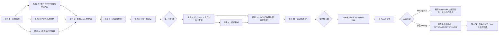

# Git 变更审阅实施计划

**日期**：2026-07-14
**修订日期**：2026-07-16
**对应设计**：[Git 变更审阅能力设计](../specs/2026-07-14-git-diff-review-polish-design.md)
**实施状态**：按 Pierre 渲染窗口驱动的按需正文方案已完成，完整门禁与三路终审均已通过

## 1. 实施目标

把当前错误的：

```text
状态栏 → pier.git.changes 目录树 → pier.git.diff 单文件标签
```

改为：

```text
状态栏 → 当前分组中的稳定 pier.git.changes Review 标签
                         ├─ PierFileTree 导航
                         └─ 一个多文件 PierDiffView / CodeView
```

文件选择只定位同一正文。第一批形成可独立验收的静态只读闭环；第二批形成动态刷新、性能和资源闭环。两批都不实现提交范围、评论或 Git 写动作。

### 1.1 实施结果

- `pier.git.changes` 已成为唯一 Review panel；旧的逐文件 `pier.git.diff` contribution、注册、打开入口和组件已删除。
- Review 在一个标签内组合现有 `PierFileTree` 与一个 `PierDiffView`；树选择只调用官方 `CodeView` 滚动能力。
- 现有 `GitWatchService` 已接入 120ms 合并窗口、单轮尾随刷新和 generation 围栏；刷新期间保留已接受正文。
- index 为全部文件提供稳定的轻量 `renderSlots`，`CodeView.initialItems` 建立完整虚拟列表（拓扑一次建立，同代不因 load 改 id 集合）；正文按 seed（有界首批）+ Pierre 可见/缓冲窗口 + 导航排他 demand 读取。加载器不全量扫读、不无界猜测相邻文件，也没有产品层文件数量门槛或剩余文件提示。窗口需求采用替换语义并保持最多 2 个底层请求在飞；离窗取消的请求在原 Promise 真正结算前仍占用并发槽，不能借取消制造超额并发。已读取正文使用 32 MiB、200,000 行软缓存预算和最近最少使用回收，可见项与树选择目标受保护，离开窗口后立即收敛。刷新双缓冲按全部暂留旧正文的实际合计占用预留额度。
- `PierDiffView` 只解析新增或变化 section，复用未变化的官方 item，并清理删除项缓存，避免渐进加载形成二次解析。Pierre 只有明确接受同一拓扑更新后才推进适配缓存；`updateItem(false)` 在下一动画帧有界重试，连续三次未接受才进入全局可重试渲染反馈。
- `PierDiffView` 的渲染配置只随主题、字体度量和渲染模式变化。拓扑由完整轻量槽一次建立，同拓扑正文变化只投影发生变化的 section 并走官方 `updateItem()`，不再对全部 entry 重建资源、投影或 item；Git Review 以 latest-map 记录最新投影，热路径只提交变化 id，只有拓扑提交、CodeView 重挂或语言切换才完整回放。可见窗口在 Pierre 完成渲染后合并到一个 `requestAnimationFrame`，按 `item id + version` 监督，避免把尚未进入虚拟窗口的正文误判为完成或失败。单项 patch 解析失败只替换该项并显示文件级失败，不能升级为整个 CodeView 空白。
- watch 到达时启动新 index 代，但保留上一接受代的 document loader；新 index 成功接受后才取消并替换旧代，刷新失败后的旧树、正文和最后一次 Pierre 窗口仍可操作。初始基线采集期间的文件事件在基线完成后补发一次重读信号；`status`、`numstat` 或全局 stat 失败会把快照标记为不可靠，基线后持续保守广播，直到可靠快照恢复后再按签名去重。
- 树选择在刷新代际和同代原位投影间保持为显式导航意图：新 index 接受后定位同一稳定槽，并由 Pierre 窗口统一触发读取；若目标先于前置文件完成，只有“从首项到目标项”的投影身份变化才再次校正，目标后方正文更新不触发无意义滚动。正文区域明确的滚轮、触控、指针或滚动键意图以及文件从新 index 删除会清除跨代选择；刷新 `error` / `unchanged` 只终止本代可见性核对，保留仍可显示的旧正文、树选择和预算保护。刷新期间首次显式点击旧正文时允许定位当前已提交投影，但跨代自动恢复仍须等待本代新 revision，旧正文不能冒充刷新成功。Pierre 的任意迟到滚动事件不会被推断为用户输入。显式导航期间只保留目标文件的窗口需求，导航完成后立即恢复 Pierre 报告的完整可见区与缓冲区；导航层独占视口，正文 `updateItem()` 不恢复旧锚点，普通增量更新才保留当前顶部锚点。定位在两个动画帧后核对真实视口，首轮未命中会在 4 秒/120 次双帧的双重上限内有界重发；超时错误在同代后续投影中保持锁存，只能通过明确重试或新的文件选择重启。
- 导航事务同时绑定 `source`、document generation、`sectionKey`、document revision 与 Pierre 官方 item `version`。跨仓库即使出现相同 `entryKey` 也不继承旧选择；刷新时保留的同名旧 section 不能冒充新代定位成功，只有当前 loader 已接受的新 revision 进入真实视口才完成事务。
- Pierre 懒加载或任一当前可见 `item id + version` 在主题、Worker/inline 渲染代内未完成时会进入用户可见错误边界；滚动出现新的未确认 item 会重新启动监督，重试时重建 lazy 资源。Review 被拖到其它分组后再次打开不会因实例 id 冲突静默失败。
- Review 展示生命周期直接订阅所属 Dockview panel 的 `isVisible`：点击另一分组只改变全局 `isActive`，不会清空仍可见的 Review；Git Review 作为重资源面板显式使用 `unmountWhenHidden`，只在同组切换标签时卸载 CodeView、Worker 和请求状态，重新打开后按当前 Git 状态恢复。原 workspace 级资源镜像已删除，避免双重事实源和瞬时焦点竞态。
- index、文件和渲染失败保持本地化主文案，有界技术诊断统一通过宿主“详情”弹窗消费；失败和过期保留提示共用右侧唯一反馈滚动区，总高度不超过 40%。未进入 Pierre 窗口的正文不显示提示。二进制、符号链接、子模块、冲突、未知编码和超大文件不是反馈项，而是按原顺序进入官方 CodeView 的普通文件项。
- watcher 的变更文件 stat、repo-state、缓存标记和仓库锚点探测统一受取消与截止时间约束；同一 Git 根的迟到 stat 批次未结算前不再派发，跨 Git 根原始 stat 还受进程级 32 项上限约束。相同路径的 `realpath` 等探测共享底层 Promise，但每个调用方保留独立 deadline/abort；调用方超时不会提前释放真实底层槽位。路径身份缓存固定 128 项真正 LRU，并在标记变化、最后退订和服务关闭时失效。
- command 与 Git watch IPC 都只接受主 frame；watch START 在昂贵解析前限制每窗口 16 个、全局 64 个不同原始根，同一窗口和原始根跨导航共享完整的 `realpath → git rev-parse --show-toplevel → realpath` 底层探测，每个文档只持有独立可取消 waiter，并限制最多 32 个同时等待者。调用方取消或超时后，解析槽位仍由不可取消的底层 `realpath` 持有，直到真实 Promise 结算，不能通过连续导航提前释放或重复占用配额。成功后 main 返回 `{ leaseId, gitRoot: canonicalRoot }`；preload 以 canonical 身份过滤事件，并在租约就绪时触发一次新鲜度刷新，关闭“首读完成但 watcher 尚未建立”的窗口；STOP 只按稳定租约释放且不再访问可变文件系统。已建立订阅仍限制每窗口 16 个根、每窗口/根 32 个租约、全局 64 个真实根；导航、进程退出、窗口销毁会取消当前文档 waiter 并幂等释放全部租约。Git 单路径输出只移除协议追加的一个 LF，路径自身的空格、Tab、CR、LF 均保留。
- 调度器取消不合作的底层操作时立即归还运行许可，但把同来源的新请求放入既有有界队列；旧操作真实结算后自动调度，新请求自身的截止时间负责永久阻塞。正常刷新抢占不再被误报为 `busy`，同时不会让同一来源的底层调用无界叠加。
- `PierDiffView` 仅在 Review panel 打开后并行预加载；正文配置、Worker、Shiki、吸顶文件头和公开句柄由唯一公开入口及其受限内部模块持有。
- 35 文件首段、增长到 2,001 文件并越过旧 2,000 边界后的未读目标导航、刷新失败时保留旧正文并打开技术详情、恢复后继续按 Pierre 窗口读取、10,000 行虚拟化和 20 次资源激活/隐藏均已进入真实 Electron 测试。
- `tests/integration` 包含真实 `fs.watch` 与临时 Git/worktree 操作，统一关闭测试文件级并行；单文件连续 10/10、整套串行验证通过，避免多个独立 FSEvents 探针并发造成内核事件测试互扰。单元与组件测试仍保持并行。
- 现有单文件读取单元已满足性能门槛，因此没有增加聚合 document API，也没有形成双轨生产路径。

### 1.2 验证证据

| 证据 | 结果 |
| --- | --- |
| 关键定向单元测试 | 22 个文件 / 235 项通过；另有 Pierre、回放、面板与治理四文件压力组合 74/74 通过 |
| `pnpm typecheck` | 通过 |
| `pnpm check` | 通过：462 个单元测试文件 / 4,215 项，33 个组件测试文件 / 437 项，4 个集成测试文件 / 22 项；类型、格式、依赖边界和文件大小门禁同时通过 |
| `pnpm build` | 通过，preload 依赖边界检查通过，产出独立 Pierre Worker 与差异视图分块 |
| `tests/e2e/git-review.spec.ts` | 4/4 通过；覆盖完整多文件 Review、10,000 行滚底与空白帧/长任务、2,001 文件按需导航、当前分组复用和 POSIX 反斜杠路径 |
| 三路独立终审 | 架构/冗余、性能/健壮性、独立验收均为 `findings = 0` |

当前未执行暂存或提交；如需提交，继续按项目规则只暂存明确路径并先展示 staged diff 与提交信息。

定向命令：

```bash
pnpm exec vitest run \
  tests/unit/main/git-watch-path-cache.test.ts \
  tests/unit/main/git-watch-root.test.ts \
  tests/unit/main/git-watch-service.test.ts \
  tests/unit/main/git-watch-signatures.test.ts \
  tests/unit/main/git-watch-subscriptions.test.ts \
  tests/unit/main/ipc-command.test.ts \
  tests/unit/main/ipc-git-watch.test.ts \
  tests/unit/preload/git-api.test.ts \
  tests/unit/renderer/git-diff-governance.test.ts \
  tests/unit/renderer/git-review-code-view.test.tsx \
  tests/unit/renderer/git-review-document-generation.test.ts \
  tests/unit/renderer/git-review-document-loader.test.ts \
  tests/unit/renderer/git-review-failure-state.test.ts \
  tests/unit/renderer/git-review-feedback.test.tsx \
  tests/unit/renderer/git-review-index-loader.test.ts \
  tests/unit/renderer/git-review-panels.test.tsx \
  tests/unit/renderer/git-status-item-config.test.tsx \
  tests/unit/renderer/pier-diff-view.test.tsx \
  tests/unit/renderer/use-git-review-item-replay.test.ts \
  tests/unit/shared/git-review-contract.test.ts
```

## 2. 开工前固定事实

### 2.1 保留的底层能力

- main 路径授权与 `contextId` 校验。
- Git 锚定精确 glob + exclude、前缀碰撞时按路径拆分并使用 literal `R/C` movement probe、NUL 元数据、rename/copy 和反斜杠路径处理。
- index/document revision 围栏。
- `GitReviewBudget`、scheduler、deadline、operationId 和取消。
- 取消向受守卫文件读取传播。
- `PierFileTree`、插件 appearance、i18n 和 panel `openInstance`。
- `@pierre/diffs@1.2.12`、官方 Worker 和 Shiki 边界。
- 2026-07-16 核对 npm 的稳定版 `latest` 仍为 `1.2.12`；不为追新引入 `beta` 版本。

### 2.2 必须删除的结构

- `GIT_DIFF_PANEL_ID`。
- manifest 中的 `pier.git.diff` panel。
- renderer 中 `createGitDiffPanel` 注册。
- `openGitDiffPanel`。
- `git-diff-panel.tsx`。
- 所有把文件路径映射为 dockview instance 的逻辑。
- 测试中“点击树后出现第二个 diff 标签”的期望。

### 2.3 第一批不新增

- 新的 Git watcher。
- commit/branch/ref 范围 schema。
- stage/unstage/discard/copy 命令。
- 评论、选择行、accept/reject。
- 聚合 snapshot IPC。
- 独立设置页中的 Review 分栏宽度选项；本批只复用 `FilePanelLayout` 的本地像素宽度偏好。
- 未被目录树导航消费的 Pierre handle。

### 2.4 批次依赖 DAG

完整控制流 DAG 见[设计文档 5.6 节](../specs/2026-07-14-git-diff-review-polish-design.md#56-完整实施-dag)。实施任务依赖如下：



第一批失败不得进入 watch 与锚点；第二批失败不得准备提交。上图本身无回边；终审发现问题时先输出最早所有者，再为下一轮建立独立 DAG，不能在本轮末端追加补丁层或把所有问题固定回退到任务 8。

## 3. 第一批：单一 Review 标签闭环

### 任务 1：先改测试，锁定正确产品结构

修改：

- `tests/unit/renderer/git-review-panels.test.tsx`
- `tests/unit/renderer/git-plugin.test.tsx`
- `tests/unit/renderer/git-diff-governance.test.ts`
- `tests/unit/renderer/pier-diff-view.test.tsx`
- `tests/e2e/git-review.spec.ts`

新增或改写断言：

1. manifest 和运行时只注册 `pier.git.changes`。
2. 状态入口仍以 `groupId + contextId` 打开稳定 Review instance。
3. Review 加载 index 后为全部文件建立轻量槽位，没有 Pierre 窗口报告时正文读取数为 0，且不调用 `panels.openInstance`。
4. 文件点击先调用 `scrollToItem(firstSectionId)`，由 Pierre 官方窗口决定该文件何时进入正文需求。
5. 已进入 Pierre 窗口的树选择目标优先读取；正文接受后通过 `updateItem()` 原位替换并完成导航。
6. 同路径两个 section 进入同一个 `PierDiffView items`。
7. item 顺序由 index 和 section 顺序决定，不由 Promise 完成顺序决定。
8. 最大在飞 document 请求数固定，2,001 entry 不产生与文件数量等量的同步调用。
9. unmount/source change 取消所有在飞 operationId。
10. E2E 中点击文件后仍只有一个 Review 标签，正文出现 staged/unstaged 两个容器。

先运行：

```bash
pnpm exec vitest run tests/unit/renderer/git-review-panels.test.tsx \
  tests/unit/renderer/git-plugin.test.tsx \
  tests/unit/renderer/git-diff-governance.test.ts \
  tests/unit/renderer/pier-diff-view.test.tsx
```

预期：针对新结构的断言失败，证明测试能捕获旧实现。

### 任务 2：收敛 panel contribution 和打开入口

修改：

- `src/plugins/builtin/git/manifest.ts`
- `src/plugins/builtin/git/renderer/index.ts`
- `src/plugins/builtin/git/renderer/git-review-open.ts`
- `src/plugins/builtin/git/locales/en.json`
- `src/plugins/builtin/git/locales/zh-CN.json`

动作：

1. 删除 `GIT_DIFF_PANEL_ID` 常量和 manifest 条目。
2. 删除 `createGitDiffPanel` import 和注册。
3. 保留 `openGitChangesPanel` 及其当前分组重试逻辑。
4. 每次打开先通过 `listInstances()` 查询同 `componentId + source` 的实际分组；目标分组已有实例就激活，不能只相信旧快照中的 `groupId`。
5. 稳定 instance id 首选：

   ```text
   pier.git.changes:<targetGroupId>:<contextId>
   ```

6. 若首选 id 已被其它分组占用，使用 UUID 生成该目标分组内无冲突实例；标签拖组后在新组复用，在原组重新打开时创建分组内实例。
7. `openInstance` 失败转为本地化通知，不从点击事件同步抛出。
8. 删除仅服务单文件标签的标题、打开和错误文案。
9. 保留 Review loading/empty/error/special-state 实际需要的文案。

验证：

```bash
rg -n "pier\.git\.diff|GIT_DIFF_PANEL_ID|openGitDiffPanel|createGitDiffPanel" \
  src/plugins tests/unit/renderer tests/e2e
```

除迁移说明或明确的“禁止出现”测试外，生产结果必须为空。

### 任务 3：给 `PierDiffView` 增加官方导航与渲染窗口边界

修改：

- `packages/ui/src/diff-view.tsx`
- `tests/unit/renderer/pier-diff-view.test.tsx`

实现：

```ts
export interface PierDiffViewHandle {
  captureTopAnchor(): PierDiffViewAnchor | null;
  isItemVisible(id: string, cacheKey?: string): boolean;
  restoreAnchor(anchor: PierDiffViewAnchor): boolean;
  scrollToItem(id: string): boolean;
  updateItems(
    items: readonly PierDiffViewItem[],
    options?: { preserveAnchor?: boolean }
  ): boolean;
}

export interface PierDiffViewRenderWindow {
  visibleItemIds: readonly string[];
  bufferedItemIds: readonly string[];
}
```

内部持有 `CodeViewHandle`：

```ts
const codeViewRef = useRef<CodeViewHandle>(null);

scrollToItem(id) {
  if (!codeViewRef.current?.getItem(id)) return false;
  codeViewRef.current.scrollTo({
    type: "item",
    id,
    align: "start",
    behavior: "instant",
  });
  return true;
}
```

约束：

- 不查 DOM，不访问 Shadow DOM。
- 不导出 `CodeViewHandle` 或 Pierre 类型。
- 通过公开 `getRenderedItems()` 和容器矩形区分真实可见项与 Pierre 官方缓冲项，不用固定邻居数量、行高或滚动位置猜测。
- `initialItems` 只建立完整稳定拓扑；同 id 内容变化通过官方 `updateItem()` 原位更新，不混用受控 `items`。
- `updateItems()` 只有在全部目标 item 已由 Pierre 接受时返回 `true`。`false` 表示暂时未接受；
  适配器不得提前推进解析缓存或已应用快照，上层读取 latest-map 在动画帧内最多重试三次，
  仍失败时显示一个全局可重试渲染反馈。
- `onPostRender` 与滚动事件只合并报告渲染窗口，不在适配器中发起 Git 请求。
- 重新核对当前 Worker 代理、错误单例、metrics 和 CSS；没有指定 DiffsHub 页面或真实 Electron 失败证据的逻辑删除。

测试：

- id 存在时调用官方 `getItem` 和 `scrollTo`。
- id 不存在时返回 false 且不调用 `scrollTo`。
- 真实容器相交项进入 `visibleItemIds`，其余官方已渲染项进入 `bufferedItemIds`。
- 同拓扑内容变化调用 `updateItem()`，拓扑变化才重建 `CodeView`。
- `updateItem(false)` 不推进缓存，下一动画帧自动重试最新 item；连续三次失败进入全局反馈。
- 2,001 项下单项正文更新和折叠只提交一个 item；显式完整回放才提交全部 item。
- 已加载正文在 Pierre 运行时失败并重挂后从 latest-map 恢复，不重新读取 document。
- adapter 公共类型不泄漏 Pierre 类型。

### 任务 4：实现有界文件资源加载器

新增：

- `src/plugins/builtin/git/renderer/git-review-document-limits.ts`
- `src/plugins/builtin/git/renderer/git-review-document-loader.ts`
- `src/plugins/builtin/git/renderer/git-review-document-resource.ts`
- `tests/unit/renderer/git-review-document-loader.test.ts`

加载器是 renderer 私有纯状态控制器，不包含 React、Git 解析和 UI。

输入：

```ts
interface GitReviewDocumentLoaderInput {
  entries: readonly GitReviewIndexEntry[];
  load(entry: GitReviewIndexEntry, operationId: string): Promise<GitReviewFileDocumentResult>;
  cancel(operationId: string): Promise<void>;
}

interface GitReviewDocumentLoaderControl {
  getSnapshot(): GitReviewDocumentLoaderSnapshot;
  subscribe(listener: (change: GitReviewDocumentLoaderChange) => void): () => void;
  setWindowDemand(demand: {
    visibleEntryKeys: readonly string[];
    bufferedEntryKeys: readonly string[];
  }): void;
  setProtectedEntryKey(entryKey: string | null): void;
  retry(entryKey: string): void;
  dispose(): void;
}
```

状态：

```text
idle → loading → loaded | unchanged | error
loaded → idle（离窗后被软缓存预算淘汰）
error → idle（用户明确重试且该文件仍在窗口需求中）
```

规则：

- 同时在飞最多 2 个 document 请求。
- 构造后全部资源为 idle，Pierre 尚未报告窗口时 document 请求数必须为 0。
- `setWindowDemand()` 完整替换尚未开始的请求：已经进入窗口的当前树目标排第一，其后是 visible 与 buffered；离开窗口的排队项立即丢弃，不追加历史需求。目标请求开始后允许跨占位高度变化造成的短暂窗口漂移保持，用户改变或解除选择时终止保护。
- 已离开窗口的排队请求立即丢弃；在飞请求转为 `cancelling` 并请求取消，但原 Promise 真正结算前继续占用 renderer 并发槽，迟到结果由 operationId 围栏拒绝。只有窗口集合真正变化才执行替换，重复报告不会制造取消。
- 不设文档数量上限。patch 源文档合计 32 MiB、渲染行合计 200,000 是缓存软预算，不是文件展示或读取资格限制。
- 当前真实可见项和树选择目标受保护，允许暂时超过软预算；离窗或解除选择后按最近最少使用顺序立即回收并把资源恢复为 idle。
- 跨代保留旧正文时，按全部暂留文档的实际字节和行数合计预留，不以最大单项近似，也不按文件数截断。
- 树选择不直接调用 load；它先滚动稳定轻量槽，目标进入 Pierre 窗口后走同一 `setWindowDemand()` 路径。
- 每个实际读取使用独立 operationId；同一 entry 不产生重复并发请求，但被 LRU 淘汰、可重试失败或已确认取消的目标可以在同代重读。
- `dispose()` 先同步清空 snapshot、正文缓存、字节/行数/最近使用记录，再取消所有 loading 请求；idle 不发送取消。
- Promise 完成后先比较 operationId 与 disposed，再发布状态；代际由上层在 index 接受后替换整个加载器来隔离。
- snapshot 保持 entry 顺序；返回文档的 section 数量、顺序、sectionKey 和 state 元数据必须与 index `renderSlots` 完全一致后才可发布。
- 单文件失败不清空其它已加载正文；保留可定位的错误状态。
- 没有“延后文件”资源类型、计数、文案或提示组件。

测试矩阵：

| 场景 | 断言 |
| --- | --- |
| 2,001 个 entry，尚无窗口 | load 调用为 0，全部只有稳定轻量槽 |
| 3 个 visible + 1 个 buffered | 只读取这 4 个 entry，最大在飞为 2，visible 优先 |
| 窗口快速切换 | 未开始的旧需求被替换，新窗口成为下一批调用 |
| 同一窗口重复报告 | 不重复读取；缓存命中不重新发 IPC |
| 返回顺序颠倒 | snapshot/item 顺序仍跟 index |
| dispose | 精确取消全部在飞 operationId |
| 完成晚到 | dispose 后不再通知，公开 snapshot 已为空终态 |
| section 槽数量、顺序或 state 元数据不符 | 结果拒绝为可重试内部错误，不污染其它文件 |
| 可见正文超过软预算 | 可见项继续保留；离窗后立即回收至预算内 |
| 刷新中保留多个旧正文 | 按合计占用预留，新旧代总缓存按同一字节/行数口径收敛 |
| 刷新失败后首次点击仍有旧正文的文件 | 定位当前已提交的旧正文投影；本代失败只终止核对，不清除树选择或预留 |

### 任务 5：把 Changes panel 改为完整 Review 控制器

修改：

- `src/plugins/builtin/git/renderer/git-changes-panel.tsx`
- `src/plugins/builtin/git/renderer/git-review-content.tsx`
- `src/plugins/builtin/git/renderer/git-review-code-view.tsx`
- `src/plugins/builtin/git/renderer/git-review-feedback.tsx`
- `src/plugins/builtin/git/renderer/git-review-document-projection.ts`
- `src/plugins/builtin/git/renderer/git-review-index-loader.ts`
- `src/plugins/builtin/git/renderer/git-review-tree.tsx`
- `src/plugins/builtin/git/renderer/git-review-message.ts`
- 删除 `src/plugins/builtin/git/renderer/git-diff-panel.tsx`

组件结构：

```tsx
<FilePanelLayout
  header={<FilePanelHeader ... />}
  sidebar={<PierFileTree ... />}
  sidebarCollapsed={sidebarCollapsed}
  onSidebarCollapsedChange={setSidebarCollapsed}
>
  <div className="flex h-full min-w-0 flex-col">
    <ReviewFeedback />
    <Suspense fallback={<ReviewLoading />}>
      <PierDiffView ref={diffRef} items={items} ... />
    </Suspense>
  </div>
</FilePanelLayout>
```

实现细节：

1. index 请求成功后创建加载器；source 或组件卸载时 dispose。
2. `treeModel.entryByPath` 继续处理文件/目录同名碰撞。
3. 每个投影代一次建立 `firstSectionIdByEntryKey` 与 `itemIndexById` 导航索引；验证轮次通过加载器的单项资源查询和这两个索引保持 O(1)，不从 sectionKey 字符串反解析。稀疏正文更新只按变化 id 判断是否影响当前目标前缀。
4. `onOpenPath` 记录 `entryKey + generation` 导航事务并立即对稳定 `renderSlots[0].sectionKey` 调用 `scrollToItem`；目标进入 Pierre 可见窗口后通过统一窗口需求加载正文，不建立目录树专用读取旁路。
5. 加载器快照与 items 都提交后，只有当前 document revision 对应的 `cacheKey + version` 进入真实 CodeView 视口才结束本轮定位；跨轮树选择仍保留。若同代后续投影在目标前插入 item，提交阶段会按该选择恢复定位；目标后方 item 的变化不恢复，旧代保留正文或目标的短暂可见都不能冒充最终稳定位置。导航超时后锁存当前 `entryKey + generation` 的失败，不因后续投影静默清错或重试。
6. `items` 始终覆盖全部 `renderSlots`：未加载项使用 `patch: null` 直接构造零 hunk 官方 `FileDiffMetadata`，加载后同 id 原位替换为 patch/state section。main 在每个 state section 上保留该 section 自己的状态、旧路径和目标路径，Git 插件 renderer 生成不含真实路径的固定中性补丁并透传这些事实；`@pier/ui` 调用 Pierre 官方 `processFile` 后只覆盖公开 `FileDiffMetadata`，因此沿用同一文件头、折叠、虚拟滚动和导航。禁止用聚合树状态/最终路径覆盖分段事实、把真实 Git 路径拼入补丁语法或自绘状态卡。
7. index loading 使用树/正文共享的 `Skeleton`；空结果使用 `Empty`；index 整体失败使用 destructive `Alert`。
8. 单文件 document 失败不让整个 Review 失败；state section 是可渲染正文，不进入失败计数。
9. `ReviewDocuments` 只建立一个 appearance 订阅，同时驱动状态正文的本地化投影和 `PierDiffView` 主题；使用解析后的 `appearance.locale` 作为状态 item 本地化缓存身份，确保 `language="system"` 时系统 locale 变化也会更新，不能让父子层各持有一份订阅或等待下一次 Git 刷新。
10. 不调用 `panels.openInstance`，不读取 panel 当前 group 做文件操作。

布局复用：

- 直接复用 Files 使用的 `@pier/ui/file-panel-layout.tsx`、`FilePanelHeader` 和 `PierFileTree` 结构，不在 Git 插件复制 Resizable 组合。
- Review 使用独立本地偏好键 `pier.git.review.treeWidthPx`；像素保持、最小宽度和最大 50% 由共享布局实现统一负责，它不是设置页选项。
- Git Review 注册 `resourcePolicy: "unmountWhenHidden"`：跨分组失焦时 `isVisible` 仍为 true，不卸载；同组隐藏时释放 CodeView、Worker 与请求资源。
- `className` 只包含布局、overflow 和语义背景，不覆盖组件颜色或字体。

### 任务 6：更新治理、宿主和布局测试

修改可能涉及：

- `tests/unit/renderer/git-diff-governance.test.ts`
- `tests/unit/renderer/plugin-panel-instances.test.ts`
- `tests/unit/renderer/sanitize-saved-layout.test.ts`
- `tests/component/plugin-panel-host-boundary.test.tsx`

要求：

- 宿主仍允许旧布局中的未知 `pier.git.diff` 被正常丢弃或降级，不能导致整个布局恢复失败。
- 新生产注册只包含 `pier.git.changes`。
- Git 插件仍只经 `packages/ui` 使用 Pierre。
- 禁止 `@pierre/diffs` 出现在 Git 插件 renderer。
- 禁止 `querySelector("diffs-")`、`shadowRoot`、`FileDiff`、`PatchDiff` 和自绘行。
- `PierFileTree` 与 `Resizable` 直接从 `@pier/ui` 消费。

### 任务 7：第一批验证

依次运行：

```bash
pnpm exec vitest run tests/unit/renderer/git-review-document-loader.test.ts
pnpm exec vitest run tests/unit/renderer/git-review-panels.test.tsx
pnpm exec vitest run tests/unit/renderer/pier-diff-view.test.tsx
pnpm exec vitest run tests/unit/renderer/git-diff-governance.test.ts
pnpm typecheck
pnpm lint
pnpm build
```

真实 Electron：

```bash
pnpm exec playwright test --config playwright.config.ts tests/e2e/git-review.spec.ts
```

人工检查：

1. 在两个 dockview 分组分别从状态栏打开 Review，标签落在各自分组。
2. Review 保持在一个分组可见，点击另一分组终端；Review 树和实际 diff 正文不得空白。
3. 同一分组重复打开只激活一个 Review 标签。
4. 连续点击多个文件，标签数不增加且正文定位正确。
5. staged + unstaged 同路径显示两个 diff item。
6. 深浅主题切换后语法高亮与 Files 编辑器一致。
7. 关闭 Review 后 Worker 终止数回到创建数。

第一批退出条件：上述命令和人工检查全部通过，且 `rg "pier.git.diff" src/plugins` 无生产结果。

## 4. 第二批：动态刷新、性能和资源闭环

第一批验收后才开始；不提前添加生产接口。

### 任务 8：接入唯一 Git 新鲜度信号

修改：

- `src/main/services/git-watch-contract.ts`
- `src/main/services/git-watch-internals.ts`
- `src/main/services/git-watch-service.ts`
- `src/plugins/builtin/git/renderer/git-changes-panel.tsx`
- 现有 Git watch facade 和测试文件

规则：

- 只扩展现有 `context.git.watch(gitRootPath, listener, onStartFailure)`，不增加第二套 watcher；preload 必须校验 START 返回的 canonical 租约，把 `false`、畸形响应或拒绝传回，Review 的 Retry 同时重新订阅并重读 index。
- command 与 Git watch IPC 在解析 payload、注册 client 或触碰文件系统前先确认 `senderFrame === sender.mainFrame`；子 frame 与缺失 frame 一律拒绝且无副作用。
- watch 输入先复用 `gitReviewRootPathSchema`；昂贵规范化在每窗口 16、全局 64 个不同在飞原始根的准入之后执行，同一窗口的相同原始根共享完整 Promise。随后以 5 秒截止时间执行 `realpath(request) → git rev-parse --path-format=absolute --show-toplevel → realpath(result)`；只有规范化后的真实 Git 根可以进入订阅表，同一根的符号链接别名必须去重。
- START 成功后由 main 创建不透明租约并返回 canonical 根；preload 用 canonical 根过滤广播，STOP 只提交租约，不重新解析路径。订阅表固定每窗口 16 个根、每窗口/根 32 个租约、全局 64 个不同真实根；超过上限返回失败且不调用底层 watch。窗口导航、renderer 退出和销毁同时取消待定 root 解析与全部租约。
- `rev-parse` 的单路径输出只移除最后一个协议 LF；gitDir 与 commonDir 必须分别读取，禁止 `trim()` 或按 LF 拆多路径，确保合法尾空白与内嵌 LF 不被改写。
- `fs.watch` 的 `EMFILE` 等瞬时创建失败由 main 在先注册 entry 与兜底轮询后按冷却窗口恢复；`onStartFailure` 只承接 IPC、窗口或其它无法建立订阅的边界失败，不要求每个 renderer 消费者重建底层 watcher。
- 事件合并窗口固定，当前刷新运行时只记录一轮尾随刷新。
- 每轮刷新分配 generation；旧 generation 的 index/document 结果全部丢弃。
- source change 先取消旧代，再订阅新 source。
- watch 失败不能触发 renderer 紧接着无界扫描。

### 任务 9：保持阅读位置

只在本任务开始时给 `PierDiffViewHandle` 增加最小锚点接口：

```ts
interface PierDiffViewAnchor {
  id: string;
  offset: number;
}

captureTopAnchor(): PierDiffViewAnchor | null;
restoreAnchor(anchor: PierDiffViewAnchor): boolean;
```

实现只能通过公开 `CodeViewHandle.getInstance()`、`getRenderedItems()` 和 `scrollTo()`，不查 Shadow DOM。

刷新策略：

- entry/section id 和顺序不变：官方 `updateItem()` 原地协调，保持当前滚动。
- 新增、删除、重排：替换前 capture，commit 后 restore。
- 锚点 item 已删除：按旧顺序选择后继，其次前驱，最后顶部。
- 用户在刷新过程中主动点击树时，用户导航优先于旧锚点恢复。
- 该树选择跨成功刷新代和同代渐进投影保持：新代继续复用最后一次 Pierre 窗口并再次 `scrollToItem`，同代只在目标及其前缀的 `id + cacheKey` 身份变化时再次校正，目标后方 item 到达不重复滚动；不能因旧代同 section 或目标占位曾短暂可见就提前清除。patch 与 state 都是可定位正文。用户真实滚动或目标从新 index 删除会清除跨代选择；`error` / `unchanged` 只结束本代可见性核对，旧正文、选择和预算保护继续保留。刷新期间首次显式树点击可以定位当前已提交的旧正文投影，跨代自动恢复则仍等待本代新 revision。
- `CodeView` 的 `onPostRender` 与 `onScroll` 只用于渲染窗口报告和可见性审计，不能反推用户意图；只有正文根上的明确滚轮、触控、指针和滚动键事件进入“用户主动滚动”的清理分支。
- `scrollToItem` 后经过两个动画帧核对目标 item 与真实滚动视口相交；首轮不相交时在固定时间和次数双重上限内重发。成功、用户取消、本代资源终态和超时反馈是四个完备核对出口，禁止留下无限动画帧循环；“本代资源终态”只结束核对，不等于清除跨代树选择。超时出口必须保留错误与失败代标记，直到明确重试、新选择或新代开始。
- 首次自动恢复完成后，用户主动滚动立即清除待恢复锚点，后续渐进正文到达不能反复把视口拉回。

### 任务 10：性能测量与读取路径收敛

夹具：

- 35 文件，贴近状态栏截图场景。
- 2,001 文件真实 Electron 规模夹具，每文件 200 行，前 35 个用于首次首段，随后增长到全部变更；该数量用于越过旧 2,000 边界，不是新的产品上限。
- main 的 2,001 entry 夹具与分散的 binary、rename/copy、特殊路径夹具共同覆盖解析边界；不为了形式上的单一大夹具复制已有场景。
- 单文件 10,000 行。

门槛：

- 自动化单次回归门槛：35 文件首次首段可见 ≤2 秒。
- 自动化单次回归门槛：2,001 文件下缓存目标导航 ≤500ms；未读目标从点击到显示 ≤2 秒。
- 2,001 entry 在 Pierre 首次窗口前 document 请求为 0；窗口出现后同步在飞请求 ≤2，实际读取集合等于可见项与官方缓冲项；真实规模路径 renderer 无 >100ms long task。
- 10,000 行滚动无连续超过 2 帧或 100ms 白屏。

这些是确定性的回归阈值，不冒充统计 p95。若要把 p95 作为发布门禁，必须在固定机器、同一构建和同一夹具上独立冷启动至少 20 次并保存原始样本。本任务不新增只服务对照数字的裸 CodeView 产品或测试入口；官方无偏移由唯一公开适配器入口、受限内部导入、选项治理测试和真实 Electron 行为共同证明。

若单文件读取单元不能满足门槛：

1. 在 main 引入实际被 Review 消费的有界批量/聚合 document API。
2. 复用现有 index resolution、path guard、patch material、预算和取消。
3. 一批结果使用同一 index revision，并继续受总字节、截止时间和取消约束；批量读取只消费当前 Pierre 可见区与官方缓冲区，不得截断完整目录树或引入产品层文件数量上限。
4. renderer 切换后删除 `getReviewFileDocument` 公共 facade/command/schema；底层 builder 若仍被批量读取调用则保留。
5. 禁止两条公共生产读取路径长期并存。

### 任务 11：资源与失败验证

- 慢文件系统下取消必须中断 `lstat/realpath/open/read` 链并释放 scheduler permit。
- 连续 20 次打开/关闭，经 CDP GC 后 retained heap 增量 ≤10 MiB 或 ≤10%。
- Worker created 与 terminated 数量在 2 秒内相等。
- watcher listener 由 dispose 计数测试证明；operation lease、scheduler permit、临时目录和受守卫读取分别由 main 取消测试证明释放。若未来提供不污染生产接口的统一诊断快照，再增加真实 Electron 精确基线断言。
- 刷新失败保留旧正文，并使用 `Alert` 提供明确失败；恢复后清除 stale 状态。
- 空 index 的刷新失败同样显示 `Alert`；source 切换在渲染阶段先隔离旧 index，不能以新仓 scope 读取旧 entry。
- 可重试单文件失败显示明确 Retry，失败的有界技术诊断必须被反馈消费。
- 100 个 watch 事件只执行当前轮和一轮尾随。

第二批退出命令：

```bash
pnpm check
pnpm build
pnpm exec playwright test --config playwright.config.ts tests/e2e/git-review.spec.ts
```

## 5. 提交边界

本任务改动较多，提交时按项目规则执行：

1. 只 stage 本任务明确路径，禁止 `git add .`。
2. 展示 `git diff --staged` 摘要和完整拟用 Conventional Commit message。
3. 等待用户确认后再 commit。

建议提交拆分不超过两个：

```text
refactor(git): unify changes into a multi-file review tab
feat(git): keep review resources fresh and bounded
```

若第二批未进入本轮，不创建空提交或占位代码。
