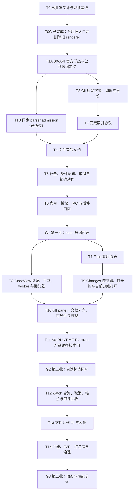

# Git 差异审阅能力完善实施计划

> **实施要求：** 使用 `superpowers:subagent-driven-development`（推荐）或 `superpowers:executing-plans` 按任务执行；用复选框（`- [ ]`）记录进度。

**目标：** 以三个可独立验收的批次交付 Git 变更索引、当前分组文件标签、官方 DiffsHub `CodeView` 审阅面和安全文件动作；不复制 Files 目录树、Pier 标签系统或 diff 正文实现。

**架构：** main 的 `GitReviewService` 独占查询解析、原始字节、路径防护、调度、资源预算、版本围栏和写动作；shared 只暴露 Pier 自有契约。renderer 的 Changes panel 复用 `PierFileTree` 并通过 `context.panels.openInstance` 打开当前 group 新标签；diff panel 复用 Pier 文档外壳。`packages/ui/diff-view` 是唯一 `@pierre/diffs` 导入边界，采用受控 `CodeView`、官方 worker/provider 和补丁优先数据，不调用受控模式禁止的命令。

**技术栈：** Electron 43、React 19.2.7、TypeScript 6 strict、Zod、dockview-react 7.0.2、Tailwind CSS v4、shadcn、`@pierre/diffs@1.2.12`、Shiki 4.3.1、Vitest 4、Playwright、pnpm 11。

**批准设计：** [2026-07-14-git-diff-review-polish-design.md](../specs/2026-07-14-git-diff-review-polish-design.md)

**已完成前置清理：** 旧 `pier.git.changes` panel、打开命令、状态下拉入口和手写 diff renderer 已原子移除；manifest 不再声明 panel 或 `panel:*` 权限。历史布局中的旧 panel 由现有布局清洗器剔除。新 Changes panel 必须在任务 9 作为新贡献重新建立，不能恢复旧实现或临时静态树。

**实施状态：** 已开始实施。T1 的上游研究证据和 T2–T4 所需 shared 契约已完成；没有生产消费者的 `@pierre/diffs` 依赖、UI 适配器、语言映射和 T5+ 操作契约均未提前落入代码。T2 的原始 Git 执行、聚合预算、调度、身份解析、观测与不可变缓存已经完成；T3 的 NUL 安全索引和 T4 的 patch-first 文件文档已经通过定向回归与静态检查，当前进入 T5。

---

## 1. 实施纪律和完成定义

1. 只设三个交付批次。任务是批次内的依赖节点，不得把任务拆成更多对用户不可验收的小批次。
2. 两道技术门互不替代：`S0-API` 在公共契约前确认官方类型与受控模式；`S0-RUNTIME` 在产品 panel 接入后确认 Electron、worker、Shiki、虚拟化和清理。
3. diff 正文严格使用规范性页面 [DiffsHub `oven-sh/bun#30412`](https://diffshub.com/oven-sh/bun/pull/30412) 对应的 `@pierre/diffs@1.2.12` `CodeView`。不设计正文 UI，不用 `FileDiff`、`PatchDiff`、`MultiFileDiff`、自绘行或近似截图替代。
4. `CodeView` 固定为受控 `items`：刷新发布新的不可变数组，以稳定 `id` 和单调 `version` 协调；禁止调用 `updateItem`、`addItems`、`updateItemId`。
5. Git Changes 只渲染现有 `PierFileTree`。不得增加递归树模型、自绘 tree row、第二套键盘导航或虚拟列表。
6. 标签打开只能经 `context.panels.openInstance`；在单击、Enter、双击或右键发生时读取来源 panel 的当前 `group.id`。不得直接导入 dockview 运行时 API。
7. 所有 Git 进程仍由 `git-exec.ts` 创建、限时、取消和回收。Git 业务 renderer 不执行 Git、不手写解析 patch、不做路径安全判断；只有 `packages/ui/diff-view` 调用官方 parser。
8. 所有公开请求的截止时间与资源预算是整次操作的聚合预算，不是每条子命令各自重置。
9. 每个任务先写失败测试，再做最小实现，再跑定向验证；批次门失败时停止依赖它的后续任务。
10. 用户动作必须有自然 UI 变化、通知或详情弹窗之一；Git 插件统一走 `context.dialogs` / `context.notifications`，不得直接导入宿主 dialog 或 `sonner`，也不得只写 `console.error`。
11. 本计划不创建提交。若用户之后授权，仍须精确暂存、展示 staged diff 和拟用提交信息并再次确认。

## 2. 完整任务 DAG



### 2.1 关键依赖路径

```text
规范页面/官方类型
  → 已完成旧入口与旧 renderer 清理
  → S0-API 官方形态（T1A）
  → Pier 公共契约
  → 原始字节 runner + 聚合预算 + 调度器
  → NUL 索引协议

同步 parser 精确夹具 → p95 <50ms → 冻结 admission（T1B） ─┐
NUL 索引协议 ───────────────────────────────────────────────┴→ patch-first 文档
  → operationId / revision / 精确动作
  → 原子命令接线
  → 第一批门

Files 共用原语 ─┐
                 ├→ Changes 树 → 当前 group 打开 ─┐
官方 CodeView ─→ UI 适配 + worker + 懒加载 ───────┼→ 产品 diff panel
                                                     → S0-RUNTIME
                                                     → 第二批门

GitWatch 唯一信号源 + 可见性 + 操作租约
  → 刷新合流/取消/锚点/回收
  → 精确文件动作 UI
  → 性能、打包态、E2E 与治理
  → 第三批门
```

### 2.2 禁止出现的旁路

```text
renderer ─X→ child_process / Git patch parser / 文件系统
Git panel ─X→ Files 插件 renderer 私有模块
业务代码 ─X→ @pierre/diffs
业务代码 ─X→ dockview 运行时
CodeView 受控模式 ─X→ updateItem/addItems/updateItemId
动作成功 ─X→ 主动刷新 + watch 再刷新两次
隐藏 panel ─X→ 常驻 CodeView/worker/正文
```

---

## 3. 第一批：主进程数据闭环

### 任务 1：完成上游研究与 T2–T4 基础契约

**目的：** 先记录官方能力和同步解析性能边界，再定义 T2–T4 当下真实消费的 Pier 契约。没有生产消费者的依赖、UI 公共导出和未来操作契约不在本任务实现。

**文件：**

- 新增：`src/shared/contracts/git-review.ts`
- 新增：`src/shared/contracts/git-review/primitives.ts`
- 新增：`src/shared/contracts/git-review/base.ts`
- 新增：`src/shared/contracts/git-review/document.ts`
- 新增：`tests/unit/shared/git-review-contract.test.ts`
- 新增：`docs/superpowers/evidence/diffs-upstream-api-verification.md`

**步骤：**

- [x] 对规范页面、固定上游 commit、npm 稳定版和公开类型做只读核对，记录以下约束；本任务不安装 `@pierre/diffs`，不增加 `packages/ui` 生产入口：
  - `CodeView` 接受受控 `items`；
  - patch item、old/new text item、虚拟化选项、theme/itemMetrics、`WorkerPoolContextProvider`、`scrollTo({ type: "line", ... })`、selection/scroll 事件的实际签名；同时锁定 `fontFamily`/`fontSize` 不存在，字体由 Pier 外层映射官方 `--diffs-font-*` CSS 变量，不能误当普通继承；
  - 受控模式不能依赖 `updateItem`、`addItems`、`updateItemId`；
  - 官方 source metadata 能表达文件标题、语言和新旧路径，业务 group 标题需由 Pier 外层表达。
- [x] 以一次性技术验证测量 1 MiB 与 768 KiB 候选，记录 768 KiB、20,000 行和 64 KiB 单行边界；T4 只消费纯文本准入常量和计数器，不提前引入官方 parser。T8 安装真实依赖并建立独立性能门。
- [x] 验证记录写明 DiffsHub URL、核对日期、`@pierre/diffs@1.2.12` tarball integrity、目标配置、`worker-portable.js` 与 `worker.js` 取舍、CodeView 公共 handle/option 清单，以及“无 hunk hydrate 回调”的结论。
- [x] 以 `git-review.ts` 为唯一公共入口，用 `git-review/` 内按职责拆分的 Zod/TypeScript 同源定义约束契约，并以设计稿类型名为唯一命名表：
  - `GitReviewQuery` 与请求开始时解析后的 `GitReviewResolvedQuery`；
  - `GitReviewScope={contextId,gitRootPath}`，以及在其上增加 path/query 的 `GitDiffPanelSource` 与稳定 identity；
  - 含 `groupStatuses` 的去重 `GitReviewIndexEntry`；
  - 当前 T4 消费的 `patch | state` 判别联合 `GitReviewFileSection`；
  - `GitReviewFileDocumentResult`；
  - `operationId`、`revision`、`notModified`；
  - 固定 reason、`retryable`、安全用户文案键和内部诊断字段分离的错误；
- [x] `contentRequirement` 只在 main 调度层派生；hydrate、按需 patch、文件动作、取消和 commit 搜索契约分别在 T5/T6 出现真实消费者时引入。
- [x] `state` 不伪装成 CodeView item；`texts` section 留到 T5 的补全能力同时实现。
- [x] 运行契约测试和类型检查。若官方 API 与设计冲突，停在本任务修订设计，不进入任务 2。

**验证：**

```bash
pnpm exec vitest run tests/unit/shared/git-review-contract.test.ts --no-file-parallelism
pnpm typecheck:host
```

**验收证据：** 上游研究记录不进入生产公共 API；shared 不出现任何 `@pierre/diffs` 类型，只包含 T2–T4 已消费契约。`@pierre/diffs` 安装、公共导出、官方 parser 回归、profile 和运行时性能门全部归 T8，并必须与真实 `CodeView` 消费者同批落地。

### 任务 2：扩展唯一 Git runner，加入聚合预算、调度与身份

**目的：** 建立后续所有读取共用的字节安全、取消、限流和版本基础。

**文件：**

- 修改：`src/main/services/git-exec.ts`
- 新增：`src/main/services/git-exec-raw.ts`、`git-exec-raw-contract.ts`、`git-exec-raw-utils.ts`、`git-exec-nul-record-parser.ts`
- 新增：`src/main/services/git-review/git-review-budget.ts`
- 新增：`src/main/services/git-review/git-review-operation.ts`、`git-review-scheduler.ts`、`git-review-scheduler-contract.ts`、`git-review-scheduler-policy.ts`、`git-review-scheduler-internal.ts`、`git-review-scheduler-observer.ts`、`git-review-execution-budget.ts`
- 新增：`src/main/services/git-review/git-review-observer.ts`、`git-review-observer-contract.ts`、`git-review-fingerprint.ts`
- 新增：`src/main/services/git-review/git-review-identity.ts`、`git-review-identity-contract.ts`、`git-review-identity-boundary.ts`、`git-review-commit-lru.ts`
- 新增：`tests/unit/main/git-exec-raw.test.ts`
- 新增：`tests/unit/main/git-review-budget.test.ts`
- 新增：`tests/unit/main/git-review-scheduler.test.ts`
- 新增：`tests/unit/main/git-review-scheduler-raw.test.ts`、`git-review-observer.test.ts`、`git-review-commit-lru.test.ts`
- 新增：`tests/unit/main/git-review-identity.test.ts`

**步骤：**

- [x] 在现有 `git-exec.ts` 增加 `createExecGitRaw(args, options)` raw core；现有 `createExecGit(args, options)` 继续包装它并保持文本签名。`cwd`、mode、signal、stdin、record consumer、deadline 和 byte limit 全在 options，不建立第二个 spawn 底座。
- [x] runner 返回 raw `Buffer`；错误保留退出码、被截断的 stdout/stderr 原始字节、timeout/abort/limit 类型，并执行 1.5 秒 kill grace 与最终有界结算。
- [x] collect/stream 模式互斥：collect 才累计 stdout；stream 只保留 ≤1 MiB 未完成 record 并逐条提交。记录数到 2,000 时返回完整 records + truncated warning；半条 record、单 record/总字节超限、超时或 Git 错误返回 typed failure。
- [x] stdout/stderr 诊断各只留 64 KiB 尾部并记录总字节；stdin ≤8 MiB，覆盖 backpressure、EPIPE、abort-before-spawn 和 abort 关闭 stdin。
- [x] 建立每个公开请求唯一 `GitReviewBudget`：总截止 15 秒、Git 输出累计 64 MiB、最多 2,000 文件；所有子命令从同一对象扣减，硬门只允许下调。
- [x] 调度器 key 包含 `contentRequirement`：`conditional` 与 `full` 不合并；其余相同 key 才合并。全局运行 4、单仓库 2、单 source 1；pending 全局 64、每仓库 16、每 source/operation kind 仅一个尾随 watch。仓库轮询、优先级老化、最新 watch 获胜和容量门均已覆盖。
- [x] operation lease 持有消费引用；关闭、换 source、owner release 或 supersede 释放租约，旧操作不能取消或复活新操作。
- [x] operation 状态固定 queued/running/settled/cancelled 且仅一次终态；canonical observer 与 transition FIFO 在同步嵌套回调下保持单调顺序，owner/watch/operation reservation 覆盖实际交付窗口。
- [x] 身份解析支持 SHA-1/SHA-256、root commit 和 unborn HEAD；空树 OID 由仓库对象格式生成，不硬编码 SHA-1 常量；并行 sibling 取消后等待有界回收。
- [x] commit 只读缓存为严格 JSON-like 深冻结 LRU，总量硬门 32 MiB；未提交 source 不跨请求长缓存。
- [x] 单元测试覆盖公平、优先级、同 lane 替换、容量、同步嵌套重入、立即取消、owner 释放、三类预算分化、raw 子进程竞态、root/unborn、两种对象格式和一次终态观测。

**验证：**

```bash
pnpm exec vitest run tests/unit/main/git-exec.test.ts tests/unit/main/git-exec-raw.test.ts tests/unit/main/git-review-budget.test.ts tests/unit/main/git-review-scheduler.test.ts tests/unit/main/git-review-scheduler-raw.test.ts tests/unit/main/git-review-observer.test.ts tests/unit/main/git-review-identity.test.ts tests/unit/main/git-review-commit-lru.test.ts --no-file-parallelism
pnpm typecheck
```

**验收证据：** 主会话定向测试 8 个文件 159 项通过，完整单元测试通过，`pnpm typecheck`、`pnpm lint`、`pnpm depcruise`、`pnpm check:file-size` 与 `git diff --check` 均通过。第六轮架构、执行/冗余、性能/健壮性审查均无 P0/P1，并明确允许进入 T3。

### 任务 3：实现 NUL 安全的变更索引协议

**目的：** 用固定数量、可流式解析的 Git 命令得到目录树索引；不读取文件正文。

**文件：**

- 新增：`src/main/services/git-review/git-review-index.ts`
- 新增：`src/main/services/git-review/git-review-index-contract.ts`
- 新增：`src/main/services/git-review/git-review-index-protocol.ts`
- 新增：`src/main/services/git-review/git-review-index-primary-parser.ts`
- 新增：`src/main/services/git-review/git-review-index-raw-parser.ts`
- 新增：`src/main/services/git-review/git-review-index-numstat-parser.ts`
- 新增：`src/main/services/git-review/git-review-index-assembler.ts`
- 新增：`src/main/services/git-review/git-review-index-execution.ts`
- 修改：`src/main/services/git-review/git-review-identity.ts`
- 修改：`src/shared/contracts/git-review/primitives.ts`
- 修改：`src/shared/contracts/git-review/base.ts`
- 新增：`tests/unit/main/git-review-index-parser.test.ts`
- 新增：`tests/unit/main/git-review-index.test.ts`
- 新增：`tests/fixtures/git-review/README.md`

**步骤：**

- [x] 未提交查询使用 `git --literal-pathspecs status --porcelain=v2 -z --ignore-submodules=none --untracked-files=all`，并按需配合 staged/unstaged `--numstat -z`；命令数量为常数，不按文件 N+1。
- [x] commit/branch 查询使用 `--raw -z` 与 `--numstat -z` 的 NUL 协议；branch 先解析请求开始时 HEAD，再固定 merge-base → resolved HEAD。
- [x] 所有索引命令都使用全局 `--literal-pathspecs`，固定范围命令以 `--` 终止参数解析；测试包含 `:(glob)`、换行、制表符、前导短横线和非 UTF-8 文件名字节。单路径 `-- <path>` 约束由 T4 正文命令验收。
- [x] 文件名严格 UTF-8 解码；不可表示的名字返回稳定 warning 并跳过，不用替换字符制造错误路径。
- [x] rename/copy 检测显式覆盖用户配置并设置 `-l2000`；非截断请求根据 C locale 官方提示返回类型化警告，已有 `filesTruncated` 时不为读取警告而继续昂贵计算。
- [x] porcelain 事实门、物理 NUL record 门与 2,000 个最终逻辑文件门分离；uncommitted primary 最多保留 4,000 个事实并用第 4,001 个事实判定截断，最坏 8,002 records。raw/numstat 仍在完整第 2,001 个 tuple 后截断，最坏 6,003 records。
- [x] 索引与 document 共用五类 `GitReviewGroup`；`commit/branch/conflict` 各自只能作为唯一 group，禁止把 commit/branch 伪装成 staged。
- [x] 合并 staged/unstaged 时路径只出现一次，`groupStatuses` 保留每个范围状态；rename 同时保留 old/new path。
- [x] 排序按规范化展示路径稳定排序，目录聚合只产生现有 `PierFileTree` 所需的扁平条目。
- [x] 测试断言命令次数、NUL 跨 chunk、rename/copy/typechange/submodule/untracked/deleted、root/unborn、SHA-256、共享预算与取消；不得断言人类可读 `git diff` 文本。

**验证：**

```bash
pnpm exec vitest run tests/unit/main/git-exec-raw.test.ts tests/unit/main/git-review-budget.test.ts tests/unit/main/git-review-scheduler.test.ts tests/unit/main/git-review-identity.test.ts tests/unit/main/git-review-index-parser.test.ts tests/unit/main/git-review-index.test.ts tests/unit/shared/git-review-contract.test.ts
pnpm typecheck
pnpm lint
pnpm depcruise
pnpm check:file-size
```

**当前验证证据：** [T3 Git 变更索引验收记录](../evidence/git-review-index-t3-verification.md) 已记录命令 DAG、需求矩阵与限制。上述 7 个测试文件 175 项通过；`pnpm typecheck:host`、`pnpm lint`、`pnpm depcruise`、`pnpm check:file-size` 与 `git diff --check` 均通过。覆盖调度器 → 索引共享预算、组装与最终结果阶段超时、主动取消、下调/零剩余文件上限、非仓库与非法引用错误分类、纯索引围栏摘要、链式 rename/copy 及单组选中路径、2,000/2,001 条非相邻 rename 链、SHA-256 未产生首个提交的仓库、根提交、固定分支范围、真实子模块配置覆盖、8,002/6,003 条 NUL 边界、4,000 个事实的原子上限和非法 UTF-8 路径压力。架构、执行/冗余、性能/健壮性三路终审均无 P0/P1，T4 已准入。

### 任务 4：实现 patch-first 文件审阅文档

**目的：** 为所有查询范围产生可复现、可预算、可条件请求的文件级文档。

**文件：**

- 新增：`src/main/services/git-review/git-review-document.ts`
- 新增：`src/main/services/git-review/git-review-document-envelope.ts`
- 新增：`src/main/services/git-review/git-review-document-observation.ts`
- 新增：`src/main/services/git-review/git-review-document-patch.ts`
- 新增：`src/main/services/git-review/git-review-document-patch-contract.ts`
- 新增：`src/main/services/git-review/git-review-path-guard.ts`
- 新增：`src/main/services/git-review/git-review-path-contract.ts`
- 新增：`src/main/services/git-review/git-review-path-operation.ts`
- 新增：`src/main/services/git-review/git-review-service.ts`
- 修改：`src/main/services/git-review/git-review-observer-contract.ts`
- 修改：`src/main/services/git-review/git-review-scheduler-contract.ts`
- 修改：`src/main/services/git-review/git-review-scheduler-observer.ts`
- 修改：`src/main/services/git-review/git-review-scheduler-policy.ts`
- 修改：`src/main/services/git-review/git-review-index.ts`
- 修改：`src/main/services/git-review/git-review-index-assembler.ts`
- 新增：`tests/unit/main/git-review-document.test.ts`
- 新增：`tests/unit/main/git-review-document-cleanup.test.ts`
- 新增：`tests/unit/main/git-review-document-envelope.test.ts`
- 新增：`tests/unit/main/git-review-path-guard.test.ts`
- 新增：`tests/unit/main/git-review-service.test.ts`
- 新增：`tests/unit/main/git-review-service-reuse.test.ts`
- 新增：`tests/unit/main/git-review-service-cache-observation.test.ts`

**步骤：**

- [x] 普通 tracked document 先消费 `GitReviewIndexReader.resolve()` 同一 revision 下的 main-only group 路径，再以固定 OID/index/worktree 范围和 `--literal-pathspecs -- <oldPath?> <targetPath>` 生成单文件 patch；生成后校验 patch 只包含该范围路径。不得从公共 `oldPaths` 顺序猜映射，不预读 old/new 两份 blob。只有完整上下文、内容分类确有需要时才通过 blob OID + `git cat-file` 或同一 worktree fd 读取；不拼 `<ref>:<path>`。
- [x] 每个可渲染范围默认只返回 patch section；不同时携带 old/new 全文。二进制、submodule、目录、超过 renderer 768 KiB/20,000 行 admission、不可解码和冲突返回类型化状态，但复制 patch 仍可按 main 8 MiB 上限按需获取。
- [x] 单 patch section 最多 8 MiB，单 document IPC 所有字符串 UTF-8 合计最多 16 MiB，单行最多 64 KiB，最多 100,000 行；超限返回明确 state/error，不截出不可解析 patch。
- [x] staged + unstaged 按未暂存 → 已暂存形成两个 section；外层 group/header metadata 明确，不把业务标题塞进第三方私有字段。
- [x] copy 源在同一范围也有修改时，允许 Git 返回多个 raw/patch envelope，但只按索引事实选择唯一 copy 条目；重复或缺失匹配仍作为协议/stale 错误。
- [x] worktree 路径先 lexical containment，再逐级 `realpath`；Git 相对路径只以 `/` 分段，POSIX 反斜杠保持字面值。拒绝中间 symlink；macOS 最终使用内核级 `O_NOFOLLOW_ANY | O_NONBLOCK`，其它平台使用 `O_NOFOLLOW | O_NONBLOCK`，`fstat` 后只允许 regular file。FIFO/socket/device/目录返回类型化状态，不阻塞线程池；读取/哈希基于同一 fd，并在读取后复核全部祖先身份。signal 覆盖路径解析、打开、读取和复核，迟到 open 句柄必须回收。变化时有限重试，仍变化则 `staleRevision`。
- [x] untracked 从 fd bytes 在 main 受控临时目录同时隔离 `GIT_INDEX_FILE` 与 `GIT_OBJECT_DIRECTORY`，真实 ODB 仅作 alternate；用 `hash-object -w --stdin` 和 `fstat` 的 100644/100755 mode 写临时 index，生成 `/dev/null → literal path` patch。成功/取消/失败统一清理，真实 index/object count/worktree 不变。
- [x] revision 覆盖 resolved query、blob/index/worktree fence、范围顺序和内容类型；`ifRevision` 命中返回 `notModified`，不重复 IPC 正文。
- [x] before/after 两次索引探测各自保留 2,000 文件局部门，同时把已接纳文件累计到同一个公开请求预算和共享 late-lease 预算。
- [x] 相同内容 revision 可复用缓存；未提交内容和 branch 只允许请求内/in-flight 复用，watch 后必须失效。
- [x] 测试覆盖 staged+unstaged、deleted/added/rename、untracked 文本/二进制/可执行文件且真实 index/object count 不变、submodule、冲突、超大、CRLF、无末尾换行、变化中读取、symlink race、FIFO/socket/device 不阻塞、pathspec magic 和条件命中；真实链式 `a→b→c` 必须证明 source `c` 的 staged section 使用 `a→b`、unstaged section 使用 `b→c`，index revision 变化时返回 stale。

**验证：**

```bash
pnpm exec vitest run tests/unit/main/git-review-document.test.ts tests/unit/main/git-review-path-guard.test.ts
```

**当前验证证据：** [T4 文件审阅文档验收记录](../evidence/git-review-document-t4-verification.md) 已记录正文命令 DAG、路径与缓存围栏、需求矩阵和审查修复。T2–T4 main/shared 定向集 17 个测试文件 247 项通过；`pnpm typecheck`、`pnpm lint`、`pnpm depcruise`、`pnpm check:file-size` 与 `git diff --check` 均通过。T4 完成并准入 T5。

### 任务 5：实现补全、按需 patch、取消和带版本的精确动作

**目的：** 闭合“加载完整上下文”、复制补丁和文件动作的安全语义，防止对用户未审阅的新变化执行写操作。

**文件：**

- 新增：`src/main/services/git-review/git-review-actions.ts`
- 修改：`src/main/services/git-review/git-review-service.ts`
- 新增：`tests/unit/main/git-review-hydrate.test.ts`
- 新增：`tests/unit/main/git-review-actions.test.ts`

**步骤：**

- [ ] `GitReviewHydrateRequest={operationId: fresh id, source, expectedDocumentRevision, sectionKeys}`；它由 Pier 外壳“加载完整上下文”触发，一次替换完整 section，不依赖不存在的官方 hunk 回调。hydrate 自建 lease、15 秒聚合预算和调度 key，可 cancel/dedupe；不复用已 settled document operation/预算。单 blob 1 MiB、old+new renderer admission 768 KiB/20,000 行。
- [ ] hydrate 返回完整 old/new text section 或 typed state；任何 revision 改变都返回 `staleRevision`，不得把旧内容嫁接到新 patch。
- [ ] 复制 patch 使用独立 `getReviewPatch` 按需返回，并要求 revision；普通 document 不为复制预传第二份补丁。
- [ ] `cancelReviewRequest` 幂等；只释放调用者 lease，最后 lease 才 abort runner。测试旧 operationId 不得取消同 source 的新请求。
- [ ] 动作请求一次性回传 document 已显示的 `reviewedPatch`（≤8 MiB）；main 在 source 互斥锁内重算 patch/section revision、校验单文件 old/new path 和动作最小 fence，并先执行 apply check。`expectedDocumentRevision` 证明 patch 来源，不要求当前整文件 hash 完全相等。
- [ ] stage 使用审阅到的精确 patch 执行 `git apply --cached`；unstage 使用 `git apply --cached --reverse`；discard 使用 `git apply --reverse`。非重叠的新变化保留，重叠动作返回 `GitReviewActionResult.kind="stale"`；`staleRevision` 只用于读/hydrate 失败。
- [ ] conflict 不提供本审阅域的暂存动作，只显示类型化状态和复制路径；不得把未在 CodeView 呈现的当前文件字节称为“已审阅内容”。
- [ ] 动作从同一 runner 的 `stdin` 输入 patch；不得生成 shell 命令字符串或临时可竞态 patch 文件。
- [ ] 动作与读请求按 source 互斥；动作开始后旧读请求 latest-wins 取消或返回 busy，完成后只等待 canonical watch 刷新，2 秒无事件才发一次 fallback refresh。
- [ ] untracked discard 不实现；只有 patch section 开放 stage/unstage/discard，所有 state section 只读。失败严格使用契约的 `stale` 或 actionError：`unsupported/patchDoesNotApply/permissionDenied/indexLocked/conflict/internal`。
- [ ] hydrate 测试覆盖 document operation 已 settled、新 operation cancel、相同 hydrate dedupe、revision stale 和独立预算；动作测试模拟重叠与非重叠外部修改，证明只拒绝重叠且不会操作未审阅变化，并覆盖反向 patch、空文件、rename、untracked 新增 patch、所有 state 只读和动作/读取竞态。

**验证：**

```bash
pnpm exec vitest run tests/unit/main/git-review-hydrate.test.ts tests/unit/main/git-review-actions.test.ts
```

### 任务 6：原子接通命令、授权、IPC 和插件门面

**目的：** 一次性补齐 schema、授权和客户端，避免 exhaustive 权限表在中间状态失配。

**文件：**

- 修改：`src/shared/contracts/commands.ts`
- 修改：`src/main/app-core/git-commands.ts`
- 修改：`src/main/app-core/permissions.ts`
- 修改：`src/main/app-core/command-router.ts`
- 修改：`src/main/app-core/command-router-services.ts`
- 修改：`src/main/app-core/app-core.ts`
- 修改：`src/main/services/panel-context-service.ts`
- 修改：`src/main/services/panel-context-resolver.ts`
- 修改：`src/main/ipc/command.ts`
- 新增：`src/main/ipc/git-review-owner-lifecycle.ts`
- 修改：`src/preload/git-api.ts`
- 修改：`src/preload/index.ts`
- 修改：`src/renderer/lib/plugins/host-git-context.ts`
- 修改：`src/plugins/api/renderer.ts`
- 新增：`tests/unit/main/git-review-command.test.ts`
- 新增：`tests/unit/main/git-review-owner-lifecycle.test.ts`
- 修改：`tests/unit/app-core/permissions.test.ts`
- 修改：`tests/unit/main/plugin-context.test.ts`
- 新增：`tests/unit/preload/git-api.test.ts`
- 新增：`tests/integration/git-review-ipc-e2e.test.ts`

**步骤：**

- [ ] 在同一个提交单元中加入并实现：`git.getReviewIndex`、`git.getReviewFileDocument`、`git.hydrateReviewFileSections`、`git.getReviewPatch`、`git.searchReviewCommits`、`git.cancelReviewRequest`、`git.applyReviewFileAction`。
- [ ] 所有 review 命令 `allowedClientKinds=["desktop-renderer"]`，不进入 CLI local-control；读写分别要求现有 `git:read`/`git:write`，不新增 capability。
- [ ] 每个仓库命令携带 `GitReviewScope`（document/action 从 source 取得，index/search 显式携带；cancel 只需 owner+operationId）。main 经 `PanelContextService` 重新解析 canonical git root 并要求派生 contextId 匹配；renderer 绝对路径本身不是授权依据。
- [ ] commit 搜索为专用类型和专用命令：打开选择器时空查询取最近提交；1 字符不请求；2–256 字符固定 subject 搜索；默认/最大均 50 条。不把任意 `git log` 参数开放给 renderer。
- [ ] command trusted context 同时传单调 `receivedAt` 与 lease owner `clientId + webContents.id + navigationGeneration`；15 秒 deadline 从 router 收到请求开始并覆盖排队。cancel 只允许释放调用者 lease；`destroyed`、`render-process-gone`、`did-navigate` 和插件 runtime reload 一次释放旧 generation 且不能影响新 generation；重复 active operationId 返回 `duplicateOperation`。
- [ ] 集成测试以真实 schema 序列化贯穿 preload git API → command IPC/router → permission → `GitReviewService` → result envelope，并覆盖 cancel 与错误脱敏；不能只 mock handler 函数。
- [ ] 把 `git.applyReviewFileAction` 加入现有 Git 写命令分类，并从 `command.source.gitRootPath` 提取 canonical pulse root；成功和已改变仓库状态的失败都只调用一次 `gitWatch.pulse`，动作 UI 不另发重复刷新。
- [ ] preload 和插件 facade 只暴露上述 typed 方法；不得暴露 `execGitRaw`、第三方 item 或任意 Git 参数。
- [ ] 原子更新 exhaustive permission test；中间任何一步的 `pnpm typecheck` 都不得因为命令 union 和权限表不一致而落库。
- [ ] 测试 unauthorized client、畸形输入、超长 query、错误脱敏、cancel owner 和所有命令成功路径。

**验证：**

```bash
pnpm exec vitest run tests/unit/main/git-review-command.test.ts tests/unit/main/git-review-owner-lifecycle.test.ts tests/unit/app-core/permissions.test.ts tests/unit/main/plugin-context.test.ts tests/unit/preload/git-api.test.ts
pnpm test:integration -- tests/integration/git-review-ipc-e2e.test.ts
pnpm typecheck
pnpm depcruise
```

### 第一批退出门 G1

- [ ] `pnpm exec vitest run tests/unit/main/git-exec-raw.test.ts tests/unit/main/git-review-budget.test.ts tests/unit/main/git-review-scheduler.test.ts tests/unit/main/git-review-identity.test.ts tests/unit/main/git-review-index.test.ts tests/unit/main/git-review-document.test.ts tests/unit/main/git-review-path-guard.test.ts tests/unit/main/git-review-hydrate.test.ts tests/unit/main/git-review-actions.test.ts tests/unit/main/git-review-command.test.ts tests/unit/main/git-review-owner-lifecycle.test.ts tests/unit/app-core/permissions.test.ts tests/unit/main/plugin-context.test.ts tests/unit/preload/git-api.test.ts tests/unit/shared/git-review-contract.test.ts`
- [ ] `pnpm typecheck`
- [ ] `pnpm depcruise`
- [ ] `pnpm test:integration -- tests/integration/git-review-ipc-e2e.test.ts`
- [ ] 手工夹具验证未提交、commit、branch、staged+unstaged、rename、binary、submodule、conflict、root commit、unborn HEAD。
- [ ] 用 observer 记录证明：索引命令数量不随文件数线性增长；100 个重复 document 请求只有一个相同 in-flight。
- [ ] 检查 shared/main/插件门面没有 `@pierre/diffs` 类型，renderer 没有 Git/文件系统解析。

**批次验收产物：** 在无 UI 的情况下，typed command 可以安全列索引、取 patch-first 文档、条件命中、补全、取消、复制 patch 和执行精确审阅动作。

---

## 4. 第二批：只读标签闭环

### 任务 7：抽取 Files 共用的纯原语

**目的：** 直接复用现有树和文档语义，但不让 Git panel 跨插件导入 Files renderer 私有代码。

**文件：**

- 修改：`src/plugins/builtin/files/renderer/file-panel.tsx`
- 修改：`src/plugins/builtin/files/renderer/file-panel-parts.tsx`
- 修改：`src/plugins/builtin/files/renderer/files-group-view.tsx`
- 修改：`src/plugins/builtin/files/renderer/file-tree-sidebar.tsx`
- 修改：`src/plugins/builtin/files/renderer/files-language-detection.ts`
- 新增：`packages/ui/src/document-panel.tsx`
- 新增：`packages/ui/src/code-language.ts`
- 新增：`src/plugins/api/panel-open-intent.ts`
- 新增：`tests/unit/plugins/panel-open-intent.test.ts`
- 修改：`tests/component/files-file-panel.test.tsx`

**步骤：**

- [ ] 先给 Files 现有行为补齐回归：单击预览、Enter 预览、双击固定、右键“打开/固定打开”、同组 source 复用、跨组独立。
- [ ] 把 `DocumentPanelChrome`/breadcrumb 和路径语言推断提升到 `packages/ui`，打开意图提升到 `src/plugins/api`；builtin 插件只依赖其被允许的公共边界，不导入宿主 renderer 实现。
- [ ] `PierFileTree` 已有 `onOpenPath`、Enter 和 `onOpenItemContextMenu`；直接复用这些回调，不修改树组件或另加 activation 协议。双击只保留 Files 已验证的 DOM 兜底。
- [ ] DOM 双击导致的前置单击必须复用同一个 preview 实例后固定，不能先开两个 panel。
- [ ] 打开意图函数在事件发生时接受当前 group id，不缓存初始 group；固定键只在同 group 内复用。
- [ ] Files 先迁移到共用原语并保持快照/交互不变，再供 Git 使用。

**验证：**

```bash
pnpm exec vitest run tests/unit/plugins/panel-open-intent.test.ts
pnpm exec vitest run tests/component/ui-file-tree.test.tsx tests/component/files-file-panel.test.tsx
```

### 任务 8：实现唯一 CodeView 适配边界、主题、工作线程和懒加载

**目的：** 把官方实现精确接入 Pier，同时限制第三方扩散和初始包体。

**文件：**

- 新增：`packages/ui/src/diff-view/diff-view-code-view-adapter.ts`
- 新增：`packages/ui/src/diff-view/diff-view-theme.ts`
- 新增：`packages/ui/src/diff-view/diff-worker-entry.ts`
- 新增：`packages/ui/src/diff-view/diff-worker-provider.tsx`
- 新增：`packages/ui/src/diff-view/diff-worker-runtime.ts`
- 新增：`packages/ui/src/diff-view/diff-view-error-boundary.tsx`
- 新增：`packages/ui/src/diff-view/diff-view.tsx`
- 新增：`packages/ui/src/diff-view/diff-view.css`
- 新增：`packages/ui/src/diff-view.tsx`
- 修改：`electron.vite.config.ts`
- 新增：`scripts/check-diff-chunk-boundary.mjs`
- 新增：`tests/unit/renderer/diff-view-adapter.test.tsx`
- 新增：`tests/unit/renderer/diff-view-profile.test.ts`
- 新增：`tests/unit/renderer/diff-parser-admission.test.ts`

**步骤：**

- [ ] `packages/ui/diff-view` 自有纯值 `PierDiffItem/PierDiffFileStatus/DiffViewAppearance` 并完成 `PierDiffItem → 官方 item`；它不得 import `src/shared` 或插件 API。稳定 id 由调用方提供，包内只把 revision 映射为单调 `number` version，不用 hash 截断碰撞。
- [ ] patch section 直接供官方 patch item；texts 只用于 hydrate 后替换对应 section；state 在 CodeView 外层用 shadcn 状态组件展示。
- [ ] `diff-view-code-view-adapter` 在调用 `parsePatchFiles` / `parseDiffFromFile` 前必须消费 T1B 冻结的纯 admission 检查，按 UTF-8 字节、patch 总行、texts old + new 合计行、单行 64 KiB 顺序拒绝超限输入，并返回可映射为 typed `tooLarge` 的适配结果。main T4 是第一道门，renderer 此处是防御门，二者不得互相替代。
- [ ] 用 spy 证明边界 +1、old/new 合计超限、CRLF、无末尾换行和非 ASCII UTF-8 超限时官方 parser 调用次数为 0；边界内输入才进入官方 parser。T1B 未通过前本任务不得开始。
- [ ] 受控 items 每次不可变发布；公共 handle 只暴露 scroll/selection，原始 `getInstance/getItem` 只留在适配器内部，测试显式断言业务层不能调用 `updateItem`、`addItems`、`updateItemId` 或经实例逃逸。
- [ ] 默认 profile 精确冻结为 `diffStyle="split"`、`overflow="scroll"`、行号/背景开启、`diffIndicators="bars"`、`stickyHeaders=true`；不存在的 whitespace option 不进入设置。
- [ ] 包内主题只消费 `DiffViewAppearance` 纯值。Git builtin 在独立 adapter 中把 `appearance.typography.baseFontSize/codeFontFamily`、`appearance.codeTheme`、color mode 和当前 Pier CSS 语义 token 映射成 DTO；不得新增固定颜色，也不得让 `packages/ui` import 插件类型。
- [ ] worker 走本地 Vite worker entry 和官方 `WorkerPoolContextProvider`。官方 provider 已拥有 singleton、instance count 和最后引用 terminate；Pier wrapper 只统一配置与错误桥，不维护第二套 refcount/pool。
- [ ] worker 资源和预装语言严格沿用 DiffsHub 桌面配置：`poolSize=min(max(1,(hardwareConcurrency ?? 1)-1),3)`、`totalASTLRUCacheSize=100`、官方 `DEFAULT_THEMES`，语言为 `cpp/css/go/python/rust/sh/swift/tsx/typescript/zig`；测试 undefined/0/1/2/8。所有 provider 配置必须相同，不一致在开发态失败；性能或 heap 门失败时不得先改小官方配置掩盖生命周期问题。
- [ ] 模块级 `DiffWorkerRuntime` 只持 `healthy/failed/quiescing/retrying/circuitOpen`、error、generation 和 consumer quiesce barrier，不持 pool/refcount。worker factory 的 `error/messageerror`、初始化失败和官方 stats `workersFailed` 发布到它；1.2.12 没有公开 highlight task error 订阅，禁止 monkey-patch 内部实例。
- [ ] Error Boundary 仅处理同步 render/lifecycle。失败时所有 panel 显示共享 Alert；手动重试先让所有 consumer 卸载 provider，等官方最后引用 terminate 后只递增一次 generation 再重挂，连续失败 circuit-open。首个创建者先卸载也不能丢错误桥，单 panel不能 terminate 其他 panel 的 pool。
- [ ] 在 `packages/ui` 精确安装研究阶段核对的 `@pierre/diffs@1.2.12`，同批创建根级 `packages/ui/src/diff-view.tsx`、内部 runtime 和精确 package export；Git panel 固定 `lazy(() => import("@pier/ui/diff-view.tsx"))`，匹配现有 alias，不新增第二套 alias。其它入口不运行时重导出；初始 renderer chunk 不能静态含 `@pierre/diffs`、worker 或额外 Shiki 语言资源。
- [ ] 在 `electron.vite.config.ts` 设置 renderer `build.manifest=true`；`check-diff-chunk-boundary.mjs` 只读取固定 `out/renderer/.vite/manifest.json`，manifest 缺失即失败，不依赖临时内存中的 Rollup graph。
- [ ] 通用 `Alert` 提供 i18n 恢复入口；失败不得吞掉或仅记日志，普通 diff panel 不使用工作台专用 `WidgetError`。
- [ ] 用 container query 处理窄/中/宽外壳；正文布局仍由官方 options 控制，不根据 window 宽度手写第二套样式。

**验证：**

```bash
pnpm exec vitest run tests/unit/renderer/diff-view-adapter.test.tsx tests/unit/renderer/diff-view-profile.test.ts tests/unit/renderer/diff-parser-admission.test.ts
pnpm build
node scripts/check-diff-chunk-boundary.mjs
```

**构建断言：** `check-diff-chunk-boundary.mjs` 从固定 manifest 解析真实 renderer entry：初始可达图不含 `@pierre/diffs`、diff worker 和附加 Shiki grammar；首开 diff 才加载独立 `@pier/ui/diff-view.tsx` 与 worker chunk。

### 任务 9：实现 Changes 控制器、现有目录树和当前分组打开

**目的：** 让索引通过现有 `PierFileTree` 打开正确的 dockview 标签，不产生第二套树或跨组串扰。

**文件：**

- 新增：`src/plugins/builtin/git/renderer/git-changes-panel.tsx`
- 新增：`src/plugins/builtin/git/renderer/git-changes-controller.ts`
- 新增：`src/plugins/builtin/git/renderer/git-review-panel-source.ts`
- 新增：`src/plugins/builtin/git/renderer/git-review-context-menu.ts`
- 新增：`src/plugins/builtin/git/renderer/git-changes-action.ts`
- 修改：`src/plugins/api/renderer.ts`
- 修改：`src/renderer/lib/plugins/plugin-panel-registry.ts`
- 修改：`src/renderer/lib/plugins/host-panel-instance-open.ts`
- 修改：`src/renderer/lib/plugins/host-panels-context.ts`
- 修改：`src/renderer/components/workspace/sanitize-saved-layout.ts`
- 修改：`src/renderer/components/workspace/workspace-host.tsx`
- 修改：`src/renderer/panel-kits/terminal/terminal-panel.tsx`
- 修改：`src/renderer/panel-kits/terminal/terminal-status-bar.tsx`
- 修改：`src/plugins/builtin/git/manifest.ts`
- 修改：`src/plugins/builtin/git/renderer/index.ts`
- 修改：`src/plugins/builtin/git/renderer/git-status-dropdown-model.ts`
- 修改：`src/plugins/builtin/git/renderer/git-status-dropdown.tsx`
- 修改：`src/plugins/builtin/git/renderer/git-status-dropdown-actions.ts`
- 修改：`src/plugins/builtin/git/locales/en.json`
- 修改：`src/plugins/builtin/git/locales/zh-CN.json`
- 新增：`tests/unit/renderer/git-changes-controller.test.ts`
- 新增：`tests/unit/renderer/git-changes-panel.test.tsx`
- 新增：`tests/unit/renderer/git-review-context-menu.test.ts`
- 修改：`tests/unit/renderer/sanitize-saved-layout.test.ts`
- 修改：`tests/unit/renderer/workspace-layout-persistence.test.ts`
- 修改：`tests/unit/renderer/plugin-panel-registry.test.ts`
- 修改：`tests/unit/renderer/plugin-panel-instances.test.ts`
- 修改：`tests/unit/renderer/terminal-status-bar.test.tsx`
- 修改：`tests/unit/renderer/terminal-status-items.test.tsx`
- 修改：`tests/unit/renderer/git-plugin.test.tsx`
- 修改：`tests/unit/renderer/git-status-dropdown-model.test.ts`
- 修改：`tests/unit/renderer/git-status-dropdown.test.tsx`
- 修改：`tests/unit/renderer/git-status-item-config.test.tsx`
- 修改：`tests/unit/main/plugin-service.test.ts`
- 修改：`tests/unit/main/plugin-sources.test.ts`
- 修改：`tests/unit/plugins/git-manifest-links.test.ts`

**步骤：**

- [ ] controller 管索引 query、loading/empty/error、commit 搜索、selected path 和 dirty；视图只组合 shadcn 与 `PierFileTree`。
- [ ] 本任务必须原子恢复新的 `pier.git.changes`：manifest 声明 panel 与 `pier.git.changes.open` 命令，补回 `panel:register` / `panel:open` 权限和中英文文案；renderer 同批注册新 panel/action，状态下拉恢复用户入口。任一声明、权限、注册、命令或入口缺失，本任务不得合并。
- [ ] `pier.git.changes.open` 和状态下拉都经 `context.panels.openInstance` 在触发时所属的当前 group 打开/复用 Changes；不得复活已删除的 `getDiffPatch`、selected patch、旧 `context.panels.open` handler 或旧 renderer 组件。宿主 API 增加只读 `getActiveGroupId(): string | null`，`host-panels-context` 原样透传类型化 open 结果。terminal panel 用 `useSyncExternalStore` 订阅自身 `api.onDidGroupChange`，snapshot 每次读取 `api.group?.id ?? null`，生成 `RendererTerminalStatusItemContext.groupId` 并交给 status bar；不能依赖 dockview 恰好触发 React 重渲染，也不能用全局 active group 猜测来源。测试覆盖来源 terminal 与 active group 不同、拖动后 A → B 即时更新，以及卸载释放订阅。
- [ ] Changes source 固定为 `contextId + canonical gitRootPath + stable panel query`。每次触发先确定 target group：状态下拉使用点击时捕获的 `groupId`，命令在 handler 执行时调用 `getActiveGroupId()`；再从 `listInstances("pier.git.changes")` 中按 `groupId + sameSource(params.source)` 查找，命中则用原 `instanceId` 激活，未命中才生成 UUID 实例并以 `targetGroupId` 打开。Changes 始终 pinned，`dropUnpinnedInstances=false`，不参与文件 preview 替换。`openInstance` 改为返回 `{ kind: "opened"; instanceId } | { kind: "targetGroupMissing" }`；显式 target 不存在时宿主必须零副作用返回，不能静默回退活动组。插件收到 missing 后最多重读一次活动 group，重新执行 sameSource 查找并重试；仍不存在则给短失败，不得激活其他 group 的同 source 实例。恢复实例沿用 params.source 参与相同算法。
- [ ] 新 Changes params 固定 `layoutVersion: 1` 与稳定 panel query。`PluginPanelRegistration` 增加可选同步纯函数 `restorePersistedParams(params: unknown) -> { kind: "keep"; params: Record<string, unknown> } | { kind: "drop" }`，输入与输出不得原地修改。宿主先从扁平 params 拆出并验证 `context`、`pluginComponentId`、`pinned` 三个宿主字段；插件只收到其余私有 params，只校验自己的 `layoutVersion/query`。`keep` 后宿主按 `{ ...pluginResult.params, ...validatedHostOwnedParams }` 重建，宿主字段最终覆盖，替换 serialized panel 的 params 并令 `panelsMigrated=true`。workspace host 从注册表取得一次不可变策略快照并显式传给纯 `sanitizeSavedLayout`，清洗器不得隐式读取全局注册表。`drop` 只剔除该 panel；未提供钩子的既有 panel 保持当前兼容行为；宿主字段非法、插件返回非法或抛错时记录不含 params 正文的安全诊断并按单 panel `drop`，不能让整份布局回退。测试 host 字段最终覆盖、keep/迁移、drop、非法返回、throw、策略快照稳定性，以及直接旧版升级、经过清理版升级、插件缺失、合法 v1 恢复四条路径。
- [ ] Changes panel 不再请求 patch 或渲染 diff；同一路径 staged+unstaged 只向树提交一个 item，并用语义化副信息显示分组状态。
- [ ] 工具栏/搜索使用 `Field`、`InputGroup`、`Select` 等 `@pier/ui` 组合，遵守 28px 密度和 i18n；不得原生 input/select。
- [ ] 单击/Enter 打开预览，双击固定，右键提供打开与固定打开；四种入口均在发生时读取当前 `group.id`。
- [ ] `openInstance` source 严格只有 `contextId/gitRootPath/path/stable panel query`；resolved HEAD/index token、显示标题、预览/固定意图和显示选项都不进入 source identity。标题与 pinned/drop/targetGroupId 只作为打开参数。
- [ ] 相同 source 同组复用；跨组打开不同 panel；双击前的单击只把同一个 preview 固定。
- [ ] commit 选择器打开时以空查询加载最近项；1 字符不请求，2–256 字符使用 200ms debounce；旧响应通过 operationId/latest-wins 丢弃。
- [ ] 测试当前分组、跨组、右键、Enter、双击 DOM 事件顺序、搜索乱序、错误反馈和树复用。

**验证：**

```bash
pnpm exec vitest run tests/unit/renderer/git-changes-controller.test.ts tests/unit/renderer/git-changes-panel.test.tsx tests/unit/renderer/git-review-context-menu.test.ts tests/unit/renderer/sanitize-saved-layout.test.ts tests/unit/renderer/workspace-layout-persistence.test.ts tests/unit/renderer/plugin-panel-registry.test.ts tests/unit/renderer/plugin-panel-instances.test.ts tests/unit/renderer/terminal-status-bar.test.tsx tests/unit/renderer/terminal-status-items.test.tsx
pnpm exec vitest run tests/unit/renderer/git-plugin.test.tsx tests/unit/renderer/git-status-dropdown-model.test.ts tests/unit/renderer/git-status-dropdown.test.tsx tests/unit/renderer/git-status-item-config.test.tsx tests/unit/main/plugin-service.test.ts tests/unit/main/plugin-sources.test.ts tests/unit/plugins/git-manifest-links.test.ts
```

### 任务 10：实现 diff panel、文档外壳、可见性和外观

**目的：** 在真实产品 panel 中形成官方只读审阅面，并明确显示设置和隐藏资源的所有权。

**文件：**

- 新增：`src/plugins/builtin/git/renderer/git-diff-panel.tsx`
- 新增：`src/plugins/builtin/git/renderer/git-diff-controller.ts`
- 新增：`src/plugins/builtin/git/renderer/git-diff-item-adapter.ts`
- 新增：`src/plugins/builtin/git/renderer/git-diff-appearance-adapter.ts`
- 新增：`src/plugins/builtin/git/renderer/git-diff-display-settings.ts`
- 新增：`src/plugins/builtin/git/renderer/git-diff-document-budget.ts`
- 修改：`src/plugins/builtin/git/manifest.ts`
- 修改：`src/plugins/builtin/git/renderer/index.ts`
- 修改：`src/plugins/builtin/git/locales/en.json`
- 修改：`src/plugins/builtin/git/locales/zh-CN.json`
- 修改：`packages/ui/src/document-panel.tsx`
- 新增：`tests/unit/renderer/git-diff-controller.test.ts`
- 新增：`tests/unit/renderer/git-diff-panel.test.tsx`
- 新增：`tests/unit/renderer/git-panel-contribution.test.ts`
- 新增：`tests/component/git-diff-panel.test.tsx`

**步骤：**

- [ ] 在 manifest 声明并在 renderer 注册 `pier.git.diff` 多实例 panel，同批补齐中英文贡献文案和 manifest/运行时注册一致性测试；source 是数据身份，panel params 另存非身份显示设置和可恢复锚点。
- [ ] Git builtin 的 item/appearance adapters 独占 `GitReviewFileSection → PierDiffItem` 和 `RendererPluginAppearance + CSS token → DiffViewAppearance`；`packages/ui` 不感知 Git/shared/plugin 类型。分别用 Git 映射测试、UI 官方映射测试和 dependency governance 守住边界。
- [ ] `DocumentPanelChrome` 显示文件名、路径、查询范围、刷新、外观菜单和动作槽；按钮图标声明 `data-icon`，菜单/tooltip/i18n 完整。
- [ ] 显示设置只包括官方确实支持的 split/unified、行号和 wrap；删除不存在的 whitespace。默认值来自冻结 profile，随 dockview layout 持久化但不改变 source identity。
- [ ] visible 时才动态加载 `DiffView` 并取正文；hidden 时立即取消未完成请求、卸载重 CodeView/observer/worker consumer，只保留 source、revision、dirty、设置和锚点。
- [ ] 只有仍持有正文的可见刷新传 `clientHasDocument=true` 并接受 `notModified`；hidden/被预算暂停的 panel 不保存正文，恢复时传 `ifRevision + clientHasDocument=false` 强制返回完整 document。
- [ ] 窗口级 `GitDiffDocumentBudget` 是模块单例而非正文缓存；main 用 UTF-8 byte length，renderer estimator 至少计 `2 × codeUnitLength`、原始 patch/text 和 S0-RUNTIME 实测 metadata 放大系数。超过 64 MiB 时暂停最久未交互且非当前焦点的 panel，释放正文并显示可恢复 Empty；不驱逐当前操作 panel。
- [ ] state section 在 CodeView 外使用通用 `Alert`/`Empty`；混合文档仍渲染其余 patch items，普通 diff panel 不使用工作台专用 `WidgetError`。
- [ ] Pier 外壳“加载完整上下文”调用 `hydrateReviewFileSections` 并替换整个 section 为 texts item；官方没有 hunk 扩展回调，禁止 Shadow DOM 捕获。相同请求合并、旧 revision 响应丢弃、失败显示可重试状态。
- [ ] 测试 loading/empty/error/state/mixed、显示设置持久化、hidden 卸载、预算驱逐、条件恢复、hydrate 竞态和 source 不受设置影响。

**验证：**

```bash
pnpm exec vitest run tests/unit/renderer/git-diff-controller.test.ts tests/unit/renderer/git-diff-panel.test.tsx tests/unit/renderer/git-panel-contribution.test.ts
pnpm exec vitest run tests/component/git-diff-panel.test.tsx
```

### 任务 11：执行 `S0-RUNTIME` Electron 产品路径技术门

**目的：** 在真实 `pier.git.diff` 中确认普通 DOM 测试无法证明的 Electron worker、Shiki、虚拟化和回收。

**文件：**

- 新增：`tests/e2e/git-diff-runtime-gate.spec.ts`
- 新增：`tests/e2e/git-diff-e2e-harness.ts`
- 新增：`tests/e2e/fixtures/git-review-large.ts`
- 新增：`docs/superpowers/evidence/git-diff-runtime-gate.md`

**步骤：**

- [ ] 先执行本任务验证块中的 `pnpm build`，再由 Electron harness 启动该轮 `out/main/index.js`，打开 Changes → 当前 group diff；不得复用旧产物或使用脱离产品接线的静态网页。
- [ ] 覆盖 200 行、10,000 行、二进制、双 section 和“加载完整上下文”；自动门运行本轮 build 的 `file://` renderer，证明 worker URL 可加载且 Shiki 语言与主题生效。
- [ ] 对照 LoomDesk 的 `worker-portable.js` 证据与 DiffsHub `worker.js` 构建图，冻结同版本官方 portable 入口；明确这是 Electron 平台装载适配，并记录 `shiki-wasm` 分支的包内相对 WASM chunk。验证 build/file worker 与 WASM URL、CSP、错误事件和多语言高亮结果；默认 `preferredHighlighter="shiki-wasm"`，不得把未验证的平台适配声称为 DiffsHub runtime 逐字复制。
- [ ] 验证虚拟化滚动、selection、`scrollTo({ type: "line", ... })`、切换 split/unified、主题/字体变化和隐藏再显示。
- [ ] 记录 provider/worker/observer/listener 数量：20 次打开/关闭后 2 秒内回到精确基线；主动制造 worker `error`、`messageerror`、初始化失败和 `workersFailed`，证明双 panel 中首个创建者先卸载仍显示错误、手动 quiesce 后只重建一次并可进入 circuit-open；不声称捕获上游未公开的 render task error。控制台无未处理 rejection、CSP、module 或 state-update-after-unmount 错误。
- [ ] 将机器、构建模式、依赖版本、夹具 hash、命令和测量值写入证据文档；截图/trace 放 Playwright `test-results`，不提交临时图片。
- [ ] 任一项失败，回到任务 8 或 10 修正；不得以组件测试替代或继续第三批。

**验证：**

```bash
pnpm build
pnpm test:e2e -- tests/e2e/git-diff-runtime-gate.spec.ts
```

### 第二批退出门 G2

- [ ] `pnpm exec vitest run tests/unit/plugins/panel-open-intent.test.ts tests/unit/renderer/diff-view-adapter.test.tsx tests/unit/renderer/diff-view-profile.test.ts tests/unit/renderer/git-changes-controller.test.ts tests/unit/renderer/git-changes-panel.test.tsx tests/unit/renderer/git-review-context-menu.test.ts tests/unit/renderer/git-diff-controller.test.ts tests/unit/renderer/git-diff-panel.test.tsx tests/unit/renderer/git-panel-contribution.test.ts`
- [ ] `pnpm exec vitest run tests/unit/renderer/sanitize-saved-layout.test.ts tests/unit/renderer/workspace-layout-persistence.test.ts tests/unit/renderer/plugin-panel-registry.test.ts tests/unit/renderer/plugin-panel-instances.test.ts tests/unit/renderer/terminal-status-bar.test.tsx tests/unit/renderer/terminal-status-items.test.tsx tests/unit/renderer/git-plugin.test.tsx tests/unit/renderer/git-status-dropdown-model.test.ts tests/unit/renderer/git-status-dropdown.test.tsx tests/unit/renderer/git-status-item-config.test.tsx tests/unit/main/plugin-service.test.ts tests/unit/main/plugin-sources.test.ts tests/unit/plugins/git-manifest-links.test.ts`，证明新入口、权限、注册、命令、来源 group、状态下拉和同 ID 跳版本布局迁移原子一致。
- [ ] `pnpm exec vitest run tests/component/ui-file-tree.test.tsx tests/component/files-file-panel.test.tsx tests/component/git-diff-panel.test.tsx`
- [ ] `pnpm exec vitest run tests/unit/renderer/shadcn-governance.test.ts tests/unit/renderer/color-token-governance.test.ts tests/unit/renderer/interactive-density-governance.test.ts`
- [ ] `pnpm typecheck && pnpm depcruise`
- [ ] `pnpm build && pnpm test:e2e -- tests/e2e/git-diff-runtime-gate.spec.ts`，确保不是复用旧 `out/main/index.js`。
- [ ] `pnpm build && node scripts/check-diff-chunk-boundary.mjs`，从固定 manifest 断言初始包不含 diff 重依赖。
- [ ] 人工运行 `pnpm dev`，在 Vite HTTP 开发态重复打开一个 200 行 diff，确认 portable worker、Shiki、主题和控制台；记录实际 renderer/worker URL。该人工证据不替代自动 file:// 与第三批 packaged smoke。
- [ ] 人工验收单击、Enter、双击、右键、当前 group、跨组、预览替换/固定、主题和 100%/125%/150% 缩放。
- [ ] 确认正文像规范页面，Pier 只增加外壳、状态和动作；无第二套 diff UI 规范。

**批次验收产物：** 用户可以从现有目录树在当前 group 打开、固定和恢复真实官方 `CodeView` 文件标签；尚不依赖写动作完成才可使用。

---

## 5. 第三批：动态、动作、性能和治理闭环

### 任务 12：合并 watch 刷新，完成取消、锚点和资源回收

**目的：** 让动态仓库变化稳定更新，不重复执行、不跳错位置、不在后台泄漏资源。

**文件：**

- 修改：`src/shared/contracts/git.ts`
- 修改：`src/shared/contracts/commands.ts`
- 修改：`src/main/services/git-watch-service.ts`
- 修改：`src/main/services/git-status-assembler.ts`
- 修改：`src/main/services/git-service.ts`
- 修改：`src/main/app-core/git-commands.ts`
- 修改：`src/main/app-core/permissions.ts`
- 修改：`src/main/app-core/app-core.ts`
- 修改：`src/main/ipc/git-watch.ts`
- 修改：`src/main/ipc/git-watch-subscriptions.ts`
- 修改：`src/preload/git-api.ts`
- 修改：`src/plugins/api/renderer-facades.ts`
- 修改：`src/renderer/lib/plugins/host-git-context.ts`
- 修改：`src/plugins/builtin/git/renderer/git-changes-controller.ts`
- 修改：`src/plugins/builtin/git/renderer/git-diff-controller.ts`
- 修改：`src/plugins/builtin/git/renderer/git-status-item.tsx`
- 修改：`src/plugins/builtin/files/renderer/file-tree-sidebar.tsx`
- 修改：`src/plugins/builtin/files/renderer/files-tree-git-decorations.ts`
- 修改：`src/plugins/builtin/files/locales/en.json`
- 修改：`src/plugins/builtin/files/locales/zh-CN.json`
- 修改：`packages/ui/src/diff-view/diff-view.tsx`
- 修改：`src/main/services/git-review/git-review-service.ts`
- 新增：`tests/unit/renderer/git-review-refresh.test.tsx`
- 新增：`tests/unit/renderer/git-diff-anchor.test.tsx`
- 新增：`tests/unit/renderer/git-status-summary.test.tsx`
- 新增：`tests/unit/renderer/host-git-summary-context.test.ts`
- 新增：`tests/unit/main/git-status-summary-command.test.ts`
- 修改：`tests/unit/app-core/permissions.test.ts`
- 新增：`tests/unit/preload/git-status-summary-api.test.ts`
- 新增：`tests/component/files-git-decorations.test.tsx`
- 修改：`tests/unit/main/git-review-scheduler.test.ts`
- 修改：`tests/unit/main/git-watch-service.test.ts`
- 修改：`tests/unit/main/git-watch-subscriptions.test.ts`
- 新增：`tests/unit/preload/git-watch-api.test.ts`

**步骤：**

- [ ] 只订阅现有 `GitWatchService` canonical 信号；不新增 watcher、定时 status 或 panel 自有轮询。
- [ ] 新增仅允许 `desktop-renderer`、要求 `git:read` 的 `git.getStatusSummary` command/preload/plugin facade，不改变旧 `getStatus` 的返回类型后再暗中删字段。同步更新穷尽权限表与 `app-core` 中 `GitWatchService` 的 summary producer 装配。summary assembler 在 main 只产出 branch/counts/delta/repoState/stash/remoteSync，不构造可跨 IPC 的 `files` 数组；状态栏初始读取和 watch 都切到 summary。迁移完成且仓内无消费者后删除旧 full `getStatus` command/facade，防止形成长期双 API。
- [ ] Files 当前用 `getStatus().files` 做变更染色，必须同批迁到 uncommitted `GitReviewIndex`，通过共享 Git facade 获取，依赖同一 canonical watch 和 main in-flight；不得跨插件导入 Git renderer。ignored 继续由 Files 自有 `refreshGitIgnored` 负责，不混入 review index。`warnings.filesTruncated` 时保留前 2,000 项装饰并显示 i18n“Git 装饰不完整”警告/详情，不得让其余无装饰文件看起来已确认 clean；`outputLimit`/失败显示可重试降级。覆盖初始染色、staged/unstaged 合并、watch 更新、ignored、2,000/2,001 边界、warning 可见与刷新恢复、outputLimit、hidden 停止请求和 cleanup。终态完整变更索引只归 `GitReviewIndex`。
- [ ] watch 广播不得用可截断路径做路由身份。preload 在安装 listener 前生成固定长度 UUID `subscriptionId`，以 `{ gitRoot, subscriptionId }` 调 START；main 校验后保存 `(webContentsId, subscriptionId) → canonical root`，广播只携带同一 subscriptionId，STOP 只接收并按当前 webContents 作用域释放该 token。preload 按 token 过滤，gitRoot 不进入广播 payload，也不截断；START ack 前 listener 已安装以免丢首事件。测试 >4 KiB 多字节 root 不丢事件、共享前 4 KiB 的两个 root 不串事件、同 root 多订阅隔离、伪造/重复 token 拒绝和 unsubscribe 精确回收。
- [ ] summary schema 的 branch/upstream 分别按 UTF-8 1 KiB/1 KiB 截断，失败技术详情按 UTF-8 4 KiB 截断；截断必须停在代码点边界并携带 `truncated=true`，OID 固定 40/64 hex，其余数字限制为安全非负整数。固定种子生成 2,000 与 50,000 条同长度 metadata：initial success、broadcast success 与 failure schema 均断言不存在 `files`，所有合法编码 payload ≤16 KiB，两个规模差值 ≤256 bytes；renderer summary 只能持纯标量/有界对象，不持数组或 Map。Files 的 `GitReviewIndex` 成本按 T3 的 2,000-entry 上限单独验收，不能混入 summary 门；T14 再用 CDP 记录实际 retained heap 原始值。
- [ ] Files 的装饰不完整、outputLimit、失败和恢复文案全部加入 Files 中英文 locale；组件测试分别切换 en/zh-CN，断言使用 locale key/fallback，不允许内联中文或只补一种语言。
- [ ] summary contract、preload 和 host facade 测试增加终态负向断言：不存在 `git.getStatus` command/preload/plugin facade，`GitChangeEvent` 不再含 `status/files`，Files 只调用 `getReviewIndex`。T14 import/command 治理继续锁定这些断言，禁止临时双 API 永久化。
- [ ] watch 事件显式区分“没有请求快照”和“生产者生成摘要失败”；失败事件携带可展示错误且 renderer 不立即补发第二次完整 status。恢复由下一次 canonical watch 或用户显式重试触发，避免临时失败形成重复 Git 扫描。
- [ ] 100 个事件/2 秒内，同 source 最多当前轮 + 一轮尾随；两个 group 的同 source 在 main 共用一次 in-flight。
- [ ] visible panel watch 后条件刷新；hidden panel 只标 dirty。source 切换、关闭、隐藏后 100ms 内发 cancel。
- [ ] 请求响应按 operationId + revision latest-wins；旧请求不得覆盖新 source、恢复被关闭 panel 或清空新错误。
- [ ] 刷新前保存 sectionKey/path/old-or-new line/selection；新 items 发布后用官方公开 API 找最近可见行恢复。删除目标时退到同 section 首个 hunk，再退到首 item。
- [ ] 不用 DOM 像素、私有虚拟列表索引或 React key 重挂载恢复滚动。
- [ ] worker/provider、ResizeObserver、IntersectionObserver、事件监听和定时器全部由 effect cleanup/引用计数释放。
- [ ] 测试事件风暴、隐藏/显示、两 group 去重、尾随刷新、关闭竞态、anchor 降级和资源精确归零。

**验证：**

```bash
pnpm exec vitest run tests/unit/renderer/git-review-refresh.test.tsx tests/unit/renderer/git-diff-anchor.test.tsx tests/unit/renderer/git-status-summary.test.tsx tests/unit/renderer/host-git-summary-context.test.ts tests/unit/main/git-review-scheduler.test.ts tests/unit/main/git-watch-service.test.ts tests/unit/main/git-watch-subscriptions.test.ts tests/unit/main/git-status-summary-command.test.ts tests/unit/preload/git-status-summary-api.test.ts tests/unit/preload/git-watch-api.test.ts
pnpm exec vitest run tests/component/files-git-decorations.test.tsx tests/component/files-file-panel.test.tsx
pnpm exec vitest run tests/unit/app-core/permissions.test.ts && pnpm typecheck
```

### 任务 13：接入文件动作 UI 和操作反馈

**目的：** 将 main 已保证版本安全的动作暴露给用户，并遵守项目确认与反馈规范。

**文件：**

- 新增：`src/plugins/builtin/git/renderer/git-review-actions.ts`
- 修改：`src/plugins/builtin/git/renderer/git-diff-panel.tsx`
- 修改：`src/plugins/builtin/git/renderer/git-review-context-menu.ts`
- 修改：`src/plugins/builtin/git/renderer/git-status-dropdown.tsx`
- 修改：`src/plugins/builtin/git/renderer/git-status-dropdown-actions.ts`
- 修改：`src/plugins/builtin/git/renderer/git-status-item.tsx`
- 修改：`src/plugins/builtin/git/locales/en.json`
- 修改：`src/plugins/builtin/git/locales/zh-CN.json`
- 新增：`tests/unit/renderer/git-review-actions.test.tsx`
- 修改：`tests/unit/renderer/git-diff-panel.test.tsx`
- 修改：`tests/unit/renderer/git-status-dropdown.test.tsx`

**步骤：**

- [ ] 先按 `section.kind` 再按 group/source 决定动作：只有 patch+unstaged tracked 有 stage/discard，patch+untracked 只有 stage，patch+staged 只有 unstage，commit/branch 只读；所有 state 只允许复制路径和可生成时按需复制 patch。
- [ ] stage/unstage 有明确树/正文自然变化，不额外通知；discard 使用 `context.dialogs.confirm({ size: "sm", intent: "destructive" })`，Git 插件不得直接导入宿主 `showAppConfirm`。
- [ ] 复制补丁成功没有强自然反馈，使用 i18n `context.notifications.success`；短失败走 `context.notifications.error`；带 Error.message 的失败直接 `context.dialogs.alert`。插件不得直接导入 `sonner` 或宿主 `showAppAlert`。
- [ ] 读/hydrate 的 `staleRevision` 与动作结果 `kind="stale"` 都显示“内容已变化，已刷新，请重新审阅”并触发一次条件刷新；不得自动对新版本重试写动作。
- [ ] 动作成功不直接再请求 document；等待 watch 信号，2 秒无信号才一次 fallback。测试证明不会 watch + 手动双刷新。
- [ ] 执行中禁用同 source 的互斥动作并显示 pending；其他 source 不被全局锁死。
- [ ] 所有文案用中英文 key；按钮、菜单、确认、错误和无障碍名称完整。
- [ ] 状态摘要失败保留技术详情，并在状态下拉提供“查看详情”动作，使用 `context.dialogs.alert`；push/pull/sync 的 unavailable 或异常如含 `Error.message` 也直接走详情弹窗。短失败才用 `context.notifications.error`，禁止把技术详情塞进 toast。
- [ ] 状态下拉同时提供独立“重试 Git 状态”动作：查看详情不得触发 Git；重试一次只发一个 summary 请求，pending 期间禁用并合并重复点击。重试与 watch 都携带单调 generation/latest-wins，较旧结果不能覆盖较新的成功或错误；成功替换摘要并清空旧详情，失败保留最新详情和可再次重试入口。测试“查看详情 0 次扫描、单击重试恰好 1 次、连点仍 1 次、watch/重试乱序”四条路径。

**验证：**

```bash
pnpm exec vitest run tests/unit/renderer/git-review-actions.test.tsx tests/unit/renderer/git-diff-panel.test.tsx
pnpm exec vitest run tests/unit/renderer/git-status-dropdown.test.tsx tests/unit/renderer/app-dialog-governance.test.ts tests/unit/renderer/shadcn-governance.test.ts
```

### 任务 14：完成性能、E2E、打包态和治理

**目的：** 用可重复证据证明功能、性能、健壮性、包体和边界均闭环，并证明已完成的旧实现清理没有回归。

**文件：**

- 新增：`tests/e2e/git-diff-review.spec.ts`
- 新增：`tests/e2e/git-diff-performance.spec.ts`
- 新增：`tests/e2e/git-diff-packaged-worker.spec.ts`
- 修改：`tests/e2e/git-diff-e2e-harness.ts`
- 新增：`scripts/run-packaged-diff-smoke.mjs`
- 新增：`tests/e2e/git-diff-instrumentation.ts`
- 修改：`package.json`
- 新增：`tests/unit/renderer/diff-import-governance.test.ts`
- 修改：`tests/unit/renderer/shadcn-governance.test.ts`
- 修改：`tests/unit/renderer/color-token-governance.test.ts`
- 修改：`tests/unit/renderer/interactive-density-governance.test.ts`
- 修改：`tests/unit/plugins/external-plugin-boundary.test.ts`
- 修改：`docs/superpowers/evidence/git-diff-runtime-gate.md`

**步骤：**

- [ ] E2E 覆盖所有入口与范围：单击/Enter/双击/右键、当前 group/跨组、预览/固定、staged+unstaged、commit、branch、root/unborn/SHA-256、rename、deleted、untracked、binary、submodule、conflict、加载完整上下文、主题、刷新、动作和错误。
- [ ] 性能夹具固定生成种子和 hash；官方 `CodeView` 基准载体与 Pier 产品路径使用相同 Electron/Chromium 参数，但每个样本在全新 renderer/worker/cache 中运行，按 ABBA 顺序交替。至少 20 个有效样本，分别报告 cold/warm p50/p95并保存每次原始值，避免共享 Shiki/worker/cache 偏差。
- [ ] 10,000 行初次可交互 p95 ≤2 秒，且 ≤裸官方 harness 的 1.20 倍；快速滚动白屏 ≤2 帧或 100ms；renderer 无 >100ms long task。
- [ ] S0-API/性能门记录 1 MiB 候选失败并冻结 768 KiB patch/texts、64 KiB 单行、20,000 行 parser admission；8 次预热、40 次混合顺序采样，要求同步 parse p95 <50ms。patch 行数独立计总行，texts 按 old + new 的 UTF-8 字节数与行数合计计入 admission，夹具必须在计时前断言没有越界；不得放宽 50ms parser 门或 100ms long-task 门。
- [ ] main 固定夹具：2,000 entry index p95 ≤3s 且 service overhead ≤底层 NUL Git 命令 1.25 倍；200 行 document p95 ≤500ms；`notModified` p95 ≤200ms；冷仓库在两个 dispatch 周期内获许可。
- [ ] 先完成一次 warm open/close + CDP GC 记录基线，再执行 20 次开关；retained heap 增量 ≤10 MiB 或 ≤10%（取更宽者），2 秒内 worker/observer/listener 精确回到基线。
- [ ] 100 watch 事件/2 秒用 observer 断言同 source 只有当前轮 + 一轮尾随；双 group 共享 in-flight；取消在 100ms 内发出并在 kill grace 内回收。
- [ ] 增加精确 import 治理：只有 `packages/ui/src/diff-view/**` 可运行时导入 `@pierre/diffs`；允许必要的 type-only 官方类型，但明确禁止业务使用低层渲染组件。不得以包含 `FileDiffMetadata`/`parseDiffFromFile` 字样的粗正则误报合法适配器。
- [ ] 宿主页就绪后、打开首个 diff 并触发 `@pier/ui/diff-view.tsx` 动态 import 之前注入测试 instrumentation，包装 Worker/ResizeObserver/IntersectionObserver/EventTarget；使用弱引用/计数且结束恢复原构造器/原型，与官方 `WorkerPoolManager` stats 交叉验证，不让仪器自身持有目标。
- [ ] 检查 shadcn、28px 密度、语义颜色、i18n、插件边界、main/renderer 边界和文件体积；拆分超限文件，不新增例外掩盖问题。
- [ ] `scripts/run-packaged-diff-smoke.mjs` 先执行 `pnpm plugin:codex:pack` 与 `pnpm build:electron`，设置 `CSC_IDENTITY_AUTO_DISCOVERY=false`，再按 host arch 构建未签名的 electron-builder directory 包；解析 `.app/Contents/MacOS/<executable>` 的实际可执行文件并设置 `PIER_E2E_EXECUTABLE_PATH`。E2E harness 以 `executablePath` 启动，而不是把 `.app` 目录传给 Playwright。
- [ ] 打包态冒烟验证关闭自动证书发现、使用独立 userData，打开真实 `file://`/`loadFile` 产品路径下的 diff，断言实际 executable、`location.protocol`、worker URL protocol、asar 内 lazy/worker chunk 存在且确实被加载，控制台无 CSP/module error。普通 `pnpm build` 不能替代这项证据。
- [ ] CI 只运行仓内固定 `@pierre/diffs@1.2.12` 的本地对齐测试；升级依赖时才人工打开 DiffsHub 规范页面完成外部升级门，不把网络可用性变成日常 CI 条件。
- [ ] 用负向治理测试继续锁定：禁止恢复旧 `git-changes-panel` 的 patch 请求/selected patch/内联 diff、旧 `context.panels.open` handler、自绘 diff 和重复 CSS；允许且要求任务 9 的新 `pier.git.changes` contribution、`pier.git.changes.open` 与 `openInstance` 注册链。历史布局清洗测试覆盖插件缺失、无 `layoutVersion` 的旧 params 被剔除，以及新 `layoutVersion: 1` params 正常恢复，保证跳过中间清理版本升级也安全。
- [ ] 同一治理测试锁定状态链终态：无 full `git.getStatus` command/preload/plugin facade，无 `GitChangeEvent.status/files`，状态栏只消费 `GitStatusSummary`，Files 变更染色只消费 `GitReviewIndex`；禁止为了方便恢复全文件状态广播。
- [ ] 把最终命令、机器信息、构建模式、夹具 hash、官方/产品测量、资源基线和偏差结论写入证据文档。

**验证：**

```bash
pnpm build
pnpm test:e2e -- tests/e2e/git-diff-review.spec.ts tests/e2e/git-diff-performance.spec.ts
pnpm run test:e2e:packaged-diff
pnpm exec vitest run tests/unit/renderer/diff-import-governance.test.ts tests/unit/renderer/shadcn-governance.test.ts tests/unit/renderer/color-token-governance.test.ts tests/unit/renderer/interactive-density-governance.test.ts tests/unit/plugins/external-plugin-boundary.test.ts
pnpm check
```

### 第三批退出门 G3

- [ ] 第一、二批全部证据仍通过，无用跳过、放宽阈值或仅本机例外。
- [ ] 先完成本轮 `pnpm build`，再运行产品 E2E，确保消费本轮 `out/main/index.js`；随后 `pnpm check` 和打包态 worker 冒烟验证全绿。
- [ ] 规范页面关键行为逐项映射到本地测试；diff 正文没有 Pier 自绘替代。
- [ ] 初始 renderer chunk、可见正文预算、请求调度、取消、内存、worker 和监听器阈值全部满足。
- [ ] 所有动作有正确反馈；stale 动作不会自动重试；外部并发变化不会被误操作。
- [ ] 旧自绘 diff、重复树、重复 watcher、重复 worker pool、重复 patch 传输和路径级盲写均不存在。
- [ ] 中文文档完成术语检查；保留的英文仅为代码标识、官方名称、文件名、命令和团队既有术语。

**批次验收产物：** Git 差异审阅在真实开发态和打包态均形成可用、可恢复、可写、可观测、可预算且无资源泄漏的闭环。

---

## 6. 需求到证据验收矩阵

| 需求 | 所有者 | 实现节点 | 自动证据 | 人工证据 |
|---|---|---|---|---|
| 旧入口原子禁用与历史布局清理 | Git 插件 + 工作区布局清理器 | T0C、T14 | `plugin-service`、`plugin-sources`、`git-plugin`、状态下拉和 `sanitize-saved-layout` 负向测试 | 重启含旧 `pier.git.changes` 布局的开发态应用 |
| 禁用期间冲突反馈 | Git renderer facade | T0C | merge、rebase、rebase continue、stash pop、stash apply 五路径弹窗测试 | 分别触发五类冲突并核对详情正文 |
| 同 ID 跳版本布局迁移 | panel 注册表 + workspace 清洗器 + Git 插件 | T9、T14 | keep/migrate/drop/throw、直接升级/经过清理版/插件缺失/合法 v1 测试 | 用旧版 userData 直接启动终态版本 |
| 当前分组新标签 | panel kit + Git renderer | T7、T9 | 当前 group/跨组/DOM 双击测试 | 两 group 交互 |
| 同组复用、跨组独立 | source opener | T9 | sameSource/nonce/openInstance 组件测试 | 拖动与两组交互 |
| 直接复用目录树 | `PierFileTree` | T7、T9 | Files 回归、tree 测试、边界治理 | 键盘/右键检查 |
| 官方 DiffsHub 正文 | `packages/ui/diff-view` | T1A、T1B、T8、T11 | 上游契约、admission、适配、Electron 门 | 与规范页面逐项核对 |
| 无私有 hunk 绕过 | UI adapter + Pier 外壳 | T1A、T5、T10 | 无回调契约、完整上下文替换测试 | 加载完整上下文 |
| 项目/shadcn 风格 | `packages/ui` + 插件 facade | T7、T10、T13 | shadcn/密度/颜色治理 | 深浅色与缩放 |
| 语法高亮一致 | theme owner + Shiki | T8、T11 | profile、worker E2E | 多语言夹具 |
| 三批可验收 | 计划门禁 | G1/G2/G3 | 每批命令与证据 | 每批演示 |
| uncommitted/commit/branch | main range resolver | T3、T4 | 三范围、root/unborn/SHA-256 测试 | 临时仓库夹具 |
| NUL 索引与上限 | main index | T2、T3 | 跨 chunk、常数命令、2,000 项 partial 测试 | 大仓库观测 |
| 路径与内容安全 | main | T2–T5 | magic path/symlink/FIFO/fence/字节测试 | 特殊仓库夹具 |
| 条件请求/全文/复制 | service + facade | T4–T6 | clientHasDocument/hydrate/copy 集成测试 | 隐藏恢复与复制 |
| 命令/权限/IPC | command router | T6 | permission + preload-to-service integration | 错误脱敏 |
| cancel 与 owner 回收 | IPC lifecycle + scheduler | T2、T6、T12 | close/reload/crash/generation 测试 | renderer reload |
| 不误操作新变化 | main actions | T5、T13 | 最小 fence/reviewedPatch 重叠竞态测试 | 外部编辑后动作 |
| action/watch 只刷新一次 | git command + controller | T6、T12、T13 | 单 pulse/2s fallback 测试 | 动作后观察 |
| watch 合流与锚点 | controller + adapter | T12 | burst/tail/scrollTo 降级测试 | 快速外部修改 |
| 状态摘要运输与失败退避 | Git watch + preload + status item | T12 | 大变更集 payload/heap、失败不重复扫描测试 | 制造临时 Git 失败后观察显式重试 |
| 性能与包体 | UI/main/E2E | T8、T12、T14 | chunk、p95、long task、heap | 性能证据文档 |
| 隐藏资源回收 | panel + worker owner | T8、T10、T12 | 精确资源基线 | 20 次开关 |
| 打包态 worker | 构建 + E2E | T14 | executable/file/asar 冒烟验证 | `.app` 运行检查 |
| i18n 与动作反馈 | Git renderer facade | T10、T13 | dialogs/notifications/locale 测试 | 成功/失败体验 |
| Git 技术错误详情 | Git status/actions | T13 | status、push/pull/sync 详情弹窗测试 | 认证失败与状态失败体验 |

## 7. 终态反模式清单

以下任一项出现都不能宣称完成：

- Changes panel 仍请求 patch 或自绘 diff 行。
- Git renderer 复制 Files 树、文档头、语言推断或打开语义。
- 业务模块直接导入 `@pierre/diffs` 或 dockview 运行时。
- 受控 `CodeView` 调用 `updateItem`、`addItems`、`updateItemId`。
- 捕获 Shadow DOM/data-expand 或调用内部 `expandHunk` 实现全文加载。
- 同一文档同时传完整 patch 与完整 old/new。
- 使用裸 `-- <path>` 却未加 `--literal-pathspecs`。
- 拼接 `<ref>:<path>` 读取 blob，或硬编码 SHA-1 空树。
- `lstat` 后按路径二次打开，允许 symlink/TOCTOU 绕过。
- 每文件启动 Git 命令、每子命令重置 15 秒/64 MiB 预算。
- 文件动作只按路径执行当前状态，不校验审阅 revision/patch。
- state section 暴露需要 patch/已审阅正文才能安全执行的写动作。
- 动作完成后主动刷新，同时 watch 又刷新一次。
- hidden panel 继续保有 CodeView、正文、worker consumer 或轮询。
- 每个 panel 创建独立 worker pool，或 pool 无最后引用回收。
- 在官方 `WorkerPoolContextProvider` 之外再维护一套 singleton/refcount。
- 初始入口静态打入 Diffs/Shiki 重依赖。
- 用 jsdom 或普通 build 声称验证了 Electron/打包态 worker。
- 以宽泛正则治理第三方类型，误报合法 type-only/适配器使用。
- 技术错误只 `console.error`，或 toast 携带详情 description。

## 8. 实施完成后的交付说明模板

实施完成时最终答复必须明确：

1. 三个批次各自完成了什么，以及对应的可复现验证命令。
2. 哪些文件证明 main、IPC、renderer、UI 适配和测试所有权闭环。
3. 性能 p50/p95、官方 harness 比值、long task、滚动白屏、heap、worker/observer/listener 基线和打包态 smoke 结果。
4. 哪些反模式由治理测试永久阻断。
5. 尚存限制只能来自已批准非目标，不能把失败门禁包装成后续优化。

本计划以批准设计为规范来源；如实现发现官方 API 或 Electron 运行态证据冲突，必须先更新设计与相应验收矩阵，再继续依赖节点。
