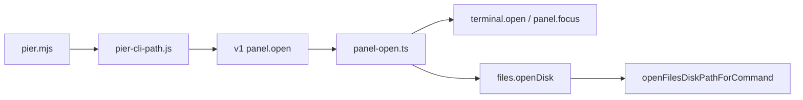

# CLI 路径简写与打开

> **给智能体工人：** 只实现本文件。完成后主会话审查。禁止 commit，除非人类明确要求。禁止把未落地的 `pier .` 写进 Canvas shipped / 60 秒上手。禁止改 local-control 传输正文（v1/v2 帧、peer、cli-human）。禁止新增 `pier files` / `pier git` 域。禁止 `git add .`。

**目标：** 让 `pier .` / `pier <路径>` 成为路径简写：目录确保一个终端工作面（已有则聚焦），文件在 Pier 编辑器打开（复用标签、`:行[:列]`），嵌套 Pier 终端默认当前窗口，生产安装包在 socket 缺失时先启动再重试。金标准：[`docs/superpowers/specs/2026-08-29-cli-path-open-design.md`](../specs/2026-08-29-cli-path-open-design.md)。

**PR0 文档（本回合已写，不要重做、不要回退语义）：** 规格、本计划、Canvas `planned` 行 `path`、治理库存、local-control 交叉链接。后续 PR 只改代码与「落地当日」才把手册从 planned 改为 shipped。

---

## 0. 范围外

- `--new-window`（除非某一 PR 里加开关成本接近零；默认仍复用最近聚焦窗口）
- `pier version` / `doctor` / `capabilities`（已有 planned 尾巴，不搭车）
- `agents.invoke` / 封装原生智能体 CLI
- 自动打开 Files 树
- 开发态自动 `pnpm dev`
- 第二实例 argv 转发（Finder 拖文件另开规格）
- 非 macOS 生产自动启动
- 改根 `README.md` 宣传 `pier .`（代码未进主分支前）

---

## 1. 金标准对照（审查用）

| 锁什么 | 做法 |
|---|---|
| 路径简写 | 首词非保留词且像路径 → `panel.open`；保留词永远是命令 |
| 不复制 VS Code 窗口模型 | 默认 `resolveCommandWindow`（最近聚焦）；不开新窗口 |
| 目录工作面 | 目标窗口内 live `context.cwd` realpath 匹配的 **shell** 终端 → `panel.focus`；否则 `terminal.open` |
| 不用 projectRoot 当复用键 | 子目录终端 ≠ 仓库根工作面 |
| 不复用智能体/任务终端 | 从 `terminal-control.ts` **导出** `toLocator` / `agentIdFromParams`（不要复制）。排除：locator 标 `agent`，或 `peekTerminalPanelAgent(recordId, panelId)` 非 null（running/exited），或 `params.task` / 会话 `task`。禁止读 `tab.role`。单测：活体与已退出智能体同 cwd 都不复用 |
| 活 cwd | `peekTerminalPanelContext(target.window.recordId, panelId)`（`WindowInfo.recordId`，不是 `id` / `PIER_WINDOW_ID`）；再退回 snapshot `context.cwd` |
| `terminal open` 逃生舱 | 该命令路径零复用 |
| `--split` | 跳过复用，强制新建。无 `--split` 的嵌套新建 = dockview `within`（同组标签） |
| 文件 | `files.openDisk` → `openFilesDiskPathForCommand`，返回 `{ ok, panelId, reused, reason? }`；`revealTree: false`；禁止 `addTerminal(父目录)`；禁止 `file.openPath` 与 `context.files.openPath` |
| `:行[:列]` | `bin/pier-cli-path.js` argv 子集；不 import `src/shared`。`paths: Array<{ path, line?, column? }>`，`path` = `paths[0].path`。PR1 `--print-envelope` 锁死 |
| `~` | 剥离 location 后 `os.homedir()` |
| 混合路径 | 先全部 `stat`，再按序 ensure/open |
| 缺路径 | `not_found` + 下一步；不创建文件 |
| 嵌套 | 路径简写来源失效 → `resolvePathOpenWindow` 降级（不改全局 `resolveCommandWindow`）。光杆 `pier` 来源失效 → usage。同 cwd 无 split → 只聚焦、不新建 |
| 嵌套 socket | `PIER_CONTROL_SOCKET` 与 `PIER_CONTROL_SOCKET_PATH` 都认，前者优先 |
| 不自动开树 | 目录不 `openProjectFiles`；CLI 文件 `revealTree: false` |
| 生产启动 | 用 `pier.mjs` + `ELECTRON_RUN_AS_NODE` 判定；`open -a Pier` 一次；15s 内等 socket；**仅**无 renderer 窗口时重试命令；窗口已在后的 `platform_unavailable` 立即返回；5s bypass 只在等 socket |
| 开发态 | `.pier-dev/profile.json` / `PIER_DEV_PROFILE` / 非 app bundle CLI → 不 spawn |
| extraResources | PR1/PR4 把新 `bin/pier*.js` 写入 `electron-builder.yml`；治理扫描运行时 import |
| 无 `pier files` 域 | parser 不出现 `domain === "files"` |
| 能力 | 仍是 `workspace:open`；不给 `cli-local` 加 `file:read` |
| v1 信封 | `protocolVersion: 1`；`data.panelId` 仍在；可加 `reused` / `results` |
| 手册 | 未落地保持 `planned`。shipped 翻转见下方专节 |
| 成功反馈 | 面板出现即可，禁止成功 toast |
| PR1 硬门槛 | 文件绝不变成父目录终端；`usage()` 在编辑器接线前不写 `pier <文件>`。抽出 `panel-open.ts` 只在 PR1 |

---

## 2. 架构

```
外部/嵌套终端
  → bin/pier.mjs
       认 PIER_CONTROL_SOCKET（优先）
       生产：open -a Pier 一次 → 等 socket → 无窗口则重试命令
  → parseCommand
       保留词 → 现有域
       像路径 → panel.open { path, paths: [{ path, line?, column? }], … }
       嵌套光杆 pier 且来源有效 → panel.focus
  → v1 local-control
  → panel-open.ts（直接 import resolvePanelContextForPath）
       realpath + stat 全部
       目录 → ensureDirectoryTerminal（recordId peek + 导出的 toLocator / peekTerminalPanelAgent）
       文件 → files.openDisk（revealTree: false）
```



---

## 3. 文件结构

新建（src 单文件 ≤500；`tests/unit/main/app-core/` **正好 40**，禁止再加；`bin/` 不在 `check:file-size` 扫描内）：

| 文件 | 责任 |
|---|---|
| `bin/pier-cli-path.js` | 保留词、像路径、argv `:行[:列]` 子集、`~` 展开、收集位置路径、嵌套 env。**不** import `src/` |
| `bin/pier-cli-launch.js` | 生产判定（`pier.mjs` + `ELECTRON_RUN_AS_NODE`）、`open -a` 一次、等 socket、无窗口重试（PR4） |
| `src/main/app-core/commands/panel-open.ts` | `executePanelOpenCommand`：直接 import `resolvePanelContextForPath`；stat；ensure；`resolvePathOpenWindow` |
| `src/shared/contracts/panel-open-command.ts` | 若 `commands.ts` 顶满 500：抽出 `panel.open` schema |
| `tests/unit/cli/path-shorthand.test.ts` | 解析歧义表 + `--print-envelope` |
| `tests/unit/cli/launch-if-needed.test.ts` | 启动策略（PR4） |
| `tests/unit/app-core/panel-open-ensure.test.ts` | 复用/新建/文件/陈旧 env/智能体不复用 |

修改（只加调用，禁止把逻辑堆进去）：

| 文件 | 现状行数 | 约束 |
|---|---|---|
| `bin/pier-cli-parser.js` | 1222 | 只接 `parsePathOpenArgs`；usage 在编辑器接线前不写 `pier <文件>` |
| `bin/pier.mjs` | 614 | PR2 认 `PIER_CONTROL_SOCKET`；PR4 调 launch helper |
| `electron-builder.yml` | — | PR1/PR4 把新 `bin/pier*.js` 写入 `extraResources` |
| `src/main/app-core/commands/panel.ts` | **500** | **PR1** 抽出 `executePanelOpenCommand`，只留转调 |
| `src/shared/contracts/commands.ts` | 473 | `paths` 对象数组 + `referencePanelId`；必要时抽 schema 文件 |
| `src/shared/contracts/renderer-command.ts` | — | `files.openDisk`（含 `revealTree: false`、`referencePanelId`） |
| `src/main/services/renderer-command-service.ts` | — | `shouldFocusRendererWindow` 加 `files.openDisk` |
| `src/renderer/lib/files/open-disk-file-panel.ts` | — | 扩展或包装：返回 `{ ok, panelId, reused }`；认 `revealTree` / placement |
| `src/renderer/components/workspace/renderer-commands.ts` | 441 | `files.openDisk` 调包装函数 |
| `src/main/app-core/command-router.ts` | 491 | 更新 import |
| `src/main/app-core/commands/metadata-table.ts` | — | **不要**为 files.openDisk 加 PierCommand |
| `src/main/app-core/commands/worktree.ts` | — | 继续委托 `executePanelOpenCommand` |
| `src/main/app-core/commands/terminal-control.ts` | 255 | **导出** `toLocator` / `agentIdFromParams` 给 `panel-open.ts`；不要复制 |
| `tests/unit/cli/cli-docs-surface.ts` | 283 | shipped 翻转时把 `path` 挪到 shipped 清单并删 `output` |

**禁止新建：** `pier files` parser 域、新的 `file.openInEditor` PierCommand、在 `bin/` import `src/shared`、renderer 成功 toast。

---

## 4. 波次 / PR（按序勾选）

### PR0 — 文档（已完成）

- [x] `docs/superpowers/specs/2026-08-29-cli-path-open-design.md`
- [x] `docs/superpowers/plans/2026-08-29-cli-path-open.md`
- [x] Canvas `path` = planned，含 synopsis + output
- [x] `REQUIRED_PLANNED_COMMAND_NAMES` 含 `"path"`
- [x] shipped 表面治理拒绝可抄写的 `pier .`
- [x] local-control 规格交叉链接

建议 commit：`docs(cli): 登记路径简写与打开的规格和暂未实现手册`

### PR1 — 解析器 + 分类 + 抽出 `panel-open.ts`

**依赖：** PR0。硬门槛：文件绝不变成父目录终端。抽出 `panel-open.ts` **只在本 PR**。

- [x] 步骤 1：抽出 `bin/pier-cli-path.js`（argv `:行[:列]` + `~` 展开，不 import `src/`）
  - `electron-builder.yml` extraResources 列入该文件
  - `pier a.ts:12:3 --print-envelope`：`paths[0].line/column`，`path` 无后缀
  - 加引号风格 `'~/proj'` 展开 homedir
  - `pier status` 仍是命令；`pier nosuchdir` 未知命令
  - 嵌套 env 写入 `windowId` + `referencePanelId`；嵌套光杆信封是 `panel.focus`
- [x] 步骤 2：`panel.ts` 抽出 `panel-open.ts`。**直接 import** `resolvePanelContextForPath`
  - 文件 **禁止** `addTerminal(dirname)`
  - 已接 `files.openDisk`（`{ ok, panelId, reused }`，`revealTree: false`）并改 `shouldFocusRendererWindow`
- [x] 步骤 3：`usage()` 写目录简写 `pier .`；编辑器已接线，`pier open <path> [path...]` 可带文件
- [x] 测试：`path-shorthand.test.ts`、extraResources 治理、`cli-bin` 回归、`no-files-git-cli-governance`

建议 commit：`feat(cli): 解析 pier . 与路径简写`

### PR2 — 目录复用 + 嵌套来源

**依赖：** PR1（在已抽出的 `panel-open.ts` 上改行为，不要再迁文件）。

- [x] 步骤 1：`ensureDirectoryTerminal`：cwd 用 `peekTerminalPanelContext(target.window.recordId, panelId)`
- [x] 步骤 2：从 `terminal-control.ts` 导出 `toLocator` / `agentIdFromParams`；排除 locator 标 agent、`peekTerminalPanelAgent` 非 null、或 task。禁止读 `tab.role`。单测：活体与已退出智能体都不复用；peek 键必须是 `recordId`
- [x] 步骤 3：`--split` 跳过复用；无 `--split` 的嵌套新建 = `within`；`pier terminal open` 永远新建
- [x] 步骤 4：`resolvePathOpenWindow` 本地降级；显式 `--window` 找不到仍失败；**不**改全局 `resolveCommandWindow`
- [x] 步骤 5：同 cwd 嵌套无 split → 只聚焦、不新建
- [x] 步骤 6：光杆来源失效 → usage（与外部空 argv 相同）
- [x] 步骤 7：`resolveSocketPath` 认 `PIER_CONTROL_SOCKET`
- [x] 测试：`panel-open-ensure.test.ts`；`data.panelId` + `reused`

建议 commit：`feat(cli): 打开目录时复用已有终端`

### PR3 — 文件编辑器（若未并入 PR1）

**依赖：** PR1 的 `paths` schema；可与 PR2 并行。

- [x] `files.openDisk` → `openFilesDiskPathForCommand`：返回 `{ ok, panelId, reused, reason? }`
- [x] `revealTree: false`；树揭示监听跳过；不 `openProjectFiles`
- [x] `placement` / `referencePanelId` 只影响**新建**编辑器标签
- [x] `shouldFocusRendererWindow` 增加 `files.openDisk`
- [x] 永不 `file.openPath` / `context.files.openPath`
- [x] Files 未注册 → `platform_unavailable`
- [x] `usage()` 已含 `pier .` 与 `pier open <path> [path...]`
- [x] 测试：`open-disk-file-panel.test.ts` + renderer-commands

建议 commit：`feat(cli): 用 Pier 编辑器打开 pier 文件路径`

### PR4 — 生产自动启动

**依赖：** PR1；建议在 PR2 认 `PIER_CONTROL_SOCKET` 之后。

- [x] `bin/pier-cli-launch.js` + `electron-builder.yml` extraResources
- [x] 生产判定：`argv[1]` 以 `/Contents/Resources/bin/pier.mjs` 结尾，或 `ELECTRON_RUN_AS_NODE` + `MacOS/Pier`。不要只调 `looksLikePierAppCliTarget(argv[1])`
- [x] 开发态矩阵：profile.json / `PIER_DEV_PROFILE` / 非 app bundle → 不 `open`
- [x] `open -a Pier` **一次**；等 socket 时绕过 5s connect（命令发出后恢复正常超时）
- [x] 重试谓词：**仅**无 renderer 窗口（`window.list` 空或 message `no renderer window available`）。窗口一旦存在立即返回，包括 Files 未注册的 `platform_unavailable`
- [x] 显式 socket env → 只等不 open
- [x] 不传业务 argv；不改 `abortMissingSingleInstanceLock` 主路径
- [x] 测试：`launch-if-needed.test.ts`（注入 `open` / 时钟 / 假 socket）

建议 commit：`feat(cli): 生产包在 Pier 未运行时启动并等待控制通道`

### 手册 shipped 翻转（必须同一变更集，否则 CI 红）

- [x] `"path"` 从 `REQUIRED_PLANNED_COMMAND_NAMES` 挪到 `REQUIRED_SHIPPED_COMMAND_NAMES`
- [x] Canvas `path`：`planned` → `shipped`；**删掉** `output`（shipped 禁止手抄响应）
- [x] 删除 `AVAILABLE_VIOLATION_PATTERNS` 的 `path-shorthand`
- [x] 把 `pier .` 写入 quickStart / shipped examples / README 60 秒
- [x] FAQ/README 去掉「暂未实现」
- [x] shipped `open` 描述改为「已有终端则聚焦」

---

## 5. `panel.open` 请求 / 响应（实现备忘）

请求（PR1 定死）：

```ts
{
  type: "panel.open",
  path: string, // = paths[0].path
  paths: Array<{ path: string; line?: number; column?: number }>,
  focus?: boolean,
  placement?: PierCommandPlacement,
  windowId?: string,
  referencePanelId?: string,
}
```

响应：

```ts
{
  windowId: string,
  panelId: string,
  reused?: boolean,
  context?: PanelContext,
  results: Array<{
    kind: "terminal" | "file",
    path: string,
    panelId: string,
    reused: boolean,
    line?: number,
    column?: number,
  }>,
}
```

失败：`not_found` / `invalid_command` / `platform_unavailable` / `permission_denied`。不要新错误码。

---

## 6. 验证命令

Parser / 治理：

```bash
pnpm exec vitest run tests/unit/cli/path-shorthand.test.ts tests/unit/cli/cli-surface-governance.test.ts tests/unit/cli/no-files-git-cli-governance.test.ts tests/unit/app-core/cli-adapter.test.ts tests/unit/app-core/cli-bin.test.ts
```

Ensure / 文件：

```bash
pnpm exec vitest run tests/unit/app-core/panel-open-ensure.test.ts tests/unit/renderer/files/panel/open-disk-file-panel.test.ts tests/unit/renderer/workspace/renderer-commands.test.ts tests/unit/app-core/command-router.test.ts
```

启动：

```bash
pnpm exec vitest run tests/unit/cli/launch-if-needed.test.ts
```

静态：

```bash
pnpm check:file-size
pnpm check:dir-density
```

e2e（PR3/PR4 后，闲置机）：

```bash
pnpm test:e2e:auto
```

不要默认在主力机打全量 e2e。

---

## 7. 行数 / 密度 / 纪律

- `check:file-size` 只扫 `src/` 与 `packages/*/src`。`panel.ts`（500）必须先抽再改。`bin/` 抽出是卫生，不是该门禁。
- `tests/unit/main/app-core/` 正好 40——新测放 `tests/unit/app-core/` 或 `tests/unit/cli/`。
- 禁止 `as any` / `@ts-ignore` / `@ts-expect-error`。
- 用户文案：Canvas/README 白话；实现词只留规格。业务代码无内联前台串。
- 成功无 toast；失败走 CLI 错误。
- 不要改无关 SSH / 智能体 invoke / 传输帧。

---

## 8. 完成定义

- `pier .` 在运行中的 Pier 上：有匹配 shell 终端则聚焦且不新建；没有则新建一块。
- `pier foo.ts:12` 打开 Files 编辑器并跳行；同文件再执行复用标签。
- `pier . src/a.ts` 两者都做。
- 嵌套同 cwd 的 `pier` / `pier .` 不新开窗口、不启动第二实例。
- `pier terminal open` 仍然每次新建。
- `pier status` 仍是状态命令。
- 缺路径不建文件。
- `.ts` 不进 QuickTime。
- 生产包冷启动：`open -a Pier` 后命令成功；`pnpm cli:dev` 在没开 dev 时失败并提示，不拉起 Electron。
- 手册已 shipped：`pier .` 可抄写；库存测试绿。
- `pnpm check:file-size` 与 `pnpm check:dir-density` 绿。
