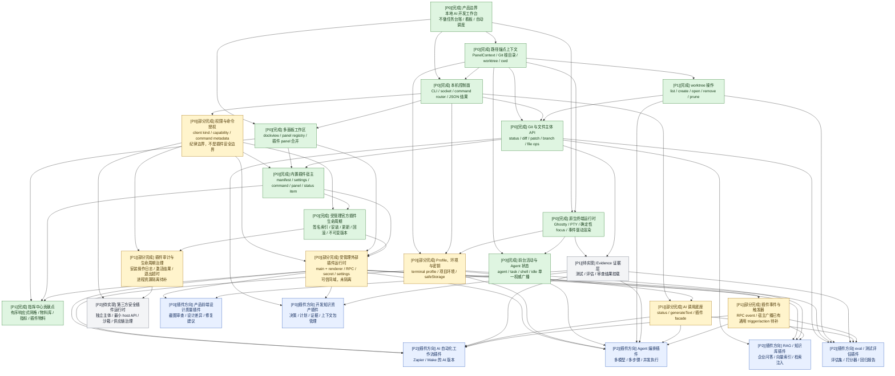

# AI 工作台能力评分清单

更新时间：2026-07-13

## 调研口径

本清单保留 5 个并行子 agent 的外部调研结论，并于 2026-07-13 按 Pier 当前代码再次校准，覆盖：

- `stablyai/orca`：本地多 agent 编码工作台、工作树、浏览器、diff 审查、CLI 控制面。
- `omnigent-ai/omnigent`：统一 agent 运行外壳、策略治理、沙箱、远程 runner、跨设备协作。
- `pewdiepie-archdaemon/odysseus`：自托管个人 AI 工作区、工具系统、研究、模型运维、个人信息能力。
- Pier 本地仓库：`AGENTS.md`、`README.md`、终端与前台活动契约、工作区布局、CLI 控制面、原生 Ghostty 桥、Git / Files 内置插件、受管理插件安装服务、插件 RPC、指挥中心和 `pier.codex`。
- Codex App / CLI：线程 `019efa22-f7f7-78e1-a450-fa05d659ca37`、本机 `build-web-apps` 插件缓存、Codex 手册缓存。
- 本轮替代风险复核：OpenAI Codex App Review、Codex GitHub code review、Claude Code IDE integrations、Claude Code GitHub Actions、Claude Code Skills 官方文档。
- 本轮补充方向：开发知识资产管理，参考 GitBook Git Sync / Agent、Mintlify 协作编辑、Docusaurus versioning、Notion wiki / verified knowledge。
- 本轮代码校准：以 `src/shared/contracts/`、`src/main/app-core/`、`src/main/plugins/`、`src/main/services/managed-plugins/`、`src/renderer/lib/plugins/`、`src/renderer/panel-kits/mission-control/`、`packages/plugin-codex/` 及对应单元、组件、端到端测试为实现证据。

约束：

- 只纳入子 agent 通过官方文档、源码、本地仓库或指定线程确认过的能力。
- 未确认的运行稳定性不作为事实，只作为风险提示。
- 对 Pier 的判断以项目边界为准：本地 AI 开发工作台，核心是稳定终端、dockview panel 布局、代码变更预览、文件查看、多 agent 状态可见性；不做任务生命周期、SQLite 任务台账、看板、自动调度。
- “已实现”只表示当前仓库存在契约、执行路径、界面和相应测试，不表示已形成安全沙箱。当前内置插件和受管理外部插件都是可信代码；external main 与宿主同属 Node 权限域，capability 声明和 `pluginId` 作用域属于工程纪律，不是恶意代码隔离。
- 当前产品只接受内置插件和受管理的官方外部插件。开发覆盖仅用于开发 / 测试；任意本地目录、任意 Git / registry 和第三方 marketplace 不作为当前可交付能力。

## 评分规则

每项使用 6 个 1-5 分：

| 维度 | 含义 |
|---|---|
| 场景 | 是否适合 Pier 的目标场景。 |
| 痛点 | 是否解决真实且高频的用户痛点。 |
| 效率 | 是否能减少切换、等待、重复说明和手工操作。 |
| 质量 | 是否能提升审查、验证、可恢复性、安全性或交付可信度。 |
| 模型替代风险 | 分数越高，越容易被单个强模型自身能力替代。 |
| Claude/Codex 替代风险 | 分数越高，越容易被 Claude Code、Codex App/CLI 或其官方能力替代。 |

总分公式：

```text
总分 = 场景 + 痛点 + 效率 + 质量 + (6 - 模型替代风险) + (6 - Claude/Codex 替代风险)
```

满分 30。替代风险越高，总分越低。

优先级不是总分排序。若 Claude/Codex 已经很好地覆盖某项能力，Pier 只有在能补齐本地开发闭环、跨 agent 状态、工作树隔离、终端现场、证据绑定或权限边界时才应实现；否则应标为后置集成或不做。能力总表中的“建设理由 / 改进点”用于区分：闭环补齐、差异化增强、后置集成和不做。

## 全局能力 DAG

本 DAG 基于 2026-07-13 当前仓库状态和上方能力清单整理。它只描述 Pier 主体与插件底座的依赖关系，不把 AI 自动化、Agent 编排、RAG / 知识库、eval / 测试评估直接放进主体实现。

状态标记：

- `完成`：当前仓库已有主体契约、服务、界面或测试闭环，可以继续扩展。
- `部分完成`：已有基础实现，但仍有迁移、权限、审计、持久化、第三方运行时或可用性缺口。
- `待实现`：当前只有规划或 capability 预留，尚未形成主体闭环。
- `插件方向`：不进 Pier 主体，只在插件底座成熟后作为插件支持。



### DAG 节点说明

| 节点 | 状态 | 重要程度 | 当前依据 | 下一步 |
|---|---|---|---|---|
| 产品边界 | 完成 | P0 | `AGENTS.md` 已明确 Pier 是本地 AI 开发工作台，且不做任务生命周期、SQLite 任务台账、看板、自动调度。 | 继续用该边界约束后续插件和主体能力。 |
| 路径锚点上下文 | 完成 | P0 | `PanelContext.projectRootPath` 已作为必需路径锚点；`resolvePanelContextForPath()` 对 Git 目录使用仓库根目录，对非 Git 目录使用 `cwd`；主体已移除 `Project` 注册表和 `projectId` 外键。 | 后续只围绕 `projectRootPath` / `gitRoot` / `worktreeRoot` 扩展插件和资产能力，不再引入无所有权的 `projectId`。 |
| 本机控制面 | 完成 | P0 | 已有 CLI、socket、本机命令信封、`command-router`、`renderer-command bridge` 和 JSON 结果。 | 按新能力继续扩展命令，不改变统一路由。 |
| 权限与命令授权 | 部分完成 | P0 | `PierClient`、capability、`CommandMetadata.allowedClientKinds` 和动态终端权限已覆盖 CLI、renderer、MCP 与移动端客户端；插件 manifest 也声明权限。当前 main 侧授权按 client kind，不按插件主体身份。 | 保持其作为可信插件的纪律边界；开放第三方插件前必须增加每插件主体身份、main 侧最小权限 host API 和用户可见审计。 |
| 原生终端运行时 | 完成 | P0 | Ghostty 原生桥、PTY 生命周期、启动参数、确定性焦点归属、事件驱动渲染、浮层伪影修复和打包资源路径均已有实现与回归测试。 | 将后续工作定义为稳定性维护；profile 可见性由独立能力承接，不再建设 Pier 自有终端记录资产层。 |
| 多面板工作区 | 完成 | P0 | `WorkspaceHost` 是 dockview 唯一业务边界，`panel-registry` 已支持 core panel 与插件 panel 合并。 | 保持 renderer 业务不直接 import dockview 的边界。 |
| Git 与文件主体 API | 完成 | P0 | 已有 Git status、diff、patch、branch、stash、write 命令和 File list/read/write/move/trash 契约。 | 后续重点转向证据绑定和插件使用体验。 |
| 内置插件宿主 | 完成 | P0 | manifest、设置、main / renderer runtime、Git / Files 内置插件、command、panel、terminal status item 和 settings page 均已闭环。 | 继续把产品域能力放进插件，主体只保留通用宿主。 |
| 受管理官方插件生命周期 | 完成 | P0 | 已实现 Ed25519 签名官方索引、缓存回退、tgz / sha256 / 内容校验、staging 原子安装、不可变版本目录、启停、更新、回滚、卸载、启动快照和生产态 dev override 拒绝。 | 继续维持单一签名官方索引和受管理来源；不要把任意 local / git / registry 扫描误写成已支持。 |
| 受管理外部插件运行时 | 部分完成 | P0 | 已实现 external main / renderer 激活、插件 RPC、按 `pluginId` 作用域的 handler、settings page、panel、status item、mission control widget、secret、路径、用量发布和生命周期回调。main 代码仍在宿主 Node 权限域执行。 | 当前只承载可信官方插件；第三方开放必须另做独立 realm / 进程和主体级授权。 |
| 指挥中心贡献点 | 完成 | P1 | 已实现 v3 响应式有序网格、物料库、指标目录、多实例、配置、刷新、可见性停轮询、持久化迁移、插件物料注册及组件 / E2E 测试；`pier.codex` 已贡献账号与成本物料。 | 作为插件状态与观测的标准 UI 扩展点继续演进，不扩成自由画布或通用 BI。 |
| Profile、环境与密钥 | 部分完成 | P0 | 已有 terminal profile、`profileId` 启动解析、项目级环境配置、worktree 绑定、`safeStorage` 密钥 store 和受 `pluginId` 作用域约束的 secrets facade。 | 补通用的项目 / worktree Agent profile 选择与状态展示；provider 专属账号逻辑继续归对应插件。 |
| 前台活动与 Agent 状态 | 完成 | P0 | `ForegroundActivity` 已成为 agent / task / shell / idle 的唯一权威 UI 广播源；旧 `agent-session` 广播已下线，并补齐跨窗口发布、生命周期和 Codex transcript 兼容对账测试。 | 继续维护各 CLI agent 的事件映射准确性，不恢复双状态源。 |
| worktree 操作 | 完成 | P1 | 已有 list、check、creation defaults、create、open、openTerminal、remove、prune 命令与 Git 插件 UI，并完成创建和分支命名稳定性修复。 | 保持其作为 Git / 路径上下文能力，不升级为任务看板或自动调度系统。 |
| Evidence 证据层 | 待实现 | P1 | capability 已预留 `evidence:write`，但缺少契约、存储、UI 和与 diff/session 的绑定。 | 定义 evidence 契约，支持测试、评估、审查和截图证据挂载。 |
| AI 调用底座 | 部分完成 | P1 | 已有 `ai.status`、`ai.generateText` 和 renderer 插件 AI facade，分支建议已通过统一文本生成能力消费。 | 保持窄能力，避免扩成通用模型平台；补 provider / profile / secret 的清晰边界。 |
| 插件事件与触发器 | 部分完成 | P1 | 已有 Git、Terminal、Plugin、ForegroundActivity 广播和 plugin RPC event，插件也可注册 action / panel / widget。 | 补稳定的 trigger / action 声明与执行协议，让自动化插件无需绑定宿主内部事件。 |
| 插件审计与生命周期治理 | 部分完成 | P1 | 已有受管理安装操作日志、main / renderer 激活结果、last-known-good、退出回调 5 秒超时和错误上报；没有独立进程的 CPU / 内存 / 网络限制和崩溃隔离。 | 先补敏感 host API 审计和可取消后台工作；真正资源隔离与第三方运行时一起设计。 |
| 第三方安全插件运行时 | 待实现 | P2 | manifest 和源码中的 `local` / `git` / `registry` 枚举不等于产品支持；生产态不允许任意本地路径，external main 仍是可信同域代码。 | 在开放第三方前完成独立主体身份、进程 / realm 隔离、main 侧逐插件授权、最小 host API、签名审查、回滚和撤销策略。 |
| AI 自动化工作流插件 | 插件方向 | P2 | 依赖事件、动作、profile、secret、审计和外部插件运行时。 | 插件自带流程引擎，Pier 只提供本地触发器和动作。 |
| Agent 编排插件 | 插件方向 | P2 | 依赖终端、profile、Agent 状态、evidence 和外部插件运行时；需要历史时由插件或 Agent 自己读取其原生会话记录。 | 插件自己实现多模型、多步骤、并发和结果合并。 |
| RAG / 知识库插件 | 插件方向 | P2 | 依赖 file / git、secret、network 和外部插件运行时；索引数据归插件私有存储。 | 插件自己实现索引、embedding、向量库和企业知识源连接。 |
| eval / 测试评估插件 | 插件方向 | P2 | 依赖 Git、evidence、AI 调用底座和外部插件运行时。 | 插件自己实现评估集、评分器、模型对比和报告。 |
| 产品前端设计质量插件 | 插件方向 | P3 | 依赖截图、文件、Git、evidence 和外部插件运行时。 | 后续作为 Pier 插件支持，不进入主体。 |
| 开发知识资产插件 | 插件方向 | P3 | 依赖 evidence、file / git 上下文和插件运行时。 | 后续管理决策、计划、证据、上下文包和未验证项。 |

## 能力总表

表格使用 HTML 段落式单元格输出；每个评分格分为“分数”和“依据”两段，并在单元格上显式允许自动折行，避免 Markdown 预览把内容挤成一行。

<table class="ai-score-table" style="table-layout: fixed; width: 100%; border-collapse: collapse; white-space: normal;">
<thead>
<tr>
<th style="vertical-align: top; white-space: normal; word-break: break-word;">优先级</th>
<th style="vertical-align: top; white-space: normal; word-break: break-word;">功能</th>
<th style="vertical-align: top; white-space: normal; word-break: break-word;">建设理由 / 改进点</th>
<th style="vertical-align: top; white-space: normal; word-break: break-word;">场景</th>
<th style="vertical-align: top; white-space: normal; word-break: break-word;">痛点</th>
<th style="vertical-align: top; white-space: normal; word-break: break-word;">效率</th>
<th style="vertical-align: top; white-space: normal; word-break: break-word;">质量</th>
<th style="vertical-align: top; white-space: normal; word-break: break-word;">模型替代风险</th>
<th style="vertical-align: top; white-space: normal; word-break: break-word;">Claude/Codex 替代风险</th>
<th style="vertical-align: top; white-space: normal; word-break: break-word;">总分</th>
<th style="vertical-align: top; white-space: normal; word-break: break-word;">Pier 判断</th>
<th style="vertical-align: top; white-space: normal; word-break: break-word;">详细说明</th>
<th style="vertical-align: top; white-space: normal; word-break: break-word;">来源</th>
</tr>
</thead>
<tbody>
<tr>
<td style="vertical-align: top; white-space: normal; word-break: break-word;">
<p style="margin: 0 0 6px 0; white-space: normal; word-break: break-word;">P0</p>
</td>
<td style="vertical-align: top; white-space: normal; word-break: break-word;">
<p style="margin: 0 0 6px 0; white-space: normal; word-break: break-word;">稳定原生终端基础</p>
</td>
<td style="vertical-align: top; white-space: normal; word-break: break-word;">
<p style="margin: 0 0 6px 0; white-space: normal; word-break: break-word;">建设理由：闭环补齐 / 底座能力。</p>
<p style="margin: 0 0 6px 0; white-space: normal; word-break: break-word;">改进点：解决本机 NSView、PTY 生命周期、焦点、布局和主题稳定性；这不是 Claude/Codex 可替代的模型能力。</p>
</td>
<td style="vertical-align: top; white-space: normal; word-break: break-word;">
<p style="margin: 0 0 6px 0; white-space: normal; word-break: break-word;"><strong>5</strong></p>
<p style="margin: 0 0 6px 0; white-space: normal; word-break: break-word;">依据：Pier README 明确把终端列为本地 AI 开发工作台核心能力。</p>
</td>
<td style="vertical-align: top; white-space: normal; word-break: break-word;">
<p style="margin: 0 0 6px 0; white-space: normal; word-break: break-word;"><strong>5</strong></p>
<p style="margin: 0 0 6px 0; white-space: normal; word-break: break-word;">依据：终端不稳会直接中断所有 agent 工作，是基础阻塞。</p>
</td>
<td style="vertical-align: top; white-space: normal; word-break: break-word;">
<p style="margin: 0 0 6px 0; white-space: normal; word-break: break-word;"><strong>4</strong></p>
<p style="margin: 0 0 6px 0; white-space: normal; word-break: break-word;">依据：稳定分屏、滚动和焦点能减少重复打开、重新运行和复制输出。</p>
</td>
<td style="vertical-align: top; white-space: normal; word-break: break-word;">
<p style="margin: 0 0 6px 0; white-space: normal; word-break: break-word;"><strong>5</strong></p>
<p style="margin: 0 0 6px 0; white-space: normal; word-break: break-word;">依据：原生终端保留 PTY、屏幕缓冲、主题和字体热更新，能提升长任务可靠性。</p>
</td>
<td style="vertical-align: top; white-space: normal; word-break: break-word;">
<p style="margin: 0 0 6px 0; white-space: normal; word-break: break-word;"><strong>1</strong></p>
<p style="margin: 0 0 6px 0; white-space: normal; word-break: break-word;">依据：模型无法替代本地 NSView、PTY 生命周期和键盘协议。</p>
</td>
<td style="vertical-align: top; white-space: normal; word-break: break-word;">
<p style="margin: 0 0 6px 0; white-space: normal; word-break: break-word;"><strong>2</strong></p>
<p style="margin: 0 0 6px 0; white-space: normal; word-break: break-word;">依据：Claude/Codex 可以运行在终端里，但不能替代 Pier 的原生终端桥和多面板承载。</p>
</td>
<td style="vertical-align: top; white-space: normal; word-break: break-word;">
<p style="margin: 0 0 6px 0; white-space: normal; word-break: break-word;">28</p>
</td>
<td style="vertical-align: top; white-space: normal; word-break: break-word;">
<p style="margin: 0 0 6px 0; white-space: normal; word-break: break-word;">判断正确：继续作为底座。</p>
</td>
<td style="vertical-align: top; white-space: normal; word-break: break-word;">
<p style="margin: 0 0 6px 0; white-space: normal; word-break: break-word;">能力说明：Ghostty 原生终端、主题、字体、焦点、右键、尺寸同步是 AI 开发工作台底座。</p>
<p style="margin: 0 0 6px 0; white-space: normal; word-break: break-word;">Pier 范围：承载 Claude Code、Codex、OpenCode 等 CLI agent，并保证多面板场景下的本地交互稳定。</p>
</td>
<td style="vertical-align: top; white-space: normal; word-break: break-word;">
<p style="margin: 0 0 6px 0; white-space: normal; word-break: break-word;">Pier <code>README.md</code>；Pier <code>src/shared/contracts/terminal.ts</code>；Pier <code>native/Sources/GhosttyBridge/GhosttyBridge.swift</code>；Pier <code>native/src/addon.mm</code>；Orca terminal docs: <a href="https://www.onorca.dev/docs/terminal">https://www.onorca.dev/docs/terminal</a></p>
</td>
</tr>
<tr>
<td style="vertical-align: top; white-space: normal; word-break: break-word;">
<p style="margin: 0 0 6px 0; white-space: normal; word-break: break-word;">P0</p>
</td>
<td style="vertical-align: top; white-space: normal; word-break: break-word;">
<p style="margin: 0 0 6px 0; white-space: normal; word-break: break-word;">本机控制面 / CLI 自动化</p>
</td>
<td style="vertical-align: top; white-space: normal; word-break: break-word;">
<p style="margin: 0 0 6px 0; white-space: normal; word-break: break-word;">建设理由：闭环补齐。</p>
<p style="margin: 0 0 6px 0; white-space: normal; word-break: break-word;">改进点：让外部 agent、脚本和未来 MCP 通过机器可读命令调用 Pier，同时保留本机权限、窗口和 <code>--no-focus</code> 控制。</p>
</td>
<td style="vertical-align: top; white-space: normal; word-break: break-word;">
<p style="margin: 0 0 6px 0; white-space: normal; word-break: break-word;"><strong>5</strong></p>
<p style="margin: 0 0 6px 0; white-space: normal; word-break: break-word;">依据：Pier README 已明确 CLI 用于后续 MCP server、脚本和本机自动化。</p>
</td>
<td style="vertical-align: top; white-space: normal; word-break: break-word;">
<p style="margin: 0 0 6px 0; white-space: normal; word-break: break-word;"><strong>4</strong></p>
<p style="margin: 0 0 6px 0; white-space: normal; word-break: break-word;">依据：没有可脚本化控制面，agent 只能靠人工点 UI。</p>
</td>
<td style="vertical-align: top; white-space: normal; word-break: break-word;">
<p style="margin: 0 0 6px 0; white-space: normal; word-break: break-word;"><strong>5</strong></p>
<p style="margin: 0 0 6px 0; white-space: normal; word-break: break-word;">依据：CLI/JSON 让自动化和远程调用变成稳定路径。</p>
</td>
<td style="vertical-align: top; white-space: normal; word-break: break-word;">
<p style="margin: 0 0 6px 0; white-space: normal; word-break: break-word;"><strong>4</strong></p>
<p style="margin: 0 0 6px 0; white-space: normal; word-break: break-word;">依据：结构化命令比 UI 文本操作更可验证。</p>
</td>
<td style="vertical-align: top; white-space: normal; word-break: break-word;">
<p style="margin: 0 0 6px 0; white-space: normal; word-break: break-word;"><strong>1</strong></p>
<p style="margin: 0 0 6px 0; white-space: normal; word-break: break-word;">依据：模型不能替代本机 socket、窗口控制和权限执行。</p>
</td>
<td style="vertical-align: top; white-space: normal; word-break: break-word;">
<p style="margin: 0 0 6px 0; white-space: normal; word-break: break-word;"><strong>3</strong></p>
<p style="margin: 0 0 6px 0; white-space: normal; word-break: break-word;">依据：Codex 已有 app-server、MCP server 和 CLI 自动化方向，但它们不能直接替代 Pier 自己的本机控制面。</p>
</td>
<td style="vertical-align: top; white-space: normal; word-break: break-word;">
<p style="margin: 0 0 6px 0; white-space: normal; word-break: break-word;">26</p>
</td>
<td style="vertical-align: top; white-space: normal; word-break: break-word;">
<p style="margin: 0 0 6px 0; white-space: normal; word-break: break-word;">判断需收紧：P0 只限 Pier 本机控制面。</p>
</td>
<td style="vertical-align: top; white-space: normal; word-break: break-word;">
<p style="margin: 0 0 6px 0; white-space: normal; word-break: break-word;">能力说明：用 CLI、本机 socket、命令信封和权限，为脚本、后台 agent、未来 MCP 调用 Pier。</p>
<p style="margin: 0 0 6px 0; white-space: normal; word-break: break-word;">Pier 范围：只暴露 Pier 窗口、panel、终端、布局、权限相关动作；不重复做 Codex/Claude 通用 agent SDK。</p>
</td>
<td style="vertical-align: top; white-space: normal; word-break: break-word;">
<p style="margin: 0 0 6px 0; white-space: normal; word-break: break-word;">Pier <code>README.md</code>；Pier <code>src/main/adapters/cli/cli-parser.ts</code>；Pier <code>src/main/adapters/cli/local-control-server.ts</code>；Pier <code>src/shared/contracts/permissions.ts</code>；Orca CLI docs: <a href="https://www.onorca.dev/docs/cli/overview">https://www.onorca.dev/docs/cli/overview</a>；Codex App Server: <a href="https://developers.openai.com/codex/app-server">https://developers.openai.com/codex/app-server</a>；Codex MCP: <a href="https://developers.openai.com/codex/mcp">https://developers.openai.com/codex/mcp</a></p>
</td>
</tr>
<tr>
<td style="vertical-align: top; white-space: normal; word-break: break-word;">
<p style="margin: 0 0 6px 0; white-space: normal; word-break: break-word;">P0</p>
</td>
<td style="vertical-align: top; white-space: normal; word-break: break-word;">
<p style="margin: 0 0 6px 0; white-space: normal; word-break: break-word;">Pier 能力注册与权限范围</p>
</td>
<td style="vertical-align: top; white-space: normal; word-break: break-word;">
<p style="margin: 0 0 6px 0; white-space: normal; word-break: break-word;">建设理由：闭环补齐。</p>
<p style="margin: 0 0 6px 0; white-space: normal; word-break: break-word;">改进点：把 Pier 外部可调用能力收进统一命令授权；必须明确当前 capability 只能约束守规代码，不能阻止同 realm 的恶意插件直接访问 Node 能力。</p>
</td>
<td style="vertical-align: top; white-space: normal; word-break: break-word;">
<p style="margin: 0 0 6px 0; white-space: normal; word-break: break-word;"><strong>5</strong></p>
<p style="margin: 0 0 6px 0; white-space: normal; word-break: break-word;">依据：Pier 未来需要把本地控制面暴露给 MCP、后台 agent 和脚本。</p>
</td>
<td style="vertical-align: top; white-space: normal; word-break: break-word;">
<p style="margin: 0 0 6px 0; white-space: normal; word-break: break-word;"><strong>4</strong></p>
<p style="margin: 0 0 6px 0; white-space: normal; word-break: break-word;">依据：CLI、MCP、renderer 和插件使用同一能力时，授权口径不一致会造成越权和不可解释失败。</p>
</td>
<td style="vertical-align: top; white-space: normal; word-break: break-word;">
<p style="margin: 0 0 6px 0; white-space: normal; word-break: break-word;"><strong>4</strong></p>
<p style="margin: 0 0 6px 0; white-space: normal; word-break: break-word;">依据：窄 API 能让外部 agent 复用工作台能力。</p>
</td>
<td style="vertical-align: top; white-space: normal; word-break: break-word;">
<p style="margin: 0 0 6px 0; white-space: normal; word-break: break-word;"><strong>5</strong></p>
<p style="margin: 0 0 6px 0; white-space: normal; word-break: break-word;">依据：统一命令元数据能减少误授权；真正安全质量仍依赖插件主体身份、隔离和 main 侧 host API 授权。</p>
</td>
<td style="vertical-align: top; white-space: normal; word-break: break-word;">
<p style="margin: 0 0 6px 0; white-space: normal; word-break: break-word;"><strong>1</strong></p>
<p style="margin: 0 0 6px 0; white-space: normal; word-break: break-word;">依据：模型无法替代协议、token 和权限执行层。</p>
</td>
<td style="vertical-align: top; white-space: normal; word-break: break-word;">
<p style="margin: 0 0 6px 0; white-space: normal; word-break: break-word;"><strong>3</strong></p>
<p style="margin: 0 0 6px 0; white-space: normal; word-break: break-word;">依据：Claude/Codex 都有 MCP、插件和权限能力；Pier 只应做本地能力的注册和授权。</p>
</td>
<td style="vertical-align: top; white-space: normal; word-break: break-word;">
<p style="margin: 0 0 6px 0; white-space: normal; word-break: break-word;">26</p>
</td>
<td style="vertical-align: top; white-space: normal; word-break: break-word;">
<p style="margin: 0 0 6px 0; white-space: normal; word-break: break-word;">当前状态：部分完成。客户端命令授权已落地；插件 capability 是纪律边界，不能表述为安全沙箱。</p>
</td>
<td style="vertical-align: top; white-space: normal; word-break: break-word;">
<p style="margin: 0 0 6px 0; white-space: normal; word-break: break-word;">能力说明：`PierClient` 按客户端类型持有 capability，命令路由用 `CommandMetadata` 和动态规则授权；插件 manifest 同时声明贡献点权限。</p>
<p style="margin: 0 0 6px 0; white-space: normal; word-break: break-word;">当前缺口：main 侧 `authorizeCommand` 不识别插件主体，external main 与宿主同 Node 权限域；开放第三方前必须增加独立主体和最小 host API。</p>
</td>
<td style="vertical-align: top; white-space: normal; word-break: break-word;">
<p style="margin: 0 0 6px 0; white-space: normal; word-break: break-word;">Pier <code>src/shared/contracts/permissions.ts</code>；Pier <code>src/main/app-core/permissions.ts</code>；Pier <code>src/main/plugins/external-main-runtime.ts</code>；Pier <code>AGENTS.md</code> 插件安全边界；Odysseus threat model: <a href="https://github.com/pewdiepie-archdaemon/odysseus/blob/dev/THREAT_MODEL.md">https://github.com/pewdiepie-archdaemon/odysseus/blob/dev/THREAT_MODEL.md</a></p>
</td>
</tr>
<tr>
<td style="vertical-align: top; white-space: normal; word-break: break-word;">
<p style="margin: 0 0 6px 0; white-space: normal; word-break: break-word;">P0</p>
</td>
<td style="vertical-align: top; white-space: normal; word-break: break-word;">
<p style="margin: 0 0 6px 0; white-space: normal; word-break: break-word;">终端会话状态管理</p>
</td>
<td style="vertical-align: top; white-space: normal; word-break: break-word;">
<p style="margin: 0 0 6px 0; white-space: normal; word-break: break-word;">建设理由：闭环补齐。</p>
<p style="margin: 0 0 6px 0; white-space: normal; word-break: break-word;">改进点：统一 active、background、exited、恢复、停止和会话列表；Claude/Codex 只能管理自身会话，不能管理 Pier 的全部终端 panel。</p>
</td>
<td style="vertical-align: top; white-space: normal; word-break: break-word;">
<p style="margin: 0 0 6px 0; white-space: normal; word-break: break-word;"><strong>5</strong></p>
<p style="margin: 0 0 6px 0; white-space: normal; word-break: break-word;">依据：Pier 目标是让 AI 编程从会话走向项目连续性。</p>
</td>
<td style="vertical-align: top; white-space: normal; word-break: break-word;">
<p style="margin: 0 0 6px 0; white-space: normal; word-break: break-word;"><strong>5</strong></p>
<p style="margin: 0 0 6px 0; white-space: normal; word-break: break-word;">依据：多个终端跑不同任务后，很容易不知道哪个仍有效。</p>
</td>
<td style="vertical-align: top; white-space: normal; word-break: break-word;">
<p style="margin: 0 0 6px 0; white-space: normal; word-break: break-word;"><strong>5</strong></p>
<p style="margin: 0 0 6px 0; white-space: normal; word-break: break-word;">依据：会话列表、停止、恢复能显著减少人工找现场。</p>
</td>
<td style="vertical-align: top; white-space: normal; word-break: break-word;">
<p style="margin: 0 0 6px 0; white-space: normal; word-break: break-word;"><strong>4</strong></p>
<p style="margin: 0 0 6px 0; white-space: normal; word-break: break-word;">依据：状态机能减少误关、重复运行和坏路径恢复。</p>
</td>
<td style="vertical-align: top; white-space: normal; word-break: break-word;">
<p style="margin: 0 0 6px 0; white-space: normal; word-break: break-word;"><strong>2</strong></p>
<p style="margin: 0 0 6px 0; white-space: normal; word-break: break-word;">依据：模型无法可靠观察本地 panel 生命周期。</p>
</td>
<td style="vertical-align: top; white-space: normal; word-break: break-word;">
<p style="margin: 0 0 6px 0; white-space: normal; word-break: break-word;"><strong>4</strong></p>
<p style="margin: 0 0 6px 0; white-space: normal; word-break: break-word;">依据：Codex App 有 thread/background task，Claude 有 session，但不能统一 Pier 内所有 CLI、普通 shell 和 panel 状态。</p>
</td>
<td style="vertical-align: top; white-space: normal; word-break: break-word;">
<p style="margin: 0 0 6px 0; white-space: normal; word-break: break-word;">25</p>
</td>
<td style="vertical-align: top; white-space: normal; word-break: break-word;">
<p style="margin: 0 0 6px 0; white-space: normal; word-break: break-word;">判断正确：P0。</p>
</td>
<td style="vertical-align: top; white-space: normal; word-break: break-word;">
<p style="margin: 0 0 6px 0; white-space: normal; word-break: break-word;">能力说明：让用户知道哪些终端还在跑、哪些退出、哪些可以恢复、哪些需要处理。</p>
<p style="margin: 0 0 6px 0; white-space: normal; word-break: break-word;">Pier 范围：跨 agent、跨普通 shell、跨 panel 的本地状态，而不是单一 agent 自身会话列表。</p>
</td>
<td style="vertical-align: top; white-space: normal; word-break: break-word;">
<p style="margin: 0 0 6px 0; white-space: normal; word-break: break-word;">Pier <code>src/main/state/terminal-session-state.ts</code>；Pier <code>src/main/ipc/terminal.ts</code>；Pier <code>src/shared/contracts/terminal.ts</code>；本地线程 <code>019ef936-4222-7383-a25f-e74bd166d836</code>；Orca session restore docs: <a href="https://www.onorca.dev/docs/model/session-restore">https://www.onorca.dev/docs/model/session-restore</a>；Codex app features: <a href="https://developers.openai.com/codex/app/features">https://developers.openai.com/codex/app/features</a></p>
</td>
</tr>
<tr>
<td style="vertical-align: top; white-space: normal; word-break: break-word;">
<p style="margin: 0 0 6px 0; white-space: normal; word-break: break-word;">P0</p>
</td>
<td style="vertical-align: top; white-space: normal; word-break: break-word;">
<p style="margin: 0 0 6px 0; white-space: normal; word-break: break-word;">Git 变更面板与外部审查入口</p>
</td>
<td style="vertical-align: top; white-space: normal; word-break: break-word;">
<p style="margin: 0 0 6px 0; white-space: normal; word-break: break-word;">建设理由：闭环补齐，不重复建设通用 AI 代码审查。</p>
<p style="margin: 0 0 6px 0; white-space: normal; word-break: break-word;">改进点：P0 只做本地 Git 变更面板、跨工作树/跨 agent 可见性、终端会话与证据绑定、以及一键交给 Claude/Codex 审查的入口。</p>
</td>
<td style="vertical-align: top; white-space: normal; word-break: break-word;">
<p style="margin: 0 0 6px 0; white-space: normal; word-break: break-word;"><strong>5</strong></p>
<p style="margin: 0 0 6px 0; white-space: normal; word-break: break-word;">依据：代码变更预览仍是 Pier 核心场景，但范围应限定在本地变更可见性和审查入口。</p>
</td>
<td style="vertical-align: top; white-space: normal; word-break: break-word;">
<p style="margin: 0 0 6px 0; white-space: normal; word-break: break-word;"><strong>5</strong></p>
<p style="margin: 0 0 6px 0; white-space: normal; word-break: break-word;">依据：用户需要知道多个 agent 到底改了什么；AI 审查本身可直接交给 Claude/Codex。</p>
</td>
<td style="vertical-align: top; white-space: normal; word-break: break-word;">
<p style="margin: 0 0 6px 0; white-space: normal; word-break: break-word;"><strong>4</strong></p>
<p style="margin: 0 0 6px 0; white-space: normal; word-break: break-word;">依据：常驻 diff 和一键外部审查入口能减少切换，但不会比 Codex App 的 review pane 形成明显效率代差。</p>
</td>
<td style="vertical-align: top; white-space: normal; word-break: break-word;">
<p style="margin: 0 0 6px 0; white-space: normal; word-break: break-word;"><strong>4</strong></p>
<p style="margin: 0 0 6px 0; white-space: normal; word-break: break-word;">依据：本地 diff、证据和会话绑定提升可信度；通用审查质量不应作为 Pier 自研目标。</p>
</td>
<td style="vertical-align: top; white-space: normal; word-break: break-word;">
<p style="margin: 0 0 6px 0; white-space: normal; word-break: break-word;"><strong>3</strong></p>
<p style="margin: 0 0 6px 0; white-space: normal; word-break: break-word;">依据：模型可以直接审查 diff，但不能替代本地多工作树、终端和证据绑定。</p>
</td>
<td style="vertical-align: top; white-space: normal; word-break: break-word;">
<p style="margin: 0 0 6px 0; white-space: normal; word-break: break-word;"><strong>5</strong></p>
<p style="margin: 0 0 6px 0; white-space: normal; word-break: break-word;">依据：Codex App 已有 review pane、inline comments、/review 和 PR review 流程；Claude Code 也有 IDE diff、GitHub Actions 和技能化 diff 总结。</p>
</td>
<td style="vertical-align: top; white-space: normal; word-break: break-word;">
<p style="margin: 0 0 6px 0; white-space: normal; word-break: break-word;">22</p>
</td>
<td style="vertical-align: top; white-space: normal; word-break: break-word;">
<p style="margin: 0 0 6px 0; white-space: normal; word-break: break-word;">判断已修正：P0 是闭环补齐；AI 审查增强后置。</p>
</td>
<td style="vertical-align: top; white-space: normal; word-break: break-word;">
<p style="margin: 0 0 6px 0; white-space: normal; word-break: break-word;">能力说明：展示当前 repo/工作树的 unstaged、staged、base branch、最近会话相关变更。</p>
<p style="margin: 0 0 6px 0; white-space: normal; word-break: break-word;">Pier 范围：把 diff 绑定 terminal session、测试证据和外部审查入口。</p>
<p style="margin: 0 0 6px 0; white-space: normal; word-break: break-word;">不做范围：不重复做通用 AI code review；当用户要审查质量时，优先调用 Claude/Codex。</p>
</td>
<td style="vertical-align: top; white-space: normal; word-break: break-word;">
<p style="margin: 0 0 6px 0; white-space: normal; word-break: break-word;">Pier <code>README.md</code>；Pier <code>AGENTS.md</code>；OpenAI Codex App Review: <a href="https://developers.openai.com/codex/app/review">https://developers.openai.com/codex/app/review</a>；OpenAI Codex GitHub code review: <a href="https://developers.openai.com/codex/integrations/github">https://developers.openai.com/codex/integrations/github</a>；Claude Code IDE integrations: <a href="https://docs.anthropic.com/en/docs/claude-code/ide-integrations">https://docs.anthropic.com/en/docs/claude-code/ide-integrations</a>；Claude Code skills: <a href="https://docs.anthropic.com/en/docs/claude-code/skills">https://docs.anthropic.com/en/docs/claude-code/skills</a>；Claude Code GitHub Actions: <a href="https://docs.anthropic.com/en/docs/claude-code/github-actions">https://docs.anthropic.com/en/docs/claude-code/github-actions</a></p>
</td>
</tr>
<tr>
<td style="vertical-align: top; white-space: normal; word-break: break-word;">
<p style="margin: 0 0 6px 0; white-space: normal; word-break: break-word;">P1</p>
</td>
<td style="vertical-align: top; white-space: normal; word-break: break-word;">
<p style="margin: 0 0 6px 0; white-space: normal; word-break: break-word;">工作树隔离</p>
</td>
<td style="vertical-align: top; white-space: normal; word-break: break-word;">
<p style="margin: 0 0 6px 0; white-space: normal; word-break: break-word;">建设理由：闭环补齐 / 差异化增强。</p>
<p style="margin: 0 0 6px 0; white-space: normal; word-break: break-word;">改进点：不要把 worktree 当成独有能力；Pier 的差异在跨 Claude、Codex、OpenCode 和本机 panel 的工作树聚合与比较。</p>
</td>
<td style="vertical-align: top; white-space: normal; word-break: break-word;">
<p style="margin: 0 0 6px 0; white-space: normal; word-break: break-word;"><strong>5</strong></p>
<p style="margin: 0 0 6px 0; white-space: normal; word-break: break-word;">依据：Pier 的多 agent 本地工作台与工作树隔离高度一致。</p>
</td>
<td style="vertical-align: top; white-space: normal; word-break: break-word;">
<p style="margin: 0 0 6px 0; white-space: normal; word-break: break-word;"><strong>5</strong></p>
<p style="margin: 0 0 6px 0; white-space: normal; word-break: break-word;">依据：并行 agent 互相覆盖是核心痛点。</p>
</td>
<td style="vertical-align: top; white-space: normal; word-break: break-word;">
<p style="margin: 0 0 6px 0; white-space: normal; word-break: break-word;"><strong>4</strong></p>
<p style="margin: 0 0 6px 0; white-space: normal; word-break: break-word;">依据：同一任务可并行试解并比较结果，但 Codex/Claude 已经提供部分 worktree 流程。</p>
</td>
<td style="vertical-align: top; white-space: normal; word-break: break-word;">
<p style="margin: 0 0 6px 0; white-space: normal; word-break: break-word;"><strong>4</strong></p>
<p style="margin: 0 0 6px 0; white-space: normal; word-break: break-word;">依据：隔离降低误合并，但仍需要审查和测试。</p>
</td>
<td style="vertical-align: top; white-space: normal; word-break: break-word;">
<p style="margin: 0 0 6px 0; white-space: normal; word-break: break-word;"><strong>2</strong></p>
<p style="margin: 0 0 6px 0; white-space: normal; word-break: break-word;">依据：强模型不能替代文件系统隔离。</p>
</td>
<td style="vertical-align: top; white-space: normal; word-break: break-word;">
<p style="margin: 0 0 6px 0; white-space: normal; word-break: break-word;"><strong>5</strong></p>
<p style="margin: 0 0 6px 0; white-space: normal; word-break: break-word;">依据：Codex App 已有内置 worktree，Claude Code 文档也覆盖 git worktrees；Pier 只有跨工具聚合时有差异。</p>
</td>
<td style="vertical-align: top; white-space: normal; word-break: break-word;">
<p style="margin: 0 0 6px 0; white-space: normal; word-break: break-word;">23</p>
</td>
<td style="vertical-align: top; white-space: normal; word-break: break-word;">
<p style="margin: 0 0 6px 0; white-space: normal; word-break: break-word;">判断需降级：从 P0 调为 P1。</p>
</td>
<td style="vertical-align: top; white-space: normal; word-break: break-word;">
<p style="margin: 0 0 6px 0; white-space: normal; word-break: break-word;">能力说明：每个任务或 agent 使用独立工作树和分支，避免多个 agent 同时改同一个 checkout。</p>
<p style="margin: 0 0 6px 0; white-space: normal; word-break: break-word;">Pier 范围：跨 agent 的工作树发现、状态聚合、diff/证据对比和清理。</p>
</td>
<td style="vertical-align: top; white-space: normal; word-break: break-word;">
<p style="margin: 0 0 6px 0; white-space: normal; word-break: break-word;">Orca worktrees docs: <a href="https://www.onorca.dev/docs/model/worktrees">https://www.onorca.dev/docs/model/worktrees</a>；Orca README: <a href="https://raw.githubusercontent.com/stablyai/orca/main/README.md">https://raw.githubusercontent.com/stablyai/orca/main/README.md</a>；Pier <code>AGENTS.md</code>；Codex app: <a href="https://developers.openai.com/codex/app">https://developers.openai.com/codex/app</a>；Claude Code IDE integrations: <a href="https://docs.anthropic.com/en/docs/claude-code/ide-integrations">https://docs.anthropic.com/en/docs/claude-code/ide-integrations</a></p>
</td>
</tr>
<tr>
<td style="vertical-align: top; white-space: normal; word-break: break-word;">
<p style="margin: 0 0 6px 0; white-space: normal; word-break: break-word;">P0</p>
</td>
<td style="vertical-align: top; white-space: normal; word-break: break-word;">
<p style="margin: 0 0 6px 0; white-space: normal; word-break: break-word;">多面板工作区布局</p>
</td>
<td style="vertical-align: top; white-space: normal; word-break: break-word;">
<p style="margin: 0 0 6px 0; white-space: normal; word-break: break-word;">建设理由：闭环补齐。</p>
<p style="margin: 0 0 6px 0; white-space: normal; word-break: break-word;">改进点：承载终端、diff、文件、证据、预览和状态，而不是把 Pier 做成另一个聊天窗口。</p>
</td>
<td style="vertical-align: top; white-space: normal; word-break: break-word;">
<p style="margin: 0 0 6px 0; white-space: normal; word-break: break-word;"><strong>5</strong></p>
<p style="margin: 0 0 6px 0; white-space: normal; word-break: break-word;">依据：AGENTS 明确 dockview panel 布局是核心能力。</p>
</td>
<td style="vertical-align: top; white-space: normal; word-break: break-word;">
<p style="margin: 0 0 6px 0; white-space: normal; word-break: break-word;"><strong>4</strong></p>
<p style="margin: 0 0 6px 0; white-space: normal; word-break: break-word;">依据：多个 agent、多个终端和多个文件来回切换会丢现场。</p>
</td>
<td style="vertical-align: top; white-space: normal; word-break: break-word;">
<p style="margin: 0 0 6px 0; white-space: normal; word-break: break-word;"><strong>4</strong></p>
<p style="margin: 0 0 6px 0; white-space: normal; word-break: break-word;">依据：面板并置能减少窗口切换和上下文重建。</p>
</td>
<td style="vertical-align: top; white-space: normal; word-break: break-word;">
<p style="margin: 0 0 6px 0; white-space: normal; word-break: break-word;"><strong>4</strong></p>
<p style="margin: 0 0 6px 0; white-space: normal; word-break: break-word;">依据：布局持久化和固定承载边界能减少漏看状态和误操作。</p>
</td>
<td style="vertical-align: top; white-space: normal; word-break: break-word;">
<p style="margin: 0 0 6px 0; white-space: normal; word-break: break-word;"><strong>2</strong></p>
<p style="margin: 0 0 6px 0; white-space: normal; word-break: break-word;">依据：模型能建议布局，但不能管理 dockview 状态。</p>
</td>
<td style="vertical-align: top; white-space: normal; word-break: break-word;">
<p style="margin: 0 0 6px 0; white-space: normal; word-break: break-word;"><strong>4</strong></p>
<p style="margin: 0 0 6px 0; white-space: normal; word-break: break-word;">依据：Codex App 和 IDE 也有多线程、多面板体验；Pier 的价值在本地跨工具工作台，而不是普通聊天分栏。</p>
</td>
<td style="vertical-align: top; white-space: normal; word-break: break-word;">
<p style="margin: 0 0 6px 0; white-space: normal; word-break: break-word;">23</p>
</td>
<td style="vertical-align: top; white-space: normal; word-break: break-word;">
<p style="margin: 0 0 6px 0; white-space: normal; word-break: break-word;">判断正确：P0，但替代风险上调。</p>
</td>
<td style="vertical-align: top; white-space: normal; word-break: break-word;">
<p style="margin: 0 0 6px 0; white-space: normal; word-break: break-word;">能力说明：tab、split、floating、drag 是承载 AI 开发现场的容器。</p>
<p style="margin: 0 0 6px 0; white-space: normal; word-break: break-word;">Pier 范围：多终端、多文件、多证据、多状态面板并置和持久化。</p>
</td>
<td style="vertical-align: top; white-space: normal; word-break: break-word;">
<p style="margin: 0 0 6px 0; white-space: normal; word-break: break-word;">Pier <code>AGENTS.md</code>；Pier <code>src/renderer/components/workspace/workspace-host.tsx</code>；Pier <code>src/renderer/stores/workspace.store.ts</code>；Pier <code>src/renderer/components/workspace/panel-registry.ts</code>；Orca panes / quick open docs: <a href="https://www.onorca.dev/docs">https://www.onorca.dev/docs</a></p>
</td>
</tr>
<tr>
<td style="vertical-align: top; white-space: normal; word-break: break-word;">
<p style="margin: 0 0 6px 0; white-space: normal; word-break: break-word;">P0</p>
</td>
<td style="vertical-align: top; white-space: normal; word-break: break-word;">
<p style="margin: 0 0 6px 0; white-space: normal; word-break: break-word;">shell 状态与 agent 识别</p>
</td>
<td style="vertical-align: top; white-space: normal; word-break: break-word;">
<p style="margin: 0 0 6px 0; white-space: normal; word-break: break-word;">建设理由：闭环补齐。</p>
<p style="margin: 0 0 6px 0; white-space: normal; word-break: break-word;">改进点：跨 Claude、Codex、OpenCode 和普通 shell 显示 busy、idle、等待输入、权限等待和退出状态。</p>
</td>
<td style="vertical-align: top; white-space: normal; word-break: break-word;">
<p style="margin: 0 0 6px 0; white-space: normal; word-break: break-word;"><strong>5</strong></p>
<p style="margin: 0 0 6px 0; white-space: normal; word-break: break-word;">依据：多 agent 状态可见性是 Pier 明确目标。</p>
</td>
<td style="vertical-align: top; white-space: normal; word-break: break-word;">
<p style="margin: 0 0 6px 0; white-space: normal; word-break: break-word;"><strong>5</strong></p>
<p style="margin: 0 0 6px 0; white-space: normal; word-break: break-word;">依据：用户不知道 agent 是否卡在确认、权限或失败状态。</p>
</td>
<td style="vertical-align: top; white-space: normal; word-break: break-word;">
<p style="margin: 0 0 6px 0; white-space: normal; word-break: break-word;"><strong>4</strong></p>
<p style="margin: 0 0 6px 0; white-space: normal; word-break: break-word;">依据：基于 title、cwd、进程名先做识别，就能减少人工点 tab。</p>
</td>
<td style="vertical-align: top; white-space: normal; word-break: break-word;">
<p style="margin: 0 0 6px 0; white-space: normal; word-break: break-word;"><strong>4</strong></p>
<p style="margin: 0 0 6px 0; white-space: normal; word-break: break-word;">依据：等待输入和退出码能减少漏处理和错误交付。</p>
</td>
<td style="vertical-align: top; white-space: normal; word-break: break-word;">
<p style="margin: 0 0 6px 0; white-space: normal; word-break: break-word;"><strong>2</strong></p>
<p style="margin: 0 0 6px 0; white-space: normal; word-break: break-word;">依据：模型不能直接感知本地进程忙闲。</p>
</td>
<td style="vertical-align: top; white-space: normal; word-break: break-word;">
<p style="margin: 0 0 6px 0; white-space: normal; word-break: break-word;"><strong>3</strong></p>
<p style="margin: 0 0 6px 0; white-space: normal; word-break: break-word;">依据：单个 CLI 能知道自己状态，但不能跨 agent 汇总。</p>
</td>
<td style="vertical-align: top; white-space: normal; word-break: break-word;">
<p style="margin: 0 0 6px 0; white-space: normal; word-break: break-word;">25</p>
</td>
<td style="vertical-align: top; white-space: normal; word-break: break-word;">
<p style="margin: 0 0 6px 0; white-space: normal; word-break: break-word;">判断正确：P0。</p>
</td>
<td style="vertical-align: top; white-space: normal; word-break: break-word;">
<p style="margin: 0 0 6px 0; white-space: normal; word-break: break-word;">能力说明：识别 terminal panel 里到底跑的是哪个 CLI agent，以及它是否需要用户处理。</p>
<p style="margin: 0 0 6px 0; white-space: normal; word-break: break-word;">当前状态：`ForegroundActivity` 已统一 agent / task / shell / idle，结合 agent hooks、终端事件和 Codex transcript 兼容对账形成单一权威 UI 状态；后续重点是扩充 CLI 映射准确性，而不是继续使用标题猜测。</p>
</td>
<td style="vertical-align: top; white-space: normal; word-break: break-word;">
<p style="margin: 0 0 6px 0; white-space: normal; word-break: break-word;">Pier <code>src/shared/contracts/foreground-activity.ts</code>；Pier <code>src/main/services/foreground-activity/</code>；Pier <code>src/main/ipc/foreground-activity.ts</code>；Pier <code>src/renderer/stores/foreground-activity.store.ts</code>；Pier <code>tests/unit/main/foreground-activity-aggregator.test.ts</code></p>
</td>
</tr>
<tr>
<td style="vertical-align: top; white-space: normal; word-break: break-word;">
<p style="margin: 0 0 6px 0; white-space: normal; word-break: break-word;">不做</p>
</td>
<td style="vertical-align: top; white-space: normal; word-break: break-word;">
<p style="margin: 0 0 6px 0; white-space: normal; word-break: break-word;">Pier 自有 Transcript 与现场回放</p>
</td>
<td style="vertical-align: top; white-space: normal; word-break: break-word;">
<p style="margin: 0 0 6px 0; white-space: normal; word-break: break-word;">建设理由：不建设，删除重复底座。</p>
<p style="margin: 0 0 6px 0; white-space: normal; word-break: break-word;">改进点：终端现场由当前 panel / scrollback 承载，Agent 历史由 Claude、Codex 等各自原生 session 记录承载；Pier 只在适配器内部按需读取 provider 原生记录做状态对账，不复制、统一索引或提供回放产品。</p>
</td>
<td style="vertical-align: top; white-space: normal; word-break: break-word;">
<p style="margin: 0 0 6px 0; white-space: normal; word-break: break-word;"><strong>2</strong></p>
<p style="margin: 0 0 6px 0; white-space: normal; word-break: break-word;">依据：Pier 需要状态与现场可见性，但不需要再拥有一份跨 Agent 的原始输出资产。</p>
</td>
<td style="vertical-align: top; white-space: normal; word-break: break-word;">
<p style="margin: 0 0 6px 0; white-space: normal; word-break: break-word;"><strong>2</strong></p>
<p style="margin: 0 0 6px 0; white-space: normal; word-break: break-word;">依据：原始记录缺失并非当前主要痛点；Agent 原生历史、终端现场和 Git 事实已覆盖主要恢复需求。</p>
</td>
<td style="vertical-align: top; white-space: normal; word-break: break-word;">
<p style="margin: 0 0 6px 0; white-space: normal; word-break: break-word;"><strong>2</strong></p>
<p style="margin: 0 0 6px 0; white-space: normal; word-break: break-word;">依据：统一回放偶尔减少查找，但需要额外采集、索引、清理和权限维护，净效率收益有限。</p>
</td>
<td style="vertical-align: top; white-space: normal; word-break: break-word;">
<p style="margin: 0 0 6px 0; white-space: normal; word-break: break-word;"><strong>2</strong></p>
<p style="margin: 0 0 6px 0; white-space: normal; word-break: break-word;">依据：保存全部终端输出不等于高质量证据，反而会混入噪声、敏感信息和过期上下文。</p>
</td>
<td style="vertical-align: top; white-space: normal; word-break: break-word;">
<p style="margin: 0 0 6px 0; white-space: normal; word-break: break-word;"><strong>3</strong></p>
<p style="margin: 0 0 6px 0; white-space: normal; word-break: break-word;">依据：模型不能恢复未保存输出，但可直接处理 Agent 原生会话记录、当前终端内容和明确证据。</p>
</td>
<td style="vertical-align: top; white-space: normal; word-break: break-word;">
<p style="margin: 0 0 6px 0; white-space: normal; word-break: break-word;"><strong>5</strong></p>
<p style="margin: 0 0 6px 0; white-space: normal; word-break: break-word;">依据：Claude/Codex 已拥有各自 session、历史与继续能力，Pier 再统一复制的替代风险很高。</p>
</td>
<td style="vertical-align: top; white-space: normal; word-break: break-word;">
<p style="margin: 0 0 6px 0; white-space: normal; word-break: break-word;">12</p>
</td>
<td style="vertical-align: top; white-space: normal; word-break: break-word;">
<p style="margin: 0 0 6px 0; white-space: normal; word-break: break-word;">判断修正：主体不做，不进入后续任务。</p>
</td>
<td style="vertical-align: top; white-space: normal; word-break: break-word;">
<p style="margin: 0 0 6px 0; white-space: normal; word-break: break-word;">不做范围：不新增 Pier 自有终端输出分段、统一 Agent 历史索引、全文检索、回放面板和保留策略。</p>
<p style="margin: 0 0 6px 0; white-space: normal; word-break: break-word;">保留范围：provider 适配器可以读取其原生事件或 session 记录来修正状态，但不得把这种兼容输入升级成 Pier 公共资产协议。</p>
</td>
<td style="vertical-align: top; white-space: normal; word-break: break-word;">
<p style="margin: 0 0 6px 0; white-space: normal; word-break: break-word;">Pier <code>src/main/services/agents/integrations/codex-transcript-reconciler.ts</code>；Pier <code>src/main/services/agents/integrations/terminal-reconciliation.ts</code>；Pier <code>src/shared/contracts/foreground-activity.ts</code>；Claude / Codex 原生 session 与历史能力。</p>
</td>
</tr>
<tr>
<td style="vertical-align: top; white-space: normal; word-break: break-word;">
<p style="margin: 0 0 6px 0; white-space: normal; word-break: break-word;">P1</p>
</td>
<td style="vertical-align: top; white-space: normal; word-break: break-word;">
<p style="margin: 0 0 6px 0; white-space: normal; word-break: break-word;">证据与未验证项</p>
</td>
<td style="vertical-align: top; white-space: normal; word-break: break-word;">
<p style="margin: 0 0 6px 0; white-space: normal; word-break: break-word;">建设理由：闭环补齐。</p>
<p style="margin: 0 0 6px 0; white-space: normal; word-break: break-word;">改进点：把测试命令、退出码、截图、日志、diff 和未验证项放到同一交付现场，解决“到底验证过没有”。</p>
</td>
<td style="vertical-align: top; white-space: normal; word-break: break-word;">
<p style="margin: 0 0 6px 0; white-space: normal; word-break: break-word;"><strong>5</strong></p>
<p style="margin: 0 0 6px 0; white-space: normal; word-break: break-word;">依据：AI 开发现场恢复需要证据，而不只是聊天总结。</p>
</td>
<td style="vertical-align: top; white-space: normal; word-break: break-word;">
<p style="margin: 0 0 6px 0; white-space: normal; word-break: break-word;"><strong>5</strong></p>
<p style="margin: 0 0 6px 0; white-space: normal; word-break: break-word;">依据：用户无法快速判断交付是否可信。</p>
</td>
<td style="vertical-align: top; white-space: normal; word-break: break-word;">
<p style="margin: 0 0 6px 0; white-space: normal; word-break: break-word;"><strong>4</strong></p>
<p style="margin: 0 0 6px 0; white-space: normal; word-break: break-word;">依据：减少交付前重新问 agent、重新跑命令。</p>
</td>
<td style="vertical-align: top; white-space: normal; word-break: break-word;">
<p style="margin: 0 0 6px 0; white-space: normal; word-break: break-word;"><strong>5</strong></p>
<p style="margin: 0 0 6px 0; white-space: normal; word-break: break-word;">依据：证据列表直接提升审查和交付可信度。</p>
</td>
<td style="vertical-align: top; white-space: normal; word-break: break-word;">
<p style="margin: 0 0 6px 0; white-space: normal; word-break: break-word;"><strong>3</strong></p>
<p style="margin: 0 0 6px 0; white-space: normal; word-break: break-word;">依据：模型能整理用户提供的证据，但不能自动采集本地证据。</p>
</td>
<td style="vertical-align: top; white-space: normal; word-break: break-word;">
<p style="margin: 0 0 6px 0; white-space: normal; word-break: break-word;"><strong>4</strong></p>
<p style="margin: 0 0 6px 0; white-space: normal; word-break: break-word;">依据：Claude/Codex 可输出测试总结，但 Pier 可统一跨面板证据。</p>
</td>
<td style="vertical-align: top; white-space: normal; word-break: break-word;">
<p style="margin: 0 0 6px 0; white-space: normal; word-break: break-word;">24</p>
</td>
<td style="vertical-align: top; white-space: normal; word-break: break-word;">
<p style="margin: 0 0 6px 0; white-space: normal; word-break: break-word;">判断正确：P1。</p>
</td>
<td style="vertical-align: top; white-space: normal; word-break: break-word;">
<p style="margin: 0 0 6px 0; white-space: normal; word-break: break-word;">能力说明：记录测试命令、退出码、截图、日志路径、相关 diff 和人工备注。</p>
<p style="margin: 0 0 6px 0; white-space: normal; word-break: break-word;">Pier 范围：做证据采集、关联和未验证项提示；不把模型生成的总结当作唯一事实。</p>
</td>
<td style="vertical-align: top; white-space: normal; word-break: break-word;">
<p style="margin: 0 0 6px 0; white-space: normal; word-break: break-word;">Pier <code>README.md</code>；Pier <code>AGENTS.md</code>；Pier <code>src/shared/contracts/events.ts</code>；本地线程 <code>019ef936-4222-7383-a25f-e74bd166d836</code></p>
</td>
</tr>
<tr>
<td style="vertical-align: top; white-space: normal; word-break: break-word;">
<p style="margin: 0 0 6px 0; white-space: normal; word-break: break-word;">P1</p>
</td>
<td style="vertical-align: top; white-space: normal; word-break: break-word;">
<p style="margin: 0 0 6px 0; white-space: normal; word-break: break-word;">权限与策略治理</p>
</td>
<td style="vertical-align: top; white-space: normal; word-break: break-word;">
<p style="margin: 0 0 6px 0; white-space: normal; word-break: break-word;">建设理由：闭环补齐，但首版只做少量硬边界。</p>
<p style="margin: 0 0 6px 0; white-space: normal; word-break: break-word;">改进点：优先做 shell、文件、网络、工具调用的可解释确认；暂不做完整策略引擎。</p>
</td>
<td style="vertical-align: top; white-space: normal; word-break: break-word;">
<p style="margin: 0 0 6px 0; white-space: normal; word-break: break-word;"><strong>4</strong></p>
<p style="margin: 0 0 6px 0; white-space: normal; word-break: break-word;">依据：Pier 需要安全边界，尤其是终端和文件操作。</p>
</td>
<td style="vertical-align: top; white-space: normal; word-break: break-word;">
<p style="margin: 0 0 6px 0; white-space: normal; word-break: break-word;"><strong>5</strong></p>
<p style="margin: 0 0 6px 0; white-space: normal; word-break: break-word;">依据：权限、成本、误操作是强痛点。</p>
</td>
<td style="vertical-align: top; white-space: normal; word-break: break-word;">
<p style="margin: 0 0 6px 0; white-space: normal; word-break: break-word;"><strong>3</strong></p>
<p style="margin: 0 0 6px 0; white-space: normal; word-break: break-word;">依据：审批会增加步骤，但能减少返工和事故。</p>
</td>
<td style="vertical-align: top; white-space: normal; word-break: break-word;">
<p style="margin: 0 0 6px 0; white-space: normal; word-break: break-word;"><strong>5</strong></p>
<p style="margin: 0 0 6px 0; white-space: normal; word-break: break-word;">依据：可审计闸门显著提高可靠性。</p>
</td>
<td style="vertical-align: top; white-space: normal; word-break: break-word;">
<p style="margin: 0 0 6px 0; white-space: normal; word-break: break-word;"><strong>1</strong></p>
<p style="margin: 0 0 6px 0; white-space: normal; word-break: break-word;">依据：提示词无法稳定替代权限执行。</p>
</td>
<td style="vertical-align: top; white-space: normal; word-break: break-word;">
<p style="margin: 0 0 6px 0; white-space: normal; word-break: break-word;"><strong>4</strong></p>
<p style="margin: 0 0 6px 0; white-space: normal; word-break: break-word;">依据：Claude/Codex 已有 approvals、sandbox、permissions；Pier 只应覆盖本地跨工具统一权限。</p>
</td>
<td style="vertical-align: top; white-space: normal; word-break: break-word;">
<p style="margin: 0 0 6px 0; white-space: normal; word-break: break-word;">24</p>
</td>
<td style="vertical-align: top; white-space: normal; word-break: break-word;">
<p style="margin: 0 0 6px 0; white-space: normal; word-break: break-word;">判断需收紧：P1，不做重型策略引擎。</p>
</td>
<td style="vertical-align: top; white-space: normal; word-break: break-word;">
<p style="margin: 0 0 6px 0; white-space: normal; word-break: break-word;">能力说明：对 shell、文件、网络、工具调用、成本等动作做允许、拒绝、人工确认。</p>
<p style="margin: 0 0 6px 0; white-space: normal; word-break: break-word;">Pier 范围：本地统一权限和审计；Claude/Codex 自身权限继续由它们自己处理。</p>
</td>
<td style="vertical-align: top; white-space: normal; word-break: break-word;">
<p style="margin: 0 0 6px 0; white-space: normal; word-break: break-word;">Omnigent policies docs: <a href="https://github.com/omnigent-ai/omnigent/blob/main/docs/POLICIES.md">https://github.com/omnigent-ai/omnigent/blob/main/docs/POLICIES.md</a>；Omnigent OS sandbox docs: <a href="https://omnigent.ai/docs/policies/os-sandbox">https://omnigent.ai/docs/policies/os-sandbox</a>；Pier <code>src/shared/contracts/permissions.ts</code>；Codex config basics: <a href="https://developers.openai.com/codex/config-basic">https://developers.openai.com/codex/config-basic</a>；Claude SDK capabilities: <a href="https://docs.anthropic.com/en/docs/claude-code/sdk">https://docs.anthropic.com/en/docs/claude-code/sdk</a></p>
</td>
</tr>
<tr>
<td style="vertical-align: top; white-space: normal; word-break: break-word;">
<p style="margin: 0 0 6px 0; white-space: normal; word-break: break-word;">P1</p>
</td>
<td style="vertical-align: top; white-space: normal; word-break: break-word;">
<p style="margin: 0 0 6px 0; white-space: normal; word-break: break-word;">Agent 状态入口 / hooks / 通知</p>
</td>
<td style="vertical-align: top; white-space: normal; word-break: break-word;">
<p style="margin: 0 0 6px 0; white-space: normal; word-break: break-word;">建设理由：闭环补齐。</p>
<p style="margin: 0 0 6px 0; white-space: normal; word-break: break-word;">改进点：等待输入、运行、完成、失败等跨 CLI 状态入口已经落地；后续只补缺失 agent 适配和通知策略，不再建设第二套 session 状态。</p>
</td>
<td style="vertical-align: top; white-space: normal; word-break: break-word;">
<p style="margin: 0 0 6px 0; white-space: normal; word-break: break-word;"><strong>4</strong></p>
<p style="margin: 0 0 6px 0; white-space: normal; word-break: break-word;">依据：Pier 目标包含多 agent 状态可见性。</p>
</td>
<td style="vertical-align: top; white-space: normal; word-break: break-word;">
<p style="margin: 0 0 6px 0; white-space: normal; word-break: break-word;"><strong>5</strong></p>
<p style="margin: 0 0 6px 0; white-space: normal; word-break: break-word;">依据：用户不知道哪个 agent 需要处理。</p>
</td>
<td style="vertical-align: top; white-space: normal; word-break: break-word;">
<p style="margin: 0 0 6px 0; white-space: normal; word-break: break-word;"><strong>4</strong></p>
<p style="margin: 0 0 6px 0; white-space: normal; word-break: break-word;">依据：等待输入和完成通知减少轮询。</p>
</td>
<td style="vertical-align: top; white-space: normal; word-break: break-word;">
<p style="margin: 0 0 6px 0; white-space: normal; word-break: break-word;"><strong>3</strong></p>
<p style="margin: 0 0 6px 0; white-space: normal; word-break: break-word;">依据：能减少漏处理，但协议接入过早会扩大范围。</p>
</td>
<td style="vertical-align: top; white-space: normal; word-break: break-word;">
<p style="margin: 0 0 6px 0; white-space: normal; word-break: break-word;"><strong>2</strong></p>
<p style="margin: 0 0 6px 0; white-space: normal; word-break: break-word;">依据：模型不能观察所有本地 terminal tab。</p>
</td>
<td style="vertical-align: top; white-space: normal; word-break: break-word;">
<p style="margin: 0 0 6px 0; white-space: normal; word-break: break-word;"><strong>4</strong></p>
<p style="margin: 0 0 6px 0; white-space: normal; word-break: break-word;">依据：Claude 有 hooks/subagents，Codex 有 automations/task 状态；Pier 的价值在跨 CLI 的统一入口。</p>
</td>
<td style="vertical-align: top; white-space: normal; word-break: break-word;">
<p style="margin: 0 0 6px 0; white-space: normal; word-break: break-word;">22</p>
</td>
<td style="vertical-align: top; white-space: normal; word-break: break-word;">
<p style="margin: 0 0 6px 0; white-space: normal; word-break: break-word;">判断正确：P1，但协议化后置。</p>
</td>
<td style="vertical-align: top; white-space: normal; word-break: break-word;">
<p style="margin: 0 0 6px 0; white-space: normal; word-break: break-word;">能力说明：状态条、agent 列表、等待输入提醒、完成通知。</p>
<p style="margin: 0 0 6px 0; white-space: normal; word-break: break-word;">当前状态：已完成核心闭环。`ForegroundActivityBroadcast` 是 renderer 唯一状态源，agent hook、task 生命周期和 shell 状态都汇入同一聚合器。</p>
</td>
<td style="vertical-align: top; white-space: normal; word-break: break-word;">
<p style="margin: 0 0 6px 0; white-space: normal; word-break: break-word;">Pier <code>src/shared/contracts/foreground-activity.ts</code>；Pier <code>src/main/services/foreground-activity/</code>；Pier <code>src/renderer/panel-kits/terminal/agent-status-item.tsx</code>；Pier <code>tests/unit/main/foreground-activity-publication.test.ts</code>；Claude hooks: <a href="https://docs.anthropic.com/en/docs/claude-code/hooks">https://docs.anthropic.com/en/docs/claude-code/hooks</a></p>
</td>
</tr>
<tr>
<td style="vertical-align: top; white-space: normal; word-break: break-word;">
<p style="margin: 0 0 6px 0; white-space: normal; word-break: break-word;">P1</p>
</td>
<td style="vertical-align: top; white-space: normal; word-break: break-word;">
<p style="margin: 0 0 6px 0; white-space: normal; word-break: break-word;">继续上下文生成</p>
</td>
<td style="vertical-align: top; white-space: normal; word-break: break-word;">
<p style="margin: 0 0 6px 0; white-space: normal; word-break: break-word;">建设理由：差异化增强。</p>
<p style="margin: 0 0 6px 0; white-space: normal; word-break: break-word;">改进点：Claude/Codex 都擅长写摘要，Pier 的价值不是摘要文案，而是自动采集工作树、终端、diff、文件和证据后生成可继续的上下文。</p>
</td>
<td style="vertical-align: top; white-space: normal; word-break: break-word;">
<p style="margin: 0 0 6px 0; white-space: normal; word-break: break-word;"><strong>5</strong></p>
<p style="margin: 0 0 6px 0; white-space: normal; word-break: break-word;">依据：Pier 的目标是项目连续性，继续上下文承接这个目标。</p>
</td>
<td style="vertical-align: top; white-space: normal; word-break: break-word;">
<p style="margin: 0 0 6px 0; white-space: normal; word-break: break-word;"><strong>5</strong></p>
<p style="margin: 0 0 6px 0; white-space: normal; word-break: break-word;">依据：隔天恢复、切换模型、重开会话时人工拼提示成本很高。</p>
</td>
<td style="vertical-align: top; white-space: normal; word-break: break-word;">
<p style="margin: 0 0 6px 0; white-space: normal; word-break: break-word;"><strong>4</strong></p>
<p style="margin: 0 0 6px 0; white-space: normal; word-break: break-word;">依据：能减少重复说明，但主要价值来自自动采集。</p>
</td>
<td style="vertical-align: top; white-space: normal; word-break: break-word;">
<p style="margin: 0 0 6px 0; white-space: normal; word-break: break-word;"><strong>4</strong></p>
<p style="margin: 0 0 6px 0; white-space: normal; word-break: break-word;">依据：减少漏项，但依赖 Git diff、上下文文件、Agent 原生会话引用和证据完整性。</p>
</td>
<td style="vertical-align: top; white-space: normal; word-break: break-word;">
<p style="margin: 0 0 6px 0; white-space: normal; word-break: break-word;"><strong>5</strong></p>
<p style="margin: 0 0 6px 0; white-space: normal; word-break: break-word;">依据：模型非常擅长摘要生成，替代风险高。</p>
</td>
<td style="vertical-align: top; white-space: normal; word-break: break-word;">
<p style="margin: 0 0 6px 0; white-space: normal; word-break: break-word;"><strong>5</strong></p>
<p style="margin: 0 0 6px 0; white-space: normal; word-break: break-word;">依据：Claude/Codex 都能生成继续提示；Pier 的价值只在本地上下文采集。</p>
</td>
<td style="vertical-align: top; white-space: normal; word-break: break-word;">
<p style="margin: 0 0 6px 0; white-space: normal; word-break: break-word;">20</p>
</td>
<td style="vertical-align: top; white-space: normal; word-break: break-word;">
<p style="margin: 0 0 6px 0; white-space: normal; word-break: break-word;">判断需降级：P2，只基于 diff、文件、证据和 Agent 原生继续能力做轻量组装。</p>
</td>
<td style="vertical-align: top; white-space: normal; word-break: break-word;">
<p style="margin: 0 0 6px 0; white-space: normal; word-break: break-word;">能力说明：基于任务、会话、diff、文件、证据生成给 agent 的继续提示。</p>
<p style="margin: 0 0 6px 0; white-space: normal; word-break: break-word;">Pier 范围：采集和组装本地开发现场；最终摘要和提示生成可以调用 Claude/Codex。</p>
</td>
<td style="vertical-align: top; white-space: normal; word-break: break-word;">
<p style="margin: 0 0 6px 0; white-space: normal; word-break: break-word;">Pier <code>README.md</code>；Pier <code>src/shared/contracts/renderer-command.ts</code>；Pier <code>src/main/services/renderer-command-service.ts</code>；Codex App/CLI 线程 <code>019efa22-f7f7-78e1-a450-fa05d659ca37</code>；Codex best practices: <a href="https://developers.openai.com/codex/learn/best-practices">https://developers.openai.com/codex/learn/best-practices</a></p>
</td>
</tr>
<tr>
<td style="vertical-align: top; white-space: normal; word-break: break-word;">
<p style="margin: 0 0 6px 0; white-space: normal; word-break: break-word;">P2</p>
</td>
<td style="vertical-align: top; white-space: normal; word-break: break-word;">
<p style="margin: 0 0 6px 0; white-space: normal; word-break: break-word;">任务引用与会话绑定</p>
</td>
<td style="vertical-align: top; white-space: normal; word-break: break-word;">
<p style="margin: 0 0 6px 0; white-space: normal; word-break: break-word;">建设理由：轻量闭环补齐。</p>
<p style="margin: 0 0 6px 0; white-space: normal; word-break: break-word;">改进点：只把 terminal panel 绑定到手动标题、URL 和上下文文件；不扩展成任务系统、看板或调度。</p>
</td>
<td style="vertical-align: top; white-space: normal; word-break: break-word;">
<p style="margin: 0 0 6px 0; white-space: normal; word-break: break-word;"><strong>3</strong></p>
<p style="margin: 0 0 6px 0; white-space: normal; word-break: break-word;">依据：Pier 不做任务生命周期和看板，只适合轻量绑定。</p>
</td>
<td style="vertical-align: top; white-space: normal; word-break: break-word;">
<p style="margin: 0 0 6px 0; white-space: normal; word-break: break-word;"><strong>4</strong></p>
<p style="margin: 0 0 6px 0; white-space: normal; word-break: break-word;">依据：多个终端一多就不知道哪个对应哪个目标。</p>
</td>
<td style="vertical-align: top; white-space: normal; word-break: break-word;">
<p style="margin: 0 0 6px 0; white-space: normal; word-break: break-word;"><strong>3</strong></p>
<p style="margin: 0 0 6px 0; white-space: normal; word-break: break-word;">依据：panelId 可作为绑定锚点，但收益不如终端状态和证据直接。</p>
</td>
<td style="vertical-align: top; white-space: normal; word-break: break-word;">
<p style="margin: 0 0 6px 0; white-space: normal; word-break: break-word;"><strong>3</strong></p>
<p style="margin: 0 0 6px 0; white-space: normal; word-break: break-word;">依据：轻绑定提升追踪，但不应变成任务系统。</p>
</td>
<td style="vertical-align: top; white-space: normal; word-break: break-word;">
<p style="margin: 0 0 6px 0; white-space: normal; word-break: break-word;"><strong>4</strong></p>
<p style="margin: 0 0 6px 0; white-space: normal; word-break: break-word;">依据：模型能生成任务摘要，替代风险偏高。</p>
</td>
<td style="vertical-align: top; white-space: normal; word-break: break-word;">
<p style="margin: 0 0 6px 0; white-space: normal; word-break: break-word;"><strong>5</strong></p>
<p style="margin: 0 0 6px 0; white-space: normal; word-break: break-word;">依据：Codex threads 和 Claude sessions 已经承担很多任务绑定场景。</p>
</td>
<td style="vertical-align: top; white-space: normal; word-break: break-word;">
<p style="margin: 0 0 6px 0; white-space: normal; word-break: break-word;">16</p>
</td>
<td style="vertical-align: top; white-space: normal; word-break: break-word;">
<p style="margin: 0 0 6px 0; white-space: normal; word-break: break-word;">判断需降级：P2，只做轻绑定。</p>
</td>
<td style="vertical-align: top; white-space: normal; word-break: break-word;">
<p style="margin: 0 0 6px 0; white-space: normal; word-break: break-word;">能力说明：把终端会话绑定到手动任务标题、URL、上下文文件。</p>
<p style="margin: 0 0 6px 0; white-space: normal; word-break: break-word;">Pier 范围：帮助用户识别 terminal-1 对应什么目标；不做任务生命周期。</p>
</td>
<td style="vertical-align: top; white-space: normal; word-break: break-word;">
<p style="margin: 0 0 6px 0; white-space: normal; word-break: break-word;">Pier <code>AGENTS.md</code>；Pier <code>src/main/state/terminal-session-state.ts</code>；Pier <code>src/renderer/stores/panel-descriptor.store.ts</code></p>
</td>
</tr>
<tr>
<td style="vertical-align: top; white-space: normal; word-break: break-word;">
<p style="margin: 0 0 6px 0; white-space: normal; word-break: break-word;">P2</p>
</td>
<td style="vertical-align: top; white-space: normal; word-break: break-word;">
<p style="margin: 0 0 6px 0; white-space: normal; word-break: break-word;">浏览器 / UI 检查上下文</p>
</td>
<td style="vertical-align: top; white-space: normal; word-break: break-word;">
<p style="margin: 0 0 6px 0; white-space: normal; word-break: break-word;">建设理由：差异化增强。</p>
<p style="margin: 0 0 6px 0; white-space: normal; word-break: break-word;">改进点：Codex App 已有浏览器和批注体验，Pier 只有在绑定本地工作树、终端会话、多 agent 和证据时才值得做。</p>
</td>
<td style="vertical-align: top; white-space: normal; word-break: break-word;">
<p style="margin: 0 0 6px 0; white-space: normal; word-break: break-word;"><strong>4</strong></p>
<p style="margin: 0 0 6px 0; white-space: normal; word-break: break-word;">依据：真实渲染验证对桌面工作台有价值，但不是 Pier 独有场景。</p>
</td>
<td style="vertical-align: top; white-space: normal; word-break: break-word;">
<p style="margin: 0 0 6px 0; white-space: normal; word-break: break-word;"><strong>5</strong></p>
<p style="margin: 0 0 6px 0; white-space: normal; word-break: break-word;">依据：UI 问题靠文字描述成本高且容易失真。</p>
</td>
<td style="vertical-align: top; white-space: normal; word-break: break-word;">
<p style="margin: 0 0 6px 0; white-space: normal; word-break: break-word;"><strong>4</strong></p>
<p style="margin: 0 0 6px 0; white-space: normal; word-break: break-word;">依据：点击页面元素、采集 DOM/CSS/截图能减少来回描述。</p>
</td>
<td style="vertical-align: top; white-space: normal; word-break: break-word;">
<p style="margin: 0 0 6px 0; white-space: normal; word-break: break-word;"><strong>5</strong></p>
<p style="margin: 0 0 6px 0; white-space: normal; word-break: break-word;">依据：视觉上下文能提高修复命中率。</p>
</td>
<td style="vertical-align: top; white-space: normal; word-break: break-word;">
<p style="margin: 0 0 6px 0; white-space: normal; word-break: break-word;"><strong>2</strong></p>
<p style="margin: 0 0 6px 0; white-space: normal; word-break: break-word;">依据：没有浏览器状态和截图，纯模型很难可靠判断。</p>
</td>
<td style="vertical-align: top; white-space: normal; word-break: break-word;">
<p style="margin: 0 0 6px 0; white-space: normal; word-break: break-word;"><strong>5</strong></p>
<p style="margin: 0 0 6px 0; white-space: normal; word-break: break-word;">依据：Codex App 已有 in-app browser、页面批注、样式反馈和 Chrome extension；Pier 必须做本地工作树绑定差异。</p>
</td>
<td style="vertical-align: top; white-space: normal; word-break: break-word;">
<p style="margin: 0 0 6px 0; white-space: normal; word-break: break-word;">23</p>
</td>
<td style="vertical-align: top; white-space: normal; word-break: break-word;">
<p style="margin: 0 0 6px 0; white-space: normal; word-break: break-word;">判断需降级：P2，不做通用浏览器批注。</p>
</td>
<td style="vertical-align: top; white-space: normal; word-break: break-word;">
<p style="margin: 0 0 6px 0; white-space: normal; word-break: break-word;">能力说明：内置浏览器、页面批注、DOM/CSS/截图采集能改善 UI bug 反馈。</p>
<p style="margin: 0 0 6px 0; white-space: normal; word-break: break-word;">Pier 范围：只做与本地 dev server、工作树、终端任务和证据链绑定的检查上下文。</p>
</td>
<td style="vertical-align: top; white-space: normal; word-break: break-word;">
<p style="margin: 0 0 6px 0; white-space: normal; word-break: break-word;">Orca Design Mode docs: <a href="https://www.onorca.dev/docs/browser/design-mode">https://www.onorca.dev/docs/browser/design-mode</a>；Codex App/CLI 线程 <code>019efa22-f7f7-78e1-a450-fa05d659ca37</code>；本机 <code>build-web-apps</code> 插件技能缓存；Codex in-app browser: <a href="https://developers.openai.com/codex/app/browser">https://developers.openai.com/codex/app/browser</a>；Codex Chrome extension: <a href="https://developers.openai.com/codex/app/chrome-extension">https://developers.openai.com/codex/app/chrome-extension</a></p>
</td>
</tr>
<tr>
<td style="vertical-align: top; white-space: normal; word-break: break-word;">
<p style="margin: 0 0 6px 0; white-space: normal; word-break: break-word;">P2</p>
</td>
<td style="vertical-align: top; white-space: normal; word-break: break-word;">
<p style="margin: 0 0 6px 0; white-space: normal; word-break: break-word;">OS 沙箱</p>
</td>
<td style="vertical-align: top; white-space: normal; word-break: break-word;">
<p style="margin: 0 0 6px 0; white-space: normal; word-break: break-word;">建设理由：闭环补齐 / 后置实现。</p>
<p style="margin: 0 0 6px 0; white-space: normal; word-break: break-word;">改进点：OS 级文件、网络和环境隔离无法由模型替代，但 native terminal 路径接入成本高，应先做确认和目录边界。</p>
</td>
<td style="vertical-align: top; white-space: normal; word-break: break-word;">
<p style="margin: 0 0 6px 0; white-space: normal; word-break: break-word;"><strong>3</strong></p>
<p style="margin: 0 0 6px 0; white-space: normal; word-break: break-word;">依据：Pier 需要安全边界，但 native terminal 接入成本高。</p>
</td>
<td style="vertical-align: top; white-space: normal; word-break: break-word;">
<p style="margin: 0 0 6px 0; white-space: normal; word-break: break-word;"><strong>5</strong></p>
<p style="margin: 0 0 6px 0; white-space: normal; word-break: break-word;">依据：本机密钥和文件暴露风险很强。</p>
</td>
<td style="vertical-align: top; white-space: normal; word-break: break-word;">
<p style="margin: 0 0 6px 0; white-space: normal; word-break: break-word;"><strong>3</strong></p>
<p style="margin: 0 0 6px 0; white-space: normal; word-break: break-word;">依据：配置成本存在，但可安全放手运行。</p>
</td>
<td style="vertical-align: top; white-space: normal; word-break: break-word;">
<p style="margin: 0 0 6px 0; white-space: normal; word-break: break-word;"><strong>5</strong></p>
<p style="margin: 0 0 6px 0; white-space: normal; word-break: break-word;">依据：减少破坏性误操作。</p>
</td>
<td style="vertical-align: top; white-space: normal; word-break: break-word;">
<p style="margin: 0 0 6px 0; white-space: normal; word-break: break-word;"><strong>1</strong></p>
<p style="margin: 0 0 6px 0; white-space: normal; word-break: break-word;">依据：模型无法替代 OS 级隔离。</p>
</td>
<td style="vertical-align: top; white-space: normal; word-break: break-word;">
<p style="margin: 0 0 6px 0; white-space: normal; word-break: break-word;"><strong>4</strong></p>
<p style="margin: 0 0 6px 0; white-space: normal; word-break: break-word;">依据：Codex/Claude 自带 sandbox 和 permissions 覆盖自身；Pier 只有跨工具本地隔离时有价值。</p>
</td>
<td style="vertical-align: top; white-space: normal; word-break: break-word;">
<p style="margin: 0 0 6px 0; white-space: normal; word-break: break-word;">23</p>
</td>
<td style="vertical-align: top; white-space: normal; word-break: break-word;">
<p style="margin: 0 0 6px 0; white-space: normal; word-break: break-word;">判断需收紧：P2，首版先做确认和目录边界。</p>
</td>
<td style="vertical-align: top; white-space: normal; word-break: break-word;">
<p style="margin: 0 0 6px 0; white-space: normal; word-break: break-word;">能力说明：限制文件读写、网络、环境变量和工具调用。</p>
<p style="margin: 0 0 6px 0; white-space: normal; word-break: break-word;">Pier 范围：先把高风险动作做成可解释确认；完整 OS sandbox 后置。</p>
</td>
<td style="vertical-align: top; white-space: normal; word-break: break-word;">
<p style="margin: 0 0 6px 0; white-space: normal; word-break: break-word;">Omnigent OS sandbox docs: <a href="https://omnigent.ai/docs/policies/os-sandbox">https://omnigent.ai/docs/policies/os-sandbox</a>；Pier <code>AGENTS.md</code>；Codex config basics: <a href="https://developers.openai.com/codex/config-basic">https://developers.openai.com/codex/config-basic</a></p>
</td>
</tr>
<tr>
<td style="vertical-align: top; white-space: normal; word-break: break-word;">
<p style="margin: 0 0 6px 0; white-space: normal; word-break: break-word;">P1</p>
</td>
<td style="vertical-align: top; white-space: normal; word-break: break-word;">
<p style="margin: 0 0 6px 0; white-space: normal; word-break: break-word;">多 CLI Agent 启动与状态识别</p>
</td>
<td style="vertical-align: top; white-space: normal; word-break: break-word;">
<p style="margin: 0 0 6px 0; white-space: normal; word-break: break-word;">建设理由：跨工具差异化增强。</p>
<p style="margin: 0 0 6px 0; white-space: normal; word-break: break-word;">改进点：该条目只负责 Claude、Codex、OpenCode 等 CLI 的统一启动和跨终端状态；账号、profile 与用量归下一条及 provider 插件，避免重复计分。</p>
</td>
<td style="vertical-align: top; white-space: normal; word-break: break-word;">
<p style="margin: 0 0 6px 0; white-space: normal; word-break: break-word;"><strong>4</strong></p>
<p style="margin: 0 0 6px 0; white-space: normal; word-break: break-word;">依据：Pier 有多 agent 可见性需求。</p>
</td>
<td style="vertical-align: top; white-space: normal; word-break: break-word;">
<p style="margin: 0 0 6px 0; white-space: normal; word-break: break-word;"><strong>4</strong></p>
<p style="margin: 0 0 6px 0; white-space: normal; word-break: break-word;">依据：多种 CLI 各自散落、状态不透明。</p>
</td>
<td style="vertical-align: top; white-space: normal; word-break: break-word;">
<p style="margin: 0 0 6px 0; white-space: normal; word-break: break-word;"><strong>3</strong></p>
<p style="margin: 0 0 6px 0; white-space: normal; word-break: break-word;">依据：统一启动有帮助，但账号、profile、用量已被官方工具覆盖很多。</p>
</td>
<td style="vertical-align: top; white-space: normal; word-break: break-word;">
<p style="margin: 0 0 6px 0; white-space: normal; word-break: break-word;"><strong>3</strong></p>
<p style="margin: 0 0 6px 0; white-space: normal; word-break: break-word;">依据：主要提升操作可见性，不直接保证代码正确。</p>
</td>
<td style="vertical-align: top; white-space: normal; word-break: break-word;">
<p style="margin: 0 0 6px 0; white-space: normal; word-break: break-word;"><strong>2</strong></p>
<p style="margin: 0 0 6px 0; white-space: normal; word-break: break-word;">依据：模型不能替代进程状态管理。</p>
</td>
<td style="vertical-align: top; white-space: normal; word-break: break-word;">
<p style="margin: 0 0 6px 0; white-space: normal; word-break: break-word;"><strong>5</strong></p>
<p style="margin: 0 0 6px 0; white-space: normal; word-break: break-word;">依据：Claude/Codex 自身最容易补齐账号、用量和状态 UI。</p>
</td>
<td style="vertical-align: top; white-space: normal; word-break: break-word;">
<p style="margin: 0 0 6px 0; white-space: normal; word-break: break-word;">19</p>
</td>
<td style="vertical-align: top; white-space: normal; word-break: break-word;">
<p style="margin: 0 0 6px 0; white-space: normal; word-break: break-word;">当前状态：核心状态识别已完成，新增 agent 适配按 P1 持续扩展。</p>
</td>
<td style="vertical-align: top; white-space: normal; word-break: break-word;">
<p style="margin: 0 0 6px 0; white-space: normal; word-break: break-word;">能力说明：统一启动 Claude、Codex、OpenCode 等 CLI agent，并展示运行状态。</p>
<p style="margin: 0 0 6px 0; white-space: normal; word-break: break-word;">Pier 范围：启动模板、终端关联和 `ForegroundActivity` 状态；账号、凭据、用量与成本由对应官方插件负责。</p>
</td>
<td style="vertical-align: top; white-space: normal; word-break: break-word;">
<p style="margin: 0 0 6px 0; white-space: normal; word-break: break-word;">Orca supported agents docs: <a href="https://www.onorca.dev/docs/agents/supported">https://www.onorca.dev/docs/agents/supported</a>；Orca usage docs: <a href="https://www.onorca.dev/docs">https://www.onorca.dev/docs</a>；Pier <code>src/shared/contracts/terminal.ts</code>；Claude costs/usage: <a href="https://docs.anthropic.com/en/docs/claude-code/costs">https://docs.anthropic.com/en/docs/claude-code/costs</a></p>
</td>
</tr>
<tr>
<td style="vertical-align: top; white-space: normal; word-break: break-word;">
<p style="margin: 0 0 6px 0; white-space: normal; word-break: break-word;">P2</p>
</td>
<td style="vertical-align: top; white-space: normal; word-break: break-word;">
<p style="margin: 0 0 6px 0; white-space: normal; word-break: break-word;">自动错误诊断</p>
</td>
<td style="vertical-align: top; white-space: normal; word-break: break-word;">
<p style="margin: 0 0 6px 0; white-space: normal; word-break: break-word;">建设理由：差异化增强。</p>
<p style="margin: 0 0 6px 0; white-space: normal; word-break: break-word;">改进点：错误解释可直接交给 Claude/Codex；Pier 只需要提供退出码、失败命令、当前可见输出、相关 diff 和环境引用，不建设长期终端记录。</p>
</td>
<td style="vertical-align: top; white-space: normal; word-break: break-word;">
<p style="margin: 0 0 6px 0; white-space: normal; word-break: break-word;"><strong>4</strong></p>
<p style="margin: 0 0 6px 0; white-space: normal; word-break: break-word;">依据：开发命令和检查命令是 Pier 工作流核心。</p>
</td>
<td style="vertical-align: top; white-space: normal; word-break: break-word;">
<p style="margin: 0 0 6px 0; white-space: normal; word-break: break-word;"><strong>4</strong></p>
<p style="margin: 0 0 6px 0; white-space: normal; word-break: break-word;">依据：失败后用户要手动复制错误。</p>
</td>
<td style="vertical-align: top; white-space: normal; word-break: break-word;">
<p style="margin: 0 0 6px 0; white-space: normal; word-break: break-word;"><strong>4</strong></p>
<p style="margin: 0 0 6px 0; white-space: normal; word-break: break-word;">依据：失败诊断可减少复制日志时间。</p>
</td>
<td style="vertical-align: top; white-space: normal; word-break: break-word;">
<p style="margin: 0 0 6px 0; white-space: normal; word-break: break-word;"><strong>4</strong></p>
<p style="margin: 0 0 6px 0; white-space: normal; word-break: break-word;">依据：将退出码、日志和 diff 绑定可提升修复准确性。</p>
</td>
<td style="vertical-align: top; white-space: normal; word-break: break-word;">
<p style="margin: 0 0 6px 0; white-space: normal; word-break: break-word;"><strong>5</strong></p>
<p style="margin: 0 0 6px 0; white-space: normal; word-break: break-word;">依据：模型擅长解释错误文本，替代风险很高。</p>
</td>
<td style="vertical-align: top; white-space: normal; word-break: break-word;">
<p style="margin: 0 0 6px 0; white-space: normal; word-break: break-word;"><strong>5</strong></p>
<p style="margin: 0 0 6px 0; white-space: normal; word-break: break-word;">依据：Claude/Codex 自身可做错误修复；Pier 价值是自动采集上下文。</p>
</td>
<td style="vertical-align: top; white-space: normal; word-break: break-word;">
<p style="margin: 0 0 6px 0; white-space: normal; word-break: break-word;">18</p>
</td>
<td style="vertical-align: top; white-space: normal; word-break: break-word;">
<p style="margin: 0 0 6px 0; white-space: normal; word-break: break-word;">判断需收紧：P2，不自研错误解释。</p>
</td>
<td style="vertical-align: top; white-space: normal; word-break: break-word;">
<p style="margin: 0 0 6px 0; white-space: normal; word-break: break-word;">能力说明：捕捉失败命令、退出码、相关输出，生成可交给 agent 的修复上下文。</p>
<p style="margin: 0 0 6px 0; white-space: normal; word-break: break-word;">Pier 范围：采集和关联错误现场；分析和修复交给 Claude/Codex。</p>
</td>
<td style="vertical-align: top; white-space: normal; word-break: break-word;">
<p style="margin: 0 0 6px 0; white-space: normal; word-break: break-word;">Pier <code>AGENTS.md</code>；Pier <code>src/shared/contracts/events.ts</code>；本地线程 <code>019ef936-4222-7383-a25f-e74bd166d836</code>；Codex overview: <a href="https://developers.openai.com/codex">https://developers.openai.com/codex</a>；Claude common workflows: <a href="https://docs.anthropic.com/en/docs/claude-code/common-workflows">https://docs.anthropic.com/en/docs/claude-code/common-workflows</a></p>
</td>
</tr>
<tr>
<td style="vertical-align: top; white-space: normal; word-break: break-word;">
<p style="margin: 0 0 6px 0; white-space: normal; word-break: break-word;">P2</p>
</td>
<td style="vertical-align: top; white-space: normal; word-break: break-word;">
<p style="margin: 0 0 6px 0; white-space: normal; word-break: break-word;">多 agent 手动并行与对比</p>
</td>
<td style="vertical-align: top; white-space: normal; word-break: break-word;">
<p style="margin: 0 0 6px 0; white-space: normal; word-break: break-word;">建设理由：差异化增强。</p>
<p style="margin: 0 0 6px 0; white-space: normal; word-break: break-word;">改进点：做手动并行、工作树隔离、diff/测试/证据对比；不做自动派发和调度。</p>
</td>
<td style="vertical-align: top; white-space: normal; word-break: break-word;">
<p style="margin: 0 0 6px 0; white-space: normal; word-break: break-word;"><strong>4</strong></p>
<p style="margin: 0 0 6px 0; white-space: normal; word-break: break-word;">依据：Pier 要展示多 agent，但不做调度系统。</p>
</td>
<td style="vertical-align: top; white-space: normal; word-break: break-word;">
<p style="margin: 0 0 6px 0; white-space: normal; word-break: break-word;"><strong>4</strong></p>
<p style="margin: 0 0 6px 0; white-space: normal; word-break: break-word;">依据：复杂任务人工协调成本高。</p>
</td>
<td style="vertical-align: top; white-space: normal; word-break: break-word;">
<p style="margin: 0 0 6px 0; white-space: normal; word-break: break-word;"><strong>4</strong></p>
<p style="margin: 0 0 6px 0; white-space: normal; word-break: break-word;">依据：并行工作树能提速，但 Codex/Claude 已有 threads/subagents。</p>
</td>
<td style="vertical-align: top; white-space: normal; word-break: break-word;">
<p style="margin: 0 0 6px 0; white-space: normal; word-break: break-word;"><strong>4</strong></p>
<p style="margin: 0 0 6px 0; white-space: normal; word-break: break-word;">依据：多方案比较有助于发现遗漏。</p>
</td>
<td style="vertical-align: top; white-space: normal; word-break: break-word;">
<p style="margin: 0 0 6px 0; white-space: normal; word-break: break-word;"><strong>3</strong></p>
<p style="margin: 0 0 6px 0; white-space: normal; word-break: break-word;">依据：更强模型会减少多方案需求，但不能完全替代隔离比较。</p>
</td>
<td style="vertical-align: top; white-space: normal; word-break: break-word;">
<p style="margin: 0 0 6px 0; white-space: normal; word-break: break-word;"><strong>5</strong></p>
<p style="margin: 0 0 6px 0; white-space: normal; word-break: break-word;">依据：Codex CLI 支持 subagents，Claude Code 支持 custom subagents；Pier 只有跨工具对比时有差异。</p>
</td>
<td style="vertical-align: top; white-space: normal; word-break: break-word;">
<p style="margin: 0 0 6px 0; white-space: normal; word-break: break-word;">20</p>
</td>
<td style="vertical-align: top; white-space: normal; word-break: break-word;">
<p style="margin: 0 0 6px 0; white-space: normal; word-break: break-word;">判断需降级：P2，强调手动并行和对比。</p>
</td>
<td style="vertical-align: top; white-space: normal; word-break: break-word;">
<p style="margin: 0 0 6px 0; white-space: normal; word-break: break-word;">能力说明：同一任务让多个 agent 在不同工作树里并行试解，用户比较 diff、测试和证据。</p>
<p style="margin: 0 0 6px 0; white-space: normal; word-break: break-word;">Pier 范围：提供比较面板和状态聚合；不做自动编排。</p>
</td>
<td style="vertical-align: top; white-space: normal; word-break: break-word;">
<p style="margin: 0 0 6px 0; white-space: normal; word-break: break-word;">Orca worktrees docs: <a href="https://www.onorca.dev/docs/model/worktrees">https://www.onorca.dev/docs/model/worktrees</a>；Omnigent Polly / multi-agent docs: <a href="https://github.com/omnigent-ai/omnigent">https://github.com/omnigent-ai/omnigent</a>；Pier <code>AGENTS.md</code>；Codex CLI: <a href="https://developers.openai.com/codex/cli">https://developers.openai.com/codex/cli</a>；Claude subagents: <a href="https://docs.anthropic.com/en/docs/claude-code/sub-agents">https://docs.anthropic.com/en/docs/claude-code/sub-agents</a></p>
</td>
</tr>
<tr>
<td style="vertical-align: top; white-space: normal; word-break: break-word;">
<p style="margin: 0 0 6px 0; white-space: normal; word-break: break-word;">P3</p>
</td>
<td style="vertical-align: top; white-space: normal; word-break: break-word;">
<p style="margin: 0 0 6px 0; white-space: normal; word-break: break-word;">远程 / SSH / runner</p>
</td>
<td style="vertical-align: top; white-space: normal; word-break: break-word;">
<p style="margin: 0 0 6px 0; white-space: normal; word-break: break-word;">建设理由：后置集成。</p>
<p style="margin: 0 0 6px 0; white-space: normal; word-break: break-word;">改进点：本地闭环稳定后再做远程 PTY、工作树和 runner lease；首版不应优先。</p>
</td>
<td style="vertical-align: top; white-space: normal; word-break: break-word;">
<p style="margin: 0 0 6px 0; white-space: normal; word-break: break-word;"><strong>2</strong></p>
<p style="margin: 0 0 6px 0; white-space: normal; word-break: break-word;">依据：Pier 首版定位本地工作台。</p>
</td>
<td style="vertical-align: top; white-space: normal; word-break: break-word;">
<p style="margin: 0 0 6px 0; white-space: normal; word-break: break-word;"><strong>4</strong></p>
<p style="margin: 0 0 6px 0; white-space: normal; word-break: break-word;">依据：远程算力和长任务是真痛点。</p>
</td>
<td style="vertical-align: top; white-space: normal; word-break: break-word;">
<p style="margin: 0 0 6px 0; white-space: normal; word-break: break-word;"><strong>4</strong></p>
<p style="margin: 0 0 6px 0; white-space: normal; word-break: break-word;">依据：远程跑重任务能释放本机。</p>
</td>
<td style="vertical-align: top; white-space: normal; word-break: break-word;">
<p style="margin: 0 0 6px 0; white-space: normal; word-break: break-word;"><strong>3</strong></p>
<p style="margin: 0 0 6px 0; white-space: normal; word-break: break-word;">依据：环境可复现改善稳定性，但远程复杂度增加失败面。</p>
</td>
<td style="vertical-align: top; white-space: normal; word-break: break-word;">
<p style="margin: 0 0 6px 0; white-space: normal; word-break: break-word;"><strong>1</strong></p>
<p style="margin: 0 0 6px 0; white-space: normal; word-break: break-word;">依据：模型不能替代远程运行环境。</p>
</td>
<td style="vertical-align: top; white-space: normal; word-break: break-word;">
<p style="margin: 0 0 6px 0; white-space: normal; word-break: break-word;"><strong>5</strong></p>
<p style="margin: 0 0 6px 0; white-space: normal; word-break: break-word;">依据：Codex 已有 remote connections 和 cloud tasks；Pier 不应早期重复。</p>
</td>
<td style="vertical-align: top; white-space: normal; word-break: break-word;">
<p style="margin: 0 0 6px 0; white-space: normal; word-break: break-word;">19</p>
</td>
<td style="vertical-align: top; white-space: normal; word-break: break-word;">
<p style="margin: 0 0 6px 0; white-space: normal; word-break: break-word;">判断需收紧：P3。</p>
</td>
<td style="vertical-align: top; white-space: normal; word-break: break-word;">
<p style="margin: 0 0 6px 0; white-space: normal; word-break: break-word;">能力说明：远程创建工作树、远程跑 agent、本地保留 UI/diff，或 server/runner 分离。</p>
<p style="margin: 0 0 6px 0; white-space: normal; word-break: break-word;">Pier 范围：先稳本地 Electron/native terminal，再考虑远程。</p>
</td>
<td style="vertical-align: top; white-space: normal; word-break: break-word;">
<p style="margin: 0 0 6px 0; white-space: normal; word-break: break-word;">Orca SSH docs: <a href="https://www.onorca.dev/docs/ssh">https://www.onorca.dev/docs/ssh</a>；Omnigent deploy docs: <a href="https://github.com/omnigent-ai/omnigent/blob/main/deploy/README.md">https://github.com/omnigent-ai/omnigent/blob/main/deploy/README.md</a>；Pier <code>README.md</code>；Codex remote connections: <a href="https://developers.openai.com/codex/remote-connections">https://developers.openai.com/codex/remote-connections</a>；Codex quickstart/cloud tasks: <a href="https://developers.openai.com/codex/quickstart">https://developers.openai.com/codex/quickstart</a></p>
</td>
</tr>
<tr>
<td style="vertical-align: top; white-space: normal; word-break: break-word;">
<p style="margin: 0 0 6px 0; white-space: normal; word-break: break-word;">P3</p>
</td>
<td style="vertical-align: top; white-space: normal; word-break: break-word;">
<p style="margin: 0 0 6px 0; white-space: normal; word-break: break-word;">跨设备 / 移动端 / 多人协作</p>
</td>
<td style="vertical-align: top; white-space: normal; word-break: break-word;">
<p style="margin: 0 0 6px 0; white-space: normal; word-break: break-word;">建设理由：后置集成。</p>
<p style="margin: 0 0 6px 0; white-space: normal; word-break: break-word;">改进点：可保留事件总线接口，但手机接手和多人协作不应抢占本地工作台首版。</p>
</td>
<td style="vertical-align: top; white-space: normal; word-break: break-word;">
<p style="margin: 0 0 6px 0; white-space: normal; word-break: break-word;"><strong>2</strong></p>
<p style="margin: 0 0 6px 0; white-space: normal; word-break: break-word;">依据：对 Pier 有方向价值，但本地优先。</p>
</td>
<td style="vertical-align: top; white-space: normal; word-break: break-word;">
<p style="margin: 0 0 6px 0; white-space: normal; word-break: break-word;"><strong>4</strong></p>
<p style="margin: 0 0 6px 0; white-space: normal; word-break: break-word;">依据：长跑任务离开电脑后容易卡住。</p>
</td>
<td style="vertical-align: top; white-space: normal; word-break: break-word;">
<p style="margin: 0 0 6px 0; white-space: normal; word-break: break-word;"><strong>4</strong></p>
<p style="margin: 0 0 6px 0; white-space: normal; word-break: break-word;">依据：手机/浏览器接续减少等待。</p>
</td>
<td style="vertical-align: top; white-space: normal; word-break: break-word;">
<p style="margin: 0 0 6px 0; white-space: normal; word-break: break-word;"><strong>3</strong></p>
<p style="margin: 0 0 6px 0; white-space: normal; word-break: break-word;">依据：共享 review 改善反馈质量，但不直接保证代码正确。</p>
</td>
<td style="vertical-align: top; white-space: normal; word-break: break-word;">
<p style="margin: 0 0 6px 0; white-space: normal; word-break: break-word;"><strong>2</strong></p>
<p style="margin: 0 0 6px 0; white-space: normal; word-break: break-word;">依据：模型不能替代多端同步层。</p>
</td>
<td style="vertical-align: top; white-space: normal; word-break: break-word;">
<p style="margin: 0 0 6px 0; white-space: normal; word-break: break-word;"><strong>5</strong></p>
<p style="margin: 0 0 6px 0; white-space: normal; word-break: break-word;">依据：Codex 已有 ChatGPT mobile 远程连接和任务审查路径，替代风险高。</p>
</td>
<td style="vertical-align: top; white-space: normal; word-break: break-word;">
<p style="margin: 0 0 6px 0; white-space: normal; word-break: break-word;">18</p>
</td>
<td style="vertical-align: top; white-space: normal; word-break: break-word;">
<p style="margin: 0 0 6px 0; white-space: normal; word-break: break-word;">判断需降级：P3。</p>
</td>
<td style="vertical-align: top; white-space: normal; word-break: break-word;">
<p style="margin: 0 0 6px 0; white-space: normal; word-break: break-word;">能力说明：手机查看 agent 状态、回复等待输入、多人观看或接手。</p>
<p style="margin: 0 0 6px 0; white-space: normal; word-break: break-word;">Pier 范围：后置事件同步；首版不做跨设备产品。</p>
</td>
<td style="vertical-align: top; white-space: normal; word-break: break-word;">
<p style="margin: 0 0 6px 0; white-space: normal; word-break: break-word;">Orca mobile docs: <a href="https://www.onorca.dev/docs/mobile">https://www.onorca.dev/docs/mobile</a>；Omnigent mobile / pair programming docs: <a href="https://omnigent.ai/docs/interact/mobile">https://omnigent.ai/docs/interact/mobile</a>；Codex remote connections: <a href="https://developers.openai.com/codex/remote-connections">https://developers.openai.com/codex/remote-connections</a></p>
</td>
</tr>
<tr>
<td style="vertical-align: top; white-space: normal; word-break: break-word;">
<p style="margin: 0 0 6px 0; white-space: normal; word-break: break-word;">P0</p>
</td>
<td style="vertical-align: top; white-space: normal; word-break: break-word;">
<p style="margin: 0 0 6px 0; white-space: normal; word-break: break-word;">账号 / Profile / 项目级 Agent 配置</p>
</td>
<td style="vertical-align: top; white-space: normal; word-break: break-word;">
<p style="margin: 0 0 6px 0; white-space: normal; word-break: break-word;">建设理由：闭环补齐 / 高痛点配置能力。</p>
<p style="margin: 0 0 6px 0; white-space: normal; word-break: break-word;">改进点：宿主只提供 terminal profile、项目环境、worktree 绑定、密钥、插件 RPC 和启动注入；Codex 多账号、登录、切换、配额与成本已经迁入官方 `pier.codex`，其它 provider 应各自由插件承接。</p>
</td>
<td style="vertical-align: top; white-space: normal; word-break: break-word;">
<p style="margin: 0 0 6px 0; white-space: normal; word-break: break-word;"><strong>5</strong></p>
<p style="margin: 0 0 6px 0; white-space: normal; word-break: break-word;">依据：账号与项目启动环境直接决定 Agent 能否连续工作；当前 `pier.codex` 已证明它是高频工作台入口。</p>
</td>
<td style="vertical-align: top; white-space: normal; word-break: break-word;">
<p style="margin: 0 0 6px 0; white-space: normal; word-break: break-word;"><strong>5</strong></p>
<p style="margin: 0 0 6px 0; white-space: normal; word-break: break-word;">依据：单一官方账号或单一额度经常不够用，手动切换账号、key、workspace 和项目配置会直接打断 agent 工作流。</p>
</td>
<td style="vertical-align: top; white-space: normal; word-break: break-word;">
<p style="margin: 0 0 6px 0; white-space: normal; word-break: break-word;"><strong>4</strong></p>
<p style="margin: 0 0 6px 0; white-space: normal; word-break: break-word;">依据：预设 profile、项目级默认配置、快速切换和状态提示能减少重复登录、改环境变量和手动编辑配置文件。</p>
</td>
<td style="vertical-align: top; white-space: normal; word-break: break-word;">
<p style="margin: 0 0 6px 0; white-space: normal; word-break: break-word;"><strong>4</strong></p>
<p style="margin: 0 0 6px 0; white-space: normal; word-break: break-word;">依据：把账号来源、provider、项目配置和敏感凭据边界显式化，能减少误用账号、误发代码上下文和错误计费路径。</p>
</td>
<td style="vertical-align: top; white-space: normal; word-break: break-word;">
<p style="margin: 0 0 6px 0; white-space: normal; word-break: break-word;"><strong>1</strong></p>
<p style="margin: 0 0 6px 0; white-space: normal; word-break: break-word;">依据：模型无法替代本机凭据管理、配置层级、环境变量注入、provider 路由和 safeStorage。</p>
</td>
<td style="vertical-align: top; white-space: normal; word-break: break-word;">
<p style="margin: 0 0 6px 0; white-space: normal; word-break: break-word;"><strong>3</strong></p>
<p style="margin: 0 0 6px 0; white-space: normal; word-break: break-word;">依据：Codex 和 Claude 都已有用户级/项目级配置、API key、provider 和用量能力，但缺少 Pier 视角下的跨工具、跨项目统一 profile 面板。</p>
</td>
<td style="vertical-align: top; white-space: normal; word-break: break-word;">
<p style="margin: 0 0 6px 0; white-space: normal; word-break: break-word;">26</p>
</td>
<td style="vertical-align: top; white-space: normal; word-break: break-word;">
<p style="margin: 0 0 6px 0; white-space: normal; word-break: break-word;">当前状态：P0。Codex 多账号闭环已由 `pier.codex` 完成；通用项目 / worktree Agent profile 绑定仍是缺口。</p>
</td>
<td style="vertical-align: top; white-space: normal; word-break: break-word;">
<p style="margin: 0 0 6px 0; white-space: normal; word-break: break-word;">已实现：terminal profile 与 `profileId` 启动解析、项目环境和 worktree 绑定、`safeStorage`、插件私有 secrets / paths / RPC；`pier.codex` 提供浏览器登录、账号增删切换、用量轮询、配额物料和本机日志成本估算。</p>
<p style="margin: 0 0 6px 0; white-space: normal; word-break: break-word;">剩余范围：建立项目 / worktree 到 Agent profile 的显式绑定与状态展示，并由未来 Claude 等官方插件复用宿主通用能力。</p>
<p style="margin: 0 0 6px 0; white-space: normal; word-break: break-word;">不做范围：不做完整模型下载、GPU serving、账号售卖、绕过服务限制或统一托管模型平台。</p>
</td>
<td style="vertical-align: top; white-space: normal; word-break: break-word;">
<p style="margin: 0 0 6px 0; white-space: normal; word-break: break-word;">Pier <code>packages/plugin-codex/plugin.json</code>；Pier <code>packages/plugin-codex/src/main/accounts-service.ts</code>；Pier <code>packages/plugin-codex/src/main/rpc-handlers.ts</code>；Pier <code>packages/plugin-codex/src/renderer/accounts-settings-page.tsx</code>；Pier <code>src/main/state/terminal-profile-state.ts</code>；Pier <code>src/main/state/secrets-store.ts</code>；OpenAI Codex auth: <a href="https://developers.openai.com/codex/auth">https://developers.openai.com/codex/auth</a>；Claude Code settings: <a href="https://docs.anthropic.com/en/docs/claude-code/settings">https://docs.anthropic.com/en/docs/claude-code/settings</a></p>
</td>
</tr>
<tr>
<td style="vertical-align: top; white-space: normal; word-break: break-word;">
<p style="margin: 0 0 6px 0; white-space: normal; word-break: break-word;">P3</p>
</td>
<td style="vertical-align: top; white-space: normal; word-break: break-word;">
<p style="margin: 0 0 6px 0; white-space: normal; word-break: break-word;">研究 / 知识库 / RAG</p>
</td>
<td style="vertical-align: top; white-space: normal; word-break: break-word;">
<p style="margin: 0 0 6px 0; white-space: normal; word-break: break-word;">建设理由：后置集成。</p>
<p style="margin: 0 0 6px 0; white-space: normal; word-break: break-word;">改进点：只保留工程调研面板方向；通用研究和知识库能力容易被 Claude/Codex、浏览器和个人知识库替代。</p>
</td>
<td style="vertical-align: top; white-space: normal; word-break: break-word;">
<p style="margin: 0 0 6px 0; white-space: normal; word-break: break-word;"><strong>2</strong></p>
<p style="margin: 0 0 6px 0; white-space: normal; word-break: break-word;">依据：工程调研相关，但不是首版开发现场底座。</p>
</td>
<td style="vertical-align: top; white-space: normal; word-break: break-word;">
<p style="margin: 0 0 6px 0; white-space: normal; word-break: break-word;"><strong>4</strong></p>
<p style="margin: 0 0 6px 0; white-space: normal; word-break: break-word;">依据：长期上下文遗失和多来源调研是真问题。</p>
</td>
<td style="vertical-align: top; white-space: normal; word-break: break-word;">
<p style="margin: 0 0 6px 0; white-space: normal; word-break: break-word;"><strong>3</strong></p>
<p style="margin: 0 0 6px 0; white-space: normal; word-break: break-word;">依据：检索记忆和文档能减少重复说明，但通用研究工具很多。</p>
</td>
<td style="vertical-align: top; white-space: normal; word-break: break-word;">
<p style="margin: 0 0 6px 0; white-space: normal; word-break: break-word;"><strong>4</strong></p>
<p style="margin: 0 0 6px 0; white-space: normal; word-break: break-word;">依据：可审计来源和项目上下文能提高一致性。</p>
</td>
<td style="vertical-align: top; white-space: normal; word-break: break-word;">
<p style="margin: 0 0 6px 0; white-space: normal; word-break: break-word;"><strong>4</strong></p>
<p style="margin: 0 0 6px 0; white-space: normal; word-break: break-word;">依据：长上下文模型和联网模型能部分替代记忆/RAG。</p>
</td>
<td style="vertical-align: top; white-space: normal; word-break: break-word;">
<p style="margin: 0 0 6px 0; white-space: normal; word-break: break-word;"><strong>5</strong></p>
<p style="margin: 0 0 6px 0; white-space: normal; word-break: break-word;">依据：Claude/Codex 已有项目上下文、web search、skills 和 MCP，替代风险很高。</p>
</td>
<td style="vertical-align: top; white-space: normal; word-break: break-word;">
<p style="margin: 0 0 6px 0; white-space: normal; word-break: break-word;">16</p>
</td>
<td style="vertical-align: top; white-space: normal; word-break: break-word;">
<p style="margin: 0 0 6px 0; white-space: normal; word-break: break-word;">判断需降级：P3。</p>
</td>
<td style="vertical-align: top; white-space: normal; word-break: break-word;">
<p style="margin: 0 0 6px 0; white-space: normal; word-break: break-word;">能力说明：深度研究、来源读取、报告生成、个人文档检索、记忆。</p>
<p style="margin: 0 0 6px 0; white-space: normal; word-break: break-word;">Pier 范围：只在与代码、终端证据、项目文件直接相关时考虑。</p>
</td>
<td style="vertical-align: top; white-space: normal; word-break: break-word;">
<p style="margin: 0 0 6px 0; white-space: normal; word-break: break-word;">Odysseus README: <a href="https://github.com/pewdiepie-archdaemon/odysseus">https://github.com/pewdiepie-archdaemon/odysseus</a>；Odysseus <code>deep_research.py</code>；Odysseus setup docs；Codex CLI web search: <a href="https://developers.openai.com/codex/cli">https://developers.openai.com/codex/cli</a>；Claude MCP: <a href="https://docs.anthropic.com/en/docs/claude-code/mcp">https://docs.anthropic.com/en/docs/claude-code/mcp</a></p>
</td>
</tr>
<tr>
<td style="vertical-align: top; white-space: normal; word-break: break-word;">
<p style="margin: 0 0 6px 0; white-space: normal; word-break: break-word;">P3</p>
</td>
<td style="vertical-align: top; white-space: normal; word-break: break-word;">
<p style="margin: 0 0 6px 0; white-space: normal; word-break: break-word;">开发知识资产管理</p>
</td>
<td style="vertical-align: top; white-space: normal; word-break: break-word;">
<p style="margin: 0 0 6px 0; white-space: normal; word-break: break-word;">建设理由：后续迭代方向参考，当前不做完整产品。</p>
<p style="margin: 0 0 6px 0; white-space: normal; word-break: break-word;">改进点：不是再做一个 Notion 或文档编辑器，而是把需求、决策、计划、终端证据、测试结果、diff、截图、PR 反馈和继续上下文做成可验证资产。</p>
</td>
<td style="vertical-align: top; white-space: normal; word-break: break-word;">
<p style="margin: 0 0 6px 0; white-space: normal; word-break: break-word;"><strong>3</strong></p>
<p style="margin: 0 0 6px 0; white-space: normal; word-break: break-word;">依据：AI 开发长期看需要项目记忆，但 Pier 首版应先补终端、diff、状态和证据闭环。</p>
</td>
<td style="vertical-align: top; white-space: normal; word-break: break-word;">
<p style="margin: 0 0 6px 0; white-space: normal; word-break: break-word;"><strong>5</strong></p>
<p style="margin: 0 0 6px 0; white-space: normal; word-break: break-word;">依据：AI 接力最大的痛点不是写文档，而是事实散落、上下文丢失、文档过期和验证状态不清。</p>
</td>
<td style="vertical-align: top; white-space: normal; word-break: break-word;">
<p style="margin: 0 0 6px 0; white-space: normal; word-break: break-word;"><strong>4</strong></p>
<p style="margin: 0 0 6px 0; white-space: normal; word-break: break-word;">依据：自动生成上下文包、运行记录和文档更新建议能减少重复说明和人工整理。</p>
</td>
<td style="vertical-align: top; white-space: normal; word-break: break-word;">
<p style="margin: 0 0 6px 0; white-space: normal; word-break: break-word;"><strong>5</strong></p>
<p style="margin: 0 0 6px 0; white-space: normal; word-break: break-word;">依据：资产绑定来源、版本、证据和过期状态后，能显著提升 AI 修改、人工审查和交付可信度。</p>
</td>
<td style="vertical-align: top; white-space: normal; word-break: break-word;">
<p style="margin: 0 0 6px 0; white-space: normal; word-break: break-word;"><strong>3</strong></p>
<p style="margin: 0 0 6px 0; white-space: normal; word-break: break-word;">依据：模型能生成、总结和改写文档，但无法凭空保证资产与代码、测试和终端事实一致。</p>
</td>
<td style="vertical-align: top; white-space: normal; word-break: break-word;">
<p style="margin: 0 0 6px 0; white-space: normal; word-break: break-word;"><strong>4</strong></p>
<p style="margin: 0 0 6px 0; white-space: normal; word-break: break-word;">依据：Claude/Codex 已有项目上下文、skills、artifacts、file previews 和代码审查；Pier 只有在做“开发现场绑定和可信状态”时才有差异。</p>
</td>
<td style="vertical-align: top; white-space: normal; word-break: break-word;">
<p style="margin: 0 0 6px 0; white-space: normal; word-break: break-word;">22</p>
</td>
<td style="vertical-align: top; white-space: normal; word-break: break-word;">
<p style="margin: 0 0 6px 0; white-space: normal; word-break: break-word;">判断新增：当前不做，作为后续迭代方向参考。</p>
</td>
<td style="vertical-align: top; white-space: normal; word-break: break-word;">
<p style="margin: 0 0 6px 0; white-space: normal; word-break: break-word;">能力说明：管理可验证的开发知识资产，包括需求、架构决策、实现计划、运行手册、调试记录、测试证据、截图、终端输出、PR 反馈、上下文包和未验证项。</p>
<p style="margin: 0 0 6px 0; white-space: normal; word-break: break-word;">Pier 范围：短期不做完整文档管理、协作编辑或发布站；后续只围绕代码、worktree、terminal session、diff、测试证据和上下文包建立资产层。</p>
<p style="margin: 0 0 6px 0; white-space: normal; word-break: break-word;">建议路径：先有证据资产，再有上下文资产，最后再做文档资产预览、过期检测和从代码变更生成文档更新建议。</p>
</td>
<td style="vertical-align: top; white-space: normal; word-break: break-word;">
<p style="margin: 0 0 6px 0; white-space: normal; word-break: break-word;">GitBook Git Sync: <a href="https://gitbook.com/docs/getting-started/git-sync">https://gitbook.com/docs/getting-started/git-sync</a>；GitBook AI knowledge layer: <a href="https://www.gitbook.com/">https://www.gitbook.com/</a>；Mintlify collaborative editor: <a href="https://www.mintlify.com/blog/editor">https://www.mintlify.com/blog/editor</a>；Docusaurus versioning: <a href="https://docusaurus.io/docs/versioning">https://docusaurus.io/docs/versioning</a>；Notion wiki / verified knowledge: <a href="https://www.notion.com/help/guides/build-a-docs-first-culture-with-a-beautiful-team-wiki-powered-by-a-database">https://www.notion.com/help/guides/build-a-docs-first-culture-with-a-beautiful-team-wiki-powered-by-a-database</a>；Codex app features: <a href="https://developers.openai.com/codex/app">https://developers.openai.com/codex/app</a></p>
</td>
</tr>
<tr>
<td style="vertical-align: top; white-space: normal; word-break: break-word;">
<p style="margin: 0 0 6px 0; white-space: normal; word-break: break-word;">P3</p>
</td>
<td style="vertical-align: top; white-space: normal; word-break: break-word;">
<p style="margin: 0 0 6px 0; white-space: normal; word-break: break-word;">文档编辑 / 非代码产物预览</p>
</td>
<td style="vertical-align: top; white-space: normal; word-break: break-word;">
<p style="margin: 0 0 6px 0; white-space: normal; word-break: break-word;">建设理由：后置集成。</p>
<p style="margin: 0 0 6px 0; white-space: normal; word-break: break-word;">改进点：工程文本 / Markdown 编辑、预览、图片查看和草稿恢复已经由 Files 内置插件完成；PDF、表格、演示稿和专业长文排版仍交给外部工具或专门插件。</p>
</td>
<td style="vertical-align: top; white-space: normal; word-break: break-word;">
<p style="margin: 0 0 6px 0; white-space: normal; word-break: break-word;"><strong>2</strong></p>
<p style="margin: 0 0 6px 0; white-space: normal; word-break: break-word;">依据：适合部分工程文档，但弱于终端/diff。</p>
</td>
<td style="vertical-align: top; white-space: normal; word-break: break-word;">
<p style="margin: 0 0 6px 0; white-space: normal; word-break: break-word;"><strong>3</strong></p>
<p style="margin: 0 0 6px 0; white-space: normal; word-break: break-word;">依据：长文和交付物审查有痛点，但不是 Pier 主线。</p>
</td>
<td style="vertical-align: top; white-space: normal; word-break: break-word;">
<p style="margin: 0 0 6px 0; white-space: normal; word-break: break-word;"><strong>3</strong></p>
<p style="margin: 0 0 6px 0; white-space: normal; word-break: break-word;">依据：减少切换到外部应用，但替代工具成熟。</p>
</td>
<td style="vertical-align: top; white-space: normal; word-break: break-word;">
<p style="margin: 0 0 6px 0; white-space: normal; word-break: break-word;"><strong>3</strong></p>
<p style="margin: 0 0 6px 0; white-space: normal; word-break: break-word;">依据：建议式编辑和预览能提升文档交付质量。</p>
</td>
<td style="vertical-align: top; white-space: normal; word-break: break-word;">
<p style="margin: 0 0 6px 0; white-space: normal; word-break: break-word;"><strong>5</strong></p>
<p style="margin: 0 0 6px 0; white-space: normal; word-break: break-word;">依据：强模型可直接生成/修改文档。</p>
</td>
<td style="vertical-align: top; white-space: normal; word-break: break-word;">
<p style="margin: 0 0 6px 0; white-space: normal; word-break: break-word;"><strong>5</strong></p>
<p style="margin: 0 0 6px 0; white-space: normal; word-break: break-word;">依据：Claude/Codex 对文档编辑、artifacts、file previews、skills 已很强。</p>
</td>
<td style="vertical-align: top; white-space: normal; word-break: break-word;">
<p style="margin: 0 0 6px 0; white-space: normal; word-break: break-word;">13</p>
</td>
<td style="vertical-align: top; white-space: normal; word-break: break-word;">
<p style="margin: 0 0 6px 0; white-space: normal; word-break: break-word;">当前状态：工程文档闭环已完成；非代码专业产物保持 P3 后置。</p>
</td>
<td style="vertical-align: top; white-space: normal; word-break: break-word;">
<p style="margin: 0 0 6px 0; white-space: normal; word-break: break-word;">已实现：文件树、搜索、CodeMirror 文本编辑、Markdown 预览、图片预览、保存 / 另存为、未保存保护、草稿与崩溃恢复。</p>
<p style="margin: 0 0 6px 0; white-space: normal; word-break: break-word;">Pier 范围：继续服务工程文件；PDF、Office 和专业排版不进入主体。</p>
</td>
<td style="vertical-align: top; white-space: normal; word-break: break-word;">
<p style="margin: 0 0 6px 0; white-space: normal; word-break: break-word;">Pier <code>src/plugins/builtin/files/renderer/</code>；Pier <code>tests/unit/renderer/files-document-store.test.ts</code>；Pier <code>tests/component/files-file-panel.test.tsx</code>；Codex app features: <a href="https://developers.openai.com/codex/app">https://developers.openai.com/codex/app</a></p>
</td>
</tr>
<tr>
<td style="vertical-align: top; white-space: normal; word-break: break-word;">
<p style="margin: 0 0 6px 0; white-space: normal; word-break: break-word;">P3</p>
</td>
<td style="vertical-align: top; white-space: normal; word-break: break-word;">
<p style="margin: 0 0 6px 0; white-space: normal; word-break: break-word;">图片输入、图片生成、多媒体工具</p>
</td>
<td style="vertical-align: top; white-space: normal; word-break: break-word;">
<p style="margin: 0 0 6px 0; white-space: normal; word-break: break-word;">建设理由：后置集成。</p>
<p style="margin: 0 0 6px 0; white-space: normal; word-break: break-word;">改进点：适合设计稿和视觉参考，但不是终端、diff、证据闭环的底座。</p>
</td>
<td style="vertical-align: top; white-space: normal; word-break: break-word;">
<p style="margin: 0 0 6px 0; white-space: normal; word-break: break-word;"><strong>2</strong></p>
<p style="margin: 0 0 6px 0; white-space: normal; word-break: break-word;">依据：适合 Pier 设计稿和视觉方向，不是终端稳定性核心。</p>
</td>
<td style="vertical-align: top; white-space: normal; word-break: break-word;">
<p style="margin: 0 0 6px 0; white-space: normal; word-break: break-word;"><strong>3</strong></p>
<p style="margin: 0 0 6px 0; white-space: normal; word-break: break-word;">依据：视觉方向难描述时有用。</p>
</td>
<td style="vertical-align: top; white-space: normal; word-break: break-word;">
<p style="margin: 0 0 6px 0; white-space: normal; word-break: break-word;"><strong>3</strong></p>
<p style="margin: 0 0 6px 0; white-space: normal; word-break: break-word;">依据：快速产出图标、设计概念和参考图。</p>
</td>
<td style="vertical-align: top; white-space: normal; word-break: break-word;">
<p style="margin: 0 0 6px 0; white-space: normal; word-break: break-word;"><strong>3</strong></p>
<p style="margin: 0 0 6px 0; white-space: normal; word-break: break-word;">依据：减少空泛 UI 设计，但仍需浏览器核对。</p>
</td>
<td style="vertical-align: top; white-space: normal; word-break: break-word;">
<p style="margin: 0 0 6px 0; white-space: normal; word-break: break-word;"><strong>5</strong></p>
<p style="margin: 0 0 6px 0; white-space: normal; word-break: break-word;">依据：多模态模型本身可替代大部分能力。</p>
</td>
<td style="vertical-align: top; white-space: normal; word-break: break-word;">
<p style="margin: 0 0 6px 0; white-space: normal; word-break: break-word;"><strong>5</strong></p>
<p style="margin: 0 0 6px 0; white-space: normal; word-break: break-word;">依据：Codex CLI 和 App 已支持图片输入、图片生成和编辑。</p>
</td>
<td style="vertical-align: top; white-space: normal; word-break: break-word;">
<p style="margin: 0 0 6px 0; white-space: normal; word-break: break-word;">13</p>
</td>
<td style="vertical-align: top; white-space: normal; word-break: break-word;">
<p style="margin: 0 0 6px 0; white-space: normal; word-break: break-word;">判断需降级：P3。</p>
</td>
<td style="vertical-align: top; white-space: normal; word-break: break-word;">
<p style="margin: 0 0 6px 0; white-space: normal; word-break: break-word;">能力说明：图片输入、图片生成、图片编辑、语音、PDF/Office 提取等。</p>
<p style="margin: 0 0 6px 0; white-space: normal; word-break: break-word;">Pier 范围：只在设计稿或截图反馈进入工程闭环时接入。</p>
</td>
<td style="vertical-align: top; white-space: normal; word-break: break-word;">
<p style="margin: 0 0 6px 0; white-space: normal; word-break: break-word;">Codex App/CLI 线程 <code>019efa22-f7f7-78e1-a450-fa05d659ca37</code>；Odysseus README；Codex CLI image inputs/generation: <a href="https://developers.openai.com/codex/cli">https://developers.openai.com/codex/cli</a>；Codex app image generation: <a href="https://developers.openai.com/codex/app">https://developers.openai.com/codex/app</a></p>
</td>
</tr>
<tr>
<td style="vertical-align: top; white-space: normal; word-break: break-word;">
<p style="margin: 0 0 6px 0; white-space: normal; word-break: break-word;">P3</p>
</td>
<td style="vertical-align: top; white-space: normal; word-break: break-word;">
<p style="margin: 0 0 6px 0; white-space: normal; word-break: break-word;">多 agent 自动编排 / 任务 DAG</p>
</td>
<td style="vertical-align: top; white-space: normal; word-break: break-word;">
<p style="margin: 0 0 6px 0; white-space: normal; word-break: break-word;">建设理由：不做 / 后置观察。</p>
<p style="margin: 0 0 6px 0; white-space: normal; word-break: break-word;">改进点：与 Pier “不做任务生命周期、看板、自动调度”的边界冲突；最多保留手动并行和状态可见性。</p>
</td>
<td style="vertical-align: top; white-space: normal; word-break: break-word;">
<p style="margin: 0 0 6px 0; white-space: normal; word-break: break-word;"><strong>1</strong></p>
<p style="margin: 0 0 6px 0; white-space: normal; word-break: break-word;">依据：和 Pier 首版定位冲突。</p>
</td>
<td style="vertical-align: top; white-space: normal; word-break: break-word;">
<p style="margin: 0 0 6px 0; white-space: normal; word-break: break-word;"><strong>3</strong></p>
<p style="margin: 0 0 6px 0; white-space: normal; word-break: break-word;">依据：多 worker 汇报确实痛，但可先用轻量状态解决。</p>
</td>
<td style="vertical-align: top; white-space: normal; word-break: break-word;">
<p style="margin: 0 0 6px 0; white-space: normal; word-break: break-word;"><strong>3</strong></p>
<p style="margin: 0 0 6px 0; white-space: normal; word-break: break-word;">依据：成熟后能提升并行协作，但会把 Pier 拉向调度系统。</p>
</td>
<td style="vertical-align: top; white-space: normal; word-break: break-word;">
<p style="margin: 0 0 6px 0; white-space: normal; word-break: break-word;"><strong>2</strong></p>
<p style="margin: 0 0 6px 0; white-space: normal; word-break: break-word;">依据：任务记录有助于收敛，但也引入流程复杂度。</p>
</td>
<td style="vertical-align: top; white-space: normal; word-break: break-word;">
<p style="margin: 0 0 6px 0; white-space: normal; word-break: break-word;"><strong>4</strong></p>
<p style="margin: 0 0 6px 0; white-space: normal; word-break: break-word;">依据：更强模型可能减少人工拆分需求。</p>
</td>
<td style="vertical-align: top; white-space: normal; word-break: break-word;">
<p style="margin: 0 0 6px 0; white-space: normal; word-break: break-word;"><strong>5</strong></p>
<p style="margin: 0 0 6px 0; white-space: normal; word-break: break-word;">依据：Codex/Claude 的 subagents、hooks、automations 会直接竞争。</p>
</td>
<td style="vertical-align: top; white-space: normal; word-break: break-word;">
<p style="margin: 0 0 6px 0; white-space: normal; word-break: break-word;">12</p>
</td>
<td style="vertical-align: top; white-space: normal; word-break: break-word;">
<p style="margin: 0 0 6px 0; white-space: normal; word-break: break-word;">判断需明确：不做首版能力。</p>
</td>
<td style="vertical-align: top; white-space: normal; word-break: break-word;">
<p style="margin: 0 0 6px 0; white-space: normal; word-break: break-word;">能力说明：自动派发、调度、多 agent 工作流编排、decision gate、worker_done 等。</p>
<p style="margin: 0 0 6px 0; white-space: normal; word-break: break-word;">Pier 范围：不做任务 DAG；只保留手动并行和状态可见性。</p>
</td>
<td style="vertical-align: top; white-space: normal; word-break: break-word;">
<p style="margin: 0 0 6px 0; white-space: normal; word-break: break-word;">Orca orchestration docs: <a href="https://www.onorca.dev/docs/cli/orchestration">https://www.onorca.dev/docs/cli/orchestration</a>；Omnigent docs: <a href="https://omnigent.ai/">https://omnigent.ai/</a>；Pier <code>AGENTS.md</code>；Codex CLI subagents: <a href="https://developers.openai.com/codex/cli">https://developers.openai.com/codex/cli</a>；Claude subagents: <a href="https://docs.anthropic.com/en/docs/claude-code/sub-agents">https://docs.anthropic.com/en/docs/claude-code/sub-agents</a>；Claude hooks: <a href="https://docs.anthropic.com/en/docs/claude-code/hooks">https://docs.anthropic.com/en/docs/claude-code/hooks</a></p>
</td>
</tr>
<tr>
<td style="vertical-align: top; white-space: normal; word-break: break-word;">
<p style="margin: 0 0 6px 0; white-space: normal; word-break: break-word;">P3</p>
</td>
<td style="vertical-align: top; white-space: normal; word-break: break-word;">
<p style="margin: 0 0 6px 0; white-space: normal; word-break: break-word;">个人信息工作区</p>
</td>
<td style="vertical-align: top; white-space: normal; word-break: break-word;">
<p style="margin: 0 0 6px 0; white-space: normal; word-break: break-word;">建设理由：不做。</p>
<p style="margin: 0 0 6px 0; white-space: normal; word-break: break-word;">改进点：邮件、日历、笔记、待办是个人 AI 工作区能力，不属于 Pier 的本地 AI 开发工作台。</p>
</td>
<td style="vertical-align: top; white-space: normal; word-break: break-word;">
<p style="margin: 0 0 6px 0; white-space: normal; word-break: break-word;"><strong>1</strong></p>
<p style="margin: 0 0 6px 0; white-space: normal; word-break: break-word;">依据：不符合 Pier 首版定位。</p>
</td>
<td style="vertical-align: top; white-space: normal; word-break: break-word;">
<p style="margin: 0 0 6px 0; white-space: normal; word-break: break-word;"><strong>4</strong></p>
<p style="margin: 0 0 6px 0; white-space: normal; word-break: break-word;">依据：邮件和日程助理对个人用户痛点强。</p>
</td>
<td style="vertical-align: top; white-space: normal; word-break: break-word;">
<p style="margin: 0 0 6px 0; white-space: normal; word-break: break-word;"><strong>4</strong></p>
<p style="margin: 0 0 6px 0; white-space: normal; word-break: break-word;">依据：摘要、triage、草稿、提醒能省时间。</p>
</td>
<td style="vertical-align: top; white-space: normal; word-break: break-word;">
<p style="margin: 0 0 6px 0; white-space: normal; word-break: break-word;"><strong>3</strong></p>
<p style="margin: 0 0 6px 0; white-space: normal; word-break: break-word;">依据：质量依赖协议、同步和个人风格。</p>
</td>
<td style="vertical-align: top; white-space: normal; word-break: break-word;">
<p style="margin: 0 0 6px 0; white-space: normal; word-break: break-word;"><strong>5</strong></p>
<p style="margin: 0 0 6px 0; white-space: normal; word-break: break-word;">依据：模型加邮箱/日历连接器可替代很多功能。</p>
</td>
<td style="vertical-align: top; white-space: normal; word-break: break-word;">
<p style="margin: 0 0 6px 0; white-space: normal; word-break: break-word;"><strong>5</strong></p>
<p style="margin: 0 0 6px 0; white-space: normal; word-break: break-word;">依据：通过插件、MCP 或专门个人助理很容易覆盖该场景。</p>
</td>
<td style="vertical-align: top; white-space: normal; word-break: break-word;">
<p style="margin: 0 0 6px 0; white-space: normal; word-break: break-word;">14</p>
</td>
<td style="vertical-align: top; white-space: normal; word-break: break-word;">
<p style="margin: 0 0 6px 0; white-space: normal; word-break: break-word;">判断正确：不做。</p>
</td>
<td style="vertical-align: top; white-space: normal; word-break: break-word;">
<p style="margin: 0 0 6px 0; white-space: normal; word-break: break-word;">能力说明：邮箱、日历、笔记、待办、联系人、提醒。</p>
<p style="margin: 0 0 6px 0; white-space: normal; word-break: break-word;">Pier 范围：不进入产品边界。</p>
</td>
<td style="vertical-align: top; white-space: normal; word-break: break-word;">
<p style="margin: 0 0 6px 0; white-space: normal; word-break: break-word;">Odysseus README；Odysseus setup docs；Odysseus threat model</p>
</td>
</tr>
<tr>
<td style="vertical-align: top; white-space: normal; word-break: break-word;">
<p style="margin: 0 0 6px 0; white-space: normal; word-break: break-word;">P3</p>
</td>
<td style="vertical-align: top; white-space: normal; word-break: break-word;">
<p style="margin: 0 0 6px 0; white-space: normal; word-break: break-word;">自动化 / thread automation</p>
</td>
<td style="vertical-align: top; white-space: normal; word-break: break-word;">
<p style="margin: 0 0 6px 0; white-space: normal; word-break: break-word;">建设理由：不做 / 后置观察。</p>
<p style="margin: 0 0 6px 0; white-space: normal; word-break: break-word;">改进点：定时复查和线程自动化已经更适合 Codex App 或专门自动化系统，Pier 只保留本地事件能力。</p>
</td>
<td style="vertical-align: top; white-space: normal; word-break: break-word;">
<p style="margin: 0 0 6px 0; white-space: normal; word-break: break-word;"><strong>1</strong></p>
<p style="margin: 0 0 6px 0; white-space: normal; word-break: break-word;">依据：Pier 明确不做自动调度。</p>
</td>
<td style="vertical-align: top; white-space: normal; word-break: break-word;">
<p style="margin: 0 0 6px 0; white-space: normal; word-break: break-word;"><strong>2</strong></p>
<p style="margin: 0 0 6px 0; white-space: normal; word-break: break-word;">依据：不是当前核心用户痛点。</p>
</td>
<td style="vertical-align: top; white-space: normal; word-break: break-word;">
<p style="margin: 0 0 6px 0; white-space: normal; word-break: break-word;"><strong>2</strong></p>
<p style="margin: 0 0 6px 0; white-space: normal; word-break: break-word;">依据：定期复查有用，但容易扩大产品边界。</p>
</td>
<td style="vertical-align: top; white-space: normal; word-break: break-word;">
<p style="margin: 0 0 6px 0; white-space: normal; word-break: break-word;"><strong>2</strong></p>
<p style="margin: 0 0 6px 0; white-space: normal; word-break: break-word;">依据：自动化本身不直接保证终端和工作台质量。</p>
</td>
<td style="vertical-align: top; white-space: normal; word-break: break-word;">
<p style="margin: 0 0 6px 0; white-space: normal; word-break: break-word;"><strong>2</strong></p>
<p style="margin: 0 0 6px 0; white-space: normal; word-break: break-word;">依据：纯模型无法定时保持线程上下文。</p>
</td>
<td style="vertical-align: top; white-space: normal; word-break: break-word;">
<p style="margin: 0 0 6px 0; white-space: normal; word-break: break-word;"><strong>5</strong></p>
<p style="margin: 0 0 6px 0; white-space: normal; word-break: break-word;">依据：Codex App 已有 automations 和 thread wakeup，替代风险很高。</p>
</td>
<td style="vertical-align: top; white-space: normal; word-break: break-word;">
<p style="margin: 0 0 6px 0; white-space: normal; word-break: break-word;">12</p>
</td>
<td style="vertical-align: top; white-space: normal; word-break: break-word;">
<p style="margin: 0 0 6px 0; white-space: normal; word-break: break-word;">判断需明确：不做首版能力。</p>
</td>
<td style="vertical-align: top; white-space: normal; word-break: break-word;">
<p style="margin: 0 0 6px 0; white-space: normal; word-break: break-word;">能力说明：定时任务、线程自动化、周期复查。</p>
<p style="margin: 0 0 6px 0; white-space: normal; word-break: break-word;">Pier 范围：不做调度；只保留本地事件和通知。</p>
</td>
<td style="vertical-align: top; white-space: normal; word-break: break-word;">
<p style="margin: 0 0 6px 0; white-space: normal; word-break: break-word;">Codex App/CLI 线程 <code>019efa22-f7f7-78e1-a450-fa05d659ca37</code>；Orca CLI automation docs；Pier <code>AGENTS.md</code>；Codex app automations: <a href="https://developers.openai.com/codex/app/automations">https://developers.openai.com/codex/app/automations</a></p>
</td>
</tr>
<tr>
<td style="vertical-align: top; white-space: normal; word-break: break-word;"><p style="margin: 0 0 6px 0; white-space: normal; word-break: break-word;">P0</p></td>
<td style="vertical-align: top; white-space: normal; word-break: break-word;"><p style="margin: 0 0 6px 0; white-space: normal; word-break: break-word;">受管理官方插件生命周期与运行时</p></td>
<td style="vertical-align: top; white-space: normal; word-break: break-word;">
<p style="margin: 0 0 6px 0; white-space: normal; word-break: break-word;">建设理由：核心扩展底座 / 闭环补齐。</p>
<p style="margin: 0 0 6px 0; white-space: normal; word-break: break-word;">改进点：把 provider 专属产品域从宿主迁出，同时保留签名来源、可回滚安装和稳定 UI 贡献点；当前只适用于可信受管理插件，不能宣称第三方安全隔离。</p>
</td>
<td style="vertical-align: top; white-space: normal; word-break: break-word;"><p style="margin: 0 0 6px 0; white-space: normal; word-break: break-word;"><strong>5</strong></p><p style="margin: 0 0 6px 0; white-space: normal; word-break: break-word;">依据：Pier 已用 `pier.codex` 验证账号域可在不污染宿主的情况下独立交付。</p></td>
<td style="vertical-align: top; white-space: normal; word-break: break-word;"><p style="margin: 0 0 6px 0; white-space: normal; word-break: break-word;"><strong>4</strong></p><p style="margin: 0 0 6px 0; white-space: normal; word-break: break-word;">依据：没有受管生命周期时，插件更新失败、数据不兼容和启动崩溃会直接破坏工作台。</p></td>
<td style="vertical-align: top; white-space: normal; word-break: break-word;"><p style="margin: 0 0 6px 0; white-space: normal; word-break: break-word;"><strong>4</strong></p><p style="margin: 0 0 6px 0; white-space: normal; word-break: break-word;">依据：统一安装、更新、启停、回滚、设置和 RPC 明显降低插件交付与用户维护成本。</p></td>
<td style="vertical-align: top; white-space: normal; word-break: break-word;"><p style="margin: 0 0 6px 0; white-space: normal; word-break: break-word;"><strong>5</strong></p><p style="margin: 0 0 6px 0; white-space: normal; word-break: break-word;">依据：签名索引、sha256、包内容限制、不可变版本、启动快照和 last-known-good 提升发布可靠性。</p></td>
<td style="vertical-align: top; white-space: normal; word-break: break-word;"><p style="margin: 0 0 6px 0; white-space: normal; word-break: break-word;"><strong>1</strong></p><p style="margin: 0 0 6px 0; white-space: normal; word-break: break-word;">依据：模型不能替代本机安装事务、签名校验、运行时激活和回滚。</p></td>
<td style="vertical-align: top; white-space: normal; word-break: break-word;"><p style="margin: 0 0 6px 0; white-space: normal; word-break: break-word;"><strong>2</strong></p><p style="margin: 0 0 6px 0; white-space: normal; word-break: break-word;">依据：Claude/Codex 有各自插件生态，但不能替代 Pier 自身 UI 与本地能力的扩展生命周期。</p></td>
<td style="vertical-align: top; white-space: normal; word-break: break-word;"><p style="margin: 0 0 6px 0; white-space: normal; word-break: break-word;">27</p></td>
<td style="vertical-align: top; white-space: normal; word-break: break-word;"><p style="margin: 0 0 6px 0; white-space: normal; word-break: break-word;">当前状态：受管理官方插件闭环已完成；第三方安全运行时仍未完成。</p></td>
<td style="vertical-align: top; white-space: normal; word-break: break-word;">
<p style="margin: 0 0 6px 0; white-space: normal; word-break: break-word;">已实现：签名官方索引、缓存回退、安装 / 更新 / 回滚 / 卸载、不可变版本、数据 schema 兼容检查、main / renderer 激活、插件 RPC、配置页、panel、状态项、指挥中心物料、secret 和用量发布。</p>
<p style="margin: 0 0 6px 0; white-space: normal; word-break: break-word;">安全边界：external main 通过动态 `import()` 进入宿主 Node 权限域；capability 与包扫描是工程纪律，不防御恶意代码。</p>
</td>
<td style="vertical-align: top; white-space: normal; word-break: break-word;"><p style="margin: 0 0 6px 0; white-space: normal; word-break: break-word;">Pier <code>src/shared/contracts/managed-plugin.ts</code>；Pier <code>src/main/services/managed-plugins/</code>；Pier <code>src/main/plugins/external-main-runtime.ts</code>；Pier <code>src/main/plugins/plugin-rpc-bus.ts</code>；Pier <code>tests/unit/main/managed-plugin-install-service.test.ts</code>；Pier <code>tests/unit/main/plugin-rpc-bus.test.ts</code></p></td>
</tr>
<tr>
<td style="vertical-align: top; white-space: normal; word-break: break-word;"><p style="margin: 0 0 6px 0; white-space: normal; word-break: break-word;">P1</p></td>
<td style="vertical-align: top; white-space: normal; word-break: break-word;"><p style="margin: 0 0 6px 0; white-space: normal; word-break: break-word;">指挥中心与插件物料扩展</p></td>
<td style="vertical-align: top; white-space: normal; word-break: break-word;">
<p style="margin: 0 0 6px 0; white-space: normal; word-break: break-word;">建设理由：插件状态可见性 / 差异化增强。</p>
<p style="margin: 0 0 6px 0; white-space: normal; word-break: break-word;">改进点：为账号、成本、Agent 活动和系统资源提供统一、可持久化的状态表面；不扩成自由画布、通用 BI 或新的任务看板。</p>
</td>
<td style="vertical-align: top; white-space: normal; word-break: break-word;"><p style="margin: 0 0 6px 0; white-space: normal; word-break: break-word;"><strong>4</strong></p><p style="margin: 0 0 6px 0; white-space: normal; word-break: break-word;">依据：符合多 Agent 状态可见性，也为官方插件提供稳定 UI 落点。</p></td>
<td style="vertical-align: top; white-space: normal; word-break: break-word;"><p style="margin: 0 0 6px 0; white-space: normal; word-break: break-word;"><strong>3</strong></p><p style="margin: 0 0 6px 0; white-space: normal; word-break: break-word;">依据：解决状态分散，但不是终端、Git 或账号切换的前置阻塞。</p></td>
<td style="vertical-align: top; white-space: normal; word-break: break-word;"><p style="margin: 0 0 6px 0; white-space: normal; word-break: break-word;"><strong>4</strong></p><p style="margin: 0 0 6px 0; white-space: normal; word-break: break-word;">依据：用户可在同一工作区查看、刷新和配置插件状态，减少设置页与终端之间切换。</p></td>
<td style="vertical-align: top; white-space: normal; word-break: break-word;"><p style="margin: 0 0 6px 0; white-space: normal; word-break: break-word;"><strong>4</strong></p><p style="margin: 0 0 6px 0; white-space: normal; word-break: break-word;">依据：统一三态、响应式布局、格式化和可见性轮询规范能提升插件 UI 一致性。</p></td>
<td style="vertical-align: top; white-space: normal; word-break: break-word;"><p style="margin: 0 0 6px 0; white-space: normal; word-break: break-word;"><strong>1</strong></p><p style="margin: 0 0 6px 0; white-space: normal; word-break: break-word;">依据：模型不能替代工作区布局、持久化和实时状态聚合。</p></td>
<td style="vertical-align: top; white-space: normal; word-break: break-word;"><p style="margin: 0 0 6px 0; white-space: normal; word-break: break-word;"><strong>3</strong></p><p style="margin: 0 0 6px 0; white-space: normal; word-break: break-word;">依据：Claude/Codex 有自身状态 UI，但不能承载 Pier 内跨插件、跨终端的组合视图。</p></td>
<td style="vertical-align: top; white-space: normal; word-break: break-word;"><p style="margin: 0 0 6px 0; white-space: normal; word-break: break-word;">23</p></td>
<td style="vertical-align: top; white-space: normal; word-break: break-word;"><p style="margin: 0 0 6px 0; white-space: normal; word-break: break-word;">当前状态：核心闭环已完成，后续按真实插件需求扩展指标和物料。</p></td>
<td style="vertical-align: top; white-space: normal; word-break: break-word;">
<p style="margin: 0 0 6px 0; white-space: normal; word-break: break-word;">已实现：v3 有序响应式网格、2 至 12 列派生布局、尺寸偏好、多实例、物料库、分类搜索、预览、设置、刷新、指标目录、旧版迁移和 panel params 持久化。</p>
<p style="margin: 0 0 6px 0; white-space: normal; word-break: break-word;">验证样例：`pier.codex` 通过 manifest 和 renderer 注册账号 / 配额、成本两个物料。</p>
</td>
<td style="vertical-align: top; white-space: normal; word-break: break-word;"><p style="margin: 0 0 6px 0; white-space: normal; word-break: break-word;">Pier <code>src/shared/contracts/mission-control.ts</code>；Pier <code>src/renderer/panel-kits/mission-control/</code>；Pier <code>src/renderer/lib/plugins/plugin-mission-control-widget-registry.ts</code>；Pier <code>packages/plugin-codex/src/renderer/index.tsx</code>；Pier <code>tests/component/mission-control-panel.test.tsx</code>；Pier <code>tests/e2e/mission-control-widget-persistence.spec.ts</code></p></td>
</tr>
</tbody>
</table>

## 下一步六路并行任务清单

执行规则：每一轮最多同时开启 6 个会话；同一列按轮次串行，只有上一轮验收通过后才进入下一轮。这样可以长期保持 6 路并发，又避免多个会话同时修改同一组底层契约。每个会话都必须先读取 `AGENTS.md`；涉及契约、进程、权限、持久化、IPC、插件或 UI 扩展点时，先按架构门槛产出目标、所有权、数据流、反模式、最小方案和验收矩阵，再实施。

### 第一轮：先冻结所有权与契约

- [ ] **A1 Agent 状态适配契约与能力减法审计**
  - 目标：审查现有 Agent integrations、`ForegroundActivity`、terminal reconciliation 和预留 capability，确认每种状态的权威来源，并识别 `transcript:read` 等不再需要的公共能力。
  - 完成证据：逐 Agent 事件映射矩阵、状态所有权、兼容输入边界、待删除公共契约和需求到证据矩阵；明确 provider 原生 session 记录只属于适配器内部输入。
  - 会话提示词：`请在 /Users/xyz/ABC/pier 中审计 Agent 状态适配契约与能力减法。先读 AGENTS.md、foreground-activity、agents/integrations、terminal reconciliation、permissions 和插件 API。逐项确认状态权威来源，识别 transcript:read 等无实际消费者的预留能力。Pier 不建设自有 Transcript、统一索引或回放。先输出 findings、所有权、数据流和验收矩阵，不直接实现。`

- [ ] **B1 Evidence 证据层架构与契约**
  - 目标：定义命令、退出码、测试、截图、日志、diff、人工备注和未验证项的统一证据模型，以及与 `projectRootPath`、worktree、panel、terminal run 的关联。
  - 完成证据：契约草案、存储所有权、状态迁移、去重规则、可信来源标记和验收矩阵；不引入 `projectId` 或任务台账。
  - 会话提示词：`请在 /Users/xyz/ABC/pier 中设计 Evidence 证据层。先读 AGENTS.md、PanelContext、foreground activity、Git、terminal task 和现有 evidence capability。设计必须使用 projectRootPath/contextId 等现有锚点，不新增 Project 注册表、SQLite 任务台账或看板。只提交架构文档、契约草案和验收矩阵。`

- [ ] **C1 项目 / worktree Agent Profile 绑定架构**
  - 目标：定义全局默认、项目、worktree 三层 Agent profile 解析顺序，区分宿主通用启动配置与 `pier.codex` 等 provider 私有账号配置。
  - 完成证据：绑定契约、解析优先级、密钥引用、环境注入数据流、迁移兼容和错误呈现矩阵。
  - 会话提示词：`请在 /Users/xyz/ABC/pier 中设计项目与 worktree 的 Agent Profile 绑定。先审查 terminal profile、environment、worktree binding、safeStorage、plugin secrets 和 pier.codex。宿主只拥有通用 profile/环境/启动注入，provider 账号归插件私有域。先完成架构门槛和验收矩阵，不直接实现。`

- [ ] **D1 插件主体身份与授权终态设计**
  - 目标：为未来第三方插件设计独立主体身份、main 侧逐插件授权、最小 host API、进程 / realm 隔离、撤销和审计；不得把当前 capability 纪律边界包装成安全边界。
  - 完成证据：威胁模型、信任分级、控制流、授权矩阵、供应链与回滚策略、迁移路径；本轮不开放第三方安装入口。
  - 会话提示词：`请在 /Users/xyz/ABC/pier 中完成第三方插件安全运行时终态设计。先读 AGENTS.md、permissions、managed-plugins、external-main-runtime、plugin-rpc。明确当前 trusted same-realm 事实，设计每插件主体身份、main 侧授权、最小 host API、隔离、签名、撤销和回滚。本会话只做设计与验收矩阵，不开放任何第三方加载路径。`

- [ ] **E1 Trigger / Action 自动化扩展协议设计**
  - 目标：让未来工作流、Agent 编排、RAG 和 eval 插件能够声明触发器与动作，同时不把流程引擎放进 Pier 主体。
  - 完成证据：manifest schema 草案、事件信封、幂等键、取消、超时、重试责任、权限检查和版本兼容矩阵。
  - 会话提示词：`请在 /Users/xyz/ABC/pier 中设计插件 Trigger/Action 扩展协议。复用现有 plugin manifest、RPC、events、actions 和 command router；Pier 只提供协议与运行底座，不实现工作流编排器。输出所有权、数据流、幂等/取消/超时语义、权限矩阵和测试计划，不写业务插件。`

- [ ] **F1 当前文档与实现一致性审计**
  - 目标：审查 `README.md`、`docs/plugins.md`、`AGENTS.md` 和实现之间关于第三方插件、官方索引、dev override、账号域和任务边界的冲突。
  - 完成证据：按严重级别列出冲突、代码证据和唯一建议口径；经确认后只修文档，不改产品行为。
  - 会话提示词：`请在 /Users/xyz/ABC/pier 中做文档与实现一致性审查，重点检查 README.md、docs/plugins.md、AGENTS.md、official-index allowlist、managed plugin source resolver 和生产态 dev override。先给 findings 与证据，再按当前代码和 AGENTS.md 权威边界修正文档；不要改变运行时行为。`

### 第二轮：实现最小可用数据底座

- [ ] **A2 清理未使用的 Transcript 公共能力**
  - 目标：根据 A1 审计结果删除无消费者的 `transcript:read` capability、i18n、manifest 暴露和测试假设，同时保留 Codex 状态适配器内部实现。
  - 完成证据：运行时行为不变；公共插件 API 不再暗示 Pier 提供 Transcript 服务；permissions、文案、类型和契约测试同步通过。
  - 会话提示词：`请根据已批准的 Agent 状态适配审计，在 /Users/xyz/ABC/pier 中清理无消费者的 transcript:read 公共 capability 及对应 i18n、manifest fixtures 和测试。保留 codex-transcript-reconciler 作为 provider 私有状态兼容实现，不新增公共读取 API、存储、索引或 UI。运行 typecheck、depcruise 和相关测试。`

- [ ] **B2 Evidence 存储与服务**
  - 目标：按 B1 契约实现证据记录、查询、更新验证状态和删除策略，存储与项目路径锚点解耦但可关联。
  - 完成证据：shared 契约、main state / service、权限校验和单测；renderer 不直接写持久化，不引入任务数据库。
  - 会话提示词：`请按已批准的 Evidence 设计实现 shared 契约、main 存储与服务。使用 projectRootPath/contextId/terminal run 等现有身份，不新增 projectId 或 SQLite 任务系统。补 schema、持久化恢复、权限和错误路径测试；暂不实现复杂 UI。`

- [ ] **C2 Profile 绑定状态与解析服务**
  - 目标：实现全局、项目、worktree 绑定的持久化与确定性解析，输出可供 terminal launch 使用的通用 profile 结果。
  - 完成证据：shared 契约、main state / service、迁移、错误类型和解析优先级测试；凭据只保留 `SecretRef`。
  - 会话提示词：`请按已批准的 Agent Profile 绑定设计实现状态与解析服务。复用 environment、terminal profile、panel context 和 secrets；provider 账号不得回迁宿主。实现全局/项目/worktree 优先级、迁移和错误反馈，补单元测试。`

- [ ] **D2 插件敏感 host API 审计日志**
  - 目标：在当前可信插件体系内记录 secret、network、file / git 写入等敏感 facade 调用的插件主体、动作、结果、耗时和诊断编号，不记录 secret 值。
  - 完成证据：审计契约、main 记录器、脱敏测试、失败与超时记录；不得声称已实现隔离。
  - 会话提示词：`请在 /Users/xyz/ABC/pier 中实现可信插件敏感 host API 审计。先完成架构门槛，记录 pluginId、能力、动作、结果、耗时和 diagnosticId，严禁记录 secret 明文/密文或大块文件内容。接入现有 plugin context facade 并补脱敏与失败测试。`

- [ ] **E2 Trigger / Action 契约与注册表**
  - 目标：按 E1 设计落地 shared schema、manifest contribution、renderer / main 注册表和声明一致性检查，不实现调度器。
  - 完成证据：Zod schema、API 类型、重复注册 / 未声明贡献拒绝和版本测试；builtin 与 managed external 走同一纪律链。
  - 会话提示词：`请按已批准的 Trigger/Action 设计在 Pier 中实现最小契约与注册表。保持 builtin 与 managed external 一致的 manifest 声明校验；只实现声明、注册、查询和执行入口，不实现流程图、调度、重试引擎或插件业务。补 shared/main/renderer 单测与架构边界测试。`

- [ ] **F2 插件安装文档与发布规则收敛**
  - 目标：根据 F1 结论统一官方插件、受管理来源、生产 dev override、第三方开放条件和索引签名说明。
  - 完成证据：文档不再建议当前代码无法接受的外部 owner / 任意来源流程；命令和路径与实现一致；术语检查通过。
  - 会话提示词：`请根据已完成的一致性审计修正 Pier 插件开发与发布文档。以 AGENTS.md 安全边界和当前实现为准，删除或明确标注尚未支持的第三方、任意 local/git/registry 路径，保留真实可用的官方 managed 流程。只改相关文档并做中文术语检查。`

### 第三轮：把底座接入真实工作流

- [ ] **A3 Agent 适配器标准 fixture 与事件回放测试**
  - 目标：为已支持 CLI Agent 建立脱敏的原生 hook / JSONL / PTY 事件 fixture，验证 running、waiting、completed、failed、interrupted 和 shell 回退映射。
  - 完成证据：fixture 不依赖用户真实目录或账号；同一输入可重复回放；迟到事件、坏行、未知版本和外来 session 均有断言。
  - 会话提示词：`请为 Pier Agent integrations 建立标准脱敏 fixture 与事件回放测试。覆盖 running/waiting/completed/failed/interrupted/shell fallback、迟到事件、坏行、未知版本和 foreign session。fixture 可包含 provider 原生记录样例，但只用于适配器测试，不形成 Pier Transcript 产品或公共 API。`

- [ ] **B3 终端 / Git / 测试证据采集器**
  - 目标：把明确的命令完成、退出码、相关 diff 摘要和用户触发测试结果写入 Evidence；只采集可证明事实，不用模型猜测验证状态。
  - 完成证据：采集触发条件、来源标识、重复抑制、失败不影响终端主流程和集成测试。
  - 会话提示词：`请实现 Evidence 的第一批事实采集器：终端命令/任务完成、退出码、关联 Git diff 摘要和显式测试运行。只记录可观测事实，不把模型总结标为已验证。采集失败不得阻断终端/Git 主路径，补去重、错误和集成测试。`

- [ ] **C3 Terminal Launch Profile 全链路接入**
  - 目标：把 C2 解析结果贯通 CLI、command router、renderer、terminal launch 注册与原生启动，明确 cwd / env / command / profile 的覆盖顺序。
  - 完成证据：未知 profile 失败可见、敏感环境不广播、不污染现有恢复 / rerun / worktree launch，端到端契约测试通过。
  - 会话提示词：`请将项目/worktree Agent Profile 解析接入 terminal launch 全链路，覆盖 CLI、command router、renderer command、launch registration 和 native 启动。明确 cwd/env/command/profile 覆盖顺序，避免 secret 出现在广播和日志，保持 rerun、恢复与 worktree launch 行为，补全链路测试。`

- [ ] **D3 插件后台工作生命周期**
  - 目标：为可信插件提供可取消、可超时、可观察的后台工作 host API，并接入应用退出 flush；不提供自动调度和任务看板。
  - 完成证据：每项工作有 pluginId、状态、取消、超时、错误反馈和审计；插件崩溃 / promise 泄漏测试覆盖。
  - 会话提示词：`请为 Pier 可信 managed 插件实现最小后台工作生命周期 host API。必须有 pluginId、start/cancel/status、超时、退出 flush、用户可见失败和审计；不得实现 cron、DAG、自动派发或任务看板。先过架构门槛，再补故障与退出测试。`

- [ ] **E3 Trigger / Action 执行桥**
  - 目标：让已注册 trigger 生成标准事件，让 action 通过插件 RPC / host facade 执行，支持权限、取消、幂等和结构化结果。
  - 完成证据：至少一个 builtin 测试插件端到端证明触发到动作；没有通用流程编辑器或自动重试策略。
  - 会话提示词：`请实现 Trigger/Action 最小执行桥：标准事件进入、声明校验、权限检查、plugin RPC/host facade 执行、取消、幂等键和结构化结果。用测试插件验证端到端，不实现工作流 UI、调度器或自动重试策略。`

- [ ] **F3 受管理插件故障注入测试**
  - 目标：覆盖签名拒绝、索引回退、下载中断、tar 异常、原子 rename 失败、schema 不兼容、main / renderer 激活失败、回滚和退出超时。
  - 完成证据：每个故障都有状态期望、用户反馈和 last-known-good 断言；测试不依赖真实网络。
  - 会话提示词：`请扩展 Pier managed plugin 故障注入测试，覆盖签名、索引缓存、下载、包校验、原子安装、data schema、双端激活、回滚和 before-quit timeout。使用可控 fake，不访问真实网络；每个故障断言安装状态、用户结果和 last-known-good。`

### 第四轮：形成用户可见闭环

- [ ] **A4 Agent 活动诊断界面**
  - 目标：为开发者显示当前活动状态、来源适配器、最近事件、状态接受 / 拒绝原因和 session 作用域，帮助定位误报，不展示完整会话内容。
  - 完成证据：诊断数据有大小上限和脱敏；普通用户界面不增加噪声；长错误使用统一弹窗；组件测试覆盖状态切换和空态。
  - 会话提示词：`请实现 Pier Agent 活动诊断界面，展示 ForegroundActivity 当前值、来源适配器、最近事件、接受/拒绝原因和 session scope。不得展示或持久化完整 Agent 会话内容。遵循 workspace、shadcn、i18n、反馈和颜色规范，补脱敏、上限与组件测试。`

- [ ] **B4 Evidence 面板与未验证项提示**
  - 目标：在项目 / worktree 上下文中展示证据、来源、时间、验证状态和未验证项，并可跳转到 diff、terminal 或文件。
  - 完成证据：状态筛选、来源跳转、空态 / 错误态、操作反馈和 panel params 恢复测试；不嵌套卡片或制造看板。
  - 会话提示词：`请实现 Evidence 面板，展示事实来源、验证状态、时间和未验证项，并可跳转 Git diff、terminal 或 file panel。遵循 workspace、shadcn、反馈、i18n、颜色和密度规范；不得做任务看板或 Transcript 回放。补组件与状态恢复测试。`

- [ ] **C4 Agent Profile 选择器与状态展示**
  - 目标：在新建 Agent、终端状态栏和项目设置中显示解析后的 profile、来源层级和 provider 插件入口，切换只影响后续新会话。
  - 完成证据：项目 / worktree 覆盖可见、失效 profile 可诊断、账号切换确认不重复、UI 反馈符合规范。
  - 会话提示词：`请实现 Agent Profile 用户界面：新建 Agent 选择、终端状态展示、项目/worktree 绑定设置和 provider 插件管理入口。显示 profile 来源层级，切换只影响新会话；不要把 pier.codex 账号数据复制回宿主 store。按现有 UI 规范补测试。`

- [ ] **D4 插件审计与诊断界面**
  - 目标：展示插件版本、来源、激活状态、更新 / 回滚状态、后台工作和脱敏审计事件，并提供复制诊断信息。
  - 完成证据：长错误走 `showAppAlert`、短状态走自然 UI / toast、敏感数据不可见、诊断导出测试通过。
  - 会话提示词：`请实现 managed plugin 审计与诊断界面，整合安装操作日志、激活结果、版本/source、pending restart、后台工作和脱敏敏感调用记录。遵循操作反馈与 AppDialogHost 规范，不显示 secret。补 renderer 单测和至少一个故障场景组件测试。`

- [ ] **E4 指挥中心插件健康物料**
  - 目标：基于 D3 / D4 数据提供官方插件健康物料，显示激活失败、更新待重启和后台工作异常；不复制完整插件设置页。
  - 完成证据：窄 / 中 / 宽三档、三态、深浅主题、可见性停轮询、刷新动作和 E2E 持久化测试。
  - 会话提示词：`请实现 core-owned 插件健康指挥中心物料，只呈现激活、待重启更新、回滚和后台工作异常摘要，并跳转插件设置/诊断。遵循 missionControlWidgets v3 红线、三档 container query、WidgetState、formatter、visible 停轮询和 i18n，补组件/E2E 测试。`

- [ ] **F4 多账号 + Profile + Terminal 端到端测试**
  - 目标：验证添加 / 切换 Codex 账号、绑定 profile、从项目 / worktree 启动新 Agent、旧会话不受影响、配额刷新和重启恢复。
  - 完成证据：真实 Electron E2E 使用 fake provider / 本地 fixture，覆盖失败反馈和敏感信息不泄露。
  - 会话提示词：`请补充多账号、Agent Profile 与 terminal launch 的 Electron E2E。用 fake provider/fixture 验证账号添加切换、项目/worktree 绑定、新旧会话边界、用量刷新、重启恢复和失败反馈；断言 UI/日志/广播中不出现凭据。不要访问真实账号或网络。`

### 第五轮：可靠性、上下文与未来扩展

- [ ] **A5 Agent 生命周期压力与兼容性验证**
  - 目标：验证多 Agent、多窗口、PID / terminal 复用、迟到 hook、强制退出、重启和 provider 格式升级下状态不会串会话或永久卡住。
  - 完成证据：可重复压力脚本、状态不变量、误报 / 漏报统计、恢复结果和剩余 provider 风险；不新增会话内容存储。
  - 会话提示词：`请对 Pier Agent 生命周期做压力与兼容性验证，覆盖多 Agent/窗口、terminal 与 PID 复用、迟到 hook、强退、重启、坏事件和 provider 格式升级。建立可重复脚本、状态不变量和误报/漏报统计，只修直接问题，不新增 Transcript 存储、索引或回放。`

- [ ] **B5 可继续上下文包生成**
  - 目标：从路径上下文、Git diff、Evidence、相关文件和 Agent 原生继续引用生成结构化上下文包，模型只负责摘要，不决定事实来源或验证状态。
  - 完成证据：来源引用、大小预算、敏感信息过滤、未验证项保留、复制 / 交给 Agent 的操作反馈和测试。
  - 会话提示词：`请实现可继续上下文包生成器，输入 PanelContext、Git diff、Evidence、用户选择的文件和可用的 Agent 原生 continue/session 引用，输出带来源与未验证项的结构化包。模型可选做摘要，但不得改变事实状态。不得读取或建设 Pier Transcript。实现大小预算、敏感过滤、复制/启动 Agent 入口和测试。`

- [ ] **C5 Provider 插件通用接入样例**
  - 目标：用最小官方示例证明非 Codex provider 可复用 profile、secret、RPC、settings page、状态项和物料接口，不在宿主增加 provider 分支。
  - 完成证据：示例或测试插件不含真实凭据和网络依赖，宿主代码无 provider 名称判断，开发文档同步。
  - 会话提示词：`请为 Pier 制作最小 provider 官方插件样例或测试 fixture，证明 profile/secret/RPC/settings/status/widget 能力可复用。不得在宿主加入 Claude/Codex 名称分支，不接真实账号或网络。补架构边界测试与插件开发文档。`

- [ ] **D5 第三方隔离运行时可行性验证**
  - 目标：按 D1 设计验证独立进程 / realm、主体级授权、最小 host API、取消和崩溃恢复的关键风险；不接生产安装入口。
  - 完成证据：可重复实验、威胁测试、性能数据、失败结论和是否进入正式实现的决策门；实验代码与生产路径隔离。
  - 会话提示词：`请按已批准的第三方插件安全设计做隔离运行时可行性验证。只验证独立进程/realm、主体授权、最小 host API、取消、崩溃恢复和性能，不接 catalog/install/production。输出实测数据、威胁测试和 go/no-go 结论；实验代码必须与生产加载路径隔离。`

- [ ] **E5 自动化 / 编排 / RAG / eval 插件样例矩阵**
  - 目标：分别用最小 fixture 验证四类插件能否只依赖 Trigger / Action、后台工作、profile、secret、file / git 和 evidence host API；历史或索引由插件私有实现。
  - 完成证据：每类一个端到端测试路径和缺失 API 清单；不实现完整 Zapier、编排器、向量库或评估产品。
  - 会话提示词：`请用四个最小测试插件 fixture 验证 AI 自动化、Agent 编排、RAG、eval 能否建立在现有插件 host API 上。每类只做一条端到端路径和缺口清单，不实现完整产品。发现缺口先更新验收矩阵，不向宿主加入业务专用 API。`

- [ ] **F5 长时间运行、资源与恢复验证**
  - 目标：验证多终端、多窗口、隐藏 panel、Agent 状态适配、插件轮询、后台工作和应用重启下的 CPU、内存、句柄、订阅与状态恢复。
  - 完成证据：可重复压力脚本、基线与阈值、泄漏定位、崩溃 / 强退恢复结果；只修与验证直接相关的问题。
  - 会话提示词：`请对 Pier 做长时间运行与恢复验证，覆盖多终端/窗口、隐藏 panel、Agent 状态适配、插件轮询、后台工作和重启。建立可重复压力脚本、CPU/内存/句柄/订阅基线与阈值，定位泄漏并只修直接问题。不要新增 Transcript 资产层。提交测试、测量结果和剩余风险。`

并行冲突控制：A 路主要拥有 Agent integrations 与 foreground activity；B 路拥有 evidence；C 路拥有 profile / environment / launch；D 路拥有 main 插件治理；E 路拥有插件扩展协议和指挥中心；F 路以文档、测试与验证为主。若某任务需要修改另一列的所有权文件，应先停在接口提案，由对应列会话落地，避免跨会话争抢同一契约。
