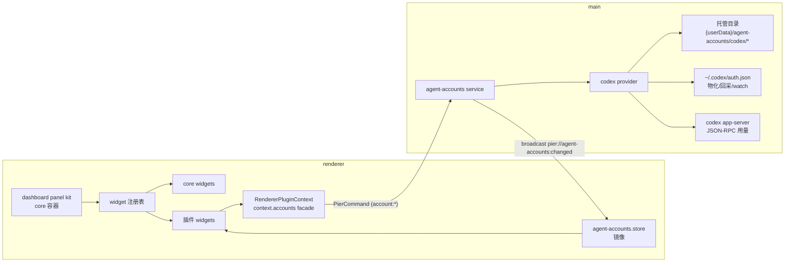

# 大盘 Panel Kit 与 Codex 账号插件设计

**日期**：2026-07-05
**范围**：大盘（dashboard）core panel kit + `dashboardWidgets` 插件贡献点 + main 侧账号域服务（agent-accounts）+ `pier.codex` 内置插件
**参考产品**：orca（`/Users/xyz/Documents/GitHub/orca`）的 codex 多账号管理与全局状态栏
**关联文档**：[2026-06-30-plugin-panel-mechanism-design.md](2026-06-30-plugin-panel-mechanism-design.md)（插件 panel 机制）、[2026-07-02-plugin-configuration-and-statusbar-design.md](2026-07-02-plugin-configuration-and-statusbar-design.md)（贡献点 + 用户覆盖合并管道先例）

## 1. 背景与问题

orca 用一条全局底部状态栏承载账号切换、用量展示等横切信息。Pier 的产品决定不同：**不做全局状态栏，改为提供"大盘" panel kit**——一种可作为 dockview panel 打开的组件容器，用户自行组装其中的观测组件（widget）。codex 账号管理就是第一个插件贡献的大盘组件。

当前缺口（即需要先补齐的基础能力）：

1. **大盘容器不存在**。现有 core panel kit 只有 `terminal` / `welcome`（`src/renderer/components/workspace/panel-registry.ts:21`）。
2. **没有"大盘组件"贡献点**。manifest 现有贡献点为 `commands` / `panels` / `terminalStatusItems` / `configuration`（`src/shared/contracts/plugin.ts:247`），无 widget 级贡献。
3. **main 侧账号域空白**。无账号服务、无用量轮询、无 `account:*` capability；`MainPluginContext` 仅有 `configuration`（`src/plugins/api/main.ts:3`），插件自身无法在 main 侧提供 IPC 面。

### orca 侧调研结论（照抄什么、不抄什么）

**照抄的机制**：
- 多账号模型：每账号一个隔离托管目录存 `auth.json`；添加账号 = spawn `codex login` + 注入 `CODEX_HOME` env；身份从 `auth.json` 的 `id_token` JWT 解析（`email` / `chatgpt_plan_type` / `chatgpt_account_id`，本机 codex-cli 0.142.5 实测确认）。
- 切换 = 把选中账号凭据物化到真实 `~/.codex/auth.json`。
- 所有写操作走串行化队列（orca `serializeMutation`）。
- 用量：定时轮询（15min）+ 事件驱动刷新（窗口聚焦 / 切换账号 / 手动）；数据形状为 session（5h）+ weekly（7d）双窗口 `{ usedPercent, resetsAt }`；非活跃账号显示切换时缓存的 last-known 值。
- 添加账号不隐式切换（add ≠ select）。

**不抄的部分**：
- 全局状态栏（产品决定改为大盘）。
- WSL 双运行时维度（Pier 当前 macOS-only）。
- claude/gemini/kimi/minimax 等其余 provider（v1 只做 codex，但契约留 provider 枚举位）。
- PTY `/status` 输出解析兜底（v1 只走 `codex app-server` JSON-RPC，失败降级为 UI 显示错误态）。

## 2. 目标与非目标

### 目标

- 大盘成为 core panel kit：可多实例打开，每个实例独立组装组件，组装状态随 dockview layout 持久化。
- 新增 `dashboardWidgets` 插件贡献点，纪律链与现有贡献点一致（manifest 声明 → `assertDeclaredContribution` → 运行时注册表 → 宿主渲染）。
- core 自留 widget 声明通道（平行于 `CoreTerminalStatusItemDeclaration`），并落地一个"前台活动总览" core widget 验证无插件路径。
- main 侧建 `agent-accounts` 域服务：codex 多账号 CRUD、接管现有登录、切换物化、凭据回采、用量轮询、变更广播。
- `pier.codex` 内置插件：贡献账号管理 widget + 命令面板命令，经窄 facade 消费账号域。

### 非目标

- 不做第三方插件加载（维持 builtin-only 前提，见 AGENTS.md 插件边界节）。
- 大盘编辑无独立"编辑模式"开关（常开实时编辑）；不做跨断点响应式多套布局（RGL Responsive），单一 12 列。
- 不做 claude 等其他 provider 的账号管理（契约留位，实现不做）。
- 不做非活跃账号的主动用量拉取（切换时缓存 last-known）。
- 不做托管凭据加密（与 `~/.codex/auth.json` 本身明文一致；见权衡 §5.4）。
- 不做运行中 codex 会话的切换门控（orca codex 侧同样没做；confirm 文案警示）。
- 不做 CLI/renderer command 打开大盘的入口（命令面板 + "+" 菜单足够；CLI 场景 v2 再评估）。
- 不做设置页独立"账号管理"节——账号管理 UI 唯一入口是大盘 widget（产品定位）；插件配置项（`confirmSwitch`）仍走既有插件设置节自动渲染。

## 3. 架构总览



归属决策（详细理由见 §5）：

| 部件 | 归属 | 先例 |
|---|---|---|
| 大盘容器 | core panel kit（宿主） | terminal-status-bar：宿主容器 + 插件贡献项 |
| widget 贡献点 | manifest + 运行时注册表 | `panels` / `terminalStatusItems` 同构 |
| 账号域服务 | 宿主 main service | `GitService`：域服务在宿主，插件走窄 facade |
| 账号 UI | `pier.codex` 内置插件 | git / files 插件 |

## 4. 设计

### 4.1 契约层：`src/shared/contracts/dashboard.ts`（新建）

大盘为 12 列自由网格（react-grid-layout v2，见 §4.5）。所有尺寸均以**网格单元**为单位（w = 列数 1..12，h = 行数），像素换算由宿主几何常量决定，契约不感知像素。

```ts
/** 大盘网格列数。契约级常量：w/x 的取值域由它决定。 */
export const DASHBOARD_GRID_COLS = 12;

/** 网格尺寸（单位：格）。 */
export const dashboardGridSizeSchema = z.object({
  h: z.number().int().min(1).max(24),
  w: z.number().int().min(1).max(DASHBOARD_GRID_COLS),
});
export type DashboardGridSize = z.infer<typeof dashboardGridSizeSchema>;

/**
 * manifest 贡献点条目 —— widget 接入规范（尺寸部分）：
 * - defaultSize：添加时的初始尺寸；缺省 HOST_DEFAULT_WIDGET_SIZE = { w: 4, h: 3 }。
 * - minSize：resize 下限；缺省 { w: 2, h: 2 }。
 * - maxSize：resize 上限；缺省 { w: 12, h: 12 }。
 * superRefine 校验（按生效值，即缺省补齐后）：min.w ≤ default.w ≤ max.w 且
 * min.h ≤ default.h ≤ max.h，违反者 manifest 验证失败。
 */
export const pluginDashboardWidgetContributionSchema = z
  .object({
    defaultSize: dashboardGridSizeSchema.optional(),
    description: z.string().min(1).optional(),
    id: z.string().min(1),
    maxSize: dashboardGridSizeSchema.optional(),
    minSize: dashboardGridSizeSchema.optional(),
    permissions: z.array(pierCapabilitySchema).default([]),
    title: z.string().min(1),
  })
  .superRefine(validateWidgetSizeBounds);
export type PluginDashboardWidgetContribution = z.infer<
  typeof pluginDashboardWidgetContributionSchema
>;

/** 尺寸缺省值（契约级，宿主与校验共用同一真相源）。 */
export const HOST_DEFAULT_WIDGET_SIZE: DashboardGridSize = { h: 3, w: 4 };
export const HOST_MIN_WIDGET_SIZE: DashboardGridSize = { h: 2, w: 2 };
export const HOST_MAX_WIDGET_SIZE: DashboardGridSize = { h: 12, w: 12 };

/**
 * 大盘单实例组装清单（存 dockview panel params，随 layout 持久化）。
 * 每项即 react-grid-layout 的一个 layout item（i=id，x/y/w/h 同义直存）。
 */
export const dashboardPanelWidgetEntrySchema = z.object({
  h: z.number().int().min(1),
  id: z.string().min(1), // widget id；单实例语义，同一大盘内去重
  w: z.number().int().min(1).max(DASHBOARD_GRID_COLS),
  x: z.number().int().min(0).max(DASHBOARD_GRID_COLS - 1),
  y: z.number().int().min(0),
});
export const dashboardPanelParamsSchema = z.object({
  widgets: z.array(dashboardPanelWidgetEntrySchema),
});
export type DashboardPanelParams = z.infer<typeof dashboardPanelParamsSchema>;

/** Core-owned widget 静态声明，平行于 CoreTerminalStatusItemDeclaration；尺寸语义同贡献点。 */
export interface CoreDashboardWidgetDeclaration {
  defaultSize?: DashboardGridSize;
  id: string; // "core." 前缀
  maxSize?: DashboardGridSize;
  minSize?: DashboardGridSize;
  titleKey: string; // 全局 i18next key
}
```

**合并层 clamp 语义**（`dashboard-merge.ts` 纯函数）：渲染前对每个 entry 施加 `w/h ∈ [minSize, maxSize]`、`x ∈ [0, 12 - w]`（historical params 越界时收敛而非报错——插件改声明后旧布局仍可恢复）；min/max 同时下发给 RGL item（`minW/minH/maxW/maxH`），让拖拽调整在源头受限。

### 4.2 manifest 扩展：`src/shared/contracts/plugin.ts`

- `pluginManifestSchema` 增加 `dashboardWidgets: z.array(pluginDashboardWidgetContributionSchema).default([])`。
- `pluginLocaleMessagesSchema` 增加 `dashboardWidgets: z.record(z.string().min(1), pluginLocalizedContributionSchema).optional()`（对齐 `panels` / `terminalStatusItems` 的本地化 record）。
- `src/main/services/plugin-service.ts` 的 `collectEffectivePermissions` 并入 `dashboardWidgets[].permissions`。
- **插件详情摘要**：`src/renderer/pages/settings/components/plugins-section.tsx:105-117` 的 contributionSummary 数组按既有 `panels` / `terminalStatusItems` 条目样式补一项 `dashboardWidgets`（icon 用 `LayoutDashboard`）+ 对应 i18n key（`settings.plugins.contributionSummary.dashboardWidget(s)`，en/zh-CN）——否则插件详情页贡献摘要漏项。

### 4.3 插件 API：`src/plugins/api/renderer.ts`

```ts
export interface DashboardWidgetComponentProps {
  /** 当前网格尺寸（格），随用户 resize 实时变化；组件可据此切换布局密度。 */
  size: DashboardGridSize;
}

export interface RendererDashboardWidgetRegistration {
  component: FunctionComponent<DashboardWidgetComponentProps>;
  icon: LucideIcon;
  /** 必须在本插件 manifest.dashboardWidgets 中声明 */
  id: string;
  /** 可选标题 thunk，locale 切换实时生效；省略则用 manifest 本地化解析结果 */
  title?: (() => string) | string;
}

// RendererPluginContext 新增：
dashboardWidgets: {
  register(registration: RendererDashboardWidgetRegistration): () => void;
};
```

**widget 接入规范**（插件作者视角，写入 API 注释）：
1. 尺寸三元组（defaultSize/minSize/maxSize，格单位）声明在 manifest，不在运行时注册对象——尺寸是可序列化元数据，禁用态的设置页/picker 也要读；运行时对象只带 React 组件与图标。
2. 组件必须在 minSize 下可用（最小信息集不溢出），在 maxSize 下不留大片空白；像素自适应用 CSS（Tailwind v4 容器查询），逻辑级密度切换读 `props.size`。
3. 组件体不得假设自身在大盘中的位置；不得直接操纵网格（增删/移动经宿主卡片 chrome）。
4. 有状态数据经 facade/store 读取；组件卸载（移除卡片/关面板/插件禁用）随时发生，副作用必须在 cleanup 里收干净。

选 `component` 而非 `render` 函数：widget 是持续挂载的有状态 React 组件（hooks / memo），对齐 `PluginPanelRegistration.component`；`terminalStatusItems.render` 的轻量函数形态不适用。

**不传 `PanelContext`**：大盘是全局观测面（账号、活动都是全局域数据），不锚定单个项目。widget 需要项目粒度数据时自行经 facade 查询（YAGNI，需要时再扩 props）。

### 4.4 运行时注册表：`src/renderer/lib/plugins/plugin-dashboard-widget-registry.ts`（新建）

照抄 `plugin-panel-registry.ts` 模式：模块级 `Map<string, RendererDashboardWidgetRegistration>` + revision 计数 + subscribe/notify + `registerPluginDashboardWidget` / 注销闭包。

跨插件 id 冲突与 terminalStatusItems 同构：`plugin-service.ts` 新增 `findDashboardWidgetIdConflict`（对齐既有 `findTerminalStatusItemIdConflict`，`plugin-service.ts:122`）——两个插件声明同一 widget id 时后者整包进 diagnostics，防止运行时注册表静默互踩。

`src/renderer/lib/plugins/host-context.ts`：
- `assertDeclaredContribution` 的 kind 联合扩展 `"dashboardWidget"`，查 `manifest.dashboardWidgets`。
- `dashboardWidgets.register` 实现：断言声明后写注册表，返回注销闭包（插件禁用时 runtime dispose 自动注销，与 panels 同生命周期）。

### 4.5 Core 大盘 kit：`src/renderer/panel-kits/dashboard/`（新建）

```
dashboard/
  dashboard-panel.tsx        — 容器组件（react-grid-layout 宿主）+ dashboardPanelKit = { component, icon: LayoutDashboard, kind: "web" }
  dashboard-grid-geometry.ts — 宿主几何常量（ROW_HEIGHT/MARGIN）+ entry↔RGL layout item 映射纯函数
  dashboard-widget-card.tsx  — 卡片 chrome（拖拽把手 header + hover 编辑控件）+ ErrorBoundary
  dashboard-add-card.tsx     — 常驻添加卡（虚线框，网格尾部下方常驻）+ picker 下拉
  dashboard-merge.ts         — 纯函数：params ∩ (core 声明 ∪ 插件声明 ∪ 运行时注册) → 渲染清单 + clamp（Vitest 主体）
  core-dashboard-widgets.ts  — CORE_DASHBOARD_WIDGETS 静态声明表
  core-widgets/activity-widget.tsx — 前台活动总览 core widget
```

**布局引擎：react-grid-layout v2**（新依赖，自带 TS 类型不需 `@types/*`；v1.5 在 React 19 下有 key-prop 已知问题 [#2045](https://github.com/react-grid-layout/react-grid-layout/issues/2045)，故选 v2）。接入方式：
- 12 列（`DASHBOARD_GRID_COLS`）、`rowHeight` / `margin` 为宿主几何常量（`dashboard-grid-geometry.ts`，初始 `ROW_HEIGHT = 88`、`MARGIN = 12`，实施时可调）。
- **宽度自测**：不用 RGL 的 `WidthProvider`（它按 window resize 监听，dockview 分栏拖动不触发 window resize）——容器 div 上 `ResizeObserver` 量宽传 `width` prop（实施时先找仓库既有 ResizeObserver hook 复用）。
- CSS 按仓库惯例在 `dashboard-panel.tsx` 顶部直接 import（对齐 `workspace-host.tsx:11` 引 dockview.css 的写法；具体路径以安装后包内实际导出为准，计划含安装后核对步骤）。
- 垂直压缩（`compactType="vertical"`），不允许重叠。
- **主题适配**：RGL 默认 `.react-grid-placeholder`（红色半透明）与 resize 手柄样式不服主题——在大盘容器作用域内用少量 CSS 覆盖为主题 token（`--accent` 系），暗色模式下同样成立。

**实时编辑（常开，无编辑模式开关）**：
- **拖拽**：**整卡可拖**（`dragConfig.cancel` 豁免 `button/a/input/textarea/select/[role=menuitem]/[data-no-drag]`）——对齐主流仪表盘直觉：抓哪里都能拖；限定 header 把手会被用户感知为"拖拽坏了"。header 左侧 GripVertical 仅作视觉暗示，`[data-no-drag]` 是 widget 体内交互区的逃生舱。
- **调整大小**：RGL resize 手柄（se/s/e 三向，item hover 时浮现）；每个 item 下发 `minW/minH/maxW/maxH`（来自贡献声明的 minSize/maxSize，缺省用 HOST_MIN/MAX），拖不出约束。
- **hover 编辑控件**：卡片 header 常显图标+标题；移除按钮等控件 `opacity-0 group-hover:opacity-100 focus-within:opacity-100`（Tailwind group 惯用法，键盘可达）。v1 控件 = 移除；后续 per-widget 设置入口预留在同一位置。
- **常驻添加卡**：网格尾部下方常驻一张虚线添加卡（`data-testid="dashboard-add-widget"`），点击弹 picker 下拉（core + 启用插件声明，已添加项禁灰）；空盘时它就是初始视图（含引导文案，`data-testid="dashboard-empty"` 挂在提示文案上）。添加卡不进 RGL 网格（不是 layout item，不参与拖拽/压缩），避免为伪条目造位置数学。

**数据流**：
- 组装清单 = `dashboardPanelParamsSchema.safeParse(props.params)`，解析失败按空清单处理。
- 渲染时按清单逐项解析：core 声明 → core 组件表；插件声明且运行时已注册 → 注册表组件；已声明但未注册（插件禁用）→ 占位卡（显示"所属插件已禁用"，保留位置不静默删除）；声明都不存在（插件被卸载）→ 占位卡带移除按钮。占位卡同样是 RGL item（可移动/移除，保住用户布局）。
- **写回**：RGL `onLayoutChange(layout)` → 映射回 `widgets` 数组（`dashboard-grid-geometry.ts` 纯函数，丢弃瞬态字段只留 id/x/y/w/h）→ 与现 params 深比较，有变化才 `props.api.updateParameters({ widgets })` → dockview `toJSON()` 自动持久化。添加 = **first-fit 摆放**（行优先、列其次扫描占用矩阵，落到第一个能容纳 clamp(defaultSize) 的空位——已有 4 宽卡片时新卡落其右侧同排而非直接换行；全满才落底部新行）；移除 = 过滤 entry。
- **jsdom 测试策略**：拖拽/调整是 RGL 自身行为不重测；我们的契约面 = 纯函数（merge/clamp/entry↔item 映射）单测 + 组件测试给固定 `width` 断言渲染清单与 `onLayoutChange` 写回逻辑（直接调 handler）。

**卡片 chrome 归宿主**：图标、标题、拖拽把手、hover 控件（移除）都在 `dashboard-widget-card.tsx`；插件组件只渲染卡片体。每卡片包 ErrorBoundary——单个插件组件抛错降级为错误卡，不炸整个大盘。

**标题解析**：运行时注册的 `title` thunk 优先；否则插件 widget 走 manifest 本地化（`src/renderer/lib/plugins/display.ts` 新增 `resolvePluginDashboardWidgetDisplay`，对齐 `resolvePluginTerminalStatusItemDisplay`）；core widget 走 `i18next.t(titleKey)`。

**注册与入口**：
- `panel-registry.ts` 的 `panelKits` 增加 `dashboard: dashboardPanelKit`。
- 大盘多实例：dockview panel id 用 `dashboard-<uuid>`，component 固定 `"dashboard"`（对齐 terminal 多实例模式；实施时对齐 `workspace.store` 的 `addTerminal` 写法新增 `addDashboard`）。
- 入口两处：`add-panel-action.tsx` 下拉菜单新增"新建大盘"项；actionRegistry 注册 `pier.panel.newDashboard`（命令面板可搜）。

**Core widget（活动总览）**：读 `useForegroundActivityStore`，按 kind 分组计数 + per-panel 活动列表（agent 状态点）。声明 `{ id: "core.activity-overview", titleKey: "dashboard.widget.activityOverview.title", defaultSize: { w: 4, h: 3 }, minSize: { w: 3, h: 2 } }`。价值：验证 core widget 通道 + 大盘在零插件环境可用 + 给组件测试/e2e 提供无账号依赖路径。

### 4.6 账号域契约：`src/shared/contracts/agent-accounts.ts`（新建）

```ts
export const agentAccountProviderSchema = z.enum(["codex"]); // v2 扩 "claude" 等
export type AgentAccountProviderId = z.infer<typeof agentAccountProviderSchema>;

export const agentAccountSchema = z.object({
  createdAt: z.number(),
  email: z.string().min(1),
  id: z.string().min(1), // uuid
  lastAuthenticatedAt: z.number().optional(),
  planType: z.string().min(1).optional(), // JWT chatgpt_plan_type
  provider: agentAccountProviderSchema,
  providerAccountId: z.string().min(1).optional(), // JWT chatgpt_account_id
  updatedAt: z.number(),
});
// 注意：不含托管目录路径 —— renderer 不需要，也不应拿到（对齐 orca Summary 拆分）。

export const rateLimitWindowSchema = z.object({
  resetsAt: z.number().optional(), // epoch ms
  usedPercent: z.number(),
  windowMinutes: z.number().optional(),
});

export const accountUsageSchema = z.object({
  accountId: z.string().min(1),
  error: z.string().min(1).optional(),
  fetchedAt: z.number(),
  session: rateLimitWindowSchema.optional(), // 5h 窗口
  status: z.enum(["ok", "error"]),
  weekly: rateLimitWindowSchema.optional(), // 7d 窗口
});

export const agentAccountsSnapshotSchema = z.object({
  accounts: z.array(agentAccountSchema),
  activeAccountId: z.string().min(1).nullable(),
  /** 最近一次登录失败的错误信息（null = 无错误） */
  lastLoginError: z.object({ at: z.number(), message: z.string().min(1) }).nullable(),
  /** add 登录流程进行中（等浏览器 OAuth 回来） */
  loginPending: agentAccountProviderSchema.nullable(),
  /** 广播单调序号，renderer 镜像 store 拒收乱序 */
  ts: z.number(),
  usage: z.record(z.string().min(1), accountUsageSchema),
});
export type AgentAccountsSnapshot = z.infer<typeof agentAccountsSnapshotSchema>;
```

广播 payload = snapshot 全量。账号数量级为个位数，全量最简单，且对齐 foreground-activity broadcast 全量 activities 的先例。

### 4.7 main 服务：`src/main/services/agent-accounts/`（新建）

```
agent-accounts/
  index.ts           — createAgentAccountsService 工厂
  service.ts         — 编排：CRUD/select/adopt/login、mutation queue、广播、usage 调度
  codex-provider.ts  — spawn login、物化/回采、外部 watch
  codex-usage.ts     — codex app-server JSON-RPC 用量获取（协议隔离在此文件）
  identity.ts        — auth.json 读取 + JWT claim 解析（纯函数，单测主体）
  types.ts           — provider 内部接口
```

**Provider 内部接口**（为 v2 claude 留形状，不过度抽象）：

```ts
interface AgentAccountProvider {
  fetchUsage(signal: AbortSignal): Promise<AccountUsage>; // 只对活跃账号
  login(homeDir: string, signal: AbortSignal): Promise<void>; // spawn `codex login`, env CODEX_HOME=homeDir
  materialize(accountHomeDir: string): Promise<void>; // 托管 auth.json → ~/.codex/auth.json（write-file-atomic）
  readIdentity(homeDir: string): Promise<AccountIdentity | null>;
  readonly id: AgentAccountProviderId;
  /**
   * ~/.codex/auth.json → 托管目录。回采前先读真实 auth 身份并与
   * expectedProviderAccountId 比对：不匹配说明外部已换号（漂移侦测的
   * debounce 还没来得及触发），跳过复制并返回 "identity-mismatch"，
   * 由 service 立即走漂移处理 —— 否则会把 B 账号的凭据写进 A 的托管目录。
   */
  syncBack(
    accountHomeDir: string,
    expectedProviderAccountId: string | undefined
  ): Promise<"identity-mismatch" | "ok">;
  /**
   * 外部漂移侦测。watch 的是 ~/.codex 目录（按文件名过滤 auth.json），
   * 不是文件本身：codex CLI 与本服务都用原子写（写临时文件 + rename），
   * macOS 上对单文件的 fs.watch 按 inode 追踪，rename 后会静默失效。
   */
  watchExternalAuth(cb: () => void): () => void;
}
```

**存储**：
- 账号元数据 L1：`{userData}/agent-accounts.json`，新建 `src/main/state/agent-accounts-state.ts`（对齐 `window-record-state.ts` 的 debouncedJsonStore 模式）。内容 `{ accounts, activeAccountId, version: 1 }`——凭据绝不进此文件。
- 凭据：`{userData}/agent-accounts/codex/<uuid>/auth.json`，目录带 `.pier-managed-home` 标记文件（orca 同款防误删标记：remove 时校验标记存在才允许 `rm -rf`），文件权限 0600。

**关键流程**：

1. **adopt（接管现有登录）**：自动执行——init 时若无托管账号且 `~/.codex/auth.json` 存在有效身份，自动 `enqueueMutation(doAdoptCurrent)`（幂等）。`adoptCurrent` 命令/facade 保留供手动重同步场景。读 `~/.codex/auth.json` 身份 → 建托管目录 → 复制 auth.json → 建账号记录 → `activeAccountId` 指向它 → 广播。幂等：`providerAccountId` 已存在托管账号时转为更新该账号凭据并激活。
2. **add（添加账号）**：mutation queue 串行。建临时托管目录 → spawn `codex login`（env `CODEX_HOME=临时目录`，用户在浏览器完成 OAuth）→ exit 0 → `readIdentity` → 按 `providerAccountId` 去重（重复 = re-auth 语义，更新凭据）→ 建账号记录。**不自动切换**。`loginPending` 状态进 snapshot（UI 显示等待/取消）。超时 5min；`cancelLogin` kill 子进程 + 清理临时目录。**失败分类**：AbortError（取消）不设错误只清 pending；超时设 `lastLoginError: "Login timed out after 5 minutes"`；其他设 err.message；成功清 `lastLoginError`。
3. **select（切换）**：mutation queue 串行。当前 active 存在 → **先 `syncBack`**（把 `~/.codex/auth.json` 回采到当前账号托管目录——codex CLI 会自行刷新 `refresh_token`，漏回采会把旧 token 写回导致账号被登出，这是整个设计最重要的时序约束）。syncBack 内含身份校验：真实 auth 的 `providerAccountId` 与当前 active 不匹配（外部换号落在漂移 debounce 窗口内）→ 跳过复制、返回 mismatch，service 立即走漂移处理后中止本次切换。校验通过 → `materialize` 目标账号（原子写，仓库已有 `write-file-atomic` 依赖）→ 更新 `activeAccountId` → 触发 usage 刷新（`doRefreshUsage`，force）→ 广播。
4. **remove**：active 账号禁删（UI 禁灰 + 服务端拒绝）；校验 `.pier-managed-home` 后删除托管目录。
5. **外部漂移侦测**：watch `~/.codex` 目录并按文件名过滤 `auth.json`（500ms debounce；见 provider 接口注释——单文件 watch 会因原子写 rename 失效）。suppress 用**截止时间戳**而非布尔（`suppressWatchUntil = 物化完成时刻 + debounce 余量`）：布尔在 finally 里翻回 false 后，debounce 尾巴才触发回调，会把自己的物化误判成漂移。回调时 → 读身份 → 按 `providerAccountId` 匹配托管账号：命中 → `activeAccountId` 对齐 + `syncBack`；未命中 → 自动 `doAdoptCurrent`（新身份自动成为托管账号并激活）。
6. **usage 轮询**：15min 定时 + 事件触发（BrowserWindow focus、select 完成、手动 `refreshUsage`）；5min MIN_REFETCH 防抖（手动刷新绕过）。**首拉**：服务创建后立即触发一次非 force 刷新（否则冷启动要等 15min 或首次聚焦才有数据）。**空窗口跳过**：轮询 tick 先查 `BrowserWindow.getAllWindows().length`，无窗口（macOS dock 常驻态）直接跳过——不为没人看的数据 spawn codex 进程。实现 spawn `codex app-server` 走 JSON-RPC（协议请求序列实施时对齐 orca `src/main/rate-limits/codex-fetcher.ts:402-632`）。失败 → `status: "error"` + message，不抛出。非活跃账号只显示切换时缓存的 last-known usage。

**命令与授权**（`src/shared/contracts/commands.ts` + `src/main/app-core/permissions.ts` 的 `COMMAND_METADATA`）：

| 命令 | capability |
|---|---|
| `accounts.snapshot` | `account:read` |
| `accounts.adoptCurrent` | `account:write` |
| `accounts.add { provider }` | `account:write` |
| `accounts.cancelLogin { provider }` | `account:write` |
| `accounts.select { accountId }` | `account:write` |
| `accounts.remove { accountId }` | `account:write` |
| `accounts.refreshUsage` | `account:read`（只触发拉取，不改账号态） |

- `src/shared/contracts/permissions.ts`：capability 枚举新增 `account:read` / `account:write`；`DEFAULT_CAPABILITIES_BY_CLIENT_KIND` 中 `desktop-renderer` 加两者，`cli-local` 只加 `account:read`（切号是全局破坏性动作，CLI 写路径以后单独评估），`mcp-local` / `mobile-paired` 都不加。
- 广播通道：`src/shared/ipc-channels.ts` 的 `PIER_BROADCAST` 新增 `AGENT_ACCOUNTS_CHANGED: "pier://agent-accounts:changed"`。
- preload：`window.pier.accounts.{snapshot, adoptCurrent, add, cancelLogin, select, remove, refreshUsage}`（全走 `invokePierCommand` 统一通道）+ `onChanged(cb)` 订阅广播。

**renderer 镜像 store**：`src/renderer/stores/agent-accounts.store.ts`——`{ snapshot, apply }` + 单调 `ts` 守卫（对齐 `foreground-activity.store`）；`initAgentAccounts()` 先订阅广播再拉全量（对齐 `initPluginRegistry` 防漏窗口）。挂载点与其他 init 一致（实施时对齐 AppShell/bootstrap 现状）。

**边界纪律**：`agent-accounts` 模块不 import `services/agents/`（对齐 foreground-activity 的单向边界先例——账号是独立域，不依赖 agent 集成层）。

### 4.8 插件 facade：`context.accounts`

`src/plugins/api/renderer.ts` 的 `RendererPluginContext` 新增：

```ts
accounts: {
  add(provider: AgentAccountProviderId): Promise<void>;        // account:write
  adoptCurrent(): Promise<void>;                               // account:write
  cancelLogin(provider: AgentAccountProviderId): Promise<void>; // account:write
  onDidChange(cb: (s: AgentAccountsSnapshot) => void): () => void; // account:read
  refreshUsage(): Promise<void>;                               // account:read
  remove(accountId: string): Promise<void>;                    // account:write
  select(accountId: string): Promise<void>;                    // account:write
  snapshot(): AgentAccountsSnapshot;                           // account:read
}
```

host-context 实现：每方法 `assertPluginCapability`；读路径（`snapshot` / `onDidChange`）直接走 renderer 镜像 store（同步、免 IPC 往返，对齐 `agents.selection()` 的宿主状态窄快照思路）；写路径透传 `window.pier.accounts.*`。

### 4.9 codex 插件：`src/plugins/builtin/codex/`（新建）

```
codex/
  manifest.ts            — id "pier.codex"
  main/index.ts          — 空 activate（对齐 git/files）
  renderer/
    index.tsx            — activate：注册 widget + actions；icon
    accounts-widget.tsx  — 大盘卡片体
    account-actions.ts   — 切换 quickPick / 添加 / 接管 / 刷新 handlers
  locales/{en.json, zh-CN.json, index.ts}
```

manifest 要点：
- `permissions: ["account:read", "account:write"]`
- `dashboardWidgets: [{ id: "pier.codex.accounts", title: "Codex Accounts", defaultSize: { w: 4, h: 4 }, minSize: { w: 3, h: 3 }, maxSize: { w: 8, h: 10 }, permissions: ["account:read"] }]`
- `commands`：`pier.codex.switchAccount`（quickPick 列账号）/ `pier.codex.addAccount` / `pier.codex.refreshUsage`
- `configuration`：`pier.codex.confirmSwitch`（boolean，默认 true——切换前是否弹确认）

widget UI 状态机（自动接管后简化为三态）：
- **未安装态**（宿主 agent 探测 `detectedIds` 不含 `"codex"`，经 `context.agents.selection()` 读取）：显示"未检测到 Codex CLI"与安装指引链接；隐藏 \[添加账号\]（否则 spawn 直接 ENOENT，用户只会看到一条莫名其妙的系统错误 toast）。
- **无账号态**（`accounts.length === 0`，自动接管后不再有未接管中间态）：显示 \[添加账号\]；`lastLoginError` 存在时顶部 Alert（variant destructive）展示错误信息。`loginPending` 时显示等待提示 + 取消按钮。
- **正常态**：账号列表（active 高亮），每行 email + plan Badge（@pier/ui） + 双用量条（session/weekly：Progress 组件 + resets 倒计时文案，≥90% 用 destructive 类名）；底部 Separator + \[刷新\] \[添加\]。`lastLoginError` 存在时顶部 Alert + 重试 Button（重试=再调 add）。
- **切换**：点非 active 账号 → `confirmSwitch` 开启时 `dialogs.confirm`（文案警示：影响所有终端含 Pier 外、运行中 codex 会话可能受影响）→ `select` → loading toast。
- **添加**：`notifications.loading("在浏览器中完成登录…")` + 取消按钮（`cancelLogin`）；成功 toast 收尾。**失败分类**：AbortError（取消）不设错误状态；超时设 `lastLoginError: "Login timed out after 5 minutes"`；其他错误设 err.message。成功清 `lastLoginError`。UI 层仍有 `notifications.error` 兜底。

接入：两个 builtin-catalog（`src/renderer/lib/plugins/builtin-catalog.ts` + `src/main/plugins/builtin-catalog.ts`）各加一行。

## 5. 关键权衡

**5.1 大盘容器：core panel kit vs 插件所有**。选 core。跨插件贡献（A 插件向 B 插件的 panel 塞组件）直接违反现有隔离纪律（`assertDeclaredContribution` 只认自家贡献、builtin 互不 import 的 depcruise 规则）；为此开跨插件通道破坏对称性。宿主容器 + 插件贡献项与 terminal-status-bar 完全同构，是已验证的模式。

**5.2 账号服务：宿主 main service vs 扩展插件 main 模块**。选宿主服务 + 窄 facade（`GitService` 同款）。另一条路是给 `MainPluginContext` 开 spawn/fs/http/broadcast 通用原语让插件自带 main 逻辑——API 面暴涨，且 main 侧 `authorizeCommand` 按 client-kind 授权、不区分插件主体，等于白开洞；与"插件边界是纪律边界、builtin-only"的现状不符。真正需要第三方插件时再设计隔离（AGENTS.md 已有此约定）。

**5.3 切换写入：物化 `~/.codex/auth.json` vs 只对新终端注入 `CODEX_HOME`**。选物化（orca 同款）。物化对所有终端一致生效（含 Pier 外的 shell），心智单一；env 注入方案会造成"Pier 内新终端 vs 已开终端 vs 外部终端"三态分裂。代价是修改用户真实 CLI 状态——用 adopt 显式接管 + 切换 confirm + 回采保护来控制。

**5.4 托管凭据不加密**。`~/.codex/auth.json` 本身就是明文；加密托管副本在物化时还得解密回明文落盘，只增加复杂度不增加安全（安全剧场）。`SecretsStore`（safeStorage）留给未来 API-key 型 provider 用。

**5.5 widget 组装存 dockview params vs 全局 prefs JSON**。选 params。每个大盘实例独立组装是产品能力（用户可开"账号大盘"+"活动大盘"两个实例）；params 随 layout 序列化免费持久化、免费多窗口隔离。代价：换机器/重置 layout 会丢组装——可接受，v2 如需"命名大盘模板"再加 prefs 层。

**5.5b 布局引擎：react-grid-layout vs 自研卡片流 vs gridstack**。选 react-grid-layout v2。产品要求自由定位 + 实时拖拽/调整——自研（dnd-kit + 手写碰撞/压缩）工作量与缺陷面都不可控；gridstack.js 非 React 原生（命令式 DOM，接 React 19 要桥接层）；RGL 是该品类事实标准，拖拽/调整/碰撞/垂直压缩/min-max 约束内建，v2 自带 TS 类型且要求 React 18+（v1.5 在 React 19 有 key-prop 已知问题 #2045）。代价：新增一个 UI 依赖 + 需自量宽度（其 `WidthProvider` 只听 window resize，dockview 分栏不触发）——用 ResizeObserver 传 `width` 解决。

**5.6 usage 只拉活跃账号**。`codex app-server` 用当前生效凭据；拉非活跃账号要临时 `CODEX_HOME` spawn 一整个进程，成本高、并发风险大。orca 也是 inactive 缓存模式。

**5.7 add 与 select 分离**。添加账号不隐式切换（orca 同款）：登录动作已经很重（浏览器 OAuth），再叠加全局切号副作用会让失败路径纠缠不清。

## 6. 影响面

### Phase 1（大盘地基，独立可交付）

| 类型 | 文件 |
|---|---|
| 新建 | `src/shared/contracts/dashboard.ts` |
| 修改 | `src/shared/contracts/plugin.ts`（manifest + locale record） |
| 修改 | `src/main/services/plugin-service.ts`（collectEffectivePermissions） |
| 新建 | `src/renderer/lib/plugins/plugin-dashboard-widget-registry.ts` |
| 修改 | `src/renderer/lib/plugins/host-context.ts`（register + assertDeclaredContribution kind） |
| 修改 | `src/renderer/lib/plugins/display.ts`（widget display 解析） |
| 修改 | `src/plugins/api/renderer.ts`（registration 类型 + context.dashboardWidgets） |
| 新建 | `src/renderer/panel-kits/dashboard/`（7 文件，见 §4.5） |
| 依赖 | `package.json` 新增 `react-grid-layout@^2`（自带类型；CSS 按 dockview 先例组件内 import） |
| 修改 | `src/renderer/components/workspace/panel-registry.ts`（panelKits 表） |
| 修改 | `src/renderer/components/workspace/add-panel-action.tsx`（菜单项） |
| 修改 | `src/renderer/stores/workspace.store.ts`（addDashboard）+ panel action 注册处 |
| 修改 | i18n en/zh-CN（大盘/添加组件/core widget 标题等 key） |

### Phase 2（账号地基，独立可交付，无 UI）

| 类型 | 文件 |
|---|---|
| 新建 | `src/shared/contracts/agent-accounts.ts` |
| 修改 | `src/shared/contracts/permissions.ts`（`account:read` / `account:write` + 默认授权表） |
| 修改 | `src/shared/contracts/commands.ts`（7 个命令 variant） |
| 修改 | `src/shared/ipc-channels.ts`（`AGENT_ACCOUNTS_CHANGED`） |
| 修改 | `src/main/app-core/permissions.ts`（COMMAND_METADATA 7 行）+ 命令路由接线（实施时定位 router 注册处） |
| 新建 | `src/main/services/agent-accounts/`（6 文件，见 §4.7） |
| 修改 | `dependency-cruiser.config.cjs`（新增 `agent-accounts-narrow-imports` 规则，对齐 `foreground-activity-narrow-imports`（config L92）：from `^src/main/services/agent-accounts`，白名单 self + `^src/shared` + `^src/main/state/agent-accounts-state` + `^node:` + node_modules——单向边界由 depcruise 强制而非纯纪律） |
| 新建 | `src/main/state/agent-accounts-state.ts` |
| 修改 | `src/preload/index.ts`（accounts facade + 广播订阅） |
| 新建 | `src/renderer/stores/agent-accounts.store.ts` |
| 修改 | renderer 侧 store init 挂载点（对齐 initPluginRegistry 所在位置） |

### Phase 3（codex 插件，依赖 P1+P2）

| 类型 | 文件 |
|---|---|
| 新建 | `src/plugins/builtin/codex/`（manifest / main / renderer / locales） |
| 修改 | `src/renderer/lib/plugins/builtin-catalog.ts` + `src/main/plugins/builtin-catalog.ts` |
| 修改 | `src/plugins/api/renderer.ts` + `src/renderer/lib/plugins/host-context.ts`（accounts facade） |

### Phase 4（收尾）

e2e（大盘组装持久化）、AGENTS.md 架构边界段落（agent-accounts 模块 + dashboardWidgets 贡献点）、必要的设置页联动检查。

Phase 1 与 Phase 2 无相互依赖，可并行实施。

## 7. 测试

- **unit / main**：`identity.ts` JWT 解析（伪造 token 三段）；service 编排（mock provider）——select 时序（syncBack 先于 materialize）、syncBack 身份 mismatch 中止切换、active 禁删、mutation 串行（并发 select 顺序化）、adopt 幂等、re-auth 更新凭据文件、登录失败/取消清理临时目录、watcher suppress 截止时间戳（物化后 debounce 尾巴不自触发）、usage 防抖与手动 bypass、select 后触发 usage 刷新；`agent-accounts-state` schema round-trip；`permissions.test` 新命令授权矩阵；`findDashboardWidgetIdConflict` 冲突用例。
- **unit / renderer**：dashboard-widget-registry（register/dispose/revision）；`assertDeclaredContribution("dashboardWidget")` 正反例；`dashboard-merge.ts` 纯函数（core/插件/未注册占位/去重/尺寸 clamp 与 x 收敛）；`dashboard-grid-geometry.ts` entry↔RGL item 映射（min/max 下发、瞬态字段丢弃、追加定位）；agent-accounts.store ts 守卫。
- **component**：dashboard-panel（固定 width 渲染：常驻添加卡 → 添加 core widget → onLayoutChange 写回 params → 移除；hover 控件可见性；自定义 resize 手柄存在；ErrorBoundary 兜底：抛错 widget 降级错误卡不影响相邻卡。拖拽/调整为 RGL 自身行为不重测）；accounts-widget（mock facade：未安装态 / 无账号态（含 lastLoginError Alert + 重试）/ 多账号态 / 切换 confirm 链 / usage 条与错误态）。
- **e2e**：新建大盘 → 添加活动总览 widget → 重启 → 布局与组装恢复。
- **边界**：depcruise 现有规则自动覆盖新插件目录；plugin-id-prefix 包扫描测试自动覆盖 `pier.codex` 配置 key 前缀。

## 8. 风险

| 风险 | 缓解 |
|---|---|
| `codex app-server` 是 experimental，协议可能漂移 | 协议隔离在 `codex-usage.ts` 单文件；失败降级为 usage error 态，不影响账号管理主链路；实施时按本机 CLI 版本实测请求序列 |
| react-grid-layout v2 相对较新（v1→v2 有 API/类型命名变更） | 安装后先核对包内类型与 CSS 导出路径再写代码（计划含核对步骤）；RGL 交互不进 jsdom 重测，契约面收敛在自有纯函数；若 v2 出现阻断缺陷可降级 v1.5 + 局部压制 React 19 key 告警（回退路径明确） |
| refresh_token 回采时序错误 → 账号被登出 | select 前无条件 syncBack；单测锁定时序；物化用 write-file-atomic |
| syncBack 回采到错误身份（外部换号落在漂移 debounce 窗口内）→ 凭据串号 | syncBack 内置 `providerAccountId` 校验，mismatch 跳过复制并立即走漂移处理；单测覆盖 |
| 单文件 fs.watch 在原子写 rename 后按 inode 失效（macOS）→ 漂移侦测永久哑火 | watch `~/.codex` 目录 + 文件名过滤，FSEvents 目录级追踪跨 rename 可靠 |
| `~/.codex/auth.json` watcher 被自身物化触发循环 | suppress 截止时间戳覆盖 debounce 尾巴 + debounce；单测覆盖 |
| codex CLI 未安装 | widget 未安装态隐藏添加入口并给安装指引（经宿主 agent 探测 `detectedIds` 门控） |
| 切换时运行中的 codex 会话 token 冲突 | confirm 文案警示；v1 风险接受（orca codex 侧同样无门控） |
| 禁用插件后大盘残留其 widget 条目 | 占位卡显示来源与状态，保留组装位；不做静默删除 |
| 多窗口并发 | widget 组装 per-panel params 天然隔离；账号态全局广播天然一致；main 侧 mutation queue 串行化写 |

## 9. 验收

- [ ] 命令面板与 "+" 菜单可新建大盘；可开多个实例且各自组装独立。
- [ ] 大盘可经常驻添加卡添加"活动总览" core widget；卡片可拖拽换位、拖角调整大小（受声明 min/max 约束）、hover 出现移除控件；重启后布局与尺寸恢复。
- [ ] 启用 codex 插件后，picker 中出现"Codex Accounts" widget。
- [ ] init 时若有本地 codex 登录则自动接管为托管账号；widget 直接显示正常态。
- [ ] 添加账号走浏览器 OAuth；完成后列表出现新账号且**不**自动切换；可中途取消。登录失败时 widget 显示错误 Alert + 重试按钮。
- [ ] 切换账号后 `~/.codex/auth.json` 原子更新为目标账号凭据；新开终端 `codex` 身份正确；切换回来不丢登录（回采生效）。
- [ ] 在 Pier 外 `codex login` 换号后，widget 自动对齐（匹配则切换 active，不匹配则自动接管为新账号）。
- [ ] usage 双窗口条展示 usedPercent 与 reset 时间；拉取失败显示错误态不崩溃。
- [ ] 禁用 codex 插件：大盘显示占位卡；重新启用恢复。
- [ ] `pnpm check` 全绿（typecheck + lint + depcruise + file-size + unit + component）。
