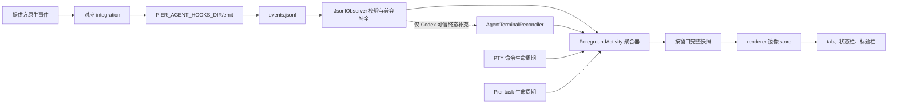

# Agent 状态适配契约与公共能力审计

## 目标和完成标准

本审计冻结 Pier 当前 Agent 状态链路的所有权，核对每个提供方（Provider）原生事件如何进入
`ForegroundActivity`，并删除会让插件误以为宿主提供会话记录读取服务的公共能力。

完成标准：

- 30 个已注册集成和 5 个仅启动识别 Agent 均有明确的输入、事件映射和终态权威等级。
- `ForegroundActivityBroadcast` 继续是 renderer 唯一权威状态源。
- Codex 原生 session 文件只作为适配器内部的可信终态补充，不成为公共数据域。
- 公共 capability、插件 manifest 和设置界面不再接受或展示 `transcript:read`。
- 兼容输入、失败退化、禁止的反模式和需求到证据均可由代码或测试定位。

## 审计结论

现有运行链路已经闭环，不需要再建状态系统。`src/shared/contracts/foreground-activity.ts`
集中定义规范状态和 UI 映射；`src/main/services/foreground-activity/aggregator.ts` 持有面板级
活动状态；main 按窗口发布完整快照；renderer store 只做单调序号保护的镜像。

唯一需要立即删除的公共能力是 `transcript:read`。删除前它只存在于 capability 枚举和中英文
权限文案中，没有命令授权、插件 facade、内置或官方受管理插件声明，也没有读取 API。
`profile:read` 和 `evidence:write` 当前没有运行时消费者，但分别由评分清单的 Profile、Evidence
后续任务所有；本轮记录其未启用状态，不把它们误判为已交付能力，也不越过对应设计任务删除。

## 当前结构为什么仍需收尾

运行结构正确，但此前公共 schema 接受 `transcript:read`，设置界面也能为它生成权限名称。这会
对插件作者形成错误承诺：看起来 Pier 存在可授权的会话记录服务，实际上没有命令、facade、
存储或查询入口。另一方面，Codex 对账器确实读取提供方自有文件，若不明确边界，容易把
内部兼容输入误写成宿主公共领域。此次收尾只修正这两个契约表达问题，不改运行时状态语义。

## 所有权划分

| 层 | 负责 | 不负责 |
|---|---|---|
| 提供方适配器 | 探测提供方、幂等安装/卸载 hook、把原生事件转成 Pier 规范事件、声明 `stopAuthority` | 保存统一会话历史、直接修改 UI 状态 |
| 共享契约 | 定义 `agent/task/shell/idle`、Agent 五态、规范事件到状态和状态到 tab 的映射 | 读取提供方配置或 session 文件 |
| `ForegroundActivity` 聚合器 | 维护面板活动、优先级、回合/工具/子代理记账、冷却、消抖和生命周期 | 理解提供方原生事件名或文件格式 |
| Agent 终态对账边界 | 在提供方 hook 缺少可信终态时产生已验收的规范终态；当前仅 Codex 使用 | 提供 Transcript 查询、过程状态、工具内容或回放 |
| main 发布层 | 生成按窗口过滤的完整快照并广播，空窗口也发布空快照以清除旧状态 | 让 renderer 读取其他窗口活动 |
| renderer store 和 UI | 镜像最新快照、拒绝乱序、显示状态栏/tab/标题栏计数 | 从终端文本、标题或提供方文件重新推断状态 |
| 测试 | 锁定各集成权威等级、事件映射、聚合状态机、窗口隔离和 Codex 内部对账 | 用测试 fixture 建设产品级会话资产 |

同一面板有多个候选时，聚合优先级固定为：`task > agent(hook) > agent(launch) > shell`。
启动识别只能证明 Agent 二进制正在面板中运行，因此 `source=launch` 时不得伪造具体 `status`。

## 入口到界面的数据流

提供方 session 文件不在这条数据流中向外传播。Codex 对账器只把
`event_msg/task_complete` 转为 `TurnCompleted`、把 reason 为 `interrupted` 的
`event_msg/turn_aborted` 转为 `TurnInterrupted`，然后仍经聚合器进入同一状态源。

## 规范状态真值表

| Pier 规范事件 | `AgentActivity.status` | tab 状态 | 说明 |
|---|---|---|---|
| `PromptSubmit`、`processing`、`running` | `processing` | `running` | 回合或模型主循环推进 |
| `ToolStart` | `tool` | `running` | 活跃工具按 `toolUseId` 记账 |
| `ToolComplete` | `processing` | `running` | 最后一个工具完成后返回主循环 |
| `PermissionRequest` | `waiting` | `waiting` | 等待用户输入或授权 |
| `error` | `error` | `failed` | 回合级失败，不把单个工具失败误报成会话失败 |
| `SessionStart` | `ready` | `idle` | 建立有 hook 证据但尚未开始回合的活动 |
| `Stop`（`authoritative` / `reset-only`）、`TurnCompleted`、`TurnInterrupted` | `ready` | `idle` | 只有可信终态可以结算当前回合 |
| `Stop`（`advisory`） | 缺席 | `idle` | 只记录候选终态，不能谎报 ready；后续可信事件可恢复具体状态 |
| `SessionEnd` | 删除当前 scope；无剩余 scope 时删除 Agent 活动 | 回到父 scope 投影或无 Agent 指示 | 聚合器在普通状态映射前处理会话结束，不把已结束会话保留为 ready |
| `SubagentStart`、`SubagentStop` | 保持主回合推进并更新计数 | `running` | 子代理不覆盖父会话恢复信息 |

`stopAuthority` 含义：

- `authoritative`：该适配器的 `Stop` 可以直接结算当前回合。
- `advisory`：`Stop` 只说明出现候选终态；在可信终态到来前清除具体状态，不能谎报 ready。
- `reset-only`：只接受显式 session reset 语义，不把普通结束候选当作回合完成。
- `none`：该提供方暴露的信号不足以证明终态，聚合器丢弃对应 `Stop`。

## 逐 Agent 事件映射矩阵

以下映射以 `src/main/services/agents/integrations/` 当前实现为准。`→` 左侧为提供方
原生事件，右侧为 Pier 规范事件；未列出的原生事件不会参与状态投影。

| Agent | 输入机制 | 档位 | 原生事件 → Pier 规范事件 | `stopAuthority` |
|---|---|---|---|---|
| aider | 退役清理器；不再安装通知 hook | `coarse` | 无现役事件；历史 notifications 配置只清理 | `none` |
| amp | 提供方 JavaScript 插件 | `full` | `session.start→SessionStart`；`agent.start→PromptSubmit`；`tool.call→ToolStart`；`tool.result→ToolComplete`；`agent.end→Stop` | `authoritative` |
| antigravity | 嵌套 JSON hook | `coarse` | `PreInvocation→PromptSubmit`；`PostToolUse→ToolComplete`；`Stop→Stop` | `advisory` |
| aug | 嵌套 JSON hook | `full` | `SessionStart→SessionStart`；`UserPromptSubmit→PromptSubmit`；`PreToolUse→ToolStart`；`PostToolUse→ToolComplete`；`Stop→Stop`；`SessionEnd→SessionEnd` | `advisory` |
| autohand | 扁平 JSON hook 数组 | `full` | `session-start→SessionStart`；`session-end→SessionEnd`；`session-error→error`；`pre-prompt→PromptSubmit`；`stop→Stop`；`permission-request→PermissionRequest`；`pre-tool→ToolStart`；`post-tool→ToolComplete` | `advisory` |
| claude | Claude 式嵌套 JSON hook | `full` | `SessionStart→SessionStart`；`UserPromptSubmit→PromptSubmit`；`PreToolUse→ToolStart`；`PostToolUse/PostToolUseFailure→ToolComplete`；`PermissionRequest→PermissionRequest`；`PermissionDenied/PreCompact→processing`；`Stop→Stop`；`StopFailure→error`；`SubagentStart/SubagentStop→同名`；`SessionEnd→SessionEnd` | `advisory` |
| cline | 可执行 hook 文件 | `full` | `TaskStart→SessionStart`；`TaskResume→running`；`UserPromptSubmit→PromptSubmit`；`PreToolUse→ToolStart`；`PostToolUse→ToolComplete`；`TaskCancel/TaskComplete→Stop`；`PreCompact→processing` | `authoritative` |
| codebuddy | Claude 兼容嵌套 JSON hook | `full` | 与 claude 相同 | `advisory` |
| codex | Codex `hooks.json` | `full` | `SessionStart→SessionStart`；`UserPromptSubmit→PromptSubmit`；`PreToolUse→ToolStart`；`PostToolUse→ToolComplete`；`PermissionRequest→PermissionRequest`；`PreCompact/PostCompact→processing`；`SubagentStart/SubagentStop→同名`；`Stop→Stop`；内部对账另补 `TurnCompleted/TurnInterrupted`；**`error: unsupported`**（hooks 无 `StopFailure`；`turn_aborted` 仅→`TurnInterrupted`，禁止当失败） | `advisory` |
| command-code | 嵌套 JSON hook | `coarse` | `SessionStart→SessionStart`；`PreToolUse→ToolStart`；`PostToolUse→ToolComplete`；`Stop→Stop` | `advisory` |
| copilot | Copilot hook 配置 | `full` | `sessionStart→SessionStart`；`sessionEnd→SessionEnd`；`userPromptSubmitted→PromptSubmit`；`preToolUse→ToolStart`；`postToolUse→ToolComplete`；`agentStop→Stop`；`permissionRequest→PermissionRequest`；`subagentStart/subagentStop→同名`；`errorOccurred→error` | `advisory` |
| crush | 主配置内扁平 hook | `coarse` | `PreToolUse→ToolStart`；没有可信终态 | `none` |
| cursor | Cursor hook 配置 | `full` | `sessionStart→SessionStart`；`beforeSubmitPrompt→PromptSubmit`；`preToolUse→ToolStart`；`postToolUse/postToolUseFailure/afterShellExecution/afterMCPExecution→ToolComplete`；`beforeShellExecution/beforeMCPExecution→PermissionRequest`；`afterAgentResponse→processing`；`subagentStart/subagentStop→同名`；`stop→Stop`；`sessionEnd→SessionEnd` | `advisory` |
| devin | JSON hook 配置 | `full` | `SessionStart→SessionStart`；`UserPromptSubmit→PromptSubmit`；`Stop→Stop`；`PostCompaction→processing`；`SessionEnd→SessionEnd`；`PreToolUse→ToolStart`；`PostToolUse→ToolComplete`；`PermissionRequest→PermissionRequest` | `advisory` |
| droid | 嵌套 JSON hook | `full` | `SessionStart/SessionEnd→同名`；`UserPromptSubmit→PromptSubmit`；`Notification→PermissionRequest`；`Stop→Stop`；`StopFailure→error`；`PreCompact→processing`；`PreToolUse→ToolStart`；`PostToolUse→ToolComplete` | `advisory` |
| gemini | Gemini hook 配置 | `full` | `SessionStart/SessionEnd→同名`；`BeforeAgent→PromptSubmit`；`AfterAgent→Stop`；`Notification→PermissionRequest`；`PreCompress→processing`；`BeforeTool→ToolStart`；`AfterTool→ToolComplete` | `advisory` |
| goose | 受管理的 Goose 插件 hook | `full` | `SessionStart/SessionEnd→同名`；`UserPromptSubmit→PromptSubmit`；`PreToolUse→ToolStart`；`PostToolUse/PostToolUseFailure→ToolComplete`；`Stop→Stop` | `advisory` |
| grok | 嵌套 JSON hook | `full` | `SessionStart/SessionEnd→同名`；`UserPromptSubmit→PromptSubmit`；`PreToolUse→ToolStart`；`PostToolUse/PostToolUseFailure→ToolComplete`；`PermissionDenied/PreCompact/PostCompact→processing`；`Notification→PermissionRequest`；`Stop→Stop`；`StopFailure→error`；`SubagentStart/SubagentStop→同名` | `advisory` |
| hermes | Python 插件和 YAML 启用项 | `coarse` | `on_session_start→SessionStart`；`pre_llm_call→processing`；`pre_tool_call→ToolStart`；`post_tool_call→ToolComplete`；`pre_approval_request→PermissionRequest`；`post_approval_response→ToolStart`；`on_session_end/on_session_finalize→SessionEnd`；`on_session_reset→Stop` | `reset-only` |
| kilo | JavaScript 插件事件总线 | `full` | `session.created→SessionStart`；`session.idle→Stop`；`session.error→error`；`session.deleted→SessionEnd`；`session.status busy/retry→running`、`idle→Stop`；`permission.asked→PermissionRequest`；`permission.replied→processing`；`tool.execute.before/after→ToolStart/ToolComplete` | `authoritative` |
| kimi | TOML hook | `full` | `SessionStart/SessionEnd→同名`；`UserPromptSubmit→PromptSubmit`；`PreToolUse→ToolStart`；`PostToolUse/PostToolUseFailure→ToolComplete`；`PreCompact/PostCompact→processing`；`Stop→Stop`；`StopFailure→error`；`SubagentStart/SubagentStop→同名` | `advisory` |
| kiro | Kiro 扁平 hook 配置 | `full` | `agentSpawn→SessionStart`；`userPromptSubmit→PromptSubmit`；`preToolUse→ToolStart`；`postToolUse→ToolComplete`；`stop→Stop` | `advisory` |
| mimo-code | JavaScript 插件事件总线 | `full` | `session.created→SessionStart`；`session.idle→Stop`；`session.error→error`；`session.deleted→SessionEnd`；`session.status busy/retry→running`、`idle→Stop`；`tui.command.execute(prompt.submit)→PromptSubmit`；`permission.updated→PermissionRequest`；`permission.replied→processing`；`tool.execute.before/after→ToolStart/ToolComplete` | `authoritative` |
| mistral-vibe | 实验性 TOML hook | `coarse` | `before_tool→ToolStart`；`after_tool→ToolComplete`；`post_agent_turn→Stop` | `authoritative` |
| omp | JavaScript 扩展 | `full` | `session_start→SessionStart`；主代理 `agent_start→PromptSubmit`、`agent_end→Stop`；子代理 `agent_start/agent_end→SubagentStart/SubagentStop`；`tool_call→ToolStart`；`tool_result→ToolComplete`；`tool_approval_requested→PermissionRequest`；`tool_approval_resolved→ToolStart`；`session_shutdown→SessionEnd`；**`error: unsupported`**（2026-07-05 probe：abort/ESC 仍 `agent_end→Stop`，无独立失败事件） | `authoritative` |
| opencode | JavaScript 插件事件总线 | `full` | 与 mimo-code 相同 | `authoritative` |
| openclaude | Claude 兼容嵌套 JSON hook | `full` | 与 claude 相同 | `advisory` |
| pi | JavaScript 扩展 | `coarse` | `session_start→SessionStart`；`agent_start→PromptSubmit`；`agent_end→Stop`；`session_shutdown→SessionEnd` | `authoritative` |
| qodercli | Claude 兼容嵌套 JSON hook | `full` | 与 claude 相同 | `advisory` |
| qwen-code | Qwen Code hook | `full` | `SessionStart/SessionEnd→同名`；`UserPromptSubmit→PromptSubmit`；`Stop→Stop`；`StopFailure→error`；`PreToolUse→ToolStart`；`PostToolUse/PostToolUseFailure→ToolComplete`；`PermissionRequest→PermissionRequest`；`PermissionDenied/PreCompact/PostCompact→processing`；`SubagentStart/SubagentStop→同名` | `advisory` |

### 仅启动识别

| Agent | 权威输入 | UI 能断言的事实 | 禁止推断 |
|---|---|---|---|
| ante | launcher / OSC 133 命令生命周期 | 面板中启动了该 Agent | 具体回合状态、工具、等待或终态 |
| codebuff | 同上 | 同上 | 同上 |
| continue | 同上 | 同上 | 同上 |
| rovo | 同上 | 同上 | 同上 |
| openclaw | 同上 | 同上 | 同上 |

## FA `error` 可达性（Ev5 / 2026-07-19）

通知「出错时」依赖 FA 进入 `error`。下列结论禁止假绿：无原生失败语义时不得把 `Stop` / `agent_end` / `TurnInterrupted` / 用户 abort 映射为 `error`。

| Provider | 结论 | 证据 | 代码锁 |
|---|---|---|---|
| omp | **B — `error: unsupported`** | 2026-07-05 probe：abort/ESC 仍发 `agent_end`；`OMP_EVENTS` 无独立失败事件；`agent_end→Stop` | `OMP_FA_ERROR_REACHABILITY`；`omp.test.ts` 断言映射表不含 `error` |
| codex | **B — `error: unsupported`** | 发布版 hooks 全集无 `StopFailure`；transcript 对账仅 `task_complete→TurnCompleted`、`turn_aborted→TurnInterrupted` | `CODEX_FA_ERROR_REACHABILITY`；`codex.test.ts` 断言 hook 映射不含 `error` |
| claude（对照） | **A — `StopFailure→error`** | 官方 hooks：`StopFailure` = 回合因 API 错误终止 | `claude.ts` 映射保持不变 |

`enableErrorAttention` 对 omp/codex **无 FA 入口**属预期；对仍有真实 `error` 映射的 Top A（如 claude）继续有效。

## 兼容输入边界

- `AgentHookEventPayload` v1 和 v2 都保留；v2 的 `nativeEvent` 保存原生事实，`event` 保存规范词汇。
- `metadataBase64` 只允许补全白名单身份字段：session、turn、tool、agent 和
  `transcriptPath`；解析失败或补全后 schema 不合法时继续使用原事件。
- `transcriptPath` 是事件路由给 Codex 适配器的内部提示，不是公共文件读取授权。
- Codex 对账只接受 `$CODEX_HOME/sessions` 真实路径内的文件，同时检查词法路径和
  `realpath`，拒绝目录穿越和符号链接逃逸。
- 对账器只读取新增内容，单次最多 1 MiB，同时限制 watcher、turn 上下文、待决终态和去重集合。
- 坏 JSON、未知记录、非 Codex 事件、foreign turn、旧内容和无 owner 的终态不会改变状态。
- 提供方格式变化时对账器静默退化；hook 主路径和 PTY 退出兜底继续工作。

## 公共 capability 审计

| 分类 | 能力 | 当前所有权和证据 | 结论 |
|---|---|---|---|
| 命令授权 | `app:*`、`environment:*`、`preferences:*`、`workspace:*`、`worktree:*`、`window:*`、`panel:read/control`、`terminal:*`、`plugin:*`、`git:*`、`file:*`、`ai:invoke` | `src/main/app-core/permissions.ts` 为命令声明要求，客户端默认能力在共享契约中分层 | 保留 |
| 插件贡献和 facade | `command:register`、`panel:register`、`panel:open`、`terminal:read`、`git:*`、`file:*`、`secret:*`、`network` | builtin manifest、renderer host context、main secret/network 服务和治理测试有真实消费者 | 保留 |
| 官方插件数据发布 | `usage:publish` | `pier.codex` manifest、usage data service 和授权测试直接消费 | 保留 |
| 后续独立任务 | `profile:read`、`evidence:write` | 当前无 facade；分别由评分清单 C1/C2 和 B1/B2 所有 | 本轮不声称可用，不越权删除 |
| 无消费者预留 | `transcript:read` | 删除前仅 capability schema 与双语标签存在；无命令、facade、manifest、存储或 API | 删除 |

删除 `transcript:read` 后，内置与受管理插件的根级及贡献级 permissions 都经同一个
`pierCapabilitySchema` 拒绝旧值。当前可信插件集合没有声明该能力，因此无需数据迁移或 API
版本升级。

## 明确禁止的反模式

- 不新增 Pier 自有 Transcript、统一 session 表、全文索引或回放界面。
- 不把提供方原生 session 路径加入 plugin API、preload 或 command router。
- 不让 renderer 根据终端文字、标题或计时器生成第二份 Agent 状态。
- 不让 Codex 对账器投影工具、processing、permission 或内容数据；它只补可信终态。
- 不因某家提供方事件不足而合成虚假 `Stop`、`ready` 或 `SessionStart`。
- 不用公共 capability 包装尚不存在的服务；后续 Profile、Evidence 能力须随各自服务一起验收。

## 最小实施和验证

实施只包含：删除公共 capability 枚举项和双语标签；增加 schema、manifest、文案负向测试；
记录本审计并更新评分清单和 `AGENTS.md`。不改聚合器、hook、对账器、preload、renderer store
或 UI 组件。

验证分为三层：

1. 公共契约测试证明旧 capability 在所有 manifest 入口被拒绝且不再展示。
2. Agent runtime semantics、聚合器和 Codex 状态链测试证明运行行为不变。
3. `typecheck`、`lint`、`depcruise` 和完整 `pnpm check` 证明类型、边界和全仓回归通过。

## 需求到证据的验收矩阵

| 需求 | 代码或测试证据 | 通过条件 |
|---|---|---|
| renderer 只有一个活动状态源 | `foreground-activity.ts`、`foreground-activity-publication.ts`、`foreground-activity.store.ts` | 状态从 main 完整快照进入 store，旧源不复活 |
| 每个 Agent 语义可追溯 | `integrations/`、`agent-hook-runtime-semantics.test.ts`、各 integration 单测 | 30 个集成无重复且显式声明权威；5 个仅启动识别名单固定 |
| 规范状态映射唯一 | `activityStatusForHookEvent`、`foreground-activity-aggregator.test.ts` | 五态、工具并发、迟到事件、冷却和优先级测试通过 |
| 提供方 session 保持私有 | `terminal-reconciliation.ts`、`codex-transcript-reconciler.ts` 及其单测 | 只产生规范终态；越界、坏行、轮转和释放场景通过 |
| 公共 Transcript 能力消失 | `plugin-permissions-contract.test.ts` | capability、builtin/managed manifest 根级和贡献级均拒绝旧值；双语标签不存在 |
| 运行 UI 不变 | `codex-status-chain.test.tsx`、终端状态栏测试 | Codex complete/interrupted 均经唯一聚合器进入 ready |
| 文档和实现一致 | 本文、`AGENTS.md`、能力评分清单 | A1/A2 标记完成并链接审计证据 |
