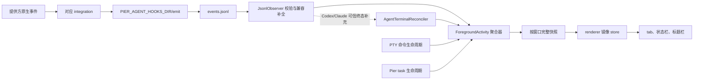

# Agent 状态适配契约与公共能力审计

## 目标和完成标准

本审计冻结 Pier 当前 Agent 状态链路的所有权，核对每个提供方（Provider）原生事件如何进入
`ForegroundActivity`，并删除会让插件误以为宿主提供会话记录读取服务的公共能力。

完成标准：

- 30 个已注册集成和 5 个仅启动识别 Agent 均有明确的输入、事件映射和终态权威等级。
- `ForegroundActivityBroadcast` 继续是 renderer 唯一权威状态源。
- Codex 原生 session 文件只作为适配器内部的可信终态补充，不成为公共数据域。
- 公共 capability、插件 manifest 和设置界面不再接受或展示 `transcript:read`。
- 兼容输入、失败退化、禁止的反模式和需求到证据均可由代码或测试定位。

## 审计结论

现有运行链路已经闭环，不需要再建状态系统。`src/shared/contracts/foreground-activity.ts`
集中定义规范状态和 UI 映射；`src/main/services/foreground-activity/aggregator.ts` 持有面板级
活动状态；main 按窗口发布完整快照；renderer store 只做单调序号保护的镜像。

唯一需要立即删除的公共能力是 `transcript:read`。删除前它只存在于 capability 枚举和中英文
权限文案中，没有命令授权、插件 facade、内置或官方受管理插件声明，也没有读取 API。
`profile:read` 和 `evidence:write` 当前没有运行时消费者，但分别由评分清单的 Profile、Evidence
后续任务所有；本轮记录其未启用状态，不把它们误判为已交付能力，也不越过对应设计任务删除。

## 当前结构为什么仍需收尾

运行结构正确，但此前公共 schema 接受 `transcript:read`，设置界面也能为它生成权限名称。这会
对插件作者形成错误承诺：看起来 Pier 存在可授权的会话记录服务，实际上没有命令、facade、
存储或查询入口。另一方面，Codex 对账器确实读取提供方自有文件，若不明确边界，容易把
内部兼容输入误写成宿主公共领域。此次收尾只修正这两个契约表达问题，不改运行时状态语义。

## 所有权划分

| 层 | 负责 | 不负责 |
|---|---|---|
| 提供方适配器 | 探测提供方、幂等安装/卸载 hook、把原生事件转成 Pier 规范事件、声明 `stopAuthority` 与逐事件 `turnStartAuthority` | 保存统一会话历史、直接修改 UI 状态 |
| 共享契约 | 定义 `agent/task/shell/idle`、Agent 五态、规范事件到状态和状态到 tab 的映射 | 读取提供方配置或 session 文件 |
| `ForegroundActivity` 聚合器 | 维护面板活动、优先级、回合/工具/子代理记账、冷却、消抖和生命周期 | 理解提供方原生事件名或文件格式 |
| Agent 终态对账边界 | 在提供方 hook 缺少可信终态时产生已验收的规范终态；当前 Codex（完成+中断）与 Claude（仅中断）使用 | 提供 Transcript 查询、过程状态、工具内容或回放 |
| main 发布层 | 生成按窗口过滤的完整快照并广播，空窗口也发布空快照以清除旧状态 | 让 renderer 读取其他窗口活动 |
| renderer store 和 UI | 镜像最新快照、拒绝乱序、显示状态栏/tab/标题栏计数 | 从终端文本、标题或提供方文件重新推断状态 |
| 测试 | 锁定各集成权威等级、事件映射、聚合状态机、窗口隔离和 Codex 内部对账 | 用测试 fixture 建设产品级会话资产 |

同一面板有多个候选时，聚合优先级固定为：`task > agent(hook) > agent(launch) > shell`。
启动识别只能证明 Agent 二进制正在面板中运行，因此 `source=launch` 时不得伪造具体 `status`。

## 入口到界面的数据流

```mermaid
flowchart LR
    A["提供方原生事件"] --> B["对应 integration"]
    B --> C["PIER_AGENT_HOOKS_DIR/emit"]
    C --> D["events.jsonl"]
    D --> E["JsonlObserver 校验与兼容补全"]
    E --> F["ForegroundActivity 聚合器"]
    E -. "Codex/Claude 可信终态补充" .-> G["AgentTerminalReconciler"]
    G --> F
    H["PTY 命令生命周期"] --> F
    I["Pier task 生命周期"] --> F
    F --> J["按窗口完整快照"]
    J --> K["renderer 镜像 store"]
    K --> L["tab、状态栏、标题栏"]
```

提供方 session 文件不在这条数据流中向外传播。对账器清单与缺口结案见
[`../../archive/superpowers/specs/2026-08-12-agent-status-gap-remediation.md`](../../archive/superpowers/specs/2026-08-12-agent-status-gap-remediation.md)。

Codex：`task_complete`→`TurnCompleted`，`turn_aborted`→`TurnInterrupted`。
Claude 族（Claude / Qoder / Codebuddy）：主链
`[Request interrupted by user]` 标记→`TurnInterrupted`（Esc 常不发 Stop）。
Copilot：hook `agentStop`（`stop_hook_active` 非 true）→`TurnCompleted`；`stop_hook_active=true`→advisory `Stop`；`abort` user*→`TurnInterrupted`；可选 `session.task_complete`。`assistant.turn_end` 是单次 LLM 调用，不当完成。
Kimi：`wire.jsonl` `TurnEnd`→`TurnCompleted`。
Grok：`turn_completed` cancelled/end_turn。
共用 `transcript/tail-reconciler.ts` 机械层；格式知识各自私有。

## 规范状态真值表

| Pier 规范事件 | `AgentActivity.status` | tab 状态 | 说明 |
|---|---|---|---|
| `PromptSubmit`、`processing`、`running` | `processing` | `running` | 回合或模型主循环推进 |
| `ToolStart` | `tool` | `running` | 活跃工具按 `toolUseId` 记账 |
| `ToolComplete` | `processing` | `running` | 最后一个工具完成后返回主循环 |
| `PermissionRequest` | `waiting` | `waiting` | 等待用户输入或授权 |
| `error` | `error` | `failed` | 回合级失败，不把单个工具失败误报成会话失败 |
| `SessionStart` | 缺席 | `idle` | 只建立会话生命周期；新建活动的初始 idle 不等于该事件映射出 `ready` |
| `Stop`（`authoritative` / `reset-only`）、`TurnCompleted`、`TurnInterrupted` | `ready` | `idle` | 可信终态同步封账；未闭合工具记账不得否定终态 |
| `Stop`（`advisory`） | 缺席 | `idle` | 只记录候选终态，不能谎报 ready；后续可信事件可恢复具体状态 |
| `SessionEnd` | 删除当前 scope；无剩余 scope 时删除 Agent 活动 | 回到父 scope 投影或无 Agent 指示 | 聚合器在普通状态映射前处理会话结束，不把已结束会话保留为 ready |
| `SubagentStart`、`SubagentStop` | 保持主回合推进并更新计数 | `running` | 子代理不覆盖父会话恢复信息 |

`stopAuthority` 含义：

- `authoritative`：该适配器的 `Stop` 可以直接结算当前回合。
- `advisory`：`Stop` 只说明出现候选终态；在可信终态到来前清除具体状态，不能谎报 ready。
- `reset-only`：只接受显式 session reset 语义，不把普通结束候选当作回合完成。
- `none`：该提供方暴露的信号不足以证明终态，聚合器丢弃对应 `Stop`。

## 逐 Agent 事件映射矩阵

以下映射以 `src/main/services/agents/integrations/` 当前实现为准。`→` 左侧为提供方
原生事件，右侧为 Pier 规范事件；未列出的原生事件不会参与状态投影。

| Agent | 输入机制 | 档位 | 原生事件 → Pier 规范事件 | `stopAuthority` | `turnStartAuthority` |
|---|---|---|---|---|---|
| aider | 退役清理器；不再安装通知 hook | `coarse` | 无 | `none` | 无 |
| amp | 提供方 JavaScript 插件 | `full` | `session.start→SessionStart`；`agent.start→PromptSubmit`；`thread.state.running→running`；`thread.state.awaiting-approval→InteractionRequested`；`thread.state.running.resolved/thread.state.idle/thread.state.error.resolved→InteractionResolved`；`thread.state.error/agent.end.error→error`；`agent.end.done→TurnCompleted`；`agent.end.cancelled→TurnInterrupted` | `none` | 无 |
| antigravity | 命名 JSON hook | `coarse` | `PreInvocation→processing`；`Stop.error→error`；`Stop.fullyIdle→Stop`；`Stop.active→processing` | `advisory` | `PreInvocation: authoritative` |
| aug | 嵌套 JSON hook | `full` | `SessionStart→SessionStart`；`PromptSubmit→PromptSubmit`；`PreToolUse→ToolStart`；`PostToolUse→ToolComplete`；`Stop→Stop/error`；`SessionEnd→SessionEnd` | `advisory` | 无 |
| autohand | 扁平 JSON hook 数组 | `full` | `session-start→SessionStart`；`session-end→SessionEnd`；`session-error→error`；`pre-prompt→PromptSubmit`；`stop→Stop`；`pre-tool→ToolStart`；`post-tool→ToolComplete` | `authoritative` | 无 |
| claude | Claude 式嵌套 JSON hook | `full` | `SessionStart→SessionStart`；`UserPromptSubmit→PromptSubmit`；`PreToolUse→ToolStart/InteractionRequested`；`PostToolUse→ToolComplete/InteractionResolved`；`PostToolUseFailure→ToolComplete/InteractionResolved`；`PreCompact/PostCompact→processing`；`Stop→Stop`；`StopFailure→error`；`Notification→TurnCompleted`；`SubagentStart/SubagentStop/SessionEnd→同名` | `advisory` | 无 |
| cline | 可执行 hook 文件 | `full` | `TaskStart→SessionStart`；`TaskResume→running`；`UserPromptSubmit→PromptSubmit`；`PreToolUse→ToolStart`；`PostToolUse→ToolComplete`；`TaskComplete→TurnCompleted`；`TaskCancel→TurnInterrupted`；`TaskError→error`；`SessionShutdown→SessionEnd` | `none` | `TaskResume: authoritative` |
| codebuddy | Claude 兼容嵌套 JSON hook | `full` | `SessionStart→SessionStart`；`UserPromptSubmit→PromptSubmit`；`PreToolUse→ToolStart`；`PostToolUse/PostToolUseFailure→ToolComplete`；`Elicitation→InteractionRequested`；`ElicitationResult→InteractionResolved`；`PreCompact/PostCompact→processing`；`Stop→Stop`；`StopFailure→error`；`SubagentStart/SubagentStop/SessionEnd→同名` | `advisory` | 无 |
| codex | Codex `hooks.json` | `full` | `SessionStart→SessionStart`；`UserPromptSubmit→PromptSubmit`；`PreToolUse→ToolStart`；`PostToolUse→ToolComplete`；`PreCompact/PostCompact→processing`；`SubagentStart/SubagentStop/SessionEnd→同名`；`Stop→Stop` | `advisory` | 无 |
| command-code | 嵌套 JSON hook | `coarse` | `SessionStart→SessionStart`；`PreToolUse→ToolStart`；`PostToolUse→ToolComplete`；`Stop→Stop` | `advisory` | 无 |
| copilot | Copilot hook 配置 | `full` | `sessionStart→SessionStart`；`sessionEnd→SessionEnd`；`userPromptSubmitted→PromptSubmit`；`preToolUse→ToolStart`；`postToolUse/postToolUseFailure→ToolComplete`；`agentStop→TurnCompleted`；`agentStop.stop_hook_active=true→Stop`；`preCompact/errorOccurred.recoverable→processing`；`subagentStart→SubagentStart`；`subagentStop→SubagentStop`；`errorOccurred→error` | `advisory` | 无 |
| crush | 历史配置清理器 | `coarse` | 无 | `none` | 无 |
| cursor | Cursor hook 配置 | `full` | `sessionStart→SessionStart`；`beforeSubmitPrompt→PromptSubmit`；`preToolUse→ToolStart/InteractionRequested/SubagentStart`；`postToolUse→ToolComplete/InteractionResolved/SubagentStop`；`postToolUseFailure→ToolComplete/InteractionResolved/SubagentStop`；`subagentStart→SubagentStart`；`subagentStop→SubagentStop`；`stop.status=completed→TurnCompleted`；`stop.status=aborted→TurnInterrupted`；`stop.status=error→error`；`sessionEnd→SessionEnd` | `advisory` | 无 |
| devin | JSON hook 配置 | `full` | `SessionStart→SessionStart`；`UserPromptSubmit→PromptSubmit`；`Stop→Stop`；`PostCompaction→processing`；`SessionEnd→SessionEnd`；`PreToolUse→ToolStart`；`PostToolUse→ToolComplete` | `advisory` | 无 |
| droid | 嵌套 JSON hook | `full` | `SessionStart/SessionEnd→同名`；`UserPromptSubmit→PromptSubmit`；`Stop→TurnCompleted`；`Notification→TurnInterrupted/processing`；`PreCompact→processing`；`PreToolUse→ToolStart`；`PostToolUse→ToolComplete` | `advisory` | 无 |
| gemini | Gemini hook 配置 | `full` | `SessionStart/SessionEnd→同名`；`BeforeAgent→PromptSubmit`；`AfterAgent→Stop`；`PreCompress→processing`；`BeforeTool→ToolStart`；`AfterTool→ToolComplete` | `advisory` | 无 |
| goose | 受管理的 Goose 插件 hook | `full` | `SessionStart/SessionEnd→同名`；`UserPromptSubmit→PromptSubmit`；`PreToolUse→ToolStart`；`PostToolUse/PostToolUseFailure→ToolComplete`；`Stop→Stop` | `advisory` | 无 |
| grok | 嵌套 JSON hook | `full` | `SessionStart/SessionEnd→同名`；`UserPromptSubmit→PromptSubmit`；`PreToolUse→ToolStart/InteractionRequested`；`PostToolUse→ToolComplete/InteractionResolved`；`PostToolUseFailure→ToolComplete/InteractionResolved`；`PermissionDenied→ToolComplete/InteractionResolved`；`Stop→Stop`；`StopCancelled→TurnInterrupted`；`StopFailure→error`；`SubagentStart/SubagentStop→同名`；`PreCompact/PostCompact→processing` | `advisory` | 无 |
| hermes | Python 插件和 YAML 启用项 | `full` | `on_session_start/on_session_reset→SessionStart`；`pre_llm_call→PromptSubmit`；`pre_tool_call→ToolStart`；`pre_tool_call.clarify/pre_approval_request→InteractionRequested`；`post_tool_call→ToolComplete`；`post_tool_call.clarify/post_approval_response→InteractionResolved`；`on_session_end.completed→TurnCompleted`；`on_session_end.failed→error`；`on_session_end.interrupted→TurnInterrupted`；`on_session_finalize→SessionEnd`；`subagent_start→SubagentStart`；`subagent_stop→SubagentStop` | `none` | 无 |
| kilo | JavaScript 插件事件总线 | `full` | `session.created→SessionStart`；`session.idle/session.status=idle→Stop`；`session.error→error`；`session.deleted→SessionEnd`；`session.status=busy/session.status=retry→running`；`chat.message→PromptSubmit`；`permission.asked/question.asked.blocking/session.status=offline→InteractionRequested`；`permission.replied/question.replied/question.rejected/session.network.replied/session.network.rejected/session.network.restored/session.status=busy.offline/session.status=retry.offline→InteractionResolved`；`tool.execute.before→ToolStart`；`tool.execute.after/message.part.updated=completed/message.part.updated=error→ToolComplete`；`session.status=busy.child/session.status=retry.child→SubagentStart`；`session.status=idle.child/session.error.child/session.deleted.child→SubagentStop` | `advisory` | 无 |
| kimi | TOML hook | `full` | `SessionStart/SessionEnd→同名`；`UserPromptSubmit→PromptSubmit`；`PreToolUse→ToolStart`；`PostToolUse/PostToolUseFailure→ToolComplete`；`PermissionRequest→InteractionRequested`；`PermissionResult→InteractionResolved`；`PreCompact/PostCompact→processing`；`Stop→Stop`；`StopFailure→error`；`SubagentStart/SubagentStop→同名` | `advisory` | 无 |
| kiro | 历史配置清理器 | `coarse` | 无 | `none` | 无 |
| mimo-code | JavaScript 插件事件总线 | `full` | `session.created→SessionStart`；`session.deleted→SessionEnd`；`chat.message→PromptSubmit`；`session.pre→running`；`session.post=completed→TurnCompleted`；`session.post=cancelled→TurnInterrupted`；`session.post=error→error`；`permission.asked/question.asked→InteractionRequested`；`permission.replied/question.replied/question.rejected→InteractionResolved`；`tool.execute.before→ToolStart`；`tool.execute.after/message.part.updated=completed/message.part.updated=error→ToolComplete` | `authoritative` | 无 |
| mistral-vibe | 实验性 TOML hook | `coarse` | `pre_tool→processing`；`post_tool→ToolComplete`；`post_agent→Stop` | `advisory` | 无 |
| omp | JavaScript 扩展 | `full` | `session_start→SessionStart`；`agent_start→processing`；`before_agent_start→PromptSubmit`；`tool_execution_start→ToolStart`；`tool_execution_start.ask→InteractionRequested`；`tool_execution_end→ToolComplete`；`tool_execution_end.ask→InteractionResolved`；`tool_approval_requested→InteractionRequested`；`tool_approval_resolved→InteractionResolved`；`agent_end.willContinue→processing`；`agent_end.toolUseDeferred→processing`；`agent_end.completed→TurnCompleted`；`agent_end.error→error`；`agent_end.aborted→TurnInterrupted`；`session_stop→Stop`；`session_shutdown→SessionEnd` | `authoritative` | `agent_start: authoritative`；`agent_end.willContinue: authoritative` |
| opencode | JavaScript 插件事件总线 | `full` | `session.created→SessionStart`；`session.idle/session.status=idle→Stop`；`session.error→error`；`session.deleted→SessionEnd`；`session.status=busy/session.status=retry→running`；`chat.message→PromptSubmit`；`permission.asked/question.asked→InteractionRequested`；`permission.replied/question.replied/question.rejected→InteractionResolved`；`tool.execute.before→ToolStart`；`tool.execute.after/message.part.updated=completed/message.part.updated=error→ToolComplete`；`session.status=busy.child/session.status=retry.child→SubagentStart`；`session.status=idle.child/session.error.child/session.deleted.child→SubagentStop` | `advisory` | 无 |
| openclaude | Claude 兼容嵌套 JSON hook | `full` | `SessionStart→SessionStart`；`UserPromptSubmit→PromptSubmit`；`PreToolUse→ToolStart/InteractionRequested`；`PostToolUse→ToolComplete/InteractionResolved`；`PostToolUseFailure→ToolComplete/InteractionResolved`；`PreCompact/PostCompact→processing`；`Stop→Stop`；`StopFailure→error`；`SubagentStart/SubagentStop/SessionEnd→同名` | `advisory` | 无 |
| pi | JavaScript 扩展 | `coarse` | `session_start→SessionStart`；`before_agent_start→PromptSubmit`；`tool_execution_start→ToolStart`；`tool_execution_end→ToolComplete`；`ui_prompt_start→InteractionRequested`；`ui_prompt_end→InteractionResolved`；`agent_settled→Stop`；`session_shutdown→SessionEnd` | `authoritative` | 无 |
| qodercli | Claude 兼容嵌套 JSON hook | `full` | `SessionStart→SessionStart`；`UserPromptSubmit→PromptSubmit`；`PreToolUse→ToolStart`；`PostToolUse/PostToolUseFailure→ToolComplete`；`Elicitation→InteractionRequested`；`ElicitationResult→InteractionResolved`；`PreCompact/PostCompact→processing`；`Stop→Stop`；`StopFailure→error`；`SubagentStart/SubagentStop/SessionEnd→同名` | `advisory` | 无 |
| qwen-code | Qwen Code hook | `full` | `SessionStart/SessionEnd→同名`；`UserPromptSubmit→PromptSubmit`；`Stop→Stop`；`StopFailure→error`；`PreToolUse→ToolStart`；`PostToolUse/PostToolUseFailure→ToolComplete`；`PreCompact/PostCompact→processing`；`SubagentStart/SubagentStop→同名` | `advisory` | 无 |

### 仅启动识别

| Agent | 权威输入 | UI 能断言的事实 | 禁止推断 |
|---|---|---|---|
| ante | launcher / OSC 133 命令生命周期 | 面板中启动了该 Agent | 具体回合状态、工具、等待或终态 |
| codebuff | 同上 | 同上 | 同上 |
| continue | 同上 | 同上 | 同上 |
| rovo | 同上 | 同上 | 同上 |
| openclaw | 同上 | 同上 | 同上 |

## FA `error` 可达性（Ev5 / 2026-07-19）

通知「出错时」依赖 FA 进入 `error`。下列结论禁止假绿：无原生失败语义时不得把 `Stop` / `agent_end` / `TurnInterrupted` / 用户 abort 映射为 `error`。

| Provider | 结论 | 证据 | 代码锁 |
|---|---|---|---|
| omp | **A — `error: native`** | `agent_end` 读取最后一条 `assistant` 消息的 `stopReason`；`agent_end.error→error`，`aborted` 仍只映射 `TurnInterrupted` | `OMP_FA_ERROR_REACHABILITY`；`omp.test.ts` 锁定 `error` / `aborted` / `completed` 分流 |
| codex | **B — `error: unsupported`** | 发布版 hooks 全集无 `StopFailure`；transcript 对账仅 `task_complete→TurnCompleted`、`turn_aborted→TurnInterrupted` | `CODEX_FA_ERROR_REACHABILITY`；`codex.test.ts` 断言 hook 映射不含 `error` |
| claude（对照） | **A — `StopFailure→error`** | 官方 hooks：`StopFailure` = 回合因 API 错误终止；transcript 中断对账仅→`TurnInterrupted`, 不映 `error` | `claude.ts` 映射保持不变 |
| cursor（2026-07-20） | **A — `stop(status="error")→error`** | 官方 hooks reference：stop payload `status: completed\|aborted\|error` 是 provider 自报的回合终态；`aborted` 仅→`TurnInterrupted`, 不映 `error` | `CURSOR_FA_ERROR_REACHABILITY`；`cursor.test.ts` 断言 stop 命令分发 |

`enableErrorAttention` 对 codex **无 FA 入口**属预期；对具有真实 `error` 映射的 omp、claude、cursor 继续有效。

## 兼容输入边界

- `AgentHookEventPayload` v1 和 v2 都保留；v2 的 `nativeEvent` 保存原生事实，`event` 保存规范词汇。
- `metadataBase64` 只允许补全白名单身份字段：session、turn、tool、agent 和
  `transcriptPath`；解析失败或补全后 schema 不合法时继续使用原事件。
- `transcriptPath` 是事件路由给 Codex/Claude 适配器的内部提示，不是公共文件读取授权。
- Codex 对账只接受 `$CODEX_HOME/sessions` 真实路径内的文件；Claude 对账只接受
  `~/.claude/projects` 真实路径内的文件（自定义 `CLAUDE_CONFIG_DIR` 落在根外时
  静默不生效）。两者同时检查词法路径和 `realpath`，拒绝目录穿越和符号链接逃逸。
- 对账器只读取新增内容，单次最多 1 MiB，同时限制 watcher、turn 上下文、待决终态和去重集合。
- 坏 JSON、未知记录、非本 agent 事件、foreign turn、旧内容和无 owner 的终态不会改变状态。
- Claude 中断标记必须**整块相等**（单一 text block 或整串），resume/compact 注入的
  长 summary 内嵌同字符串、sidechain（子代理链）记录、观察前的历史标记一律不算。
- 提供方格式变化时对账器静默退化；hook 主路径和 PTY 退出兜底继续工作。

## 公共 capability 审计

| 分类 | 能力 | 当前所有权和证据 | 结论 |
|---|---|---|---|
| 命令授权 | `app:*`、`environment:*`、`preferences:*`、`workspace:*`、`worktree:*`、`window:*`、`panel:read/control`、`terminal:*`、`plugin:*`、`git:*`、`file:*`、`ai:invoke` | `src/main/app-core/permissions.ts` 为命令声明要求，客户端默认能力在共享契约中分层 | 保留 |
| 插件贡献和 facade | `command:register`、`panel:register`、`panel:open`、`terminal:read`、`git:*`、`file:*`、`secret:*`、`network` | builtin manifest、renderer host context、main secret/network 服务和治理测试有真实消费者 | 保留 |
| 官方插件数据发布 | `usage:publish` | `pier.codex` manifest、usage data service 和授权测试直接消费 | 保留 |
| 后续独立任务 | `profile:read`、`evidence:write` | 当前无 facade；分别由评分清单 C1/C2 和 B1/B2 所有 | 本轮不声称可用，不越权删除 |
| 无消费者预留 | `transcript:read` | 删除前仅 capability schema 与双语标签存在；无命令、facade、manifest、存储或 API | 删除 |

删除 `transcript:read` 后，内置与受管理插件的根级及贡献级 permissions 都经同一个
`pierCapabilitySchema` 拒绝旧值。当前可信插件集合没有声明该能力，因此无需数据迁移或 API
版本升级。

## 明确禁止的反模式

- 不新增 Pier 自有 Transcript、统一 session 表、全文索引或回放界面。
- 不把提供方原生 session 路径加入 plugin API、preload 或 command router。
- 不让 renderer 根据终端文字、标题或计时器生成第二份 Agent 状态。
- 不让终态对账器（Codex/Claude）投影工具、processing、permission 或内容数据；它们只补可信终态。
- 不让未配对的 `ToolStart` 否定可信终态，也不靠定时器、TTL 或补造 `ToolComplete` 延后封账。
- 不因某家提供方事件不足而合成虚假 `Stop`、`ready` 或 `SessionStart`。
- 不用公共 capability 包装尚不存在的服务；后续 Profile、Evidence 能力须随各自服务一起验收。

## 最小实施和验证

实施只包含：删除公共 capability 枚举项和双语标签；增加 schema、manifest、文案负向测试；
记录本审计并更新评分清单和 `AGENTS.md`。不改聚合器、hook、对账器、preload、renderer store
或 UI 组件。

验证分为三层：

1. 公共契约测试证明旧 capability 在所有 manifest 入口被拒绝且不再展示。
2. Agent runtime semantics、聚合器和 Codex 状态链测试证明运行行为不变。
3. `typecheck`、`lint`、`depcruise` 和完整 `pnpm check` 证明类型、边界和全仓回归通过。

## 需求到证据的验收矩阵

| 需求 | 代码或测试证据 | 通过条件 |
|---|---|---|
| renderer 只有一个活动状态源 | `foreground-activity.ts`、`foreground-activity-publication.ts`、`foreground-activity.store.ts` | 状态从 main 完整快照进入 store，旧源不复活 |
| 每个 Agent 语义可追溯 | `integrations/`、`agent-hook-runtime-semantics.test.ts`、各 integration 单测 | 30 个集成无重复且显式声明权威；5 个仅启动识别名单固定 |
| 规范状态映射唯一 | `activityStatusForHookEvent`、`foreground-activity-aggregator.test.ts` | 五态、工具并发、迟到事件、冷却和优先级测试通过 |
| 提供方 session 保持私有 | `terminal-reconciliation.ts`、`transcript-tail-reconciler.ts`、`codex-transcript-reconciler.ts`、`claude-transcript-reconciler.ts` 及其单测 | 只产生规范终态；越界、坏行、轮转和释放场景通过 |
| 公共 Transcript 能力消失 | `plugin-permissions-contract.test.ts` | capability、builtin/managed manifest 根级和贡献级均拒绝旧值；双语标签不存在 |
| 运行 UI 不变 | `codex-status-chain.test.tsx`、终端状态栏测试 | Codex complete/interrupted 均经唯一聚合器进入 ready |
| 文档和实现一致 | 本文、`AGENTS.md`、能力评分清单 | A1/A2 标记完成并链接审计证据 |

## 增补：2026-07-20 状态诚实性修复

实测复盘（events.jsonl + 各 TUI 行为）确认四类假状态并按下述定案，映射矩阵与
Ev5 表已同步：

1. **cursor 假"思考中"（用户报告的直接根因）**：`stop` 与 `afterAgentResponse`
   在回合结束同刻各起一个 hook 进程写 JSONL，落盘顺序无保证；`afterAgentResponse
   →processing` 属 TURN_RESET，晚到时把已候选/已结算的终态拉回 processing，TUI
   已等输入而面板长挂"思考中"。回合中途推进已由 tool 系事件覆盖，该映射零增量
   ——直接不装。安装器改为先剔全部 pier 条目再装（对齐嵌套 JSON 工厂），确保
   升级后遗留条目被清除。
2. **cursor 终态升级**：stop payload 自带 `status`（provider 自报），安装期在
   hook 命令内 case 分发（`pierHookCommandWithStdinStatusDispatch`），接收端保持
   agent 无关。`completed→TurnCompleted`（等待输入）、`aborted→TurnInterrupted`
   （修复 Esc 后悬挂）、`error→error`；status 缺失/未知回落 advisory `Stop`，
   payload 变化时安全退化为旧行为。
3. **cursor 假"等待确认"**：`beforeShellExecution/beforeMCPExecution` 是执行前
   闸门，自动放行的命令同样触发且无 approval-resolved 事件——原 `PermissionRequest`
   映射让每条自动放行命令全程显示等待。评审否决了"改映 ToolStart"的中间方案：
   闸门 payload 无 tool_use_id 只能走匿名计数，拒绝执行时 after* 不触发，匿名
   增量无法配对会滞留"执行工具中"。终案：shell/MCP 闸门四事件（before*/after*）
   全部不装——工具生命周期由带真实 tool_use_id 的 preToolUse/postToolUse(-Failure)
   完整覆盖（实测每个 shell 闸门都被 `preToolUse(Shell)` 包围），闸门事件对状态
   零增量。代价：cursor 真实审批期显示"执行工具中"而非"等待确认"；provider
   提供 approval-scoped 事件后再恢复 waiting。
4. **claude 中断悬挂**：Esc/Ctrl+C 不触发 Stop hook（上游缺口），面板滞留
   processing/tool 直到 TTL。新增 `claude-transcript-reconciler.ts`（与 Codex 共用
   `transcript-tail-reconciler.ts` 机械层）把主链整块中断标记对账为
   `TurnInterrupted`。正常完成不对账（advisory Stop 已覆盖；transcript 的
   `stop_reason` 噪声大，不当完成证据）。
5. **cursor `Task` 派发抢占主回合（2026-08-29 生产实证）**：`Task` 的
   `preToolUse` 带**主 conversation_id + 子智能体自己的 generation_id**，且
   上游从不发对应 `postToolUse`（bundle 2026.08.25 + events.jsonl 双重证据；
   原生 `subagentStart/subagentStop` hook 在该版本实测不触发）。按普通
   ToolStart 记账时，外来 turnId 触发 adopt-unsettled-turn 抢占重置，把真
   回合提前打入 settled；随后 hook `stop` 与 transcript `turn_ended` 双路
   可信终态全部被 settled-turn 吸收（diagnostics `ingestAgentEvent:absorbed
   frozenStatus:"tool"`），面板钉死「执行工具中」直到下一次 PromptSubmit。
   终案双保险：安装期把 `Task` 的 Pre/Post 分发为 `SubagentStart/SubagentStop`
   （会话转挂 parentSessionId、抑制 turnId，计数不改状态）；状态机把「被
   抢占抛弃」与「被终态结算」分账（`recentAbandonedTurnIds`），未封账 scope
   上被抛弃回合的可信终态放行封账，权威活跃回合（Esc 后重新提问）不受迟到
   旧终态影响。检查点：`cursor.test.ts` Task 派发用例 +
   `foreground-activity-turn-state-machine.test.ts` 抢占/竞态四用例。

未处置项（显式接受）：crush 只有 `PreToolUse`，工具态直到 TTL/进程退出是能力
上限（`stopAuthority: "none"` 已声明）；kiro/antigravity/command-code 等 coarse
档位同理。聚合器不做超时推断——没有证据时保持现状是纪律，不是缺陷。

## 增补：2026-08-02 可信终态原子封账

### 根因与完成标准

Codex 代码模式（code mode）的长命令可能只在后续 `write_stdin` 观察到命令完成时交付
`PostToolUse`，工具失败路径也可能只留下 `PreToolUse`。此前聚合器把
`TurnCompleted` 和可信 `Stop` 设为“等待工具账本排空”的软终态，导致提供方已经
写出最终答复、transcript 已落 `task_complete` 后，未配对工具仍把状态永久压在
`tool`。

规范终态现在是当前回合的原子提交点：`TurnCompleted`、`TurnInterrupted`、`error`
以及 `authoritative/reset-only Stop` 到达时，同步设置回合终态、退休活动工具、交互
和子智能体记账，并投影 `ready/error`；同回合迟到事件被吸收，只有新的回合重置信号
可以重新进入活动态。没有可信终态时，既有 TTL 仍只降低陈旧状态置信度，不生成
`ready`。

### 所有权与控制流

- 提供方适配器和终态对账器只负责把已确认结束的原生事实映射为规范终态；若某个
  原生事件可能在回合结束前出现，应修正该适配器的映射或 `stopAuthority`。
- `ForegroundActivity` 聚合器独占回合和工作集记账，并在规范终态处完成原子封账；
  工具账本只在活动回合内决定 `tool`，不能反向否定终态。
- 发布层和 renderer 继续只镜像主进程快照，不读取终端画面或提供方文件补状态。
- 终态若退休了未闭合工作，现有 `agent-terminal-trusted` 诊断只记录工具、交互、
  子智能体数量，不记录标识符、参数或正文。

控制流固定为：

`原生 hook/transcript → 规范事件 → 回合身份校验 → 可信终态封账 → 清理工作集 → 状态投影 → UI`

### 验收证据

| 需求 | 证据 | 通过条件 |
|---|---|---|
| 未配对工具不能阻止完成 | `foreground-activity-aggregator.test.ts` | `ToolStart → TurnCompleted/可信 Stop` 不推进时钟即进入 `ready` |
| 跨来源顺序收敛 | `codex-status-chain.test.tsx` | `task_complete→Stop`、`Stop→task_complete/turn_aborted` 均从真实 `tool` 收敛到 `ready` |
| 迟到事件不复活旧回合 | `foreground-activity-aggregator.test.ts` | 迟到工具收尾被拒绝，新 `PromptSubmit` 可正常开启下一回合 |
| 证据缺口可诊断且不泄漏内容 | 聚合器生命周期日志测试 | 只出现退休数量，不出现工具标识、输入或 transcript 正文 |

## 增补：2026-08-02 回合重开语义收敛

### 稳定结论

`processing` / `running` 不再作为全局回合重开信号。它们在活跃回合内只是推进事实；可信终态之后，只有明确的 `PromptSubmit`、未结算的新 `turnId`（含无 `PromptSubmit` 的 `ToolStart` / 可信终态认领），或适配器逐原生事件声明的无关联重开权威，才能开始新回合。首批逐事件权威是 Cline 的 `TaskResume` 与 Antigravity 的 `PreInvocation`。普通无身份进展不能绕过已结算身份。

统一分类器由 `src/main/services/foreground-activity/agent-turn-event-semantics.ts` 拥有；它将 hook 或 transcript 的规范事件连同 `stopAuthority`、`turnStartAuthority` 分类，并以 `cancelsTerminalCandidate` 明确哪些事件足以推翻 advisory `Stop` 的完成候选。真实活动起点、普通推进以及 `ToolStart` / `InteractionRequested` 可取消候选；`ToolComplete`、`InteractionResolved`、`SubagentStart` / `SubagentStop` 等迟到收尾或非主回合活动不能伪造恢复。`src/main/services/foreground-activity/turn-bookkeeping.ts` 是唯一可变归约器，负责身份优先校验、可信终态原子封账、合法重开、已结算身份吸收及有限拒绝原因。

接入层在 `src/main/ipc/foreground-activity.ts` 为每条 JSONL 事件解析运行语义；`src/main/services/agents/integrations/runtime/event-authority.ts` 只在原生事件名和规范事件同时匹配适配器映射时授予重开权威。生命周期日志记录 `evidenceSource`（`hook` / `transcript`）、`nativeEvent`、分类、转换、有限拒绝原因和退休工作数量；不记录 prompt、transcript 正文、路径、工具标识或参数。

### 不变量与可复验路径

- 可信终态立即封账，工作账本不得否定 `ready` / `error`：`tests/unit/main/panel/foreground-activity-aggregator.test.ts`、`tests/unit/main/panel/foreground-activity-turn-state-machine.test.ts`。
- advisory `Stop` 后仅真实活动取消候选，迟到收尾不投影虚假的 `processing`：`tests/unit/main/panel/agent-turn-event-semantics.test.ts`、`tests/unit/main/panel/foreground-activity-aggregator.test.ts`。
- Cline `TaskResume` 与 Antigravity `PreInvocation` 的逐事件权威，以及 IPC 的精确映射校验：`tests/unit/main/agents/agent-runtime-event-authority.test.ts`、`tests/unit/main/agents/agent-hook-runtime-semantics.test.ts`、`tests/unit/agent-integrations/agent-status-trace-e2e.test.ts`。
- Codex hook / transcript 两种事件顺序及全部现役提供方轨迹收敛：`tests/unit/renderer/accounts/codex-status-chain.test.tsx`、`tests/unit/agent-integrations/agent-status-trace-e2e.test.ts`。

## 增补：2026-08-25 omp 静默续跑冻结修复与业界对齐审计

实测复盘（`events.jsonl` 面板 `terminal-1787614430374` + 上游 `@oh-my-pi/pi-coding-agent`
18.0.4 源码）确认 omp 存在三条**不发 `before_agent_start` 的静默续跑路径**：abort 后的
steer/follow-up drain（`#drainStrandedQueuedMessages`）、IRC peer 唤醒
（`#resumeStrandedIrcAsides`）、后台任务让位（`agent_end` stopReason=`toolUse`）。
trusted `TurnCompleted`/`TurnInterrupted` 封账后这些续跑的全部工具事件被 `sealed-turn`
拒绝，面板冻结在「等待输入」（实证：封账后持续工作 37 分钟）。逐事件权威首批名单因此
扩充：omp 的 `agent_start`（loop 启动，含续跑 loop）与 `agent_end.willContinue`
（TTSR abort 续命）获得 `turnStartAuthority: "authoritative"`；`agent_end` 的
`stopReason=toolUse` 分支落 `agent_end.toolUseDeferred→processing` 不落终态。
世代 bump 11→12；事故序列固化为 `extension-plugin-traces.ts` 的 omp 轨迹。

同日业界对齐审计（`2026-08-25-agent-status-industry-alignment.md`）逐家核查 trusted
终态 × 重开路径：codex（advisory + 对账事件带 `turn_id` 走认账）、amp（续跑必经
`agent.start→PromptSubmit`）、cursor（自动续跑完全由 hook 返回值驱动，bundle 证据）、
copilot（`stop_hook_active→Stop` 消歧）、hermes（`pre_llm_call` 逐调用重开）、
cline（`TaskResume` 权威）均结构性安全；**aug 发现同类冻结**——官方 hook 面无任何
per-turn 信号，`Stop(interrupted|max_iterations)→TurnInterrupted` 封账后同会话整轮
工具事件被拒，已降级为 advisory `Stop`（矩阵 ready/interrupted → host-Esc
`reconciled`）。残留：mimo-code 真实轨迹一条（B7）；host-Esc 乐观封账窗口为产品
已知代价（B8）。
