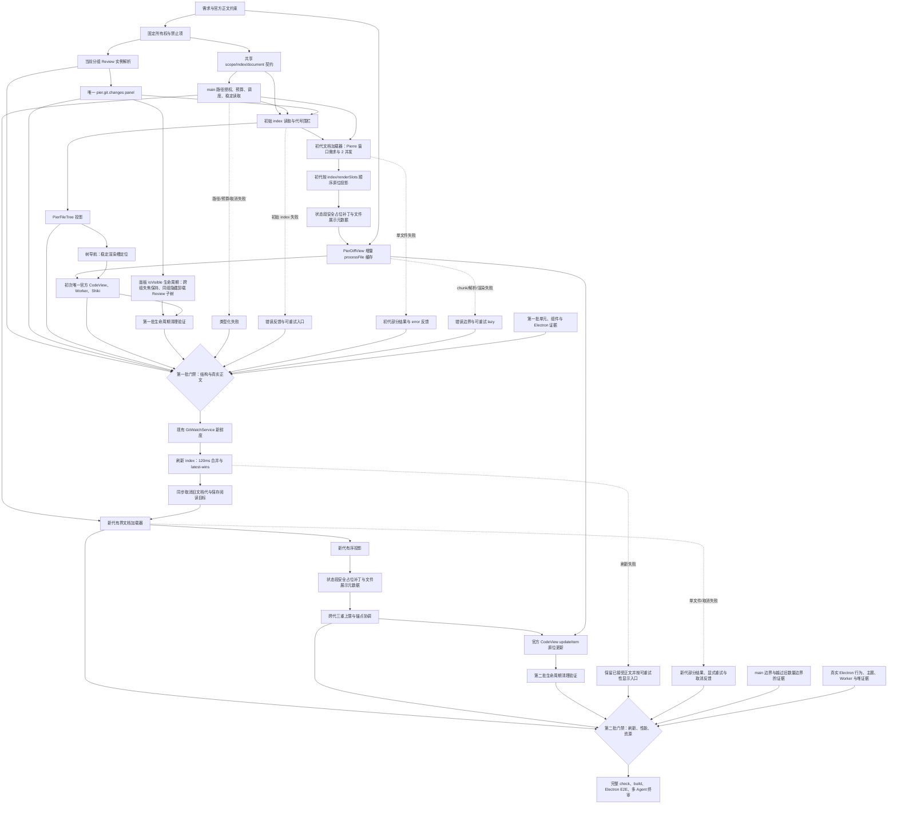

# Git 变更审阅能力设计

**日期**：2026-07-14
**修订日期**：2026-07-16
**状态**：按 Pierre 渲染窗口驱动的按需正文方案已完成，完整门禁与三路终审均已通过
**实施计划**：[2026-07-14-git-diff-review-polish.md](../plans/2026-07-14-git-diff-review-polish.md)
**规范性参考**：[DiffsHub `oven-sh/bun#30412`](https://diffshub.com/oven-sh/bun/pull/30412)、`@pierre/diffs@1.2.12`、Pier Files 插件、Loomdesk Review、本机 Cursor 3.2.16

## 1. 决策

Git 变更审阅采用一个稳定的多文件 Review 标签，不再使用“Changes 目录树标签 → 单文件 diff 标签”的两级标签结构。

```text
当前 dockview 分组
  └─ pier.git.changes:<groupId>:<contextId>
       ├─ 现有 PierFileTree：变更文件导航
       └─ 一个官方 CodeView：完整多文件 diff 正文
```

第一次从状态栏打开时，在点击发生时所属的当前分组新建 Review 标签；同一 `groupId + contextId` 再次打开时只激活原标签。点击目录树文件只定位同一 CodeView 中的文件，不创建 `pier.git.diff` 标签。

标签被用户拖到另一分组后，以 Dockview 报告的实际分组为准：在新分组再次打开会复用该标签；在原分组再次打开会创建同一 Review 资源的分组内实例，且不会复用冲突的实例 id。打开失败必须转为用户可见反馈，不能从点击事件同步抛出。

面板展示与全局焦点必须分离：`panel.api.isVisible` 是“该标签是否仍在其分组中展示”的唯一事实源，`panel.api.isActive` 只表示全局当前面板。用户点击另一 Dockview 分组时，Review 虽然失去全局活动状态，但只要仍是原分组的可见标签，树、正文和资源副作用都必须保留；只有同组切换标签、分组被隐藏或面板关闭时才暂停或释放资源。宿主不得再用布局级镜像状态间接控制 React 子树。

本修订废止旧文档中以下结论：

- `pier.git.changes` 只负责索引和目录树。
- `pier.git.diff` 负责单文件正文。
- 文件选择使用未固定 dockview 标签替换。
- `instance id = pier.git.diff:<groupId>:<entryKey>`。

已有 `getReviewFileDocument` 不再代表 UI 文档或标签身份，只是同一 Review 中有界加载一个文件资源的读取单元。

## 2. 目标和完成标准

### 2.1 用户闭环

1. 状态栏“查看变更”在当前分组打开 Review 新标签。
2. 同一分组、同一工作区重复打开时激活既有 Review，不产生重复标签。
3. Review 内复用 `PierFileTree` 展示变更目录；文件和文件夹交互与 Files 插件一致。
4. 一个 `CodeView` 按索引顺序持有全部轻量渲染槽；只有 Pierre 当前可见区和官方缓冲区对应的文件读取正文。
5. 点击文件或按 Enter 后，先通过稳定渲染槽滚动到该文件第一个 section；Pierre 把它纳入渲染窗口后读取正文并原位替换。
6. 同一路径同时存在 unstaged 和 staged 时，树中只有一个文件项，正文保留两个独立官方 item。
7. loading、empty、error、部分结果和特殊文件状态有明确反馈；文案全部走插件 i18n。
8. diff 正文严格遵循指定 DiffsHub 页面，不定义另一份正文 UI，不增加私有文件头、行、gutter 或 hunk 实现。

### 2.2 结构闭环

- `pier.git.changes` 是唯一 Git Review panel contribution。
- 生产 manifest 和运行时注册不再提供 `pier.git.diff`，真实运行态不再创建该 panel；布局迁移和 E2E 源码可以保留兼容清理或零数量断言。
- `PierFileTree` 是唯一目录树实现。
- `packages/ui/src/diff-view.tsx` 是唯一公开 Pierre 适配器入口；同目录内部模块按解析与元数据映射、
  Worker 生命周期、公开命令句柄、属性更新接受事务、折叠和渲染监督分责，业务层不得直接导入 Pierre。
- Git 插件 renderer 只协调资源，不解析 Git patch、不访问 Pierre 内部 DOM。
- main 继续拥有路径授权、Git 执行、索引解析、文档稳定性、预算、deadline 和取消。
- `GitWatchService` 是第二批唯一新鲜度信号源，不新增 watcher 或轮询器。
- `PanelResourceBoundary` 只直接订阅所属 Dockview panel 的 `onDidVisibilityChange`；跨分组失焦不隐藏。Git Review 显式声明 `unmountWhenHidden`，同组隐藏时卸载子树，避免 React `Activity` 保留 Pierre CodeView 实例却清理官方 Worker 单例造成生命周期分裂。
- 同组隐藏或关闭 Review 后不继续保留正文请求、CodeView 重对象或 Worker 使用方；重新展示时从当前 Git 状态重建，不生成第二套 Review 状态源。Review 树宽复用 Files 分栏的本地像素宽度偏好机制，并使用独立键 `pier.git.review.treeWidthPx`；文件折叠只属于当前 `PierDiffView` / `CodeView` 生命周期，重新打开时按当前投影重建，不持久化为产品偏好。

### 2.3 性能和健壮性闭环

- renderer 不得按 entry 总数同时创建等量 Promise、IPC 或 Git 子进程；2,001 文件用例必须仍保持初始零正文读取和固定并发。
- 文档加载完全由 Pierre 当前可见区与官方缓冲区驱动，不存在“前 N 个文件自动读取”或产品层文件数量门槛。窗口变化采用替换式需求，最多 2 个底层请求在飞；取消中的原 Promise 真正结算前继续占用并发槽。未进入窗口的 entry 只有轻量渲染槽，不创建正文 Promise、IPC 或 Git 子进程。已读取正文使用 32 MiB、200,000 行软缓存预算和最近最少使用回收；当前可见项与树选择目标受保护，可暂时超过软预算，离开窗口或解除选择后立即收敛。刷新双缓冲按全部暂留旧正文的实际合计占用预留额度，而不是按文件数量截断。
- `PierDiffView` 按 `id + cacheKey` 复用已解析 item，加载器发布稀疏的变化资源，代际协调器以常数时间记账并只投影新增或变化 section，再通过官方 `updateItem()` 提交；拓扑不变时禁止因单项结算扫描或重建全部 entry，避免渐进加载形成二次复杂度。item 删除时同步清理缓存；重试通过重建适配器实例获得全新解析缓存，不向公共属性泄漏恢复代号。单项 patch 解析失败必须保留该 item 的文件头和文件级错误，不能把整个 Pierre 运行态置为失败。
- `updateItem()` 返回 `false` 时表示 Pierre 尚未接受本次提交。适配器不得提前推进解析缓存或 item 身份，必须在动画帧内有界重试；Git Review 以 latest-map 保存每个 section 的最新投影，热路径只重放当前变化 id，拓扑提交、CodeView 重挂或语言切换才执行完整回放。换代、换 handle 和卸载必须取消迟到回放，连续三次未接受才显示一个全局可重试渲染错误。
- `PierDiffView` 的渲染监督按渲染代记录每个当前可见 `item id + version`；只有全部可见 item 都经官方 `onPostRender` 确认才完成该代，滚动暴露新的未确认 item 时必须重新监督，不能用任意单个 item 的回调代表整代成功。
- index 读取不设文件、记录或重命名候选数量上限；`git status` 显式使用 `status.renameLimit=0`，diff 路径显式使用 `-l0`。每个公开请求继续受统一截止时间、聚合输出字节、单记录字节和取消约束。文档读取继续受内容字节、行数和截止时间约束，这些安全界限都不决定文件是否出现在目录树和 CodeView 中。
- index 与 document 返回必须经过 revision 围栏；过期结果不能覆盖较新状态。
- main 在 index 中为每个文件给出按 `GIT_REVIEW_GROUP_ORDER` 排列的轻量 `renderSlots`。`CodeView` item 以 `sectionKey` 为稳定 id：正文未读取时使用零 hunk 的官方 `FileDiffMetadata` 占位，读取完成后使用 `CodeViewHandle.updateItem()` 原位替换同 id item。patch item 的 cacheKey 由 document revision 与 sectionKey 组成；state item 还纳入解析后的 locale、分段目标路径、旧路径、状态和本地化正文。
- 已加载 section 按 index entry 顺序和 `GIT_REVIEW_GROUP_ORDER` 排序，不能按网络返回顺序追加。
- 动态刷新失败时保留上一份可用正文并显示失败状态。
- index 刷新开始时不销毁上一接受代的文档加载器；只有新 index 成功接受或 Review 关闭时才取消并替换，确保失败后的旧树、正文和按需窗口仍可使用。
- 普通内容更新保存顶部可见 item 锚点，并在官方 `updateItem()` 后通过 `scrollTo()` 恢复；显式文件导航期间由导航事务独占视口，增量更新不得把旧锚点恢复到导航目标之前。结构更新继续保存顶部可见 item 锚点，重建后通过官方 `scrollTo()` 恢复。
- 树选择是绑定当前 `source + generation + document revision` 的导航事务；跨 source 不继承。刷新期间即使旧正文保留了相同 `sectionKey`，也必须等当前 loader 接受新 document，且当前 `cacheKey + version` 真正进入 CodeView 视口后才能确认成功。显式导航期间窗口需求只保留选择目标，取消周边正文造成的动态高度竞争；目标确认后恢复 Pierre 的完整可见/缓冲需求。同代成功后只比较目标及其前缀的 `id + cacheKey` 身份：前置 item 变化时恢复定位，后置 item 变化时不滚动；超时错误保持锁存，禁止被后续投影静默清除或自动重启。
- 10,000 行真实 Electron 夹具可滚动到末尾，无超过 100ms 的 renderer long task。
- 连续开关 Review 后，Worker、监听器、文件句柄、请求 lease 和调度许可回到基线；watcher 的 stat、repo-state、缓存标记和锚点文件系统探测跨刷新共享迟到许可，收到取消或达到截止时间后立即释放上层刷新，不得跨轮次叠加卡死调用。相同 key 的探测共享一个底层 Promise、调用方各自拥有 deadline/abort；跨 Git 根原始 stat 受进程级 32 项上限约束，调用方超时不能把仍未结算的底层操作误算为已释放。
- watcher 的 `status`、staged/unstaged `numstat` 或全局 stat 任一探测失败时，本轮快照必须标记为不可靠。首次基线只记录不广播；后续不可靠轮次保守广播，直到取得可靠快照后再恢复签名去重，禁止用固定失败哨兵把持续变化永久压掉。

## 3. 依据与取舍

### 3.1 Loomdesk

采纳：

- 稳定 `review:main` 标签，而不是每个文件一个标签。
- 一个 `ReviewDiffBody` 承载完整 `files[]`。
- `CodeView.initialItems` + `CodeView.updateItem` 和滚动锚点恢复的经验。
- 刷新期间保留旧正文、latest-wins 和结构变化后恢复阅读位置。

补齐：

- Loomdesk Review 没有本任务要求的现有目录树导航；Pier 在同一 Review 标签内复用 `PierFileTree`。
- Loomdesk 的完整 patch、评论、hydrate、范围工具栏和私有 Pierre 补丁不整体搬入 Pier。

拒绝：

- Svelte imperative class 直接控制作为 React 方案。
- Shadow DOM 查询、内部 class、`expandHunk` 等非公共 API。
- 评论、终端插入、commit/branch 范围和写动作的提前实现。

### 3.2 Cursor

采纳：

- 变更集合是一个多文件编辑器资源，不是文件标签集合。
- 资源具有稳定身份，集合变化可观察，模型可以按需加载并在移除时释放。
- 当前分组打开、重复激活、文件导航和下一文件定位的交互语义。

不照搬：

- Cursor 自有 diff 编辑器和 SCM resource group UI。
- Accept/Reject、Agent edit、comments 和其它 Pier 当前没有产品入口的动作。
- 点击普通 SCM 文件另开标准 diff 的辅助路径；它不能成为 Pier Review 主路径。

### 3.3 DiffsHub 与 Pierre

正文唯一规范是用户指定的 DiffsHub 页面。允许的边界只有：

- `@pierre/diffs/react` 的 `CodeView`。
- 官方 `WorkerPoolContextProvider`。
- `processFile` 或官方公开的 patch 处理 API。
- `CodeViewHandle.scrollTo({ type: "item" })`。
- DiffsHub 的 `renderHeaderPrefix` 文件折叠按钮与公开 `collapsed` item 状态。
- 指定页面使用的 options、Worker、Shiki 和 sticky header 规则。
- 将主题、代码字体和语义边框映射为 Pier 已有 token。

`enableGutterUtility` 只有在存在实际评论回调时才开启。本范围不实现评论，必须设为 `false`，避免显示无响应的“+”入口；这只关闭未接入的官方可选能力，不替换或改写正文渲染。

禁止：

- 使用 `FileDiff`、`PatchDiff`、`MultiFileDiff` 或自绘 diff 行替代正文。
- 访问 Pierre Shadow DOM、内部节点、私有 class 或内部模块。
- 自定义文件 header、行高、gutter、hunk、增删颜色和非 DiffsHub 的折叠交互。
- 为可能的未来能力暴露 `addItems`、`updateItemId`、选择、评论等无消费者句柄。
- 无法由指定页面或真实 Electron 缺陷证明必要的 Worker 代理、全局错误单例和 CSS 覆盖。

`PierDiffView` 第一批只公开实际被目录树消费的最小句柄：

```ts
interface PierDiffViewHandle {
  scrollToItem(id: string): boolean;
}
```

第二批实现结构刷新时，才允许增加读取可见锚点的窄接口。

### 3.4 平台官方约束

- Git 的 [`git diff -z`](https://git-scm.com/docs/git-diff#Documentation/git-diff.txt--z)、[raw diff 格式](https://git-scm.com/docs/diff-format.html) 与 [`git status --porcelain=v2 -z`](https://git-scm.com/docs/git-status) 共同确定机器路径边界：NUL 分隔时路径不做面向终端的引号转义，POSIX 下只有 `/` 是目录分隔符，反斜杠必须按文件名字节保留。
- Electron 的[上下文隔离](https://www.electronjs.org/docs/latest/tutorial/context-isolation)、[IPC 指南](https://www.electronjs.org/docs/latest/tutorial/ipc)和[安全清单](https://www.electronjs.org/docs/latest/tutorial/security)要求 preload 只暴露窄方法，main 校验输入和发送方生命周期；renderer 崩溃、导航和销毁都必须幂等释放订阅。
- React [`useRef`](https://react.dev/reference/react/useRef) 明确要求渲染期间避免读写影响行为的 ref；Review 只在提交后的布局副作用中发布 loader、section 与锚点快照，放弃的渲染不能泄漏为导航依据。
- Dockview 的[面板渲染与可见性说明](https://dockview.dev/docs/core/panels/rendering/)明确把 `isVisible` / `onDidVisibilityChange` 作为隐藏标签暂停工作的面板级事实源；全局活动面板变化不能替代该语义。
- Vite 的 [Web Worker 导入规则](https://vite.dev/guide/features.html#web-workers)要求 `new Worker(new URL(..., import.meta.url), options)` 可被静态分析；Pier 保留官方 Worker 入口，并显式使用 module Worker 适配 `file://` 构建产物。

## 4. 所有权

| 层 | 唯一负责 | 明确不负责 |
| --- | --- | --- |
| `shared/contracts/git-review` | scope、index、单文件资源、结果与取消的纯值定义 | Git argv、UI、Pierre 类型 |
| `git-exec` | spawn、raw bytes、deadline、abort、output limit、kill | Review 业务语义 |
| `services/git-review` | 身份、索引、patch、revision、预算、调度、取消 | panel 和组件 |
| `ipc/command`、`ipc/git-watch` | 主 frame 信任边界、解析前在飞配额、真实 Git 根规范化、main-owned 订阅租约与窗口生命周期 | Review 业务状态、patch 内容 |
| `GitWatchService` | 仓库新鲜度广播 | document 缓存和 UI 状态 |
| `context.panels` | 当前 group、稳定 Review instance、布局恢复 | 文件资源身份 |
| `PanelResourceBoundary` | 直接消费 panel `isVisible`；默认策略用 `Activity` 暂停 effect，Git Review 按显式 `unmountWhenHidden` 卸载；跨组失焦保持渲染 | 全局活动面板、Review 业务状态、布局镜像 |
| `GitChangesPanel` | Review 生命周期、树与正文协调、加载优先级 | Git patch 解析 |
| `PierFileTree` | 目录投影、展开、键盘、选择、定位 | 打开 diff 标签、Git 查询 |
| `PierDiffView` | 官方 CodeView、Worker、主题映射、通用文件展示元数据适配、最小滚动句柄 | Git 状态判定、自绘状态卡和第二设计系统 |
| 测试 | 需求到结构、行为、性能和资源证据 | 用快照代替语义断言 |

## 5. 入口到效果的控制流

```text
状态栏入口
  → 读取 PanelContext 与当前 groupId
  → openInstance({
      componentId: "pier.git.changes",
      instanceId: `pier.git.changes:${groupId}:${contextId}`,
      targetGroupId: groupId
    })
  → 按实际 group 查询同源实例
  → 已存在则激活；目标 id 被其它分组占用时生成无冲突 id；否则在当前分组创建
  → GitChangesPanel 解析 source
  → 并行预加载 Pierre 适配器与 getReviewIndex(operationId, source)
  → gitReviewTreeModel(entries)
  → index 的 renderSlots 投影为完整、稳定、零正文的 CodeView item 序列
  → CodeView.initialItems 建立官方虚拟列表
  → Pierre getRenderedItems 报告可见项和官方缓冲项
  → 替换式窗口需求以固定并发 2 读取 getReviewFileDocument
  → 正文经 PierDiffView/processFile 后用 updateItem 原位替换同 id item
```

### 5.1 文件导航

```text
PierFileTree onOpenPath(path)
  → entryByPath.get(path)
  → 记录跨刷新代保持的 selectedEntryKey，清除旧锚点
  → entryKey → renderSlots[0].sectionKey
  → 对完整轻量槽调用 scrollToItem(firstSectionId)
  → Pierre 将目标纳入可见区并报告窗口
  → 文档接受后同 id updateItem，不创建第二条导航路径
  → CodeView commit 后核对目标可见性
       → 新 index 接受时若 entry 仍存在则重新提升并再次定位
       → 同代投影增量提交时只在目标前缀身份变化后，按仍有效的树选择再次定位
       → 两个动画帧后核对目标 item 与真实滚动视口相交
       ├─ 可见：结束本轮核对，但保留树选择以协调后续投影
       ├─ 未可见：4 秒/120 次双帧上限内重发 scrollToItem
       ├─ error/unchanged：结束本代核对，保留旧正文、树选择与预算保护
       ├─ 已删除：清除跨代树选择与预算保护
       └─ 超时：锁存失败，显示详情和重试入口；后续投影不清错或自动重启

刷新期间首次显式点击仍有旧正文的文件
  → 定位当前已提交投影
  → 允许旧正文满足这次用户导航
  → 跨代自动恢复仍只接受本代新 revision，旧正文不冒充刷新成功

正文区域 wheel/touch/pointer/滚动键
  → 明确用户导航意图
  → 取消上述定位事务与跨刷新树选择

CodeView onPostRender / onScroll
  → 通过公开 getRenderedItems 取得 Pierre 当前虚拟窗口
  → 用真实容器矩形区分可见项与官方缓冲项
  → 替换当前正文需求，不猜测相邻文件
  → 不推断用户意图
```

### 5.2 文档加载

```text
index.entries
  → 按数组顺序建立资源状态 Map<entryKey, idle|loading|loaded|unchanged|error>
  → 没有 Pierre 窗口报告时读取数为 0
  → setWindowDemand(visible, buffered) 完整替换尚未开始的需求
  → 已进入窗口的当前树目标优先，其后按 visible → buffered 顺序，固定并发 2 读取正文
  → 目标正文未结算时即使占位高度变化导致窗口短暂漂移也保持该请求；选择变化后解除
  → 已离开窗口的排队请求立即丢弃，在飞请求立即取消；迟到结果由 operationId 围栏拒绝
  → 32 MiB / 200,000 行软缓存按最近最少使用回收，回收项恢复 idle
  → 可见项和树选择目标受保护，离开后立即重新执行软预算
  → 每个请求独立 operationId
  → unmount/source change 取消所有仍在飞 operationId
  → loaded documents 只替换对应稳定 renderSlots
```

不允许初始后台读取、`Promise.all(entries.map(...))`、固定前段或猜测相邻文件；这些做法都会绕过 Pierre 的真实虚拟窗口。界面不显示“还有 N 个文件将在选择时加载”之类提示，因为未读正文是正常的虚拟化实现细节，不是需要用户处理的状态。

### 5.3 面板可见性与资源生命周期

```text
Dockview panel onDidVisibilityChange
  → 读取同一 panel.api.isVisible
  ├─ true：Review 子树保持挂载，树、正文和 Worker 正常工作
  └─ false：`unmountWhenHidden` 卸载 Review 子树，释放 CodeView、Worker 与请求

另一分组获得全局焦点
  → 当前 Review panel.api.isActive = false
  → 当前 Review panel.api.isVisible 仍为 true
  → 不触发隐藏、不卸载、不清空 Pierre 正文

Git Review resourcePolicy = unmountWhenHidden
  → 仍只消费 panel.api.isVisible
  └─ false 时显式卸载子树，true 时按当前 Git 状态重新挂载
```

禁止把 `api.activePanel`、`panel.api.isActive` 或 workspace 级 Zustand 镜像作为展示条件；它们无法表达“多个分组同时各有一个可见标签”，并会把跨组失焦错误地解释为隐藏。

### 5.4 动态刷新

```text
GitWatchService event
  → 标记待刷新，但继续保留上一接受代的 index、树与 document loader
  → debounce/coalesce
  → refresh generation + 1
  → 重新读取 index
  → 新 index 成功接受后取消旧 document loader，并建立新的窗口需求加载器
  → 旧代已接受正文只在跨代共享的 32 MiB/200,000 行软预算内暂留
  → 新代复用最后一次 Pierre 窗口，按 visible → buffered 顺序读取
  → 捕获顶部 item 锚点；新代正文接受后原位协调并恢复锚点
  → generation 不匹配的旧结果丢弃
```

订阅入口在进入以上流程前固定经过：

```text
ipc event
  → senderFrame === sender.mainFrame
  → gitReviewRootPathSchema
  → 每窗口 16 / 全局 64 个未结算原始根准入
  → 同一窗口 + 原始根跨导航共享完整底层解析探测
  → 每个 renderer 文档建立独立可取消 waiter；同一文档 + 原始根最多 32 个同时等待者
  → realpath(request)
  → git rev-parse --path-format=absolute --show-toplevel（5 秒/64 KiB）
  → realpath(reportedRoot)
  → 每窗口根数、每根租约数、全局根数配额
  → GitWatchService.watch(canonicalRoot)
  → main 返回 { leaseId, gitRoot: canonicalRoot }
  → preload 按 canonicalRoot 过滤广播，并以租约就绪脉冲合并一次 index 新鲜度读取
  → STOP(leaseId) 直接释放；不再访问文件系统或 Git
```

任一准入失败都必须是零订阅副作用；窗口导航、renderer 退出和销毁必须取消当前文档 waiter 与已建立订阅，但不能为同一未结算底层探测重复占槽。调用方提前结束不能提前释放不可取消的底层文件系统操作所占全局槽位；只有真实 Promise 结算后才能再次准入新的原始根。租约就绪本身必须触发一次新鲜度读取，避免首轮 index 已完成、变化发生在 watcher 建立前而被基线吸收。

第一批不实现 watcher；第二批与真实订阅同批增加以上接口和测试，不能提前留空壳。

### 5.5 清理

```text
panel unmount / source change
  → 标记 generation 失效
  → cancelReviewRequest(all active operationIds)
  → 清空 document Map 和 pending navigation
  → 卸载 PierDiffView
  → 最后一个使用方释放 Worker provider
  → preload STOP(leaseId)
  → main 按已接受 canonicalRoot 减少引用并释放最后一个 watcher
```

### 5.6 完整实施 DAG



关键路径是 `R → A → B → C → G0 → I0 → K0 → KS0 → L → M0 → LC0 → Q1 → D → G1 → N → I1 → K1 → KS1 → S → M1 → LC1 → Q2 → Q3`。`X/Y0/Z0/W` 也是第一批门禁输入，`Y1/Z1` 是第二批门禁输入，因此失败分支不是悬空叶子。图中每个节点只出现一次且所有边向前，不以门禁回指既有实现节点。第一批未通过时不得接入刷新；第二批任一资源或失败分支未闭环时不得进入提交准备。`T1/T2/T3` 是门禁输入，不是实现完成后的装饰性记录。

## 6. 布局与组件边界

不为 diff 正文定义 UI 稿。宿主只定义语义结构：

- Review 根容器使用 `bg-background`。
- 导航与正文直接复用 Files 使用的 `FilePanelLayout`、`FilePanelHeader` 与 `PierFileTree`，Git 插件不复制 Resizable 组合。
- 左侧直接渲染 `PierFileTree`，不复制其搜索、键盘、滚动和 Shadow DOM 适配。
- 右侧唯一正文为 `PierDiffView`；文本补丁和特殊文件状态按原顺序进入同一官方 CodeView。main 为每个 state section 提供独立状态、旧路径和目标路径，renderer 不得用聚合树状态或最终路径替代。正文外只显示真正的失败和过期保留反馈；正常按需加载不显示数量、剩余文件或延迟加载提示。
- loading 使用 `Skeleton`，空态使用 `Empty`，错误和部分结果使用 `Alert`。
- 组件 `className` 只承担布局，不覆盖 shadcn 色彩、字体或 Pierre 正文视觉。
- 不新增 toolbar、Badge、范围选择器或业务动作按钮；错误恢复所需的 Retry 按钮除外，且只重试对应失败资源。

分栏宽度复用 Files 的已验证策略：像素宽度、`preserve-pixel-size`、最小宽度和最大 50%。
Review 使用独立本地偏好键 `pier.git.review.treeWidthPx` 恢复树宽；它是布局偏好，不进入设置页。
文件折叠不持久化，只由当前 `PierDiffView` / `CodeView` 生命周期持有。

## 7. 公共数据和身份

### 7.1 Review 标签身份

```text
review instance = [componentId, groupId, contextId]
componentId = "pier.git.changes"
```

文件路径、entryKey、sectionKey 和 revision 不进入 dockview instance id。

### 7.2 文件资源身份

```text
entry identity = GitReviewIndexEntry.entryKey
document source = [contextId, canonical gitRootPath, path, oldPaths]
item identity = GitReviewFileSection.sectionKey
patch item cacheKey = [document.revision, section.sectionKey]
state item cacheKey = [document.revision, section.sectionKey, locale, targetPath, oldPath, status, localizedText]
```

`entryKey` 负责树与 document resource 对齐，`sectionKey` 负责 CodeView 内定位。renderer 不从字符串格式反解析业务字段。

公共 index 不暴露 `additions` / `deletions`。`numstat` 只在 main 内形成有界摘要并参与 index revision，保证 patch 内容变化可以刷新；目录树不显示行数 Badge，也不为当前 UI 未消费的数据扩展公共契约。

### 7.3 路径和稳定性

- Git machine-readable 路径只把 `/` 视为分隔符；POSIX 文件名中的 `\` 是普通字节。
- 普通受限路径由 main 构造 `:(top,glob)<escaped>*` 与 `:(top,exclude,glob)<escaped>?*`，精确包含目标并排除其后代。index 遇到路径前缀冲突时按路径拆分读取，并另用 literal `--diff-filter=R/C` 探测 rename/copy；document 的冲突分支也先用 `:(top,literal)` 与 `R/C` 过滤，再只把选中的 raw record 交给 envelope 解析器。所有机器元数据继续使用 NUL 分隔，不能把用户路径当作自由通配表达式。
- rename/copy 的 old path 只来自 main 本轮解析事实。
- document 在读取前后验证 index revision；不稳定时重试或返回 `staleRevision`。
- 文件系统读取接收同一个 AbortSignal 与 deadline，取消后不得继续占有调度许可。

## 8. 明确禁止的反模式

- Changes 标签只放树，文件点击再开 diff 标签。
- 每个文件注册一个 panel 或 dockview instance。
- 用 `Promise.all` 无界读取全部文件文档。
- renderer 执行 Git、解析 patch 或构造可信 revision。
- 新建第二套目录树、文件图标、代码主题或 Worker 工作池。
- 业务代码直接 import `@pierre/diffs`。
- 访问 Pierre Shadow DOM 或内部对象完成滚动。
- 让子 frame 调用 command/watch IPC，或在主 frame 校验前解析请求、注册 client、访问文件系统。
- 把 renderer 提供的任意绝对目录直接交给 watcher，或允许窗口/根/引用数量无上限增长。
- 让 START 在配额前无界派生 Git 子进程，或让 STOP 重新解析可能已删除、移动、改指的路径。
- 把页面代际当作底层根探测的配额身份，使连续导航能够为同一未结算原始根重复占槽；或让新文档复用旧文档已取消的 waiter。
- 用原始别名过滤 canonical 广播，或以 `trim()` / LF 拆分解析合法含空白、CR、LF 的 Git 路径。
- 在 React render 期间发布 loader、section、锚点或导航 ref，导致被放弃的 render 成为后续命令依据。
- 因不可见 item 追加而重建 `CodeViewOptions`，或在 Pierre 更新虚拟窗口前同步判定可见 item 已渲染。
- 把程序化滚动当成用户滚动，提前清除跨刷新代仍有效的树导航意图。
- 为尚未存在的提交范围、评论、写动作、全文补全和缓存预留生产 API。
- 用 `console.error` 作为用户可见失败反馈。
- 用测试通过替代真实 Electron 中的 Worker、滚动和资源释放验证。

## 9. 分批策略

### 第一批：单一 Review 标签闭环

- 重写文档和测试期望。
- 删除 `pier.git.diff` contribution、注册和打开逻辑。
- `GitChangesPanel` 同时拥有树和多文件正文协调状态。
- 增加 Pierre 渲染窗口驱动的替换式文件加载器。
- 全量轻量槽只建立 CodeView 身份，不表示正文已读；正文由 seed + Pierre 可见/缓冲 + 导航 demand 驱动，最多 2 个请求在飞；正文缓存使用 32 MiB 与 200,000 行软预算，不设置文件数量门槛或剩余文件提示。
- `PierDiffView` 增加唯一的 `scrollToItem` 句柄，并删除无证据的正文扩展。
- E2E 验证当前分组、单一标签、树定位、staged/unstaged 两 section、Worker 和主题。

该批可独立验收：不需要 watcher，手动重新打开可以读取最新 snapshot。

### 第二批：动态刷新与性能闭环

- 接入现有 `GitWatchService`。
- latest-wins、同序资源更新、结构协调和滚动锚点恢复。
- 加入大变更基准；若单文件请求单元无法满足门槛，则以基准证据把 main 读取收敛为有界批量/聚合 API，并删除被替代的公共调用，不并存两条生产路径。
- 验证取消传播、调度许可、Worker、监听器、heap 和 long task。

该批可独立验收：在不重新打开标签的情况下反映外部 Git 变化，并通过资源与性能门。

提交、分支比较、stage/unstage/discard、评论和 Agent edit 不属于这两批。

## 10. 需求到证据的验收矩阵

| 需求 | 结构证据 | 自动化证据 | 真实应用证据 |
| --- | --- | --- | --- |
| 当前分组新标签 | 实际 `groupId` 查询 + 分组内稳定 instance id | `git-status-item-config.test.tsx` 覆盖新建、复用、拖动后重开与失败反馈 | E2E 拖动 Review 到第二组后验证目标组复用、原组新建且实例不冲突 |
| 跨分组可见性 | `PanelResourceBoundary` 直接订阅 panel `isVisible`，不消费全局 `isActive`，无 workspace 镜像状态 | 组件测试覆盖插件与 core、跨组失焦、初始隐藏恢复、effect 暂停/恢复、状态保留、订阅释放和显式卸载策略 | E2E 点击另一分组终端后断言 Review 树、Pierre 根和真实 diff 正文仍在视口 |
| 单一 Review 标签 | manifest 只有 `pier.git.changes` | 断言无 `pier.git.diff` | 连续选择文件标签数不变 |
| 复用 Files 树 | 直接 import `PierFileTree` | 键盘、展开、collision 测试 | POSIX 特殊路径真实树执行折叠、`ArrowRight` 展开和 `Enter` 正文定位 |
| 多文件正文 | 一个 `PierDiffView items[]` | 顺序、双 section、增量解析缓存测试 | 35 文件首段与 2,001 文件导航测试 |
| Pierre 接受事务 | `updateItems(): boolean` + 接受后提交缓存 + latest-map 回放 | `updateItem(false)` 下一帧接受、三次失败反馈、2,001 项稀疏更新与单项折叠不重建拓扑；拓扑新增 section 不向旧 handle 提交未知 id | 已加载正文经历 Pierre 运行时失败与重挂后从最新投影恢复，且不重新读取 document |
| 特殊文件统一正文 | main 按 section 保留状态/旧路径/目标路径；renderer 用固定安全占位补丁承载本地化状态；`@pier/ui` 只映射 Pierre 公开文件元数据 | 双 section 不同状态、二进制 `a→b→c` 链、added/deleted/renamed/modified/conflicted、语言切换、旧路径和特殊路径测试；反馈测试锁定状态文件不计为失败 | 从现有树定位带 POSIX 反斜杠的第 7 个二进制文件，文件头与状态位于同一 `diffs-container` 且进入真实滚动视口；light DOM 无独立状态卡 |
| 文件导航 | `PierDiffViewHandle.scrollToItem` + 提交后持续树选择 | 已加载、未加载、目标先完成后前置正文迟到插入、后置正文不重滚、超时错误锁存测试 | 点击树后文件头进入视口；第 7 个二进制目标在渐进加载后仍与真实滚动容器相交 |
| 官方正文 | 唯一公开适配器入口与受限内部模块 | 治理测试锁定导入者、选项和禁止项 | 与指定 DiffsHub 页面对照 |
| 主题和高亮 | appearance 映射 | 深浅主题和语言测试 | 真实 Worker/Shiki 检查 |
| 按需加载 | 完整轻量槽（拓扑）+ seed/可见/缓冲/导航 demand（正文）+ 2 并发 + 32 MiB/200,000 行软缓存 + 可见/选择保护；产品链路无文件数量上限 | 2,001 entry 拓扑一次建立、正文仅 demand 触发（seed 合法首批）、窗口精确映射、队列替换、缓存命中、合计跨代预留和离窗回收测试 | 35→2,001 真实仓库交互与 long-task 检查；界面无数量、剩余文件或延迟加载提示 |
| 路径健壮性 | main path guard/pathspec + 平台感知 watch 路径 | copy、rename、反斜杠及 watcher 过滤测试 | leading/nested 反斜杠与 `dir\\..\\file` 的真实 Git 树和正文夹具 |
| 取消闭环 | operationId + AbortSignal + watcher 有界文件系统探测协调器 | 慢文件读取、permit、lease、临时目录、忽略 signal 的签名替身、相同 key 共享且独立取消、跨 Git 根原始 stat 上限、跨轮迟到 stat 与 watcher dispose 测试 | 20 次激活/隐藏后 Worker 差值归零且 renderer 堆回到门槛内；main 资源由前述分层测试证明 |
| IPC 与订阅安全 | 主 frame 守卫 + 解析前 16/64 在飞准入 + canonical 租约 + 16/32/64 已建立配额 | 子/空 frame 零副作用、相同原始根完整解析共享、全局在飞上限、别名事件、路径删除后 STOP、重复释放及生命周期测试 | 真实 Review 只订阅当前工作区 Git 根 |
| 动态刷新 | GitWatchService 唯一来源 + 有界可见性定位事务 | latest-wins、锚点、首轮不可见后重发、超时反馈、树选择跨代/同代渐进投影重定位、刷新失败后首次点击旧正文投影、明确用户意图解除；不可靠 watcher 快照持续广播并在可靠恢复后重新去重 | Python 文件外部修改后同一标签原位更新；高风险树导航连续 3 次进入真实可视窗口 |
| 故障与无障碍反馈 | 宿主 dialog、统一滚动反馈区和本地化失败映射 | 打开/读取/刷新/渲染异常详情、失败反馈总上限、所选文件即使是第 7 个失败也提升展示、加载状态名称、每个可见 item 的 Worker/inline 双层恢复测试 | 损坏 Git index 后显示刷新失败与技术详情、保留旧正文，恢复后窗口正文仍可打开；渲染失败可重试 |
| 无冗余 | 删除无消费者 panel/API | depcruise、治理和检索测试 | `pnpm check`、`pnpm build` |

## 11. 反例检查

反例一：Cursor 点击普通 SCM 文件可以打开单文件 diff，因此单文件标签不是通用错误。结论不变：本任务的主入口是“查看变更”，Cursor 的资源组多文件编辑器、Cursor Agent Review 和 Loomdesk Review 都把变更集合当成一个审阅资源；辅助单文件路径不应替代主结构。

反例二：Loomdesk Review 没有目录树，当前 Pier 的 Changes 树似乎是在补齐它。结论不变：目录树方向正确，但把树放进独立标签并让点击创建第二个标签破坏了同一审阅资源；正确补齐方式是树与多文件正文协调。

反例三：一次请求完整 patch 最接近 Loomdesk。当前不直接采纳：Pier 已完成单文件路径、预算、取消和稳定性安全审查，先把它作为真实的资源加载单元能最小纠正产品结构；只有性能证据不达标时，第二批才用有界批量/聚合读取替代，并同步删除旧公共路径。
