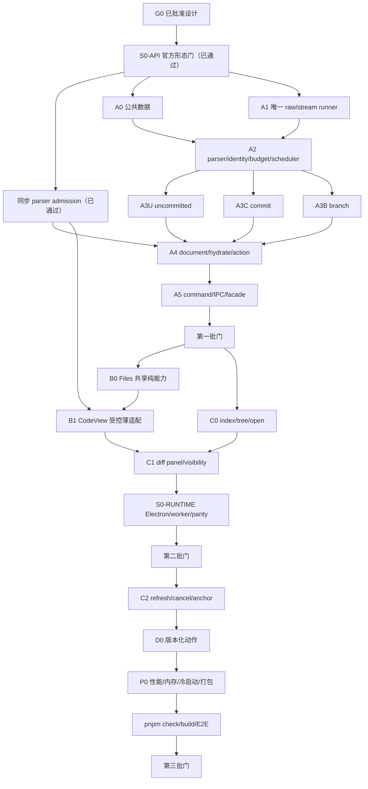

# Git 差异审阅能力完善设计

**日期**：2026-07-14

**状态**：已批准并开始实施；上游研究与 T2–T4 已完成，当前进入 T5

**实施计划**：[2026-07-14-git-diff-review-polish.md](../plans/2026-07-14-git-diff-review-polish.md)
**规范性参考**：[DiffsHub `oven-sh/bun#30412`](https://diffshub.com/oven-sh/bun/pull/30412)、`@pierre/diffs@1.2.12`、Pier Files 插件和 `packages/ui`

## 1. 结论

采用“Git Changes 浏览器 panel + 当前分组文件级 diff 文档 panel”：

```text
pier.git.changes
  └─ 现有 PierFileTree
       └─ 单击/Enter/右键预览，双击/右键固定
            └─ 当前 dockview group 的 pier.git.diff 多实例标签
                 ├─ Pier DocumentPanelChrome
                 ├─ 类型化状态提示（仅在需要时）
                 └─ 官方 CodeView 审阅面
```

终态必须同时满足：

1. 目录树、标签布局、主题、语言和 shadcn 组合复用现有所有者，不建立平行实现。
2. Git 查询、路径防护、内容分类、版本围栏、资源预算和写动作安全全部在 main。
3. diff 正文只由 `@pierre/diffs/react` 的 `CodeView` 渲染，不用 `FileDiff`、`PatchDiff`、`MultiFileDiff` 或自绘行替代。
4. `CodeView` 固定使用受控 `items` 模式；刷新只发布不可变 items，由官方 `id + version` reconcile，不调用受控模式禁止的 `updateItem/addItems/updateItemId`。
5. 默认采用 patch-first：文档不同时传完整 old/new 与 patch。用户从 Pier 外壳明确选择“加载完整上下文”且预算允许时，才按 section 补全全文。
6. 三个批次分别形成可独立验收的 main 数据闭环、只读标签闭环和动态/性能闭环。

## 2. 目标和完成标准

### 2.1 产品目标

- 点击 Git Changes 中的真实文件路径，在点击发生时所属的当前 group 打开新标签。
- 单击和键盘 Enter 打开未固定预览；双击固定；相同 source 在同组复用、跨组允许独立实例。
- 同一路径 staged + unstaged 只在树中出现一次，在同一 diff 标签中按未暂存 → 已暂存显示两个官方 `CodeView` item。
- 支持未提交、提交和分支三种查询；branch 固定为 merge-base → 请求开始时 HEAD。
- 加载、空、错误、特殊文件、刷新和动作反馈符合项目 shadcn、颜色、密度和 i18n 治理。

### 2.2 结构完成标准

- `git-review.ts` 是跨进程数据的唯一公共定义；不暴露第三方类型。
- `git-exec.ts` 仍是唯一 Git spawn/timeout/kill 底座。
- `GitReviewService` 是查询、调度、去重、版本、内容和审阅动作的唯一 main 所有者。
- `GitWatchService` 仍是唯一 Git 新鲜度信号源，不新增 watcher 或轮询器。
- 状态栏只消费不含文件数组的 `GitStatusSummary`；Files 文件树的变更染色从旧 `GitStatus.files` 迁到 uncommitted `GitReviewIndex`，ignored 仍由 Files 自有索引负责。`filesTruncated` 时保留前 2,000 项并明确显示装饰不完整，不能把其余文件暗示为 clean。迁移完成后删除无消费者的 full `getStatus` command/facade，完整变更列表只归 `GitReviewIndex`；watch 摘要失败不得触发 renderer 立即重复扫描。
- `PierFileTree` 是唯一目录树实现；`context.panels.openInstance` 是唯一标签打开入口。
- `packages/ui/diff-view` 是唯一 `@pierre/diffs` import 边界。
- Files/Git 共用文档外壳、语言推断和树打开意图；Git 不跨插件 import Files renderer。
- 隐藏 diff 标签不拉正文、不保留 CodeView 重对象；仅保留 source、revision、dirty、显示选项和滚动/选区锚点。
- 相同只读请求在 main 合并；全局、单仓库和单 source 并发有硬上限。

### 2.3 性能与健壮性完成标准

- index/document/hydrate 的 15 秒是完整公开请求总截止时间，不是每条子命令各 15 秒。
- Git review 读并发：全局 ≤4、单仓库 ≤2、单 source ≤1；相同 key 只执行一次。
- 单 document IPC 中所有字符串 UTF-8 字节合计 ≤16 MiB；patch 与全文不重复传输。
- Git 插件 renderer 的窗口级 `GitDiffDocumentBudget` 统计可见 diff 正文，估算驻留 ≤64 MiB；超出时最久未交互且非当前焦点的 panel 释放正文并进入可恢复暂停态。
- 100 个 watch 事件/2 秒，同 source 最多执行当前轮 + 一轮尾随；两个 group 的同 source 共享 main in-flight。
- 超大变更集的状态栏 IPC 和 renderer 常驻对象不随文件条目正文线性增长；summary 的 ref/失败详情有 UTF-8 硬上限和截断标志，success/failure 编码均不超过 16 KiB。gitRoot 不进入广播，使用固定长度 subscriptionId 路由。摘要失败保留“查看详情”和独立“重试 Git 状态”，查看详情不扫描，重试单飞并与 watch latest-wins。
- panel 关闭或 source 切换后 100ms 内发出取消；最后消费者取消后 Git 最迟在既有 1.5 秒 kill grace 后退出。
- 未打开 diff 前初始 renderer chunk 不包含 `@pierre/diffs`、diff worker 或额外 Shiki 语言资源。
- 10,000 行固定夹具初次可交互 p95 ≤2 秒，且不超过同进程裸官方 `CodeView` harness 的 1.20 倍。
- 快速滚动白屏不超过 2 帧或 100ms；无 >100ms renderer long task。
- 20 次开关并经 CDP GC 后，retained heap 增量 ≤10 MiB 或 ≤10%（取更宽者）；worker/observer/listener 在 2 秒内回到精确基线。
- 2,000 entry index p95 ≤3 秒且 service overhead ≤同轮底层 NUL Git 命令 1.25 倍；200 行 document p95 ≤500ms；`notModified` p95 ≤200ms。

测量口径固定：初次可交互从用户 activation 事件开始，到 CodeView 首 item 已提交、连续两个 `requestAnimationFrame` 有内容且一次公开 `scrollTo` 成功结束；快速滚动期间每帧通过测试标记统计可视窗口 rendered item 覆盖，连续缺口上限为 2 帧/100ms；long task 使用 `PerformanceObserver("longtask")`。资源仪器在打开首个 diff、触发动态 import 之前由 E2E 注入，因此覆盖全部 diff Worker/Observer/listener，同时不要求抢在宿主启动脚本前；结束恢复原构造器/原型。heap 基线在一次 warm open/close + CDP GC 后记录，再执行 20 次循环。

## 3. 非目标

- 不实现行级评论、评论持久化、自由画布、agent/task 变更归因或冲突编辑器。
- 不实现任意两个自由 ref 的比较；branch 只有 merge-base 语义。
- 不实现 untracked discard。
- 不把 DiffsHub 网站导航、品牌、URL 框、评论侧栏、Diff Stats 或 System Monitor 带入 Pier。
- 不为 diff 正文定义另一份 UI 稿；Pier 只定义外壳、状态和业务动作。
- 不把第三方组件类型带进 shared、main 或 Git 插件。
- 不在本次实现通用跨 IPC 取消框架；审阅请求使用域内 `operationId` 和 cancel 命令。

## 4. 当前结构不足

清理前的 `git-changes-panel.tsx` 同时拥有 status、tree selection、patch 请求和自绘 diff，导致：

- 无法使用 dockview 多标签和 Files 的预览/固定语义。
- `GitDiffPatch` 不能表达同路径双 group、内容来源、版本和特殊状态。
- untracked 不会出现在普通 `git diff`。
- renderer 逐行渲染没有官方虚拟化、worker、主题和语法高亮。
- Git Changes 打开即可能读取正文，树和文档成本无法分离。
- 现有写 API 只有 path，没有审阅 revision，确认期间外部写入可能让 discard/stage/unstage 操作用户未看过的新内容。

该旧 panel、打开命令、状态下拉入口和手写 renderer 现已原子删除，manifest 也不再声明对应 panel 或 `panel:*` 权限。当前基线不会展示静态死树；历史布局中的旧 panel 由布局清洗器移除。后续必须以新的 Changes 控制器、`pier.git.diff` 多实例 panel 和 `context.panels.openInstance` 一次性恢复完整入口，包括 manifest、权限、注册、本地化、命令与状态下拉。新的 Changes params 使用 `layoutVersion: 1`；宿主先从扁平 params 拆出并验证 `context/pluginComponentId/pinned`，Git 注册的同步纯函数 `restorePersistedParams(params: unknown)` 只接收其余插件私有 params。keep 后按“插件结果在前、已验证宿主字段最终覆盖”重建 params。宿主把注册策略快照显式传给布局清洗器并负责异常隔离和结构剪枝；旧无版本 params 被单 panel 剔除，合法 v1 params 保留，避免跳过中间清理版本升级时误恢复旧状态。

### 4.1 LoomDesk 证据取舍

| LoomDesk 证据 | Pier 采纳 | Pier 明确拒绝 |
| --- | --- | --- |
| `review/review-diff-ipc.ts` | main 取数、typed IPC、刷新分层经验 | renderer 持有宽泛 Git 能力或未预算正文 |
| `review/pierre-review-code-view.svelte` | 官方 CodeView、主题/字体、滚动恢复经验 | Svelte direct class、受控模式 imperative mutation、Shadow DOM `data-expand-*` 捕获和内部 `expandHunk` |
| `review/diff-worker-pool.ts` | 共享 worker、最后引用回收、错误观测 | 在官方 provider 外再造第二套 singleton/refcount |
| `review/review-diff-theme.ts` | 从宿主 appearance 映射主题/代码字体 | 除 DiffsHub sticky header 1px 分隔线外的大段 `unsafeCSS`、覆盖官方 gutter/hunk/行高和固定颜色 |
| `patches/@pierre%2Fdiffs@1.2.3.patch` | 作为历史问题清单进入 S0-API | 把 LoomDesk 私有补丁直接搬到已锁定的 `1.2.12` |

对应治理测试永久禁止 `updateItem/addItems/updateItemId`、Shadow DOM hydration、低层 diff 组件、自绘行、第二 worker pool 和 `unsafeCSS` 正文覆盖；唯一例外是直接复刻 DiffsHub sticky header 结构、只把颜色接到 Pier `--border` 的已审计常量。LoomDesk 是产品形态与踩坑证据；正文行为的最终规范仍是用户指定的 DiffsHub 页面和 `@pierre/diffs@1.2.12` 公共 API。

## 5. 规范性 `CodeView` 边界

### 5.1 唯一允许的正文实现

生产代码必须直接使用：

```ts
import { CodeView } from "@pierre/diffs/react";
```

只允许 `packages/ui/src/diff-view/*` import `@pierre/diffs`。禁止：

- 生产 JSX 使用 `FileDiff`、`PatchDiff`、`MultiFileDiff` 或 `UnresolvedFile`。
- 自行拆 patch、渲染行/gutter/hunk、访问 Shadow DOM 或依赖内部 class。
- 覆盖官方 header 高度、gutter 宽度、行高、hunk padding、增删颜色或虚拟化滚动。
- 用 `unsafeCSS` 改写正文；只允许已冻结的 DiffsHub sticky header 1px 分隔线结构。

允许的官方入口：

- `CodeView` 受控 `items`。
- `renderHeaderPrefix/renderHeaderMetadata` 注入 group/status 的业务元数据。
- `options` 驱动 split/unified、wrap、line numbers、backgrounds、indicators、collapse 和主题。
- Pier 公共 handle 只暴露 `scrollTo` 与 selection 能力；`getInstance/getItem` 和 mutation API 都留在 `packages/ui/diff-view` 内部适配器。不存在的 `scrollToLine` 不进入设计。
- `parseDiffFromFile` 和 `processFile` 把全文或单文件 patch 转成 `FileDiffMetadata`。

### 5.2 两级技术门

技术门分两级，但仍属于三个批次：

```text
S0-API T1A（第一批公共定义前，已通过）
  └─ 冻结精确版本、CodeView item 形态、受控模式限制、patch/full parser API、header slots

同步 parser admission T1B（文件文档与 renderer 适配前，已通过）
  └─ 精确字节/总行夹具、p95 <50ms、冻结或下调 admission

S0-RUNTIME（第二批 panel 接线后）
  └─ 自动验证 React/Electron build 的 file:// 路径、worker/Shiki/主题/虚拟化/规范性页面对照
```

T1A 不通过不得冻结公共 section；T1B 不通过不得验收文件文档预算、renderer parser 适配或第一批退出门。S0-RUNTIME 不通过不得通过第二批，不允许回退到旧 renderer。
Vite HTTP 开发态在第二批用 `pnpm dev` 人工冒烟验证；electron-builder 的 asar/可执行文件路径由第三批独立打包态冒烟验证把门。两者都不能被普通 build 证据替代。

CI 不实时访问外部 DiffsHub。依赖升级时人工核对规范性页面并更新验证日期、精确包版本、tarball integrity 和冻结选项；CI 只验证本地锁定版本、行为合约和验证记录一致。

## 6. 所有权

| 层 | 唯一负责 | 明确不负责 |
| --- | --- | --- |
| `git-review.ts` | query/source/index/document/action/result schema | Git argv、UI、第三方类型 |
| `git-exec.ts` | 单一 spawn、raw buffer、流消费、stdin、deadline、abort、limit、kill | 审阅语义 |
| `services/git-review/*` | query、解析、内容、调度、版本、预算、动作 CAS、观测 | panel 和通知 |
| `GitWatchService` | repo 新鲜度广播、debounce/poll | diff document 缓存 |
| `GitStatusSummary` | 状态栏 branch/counts/delta/repoState/stash/remoteSync 投影与失败态 | 文件列表、diff 正文 |
| Files Git decoration | 消费 uncommitted `GitReviewIndex` 映射文件树状态；自管 ignored | Git 查询实现、状态摘要 |
| `pier.git.changes` | query、index、树、打开 source | 正文 |
| `pier.git.diff` | 单文件文档、可见性、刷新、动作 | 全仓索引 |
| `context.panels` | group、preview/pinned、布局恢复 | Git source 语义 |
| `PierFileTree` | 目录、展开、键盘、selection、sticky、context-menu 事件 | Git 查询 |
| `packages/ui/document-panel` / `code-language` | Files/Git 可共同导入的外壳、breadcrumb 和路径语言推断 | 业务状态、插件运行时 |
| `diff-view` | 官方 CodeView 数据/主题/worker/生命周期翻译 | Git 和第二设计系统 |
| 测试 | 每层结构与行为证据 | 用快照替代语义测试 |

## 7. 公共数据定义

### 7.0 有界状态摘要

`GitStatusSummary` 复用现有 branch/counts/delta/repoState/stashCount/remoteSync 纯值，但不含
`files`。branch 与 upstream 各限制 UTF-8 1 KiB，失败详情限制 4 KiB；截断停在代码点
边界，并在 `truncatedFields` 标出字段。OID 只接受 40/64 位
hex，计数只接受安全非负整数。watch 快照使用判别联合：

```ts
type GitStatusSummarySnapshot =
  | { kind: "notRequested" }
  | { kind: "ok"; summary: GitStatusSummary }
  | { kind: "error"; message: string; truncated: boolean };

type GitChangeEvent = {
  changeKind: GitChangeKind;
  subscriptionId: string;
  summary: GitStatusSummarySnapshot;
};
```

gitRoot 是仓库身份，绝不截断后用于路由。preload 先生成固定长度 UUID subscriptionId 并
安装 listener，再以 `{gitRoot, subscriptionId}` START；main 保存 webContents 作用域的
token → canonical root 映射，广播与 STOP 只使用 token。这样超 4 KiB 多字节 root 和共享
长前缀的两个 root 都不会丢投或串投。终态事件没有 gitRoot、`status` 或 `files`。
success/failure 的合法 JSON UTF-8 编码都必须 ≤16 KiB；
2,000 与 50,000 文件输入的摘要大小差值 ≤256 bytes。`notRequested` 不允许 renderer
立即补发 full status，只等待下一 canonical 事件或用户显式 summary 重试。

### 7.1 查询和解析结果

```ts
type GitReviewQuery =
  | {
      kind: "uncommitted";
      groups: readonly ["unstaged" | "staged", ...Array<"unstaged" | "staged">];
    }
  | { kind: "commit"; oid: string }
  | { kind: "branch"; targetRef: string };

type GitReviewPanelQuery =
  | { kind: "uncommitted"; groups: readonly ["unstaged" | "staged", ...Array<"unstaged" | "staged">] }
  | { kind: "commit"; oid: string }
  | { kind: "branch"; targetRef: string };

type GitReviewResolvedQuery =
  | {
      kind: "uncommitted";
      groups: readonly ("unstaged" | "staged")[];
      headOid: string | null;
      indexToken: string;
    }
  | {
      kind: "commit";
      commitOid: string;
      baseOid: string | null;
      root: boolean;
    }
  | {
      kind: "branch";
      targetRef: string;
      targetOid: string;
      headOid: string;
      mergeBaseOid: string;
    };
```

规则：

- uncommitted groups 非空、去重、固定 `unstaged → staged`。
- commit 输入允许安全 revision，但 panel source 只保存解析后的完整 40/64 位 commit OID。
- branch 只接受 `git for-each-ref` 返回的 `refs/heads/*` 或 `refs/remotes/*` 完整 ref；拒绝 revision expression 和 `-` 前缀。
- SHA-256 仓库和 unborn HEAD 是正式测试场景；不硬编码 SHA-1 空树。

### 7.2 source 和身份

```ts
interface GitReviewScope {
  contextId: string;
  gitRootPath: string;
}

interface GitDiffPanelSource extends GitReviewScope {
  path: string;
  query: GitReviewPanelQuery;
}
```

```text
source identity = canonical-json([contextId, realGitRootPath, normalizedQuery, path])
instance id = pier.git.diff:<stable-source-hash>:<random-nonce>
```

source hash 只判断同文档；nonce 允许同 source 在不同 group 存在。`contextId` 由当前 panel context 提供，main 重新解析 `gitRootPath` 后要求派生 contextId 与之相等；标题、resolved HEAD/index token、preview/pinned 意图和显示设置都不进入 source。不得用数组下标、locale 或时间戳参与 source/section identity。

### 7.3 index

```ts
type GitReviewGroup = "unstaged" | "staged" | "conflict" | "commit" | "branch";
type GitReviewFileStatus = "added" | "modified" | "deleted" | "renamed" | "conflicted";

interface GitReviewIndexEntry {
  entryKey: string;
  path: string;
  oldPaths: readonly string[];
  groups: readonly GitReviewGroup[];
  groupStatuses: Readonly<Partial<Record<GitReviewGroup, GitReviewFileStatus>>>;
  status: GitReviewFileStatus;
  additions: number | null;
  deletions: number | null;
}

interface GitReviewIndexOk {
  kind: "ok";
  gitRootPath: string;
  query: GitReviewResolvedQuery;
  sourceQuery: GitReviewPanelQuery;
  revision: string;
  entries: readonly GitReviewIndexEntry[];
  warnings: readonly GitReviewWarning[];
  durationMs: number;
}
```

聚合状态优先级固定为：`conflicted > renamed > deleted > added > modified`；精确 group 状态仍保存在 `groupStatuses`。`conflict`、`commit`、`branch` 必须各自作为唯一 group；uncommitted 条目只能使用请求的 `unstaged/staged` 或独立 `conflict`。index revision 只由固定 OID、index token 和原始 NUL 元数据输出摘要构成，不读取全仓正文。

### 7.4 section：patch-first 且只有一份正文事实

```ts
interface GitReviewSectionBase {
  sectionKey: string;
  group: "unstaged" | "staged" | "commit" | "branch" | "conflict";
  path: string;
  oldPath: string | null;
  status: GitReviewFileStatus;
  additions: number | null;
  deletions: number | null;
  byteSize: number | null;
  lineCount: number | null;
  sourceRevision: string;
}

type GitReviewFileSection =
  | (GitReviewSectionBase & {
      kind: "patch";
      patch: string;
      contextLines: number;
      canHydrate: boolean;
    })
  | (GitReviewSectionBase & {
      kind: "texts";
      oldText: string;
      newText: string;
    })
  | (GitReviewSectionBase & {
      kind: "state";
      reason:
        | "binary"
        | "conflict"
        | "symlink"
        | "submodule"
        | "invalidEncoding"
        | "tooLarge"
        | "readError";
      message: string | null;
    });
```

- 普通 document 默认返回单文件有界 patch。
- 只有用户在 Pier 外壳明确选择“加载完整上下文”，且 old/new 总量在全文预算和 renderer admission 内时，才把整个 section hydrate 为 `texts`。
- `patch` 与 `texts` 互斥；复制 patch 走按需命令，不让 texts 再携带 patch。
- 目标 `CodeView` 没有 custom item；`state` 永远在 CodeView 外层显示，不伪造成文本 diff。
- conflict 属于 uncommitted 的独立 group，不受 unstaged/staged ToggleGroup 隐藏；它只显示类型化 Alert 和复制路径，不渲染误导性的二方/三方 diff，也不提供未呈现正文所需的暂存动作。
- mixed document 先显示紧凑状态列表，再让所有可渲染 section 进入同一个 `CodeView`；没有可渲染 section 时只显示状态页。

### 7.5 document、条件读取和错误

```ts
interface GitReviewFileDocumentRequest {
  operationId: string;
  source: GitDiffPanelSource;
  ifRevision: string | null;
  clientHasDocument: boolean;
}

interface GitReviewFileDocumentOk {
  kind: "ok";
  source: GitDiffPanelSource;
  resolvedQuery: GitReviewResolvedQuery;
  revision: string;
  sections: readonly GitReviewFileSection[];
  durationMs: number;
}

type GitReviewFileDocumentResult =
  | GitReviewFileDocumentOk
  | { kind: "notModified"; source: GitDiffPanelSource; revision: string }
  | { kind: "unchanged"; source: GitDiffPanelSource }
  | GitReviewFailure;

interface GitReviewHydrateRequest {
  operationId: string; // 每次 hydrate 新建，不能复用已 settled 的 document operationId
  source: GitDiffPanelSource;
  expectedDocumentRevision: string;
  sectionKeys: readonly string[];
}

type GitReviewHydrateResult =
  | { kind: "ok"; documentRevision: string; sections: readonly GitReviewFileSection[] }
  | GitReviewFailure;

interface GitReviewFailure {
  kind: "error";
  reason:
    | "notRepository"
    | "invalidSource"
    | "staleRevision"
    | "busy"
    | "duplicateOperation"
    | "aborted"
    | "timeout"
    | "outputLimit"
    | "commandFailed"
    | "readFailed"
    | "internal";
  retryable: boolean;
  message: string | null;
}
```

请求可携带 `ifRevision`；只有 `clientHasDocument=true` 且未变化才返回轻量 `notModified`。隐藏、被预算暂停或崩溃恢复的 panel 只有 revision 而没有正文，必须传 `clientHasDocument=false`，此时即使 revision 未变也返回完整 document。UI 文案由 i18n 根据 reason 生成，main message 仅作为技术详情。

hydrate 是新的公开请求：自建 operation lease、从 command 到达起算的 15 秒 `GitReviewBudget` 和调度 key，可独立 cancel/dedupe；`expectedDocumentRevision` 只作内容围栏，不复用已 settled document operation 或其预算。结束后与其他 operation 一样立即移出 active registry。

### 7.6 warning 和 commit 搜索

```ts
type GitReviewWarning =
  | { code: "filesTruncated"; limit: number; omitted: number | null }
  | { code: "invalidPathEncoding"; skipped: number }
  | { code: "renameDetectionLimited"; limit: number }
  | { code: "entryStatsUnavailable"; count: number };

interface GitReviewCommitOption {
  oid: string;
  shortOid: string;
  subject: string;
  authorName: string;
  authoredAt: string;
}
```

commit 搜索：query 最长 256 字符，limit 默认 50、最大 50；空查询返回当前可达历史最近提交，非空使用固定字符串、不区分大小写的 subject 搜索。粘贴 OID 在 Enter 时直接解析，不依赖建议命中。没有分页，旧搜索使用 operationId 取消。

### 7.7 审阅动作和复制 patch

```ts
interface GitReviewActionRequest {
  operationId: string;
  source: GitDiffPanelSource;
  expectedDocumentRevision: string;
  sectionKey: string;
  expectedSectionRevision: string;
  reviewedPatch: string;
  action: "stage" | "unstage" | "discard";
}

type GitReviewActionResult =
  | { kind: "ok" }
  | { kind: "stale" }
  | {
      kind: "actionError";
      reason:
        | "unsupported"
        | "patchDoesNotApply"
        | "permissionDenied"
        | "indexLocked"
        | "conflict"
        | "internal";
      retryable: boolean;
      message: string | null;
    };
```

动作请求中的 `reviewedPatch` 是 document 已显示 patch 的一次性回传，最多 8 MiB；`sourceRevision` 必须覆盖 patch 摘要、base token 和路径。`expectedDocumentRevision` 只证明 patch 来自用户看到的文档，不等价于要求当前整文件 hash 完全未变。main 在 source 互斥锁内重算 patch 摘要、校验 section/source/revision、限制单文件路径，并先执行 apply check；renderer 传入内容不能绕过这些校验。动作不得退化为只按 path 的 `git add/restore`：

- stage：把已审阅 unstaged patch 用 `git apply --cached` 应用到 index，只暂存用户看过的变化。
- unstage：把已审阅 staged patch用 `git apply --cached --reverse` 从 index 移除。
- discard：确认后把已审阅 patch 用 `git apply --reverse` 从 worktree 移除；不相交的新修改保留，重叠失败返回 stale。
- untracked 无 discard。
- 所有 patch 在 main 生成并校验只包含 source path/oldPath；`git-exec` 通过受限 stdin 传入，不落临时文件。
- conflict 只显示类型化状态和复制路径；本功能不把未呈现为正文的 worktree bytes 称为“已审阅内容”，也不提供冲突暂存动作。解决并暂存冲突留给已有 Git 工作流或后续冲突编辑器。

动作最小围栏固定为：stage 校验审阅时 index/base token 与 patch/path，随后 `git apply --cached --check`；unstage 校验 HEAD/base 与目标 staged patch，随后 cached reverse check；discard 不要求整文件 hash 相等，只对当前 worktree 执行 reviewed reverse patch check。实际 apply 自身再次检查并持有 Git/index 所需锁；非重叠新变化保留，重叠才 stale。只有 `kind="patch"` 的 section 开放 patch 动作，所有 state section 默认只读。

复制 patch 走 `git.getReviewPatch`，携带 source、expected revision 和可选 sectionKeys；默认按 document section 顺序复制完整文档，有两个 section 时菜单同时提供“复制全部/未暂存/已暂存”。revision 不一致返回 stale。

失败反馈映射固定如下：`aborted`/superseded 静默终止旧请求；`busy` 提供重试；`staleRevision`/动作 `stale` 保留旧正文、提示刷新且绝不自动重试写动作；`unsupported` 隐藏或禁用入口；`patchDoesNotApply`/`conflict` 给短失败；包含技术 message 的 `commandFailed`、`readFailed`、`permissionDenied`、`indexLocked`、`internal` 走插件 `context.dialogs.alert`。状态摘要失败在状态下拉保留“查看详情”，push/pull/sync 的技术错误同样走详情弹窗，不把 stderr 放进 toast。不得从英文 stderr 推断业务分支。

## 8. 主进程查询和数据流

### 8.1 统一执行底座

`git-exec.ts` 扩展而不复制：

```ts
type GitExecRawResult =
  | { kind: "collected"; stdout: Buffer; stderrTail: Buffer; stdoutBytes: number; stderrBytes: number }
  | { kind: "truncated"; completeRecords: number; stderrTail: Buffer; stdoutBytes: number; stderrBytes: number };

createExecGitRaw({ spawn }): (
  args: readonly string[],
  options: GitExecOptions & {
    mode: "collect" | "stream";
    signal?: AbortSignal;
    stdin?: Buffer;
    onRecord?: (record: Buffer) => "continue" | "stop";
  }
) => Promise<GitExecRawResult>
```

- `createExecGit` 包装同一 raw core 并保持现有 `(args, options)` 文本签名。
- collect 模式累计 stdout chunk，结束只 `Buffer.concat` 一次；stream 模式不累计 stdout，只保留最多 1 MiB 的未完成 NUL record，并逐条调用 `onRecord`。
- stream 主动 stop 返回 `truncated + completeRecords`，只丢弃最后不完整 record；单条 record 超过 1 MiB、字节超限、超时或进程错误整次返回 typed failure，不发布半条记录。
- `GitExecError` 保持现有字符串兼容字段，但 stdout/stderr 诊断各只保留最后 64 KiB，同时记录总字节数；不得同时持有几十 MiB raw Buffer 和解码字符串。
- stdin 最多 8 MiB；runner 处理 backpressure、EPIPE、abort-before-spawn，abort 时关闭 stdin 并进入统一 kill 路径。
- abort、timeout、output limit 共用现有 SIGTERM → 1.5 秒 → SIGKILL 路径。

### 8.2 索引协议

所有 review 路径命令在 Git 全局参数位置加 `--literal-pathspecs`；`--` 仍保留用于停止 option 解析。

未提交主事实（显式覆盖用户的 rename/copy 配置）：

```bash
git -c status.renames=copies -c status.renameLimit=2000 --literal-pathspecs status --porcelain=v2 -z --ignore-submodules=none --untracked-files=all
git --literal-pathspecs diff --no-ext-diff --no-textconv --no-color --ignore-submodules=none --find-renames=50% --find-copies=50% -l2000 --numstat -z --
git --literal-pathspecs diff --no-ext-diff --no-textconv --no-color --ignore-submodules=none --find-renames=50% --find-copies=50% -l2000 --cached --numstat -z --
```

commit/branch 固定 OID 范围：

```bash
git --literal-pathspecs diff --no-ext-diff --no-textconv --no-color --ignore-submodules=none --find-renames=50% --find-copies=50% -l2000 --no-abbrev --raw -z <base> <target> --
git --literal-pathspecs diff --no-ext-diff --no-textconv --no-color --ignore-submodules=none --find-renames=50% --find-copies=50% -l2000 --numstat -z <base> <target> --
```

- index 命令数为常数，不按文件执行 N+1 Git 调用。
- status、raw 和 numstat 都显式使用 `--ignore-submodules=none`，不得让仓库级 `diff.ignoreSubmodules` 或 `submodule.<name>.ignore` 把规范索引静默变成无变化；gitlink/submodule 条目只报告状态，不伪造行统计。
- 同一请求的主事实与按需 numstat 依次执行并共用一个截止时间、输出和文件预算。未提交查询最多 3 条索引命令，固定范围最多 2 条；这里用有界串行换取可预测的进程峰值和明确的取消顺序，不并发启动多个 Git diff。
- 2,000 是最终逻辑文件上限，不是 porcelain 事实数或物理 NUL record 上限。一个 staged/unstaged rename 链最多对应两个事实；uncommitted primary 最多保留 4,000 个事实，完整读到第 4,001 个事实即可证明超过 2,000 个最终文件。porcelain rename/copy 的 transport 门因此为 `2 × (2 × 2000 + 1) = 8002` records；raw/numstat 仍在完整第 2,001 个 tuple 后停止，最坏为 `3 × (2000 + 1) = 6003` records。两者都低于通用 8,192 硬门。恰好 2,000 个最终文件无 warning，存在第 2,001 个最终文件时只发布前 2,000 个完整 entries 并返回 `filesTruncated`。
- Git 路径逐 NUL record fatal UTF-8 解码；非法路径字节跳过并返回 `invalidPathEncoding`，禁止替换字符后继续定位或写操作。
- `C` 在已批准的状态枚举下明确归一为 rename-like：新路径作为 entry 身份，copy source 保存在 `oldPaths`，不得由此推断 source 被删除。
- 未提交索引内部为每个 group 保留独立 target path。`a→b` staged、`b→c` unstaged 的一对一 rename 链合并为最终路径 `c` 的双 group 条目，staged 统计仍按 `b`、unstaged 统计按 `c` 关联；unstaged copy 不做链合并，因为 source 仍存在。存在多目标或其他 group 冲突时保持独立条目，不猜测归属。
- `-l2000` 是性能硬门；Git 只会通过 C locale 的成功 stderr advisory 报告实际触发。非截断请求必须窄匹配 `exhaustive/inexact rename detection was skipped`并返回 `renameDetectionLimited`；已有 `filesTruncated` 的请求不为获取 advisory 而继续 drain 或重跑昂贵 diff。

### 8.3 范围到内容源

`GitReviewIndexReader.resolve()` 是 main-only 的索引解析接口，返回同一对象中的公共 index result 与只读 `resolvedEntries`。每个 resolved entry 保留 `group → {oldPath,targetPath,status,...}`，其生命周期与公共 `revision` 绑定；renderer 不接收这份内部事实。T4 文档服务必须消费本次 resolve 结果，禁止从公共 `oldPaths` 数组顺序猜范围路径。链式 `a→b` staged、`b→c` unstaged 的 source.path 是 `c`，但 staged section 使用 `a→b`，unstaged section 使用 `b→c`；索引 revision 变化时按 T4/T5 围栏返回 stale，不把旧范围路径嫁接到新 patch。

下表定义逻辑来源，不要求普通 patch-first 文档预读两份 blob。tracked patch 直接用固定 OID/index/worktree 范围和单文件路径限定的 `git diff --no-ext-diff --no-textconv --no-color --binary -- <path>` 生成；只有 hydrate、内容分类无法从 patch 判定或完整文本模式才按 OID/fd 读取 blob，并分别扣除 blob 预算。

| section | old | new | path 规则 |
| --- | --- | --- | --- |
| unstaged | index blob OID | worktree fd snapshot | rename 使用 index path → worktree path |
| staged | fixed HEAD tree blob；unborn 为缺失 | index blob OID | old/new path 来自 raw status |
| commit | first-parent tree blob；root 为缺失 | commit tree blob | 固定 commit OID |
| branch | merge-base tree blob | 请求开始时 fixed HEAD tree blob | target 只用于算 merge-base |
| untracked | 缺失 | worktree fd snapshot | added |

需要全文时，Git object 先由 `ls-tree/ls-files -s` 得 blob OID，再 `git cat-file blob <oid>`；不拼 `<ref>:<path>`。空树语义使用 Git 原生命令/root diff，不硬编码 SHA-1 OID。

untracked 用已通过同一 fd 快照读取的 bytes，在 main 受控临时目录同时设置 `GIT_INDEX_FILE` 与 `GIT_OBJECT_DIRECTORY`，真实 common object directory 只通过 `GIT_ALTERNATE_OBJECT_DIRECTORIES` 只读引用；随后执行 `hash-object -w --stdin`，按 `fstat` mode（100644/100755）与 literal path 写入临时 index，再生成 `/dev/null → path` 单文件新增 patch。成功、取消和失败都清理临时 index/ODB；真实 index、真实 object count 和 worktree 不变。这样 Git 负责文本/二进制 patch 格式，且不会为生成 patch 再按可变路径读取文件。

### 8.4 路径和快照一致性

- `gitRoot` 先 realpath/case-normalize；source root 必须等于恢复 `PanelContext` 允许的真实根。
- 使用 `path.relative` 判断边界，不用字符串前缀。
- 从 root 到 parent 逐段 `lstat + realpath` 拒绝 symlink，并记录每一级目录身份；macOS 最终文件以 `O_NOFOLLOW_ANY | O_NONBLOCK` 打开，其它平台以 `O_NOFOLLOW | O_NONBLOCK` 打开，随后 `fstat`，只允许 regular file。FIFO/socket/device/目录返回类型化状态，不能阻塞线程池；同一 fd 完成读取和 SHA-256。
- 该纪律边界不声称隔离恶意本机进程；读后仍须复核全部祖先的 realpath/身份、同一 fd 文件身份、worktree hash 和 index blob token。tracked 前后与 untracked 后置围栏使用固定分块流式摘要，不保留不需要的第二份正文。
- staged-new 与 unstaged-old 必须使用同一 index blob OID；组装后围栏变化时最多重试 2 次，再返回 busy/stale。

### 8.5 调度、取消、缓存和观测

`GitReviewService` 内建调度器：

- key：canonical root + operation kind + canonical query/source + ifRevision/sectionKeys + contentRequirement。`contentRequirement` 由 `clientHasDocument` 映射为 `conditional | full`；两者不合并，避免隐藏恢复消费者被可见刷新合并成无正文 `notModified`。
- 同 key in-flight 共享一个底层 promise；每个 operationId 是一个消费者 lease。
- cancel 只释放该 lease；最后消费者取消才 abort 底层 Git。
- 完整 15 秒 deadline 从 command router 收到请求时开始，包含排队时间；cancel 立即处理，不进入调度队列。
- 并发：全局 4、单仓库 2、单 source 1。pending 队列全局最多 64、每仓库最多 16、每 source/operation kind 只保留 1 个尾随 watch 请求；手动打开/刷新与写动作不被 watch 替换。同 lane 新 watch 替换尚未启动的旧 watch 并让旧请求返回 aborted/superseded。调度以仓库 round-robin、仓库内 FIFO 选取下一个满足 4/2/1 permit 的请求；手动读和写动作优先，普通请求等待超过 250ms 后老化到同优先级，冷仓库最迟在两个 dispatch 周期内获得许可。超过仓库/全局容量只拒绝新到请求并返回 `busy`，不得逐出其他 source/owner 的已排队请求。
- 每个 lease 同时绑定 `clientId + webContents.id/generation` owner。正常 cancel 释放单 lease；`destroyed`、`render-process-gone` 和跨文档 reload 由 command IPC 的 owner lifecycle 一次释放该 webContents 的全部 lease，不能等待 15 秒 deadline 兜底。
- commit immutable document 可用按估算字节加权 LRU，默认 32 MiB；uncommitted/branch 不做长期缓存，只做 in-flight 和条件读取。LRU 查询必须位于 scheduler 调度执行函数内，缓存命中同样经过 operationId、owner lease、取消和预算终态。
- 观测接缝记录不含路径/正文的 query kind、排队/阶段耗时、命令数、stdout/stderr bytes、result、dedupe/cache hit、abort reason。`cacheHit` 必须来自调度执行函数的真实 LRU 查询结果并随共享 job 终态发布，禁止在排队前用 `has()` 猜测。
- operation 状态固定为 queued/running/settled/cancelled，每条路径恰好一次 terminal event；终态立即从 active registry 删除，只留有界聚合统计，不保留 source/request 引用。
- 正常请求不刷日志；queue wait >250ms、document >1s、index >2s、失败和预算触发写结构化日志。

### 8.6 初始硬预算

```text
完整 service 请求 deadline             15 s
单请求 Git stdout+stderr 聚合           64 MiB
index entries                           2,000
rename detection                        -l2000
单 patch section                        8 MiB
单 document 全部字符串 IPC              16 MiB
进入 renderer 同步官方 parser 的 patch  768 KiB / 20,000 总行数（T1B 已冻结）
hydrate 单 blob                         1 MiB
hydrate 单 document old+new             2 MiB
进入 renderer 全文 parser 的 old+new    合计 768 KiB / 合计 20,000 行（T1B 已冻结）
单行 UTF-8                              64 KiB
单 section 行数                         100,000
默认 patch context                      20 行
commit LRU                              32 MiB
单窗口可见 document 驻留估算            64 MiB
```

8 MiB 是 main 生成/复制补丁的上限，不是同步 renderer admission。T1B 已用生产 `processFile` / `parseDiffFromFile` 路径证明并冻结表中的 renderer admission；夹具在计时前断言 UTF-8 字节数、总行数和最大单行字节，p95 <50ms。超过门槛时 document 返回 `tooLarge` 状态并保留按需复制 patch；hydrate 的 old+new 合计超过同一 admission 时拒绝转换。不得把 8 MiB patch 或 2 MiB 全文直接交给同步 parser，100ms long-task 门在进入官方 parser 前即生效。

renderer 适配器必须再次执行同一纯 admission 检查；边界 +1、old/new 合计超限、CRLF、无末尾换行或非 ASCII UTF-8 超限时，返回 typed `tooLarge` 且官方 parser 调用次数为 0。main 预检是主门，renderer 预检是防御门，二者不能互相替代。

## 9. 命令和插件门面

新增命令必须在同一个 TDD 任务原子接入 schema、穷举权限表、switch、preload 和 facade：

每个仓库请求携带 `GitReviewScope`（document/action 可从 source 取得）；index/commit search 使用显式 scope，cancel 只使用 owner + operationId。command router 同时传入可信 `windowRecordId` 和 lease owner。`GitReviewService` 通过 `PanelContextService` 重新解析 canonical `gitRootPath`，校验派生 `contextId` 与 scope 一致后才进入 Git 调度。该校验是可信插件的纪律边界，不把 renderer 绝对路径本身当授权凭据。

本表所有 review 命令的 `allowedClientKinds` 固定为 `desktop-renderer`；它们是 panel 域 API，不扩展 CLI local-control。读写仍分别要求 `git:read` / `git:write`。

| 命令 | capability | 用途 |
| --- | --- | --- |
| `git.getReviewIndex` | `git:read` | index |
| `git.getReviewFileDocument` | `git:read` | 条件 document |
| `git.hydrateReviewFileSections` | `git:read` | patch → texts |
| `git.getReviewPatch` | `git:read` | 按 revision 复制 patch |
| `git.searchReviewCommits` | `git:read` | 有界 commit 建议 |
| `git.cancelReviewRequest` | `git:read` | 释放 operation lease |
| `git.applyReviewFileAction` | `git:write` | 版本化 stage/unstage/discard |
| `git.getStatusSummary` | `git:read` | 状态栏有界摘要初始读取；仅 `desktop-renderer` |

不新增 capability 或广播通道；`GitWatchService` 现有广播改为携带有界 summary/失败态，`app-core` 显式注入 summary producer。Files 迁到 `GitReviewIndex`、状态栏迁到 summary 后，删除无消费者的 full `git.getStatus` command/preload/facade，不保留两套长期入口；治理测试禁止 `GitChangeEvent.status/files` 回归。diff UI 写动作只能使用审阅动作命令。

## 10. 当前分组标签和目录树

### 10.1 打开算法

Changes 浏览器本身始终 pinned，不参与文件 preview 替换。命令在 handler 执行时读取活动 group；terminal 以 `useSyncExternalStore` 订阅自身 `api.onDidGroupChange`，所以状态下拉在点击时使用的是拖动后的最新来源 group，而非全局 active group 或初次渲染缓存。随后按 `componentId + groupId + sameSource(contextId/gitRootPath/query)` 搜索恢复或现存实例。命中沿用其 instanceId 激活，未命中才生成 UUID 并带 `targetGroupId` 调 `openInstance`。`openInstance` 返回 `opened | targetGroupMissing`；显式 group 不存在时宿主零副作用返回 missing，不得静默落到其他活动组。插件收到 missing 后最多重读一次活动 group、重新查找 sameSource 并重试；仍不存在则给短失败，不得激活其他 group 的同 source 实例。

在交互发生时读取 `props.api.group.id`：

```text
1. index.sourceQuery + entry.path → GitDiffPanelSource
2. listInstances("pier.git.diff")
3. 查找 instance.groupId === currentGroupId && sameSource(params.source, source)
4. 已有：激活；双击时只升级 pinned，不降级
5. 新建：source hash + nonce
6. 单击/Enter：pinned=false, dropUnpinnedInstances=true
7. 双击：pinned=true, dropUnpinnedInstances=false
8. targetGroupId=currentGroupId
```

无明确 group 时省略 targetGroupId，由宿主回退 active group；此时不主动替换未知 group 的 preview。拖动 panel 跨组不改变 source。

### 10.2 交互矩阵

| 输入 | 结果 |
| --- | --- |
| 单击/Enter | 当前 group 预览 |
| 双击 | 当前 group 固定；复用 Files 的 400ms intent，并保留 DOM doubleClick 兜底 |
| 右键“打开预览” | 同单击 |
| 右键“固定打开” | 同双击 |
| 目录 | 只展开/收起 |

右键使用 `PierFileTree.onOpenItemContextMenu`，Git 自己组装菜单；不 import Files menu。

### 10.3 目录树

```ts
index.entries.map((entry) => ({
  kind: "file",
  path: entry.path,
  gitStatus: aggregateTreeStatus(entry),
  trailingDecoration: groupDecoration(entry.groupStatuses),
}));
```

不得实现递归目录、tree row、键盘、虚拟滚动或 staged/unstaged 伪路径。loading 用 Skeleton，clean 用 Empty，error 用 Alert。

## 11. 非 diff UI 规格

diff 正文不另画。以下只定义 Pier 自有外壳。

### 11.1 Git Changes

```text
宽 >= 640px
┌────────────────────────────────────────────────────────────┐
│ [范围：未提交 ▾] [未暂存][已暂存]          [刷新] [更多] │
├────────────────────────────────────────────────────────────┤
│ PierFileTree                                               │
└────────────────────────────────────────────────────────────┘

360..639px
┌──────────────────────────────────────┐
│ [未提交 ▾]              [刷新][更多] │
│ [未暂存][已暂存]                    │
├──────────────────────────────────────┤
│ PierFileTree                         │
└──────────────────────────────────────┘
```

- root 使用 `container-type: inline-size` 和 container query；禁止 viewport media query 和持续 ResizeObserver 布局状态。
- `<360px` 主范围和刷新保留，次要筛选进入 DropdownMenu。
- commit/branch 目标使用 Field + InputGroup；Enter/明确选择后才执行 review，不按每个字符拉完整 index。
- commit 建议搜索 200ms debounce、latest-wins；branch 复用现有 searchBranches 的完整 refName。
- tree 是唯一滚动所有者，无横向滚动。

### 11.2 diff 外壳

```text
┌──────────── current dockview group ────────────────────────┐
│ [Git Changes] [src/app.tsx preview]                       │
├────────────────────────────────────────────────────────────┤
│ src / app.tsx                            [刷新] [更多]     │
├────────────────────────────────────────────────────────────┤
│ optional typed state notices                              │
├────────────────────────────────────────────────────────────┤
│ 官方 CodeView（唯一正文滚动容器）                         │
└────────────────────────────────────────────────────────────┘
```

`DocumentPanelChrome` 的“更多”包含业务动作和“显示设置”。显示设置是 panel params 中的非 source 字段，随布局持久化但不参与 source identity；默认值严格等于验证记录的 DiffsHub profile。菜单只驱动官方 options，不进入正文 DOM。

状态：loading=Skeleton、unchanged=Empty、error=Alert、refreshing=保留旧 CodeView、staleError=Alert+旧 CodeView、state=类型化 notice/状态页。技术详情使用 `context.dialogs.alert`。

视觉证据：Git Changes 900/520/340px，diff 外壳 900/420px，浅/深主题。截图由 Playwright `testInfo.attach` 写 test-results，不把二进制证据提交仓库；验证文档只记录测试名和结论。

## 12. `PierDiffView` 终态

### 12.0 冻结的默认配置

S0-API 把规范页面对应 profile 冻结为：`layout: {paddingTop:0,gap:1,paddingBottom:0}`、`themeType: "system"`、`diffStyle: "split"`、`diffIndicators: "bars"`、`overflow: "scroll"`、`disableBackground: false`、`disableLineNumbers: false`、`lineHoverHighlight: "number"`、`enableLineSelection: true`、`enableGutterUtility: true`、`stickyHeaders: true`、`preferredHighlighter: "shiki-wasm"`，以及唯一审计通过的 DiffsHub sticky header 分隔线 `unsafeCSS`。Pier 使用受控 `items` 是 Git revision 和资源生命周期所需的所有权适配，DiffsHub 当前的 `initialItems` 不是必须照搬的数据模式。初始只显示 main 返回的 20 行上下文 patch；官方没有宿主 hunk hydrate 回调，因此不提供不存在的行内加载交互。Pier 外壳提供“加载完整上下文”，成功后把整个 section 替换为官方 texts item，再允许官方完整文本能力。不存在的 `whitespace` option 不进入设置。

### 12.1 业务 item

```ts
interface PierDiffItemBase {
  id: string;
  revision: string;
  language: PierCodeLanguage;
  oldPath: string | null;
  newPath: string;
  headerMetadata: {
    group: "unstaged" | "staged" | "commit" | "branch";
    status: PierDiffFileStatus;
    accessibleLabel: string;
  };
}

type PierDiffFileStatus = "added" | "modified" | "deleted" | "renamed";

interface DiffViewAppearance {
  baseFontSize: string;
  codeFontFamily: string;
  codeTheme: string;
  colorMode: "light" | "dark";
  semanticColors: Readonly<Record<"foreground" | "muted" | "border" | "added" | "deleted", string>>;
}

type PierDiffItem =
  | (PierDiffItemBase & { content: { kind: "patch"; patch: string } })
  | (PierDiffItemBase & { content: { kind: "texts"; oldText: string; newText: string } });
```

`PierDiffFileStatus`、`PierCodeLanguage`、`DiffViewAppearance` 都由 `packages/ui` 自有，只含纯值；不得 import shared 或插件 API。Git builtin 的 adapter 负责 `GitReviewFileStatus → PierDiffFileStatus`，并把 `RendererPluginAppearance`/当前 Pier CSS 语义 token 读成 `DiffViewAppearance`。

- patch → 纯 admission 通过后，才调用官方 `processFile(patch, { isGitDiff: true, throwOnError: true })`。
- texts → old + new 合计 admission 通过后，才调用官方 `parseDiffFromFile(oldFile, newFile, ..., true)`。
- adapter 按 item id 保存 `{revision, version}`；revision 变化时 version 单调 +1，避免 hash→number 碰撞。
- CodeView 只传受控 `items`；公共 handle 只用于 scroll/selection，禁止暴露 `getInstance/getItem` 和 item mutation。
- collapse 状态在发布新 items 前通过官方 `getItem(id)?.collapsed` 读取并合并。

### 12.2 滚动锚点

adapter 内部只用官方公开能力：`onScroll` + 原始 handle 的 `getInstance().getWindowSpecs()/getRenderedItems()/getTopForItem()` 维护 `{itemId, line/range?, offset}`；成员变化后调用 `scrollTo`。原始实例不得穿过 `PierDiffView` 公共 handle，不得查询内部 DOM。

### 12.3 工作线程（worker）和懒加载

- T8 与真实消费者同批创建根级 `packages/ui/src/diff-view.tsx`，由它重导出公共类型、纯配置和内部 `./diff-view/diff-view.tsx` runtime。`packages/ui/package.json` 同批增加精确 `"./diff-view.tsx": "./src/diff-view.tsx"`（必须位于 wildcard 旁并由真实目标解析测试守护）。Git diff panel 固定 `lazy(() => import("@pier/ui/diff-view.tsx"))`，使现有 tsconfig/Vite/Vitest alias 与 package exports 都指向同一文件。其它 UI 入口不得运行时重导出 diff adapter，未打开前不进入初始 chunk。
- 本地 `diff-worker-entry.ts` 使用包正式导出的 `@pierre/diffs/worker/worker-portable.js`；它没有 `worker.js` 的裸包 import，但 `shiki-wasm` 分支仍动态加载包内相对 WASM chunk。S0-RUNTIME 同时记录它与 DiffsHub `worker.js` 的构建对照；默认 profile 固定 `shiki-wasm`，且只有 portable 在 Vite 开发构建与 `file://` 打包路径均通过、语法结果与官方路径一致后才冻结。Vite 通过本地 `new Worker(new URL("./diff-worker-entry.ts", import.meta.url), {type:"module"})` 打包。
- `diff-worker-provider.tsx` 只包装官方 `WorkerPoolContextProvider`，不实现第二套 singleton 或引用计数；官方 provider 负责全局 instance count 和最后引用 terminate。Pier wrapper 只冻结统一配置并桥接异步错误，配置不一致在开发态直接失败。
- 桌面端资源配置严格沿用 DiffsHub：`poolSize=min(max(1,(hardwareConcurrency ?? 1)-1),3)`，`totalASTLRUCacheSize=100`，主题使用官方 `DEFAULT_THEMES`，预装语言固定为 `cpp/css/go/python/rust/sh/swift/tsx/typescript/zig`；测试 undefined/0/1/2/8。若 20 次开关 heap 门失败，必须先分析官方配置与生命周期，不能静默改小资源参数造成规范偏移。
- 多个可见 panel 共享官方 singleton；最后 provider 退出后由官方实现 terminate。worker AST cache 按 entry cap 与官方 stats 独立验收，不伪装成字符串字节预算。
- `packages/ui` 模块级 `DiffWorkerRuntime` 是纯状态所有者：`healthy → failed → quiescing → retrying → healthy/circuitOpen`，只持 error/generation/circuit 与 consumer quiesce barrier，不持 worker pool 或官方引用计数。所有 worker factory 的 `error/messageerror`、初始化失败和 `WorkerPoolManager.workersFailed` 发布到它；`@pierre/diffs@1.2.12` 未公开 render task/highlight error 订阅，因此不虚构该能力、不 monkey-patch 内部实例。
- Error Boundary 只负责同步 render/lifecycle 错误。运行态失败时所有 panel 订阅同一 Alert；不在其他 panel 活跃时自动 terminate/rebuild。用户手动重试触发所有 consumer 卸载 provider 并确认 quiesced，官方最后引用自行 terminate 后 runtime 才递增一次 generation 让所有 panel 重挂；连续失败进入 circuitOpen。首个 provider 卸载不会带走错误桥。禁止回退自绘 renderer。
- `electron.vite.config.ts` 固定预打包 `@pierre/diffs` 及实测必需依赖，防止 dev 运行中 re-optimize。

## 13. 可见性、刷新和动作

### 13.1 panel 状态

```ts
type GitDiffPanelState =
  | { kind: "loading" }
  | { kind: "ready"; document: GitReviewFileDocumentOk; dirty: boolean }
  | { kind: "refreshing"; document: GitReviewFileDocumentOk; queued: boolean }
  | { kind: "unchanged" }
  | { kind: "error"; failure: GitReviewFailure }
  | { kind: "staleError"; document: GitReviewFileDocumentOk; failure: GitReviewFailure };
```

### 13.2 watch 与可见性

| query | watch |
| --- | --- |
| uncommitted | worktree/head/both |
| branch | head/refs/both；先条件解析 token |
| commit | 无 |

- 可见 panel：事件进入同一 refresh reducer。
- 隐藏 panel：只 `dirty=true`，取消正文 operation、卸载 CodeView/worker provider并释放正文；保留 revision 和轻量锚点，不进入正文 LRU。
- 重新可见：发送 `ifRevision + clientHasDocument=false`，main 必须返回正文；仍持有正文的可见刷新才传 `clientHasDocument=true` 并允许 `notModified`。
- `GitDiffDocumentBudget` 是 Git 插件 renderer 的窗口级模块单例，不是持久缓存。main IPC/LRU 用 UTF-8 byte length；renderer estimator 至少计 `2 × JS string codeUnitLength`、原始 patch/text 和 S0-RUNTIME 实测 metadata 放大系数。worker AST cache 单独按 16 entry/类和 heap 门管理。超过 64 MiB 时暂停最久未交互且非当前焦点的 panel、释放正文并显示可恢复 Empty，用户点击恢复时重新请求完整 document。
- mutation 不直接另开 refresh；main 写命令已有 `gitWatch.pulse`，controller 记录 mutation generation，把对应 watch 当作唯一刷新信号。若 2 秒内未收到信号才执行一次兜底刷新。

### 13.3 请求合并

```text
ready → event/manual → refreshing（保留旧文档）
refreshing + event → queued=true
成功 + queued=false → ready
成功 + queued=true → 至多一轮尾随
失败 → staleError（保留旧文档）
source/visibility/unmount → cancel operation lease，旧 generation 不写回
```

纯受控 items 每次由 document 派生不可变数组；不调用 `updateItem`。

### 13.4 动作矩阵

| section | 动作 |
| --- | --- |
| `kind=patch, group=unstaged, tracked` | stage、discard、复制全部/本 section patch、复制路径 |
| `kind=patch, group=unstaged, untracked` | stage、复制 patch、复制路径 |
| `kind=patch, group=staged` | unstage、复制全部/本 section patch、复制路径 |
| `kind=patch, group=commit/branch` | 复制 patch、复制路径 |
| 任意 `kind=state`（含 conflict） | 复制路径；`getReviewPatch` 可生成时可按需复制，绝无写动作 |

多 section chrome 同时显示对应 group 动作，菜单项必须写明“暂存未暂存变化”“取消暂存已暂存变化”，不使用含糊的“应用”。discard 使用 `size:"sm"`、`intent:"destructive"`。成功后的正文变化是自然反馈；stale 和技术失败用 alert，复制成功用短通知。

## 14. 总 DAG 和三个批次



设计节点到实施任务只有这一张映射：`S0T/A0=T1A`，`S0P=T1B`，`A1/A2=T2`，`A3U/A3C/A3B=T3`，`A4=T4–T5`，`A5=T6`，`B0=T7`，`B1=T8`，`C0=T9`，`C1=T10`，`S0R=T11`，`C2=T12`，`D0=T13`，`P0/R0=T14`。实施任务的详细依赖以计划文档 DAG 为唯一执行来源；本图只表达架构依赖。

### 第一批：主进程数据与安全闭环

`S0T → A0/A1 → A2 → A3U/A3C/A3B；S0P + A3U/A3C/A3B → A4 → A5`

独立验收：公开 IPC 在临时仓库读取 index/document/hydrate/patch，并验证 scheduler、cancel、预算、路径、unborn/SHA-256 和动作 stale；无 renderer 依赖。

### 第二批：只读标签与官方审阅面

`B0 + B1 + C0 + C1 → S0-RUNTIME`

独立验收：Electron 中使用现有树在当前 group 打开预览/固定标签；官方 CodeView、worker、主题、隐藏释放、恢复和本地 parity 合约通过。该批不开放写动作入口。

### 第三批：刷新、版本化动作和发布门

`C2 → D0 → 性能/内存/冷启动/packaged smoke → 全量检查`

独立验收：外部 Git burst、跨组同 source、取消、stale 写动作、长行/大 diff、20 次生命周期和打包 worker 全部通过。

批次顺序严格串行；不再同时声称第二批任务可在第一批退出前实施。只允许第一批内部 A3U/A3C/A3B 并行。

## 15. 需求到证据矩阵

| 需求 | 代码证据 | 测试证据 | 批次 |
| --- | --- | --- | --- |
| 当前 group preview/pinned | source opener/openInstance | component + Electron E2E | 2 |
| 同组复用、跨组独立 | sameSource + nonce | component/E2E | 2 |
| Changes 同 ID 跳版本恢复 | 注册策略快照 + versioned params | keep/drop/throw/四种升级路径 | 2/3 |
| 现有目录树 | PierFileTree mapping | tree/context-menu/keyboard | 2 |
| Files Git 染色迁移 | uncommitted GitReviewIndex | 初始/watch/ignored/hidden/cleanup | 3 |
| 一路径多 group | index aggregation | main + tree + panel | 1/2 |
| 轻量 index | porcelain/raw/numstat NUL parser | 常数命令数、2000 项 | 1 |
| literal path | review argv helper | pathspec magic 临时仓库 | 1 |
| 补丁优先 | section 判别联合 | patch/text 适配契约 | 1/2 |
| 官方 CodeView | packages/ui 唯一 import | static/API/runtime/parity | 1/2 |
| parser 防御准入 | main + renderer 双门 | 边界 +1/UTF-8/CRLF 时 parser 零调用 | 1/2 |
| 纯受控刷新 | immutable items/version | 禁止 imperative mutation | 2/3 |
| worker 单例/懒加载 | provider + dynamic import | cold chunk/dev/package/lifecycle | 2/3 |
| 路径和快照 | realpath/O_NOFOLLOW/fences | symlink swap/index write | 1 |
| cancellation/backpressure | scheduler lease | close/switch/saturation | 1/3 |
| hidden dirty-on-show | panel visibility controller | 20 tab burst | 2/3 |
| 版本化写动作 | review action service | confirm期间外部写入 | 1/3 |
| action/watch 去重 | mutation generation | 查询次数断言 | 3 |
| 状态摘要与显式重试 | summary command/watch + latest-wins | 2k/50k payload、详情 0 扫描、重试单飞 | 3 |
| 主题/语言/字体 | appearance + shared language | component/E2E | 2 |
| shadcn/颜色/密度 | packages/ui primitives | governance | 2/3 |
| 性能/内存 | budgets/observer | 固定夹具、p95、CDP GC | 3 |
| 打包 worker | local worker entry | packaged Electron smoke | 3 |

## 16. 禁止的反模式

- Git Changes 继续承载正文。
- 受控 CodeView 调用 `addItems/updateItem/updateItemId`。
- `text` 同时携带 patch，或 conflict 无条件携带四份全文。
- index 使用裸 `git diff` 拉全仓 patch，或逐文件执行 Git。
- 只写 `-- <path>` 而没有 literal pathspec。
- 只用 `lstat` 后再次按路径读取，或拼 `<ref>:<path>`。
- 每 panel 建 Git scheduler、worker pool、watcher 或持久 cache。
- hidden panel 继续解析/高亮正文。
- stage/unstage/discard 只按 path 操作当前未知内容。
- 用实时外网页面对照作为普通 CI 依赖。
- 用不存在的测试路径、模糊“稳定值”或人工“感觉流畅”作为验收。
- 在 Git 插件 import Files renderer、dockview runtime、renderer theme store 或 `@pierre/diffs`。
- 用旧 renderer、低阶组件或同步逐行 renderer 作为错误降级。

## 17. 风险与决策结果

| 风险 | 已冻结处理 |
| --- | --- |
| React wrapper 模式冲突 | 纯受控 items；imperative 只定位/选区 |
| virtual 无法渲染 | patch/text 可判别 item，均转官方 diff item |
| conflict 无 custom item | 明确 panel 外 state，不伪造 diff |
| 大文本冻结 | patch-first + 1MiB/blob hydrate ceiling + 768KiB renderer admission + long-task 门 |
| 多标签放大 | main in-flight lease + 并发上限 + hidden dirty |
| worker 重复/泄漏 | 官方 singleton provider + 引用释放 + circuit breaker |
| 写动作误伤新内容 | 基于已审阅 patch/bytes 的版本化动作 |
| external parity 漂移 | 升级时人工更新证据，CI 本地冻结合约 |
| SHA-256/unborn | 原生命令语义 + 条件测试，不硬编码 SHA-1 |
| 非 UTF-8 path | typed warning 并跳过，不有损定位 |

本文是设计规范唯一来源；准确文件路径、TDD 步骤和命令只在实施计划维护，避免两份清单再次漂移。
