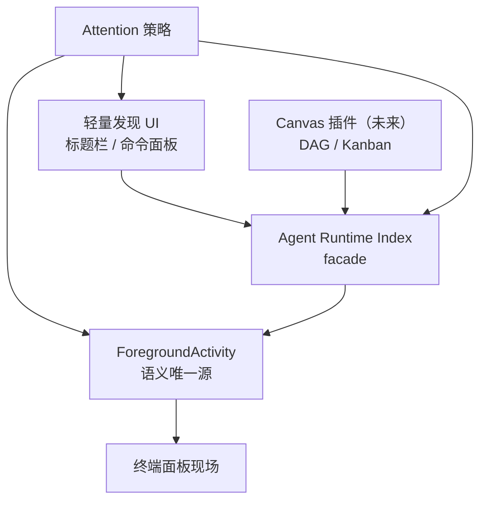

# Agent Runtime Index 与注意力通知产品设计

> 日期：2026-07-15  
> 状态：**P1 / P1.5 已实现**（2026-07-15）；产品设计已定稿；[实施计划](../plans/2026-07-15-agent-runtime-index-and-attention.md)  
> 基线代码：已对齐 `origin/main` @ `54665211`（#88）；FA/标题栏/通知通道未变，设计不需返工  
> 审查稿：Cursor Canvas `pier-agent-runtime-design-review.canvas.tsx`  
> 交互稿：Cursor Canvas `pier-agent-runtime-product-design.canvas.tsx`

## 1. 目标与完成标准

### 1.1 一句话定位

**活动语义唯一源**仍是 `ForegroundActivity`（FA）。宿主另提供 **Agent Runtime Index**（本机查询 / `focus` facade）与 **Attention**（投递策略）；现场永远在终端面板；未来 Canvas 插件拥有 DAG/Kanban 叙事，并把 **持久绑定**写在插件图模型里；统一列表只是 Index 的视图，不是 Session Manager。

### 1.2 要解决的问题

1. 多窗口下无法发现 / 跳转到其他窗口中的 Agent（本窗 FA 广播过滤导致）。
2. Agent 进入「等待确认」等需要人处理的状态时，缺少可回跳的注意力通知闭环。
3. 未来 Canvas（插件实现 DAG/Kanban）需要稳定的运行时枚举 / 订阅 / `focus`，避免插件私建进程表；**不等于**宿主先建编排挂载库。

### 1.3 完成标准（功能必须以闭环为单位验收）

每条闭环必须同时定义：**触发 → 系统行为 → 用户可见反馈 → 成功 / 失败信号**。禁止只做「能列出」而无回跳或失败反馈。

| 闭环  | 名称              | 阶段     | 通过标准摘要                              |
| --- | --------------- | ------ | ----------------------------------- |
| L1  | 跨窗发现 → 回现场      | P1     | 窗口 A 能列出并 focus 窗口 B 的 Agent；失败通道钉死 |
| L2  | 等待确认 → 通知 → 回跳  | P1.5   | 权限/聚焦判定/点击回跳齐全；不扰己；限流或 replace      |
| L3  | 启动 → Index 出现   | P1     | 启动反馈沿用既有规范；Index 可见 SLA 可验收         |
| L4  | 一键处理最急          | P1     | 与 L1 共享排序与 `focus`；零选择快捷路径          |
| L5  | Canvas 节点↔Agent | Future | 插件持久绑定 + Index 运行时；失效可感知；解绑不杀       |

总门禁见第 9 节。

### 1.4 与现有边界的关系

- 对齐 [AGENTS.md](../../../AGENTS.md)：不做任务生命周期 / SQLite 任务台账 / 宿主看板与自动调度；操作反馈规范（toast / `showAppAlert` / 强自然 UI）。
- 对齐 [能力决策清单](./2026-06-25-ai-workbench-capability-scorecard.md)：宿主不做任务 DAG（#27）；Transcript 不做（#09）；多 agent 手动并行已由工作树 + 面板满足（#19）。本设计补 **跨窗发现与注意力投递**，不是重开 #12 状态模型，也不是第二套编排系统。
- 对齐 [Agent 状态适配契约审计](./2026-07-13-agent-status-adapter-contract-audit.md)：`ForegroundActivityBroadcast` 仍是本窗活动权威；Index **不得**成为第二套 status 语义源。
- Canvas DAG/Kanban 由 **官方插件** 拥有；宿主 P1 只保证运行时 Index / `focus`；宿主 join（`attach`）为可选反查，见 §7。

### 1.5 金标准声明（形态分支）

| 产品形态                        | 金标准表面                      | 与本文关系                       |
| --------------------------- | -------------------------- | --------------------------- |
| Agent-first（Cursor / Devin） | Agents 侧栏 / Command Center | **不适用** Pier；不以「缺侧栏」判定本方案失败 |
| Workbench-first（Pier）       | 运行时索引 + 轻量发现 + 可行动通知       | **本文目标形态**                  |

---

## 2. 分层架构

### 2.1 双通道（强制）

| 通道                                 | 范围       | 用途                                               | 禁止                   |
| ---------------------------------- | -------- | ------------------------------------------------ | -------------------- |
| FA broadcast / 本窗 store            | **当前窗口** | tab、状态栏、关面板守卫、本窗仪表                               | 把其他窗口活动灌进本窗 FA store |
| Index API（同一聚合器、**无窗过滤** snapshot） | **本机**   | 发现列表、`focusWaiting`、标题栏全局计数、Attention 选目标、未来插件枚举 | 自算 status；持久化历史台账    |

`focus(agentRef)` = 激活目标 `windowId` + reveal `panelId`。跨窗发现 **不得** 靠「取消 FA 按窗隔离」实现。

### 2.2 层职责

| 层                   | 所有者  | 做什么                                            | 不做什么                   |
| ------------------- | ---- | ---------------------------------------------- | ---------------------- |
| 终端面板                | 宿主   | Agent CLI 现场与 tab / 状态栏                        | 不当全局目录                 |
| ForegroundActivity  | 宿主   | panel 级活动聚合与规范状态（**唯一语义源**）                    | 不做跨产品会话台账              |
| Agent Runtime Index | 宿主   | 对 `kind:"agent"` 的本机投影枚举 / 订阅 / `focus`        | 不做独立活动生命周期；不做 DAG      |
| Attention           | 宿主   | 消费 **FA 状态变迁**；限流；系统通知 / 标题栏强调；点击经 Index.focus | 不做通知历史库（v1）            |
| 轻量发现 UI             | 宿主   | 标题栏 + 命令面板消费 Index                             | 不当主编排台                 |
| Canvas              | 官方插件 | DAG/Kanban；**持久** `node → agentRef`            | 不私建 Agent 进程表 / 不复制 FA |

**着重实现**：Index facade + Attention 契约。  
**轻量实现**：发现 UI。  
**Future**：Canvas 消费 Index；可选宿主 join 反查。

---

## 3. 功能闭环细则

### L1 · 跨窗发现 → 回现场（P1）

| 项    | 定义                                                          |
| ---- | ----------------------------------------------------------- |
| 触发   | 命令面板打开本机 Agent 列表，或点击标题栏活动计数                                |
| 系统   | 读 Index → 列出 → `focus(agentRef)`                            |
| 用户可见 | Quick Pick / 短列表；目标窗口激活并 reveal 面板                          |
| 成功   | ≤2 步回到正确终端面板；**仅靠窗/面板激活的强自然反馈，禁止再打 success toast**          |
| 空态   | 列表打开但无 Agent → 空态文案「没有运行中的智能体」+ 可走「启动默认智能体」（L3）             |
| 失败   | 见下表；短失败 → `toast.error`；带技术详情 → `showAppAlert`；禁止系统通知冒充操作反馈 |

`**focus` 失败族（须全覆盖用户信号）**

| 情况                  | 用户信号                                    |
| ------------------- | --------------------------------------- |
| 面板已关闭 / Index 条目已失效 | `toast.error`：面板已关闭                     |
| 目标窗口已销毁             | `toast.error`：窗口已关闭                     |
| 跨窗激活失败              | `toast.error` 或 `showAppAlert`（含系统错误详情） |
| Index 拉取失败          | `showAppAlert` + 可重试（若入口支持）             |

### L2 · 等待确认 → 注意力通知 → 回跳（P1.5）

| 项    | 定义                                                                           |
| ---- | ---------------------------------------------------------------------------- |
| 触发   | **FA/聚合器**状态进入 `waiting`（默认；`error` 为设置项）→ Attention 消费变迁；**不是**「Index 自造事件」 |
| 系统   | Attention 策略 → 系统通知和 / 或标题栏强调                                                |
| 用户可见 | 见 §5                                                                         |
| 成功   | 点击通知 → L1 `focus`；同逻辑目标冷却或 notification replace，不刷屏                          |
| 失败   | 见 §5.4                                                                       |

### L3 · 空闲启动 → Index 出现（P1）

| 项            | 定义                                                                                  |
| ------------ | ----------------------------------------------------------------------------------- |
| 触发           | `pier.agent.start.`* / `pier.agent.new`                                             |
| 系统           | 既有 `prepareLaunch` → 新终端 → FA（含 launch 先验）→ Index 投影                                |
| 用户可见         | 新面板打开（强自然反馈）；随后发现列表 / 全局计数出现该 Agent                                                 |
| Index 可见 SLA | FA 有 **可见性消抖（约 250ms）**；「面板已开、Index 短暂未出现」**不算**启动失败；验收以消抖后 Index 出现为准              |
| 成功（启动动作）     | 面板打开即成功；**禁止**额外 success toast                                                      |
| 失败           | 软失败 → `toast.error`；异常 / 技术详情 → `showAppAlert`（对齐现网 agent 启动反馈）；探测不到 CLI → 不进 Index |
| 后续进程失败       | Index 先出现再消失：属运行态结束，不回溯为「启动失败」                                                      |

**标题栏 running：** P1 起全局 `running` **计入**无 `status` 的 launch 先验（与列表「运行中」一致）；与历史「本窗 activityCounts 不计 launch」行为有意变更，见开放决策 #1。

### L4 · 一键处理最急（P1）

| 项    | 定义                                                           |
| ---- | ------------------------------------------------------------ |
| 触发   | `pier.agents.focusWaiting`（**仅快捷键** `Mod+Shift+Y`；`surfaces: []`，不进命令面板、不嵌列表假行） |
| 系统   | 与 L1 / 标题栏短列表 **共享** §4.4 排序与同一 `focus`；取 Needs you 第一条      |
| 关系   | L4 = **零选择**快捷路径；**不是**第二套列表或排序实现                            |
| 用户可见 | 直接跳转；成功无 toast                                               |
| 成功   | 有 Needs you（`waiting` | `error`）则聚焦                          |
| 空    | `toast` 短提示：**「没有需要处理的智能体」**（覆盖 waiting 与 error，避免文案只说「等待中」） |
| 失败   | 同 L1 失败族                                                     |

### L5 · Canvas 节点↔Agent（Future）

| 项         | 定义                                                                                 |
| --------- | ---------------------------------------------------------------------------------- |
| 触发        | 用户在 Canvas 节点/卡片上绑定 Agent                                                          |
| 持久绑定所有者   | **Canvas 插件图模型**保存 `node/card → agentRef`                                          |
| 运行时       | 插件 `subscribe` Index 投影状态；点节点 → `focus`                                            |
| 可选宿主 join | P2+ `attach/detach(externalRef, agentRef)` 仅作 **opaque 反查**（谁占用了某 Agent），宿主不解释节点语义 |
| 成功        | 不私建进程表；卸载节点 **不**杀 Agent，只删插件侧绑定（及可选 join）                                         |
| 失败        | Index 中 `agentRef` 失效 → UI「已脱离」+ 可重新绑定                                             |
| 基数        | 默认允许 **N 个 externalRef / 节点 → 同一 agentRef**；对某一 `externalRef` 的 detach 不影响其他绑定     |

---

## 4. Agent Runtime Index（产品契约）

### 4.1 原则

1. **语义唯一源 = FA 聚合器**。Index **不得**自算或持久化独立活动生命周期；status 只从 FA 推导。
2. Index = 对本机 `kind:"agent"` 条目的 **查询 / 订阅 / focus facade**（可对同一聚合器做无窗过滤 snapshot）。
3. 本窗 panel UI（tab / 状态栏）继续只消费 **按窗 FA**；跨窗发现与全局计数走 Index。
4. Index 条目生命周期 = 对应 FA agent 条目生命周期（面板关闭 → 从 Index 消失）。
5. **P1 不向插件暴露完整公共订阅面为必达**；宿主命令 / IPC 先闭环 L1/L3/L4。插件 `list` / `subscribe` 在 **第二消费者（Canvas）落地或 P1.5+** 再升为正式 `agents` API（今日仅 `selection()`）。

### 4.2 `agentRef` 身份（P1 冻结）

| 项      | P1 锁定                                                                                                                   |
| ------ | ----------------------------------------------------------------------------------------------------------------------- |
| 构成     | 不透明字符串；实现可派生自 `windowId + panelId`                                                                                      |
| 寿命     | **仅保证 Pier 进程内、对应面板仍存在时**可用于 `focus`                                                                                    |
| 失效     | 面板关闭、窗口销毁、FA 该 agent 条目清除 → ref 立即失效                                                                                    |
| 非承诺    | 不跨进程重启；不随「关面板后提供方 session 仍可 resume」存活；不因布局恢复自动重映射                                                                      |
| 通知冷却键  | P1 可用 `agentRef`；须接受面板重建后冷却键变化                                                                                          |
| Canvas | **禁止**在身份升级前把 P1 `agentRef` 当作长期图数据库主键而不处理「已脱离」。升级方案（逻辑 id + 可变 scene，或可选投影 `providerSessionId?`）属 Canvas 前架构项，见 §11 #4 |

消费者应只持有 `agentRef`，不要解析内部结构。

### 4.3 字段（产品口径）

| 字段                             | 含义                                                        | 消费者                     |
| ------------------------------ | --------------------------------------------------------- | ----------------------- |
| `agentRef`                     | 不透明引用（§4.2）                                               | 列表 / 通知 payload / 插件绑定值 |
| `agentId`                      | Claude / Codex / …                                        | 展示与「启动同款」               |
| `status?`                      | `ready` | `processing` | `tool` | `waiting` | `error`；可缺省 | 分组、Attention、节点色点       |
| `windowId` + `panelId`         | 现场定位（scene）                                               | `focus` / reveal        |
| context 摘要                     | `worktreeKey` / `projectRootPath` / `cwd`（尽力）             | 副文案；P1 列表可「当前工作区略优先」    |
| `updatedAt` / `stateStartedAt` | 排序与时长                                                     | 列表、长跑提示                 |

**P1 Index schema 不含 `attachments[]`。** 挂载关联不是 FA 投影字段；见 §7。

无 `status` 的 launch 先验：列表与标题栏 running 归「运行中」，文案「运行中」。

实施计划须附 **FA 字段 → Index 字段** 映射表，禁止 Index 侧另写状态机。

### 4.4 宿主能力分期

| 能力                          | 闭环           | 阶段                     |
| --------------------------- | ------------ | ---------------------- |
| 本机枚举                        | L1 / L4      | **P1**（宿主）             |
| `focus(agentRef)`           | L1 / L2 / L4 | **P1**                 |
| 宿主侧订阅（供标题栏/发现 UI）           | L1           | **P1**                 |
| Attention 消费 FA 变迁          | L2           | **P1.5**               |
| 插件正式 `list` / `subscribe`   | Canvas / 多插件 | **P1.5+ 或第二消费者触发**     |
| 可选 `attach` / `detach` join | L5 反查        | **P2+**，且 Canvas 已证明需要 |

### 4.5 Needs you 排序（L1 短列表 / L4 共用）

1. `waiting`
2. `error`
3. （短列表可选）`processing` / `tool` / 无 status — **不进**「需要你」KPI
4. `ready` — 默认不进标题栏

组内：`updatedAt` 新 → 旧；同刻度当前窗口略优先；同窗内可再按当前 `projectRootPath` / `worktreeKey` 接近度略优先。

---

## 5. Attention / 通知

### 5.1 与 Index / FA 的关系

- **事件源 = FA 状态变迁**（进入 / 离开 Needs you）。
- **回跳目标 = Index.focus**。
- Attention **不是** Index 的一部分；做完 Index ≠ 自动有通知。
- **不依赖**侧栏 UI。

### 5.2 「已聚焦该面板」判定（P1.5 锁定）

同时满足才视为「不扰己」、**不**发系统通知：

1. 通知目标 `windowId` 是当前前台 Pier 窗口；且
2. 该窗口内 active（或等价焦点）panel 就是目标 `panelId`。

不满足（含：分屏可见但焦点在旁、Agent 在后台窗口、应用在后台）→ 允许走系统通知策略。

### 5.3 默认策略（P1.5）

1. 触发：进入 `waiting`；设置项可扩展含 `error`（默认关：waiting = 可行动注意力，error = 可配置噪声）。
2. 已聚焦该面板（§5.2）→ 不发系统通知；现场 tab / 状态栏足够。标题栏 Needs you 计数仍可更新。
3. 否则 → 尝试系统通知；payload 必含 `kind: "agent.attention"` 与 `agentRef`。
4. 同一 `agentRef`：**冷却（默认 3 分钟）** 与 / 或 **同 tag replace**（更新同一条，而非只靠冷却）。
5. 点击通知 → `focus(agentRef)`；失败复用 L1 失败族。
6. 用户划掉未点击：不强制重置冷却；标题栏强调可继续至状态离开 Needs you。

### 5.4 权限、降级与可见性

| 情况                                     | 产品行为                                      |
| -------------------------------------- | ----------------------------------------- |
| `Notification.isSupported() === false` | 不假装已通知；依赖标题栏强调                            |
| 用户拒绝 OS 权限                             | 永久降级到标题栏；可在设置引导去系统偏好；**禁止**报成功已通知         |
| 系统 DND / Focus 吞掉通知                    | 与「用户未感知」同等：标题栏强调仍为真相；不另建历史库               |
| App 在后台且仅有标题栏                          | 回前台后标题栏 Needs you 仍可见即可；v1 不强制 Dock badge |
| 通知 click 时 ref 已失效                     | L1「面板已关闭」类 toast                          |

### 5.5 通道边界

| 通道                                       | 用途                                                            |
| ---------------------------------------- | ------------------------------------------------------------- |
| 系统通知（`kind: agent.attention`）+ 标题栏强调（可点） | Agent 注意力                                                     |
| `toast` / `showAppAlert`                 | 操作反馈与 L1/L3/L4 失败                                             |
| 插件业务系统通知                                 | 自管；**禁止**使用 `agent.attention` kind；Attention 策略只消费 Agent kind |

标题栏同时承担「全局计数（L1）」与「Needs you 强调（L2）」：强调态须有可区分视觉（例如 Needs you > 0 时 warning 权重），避免与普通 running 计数混淆。

v1 **不做**通知历史中心或复杂按项目订阅规则。

---

## 6. 近态表面：轻量发现（非侧栏）

| 表面                      | 角色       | 闭环           | 备注                                                |
| ----------------------- | -------- | ------------ | ------------------------------------------------- |
| 标题栏计数                   | 打断入口     | L1 / L2      | **本机全局**；读 Index；可点短列表；`ready` 不进                 |
| 命令面板                    | 键盘主路径    | L1 / L3      | 本机 Agent 列表；保留 `pier.agent.new` / `start.`*；L4 仅快捷键 |
| 工作台 `activity-overview` | 可选本窗概览   | 辅助           | 不当跨窗唯一入口                                          |
| 独立 Agents 侧栏            | **非 v1** | —            | 需求触发；必须读同一 Index                                  |

### 6.1 为何 v1 不做侧栏 + 显式产品债

**不做的原因**

1. 终态管理叙事在 Canvas；Agent 是挂载物。
2. 侧栏易变第二管理台，冲突「面板即现场」与宿主不做 DAG。
3. Agent-first 侧栏金标准不适用于 Pier 工作台形态。

**v1 显式接受的代价（产品债，不是遗忘）**

| 代价                      | 说明                     |
| ----------------------- | ---------------------- |
| 舰队扫描带宽弱于 Command Center | 依赖 Quick Pick / 短列表    |
| 无常驻 Needs you 队列        | 标题栏短列表为弱替代             |
| 无 Spaces 级分区浏览          | 仅 context 副文案 + 轻微排序加权 |
| 偏键盘 / 点按，弱于鼠标长扫         | 命令面板为主路径之一             |

日后若做侧栏，必须消费同一 Index，禁止第二数据源「补全」这些债。

---

## 7. 未来 Canvas（插件）挂接

### 7.1 两层存储（强制拆分）

| 层       | 所有者              | 内容                                                                       |
| ------- | ---------------- | ------------------------------------------------------------------------ |
| 持久绑定    | **Canvas 插件图模型** | `node/card → agentRef`                                                   |
| 运行时真相   | **宿主 Index**     | 枚举 / status / `focus` / 失效                                               |
| 可选 join | 宿主 P2+           | namespaced `externalRef`（建议 `pluginId:…`）→ `agentRef`，仅反查；**不是** FA 投影字段 |

### 7.2 能力映射

| Canvas 能力          | 宿主依赖                        | 闭环            |
| ------------------ | --------------------------- | ------------- |
| 生成 / 编辑 DAG、Kanban | 无                           | 插件内           |
| 节点显示 Agent 状态      | Index subscribe（插件 API 就绪后） | 状态投影          |
| 节点绑定               | 插件写自己的图；可选宿主 join           | L5            |
| 点节点回现场             | `focus`                     | 复用 L1         |
| Canvas 内统一列表       | 本机枚举                        | 同一 Index 另一视图 |

**运行时完备（Canvas 真最小集）**：稳定不透明 `agentRef` 契约 + list/subscribe + `focus` + 失效语义。  
**宿主 `attach` 不是完备前提**；正向挂载只需插件存 `agentRef` 并读 Index。

宿主永不解释看板列 / DAG 边；无 Canvas 也不提供编排 API。

命名注意：本文「Canvas」指 **DAG/Kanban Agent 挂载面**；与仓库内其他 living-spec / Live Modules「canvas」设计区分，实施时勿混文档。

---

## 8. 分期与完成定义

| 阶段         | 交付                                                                 | 闭环必须绿    | 本阶段不做                                 |
| ---------- | ------------------------------------------------------------------ | -------- | ------------------------------------- |
| **P1**     | Index facade（本机枚举 / 宿主订阅 / focus）+ 标题栏全局 + 命令面板发现；冻结 `agentRef` 寿命 | L1、L3、L4 | 侧栏、插件正式 subscribe 必达、宿主 attach、系统通知策略 |
| **P1.5**   | Attention（§5 全节）+ 通知 click→focus；可选插件 list/subscribe               | L2       | 通知历史、复杂规则                             |
| **P2**     | 可选 opaque join API（第二消费者证明需要时）                                     | 契约可测     | 宿主 Kanban；把 join 写进 FA                |
| **Future** | Canvas 插件 DAG/Kanban + 插件侧持久绑定 UI                                  | L5       | 宿主编排引擎                                |

---

## 9. 总验收门禁

| #   | 门禁   | 通过标准                                                                  |
| --- | ---- | --------------------------------------------------------------------- |
| 1   | 语义单源 | status / 活动生命周期只来自 FA；Index 无第二套进程表与状态机                               |
| 2   | 双通道  | 本窗 UI 仍吃按窗 FA；跨窗发现只经 Index；未取消 FA 窗隔离                                 |
| 3   | 回跳   | 列表 / 通知均可 focus；失败走 §3 L1 失败族                                         |
| 4   | 跨窗   | 窗口 A 能发现并聚焦窗口 B 的 waiting Agent                                       |
| 5   | 注意力  | §5.2–5.4：不扰己、权限降级、可点回                                                 |
| 6   | 启动   | L3 反馈通道与 Index SLA                                                    |
| 7   | 边界   | 无宿主 DAG/Kanban/Transcript；无 v1 Agents 侧栏主表面；P1 Index 无 attachments 字段 |
| 8   | 身份纪律 | P1 `agentRef` 寿命与失效符合 §4.2；Canvas 持久化知悉「已脱离」                          |

---

## 10. 非目标

- 宿主任务 DAG / Kanban / 自动调度（留给 Canvas 插件）
- 宿主 Transcript / Session 台账 / 历史全文搜索 / Index 历史持久化
- 以独立 Agents 侧栏作为 v1 主管理面
- 通用多提供方账号平台（Codex 账号仍在 `pier.codex`）
- 通知历史中心 / 复杂订阅规则引擎（v1）
- 将操作反馈 toast 与 Agent 注意力通道混用
- 远程 / 云端 Agent 舰队管理
- 用 Index 替换本窗 FA 作为 tab/状态栏数据源
- 关面板后仍在 Index 中保留「可 resume 幽灵条目」（恢复走提供方 CLI / 用户重开面板）

---

## 11. 开放决策（实施前确认）

| #   | 问题                             | 建议默认                       | 备注                |
| --- | ------------------------------ | -------------------------- | ----------------- |
| 1   | 标题栏是否全局；running 是否计 launch 先验  | **是**；P1 同步                | 与列表一致             |
| 2   | L2 默认是否含 `error`               | **否**；设置项开启                | —                 |
| 3   | 冷却时长                           | **3 分钟**；优先实现同 tag replace | —                 |
| 4   | `agentRef` 升级（逻辑 id + scene）时机 | **Canvas 持久绑定前必做架构评审**     | 已从「序列化格式」升格为架构风险项 |
| 5   | 插件 `list/subscribe` 是否并进 P1.5  | 有 Canvas 或明确第二消费者时并入       | P1 宿主闭环不阻塞        |

---

## 12. 参考

- [AGENTS.md](../../../AGENTS.md) — 产品边界、FA、操作反馈规范
- [2026-06-25-ai-workbench-capability-scorecard.md](./2026-06-25-ai-workbench-capability-scorecard.md) — 能力决策
- [2026-07-13-agent-status-adapter-contract-audit.md](./2026-07-13-agent-status-adapter-contract-audit.md) — FA 所有权
- `src/shared/contracts/foreground-activity.ts` — 活动与 Agent 五态
- `src/main/ipc/notification.ts` — 系统通知（P1.5 需权限 / click / kind）
- `src/renderer/lib/plugins/host-agents-context.ts` — 插件 agents 面（今日仅 selection）
- 多 Agent 审查结论：`pier-agent-runtime-design-review.canvas.tsx`

