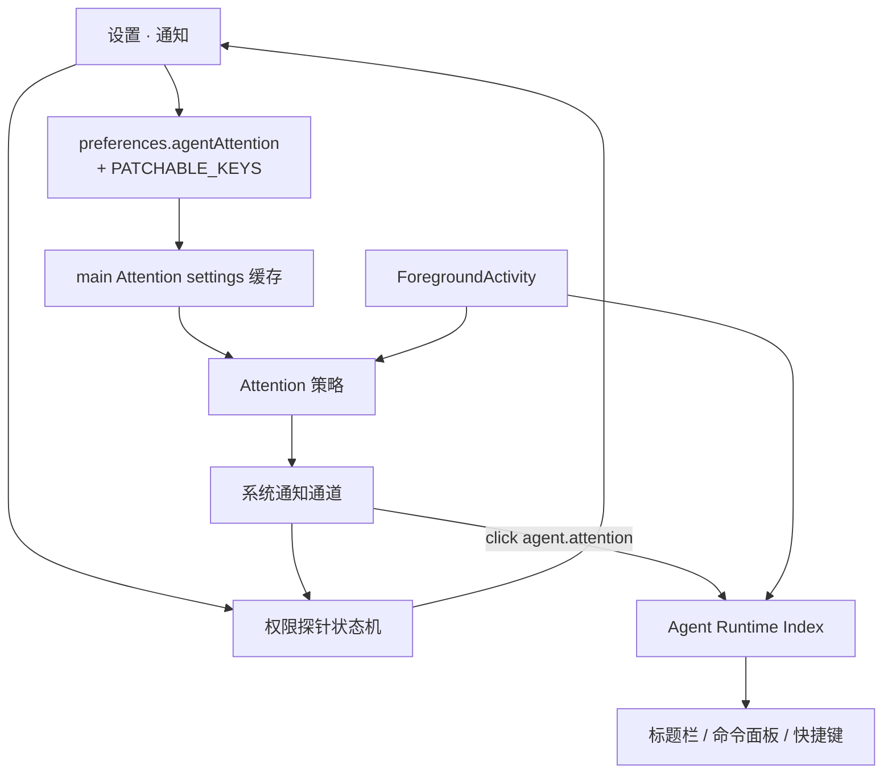

# Agent 注意力设置与状态准确性产品设计

> 日期：2026-07-16  
> 状态：**实施中**（Task 1–6 代码已落地，待 commit / 手工验收）；[实施计划](../plans/2026-07-16-agent-attention-settings-and-status-accuracy.md)  
> 审查：Codex CLI 架构审查（2026-07-16）→ **fail → 本修订吸收 P0/P1**  
> 前置：[`2026-07-15-agent-runtime-index-and-attention-design.md`](./2026-07-15-agent-runtime-index-and-attention-design.md)（P1 / P1.5 已实现）  
> 状态基线：[`2026-07-13-agent-status-adapter-contract-audit.md`](./2026-07-13-agent-status-adapter-contract-audit.md)  
> 范围：Phase A（通知可管理闭环）+ 状态准确性治理；**不含**完成通知 / 声音库 / 终端响铃 / 通知历史 / Canvas

## 1. 目标与完成标准

### 1.1 一句话定位

在 **ForegroundActivity（FA）仍为活动语义唯一源**、Index / Attention 主链路已落地的前提下：

1. **注意力可管理**：设置可持久化策略、可恢复的权限探针、测试通知、打开系统设置。  
2. **状态可诚实验收**：Top A 档用**真实映射证据**锁门；launch-only 负向；B 档映射本迭代**重审并收敛**，禁止「只写文档却默认弹通知」。

### 1.2 要解决的问题

1. Attention 策略硬编码，用户无法管理；权限失败不可恢复自检。  
2. 易被误判为「通知没做完」（缺设置表面）。  
3. waiting 证据不全量等价；若门禁只测共享契约、不测 provider 映射，会假绿。  
4. 审查发现：preferences **白名单**会静默丢弃未列字段；sticky denied **阻断**「成功 show 清拒绝」——必须在设计中钉死，否则 N1–N8 全假。

### 1.3 完成标准（闭环）

| 闭环 | 名称 | 通过标准摘要 | 证明方式 |
| --- | --- | --- | --- |
| N1 | 总开关 | 关后 waiting 不发 OS 通知；Index/标题栏仍更新 | 单测 + 手工 |
| N2 | 出错通知 | 默认关；开后仅进入 `error` 可通知 | 单测 |
| N3 | 专注抑制 | 默认聚焦目标 panel 不弹；可关 | 单测 |
| N4 | 冷却 | 同 agentRef 冷却内不重复；tag replace | 单测（既有+扩展） |
| N5 | 权限健康 | denied/unsupported 可理解；不谎报 | 单测 + 手工 |
| N6 | 权限可恢复 | **强制探测**可在用户允许后变为 authorized | 单测 sticky bypass + 手工 |
| N7 | 测试通知 | 只验通道；不记 agent 冷却 | 单测 |
| N8 | 策略即时生效 | patch 经白名单持久化+广播；下一次 FA 变迁用新策略 | **preferences-service 集成测** + Attention 测 |
| N9 | 真通知回跳 | agent.attention click → Index.focus | 既有路径回归 |
| S1 | Top A 链 | Claude/Codex/Copilot/OpenCode：原生 permission 映射 → FA waiting → needsYou → Attention 候选 | **每家真实 mapper/事件表** + 聚合链测 |
| S2 | launch-only | 无 status 不进 Needs you、不通知 | 单测 |
| S3 | hooks 关闭 | 文案与运行时语义**一致**（见 §6.4）；失败可感知 | 文案 + 可选 FA 门闸测 |

### 1.4 边界

- FA 唯一语义源；Index 投影；Attention 只投递。  
- 不做：侧栏、完成通知、历史、OCR waiting、Canvas、插件 list/subscribe。  
- 金标准 = Pier 可行动注意力，**不是** Orca 功能对等。

### 1.5 审查抬档（相对初稿）

| # | 问题 | 本修订锁定 |
| --- | --- | --- |
| P0 | `PATCHABLE_KEYS` 丢弃 `agentAttention` | 白名单 + 整对象替换测必须进 Task 1 |
| P0 | sticky denied 使「show 成功清拒绝」不可达 | 用户强制探测可 bypass 一次 sticky；仅 shown:true 清 denied |
| P1 | hooks 关承诺过强 | 诚实语义：停装+异步卸；在跑 CLI 可能仍发事件；可选 FA 入口门闸 |
| P1 | S1 假绿 | 禁止只测 `PermissionRequest→waiting`；必须锁四家映射源 |
| P1 | B 档默认仍吵 | 本迭代重审 B 映射；无授权证据则停止映到 PermissionRequest |
| P1 | 触发语义 | 冻结「非触发集 → 触发集」矩阵，修正 `previous !== next` |
| P1 | 保存失败吞掉 | store 必须用户可见失败；禁止 silent catch |
| P2 | settings/探针所有权 | main 同步缓存 + 权限状态广播或设置页确定性 refetch |

---

## 2. 分层架构



| 层 | 做 | 不做 |
| --- | --- | --- |
| preferences-service | 白名单 patch、广播 `changedKeys` | 静默丢未知业务字段却返回「成功」 |
| Attention settings 缓存 | `preferences.changed` 同步更新；`settings()` **同步** | observe 内每次异步 read 当唯一路径（可作启动兜底） |
| 权限探针 | main 独占状态机；强制探测；广播或 invoke 快照 | renderer 猜 OS 权限 |
| Attention | 投递决策 | 读 provider 名、证据等级、hooks 开关（hooks 由安装/可选 FA 门闸处理） |

---

## 3. 设置信息架构

### 3.1 导航

- 独立分区 `notifications`（通知），顺序：`agents` → `notifications` → `plugins`。

### 3.2 页面

1. **权限健康**（`unsupported` / `denied` / `unknown` / `authorized`）  
   - denied：banner + 打开系统设置 + **发送测试通知**（强制探测）  
   - **不提供**无真实探测的「重新检查」空按钮；若保留文案，必须等同强制探测  
   - unsupported：降级说明，无无效深链  

2. **策略**：`enabled`、说明「需要确认时」、`enableErrorAttention`、`suppressWhenFocused`、`cooldownMs`（1/3/10 分）

3. **自检**：发送测试通知；打开系统设置  

4. **诚实说明**：仅 hook 报告的需要确认（及可选 error）；部分 CLI 无法报告；**状态钩子关闭**见 §6.4 原文承诺  

### 3.3 不做的设置项

完成通知、响铃、声音、历史、按项目规则、独立「需要确认」开关。

---

## 4. 数据契约与运行时

### 4.1 设置

```ts
{
  enabled: boolean;                 // default true
  enableErrorAttention: boolean;    // default false
  suppressWhenFocused: boolean;     // default true
  cooldownMs: 60_000 | 180_000 | 600_000; // default 180_000
}
```

- `src/shared/contracts/agent-attention.ts` + `preferences.agentAttention`  
- **`src/main/services/preferences-service.ts` 的 `PATCHABLE_KEYS` 必须含 `"agentAttention"`**  
- 更新方式：renderer 提交**完整** `agentAttention` 对象（四字段齐全）；main 整键替换，禁止只 patch 子字段导致 zod/合并丢键  
- 广播：`preferences.changed` 含 `changedKeys: ["agentAttention"]`；Attention 缓存订阅后同步  

### 4.2 权限探针状态机（强制）

状态：`unsupported` | `denied` | `unknown` | `authorized`。

| 事件 | 转移 |
| --- | --- |
| `!Notification.isSupported()` | → `unsupported`（终态类） |
| 普通 show 权限失败 / sticky 学习 | → `denied`，`stickyDenied=true` |
| 尚无证实 show | `unknown`（初值） |
| 任意路径 `shown:true` | → `authorized`，**清除** `stickyDenied` |
| 用户**强制探测**（测试通知） | 允许 **bypass sticky 一次** 真正调用 `Notification.show`；结果按上表更新 |
| 只读 getStatus | 返回 last 状态 + `observedAt` + `source`（`cached` \| `forced-probe` \| `attention-delivery`）；**不得**假装实时问 OS |

设置页打开：拉快照。  
设置页可见且窗口 focus：可再拉快照（仍只是缓存，除非用户点测试）。  
真实 Attention 投递结果回写探针。  
权限状态变化：main → renderer 广播（建议 `PIER_BROADCAST` 新通道或复用 degraded 扩展为 full status）；设置页订阅，避免只依赖一次性 toast。

### 4.3 打开系统设置

macOS best-effort URL；失败 `opened:false` + `showAppAlert` 手动路径；禁止假成功 toast。

### 4.4 测试通知

- `kind: "agent.attention.test"`（或等价）；**无**业务 `agentRef`  
- **不**写 Attention `lastNotified`  
- 走强制探测路径（可 bypass sticky）  
- click：激活 Pier 窗口即可  
- 失败：toast/alert；成功：以 OS 通知为主  

### 4.5 触发矩阵（冻结，替换 `previous !== next`）

触发集 T：

- 恒含 `waiting`  
- 当 `enableErrorAttention` 时含 `error`  

**仅当** `previous ∉ T` 且 `next ∈ T` 时进入 Attention 候选（「进入触发集」）。

| previous → next | enableErrorAttention | 是否候选 |
| --- | --- | --- |
| ready/processing/tool/∅ → waiting | * | 是 |
| ready/… → error | true | 是 |
| ready/… → error | false | 否 |
| waiting → waiting | * | 否 |
| error → error | true | 否 |
| waiting → error | true | **否**（同属 T，不重复吵） |
| error → waiting | true | **否** |
| waiting → processing | * | 否 |
| error → ready | * | 否 |

冷却与 focused/disabled 在进入候选之后仍可 skip。

### 4.6 Attention 决策序

```text
1. !settings.enabled → skip (disabled)
2. 未满足触发矩阵 → skip (filtered-status)
3. suppressWhenFocused && focused → skip (focused)
4. cooldown active → skip (cooldown)
5. show(kind=agent.attention, tag, agentRef)  // 普通路径遵守 sticky
6. shown:true → lastNotified + probe authorized
   shown:false → 不记冷却；更新 probe
```

`settings()`：**同步**读 main 缓存；缓存由 preferences 广播更新；启动时 readPreferences 填初值。

### 4.7 诊断原因码

日志/单测：`disabled` | `focused` | `cooldown` | `filtered-status` | `unsupported` | `denied` | `shown`。用户面板非本迭代必达。

### 4.8 操作反馈（摘要）

设置保存 / 测试通知 / focus 的细则见 **§5 反馈通道总表**。Renderer store：update 失败须 revert 乐观态；不得「catch 后 swallow」。

---

## 5. 反馈通道总表（分级，非全系统通知）

### 5.1 两类反馈（禁止混用）

| 类型 | 回答的问题 | 合法通道 |
| --- | --- | --- |
| **注意力投递** | 有智能体需要你去处理吗？ | 系统通知（OS）· 标题栏 Needs you · Index / 命令面板 / `Mod+Shift+Y` · 终端 tab/状态栏 |
| **操作反馈** | 我刚点的动作成功了吗？ | 强自然 UI · `toast` · `showAppAlert` |

硬纪律（对齐 [AGENTS.md](../../../AGENTS.md) 与 2026-07-15 设计）：

1. **不是**所有消息都走系统通知。  
2. 系统通知 **不当** 操作成功/失败的主通道（`kind: agent.attention` 只服务可行动注意力）。  
3. toast **不当** Agent 等待确认的主通道。  
4. 成功 focus / 成功启动面板：**禁止** success toast。  
5. 关系统通知或 OS 拒权后：标题栏 / Index / 快捷键 **仍是真相面**。

### 5.2 通道强度（由强到弱）

| 通道 | 强度 | 用途 |
| --- | --- | --- |
| 系统通知（OS） | 打断 | 仅：进入触发集 + 策略允许 + 未专注抑制 + 通道可用 |
| 标题栏 Needs you / running | 常驻 | 本机全局计数；不依赖 OS 权限 |
| Index 列表 / 命令面板 / focusWaiting | 主动 | 发现与回跳 |
| 终端 tab / 状态栏 | 现场 | 本窗 FA（按窗隔离） |
| `showAppAlert` | 操作失败·有详情 | 技术错误、打开系统设置失败等 |
| `toast.error` / 短 toast | 操作失败·短 | 面板已关、无 Needs you、测试失败短因 |
| 强自然 UI | 操作成功默认 | 开关态、面板激活、列表变化 |

### 5.3 注意力类：哪些状态变化有反馈

| 事件 | 系统通知 | 标题栏 / Index | toast / alert |
| --- | --- | --- | --- |
| 进入 `waiting`，未聚焦目标 panel，`enabled`，权限允许 | **是** | Needs you 计入 | **否** |
| 进入 `waiting`，已聚焦且 `suppressWhenFocused` | **否** | 仍可计入 Needs you | **否**（现场足够） |
| 进入 `error`，默认（`enableErrorAttention=false`） | **否** | Needs you 计入（error 属需要你） | **否** |
| 进入 `error`，用户打开出错通知且未聚焦 | **是** | 同上 | **否** |
| 持续 waiting / 触发集内 waiting↔error | **否**（不刷屏） | 保持 | **否** |
| processing / tool / ready | **否** | running 或 ready 规则；**不**进 Needs you KPI 的 ready 默认不强调 | **否** |
| 仅 launch、无 `status` | **否** | running 可计；**永不** Needs you | **否** |
| 任务完成 → idle/ready | **否**（非目标） | 离开 Needs you | **否** |
| `enabled=false` 时进入 waiting | **否** | **仍**更新 Needs you | **否** |
| OS denied / unsupported 时进入 waiting | **否** | **仍**更新 Needs you | 设置 banner；可选一次性 degraded 提示（不刷屏） |
| 冷却期内同 agentRef 再入触发集 | **否** | 不变 | **否** |
| 用户划掉系统通知未点击 | — | 可继续强调至离开 Needs you | **否**；不强制清冷却 |

### 5.4 操作类：用户动作的成败信号

| 用户动作 | 成功 | 失败 |
| --- | --- | --- |
| Index / 标题栏列表 / 真 Attention 通知 → `focus` | 窗+面板激活（强自然 UI）；**禁止** success toast | 短：`toast.error`（面板/窗没了）；有技术详情：`showAppAlert` |
| `pier.agents.focusWaiting` 且无 Needs you | — | 短 toast：「没有需要处理的智能体」 |
| 设置：改 enabled / error / 抑制 / 冷却并保存 | 控件态即时更新；跨窗 `preferences.changed` | **必须** toast.error 或 showAppAlert；**禁止**仅 console |
| 发送测试通知 | 以 OS 通知出现为主；可选极短 toast（可省略） | toast.error 或 showAppAlert |
| 打开系统设置 | 系统界面出现 | showAppAlert 手动路径；**禁止**假「已打开」 |
| 权限 denied / unsupported | — | 设置页常驻 banner；bridge 可一次 toast 引导 |
| 启动 Agent（L3） | 新面板打开 = 成功 | 既有 agent 启动规范（toast / alert） |
| 关闭状态钩子（S3） | 开关态 + 文案；uninstall 异步 | 卸载失败 showAppAlert |

### 5.5 明确无用户消息的情况

- Agent 正常 processing/tool 心跳  
- Attention 内部 skip（disabled / focused / cooldown / filtered-status）——仅日志/诊断码  
- focus **成功**、启动面板 **成功**  
- 完成/空闲（本设计不做完成通知）

### 5.6 实施检查（防回归）

| 反模式 | 处理 |
| --- | --- |
| 凡 FA 变化都 `Notification.show` | 禁止；仅触发矩阵 + 决策序 |
| 凡失败都打系统通知 | 禁止；操作失败走 toast/alert |
| focus 成功再 toast.success | 禁止 |
| `toast.*(…, { description })` 塞长详情 | 禁止；详情走 showAppAlert |
| 系统通知文案冒充「已保存设置」 | 禁止 |
| 关 OS 通道后清空 Needs you | 禁止 |

### 5.7 与业界的对齐（说明，非新范围）

桌面端常见分层：未聚焦可行动 → OS 打断；已聚焦 → 不扰；角标/计数常驻；操作成败 in-app。本表即该模型在 Pier 的落地；**不**追求移动端 push 粒度，**不**做通知历史 inbox。

---

## 6. 状态准确性治理

### 6.1 原则

1. waiting 唯一规范入口：`PermissionRequest`。  
2. 有证据才断言；无信号不进 Needs you。  
3. 禁 OCR/标题猜状态。  
4. 设置开关不提高无证据准确率。  
5. **门禁必须证明 provider → 规范事件 → FA → Index → Attention 候选**，禁止契约孤岛假绿。

### 6.2 证据等级

| 级 | 定义 | 承诺 |
| --- | --- | --- |
| A | 明确 permission/approval 原生事件 | waiting 可通知 |
| B | 近似映射 | **本迭代重审**；留下的须有注释+测；否则删除映射 |
| C | 有 hook 无 permission | 不承诺 waiting |
| D | 仅 launch | 永不 Needs you |

### 6.3 S1 Top 链（四家全锁）

| Agent | 映射源（实施时以代码为准） | 链 |
| --- | --- | --- |
| Claude | nested `events`：`PermissionRequest`→`PermissionRequest` | 规范事件 → aggregator → `projectAgentActivities` → `needsYou` → Attention entered |
| Codex | 同上 hooks 表 | 同上（对账不负责 permission） |
| Copilot | `COPILOT_EVENTS`：`permissionRequest` | 同上 |
| OpenCode | 运行时 `permission.updated`→`PermissionRequest`（导出纯函数或从安装产物/源码可测点断言） | 同上 |

**禁止**：用 Mimo「同构注释」代替 OpenCode；禁止只 assert `activityStatusForHookEvent("PermissionRequest")`。

### 6.4 S2 / S3

**S2：** launch-only 无 hook 集成；无 status 条目 `needsYou===0` 且 Attention 不通知。

**S3 hooks 关闭 — 诚实语义（修订）：**

| 承诺 | 不承诺 |
| --- | --- |
| 偏好 `agentStatusHooks=false` 后触发 uninstall（异步）且启动时不安装 | 已在跑的 CLI 进程立即停止发 hook |
| 卸载失败：`showAppAlert` / 用户可见错误，不得只 console | uninstall 完成前已排队的 JSONL 行 0 丢失 |
| 设置双处文案与上表一致 | 「一点开关全世界立刻安静」 |

**推荐工程加固（本迭代应做其一，优先 A）：**

- **A.** FA/jsonl 摄入路径读取 `agentStatusHooks`：为 false 时**丢弃新 agent hook 事件**（仍允许 command lifecycle 等非 agent-hook）  
- **B.** 若不做 A，文案必须写「需重开 Agent 会话后完全生效」，且 S3 测只锁文案+uninstall 调用，不声称即时无 waiting  

既有 `waiting` 条目：hooks 关闭后**不**由 Attention 清除 FA；用户处理或会话结束后自然离开。关闭 hooks **不**自动发「已解决」通知。

### 6.5 B 档（本迭代必做，非 backlog）

对 Grok / Gemini / Droid 的 `Notification→PermissionRequest`、Cursor `beforeShellExecution`/`beforeMCPExecution`：

1. 读集成注释与上游文档。  
2. **保留**当且仅当可辩护为用户授权/确认信号；单测锁映射。  
3. **删除或改映**若为一般通知/噪声；改映不得映到 PermissionRequest。  
4. 附录 A 与代码同步；变更写进本设计附录。  

未完成 B 审前，**不得**将本设计标为「状态准确性已实现」。

### 6.6 展示纪律

Needs you = `waiting|error`；launch 无 status 只算 running；Index 无证据等级字段。

---

## 7. 关键闭环补注

### N8 持久化

```text
UI → preferences.update({ agentAttention })
  → preferences-service.stripUndefinedPatch（白名单含 agentAttention）
  → disk + preferences.changed
  → Attention 缓存更新
  → 下一次 observe 用新 settings
```

缺白名单 = **功能不存在**；Task 1 必须先测 service 层。

### N6 恢复

```text
denied + sticky
  → 用户「测试通知」forceProbe
  → 真正 Notification.show
  → shown:true → authorized, clear sticky
  → shown:false 权限失败 → 保持 denied
```

---

## 8. 分期

| 阶段 | 交付 |
| --- | --- |
| 本设计实施 | §1.3 全闭环 + B 审 + 白名单 + 探针状态机 + 触发矩阵 |
| 后续 | 完成通知（默认关）、声音、响铃独立页、插件 subscribe、agentRef 升级 |

---

## 9. 非目标

完成/空闲默认通知、响铃、声音库、历史、侧栏、OCR waiting、Canvas attach、用开关伪造 waiting。

---

## 10. 总验收门禁

| # | 门禁 | 通过 |
| --- | --- | --- |
| 1 | 语义单源 | 设置/探针不写 status |
| 2 | 双通道 | 关通知或权限失败 Index 仍可用 |
| 3 | 持久化真 | patch 白名单 + 重启后策略仍在 + Attention 行为变 |
| 4 | 权限可恢复 | forceProbe 路径测绿 |
| 5 | 触发矩阵 | waiting/error 全组合单测 |
| 6 | S1 真链 | 四家映射+投影+Attention |
| 7 | S2/S3 诚实 | 负向测 + 文案与门闸/语义一致 |
| 8 | B 收敛 | 附录与代码一致；无未审噪声默认通知 |
| 9 | 反馈分级 | 符合 §5 总表：注意力≠操作反馈；保存/测试失败用户可见；focus 无 success toast |

---

## 11. 风险与纪律

1. Electron 无完美权限 API：强制探测是恢复关键。  
2. 嵌套 preferences 必须整对象 + 白名单。  
3. 禁止观察路径 `await readPreferences` 作为唯一 settings 源导致卡顿/竞态（缓存优先）。  
4. B 映射宁缺毋吵。  
5. 500 行文件拆分设置 UI。  

---

## 12. 附录 A · 证据等级（实施 Task 6 必须 diff 代码后定稿）

| 级 | 初值代表 | 备注 |
| --- | --- | --- |
| A 候选 | Claude、Codex、Copilot、OpenCode、Qwen、… | S1 四家硬门禁 |
| B 已审保留 | Grok/Gemini/Droid Notification | 2026-07-16 审查：授权/确认邻接信号，保留并单测锁定 |
| B 已审删除 | Cursor shell/MCP before*/after* 四闸门事件不装 | 2026-07-20 复审推翻 07-16 结论：before* 是执行前闸门，自动放行命令同样触发（events.jsonl 实测与自动执行成对），假 waiting 噪声淹没真实审批；且闸门 payload 无 tool_use_id，改映 ToolStart 在拒绝执行时会滞留匿名计数。工具生命周期由带 id 的 preToolUse/postToolUse(-Failure) 覆盖，按 §6.5 规则 3 删除。单测锁定于 `agent-waiting-evidence-gates.test.ts` |
| C | Kiro 等 | 无 waiting |
| D | ante、codebuff、continue、rovo、openclaw | 仅 launch |

---

## 13. 参考

- [2026-07-15 Index / Attention](./2026-07-15-agent-runtime-index-and-attention-design.md)  
- [2026-07-13 状态审计](./2026-07-13-agent-status-adapter-contract-audit.md)  
- `src/main/services/preferences-service.ts`（`PATCHABLE_KEYS`）  
- `src/main/services/system-notification.ts`（`stickyDenied`）  
- `src/main/services/agent-attention/attention-service.ts`（`enteredAttention`）  
- [AGENTS.md](../../../AGENTS.md)  
