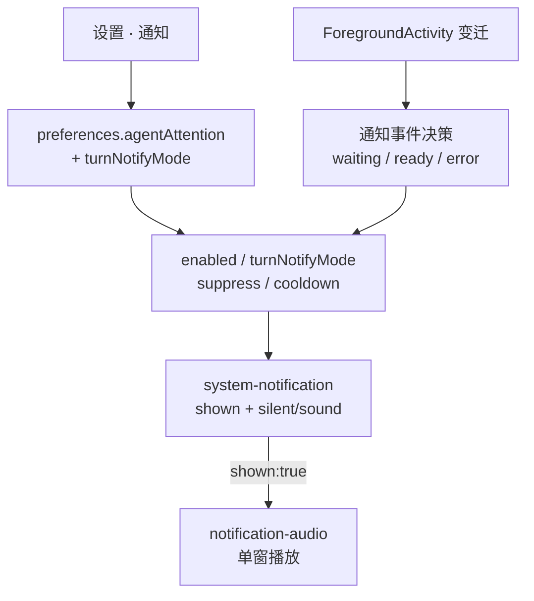

# 智能体通知事件矩阵产品设计

> 日期：2026-07-19  
> 状态：**已实现（待手工验收）**  
> 前置：  
> - [`2026-07-16-agent-attention-settings-and-status-accuracy-design.md`](./2026-07-16-agent-attention-settings-and-status-accuracy-design.md)  
> - [`2026-07-19-attention-notification-sound-design.md`](./2026-07-19-attention-notification-sound-design.md)（提示音管线；本设计**废止**其中「完成音不做 / 完成音另开产品」边界）  
> 金标准：本机 Codex App（`/Applications/ChatGPT.app`，bundle `com.openai.codex`）桌面通知实现  
> 用户拍板：方案包 **B · Codex 对齐 · 全事件可配置**（§1–§4 分段确认通过）

## 1. 目标与完成标准

### 1.1 一句话定位

把 Pier 的系统通知从「仅需要你处理」扩成 **三类用户可配置事件**——需要你处理、回合完成、出错——默认行为对齐 Codex App；提示音继续走既有 Attention 声音决策，且**只在系统通知真正展示后**播放。

### 1.2 要解决的问题

1. **产品缺口**：旧 Pier 设计明确「不含完成音」；用户真实诉求是回合结束后也要可感知提醒（球回到用户手里）。  
2. **误诊风险**：设置页「发送测试通知」已有横幅+声音时，业务路径仍静默——常被当成声音坏了，实则触发面未覆盖 `ready`。  
3. **死开关**：`enableErrorAttention` 对 omp / codex 实际无效（适配器未映射 FA `error`）。  
4. **设置偷懒禁止**：不可只塞一个总开关糊弄；三类事件必须各自可配。

### 1.3 完成标准

| 闭环 | 名称 | 通过标准摘要 | 证明方式 |
| --- | --- | --- | --- |
| Ev1 | 需要你处理 | `enabled=true` 时进入 `waiting` 可通知；目标 panel 聚焦且 `suppressWhenFocused=true` 时抑制 | 单测 + 手工（强制进入需要你处理） |
| Ev2 | 回合完成 | `turnNotifyMode=unfocused`（默认）：未聚焦时 FA `* → ready` 发通知+按声音策略出声；聚焦时不发 | 单测 + 手工 |
| Ev3 | 回合三档 | `off` 永不发；`always` 即使聚焦也发 | 单测 |
| Ev4 | 出错 | `enableErrorAttention=false` 默认不发；为 true 时进入 `error` 发通知 | 单测 |
| Ev5 | 出错可达 | omp / codex（至少 Top A 相关适配器）有真实原生失败 → FA `error` 映射；开开关后能走到通知 | 映射测 + 手工 |
| Ev6 | 提示音跟随 | 任一事件仅在 `shown:true` 后按 `soundEnabled`/`soundId` 决策；未 shown 不播应用音 | 既有声音测扩展 |
| Ev7 | 迁移 | 旧磁盘无 `turnNotifyMode` 时 default=`unfocused`；其它 preferences 键不被 wipe | preferences 集成测 |
| Ev8 | 设置页 | 三类策略分块可见、文案无实现词；保存失败用户可见 | 组件/治理测 + 手工 |

### 1.4 边界

**做：**

- 事件：`waiting`（需要你处理）、`ready`（回合完成）、`error`（出错，可选）。  
- 偏好：新增 `turnNotifyMode`；保留并继续使用 `enabled` / `enableErrorAttention` / `suppressWhenFocused` / `cooldownMs` / `soundEnabled` / `soundId`。  
- 设置页：通知策略分三组 + 共用提示音块。  
- 声音：复用 `decideNotificationAudio` + 单窗 `ATTENTION_SOUND_PLAY`；darwin 品牌 OS 音 staging 为**可选增强**，失败回退 `sound: "default"`。  
- 适配器：修 omp / codex 的 FA `error` 可达性（本切片内）。

**不做：**

- 音量滑条、自定义音频文件、按事件分音色。  
- 通知历史 inbox、终端 BEL、任务 toast 专用通道。  
- 把 `suppressWhenFocused` 再拆成 per-event 三档（§2 已否决）。  
- 本切片**强制**落地 Group Container 品牌 wav（§3 定为可选增强，非门禁）。

---

## 2. 竞品证据（Codex App）与现状对照

### 2.1 Codex App（本机 asar 实据）

| 设置键 | 语义 | 默认 |
| --- | --- | --- |
| `notifications-turn-mode` | 回合完成通知：`off` \| `unfocused` \| `always` | `unfocused` |
| `notifications-permissions-enabled` | 权限/需要你处理通知 | `true` |
| `notifications-questions-enabled` | 提问类通知 | `true` |

通知 kind：`turn-complete` / `permission` / `question`。

声音：打包 `codex-notification.wav`；darwin 可 stage 到 Group Container `Library/Sounds`；`Notification({ silent:false, sound:"codex-notification" })`。

抑制：`turnMode=unfocused` 且主窗 `isFocused()` → 抑制回合完成；权限类在会话已聚焦时抑制。

### 2.2 Pier 现状

| 维度 | 现状 |
| --- | --- |
| 触发集 | 仅 `waiting`；`error` 仅当 `enableErrorAttention`；**不含** `ready` |
| 设置 | `enabled` / `enableErrorAttention` / `suppressWhenFocused` / `cooldownMs` / `soundEnabled` / `soundId` |
| 声音管线 | 已实现；测试通知可验证健康 |
| omp/codex → `error` | 无原生失败映射 → 「出错时通知」对这两家无效 |
| 旧设计文案 | 2026-07-19 提示音设计写明「完成音不做」——**本文件废止该边界** |

---

## 3. 触发矩阵（已确认）

ForegroundActivity 仍是唯一状态源。Attention（或其后继通知编排）观察 FA 变迁。

### 3.1 事件定义

| 产品名 | FA 条件 | 设置项 | 默认 |
| --- | --- | --- | --- |
| 需要你处理 | 进入 `waiting`（沿用现网「进入触发集」边沿；waiting↔error 同属注意力触发时不互相重复刷） | `enabled` + `suppressWhenFocused` | 开；聚焦目标 panel 抑制 |
| 回合完成 | 已知非 `ready` 状态 → `ready`（进程仍在、回合结束、等用户下一输入）。`previous` 缺席（面板首次投影：SessionStart 揭示 / boot 重连，FA 新建层初始即 ready）**不算**回合完成，不通知 | `turnNotifyMode` | `unfocused` |
| 出错 | 进入 `error`（且 `enableErrorAttention`） | `enableErrorAttention` | 关 |

说明：

- **回合完成与「需要你处理」解耦**：`ready` 不再被旧「触发集 T 只含 waiting/error」排除。  
- **冷却**：`cooldownMs` 按 `(agentRef, 事件类)` 分开记——「需要你处理」通知不吞随后的「回合完成」，连续短回合的 ready 之间才互相受冷却约束；测试通知仍 exempt。  
- **Index / 标题栏「需要你处理」计数**：仍只计 waiting/error，**不**因回合完成通知而把 ready 算进「需要你处理」。

### 3.2 聚焦抑制

| 事件 | 规则 |
| --- | --- |
| 需要你处理 / 出错 | 保持现网：`suppressWhenFocused` 看**目标 panel**是否聚焦 |
| 回合完成 | `off`：不发；`unfocused`：拥有该智能体面板的窗口聚焦则不发（对齐 Codex 主窗 `isFocused` 语义，实施计划钉死具体判定）；`always`：不因聚焦抑制 |

---

## 4. 偏好与设置页（已确认）

### 4.1 Schema 增量

在 `src/shared/contracts/agent-attention.ts`：

```ts
turnNotifyMode: z.enum(["off", "unfocused", "always"]).default("unfocused");
```

`DEFAULT_AGENT_ATTENTION_SETTINGS.turnNotifyMode = "unfocused"`。

旧磁盘对象缺字段时 zod `.default` 合并；**禁止**整表 preferences 重置。仍整键提交 `agentAttention`；`PATCHABLE_KEYS` 已含该键。

### 4.2 设置页结构（通知）

1. **需要你处理**：`enabled`；说明「智能体在等你确认或继续时」。共用下方「专注时抑制」。  
2. **回合完成**：`turnNotifyMode` 三选一——从不 / 仅窗口未聚焦时 / 始终。  
3. **出错**：`enableErrorAttention`。  
4. **共用**：`suppressWhenFocused`（文案写明主要作用于需要你处理与出错）、`cooldownMs`、提示音块（`soundEnabled` / `soundId` / 试听）、测试通知与打开系统设置。

文案纪律遵循 `AGENTS.md`：禁止「选区 / 上下文 / Agent / Needs you」等实现词；产品词用「智能体」「需要你处理」。

---

## 5. 声音架构（已确认）

复用既有闭环，事件扩展不另起播音所有者：

```text
事件决策 → showSystemNotification({ silent, sound? })
  → shown:true → decideNotificationAudio → maybePlayAfterShown
  → 单窗 ATTENTION_SOUND_PLAY → HTMLAudio（内置 id）
```

| `soundEnabled` | `soundId` | OS | 应用音 |
| --- | --- | --- | --- |
| false | * | silent | 否 |
| true | system | 有声；darwin `sound:"default"`（可选增强：品牌 wav staging） | 否 |
| true | 内置 | silent | 单窗一记 |

三类事件**共用**同一音色；不按事件分音色。

可选增强（非 Ev* 门禁）：darwin 将品牌 wav stage 到可被 `Notification.sound` 引用的 Sounds 目录；失败则保持 `default`。

---

## 6. 出错可达性（本切片必做）

依据 [`2026-07-13-agent-status-adapter-contract-audit.md`](./2026-07-13-agent-status-adapter-contract-audit.md)：omp / codex 当前无原生 → FA `error` 映射。

本切片要求：

1. 为 omp、codex（及同档已宣称支持 error 的适配器）补**真实**失败事件 → `error` 映射；禁止假数据仅测契约。  
2. 映射落地后，`enableErrorAttention=true` 时进入 `error` 必须能进入通知候选。  
3. 单测锁「有映射源」；无原生失败语义的 provider 须在审计表标明「不支持 error」，不得假装 Ev5 通过。

---

## 7. 架构与数据流



实现落点（指导计划，非本阶段改码）：

- `attention-service.ts`：拆开 waiting/error 触发与 ready 完成路径（或等价清晰分支）。  
- `agent-attention.ts`：schema + 默认值。  
- `notifications-section.tsx`：三组策略 UI。  
- 适配器目录：omp / codex error 映射。  
- 单测：矩阵 × 聚焦 × 迁移 × 声音跟随 shown。

---

## 8. 验收清单（手工）

1. 设置「发送测试通知」：横幅 + 当前声音策略仍通过。  
2. 强制智能体进入「需要你处理」：未聚焦 → 通知；聚焦目标 panel 且抑制开 → 无通知。  
3. `turnNotifyMode=unfocused`：跑完一回合变 ready，窗口未聚焦 → 有通知；聚焦 → 无。  
4. `turnNotifyMode=always`：聚焦也有。  
5. `turnNotifyMode=off`：ready 静默。  
6. 打开「出错时通知」+ 可映射失败：有通知；默认关：无。  
7. 关提示音：可有横幅、无声。

---

## 9. 对旧文档的废止声明

| 旧表述 | 处理 |
| --- | --- |
| 2026-07-19 提示音设计：「完成音不做 / 另开产品」 | **废止**；完成通知+声音由本设计覆盖 |
| 2026-07-16 注意力设计：「不含完成通知」范围句 | 被本设计**叠加扩展**；waiting/error 策略仍有效 |
| 提示音管线（防双响、单窗、spacing、跟随 shown） | **保留**，本设计复用 |

---

## 10. 开放实现细节（计划阶段钉死，不阻塞本设计）

1. 「窗口聚焦」判定：Codex 用 primary window `isFocused()`；Pier 应对齐「拥有该智能体面板的 BrowserWindow」——实施计划须选一并写单测。  
2. `ready` 抖动：短时 `ready→processing→ready` 是否依赖既有 `cooldownMs` 足够；若不够，计划可加更严边沿，但默认先用冷却。  
3. 品牌 OS 音 staging 路径与打包资源名：属可选增强，另开任务或计划附录。
