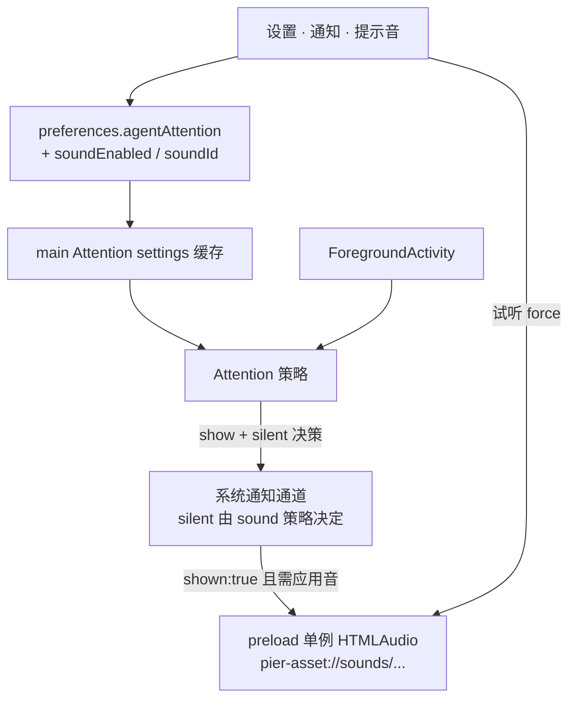

# Agent Attention 提示音产品设计

> 日期：2026-07-19  
> 状态：**待实施（审查修订）**  
> 前置：[`2026-07-16-agent-attention-settings-and-status-accuracy-design.md`](./2026-07-16-agent-attention-settings-and-status-accuracy-design.md)（注意力策略与系统通知通道已落地）  
> 参照：Orca（Electron：自定义音时静音系统通知 + preload `HTMLAudioElement`）；Vibe Kanban（开关 + 内置音色 + 试听；触发挂在 notify 成功路径）  
> 审查：2026-07-19 产品 / Electron 架构 / 竞品 / 无障碍·可靠性 四方并行审查 → **approve-with-changes**；本修订吸收全部 P0 与约定 P1  
> 范围：仅「需要你处理」注意力提示音；**不含**完成音、终端响铃、音量滑条、自定义音频文件、通知历史
>
> **废止说明（2026-07-19）**：其中「不含完成音 / 完成音另开产品」已被 [`2026-07-19-agent-notification-events-design.md`](./2026-07-19-agent-notification-events-design.md) 废止并覆盖；本文件其余提示音管线（防双响、单窗、跟随 shown）仍然有效。

## 1. 目标与完成标准

### 1.1 一句话定位

在 **Attention 已能向 OS 投递系统通知** 的前提下，补上**应用可控的提示音**：用户可选系统默认音或内置短音；门控、冷却、聚焦抑制与现有注意力策略完全一致，升级后默认行为与今天相同。

### 1.2 要解决的问题

1. 今天只有 `Notification({ silent: false })` 的系统默认音，无法换音色、无法在「关提示音」时真正静音。  
2. 先前注意力设计明确把「声音库」列为非目标；本设计在**不扩大触发面**的前提下补齐可控音。  
3. 若自定义音与系统音同时响，会双响（Vibe Kanban 在 sound+push 同开时可见）；必须在架构上钉死防双响。

### 1.3 完成标准

| 闭环 | 名称 | 通过标准摘要 | 证明方式 |
| --- | --- | --- | --- |
| Snd1 | 默认无回归 | 默认 `soundEnabled=true` 且 `soundId=system`：行为与现网一致（OS 出声、应用不另播）；**darwin 须 `sound: "default"`** | 单测 silent/sound 决策 + 手工 |
| Snd2 | 内置音 | 选内置 id 后，真正 `shown:true` 时**仅一个**窗口播对应资源；OS 通知 `silent:true` | 单测 + 手工（含多窗） |
| Snd3 | 关提示音 | `soundEnabled=false`：应用不播，且 OS 通知 silent；横幅策略仍由 `enabled` 等决定 | 单测 |
| Snd4 | 跟随系统通知 | 未 `shown`（disabled / focused / cooldown / denied / unsupported）**永不**播应用音 | 单测挂在 shown 之后 |
| Snd5 | 测试通知 | 与 Attention **同一** silent/play 决策所有者；不记 agent 冷却 | 单测 + 手工 |
| Snd6 | 试听 | 仅内置 id 可试听；`system` 禁用试听并引导「发送测试通知」 | 手工 |
| Snd7 | 持久化 | 旧四字段磁盘 `agentAttention` **不整表重置**；新字段 default 合并 | preferences 集成测（强制） |
| Snd8 | 资源可达 | dev/prod 路径 + **`media-src pier-asset:` CSP** + 白名单协议 | 路径/CSP 单测 + 打包抽检 |
| Snd9 | 单次可闻 | 一次成功投递最多一记应用音（多窗不叠；全局 spacing） | 单测 play 端口调用次数 |

### 1.4 边界

**做：**

- 触发：仅 Agent Attention 成功投递（进入 `waiting`；`error` 仅当 `enableErrorAttention`）。  
- 播音：preload / renderer 单例 `HTMLAudioElement`。  
- 设置：开关 + 音色（`system` + 内置若干）+ 试听；并入通知设置页与 `preferences.agentAttention`。  
- 防双响：见 §4.3。

**不做：**

- 智能体运行结束 / 任务 toast / 终端 BEL 提示音。  
- 音量滑条、自定义音频文件、按项目规则、第二套 error 专用音色。  
- OS 权限拒绝时的「仅声音兜底」（本设计明确**跟随系统通知**）。  
- 插件通用 `playSound` API、通知历史 inbox。  
- 主窗口不存在时的后台播音保证（桌面常驻可接受；不为此上 main 进程 CLI 播放器）。

### 1.5 产品决策摘要（已确认 + 审查锁定）

| 决策点 | 结论 |
| --- | --- |
| 触发面 | 仅「需要你处理」（Attention） |
| 与 OS 关系 | 跟随系统通知：仅 `shown:true` 后考虑应用音；**拒绝** VK 式「push 失败仍独立播音」 |
| 设置深度 | Vibe Kanban 精简：开关 + 音色 + 试听；无音量 / 无自定义文件 |
| 播音架构 | Renderer HTMLAudio（Orca 路径）；**单窗播放所有者**（见 §4.4） |
| 默认 | `soundEnabled: true`, `soundId: "system"` |
| Focus/DND | v1 **接受**：内置 HTMLAudio 可能不遵循通知级 Focus 静音；默认 `system` 走 OS 礼仪；设置辅助说明；不探测 OS Focus API |
| 完成音 | 另开产品，不属本切片缺口 |

---

## 2. 分层架构



| 层 | 做 | 不做 |
| --- | --- | --- |
| `agentAttention` 设置 | 扩展两字段；整键替换；广播缓存 | 新建平行 preferences 域 |
| `showSystemNotification` | 接受 `silent`（或等价选项）；默认保持今日语义 | 在通道内直接播文件 |
| Attention 投递 | `shown:true` 后按策略请求播音 | 在 skip 分支播音 |
| preload 播音 | 解析内置 id → `pier-asset` URL；单例 Audio；飞行中去重 | 业务判断冷却/聚焦 |
| `pier-asset` | 扩展 `sounds/*` 宿主与 MIME | 任意用户路径（本迭代无自定义文件） |

---

## 3. 设置信息架构

### 3.1 位置与层级

沿用 `Settings → 通知`（`NotificationsSection`）。在策略 `FieldSet` **冷却之后**增加「提示音」**子组**（视觉分组：小标题或 `FieldLegend`），不新开顶级分区。

**层级文案（强制）**：提示音从属于系统通知成功展示——用户可见描述须等价于「需要你处理且系统通知成功展示时播放」。`enabled=false` 或权限 `denied`/`unsupported` 时：提示音控件仍可编辑（避免丢选择），但子组附简短注解指向既有权限/总开关 banner，**不暗示独立声道**。标题栏 Needs you / Index 仍是无 OS 权限时的真相面。

### 3.2 控件

| 控件 | 绑定 | 说明 |
| --- | --- | --- |
| 提示音开关 | `soundEnabled` | 关：应用不播 + OS silent（横幅仍由 `enabled` 决定） |
| 音色选择 | `soundId` | `system` + **至多 4 个**内置 id；显示**人类可读名**（locale），不直接甩 raw id；`soundEnabled=false` 时**仍可改** |
| 试听 | 当前 `soundId` | **仅内置 id 可点**（`force` 播，且**不**要求 `soundEnabled`）。**`system`：禁用按钮** + 静态说明「系统默认音无法在应用内试听，请用下方「发送测试通知」」。禁止对 `system` 再弹重复 toast |
| 发送测试通知 | 既有 Diagnostics | **完整验证**：横幅 + 当前 sound 策略 + 权限探测；文案与试听分工写清 |

### 3.3 文案纪律

- 面向用户：提示音 / 系统默认 / 试听所选应用音效 / 发送测试通知；禁止实现词。  
- i18n：`settings.notifications.sound*`；音色名中英同步。  
- 辅助一句：内置音在应用内播放，**不一定**遵循系统专注模式对通知提示音的全部抑制；系统默认音跟随系统。  
- 保存失败：既有 `patchAttention` 路径；禁止 silent catch。  
- **禁止**把 `prefers-reduced-motion` 或其它视觉无障碍开关绑到静音；静音轴只有 `soundEnabled` + OS 通知/专注设置。

### 3.4 不做的设置项

音量、自定义文件、按事件分音色、完成音、响铃、历史、自动绑定系统 Focus API。

---

## 4. 数据契约与运行时

### 4.1 设置扩展

`src/shared/contracts/agent-attention.ts`：

```ts
/** v1：system + 至多 4 个内置；显示名走 locale，不暴露 id 原文案 */
export const ATTENTION_SOUND_IDS = [
  "system",
  "soft",
  "clear",
  "bright",
  "bell",
] as const;

export type AttentionSoundId = (typeof ATTENTION_SOUND_IDS)[number];

export const agentAttentionSettingsSchema = z
  .object({
    enabled: z.boolean(),
    enableErrorAttention: z.boolean(),
    suppressWhenFocused: z.boolean(),
    cooldownMs: z.union([
      z.literal(60_000),
      z.literal(180_000),
      z.literal(600_000),
    ]),
    /** 缺省 true：旧磁盘四字段对象升级时补齐，禁止整表 preferences 重置 */
    soundEnabled: z.boolean().default(true),
    soundId: z.enum(ATTENTION_SOUND_IDS).default("system"),
  })
  .strict();

export const DEFAULT_AGENT_ATTENTION_SETTINGS = {
  enabled: true,
  enableErrorAttention: false,
  suppressWhenFocused: true,
  cooldownMs: 180_000,
  soundEnabled: true,
  soundId: "system",
} as const;
```

约束（**迁移 P0**）：

- 今日线上 `agentAttention` 仅四字段；`projectPreferencesSchema` 只在**缺整键**时 default 对象。  
- 新字段**必须**在嵌套 schema 上 `.default(...)`（或等价 preprocess merge `DEFAULT_AGENT_ATTENTION_SETTINGS`）。  
- **禁止**「缺 sound* → `ensureStore` 整份 preferences 回默认」——单测必须用「仅四字段的 agentAttention 快照」证明其它键保留且 sound 补齐。  
- 非法 `soundId`：按现网 preferences 严格度处理；优先回落 `system` 而非炸整表。  
- 仍整键提交 `agentAttention`；`PATCHABLE_KEYS` 已含该键。

### 4.2 静音 / 系统音决策（唯一表）

对每一次 **Attention / 测试通知** 调用 `showSystemNotification`：

| `soundEnabled` | `soundId` | OS `silent` | OS `sound`（darwin） | 应用播音（仅 `shown:true`） |
| --- | --- | --- | --- | --- |
| `true` | `system` | `false` | `"default"`（**必填**，防 macOS 无声回归） | 否 |
| `true` | 内置 id | `true` | 省略 | 是，该 id |
| `false` | * | `true` | 省略 | 否 |

非 darwin：`system` 路径 `silent:false`，不传自定义 sound 名。  
非 Attention 的其它 `showSystemNotification` 调用方：**本迭代不改默认**（保持今日 `silent:false`）；提示音策略只绑定 Attention 与测试通知。

纯函数（单测友好）：

```ts
function decideNotificationAudio(settings: AgentAttentionSettings): {
  silent: boolean;
  sound?: "default"; // only when system + soundEnabled on darwin caller
  appSoundId: Exclude<AttentionSoundId, "system"> | null;
}
```

### 4.3 防双响与防刷屏

1. 内置音：OS `silent: true`。  
2. `soundEnabled: false`：OS `silent: true`（关提示音 ≠ 关横幅）。  
3. 应用音**只**在 `result.shown === true` 之后；`shown: false` 不播。  
4. 试听不走 OS。  
5. **单窗所有者（P0）**：main **不得** `broadcastToAllWindows` 让每个 renderer 各播一次。锁定：  
   - 选 **一个** 目标窗：优先当前 focused Pier 窗，否则 LRU/主窗/任意一个 live 窗；  
   - 仅向该窗 `webContents.send`（或等价单播）；无窗 = no-op。  
   - 单测/契约：一次投递 play 端口调用次数 ≤ 1。  
6. 飞行中去重（单 renderer 内）：重叠 `play` 丢弃后来者；试听 `force` 可打断重播。  
7. **全局 spacing（P1）**：main 在单播前维护进程级 `lastAttentionAppSoundAt`；默认间隔 **1000ms**（常量可调 750–1500）。间隔内后续业务应用音跳过（横幅仍按 Attention 规则）。试听 **exempt**；测试通知 **exempt**（用户主动验证）。  
8. 多 agent 同时进入 Needs you：允许声音合并（一记音 + 标题栏计数↑）——**有意行为**，chrome 计数仍是真相。

### 4.4 播音管道

```text
1. Attention 决策序不变（enabled → 触发矩阵 → suppress → cooldown → show）
2. audio = decideNotificationAudio(settings)
3. showSystemNotification(request, { silent: audio.silent, sound: audio.sound, ... })
4. if !result.shown → stop
5. if audio.appSoundId == null → stop
6. if !withinGlobalSoundSpacing && !force → stop (业务路径)
7. sendToSingleWindow(play, { soundId: audio.appSoundId })
```

实现要点：

- **所有权**：`decideNotificationAudio` + `maybePlayAfterShown` 由 **Attention IPC 层与测试通知 IPC 共享**（抽 `attention-notification-audio.ts` 之类纯模块 + 单例 spacing 状态），**不要**塞进 `showSystemNotification` 通道内部。  
- **Attention `showNotification` 端口**：扩展为可传 `silent`/`sound`（options 袋或预绑定 wrapper）。今日端口仅 `(request) => result`，不扩展则 silent 会钉死 `false`。  
- **测试通知所有者**：`SYSTEM_NOTIFICATION_TEST` 路径必须读**同一** Attention settings 缓存（或共享 reader），apply 同一 decide，并在 `shown:true` 后走同一 `maybePlay`（spacing exempt）。禁止测试 IPC 自己 hardcode `silent:false`。  
- **播放器**：目标窗 renderer 内单例 `HTMLAudioElement`；`src = pier-asset://sounds/<file>`；`loop=false`；`currentTime=0`；`volume=1`。  
- **autoplay（P1）**：窗口 `webPreferences.autoplayPolicy = "no-user-gesture-required"`（桌面壳、本地可信 UI；注释写明仅为此类提示音）。否则无手势的 Attention 播音在后台窗可能 `NotAllowedError`。  
- **失败**：业务路径仅日志（字段见下）；**禁止**失败后把 OS 再 unsilence（防双响竞态）。试听 / 测试通知：短 `toast.error` 或详情 `showAppAlert`。  
- **日志红线**：可含 `soundId`、`force`、error name；**禁止** title/body、`agentRef`、cwd/worktree、绝对路径。  
- 禁止 `executeJavaScript` 播音。

### 4.5 试听与测试通知

| 动作 | OS 通知 | 应用音 | 冷却 / spacing |
| --- | --- | --- | --- |
| 试听（内置） | 否 | `force` 播；与 `soundEnabled` 无关 | 不记；spacing exempt |
| 试听（system） | 否 | **不播**；按钮 disabled + 静态引导测试通知 | — |
| 发送测试通知 | 是（forceProbe） | §4.2；`shown:true` 后 | 不记 agent 冷却；spacing exempt |

**forceProbe 乐观 shown**：测试路径在 settle 超时仍可能 `shown:true` 而横幅未现。v1 **接受**测试路径在此条件下仍可尝试应用音（用户主动点测试）；业务 Attention 路径继续严格依赖真实投递结果。在 §6 与手工说明中写明。

### 4.6 资源、协议与 CSP

物理布局：

```text
resources/notification-sounds/
  soft.mp3    # 全库统一容器；单段 ≤1s 目标，硬顶 <3s；禁止 loop
  clear.mp3
  bright.mp3
  bell.mp3
electron-builder.yml extraResources:
  - from: resources/notification-sounds
    to: notification-sounds
```

路径 helper：**独立** `soundAssetRootDir()`（或按 host 分支），**禁止**复用 `assetRootDir()`（其恒指向 `fonts/`）。

- dev: `join(process.cwd(), "resources/notification-sounds")`  
- prod: `join(process.resourcesPath, "notification-sounds")`

`pier-asset` handler：

- 保留 `fonts` + `.ttf`  
- 增 `host === "sounds"` + 允许扩展名 + **catalog 文件名白名单**  
- MIME：`audio/mpeg` 或 `audio/wav`  
- 可缓存 Buffer  

**CSP（P0）**：`src/main/csp.ts` 增加 `media-src 'self' pier-asset:`（dev/prod 均需；fonts 仍只在 `font-src`）。无此则 HTMLAudio 加载自定义协议会被 default-src 挡住，Snd2/5/6/8 全假绿。

Catalog（shared）：`soundId → 文件名`；`system` 无文件。资产许可写入 `NOTICE`。

### 4.7 系统通知 API 形状

```ts
// ShowSystemNotificationOptions
silent?: boolean; // 缺省 false
sound?: string;   // darwin system 路径传 "default"；其它省略
```

`new Notification({ ..., silent, ...(sound ? { sound } : {}) })`。

### 4.8 Attention 决策序（补丁）

```text
5. audio = decideNotificationAudio(settings)
   show(..., { silent: audio.silent, sound: audio.sound })
6. shown:true → lastNotified + probe authorized
   + maybePlayAfterShown(audio)  // 单窗 + spacing
   shown:false → 不记冷却；不播音；更新 probe
```

`settings()` 仍同步读 main 缓存；含新字段。

---

## 5. 反馈通道（相对 2026-07-16 §5 的增量）

| 事件 | 系统通知 | 应用提示音 | 标题栏 / Index |
| --- | --- | --- | --- |
| 进入 waiting，策略允许且 shown，sound=system | 是（OS 音；darwin `sound:default`） | 否 | Needs you |
| 同上，sound=内置 | 是（silent） | **单窗**一记（受 spacing） | Needs you |
| 同上，soundEnabled=false | 是（silent） | 否 | Needs you |
| 多 agent 同时进入 | 各按策略 | 可能合并为一记 | 计数为真相 |
| focused / cooldown / disabled / 未 shown | 否 | **否** | 按原规则 |
| 完成 / toast / BEL | 否 | **否**（非目标） | — |
| 试听内置 / 测试通知 | 见 §4.5 | 见 §4.5 | — |

操作反馈：设置保存沿用注意力规范；试听/测试通知的播音失败须用户可见；业务 Attention 播音失败仅日志。

---

## 6. 风险、伦理与非目标

| 风险 | 处理 |
| --- | --- |
| 双响 | §4.2 表 + 失败不 unsilence |
| 多窗 N 响 | §4.3 单窗所有者（P0） |
| 旧 preferences 整表重置 | 嵌套 `.default` + 四字段快照单测（P0） |
| CSP 挡音频 | `media-src pier-asset:`（P0） |
| 复用 fonts 根目录 404 | 独立 `soundAssetRootDir()` |
| macOS system 无声 | darwin `sound:"default"` |
| 内置音绕过 Focus/DND | v1 **文档化接受**；默认 system；设置辅助说明；不探测 Focus API |
| 无窗不播 | 接受；不上 afplay |
| autoplay 拒绝 | `autoplayPolicy: no-user-gesture-required` |
| 多 agent 音刷 | per-agent 冷却 + 全局 1s spacing + 飞行去重 |
| 长音频 / 无障碍 1.4.2 | 单段 &lt;3s（目标 ≤1s）、禁止 loop |
| 日志 PII | 仅 soundId / error name |
| VK「denied 仍播」 | **永不**：与跟随 shown 冲突；标题栏为真相 |
| 完成音诉求 | 另开设计，非本切片缺口 |
| `prefers-reduced-motion` 误绑静音 | 禁止；静音轴 = soundEnabled |
| forceProbe 乐观 shown | 测试路径接受；业务路径不放宽 |
| 音源版权 | NOTICE |
| `pier-asset` 读任意文件 | host + 扩展名 + catalog 白名单 |

---

## 7. 测试计划

### 7.1 单测（优先）

1. `decideNotificationAudio`：§4.2 全表（含 darwin `sound:default` 分支可注入 platform）。  
2. Attention：`shown:true` + 内置 → play **一次**；`shown:false` / cooldown / focused → 零次。  
3. `soundEnabled:false` + shown → silent true、play 零次。  
4. **多窗**：mock 多 webContents 时 send 目标仅一个。  
5. **spacing**：连续 N 次 shown 业务播音，间隔内 ≤1 次 play。  
6. **preferences 迁移 P0**：磁盘四字段 `agentAttention` parse 后补 sound 默认，且其它 preferences 键不被 wipe。  
7. CSP 构建串含 `media-src` + `pier-asset:`。  
8. catalog：非 system id ↔ 文件名；可选 fs 存在性。  
9. resolve 纯函数：非法 host/路径拒绝；不得 join 到 fonts 根。

### 7.2 手工

1. 默认 system：waiting → 仅系统音（确认 macOS 有声）。  
2. 内置音：单窗一记、无双响；开第二窗再触发仍一记。  
3. 关提示音：有横幅无声。  
4. 聚焦抑制 / 冷却：无横幅无声。  
5. 试听：内置可听；system 按钮 disabled。  
6. 测试通知：完整路径与当前策略一致。  
7. macOS 专注模式：system vs 内置听感差异符合说明。  
8. 中英文设置文案与层级说明。

### 7.3 回归

既有 Attention N1–N9、权限探针、click focus；非 Attention 系统通知 silent 默认不变。

---

## 8. 实施切片（给计划用）

1. **契约与迁移**：schema `.default`、locale、四字段升级测。  
2. **资源 / 协议 / CSP**：sounds 目录、`soundAssetRootDir`、`pier-asset` sounds、`media-src`、extraResources、NOTICE。  
3. **decide + silent/sound API**：`showSystemNotification` options；纯函数单测。  
4. **单窗 play + spacing + autoplayPolicy**：共享 maybePlay；Attention 端口扩展。  
5. **测试通知接线**：同一 settings 缓存与 decide/play。  
6. **设置 UI**：子组层级、开关、Select、试听 disabled 规则、文案。  
7. **验收**：§7 全表。

文件行数硬顶 500；`notifications-section.tsx` / `system-notification.ts` 已近软顶——提示音 UI 与音频决策宜新文件，避免继续膨胀。

---

## 9. 审查结论（是否金标准）

| 维度 | 结论 |
| --- | --- |
| 产品触发面 / 跟随 shown / 防双响 / 默认 system | **金标准**（对齐 Orca，优于 VK 双通道） |
| 设置深度（无音量/自定义文件） | **正确克制** |
| 完成音不做 | **正确**（Pier 金标准是可行动注意力，不是任务收件箱） |
| 初稿多窗广播 / 无 CSP / 迁移不严 / system 试听 toast | **未达标** → 本修订已锁 |
| Focus 绕过 | **有意 v1 折中**（默认 system；文档化） |

修订后可作为实施基线；未吸收本修订不得开工。

---

## 10. 修订记录

| 日期 | 说明 |
| --- | --- |
| 2026-07-19 | 初稿 |
| 2026-07-19 | 四方审查修订：单窗 play、CSP media-src、schema 迁移、darwin sound default、试听 IA、spacing、autoplay、catalog≤4、Focus 伦理说明、测试通知所有权 |

## 11. 参考

- [2026-07-16 Agent 注意力设置与状态准确性](./2026-07-16-agent-attention-settings-and-status-accuracy-design.md)  
- [2026-07-15 Agent Runtime Index 与 Attention](./2026-07-15-agent-runtime-index-and-attention-design.md)  
- Orca：自定义音 ⇒ native silent + HTMLAudio；delivered 后播；darwin `sound:default`  
- Vibe Kanban：lite 设置；**不要**独立于 push 的 afplay  
- Pier：`resources/fonts` + `pier-asset` + `extraResources`；`src/main/csp.ts`  
- [AGENTS.md](../../../AGENTS.md)  

