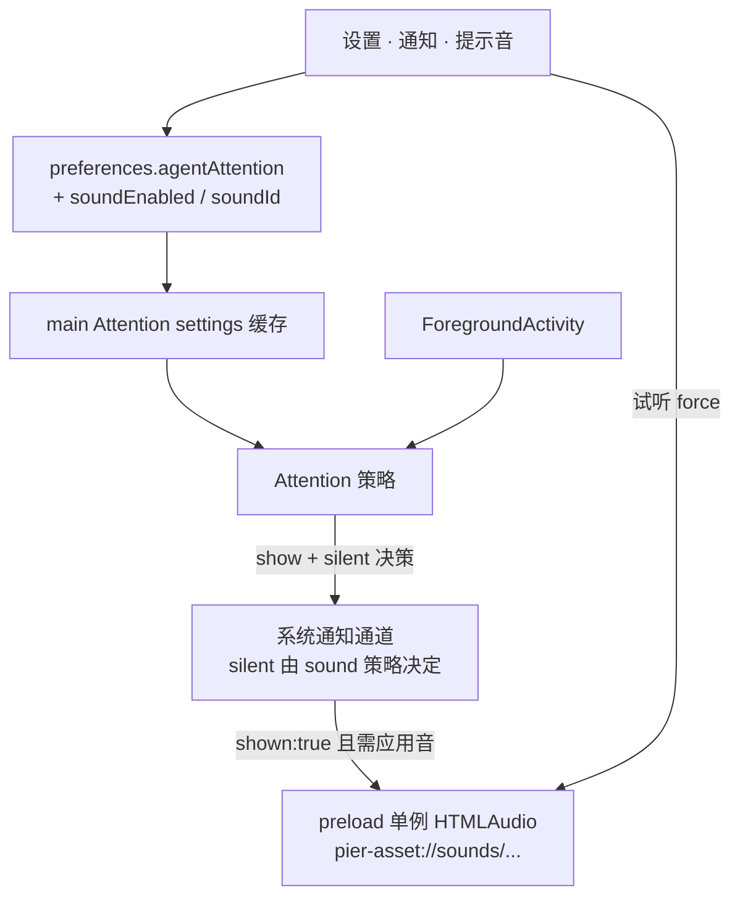

# Agent Attention 提示音产品设计

> 日期：2026-07-19  
> 状态：**待实施**  
> 前置：[`2026-07-16-agent-attention-settings-and-status-accuracy-design.md`](./2026-07-16-agent-attention-settings-and-status-accuracy-design.md)（注意力策略与系统通知通道已落地）  
> 参照：Orca（Electron：自定义音时静音系统通知 + preload `HTMLAudioElement`）；Vibe Kanban（开关 + 内置音色 + 试听；触发挂在 notify 成功路径）  
> 范围：仅「需要你处理」注意力提示音；**不含**完成音、终端响铃、音量滑条、自定义音频文件、通知历史

## 1. 目标与完成标准

### 1.1 一句话定位

在 **Attention 已能向 OS 投递系统通知** 的前提下，补上**应用可控的提示音**：用户可选系统默认音或内置短音；门控、冷却、聚焦抑制与现有注意力策略完全一致，升级后默认行为与今天相同。

### 1.2 要解决的问题

1. 今天只有 `Notification({ silent: false })` 的系统默认音，无法换音色、无法在「关提示音」时真正静音。  
2. 先前注意力设计明确把「声音库」列为非目标；本设计在**不扩大触发面**的前提下补齐可控音。  
3. 若自定义音与系统音同时响，会双响（Vibe Kanban 在 sound+push 同开时可见）；必须在架构上钉死防双响。

### 1.3 完成标准

| 闭环 | 名称 | 通过标准摘要 | 证明方式 |
| --- | --- | --- | --- |
| Snd1 | 默认无回归 | 默认 `soundEnabled=true` 且 `soundId=system`：行为与现网一致（OS 出声、应用不另播） | 单测 silent 决策 + 手工 |
| Snd2 | 内置音 | 选内置 id 后，真正 `shown:true` 时应用播对应资源；OS 通知 `silent:true` | 单测 + 手工 |
| Snd3 | 关提示音 | `soundEnabled=false`：应用不播，且 OS 通知 silent；横幅策略仍由 `enabled` 等决定 | 单测 |
| Snd4 | 跟随系统通知 | 未 `shown`（disabled / focused / cooldown / denied / unsupported）**永不**播应用音 | 单测挂在 shown 之后 |
| Snd5 | 测试通知 | 设置「发送测试通知」按当前 sound 策略出声；不记 agent 冷却 | 单测 + 手工 |
| Snd6 | 试听 | 设置页试听只走应用播路径，不发 OS 通知、不记冷却 | 手工 + 可选单测 |
| Snd7 | 持久化 | `soundEnabled` / `soundId` 经 `agentAttention` 整键替换 + `PATCHABLE_KEYS`；即时生效 | preferences 集成测 + Attention 缓存测 |
| Snd8 | 资源可达 | dev（`resources/…`）与 prod（`extraResources` + `pier-asset`）均可加载内置音 | 路径单测 + 打包抽检 |

### 1.4 边界

**做：**

- 触发：仅 Agent Attention 成功投递（进入 `waiting`；`error` 仅当 `enableErrorAttention`）。  
- 播音：preload / renderer 单例 `HTMLAudioElement`。  
- 设置：开关 + 音色（`system` + 内置若干）+ 试听；并入通知设置页与 `preferences.agentAttention`。  
- 防双响：见 §4.3。

**不做：**

- 智能体运行结束 / 任务 toast / 终端 BEL 提示音。  
- 音量滑条、自定义音频文件、按项目规则、第二套 error 专用音色。  
- OS 权限拒绝时的「仅声音兜底」（本设计明确**跟随系统通知**）。  
- 插件通用 `playSound` API、通知历史 inbox。  
- 主窗口不存在时的后台播音保证（桌面常驻可接受；不为此上 main 进程 CLI 播放器）。

### 1.5 产品决策摘要（已确认）

| 决策点 | 结论 |
| --- | --- |
| 触发面 | 仅「需要你处理」（Attention） |
| 与 OS 关系 | 跟随系统通知：仅 `shown:true` 后考虑应用音 |
| 设置深度 | Vibe Kanban 精简：开关 + 音色 + 试听；无音量 / 无自定义文件 |
| 播音架构 | Renderer/preload HTMLAudio（Orca 路径） |
| 默认 | `soundEnabled: true`, `soundId: "system"` |

---

## 2. 分层架构



| 层 | 做 | 不做 |
| --- | --- | --- |
| `agentAttention` 设置 | 扩展两字段；整键替换；广播缓存 | 新建平行 preferences 域 |
| `showSystemNotification` | 接受 `silent`（或等价选项）；默认保持今日语义 | 在通道内直接播文件 |
| Attention 投递 | `shown:true` 后按策略请求播音 | 在 skip 分支播音 |
| preload 播音 | 解析内置 id → `pier-asset` URL；单例 Audio；飞行中去重 | 业务判断冷却/聚焦 |
| `pier-asset` | 扩展 `sounds/*` 宿主与 MIME | 任意用户路径（本迭代无自定义文件） |

---

## 3. 设置信息架构

### 3.1 位置

沿用 `Settings → 通知`（`NotificationsSection`）。在现有**策略** `FieldSet` 末尾（冷却选择之后）增加「提示音」区块，不新开顶级分区。

### 3.2 控件

| 控件 | 绑定 | 说明 |
| --- | --- | --- |
| 提示音开关 | `soundEnabled` | 关：应用不播 + OS silent（只要仍发横幅） |
| 音色选择 | `soundId` | 选项：`system` + 内置 id 列表；`soundEnabled=false` 时选择器**仍可改**（避免关开关丢选择） |
| 试听 | 当前 `soundId` | **内置 id**：`force` 播该音。**`system`**：不调用 OS、不假装能预览系统音；按钮旁辅助说明「使用系统提示音，以系统设置为准」，点击试听时短 toast 同文案（无应用播音）。若产品后续要「参考听感」，另加「试听示例音」链到 catalog 第一项，本迭代不做 |
| 发送测试通知 | 既有 Diagnostics | 完整路径：横幅 + 按当前策略出声 |

### 3.3 文案纪律

- 面向用户：提示音 / 系统默认 / 试听；禁止「选区、renderer、preload」等实现词。  
- 全部走 i18n（`settings.notifications.sound*`）；音色显示名中英 locale 同步。  
- 保存失败：既有 `patchAttention` → `showAppAlert` / 失败 title；禁止 silent catch。

### 3.4 不做的设置项

音量、自定义文件、按事件分音色、完成音、响铃、历史。

---

## 4. 数据契约与运行时

### 4.1 设置扩展

`src/shared/contracts/agent-attention.ts`：

```ts
export const ATTENTION_SOUND_IDS = [
  "system",
  "ping",
  "chime",
  "tap",
  "pulse",
  "bell",
  "soft",
] as const;

export type AttentionSoundId = (typeof ATTENTION_SOUND_IDS)[number];

// agentAttentionSettingsSchema 追加：
soundEnabled: z.boolean(),
soundId: z.enum(ATTENTION_SOUND_IDS),

export const DEFAULT_AGENT_ATTENTION_SETTINGS = {
  enabled: true,
  enableErrorAttention: false,
  suppressWhenFocused: true,
  cooldownMs: 180_000,
  soundEnabled: true,
  soundId: "system",
} as const;
```

约束：

- 仍经 `preferences.agentAttention` **整键**提交；`PATCHABLE_KEYS` 已含 `agentAttention`，无需新键，但 **zod / 默认值 / 迁移** 必须接纳旧磁盘缺字段（`.default` 或 parse 时补全）。  
- 非法 `soundId`：parse 失败或回落 `system`（偏好 parse 路径与现网 preferences 严格度一致；优先 **schema 默认 + 读盘兼容**，避免整份 preferences 炸掉）。  
- 内置 id 名称以 catalog 常量为准；上表为设计名，实施若改文件名须同步常量与 locale。

### 4.2 静音决策（唯一表）

对每一次 **Attention / 测试通知** 调用 `showSystemNotification`：

| `soundEnabled` | `soundId` | OS `silent` | 应用播音（仅当 `shown:true`） |
| --- | --- | --- | --- |
| `true` | `system` | `false` | 否 |
| `true` | 内置 id | `true` | 是，该 id |
| `false` | * | `true` | 否 |

非 Attention 的其它 `showSystemNotification` 调用方（若有插件 `notifications.system`）：**本迭代不改默认**（保持 `silent: false`），避免误伤；提示音策略只绑定 Attention 与测试通知路径。若插件 system 通知未来要共用，另开设计。

### 4.3 防双响

1. 内置音路径：OS 必须 `silent: true`。  
2. `soundEnabled: false`：OS 必须 `silent: true`（关的是「提示音」，不是横幅；横幅由 `enabled` 控制）。  
3. 应用音**只**在 `result.shown === true` 之后请求；`shown: false` 不播。  
4. 试听不走 OS。  
5. 飞行中去重：同一时刻重叠 `play` 丢弃后来者（测试/试听可 `force` 打断重播）。

### 4.4 播音管道

```text
1. Attention 决策序不变（enabled → 触发矩阵 → suppress → cooldown → show）
2. showSystemNotification(request, { silent: decideSilent(settings), ... })
3. if !result.shown → stop
4. if !settings.soundEnabled || settings.soundId === "system" → stop
5. 请求 preload/renderer：playAttentionSound({ soundId, force?: false })
```

实现要点：

- **谁触发 play（锁定）**：main 在 Attention / 测试通知得到 `shown:true` 且需要应用音时，经窗口广播 `pier://attention-sound:play`（payload: `{ soundId: AttentionSoundId }`，仅非 `system`）。renderer bridge（挂在 `app-shell` 或既有 `AgentRuntimeIndexBridge` 旁的薄订阅）调用本地 `playAttentionSound`。无窗口 = 自然 no-op。禁止 `executeJavaScript`；不把播音塞进 `showSystemNotification` 内部。  
- 播放器：单例 `HTMLAudioElement`（renderer 模块，非业务组件）；`src = pier-asset://sounds/<file>`；`currentTime=0`；`volume=1`（本迭代无音量设置）。  
- 失败：业务路径仅日志；**不** toast 刷屏（注意力已由横幅/标题栏表达）。试听失败：短 `toast.error`；有技术详情则 `showAppAlert`。

### 4.5 试听与测试通知

| 动作 | OS 通知 | 应用音 | 冷却 |
| --- | --- | --- | --- |
| 试听 | 否 | 仅当 `soundId` 为内置 id 时 `force` 播；`system` 见 §3.2（说明 + toast，不播） | 不记 |
| 发送测试通知 | 是（forceProbe） | 按 §4.2；仅 `shown:true` 后决定 | 不记 agent 冷却 |

### 4.6 资源与协议

物理布局（对齐字体）：

```text
resources/notification-sounds/
  ping.mp3   # 或 .wav；全库统一一种容器
  chime.mp3
  ...
electron-builder.yml extraResources:
  - from: resources/notification-sounds
    to: notification-sounds
```

路径 helper：镜像 `src/main/fonts/asset-paths.ts`，用 `isDevRuntime()`：

- dev: `join(process.cwd(), "resources/notification-sounds")`  
- prod: `join(process.resourcesPath, "notification-sounds")`

`pier-asset` handler 扩展：

- 现：`host === "fonts"` 且 `.ttf`  
- 增：`host === "sounds"` 且扩展名为允许的音频后缀；路径白名单 = catalog 文件名集合（防任意读）  
- `content-type`：`audio/mpeg` 或 `audio/wav`  
- 可小缓存 Buffer（音文件远小于字体）

Catalog 常量（shared）：`soundId → 文件名`；`system` 无文件。

许可：仅使用可随应用分发的短音（自有或明确许可）；`NOTICE` / 法律文档按字体先例登记。

### 4.7 系统通知 API 形状

`ShowSystemNotificationOptions` 或 request 侧增加：

```ts
silent?: boolean; // 缺省 false，保持非 Attention 调用兼容
```

`showTestSystemNotification` 必须接收与 Attention 相同的 silent 决策（读当前缓存 settings）。

### 4.8 Attention 决策序（补丁）

在既有步骤 5–6 上标注音：

```text
5. silent = decideSilent(settings)
   show(..., { silent })
6. shown:true → lastNotified + probe authorized
   + maybePlayAttentionSound(settings)
   shown:false → 不记冷却；不播音；更新 probe
```

`settings()` 仍同步读 main 缓存；含新字段。

---

## 5. 反馈通道（相对 2026-07-16 §5 的增量）

| 事件 | 系统通知 | 应用提示音 | 标题栏 / Index |
| --- | --- | --- | --- |
| 进入 waiting，策略允许且 shown，sound=system | 是（OS 音） | 否 | Needs you |
| 同上，sound=内置 | 是（silent） | 是 | Needs you |
| 同上，soundEnabled=false | 是（silent） | 否 | Needs you |
| focused / cooldown / disabled / 未 shown | 否 | **否** | 按原规则 |
| 完成 / toast / BEL | 否 | **否**（非目标） | — |
| 试听 | 否 | 按 §4.5 | — |

操作反馈：设置项保存成败沿用注意力设置规范；试听失败才需要短错误反馈。

---

## 6. 风险与非目标再确认

| 风险 | 缓解 |
| --- | --- |
| 双响 | §4.2 / §4.3 表驱动；单测锁 silent 矩阵 |
| 旧 preferences 缺字段 | schema default / 读盘补全 |
| 无窗口不播 | 接受；不引入 afplay |
| `pier-asset` 扩大攻击面 | host+扩展名+文件名白名单 |
| 音源版权 | 选型阶段锁定许可并写入 NOTICE |
| 与「完成音」需求混淆 | 文案写「需要你处理时的提示音」；完成另开设计 |

---

## 7. 测试计划

### 7.1 单测（优先）

1. `decideSilent(settings)` / 等价纯函数：§4.2 全表。  
2. Attention：`shown:true` + 内置 id → 调用 play 端口一次；`shown:false` → 零次；cooldown skip → 零次。  
3. `soundEnabled:false` + shown → silent true、play 零次。  
4. preferences：缺 `sound*` 旧快照 parse 后等于默认；patch 整键含新字段不丢。  
5. catalog：每个非 system id 映射到存在的文件名常量（可用 fs 存在性测 dev 资源，或常量双向表测）。  
6. `pier-asset` sounds：非法 host/路径 404；白名单文件 200（若协议测成本高，可抽纯 resolve 函数测）。

### 7.2 手工

1. 默认设置：waiting → 仅系统音。  
2. 选内置 → waiting → 仅应用音、无双响。  
3. 关提示音 → 有横幅无声（权限允许时）。  
4. 聚焦抑制 / 冷却：无横幅无声。  
5. 试听、测试通知。  
6. 改设置后下一次 waiting 立即用新策略。  
7. 中英文设置文案。

### 7.3 回归

既有 Attention N1–N9、权限探针、click focus；系统通知非 Attention 调用 silent 默认不变。

---

## 8. 实施切片（给计划用）

1. **契约与默认**：`agent-attention` schema/默认/locale 键位；preferences 兼容。  
2. **资源与协议**：`resources/notification-sounds`、`extraResources`、asset-paths、`pier-asset` sounds、NOTICE。  
3. **静音 + 播音端口**：`showSystemNotification` silent；broadcast/play 单例；decide + maybePlay。  
4. **Attention / 测试通知接线**：读 settings 决策 silent 与 play。  
5. **设置 UI**：开关、Select、试听；Diagnostics 行为确认。  
6. **测试与手工验收**：§7。

每片保持文件行数纪律（硬顶 500）；播音逻辑独立小模块，避免继续膨胀 `system-notification.ts` / `notifications-section.tsx`。

---

## 9. 修订记录

| 日期 | 说明 |
| --- | --- |
| 2026-07-19 | 初稿：触发仅 Attention；跟随 shown；HTMLAudio；VK 精简设置；默认 system；防双响表 |

## 10. 参考

- [2026-07-16 Agent 注意力设置与状态准确性](./2026-07-16-agent-attention-settings-and-status-accuracy-design.md)  
- [2026-07-15 Agent Runtime Index 与 Attention](./2026-07-15-agent-runtime-index-and-attention-design.md)  
- Orca：`notifications:dispatch` + preload `playSound` + 自定义音时 native silent  
- Vibe Kanban：`NotificationService.notify` + `sound_enabled` / `sound_file` + 设置试听  
- Pier 字体资源先例：`resources/fonts` + `pier-asset://fonts` + `extraResources`  
- [AGENTS.md](../../../AGENTS.md) 操作反馈与文案规范  
