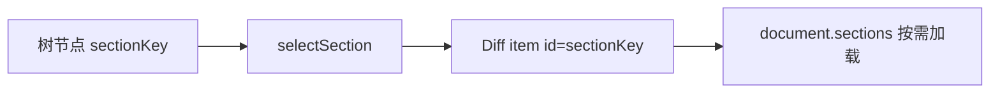
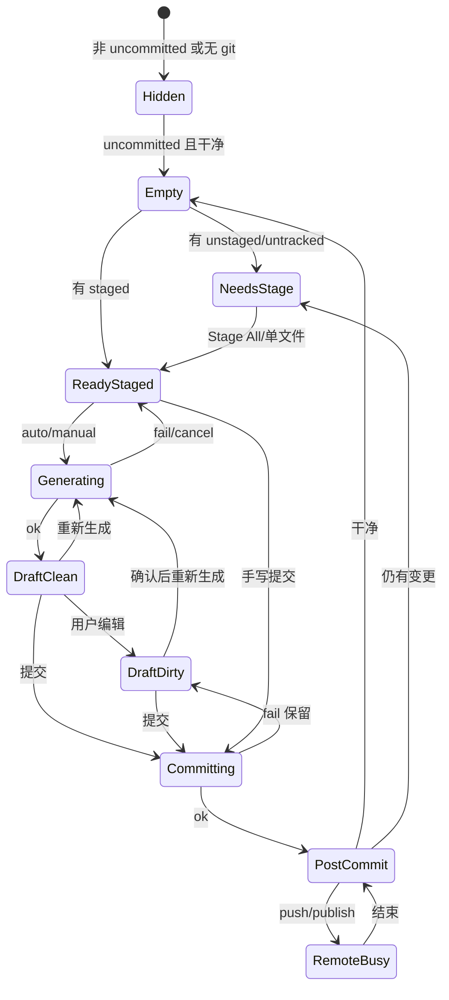

# Git 提交主价值链设计

> 日期：2026-07-22  
> 状态：设计已确认（方向 B；含 UI 原型；含树分组与 diff 锚定；含业界范式附录）  
> 范围：**提交主价值链** = 分组变更树 + Stage/Unstage All + AI 提交说明 + 提交 + 提交后 Push/Publish  
> 金标准参考：本机 Codex App（`/Applications/ChatGPT.app`，bundle 别名 Codex）的 commit message 生成与 diff 上下文，**不**照搬其 PR 全链路；变更列表×Diff 范式对齐 VS Code 分组 SCM，**不**做 Zed 可写 multibuffer  
> 相关：`src/plugins/builtin/git/**`、`src/main/services/ai/**`、`src/shared/contracts/ai.ts`、`src/shared/contracts/git.ts`、`src/shared/contracts/git-review/**`

## 1. 目标与边界

### 1.1 一句话

Changes 面板里，用户把该进版本库的变更收成 staged 后，**默认得到基于 staged diff 的 AI 提交说明草稿**，确认后 commit，并能 **推送或发布分支（无上游）**，完成本地到远端的最小闭环。

### 1.2 要解决的问题

1. 当前 `GitCommitForm` 只是「有 staged → 手写 message → commit」，与 AI 工作台定位不符。  
2. 缺少 Stage All / Unstage All，Agent 改多文件后整理成本过高，AI 上下文也经常不完整。  
3. 提交成功后无 Push/Publish 衔接；无上游时远端闭环断开。

### 1.3 非目标（本版不做）

- Create PR / PR 标题正文生成 / 浏览器打开 PR  
- hunk / 行级 stage、discard（P2；附录范式 C）  
- 多选批量（可后续加，不阻塞 All）  
- amend、signoff 勾选、allowEmpty UI  
- 冲突顶栏 Continue/Abort  
- 提交前 AI Code Review 产品  
- 宿主 Transcript、新模型栈、main 侧「AI+Git」聚合命令  
- **Zed 式可编辑 Project Diff / multibuffer**（附录范式 B）

### 1.4 完成闭环（验收单位）

| ID | 名称 | 触发 | 系统 | 用户可见 | 成功 | 失败 |
| --- | --- | --- | --- | --- | --- | --- |
| L1 | 整理 | 点「全部暂存/全部取消暂存」或单文件组内动作 | 收集 path → `git.stage` / `git.unstage`；树按组刷新 | 分组树与计数刷新；冲突跳过提示 | staged 集合符合预期 | toast/alert 可读原因 |
| L2 | AI 草稿 | 自动（staged 就绪）或点「生成」 | staged diff + log + instructions → `ai.generateText` | 生成中态；草稿填入 | 可编辑 message 非空 | 内联原因；可手写；不打断 |
| L3 | 提交 | 点提交或 ⌘/Ctrl+Enter | `git.commit` | 按钮 loading；成功反馈 | 草稿清空；进入提交后区 | 保留草稿 + `showAppAlert` |
| L4 | 远端 | 提交后点推送/发布 | `git.push` / 新 `git.publish` | 按钮 loading；状态栏 ahead | upstream 可用或 ahead 下降 | `showAppAlert`；可重试 |

### 1.5 架构选型（已确认）

**插件纯 UI 编排**：复用 `context.git.*` 与 `context.ai.generateText`；仅新增 `publish`（`push -u`）与 `gitCommit` 偏好。不把 AI 与 Git 耦进 main 聚合命令。

---

## 2. 信息架构与布局

### 2.1 Changes 面板骨架（保持现有三分）

```text
┌─ Changes ──────────────────────────────────────────────┐
│ [未提交 ▾]  [未暂存✓] [已暂存✓]     [split|unified] [⋯] │  header
├──────────────┬─────────────────────────────────────────┤
│ 变更树        │  diff 文档区                             │
│ unstaged     │                                         │
│ staged       │                                         │
│ untracked    │                                         │
│ conflict     │                                         │
│              │                                         │
│ ┌──────────┐ │                                         │
│ │ Composer │ │  ← 侧栏 footer，仅 uncommitted scope     │
│ └──────────┘ │                                         │
└──────────────┴─────────────────────────────────────────┘
```

- commit / branch scope：**不显示** Composer（只读审阅）。  
- 侧栏折叠时：Composer 随侧栏一起折叠；可用命令「生成提交说明 / 全部暂存」兜底（v1 命令可选，见 §8）。

### 2.2 树工具栏 vs Composer 分工

| 控件 | 位置 | 理由 |
| --- | --- | --- |
| 全部暂存 / 全部取消暂存 | **树顶部工具条**（主）+ Composer 内可重复弱入口 | 整理发生在看树时，不该只藏在底部 |
| 生成 / 重新生成 / 提交说明 / 提交 | **Composer** | 提交语义 |
| 提交后 推送 / 发布 | **Composer 提交成功态** | 紧挨提交结果，不靠状态栏发现 |

### 2.3 变更树分组与 Diff 锚定（已确认）

#### 现状

- **数据**：`renderSlots` 已按 `unstaged` / `staged` / `conflict` / `committed` 分组；同一 path 可有多 slot。  
- **Diff**：每个 slot → 一个 `PierDiffViewItem`（`id = sectionKey`）。  
- **树**：`gitReviewTreeModel` 仍把 entries **压成扁平路径树**（一行 path）；点击走 `entryKey → firstSection`（组序 unstaged 优先），半暂存时点不到 staged 段。

#### 目标（uncommitted scope）

采用 **范式 A（VS Code 式分组列表）+ 现有只读 multi-section diff**：

```text
侧栏分组树                         右侧 diff（只读 multi）
▾ 冲突 (n)        ──────────►   conflict sections（置顶）
▾ 未暂存 (n)      ──────────►   unstaged sections（index↔WT）
    含未跟踪，用 status 区分
▾ 已暂存 (n)      ──────────►   staged sections（HEAD↔index）
```

| 规则 | 说明 |
| --- | --- |
| 可选中节点 | **一个 `sectionKey`**（group × path），不是笼统 path |
| 半暂存 | 同一 path **可出现两行**（未暂存行 + 已暂存行），各绑不同 section |
| 组头 | 可折叠，**不可选中** |
| Diff 排序 | 与树一致：conflict → unstaged → staged；组内路径序与树一致 |
| 组头进 diff | v1：item 上 group 标识或 sticky 小标题（实现选成本低者） |
| 点击 | `selectSection(sectionKey)` → scroll/focus 对应 diff block |
| 过滤开关 | header「未暂存/已暂存」= 隐藏整组，不是第二套数据 |
| commit/branch scope | 仍为单一 `committed` 组（可维持路径树）；无 Composer |
| 右键 | **随组语义**：未暂存行 → 暂存/丢弃；已暂存行 → 取消暂存；避免两行同一套误伤动作 |



**不采用**：Zed Project Diff（可写 multibuffer 为主舞台）；列表仅作 checkbox 滤镜。

#### 与 Stage All / Composer

| 动作 | 树 | Diff | Composer |
| --- | --- | --- | --- |
| 全部暂存 | 节点从「未暂存」迁到「已暂存」 | unstaged block 消失/减少，staged 更新 | 可触发自动生成 |
| 点已暂存行 | 选中 staged section | 看到 **即将 commit** 的 diff | 摘要只计 staged |
| AI 上下文 | — | — | 仅 `getDiffText({ staged: true })` |

---

## 3. UI 原型稿（全状态）

> 原型为线框，实现时用现有 `@pier/ui`：`Button`、`Textarea`、`Empty`、密度 28px、语义色 token。  
> 文案键见 §9；下稿用中文示意。

### 3.1 树顶部工具条

#### P-T0 默认（有可操作路径）

```text
┌ 变更 ──────────────────────────────┐
│ [全部暂存]  [全部取消暂存]            │  outline 按钮，h=28
│ 未暂存 3 · 已暂存 1 · 冲突 0         │  次要说明，text-muted
├────────────────────────────────────┤
│ ▾ 未暂存 (3)                        │  组头不可选
│    M  src/a.ts                      │  → sectionKey unstaged:…
│    ?  src/new.ts                    │
│ ▾ 已暂存 (1)                        │
│    M  src/a.ts                      │  → sectionKey staged:…（可与上行同 path）
│ ...                                 │
```

#### P-T1 无 unstaged/untracked（仅 staged）

```text
│ [全部暂存 disabled]  [全部取消暂存]   │
│ 未暂存 0 · 已暂存 5 · 未跟踪 0       │
```

#### P-T2 无 staged（仅工作区脏）

```text
│ [全部暂存]  [全部取消暂存 disabled]   │
```

#### P-T3 操作中

```text
│ [暂存中…]  [全部取消暂存 disabled]   │  双按钮互斥 busy
```

#### P-T4 跳过冲突后

```text
│ 已暂存 8 个文件，跳过 2 个冲突文件    │  内联 warning 一行，非 toast 堆叠
```

---

### 3.2 Composer — 结构总图

```text
┌─ commit-composer ─────────────────────────────┐
│ 已暂存 · 12 个文件 · +320 −48                  │  summary 行
│ src/a.ts · src/b.ts · … 另 9 个                │  路径摘要，最多 3 个 + 「另 N 个」
├───────────────────────────────────────────────┤
│ 提交说明              [生成] 或 [重新生成]      │  label + 图标按钮
│ ┌───────────────────────────────────────────┐ │
│ │                                           │ │  Textarea min-h-14 max-h-32
│ │                                           │ │
│ └───────────────────────────────────────────┘ │
│ 状态行（生成中 / 不可用 / 失败 / 变更已更新）   │  text-xs text-muted 或 status-*
│ ┌───────────────────────────────────────────┐ │
│ │           提交 12 个已暂存变更              │ │  Button 主色，w-full，h=28
│ └───────────────────────────────────────────┘ │
└───────────────────────────────────────────────┘
```

---

### 3.3 Composer 状态矩阵

#### P-C0 仅有未暂存（staged=0）

```text
┌─────────────────────────────────────────────┐
│ 尚未暂存变更                                 │
│ 先全部暂存，再生成提交说明。                  │
│ [全部暂存]                                   │  主按钮样式 outline 或 default
│ （无 Textarea 或 Textarea disabled 占位）     │
└─────────────────────────────────────────────┘
```

**决策（已定）**：staged=0 时 **不** 展示可提交主按钮；提供「全部暂存」捷径，成功后进入 P-C1/P-C2。

#### P-C1 staged>0，待生成（自动生成开启、AI 可用）

```text
│ 已暂存 · 12 个文件 · +320 −48                 │
│ src/a.ts · src/b.ts · … 另 9 个               │
│ 提交说明                            [生成]    │
│ ┌───────────────────────────────────────────┐ │
│ │ 正在根据已暂存变更生成说明…                 │ │  placeholder 或只读闪烁文案
│ └───────────────────────────────────────────┘ │  disabled 输入可选：允许提前手写
│ 生成中…                                       │
│ [提交 …] disabled                             │
```

自动生成 debounce：**400ms**（staged identity 稳定后）。

#### P-C2 生成成功（AI 草稿，用户未改 = 非脏）

```text
│ 提交说明                         [重新生成]   │
│ ┌───────────────────────────────────────────┐ │
│ │ fix(git): stage all paths before commit   │ │
│ │                                           │ │
│ │ Include untracked files and skip          │ │
│ │ conflicted paths with a warning.          │ │
│ └───────────────────────────────────────────┘ │
│ 可由智能体再次生成；编辑后将不再自动覆盖。     │
│ [提交 12 个已暂存变更]                        │  enabled
```

#### P-C3 用户已编辑（脏）

```text
│ 提交说明                         [重新生成]   │
│ ┌───────────────────────────────────────────┐ │
│ │ fix(git): 用户改过的说明…                   │ │
│ └───────────────────────────────────────────┘ │
│ 已暂存内容有更新时：                           │  仅当 stagedIdentity 变
│ 已暂存变更已更新。重新生成将覆盖当前说明。     │
```

点「重新生成」且脏 → **`showAppConfirm`**：

```text
┌ 重新生成提交说明？          ┐
│ 将覆盖你正在编辑的说明。     │
│        [取消]  [重新生成]   │  intent default；主按钮最右
└────────────────────────────┘
```

#### P-C4 AI 不可用（`ai.status` 无 agent / not_configured）

```text
│ 提交说明                                      │  无生成按钮，或按钮 disabled
│ ┌───────────────────────────────────────────┐ │
│ │ （空，placeholder：用一两句话说明本次变更） │ │
│ └───────────────────────────────────────────┘ │
│ 未检测到可用于生成说明的智能体，请手写提交说明。│
│ [提交 …] 随 message 非空 enable               │
```

#### P-C5 生成失败（timeout / request_failed）

```text
│ 提交说明                              [重试]  │
│ ┌───────────────────────────────────────────┐ │
│ │ （保留旧草稿或空）                         │ │
│ └───────────────────────────────────────────┘ │
│ 生成失败：请求超时。可重试或直接手写。         │  短因；无技术栈细节
│ [提交 …]                                      │
```

长错误（罕见）不进 toast description；用户点「详情」再 alert（v1 可只内联短因）。

#### P-C6 提交中

```text
│ Textarea disabled                             │
│ [正在提交…] disabled                          │
```

#### P-C7 提交失败

```text
│ 草稿完整保留                                  │
│ + showAppAlert                                │
│   标题：提交失败                               │
│   正文：Error.message                         │
```

#### P-C8 提交成功 — 仍有剩余工作区变更

```text
│ ✓ 已提交  a1b2c3d                             │  单行成功
│ [推送] 或 [发布分支]     [查看该提交]          │  次要 button 横排
│ ───────────────────────────────────────────── │
│ 工作区仍有 3 个未提交变更                      │  回到 P-C0/树
```

「查看该提交」：scope 切到 `commit` + 该 oid（复用现有 scope switcher 能力）。

#### P-C9 提交成功 — 工作区干净

```text
│ ✓ 已提交  a1b2c3d · 工作区干净                 │
│ [推送] 或 [发布分支]     [查看该提交]          │
```

无远端动作时（已同步 / detached）：

```text
│ ✓ 已提交  a1b2c3d · 工作区干净                 │
│ 当前分支与上游一致。          [查看该提交]     │
```

或 detached：

```text
│ ✓ 已提交  a1b2c3d                              │
│ 分离头指针，无法推送。请先切换到分支。          │
```

#### P-C10 推送/发布中与结果

```text
│ [正在推送…]                                    │
│ → 成功：短 toast「已推送」；按钮区收起或变「已同步」│
│ → 失败：showAppAlert；保留 [重试推送]          │
```

---

### 3.4 提交后远端决策（映射到按钮文案）

| 条件 | 按钮 | 调用 |
| --- | --- | --- |
| detached | 无推送按钮，说明文案 | — |
| `upstream == null` 且有分支名 | **发布分支** | `git.publish` |
| 有 upstream 且 `ahead > 0` | **推送** | `git.push` |
| 有 upstream 且 `ahead == 0` | 无按钮，文案「与上游一致」 | — |
| `behind > 0` 且 ahead>0 | 仍提供推送，失败则 alert 提示需先拉取/同步（v1 不在 Composer 做 sync） | push |

---

### 3.5 设置 UI 原型

挂在 git 插件设置（或设置页 Git 段），`Card` 内：

```text
┌ 提交说明 ────────────────────────────────────┐
│ ☑ 暂存后自动生成提交说明                      │
│                                              │
│ 补充说明（可选）                              │
│ ┌──────────────────────────────────────────┐ │
│ │ 例如：使用 Conventional Commits；中文 subject │ │
│ └──────────────────────────────────────────┘ │
│ 生成时会连同已暂存 diff 发给本机智能体。       │
└──────────────────────────────────────────────┘
```

---

### 3.6 空态 / 非 uncommitted

#### 工作区完全干净（uncommitted）

```text
│ Empty：工作树中没有已暂存或未暂存的变更。      │  沿用现文案
│ 无 Composer                                   │
```

#### commit / branch scope

```text
│ 无 Composer footer                            │
│ 树 + diff 只读审阅                            │
```

---

### 3.7 关键流原型（主路径）

```text
用户: Agent 改完 20 文件
  → 打开 Changes
  → [全部暂存]                    P-T0 → P-T3 → 树变 staged
  → Composer 自动进入生成中         P-C1
  → 草稿出现                        P-C2
  → 用户改 subject 一字             P-C3
  → [提交]                          P-C6 → P-C8/P-C9
  → [发布分支] 或 [推送]            P-C10
  → 结束
```

### 3.8 关键流（无 AI）

```text
  → 全部暂存
  → P-C4 手写
  → 提交 → 推送/发布
```

### 3.9 视觉与无障碍约束

- 单行控件高度 28px；主提交按钮 full width。  
- 生成中：`aria-busy` on composer region；状态行 `aria-live="polite"`。  
- 图标按钮必有 `aria-label`（生成、重新生成）。  
- 破坏性仅 discard 类（本版不做 All discard）；重新生成覆盖用 confirm。  
- 颜色只走语义 token；成功勾可用 `status-success` 前景，不用生造绿。  
- 路径摘要 `font-mono` + `truncate`。

---

## 4. 功能语义（写死）

### 4.1 Stage All

- 来源：当前 **已加载** review index 的 entries。  
- 纳入：`unstaged`、`untracked` 对应 path（rename 用目标 path；oldPaths 不重复 stage）。  
- **跳过** `conflict` 组；结束后若有跳过 → 内联 warning（P-T4）。  
- paths 去重、非空才调用 `git.stage(cwd, paths)`。  
- 不调用 pathless `git add -A`（除非后续证明 index 路径收集不可靠，再开 main 例外）。

### 4.2 Unstage All

- 所有 `staged` 组 path → `git.unstage`。  
- 空则 disabled。

### 4.3 AI 草稿

- 通道：`context.ai.generateText({ projectRootPath: gitRoot, prompt })`。  
- 上下文：分支名、`getLog`≤5、`getDiffText({ staged: true })`、用户 `commitInstructions`。  
- `prompt` 硬顶 **12000** 字符；diff 截断并声明 truncated。  
- 输出：`normalizeCommitMessage` 去 fence/前缀；空则当失败。  
- 自动生成默认 **on**；用户脏后不自动覆盖。  
- 并发：`generationId`，只应用最新结果。

### 4.4 Commit

- `git.commit(cwd, { message: trimmed })`。  
- message 空：按钮 disabled。  
- 成功：记 `lastCommitOid`（若 API 不返回 oid，则 `getLog` limit 1 或 status 后 refresh 再取——实现时优先扩展 commit 返回 hash，避免多一次 roundtrip；**若 v1 不扩 API**，用 post-op 后 `searchCommits/getLog` 取 HEAD）。  
- 推荐小扩展：`commit` 成功返回 `{ ok: true, oid: string }`（可选，计划阶段定）。

### 4.5 Publish

```text
git push -u <remote> <branch>
```

- remote：优先 `origin`；否则唯一 remote；否则错误「请先添加名为 origin 的远程仓库」。  
- 禁止 force；detached 不可用。

---

## 5. 状态机



`stagedIdentity`（v1）：`sorted(stagedPaths).join("\0") + "#" + stagedCount + "#" + indexRevision`（index 刷新世代）。

`messageDirty`：textarea 值 ≠ 上次成功应用的 AI 文本（手写从空开始算脏）。

---

## 6. 模块与 API

### 6.1 插件文件（建议）

| 路径 | 职责 |
| --- | --- |
| `git-commit-composer.tsx` | UI，替换 `git-commit-form.tsx` |
| `git-commit-composer-model.ts` | 状态与 action |
| `git-commit-prompt.ts` | prompt 装配、截断、normalize |
| `git-stage-all.ts` | 从 index 收集 paths |
| `git-post-commit-remote.ts` | 派生 Push/Publish 动作并执行 |
| `git-review-tree-toolbar.tsx` | 全部暂存/取消暂存 |
| locales | 中英文案 |

### 6.2 契约增量

```ts
// preferences
gitCommit: {
  autoGenerateMessage: boolean; // default true
  commitInstructions: string;   // default ""
}
```

- `preferences-service` `PATCHABLE_KEYS` 增加 `gitCommit`。  
- preload/plugin：`publish(cwd): Promise<GitRemoteOperationResult>`。  
- main：`pushBranch` 旁实现 `publishBranch`（`-u`）。

### 6.3 不扩的 API

- 不新增 `generateCommitMessage` IPC（插件拼 prompt 即可）。  
- 不新增 pathless stageAll，除非 path 收集失败的缺陷证明。

---

## 7. 反馈与权限

- 写操作：`git:write`；读 diff/log：`git:read`；AI：现有 ai 能力。  
- 成功且树/计数变化：可省略 toast；commit/push 成功可用短 toast。  
- 失败带技术细节：`showAppAlert`，禁止 `toast.error(..., { description })`。  
- AI 不可用：仅 Composer 内联，不 alert。

---

## 8. 命令面板（v1 建议）

| 命令 id | 标题 | 何时 enabled |
| --- | --- | --- |
| `pier.git.review.stageAll` | Git: 全部暂存 | uncommitted 且有可 stage |
| `pier.git.review.unstageAll` | Git: 全部取消暂存 | 有 staged |
| `pier.git.commit.generateMessage` | Git: 生成提交说明 | 有 staged |
| （可选）`pier.git.publish` | Git: 发布分支 | 无 upstream |

与树按钮同一 handler。

---

## 9. 文案键（示意）

| key | zh | en |
| --- | --- | --- |
| `ui.stageAll` | 全部暂存 | Stage All |
| `ui.unstageAll` | 全部取消暂存 | Unstage All |
| `ui.stageAllSkippedConflicts` | 已暂存 {{staged}} 个文件，跳过 {{n}} 个冲突文件 | Staged {{staged}} file(s), skipped {{n}} conflicted |
| `ui.commitSummary` | 已暂存 · {{files}} 个文件 · +{{ins}} −{{del}} | Staged · {{files}} files · +{{ins}} −{{del}} |
| `ui.commitGenerate` | 生成 | Generate |
| `ui.commitRegenerate` | 重新生成 | Regenerate |
| `ui.commitGenerating` | 生成中… | Generating… |
| `ui.commitAiUnavailable` | 未检测到可用于生成说明的智能体，请手写提交说明。 | No assistant available for message generation. Write one manually. |
| `ui.commitGenerateFailed` | 生成失败：{{reason}}。可重试或直接手写。 | Couldn't generate: {{reason}}. Retry or write manually. |
| `ui.commitStagedUpdated` | 已暂存变更已更新。重新生成将覆盖当前说明。 | Staged changes updated. Regenerate will replace your message. |
| `ui.commitRegenerateConfirmTitle` | 重新生成提交说明？ | Regenerate commit message? |
| `ui.commitRegenerateConfirmBody` | 将覆盖你正在编辑的说明。 | This replaces the message you're editing. |
| `ui.commitNeedsStage` | 尚未暂存变更 | Nothing staged yet |
| `ui.commitNeedsStageBody` | 先全部暂存，再生成提交说明。 | Stage your changes before generating a message. |
| `ui.commitButton` | 提交 {{count}} 个已暂存变更 | Commit {{count}} staged |
| `ui.commitSuccess` | 已提交 {{oid}} | Committed {{oid}} |
| `ui.commitFailed` | 提交失败 | Commit failed |
| `ui.postCommitPush` | 推送 | Push |
| `ui.postCommitPublish` | 发布分支 | Publish Branch |
| `ui.postCommitView` | 查看该提交 | View Commit |
| `ui.postCommitSynced` | 当前分支与上游一致。 | Branch is up to date with upstream. |
| `ui.postCommitDetached` | 分离头指针，无法推送。请先切换到分支。 | Detached HEAD — switch to a branch to push. |
| `ui.publishFailed` | 发布分支失败 | Couldn't publish branch |
| `ui.pushFailed` | 推送失败 | Couldn't push |
| `ui.settingsCommitSection` | 提交说明 | Commit message |
| `ui.settingsAutoGenerate` | 暂存后自动生成提交说明 | Auto-generate after staging |
| `ui.settingsCommitInstructions` | 补充说明（可选） | Extra instructions (optional) |
| `ui.settingsCommitInstructionsHint` | 生成时会连同已暂存 diff 发给本机智能体。 | Sent to your local assistant with the staged diff. |

---

## 10. 测试

| 层 | 用例 |
| --- | --- |
| 单元 | path 收集含 untracked、跳过 conflict；prompt≤12000；normalize；shouldAutoGenerate；postCommitAction 派生；**按 group 收集 section 节点；firstSection 不再作为主导航** |
| 组件 | P-C0–C10 关键；脏确认；无 AI；提交失败保留草稿；**分组树点选滚到对应 section；半暂存两行** |
| 契约 | publish 命令；preferences `gitCommit` patch |
| 手工 | 大 diff；无 origin；多 remote；detached；仅 untracked Stage All；**半暂存文件两组 diff 基线正确** |

---

## 11. 实施阶段

| 阶段 | 交付 | 原型覆盖 |
| --- | --- | --- |
| **B0a** | **分组树 + section 导航 + diff 排序/标识** | §2.3、P-T 组结构 |
| **B0b** | Stage/Unstage All + 树工具条 | P-T0–T4 |
| **B1** | Composer + AI + 偏好 | P-C0–C7，设置 |
| **B2** | publish + 提交后区 | P-C8–C10 |
| **B3** | 命令面板、大 diff 抛光、oid 返回优化 | 全矩阵回归 |

顺序：**B0a → B0b → B1 → B2 → B3**（B0a 与 B0b 可同 PR 若风险可控，但导航须先于「只靠 path 的 All」验收半暂存）。

---

## 12. 风险

| 风险 | 缓解 |
| --- | --- |
| one-shot 慢/不稳 | 可手写；ai-service 多 agent 回退；UI 不阻塞编辑 |
| diff 过大 | 硬截断 + truncated 声明 |
| 敏感 diff 进本机 agent | 与 worktree 生成同模型；设置说明 |
| publish 远程歧义 | origin / 唯一 remote / 否则清晰错误 |
| 自动生成打扰 | 默认 on 但脏不覆盖；设置可关 |

---

## 13. 门禁

同时满足才算本设计落地：

1. L1–L4 闭环在手工脚本下可演示。  
2. 无可用智能体时主路径仍可提交并推送/发布。  
3. UI 状态与 §3 原型一致（允许视觉 token 差异，不允许缺态）。  
4. **uncommitted 树按 conflict/未暂存/已暂存分组；点击绑定 sectionKey；半暂存同 path 两行两点。**  
5. 无 PR/hunk/冲突引擎/Zed multibuffer 范围泄漏。  
6. 文案走 i18n，反馈规范不违规。

---

## 14. 已确认决策摘要

| 项 | 决策 |
| --- | --- |
| 范围 | B 提交主价值链 |
| 架构 | 插件编排 + 现有 generateText |
| 变更展示范式 | **A：VS Code 式分组列表 + 只读 multi-section diff**（见附录） |
| 树 | uncommitted **按组展示**；节点 = sectionKey |
| Diff 锚定 | 点树 → 滚到对应 section；废弃 path→firstSection 主路径 |
| 不做 | Zed 可写 Project Diff；v1 hunk/行 stage |
| Stage All | 含 untracked，跳过 conflict |
| 自动生成 | 默认 on，脏不覆盖 |
| Publish | v1 必做（B2） |
| PR | 不做 |
| UI | 本文 §3 全状态原型为验收参照 |
| 分期 | B0a 树分组导航 → B0b All → B1 AI → B2 远端 → B3 抛光 |

---

## 附录 A. 变更列表 × Diff 业界范式与选型

> 调研摘要（2026-07-22）。用于锁定 Pier 不误滑向 Zed multibuffer 或纯 PR Review 形态。

### A.1 三份 Git 内容

| 对象 | 含义 |
| --- | --- |
| HEAD | 上次提交 |
| index（staged） | 下次 commit 快照 |
| worktree（WT） | 工作区磁盘 |

| 视图 | 比较 | 回答的问题 |
| --- | --- | --- |
| Unstaged diff | index ↔ WT | 还未暂存的改动 |
| Staged diff | HEAD ↔ index | **即将被 commit 的内容** |
| 总览（少作主提交台） | HEAD ↔ WT | 相对上次提交的全部（易揉在一起） |

### A.2 工作台范式

| 代号 | 名称 | 列表 | Diff 表面 | 代表 | 暂存粒度 |
| --- | --- | --- | --- | --- | --- |
| **A** | 分组列表 + 主从/multi 只读 | Staged/Unstaged/Conflict 分组 | 单文件 diff 或 multi-file **只读** | VS Code / Cursor SCM、GitHub Desktop | 文件 + hunk（Desktop 偏文件） |
| **B** | 可编辑 Project Diff | Panel 鸟瞰 + checkbox；分组后补 | **可写 multibuffer** 为主舞台 | Zed | 文件 + hunk |
| **C** | 精密 Stage 台 | 分区列表 | 专用 GUI，hunk/行按钮 | Sublime Merge、Fork 等 | **行 + hunk** |
| **D** | Status 缓冲 | 段即列表 | 段内展开 | Magit | 行 + hunk |
| **E** | 多面板 TUI | 上 unstaged / 下 staged | 常驻 hunk 面板 | lazygit | 行 + hunk |
| **F** | 编辑器 Gutter | 次要 | 源码内联 hunk | JetBrains / gutter 插件 | hunk |
| **G** | Range 只读 Review | 文件树 | PR/commit multi diff | GitHub PR；Pier commit/branch scope | 无 stage |

**Zed 与 VS Code 的关键差**：Zed 以可编辑变更画布为主、列表为控制台；VS Code 以分组清单为 master、diff 为 detail（可 multi 连读仍只读）。

### A.3 产品对照（简表）

| 产品 | 范式 | 半暂存同 path 两处 | 可写 diff |
| --- | --- | --- | --- |
| VS Code / Cursor SCM | A | ✅ 两组 | ❌ |
| Zed | B（+分视图演进） | 标记或分视图 | ✅ |
| Sublime Merge | C | ✅ | ❌ |
| lazygit | E | ✅ 分区 | ❌ |
| Magit | D | ✅ | 操作型 |
| Pier 现状 | 数据 A slot + 树扁平 + multi 只读 | 弱 | ❌ |
| **Pier 本设计** | **A 列表 + multi 只读 section** | ✅ 两行 | ❌ |

### A.4 Pier 选型（已确认）

```text
列表学 VS Code（范式 A）
多文件连读保留现有 multi-section 只读 diff
绑定升级为 sectionKey（非 path→firstSection）
v1 文件级 Stage All；hunk/行 → 范式 C 后置
不做 v1 范式 B（Zed 可写 multibuffer）
commit/branch scope 保持范式 G
```

| 维度 | 决策 |
| --- | --- |
| uncommitted 树 | 分组：conflict → 未暂存（含未跟踪）→ 已暂存 |
| Diff | 只读；排序与组一致；点击 section 锚定 |
| 实现成本 | 中（改树模型与导航，不重做 diff 引擎） |
| 明确拒绝 | 以 Project Diff 替换 Changes 主从结构 |

### A.5 参考

- [VS Code Source Control / multi-diff](https://code.visualstudio.com/docs/sourcecontrol/overview)  
- [Zed Git 文档](https://zed.dev/docs/git)、[Zed Git 博文](https://zed.dev/blog/git)  
- Sublime Merge / lazygit / Magit：行级与 status 缓冲范式（P2 参照，非 v1 范围）
