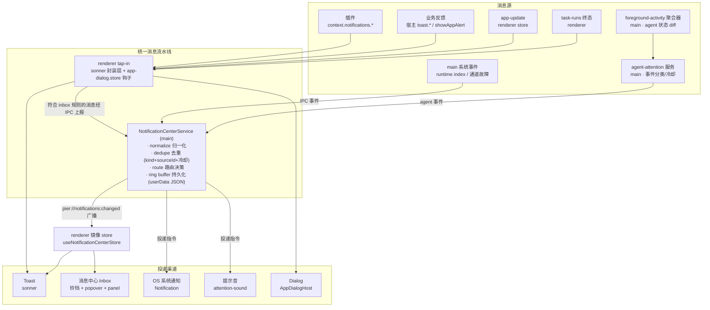
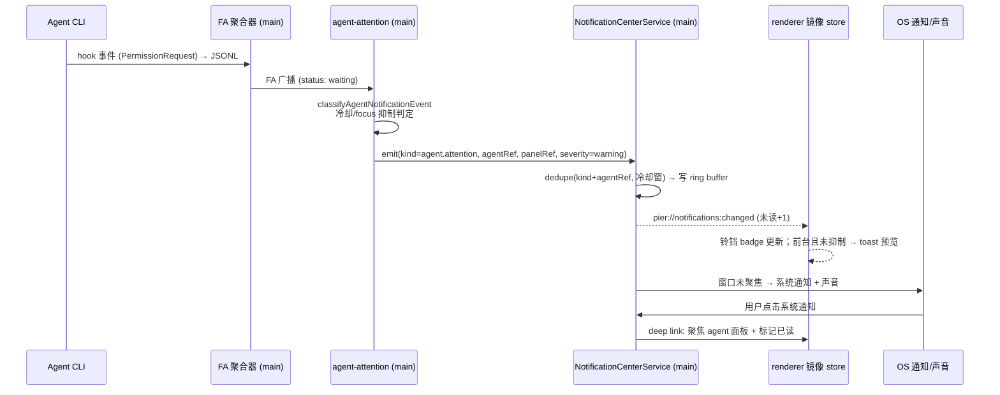
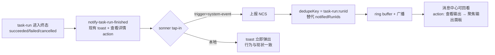
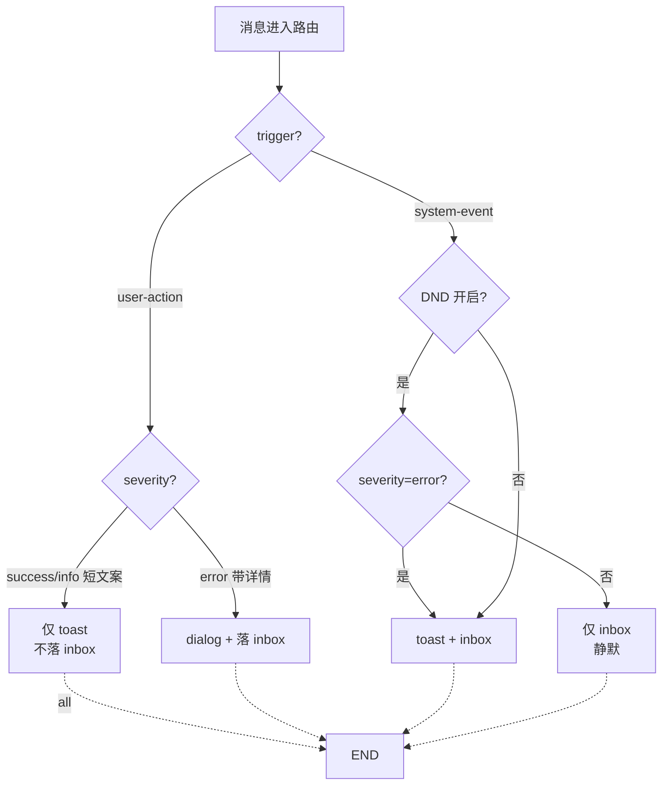

# Pier 统一消息中心设计方案

> 状态：已实施（偏差记录见 plans 同名文档） · 日期：2026-07-24
> 范围：统一 toast / showAppAlert / OS 系统通知 / agent 通知为一条消息流水线，新增应用内消息中心（Inbox）。

---

## 1. 背景与问题

Pier 当前有**三条互相独立、发完即丢**的消息通道：

| 通道 | 实现 | 问题 |
|---|---|---|
| Toast（sonner） | `components/primitives/sonner.tsx`，宿主 ~44 处 + 插件 57 处调用 | 4 秒后消失，**无历史**；后台事件（更新就绪、任务终态）错过即丢失 |
| 应用弹窗（showApp*） | `app-dialog.store.ts`，宿主 ~103 处 + 插件 61 处 | 只覆盖"当下"，无记录；部分系统事件滥用弹窗打断用户 |
| OS 系统通知 | `main/services/agent-attention/` + `system-notification.ts` | 只服务 agent「需要你处理」；与 app 内消息完全割裂，点击后无处回看 |

具体症状：

1. **后台事件不可找回**：`app-update.store.ts:40`（更新下载完成）、`notify-task-run-finished.ts`（5 处任务终态）、`agent-runtime-index.store.ts:48`（启动拉取失败）等系统事件用 toast 投递，用户离开屏幕 4 秒就永远错过。
2. **去重逻辑散落各调用方**：`readyToastVersion`（app-update）、`notifiedRunIds`（task-run）、`toasted` flag（通知降级提示）各自实现一遍，口径不一。
3. **agent 通知没有"收件箱"**：「需要你处理」只有 tab 角标 + 标题栏计数 + OS 通知三个瞬时信号，用户回来看不到"哪些 agent 找过我、什么事、什么时候"。
4. **无统一音量控制**：没有勿扰模式；agent-attention 的冷却/抑制只作用于 OS 通知，不作用于 toast。

## 2. 业界最佳实践调研

### 2.1 VS Code（同形态桌面 IDE，最直接参照）

- **统一服务**：`INotificationService.notify()` 单入口，所有消息带 `severity`（Info / Warning / Error）与 `source`（哪个扩展/模块）。
- **双层呈现**：toast 滑出显示片刻 → **自动归档进 Notification Center**（状态栏右下角铃铛），toast 消失 ≠ 消息消失。
- **勿扰模式（Do Not Disturb）**：隐藏所有非 error toast，但**所有消息仍进通知中心**；error 永远弹出。
- **按源静音**：每条消息齿轮菜单可"不再显示来自 X 的通知"，偏好持久化。
- **进度通知**：长任务以 notification 形态带 progress + cancel，完成后转入通知中心。
- 启示：**toast 是通知中心的一个"预览"，不是独立通道**；severity 与 source 是一等字段。

### 2.2 Linear（开发者工具 inbox 标杆）

- Inbox 是**主界面**而非附属：每条通知可 mark done / snooze / open，卡片内即可完成分诊（triage）。
- 过滤维度：按项目、按类型、未读；批量操作。
- 启示：消息中心要支持**就地处理**（action 直接挂在消息上），而不是只读列表。

### 2.3 Slack / GitHub

- Slack：per-channel 细粒度偏好 + DND 时段 + 关键词触发 → **把音量控制权交给用户**。
- GitHub：每条通知带 **reason 标签**（"you were mentioned" / "you're reviewing"），用户秒懂"为什么找我"。
- 启示：Pier 每条消息应带 `kind` + `source`，UI 上可回答"这是什么、谁发的、为什么"。

### 2.4 Material Design / Courier（通用分级模型）

| 模式 | 持久性 | 打断程度 | 适用 |
|---|---|---|---|
| Toast / Snackbar | 瞬态自动消失 | 不打断 | 操作确认、次要反馈 |
| Banner / Inline | 驻留至关闭 | 低 | 持续为真的状态（通道故障） |
| Dialog | 必须决策 | 高（阻塞） | 必须现在决定的事 |
| Inbox | 持久可浏览 | 无 | 值得留存、事后回看的一切 |
| OS Push | 系统级 | 中 | 应用不在前台时的真正重要事件 |

核心原则：**格式匹配紧急度**；所有瞬态通道的消息都应有持久化落点；批量与去重是防疲劳的最高杠杆。

### 2.5 提炼：Pier 设计原则

1. **单一消息流水线**：所有消息一个模型、一个入口、统一路由；toast / OS 通知 / 声音 / 弹窗只是"投递渠道"。
2. **toast 必落 inbox**（后台/系统事件类）；纯即时操作反馈可只 toast 不留痕。
3. **severity × source 驱动路由**：error 不受勿扰影响；按源/按类型可静音。
4. **agent 通知是一等公民**：agent 事件与普通系统消息同构，共享列表、未读、深链（点击聚焦 agent 面板）。
5. **就地处理**：消息卡片携带 action（查看输出 / 聚焦面板 / 重启更新），无需离开消息中心。

---

## 3. 消息分级与通道路由模型

### 3.1 消息分类（三维）

- **severity**：`info` / `success` / `warning` / `error`（对齐现有 `@pier/ui/status-icon` 与 toast 图标体系）。
- **触发源 trigger**：`user-action`（用户点击后的即时反馈）/ `system-event`（后台/系统/其他进程事件）。
- **持久性 persistence**：`transient`（看过即可丢）/ `record`（值得回看）。

### 3.2 路由矩阵（核心决策表）

| 类别 | 示例 | Toast | Inbox | OS 通知 | 声音 | Dialog |
|---|---|---|---|---|---|---|
| 用户动作 · 成功 | 保存成功、提交成功、复制成功 | ✅ | — | — | — | — |
| 用户动作 · 失败（短） | 启动 agent 失败 | ✅ | — | — | — | — |
| 用户动作 · 失败（带技术详情） | git 命令报错、IPC 错误串 | —（现有规范走 alert） | ✅ 留存详情 | — | — | ✅（维持现状） |
| 系统事件 · 信息 | 更新下载完成、通知能力降级 | ✅ | ✅ | — | — | — |
| 系统事件 · 任务终态 | 后台任务完成/失败/被取消 | ✅ | ✅ | — | 可选 | — |
| 系统事件 · 通道故障 | 任务状态通道断开、启动拉取失败 | ✅ | ✅ | — | — | 需用户决策时（重试/忽略）✅ |
| agent · 需要你处理 | PermissionRequest、agent 出错 | ✅（前台时） | ✅ | ✅（未聚焦时） | ✅（按设置） | — |
| agent · 回合结束 | `turnNotifyMode` 策略内 | 可选 | ✅ | 按设置 | 按设置 | — |
| 阻塞决策 | 关闭仍有进程的终端、退出确认 | — | — | — | — | ✅（不进消息中心） |

规则一句话：**toast 负责"现在"，inbox 负责"之后"，OS 通知负责"不在场"，dialog 负责"必须决定"——四者由同一条消息驱动，不再各自为政。**

### 3.3 勿扰模式（DND）

- 全局开关 + 可挂到「专注」场景：开启后**所有 toast 静默**（直接落 inbox），error 级 toast 仍弹出（对齐 VS Code）。
- OS 通知与声音维持现有 `suppressWhenFocused` / 冷却逻辑，不受 app 内 DND 影响（DND 只管 app 内打断）。
- 状态可见：铃铛图标变 slashed-bell。

### 3.4 已读状态生命周期（toast 展示 ≠ 已读）

核心原则：**toast 是「预览」不是「确认」**——toast 出现过不代表用户看到了（可能离开屏幕/专注别处）。规则（对齐 VS Code / macOS / Linear）：

| 事件 | inbox 已读状态 |
|---|---|
| 消息到达（含 toast 弹出） | 一律 **unread** |
| toast 自动消失 / 点 X 关闭 | **仍 unread**（没看见 ≠ 已读） |
| 点击 toast / 卡片上的 action | → 已读（真实互动 = 确认，经 `runNotificationAction` 统一 `markRead`） |
| 点击卡片标题区 | → 已读 |
| 「全部已读」 | 全部 → 已读 |
| dedupe 合并（同类事件再发） | 回到 unread，`repeatCount++`（新一次发生需重新确认）；前台 toast **重新预览**（预览桥按 id+repeatCount 判定，合并保留原 id 不再抑制重提醒） |
| DND 静默到达 | unread（等被发现） |

反例禁止：toast 展示即标记已读（inbox 将失去安全网意义）。

---

## 4. 架构设计

### 4.1 总体架构图



关键决策与理由：

1. **主流水线在 main 侧**（`src/main/services/notification-center/`）：
   - agent 事件、runtime index、通道故障本就在 main 产生，天然汇入主线路；
   - 持久化（userData ring buffer）只能写 main；多窗口场景下 main 是唯一仲裁者；
   - 对齐既有模式：foreground-activity / agent-runtime-index 都是"main 聚合 → 广播 → renderer 镜像 store"。
2. **renderer 侧 tap-in 零侵入**（已收窄，见 §8 范围修正：实际落地为显式门面 `systemNotify()`，P0 调用点逐个迁移）：在 `sonner.tsx` 封装层与 `app-dialog.store` 加钩子，符合 inbox 规则的消息（`trigger=system-event` 或 severity≥warning 且带详情）自动上报 main，**~200 个既有调用点不用改**。
3. **toast 的即时性不受 IPC 影响**：tap-in 是"本地立即出 toast + 异步上报存档"双写，不等待 main 往返。
4. **去重下沉**：`readyToastVersion` / `notifiedRunIds` / `toasted` 三处调用方逻辑由 NCS 的 `dedupeKey + 冷却窗口` 统一接管。

### 4.2 进程边界（对齐 dependency-cruiser 纪律）

```
src/shared/contracts/notification-center.ts   ← 契约唯一来源（AppNotification 等）
src/main/services/notification-center/        ← NCS：normalize/dedupe/route/persist
src/preload/notification-center-api.ts        ← window.pier.notificationCenter.{snapshot,onChanged,report,markRead,...}
src/renderer/stores/notification-center.store.ts  ← 镜像 store
src/renderer/panel-kits/notifications/        ← 消息中心 panel kit（web kind）
```

- 插件**不直接**访问消息中心；插件 `context.notifications.*` 经 host-context 门面 → sonner tap-in → 上报，source 自动标记为插件 id（复用 pluginId 作用域纪律）。
- `notification-center/` 与 `agents/` 保持单向边界：agent 事件经 agent-attention 已分类的产物输入，NCS 不 import `services/agents/`（对齐 foreground-activity 先例）。

### 4.3 流程图 A：agent「需要你处理」全链路



### 4.4 流程图 B：后台任务终态（toast + inbox 双投递）



### 4.5 流程图 C：DND 与 severity 路由



---

## 5. 数据模型（契约草案）

`src/shared/contracts/notification-center.ts`：

```ts
export type NotificationSeverity = "info" | "success" | "warning" | "error";

export type NotificationTrigger = "user-action" | "system-event";

/** 消息类别：路由、过滤、按类静音的维度 */
export type NotificationKind =
  | "agent.attention"        // agent 需要你处理
  | "agent.turn-finished"    // agent 回合结束
  | "agent.runtime"          // runtime index 拉取失败等
  | "task-run.finished"      // 后台任务终态
  | "app.update"             // 应用更新
  | "channel.health"         // 通道故障/能力降级
  | "plugin.event"           // 插件上报（source=插件 id）
  | "operation.result";      // 用户动作结果留存（带详情的失败）

export interface NotificationAction {
  id: string;                // "focus-panel" | "open-output" | "relaunch" | "retry" ...
  labelKey: string;          // i18n key（宿主 locale 域）
}

export interface AppNotification {
  id: string;                // uuid
  kind: NotificationKind;
  source: string;            // "host" | 插件 id | "agent-attention" ...
  severity: NotificationSeverity;
  trigger: NotificationTrigger;
  titleKey: string;          // i18n key，禁止内联文案（对齐用户文案规范）
  titleParams?: Record<string, string | number>;
  body?: string;             // 允许技术详情（err.message），仅 inbox 内展示
  ts: number;                // wall-clock（展示用）
  read: boolean;
  dedupeKey?: string;        // "task-run:<runId>" / "app-update:<version>" / "agent.attention:<agentRef>"
  panelRef?: { panelId: string };        // 深链：聚焦 panel
  agentRef?: string;
  actions?: NotificationAction[];
}

export interface NotificationCenterSnapshot {
  items: AppNotification[];  // ring buffer，按 ts 倒序，上限 N=200
  unreadCount: number;
  dndEnabled: boolean;
  seq: number;               // 单调序号，镜像 store 守卫（对齐 FA 广播 ts）
}
```

持久化：`{userData}/notifications/history.json`（单文件 ring buffer，200 条上限，写盘防抖 500ms；7 天自动过期清理）。**不引入 SQLite**（对齐项目"不做任务台账"定位）。

---

## 6. UI 设计

> 交互原型文件：`docs/superpowers/specs/2026-07-24-notification-center-prototype.html`（可在浏览器直接打开）。

### 6.0 最高原则：两种 toast 形态 + 唯一消息卡片

**toast 分两形态**（详见 `2026-07-25-notification-toast-forms-design.html` 元素显隐契约）：

- **形态 A · 确认型**（用户动作即时反馈，不进消息中心）：维持现有 sonner 反色胶囊，不做任何改动。
- **形态 B · 消息型**（系统/后台事件，进消息中心）：标准 shadcn sonner 卡片——**标题（600）+ 详情（必备 ≤1 行）+ ≤1 outline 操作 + 关闭 X**，无前置状态图标；面板质感与消息中心 popover 同一 surface/描边/阴影（同一套系统）。

**消息中心卡片唯一实现**：`NotificationCard`（standard 密度）——无前置状态图标，标题 / 详情 / 底行（时间 + 类型徽标）/ 未读红点（destructive，右上）/ 操作（底行右簇 ≤2）。action 分发器 `notification-actions.ts` 在 toast（outline，取首个）与卡片（底行右簇）间共享，同一 action id 行为一致。

统一约束：

- status-icon 只出现在确认型 toast（形态 A 的图标注入）与 Alert 等即时反馈中；消息型 toast 与消息中心条目一律无前置图标。
- toast 不显示时间与类型徽标（存档元数据，只在消息中心出现）。
- 原子级共享：title/detail/actions 三槽位在 toast 与卡片间同源（同一条 `AppNotification` 驱动）。
- 颜色只走语义 token，密度 28px 控件规范照常生效。

### 6.1 信息架构

```
标题栏铃铛（未读 badge + DND 态）
  └─ Popover（快速预览，最近 10 条 + 全部已读 + DND 开关）
       └─ 「打开消息中心」→ dockview panel（core kit: notifications）
设置 → 通知（notifications-section 扩展）
  ├─ 现有：系统通知权限 / agent 提示音 / 冷却 / turnNotifyMode
  └─ 新增：消息中心保留策略 / DND / 按类别静音
```

### 6.2 入口：标题栏铃铛

与现有 `AgentIndexCountsControl` 并列于标题栏右侧。28px 纯图标按钮（对齐交互密度规范），未读徽标用 `Badge`（只计 warning/error 未读，数字 ≤99+），DND 态切换为 BellOff 图标。

```
┌───────────────────────────────────────────────────────────────┐
│  Pier — my-project        ● 2 运行中  ⚠ 1 需要你处理   🔔[3] ⚙ │  ← 标题栏
└───────────────────────────────────────────────────────────────┘
```

### 6.3 Toast 原型（两种形态并存）

```
形态 A · 确认型（现有胶囊，不动）
        ╭──────────────────────────────╮
        │  ✓ 已保存                      │
        ╰──────────────────────────────╯

形态 B · 消息型（标准 shadcn sonner 卡片，与消息中心同面板）
        ┌──────────────────────────────────────┐
        │ 修复登录 bug 需要你处理   [前往处理] [×] │
        │ Claude 请求写入 src/auth.ts 的权限      │
        └──────────────────────────────────────┘
        ┌──────────────────────────────────────┐
        │ 后台任务「pnpm build」已完成 [查看输出] [×]│
        │ 用时 42 秒，产物已写入 dist/            │
        └──────────────────────────────────────┘
              toast 消失后消息已存档在消息中心（无时间/类型徽标）
```

### 6.4 Popover 原型（standard 卡片，与 toast 同一批消息）

> 修订注记：下方线框为早期版本——**卡片无前置状态图标**（⚠/✗/✓/ⓘ 不应出现），未读点为 destructive 红点而非白点；以 §6.0 与 `2026-07-25-notification-toast-forms-design.html` 为准。


```
        ╭─ 消息  [3 未读]              全部已读  🔔 ─╮
        ├──────────────────────────────────────────────┤
        │ ⚠ 修复登录 bug        智能体 · Claude      ● │
        │   需要你处理：请求写入 src/auth.ts 的权限     │
        │   2 分钟前  [ 前往处理 ]                     │
        ├──────────────────────────────────────────────┤
        │ ✗ 重构 store 运行出错 智能体 · Codex        ● │
        │   ECONNRESET: socket hang up                  │
        │   38 分钟前  [ 查看会话 ] [ 详情 ]            │
        ├──────────────────────────────────────────────┤
        │ ✓ 后台任务「pnpm build」已完成   任务       ● │
        │   1 小时前  [ 查看输出 ]                      │
        ├──────────────────────────────────────────────┤
        │ ⓘ 新版本 0.2.0 已就绪     系统   （已读 50%）│
        │   3 小时前  [ 重启更新 ]                      │
        ├──────────────────────────────────────────────┤
        │              打开消息中心 →                   │
        ╰──────────────────────────────────────────────╯
```

- 宽度 400px，列表最大高度约 372px 滚动；卡片间发丝分隔线（Linear 式），无卡片盒子。
- 已读项 50% 透明度（hover 回升）；未读白点在卡片右侧。
- hover 整行 `--interactive-hover`；点击非 action 区域 = 打开深链并标记已读。

### 6.5 消息中心 Panel 原型（同一批 standard 卡片）

```
┌─ [🔔 消息中心] [终端 1] [工作台] ────────────────────────────────┐  ← dockview tab
│ [全部|未读|智能体|任务|系统]          🔍 搜索消息…    全部已读   │  ← 分段控件 + 搜索
├──────────────────────────────────────────────────────────────────┤
│ 今天                                                              │
│ ⚠ 修复登录 bug      智能体 · Claude                            ● │
│   需要你处理：请求写入 src/auth.ts 的权限                          │
│   14:32   [ 前往处理 ] [ 标记已读 ]                                │
│ ────────────────────────────────────────────────────────────── │
│ ✗ 重构 store 运行出错 智能体 · Codex                           ● │
│   ECONNRESET: socket hang up（详情已留存，可回看）                 │
│   13:58   [ 查看会话 ] [ 详情 ]                                    │
│ ────────────────────────────────────────────────────────────── │
│ ✓ 后台任务「pnpm build」已完成  任务            （已读 50%）      │
│   用时 42 秒                                                     │
│   13:20   [ 查看输出 ]                                            │
│ 昨天                                                              │
│ ⓘ 新版本 0.2.0 已就绪  系统                                      │
│   11:05   [ 重启更新 ]                                            │
│            仅保留最近 7 天的消息 · 在通知设置中调整                │
└──────────────────────────────────────────────────────────────────┘
```

- 注册为 **core panel kit**：`panel-registry.ts` 增加 `{ component: "notifications", icon: Bell, kind: "web" }`，多实例不必要（单例 `notifications`）。
- 顶部过滤 chip 按 `kind` 大类（智能体 / 任务 / 系统 / 插件）；搜索匹配标题与摘要。
- 按日期分组（今天 / 昨天 / 更早），对齐 Courier「keeping the inbox manageable」；提供「全部已读」与保留策略（默认 7 天）。
- 空态用 `@pier/ui/Empty`；加载用 `Skeleton`（对齐 shadcn 规范）。
- 消息即深链：点击 agent 消息 → 复用现有 quick-pick 的聚焦逻辑（focus panel / focus window）。

### 6.6 设置页整体重构（不是新增一张卡，而是重排整页）

现有通知设置是「智能体策略卡 + 诊断卡」两张卡，若再外挂一张「消息中心」卡，同一类事情
（什么事找我、怎么打扰我）会散落在三处。因此整页按**通道 × 内容**两个维度重排为三卡：

**心智模型一句话**：*消息中心永远记录；设置只控制「打扰程度」——为哪些事情、通过哪些通道打扰你。*

**排序原则**：三卡顺序与消息在流水线里的生命周期是**同一漏斗**——设置页从上往下读就是一条消息的旅程：

```
消息产生 → ① 落消息中心（底座，永远记录）→ ② 按类别过滤（什么事值得提醒）→ ③ 经通道投递（怎么打扰你）
              Card 1                        Card 2                          Card 3
```

1. **底座先行**：消息中心（记录）是永远的落点，先建立「一切都在这」的安全感，后面两卡只是在这之上的「打扰调节」。
2. **先「什么」后「怎么」**：先决定要哪些事情找你（内容过滤），再决定用哪些通道送达（投递方式）——与架构中 NCS「ring buffer → kind 过滤 → 路由投递」的顺序一致。
3. **警示跟卡走**：StatusStack 权限/hooks 警示放在其语义所属的「提醒方式」卡内顶部（设置页 Alert 布局规范）；权限问题的可见性由 toast 降级提示与铃铛徽标额外兜底，不依赖设置页首屏。
4. **卡内排序**：通道先于修饰符（系统通知 → 提示音 → 打扰控制）；类别组内按紧急度降序（需要你处理 > 运行出错 > 回合结束），选项型控件排在开关型之后。
5. **临时状态不置顶**：勿扰模式是运行时状态（主入口在标题栏铃铛 popover），设置页内只归入「打扰控制」组。

```
通知
├─ Card 1「消息中心」（记录：底座与存档）
│    ├─ 消息保留             [选择]   ← 新增（7 天 / 30 天）
│    └─ 在标题栏显示未读数量 [开关]   ← 新增（铃铛徽标开关）
├─ Card 2「提醒内容」（类别：什么事找我，组内按紧急度降序）
│    ├─ 智能体（组）
│    │    ├─ 需要你处理时提醒 [开关]  ← 现有 agentAttention.enabled
│    │    ├─ 运行出错时提醒   [开关]  ← 现有 enableErrorAttention
│    │    └─ 回合结束时提醒   [选择]  ← 现有 turnNotifyMode（仅未聚焦/始终/关闭）
│    └─ 任务与系统（组）
│         ├─ 后台任务完成时弹出 [开关] ← 新增（kind=task-run.finished 的 toast 开关）
│         └─ 应用更新提醒       [开关] ← 新增（kind=app.update 的 toast 开关）
└─ Card 3「提醒方式」（通道：怎么打扰我）
     ├─ StatusStack：系统通知权限 / hooks 未开启警示（现有，跟卡走、卡内顶部）
     ├─ 系统通知（组）                ← 通道 1 + 前置条件；DiagnosticsCard 并入
     │    └─ [发送测试通知] [打开系统通知设置]
     ├─ 提示音（组）                  ← 通道 2；现有 NotificationSoundBlock 原样迁入
     │    ├─ 启用提示音 / 音色 / 试听
     └─ 打扰控制（组）                ← 通道之上的修饰规则，收拢殿后
          ├─ 勿扰模式          [开关]  ← 新增；主入口在铃铛 popover，此处为常驻开关
          ├─ 窗口聚焦时静音    [开关]  ← 现有 suppressWhenFocused 迁入
          └─ 提醒冷却          [选择]  ← 现有 cooldownMs 迁入
```

重排映射（现有 key 零破坏，全部是「移动」而非「重定义」）：

| 现有设置 | 去向 | 变化 |
|---|---|---|
| `agentAttention.enabled` | Card 2 · 智能体组首项 | 文案从「启用提醒」改为「需要你处理时提醒」，key 不变 |
| `enableErrorAttention` | Card 2 · 智能体组（第二项，紧急度降序） | 位置与文案不变 |
| `turnNotifyMode` | Card 2 · 智能体组（末项） | 顺序后移（选项型排在开关型之后），key 不变 |
| `suppressWhenFocused` | Card 3 · 打扰控制组 | 位置移动，语义不变 |
| `cooldownMs` | Card 3 · 打扰控制组 | 位置移动，语义不变 |
| `soundEnabled / soundId` | Card 3 · 提示音组 | 不变 |
| DiagnosticsCard（测试/系统设置） | Card 3 · 系统通知组（首位） | 并入，页面从 2 卡变 3 卡但总高度收敛 |
| StatusStack 权限/hooks 警示 | Card 3 卡内顶部 | 跟卡走（警示属于其语义卡片），规范不变 |

新增偏好 key（`preferences.notificationCenter`）：`dndEnabled`、`retentionDays`、
`showUnreadBadge`、`mutedKinds: NotificationKind[]`（Card 2 任务与系统组的持久化形式）。

为什么不做 Slack 式「类别 × 通道」完整矩阵：v1 只有 2 个类别需要粒度控制（任务/更新），
矩阵 UI 成本高于收益；Card 1 管通道全局行为 + Card 2 管类别开关已覆盖全部现有场景，
未来类别增多时再演化为矩阵不破坏结构。

---

## 7. 全量清单：toast / showAppAlert 路由与传参规范

> 盘点口径（2026-07 全仓扫描）：宿主 toast ~44 处、showApp* ~103 处、插件 `context.notifications` 57 处、插件 `context.dialogs` 61 处。
> 下表为**每一处**的目标形态与传参。形态定义见 `2026-07-25-notification-toast-forms-design.html` 的元素显隐契约。

### 7.1 传参规范（四种路径的参数契约）

**路径 A · 确认型 toast（不进消息中心）**——`toast[.success|.error|.info](title, options?)`

| 参数 | 必填 | 说明 |
|---|---|---|
| `title` | ✓ | i18n key 经 `t()` 解析，单行，禁内联字符串 |
| `icon` | 自动 | 由 severity 经 Toaster 统一注入 StatusIcon |
| `action` | 可选 ≤1 | `{ label, onClick }`，胶囊内联（如「撤销」） |
| `duration` | 默认 4s | 不单独传 |

**路径 B · 消息型 toast + inbox（系统/后台事件）**——`systemNotify(input)`，toast 与落档由同一份 input 驱动：

| 参数 | 必填 | 说明 |
|---|---|---|
| `kind` | ✓ | `NotificationKind`（路由/过滤/静音维度） |
| `severity` | ✓ | `info/success/warning/error`；驱动 toast 图标、时长分级、徽标计数、DND |
| `titleKey` + `titleParams` | ✓ | 标题（600 粗体槽位）；`title` 字段存解析后快照 |
| `body` | ✓（v3 起） | 详情次行（≤1 行可读摘要；无 body 时回退为类型行；插件消息回退为插件 id） |
| `actions` | 可选 ≤2 | `[{ id, labelKey }]`；toast 取首个渲染为 outline 按钮，inbox 底行右簇 ≤2；行为经 `notification-actions.ts` 统一分发 |
| `dedupeKey` | 强烈建议 | NCS 窗口内合并（`repeatCount`），同类事件不重复落档 |
| `actionParams` | 按 action 需要 | 如 `{ runId }`，分发器消费 |
| `agentRef` / `panelRef` | agent 类必填 | `focus-panel` 深链目标 |
| `source` | 默认 `"host"` | 插件必传插件 id（按源静音/归因） |
| `suppressToast` | 默认 false | true = 只落 inbox 不弹 toast |

**路径 C · 仅 inbox（静默落档）**——同路径 B 但 `suppressToast: true`（或 `severity` 被静音规则拦下）。

**路径 D · dialog（不进消息中心）**——`showAppAlert({ title, body? })` / `showAppConfirm({...})`：仅阻塞决策与技术详情失败；技术详情只出现在 dialog body 与 inbox `body`，绝不进 toast description（治理规则）。

### 7.2 系统/后台事件清单（→ 形态 B / 仅落档）

| 代码位置 | 场景 | 之前的实现 | 目标实现 | 传参（标题 / 详情 / actions / 其他） |
|---|---|---|---|---|
| `stores/app-update.store.ts` `maybeToastReady` | 新版本下载完成 | `toast.success(ready, {action: 重启})` | **形态 B** | 标题 `settings.appUpdate.toast.ready`（{version}）／详情 无／actions `[relaunch]`／kind `app.update`、dedupeKey `app-update:<version>`、source host |
| `stores/app-update.store.ts` init `status()` catch | 启动拉取更新状态失败 | `showAppAlert(statusFailed, err.message)` | **仅落档**（suppressToast） | 标题 `…statusFailed`／详情 err.message（仅 inbox）／actions 无／kind `app.update`、source host |
| `panel-kits/terminal/notify-task-run-finished.ts` succeeded | 后台任务完成 | `toast.success(finishedSuccess, {action: 查看详情})` | **形态 B** | 标题 `…finishedSuccess`（{label}）／详情 用时等摘要／actions `[open-output]`（actionParams `{runId}`）／kind `task-run.finished`、dedupeKey `task-run:<runId>`、source host |
| 同上 cancelled | 后台任务被取消 | `toast.success(finishedCancelled, …)` | **形态 B**（severity **info**，取消是中性结果） | 标题 `…finishedCancelled`／详情 同上／actions 同上／kind、dedupeKey 同上 |
| 同上 force-cancelled / blocked / failed | 强杀 / 阻塞 / 失败 | `toast.error(…)` | **形态 B**（severity error） | 标题 `…finishedForceCancelled/…Blocked/…Failed`／详情 同上／actions 同上／kind、dedupeKey 同上 |
| `components/common/agent-runtime-index-bridge.tsx` onAttentionDegraded | 系统通知能力降级 | 裸 `toast(notificationUnsupported)`（一次性 flag） | **形态 B** | 标题 `agents.notificationUnsupported` 或 `…PermissionDenied`／详情 无／actions 无／kind `channel.health`、dedupeKey `channel.health:attention-<reason>`、source host |
| `stores/agent-runtime-index.store.ts` init `list()` catch | 启动 agent 索引拉取失败 | `showAppAlert(indexListFailed, err.message)` | **形态 B**（warning，不再弹窗） | 标题 `agents.indexListFailed`／详情 err.message（单行截断）／actions 无／kind `agent.runtime`、dedupeKey `agent.runtime:index-list`、source host |
| `components/common/task-runs-error-bridge.tsx` | 任务状态通道失败 | `showAppConfirm(重试/忽略)` | **dialog 保留 + 仅落档**（suppressToast） | 标题 `…stateUnavailableTitle`／详情 error 文本／actions 无／kind `channel.health`、dedupeKey `channel.health:task-runs`、source host |
| `main/services/agent-attention/` waiting / error | agent 需要你处理 / 运行出错 | OS 通知 + 声音（无 app 内记录） | **形态 B**（前台预览）+ OS 通知保留 | 标题 `copy.title`／详情 `copy.body`／actions `[focus-panel]`（agentRef、panelRef）／kind `agent.attention`、dedupeKey `agent.attention:<agentRef>`、source `agent-attention` |
| 同上 ready（回合结束） | agent 回合完成 | 同上 | **形态 B**（按 turnNotifyMode；off 不落） | 同上／kind `agent.turn-finished`、dedupeKey `agent.turn-finished:<agentRef>` |
| 插件 `context.notifications.*` + `{systemEvent:true}`（现仅 `packages/plugin-api/src/peer-sync/notify-failures.ts`） | 后台 peer 同步失败 | `notifications.error(message)` | **形态 B** | 标题 插件自译 message／详情 无／actions 无／kind `plugin.event`、source = 插件 id |

### 7.3 用户动作反馈清单（→ 形态 A 保留 / 路径 D）

| 代码位置 | 场景 | 之前的实现 | 目标实现 | 传参（标题 / 详情 / actions / 其他） |
|---|---|---|---|---|
| `pages/settings/components/projects-section.tsx`、`environment-section.tsx`、`project-general-panel.tsx`、`agents-section.tsx` | 保存 / 刷新成功 | `toast.success(…saveSuccess)` | **形态 A 保留** | 标题 `settings.*.saveSuccess` 等／详情 无／actions 无 |
| `notification-sound-block.tsx`、`notifications-section.tsx`（测试通知） | 试听失败 / 测试发送成功 | `toast.error` / `toast.success` | **形态 A 保留** | 标题 对应 key／无／无 |
| `skills-section.tsx`、`skills-shared.tsx`、`skills-project-detail.tsx` 等 | skills 复制成功 / 有未保存更改 | `toast.success/info/error` | **形态 A 保留** | 标题 对应 key／无／无 |
| `managed-plugins-section.tsx`（检查更新成功）、`managed-plugin-rows.tsx`（安装/更新进度） | 插件管理反馈 | `toast.success` / `toast.loading→success` | **形态 A 保留** | 标题 对应 key／无／loading 句柄 |
| `workbench/use-workbench-panel-state.ts`、`cost-overview-widget.tsx` | 全部刷新 / 物料刷新成功 | `toast.success` | **形态 A 保留** | 标题 对应 key／无／无 |
| `lib/agent-runtime/focus-feedback.ts` | 快捷键聚焦 agent：无目标 / 已消失 | 裸 `toast` / `toast.error` | **形态 A 保留**；带技术详情失败 → **dialog + 落档** | 标题 `agents.focusEmpty/…Gone`／无／无；详情失败时 err.message（仅 dialog+inbox），kind `operation.result` |
| `keybindings-section.tsx` 录制快捷键 | 缺修饰键 / 冲突 / IPC 错误 | `toast.error(localizedError)`；IPC 错误原为 `toast.error(err.message)` 违规 | **形态 A 保留**；IPC 错误（已修）→ **dialog + 落档** | 标题 校验文案／无／无；IPC 失败 body=err.message，kind `operation.result`、suppressToast |
| `managed-plugins-section.tsx` toggle 失败（已修） | 启用/禁用插件失败 | `toast.error(err.message)` 违规 | **dialog + 落档** | 标题 `settings.plugins.toast.{enable,disable}Failed`（{name}）／详情 err.message（仅 dialog+inbox）／kind `operation.result`、suppressToast |
| skills 域 ~20 处、`task-run-operations.ts` 10 处、终端 composer/close-guard 等 | 各类操作失败（带技术详情） | `showAppAlert(title, err.message)` | **dialog 保留 + 落档** | 标题 对应 `…Failed` key／详情 err.message（仅 dialog+inbox）／kind `operation.result`、suppressToast |
| 终端/workspace 纯确认（close-guard、重命名 prompt、粘贴多行 confirm、skills choice、workbench 移除物料 confirm 等） | 阻塞决策 | `showAppConfirm/Choice/Prompt` | **不变**（dialog 与消息中心无关） | 按弹窗规范传参 |
| 插件 `context.notifications.*`（56 处，不含 peer-sync） | git/files/accounts/ssh 等用户动作结果 | `notifications.{success,info,error}(message)` | **形态 A 保留**（不传 `systemEvent` 不落档） | 标题 插件自译 message／无／可选 action；source=插件 id |
| 插件 `context.dialogs.*`（61 处） | git worktree、files save-as/delete 等 | `context.dialogs.*` | **不变** | 按弹窗规范传参 |


## 8. 实施计划

详细实施方案（任务分解、文件目录结构、测试矩阵、验收标准、风险登记）见：
**`docs/superpowers/plans/2026-07-24-unified-notification-center.md`**。

里程碑概览：

- **M1 · 流水线 + 铃铛/Popover**（5–7 人日）：契约 → NCS(main) → preload+镜像 store → `systemNotify` 门面（P0 #1–#4 迁移）→ NotificationCard + 铃铛 + Popover。
- **M2 · agent 融合 + Panel + 设置**（6–8 人日）：agent-attention 接入 NCS（OS 通知发送权仍唯一留在 agent-attention）→ 消息中心 core panel kit（单例）→ 设置页三卡重构 → P0 剩余 + P2 违规治理。
- **M3 · 治理收尾**（2–3 人日）：去重下沉收尾 + 治理测试 + 命令/快捷键 + AGENTS.md 与用户文档。

**范围修正**：设计文档 §4 的「sonner 全局 tap-in」在实施中收窄为显式门面 `systemNotify()`——系统事件是可枚举的少数调用点（P0 共 7 处），逐个迁移比全局钩子更可控；用户动作 toast 完全不经过新代码。

非目标（明确不做）：跨设备同步、服务端推送、消息模板后台、第三方插件直接写消息中心的权限。

---

## 9. 与既有规范的衔接（AGENTS.md 更新点）

- **操作反馈规范**决策树第 0 条新增：「后台/系统事件（非用户动作触发）→ 一律落消息中心；toast 只是其预览」。
- **用户可见文案规范**：消息中心标题/摘要同样禁实现词；agent 消息沿用「智能体」「需要你处理」。
- **颜色/密度/shadcn 规范**：消息图标用 `@pier/ui/status-icon`；badge 用 `primary` 语义 token；入口按钮 28×28；**消息 UI 唯一组件 `NotificationCard`**（compact/standard 两密度），禁止 toast / popover / panel 各写一套卡片样式，actions 走统一渲染器（治理测试锁定）。
- **治理检查点**：新增 `notification-center-governance.test.ts`，扫描 `toast.*` / `showAppAlert` 系统事件调用点是否带 `trigger` 元数据。

---

## 10. 风险与开放问题

1. **双写一致性**：toast 本地立即显示、inbox 经 main 往返，极端时序下 toast 已消失而 inbox 未写入——可接受（ring buffer 是尽力投递的留存层，关键系统事件源本身在 main，不经 tap-in）。
2. **多窗口**：NCS 在 main 仲裁未读数，广播到所有窗口；已读操作带 `seq` 守卫防竞态。
3. **插件滥用**：插件消息强制 `source=pluginId`，设置页可按源静音；v1 不给插件独立 kind 注册能力。
4. **开放问题**：是否需要 macOS Dock badge（`app.dock.setBadgeCount`）联动未读数？建议 M2 后按用户反馈决定。
