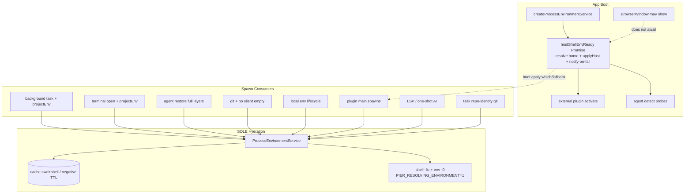

# Shell 环境对等（Shell Environment Parity）设计

| 字段 | 值 |
|------|-----|
| 日期 | 2026-08-03 |
| 状态 | Draft（评审修订） |
| 作者 | — |
| 相关 | `docs/superpowers/specs/2026-07-07-project-environment-flatten-design.md`、`docs/superpowers/specs/2026-08-02-notification-focus-routed-delivery-design.md` |
| 核心实现 | `src/main/services/process-environment-service.ts` |

## Overview

Pier 是本地 AI 开发工作台。用户在 Terminal.app / iTerm / Warp 中装好 nvm / mise / fnm / Homebrew 后，期望任务（task）、智能体 CLI、插件子进程、Git 远程命令看到**同一套工具链**（`node` / `pnpm` / `PATH` / `NVM_*` / `*_HOME`）。从 Dock / Finder 启动的 Electron 只有精简 GUI PATH，常落到系统自带或旧版 Node，出现：

```text
[WARN] Unsupported engine: wanted: {"node":"^24.15.0"} (current: {"node":"v22.13.1"})
```

这是**宿主产品问题**，不能把「请改你的 `.zshrc` / `.zprofile`」当作主解法。

本设计把产品契约定为 **环境对等（env parity）**：非交互 spawn 的工具链变量与「同 cwd 下用户交互 shell 导出的 env」一致；**不是**完整会话对等（别名、函数、prompt、TTY hook）。实现上以 VS Code `getResolvedShellEnv` 为金标准，统一并硬化已有的 `ProcessEnvironmentService`，淘汰 PATH-only 双轨，失败经 NCS **对用户可见**（boot 时若无 focused key-window 则 pending，**首次 focus 后** toast+inbox，严格对齐 `resolveDeliveryPlan`），分层叠加上 Pier 本地环境与 launch 显式变量。

## Background & Motivation

### 症状与根因

| 场景 | 典型 PATH / Node |
|------|------------------|
| 交互 zsh（读 `~/.zshrc`，nvm default 24.15.0） | `node -v` → v24.15.0 |
| GUI Electron 精简 PATH / 仅 `~/.zshenv` 钉死 22.13.1 | `node -v` → v22.13.1 |
| 后台 task 若 shell resolve 失败 | 静默回落到 GUI 薄 PATH |

根因不是「用户配置错误」，而是：

1. macOS GUI 应用不继承 login shell 的完整环境。
2. Pier 已有完整 shell dump，但存在**并行半吊子路径**与**静默失败**。
3. 插件 / one-shot agent 仍有站点直接 `...process.env` 或混合快照。

### 业界调研

#### VS Code（Electron 金标准）

- 实现：`src/vs/platform/shell/node/shellEnv.ts` → `getResolvedShellEnv`
- macOS/Linux：spawn 用户默认 shell，参数 `-i -l -c`（login + interactive，**无 TTY**）
- dump：`node -p 'JSON.stringify(process.env)'` + UUID 标记；解析后进程级缓存
- 超时：`application.shellEnvironmentResolutionTimeout`（默认 10s）
- 跳过：Windows（独立路径）；`VSCODE_CLI` 启动且未 `--force-user-env`；`--force-disable-user-env`
- Tasks：resolved env + **非 login** `sh -c`；集成终端仍开真实 login shell
- 失败：**用户可见**，不静默薄 PATH

#### JetBrains

- 终端：真实 shell profile
- Run Config：IDE env + 可选 shell inherit
- Path Variables / SDK 配置为产品自有路径

#### 终端应用（iTerm2 / Warp / Ghostty）

- 交互 login shell → tab 内天然正确
- **不解决** headless task spawn

#### Agent 产品（Cursor Agent 等）

- 非交互 shell 仍常坏；社区 workaround 手动 source zprofile
- 业界未统一；VS Code resolve-shell-env 仍是参考实现

#### 模式对比

| 模式 | 优点 | 缺点 |
|------|------|------|
| `shell -ilc` dump + cache | 覆盖 nvm/mise/brew | rc 须非交互安全；慢；有副作用 |
| 仅 PATH merge | 简单 | 丢 `NVM_*`、SDK 变量 |
| 逼用户改 `.zprofile` | 稳定 | 把产品债外抛 |
| 继承活体终端会话 | 最接近「这个 tab」 | 无终端失败；多窗 |
| 捆绑工具链 | 可复现 | 与用户 version manager 对抗 |
| OS login-env API（macOS `launchctl` / login plist） | 无 spawn shell | **拿不到** nvm 等 shell 函数导出的 PATH；不完整 |
| direnv export 作独立层 | 项目级精确 | 可选增强；非本阶段必做 |

**结论**：采用 VS Code 模式（login+interactive dump + cache + 非 login 执行 + 失败可见），不要求用户改 rc 作主路径。

### Pier 现状（已读代码核实）

#### 已有：完整 shell 环境服务

`src/main/services/process-environment-service.ts`

- `source`: `"agent" | "plugin" | "task" | "terminal"`
- dump：`spawn(shell, ["-lic", shellEnvCommand()])`，标记 `__PIER_ENV_START__` / `__PIER_ENV_END__`，`/usr/bin/env -0`
- 合并顺序：`baseEnv` → `shellEnv` → `clientEnv` → `agentEnv` → `profileEnv` → `explicitEnv`
- 缓存键：`cwd\0shell\0source`；同键 `inFlight` 去重
- 失败：`shellEnvStatus: "failed"` → shell 层为空，**仅** `console.warn`，无用户通知
- Windows：`shellEnvStatus: "skipped"`
- 默认超时：10s（与 VS Code 同量级）
- 已剥离 Pier 内嵌 `ESBUILD_BINARY_PATH`（asar.unpacked 路径）

#### 已正确走 resolve 的路径

| 入口 | 文件 | source | 备注 |
|------|------|--------|------|
| 后台 task | `services/tasks/background-runs.ts` | `task` | **未**注入 `project.env` |
| task 列表预热 | `app-core/commands/run.ts` `prewarmTaskEnvironments` | `task` | |
| 终端 open / launch | `app-core/commands/panel.ts` | `terminal` | 完整分层：agentEnv / clientEnv / profileEnv / explicitEnv |
| worktree 开终端 | `app-core/commands/worktree.ts` | 经 terminal.open | 已 `resolveForWorktree` → `launch.env` → explicitEnv |
| 恢复 agent launch | `ipc/terminal/create-env.ts` | `agent` | **仅** `{ cwd, source }`，覆盖 `launch.env`，**丢分层**（须修） |
| 本地环境 setup/cleanup | `services/local-environment-scripts.ts` | `terminal` | `explicitEnv: project.env`（应迁 `projectEnv`） |
| Git（主路径） | `app-core/index.ts` → `createGitService({ resolveEnvironment })` | `plugin` | `withResolvedEnvironment` 失败时静默 `env = {}`（须修） |

执行策略（正确，须保留）：

- `background-runner.ts`：`spawn("/bin/sh", ["-c", command], { env })` — **故意非 login**，避免二次 login 冲掉已 resolve 的 PATH
- `local-environment-scripts.ts`：同样 `/bin/sh -c` + resolved env
- 交互终端面：Ghostty 真实 login shell；agent CLI 另经 `create-launch.ts` 的 `/bin/sh -lc` 包装（避免 argv0=`-binary` 问题），与 env resolve 正交

#### 并行残缺路径（问题）

| 问题 | 位置 | 行为 |
|------|------|------|
| PATH-only hydrate | `agents/detection-service.ts` `ensurePath` / `defaultHydratePath` | `shell -ilc 'echo $PATH'`（**5s** 超时）写回 `process.env.PATH`；**不**带 NVM_* / SDK |
| 插件激活前只 ensurePath | `app-core/managed-plugin-runtime-reconciler.ts` + `app-core/index.ts` | `createAgentDetectionService` + reconciler **先于** `createProcessEnvironmentService()`（~L319） |
| 插件 processEnv 读 live PATH | `plugins/external-plugin-process-env.ts` | getter 仅 PATH/HOME/CODEX_HOME/GROK_HOME |
| 插件 spawn 混用 | `packages/plugin-codex` / `plugin-grok` / `plugin-claude` | 多处 `...process.env`；codex-usage 亦然 |
| AI one-shot | `services/ai/service.ts` `defaultRunOneShot` | `env: process.env` |
| LSP | `services/lsp/session-host.ts` 等 | `process.env` + launch.env |
| task repo-identity | `services/tasks/repo-identity.ts` | `spawn("git", …, { env: process.env })` |
| 失败静默 | `process-environment-service.ts` `warnDiagnostics` | 仅 console |

#### 本地环境叠层（已有设计）

见 `2026-07-07-project-environment-flatten-design.md`：项目一份 `setupCommand / cleanupCommand / env`。lifecycle 已把 `project.env` 作 `explicitEnv` 叠在 shell 之上。worktree 开终端已注入；**后台 task 未注入**——见 Key Decision K7（v1 范围已关闭）。

#### CLI 注入

`bin/pier.mjs` 对部分命令附带 `clientEnv: safeClientEnv(process.env)`，经 command envelope 进入 `ProcessEnvironmentResolveRequest.clientEnv`。这是「从终端启动 CLI 控制已运行的 Pier」的路径，**不是**「Dock 启动的 GUI 进程继承交互 shell」的替代。

#### 不在本设计 spawn 收敛范围

- MCP catalog / agent-mcp：文件读取为主，不 spawn 用户 shell 工具链
- managed-plugins HTTP 拉索引：网络 I/O；仅当本地 spawn CLI 校验时才要求 resolve
- Electron 自身 / `ELECTRON_RUN_AS_NODE` Windows LSP supervisor：故意用 process.env

### 与产品目标的差距

1. 双轨水合：完整 `ProcessEnvironmentService` vs PATH-only `ensurePath`
2. shell resolve 失败 → 静默薄 PATH
3. 并非所有 spawn 入口保证走 resolve
4. 无成文「env parity vs session parity」契约
5. 无用户可见诊断（Settings 终端区健康 / NCS）
6. 插件可能冻结 activate 时 PATH 或再 merge `process.env` 不一致
7. 纯 chpwd / prompt hook 的 direnv 类工具非一等公民
8. agent restore 路径丢 launch 分层
9. boot 与 plugin activate 竞态 / 服务创建顺序错误

## Goals & Non-Goals

### Goals

1. **Env parity**：对同一 `cwd`，task / agent / plugin 非交互 spawn 上：
   - `node -v`、`which pnpm`、`which node` 与交互 shell 一致
   - `PATH` 及 version manager 相关变量（`NVM_*`、`FNM_*`、`MISE_*`、`ASDF_*`、`VOLTA_*`、常见 `*_HOME`）与 shell dump 一致
2. **单一 resolve 实现**：`ProcessEnvironmentService` 是**唯一** shell 水合源；`defaultHydratePath` / `echo $PATH` **删除**，不留 fallback
3. **失败可见**：timeout / 解析失败 → 诊断 + NCS（**focused Pier key-window** 时 inbox + 形态 B toast；对齐 `resolveDeliveryPlan`）+ Settings 终端区健康态；**不假装**对等。**Boot apply 与失败通知同 PR 交付**
4. **分层明确**（后者覆盖前者，与 §6 规范表一致）：  
   `base → shell → clientEnv → agentEnv → profileEnv → projectEnv → explicitEnv`  
   语义：**项目 KV（projectEnv）覆盖 agent 默认 env**；仅 **explicit/task 一次性 env** 高于 project。  
   **v1** 对 lifecycle + 后台 task + terminal open（cwd 可映射到项目时）注入 `projectEnv`
5. **对齐 VS Code 模型**：login+interactive dump、非 login 执行、可配置超时
6. **不要求用户改 rc 作主解法**；文档可附「rc 非交互安全」为次要排障

### Non-Goals

- 完整交互会话对等（alias、function、prompt、zsh hook 链）
- 每个 task 变成交互 TTY
- 保证用户 rc 在非交互下挂起/读 prompt 仍成功（必须失败可见）
- 修复 Pier 外第三方 agent shell（边界写清）
- 本阶段 Windows 全量重设计（`skipped` + UI 标明 macOS/Linux）
- 捆绑 Node/pnpm 取代用户 version manager
- 把 direnv 做成完整集成产品（可选后续 `direnv export`）
- 扩展 `OS_ELIGIBLE_KINDS` 给 shell-env（不走系统通知打断）

## 产品契约（Env Parity Contract）

### 定义

**环境对等**：在给定 `cwd` 与用户默认 shell 下，Pier 非交互子进程看到的**工具链相关环境**与「无 TTY 的 login+interactive shell 导出的 `process.env`」在可观察工具链键上一致。

**会话对等（不做）**：交互 shell 的瞬时状态（当前 alias 定义、未 export 的函数、prompt 侧 transient 变量）。

### 验收命令清单（同一 cwd）

在用户交互终端与 Pier task/agent/plugin spawn 中分别执行，期望一致：

```bash
node -v
which node
which pnpm
which npm
echo "$PATH"   # 段集合等价（顺序以 shell dump 为准；允许 Pier 层显式前置）
command -v mise || true
command -v nvm || true   # nvm 多为 shell 函数：非目标；但 NVM_DIR + PATH 中 node 须对
```

可选诊断采样（写入 diagnostics，不强制 UI 默认展示密钥）：

- `env.PATH` 哈希 / 首尾段
- `NODE_VERSION` / `NVM_BIN` / `FNM_MULTISHELL_PATH` 等存在性
- 解析后 `which node` 一次（host-side，超时短）

### 边界声明

| 在契约内 | 在契约外 |
|----------|----------|
| export 进 env 的变量 | 仅 alias/function 可见的命令名 |
| nvm/mise 改 PATH 后的 node 二进制 | zsh 补全、prompt |
| 同 cwd 的 shell dump | 另一 worktree 的 direnv 未 export 状态 |
| Pier 注入的 project.env / task.env | 第三方独立进程（用户在外置 Terminal 手开的 agent） |

## Proposed Design

### 架构总览



**原则**：`ProcessEnvironmentService` 是唯一 shell dump 实现；`ensurePath` / `defaultHydratePath` **删除**；reconciler 注入 **`hostShellEnvReady`**（同一 Promise），禁止第二套 dump。

### 1. 单一 ProcessEnvironmentService

#### 保留并硬化

文件拆分（避免 500 行门禁，PR1 起）：

| 文件 | 职责 |
|------|------|
| `src/main/services/process-environment/service.ts` | `resolve` / cache / merge / 对外 API |
| `src/main/services/process-environment/shell-env-loader.ts` | `-lic` dump + parse markers |
| `src/main/services/process-environment/apply-host-env.ts` | 白名单 apply / refresh / 禁止列表 |
| `src/main/services/process-environment/diagnostics.ts` | 类型与 host diagnostics 存储 |
| 或保留单文件 + 立即抽出 loader/apply 若逼近上限 | 以 `check:file-size` 为准 |

| 能力 | 现状 | 变更 |
|------|------|------|
| dump 命令 | `-lic` + `env -0` + markers | **保留**；见 fish fallback |
| 超时 | 10s 硬编码；ensurePath 另 5s | **统一 10s**（prefs 可配） |
| 失败 | console.warn | `onShellEnvFailed` 回调 + 负缓存 |
| 缓存键 | `cwd\0shell\0source` | **`cwd\0shell`** |
| marker env | 无 | `PIER_RESOLVING_ENVIRONMENT=1` |
| Windows | skipped | 保持；Settings 标明 |

#### dump 细节（规范）

```ts
// 伪代码
spawn(shell, ["-lic", shellEnvCommand()], {
  cwd,
  env: {
    ...baseEnv,
    PIER_RESOLVING_ENVIRONMENT: "1",
    TERM: baseEnv.TERM ?? "dumb",
  },
  stdio: ["ignore", "pipe", "pipe"],
});
```

Shell 选择（已实现，锁定）：

1. `process.env.SHELL`
2. `os.userInfo().shell`
3. darwin → `/bin/zsh`；linux → `/bin/sh`

**已知良好**：zsh、bash 的 `-lic`。

**非 zsh/bash（fish / nushell 等）v1**：

1. 仍尝试 `-lic`
2. 若 spawn 立即失败（ENOENT / bad option / 非 0 且无 markers）：**一次** fallback：非 login 非 interactive `-c` 仅 dump env（`shell -c '…env -0…'`），成功则 `shellEnvStatus: "resolved"` 并在 diagnostics 记 `dumpMode: "non-login-fallback"`
3. fallback 仍失败 → `failed` + 用户文案提示「请将默认 shell 设为 zsh/bash，或检查 shell 是否可在非交互下运行」
4. 不无限重试；进入负缓存

#### 为何保留 env -0 而非 VS Code node JSON

- 已有单测与生产路径（`parseShellEnvironmentOutput`）
- 不依赖系统 `node` 在 dump 阶段可用
- 零分隔更抗值内换行

### 2. 退役 ensurePath 双轨 + Boot 序列

#### 目标状态（规范）

1. **先** `createProcessEnvironmentService`（prefs 初值 + **`onShellEnvFailed` 作为失败通知的唯一入口**）
2. 创建 **单一** Promise：
   ```ts
   // 失败通知唯一入口：构造期注入，resolve 内部在真实 dump failed 时调用一次
   // onShellEnvFailed → tryDeliverShellEnvFailureNotify（见 §8）
   const processEnvironment = createProcessEnvironmentService({
     timeoutMs: prefs.shellEnvironment?.timeoutMs ?? 10_000,
     // disabled 用可变 ref，见 §9 prefs live-update
     isDisabled: () => prefsRef.shellEnvironment?.disabled === true
       || process.env.PIER_FORCE_DISABLE_SHELL_ENV === "1",
     getTimeoutMs: () => prefsRef.shellEnvironment?.timeoutMs ?? 10_000,
     onShellEnvFailed: (d) => tryDeliverShellEnvFailureNotify(d),
   });

   const hostShellEnvReady: Promise<ProcessEnvironmentDiagnostics> =
     (async () => {
       const result = await processEnvironment.resolve({
         cwd: app.getPath("home"),
         source: "plugin",
       });
       processEnvironment.recordHostDiagnostics(result.diagnostics);
       if (
         result.diagnostics.shellEnvStatus === "resolved" ||
         result.diagnostics.shellEnvStatus === "cached"
       ) {
         applyHostProcessEnv(result, { mode: "replace-whitelist" });
       }
       // failed：不 apply；**禁止**此处再调 notify — 已由 onShellEnvFailed 统一调度
       // skipped (win32 / disabled): 仅 record
       return result.diagnostics;
     })();
   ```
3. **删除** `defaultHydratePath` / `mergeLoginShellPath` 产品路径（单测可保留纯函数测试或一并删除）
4. **删除** `agentDetection.ensurePath` 的独立 shell dump；若保留 API 名作兼容，实现必须是 `() => hostShellEnvReady.then(() => undefined)`，**禁止**再 `echo $PATH`
5. reconciler 选项改名为语义清晰的 `waitForHostEnv?: () => Promise<void>`，注入 `() => hostShellEnvReady.then(() => undefined)`
6. **窗口**：第一个 BrowserWindow **可以**在 `hostShellEnvReady` 完成前显示（不阻塞 UI）
7. **external main activate / reload**：**必须** `await hostShellEnvReady`（经 reconciler）
8. **agent detect / which 探针**：**必须** await ready 后再 `probeCommand`
9. 禁止 boot PES dump + 残留 `defaultHydratePath` 双 dump（≤10s+5s）
10. **单测**：home resolve 失败一次 → `onShellEnvFailed` 恰 1 次；未 focus 时 pending 且 0 ingest；`getFocused()` 后恰 1 次 NCS ingest

```mermaid
sequenceDiagram
  participant Main as app-core
  participant PES as ProcessEnvironmentService
  shell as user shell
  participant Notify as shell-env notify pipeline
  participant Win as BrowserWindow
  participant Rec as plugin reconciler

  Main->>PES: create (onShellEnvFailed → tryDeliver only)
  Main->>Main: hostShellEnvReady = resolve(home) + apply on ok
  Main->>Win: create window (non-blocking)
  par boot resolve
    Main->>PES: resolve home
    PES->>shell: -lic dump
    shell-->>PES: env or fail
    alt ok
      Main->>Main: applyHostProcessEnv + recordHostDiagnostics
    else fail
      PES->>Notify: onShellEnvFailed → tryDeliver (pending if unfocused)
      Main->>Main: recordHostDiagnostics only (no second notify)
    end
  and plugins
    Rec->>Main: await hostShellEnvReady
    Main-->>Rec: diagnostics
    Rec->>Rec: activate plugins
  end
  Note over Notify,Win: tryDeliver only when getFocused() non-null (NCS key-window)
```

#### `applyHostProcessEnv`（安全约束）

**角色**：仅宿主便利——`which`、插件 `processEnv` getter、无 cwd 的 host-side probe。  
**不是** per-cwd 子进程 env 的真源：cwd 敏感 spawn **必须** `resolve().env` 全量（含 shell 层全部 export，不只白名单）。

```ts
type ApplyMode = "replace-whitelist"; // v1 唯一模式

/** 永不从 shell 写入宿主 process.env（Electron / 动态链接风险） */
const NEVER_APPLY_TO_HOST = [
  "DYLD_LIBRARY_PATH", "DYLD_INSERT_LIBRARIES", "DYLD_FRAMEWORK_PATH",
  "LD_LIBRARY_PATH", "LD_PRELOAD",
  "ELECTRON_*", // 前缀匹配
  "NODE_OPTIONS",
  "NODE_PATH",
  "OPENSSL_CONF",
] as const;

/**
 * 白名单：PATH + version-manager / 语言家 / agent home 前缀。
 * 非穷举静态表：另支持「已知前缀」扩展，避免无限列表却漏 NVM。
 */
const EXACT_KEYS = [
  "PATH", "MANPATH",
  "NVM_DIR", "NVM_BIN", "NVM_CD_FLAGS", "NVM_INC",
  "FNM_DIR", "FNM_MULTISHELL_PATH", "FNM_NODE_VERSION", "FNM_ARCH",
  "ASDF_DIR", "ASDF_DATA_DIR", "ASDF_DEFAULT_TOOL_VERSIONS_FILENAME",
  "MISE_DATA_DIR", "MISE_SHELL", "MISE_CONFIG_DIR",
  "VOLTA_HOME", "BUN_INSTALL", "PNPM_HOME",
  "GOPATH", "GOROOT", "GOBIN",
  "CARGO_HOME", "RUSTUP_HOME",
  "JAVA_HOME", "ANDROID_HOME", "ANDROID_SDK_ROOT",
  "PYENV_ROOT", "RBENV_ROOT", "SDKMAN_DIR",
  "CONDA_PREFIX", "CONDA_DEFAULT_ENV", "VIRTUAL_ENV",
  "XDG_DATA_HOME", "XDG_CONFIG_HOME", "XDG_CACHE_HOME",
  "CODEX_HOME", "GROK_HOME", "CLAUDE_CONFIG_DIR",
] as const;

/** 额外：名称匹配 /^(NVM|FNM|ASDF|MISE|VOLTA|PYENV|RBENV|SDKMAN|CONDA)_/ 且不在 NEVER 中 */
```

规则：

1. **failed / skipped**：不 apply；不清除用户已有 PATH
2. **replace-whitelist（reload / reapplyHost）**：对白名单（+ 前缀匹配）键，用新 shell 值**覆盖**；若新 shell **不再导出**某键而旧 host 上该键是上次 apply 写入的，则 **delete** `process.env[key]`（避免陈旧 `NVM_BIN`）。实现用 `lastAppliedKeys: Set<string>` 跟踪
3. **禁止**把完整 shell env 灌进 Electron main
4. **并发**：`apply` / `invalidate({ reapplyHost })` 串行化（mutex / 链式 Promise），禁止并行 replace
5. **与 PES baseEnv 关系**：`baseEnv` 在 **构造时** 快照 cleaned Electron env，**不**随 apply 改写。失败 dump 后子进程 merge 仍是 thin base + 上层；host `process.env` 可能已是上次成功 apply 的状态——diagnostics 必须区分 `hostAppliedStatus` vs 本次 `shellEnvStatus`，避免 UI 显示「已对等」而最新 resolve 失败

```ts
interface ProcessEnvironmentDiagnostics {
  // …既有字段
  hostAppliedStatus?: "applied" | "not-applied" | "stale-after-fail";
  dumpMode?: "login-interactive" | "non-login-fallback";
}
```

### 3. Spawn 入口清单（必须分类）

工程师验收时应用 grep 复核。治理 allowlist 三类：

| 类 | 含义 |
|----|------|
| **A** | 必须 `processEnvironment.resolve`（或注入的 resolved env） |
| **B** | 允许依赖 boot apply 后的 `process.env`（无 cwd / which / 短探针） |
| **C** | 故意裸 `process.env`（Electron 自身、Windows supervisor） |

| # | 场景 | 文件 | 类 | 现状 | 目标 |
|---|------|------|----|------|------|
| 1 | 后台 task | `tasks/background-runs.ts` | A | resolve task；无 projectEnv | + `projectEnv` 查找 |
| 2 | task 执行 | `tasks/background-runner.ts` | A | sh -c + env | 保持非 login |
| 3 | task 预热 | `commands/run.ts` | A | prewarm | 保持 |
| 4 | 终端 open | `commands/panel.ts` | A | 完整分层 | + projectEnv 当 cwd 可映射 |
| 5 | worktree 开终端 | `commands/worktree.ts` | A | launch.env = project.env | 迁 projectEnv 槽位（语义） |
| 6 | **agent restore** | `ipc/terminal/create-env.ts` | A | **仅 cwd；覆盖 launch.env** | **修复全分层**（见下） |
| 7 | 终端 create handler | `ipc/terminal/create-handler.ts` | A | 经 create-env | 随 #6 |
| 8 | local env lifecycle | `local-environment-scripts.ts` | A | explicitEnv=project.env | `projectEnv`；source 可用 `task` |
| 9 | Git 主路径 | `git/service-support.ts` | A | resolve；**catch 静默 env={}** | catch → 记 diagnostics；fallback 用 boot apply 后 process.env 的 clean 子集，**禁止空对象装成功** |
| 10 | task repo-identity | `tasks/repo-identity.ts` | A 或 B | process.env | 优先 resolve(cwd) 或注入 env；至少 B |
| 11 | agent detection | `agents/detection-service.ts` | B | PATH-only dump | await hostShellEnvReady only |
| 12 | plugin reconciler | `managed-plugin-runtime-reconciler.ts` | — | ensurePath | await hostShellEnvReady |
| 13 | plugin processEnv | `external-plugin-process-env.ts` | B | 窄 getter | 扩 agent homes；见 §12 |
| 14 | Codex login/usage | `packages/plugin-codex/**` 含 `codex-usage.ts` | A/B | process.env | host 水合 env |
| 15 | Grok spawn | `packages/plugin-grok/**` | A/B | 混合 | 统一；删 PATH 盖回补丁 |
| 16 | Claude provider | `packages/plugin-claude/**` | A/B | processEnv 优先 | 全量 host env |
| 17 | AI one-shot | `services/ai/service.ts` | A | process.env | resolve({ cwd, source: "agent" }) |
| 18 | LSP session | `services/lsp/session-host.ts` 等 | A/B | process.env+launch | boot apply 后 which；**session spawn 用 resolve(workspaceRoot)** 合并 launch.env |
| 19 | Windows LSP supervisor | `lsp/windows-supervisor.ts` | C | ELECTRON_RUN_AS_NODE | 保持 C |
| 20 | SSH plugin | `packages/plugin-ssh` | B | processEnv | 确认不冲 PATH |
| 21 | MCP catalog | agent-mcp 等 | — | 文件读 | **排除**本设计收敛 |
| 22 | managed install HTTP | `managed-plugins/*` | C/A | 多数无关 | spawn 本地 CLI 时 A |

**治理测试**：`tests/unit/main/shell-env-spawn-governance.test.ts`  
扫描 `src/main` + `packages/plugin-{codex,grok,claude,ssh}` 的 `spawn`/`execFile`；每处必须标注 A/B/C；C 必须注释理由。

#### Agent restore 分层修复（明确 **不** keep-as-is）

**持久化事实**（`ipc/terminal/initial-session.ts` `toRestoreLaunch`）：

- `TerminalAgentRestoreLaunchOptions` **故意省略 `env`**
- session 落盘 / 重开的 `savedAgent.launch` **通常没有 env**
- 因此 restore 路径的主职责是：**新鲜 shell PATH + 重新注入 projectEnv**（及 profile 若有），**不是**从 session JSON 回放账号密钥

账号密钥 / agent 默认 env 来自**新开** launch 管道（账号 facade / launch registry），不保证在 restore 路径上出现。

`resolveRestoredAgentLaunchEnv` 现状错误：resolve 后整表覆盖 `launch.env`（若有），且未叠 projectEnv。

目标 merge 形状（与 §6 同序；**有** prior env 时防御性保留为 agentEnv）：

```ts
export async function resolveRestoredAgentLaunchEnv(
  launch: ResolvedTerminalLaunchOptions | undefined,
  processEnvironment: ProcessEnvironmentService,
  options?: {
    projectEnv?: Record<string, string>;
    clientEnv?: Record<string, string>;
    profileEnv?: Record<string, string>;
  }
): Promise<ResolvedTerminalLaunchOptions | undefined> {
  if (!launch) return;
  // 仅当调用方仍持有 env（registry / 测试 / 未来扩展）时作 agentEnv；
  // session restore 常见 priorAgentEnv === undefined
  const priorAgentEnv = launch.env;
  const resolved = await processEnvironment.resolve({
    cwd: launch.cwd,
    source: "agent",
    ...(options?.clientEnv ? { clientEnv: options.clientEnv } : {}),
    ...(priorAgentEnv ? { agentEnv: priorAgentEnv } : {}),
    ...(options?.profileEnv ? { profileEnv: options.profileEnv } : {}),
    ...(options?.projectEnv ? { projectEnv: options.projectEnv } : {}),
  });
  return { ...launch, env: resolved.env };
}
```

##### 调用方：`create-handler` 必须接线 projectEnv（PR3）

`create-handler.ts` 今日只注入 `processEnvironment`，**无** `localEnvironments`。仅改 create-env 签名不够。

PR3 规范步骤：

1. 抽出共享 helper（单实现，禁止三处各写查找）：
   ```ts
   // 建议：src/main/services/process-environment/resolve-project-env.ts
   // 或 local-environments 旁的 thin helper
   async function resolveProjectEnvForSpawn(input: {
     cwd?: string;
     projectRootPath?: string;
     localEnvironments: LocalEnvironmentsService;
   }): Promise<Record<string, string> | undefined>
   ```
2. 算法见 §6「查找算法」（`resolveForWorktree` → `resolveProject`；**无**前缀扫描）
3. terminal IPC 注册（`ipc/terminal/index.ts`）注入 `localEnvironments` 或上述 helper
4. `create-handler` 在 `resolveRestoredAgentLaunchEnv` 前：
   ```ts
   const projectEnv = await resolveProjectEnvForSpawn({
     cwd: nativeLaunchBase?.cwd ?? launch.context?.cwd,
     projectRootPath: launch.context?.projectRootPath,
     localEnvironments,
   });
   await resolveRestoredAgentLaunchEnv(nativeLaunchBase, processEnvironment, {
     ...(projectEnv ? { projectEnv } : {}),
   });
   ```
5. **同一 helper** 供 `background-runs.ts`、`commands/panel.ts`（terminal open）使用

单测：

- (a) 可选 prior `launch.env.MY_SECRET=1` → merge 后仍在（agentEnv 防御路径）且 PATH 来自 shell
- (b) prior env **空**（真实 session restore）→ 仍有 shell PATH + projectEnv（当项目可解析时）
- (c) 不整表用 resolve 结果抹掉未参与 merge 的 launch 字段（command/cwd/agentId）

### 4. Spawn 策略（执行侧）

| 表面 | 策略 |
|------|------|
| 后台 task / lifecycle script | resolve 后 **`/bin/sh -c`**（非 login、非 interactive） |
| 交互终端（用户 shell） | Ghostty 真实 login shell；env 仍经 resolve 注入 panel env |
| Agent CLI 在终端内 | resolve env + `wrapAgentTerminalCommand` → `/bin/sh -lc` |
| 插件 headless CLI | resolve 后直接 spawn binary 或 `sh -c`，**禁止**再 `-l` 除非文档化 |

**禁止双重 login**：resolve 已 `-lic` dump；执行再 `-l` 会冲 PATH。

### 5. 缓存

| 项 | 决策 |
|----|------|
| 键 | **`cwd + shell`**（去掉 source） |
| 成功 | 缓存 env 至进程结束或 `invalidate` |
| **失败负缓存** | 同一 `cwd+shell` 在 **30s TTL** 内不重 dump；返回 `shellEnvStatus: "failed"` + 缓存的 error；TTL 后允许一次重试 |
| 并发 | 保留 inFlight；失败时所有 waiter 同失败 |
| status 语义 | 可选修正：inFlight 结束后后来者若读到成功 cache 报 `"cached"`（非必须，测试更新即可） |
| 通知去重 | **独立于** dump 负缓存：NCS dedupeKey + 进程内 `notifiedShellEnvFailure` 旗标 |
| 失效 | `invalidate({ reapplyHost?: boolean })`：清正/负 cache；可选 re-resolve home + apply |

### 6. 分层顺序（规范表 · 全文唯一真源）

**后者覆盖前者**。此表、Goals #4、§15 关系图、API `mergeEnv` **必须一致**（K21）。

| 序 | 层 | 来源 | 说明 |
|----|----|------|------|
| 0 | cleaned base | Electron `process.env`（**构造时**快照） | 非法键 + Pier ESBUILD 剥离 |
| 1 | resolved shell | `-lic` dump | 用户工具链真源 |
| 2 | clientEnv | CLI envelope | 仅 pier CLI 发起的命令 |
| 3 | agentEnv | launch.agent / 账号默认 | panel 新开；restore 仅当 prior env 仍在内存 |
| 4 | profileEnv | terminal profile | |
| 5 | **projectEnv** | local-environments `project.env` | **覆盖** agent 默认同名键（对齐今日 worktree 把 project 推到高位） |
| 6 | explicitEnv | task/launch 一次性 | **最高**用户意图 |
| 7 | strip | 内嵌 ESBUILD 等 | cleanEnv 全程 |

```ts
// 规范 merge — 顺序不可与上表分歧
mergeEnv(
  baseEnv,
  shellEnv,
  request.clientEnv,
  request.agentEnv,
  request.profileEnv,
  request.projectEnv,
  request.explicitEnv
);
```

**必测优先级**（PR1 单测）：

```ts
// agentEnv.FOO=a, projectEnv.FOO=b, explicitEnv.FOO=c → env.FOO === "c"
// agentEnv.FOO=a, projectEnv.FOO=b, 无 explicit → env.FOO === "b"
// 仅 agentEnv.FOO=a → env.FOO === "a"
```

语义一句话：**project KV 覆盖 agent 默认；explicit 覆盖 project**。  
（Goals 旧文案「agent secrets 最高」已废弃，勿再写回。）

#### K7 决议：`projectEnv` v1 注入范围

| 调用方 | v1 |
|--------|-----|
| lifecycle setup/cleanup | **是** — `projectEnv: project.env`（不再塞 explicitEnv） |
| **后台 task** | **是** — 见下方查找算法 |
| **terminal open** | **是** — 同上 |
| agent restore | **是** — create-handler 查 projectEnv 传入（session 通常无 prior agent env） |

#### 查找算法（仅用既有 service API · v1 不做前缀扫描）

`local-environments-service.ts` 已有：

- `resolveForWorktree(worktreePath)` — **仅当**存在 worktree binding，否则 `null`
- `resolveProject(projectRootPath)` — 按项目根取 `LocalEnvironmentProject`

**规范算法** `resolveProjectEnvForSpawn({ cwd, projectRootPath })`：

```text
1. 若 cwd 有值：
     binding = await localEnvironments.resolveForWorktree(cwd)
     若 binding ≠ null → return binding.project.env
2. 若 projectRootPath 有值（task.launch.projectRootPath / panel context.projectRootPath）：
     project = await localEnvironments.resolveProject(projectRootPath)
     若 project ≠ null → return project.env
3. 否则 → undefined（不注入 projectEnv）
```

- **禁止** v1 新增「沿父路径前缀扫 projects[]」；若产品日后需要，单独 helper + 测试，不混进本阶段。
- worktree 开终端今日经 `resolveForWorktree` → `launch.env`；PR3 改为同一 helper → `projectEnv` 槽位。

PR1 可只加 `projectEnv` 字段并保持 lifecycle 仍可临时走 explicitEnv（兼容）；**PR3 完成所有调用方迁移 + 共享 helper**，验收以 task+terminal+lifecycle 为准。

### 7. direnv / 项目工具

| 机制 | 支持模型 |
|------|----------|
| 工具在 shell rc / chpwd 于 `-lic` + cwd 时 export | ✅ shellEnv |
| 仅 prompt 钩子 | ❌ |
| Pier `project.env` KV | ✅ 层 5 |
| 未来 `direnv export json` | 可选，非本阶段 |

### 8. 失败 UX（对齐 NCS 聚焦路由）

#### 事实约束（代码核实）

- `NOTIFICATION_KINDS`：`agent.attention` | `agent.turn-finished` | `agent.runtime` | `task-run.finished` | `app.update` | **`channel.health`** | `plugin.event` | `operation.result`
- `OS_ELIGIBLE_KINDS`：**仅** `agent.attention` | `agent.turn-finished`（`src/shared/notification-delivery.ts`）
- 无 key-window 且 kind ∉ OS_ELIGIBLE → **仅 inbox**，无 toast、无 OS
- 形态 B toast 的 **body 必备**（友好下一步；类型行回退仅防御）
- 系统事件只走 NCS；禁止裸 `toast` / 禁止业务直调 OS API

#### 决议（关闭 Open Question #2）

| 项 | 值 |
|----|-----|
| **kind** | **`channel.health`**（既有；宿主通道健康，不扩 kind 表、不进 OS_ELIGIBLE） |
| **severity** | **`warning`** |
| **source** | `"host"` |
| **trigger** | `"system-event"` |
| **dedupeKey** | `"shell-env-resolution-failed"` |
| **titleKey** | `notifications.shellEnv.failedTitle` |
| **body** | 已 resolve 的友好字符串（下一步）；**强制非空** |
| **actions** | `[{ id: "open-settings", labelKey: "notifications.shellEnv.openSettings" }]`；`actionParams: { section: "terminal" }` |
| **mutedKinds** | 用户可静音 `channel.health` → 仍落 inbox，无 toast（既有投递语义） |
| **DND** | warning 被挡 toast；仍 inbox |

**不**把 shell-env 加入 `OS_ELIGIBLE_KINDS`（避免启动期系统横幅；与 agent 打断不同级）。

#### 投递时序（boot 无 key-window）

对齐「进程级一次通知」思路（参考 `app-updates/notify-ready.ts`），补齐 key-window：

**失败通知唯一入口**：PES 构造注入的 `onShellEnvFailed` → 只调 `tryDeliverShellEnvFailureNotify(diagnostics)`。  
boot 的 `hostShellEnvReady` **禁止**再直接 `notify*`（避免双调度；见 §2 伪代码）。

1. 真实 shell dump **failed**（非负缓存命中也可选择不重复调 callback——建议仅真实 dump 失败触发；负缓存命中只返回 failed diagnostics）  
   → `onShellEnvFailed` → `tryDeliverShellEnvFailureNotify`  
2. 置 `shellEnvFailurePendingNotify = true`；缓存 diagnostics  
3. **`tryDeliverShellEnvFailureNotify()`** 规则（**严格对齐 NCS，不改 `resolveDeliveryPlan`**）：
   - 若 `shellEnvFailureNotified` → return  
   - 若 **无 focused Pier key-window** → return（pending 保持 true；**不** ingest）  
   - 否则 ingest **一次**完整 report（无 `suppressToast`）→ toast + inbox → 置 notified  
4. **可投递判定 = NCS `hasFocusedPierWindow`，不得更宽**：
   ```ts
   // 与 src/main/ipc/notification-center.ts readFocusBase 一致：
   // hasFocusedPierWindow: Boolean(getFocused() && !destroyed)
   // resolveDeliveryPlan: 无 focused → toast=false；channel.health ∉ OS_ELIGIBLE → 无 OS
   // 因此 getAll()[0]  alone 只能 inbox，**不能**当 toast 条件（禁止）
   function hasFocusedPierKeyWindow(windowManager: WindowManager): boolean {
     const focused = windowManager.getFocused();
     return Boolean(focused && !focused.isDestroyed());
   }
   ```
   - **Option A（本设计唯一规范）**：仅当 `getFocused()` 非空时 `tryDeliver`  
   - **禁止** `getFocused() ?? getAll()[0]` 作为 toast 前提（与今日 NCS 矛盾）  
   - **禁止**为本通知单独改宽 `readFocusBase` / `resolveDeliveryPlan`（若未来产品要「任意存活窗即 toast」→ 独立跨切 PR + delivery 单测 + Agents.md，不塞进 shell-env）  
5. **挂钩点（PR2：create + focus 双臂，门闩一次）**：
   - `windowManager.create` 成功后调 `tryDeliver`（若该窗立即 focused 可投递）  
   - `window.host.on("focus")` / 既有 key-window 焦点推送路径再调 `tryDeliver`（覆盖 create 时未 focus / showInactive）  
   - pending 期间可多次调用；**ingest 最多一次**（`shellEnvFailureNotified`）  
   - 健康卡可先读内存 `hostDiagnostics`（不必等 toast）  
6. 用户重启 Pier → 新 process / 新 `bootId` → 可再提示  
7. dedupeKey：`shell-env-resolution-failed:${bootId}`  

**单测（PR2）**：

- boot fail + **零窗** → 0 ingest，pending  
- **仅 create 未 focus** → 仍 0 ingest，pending  
- **首次 getFocused() 非空** → 1 次 ingest（toast+inbox，mock NCS focus=true）  
- 第二窗 / 再次 focus → 仍 1 次

#### 完整 NotificationReport 示例

```ts
{
  kind: "channel.health",
  source: "host",
  severity: "warning",
  trigger: "system-event",
  title: t("notifications.shellEnv.failedTitle"), // 已 resolve 展示串
  titleKey: "notifications.shellEnv.failedTitle",
  body: t("notifications.shellEnv.failedBody"), // 必备：下一步
  dedupeKey: `shell-env-resolution-failed:${bootId}`,
  actions: [{
    id: "open-settings",
    labelKey: "notifications.shellEnv.openSettings",
  }],
  actionParams: { section: "terminal" },
}
```

**`open-settings` action**：契约注释已列 id，但 `runNotificationAction` **尚未实现**。本工作项在 **PR2 最小路径** 或 PR5 必须落地：

```ts
case "open-settings": {
  const section = notification.actionParams?.section ?? "terminal";
  useSettingsDialogStore.getState().openSection(section); // 或 pier API
  break;
}
```

#### Settings 健康 UI 位置（关闭与 project Environment 混放）

| UI | 职责 |
|----|------|
| **Settings → Terminal**（`terminal-section.tsx`） | **宿主 Shell 环境**健康卡：shell 路径、status、错误摘要、pathChanged、node 采样、「重新解析」、超时/禁用偏好 |
| **Settings → Environment**（`environment-section.tsx`） | **仅** 项目 local-environments（setup/cleanup/KV）——**不**放 shell 健康条 |

文案产品词：中文「终端环境 / Shell 环境」；避免与「项目环境变量」混淆。

#### 失败时 resolve 行为

- 仍返回 merge 结果（无 shell 层或负缓存失败）
- UI / diagnostics **不得**显示「已与终端一致」
- task 仍可启动；日志带 diagnostics

### 9. Settings / 配置

| 配置项 | 默认 | 说明 |
|--------|------|------|
| `shellEnvironment.timeoutMs` | **10000** | 唯一超时（删 5s ensurePath） |
| `shellEnvironment.disabled` | false | 跳过 dump → `skipped`；健康卡显示已禁用 |
| ~~`forceResolve`~~ | — | **v1 删除**：无启发式 skip 可覆盖；避免死配置 |
| （只读）host diagnostics | — | 内存；经 IPC/prefs 快照给 Terminal 设置卡 |

存储（锚定既有宿主）：

- 文件：`userData/preferences.json`（既有 preferences 服务）
- Schema：`projectPreferencesSchema` / 类型 **`ProjectPreferences`**（历史命名；**应用级**用户偏好，不是「某个 Git 项目」）
- 增量字段：
  ```ts
  shellEnvironment: z.object({
    timeoutMs: z.number().int().min(1000).max(120_000).default(10_000),
    disabled: z.boolean().default(false),
  }).default({ timeoutMs: 10_000, disabled: false })
  ```
- 同步：`preferences-patch` + `PATCHABLE_KEYS` 增加 `shellEnvironment`；PR5 Terminal 设置走既有 `preferences.update` 路径
- **不是** `local-environments` / 项目 Environment 区；**不要**新建第二套 prefs 文件

#### 单例 PES 与偏好 live-update（规范）

PES 在 app-core boot **创建一次**、进程内单例。prefs **不是**「只读构造参数后冻死」：

| 时机 | 行为 |
|------|------|
| **Boot（PR2）** | 读 prefs → `createProcessEnvironmentService({ getTimeoutMs, isDisabled, onShellEnvFailed })`；loader **每次 dump 前**读 `getTimeoutMs()` / `isDisabled()`（函数/ref，非闭包常量） |
| **PR5 Terminal 设置改 timeout/disabled** | 写 prefs 成功后调用 `processEnvironment.invalidate({ reapplyHost: true })`（或至少 `invalidate()` + 若 disabled 则不再 apply） |
| **disabled=true 中途** | 下一次 `resolve`：**不** spawn shell，直接 `shellEnvStatus: "skipped"`，error 可注 `disabled`；**不**清已 apply 的 host PATH（避免立刻变薄），健康卡显示「已禁用」；用户「重新解析」且 disabled 时 no-op dump |
| **disabled 改回 false** | `invalidate({ reapplyHost: true })` 重新 dump + apply |
| **「重新解析」按钮** | `invalidate({ reapplyHost: true })`；成功/失败刷新 host diagnostics + 必要时再走 notify（若仍 failed 且本进程尚未 notified，可投递；已 notified 则只更新健康卡） |

跳过条件 **仅**：

1. `platform === "win32"` → skipped（UI：Windows 本版本不解析 login shell 环境）
2. `isDisabled()` 为 true（prefs 或 `PIER_FORCE_DISABLE_SHELL_ENV=1`）
3. 无其它启发式

`PIER_FORCE_USER_ENV=1`：**v1 不需要**。

### 10. CLI / GUI 启动

| 启动方式 | 策略 |
|----------|------|
| Dock / Finder / `.app` | **必须** resolve |
| pier CLI → 已运行实例 | 命令级 `clientEnv`（已有） |
| 终端 `open -a` / `pnpm dev` | **仍 resolve**；不启发式跳过 |

### 11. 插件契约

#### Host

- activate **await** `hostShellEnvReady`
- `context.processEnv` live getters **至少**：`PATH`, `HOME`, `CODEX_HOME`, `GROK_HOME`, **`CLAUDE_CONFIG_DIR`**（及文档列出的 agent homes）
- **`resolveProcessEnv` 为 PR4 必选**（非 optional 半迁移）：

```ts
resolveProcessEnv(request: {
  cwd?: string;
}): Promise<{ env: Record<string, string>; diagnostics: ProcessEnvironmentDiagnostics }>;
```

实现：委托单例 `processEnvironment.resolve({ cwd, source: "plugin" })`。

#### Plugin 纪律（PR4 验收）

- production `spawn`/`execFile` in plugin-codex / grok / claude：**必须**使用 host 水合 env（`resolveProcessEnv` 结果或 activate 后刷新的 processEnv 快照 + 显式字段），治理测试锁定
- 删除 Grok「强制 process.env.PATH 盖回」workaround
- codex-usage / login 同等对待

### 12. 测试

| 类型 | 内容 |
|------|------|
| 单元 | **merge 优先级** agent 低于 project 低于 explicit（§6 必测）；cache 键；负缓存 TTL；ESBUILD；timeout；fish fallback |
| 单元 | applyHost 白名单 / NEVER / reapply 删除陈旧键 / 串行 |
| 单元 | restore：(a) 有 prior agentEnv 时保留；(b) 空 prior 仍得 shell+projectEnv；(c) 不丢 command/cwd |
| 单元 | `resolveProjectEnvForSpawn`：binding 优先，否则 resolveProject；无前缀扫 |
| 单元 | git withResolvedEnvironment 失败不静默空 env 装成功 |
| 单元 | detection 无 echo PATH；reconciler await hostShellEnvReady |
| 单元 | onShellEnvFailed 单入口；零窗/未 focus 0 ingest；首次 focus 1 次；再 focus 不双发 |
| 单元 | prefs `isDisabled` / `getTimeoutMs` live：改 disabled 后下一次 skipped |
| 治理 | `shell-env-spawn-governance.test.ts` A/B/C |
| 通知 | report 字段、open-settings action、无 inline 用户串 |
| 设置 | Terminal 健康卡；Environment 区无 shell 诊断混入 |

### 13. Observability

- 日志：`durationMs`、`shellEnvStatus`、`dumpMode`、`cwd`；PATH 段数/hash；**禁止**全 env
- host diagnostics 供 Terminal 设置与 devtools

### 14. Security & Privacy

| 风险 | 严重度 | 缓解 |
|------|--------|------|
| shell rc 任意代码 | 高 | 超时；marker；负缓存 |
| 日志泄密 | 高 | 禁止全 env dump |
| DYLD/LD/NODE_OPTIONS 进 Electron | 高 | NEVER_APPLY 列表 |
| 白名单不全 | 中 | 前缀规则 + per-cwd 全量 resolve |
| project.env 覆盖 PATH | 中 | 用户显式；UI 可见 |
| Windows 未对等 | 低 | skipped + UI 说明 |

### 15. 与本地环境 / 任务的关系

层叠与 §6 **同一顺序**（后者覆盖前者；**不是** agent 最高）：

```text
shell dump (env parity)
  └─ clientEnv (CLI 控制面，可选)
       └─ agentEnv (账号/智能体默认)
            └─ profileEnv (终端配置)
                 └─ projectEnv (Settings → Environment 项目 KV)  // 覆盖 agent 同名键
                      └─ explicitEnv (task/launch 一次性)       // 最高
```

- v1 注入 projectEnv：lifecycle + 后台 task + terminal open + agent restore（查找算法 §6）
- 不引入多 profile（flatten 设计已否决）

## API / Interface Changes

```ts
export interface ProcessEnvironmentResolveRequest {
  agentEnv?: Record<string, string>;
  clientEnv?: Record<string, string>;
  cwd?: string;
  explicitEnv?: Record<string, string>;
  profileEnv?: Record<string, string>;
  projectEnv?: Record<string, string>;
  source: ProcessEnvironmentSource;
}

export interface CreateProcessEnvironmentServiceOptions {
  baseEnv?: NodeJS.ProcessEnv;
  loadShellEnv?: ShellEnvironmentLoader;
  platform?: NodeJS.Platform;
  shell?: string;
  /** 可改为 getTimeoutMs；保留 timeoutMs 作测试便利默认 */
  timeoutMs?: number;
  getTimeoutMs?: () => number;
  /** 每次 resolve 前读取；true → skipped，不 dump */
  isDisabled?: () => boolean;
  /**
   * 失败通知**唯一**回调入口（仅真实 dump failed 时调用，负缓存命中不重复）。
   * app-core 只 wire 到 tryDeliverShellEnvFailureNotify；boot 不再直调 notify。
   */
  onShellEnvFailed?: (diagnostics: ProcessEnvironmentDiagnostics) => void;
}

export interface ProcessEnvironmentService {
  resolve(request: ProcessEnvironmentResolveRequest): Promise<ProcessEnvironmentResolveResult>;
  /** 清空正/负 cache；reapplyHost 时串行 re-resolve home + apply */
  invalidate(opts?: { reapplyHost?: boolean }): Promise<ProcessEnvironmentDiagnostics>;
  getHostDiagnostics(): ProcessEnvironmentDiagnostics | undefined;
  recordHostDiagnostics(d: ProcessEnvironmentDiagnostics): void;
}
```

偏好：在 **`projectPreferencesSchema`** 增加  
`shellEnvironment: { timeoutMs, disabled }`（无 forceResolve）；经 `preferences-service` / `PATCHABLE_KEYS` 读写既有 `preferences.json`。

## Data Model Changes

- **`ProjectPreferences.shellEnvironment`** 增量字段，落盘既有 `userData/preferences.json`（非第二套 prefs；非 local-environments）
- local-environments schema **不变**
- 内存：cache、负缓存、host diagnostics、bootId、notify 门闩

## Alternatives Considered

### A. 仅 PATH merge — 否决终态  
### B. 逼用户改 rc — 否决主路径  
### C. 继承活体终端 env — 否决主路径  
### D. 捆绑 Node — 否决  
### E. VS Code node JSON dump — 备选 loader  
### F. macOS launchctl / login-env plist — **否决主路径**：拿不到 nvm 等 shell 函数导出；可作补充探测但非 parity 真源  
### G. direnv export 独立层 — **延迟**，非 v1

## Rollout Plan

1. PR 顺序见下；**禁止** boot apply 先于失败可见合入主干  
2. 内测 nvm 多版本：`node -v` task vs 终端  
3. 回滚：`shellEnvironment.disabled=true` 或 `PIER_FORCE_DISABLE_SHELL_ENV=1`

## Risks

| 风险 | 严重度 | 缓解 |
|------|--------|------|
| rc 噪声/挂起 | 中 | markers；超时；负缓存；失败 UX |
| boot ≤10s | 中 | 窗口不阻塞；activate 等 ready |
| 白名单漏键 | 中 | 前缀规则；spawn 用全量 resolve |
| 插件半迁移 | 中 | PR4 硬验收 + 治理测试 |

## Open Questions

（已关闭项移入 Key Decisions；残留）

1. ~~projectEnv 范围~~ → **K7**  
2. ~~notification kind~~ → **K13**（`channel.health`）  
3. ~~白名单 vs 全量 apply~~ → **K5**  
4. ~~Windows UI~~ → **K11**  
5. ~~fish~~ → **K14**  
6. ~~merge 序 agent vs project~~ → **K21**（project 盖 agent；explicit 最高）  
7. ~~失败双通知~~ → **K22**  
8. ~~projectEnv 查找 API~~ → **K23**  
9. ~~restore 密钥措辞~~ → **K18** 修订  
10. ~~prefs live / 首窗 hook~~ → **K24 / K25**  
11. **可选后续**：`channel.health` 是否在设置「提醒内容」卡单独展示 mute 行（content card 今日主要暴露 `app.update`；已有 mutedKinds 能力则非阻塞）

---

## Key Decisions

| # | 决策 | 理由 |
|---|------|------|
| K1 | 产品契约 **env parity** ≠ session parity | 可测；对齐 VS Code |
| K2 | **唯一** PES 水合；**删除** PATH-only `echo $PATH` / `defaultHydratePath` | 双轨是根因之一 |
| K3 | dump 保留 **-lic + env -0** + `PIER_RESOLVING_ENVIRONMENT=1` | 不依赖 node |
| K4 | 执行 **非 login `/bin/sh -c`**；交互终端真实 login | 防双重 login |
| K5 | Boot **白名单(+前缀) apply**；**永不** apply DYLD/LD/ELECTRON/NODE_OPTIONS；per-cwd spawn 用全量 `resolve().env` | 安全 vs 便利 |
| K6 | 失败 **NCS 可见**；kind=`channel.health`；**不**进 OS_ELIGIBLE；**仅 `getFocused()` 真 key-window 后** ingest（toast+inbox）；未 focus 只 pending；进程内一次；**不**改 `resolveDeliveryPlan` | 对齐 NCS 聚焦路由 |
| K7 | **v1 projectEnv**：lifecycle + **后台 task** + **terminal open**（cwd 可映射项目时）+ agent restore | 验收可测；与 worktree 已有行为对齐 |
| K8 | 缓存键 **cwd+shell**；失败 **30s 负缓存** | 防 thundering herd |
| K9 | 不启发式跳过 resolve；**删除 v1 forceResolve** | 避免死配置 |
| K10 | 插件 **必须** host 水合；`resolveProcessEnv` 必选；codex **含 usage** | 关半迁移 |
| K11 | Windows **skipped**；Terminal 设置卡明示 | 控范围 |
| K12 | 不要求用户改 rc 作主解法 | 宿主责任 |
| K13 | 通知：`channel.health` + warning + open-settings→Terminal 段；body 必备 | 既有 kind；无 OS 扩容 |
| K14 | 非 zsh/bash：一次 non-login fallback，再 failed | 可实现 |
| K15 | Shell 健康 UI 在 **Settings → Terminal**，不进 project Environment | 避免产品混淆 |
| K16 | **`hostShellEnvReady` 单 Promise**；PES 先于 plugin 路径创建；窗可不阻塞、activate 阻塞 | 消竞态 |
| K17 | **失败通知与 boot apply 同 PR（PR2）**；Settings 健康卡可 PR5 | 禁静默窗口 |
| K18 | agent restore：**禁止整表覆盖**；session 落盘**无 env**；主职 shell+projectEnv；有 prior agentEnv 时再保留 | 对齐 toRestoreLaunch |
| K19 | 统一超时 **10s**；ensurePath 5s 删除 | 一致 |
| K20 | PR1 起拆分文件防 file-size | 门禁 |
| K21 | **规范 merge 序唯一**：base→shell→client→agent→profile→project→explicit；project 盖 agent；explicit 最高 | 消 Goals/§6/§15 矛盾 |
| K22 | 失败通知 **仅** `onShellEnvFailed` 入口 | 防 boot 双调度 |
| K23 | projectEnv 查找：**resolveForWorktree → resolveProject**；v1 无前缀扫 | 用既有 API |
| K24 | prefs live：`getTimeoutMs`/`isDisabled` + 设置变更 `invalidate` | 单例 PES 可调 |
| K25 | 投递条件 = NCS key-window：`getFocused()` 非空；挂钩 **create + focus**；单测 0 窗 / 未 focus / 首 focus / 再 focus | 可实现且与 delivery 一致 |

## PR Plan

### PR1 — 服务硬化 + 文件拆分（无生产 boot 行为变更）

**依赖**：无  
**描述**：`projectEnv` 字段与 merge；cache 键；负缓存；marker；统一 timeout；`onShellEnvFailed` 构造注入；`invalidate` / `getHostDiagnostics` **必选方法**；抽出 loader/apply 文件。  
**主要文件**：

- `src/main/services/process-environment/**`（或拆分自 `process-environment-service.ts`）
- `tests/unit/main/preferences/process-environment-service.test.ts`（更新 cache 用例名）

### PR2 — Boot + 退役 ensurePath + **失败 NCS 通知**

**依赖**：PR1  
**描述**：重排 app-core：PES → `hostShellEnvReady` → reconciler/detect；删除 `defaultHydratePath`；`applyHostProcessEnv`；**唯一** `onShellEnvFailed` → `tryDeliver`（boot 不直调 notify）；`tryDeliver` **仅** `getFocused()` 时 ingest；挂钩 create **与** focus；`getTimeoutMs`/`isDisabled`；prefs 字段挂 **`ProjectPreferences.shellEnvironment`**；最小 `open-settings`；**禁止**无通知的 boot apply 单独合入；**不**改 NCS `readFocusBase` / `resolveDeliveryPlan`。  
**主要文件**：

- `src/main/app-core/index.ts`
- `src/main/windows/manager.ts`（create + focus 路径回调 tryDeliver）
- `src/main/services/agents/detection-service.ts`
- `src/main/app-core/managed-plugin-runtime-reconciler.ts`
- `src/main/plugins/external-plugin-process-env.ts`
- `src/main/services/process-environment/apply-host-env.ts`
- shell-env notify 小模块（仿 `app-updates/notify-ready.ts`）
- `src/shared/contracts/preferences.ts` + patch + `PATCHABLE_KEYS`（可放 PR2 最小字段或 PR5）
- `src/renderer/lib/notifications/actions.ts`（open-settings）
- i18n：`notifications.shellEnv.*`
- 单测：boot 顺序、**0 窗 / 未 focus / 首 focus / 再 focus**、onShellEnvFailed 单入口、无 echo PATH

### PR3 — Spawn 收敛 + restore 分层 + projectEnv 调用方 + 治理

**依赖**：PR2  
**描述**：

1. 新增共享 `resolveProjectEnvForSpawn`（§6 算法）  
2. `create-env` 全分层 merge；**`create-handler` + `ipc/terminal/index.ts` 注入 localEnvironments/helper**  
3. background-runs / panel open / worktree / lifecycle 统一 helper → `projectEnv`  
4. repo-identity；git silent catch；AI one-shot；LSP cwd；治理 A/B/C  

**主要文件**：

- `src/main/services/process-environment/resolve-project-env.ts`（或等价路径）+ tests
- `src/main/ipc/terminal/create-env.ts` + tests
- `src/main/ipc/terminal/create-handler.ts`（**必改**：查 projectEnv 再 restore resolve）
- `src/main/ipc/terminal/index.ts`（deps 注入）
- `src/main/services/tasks/background-runs.ts`
- `src/main/app-core/commands/panel.ts` / worktree.ts
- `src/main/services/local-environment-scripts.ts`
- `src/main/services/tasks/repo-identity.ts`
- `src/main/services/git/service-support.ts`
- `src/main/services/ai/service.ts`
- `src/main/services/lsp/**`（按需）
- `tests/unit/main/shell-env-spawn-governance.test.ts`

### PR4 — 插件 spawn 硬验收

**依赖**：PR2  
**描述**：`resolveProcessEnv` 必选；codex/grok/claude **全部** production spawn（含 codex-usage）；扩 processEnv getters；治理测试。  
**主要文件**：`packages/plugin-{codex,grok,claude}/**`、`external-main-runtime.ts`

### PR5 — Terminal 设置健康卡 + 偏好 UI

**依赖**：PR2  
**描述**：Settings → **Terminal** 健康卡与 timeout/disabled；**不**改 environment-section 项目编辑器；设置说明 Windows skipped。  
**主要文件**：

- `src/renderer/pages/settings/components/terminal-section.tsx`（+ 子组件）
- preferences schema / service
- i18n；组件测试

### PR6（可选）— Windows / direnv export

**依赖**：PR1–5 稳定

## Acceptance Criteria

- [ ] 同一 cwd：交互终端与后台 task 的 `node -v` / `which pnpm` 一致（nvm/mise 手测）
- [ ] 无第二套产品路径 `shell -ilc 'echo $PATH'` / `defaultHydratePath`
- [ ] **单一** `hostShellEnvReady`；plugin activate / agent detect 均 await；无双 dump
- [ ] shell dump 失败：进程内一次 NCS（`channel.health` + 必备 body）；**仅 focused key-window 时** toast+inbox；未 focus 不 ingest；不进 OS_ELIGIBLE；不改 resolveDeliveryPlan
- [ ] Settings → **Terminal** 可见健康态；**Environment** 仍仅为项目 KV
- [ ] 后台 task 与 terminal open 在 cwd 映射到项目时带 **projectEnv**；lifecycle 用 projectEnv 槽位
- [ ] merge 优先级单测：agent 低于 project 低于 explicit（K21）
- [ ] restored agent：**不整表覆盖**；session 无 env 时仍注入 shell PATH + projectEnv；**有** prior agentEnv 时保留（不声称从 session JSON 恢复密钥）
- [ ] create-handler / terminal IPC 经共享 helper 注入 projectEnv
- [ ] 失败通知：零窗 0；仅 create 未 focus 0；首次 focus 1；再 focus 不双发；boot 不双调 notify
- [ ] `shellEnvironment` 落在 `ProjectPreferences` / `preferences.json`（非独立 prefs 文件）
- [ ] git resolve 失败不静默空 env 装成功；repo-identity 不长期裸 process.env（A 或 B）
- [ ] 插件 codex/grok/claude production spawn 经 host 水合（治理测试）
- [ ] 失败 30s 负缓存；统一 timeout 10s
- [ ] 无双重 login 执行（agent `/bin/sh -lc` 包装除外且有测）
- [ ] Windows UI 标明不解析；`pnpm preflight:push` 绿
- [ ] 用户文案 i18n、无实现词；file-size 不破

## References

- VS Code `getResolvedShellEnv`
- Pier：`src/main/services/process-environment-service.ts`
- NCS kinds / OS_ELIGIBLE：`src/shared/contracts/notification-center.ts`、`src/shared/notification-delivery.ts`
- app-update 进程级通知：`src/main/services/app-updates/notify-ready.ts`
- PATH-only：`src/main/services/agents/detection-service.ts`
- Task 非 login：`src/main/services/tasks/background-runner.ts`
- 项目环境：`docs/superpowers/specs/2026-07-07-project-environment-flatten-design.md`
- 通知投递：`docs/superpowers/specs/2026-08-02-notification-focus-routed-delivery-design.md`
- worktree project env：`src/main/app-core/commands/worktree.ts`
- restore bug：`src/main/ipc/terminal/create-env.ts`
