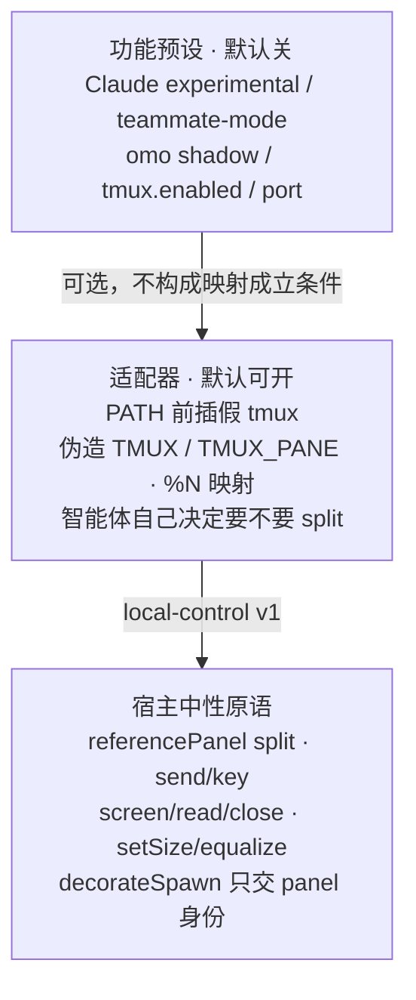
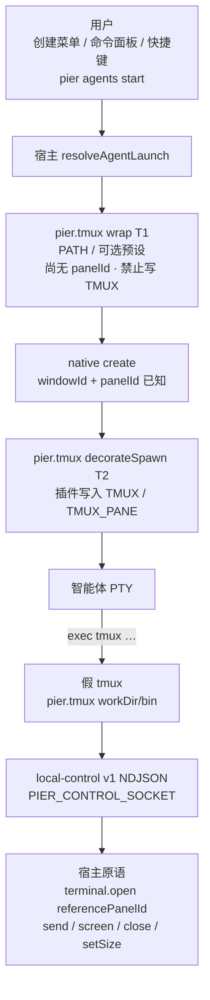
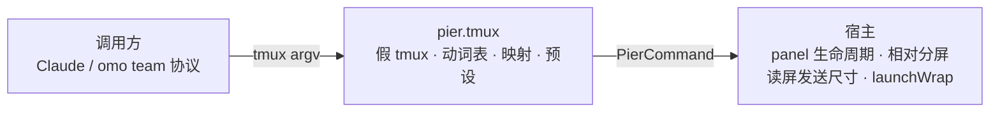
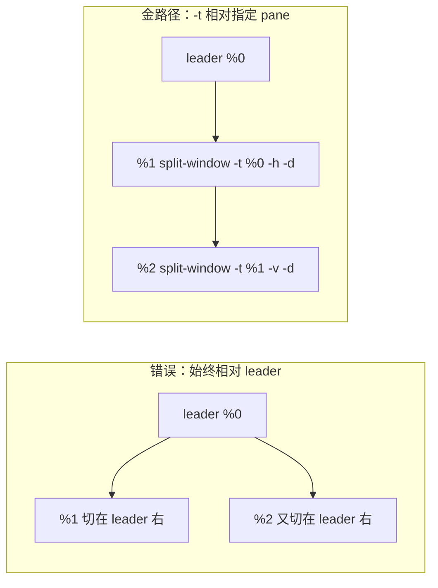
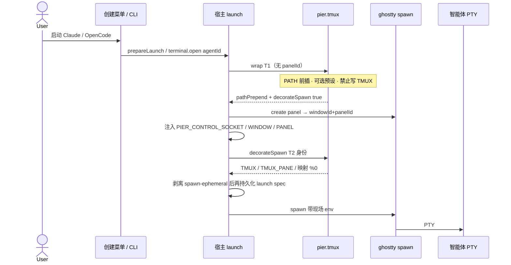
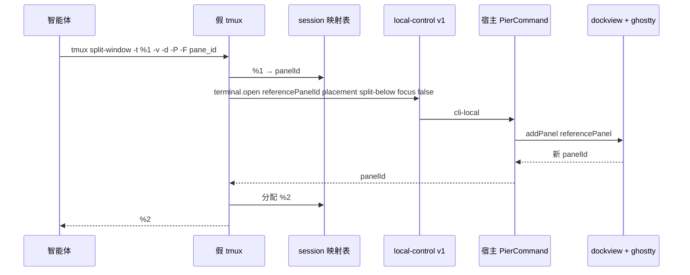
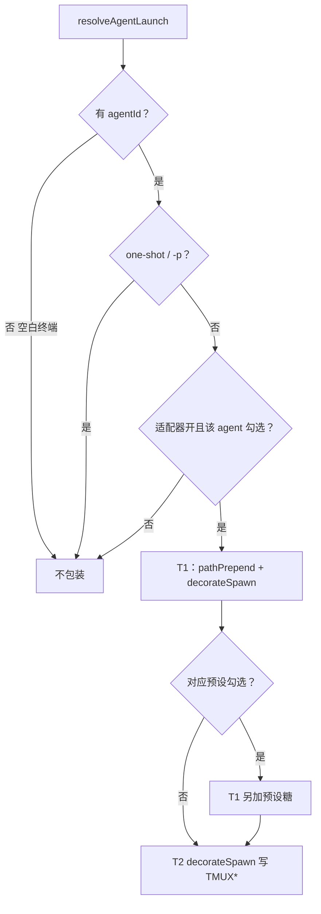
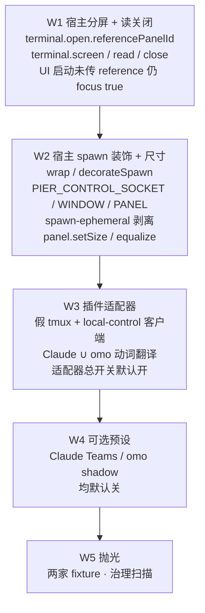

# tmux 兼容映射：智能体分屏落到原生 panel

> 日期：2026-08-17（同日金标准审查后改写）
> 状态：金标准终态（未实现）
> 范围：智能体若自己调用 tmux CLI，pane 落到 Pier 原生 dockview + ghostty panel。不含自建 mailbox / task DAG / 编排，不含 `omp` hooks 会话恢复，不含替用户打开 experimental teams / omo。

相关：

- 宿主控制面：[local-control v1/v2](./2026-08-10-local-control-v1-v2-design.md)、Canvas [pier-cli-user-manual](../../../.pier/canvases/pier-cli-user-manual/)
- 启动路径：`prepareLaunch` / `prepareLaunchFromSpec`（`src/main/ipc/agents.ts`、`src/main/services/agents/launch.ts`）
- 分屏实现：`workspace.store.ts` `addTerminal` 已支持 dockview `referencePanel`，但 `terminal.open` **尚未**接受 `referencePanelId`（只相对 `activePanel`）
- 官方插件形态：[`docs/plugins.md`](../../plugins.md)
- 产品边界：`AGENTS.md`「核心逻辑优先」；CLI 补丁计划已否「tmux session 树替换 panel/window」「Orca 式 task/mailbox/gate」

---

## 0. 金标准

**智能体若自己调用 tmux，pane 落到 Pier 原生 panel。Pier 不替用户打开 Teams / omo。宿主只提供相对分屏、读屏、发送、关 panel、比例尺寸、以及带 panel 身份的 spawn 装饰。tmux argv、假 TMUX、映射表全部留在 `pier.tmux`。**

用户不学新命令。主路径仍是「启动 Claude / 启动 OpenCode」和 `pier agents start`。

对照：cmux 用 `cmux claude-teams` / `cmux omo` 当启动器，因为打那条命令的语义就是「我要这个模式」。Pier 的「启动 OpenCode」**不是**「启动 oh-my-openagent」。因此适配器默认可开，功能预设默认关。

---

## 1. 已关闭的产品决议

| # | 决议 | 理由 |
|---|------|------|
| R1 | **能力轴是 tmux CLI 映射**，不是 Claude Teams 产品封装 | Claude teams、oh-my-openagent 的 `TmuxSessionManager` / team-layout 都是 `TMUX` 探测 + shell 出 `tmux` argv。cmux `__tmux-compat` 被两家共用 |
| R2 | **官方插件 `pier.tmux` 拥有方言**；**不**放进 `pier.claude` | 否则 OpenCode / 以后的 Pi harness 会依赖 Claude 插件。账号域继续留在 `pier.claude` |
| R3 | **宿主零 tmux 词。** 禁止 `TMUX` / `main-vertical` / `tiled` 进入 `PierCommand`、capability、持久化 launch spec | 「宿主不认识 tmux」必须在 API 表面上成立，不能只在原则里成立 |
| R4 | **用法：开智能体即带适配器。** 禁止 `pier claude-teams` / `pier omo` 当主路径 | 与现有 `pier.agent.start.<id>`、`pier.agent.new`、`pier agents start` 同一条启动链 |
| R5 | **适配器与功能预设分离。** 适配器默认可开；预设（experimental teams、omo shadow、写死端口）**默认关** | 映射 ≠ 替用户打开实验功能。用户已在自己的 Claude/omo 配置里打开时，适配器就够 |
| R6 | **相对分屏是阻塞原语**（`terminal.open` + `referencePanelId`）。禁止用「对 activePanel 切」冒充 `split-window -t` | omo / Claude 主流是 `-d` 不抢焦点 + `-t` 切指定 pane。现实现只切 `activePanel`，保持 leader 焦点时网格必错 |
| R7 | **不做 tmux 布局求解器。** 拓扑由连续的相对 split 产生；`select-layout` 只映射为「均分已有 split 组」 | `terminal.layout.apply kind=main-vertical` 会把 tmux 词写进宿主，并在 dockview 里做错的「重排拓扑」 |
| R8 | **shim 热路径打 local-control 短连接**，禁止 exec 人类 `pier` CLI | cmux/herdr 打守护进程 socket。人类 CLI 有 output policy、每条命令一个 Node 进程；打包的 `extraResources/bin/pier` 目前也不带齐 `pier.mjs` 的相对 import |
| R9 | **`TMUX*` 每次 spawn 现场生成**，禁止进入持久化 launch spec | 否则恢复会话会带着上一世的 pane id |
| R10 | **v1 不改 `TERM` / `TERM_PROGRAM`。** Ghostty 已是仿真面；`TMUX` 变量足够让调用方认为「在 tmux 里」 | cmux 改 TERM 是因为它自己是复用器。缺证据就改 `screen-256color` 会伤 OSC / 真彩 / shell integration |
| R11 | **不做编排**；对象模型仍是 panel / window | 已写进 CLI 补丁计划 |
| R12 | **`omp` 二进制 v1 不自动包装**；one-shot / `-p` 不包装 | omp 今天走 hooks 不是 tmux；Claude headless 用进程内 teammate |
| R13 | 空白「新建终端」不包装 | 避免误伤真 `tmux` 工作流 |

---

## 2. 问题与非目标

### 2.1 问题

Claude Code agent teams、oh-my-openagent team mode / 后台 subagent，都靠 `tmux` CLI 让用户看见并行智能体。在 Pier 里若落到真 tmux：teammate 嵌进单一 ghostty panel；agent 识别、hooks、通知、tab 标题失明。

### 2.2 非目标

- 通用 tmux 仿真器
- Orca 式 task / mailbox / gate
- 把 `claude-agent-teams` 加回 catalog
- 默认打开 `CLAUDE_CODE_EXPERIMENTAL_AGENT_TEAMS` 或把 omo 塞进用户的 OpenCode 配置
- `omp` hooks / 会话恢复
- SSH 远端 relay
- 给插件开放 dockview 运行时 API
- 第三方插件实现映射
- 在宿主实现 tmux `select-layout` 重排拓扑

---

## 3. 两层：适配器 vs 预设



判定：去掉 Pier，用户仍可用真 tmux 完成同一动作 → 适配器不做编排。Pier 多出来的只是「落到原生 panel」。预设是便利糖，不是映射成立的条件。用户已在自己的 Claude/omo 配置里打开该功能时，**只走适配器**。

---

## 4. 架构



职责分层：



| 层 | 拥有 | 禁止 |
|---|------|------|
| 调用方 | 自己的 team 协议 | — |
| `pier.tmux` | 假 tmux、动词表、`%N` 映射、TMUX 环境、可选预设、设置 | import dockview；exec `pier.mjs`；编排 |
| 宿主 | panel 生命周期、相对分屏、读屏、发送、比例尺寸、`launchWrap` / `decorateSpawn`、local-control | `TMUX` 字面量、tmux 布局名、Claude/omo 专用 env 名作为 API |

假 tmux 跑在 PTY 子进程，碰不到 renderer 插件 API。热路径只打已有 `cli-local` 控制面。插件不另起 Unix socket。

---

## 5. 宿主原语

全部走 `PierCommand` + `cli-local`。名字里不出现 tmux / teams / omo。

### 5.1 已有

| 需要 | 现状 |
|---|---|
| 开终端、placement 四向 | `terminal.open`；renderer 分屏相对 **activePanel** |
| 列表 / 发送 / 键 | `terminal.list` / `get` / `send` / `key` |
| 聚焦 | `panel.focus` |
| launch env | `terminalLaunchOptions.env` |
| 控制面 | local-control v1 一问一答 |

### 5.2 必须补（映射阻塞依赖）

| 调用方需要 | 宿主命令 | 说明 |
|---|---|---|
| `split-window -t pane -h\|-v -d` | `terminal.open` 增加 **`referencePanelId`** | dockview `position.referencePanel` 已存在，只是命令面没暴露。无此字段时保持今天的 activePanel 行为 |
| `split-window -d` | `terminal.open` 已有 `focus`；默认 **不** 抢焦点（`focus: false`） | 与「保持 leader」一致；未传 `-d` 才 `focus: true` |
| `capture-pane` | `terminal.screen` + `terminal.read` | viewport = native `readViewportText`；滚回尽力走 transcript。从 `agents screen` 下放到任意 terminal panel |
| `kill-pane` | `terminal.close` | 与 renderer `panel.close` 同构 |
| `resize-pane -x 30%` | `panel.setSize` | `{ panelId, windowId, widthRatio? heightRatio? }` 相对 **直接 split 父组**，不是窗口绝对像素 |
| `select-layout even-*` / 均分 | `panel.equalize` | `{ windowId, panelIds, axis: "horizontal" \| "vertical" }` 只均分这些 panel 所在的已有 split 组。**不搬家、不重建拓扑** |
| spawn 时知道 panel 身份 | `decorateSpawn` 贡献点 | 见 §6。宿主不写 TMUX |

`new-window` / `new-session`：v1 映射为同 window 新 tab（`placement: "active-tab"`），不新建 BrowserWindow。

### 5.3 明确不做的宿主 API

- `terminal.layout.apply` + `kind: "main-vertical" | "tiled"`（tmux 词 + 重排拓扑）
- 宿主生成 `TMUX` / `TMUX_PANE`
- 人类 CLI 子命令 `pier tmux …`

拓扑金路径：连续的 `referencePanelId` + `split-right` / `split-below` 自然得到「左 leader、右栏堆叠」。这就是 omo `buildSplitArgs` 的 `-t` + `-h/-v`。插件把 `select-layout main-vertical` 降级为对右栏 `panel.equalize({ axis: "vertical" })` 加可选的 leader `panel.setSize({ widthRatio: 0.3 })`，**不**要求宿主理解 main-vertical。

错误切法（对 `activePanel` / leader 连切）vs 金路径（`-t` 相对已有 teammate）：



对应 dockview：第一次 `referencePanelId=leader` + `split-right`；第二次 `referencePanelId=%1 的 panel` + `split-below`；全程 `focus: false` 保持 leader。

---

## 6. 启动包装：两阶段、零 tmux 词

两条路径都必须走，禁止只钩 renderer：

- `prepareLaunch` / `prepareLaunchFromSpec`
- `terminal.open` 且 `launch.agentId` 有值（含 `pier agents start`）

空白终端（无 `agentId`）不走。one-shot 不走。



### 6.1 capability

```ts
"terminal:launchWrap"
```

仅官方 `pier.tmux` 声明。多个注册者按 pluginId 字典序串联；`decorateSpawn` 只允许 **一个** 返回非空 env 补丁（第二个忽略并 warn）。

### 6.2 插件 API（external main）

```ts
launchWrap: {
  register(handler: {
    /** T1：panel 尚不存在。只允许 PATH / 预设糖 / 声明需要 T2。 */
    wrap(input: LaunchWrapInput): Promise<LaunchWrapResult>;
    /** T2：宿主传入身份。插件在这里写 TMUX*。 */
    decorateSpawn(input: LaunchSpawnInput): Promise<LaunchSpawnResult>;
  }): () => void;
};

interface LaunchWrapInput {
  agentId: AgentKind;
  command: string;
  env: Record<string, string>;
  cwd?: string;
}

interface LaunchWrapResult {
  command?: string;
  env?: Record<string, string>; // 禁止写入 TMUX、TMUX_PANE
  pathPrepend?: string[];       // 绝对目录，宿主拼到 PATH 最前
  decorateSpawn?: boolean;      // true → T2 调用 decorateSpawn
}

interface LaunchSpawnInput {
  agentId: AgentKind;
  windowId: string;
  panelId: string;
  env: Record<string, string>;
}

interface LaunchSpawnResult {
  env?: Record<string, string>; // 允许 TMUX* ；宿主 merge
}
```

宿主 T2 **额外**注入（中性、可复用，不是 tmux 协议）：

| 变量 | 含义 |
|---|---|
| `PIER_CONTROL_SOCKET` | local-control 套接字绝对路径 |
| `PIER_WINDOW_ID` | 当前窗口 |
| `PIER_PANEL_ID` | 当前 panel |

插件用这三项生成 `TMUX` / `TMUX_PANE` / 映射表。宿主测试只断言这三项存在，不断言 `TMUX`。

### 6.3 持久化纪律

- `decorateSpawn` 产出的键（至少 `TMUX`、`TMUX_PANE`，以及插件自有 `PIER_TMUX_*`）列为 **spawn-ephemeral**
- 写入 launch registry / 恢复 spec / layout params 之前必须剥掉
- T2 **永远**再跑 `decorateSpawn`；禁止「env 里已有 TMUX 则跳过」
- 恢复上次会话：T1 wrap 可再 PATH 前插；身份必须是新 panel 的

### 6.4 黑名单

wrap / decorateSpawn 不得写入 `NODE_OPTIONS`、`DYLD_*`、`LD_PRELOAD`、`LD_LIBRARY_PATH`（与 `apply-host-env` 同黑名单）。不得改 `TERM` / `TERM_PROGRAM`（R10）。不得把密钥写入映射文件。

---

## 7. 插件 `pier.tmux`

### 7.1 形态

- `packages/plugin-tmux/`，id `pier.tmux`
- permissions：`terminal:launchWrap`、`terminal:control`、`terminal:read`、`panel:control`、`panel:read`
- settingsPages：一页即时偏好
- main：写 shim、注册 wrap/decorateSpawn、映射表、读配置
- renderer：仅设置页。v1 **不**注册「带映射启动」命令面板项（避免第二条启动路径）

### 7.2 假 `tmux`

`{workDir}/bin/tmux`：小脚本 + 内嵌 local-control v1 客户端（NDJSON，一问一答即关）。不 import `bin/pier.mjs`。

1. `tmux -V` / `-version`：本地返回 `tmux 3.4`，不打宿主
2. 无 `TMUX` 或无 `PIER_CONTROL_SOCKET`：exit 1（调用方按「不在 tmux」降级；omo：缺可视化不阻塞 team_create）
3. 白名单动词 → PierCommand
4. 未知动词：stderr 一行 + exit 1，**不**透传真 tmux

热路径（不经人类 `pier` CLI）：



### 7.3 动词 → 宿主（插件内翻译）

| tmux | 宿主 | 插件额外工作 |
|---|---|---|
| `split-window -t -h\|-v -d -c -P -F` | `terminal.open` + `referencePanelId` + `placement` + `focus: false` | 分配 `%N`；把 `PIER_CONTROL_SOCKET` / `PIER_WINDOW_ID` / 新 `PIER_PANEL_ID` / 同一 `TMUX` / 新 `TMUX_PANE` 注入子 pane env |
| `new-window` / `new-session` | `terminal.open` `active-tab` | 新 `%N` |
| `send-keys` | `terminal.send` / `key` | Enter/Escape/Tab/C-c + literal |
| `capture-pane` | `terminal.screen` / `read` | `-p`；`-S` 尽力 |
| `select-pane` / `select-window` | `panel.focus` | |
| `kill-pane` / `kill-window` | `terminal.close` | 从映射表删除；可选对剩余 sibling `panel.equalize` |
| `list-panes` / `list-windows` | 映射表 + `terminal.get` | **只返回本 session 已映射 pane** |
| `resize-pane -x\|-y <pct>` | `panel.setSize` | 只实现百分比；忽略像素 |
| `select-layout even-horizontal\|even-vertical` | `panel.equalize` | |
| `select-layout main-vertical` | leader `setSize({ widthRatio: 0.3 })` + 非 leader `equalize vertical` | **不**重建左右栏；若拓扑还不是「左一右多」，以已有 split 为准，不搬家 |
| `select-layout tiled` | 对映射 pane 所在组 `equalize` 两次（横+纵）若组结构允许；否则 no-op 成功 | 不实现 tmux tiled 求解 |
| `display-message` | 本地渲染 `#{pane_id}` 等 | 几何来自 `terminal.get` |
| `rename-window` | no-op 成功 | tab 标题归 OSC/cwd |
| `wait-for` | shim 进程内 | 不进宿主 |

v1 拒绝：`bind-key`、`source-file`、`attach-session`、脚本化配置。

映射表：`{workDir}/sessions/<sessionId>.json`。leader 已关或文件超过 24h → 下次 split/list 重置。不写进 layout JSON。

### 7.4 适配器（默认）

T1：若总开关开且该 `agentId` 勾选 → `pathPrepend: [workDir/bin]` + `decorateSpawn: true`。

T2：用 `PIER_WINDOW_ID` / `PIER_PANEL_ID` 生成 session，写：

- `TMUX=<workDir>/sessions/<sessionId>.sock,<pid>,0`（不必可连，只编码 sessionId）
- `TMUX_PANE=%0`
- 映射 `%0 → panelId`

v1 适配器覆盖：`claude`、`opencode`。不覆盖空白终端、one-shot、`omp`。

T1 判定：



### 7.5 功能预设（默认关，独立开关）

仅在用户勾选时，T1 额外做。失败不阻断启动（日志 + 设置页可显示上次错误）。

**Claude Teams 预设（默认关）**

- `CLAUDE_CODE_EXPERIMENTAL_AGENT_TEAMS=1`
- command 尚无 `--teammate-mode` 时追加 `--teammate-mode auto`

用户也可以自己在智能体默认环境变量里设该 flag；此时只需适配器。

**OpenCode / omo 预设（默认关）**

- `{workDir}/omo-config/` shadow：不改 `~/.config/opencode`
- 确保插件列表含 oh-my-openagent，并打开其 tmux 可视化相关键（键名集中一处适配上游）
- `OPENCODE_CONFIG_DIR` 指向 shadow
- 未指定端口时注入 `--port 4096` + `OPENCODE_PORT=4096`（omo 在 port 0 时会静默跳过可视化）

未勾选预设、但用户自己的 `~/.config/opencode` 已开 `tmux_visualization`：只靠适配器，不写 shadow。

---

## 8. 设置与文案

即时偏好，改了只影响之后新开的会话。垂直 Field，无保存 footer。locale 禁止 shim / PATH / TMUX / teams 等实现词。

| key | 默认 | 用户文案方向 |
|---|------|------|
| `pier.tmux.adapter.enabled` | `true` | 将智能体打开的分屏接到工作台面板 |
| `pier.tmux.adapter.agents.claude` | `true` | Claude |
| `pier.tmux.adapter.agents.opencode` | `true` | OpenCode |
| `pier.tmux.preset.claudeTeams` | `false` | 为 Claude 打开多智能体会话（需 Claude 自身支持；已在 Claude 里打开则可不管此项） |
| `pier.tmux.preset.opencodeOmo` | `false` | 为 OpenCode 打开 oh-my-openagent 分屏（已在 OpenCode 配置里打开则可不管此项） |

总开关关：T1 不再前插。已在跑的会话保持当时 env，必须重启该智能体；设置页一句话说明。

---

## 9. 安全与纪律

- shim → local-control v1 → 现有 peer uid + `cli-local`。不新 client kind、不新 socket 家族
- `terminal:launchWrap` 防止任意官方插件改所有启动
- `list-panes` 过滤：调用方不可见同窗口其它终端
- spawn-ephemeral 键不得落盘
- 映射文件不含密钥、不含 transcript

---

## 10. 测试

| 层 | 锁什么 |
|---|---|
| 宿主 | `terminal.open` 尊重 `referencePanelId`；缺省仍为 activePanel |
| 宿主 | `focus: false` 不改变 activePanel |
| 宿主 | `decorateSpawn` 在 T2 调用；持久化 spec 不含 `TMUX` / `TMUX_PANE` |
| 宿主 | 宿主源码无 `TMUX` 字符串作为 API（治理扫描；测试夹具除外） |
| 宿主 | `panel.setSize` / `equalize` 只动目标组，不把 panel 迁到别的 group |
| 插件 | argv 白名单；未知动词 exit 1；`list-panes` 不泄漏 |
| 插件 | `split-window -d -t %1 -v` 的 PierCommand 带 `referencePanelId=%1 对应 panel` 且 `focus: false` |
| 插件 | 适配器开、预设关：env 无 `CLAUDE_CODE_EXPERIMENTAL_AGENT_TEAMS`，PATH 含假 tmux |
| Fixture | Claude：split → send-keys → capture-pane → kill-pane |
| Fixture | omo：`-V` → split `-t -P -F #{pane_id}` → 再对 **新 pane** `-t -v` → `resize-pane -x 30%` → kill 后 equalize |
| 治理 | 插件 locale 无禁用实现词；插件不 import dockview；`pier.claude` 无动词表 |
| 治理 | shim 不 `spawn` `bin/pier` / `pier.mjs` |

---

## 11. 实施波次



W1 的 `referencePanelId` 与 W3 的 `-t` 翻译是同一条验收链。没有相对分屏，不得宣称接得住 omo。

W3 是用户可见金路径：**适配器成立，不依赖预设**。W4 只是便利。

官方索引、`pnpm plugin:tmux:build`、plugin-workspace root、`docs/plugins.md` 随 W3 加。

---

## 12. 验收

金路径（预设全关）：

- 用户在 Claude 自己的配置/环境里打开 agent teams，再在 Pier 里「启动 Claude」：teammate 为独立 terminal panel；leader 保持焦点；右栏后到的 pane 是对已有 teammate `-t` 切出来的，不是全部切在 leader 上
- 用户在 OpenCode/omo 配置里打开 `tmux_visualization`，再「启动 OpenCode」：member pane 同样落到原生 split
- `pier agents start --agent claude` 与 UI 启动同行为
- 「新建终端」里 `which tmux` 仍是系统 tmux（若已安装）
- 关掉适配器后，新开 Claude 的 env **无** `TMUX`，PATH **无** 假 tmux 目录
- 恢复上次会话后，新进程的 `TMUX_PANE` 指向**新** panel，不是旧 id

预设（默认关，勾选后）：

- Claude 预设：新会话带 experimental flag；不勾选则不带
- omo 预设：不修改 `~/.config/opencode`；shadow + 端口仅勾选时生效

命令面板没有必须使用的「Claude Teams / omo」启动项。

---

## 13. 以后可以加、现在不要做

- `omp` 开始 shell 出 `tmux`：加适配器 agent 勾选，不改宿主
- `terminal-notifier` → `systemNotify()`
- 映射会话的 layout 持久化（v1 运行时映射；关窗后 teammate panel 走现有终端恢复，映射不复活）
- 证实某调用方离开 `screen-*` TERM 就不走 tmux backend 之后，再按预设改 TERM
- 真 tmux 控制协议（libevent）；argv shim 足够
- 宿主侧 tiled 重排
