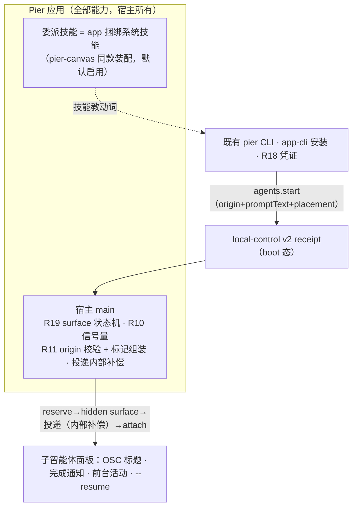
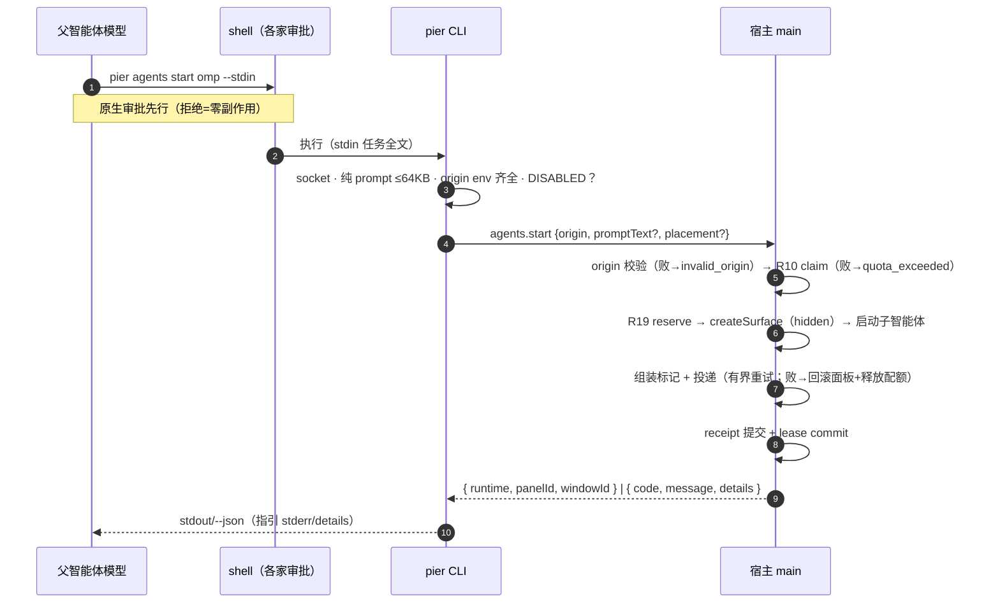
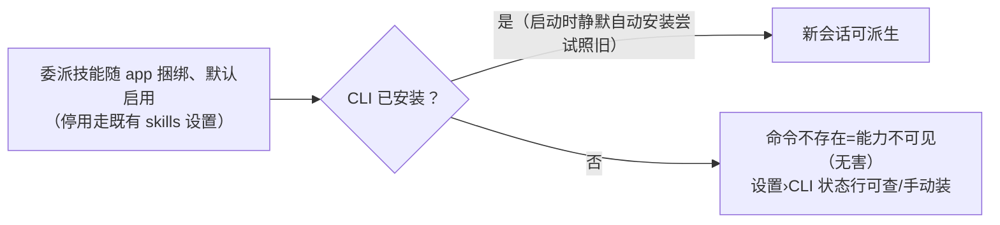
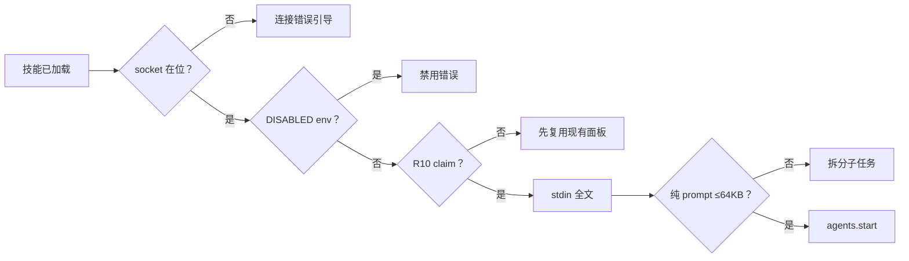
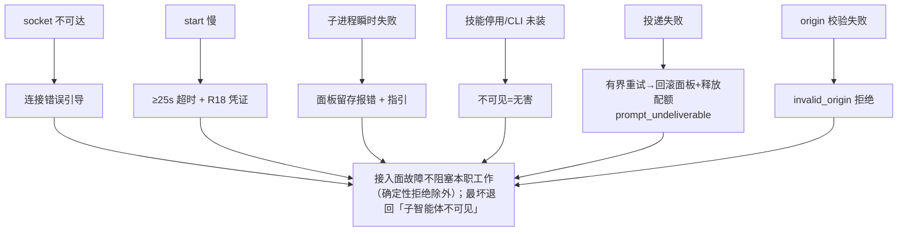
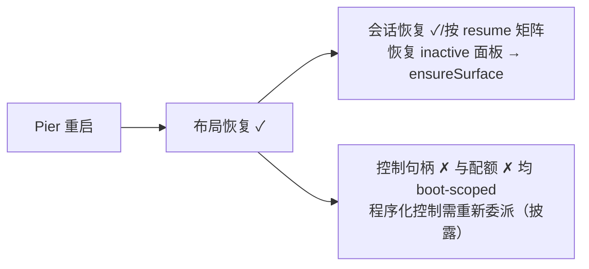
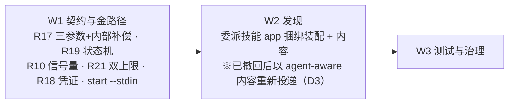

# 子智能体面板：智能体并行子工作的原生面板承载（金标准终态）

> 日期：2026-08-23（六轮修订：①CLI 直连翻转；②③codex 两轮协议补齐；④状态机/类型契约规格化；⑤冗余裁剪；⑥**人体工程学重构**——以「人的注意力/打断/理解成本」为判定标准：预设糖砍除（配置重复反模式）、插件整体出范围（pier.tmux 保持原样独立存续，不迁移不扩展不破坏；※2026-08-25 更新：已更名为 pier.agent-splits 并交付设置面 + W4 预设 + cwd 继承，见 git log）、本设计收敛为**纯 app 内置能力**）
> 状态：设计稿（待评审）
> 范围：**Pier 应用内置能力**——app 捆绑委派技能 + 宿主 v2 契约扩展（R17/R18/R21）+ surface 状态机（R19）+ 准入信号量（R10）。**零新增 daemon/MCP、零第三方智能体配置写入。** ~~零插件、零新设置面~~（※2026-08-25 偏离：插件更名并深度扩展、新增设置面 6 键，见 §16 D1/D4/D5） 已上线的 `pier.tmux` 插件保持原样独立存续（是否退役按存量用户反馈另行决定，见 §14）。

相关：

- [tmux 兼容映射金标准](./2026-08-17-tmux-compat-native-splits-design.md)（其 pier.tmux 插件维持现状独立运行）
- [local-control v1/v2](./2026-08-10-local-control-v1-v2-design.md)
- 出向遥测现状：`src/main/services/agents/integrations/`（方向相反、互不影响）

---

## 0. 金标准（人体工程学口径）

**智能体的并行子工作可以落成 Pier 原生面板：默认后台标签页——人继续与父对话，零打断；完成时一条通知浮出（环境感知；※子面板即 agent 面板，NCS 管线自动生效，零新增——但尚未真机验证）；点开即见、随时接管；并排监视由调用方显式要求；短小同步任务继续走各家内置 subagents（§10.3 分流，保护标签栏不被琐事污染）。能力经智能体自己的 shell 工具调用既有 `pier` CLI 直连宿主（`agents.start/turn/screen`，`wait` 为可选状态谓词）——零新增常驻服务、零第三方配置写入、零新设置面；协调永远是父智能体自己的事。**

人体工程学判定：去掉 Pier 后，用户在真 tmux 手动分屏也能跑并行智能体，但分屏挤压 + 无完成信号 + 手动排查是劣体验；Pier 的增值 = 后台承载（零挤压）+ 环境感知（完成通知）+ 可接管（点开即见）+ 可恢复（resume）。

---

## 1. 业界调研分析

### 1.1 方法与样本

| 类别 | 样本 | 取证方式 |
|---|---|---|
| 本机实测 | herdr、orca、omp v18.0.1、codex 0.149、gemini-cli 0.54、opencode、claude 2.1.235 | CLI 探测、二进制扫描、类型定义直读 |
| 源码级调研 | cmux、omo、claude-code 二进制反解 | 文件/行级引用 + 官方 issue 交叉验证 |
| 官方文档 | Claude agent teams、codex subagents、opencode agents、cmux docs | 交叉验证 |
| 一等公民先例 | Vibe Kanban、Conductor | 工具面与令牌机制 |
| 仓库既有资产 | `bin/pier.mjs`、v2 `agents.*`、app-cli、system-skills | 源码直读 + codex 三轮复核 |

### 1.2 逐产品机制详解

**Claude Code Agent Teams（experimental）**：`CLAUDE_CODE_EXPERIMENTAL_AGENT_TEAMS=1`；`--teammate-mode`（v2.1.179 默认 in-process）；开 pane（issue #123 抓包）：占位 split → `remain-on-exit` → mailbox 先行（失败即中止）→ `respawn-pane -k`。非 tmux/iTerm2 回落 in-process；官方不支持 Ghostty。**业界自身已投票：默认不可见 + 结构化结果可接受。**

**oh-my-openagent（omo）**：占位壳 + send-keys attach；不可达静默跳过可视化不阻塞建队。

**cmux**：伪造 `TMUX` + shim → 原生分屏；崩溃持久 tombstone；`accepted` 静默成功防重。

**herdr**：16 智能体受管扩展；`agent wait` 谓词原语；shell 调 CLI 主路径。

**Orca**："never schedules or places workers"；skills 教 CLI。

**Vibe Kanban / Conductor**：MCP server 一等公民。

### 1.3 范式归纳

Shim 截获式（cmux、`pier.tmux` 现状）｜注入遥测 + daemon（herdr、Pier 状态扩展，方向相反）｜全编排（orca，排除）｜**CLI 直连式（herdr、orca → 基线 R13）**｜MCP 注册式（VK/Conductor → 可选后续）。

### 1.4 任务传递方式对比

argv（转义天花板）｜**stdin（无转义，R5）**｜mailbox（解耦但文件生命周期）｜send-keys（时序补偿最贵）。

### 1.5 投递通道：两大阵营与 Pier 既有资产

| 阵营 | 代表 | 人体工学代价 |
|---|---|---|
| MCP server | VK、Conductor、cmux 封装 | 注册残留、常驻进程、schema token 税、裸会话幽灵工具 |
| **CLI 直连** | **herdr、orca** | 发现靠技能投影（可解） |

**Pier 既有资产**（源码直读 + codex 三轮复核）：`bin/pier.mjs`（v1+v2；start 现有 `<id>`/`--agent`/`--cwd`/`--window`/`--operation-id`；`--stdin` 现接 turn）；v2 `agents.*`（start strict；turn text 按 JS 字符——独立债；screen 有界；wait 单一 `until`）；receipt（副作用后提交、single-flight、同 boot 内存态）；app-cli（静默自动安装）；system-skills 通道（投影根 `[".agents/skills", ".claude/skills"]`、期望态默认启用、**app 捆绑注册即 pier-canvas 现役路径**）；placement schema（`active-tab/split-right/split-below/split-left/split-above` + `referencePanelId`）。

### 1.6 金标准要素提取

| 设计要素 | 采纳形态 | 出处 |
|---|---|---|
| 统一宿主通道直连 | shell → `pier` CLI → v2 | herdr / orca |
| 发现经技能投影 | app 捆绑系统技能（既有装配） | orca skills；pier-canvas |
| 后台优先 + 环境感知 | `active-tab` + R19 + 完成通知 | omo detached；Claude in-process |
| 任务自含 | stdin + 宿主内部投递补偿 | `--stdin`；mailbox「先行」 |
| 数量护栏 | R10 boot-scoped 原子准入 | 注意力保护 |
| 幂等防重 | R18 类型化重试凭证（同 boot） | cmux tombstone 目标 |
| 故障降级 | 显式错误 / 回落 | issue #2592 |
| 遥测/控制分治 | 状态走扩展，控制走 CLI | 三家同构 |
| 身份二元组 + 宿主校验 | `{panelId, windowId}` 存在性校验 | cmux 保护键；Orca HANDLE |

### 1.7 与业界实现的能力对照清单

逐能力对照（✅ 等价或更强 / ⚠️ 受限或诚实披露 / ❌ 无 / n/a）：
| 能力 | Claude teams | omo | cmux | herdr | Orca | VK/Conductor | 本设计 |
|---|---|---|---|---|---|---|---|
| 发起主体 | 模型（Task） | 模型（team） | 模型（tmux 协议） | 模型/人（CLI） | 人/coordinator | 模型（MCP） | **模型（shell→CLI）** |
| 子智能体形态 | teammate 完整会话 | attach 完整会话 | 完整会话分屏 | 面板会话 | 交互 TUI | 云工作区 | **完整会话（Pier 面板）** |
| 默认后台不抢焦点 | ❌ | ❌ detached 无面板 | ❌ 即分屏 | ❌ | ❌ | n/a | ✅ `active-tab` + R19 |
| 任务传递 | mailbox 先行 | send-keys | tmux argv | send-keys | inject | MCP 参数 | **stdin + 宿主组装** |
| 投递确认 | ⚠️ 写失败即中止 | ❌ | ❌ | ❌ | ❌ | 工具返回 | ✅ 宿主内部补偿，失败回滚 |
| 幂等防重 | ❌ | ❌ | ✅ tombstone（持久） | ❌ | ❌ | ❌ | ⚠️ 同 boot 凭证（崩溃窗披露） |
| 数量护栏 | ❌ | ⚠️ 配置项 | ❌ | ❌ | ❌ | ❌ | ✅ 原子准入 |
| 完成通知 | ⚠️ 轮询 | ❌ | ❌ | ⚠️ wait | ⚠️ tui-idle | 工具返回 | ✅ NCS + 深链 |
| 阻塞等待 | ❌ | ❌ | ❌ | ✅ | ✅ | ❌ | ✅ 谓词 |
| 恢复 | ⚠️ respawn | ✅ attach | ⚠️ orphan | ❌ | ❌ | 持久 | ✅ resume + ensureSurface |
| 发现机制 | env 探测 | 插件配置 | PATH shim | 16 家扩展安装 | skills 教 CLI | MCP 注册 | **技能投影（零配置）** |
| 审批同意 | ⚠️ flag 预授权 | ❌ yolo | ❌ | 各家政策 | ❌ | MCP 审批 | ✅ 各家 shell 审批（原生，零新增） |
| 降级策略 | ✅ 回落 | ⚠️ 静默 | ❌ | ❌ | ❌ | ❌ | ✅ 显式错误 / 不可见无害 |
| 第三方配置写入 | teams 目录 | omo.jsonc | shim/快照 | 16 家扩展文件 | 无 | MCP 配置 | ✅ 零 |
| 编排 | ✅ lead 协调 | ✅ team 协调 | ❌ | ❌ | ✅ 全编排 | ✅ kanban | ❌ 有意排除（§3） |

**本设计领先**：①后台标签页真跑（唯一「运行中 + 可点击 + 零挤压」）；②投递确认（宿主内部补偿、失败回滚）；③原子配额；④零第三方配置写入；⑤完成通知路由。
**业界领先（如实承认）**：①cmux 崩溃持久 tombstone（§14 列持久 receipt）；②Claude 结构化结果回传（R3 取舍——**本设计最大体验毛边，§14 最高优先后续**）；③团队协调/attach 复用；④全编排与云工作区（边界排除）。
**裁剪记录**：per-agent 门控、贡献桥、投递三态联合、迁移状态机、安装引导态（第五轮）；预设糖、插件载体（第六轮，人体工程学）——理由见 §2/§15。

---

## 2. 已关闭决议

| # | 决议 | 理由 |
|---|---|---|
| R1 | 能力轴是「统一结构化控制通道」，不是让智能体学 tmux | 约定拼 argv 脆弱 |
| R2 | CLI 动词直说既有宿主命令，宿主零方言词；父子归因用结构化元数据 | 文本协议污染任务内容 |
| R3 | 不做等待编排；`agents.wait` 可选状态谓词（单一 `until`），禁当完成判定 | 谓词语义既有 |
| R4 | 不注入自定义父子关联 env 键 | 持久化键随恢复复活 |
| R5 | 任务全文经 stdin（R17 接线到 start） | 无转义、无 ARG_MAX |
| R6 | 零新增 daemon/MCP、不改用户/全局第三方配置；Pier 自有写入面如实清单（§8） | 项目内发现链接是既有通道行为 |
| R7 | 默认后台标签页；产品词 `tab/right/below` 经唯一映射函数落 placement schema；**服务端默认显式 `active-tab + focus:false`**（替换 `host-backend.ts:58` 硬编码）；`--window` ≠ `origin.windowId` → 拒绝 | 单一映射；默认值服务端权威 |
| R8 | 可控性 = 各家 shell 审批（原生）+ 技能启停（既有 skills 设置）+ `PIER_AGENT_PANELS_DISABLED` 手动逃生口（CLI 检查 ~5 行） | 审批覆盖非 yolo、技能开关覆盖不要面板者 |
| R9 | 重启恢复三层：布局 ✓；会话按 resume 矩阵 ✓；控制句柄 **boot-scoped** 不恢复无再发现；配额同 boot-scoped | runtime map 每 boot 为空 |
| R10 | 数量护栏 = 宿主准入信号量，**boot-scoped**：`claim → create → commit/release` 原子；口径 = `agents.start` 派生面板（全局）；默认 4；lease 恰好一次释放 | 注意力保护（标签栏/通知洪水是真实人体工学失败） |
| R11 | 来源标记宿主组装；`origin: {panelId, windowId}` **必填**（CLI 读两 env）；宿主本地存在性校验，失败 `invalid_origin` 拒绝 | 落位锚定（结构性需要）+ 点开即懂的归因 |
| R12 | 同 R8（语义如实披露；全局 CLI 不受任何开关约束） | — |
| R13 | 基线走既有 `pier` CLI 直连；零新增 daemon/MCP；不做 pier-mcp server | AGENTS.md 判定线 |
| R14 | ~~pier.tmux 插件保持原样独立存续~~（※2026-08-25 偏离 D1：已更名 pier.agent-splits 并深度扩展，见 §16） | 人体工程学：兼容惯性非体验需求；Claude 自身默认 in-process 已证明不可见可接受 |
| R15 | ~~预设糖砍除~~（※2026-08-25 偏离 D2：W4 预设已实现——claudeTeams + opencodeOmo 含真实行为，见 §16） | 人体工程学：配置重复 = 双入口学习成本 |
| R16 | 两层模型：基线 = 核心三动词（app 能力，默认启用）；增强 = 分屏兼容（pier.tmux 独立存续，非本设计范围） | — |
| R17 | `agents.start` 契约扩展：`origin`（必填）；`promptText?`（`--stdin`；缺省 = 无初始任务）；`placement?`/`focus?`（R7 映射）。**投递 = 宿主内部补偿**：有界重试，仍失败 → 回滚面板（销毁 surface + 释放配额）+ `prompt_undeliverable`；成功响应单一形态 | 面板存活仅数秒，回滚成本≈0 |
| R18 | 重试 = 类型化凭证 `AgentsStartRetryDetails`；重试带 `--expected-boot`，不匹配 → `boot_changed`；`--json` 恰好一个稳定 JSON 错误对象；人类指引 stderr | 双面板真实风险的最低成本修复 |
| R19 | surface 两阶段状态机（§4.8）：`SurfaceKey={windowId,panelId}`（main 分配）；main 拥有 surface/launch/prompt lease，renderer 仅 layout/anchor；`launchId` 单次消费；`ensureSurface` 幂等；投递失败 → `failed` 回滚 | 金路径前提 |
| R20 | ~~委派技能 = app 捆绑系统技能~~（※2026-08-25 偏离 D3：初版投递后因与 teams 模式撞车撤回；后以 agent-aware 内容重新投递——Claude teams 读「用原生」，其他 agent 读「用 CLI 委派」） | 零新契约达成目标 |
| R21 | `AGENTS_START_PROMPT_MAX_BYTES`（64KB UTF-8）CLI 校验纯 promptText；`AGENTS_START_ASSEMBLED_MAX_BYTES`（+4KB）宿主权威校验 | 校验所有权按知识边界 |
| R22 | 用户可见名「子智能体面板」（zh）/ "Subagent panels"（en）；协议标识符保留 `subagent` | 产品词治理 |
| R23 | **结果回传是本设计最大体验毛边**（人可能沦为父子间信使）：v1 以「读屏/谓词/通知」衔接并如实披露；结构化回传列为最高优先后续（§14） | 人体工程学诚实结论 |

---

## 3. 非目标

- 编排：任务台账、mailbox、DAG、调度、任务完成判定
- 宿主侧阻塞等待编排；按键级遥控；无 shell 智能体硬封装
- pier-mcp server（废弃；可选 MCP 面 §14）
- per-agent 门控、插件技能贡献桥、投递三态联合、迁移状态机、安装引导态、预设糖（历轮裁剪，§15）
- pier.tmux 的迁移/扩展/退役（R14：独立存续）
- v2 句柄跨 boot adopt/rebind；跨窗派生；`turn.text` 语义债
- 改宿主命令面语义、改 tab 标题投影、SSH relay、第三方 MCP 来源

---

## 4. 架构与流程

### 4.1 总体架构（纯 app 能力，零插件）



### 4.2 组件职责

| 层 | 拥有 | 禁止 |
|---|---|---|
| 父智能体模型 | 派工决策、组命令、按凭证重试 | 碰控制通道以外的东西 |
| Pier 应用 | 委派技能、R19 状态机、R10 信号量、origin 校验、标记组装、投递补偿 | 守护进程/常驻服务 |
| pier CLI + v2 | schema、校验、receipt、R18 凭证、R21 校验、DISABLED 检查 | 单智能体专用分支 |
| 渲染层 | 仅 dockview layout 与可见 anchor | 建 PTY、拥有 surface |

### 4.3 派生时序



### 4.4 启用（零配置、零设置面）



### 4.5 会话内护栏链



### 4.6 故障降级图



### 4.7 重启与恢复（三层）



### 4.8 R19 Surface 生命周期状态机

**所有权**：`SurfaceKey={windowId,panelId}` main 分配；main 拥有 native surface/launch/prompt lease；renderer 仅 dockview layout 与可见 anchor。

| 当前态 | 事件（actor） | 动作 | 次态 | 失败补偿 |
|---|---|---|---|---|
| — | `claim`（main，R10） | 分配 SurfaceKey + layout 意图 + geometry/font 默认 | `reserved` | 释放 lease |
| `reserved` | `createSurface`（main；`launchId` 单次消费） | hidden surface + catalog 启动 | `surfaceReady` | 销毁已建 surface；弃 launchId；释放 lease；返回错误 |
| `surfaceReady` | `deliverPrompt`（main；promptText 缺省跳过 → `readyNoPrompt`） | 组装标记 + 粘贴 + Enter，有界重试 | `promptSettled` | **回滚：销毁 surface + 释放 lease + `prompt_undeliverable`** |
| `promptSettled`/`readyNoPrompt` | `attach`（renderer，可见时） | present | `presented` | 重试于下次可见；surface 存活 |
| 任意存活态 | `userClose` | 销毁 + lease 释放（`closed` 守卫恰好一次） | `closed` | 重复 close 幂等 |
| 任意存活态 | `processExit` | exitPresentation；lease 释放 | `exited` | — |
| 重启后 | `ensureSurface(SurfaceKey)`（幂等） | 存在复用；否则 hidden 补建 | `surfaceReady` | 补建失败 → 面板显示可重试错误 |

---

## 5. 宿主通道契约（既有 v2 + R17/R18/R21）

### 5.1 `agents.start` 契约

```ts
// 请求（strict schema 扩展）
{
  agentId: string; cwd?; worktreeKey?; incarnationId?; windowId?;
  origin: { panelId: string; windowId: string };   // 必填（R11）
  promptText?: string;                              // 缺省 = 无初始任务
  placement?: "tab" | "right" | "below";            // R7 别名
  focus?: boolean;                                  // 缺省 false
}
// 响应（两态——投递补偿在宿主内部完成）
| { ok: true; runtime; panelId; windowId }
| { ok: false; code; message; details?: AgentsStartRetryDetails }
// 错误码：invalid_origin | quota_exceeded | prompt_too_long |
//         prompt_undeliverable | cross_window_unsupported | boot_changed | …
```

**映射函数（唯一）**：`tab → {placement:"active-tab", focus:false}`；`right/below → split-right/split-below + referencePanelId=origin.panelId + windowId=origin.windowId + focus:false`。

### 5.2 `AgentsStartRetryDetails`（R18）

```ts
{ operationId: string; observedBootId?: string;
  scope: "same-boot"; crashAmbiguous: boolean; safeToRetry: boolean }
// 重试带 --expected-boot <observedBootId>；不匹配 → boot_changed
// --json 恰好一个稳定 JSON 错误对象；人类指引 stderr
```

### 5.3 动词表

| 动词 | 状态 | 说明 |
|---|---|---|
| `agents.start` | 既有 + R17/R21 | 见 §5.1 |
| `agents.turn` / `screen` | 既有 | 后续文本 / 有界视口读 |
| `agents.wait` | 既有（可选谓词） | 单一 `until`，非完成判定 |

约束：审批走各家 shell 政策（原生零新增；yolo 由 R10 兜底）；错误英文含下一步、无实现词；origin 只做存在性校验。

---

## 5A. 体验线框

原则：**零新设置面、零新 UI 元素**。图为示意。

### 线框 1 · 默认流：后台标签页（零打断）

```text
标签条（现有组件原样）
│ [重构 store] [修复 auth 测试 •]
  父标签（焦点保持）  子智能体标签：插在父标签旁、不切换；
  R19 hidden surface 后台真跑（圆点 = 前台活动）
· 人全程不被打断；完成时线框 5 通知浮出；想看点开（线框 2）
```

### 线框 2 · 点击子标签

```text
│ [重构 store] [修复 auth 测试]          ← 激活
│ ▸ Reading src/auth/login.test.ts
│ ▸ Fixing 2 failing cases…
│ 首行：[Delegated by parent omp panel xxx] ← 点开即懂为何存在
```

### 线框 3 · 显式分屏（placement=right/below）

```text
┌─────────────────────────┬────────────────────────┐
│ [重构 store]（父，焦点保持）│ [修复 auth 测试 •]       │
└─────────────────────────┴────────────────────────┘
```

### 线框 4 · 审批时刻（各家 shell 审批 UI，原生零新增）

```text
│ $ pier agents start omp --stdin <<'EOF'          │
│ 修复 src/auth 下失败用例                          │
│ EOF      [允许]  [拒绝]                           │
  拒绝 = 零副作用；yolo 由 R10 兜底
```

### 线框 5 · 完成通知（形态 B toast，右上角——环境感知主接口）

```text
│ 回合已完成                     [打开对话] [×]     │
│ OMP · 修复 auth 测试 — 可以继续输入               │
  固定标题 + 身份段 + 下一步语；深链聚焦并标记已读；
  NCS 去重/静音/DND 兜底——人不必盯标签栏
```

**设置面**：无新增。技能停用走既有「设置›技能」；CLI 状态走既有 CLI 状态行；`PIER_AGENT_PANELS_DISABLED` 为文档披露的手动逃生口。

---

## 6. 初始任务传递

1. 来源标记：宿主组装 `[Delegated by parent <agentKind> panel <panelId>]`；恰好一次。
2. 投递：stdin → `promptText`；无拼接、无转义。
3. 上限（R21）：CLI 校验纯 promptText ≤64KB；宿主组装后权威校验 ≤64KB+4KB。
4. 投递补偿（R17）：有界重试 → 失败回滚面板 + `prompt_undeliverable`；父修复后整体重试（R18 凭证）。
5. 启动命令宿主 catalog 构造，与任务文本解耦——重启重放不含任务。

---

## 7. 既有资产盘点（复用 vs 新增——六轮后口径）

| 资产 | 状态 | 用法 |
|---|---|---|
| `bin/pier.mjs` + v2 `agents.*` | 既有 | 入口与三动词 + 谓词 |
| receipt | 既有 | R18 底层；崩溃窗披露 |
| app-cli | 既有 | CLI 可达性（静默自动安装照旧；既有状态行） |
| system-skills 通道 | 既有 | 委派技能投递与停用（app 捆绑注册） |
| placement schema | 既有 | R7 映射目标 |
| attention/NCS 管线 | 既有 | 完成通知（子面板即 agent 面板，自动生效，零新增） |
| R17 三参数 + 宿主内部投递补偿 + start `--stdin` | 新增 | 金路径契约 |
| R18 `AgentsStartRetryDetails` + expected-boot | 新增 | 重试凭证 |
| R19 surface 状态机 + ensureSurface | 新增 | 金路径前提 |
| R10 信号量 | 新增 | 原子配额 |
| R21 双上限常量 | 新增 | prompt 边界 |
| 委派技能内容（app 捆绑） | 新增 | 动词面 + 分流 + 重试指引 |
| ~~插件/迁移/预设/门控/贡献桥/三态联合/引导态~~ | **历轮裁剪** | §15 |

---

## 8. 安装与生命周期

- **基线**：委派技能随 app 捆绑（pier-canvas 同款），默认启用；停用走既有 skills 设置。
- **CLI 可达性**：既有 app-cli（静默自动安装照旧；既有状态行）。
- **Pier 自有写入面（如实清单）**：`system-skills.json`、项目发现链接与 `.git/info/exclude`。**用户/全局第三方配置零改动**。
- **pier.tmux**：保持原样独立存续（R14）。
- 无孤儿进程（CLI 一次性；surface 随面板生命周期）。

---

## 9. 健壮性设计

| # | 失败点 | 处置 | 依据 |
|---|---|---|---|
| 1 | socket 不可达 | 连接错误引导 | 既有 |
| 2 | start 慢 | ≥25s 超时 + R18 凭证 | R18 |
| 3 | 响应丢失重试 | 同 boot 同 id 幂等；跨 boot/崩溃窗可能重复——披露 | fence/receipt |
| 4 | 子进程瞬时失败 | 面板留存报错 + 指引 | Claude/omo |
| 5 | 数量越线（并发） | 信号量原子；失败释放恰好一次 | R10 |
| 6/7 | origin 缺失/已关/跨窗不一致 | `invalid_origin` / `cross_window_unsupported` 拒绝 | R11 |
| 8 | 重启恢复 | 布局 ✓；会话按矩阵 ✓；句柄与配额 boot-scoped（披露）；ensureSurface | R9/R19 |
| 9 | 技能停用/CLI 未装 | 不可见=无害 | R6 |
| 10 | 投递失败 | 有界重试 → 回滚面板 + `prompt_undeliverable` | R17 |
| 11 | 投影目标冲突（unmanaged） | 保留 + conflict，不自动 heal | `discovery-link.ts:115` |
| 12 | 并发完成通知 | NCS 去重/静音/DND | 消息中心 |
| 13 | R19 生命周期异常 | 状态机逐转移补偿（§4.8） | R19 |
| 14 | 配额生命周期 | lease 终态守卫恰好一次；boot-scoped 清零 | R10 |
| 15 | R21 边界 | 纯 prompt（CLI）/ 组装（宿主）分权校验 | R21 |

降级哲学：**接入面故障不阻塞智能体本职工作（护栏与 origin 的确定性拒绝除外）；最坏退回「子智能体不可见」。**

### 9.1 对现有功能体验的影响面（回归防线）

| # | 接触面 | 影响 | 防线 |
|---|---|---|---|
| 1 | 既有 `agents.start` 调用方 | R7 将硬编码 `focus:true` 改为显式 `active-tab + focus:false`——**行为变更**：面板不再抢焦点 | 有意变更（R7）；现役调用方仅 W6 冒烟脚本（断言建板非焦点）；单测锁定新旧两路径 |
| 2 | 终端创建管线（R19 触达 terminal IPC + workspace.store） | 两阶段协议不得回归普通聚焦式开面板 | 新路径仅 agents.start 来源；普通 `focus:true` 开面板路径不变；回归单测 + e2e 锁定 |
| 3 | 技能可见性 | 每个项目的技能设置多一行；`.agents/.claude` 根新增发现链接符号链接 + `.git/info/exclude` 追加块 | 既有 pier-canvas 同款先例；git-exclude 既有机制；描述文案走治理审查 |
| 4 | 智能体行为漂移 | 会读投影根的智能体新见到委派能力，可能把原本 in-process 的任务改走面板 | 技能分流指引强约束（短小同步→内置工具）；验收含「琐务不产生面板」用例 |
| 5 | 通知与内存 | 子面板完成 → 新通知源（NCS 去重/静音/DND 既有兜底）；后台 hidden surface 各持 live PTY + scrollback → 内存随并发增长 | 既有 per-surface scrollback 上限约束；R10 配额封顶并发数（默认 4）；通知走既有消息中心治理 |

---

## 10. 兼容性设计

### 10.1 Per-Agent 覆盖矩阵

| Agent | 自有机制 | 基线 | 发现面（现有根已核） |
|---|---|---|---|
| omp | task 进程内 | ✅ | `.agents` ✓ |
| claude | Task + teams | ✅ | `.claude` ✓ |
| codex | Subagents GA | ✅ | 现有根已扫描 ✓ |
| opencode | child + omo | ✅ | 现有根已扫描 ✓ |
| gemini | 委派 + A2A | ✅ | 现有根已扫描 ✓ |
| grok | 进程内 | ✅ | `.grok/.agents/.claude` ✓ |
| pi | task 同族 | ✅ | `.agents` ✓ |
| goose | 各自 | ✅ | `.agents` ✓（官方） |
| aider | 无技能发现 | 不可见（无害） | ✗ |
| continue | 未注册 | 不承诺 | 未注册 |
| kilo / hermes | 各自 | 机制可用 | hermes 项目根空（audit） |

接入成本：带 shell 的 Pier 会话零接入；发现面 = 扩展一处常量。逐 agent e2e 拆测：可达 / 发现 / 后台 prompt 消费 / session-id resume。

### 10.2 无锁定判定

去掉 Pier：CLI 消失，原生 subagents 机制照常；用户/全局第三方配置从未被改动。pier.tmux 用户不受本设计任何影响（独立存续）。

### 10.3 与原生 subagents 的分工（质量取舍）

分流原则（写进技能）：短小同步只需结果 → 内置 task/subagents；并行长时需可见/可恢复/可介入 → 面板委派。原生 subagents 机制一条不动。

| 维度 | 内置 subagents | 面板委派 |
|---|---|---|
| 能力面 | 受限 profile | 完整会话（全工具/审批链/项目上下文） |
| 结果回传 | 结构化进父上下文 | **无结构化通道——最大体验毛边（R23）**：读屏/谓词/通知衔接 |
| 可见介入 | 不可见 | 实时画面随时接管 |
| 可恢复 | 随父生灭 | `--resume`（按矩阵） |
| 成本 | 进程内较轻 | 等价手动多开 |

设计判断：完整会话能力面优于受限 profile；验收落在能力面与可恢复性维度，不作笼统质量断言。

---

## 11. 测试矩阵

| 层 | 锁什么 |
|---|---|
| 单测 | R17：三参数 schema；无 prompt 分支；投递补偿（成功/有界重试/回滚 + 配额释放）；origin 必填与 `invalid_origin`；映射函数唯一性；`--window` 不一致拒绝；服务端显式默认替换硬编码 |
| 单测 | R18：凭证形状；`--expected-boot` → `boot_changed`；stderr/JSON 单对象分流；崩溃窗 |
| 单测 | R19：§4.8 状态机逐转移（含投递失败回滚行）；`launchId` 单次消费；close×各状态；ensureSurface 幂等 |
| 单测 | R10：claim/create/commit/release 原子性；N 路并发恰一次拒绝；boot-scoped 清零；仅统计 start 派生 |
| 单测 | R21：纯 prompt 64KB（CLI）；组装上限（宿主）；marker 余量 |
| 治理 | locale 用「子智能体」、无实现词；tmux 词不外泄；CLI 参数变更同步既有 CLI 治理测试 |
| e2e（闲置机） | omp 金路径全链路（后台真跑/零挤压/通知路由/双并发/重启后布局+会话恢复+ensureSurface） |
| e2e（闲置机） | 非 omp 拆测（codex+claude）：可达/发现/后台 prompt 消费/session-id resume |
| e2e（闲置机） | 真实 CLI：同 boot 凭证重试幂等；投递失败回滚后重试成功 |
| 单测/e2e | `wait` 四谓词、attention、timeout/cancel/CLI 124 |
| fixture | shim 动词回归（pier.tmux 现役回归，独立存续） |

---

## 12. 实施波次



触达：`shared/contracts/local-control/agents-runtime.ts`、`adapters/cli/local-control/`、`services/runtime-control/`、`bin/`、`shared/contracts/terminal.ts` + terminal IPC + `workspace.store` + `use-native-lifecycle`、`resources/system-skills/` 委派技能、对应测试。

---

## 13. 验收

- omp 双子任务 → 后台标签真跑（R19）、零挤压、父焦点保持、点击即见；OSC 决定 tab 名；首行来源标记点开即懂。
- `placement=right` → 分屏父焦点保持；服务端默认 `active-tab + focus:false` 显式生效；`--window` 不一致拒绝。
- 完成通知按 panelId 路由（深链聚焦正确）——人全程可零打断。
- 基线全效：codex/claude 会话经 shell 三动词派生（零用户/全局第三方配置改动、零设置面）。
- 重启：布局 + 会话恢复 + ensureSurface；句柄/配额 boot-scoped 如实提示。
- 裸终端：用户/全局第三方配置零改动；CLI 未装不可见（无害）。
- 可控性：审批拒绝零副作用；技能停用新会话不可见；DISABLED env 逃生口生效。
- 超时 → 同 boot 凭证重试幂等；投递失败 → 面板回滚 + 配额释放 + 错误可重试。
- N 路并发恰一次拒绝；「启动 Claude / OpenCode / OMP」主路径不变；pier.tmux 用户零感知。

---

## 14. 以后可以加、现在不要做

- **结构化结果回传**（R23：消除「人当信使」毛边）——**最高优先后续**，v3 会话化 socket 或 turn 摘要通道，需求真实即启动
- per-agent 门控（真实多智能体差异化需求出现时，按 T2 注入方案复活）
- 插件技能贡献桥（插件需贡献技能时按需设计）
- 持久 receipt（对齐 cmux tombstone）；v2 句柄跨 boot adopt/rebind
- 可选 MCP 工具面；`close` 动词；父子关系 UI 聚合；`turn.text` 语义债；跨窗派生
- **pier.tmux 退役/吸收**——按存量用户反馈另行决定（当前独立存续）
- SSH 远端 relay、第三方 MCP 来源、编排服务——永久排除

---

## 15. 裁剪记录

| 轮次 | 被裁项 | 理由 |
|---|---|---|
| 五 | per-agent 门控 UI + 自动注入 | 审批覆盖非 yolo、总开关覆盖不要面板者；想象需求 |
| 五 | 插件贡献桥 | app 捆绑系统技能零新契约达成同一目标 |
| 五 | 投递三态联合 + recoveryToken + submit-initial | 宿主内部补偿更简；面板存活数秒回滚成本≈0 |
| 五 | 迁移持久状态机 + `replacedBy` | 安装基数极小；一次性迁移足够 |
| 五 | CLI 安装引导态 | 静默自动安装已覆盖 |
| 六 | **预设糖（Teams/omo）** | 配置重复反模式：同一配置两个入口 = 双份学习成本 |
| 六 | **插件载体 + 分屏兼容迁移** | 分屏挤压正是本设计替代的劣体验；Claude 默认 in-process 已证明不可见可接受；pier.tmux 独立存续零破坏 |


---

## 16. 实施偏差记录（2026-08-25）

> 以下偏差由产品负责人在实施过程中显式决策，** supersede 对应设计条目**。
> 设计正文保留原样作为决策审计轨迹；本节为唯一权威的 as-built 记录。

| # | 设计条目 | 原设计 | 实际交付 | 偏差理由 |
|---|---|---|---|---|
| D1 | R14 | pier.tmux 保持原样独立存续 | **更名 pier.agent-splits**；插件目录/包名/索引/构建全链更名 | 产品负责人决策：旧名含实现词 `tmux` 且与新定位不符 |
| D2 | R15 | 预设糖砍除 | **已实现 W4 预设**（claudeTeams + opencodeOmo，含真实 env 注入 / shadow 配置 / 端口注入） | 产品负责人决策：补齐 §8 全部 5 键；预设行为已按 §7.5 规格 实现 |
| D3 | R20 | 委派技能 = app 捆绑系统技能，默认启用 | **已撤回投递**（模型可自动调用与 teams 模式撞车；disable-model-invocation 字段被 Claude Code 忽略） | 实测撞车不可修复（字段不被尊重），撤回是唯一可靠解 |
| D4 | 「零新设置面」 | 不新增设置页 | **新增设置页**（适配器 3 键 + 预设 2 键 + 四语言） | 随 D1/D2 设置面成为必需（桥接/预设需要用户控制入口） |
| D5 | 「零插件」（纯 app 内置能力） | 不修改现有插件 | **深度修改** agent-splits 插件（设置/预设/cwd 继承/布局均分/失败日志） | 随 D1 插件成为适配器载体 |
| D6 | （新增） | 设计未提及 | **cwd 继承**：split/new 未带 `-c` 时继承 shim 进程 cwd（= agent 终端 cwd），避免落 `$HOME` 触发 Claude Code workspace trust 确认 | 实测 teammate 落 home 每次弹 trust（home 信任不持久化），阻塞金路径 |
| D7 | （新增） | 设计未提及 | **确定性 1/N 布局**：main-vertical 不走 equalize（嵌套分支下静默失败），改逐面板 `heightRatio = 1/N` | 实测 equalize 后 teammate 62/38 不均 |
| D8 | （新增） | 设计未提及 | **失败可观测**：shim open 失败写 `open-failures.jsonl` | %1 类失败无日志不可定位 |

### 偏差后仍一致的条目

R1–R13（除 R14/R15）、R17–R23、§0 金标准、§3 非目标、§4 架构流程、§5 契约、§6 初始任务传递、§9 健壮性、§10.3 分流、§11 测试矩阵、§13 验收——**全部按设计交付**。
