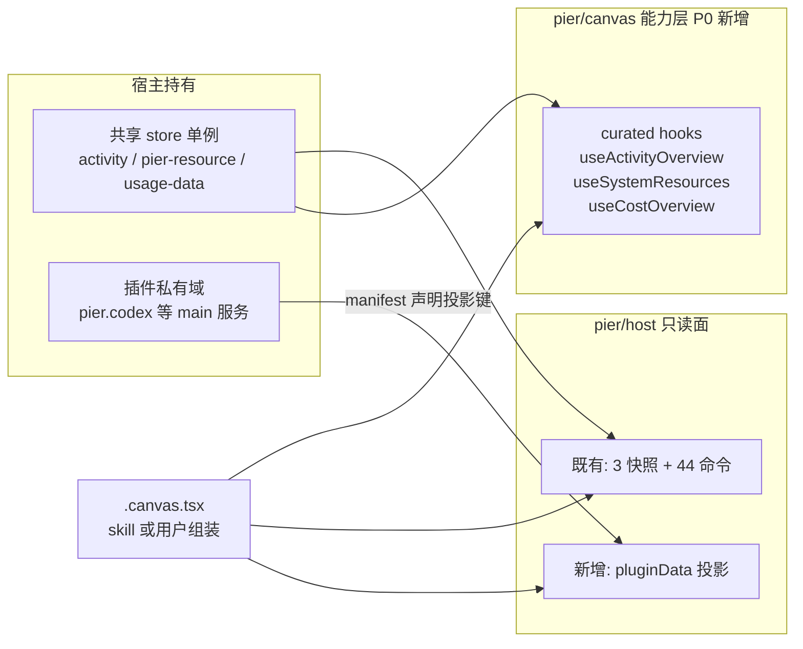

# 工作台能力迁入 Canvas 并移除工作台 · 设计

- 日期：2026-08-24
- 状态：待评审
- 前置调研：`agent://WorkbenchMap`、`agent://CanvasMap`（本会话内侦察报告）；`.pier/canvases/workbench-into-canvas/`（2026-08-16 v3 物料金标准，其「不拆工作台网格」边界被本设计推翻）

## 1. 背景与问题

工作台是 dockview panel + react-grid-layout 的零代码仪表盘：4 个核心组件（活动、系统资源、成本、自定义卡）+ 插件贡献 `workbenchWidgets`（pier.claude / pier.codex / pier.grok 三个账号用量卡在用）。实例与参数持久化在 dockview panel params v3。

Canvas 是代码优先的 live module：`.canvas.tsx` 经主进程编译后在独立 React 根挂载，消费 `pier/canvas`（约 130 个 UI 导出 + `useCanvasFile`）与 `pier/host`（44 条只读命令 + 11 条广播 + 3 个快照）。**数据域与工作台完全重合**——foreground-activity / resources / usage-data 三个快照连 2 秒轮询都与工作台共享同一单例（`acquirePierResourcePolling`）。

两套栈长期并存造成双倍维护面。目标：宿主只提供数据 API 能力（数据 hook + 只读投影），组装交给 canvas skill 与用户代码；工作台整体删除。

## 2. 已确认决策

| 决策点 | 结论 |
|---|---|
| 零代码拼装体验 | 不保留。仪表盘 = `.canvas.tsx` 代码；宿主提供 API 能力，canvas skill 负责组装 |
| 插件账号卡 UI | 不迁移。插件私有数据经宿主持通投影命令暴露；UI 由 skill/模板用通用物料拼装 |
| 迁移程序 | 方案 A：三阶段能力先行（P0 能力层 → P1 展示与生成 → P2 删除），每阶段独立验证 |
| 入口替代 | 不设「新建工作台」替代命令；用户从文件面板打开画布或让 skill 生成 |
| 官方模板位置 | pier-home scope（home root 免信任确认） |
| 组件呈现 | 宿主不实现任何具体仪表盘组件（2026-08-24 追加裁决）。skill 组装 canvas 时用既有 pier/canvas 原语 + 数据 hooks 现场拼装；宿主面只有 hooks 与 pluginData 投影 |

## 3. 目标态架构

## 4. P0 能力层合同

### 4.1 pluginData 投影命令（pier/host 唯一新增）

- 插件 manifest 新增 `dataProjections?: string[]`（如 `"accounts.usage"`），同步进 managed manifest 镜像；未声明键一律拒绝。
- 命令：`host.invoke({ type: "pluginData.snapshot", payload: { pluginId, key } })`——主进程代理到目标插件 main 侧读方法；只读；进 `CANVAS_HOST_ALLOWED_COMMANDS` 与 capability 表（仅 canvas 客户端种类可调）。
- 订阅：新增一条广播通道（插件投影变更时由宿主转发 `{ pluginId, key }`），进 `CANVAS_HOST_ALLOWED_CHANNELS`；`useHostSnapshot("plugin:<pluginId>/<key>")` 统一吃快照 + 订阅。
- 轮询节奏留在插件 main 侧（账号用量 ~15 min 缓存不变），投影只吐缓存快照。
- 物料页自动派生该域文档行（复用 `src/renderer/lib/canvas-materials/host-api-catalog.ts` 反射管线）。
- 执行链三层闸门：manifest 声明检查 → preload allowlist → 主进程 client-kind 授权（对齐现有 canvas-host 三重检查结构）。

### 4.2 curated hooks 替代指标注册表

`src/renderer/lib/workbench/metric-registry.ts` 与 `core-metrics.ts` 的聚合逻辑下沉进三个 hooks（命名沿用 v3 设计），随 stub 共享宿主 store 单例（遵守侦察报告 R2：canvas 源码不 import 工作台模块，经 `globalThis.__PIER_LIVE_CANVAS__` 绑定取实现）：

- `useActivityOverview()`：活动计数、running/needsYou 分组、按 kind 分组；聚合 foreground-activity + task-runs store。
- `useSystemResources()`：CPU / 内存 KPI 与历史序列；挂载期 acquire、卸载期 release 共享轮询。
- `useCostOverview()`：今日成本、区间、代币、日序列、按模型/来源分组；返回值含 `refresh()`——走 usage-data store 方法实现，**不加命令**，保持 `pier/host` 只读纯度。

hooks 实现落位 `src/renderer/lib/live-modules/`（与 stub 运行时同域），导出名进 `PIER_CANVAS_VALUE_EXPORT_NAMES` 并接入 `pier-canvas-exports.ts` barrel，保持编译 stub 与运行时清单一致。

hooks 返回结构化数据；格式化一律走 `@pier/ui/format.tsx` 既有 formatter（compact/bytes/percent/duration/relative）。指标格式化模块 `metric-format.ts` 删除。

### 4.3 组件呈现归组装侧（2026-08-24 裁决）

宿主**不实现**任何具体仪表盘组件（Kpi/Gauge/ActivityList 等）。工作台的实例生命周期概念（`visible` / `refreshToken` / instanceId）不进 canvas；资源轮询由 hooks 挂载期持有。呈现层一律由 skill 组装 canvas 时用既有 `pier/canvas` 原语（Card、Table、DataChart、Item、Progress 等）+ 数据 hooks 现场拼装；hooks 返回结构化数据，格式化在 canvas 源码里走 `@pier/ui/format.tsx` 同源 formatter 导出。

- 已知行为变化并接受：canvas 无 dockview 可见性事件，隐藏未关闭面板中的轮询持续；不为它造第二套可见性机制。
- 物料页只登记三个 hooks 的数据文档行（zh/en），不再有组件物料行。

## 5. P1 展示与生成

1. **官方仪表盘模板**（pier-home scope）：用既有 pier/canvas 原语 + 三个 hooks + pluginData 账号投影段现场拼装，开箱即得旧工作台等价视图；用户可复制进项目 `.pier/canvases/` 修改。
2. **skill 配方**：`/pier-canvas` 增补组装配方——hooks 返回结构字段表、原语组合范式（KPI 卡 = Card+Text、趋势 = DataChart、排行 = Table）、pluginData 用法、模板链接。
3. **物料页登记**：仅 hooks 数据文档行（已在 P0 由守卫带出）；pluginData 域由反射自动派生。

## 6. P2 删除清单

### 6.1 整体删除

- `src/renderer/panel-kits/workbench/**`（41 文件）
- `src/renderer/lib/plugins/workbench-widget-registry.ts`
- `src/plugins/api/workbench.ts`
- `src/shared/contracts/workbench.ts`
- `src/renderer/lib/workbench/` 中被 hooks 吸收后的剩余部分

### 6.2 引用面修改（约 30 文件）

- panel 注册：`components/workspace/panel-registry.ts`、`stores/workspace.store.ts` `addWorkbench`、`lib/actions/panel-actions.ts` `pier.panel.newWorkbench` 及命令别名 JSON
- saved layout：`sanitize-saved-layout.ts` 不再迁移到 `workbench`——dashboard / mission-control / workbench 三代遗留名统一走 unknown-component 清理剪除
- 传输：`components/workspace/transfer/adapters.ts` 两处注册
- 快捷键：`stores/keybinding-preferences.store.ts` LEGACY_COMMAND_IDS
- 插件契约：`shared/contracts/plugin.ts`（schema、`missionControlWidgets` 遗留迁移）、`plugin/managed.ts`、`plugin-core-contribution-ids.ts`（4 个 widget id、动作 id、panel id）
- 插件运行时：`plugins/api/renderer.ts` 类型与 facade 槽、host/external context 适配器、`display.ts`、`plugin-contribution-conflicts.ts`、`plugin-service.ts` 相关段、`bundled-plugin-reader.ts` 计数
- 包镜像：`packages/plugin-api/src/renderer.ts` 类型与 facade；claude/codex/grok 三包删除 widget 注册与 manifest 声明
- 设置页：plugin-row 贡献桶文案
- i18n：4 locale 的 `workbench.ts` 命名空间（约 280 键，含 `metrics.*`）、command-palette 词条、settings-plugins 词条；en fallback 同步核对
- 外观：`globals.css` workbench tab 图标选择器
- 注释清理：usage-data-bridge、skills/detail-section 等

### 6.3 测试

- 删除：`tests/unit/shared/app/workbench-contracts.test.*`、`tests/unit/renderer/workbench/`（20 文件）、3 个 plugin-workbench-* 单测、`tests/component/workbench/`（8 文件）、app 下 cost/system-resources/activity 组件测试、workspace header 断言、settings fixtures
- 删除：纯逻辑套件（view-query、params、densities 等）随工作台一并删除——组件呈现归组装侧，宿主无承接测试
- ⚠ 先搬家 `tests/e2e/workbench/e2e-harness.ts`（被 5 个非工作台 spec 引用）再删目录
- e2e：workbench spec 删除，新增模板画布冒烟 spec

### 6.4 文档

- AGENTS.md「工作台组件贡献点 workbenchWidgets」整节替换为 pluginData 投影说明；「操作反馈规范」「弹窗表单规范」等工作台引用句同步修订
- `docs/design/workbench-update-policy.md` 删除（刷新语义并入 skill 配方）
- CHANGELOG 记录移除与迁移指引

### 6.5 保留的共享设施

`pier-resource.store`、usage-data store 与桥、foreground-activity / task-runs / agent-runtime-index / panel-descriptor stores——canvas 侧继续消费。

## 7. 测试治理

- gold contract 测试链（`tests/unit/canvases/canvas-materials-gold.test.ts` → `.pier/canvases/workbench-into-canvas/contracts.test.ts`）扩展覆盖三个 hooks 导出名一致性
- 新增治理断言：pluginData 未声明键拒绝；`pier/host` 只读集合不变式；物料全覆盖 guard（`ungroupedPierCanvasExports`）不回退
- 每阶段过 `pnpm preflight:push`

## 8. 非目标

- 不做可视化编辑（拖拽/参数面板）进 canvas
- 不做第三方插件加载面；pluginData 仅限官方受管理插件的声明键
- 不实现任何宿主侧仪表盘组件；呈现层永远在 canvas 源码侧（skill / 用户）
- 不迁插件账号卡原视觉为宿主组件；模板拼装版即新基线
- 不做 canvas 可见性门控机制
- v1 不做多窗布局同步等衍生需求

## 9. 风险

| # | 风险 | 缓解 |
|---|---|---|
| R1 | 投影通道设计过宽 → 插件数据全开 | manifest 声明 + 只读 + capability 三层闸门 |
| R2 | 三阶段中间态两套并存漂移 | P2 在同一分支序列内完成，不长期双轨 |
| R3 | 账号卡视觉与旧卡有差 | 接受；模板即新金标准 |
