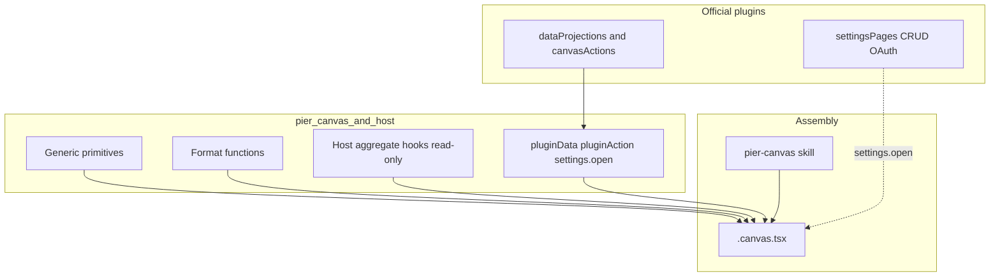

# 工作台能力迁入 Canvas 并移除工作台 · 设计

- 日期：2026-08-24
- 修订：2026-08-26（金标准终态：通用 API + 原语组合；无领域组件 / 无官方账号页）
- 状态：已落地
- 前置：P0 能力层（pluginData.snapshot + 三个宿主聚合 hook）已落地。演示金样 `.pier/canvases/workbench-into-canvas/` 已于 2026-08-28 删除；教法见 `resources/system-skills/pier-canvas/references/host-data.md`。

## 1. 背景与问题

工作台是 dockview panel + react-grid-layout 的零代码仪表盘：4 个核心组件（活动、系统资源、成本、自定义卡）+ 插件贡献 `workbenchWidgets`（pier.claude / pier.codex / pier.grok 账号用量卡）。Canvas 是代码优先 live module，数据域与工作台重合。两套栈并存造成双倍维护面。

目标：宿主只提供 **通用 API 与通用原语**；组装永远发生在 `.canvas.tsx`；工作台整栈删除。账号管理 UI 是积木的一种用法，不是 SDK 组件。

## 2. 金标准契约

| 允许 | 禁止 |
|---|---|
| 通用原语（Card / Item / Progress / Button / …） | 领域组件（AccountsCard / UsageMeter / Kpi / ActivityList / AccountWidgetFrame） |
| 通用命令：`pluginData.*` / `pluginAction.invoke` / `settings.open` / `usageData.refresh` | `canvasWidgets` 贡献点；`useCodexAccounts` 一类插件 hook |
| 宿主聚合 hook（只读数据）：活动 / 资源 / 成本 | 把三家 snapshot DTO 写进 `pier/canvas` sdk |
| 格式化函数（`formatPercent` 等） | 官方成品 `templates/accounts.canvas.tsx` 或新 panel kind |
| skill 教「发现 API → 多种原语拼法」 | 物料页「账号管理」组件行；宿主命令路径写死 `accounts.select` |

插件设置页保留添加 / 删除 / OAuth / 同步。Canvas 不复制 Dialog / Sheet / 登录等待流。

## 3. 目标态架构

## 4. 宿主 API

### 4.1 只读投影

- Manifest `dataProjections: string[]`；未声明键拒绝。
- `pluginData.snapshot` → RPC `projection.<key>`。
- `useHostSnapshot("plugin:<pluginId>/<key>")` 订阅 `pier://plugin-data:changed`。
- `pluginData.watchStart` / `watchStop`：按 `(pluginId, key)` 引用计数；首次 start 调可选 `projection.<key>.watch`，归零调 `unwatch`；handler 不存在则忽略。账号插件将 watch 接到用量 polling 租约。

### 4.2 声明制动作

- Manifest `canvasActions: string[]`。
- `pluginAction.invoke` payload `{ pluginId, key, payload? }` → RPC 方法名即 `key`（不加 `projection.` 前缀）。
- 授权：`allowedClientKinds: ["canvas"]`，能力 `plugin:action`（不以 `:write` 冒充读）。宿主代码路径不出现业务键字符串。
- 官方账号插件声明 `accounts.select` / `accounts.refreshUsage`。禁止列入：add / remove / syncToPeers / cancelLogin / adoptCurrent / usagePolling.*。

### 4.3 Chrome 与刷新

- `settings.open` `{ section?: string }`：能力不含 `*:write`；main 向发起窗发送设置打开请求。
- `usageData.refresh`：包装既有 refresh-all IPC。`useCostOverview` 只读，刷新走 `host.invoke`。

### 4.4 宿主聚合 hook

保留 `useActivityOverview` / `useSystemResources` / `useCostOverview`（只读）。`useSystemResources` 不可删：`useHostSnapshot("resources")` 不含 `cpuHistory`。禁止再为插件加第四个 hook。

格式化从 `@pier/ui/format.tsx` 进入 `PIER_CANVAS_VALUE_EXPORT_NAMES`。

## 5. 生成面

`/pier-canvas` 配方：`plugin.list` / `inspect` 发现键 → `useHostSnapshot` 读 → 已声明 `pluginAction.invoke` 写 → 添加/删除/OAuth 走 `settings.open`。组合启发式给 **两种以上** 拼法，不设官方账号页。物料页只登记原语、三个 hook、host 域与格式化函数。

## 6. 删除工作台

入口：删 `pier.panel.newWorkbench` / `addWorkbench`。sanitize 将 dashboard / mission-control / workbench 当 unknown 剪除。实现、契约、三包 `accounts-widget`、i18n workbench 命名空间一并删除。设置页与 account-display 保留。plugin-api 仅删 widget 专用模块。

测试：先把 `tests/e2e/workbench/e2e-harness.ts` 迁到 `tests/e2e/support/`，再删工作台目录。

## 7. 非目标

- 不做可视化编辑进 canvas
- 不做第三方插件投影面
- 不实现宿主侧仪表盘/账号组件
- 不做 canvas 可见性门控
- 不承诺与旧工作台布局视觉等价

## 8. 风险

- 投影过宽 → manifest 声明 + capability 三层闸门
- 删 widget 后用量停更 → watch 租约
- 生成面抄插件源码 → skill 硬禁 + gold 契约
- 旧 layout 死 tab → sanitize 剪除
