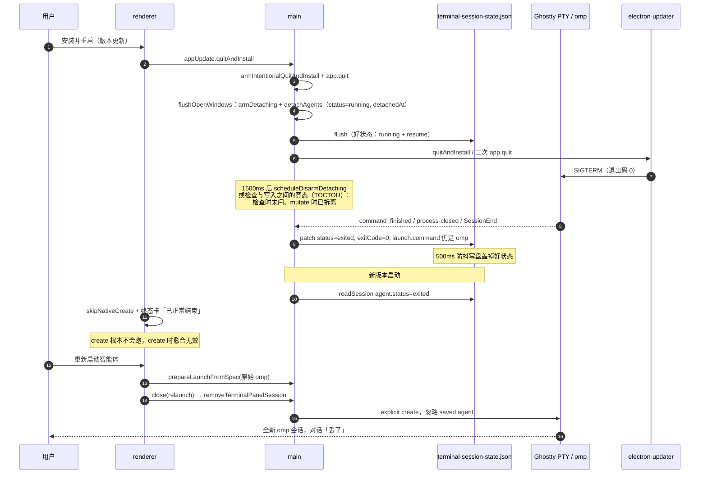
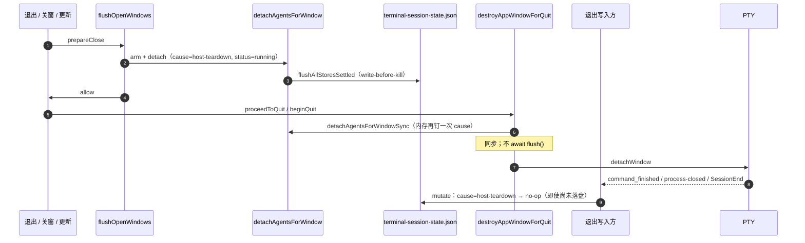
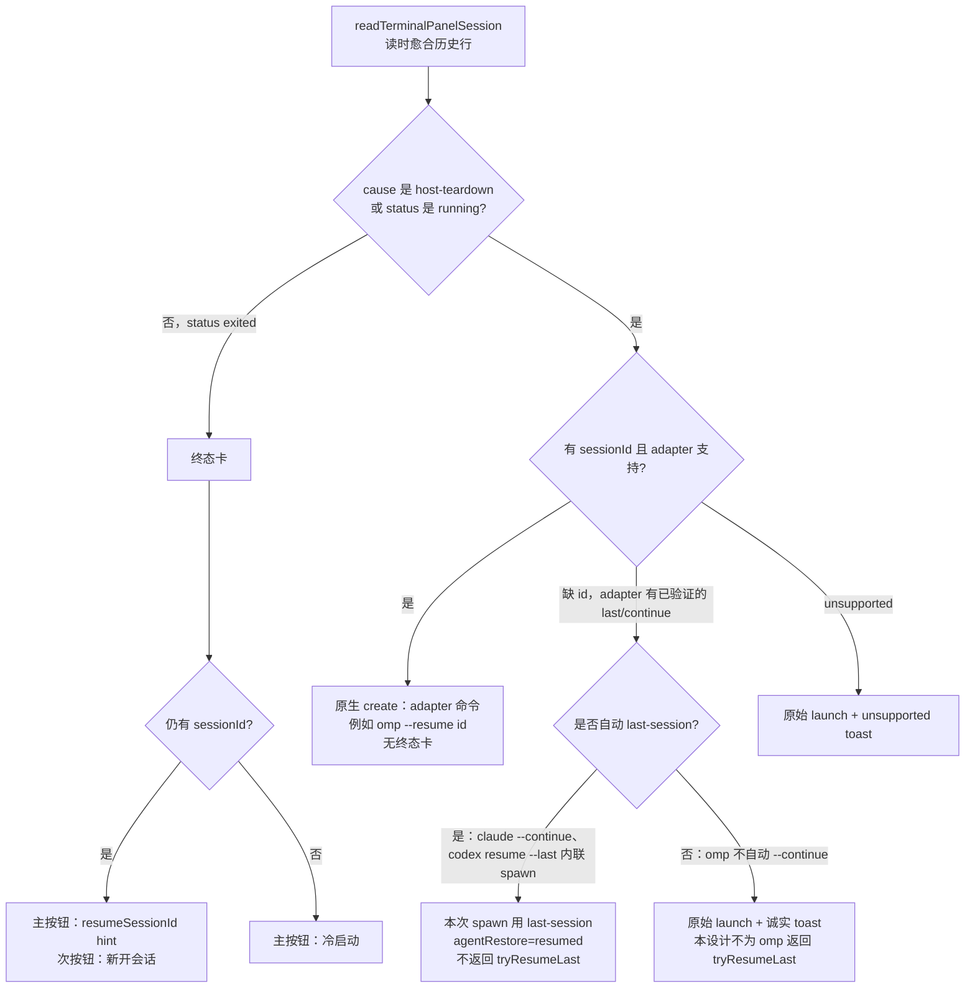

# 智能体会话在宿主重启后接回

日期：2026-08-26  
作者：待填  
状态：草稿（评审修订，未决已拍板）  
范围：全部已接入 Pier 的智能体（不单 omp）；触发面包括版本更新安装、`app.relaunch`、普通退出、关窗。  
取代：归档稿 [`docs/archive/superpowers/specs/2026-07-18-agent-session-restore-on-reentry-design.md`](../../archive/superpowers/specs/2026-07-18-agent-session-restore-on-reentry-design.md) 中与「关窗不得标终态」冲突的 R5，以及把 1500ms 内存闩当成权威的做法。  
相关：

- [终端结果查看态](./2026-07-30-terminal-end-state-design.md)（窗内自退出的终态卡仍然正确）
- [生产自动更新](../../archive/superpowers/specs/2026-07-18-app-auto-update-design.md)（`quitAndInstall` 必须先 flush）
- 终端滚动历史 `0108-live-scrollback-limit`（禁止把 Ghostty 可见历史落盘）

---

## 概述

版本更新或退出再进之后，用户看到的是「智能体会话已结束 / 已正常结束 / 退出码 0」，主按钮「重新启动智能体」跑的是光秃秃的 `omp`，不是 `omp --resume <id>`。对话并没有丢在智能体磁盘上，是 Pier 把**宿主杀掉进程**写成了**用户结束了会话**，再在重启时走了冷启动。

本设计把 Pier 的职责收成两件事，并且只做这两件：

1. **不要弄丢恢复索引**（`agentId` + `cwd` + 稳定 `sessionId`），写盘要赶在拆 PTY 之前，迟到的退出事件不得覆盖。
2. **不要把宿主拆除误判成用户结束**。重进时按各家原生协议拼 resume 命令（`AGENT_RESUME_ADAPTERS`），由智能体自己读自己的会话文件。

终态卡只留给「Pier 还开着、用户在窗内把 CLI 停掉」的情况；即便如此，主按钮只要索引还在，也必须 resume，不能再开一场空会话。文案已经写了「可重新启动继续工作」——行为必须与文案一致。

历史截图行（磁盘已是 `exited`）必须在 **`readTerminalPanelSession` 读路径**愈合，否则 renderer 的 `skipNativeCreate` 根本不会走到 create。拆除闩必须在**下一次原生 create 成功之后**清掉，否则接回后的窗内 `/exit` 会被卡住。

---

## 背景与动机

### 截图在说什么

用户在 **Pier 版本更新重启**（`appUpdate.quitAndInstall` / `app.relaunch`）之后看到：

| 项 | 值 |
|---|---|
| 标题 | 智能体会话已结束 |
| 说明 | 上次会话已退出。可重新启动继续工作。 |
| 主按钮 | 重新启动智能体 |
| 智能体 | OMP |
| 状态 | 已正常结束（success） |
| 工作目录 | `/Users/xyz/ABC/pier.worktree/feat-dsh-plugin` |
| 命令 | `omp`（**没有** `--resume <id>`） |
| 用时 | 4 小时 28 分 |
| 退出码 | 0 |

这不是「omp 把会话弄丢了」。这是宿主分类错误 + 重启走了原始 launch。

### 当前实现（已对源码核对）

2026-07-18 的金标准仍对：**会话属于各智能体；Pier 只存恢复索引；关窗可拆 PTY，不得把可恢复会话标终态。** 骨架已经落地，但权威闩是 1500ms 内存集合，扛不住版本更新。

| 位置 | 现状 |
|---|---|
| `src/main/state/terminal-session-agent-resume.ts` | `updateTerminalPanelAgentResume` 只在 `agent.status === "running"` 时写入；pending **只在内存**；schema 为 `{ capturedAt, sessionId, source: "hook" }`；同 id 返回 `"applied"` 且不 mutate |
| `src/main/services/agents/resume-adapters.ts` | omp：`appendResumeFlag(..., "--resume")` → `omp --resume <id>`；`resolveAgentResumeLaunch` 只在 create 拿到 restored running agent 时使用；`resolveAgentResumeLastLaunch` 仅 claude/openclaude 的 `--continue` 与 codex `resume --last`；omp **没有** last-session 回退 |
| `src/main/ipc/terminal/create-launch.ts` `resolveCreateTerminalLaunch` | `explicitCreate`（新 `launchId`）**丢掉** `saved?.agent`；只有 `savedAgent?.status === "running"` 才 `restoredAgent` + resume |
| `src/main/ipc/terminal/initial-session.ts` | `persistInitialTerminalAgent` 在 `restoredAgentLaunch` 时**整段拷贝** `existing.restore`；发生在 `addon.createTerminal` **之前** |
| `src/renderer/panel-kits/terminal/restored-result-view.tsx` | `restoredAgentResultFromSession` 仅当 `status === "exited"` 返回 agent；`panel.tsx` 据此 `skipNativeCreate` |
| `src/renderer/panel-kits/terminal/hooks/use-end-state-tab.ts` | 同样只看 `agent.status === "exited"` 水合 EndState |
| `src/renderer/panel-kits/terminal/hooks/use-restart-restored-agent.ts` | `prepareLaunchFromSpec({ command: restoredAgentResult.launch.command })`——持久化的是原始 `omp`，resume argv 按设计不写进 `launch.command` |
| `src/renderer/panel-kits/terminal/hooks/use-relaunch.ts` + `transfer-guards.ts` | relaunch 先 `close({ reason: "relaunch" })`，**无条件** `removeTerminalPanelSession`，索引被删掉 |
| 退出写入方 | `markAgentSessionExited`（SessionEnd，常不带 `exitCode`）、`task-lifecycle-wiring.ts` 的 `command_finished`（exit ≥ 0，非悬挂 145–148）与 `process-closed`（`processAlive === false`，**不带** `exitCode`） |
| 抑制 | 三处都看 `isWindowDetaching`，它是 **1500ms 定时器**（`window-detaching-guard.ts` `DETACH_DISARM_DELAY_MS`），检查在 `patchTerminalPanelAgentStatus` 的 mutate **之外** |
| 关窗拆离 | `detachAgentsForWindow` 保持 `status: "running"`，写 `restore.detachedAt`，合并 pending；只处理仍是 `running` 的行 |
| 版本更新 | `performProdQuitAndInstall` arm 后 `app.quit()`；`proceedToQuit` 在 flush 成功后才 `quitAndInstall()`。`destroyAppWindowForQuit` 是**同步**的：`detachAgentsForWindowSync` → `detachWindow` → `destroy` → `scheduleDisarmDetaching(1500)`，**不能** `await flush()` |
| 落盘 | 唯一文件 `{userData}/terminal-session-state.json`，`debouncedJsonStore` 500ms。prepareClose 的 `flushOpenWindows` 会 flush；之后的 `exited` 补丁仍可再排写 |
| 智能体 panel 的 `lifecycleId` | `create-handler.ts`：`launch.task?.runId ?? ""`。空字符串在 `task-lifecycle-wiring.ts` 里同时表示「不是任务」：`if (!lifecycleId)` 才跑 `FA.commandFinished` 与 agent `exited` 补丁。空 id 又与「尚未 reset」的 `isCurrentLifecycle` **匹配**，旧 PTY 事件能打到新 spawn |
| `ignoreNextNativeUserClose` | 只吞 `processAlive === true` 的 surface-close 回声，**不**抑制 agent `exited` 补丁 |
| omp sessionId | `integrations/omp.ts`：`session_start` 载荷常只有 `{ type }`；id 来自 `ctx.sessionManager.getSessionId()` 或 jsonl 文件名；`effectsForAcceptedAgentEvent` 对主会话事件 `persistResume`，对 SessionEnd `markPanelExited`（顺序：先 persist 再 mark，正确） |
| hook 窗身份 | `PIER_WINDOW_ID = String(win.id)`；`recordAgentResumeSession` / `windowRecordIdForElectronWindowId` 在 `forgetAppWindow` 之后返回空 |

归档稿的 **R5「终态重启用原始 launch、清旧 resume」在今天是产品缺陷**：终态卡文案承诺继续工作，按钮却冷启动。

### 因果链



三条彼此独立的丢失：

| 编号 | 名字 | 含义 |
|---|---|---|
| A | **分类错误** | 宿主拆除被写成用户结束的终态卡 |
| B | **重启不 resume** | 终态卡主按钮不带 `--resume`；relaunch 还删掉索引 |
| C | **sessionId 不耐久** | hook 未写入、pending 只在内存、500ms 防抖在崩溃路径上来不及 flush；一旦被标 `exited`，后续 resume 写入还会被 `canApplyToAgent` 拒绝 |

---

## 目标与非目标

### 目标

1. 版本更新 / `app.relaunch` / 普通退出 / 关窗（不是关标签）之后：有 `sessionId` 且 adapter 支持的智能体（含 omp）**自动**以原生 resume 命令进同一场对话，**不出现终态卡**。
2. 关窗/退出的 `flushOpenWindows` 在拆 PTY 之前把 `restore.cause = "host-teardown"` 与恢复索引写入并 flush。此后本代面板的 `command_finished` / `process-closed` / SessionEnd **不得**把 `running` 改成 `exited`（权威闸在 mutate 内的 `cause` / 代际，不在 1500ms Set）。
3. **下一次原生 create 成功之后**必须清 `cause` 并提升 `spawnGeneration`；create 失败则保持闩。接回后的窗内 `/exit` 必须能再写成 `exited`。
4. 历史截图行在 **read** 上愈合，使 `skipNativeCreate` / EndState 看不到 `exited`，native create 会跑。
5. 窗内用户结束 / 崩溃：仍用终态卡；主按钮在仍有 `sessionId` 时 resume；次按钮「新开会话」才冷启动并清索引。
6. 关标签：删 session 行（保持现状）。
7. 缺 `sessionId`：诚实说明，禁止假装还是上一场对话。
8. resume argv **仍然不得**写进持久化的 `launch.command`。
9. 恢复失败不得 `clearTerminalPanelAgent`（旧稿 R7，已有测试，保持）。

### 非目标

- 不把 Ghostty 滚动历史落到磁盘（`0108-live-scrollback-limit`）。
- 不在宿主侧拥有或回放智能体 transcript；不做第二套聊天 UI。
- 不在 `quitAndInstall` 期间保活智能体进程（二进制替换不可能继承旧 PTY）。
- 不扫描 `~/.omp` / `~/.claude/projects` 等家目录去猜会话文件（已文档化的 last-session CLI 旗标除外）。
- 不把各家 one-shot CLI 再包一层 Pier API；resume 只走 `AGENT_RESUME_ADAPTERS`。
- 不把开发态 `performDevSoftRelaunch`（只 reload renderer，PTY 可能还活着）与生产拆进程路径混成同一条拆除。
- 不新增第二份 resume 小文件；索引仍只在 `terminal-session-state.json`。
- 不引入第三种 `status: "detached"`。
- 不为 SIGKILL / 断电加 crash 垫片：只靠崩溃前已 flush 的 `running` + id。
- unsupported 智能体：原始 launch + 现有 `unsupported` 文案，不再另写一套。
- 宿主拆除 / 终态卡主按钮 **永不**自动 `omp --continue`。
- 本设计 Slice 3 **不**停止 `close({ reason: "relaunch" })` 删 session 行；标题 / tab 丢失是跟进，不在本切片。

---

## 业界怎么做（必须对齐的模式）

### 两类产品，两套持久化

| 类型 | 谁拥有对话 | 重启后怎么接 |
|---|---|---|
| 聊天产品（Cursor、VS Code Copilot / Agents 窗、ChatGPT 桌面） | 宿主自己的 DB / jsonl | 读自己的账本，UI 直接画出来 |
| 终端宿主（Pier、Quil、Orca、cmux） | **各智能体自己的会话文件** | 宿主只存 **恢复索引**（id + cwd + 哪一家），重进调原生 `--resume <id>` |

Pier 是第二类。把第一类的「进程死了 = 会话结束」套到第二类上，就是这次事故。

智能体客户端协议 ACP（Agent Client Protocol）把同一件事写成硬规则：智能体若声明 `loadSession`，客户端 **必须** `session/load`，不得 `session/new`。有 id 却 new，就是「会话丢失」的定义。[官方 Session Setup](https://agentclientprotocol.com/protocol/session-setup) 写明：`loadSession === false` 时才禁止 load。JetBrains Rider 接 Cursor ACP 的现场对照：UI 里历史还在，智能体却像新会话——日志是 `loadSession: true` 但 `session/load` 次数为 0、一直 `session/new`（[Cursor 论坛 #165897](https://forum.cursor.com/t/acp-in-jetbrains-rider-chat-transcript-visible-in-ui-after-restart-but-agent-has-no-prior-turns-acts-as-new-session/165897)）。Pier 终态卡 + 冷启动 `omp` 与此同构。

### Claude Code：进程会死，JSONL 还在

[官方会话文档](https://code.claude.com/docs/en/sessions)：会话按项目目录连续追加到 `~/.claude/projects/<编码路径>/<session-id>.jsonl`。入口：

- `claude --continue`：当前目录最近一场交互会话
- `claude --resume`：选择器
- `claude --resume <id|name>`：钉死一场

宿主的工作是按 **稳定 id** 重连，不是自己存一份对话。`--continue` 在同一目录多场并行时会接错人（Quil 明确写了这一点）。

**最近的同类宿主：Quil**（[quil.cc 文](https://quil.cc/blog/resume-claude-code-session-after-reboot/)）——这是与 Pier 最接近的金标准：

1. 每个 pane 装 SessionStart 钩子（hook），id 旋转（`/clear`、`/resume`、压缩）都记下**当前** id。
2. 工作区快照持续落盘。
3. 重启后对每个智能体 pane 跑 `claude --resume <记下的 id>`，自动，不用 overlay。

Quil 还持久化 500 行 ghost buffer；Pier **明确不做**滚动历史落盘，只对齐「按 pane 记稳定 id + 自动原生 resume」。

**不要用 pid 索引。** `~/.claude/sessions/<pid>.json` 随进程消失；`/clear` 还不更新这份映射（[#36213](https://github.com/anthropics/claude-code/issues/36213)、[#53037](https://github.com/anthropics/claude-code/issues/53037)）；名字若只写在 pid 文件里，进程一退 `claude -r <name>` 就找不到，JSONL 其实还在（[#48469](https://github.com/anthropics/claude-code/issues/48469)）。Pier 的 pending-only-in-memory 与 1500ms 闩，是同一类「把活体当索引」错误。

### Cursor / VS Code：他们拥有对话，所以读自己的库

- Cursor：`state.vscdb` + `agent-transcripts/*.jsonl`。Cursor 就是聊天 UI，重启读自己的库。宿主崩溃时原子写失败会清空 jsonl——**退出时 flush 仍然重要**，即便对话不在 Pier 手里。
- VS Code Agents 窗（[官方](https://code.visualstudio.com/docs/chat/chat-sessions)）：关闭是**隐藏不是丢弃**；窗口 reload 时可见/隐藏的聊天、分组、分栏都恢复。索引损坏会让对话「看不见」但文件还在（社区 `vscdb-fix`）。Pier 的 `status: exited` 终态卡就是这种「索引把还活着的会话标成结束」。

### Codex / omp / OpenCode / Goose：钉 id 才是宿主重启金路径

重启后再连的宿主 **钉记下的 id**，从不自动「该目录最新一场」：

| 做法 | 谁 | 行为 | 对 Pier |
|---|---|---|---|
| 按 pane 钉 id | [Quil](https://quil.cc/blog/resume-claude-code-session-after-reboot/) | SessionStart 钩子记下当前 id；重启跑 `claude --resume <id>` | 金标准。Pier 对齐这个，不齐 ghost buffer。 |
| 有 id 必须 load | [ACP Session Setup](https://agentclientprotocol.com/protocol/session-setup) | 智能体声明 `loadSession` 且客户端有 id → **必须** `session/load`，不得 `session/new` | 有 id 却冷启动 = 会话丢失。 |
| cwd 最近一场（人用） | [Claude `--continue`](https://code.claude.com/docs/en/sessions) | 当前目录**最近一场交互**会话；跳过 background / SDK；同目录多 pane 会接错 | Pier 已对 claude/openclaude **缺 id** 时内联；有记下的 id 时仍钉 `--resume`。 |
| cwd 最近一场（人用） | [Codex `resume --last`](https://developers.openai.com/codex/cli/features) | 官方：当前工作目录最近一场（`--all` 才忽略 cwd）。选择器才是人用路径。无效 id **必须报错**，不得静默新开（Codex 有过静默新建的洞，不要学） | Pier 已有 `resume --last` 作缺 id 回退。 |
| 面包屑 → 否则 mtime | omp `--continue`（`SessionManager.continueRecent`，[oh-my-pi](https://github.com/can1357/oh-my-pi/blob/main/docs/session-switching-and-recent-listing.md)） | (1) 终端面包屑 `~/.omp/agent/terminal-sessions/<terminal-id>`（TTY 路径，然后 `ZELLIJ_PANE_ID` / `TMUX_PANE` / `CMUX_SURFACE_ID` / `KITTY_WINDOW_ID` / `WEZTERM_PANE` / `TERM_SESSION_ID` / `WT_SESSION`）；(2) 面包屑不可用 → **cwd 桶里 mtime 最新 jsonl**，或开一场新会话 | PTY 一换 TTY 身份变，面包屑 miss → **静默接 mtime 最新**，不是 fail-closed。omp 还有用户在智能体里开的 `autoResume`——那是 omp 的事，不是 Pier 的。 |
| UI 历史 | Cursor / VS Code | 「上一场聊天」是宿主自己的 transcript | **不是** Pier 的模型。 |

| 智能体 | 钉 id | 「最近一场」CLI | 会话文件 |
|---|---|---|---|
| Codex | `codex resume <id>` | `codex resume --last`（Pier 缺 id 时已有） | `~/.codex/sessions/` |
| omp | `omp --resume <id>` / `-r` / `--session`（Pier adapter 已有） | `omp --continue` / `-c`（上表） | `~/.omp/agent/sessions/<编码 cwd>/*.jsonl` |
| OpenCode 系 | `--session <id>` | 各家不一 | 各家自己的 store |
| Goose | `goose session -r --session-id <id>` | 未作 last-session 回退 | Goose 自己的 store |

**Orca 修过与本次同构的 omp 洞**（[stablyai/orca#8991](https://github.com/stablyai/orca/pull/8991)）：记下 `ctx.sessionManager.getSessionId()`，argv `omp --resume <id>`。Pier 已经能取 id，随后在分类 / 重启路径上丢掉。

**抽出的模式（拍板）：钉 id 是宿主重启金路径；「该目录最新一场」是人的回退，带多面板限制；宿主曾经有机会记下 id 时，永不自动调用 last-in-folder。** 自动路径（host-teardown spawn、终态卡主按钮）**禁止** `omp --continue`。omp 不进 `CONTINUE_LAST_AGENTS`。`tryResumeLast` **不为 omp 返回**——toast「接回本目录最近会话」是 **独立跟进 PR**，仅当 Slice 5 验证与文档一致，且文案写明「该目录最新一场」并带与 Claude `--continue` 相同的多面板限制。

### tmux / iTerm2 / Ghostty / Warp

- **tmux**：进程继续活；GUI 重连。Pier 在二进制替换时必须拆 PTY，**不能**走这条。
- **iTerm2**：恢复布局；进程若已死，给一个新 shell。
- **Ghostty**：产品层不恢复 PTY 内容；与 Pier 的 0108 决定一致。
- **Warp**：云端持久化块，Warp 拥有 UI。不适用于「CLI 在 PTY 里跑」的 Pier。

ChatGPT / Claude.ai 桌面是服务端线程，不适用。

### 抽出的行业模式（Pier 必须遵守）

1. 聊天产品拥有 transcript → 持久化 UI 状态。
2. 终端宿主**不拥有** transcript → 持久化**恢复索引**，宿主重启后**自动调用原生 resume**。
3. 永不把「宿主杀了进程」当成「用户结束了对话」。
4. resume 键必须耐久：不是 pid、不是 1500ms 闩、不是只在内存的 pending。
5. 二进制替换之后活体进程不可能还在；按 id 重连是唯一金路径。
6. **钉 id 是宿主重启金路径；「该目录最新一场」是人的回退（多面板会接错）；宿主曾有机会记下 id 时，永不自动 last-in-folder。**

---

## 问题分析（对照代码）

### A. 分类：1500ms 内存闩不是权威

`isWindowDetaching`（`window-detaching-guard.ts`）把 electron 窗 id 与 window record id 放进 `Set`，`scheduleDisarmDetaching` 在 1500ms 后删掉。退出写入方在调用 `patchTerminalPanelAgentStatus` **之前**读这个 Set，检查不在 mutate 里——这是检查与写入之间的竞态（TOCTOU）。

关窗/退出顺序（好的那一段）：

1. `prepareWindowBeforeCloseCore` / `flushOpenWindows`：`armAndDetachAgentsBeforeClose` → `detachAgentsForWindow`（`running` + `detachedAt` + 合并 pending）→ `flushAllStoresSettled`
2. `proceedToQuit`：`beginQuit()` 后 `quitAndInstall()` 或 `app.relaunch()` 再 `app.quit()`
3. `destroyAppWindowForQuit`：再 arm、同步 detach、`detachWindow`（拆 PTY）、然后 **scheduleDisarm 1500ms**。此函数同步，**不能**再 `await flush()`。

版本更新时 1500ms 撑不住：安装器切换可达数秒；迟到写入在 disarm 之后仍可能打到还活着的 main；`patchTerminalPanelAgentStatus` 允许 `running → exited` 且不看 `restore.detachedAt`。prepareClose 的好 flush 会被后来的 `exited` mutate 再排一次写。

SIGTERM 退出码 0，终态卡画成「已正常结束」。窗内 `/exit` / Ctrl+C / 显式停止才是终态卡的合法输入。

### B. 重启：索引在 relaunch 时被删，create 又忽略 saved

1. 终态卡只在 `status === "exited"` 时出现（`restoredAgentResultFromSession`）。历史行若仍是 `exited`，**create 不会跑**。
2. 主按钮把原始 `launch.command` 交给 `prepareLaunchFromSpec`。
3. `close({ reason: "relaunch" })` → `removeTerminalPanelSession`。注释写「不是面板死亡」，却把整行删了。`use-relaunch.ts` 的 `setSavedSession(null)` 是 renderer 对称的一半。
4. `explicitCreate` 把 `savedAgent` 置 `undefined`。
5. `panel-lifecycle.test.tsx` 把「重启只传原始 command」锁成预期。

旧稿 R5 废止。

### C. sessionId：pending 只在内存；exited 之后不再收 id

- omp `session_start` 体经常没有 id。`recordAgentResumeSession` 在窗已毁时直接 return。
- pending 在 `Map` 里。若 agent 在 detach 之前已被标 `exited`，detach 跳过该行，pending 被清掉且未落盘。
- `canApplyToAgent` 要求 `status === "running"`。
- `CreateTerminalResult.tryResumeLast` 在 renderer 已接线，**main `create-handler.ts` 从未填充**。缺 id 时 claude/codex 在 create **内联**改用 last-session 并标 `agentRestore: "resumed"`；omp 变 `cold-start` 且没有 toast 操作。二者不要叠成双 spawn。

### 开发态 soft relaunch 是另一条路

`performDevSoftRelaunch` 只 `webContents.reload()`，**不拆 PTY**。不得写 `host-teardown`，不得第二份 spawn。拆除闩只用于会杀死 PTY 的路径。

---

## 推荐设计

### 结束原因分类（必须持久化）

每个智能体面板持久化一份结束原因。`status` 仍是 `running | exited`（不引入第三种 `detached`）。**原因**才是「进程为什么不在」的权威。

| `restore.cause` | 何时 | `status` | 下次启动 |
|---|---|---|---|
| 缺省 / 未写 | 活体 | `running` | 不适用 |
| `host-teardown` | 应用退出、关窗（非关标签）、`app.relaunch`、`quitAndInstall`、宿主崩溃前能写盘的路径 | **保持 `running`** | **自动 resume**，无终态卡 |
| （无 cause，`status: exited`，退出码 0 / 缺省） | 窗内 `/exit`、Pier 仍在时用户 Ctrl+C 结束了 CLI、显式停止 | `exited` | 终态卡；主按钮有 id 则 resume；次按钮新开会话 |
| （无 cause，`status: exited`，退出码 ≠ 0） | Pier 仍在时非 0 退出 | `exited` | 终态卡失败徽标；主按钮有 id 则 resume |
| （行删除） | 用户关标签 | 无行 | 没了 |

`host-teardown` **禁止**写成 `status: "exited"`。`restoredAgentResultFromSession` 继续只看 `exited`——拆除路径与读路径愈合后的历史行都进不了那张卡。

`cause` 只需要一个正值：`host-teardown`。用户结束与崩溃由 `status + exitCode` 表达。

`exitCode === undefined` **不是**比 `0` 更干净。`process-closed` 补丁本来就不带退出码；SessionEnd 的 `markAgentSessionExited` 也常省略。愈合把「0 或缺省」算作干净，只因为迟到拆除写入长这样，不是额外信任。

### `status` 的读者（不引入 `detached` 的真实代价）

| 读者 | 今日 | 本设计 |
|---|---|---|
| `restoredAgentResultFromSession` / `skipNativeCreate` | 只看 `exited` | 历史行在 **read** 上变成 `running` + `cause=host-teardown`，自然不 skip。新拆除行本来就是 `running`。 |
| `useTerminalEndStateTab` | 只看 `exited` 水合 EndState | 同上，不水合拆除行。 |
| FA / 活动总览 / 智能体列表 | 内存；从不从磁盘 `running` 重建活体 | **保持**。磁盘 `running` 不是活 PTY。overlay 只在 spawn 后 `agentLaunched` 回来。 |
| `canApplyToAgent` | 要求 `status === "running"` | 拆除后仍是 `running` → SessionEnd 仍能写入 id。这是特性，保留。 |
| tab chrome | `tabChromeAfterAgentExit` 只在写成 `exited` 时跑 | 拆除不写 `exited`，**活体智能体 tab 外观保留到 spawn**。有意为之：不要在拆除重挂上先闪终态再闪 resume。 |
| `resolveCreateTerminalLaunch` | 只 `running` 才 `restoredAgent` | `running` 或读路径愈合后的 host-teardown。 |

**重挂后到 native create 成功的 1–2 秒：** 用户看到的是**活体 tab chrome**（图标 / 标题仍在）、Ghostty 面尚未就绪（空或占位）、**没有**终态卡、**没有** FA overlay。这是拒绝第三态的代价，可接受。不要用 overlay 或「已结束」填这段空隙。

### 耐久拆除闩（权威在 mutate，不在 destroy 里 flush）



规则：

1. **Write-before-kill（耐久快照）**：现有 `flushOpenWindows` 已经先 `armAndDetachAgentsBeforeClose` 再 `flushAllStoresSettled`。Slice 1 断言这条顺序，并让 detach 写入 `cause`。这是 quit / 更新 / 关窗能保证落到磁盘的路径。
2. **权威闸（迟到补丁翻不了盘）**：`patchTerminalPanelAgentStatus` 与 `markAgentSessionExited` 在 **mutate 内**拒绝：`restore.cause === "host-teardown"` 时不得写成 `exited`。内存 `isWindowDetaching` 可留作热路径，不再是唯一闸。单测：`detachAgentsForWindowSync` 之后立刻 `patch(... exited)` **不得**改变内存中的 `cause`/`status`，即使此后 **再也不 `flush()`**。
3. **`destroyAppWindowForQuit` 不承诺 flush。** 它是同步析构（`finalCleanup` 在 `phase === "quitting"` 的 `before-quit` 里，不能 await）。只再跑 `detachAgentsForWindowSync`（热 store 上 mutate），然后 `detachWindow`。禁止在这里 `await flush()` 或假装有同步 flush API。最后一次「好快照」以 `flushOpenWindows` 为准；若 destroy 之后还有 mutate，闸会挡住 `exited`，最多把未 flush 的 in-memory 好状态在进程被杀时丢掉——那是 SIGKILL 级，本设计不承诺。
4. **不要**为 resume 另开文件，也不要在 `mutate` 里面调用 `flush`（会重入写队列）。需要立刻落盘时，在 mutate **返回之后**调用现有 `flushTerminalSessionState()` / `store.flush()`（取消 500ms 定时器并排空 `writeQueue`）。

### `/exit` 后立刻关窗的竞态（产品拍板）

今日 detach 只处理 `status === "running"`，所以「`/exit` 已经写成 `exited` 再关窗」**不会**得到 `detachedAt`。危险的是反向：

1. 用户 `/exit` / Ctrl+C（退出码 0，或 SessionEnd **不带** `exitCode`）。
2. `patch` 仍在 `await ensureStore()`。
3. 用户关窗 / 退出 / 更新。
4. detach 仍看见 `running`，写下 `cause=host-teardown`。
5. 随后的 SessionEnd / `command_finished` 被新闸忽略。
6. 下次进窗自动 resume 一场用户刚结束的对话。

**拍板：**

- **前进路径：** 若 FA 已经记下该 panel 的智能体会话结束，**不得**写 `host-teardown`。关窗应把这场对话留在 `exited`（或让随后的退出写入完成），下次进终态卡。跳过列表在 **L2** `armAndDetachAgentsBeforeClose`（以及 quit 路径上同一调用方）用 FA 快照算出来，经 `skipPanelIds` 传给 L1。`detachAgentsForWindow` **保持纯 store mutate**，禁止 import FA（L1 ⊥ L2）。
- **谓词 `agentSessionEndedInForeground(panelId, windowId)`**（A14 点名）：本窗快照里该 panel **没有** `kind === "agent"` 的槽（SessionEnd 已 `dropSlotIfEmpty`），**或者** 聚合器已见过该 panel 的 `commandFinished`（即使 hook 层还在）。调用方把为 true 的 panelId 放进 `skipPanelIds`。
- **历史愈合：** `detachedAt <= (finishedAt ?? Infinity)`（先拆离、再迟到写入；缺 `finishedAt` 仍可愈合）。夹具用 `detachedAt + 1 === finishedAt`，避免同毫秒踩空。`finishedAt` 已在、之后又被写上更大 `detachedAt` 的行：当前 detach 实现下不应出现；若出现，**不愈合**。
- **残留小窗：** `/exit` 的 persist 与 FA 都还没进，用户立刻关窗。宿主无法区分「用户结束」与「退出杀进程」。**接受为 resume**（关窗时宿主还没记下已结束，按可恢复处理）。用「新开会话」仍能丢掉。不要为这一窗去扫盘或猜意图。

### 代际关联：旧 PTY 不得标新 agent（且不得关掉窗内 `/exit`）

`ignoreNextNativeUserClose` **只**继续当 surface-close 旗标（吞 `processAlive === true`）。一次 PTY 死亡最多三个写入方（`command_finished`、`process-closed`、SessionEnd），单 bit / countdown=3 都容易漏或误伤。resume **保持同一个** `sessionId`，**禁止**按 sessionId 做 ignore-next。

今日 `task-lifecycle-wiring.ts` 用 **空** `lifecycleId` 表示「不是任务」：

```ts
if (!lifecycleId) {
  foregroundActivityService.commandFinished(...)
}
if (!lifecycleId && exitCode >= 0 && !isSuspendedJobExitCode(...) ) {
  patchTerminalPanelAgentStatus(..., { status: "exited" })
}
```

`create-handler.ts` 现为 `lifecycleId = launch.task?.runId ?? ""`。若只把智能体 panel 改成 `String(spawnGeneration)` 而不改上述分支：`!lifecycleId` 恒假，窗内 `/exit` **再也不会**经 native 回调写成 `exited`，`FA.commandFinished` 也会被跳过（无 SessionEnd 的 Ctrl+C / SIGTERM 全靠这条）。D11 必须同时改闸，不能只改 create 的 id。

**选定机制：**

1. **任务 panel 继续** `lifecycleId = runId`（非空 uuid）。
2. **智能体 spawn：** `lifecycleId = launch.task?.runId ?? String(nextSpawnGeneration)`（智能体路径非空；禁止再传 `""` 当「智能体」）。
3. **普通 shell** 仍可 `""`。
4. `resetPanel` 记下本次 id，并记下 surface：`task` | `agent` | `shell`（有 `launch.task?.runId` → `task`；有 agent launch → `agent`；否则 `shell`）。
5. **每一处** `if (!lifecycleId)` 的 **agent-exit 与 `commandFinished`** 改为：

```ts
if (!lifecycle.isCurrentLifecycle({ lifecycleId, panelId, windowId })) {
  return; // 旧代 PTY，整段丢掉（A8）
}
if (!lifecycle.isTaskSurface({ panelId, windowId })) {
  foregroundActivityService.commandFinished(...)
  // process-closed / command_finished 的 agent exited 补丁（仍受 cause 闸）
}
```

`isTaskSurface` = 当前 panel 的 surface 是 `task`（本代 `lifecycleId` 是 task `runId`）。智能体的 generation 字符串不是 task runId，因此 **cause 清掉之后** `lifecycleId: "2"` 的 `command_finished` / `process-closed` **仍会** `patch exited`（A3 / A13）。旧代 `"1"` 在 `isCurrentLifecycle` 被丢掉。

| 通道 | 关联 |
|---|---|
| `command_finished` / `process-closed` | 上表。`isCurrentLifecycle` 丢掉旧代；`isTaskSurface === false` 才走 agent 退出 / `FA.commandFinished`。 |
| SessionEnd（无 native `lifecycleId`） | 见下一小节 JSONL 字段。比较事件上的 `spawnGeneration` 与 **该 panel 磁盘** `restore.spawnGeneration`。 |
| 同 id resume | 新 PTY 的 env 是新代际；旧 PTY 仍是旧 env。同一 `sessionId` 不参与过滤。 |

`nextSpawnGeneration` 在 **调用 native create 之前**就算好（`(existing.spawnGeneration ?? 0) + 1`），作为本次 `lifecycleId` 与 **该 PTY** 的 `PIER_AGENT_SPAWN_GENERATION`。磁盘上的 cause 清零与 `spawnGeneration` 写入只在 native create 返回 ok 之后。create 失败：磁盘保持旧 cause + 旧代际；这次作废的 lifecycleId 被下一次 `resetPanel` 换掉。

同进程关窗再开（macOS，目标 1）不是新 Electron 进程：旧回调可以在 restore create 清闩之后到达。代际关联就是为这条。

禁止：以 sessionId 为 ignore-next 键；把 `ignoreNextNativeUserClose` 扩成「忽略下一次 agent 退出」；把 generation 塞进 **process-wide** `hookEnv()`（所有 panel 会共用一个代际）。

### SessionEnd 代际必须是 v3 可选字段（`.strict()` 会丢掉多出来的键）

`agentEventPayloadV3*`（以及 v1/v2）都是 **`.strict()`**。`jsonl-observer.ts` `safeParse`：未知键整行失败，SessionEnd 被丢——比忽略代际更糟。禁止把 `spawnGeneration` 当未声明字段塞进 JSONL，也 **不要** 为此把事件升到 v4。

Slice 1 必须包含：

1. 在 `agentEventPayloadV3BaseFields` 增加 `spawnGeneration: z.number().int().positive().optional()`。三条 v3 schema（standard / InteractionRequested / InteractionResolved）都吃得到。v1/v2 不改。
2. **按 PTY 注入 env，不要写进 `foregroundActivityService.hookEnv()`。** `hookEnv()` 只有 `PIER_AGENT_HOOKS_DIR` + `PIER_AGENT_EVENT_LOG`，进程级共享。`PIER_AGENT_SPAWN_GENERATION` 与 `PIER_WINDOW_RECORD_ID` 走 `withPanelStatusEnv`（已有 `PIER_PANEL_ID` / `PIER_WINDOW_ID`）。
3. **emit 从 env 读，写进已声明字段。** JS 各家没有统一 `pierEmit`（omp / pi / opencode / kilo / amp / mimo-code 各拷一份）。在 `writer-lock-source.ts`（或紧邻的共享片段）增加 `pierSpawnGenerationFromEnv()`：解析 `process.env.PIER_AGENT_SPAWN_GENERATION`，合法则 `{ spawnGeneration }`，否则 `{}`。所有 JS `JSON.stringify` 身份对象 spread 进去。Python 等 SessionEnd 生产者同样读 env、写同名可选字段。
4. **兼容按 panel，不按「本应用是否已经 spawn 过一次」：**
   - 该 panel 磁盘上 **还没有** `restore.spawnGeneration`：缺少字段的 SessionEnd **仍接受**（未升级的集成仍能 `/exit` 出终态卡）。
   - 该 panel 磁盘上 **已有** `restore.spawnGeneration`：缺少或与当前代际不符 → 忽略。未升级集成的 SessionEnd 会被丢掉，但 native `command_finished` / `process-closed`（上节改闸后）仍能把 `/exit`、Ctrl+C 写成 `exited`。
5. jsonl-observer 测试：v3 SessionEnd **带**新字段能 parse；**不带**仍能 parse。未知键仍失败。

`markAgentSessionExited`：用事件 `spawnGeneration` 与 **该 panel** 当前磁盘代际比较，规则即上条第 4 点。

### 何时清闩（Slice 1 不变量，不是脚注）

今日 `persistInitialTerminalAgent` 在 `addon.createTerminal` **之前**整段拷贝 `existing.restore`。若只加 cause、不在成功 spawn 后清掉：

1. 退出写入 `running + cause=host-teardown`。
2. 重进走今日已有的 `savedAgent?.status === "running"` resume。
3. persist 把 cause 原样拷回。
4. 用户 `/exit`：mutate 闸 no-op。
5. FA 仍会因 `command_finished` 清空；session 元数据停在 `running`；没有终态卡。

这比截图更糟。因此：

- persist 阶段：仍写 `running` + resume + 原始 command；**restore 行可以暂时带着 cause**（create 失败时迟到旧 PTY 退出仍须被挡住）。
- **`addon.createTerminal` / `createTerminalAndSeedResource` 返回 ok 之后**：清 `cause` 与 `detachedAt`，写入新的 `spawnGeneration`。单测：restore spawn 成功 → 随后 `/exit` 能写成 `exited`。
- create 失败且 `restoredAgentLaunch`：保持 cause（现有「失败不清 agent」不变）。可选择把 cause 再钉一次。

### 重进决策



无 `launchId` 的 restore create：读路径已把历史行变成 `running` + cause，走现有 restored-agent 分支。

有 `launchId` 的 explicit create：用 launch 登记处**旁路 map**（不是 `terminalLaunchOptionsSchema`，该 schema 是 `.strict()`）。见下方 Slice 3 契约。

### 读路径愈合（历史行必须在 create 之前改观）

`readTerminalPanelSession` 已有只读清洗先例：`stripLegacyAgentSuccessTab` 不写盘。愈合同样做**内存视图**：

```text
status === "exited"
  && (exitCode === 0 || exitCode === undefined)
  && restore.detachedAt != null
  && resume.sessionId 存在
  && detachedAt <= (finishedAt ?? Infinity)
→ 返回的 agent 为：
    status: "running"
    restore.cause: "host-teardown"
    去掉 exitCode / finishedAt
```

夹具：`finishedAt = detachedAt + 1`（不等式可见，避开同毫秒）。`finishedAt` 缺省时其余截图字段齐全仍愈合（迟到 `process-closed` 有时只带 status）。

不为主动只读打开写盘；第一次成功 spawn 会清 cause 并自然写回。

这样 `skipNativeCreate`、EndState、create-launch 都看到 `running`，native create **会跑**。A11 才成立。

无 `detachedAt` 的 `exited` 行：保持终态卡；主按钮按 Slice 3 resume。

Slice 2 必须有 renderer / `readSession` 测试，夹具长得像截图：`status: "exited"`, `exitCode: 0`, `detachedAt` 早于 `finishedAt`, `resume.sessionId`, `launch.command: "omp"` → 读结果 `running` + cause；`restoredAgentResultFromSession` 为 undefined；`skipNativeCreate` 为 false。

### sessionId 耐久

1. **结果码：** `"applied" | "unchanged" | "pending" | "rejected" | "invalid"`。今日同 id 返回 `"applied"` 且不 mutate，flush 侧若只看 `"applied"` 会空写。同 id **必须**返回 `"unchanged"`。仅 `"applied"`（新 id）在 mutate 返回后调用现有 `flushTerminalSessionState()`。不在 `mutate` 内 flush。不新开文件。
2. **`pendingResume` 落在 panel 行上**，形状与 `AgentResumeWriteInput` 相同（`agentId` + `capturedAt` + `sessionId` + `source: "hook"`），schema optional。无 panel 行仍拒绝（禁止幽灵 stash）。
3. **窗对象死后仍能按 recordId 写：** 二选一都要做小的那档，本设计两项都做：
   - spawn 时经 `withPanelStatusEnv` 增加 `PIER_WINDOW_RECORD_ID`（record UUID），**不要**写进 process-wide `hookEnv()`。旧 PTY 在 `forgetAppWindow` 之后仍带着这个值。
   - 进程内 `electronId → recordId` 映射，活到 quit，给已经进 JSONL、但仍用旧 `PIER_WINDOW_ID` 的事件。
   `recordAgentResumeSession`：优先 record id env / 耐久映射；不得只因 `findAppWindowByElectronId` 失败就丢 id。
4. omp：继续从 `sessionManager` / jsonl 文件名取 id。`persistResume` 保持先于 markExited。
5. **不自动 `omp --continue`（D7 / D13）。** 缺面包屑时是静默 mtime 最近，不是 fail-closed。本设计不为 omp 返回 `tryResumeLast`。

### 仍明确不做

- Ghostty scrollback 落盘
- 宿主聊天 UI 替换 TUI
- `quitAndInstall` 期间保活智能体进程
- 扫描智能体家目录猜会话文件
- 第二份 resume 索引文件
- `status: "detached"`

---

## API / 接口变更

### 共享类型

`src/shared/contracts/terminal/panel-session.ts` 与 `terminal-session-state-schemas.ts`：

```ts
export type TerminalAgentRestoreCause = "host-teardown";

export interface TerminalAgentResumeMetadata {
  capturedAt: number;
  sessionId: string;
  source: "hook";
}

export interface TerminalAgentPanelMetadata {
  agentId: AgentKind;
  exitCode?: number;
  finishedAt?: number;
  launch: TerminalAgentRestoreLaunchOptions; // 仍是原始命令，不含 --resume
  restore?: {
    detachedAt?: number;
    cause?: TerminalAgentRestoreCause;
    spawnGeneration?: number;
  };
  resume?: TerminalAgentResumeMetadata;
  startedAt: number;
  status: "exited" | "running";
}

// terminalPanelSessionSchema 上，与 AgentResumeWriteInput 同形
pendingResume?: TerminalAgentResumeMetadata & { agentId: AgentKind };
```

### Slice 3 契约（终态卡重启；relaunch 仍删行）

`terminalLaunchOptionsSchema` 保持 `.strict()`，hint **不得**进 launch 对象。

`src/main/state/terminal-launch-state.ts` 旁路 map：

```ts
type TerminalLaunchResumeHint = { sessionId: string };

register(launch, extras?: { resumeSessionId?: string }): string
read(launchId): ResolvedTerminalLaunchOptions | null
peekResumeHint(launchId): TerminalLaunchResumeHint | undefined
consume(launchId): { launch; resumeHint } | null  // 与 launch 同一次消费
```

`prepareLaunchFromSpec`（`preload/api-types.ts` **与** `ipc/agents.ts`，`wrapAndRegisterLaunch` 必须把 hint 交给 `register`）：

```ts
prepareLaunchFromSpec: (spec: {
  agentId: AgentKind;
  command?: string;
  cwd?: string;
  resumeSessionId?: string;
}) => Promise<{ launchId: string | null }>;
```

create 侧：

1. `resolveCreateTerminalLaunch` 用 `peekResumeHint(launchId)`，**不**在这里 consume。
2. `saved.agent` 若因 `close({ reason: "relaunch" })` 已删而缺失，但 hint 有 `sessionId`：构造**合成** `TerminalAgentPanelMetadata`：

```ts
{
  agentId: registryLaunch.agentId,
  launch: toRestoreLaunch(registryLaunch), // 原始 command / cwd
  resume: {
    sessionId: hint.sessionId,
    capturedAt: Date.now(),
    source: "hook",
  },
  startedAt: Date.now(),
  status: "running",
}
```

3. 把合成 agent 交给现有 `resolveAgentResumeLaunch`。
4. persist **原始** command，不是 resume argv。
5. `consumeCreateLaunch` 与 launch **一起** consume hint（今日 `create-handler.ts` 约 425 行）。peek 在 resolve，consume 在成功路径末尾；失败路径也要 consume / discard，避免泄漏。

测试：**不得**假设 `close(relaunch)` 之后 `readSession` 还留着 resume。断言走 hint / 合成 agent。

**已拍板（D14）：** Slice 3 **仍**走 `close({ reason: "relaunch" })` → `removeTerminalPanelSession`。接回只靠 hint + 合成 agent。标题 / tab chrome 丢失是**明确跟进**，不在本切片。

「新开会话」：`prepareLaunchFromSpec` 不带 `resumeSessionId`；不写 hint。

### last-session：内联 spawn 与 toast 不要双开

`create-handler.ts` 今日在缺 id 时若 `resolveAgentResumeLastLaunch` 非空，**当场**改 spawn 并 `agentRestore: "resumed"`。`tryResumeLast` 是 cold-start 后的用户点选。

规则：

- 本次已经用 last-session spawn（`agentRestore === "resumed"`）→ **不**返回 `tryResumeLast`（避免用户再点一次变成第二份 claude）。
- 仅 `agentRestore === "cold-start"` 且该智能体已在 `CONTINUE_LAST_AGENTS`（今日仅 claude/openclaude；codex 走 `resume --last`）并**本轮故意不自动用**时才返回 `tryResumeLast`。
- **omp 本设计不返回 `tryResumeLast`，也不进 `CONTINUE_LAST_AGENTS`。** toast 是独立跟进 PR（D13）。

### 终态卡 UI

同一 `EmptyContent` 内**横向右簇**：`新开会话` `outline` | `重新启动智能体` `default`，保持现卡 `Button size="sm"`。不要借机改成 28px 主表单密度，也不要竖着堆两个全宽按钮。

有 `resume.sessionId` 时主按钮走 hint；次按钮冷启动并清索引。无 id：主按钮冷启动，不画会骗用户的 resume。

i18n：`terminal.agentSession.newSession`（zh-CN「新开会话」/ en「New session」/ ja「新しいセッション」/ ko「새 세션」），语气跟 `endedBody` 一样，禁实现词。

成功 resume 不加 toast。冷启动 / unsupported 维持现有 `toast.message`。失败走 `showAppAlert`。

---

## 数据模型与迁移

文件仍是 `{userData}/terminal-session-state.json`，`version: 1`。新字段 optional。

读时愈合见上（不写盘）。pending 只在已死进程内存里的救不回。

`persistInitialTerminalAgent`：**不要**在 create 成功前清 cause。成功后由 create-handler 单独 patch：清 `cause`/`detachedAt`，`spawnGeneration = next`。host-teardown restore 保留原来的 `startedAt`（用时连续）。

---

## 考虑过的替代方案

### 1. 加长 1500ms / 改成进程寿命闩，不写磁盘 cause

版本更新时安装器会拖过任意固定窗口；崩溃路径上内存闩消失。**否决。**

### 2. 跨 `quitAndInstall` 保活智能体进程（tmux 模型）

二进制替换不能继承旧 PTY。**否决。**

### 3. 宿主落盘 transcript / 自建聊天 UI

违反 AGENTS.md 与 0108。**否决。**

### 4. 第三种 `status: "detached"`

所有读者要分三态。`running` + `cause` 对产品更诚实（对话还在智能体磁盘上）。1–2 秒空 Ghostty + 活体 tab 可接受。**否决第三态。**

### 5. 关窗也进终态卡，让用户点「继续」

与截图同一挫败。**否决作为默认。**

### 6. 无 id 时扫 `~/.omp/agent/sessions`

多面板接错；违反不扫盘。**否决。**

### 7. destroy 路径 `writeFileSync` 绕过异步队列

与 `writeQueue` / `write-file-atomic` 竞态，可能写旧快照盖掉好状态。权威闸已在 mutate 内。**否决。** destroy 只 mutate，flush 留给 `flushOpenWindows`。

### 8. ignore-next 三次写入 / 按 sessionId 忽略

一次死亡三个写入方；resume 同 id。**否决。** 用 `lifecycleId` + hook 代际。

---

## 安全与隐私

- 恢复索引是 session id + agentId + cwd，已在 `terminal-session-state.json`。不新增密钥，不把 transcript 拷进 userData。
- resume 命令经现有 `shellQuote` / `splitShellCommandWords`；id 长度 schema 上限 128。
- 不因 resume 扩大 `authorizeCommand`。
- 只在该 panel 记下的 cwd 里 spawn。
- `PIER_WINDOW_RECORD_ID` 是 window record UUID，不是密钥。

---

## 可观察性

现有 logger：`terminal-session-agent-resume`、`agent-resume-persist`、`foreground-activity.ipc`。

| 事件 | 字段 |
|---|---|
| detach 写 cause | `recordId`, `panelId`, `agentId`, `hasSessionId`（布尔） |
| detach 因 FA 已结束而跳过 | `panelId` |
| 退出写入被磁盘闩 / 代际拒绝 | `panelId`, `source`, `reason`（cause / generation） |
| restore create | `agentRestore`, `resumed`（布尔）, `spawnGeneration` |
| cause 在 spawn ok 后清除 | `panelId`, `spawnGeneration` |
| resume flush 失败 | 已有 store 错误日志 |

不把 session id 打进默认 info。成功接回不加系统消息。

---

## 发布与回滚

无功能开关。回滚后新字段被旧版本忽略。最坏：终态卡 + 冷启动。

`quitAndInstall` 仍必须先 flush（`window-lifecycle-invariants.test.ts`）。本设计只在同一 flush 里加上 cause，不在 destroy 里再 flush。

---

## 验收

| # | 标准 |
|---|---|
| A1 | 有 sessionId 的 running omp：`quitAndInstall` / 生产 `app.relaunch` / 普通退出 / 关窗再进 → spawn `omp --resume <id>`，无终态卡 |
| A2 | detach 之后立刻 patch exited 不得改变 cause/status，即使不再 flush；5s 后的 process-closed / command_finished / SessionEnd 同样翻不了 |
| A3 | 窗内 `/exit`（应用仍在）：终态卡；主按钮经 hint resume；摘要「命令」仍是原始 `omp` |
| A4 | 「新开会话」：冷启动，旧 resume 清除 |
| A5 | 关标签：行删除 |
| A6 | 缺 sessionId 的 host-teardown：coldStart toast；不自动 `omp --continue` |
| A7 | restore create 失败：不清 agent；cause 仍在；随后 `/exit` 在成功 spawn 之前仍被挡住 |
| A8 | 旧 PTY 的 command_finished / process-closed（旧 `lifecycleId`，如 `"1"`）与旧/缺代际 SessionEnd 不得把新 running agent 标 exited；**当前**代际 `"2"` 在 cause 已清后仍 patch exited（接线测试，不是只调 `patchTerminalPanelAgentStatus`） |
| A9 | `performDevSoftRelaunch` 不写 host-teardown、不第二份 spawn |
| A10 | resume argv 不出现在持久 `agent.launch.command` |
| A11 | 截图形夹具（`exited` + `exitCode: 0` + `finishedAt = detachedAt + 1` + `sessionId`）：**readSession 返回 running + cause**；renderer 不 skipNativeCreate、不水合 EndState；随后 create resume。缺 `finishedAt` 且其余字段齐全同样愈合 |
| A12 | 悬挂码 145–148 仍不视为退出 |
| A13 | restore spawn **成功**后窗内 `/exit` 能写成 `exited` 并出终态卡 |
| A14 | `agentSessionEndedInForeground` 为 true 的 panel：`armAndDetachAgentsBeforeClose` 把它放进 `skipPanelIds`，L1 detach **不**写 host-teardown。detachAgentsForWindow 不 import FA |
| A15 | 同 id resume 写入返回 `"unchanged"`，不额外 flush；新 id 返回 `"applied"` 且不经 500ms 就落进现有 json |

抽测：omp + claude 或 codex + 一家 unsupported。

---

## 关键决策

| 编号 | 决策 |
|---|---|
| D1 | Pier 只存恢复索引；对话连续性 = 智能体自己的会话文件 + 原生 resume。不落盘 scrollback，不自建聊天 UI，不新开 resume 文件。 |
| D2 | `status` 仍是 `running \| exited`。宿主拆除用 `restore.cause = "host-teardown"` 且保持 `running`。不引入 `detached`。重挂空隙：活体 tab + 空 Ghostty + 无终态卡。 |
| D3 | mutate 内 cause / 代际是迟到退出的权威闸；1500ms Set 降为热路径。 |
| D4 | write-before-kill = 现有 `flushOpenWindows`。`destroyAppWindowForQuit` 只同步 mutate，不 await flush。 |
| D5 | 废止旧稿 R5。终态卡主按钮有 id 则 resume；「新开会话」才冷启动。 |
| D6 | resume argv 只用于本次 spawn。explicit restart 用 launch 旁路 map + 合成 agent。 |
| D7 | omp 自动路径只钉 `--resume <id>`。宿主拆除与终态卡主按钮 **永不**自动 `--continue`。 |
| D8 | 历史愈合在 **read**，且 `detachedAt <= (finishedAt ?? Infinity)`。前进路径：L2 用 `agentSessionEndedInForeground` 算出 `skipPanelIds`，L1 detach 纯 mutate。残留小窗接受为 resume。 |
| D9 | 开发态 renderer reload 不是宿主拆除。 |
| D10 | 成功自动 resume 不加 toast。 |
| D11 | 任务 panel 仍用 `runId`。智能体 spawn：`lifecycleId = launch.task?.runId ?? String(nextSpawnGeneration)`（非空）。所有 `if (!lifecycleId)` 的 agent-exit / `commandFinished` 改为「`isCurrentLifecycle` 且不是 task surface」。SessionEnd 代际是 v3 **可选字段** `spawnGeneration`，按 **该 panel** 磁盘是否已有代际做缺字段兼容；env 走 `withPanelStatusEnv`，不进 process-wide `hookEnv()`。`ignoreNextNativeUserClose` 仍只管 surface-close。 |
| D12 | 清 cause + 写入新 `spawnGeneration` 只在 native create **返回 ok 之后**。失败保持闩。 |
| D13 | Slice 5 是 **验证 + 业界对齐**，不是产品暗翻。验证后 **仍不**自动 `omp --continue`。omp 不进 `CONTINUE_LAST_AGENTS`，本设计不返回 omp 的 `tryResumeLast`。「接回本目录最近会话」仅当验证与文档一致后另开 PR，文案必须写「该目录最新一场」并带多面板限制。 |
| D14 | Slice 3 **仍删除** session 行（`close({ reason: "relaunch" })` → `removeTerminalPanelSession`）。接回靠 hint + 合成 agent。测试不得假设 close 后 `readSession` 还有 resume。标题 / tab 丢失是跟进。 |
| D15 | SIGKILL 不另做 crash 垫片。unsupported = 原始 launch + 现有 `unsupported` 文案。 |

---

## 实现切片

每片可单独审查、单独合入。测试先于 UI。

建议顺序：**1（闩 + 成功后清）→ 4（索引耐久）→ 2（读愈合 + 重进）→ 3（终态卡）→ 5**。

Slice 1 **不能**单独让截图消失：截图行已是 `exited`，renderer 仍 `skipNativeCreate`。今日 `status === "running"` 且已有 id 的重进，本来就会 resume；Slice 1 的价值是拆除不再被标终态，以及成功 spawn 后 `/exit` 仍能结束。缺 Slice 4 时，拆进程前 hook 尚未写入的 id 仍会丢（丢失 C）。缺 Slice 3 时窗内退出的主按钮仍冷启动。

### Slice 1 — 原因分类 + 耐久闩 + 成功 spawn 后清闩 + 代际接线

- schema：`restore.cause`、`spawnGeneration`。
- `detachAgentsForWindow(recordId, { skipPanelIds })`：写 `cause: "host-teardown"`，保持 `running`，合并 pending。**纯 store mutate，不 import FA。**
- `armAndDetachAgentsBeforeClose`（L2）：用 `agentSessionEndedInForeground` 从 FA 快照算出 `skipPanelIds` 再交给 L1（A14）。quit 的 sync detach 同一调用方传入 skip，不把 FA 拉进 L1。
- mutate 内拒绝 cause 行写成 `exited`。
- `flushOpenWindows` 路径保持 detach 后 flush（已有）。
- `destroyAppWindowForQuit`：仅 `detachAgentsForWindowSync(..., { skipPanelIds })`，**不** flush。
- **lifecycleId 接线（与空 id 闸一起改，缺一不可）：**
  - 任务：`runId`。智能体：`launch.task?.runId ?? String(nextSpawnGeneration)`。
  - `resetPanel` 记 surface `task | agent | shell`。
  - `task-lifecycle-wiring.ts` 所有 `if (!lifecycleId)` 的 agent-exit / `commandFinished` → `isCurrentLifecycle && !isTaskSurface`。
  - 接线测试：cause 已清后 `lifecycleId: "2"` 的 `command_finished` / `process-closed` 仍 `patch exited`；`"1"` 整段丢掉。禁止只单测 `patchTerminalPanelAgentStatus` 来顶 A13。
- **SessionEnd JSONL：** v3 base 可选 `spawnGeneration`（不升 v4）。共享 JS 片段从 env 读并 spread；各 JS `pierEmit` 与其它语言 SessionEnd 生产者都写该字段。env 只经 `withPanelStatusEnv`。缺字段仅当 **该 panel** 磁盘尚无 `restore.spawnGeneration` 时接受。observer 测试：有/无字段都能 parse。
- **native create 返回 ok 之后**清 cause、写入 `spawnGeneration`。失败保持闩。
- 单测：A2、A8 接线、A13（经 wiring，不是直接 patch）、A14、治理：拆除路径禁止无 cause 标 exited；**create 成功必须清闩**。

### Slice 4 — 恢复索引耐久（提到 2 之前）

- 结果码 `"unchanged"`；仅 `"applied"` 后 `flushTerminalSessionState()`；无新文件；不在 mutate 内 flush。
- `pendingResume` 落在 panel schema；store 重建仍在。
- `PIER_WINDOW_RECORD_ID` + 进程内 electronId→recordId 映射至 quit。
- 单测：A15；无 agent 的 panel pending 能熬过重建；窗已 `forget` 仍能靠 record id 写入。

### Slice 2 — 读路径愈合 + 重进

- `readTerminalPanelSession` 内存视图愈合（`detachedAt <= (finishedAt ?? Infinity)`；夹具 `finishedAt = detachedAt + 1`）。
- `resolveCreateTerminalLaunch`：愈合后的 `running` + cause 走 restored agent（今日 running 分支已够，若读已愈合）。
- `restoredAgentResultFromSession` / EndState **仍只看 `exited`**（愈合后不再是 exited）。
- **夹具测试：** 截图形磁盘行 → read 为 running+cause → skipNativeCreate false → spawn 含 `--resume`。
- restore create 失败仍不清元数据。

### Slice 3 — 终态卡重启 resume + 新开会话

- 旁路 map + `prepareLaunchFromSpec({ resumeSessionId })` + 合成 agent + persist 原始 command + consume hint。
- **仍删除 session 行**（D14）。`use-restart-restored-agent.ts` 从点击瞬间的 saved 取 `resumeSessionId`（close 之后行没了，不要再 `readSession`）。
- EmptyContent 横向右簇 + 四语言文案。
- 更新 `panel-lifecycle.test.tsx`：重启带 `resumeSessionId`；**禁止**断言 relaunch close 之后 session 行仍有 resume。
- 新开会话不带 hint。
- 标题 / tab chrome 丢失不在本切片修。

### Slice 5 — 验证 + 业界对齐（不是产品暗翻）

本切片 **不**把 omp 放进 `CONTINUE_LAST_AGENTS`，**不**为 omp 返回 `tryResumeLast`，**不**在任何自动路径 spawn `omp --continue`。

验证（必须写明，不得再标「未知」）。本机 `omp` **18.0.5**（`/Users/xyz/.bun/bin/omp`，2026-08-26）：

1. **CLI 契约已核对。** `omp --help` 给出 `-c, --continue`（Continue previous session）与 `-r, --resume=<value>`（Resume a session by ID prefix, path, or picker if omitted）。官方文档仍写：无终端面包屑时 `--continue` 接到 **cwd 桶里 mtime 最新 jsonl**，不是 fail-closed。同目录多面板会接错人，因此自动路径禁止走 `--continue`。
2. **空目录。** `--session-dir` 指向空目录再 `omp --continue -p ping`：exit 0，stdout 为 `pong`，并在该目录写下新 jsonl。结论：找不到旧场就开新场，不是报错。更不能把它当宿主自动回退。
3. **两场并存。** 同一 `--session-dir` 先后开两场（先记住 `ALPHA-ONE`，后记住 `BRAVO-TWO`），再 `omp --continue -p`：回复 `BRAVO-TWO`，后一场 jsonl 被追加。与文档一致——接到 **mtime 最新** 那场，不是 fail-closed，也不是钉 id。
4. **钉 id。** `-r/--resume=<id>` 是公开入口。Pier adapter 已拼 `omp --resume <id>`。A1 由读路径愈合 + restore create 单测覆盖：截图形 `exited` 行读成 `running`+`cause`，本次 spawn 含 `--resume`，持久 `launch.command` 仍是 `omp`。
5. **产品结论不变。** 验证之后 **仍然不**自动 `--continue`。omp 不进 `CONTINUE_LAST_AGENTS`，不返回 omp 的 `tryResumeLast`。toast「接回本目录最近会话」是 **独立跟进 PR**，仅当文案写「该目录最新一场」并带与 Claude `--continue` 相同的多面板限制。

另：`create-handler` 仅 cold-start 且本轮未内联 last-session 时填 `tryResumeLast`（claude/codex）。已 `agentRestore: "resumed"` **禁止**再带 toast，避免双 spawn。

治理：拆除不得把可恢复会话标 exited；终态卡主按钮有 id 必须走 hint；`launch.command` 不含 `--resume`。

---

## 风险

| 严重度 | 风险 | 缓解 |
|---|---|---|
| 高 | 迟到 exited 在 flush 之后写入 | mutate 内 cause 闸；A2 不依赖二次 flush |
| 高 | 同进程旧 PTY 标新 agent | `isCurrentLifecycle` + 非 task surface 才 patch；SessionEnd 用 v3 可选字段；不按 sessionId |
| 高 | 只改 lifecycleId 不改 `if (!lifecycleId)` | Slice 1 强制同时改接线；A8/A13 走 wiring 测试 |
| 高 | JSONL 多未知键被 `.strict()` 丢掉 SessionEnd | v3 声明可选 `spawnGeneration`；有/无字段都能 parse |
| 高 | Slice 1 不清闩导致 `/exit` 卡死 | 成功 create 后清；A13 |
| 高 | 历史行只在 create 愈合，renderer skip | 读路径愈合；A11 夹具 |
| 中 | `/exit` 后立刻关窗被当成拆除 | L2 `skipPanelIds`；L1 不 import FA；残留小窗接受为 resume |
| 中 | omp 无 id | 诚实 toast；不自动 `--continue`（会静默接 mtime 最新）；本设计无 omp `tryResumeLast` |
| 中 | destroy 未二次 flush，进程被杀丢掉最后 mutate | 好快照已在 flushOpenWindows；闸挡住 exited |
| 低 | 开发态 reload 被当成拆除 | D9 |
| 低 | flush-on-write IO | 仅新 id；现有整文件 store |

---

## 未决问题

无。omp last-session 见 D7 / D13；relaunch 仍删行见 D14；SIGKILL 与 unsupported 见 D15。

---

## 参考

### 仓库

- `docs/archive/superpowers/specs/2026-07-18-agent-session-restore-on-reentry-design.md`
- `docs/superpowers/specs/2026-07-30-terminal-end-state-design.md`
- `src/main/state/terminal-session-agent-resume.ts`
- `src/main/state/terminal-session-detach-agents.ts`
- `src/main/state/terminal-session-state.ts`（`readTerminalPanelSession` 的 `stripLegacyAgentSuccessTab`）
- `src/main/state/terminal-launch-state.ts`
- `src/main/services/agents/resume-adapters.ts`
- `src/main/services/agents/window-detaching-guard.ts`
- `src/main/ipc/terminal/create-launch.ts` / `create-handler.ts` / `initial-session.ts`
- `src/main/ipc/terminal/task-lifecycle.ts` / `task-lifecycle-wiring.ts`
- `src/shared/contracts/agent/session.ts`（v3 `.strict()`）
- `src/main/services/agents/integrations/writer-lock-source.ts`
- `src/main/ipc/terminal/create-launch.ts` `withPanelStatusEnv`
- `src/main/ipc/agent-session-exit-persist.ts` / `agent-resume-persist.ts`
- `src/main/services/window-close-preparation.ts` `armAndDetachAgentsBeforeClose`
- `src/main/windows/quit-destroy.ts`
- `src/main/app-core/relaunch.ts` / `src/main/index.ts` `proceedToQuit`
- `src/renderer/panel-kits/terminal/hooks/use-restart-restored-agent.ts`
- `src/renderer/panel-kits/terminal/hooks/use-end-state-tab.ts`
- `src/renderer/i18n/locales/zh-CN/terminal.ts`

### 外部

- [Claude Code：管理会话](https://code.claude.com/docs/en/sessions)
- [Quil：重启后自动 resume](https://quil.cc/blog/resume-claude-code-session-after-reboot/)
- [ACP Session Setup（`session/load` vs `session/new`）](https://agentclientprotocol.com/protocol/session-setup)
- [VS Code：管理智能体会话](https://code.visualstudio.com/docs/chat/chat-sessions)
- [Codex CLI：resume / `--last` 按 cwd](https://developers.openai.com/codex/cli/features)
- [oh-my-pi CLI：`--resume` / `--continue`](https://github.com/can1357/oh-my-pi/blob/main/docs/cli-reference.md)
- [oh-my-pi：`--continue` 与终端面包屑 / cwd mtime](https://github.com/can1357/oh-my-pi/blob/main/docs/session-switching-and-recent-listing.md)
- [Orca：omp 冷恢复记下 session id](https://github.com/stablyai/orca/pull/8991)
- [Cursor 论坛：Rider 有历史却 `session/new`](https://forum.cursor.com/t/acp-in-jetbrains-rider-chat-transcript-visible-in-ui-after-restart-but-agent-has-no-prior-turns-acts-as-new-session/165897)
- Claude pid 索引易失：[#36213](https://github.com/anthropics/claude-code/issues/36213)、[#48469](https://github.com/anthropics/claude-code/issues/48469)、[#53037](https://github.com/anthropics/claude-code/issues/53037)
