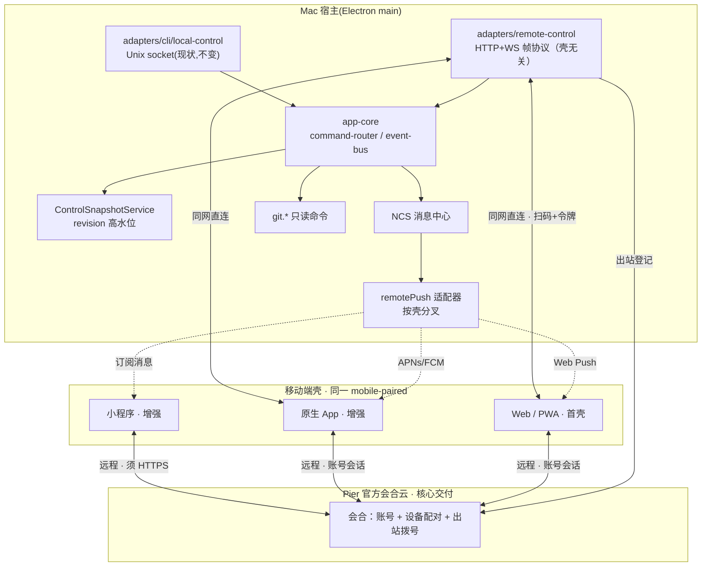
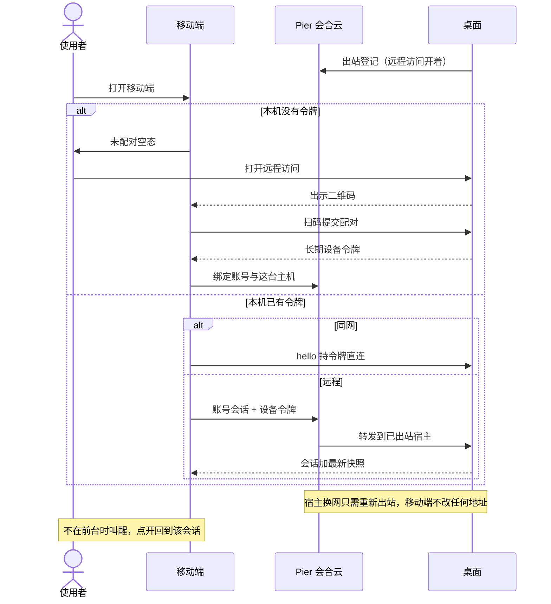

# Pier 移动端方案：业界调研与实现设计

> 日期：2026-08-26（本版为结构化重写；同日第十二次修订：产品词改为「移动端」）
> 状态：草案（待评审）
> 前置文档：[2026-06-24 控制平面架构](../../archive/superpowers/specs/2026-06-24-remote-control-mcp-architecture-design.md)、[2026-07-15 agent 运行索引与 attention 设计](2026-07-15-agent-runtime-index-and-attention-design.md)
>
> 第十二次修订摘要：
> ⑭ **产品词**——产品面统一为「Pier 移动端」，与本文标题一致；不再把客户端角色词写进产品名。
> 第十一次修订摘要：
> ⑬ **审查修补**——局域网监听 ≠ 跨网只出站（本网可听直连，公网不开放入站）；吊销绑定 `deviceId`+`tokenEpoch` 并立即断开已连会话；Web 壳唯一 origin 是官方会合 HTTPS；S1 默认只有审批条，附件键与自由输入仅 D2。
> 第十次修订摘要：
> ⑫ **核心体验必须完整**——产品故事是一条监督闭环，不是「先交局域网再交远程」。闭环 = 配对一次 + 打开见主机 + 会话里看终端/变更/文件 + 就地审批 + 远程经官方会合（不填主机地址）+ 离开时能叫醒进该会话。T2、App 锁屏、小程序是增强。工程可以同网切片，**不得把缺会合或缺叫醒的不完整切片写成可交付核心。**
> 第九次修订摘要：
> ⑪ **「不做官方云」不是产品约束**——远程默认对齐 Codex：官方会合云 + 账号。仍不做云沙箱执行。
> 第八次修订摘要：
> ⑩ **远程完整靠会合点，不是「知道电脑 IP」**——Codex / Claude / Cursor / Copilot 的客户端从不连局域网地址。第九次起会合点就是 Pier 官方云，不再写成未决。
> 第六次修订摘要：
> ⑧ **配对一次、之后重连**——扫码换长期设备令牌，不是每次打开都配对。跨网远程仍可重连：同一令牌，不扫码。第十次起远程经官方会合，不再「查当前地址再直连」。
> 第五次修订摘要：
> ⑦ **先主机、后投影**——移动端根面是主机管理（未配对空态 → 主机列表 → 当前主机工作台），会话终端 / 变更 / 只读文件挂在当前主机下。桌面出码与移动端扫入分成两面。交互流程与配对时序进 Canvas。
> 第四次修订摘要：
> ⑥ **线框真源是本文 §11**——六面 IA 用正文 ASCII 树与对照表锁定（360 宽移动端信息架构）。曾用 `.pier/canvases/mobile-companion/` 的 `ArtboardStage` + `Artboard` 作平行真源，该演示画布已于 2026-08-28 删除，不再维护第二份稿。
> 第三次修订摘要：
> ④ **线框取代视觉稿**——前一版 HTML/截图是深色成品风界面，把未定的视觉（色、圆角、底栏、品牌）写成了「设计」。本版只保留信息架构线框：页面、区块、字段、动作、事实源；视觉另立。
> ⑤ **三壳共用协议**——移动端终态是 Web、原生 App、小程序都要能连同一宿主。`mobile-paired` 仍是唯一 client-kind；壳是设备元数据。首壳是 Web，但帧协议 / 信息架构 / T1 终端不得绑死浏览器 API。见 §11.3、D3。
> 第二次修订摘要（全部经代码库与业界专项核实）：
> ① **终端投影分级**——初版把「终端 scrollback 投影」写成 M1 能力，核实后宿主唯一读口是 native `readViewportText`（viewport 纯文本，无 scrollback、无色彩、无输出流回调），scrollback 承诺当前无数据来源；业界金标准（Orca 移动端 + VibeTunnel 双样板）是「序列化水合 + 字节流增量 + 客户端真终端模拟器」。现改为 T1 快照档（同网切片即可）→ T2 金标准档（增强，现为 M3，需 native 输出订阅链路），见 §10.1。
> ② **推送主路径改为标准 Web Push（VAPID）**——自托管 ntfy 在 iOS 上必须经 ntfy.sh 官方 upstream + FCM/APNs 且手机需回连自托管服务器，「自托管 = 自主」叙事在 iOS 不成立；而 iOS 16.4+ 主屏 PWA 已支持标准 Web Push（无需开发者账号/证书），Safari 18.4+ Declarative Web Push 进一步免除 service worker 唤醒。第十次起 Web 壳叫醒并入核心交付（M2），不再单独排成「推送里程碑」。见 §12。
> ③ **宿主资产核实修正**——`app.snapshot` 已含 activity/agents/notifications/runtimes（缺口③已闭合、D5 已是事实而非开放决策）；`control.watch` 是 revision 门控的全量快照推送而非字段级增量；配对契约缺设备管理字段。见 §8、§9.1、§16。

---

## Part A 问题与定位

### 1 为什么需要移动端

AI 编码把开发者从「写代码的人」变成「监督智能体的人」。监督是异步、碎片化的：任务跑几分钟到几十分钟，会在任意时刻停下来等人。当前这些信号被锁在桌面上：

| 缺口 | 现状代价 | Pier 已有的信号源 |
|---|---|---|
| 审批瓶颈 | 智能体卡在权限确认上阻塞等待，回到桌面才发现 | `agent.attention`（NCS 最高优先级 kind） |
| 回合结束无人知晓 | 反复回到工位看「做完了吗」 | `agent.turn-finished` |
| 等待真空期 | 离开工位后完全失联 | `pier://foreground-activity:changed` |
| 结果确认要回工位 | 第一反应是在移动端看 diff | 代码变更实时读 git |

### 2 核心定位：移动端是「对桌面宿主的映射」，但映射的是状态，不是界面

**答案：是的，但必须精确到三层——数据层和控制层做映射，界面层坚决不做映射。**

| 层 | 是否映射 | 含义 |
|---|---|---|
| 数据映射 | ✅ 必须 | 移动端上显示的每份数据都是宿主状态的**投影**：活动快照、通知记录、git 变更、终端屏幕。事实源只有一份，在桌面 main 进程 |
| 控制映射 | ✅ 必须 | 移动端上的动作（批准/回复/标记已读）= 向同一个 `command-router` 提交命令，与本地 renderer **平权**，只差 client-kind 授权。不复制业务逻辑、不走旁路 |
| 界面映射 | ❌ 禁止 | 不投像素、不复刻 dockview、不做「缩小的桌面」。移动端按自己的信息架构重排（总览列表 → 详情）。**会话视图 = 终端投影，不做聊天对话框**——Pier 是终端工作台，宿主不提供 transcript/会话消息 API（AGENTS.md 明确），聊天形态在架构上没有数据来源；业界同样以终端视图为默认（Orca 移动端默认终端、Chat UI 仅可选；Moshi 全程终端；herdr-relay 终端+快捷面板） |

业界证据：

- Orca 官方原话："intentionally not a full editor — it's a remote control for the desktop"，且明确 "the desktop is always the source of truth"。
- JetBrains Projector 把**界面**搬远端（像素流），已停摆；把**状态**搬远端的产品全部活着。
- herdr-mobile-relay 在手机上聚合多台机器的 pane 状态，但工作区文件/Git diff 一律只读——投影可以到处放，写权收紧。

这个定位正好落在 Pier 已有的控制平面架构上：`app-core` 的命令路由/事件总线就是「同一事实源、多入口平权」的实现，`mobile-paired` 只是第三个入口（renderer、CLI 之后）。

#### 2.1 核心体验闭环（完整性原则）

**正确思路：先锁定一整条远程监督闭环，再谈工程切片。缺任意一环，产品就不完整。**

闭环必须同时成立：

| # | 环节 | 使用者感知 | 不完整会长什么样 |
|---|---|---|---|
| 1 | 配对一次 | 桌面出码，扫一次，绑账号，换长期令牌 | 每次打开都扫码 |
| 2 | 打开见主机 | 根面是已配对宿主；同网直连、远程经官方会合，路径对用户无感 | 需填写主机地址或自建中继，跨网即离线 |
| 3 | 投影会话 | 进当前主机 → 看终端、看变更、看只读文件 | 只有列表没有内容，或把聊天当主视图 |
| 4 | 就地闭环 | 卡在「需要你处理」时，在移动端上批准/回复 | 只能回到桌面操作 |
| 5 | 远程仍在 | 宿主出站保持在线；换网换地址无感 | 离开本机网络后中断 |
| 6 | 离开能叫醒 | 不在前台时，需要你处理 / 回合结束能后台触达，点开回到该会话 | 必须保持移动端在前台等待 |

增强（可后补，**不挡**上面六条对外交付）：

- T2 金标准终端（色彩、主屏历史、live 字节流）
- 原生 App 锁屏直答 / Live Activity
- 小程序壳
- 远程自由键入（D2，默认关）

非核心、不当默认：用户自备主机地址、自托管网关、云沙箱执行。

工程可以先在同网把 1–4 跑通，便于开发。**对外承诺与验收以六条齐为准**；只有局域网、没有会合或没有叫醒，不算核心体验交付。

### 3 目标与非目标

目标：

- G1 **闭环六条齐才交付**：配对一次 → 打开见主机 → 投影会话 → 就地审批 → 远程会合 → 离开能叫醒。缺一不算。
- G2 查看**当前主机**的会话终端投影、git diff、只读文件——全部为该机状态投影。没有当前主机时不展示会话面。终端必达档为当前屏幕（T1）；金标准 live 终端（T2）是增强。
- G3 复用既有控制平面，零业务规则进入适配器。
- G4 配对授权：扫码配对、按设备吊销即断开已连会话、能力可裁剪。
- G5 **远程默认官方会合云**：跨网宿主只出站，移动端只连 Pier，用户不填主机地址；换网 / 换地址无感。同网仍直连宿主本网接口。
- G6 **一协议、三壳**：Web、原生 App、小程序共用同一帧协议、同一信息架构、同一 `mobile-paired` 授权。壳是增强与覆盖，不把核心闭环拆成三套业务。

非目标（v1）：

- 不做界面映射：不投像素、不复刻 dockview、不做完整编辑器；**也不在本方案里定视觉规范**（色、字体、组件库）。本文件只锁定信息架构线框。
- 不把桌面宿主重写成移动 App；**不做云沙箱执行**（任务不搬到 Pier VM；文件、终端、凭据留在已配对宿主）。移动端 App / 小程序是**薄壳**，不是第二份 Pier。
- M1 不交付 App 上架包、不交付小程序审核包；但同网切片的协议禁止引入「只有浏览器才有」的硬依赖（见 §11.3 冻结清单）。**M1 本身不是可对外的核心产品。**
- 标准 Web Push 走操作系统推送织物；小程序订阅消息走该平台账号（用户自己的小程序 AppId）。**Pier 会合云是远程控制面，不是把推送改成另一套业务。**
- 不自研移动 SSH 客户端（cmux/Blink/mosh 已证明该层外包给成熟工具即可）。
- 不做布局编辑、面板管理等桌面强交互。
- 不把「聊天对话框」做成会话主视图：宿主不提供 transcript API（AGENTS.md）；会话主视图始终是终端投影。
- 不平行维护第二套终端历史：T2 水合必须读 Ghostty 已有主屏 scrollback，禁止磁盘 transcript、禁止与桌面脱节的第二份 ring（对齐 `0108-live-scrollback-limit`）。
- 不做可写文件管理：文件面只读浏览当前工作树（`file.list` / `file.readText`），不授 `file.write` / `git:write`。
- 不把活动总览当成根面：没有当前主机就没有会话事实源。

---

## Part B 业界是怎么做的

### 4 逐个产品拆解

#### 4.1 Orca（stablyai/orca，53.7k★）——与 Pier 形态最接近，官方移动端标杆

Electron 形态的 agent 工作台（Ghostty 级终端 + worktree 并行 + 多 agent），官方 iOS/Android 移动 App：

- **配对**：桌面出一次性码 → 手机提交 → 设备令牌。连接双通道：Orca Relay（需账号登录，出网默认路径）或直连 LAN 地址；host 地址后续可编辑而无需重新配对（覆盖「家里 LAN ↔ Tailscale」漂移）。
- **能力面（read-mostly）**：agent 状态、scrollback 水合、回复/快捷回复/听写/图片附件、sleep worktree、手机端 stage/commit、账号切换与限额视图、从手机创建 workspace（执行委托宿主）、文件树浏览。
- **会话呈现**：Chat UI（聊天式转录 + 权限问答）与原始终端按 tab 切换；终端附件键行（Tab/Shift+Tab）；Live 模式逐键直传。
- **终端投影实现（专项核实，对 §10.1 金标准分级最有参照价值）**：桌面 Orca 的终端本体是 renderer 侧 xterm.js（与 VS Code 同源），buffer 天然在 JS 层——手机端经 `terminal.subscribe` RPC 拿到**初始 `scrollback` 事件（serialized buffer，xterm serialize 模式，官方文档 `mobile-prefer-renderer-scrollback`）+ 后续 live `data` 字节块**，在 React Native `TerminalWebView` 内用 xterm.js 重放渲染；文本尺寸 50%–200% 独立缩放、pinch 捏合、E2EE 通道（`e2ee-channel`）。**注意架构前提差异**：Orca 做 scrollback 水合便宜是因为桌面终端就是 JS buffer；Pier 终端是 native GhosttyKit，同一能力需要 native 开口（§10.1）。
- **协议治理**：版本化协议 + 能力广告（如 quick-commands capability），任一侧过旧即阻断该 host 并引导升级；桌面进程心跳供手机校准状态真伪。
- **推送**：agent 完成时推送，语义镜像桌面通知。

#### 4.2 Happy（slopus/happy，23.5k★）——包装器 + E2E 云中继

- `happy claude` 用 CLI 包装器接管会话，「切到远程模式」即同步到手机；桌面按任意键夺回控制权。
- 后端：Fastify + Socket.IO + Postgres，E2E 加密（服务器只见密文），公钥挑战认证、无密码；push token 路由对接 APNs/FCM。
- 客户端：Expo/React Native 移动 App + Web + 原生 macOS 桌面壳。

#### 4.3 Omnigent / Omnara ——自托管服务端路线

- [Omnigent](https://omnigent.ai/docs/interact/mobile)：server 承载全套 Web UI，iOS/Android App 只是薄原生壳包 WebView，另有 PWA 兜底与 `omnigent://` 深链；要求 HTTPS 可达地址；通知仅前台。
- [Omnara](https://github.com/omnara-ai/omnara)：Go daemon + Postgres 持久 agent 状态（崩溃自动恢复），Web 控制台 + Slack 连接器，Apache 2.0 可自托管。

#### 4.4 herdr（herdrdev/herdr，32.4k★）——运行时路线，官方无移动端，社区补齐

Rust 常驻服务器：「终端活在 herdr 里」，pane 标 working/blocked/idle；CLI + socket API + 插件市场。移动端两条代表性社区实现：

- **0cv/herdr-mobile-relay**（Go 插件）：每台机器各跑 relay，手机装 PWA 聚合多机。传输三选一：社区 WebRTC 网关 / Cloudflare Tunnel / 自建 VPS 网关；全程 E2EE——网关只见连接元数据，WebRTC 下协商 P2P 直连、网关仅作回退；QR 即密钥；40+ 个 fixture 帧固化协议契约；**verified approvals** 防伪造审批；结构化 plan 问题可在手机导航回答；工作区文件/diff 只读；推送 blocked/finished/question。
- **dcolinmorgan/herdr-remote**（Python）：零配置 loopback relay(:8375) + 免费 CF tunnel 出网；客户端矩阵横跨菜单栏 App、手机 Web、Telegram bot（`/reply` `/trust` `/interrupt` 直达审批）、TUI 和 SwiftUI 原生 iOS（Live Activity + 锁屏 Widget + 通知栏直接回复）；WS origin 校验 + token 认证。

#### 4.5 Moshi（getmoshi.app）——直连终端 + agent 感知 hook，逃生舱路线的完整实现

- **分层架构**（对 Pier 最有参考价值）：传输层 = 原生 SSH/mosh/ET 直连用户自己的机器（Mac/Linux/WSL/VPS），**无会话中继、桌面零安装**；会话持久层 = 复用宿主上的 tmux/Zellij/Herdr 多路复用器（连接时自动检测、picker 列会话、专属快捷面板、滑动切换窗口）；agent 感知层 = 可选宿主守护 `moshi-hook`（brew 安装、token 配对），把审批/提问/回合结束/工具错误/用量快照结构化推送；原生壳层 = Live Activity/Dynamic Island/Apple Watch/设备端语音（Parakeet/Whisper）。
- **终端本体基于 Ghostty 引擎 GPU 渲染**（与 Pier 终端同源）；mosh 原生实现（非子进程外壳）——网络切换/杀 App 后秒级重连，官方引用 mosh 论文：29% 丢包下响应 0.33s vs SSH 16.8s。
- **隐私立场**：终端/diff/dev-server 流量全部手机↔宿主直达——diff 视图与 repo 浏览由 `moshi-hook` 在宿主本地服务、经现有 SSH 会话隧道；browser preview 走每会话 SSH 本地转发（无 ngrok、不开公网端口）；**唯一经过 Moshi 服务器的只有推送通知**（经 APNs）。图片粘贴 = SCP 到宿主 `~/.moshi/uploads/` 再把本地路径交给 agent。
- **监控增值层**：按 host/project 分组的统一 Agents feed（审批置顶、陈旧项自动归档）；用量环（Claude 5h/7d 限额窗口、Codex 滚动窗口）；**上下文「余量」环**（agent 上下文窗口剩余 <15% 预警，提示先压缩）；最近目录（从 agent 转录读取，一键回到上次工作的仓库）。
- **对 Pier 的意义**：① 它是「不自研移动 SSH 客户端」路线的成熟证明——Pier 宿主开启 SSH 后，Moshi 用户天然可连；② hook 模式证明 agent 感知可以是**薄薄一层结构化事件**叠加在通用传输上，与 Pier 的 NCS/attention 模型同构；③ 其 webhook API（token+title+message）给了 Pier 一个零基建推送出口候选；④ 用量环/上下文余量环是「监控」价值的差异化样板，值得 Pier 移动端总览页借鉴。

#### 4.6 终端形态的两个答案：cmux 与 VibeTunnel
- **cmux**（manaflow-ai/cmux）：Swift/AppKit 原生 macOS 终端，基于 libghostty（与 Pier 终端同源）；竖排 tab、notification ring、splits、workspace、CLI。**没有移动端**——远程 = SSH，远端 `cmux notify` 经 SSH 通道回传触发本机通知环；拖文件进远程 tab 走 scp。
- **VibeTunnel**（amantus-ai/vibetunnel，4.6k★）：macOS 菜单栏 App + Node 服务；`vt <cmd>` 把任意命令包装成可浏览会话；web dashboard :4020；asciinema 全程录制；认证可复用 macOS 登录；WAN 走 Tailscale/ngrok；iOS App 已随 v3 协议推进。**终端投影实现（专项核实）**：服务端 node-pty 持有 PTY → 输出写 asciinema cast 文件（写队列做背压）→ CastOutputHub tail + 按最后 clear 序列裁剪 → 单一 `/ws` WebSocket **v3 二进制帧多路复用**（`STDOUT` 字节流 + `SNAPSHOT_VT` 终端状态快照双帧型，快照用于预览与 resync）→ 客户端 xterm.js / ghostty-web 渲染；输入与 resize 走同一 socket。与 Orca 殊途同归：**水合快照 + 字节流增量 + 客户端真终端模拟器**。

#### 4.7 边界与反面教材

- **JetBrains Projector**：把 IDE 界面像素流到浏览器，独立版已停摆——官方结论「要达到本地级延迟唯一途径是装专用客户端」。界面映射此路不通。
- **云执行**（Cursor Cloud Agents / Codex cloud / Claude Code on the web）：任务跑云沙箱，手机天然一等公民；电脑可以关掉。与 Pier 本地优先定位冲突，仅作参照系。注意：同一批产品另有「本地跑、云会合」的 Remote Control，见 §4.8，不要和云执行混为一谈。

#### 4.8 账号云会合点（2026-08-26 专项）——Codex / Claude / Cursor / Copilot 出门为什么完整

前一版把「知道电脑地址再直连」写成 M2 主路径。对照 2026 年已经上线的 Codex / Claude Code / Cursor iOS / Copilot CLI Remote Control 之后：**用户从不填写、不查询、不关心家里 IP。** 完整体验来自「双方都出站连到一个已经存在的账号云」。电脑换网、换 IP 对手机不可见，因为没有任何一端在连那个 IP。

共同骨架（四家同构，只是会合点品牌不同）：

```text
手机  --出站 HTTPS-->  厂商云（账号 + 会合 + 多数还转发消息）
电脑  --出站 HTTPS-->  同一朵云
电脑本地：文件 / 终端 / 审批仍在这台机器上执行
```

| | Codex（ChatGPT 移动端 Remote） | Claude Code Remote Control | Cursor iOS Remote Control | Copilot CLI `/remote` |
|---|---|---|---|---|
| 官方入口 | [Remote connections](https://developers.openai.com/codex/remote-connections)、[Work with Codex from anywhere](https://openai.com/index/work-with-codex-from-anywhere/) | [Remote Control](https://code.claude.com/docs/en/remote-control) | [Cursor for iOS](https://cursor.com/help/ai-features/mobile-app)、[mobile](https://cursor.com/docs/cloud-agent/mobile) | [Steer remotely](https://docs.github.com/en/copilot/how-tos/copilot-cli/use-copilot-cli/steer-remotely) |
| 手机连谁 | ChatGPT App 的 Remote 面，已登录账号 | Claude App 的 Code 面 / claude.ai/code | Cursor iOS / cursor.com/agents | GitHub Mobile / github.com agents |
| 电脑怎么露出 | **只出站** TLS 连 OpenAI relay；官方原文：不把机器暴露到公网 | **只出站** HTTPS 向 Anthropic API 注册并轮询；**从不开放入站端口** | 本机工具继续跑；**agent 循环上云**，由 Cursor 云把手机和本机接上 | 本机 CLI **把事件推到 GitHub**，再 **从 GitHub 轮询** 远程指令 |
| 要账号吗 | 同一 ChatGPT 账号 + workspace；可 SSO/MFA/passkey | 同一 claude.ai 登录；Team/Enterprise 要 Owner 打开开关 | 同一 Cursor 账号；付费计划；Team 要管理员打开 | 同一 GitHub 账号；组织策略「Store local sessions in the Cloud」= View and control |
| 第一次怎么认机器 | 桌面出 QR，手机扫；一机一码；之后 Keychain/Keystore 自动重连 | `/remote-control` 或 `claude remote-control` 出 URL/QR；之后会话出现在账号的列表里（电脑图标 + 绿点） | 桌面 Agents 开 Remote Control，会话里 `/remote-control` | `copilot --remote` 或 `/remote on`；QR（Ctrl+E）或 agents 列表 |
| IP 变了怎么办 | **无事发生**。relay 认的是账号+配对身份，不是家庭 IP | **无事发生**。电脑重新出站注册即可 | **无事发生**。控制面在 Cursor 云 | **无事发生**。电脑重新连上 GitHub 即可 |
| 流量是否过云 | 过 OpenAI relay；应用层声称 Noise IK 端到端（relay 只见密文）。自定义客户端仍可走局域网直连 app-server | 过 Anthropic API。**会话转录存在 Anthropic 服务器上** 以便多设备同步（官方明文） | 过 Cursor 云（循环在云，工具在本机） | 过 GitHub（事件上云，命令下行） |
| 电脑睡了 | 远程中断；桌面可勾「保持唤醒」 | 睡醒自动重连；断网约 10 分钟后会话过期 | 要求电脑保持醒着、在线、工作区开着 | 要求在线；`/keep-alive` 防睡眠 |
| 和「云里跑代码」的区别 | Remote = 本地 Codex 环境的遥控器。另有 Codex cloud 沙箱，是另一条产品 | Remote Control ≠ Claude Code on the web（后者跑 Anthropic 云） | Remote Control ≠ Cloud Agents（后者跑 Cursor VM，笔记本可合盖） | 会话仍在本机 CLI；不是 Codespaces |

逐项核实要点：

- **Codex**：OpenAI 自己写「secure relay layer … without exposing them directly to the public internet」。GA（2026-06-25）用官方 relay **替换了** beta 里「客户端直连本机 WebSocket」——厂商自己否决了「手机连电脑地址」当消费级默认。二维码绑的是 **这台手机 × 这台宿主**，不是「账号下所有设备自动控所有机器」。SSH 远程开发机由 **桌面先 SSH 过去**；手机仍然只连那台已配对的桌面宿主，不填远程 IP。开源 `openai/codex` 的 exec-server 用 Noise IK 经 rendezvous 转发，rendezvous 不持明文。
- **Claude**：官方安全节原文：「makes outbound HTTPS only and never opens inbound ports」「registers with the Anthropic API and polls for work」「the server routes messages」。手机打开就能在列表里看到在线会话，连「填地址」这一步都没有。企业另有 Trusted Devices（设备登记 + 18 小时内生物识别）。
- **Cursor**：手机主路径其实是 **Cloud Agents**（任务在 Cursor VM，电脑可关）。本机 Remote Control 是补充：`/remote-control` 之后「agent loop moves to the cloud while its tools keep running on your machine」。手机 App **没有编辑器、没有终端、没有文件树**——只监督、看 diff、合 PR。
- **Copilot**：政策名直接叫「把本地会话存到云」。本机推事件、云端给手机渲染、本机再把手机的批准拉回来。GitHub Mobile 已有 Agent sessions，不必新装移动端 App。

**对 Pier 的结论：**

1. 出门完整 = **产品提供会合点**。四家都是用户已经登录的那朵云；感知是「打开 App」，不是「部署服务器 / 填写主机地址」。
2. 「知道电脑地址再直连」是 DIY，**不能当默认**。Codex GA 还从「直连本机 WebSocket」改回了官方 relay。
3. **Pier 从未禁止官方云。** 先前写进 G5/非目标是本文件误加。默认对齐 Codex：官方会合 + 账号；宿主出站，移动端连 Pier。
4. 仍不做的是 **云沙箱执行**（Cursor Cloud Agents / Codex cloud 那种把仓库搬进厂商 VM）。会合云只接移动端与已配对桌面宿主，事实源仍是桌面宿主。
5. Tailscale / 自建网关留给要完全自管的人，作逃生舱，不挡主路径。

### 5 业界共识模式

所有认真做了移动端的产品收敛出同一组模式：

1. 桌面宿主是唯一事实源；手机是 read-mostly 遥控器（状态投影）。
2. 手机动作经统一授权入口写回，不复制业务逻辑（控制平权）。
3. 配对 = 一次性码换长期设备令牌；支持按设备吊销。
4. **出门完整 = 账号云会合点**（Codex / Claude / Cursor / Copilot / Orca Relay / Happy）：电脑只出站，手机只连厂商已有入口，用户不填家里 IP。开源/自托管产品才把路径交给用户（Tailscale、CF Tunnel、自建网关、纯 LAN）。
5. 协议版本化 + 能力广告 + 双侧过旧阻断（Orca/mobile-relay 都这么做）。
6. 心跳机制区分「真的在干活」和「状态没刷新」。
7. 推送语义镜像桌面通知，而不是另一套逻辑（blocked/finished/question 三类）。
8. 锁屏闭环（Live Activity/通知快捷回复）只有原生壳能做到——PWA 的天花板。
9. **终端投影的金标准三件套**（Orca 移动端与 VibeTunnel 独立收敛出同一形态）：**① 连接时水合**（序列化终端 buffer / VT 快照，含样式）→ **② 增量为原始 ANSI 字节流**（非文本快照轮询）→ **③ 客户端跑真终端模拟器渲染**（两家都是 xterm.js），输入与输出走同一连接。纯文本快照轮询（无色彩、无光标、有闪烁）只出现在 bot/TUI 逃生舱档位（herdr-remote 的 Telegram bot），没有产品把它当正式终端视图。

---

## Part C 方案对比清单

### 6 路线对比（六种实现方式）

| 路线 | 代表 | 机制 | 验证结论 |
|---|---|---|---|
| A 服务端化 + 浏览器 | VS Code Tunnels、Codespaces、Omnigent | 整后端放远端，浏览器消费 | 可行；响应式 Web 是合理载体，但需另建数据通道 |
| B **宿主守护 + 配对移动端** | Orca、Happy、Codex×ChatGPT 移动端 | 重计算留宿主，手机监控+审批+轻回复 | **市场验证的标准答案** |
| C 终端直连 | Blink/mosh/tmux、Telegram bot | mosh 抗漂移 + tmux 持久 + hook 推送 | 成熟免费；逃生舱而非路线 |
| D 像素流 | JetBrains Projector（停摆） | 远程桌面式投界面 | 证伪，排除 |
| E 跨端重写 | Tauri 2 / Capacitor / RN | 手机重写一套宿主 | macOS 宿主前提不成立；仅共享领域逻辑 |
| F 云执行 | Cursor Cloud Agents、Codex cloud | 任务跑云沙箱 | 与本地优先冲突，仅参照 |

### 7 产品级横向对比

| 维度 | Orca | Happy | herdr-mobile-relay | Moshi | Omnigent | VibeTunnel | cmux |
|---|---|---|---|---|---|---|---|
| 移动载体 | iOS/Android 原生 | Expo RN + Web | 安装式 PWA | iOS/Android 原生（闭源+Pro） | 薄壳 WebView + PWA | Web（iOS 随 v3 推进） | 无 |
| 桌面角色 | 工作台本体=事实源 | CLI 包装器接管会话 | herdr 服务器持有终端 | 零安装（可选 moshi-hook 守护） | 自托管 server | Node 转发终端 | 终端本身 |
| 手机映射什么 | 状态+scrollback+git | 会话消息流（E2E 密文） | pane 状态+输出+审批 | 终端字节流（SSH/mosh 直连）+hook 结构化事件 | 全套 Web UI 投影 | 终端字节流 | 无（仅通知环回传） |
| 界面是否复刻桌面 | 否（重排） | 否 | 否 | 否（手机原生终端） | 是（同一套 Web UI） | 否 | — |
| 配对认证 | 一次性码→设备令牌 | 公钥挑战无密码 | QR 即密钥+E2EE | SSH 密钥（Keychain+Face ID）；hook 用 token | 无配对（HTTPS URL） | 密码/macOS 登录 | 无 |
| 出网通道 | 官方 Relay / 直连 | 官方 E2E 中继 | WebRTC P2P+网关回退 / CF / 自建 | 直连 SSH/mosh；仅推送经 Moshi 服务器 | 需公网可达 | Tailscale/ngrok | SSH |
| 推送 | ✅ 镜像桌面 | ✅ APNs/FCM | ✅ blocked/finished/question | ✅ hook→APNs + Live Activity/Watch | ⚠️ 仅前台 | ❌ | 本机通知环 |
| 手机写操作 | 回复/sleep/stage/commit | 完整会话控制 | 审批/prompt/键入；文件只读 | 完整终端（vim/TUI）；文件经 SCP 上传 | 全功能（同 server 权限） | 完整终端 | — |
| 协议治理 | 版本化+能力广告 | 版本化 | fixture 固化 40+ 帧 | mosh 协议 + 公开 webhook API | HTTP API | — | — |

---

## Part D Pier 实现方案

### 8 总体架构



原则继承 2026-06-24 设计：业务能力收敛在本地控制核心，网络适配器只做协议转换。UDS 的 local-control（CLI/MCP 用）与新的 remote-control 并存，共享 router/bus/快照服务。**三壳都是适配器另一侧的客户端，不是三套业务。** 远程时会合云只做账号与拨号转发，**不成为第二份事实源**——快照、git、终端仍只来自已配对宿主。

现有资产锚点（2026-08-26 逐一核实）：

| 资产 | 位置 | 核实结论 |
|---|---|---|
| `PierClientKind."mobile-paired"` | `src/shared/contracts/permissions.ts` | ✅ 枚举与默认能力集已有（现状偏宽且有缺，修订见 §10） |
| `PierPairingRequest` / `PierRemoteSession` / `PierPairedDevice` | `src/shared/contracts/remote.ts` | ⚠️ 类型已含 `deviceId`、`tokenEpoch`、`shell`；适配器落地仍须按 epoch 断开已连会话。`shell` 只影响推送适配器与能力广告，不新开 client-kind |
| `command-metadata.ts` 授权矩阵 | `src/main/app-core/` | ✅ `app.snapshot`/`notifications.*`/`terminal.*`/`run.*`/`git.getStatus/getDiffPatch` 均按能力授权、未限制 client-kind，`mobile-paired` 补齐能力后即达 |
| `ControlSnapshotService` revision 高水位 | `services/control-snapshot/` | ✅ 且 **`app.snapshot` 已含 activity/agents/notifications/runtimes 摘要**——初版缺口③（活动查询命令）已闭合，无需新命令 |
| `control.watch` 语义 | `adapters/cli/local-control/control-snapshot-ops.ts` | ✅ 但注意：是 **digest 轮询、revision 变化推全量快照**，不是字段级增量；快照本身摘要化所以尺寸可控。§9.1 措辞按此修正 |
| v2 subscribe 流 | `adapters/cli/local-control/subscribe.ts` | ⚠️ `resource:agents`/`global` 真实现（cursor 续接），**`resource:activity` 仍是 stub**——移动端统一走 `control.watch` 快照流即可，不依赖此 stub |
| `hello-auth` v2 握手 | `adapters/cli/local-control/hello-auth.ts` | ✅ 可扩展；注意现注释写「产品终态：仅 cli-human」，本设计显式推翻该假设（新增 `mobile-paired` principal + 令牌校验） |
| 终端读口 | `app-core/commands/terminal-screen.ts` + native `readViewportText` | ⚠️ **仅 viewport 纯文本快照**：无 scrollback（实现注释明说「不假装有 scrollback」）、无色彩、无输出流回调。金标准终端需 native 增补，见 §10.1 |
| 结构化交互事件 | `services/agents/integrations/`（hook v3） | ✅ `InteractionRequested/Resolved` 已有 `interactionKind`（permission/question）+ `interactionId`（toolUseId）；**但无选项语义**（宿主不知道 TUI 画了哪些选项）——约束审批命令设计，见缺口④ |

要补的缺口：

- ① 网络适配器（UDS 物理上手机不可达）。
- ② 配对与设备令牌生命周期 + `remote.ts` 契约扩展（`PierPairedDevice`：deviceId/名称/tokenHash/`tokenEpoch`/createdAt/lastSeenAt/capabilities/`shell`；`PierRemoteSession` 必须带 `deviceId`+`tokenEpoch`。吊销递增 epoch 并立即断开已连会话，不只验下一次 hello）。
- ③ ~~活动查询命令~~ 已闭合：`app.snapshot` 即活动投影（见上表）。
- ④ 审批回写命令 `agent.attention.respond`：main 侧代发应答键序到对应终端。**两档动作 + 双重门**——键级动作（Enter/Esc/y/n/数字直译 `sendKeyPress`/`sendText`，用户看着终端投影按，默认档）与语义动作（`approve`/`reject` → per-agent 键序映射，仅对证据矩阵验证过键序的 agent 开放，未验证的 agent 返回 unsupported、UI 隐藏语义按钮）；防伪造/防过期门 = 执行前校验该 agentRef 当前 status 仍为 `waiting`、且携带的 `interactionId` 与当前未决交互一致，不一致返回 `interaction_stale`（避免回合已推进后键序打进错误上下文——herdr verified approvals 的等价物，按 Pier 的 hook 事实源实现）。**不要求授予 `terminal:control`**（自由键入才需要，见 D2）。
- ⑤ Web 壳（首壳）+ 协议冻结，使 App / 小程序可后补而不改命令语义。同网切片可只跑 Web；**对外核心仍要会合 + 叫醒**。
- ⑥ **金标准终端的 native 开口**（T2 增强前置，见 §10.1）：GhosttyBridge 增 ① **从已有主屏 buffer 导出带样式快照**（viewport + 用户配置的 scrollback；cell-grid 或 SGR 重建）② surface 级 **PTY 输出 tap**（默认关闭，按 panel 订阅时开启）。main 侧经 event-bus 发布——遵守 2026-06-24 依赖禁令「remote-control 适配器不直连 native-terminal-host」。**禁止**平行磁盘 transcript / 与 Ghostty 脱节的第二份历史 ring。T2 不挡核心六条。
- ⑦ **官方会合云 + 账号 + 叫醒**（核心交付）：电脑出站拨号、手机按账号列出已配对主机、帧经会合转发；Web 壳在会合 HTTPS 上接通 Web Push。同网切片不依赖此缺口即可开发 1–4；**缺此缺口不得称核心体验完成**。

### 9 传输与配对

适配器 `src/main/adapters/remote-control/`：

- HTTP + WebSocket 同端口：帧通道对所有壳开放；**静态托管 SPA 只是 Web 壳的一种分发**，App / 小程序不吃这份静态资源。生产 Web 壳不把该端口当 origin（见配对流程第 6 步）。
- 默认**关闭**；设置页「远程访问」显式开启后启动，关闭即停。
- **两条路径不要写成同一句「不开放入站端口」：** 局域网直连只监听本网接口（不映射公网、不开放 WAN 入站）；跨网由宿主出站拨会合，不开放公网入站、不公布主机地址。mDNS 为可选增强；端口从固定区间随机选取。
- 协议帧复用 local-control 的 request/result/frame 模式与错误码语义。
- 帧带版本号并支持能力广告：客户端声明所需 capability，桌面未实现则降级隐藏入口；任一侧过旧即阻断并提示升级（业界共识 #5）。

配对流程：

1. 桌面生成二维码 `{ pairingCode, fingerprint, relayHint }`；配对码一次性、5 分钟有效。同网时可附 `host, port` 供 M1 直连。
2. 移动端（任意壳）发送 `PierPairingRequest`：校验 code → 注册客户端（capabilities 取 `requestedCapabilities ∩ 允许上限`，并记录 `shell`）→ 下发长期设备令牌。远程路径同时把该设备绑到 **Pier 账号**（同一账号下的移动端才能看见这台宿主）。
3. 后续连接持令牌握手；`hello-auth` 增加 `mobile-paired` principal。同网可直连宿主；远程走会合云，**同一令牌、不重扫码**。
4. 吊销：桌面设备列表移除 → 令牌哈希作废、`tokenEpoch` 递增、会合云同步作废 → **立即断开**该 `deviceId` 在 LAN listener、会合转发和 T2 订阅上的已认证会话。已连连接的下一命令返回 `device_revoked`，不只是等重连时 hello 失败。`PierRemoteSession` 必须带 `deviceId` + `tokenEpoch`。
5. **配对与网络路径解耦。** 换网、换地址、从局域网切到远程，不重配对。会合云认的是账号 + 设备身份，不是主机地址。手动填地址 / Tailscale 仅作逃生舱。
6. **Web 壳 origin 唯一：官方会合 HTTPS（PWA）。** 设备令牌与 Web Push 订阅只存在该 origin。同网直连是该 PWA 打开的帧通道（QR 可附 `host, port`），不是另一个网站。宿主同端口托管 SPA 仅 M1 内部切片，生产路径不得把令牌写入 LAN origin。切片期若曾在 LAN origin 打开，须经账号认证一次性迁移并作废 LAN 凭据。验收：同网配对 → 跨网打开同一 PWA → 收到 Web Push，不再扫码。

威胁模型：M1 目标环境为可信家庭/办公网段，`ws://` + 每设备令牌并在设置页明示边界。M2 走官方会合的 TLS；应用层是否端到端加密见 D4。不可信网络不再要求用户自备 VPN 才能远程。

#### 9.1 通信协议细节（单 WebSocket 连接承载全部交互）

- **握手**：连接后第一帧 `hello { protocolVersion, deviceId, deviceToken, kind: "mobile-paired", shell, advertisedCapabilities }`；服务端校验令牌（常数时间比较）→ 回 `session { grantedCapabilities, snapshotRevision, advertisedCapabilities, tokenEpoch }`（至少包含是否具备 `terminal.stream`，供各壳在 T1/T2 之间降级）。令牌不匹配即断开并计入限速。成功后会话写入 `deviceId` 与当时的 `tokenEpoch`。
- **同步模型**：握手后移动端发 `app.snapshot` 取全量（含 revision 高水位），随后订阅 watch 帧。**watch 的真实语义按现有 `control.watch` 对齐：digest 轮询、revision 变化即推一帧全量快照**（快照字段本就摘要化，尺寸可控），不是字段级增量——移动端以「整帧替换本地态」为同步原语，天然幂等，断线重连即重放最新帧，无需 revision 断档补洞逻辑（cursor 续接仅用于跳过未变帧）。快照与 watch 共享 `ControlSnapshotService` 的同一 revision 序列，与桌面 renderer、CLI 观察到的事实一致。终端输出不走快照流，见 §10.1 的独立通道。
- **命令往返**：`{ protocolVersion, requestId, clientId, command }` → `{ ok, requestId, data | error }`，语义与错误码完全复用 local-control 帧。移动端新增的命令只有配对生命周期与 `agent.attention.respond`；T2 终端订阅是 watch 类流（能力广告 `terminal.stream`），不是另一套命令语义。**每条命令（含 watch / T2 tap）在进入 command-router 前核对 `tokenEpoch`；已吊销返回 `device_revoked` 并关闭连接。**
- **连接维持**：WS 协议层 ping/pong（30s）判活；断线按指数退避 + 抖动重连，重连即重走握手 + 最新快照帧。移动端切后台不保活，回到前台拉最新快照（及 T2 重订阅读流）——与 Orca「桌面关闭即断、重开自动重连」行为一致。
- **离线通知（闭环第六条）**：连接不在时由 NCS 经 `remotePush` 适配器触达（§11.4 / §12）。Web 壳走 Web Push，要求 HTTPS 源，故绑核心交付的会合 HTTPS；同网 `ws://` 不承诺杀进程横幅。App / 小程序走各自适配器，不经 Web Push。
- **传输无关性**：以上帧协议不绑定 `ws://`。核心交付的远程路径是官方会合 HTTPS；若传输层日后换成 WebRTC DataChannel 等，帧契约与配对令牌体系不变。

#### 9.2 远程访问已配对宿主（M2）——官方会合云

> 第九次整理：本文件一度把「不做官方云」写成硬约束，**产品从未这样说过**。远程默认对齐 Codex：Pier 官方会合 + 账号。地址簿 + 直连、自托管中继都只是中途误设的主路径。

**产品模型（锁定）：**

1. 使用者有 Pier 账号。桌面与移动端都登录（或扫码时完成绑定）。
2. 远程访问打开后：**跨网路径宿主只出站**连会合云，保持在线。不开放公网入站端口，不公布主机地址。同网直连仍走本网接口上的 HTTP/WS（§9），二者不要写成同一句「不开放入站端口」。
3. 远程打开移动端：看到账号下已配对主机 → 经会合云握手（同一设备令牌）→ 投影该机。不扫码，不填地址。
4. 宿主换网、换地址、从休眠恢复：重新出站即可。移动端始终连同一个 Pier 入口，**换地址无感**。
5. 同网仍直连宿主（M1），不必绕云。



| 层 | 默认职责 | 不做什么 |
|---|---|---|
| 官方会合云 | 账号、设备配对、宿主出站拨号、远程时转发帧 | 不跑代码、不持仓库、不当第二份事实源 |
| 同网直连 | M1 移动端直连宿主 | 不挡远程路径 |
| DIY 逃生舱 | Tailscale / 用户自建入口 / 手动填主机地址 | 不是打开移动端的默认 |

**和「云执行」划清：** Cursor Cloud Agents / Codex cloud 把任务放进厂商 VM，笔记本可以合盖。Pier 会合云 **不是**这条。文件、终端、凭据、审批仍在已配对宿主；宿主休眠、关机或关掉远程访问，远程中断——与 Codex Remote / Claude Remote Control 相同。

业界对照（为什么默认必须是官方会合）：

| 产品 | 出网机制 | 桌面宿主侧 | 要账号吗 |
|---|---|---|---|
| **Codex Remote** | OpenAI 官方 relay | 桌面出站 TLS；QR 一机一码 | 要（ChatGPT） |
| **Claude Remote Control** | Anthropic API 注册+轮询 | 只出站 HTTPS | 要（claude.ai） |
| **Cursor iOS** | 本机 Remote Control 循环上云；另有 Cloud Agents VM | 电脑保持醒着出站 | 要 |
| **Copilot `/remote`** | 事件上 GitHub，指令下行 | 本机 CLI 出站 | 要 |
| Happy / Orca | 官方 E2E / Relay | 出站连中继 | 要 |
| herdr / VibeTunnel / Moshi | 自建或用户自备路径 | 各异 | 不要 |

Pier 路线（M2）：

- **默认 · 官方会合 + 账号**（G5）：宿主出站、移动端连 Pier、用户不填主机地址。实现上会合可以自建集群，也可以背后用隧道基础设施，**用户只看见 Pier**。
- **同网直连**：M1 保留；配对令牌两边都能用。
- **可选 DIY**：已有 Tailscale / 自建网关的人可以不经官方会合。文档提供，设置里可关云。
- **小程序**：连官方会合的稳定 HTTPS 域名（白名单这一条），不连局域网地址。

配套注意：桌面宿主防睡眠（电源设置、设置项「保持唤醒」，或 `caffeinate`）；断线重连按 §9.1；离线审批经 §12 推送出口触达。

### 10 命令与事件面

移动端可用命令子集：

| 场景 | 命令 | 所需能力 | 档位 |
|---|---|---|---|
| 全局状态同步 | `app.snapshot` + `control.watch`（revision 门控全量快照帧） | `app:read` | M1 |
| 通知收件箱 | `notifications.list/get/watch/focus/mark-read` | `notification:read/write` | M1 |
| 会话定位 | `terminal.list/get` | `terminal:read` | M1 |
| 终端屏幕（T1） | `terminal.screen` / `terminal.read`（**viewport 纯文本，`scope:"viewport"`**） | `terminal:read` | M1 |
| 任务输出尾部 | `run.output/status/list` | `workspace:read` | M1 |
| 代码变更 | `git.getStatus` / `git.getDiffPatch` | `git:read` | M1 |
| 审批回写 | `agent.attention.respond`（新命令，见缺口④） | `notification:write`（不授 `terminal:control`） | M1 |
| 终端 live 流（T2） | `terminal.subscribe` / `terminal.unsubscribe`（新，能力广告 `terminal.stream`） | `terminal:read` | M3 增强 |
| 受控自由输入（可选开） | `terminal.send` / `terminal.key` | `terminal:control` | D2 显式勾选 |

`mobile-paired` 默认能力集修订（现状 `permissions.ts:163-178` 偏宽且有缺）：
- **加入**：`git:read`（diff 必需）、`notification:write`（标记已读 / focus / 审批回写）。
- **移出默认**：`window:create/close`、`window:control`、`panel:control`、`terminal:control`——改为配对时用户显式勾选的可选授权；默认集收敛为「只读监视 + 通知写」。
- 落地时同步更新锁定该表的治理测试。

写命令组（`git:*write`、`run.spawn/rerun` 等）v1 一律不授给 `mobile-paired`；`allowedClientKinds` 未列 `mobile-paired` 的命令维持拒绝。`agent.attention.respond` 必须在 `CommandMetadata` 登记 `allowedClientKinds` 含 `mobile-paired`（及桌面 renderer，供同源测试），能力仅 `notification:write`。

S1 默认面只画审批条（`agent.attention.respond` 的 Enter/Esc/y/n/数字，且须过 `waiting` + `interactionId`）。`terminal.key` / `terminal.send` 的附件键（Tab、^C、方向键）与一行输入仅 D2 授权后出现；未授权必须隐藏，不得画成可点。审批键不是 `terminal:control`。

#### 10.1 终端投影：金标准分级（本方案最关键的修正）

**判定：初版把「会话详情 = 终端 scrollback 投影」写成 M1，不正确。** 宿主今天给不出这条数据。

现状（代码核实，2026-08-26）：

- 唯一读口是 native `readViewportText` → 命令 `terminal.screen` / `terminal.read`。契约 `terminalScreenPayloadSchema` 把 `scope` 锁死为 `"viewport"`，并 **显式 forbid `scrollback` / `history` / `cursor` 字段**；实现注释写「不假装有 scrollback」。
- 返回值是 **纯文本**（无 SGR 色彩、无光标几何）。
- Native addon **没有** PTY 输出 tap、没有 cell-grid 序列化、没有 scrollback dump API。桌面看到的完整历史只活在 Ghostty 主屏 scrollback 里。
- 这与 AGENTS.md / `0108-live-scrollback-limit` 一致：可见历史只走 Ghostty 原生 scrollback；**不做磁盘 transcript**。

业界金标准（§5 共识 #9）是另一档：

| 件 | Orca 移动端 | VibeTunnel | Pier 今天 |
|---|---|---|---|
| 连接时水合 | renderer xterm serialize → `scrollback` 事件 | `SNAPSHOT_VT` 二进制快照 | ❌ 无 |
| 增量 | live PTY `data` 字节块 | `STDOUT` 二进制帧 | ❌ 无输出回调 |
| 客户端渲染 | RN WebView 内 xterm.js | 浏览器 xterm.js / ghostty-web | 只能画纯文本 |
| 前提 | 桌面终端 **就是** JS buffer，水合便宜 | 服务自己持有 node-pty | 桌面终端是 **native Ghostty**，同一能力必须 native 开口 |

两档交付（能力广告区分，过旧客户端只见 T1）：

**T1 · 快照档（闭环必达，诚实承诺）**

- 数据：轮询 / 订阅触发的 `terminal.screen`（viewport 纯文本）。
- UI：**标明「当前屏幕」**，禁止写「完整历史 / scrollback」；无色彩、无光标、切换面板或回前台才刷新。够用场景：看清 TUI 审批题面、读到 agent 卡住的那一屏、配合审批动作条按 Enter/Esc/y/n。
- 刷新：会话详情在前台时按 300–500ms 拉一次（与 `control.watch` 的 digest 轮询同量级）；切后台停。
- **这不是金标准终端**，是现有 API 能支撑的监督闭环最低档。Canvas 文案按此改（见 §11）。

**T2 · 金标准档（增强 · M3，与 Orca/VibeTunnel 同构）**

三件套一次齐，缺一不可：

1. **水合**：native 从 **Ghostty 已有主屏 buffer**（viewport + 用户配置的 scrollback）导出带样式快照（cell-grid 序列化或 SGR 重建的 ANSI 流）。事实源仍是 Ghostty，**禁止**再做一份磁盘 transcript 或与桌面脱节的独立 ring——否则违反 `0108-live-scrollback-limit`。
2. **增量**：surface 级 PTY 输出 tap（**默认关闭**；仅当至少一枚 `mobile-paired` 会话对该 `panelId` 发出 `terminal.subscribe` 时打开；退订/断线即关）。字节经 event-bus 到 remote-control，**适配器不 import native-terminal-host**（2026-06-24 依赖禁令）。
3. **客户端**：具备 `terminal.stream` 的壳用真 VT 模拟器（Web/App：xterm.js 或等价）重放水合 + 写入增量；附件键行与 Live 逐键走同一连接，**且须已授 D2**。文本尺寸独立于桌面。**小程序不承诺 T2**：无合格模拟器就停 T1，能力广告隐藏 live 入口。

T2 的产品承诺才允许 UI 写「终端历史 / 实时输出」。能力广告名建议 `terminal.stream`；桌面未实现则 SPA 隐藏 live 入口、停留 T1。

**明确不做的替代：**

- ❌ 把 `readViewportText` 轮询包装成「伪 live」（无色彩、闪烁、滚不出 viewport）——这是 herdr-remote Telegram bot 档，不是产品终端视图。
- ❌ 为移动端单独录 asciinema / 写磁盘——与 Pier「去掉宿主用户仍能用原生工具完成同一动作」及 0108 冲突；VibeTunnel 那条路是因为它自己就是 PTY 所有者。
- ❌ 在 renderer 再挂一套 xterm 双写——Pier 终端不在 JS 层，抄 Orca 的便宜前提不成立。

### 11 信息架构（线框）与多壳

> 前一版用深色成品风 HTML + 渲染截图充当「设计稿」，把未定视觉写成了方案。已删除那些截图。本节只锁定信息架构；视觉（色、字体、圆角、底栏 vs 顶栏、品牌）不在本文件决定。

#### 11.1 交互流程：先主机、后投影

规范线框真源：本文 §11（ASCII 树 + 对照表）。**根面是主机。核心闭环必须整条齐（§2.1）。** 原 Canvas 线框 `.pier/canvases/mobile-companion/` 已删除。

```text
打开移动端
  ├─ 本机无令牌 → 未配对（扫码一次，绑账号 + 长期令牌）→ 主机列表
  └─ 本机已有令牌 → 主机列表（日常根面，不必再扫码）
        ├─ 同网 → 直连该机工作台
        └─ 远程 → 经官方会合（宿主须已出站）
              ├─ 在线 → 该机工作台
              │     ├─ 选会话 → 终端投影
              │     │            ├─ 变更预览（只读 git）
              │     │            └─ 文件浏览（只读工作树）
              │     ├─ 需要你处理 → 审批条（就地闭环）
              │     └─ 通知
              └─ 宿主未出站 / 休眠 → 主机显示离线（令牌仍在）
叫醒（不在前台）→ 点开回到该机会话 / 审批
```

硬规则：

- **闭环六条齐。** 配对、见主机、投影、就地审批、远程可达、离开能叫醒。缺会合或缺叫醒不算核心交付（§2.1）。
- **配对一次。** 二维码一次性、五分钟有效，换来的是长期设备令牌 + 账号绑定（§9）。之后打开只握手，不扫码。
- **跨网远程是闭环内的场景，不是增强。** 宿主保持远程访问并出站；移动端打开即见该机，不填地址。宿主休眠或关机才离线。
- **叫醒属于闭环。** 需要你处理 / 回合结束必须能后台触达；点开落到该会话。不是「有空再做推送」。
- **没有当前主机，就不渲染会话 / 变更 / 文件。** 已配对但离线，仍停在主机列表。
- **二维码只出现在桌面。** 无相机时从相册读图，不把「填写主机地址」画进主路径。
- **会话内三面共用身份。** 终端 / 变更 / 文件挂在当前会话下。文件只读。
- **线框锁定 IA，不锁定壳 UI。** 建议应用级三键：主机 | 工作台 | 通知。
- T1 文案只能是「当前屏幕」。T2 是增强。
- 产品词与桌面一致（智能体 / 工作树 / 需要你处理）。

#### 11.2 页面集合与映射

实线 = 核心闭环必有，虚线 = 增强（T2 / 锁屏 / 小程序）。本表只做文字对照。

| 面 | 角色 | 区块 | 事实源 | 动作 |
|---|---|---|---|---|
| QR 桌面出码 | 配对权威 | 远程访问开关 → 二维码 → 已配对列表 | `PierPairedDevice` | 开本网监听 / 跨网出站、吊销（断开会话） |
| H0 未配对 | 仅无令牌 | 说明 + 扫码（无相机读相册） | 无令牌 | 扫码一次 |
| H1 主机列表 | **日常根面** | 已配对主机 + 连接态 + 自动重连 | 本地令牌 + 账号下的会合在线态 | 选机；同网直连或经云 |
| H2 主机工作台 | 当前机首页 | 主机条 → 状态过滤 → 该机会话列表 | `app.snapshot` activity/agents | 进会话；过滤 |
| S1 会话终端 | 会话默认面 | 当前屏幕（T1）→ 审批条（仅 waiting）；附件键与输入仅 D2 | `terminal.screen`；T2 才 `terminal.subscribe` | `agent.attention.respond`；可选 `terminal.send`（D2） |
| S2 变更预览 | 会话内 | 文件列表 + hunk | `git.getStatus` / `git.getDiffPatch` | 只读 |
| S3 文件浏览 | 会话内 | 目录 + 预览 | `file.list` / `file.readText` | 只读 |
| N1 通知 | 当前机收件箱 | 列表（标题/详情/时间/未读点） | NCS `notifications.*` | 标已读 / 叫醒点开落到该会话 |

#### 11.3 三壳：Web · App · 小程序（G6）

**要支持，而且协议现在就要按三壳写。** 不是三个壳一起上架；是同一 `mobile-paired` 下的三个壳，壳只换容器、推送、存储、相机。核心闭环先在 Web 上齐（含远程与叫醒），App / 小程序是覆盖增强。

| | Web / PWA | 原生 App | 小程序 |
|---|---|---|---|
| 交付 | **首壳**（适配器静态托管 SPA，可加到主屏幕）。同网切片与核心交付都先走它 | **增强** 薄壳（Capacitor 或等价；锁屏直答在这里才成立） | **增强** 薄壳（默认微信；其它平台另立，不在协议里写死） |
| 传输 | 同网可 `ws://` 直连；远程经官方会合 HTTPS（核心必达） | 同左 | **必须白名单官方会合的 HTTPS + `wss`**。生产小程序连不上局域网地址 |
| 配对 | 相机或读图扫码 | 原生相机 | 原生扫码（体验最好） |
| 终端 T1 | 纯文本区块 | 纯文本区块 | 纯文本区块（**三壳都应实现的可移植档**） |
| 终端 T2 | xterm.js 等 | WebView 内模拟器 | **不承诺**；无合格模拟器就停 T1 |
| 叫醒推送 | Web Push（VAPID，要 HTTPS 源） | APNs / FCM | 平台订阅消息 / 模板消息（用户自己的小程序账号） |
| 锁屏直答 | 做不到 | Live Activity / 通知直答 | 平台受限，不作为闭环承诺 |
| 令牌存放 | **官方会合 HTTPS origin** 的浏览器存储（明确弱于系统钥匙串）。禁止把生产令牌写入 LAN origin | Keychain / Keystore | 平台本地存储 |

`PierPairedDevice.shell` 只用于：选推送适配器、广告 T2/Web Push 等能力、设置里展示「这是网页 / App / 小程序」。**不**新开 `PierClientKind`，不让小程序走另一套命令。

**M1 协议冻结（禁止把后两壳锁死在外；同网切片也必须遵守）：**

1. 帧是 JSON 文本契约，不依赖 `window`、DOM、Service Worker、IndexedDB。
2. T1（viewport 纯文本）是所有壳的必达终端档；T2 是可选能力广告。
3. 配对 QR payload `{ pairingCode, fingerprint, relayHint }`；同网可附 `host, port`。不夹 Web-only 字段。
4. 推送不进帧协议：NCS → `remotePush` 适配器 → 按 `shell` 分叉。
5. 宿主静态托管的 SPA 只是 Web 壳的一种分发，**且仅 M1 内部切片可用**。App / 小程序各自打包。生产 Web 壳始终加载官方会合 HTTPS；同网连的是帧通道，不是第二个 origin。
6. 小程序域名白名单要求 **官方会合 HTTPS 先于小程序壳**。没有该地址就不要承诺小程序。

业界对照：Happy 已是 Expo App + Web；Orca 是原生 App；herdr-relay 是 PWA。没有一家用三套命令面。小程序是中文市场多出来的壳，对 Pier 的增量是「稳定 HTTPS 地址 + 订阅消息适配器 + T1 文本终端」，不是新业务。

Web 壳实现约束：独立轻量 SPA（React + Tailwind v4，按需 `@pier/ui` 子集；禁止 dockview 运行时与 `window.pier`）；构建产物独立目录，不进 renderer bundle。PWA manifest 可「添加到主屏幕」。深链 `pier://` 与小程序/App 同 path 语义，核心交付引入（叫醒点开落到该会话）。

#### 11.4 推送在三壳上的分叉（接 §12）

`resolveDeliveryPlan.remotePush` 的目标是「配对设备」，不是「Web Push 端点」。投递时读 `device.shell`：

- `web` → VAPID Web Push（核心交付，会合 HTTPS）
- `app` → APNs/FCM（App 壳增强）
- `miniprogram` → 该平台订阅消息（小程序壳；用户自己的小程序 AppId，不是 Pier 官方账号）

未实现的壳适配器 = 该设备不推，不得把 Web Push 硬塞给小程序 openId。

### 12 推送（核心闭环的叫醒；按壳分叉）

> 修正声明：初版以自托管 ntfy 为主路径。专项核实后 **在 iOS 上不成立「自托管 = 自主」**：自托管 ntfy 要准时推送，必须配 `upstream-base-url: https://ntfy.sh`，经官方 ntfy.sh → FCM → APNs 发一条不含正文的 `poll_request`，再由手机 **回连你的 ntfy 服务器拉原文**。未配 upstream 时延迟可达数十分钟到数小时。PWA 更没有 ntfy 官方 App 的通知扩展。因此 ntfy 从主路径降为可选出口。

**Web 壳主路径：标准 Web Push（VAPID）** — App / 小程序见 §11.4，不走这条。

- iOS 16.4+：加到主屏幕的 PWA 可订阅 Web Push；**无需 Apple Developer 账号、无需 APNs 证书**。Safari 18.4+ 支持 Declarative Web Push（消息 JSON 即可展示，service worker 被杀也能出横幅）。Android / 桌面浏览器同协议。
- 宿主本地生成并保管 VAPID 密钥对（私钥走 safeStorage）；PWA **在官方会合 HTTPS origin** 上、于用户手势下 `pushManager.subscribe`，订阅记录按 `deviceId` 落盘。与设备令牌同一 origin，否则跨网无 Push、违反「配对一次」。
- 投递：Mac 出站 POST 到浏览器 Push Service（Apple Web Push / 对应浏览器端点）。**不经过 Pier 服务器、不经过 ntfy.sh**。Mac 睡眠则发不出——与所有本地优先产品相同，靠防睡眠。
- **前置：HTTPS 源**。iOS 不会在 `http://` LAN 上开放 Push。因此 Web 壳叫醒绑定核心交付的会合 HTTPS（用户只看见 Pier 域名，不填主机地址）。同网 `ws://` 只做前台会话，不承诺杀进程后的横幅——所以同网切片不能单独对外。
- 锁屏快捷回复 / Live Activity 仍要原生壳（共识 #8），是增强。Web Push 已经解决闭环所需的「被叫醒」；点开落到该会话。锁屏直答随 App 壳。

**与桌面打断的关系（必须写进 `resolveDeliveryPlan`，禁止业务侧再发明一套）：**

- 现有 toast ↔ OS 互斥规则 **不变**（有 key-window → 形态 B toast；无 key-window → OS，且 kind ∈ `OS_ELIGIBLE_KINDS`）。
- **远程推送是第三条、正交的通道**：目标是已配对且无前台会话的设备，不是「Web Push」本身。触发条件 = 存在已登记推送句柄的配对设备 **且** 该设备当前没有前台会话，kind ∈ `OS_ELIGIBLE_KINDS`。句柄按 `shell` 解释（§11.4）。
- 关键场景：用户离开工位但 Mac 仍亮着、Pier 仍是 key-window——桌面会出 toast，**手机仍应推送**。若把远程推送误接到「无 key-window」，核心监督闭环会失效。
- DND：与 in-app toast 同规则（error 除外）；不挡桌面 OS。
- 属于 `notification-delivery` 契约变更：`DeliveryPlan` 增加 `remotePush` 目标；双侧治理测试 + 设置「提醒方式」卡扩展。

**并列可选出口（设置里选，默认关闭）：**

- Moshi webhook（`POST api.getmoshi.app/api/webhook`）：用户已用 Moshi 连同一台宿主时，复用其 APNs / Live Activity / Watch。Pier 零推送基建，但依赖第三方账号。
- 自托管 ntfy：仅当用户已经运着 ntfy **且** 接受 iOS upstream 语义时启用；文档必须写明 iOS 限制，不得再写成「完全自主」。

原生 APNs/FCM 直连随 App 壳立项；小程序订阅消息随小程序壳。都不在 Web 壳核心交付里顺手做。

### 13 测试与治理

- 单元：配对码一次性/过期、能力交集、令牌签发与吊销、新 principal、帧编解码、`agent.attention.respond` 的 waiting/`interactionId` 门、`interaction_stale`。
- 吊销断连：LAN 与会合双路径上，吊销后已连会话的下一命令为 `device_revoked`，T2 tap 同步关闭。
- D2：未授 `terminal:control` 时拒绝一切非审批原始键；审批键仍走 `agent.attention.respond`。
- Web origin：同网配对后跨网打开官方 PWA 无需再扫码即可 Web Push。
- 授权矩阵：新命令登记 `CommandMetadata` 保持 exhaustive；扩充 `mobile-paired` 拒绝写命令组用例；默认集不含 `terminal:control` / `window:*` 写权。
- 终端分档：T1 契约测试锁定 `scope:"viewport"` 且 payload 不得出现 scrollback 字段；T2 治理测试锁定 ① tap 默认关闭 ② 无订阅不回调 ③ 水合来自 Ghostty buffer 而非平行 transcript 文件。
- 投递：`resolveDeliveryPlan` 增加 `remotePush` 用例——有 key-window 仍推远程；无前台 WS 才推；DND 挡非 error。
- 治理测试锁定四条不变量：① remote-control 默认关闭；② 同网切片可不强制会合云，便于开发；**对外核心交付必须会合 + 叫醒**；③ `mobile-paired` 默认集不含 `*:write`（除 `notification:write`）；④ 移动端文案不得把 T1 称为 scrollback / 完整历史。另加协议冻结：帧编解码单测不得依赖 DOM；`PierPairedDevice.shell` 枚举含 web/app/miniprogram。
- 冒烟：核心闭环真机 — 配对 → 远程或同网进主机 → 收 attention 叫醒 → 批准 → 看 diff。同网切片可先在局域网测 1–4；缺会合或缺叫醒不得标核心交付完成。

### 14 分阶段交付

切片是工程顺序，**不是把核心体验拆成可单独对外的不完整切片。** 可交付的第一条产品线是核心六条齐（§2.1）。

- [ ] **M1 · 同网切片（内部）**：适配器 + 配对/令牌/`PierPairedDevice` + Web 先主机后投影（T1 + 审批 + 只读变更/文件）。便于本机开发。**不对用户称产品完成**（缺远程与叫醒）。
- [ ] **M2 · 核心交付 · 远程 + 叫醒（Web）**：官方会合 + 账号 + 跨网宿主出站 + 唯一 HTTPS origin；`remotePush` / Web Push 接通，需要你处理能点回该会话。至此六条齐，才是可对外的核心体验。同网仍直连本网接口。
- [ ] **增强 · T2**：native tap + Ghostty 水合 + Web 壳金标准终端（`terminal.stream`）。
- [ ] **增强 · App 壳**：薄壳 + APNs/FCM + 锁屏闭环。不新写命令。
- [ ] **增强 · 小程序壳**：微信默认；订阅消息；T1；依赖官方会合 HTTPS。

（文档里仍可用 M1–M5 指切片：M1=同网内部，M2=核心交付含叫醒，M3=T2，M4=App，M5=小程序。）

### 15 Pier 方案与业界逐项对比

| 维度 | 业界主流做法 | Pier 方案 | 关系 |
|---|---|---|---|
| 定位 | read-mostly 遥控器，桌面为事实源（Orca） | 相同：状态投影 + 受控闭环 | 对齐 |
| 界面 | 各自重排，不复刻桌面（Orca/Happy/relay）；仅 Omnigent 复刻 Web UI | 独立 SPA 重排，禁复刻 dockview | 对齐 |
| 配对 | 一次性码→设备令牌（Orca/mobile-relay）；公钥挑战（Happy） | 扫码→`PierPairingRequest`→设备令牌；落地须扩展 `PierPairedDevice` | 对齐，契约需补字段 |
| 地址漂移 | 编辑地址不重配对（Orca） | 会合云认账号+设备，换 IP 无感；手动地址仅逃生舱 | 对齐 Codex |
| 协议治理 | 版本化+能力广告+过旧阻断（Orca）；fixture 固化（relay） | 版本化+能力广告（含 `terminal.stream`）；协议测试 | 对齐 |
| 终端投影 | 水合 + 字节流 + 客户端模拟器（Orca / VibeTunnel） | **T1 闭环必达诚实快照 → T2 增强金标准**（水合读 Ghostty 主屏，禁止平行 transcript） | T1 低于金标准（受 native 缺口约束）；T2 对齐，不挡核心六条 |
| 出网 | 消费级 = 账号云会合（Codex / Claude / Cursor / Copilot / Orca / Happy） | **默认官方会合 + 账号**（G5）；同网直连；DIY 为逃生舱。不做云沙箱执行 | 第九次：去掉误加的「不做官方云」 |
| 推送 | APNs/FCM 直连（Happy）或镜像桌面（Orca） | **核心闭环含叫醒**（会合 HTTPS 上的 Web Push；App 走 APNs）。ntfy 可选 | 叫醒不是附加里程碑 |
| 写边界 | 差异大：Happy 全控 ↔ relay 文件只读 | 默认只读+通知写；输入显式开；git 写永不 | 取最保守档 |
| 移动载体 | 原生 App 为主流；少数 PWA；几乎没有官方小程序 | **一协议三壳**：Web 首壳 → App → 小程序；client-kind 仍是 `mobile-paired` | 终态对齐「都要有」；排期拉开，协议不绑死 Web |
| 锁屏闭环 | Live Activity/Widget/通知直答（herdr-remote iOS） | 仅 App 壳（M4）；Web/小程序不承诺 | 承认差距，绑对壳 |
| 审批安全 | verified approvals（relay） | `waiting` + `interactionId` 双重门，过期 `interaction_stale` | 对齐（按 Pier hook 事实源实现） |
| 终端逃生舱 | Moshi/Blink 等成熟直连终端客户端 | 不自研；核心交付文档指引 Moshi 直连 Pier 宿主（SSH + tmux）；Moshi webhook 为推送可选出口 | 对齐（借力而非重建） |

---

## Part E 决策点与总结

### 16 开放决策点

| # | 决策 | 推荐 |
|---|---|---|
| D1 | TLS 形态与时机 | 同网切片可用 `ws://`+token。**核心交付必须是官方会合 HTTPS**，否则叫醒与小程序都接不上 |
| D2 | 远程终端输入权限 | 默认不授 `terminal:control`；设置内显式开「远程输入」并二次确认。审批键级动作走 `agent.attention.respond`，不打开此开关 |
| D3 | 移动端壳范围 | **三壳都要，不是「PWA 即终态」。** 首壳只交 Web；App / 小程序（默认微信）是增强。线框与帧协议跨壳冻结（§11.3）。叫醒不绑死某一壳——Web 有 Web Push，App/小程序走各自适配器 |
| D4 | 会合云的账号与加密 | **会合云本身已闭合（做官方云）。** 仍开放：账号形态（邮箱 / Apple / GitHub）；应用层是否 E2E（Codex Noise，云只见密文）还是明文过会合（Claude 把转录放服务器）。不在本决策里重新讨论「要不要官方云」。App 的 APNs/FCM、小程序订阅消息随各自壳立项 |
| D5 | 活动查询入口 | **已闭合（事实，不再开放）**：`app.snapshot` 已含 activity/agents/notifications/runtimes，共享 revision。不要新增 `activity.snapshot` |
| D6 | 终端投影档位 | **T1（三壳必达，闭环可用）→ T2（M3，Web/App 增强）**。小程序可不做 T2。禁止把 viewport 快照宣传为 scrollback |
| D7 | 小程序平台 | 默认微信。支付宝/其它不在本方案展开。没有官方会合 HTTPS 则不启动小程序壳 |

### 17 总结

1. **移动端要做的事只有一件**：把桌面宿主的运行态投影到移动端上，并让用户就地闭环。映射状态与控制权，不映射界面，也**不在本方案里定视觉**。
2. **壳会有三个，业务只有一份。** Web、App、小程序共用 `mobile-paired`、同一帧协议、同一「先主机后投影」线框。首壳只实现 Web；App / 小程序补的是容器、推送适配器和（App）锁屏。小程序生产环境连不上 LAN，所以官方会合 HTTPS 是小程序的硬前置。T1 文本终端是三壳必达档；T2 金标准只要求 Web/App，且不挡核心六条。
3. **业界共识仍适用**（§5），外加一条 Pier 约束：协议不得绑死浏览器。Happy/Orca 已经证明 App+Web 同协议；小程序是中文市场多出来的壳，增量是稳定 HTTPS 地址 + 订阅消息 + T1，不是新命令面。
4. **正确思路是核心体验整条齐**（§2.1）：配对、见主机、投影、审批、远程会合、叫醒。官方会合是闭环的运输层。T2 / App / 小程序是增强。仍不做云沙箱执行，也不把「只局域网」当成可交付产品。
5. **实施**：同网切片（内部）→ **核心交付（会合 + 叫醒）** → T2 → App → 小程序。
