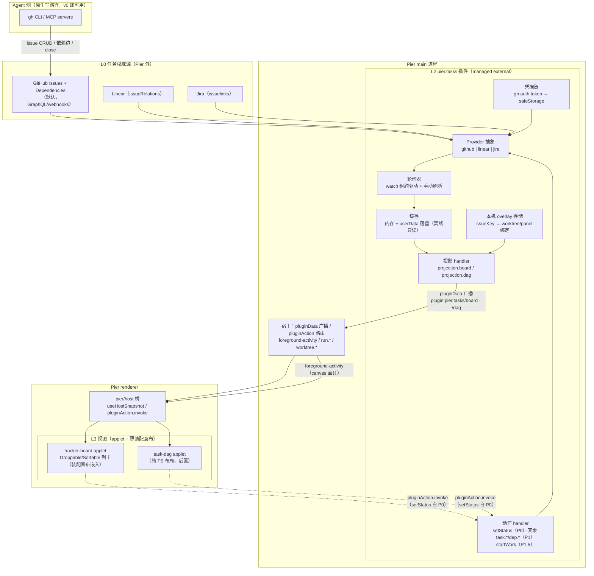
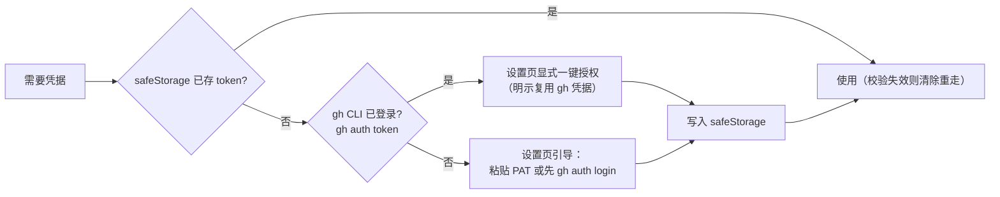
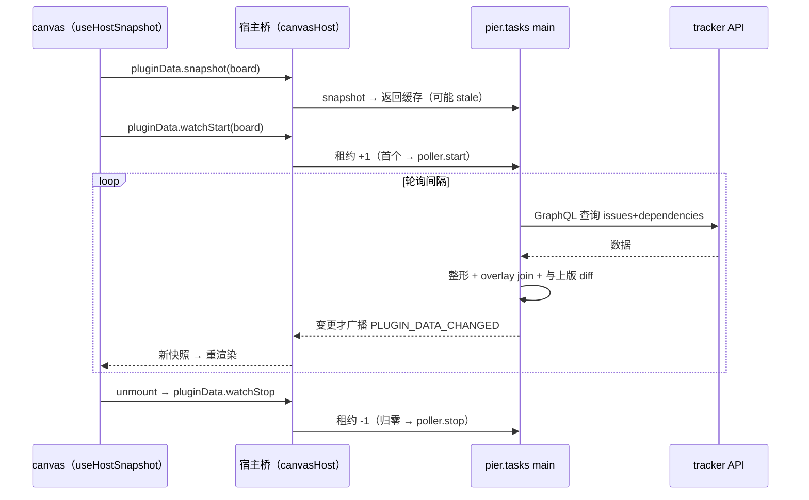
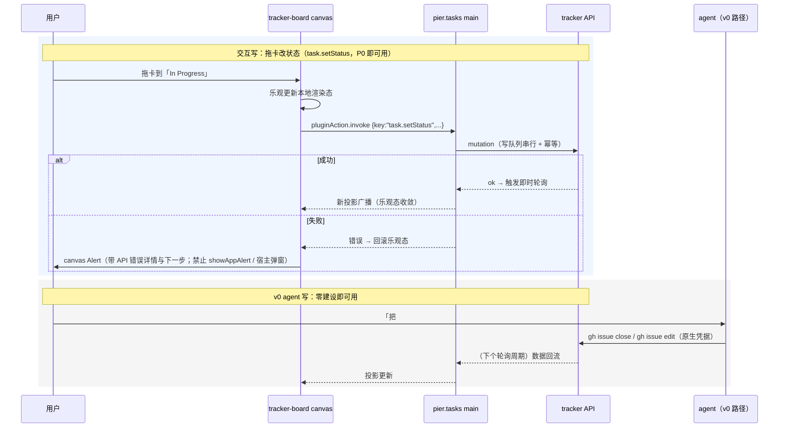
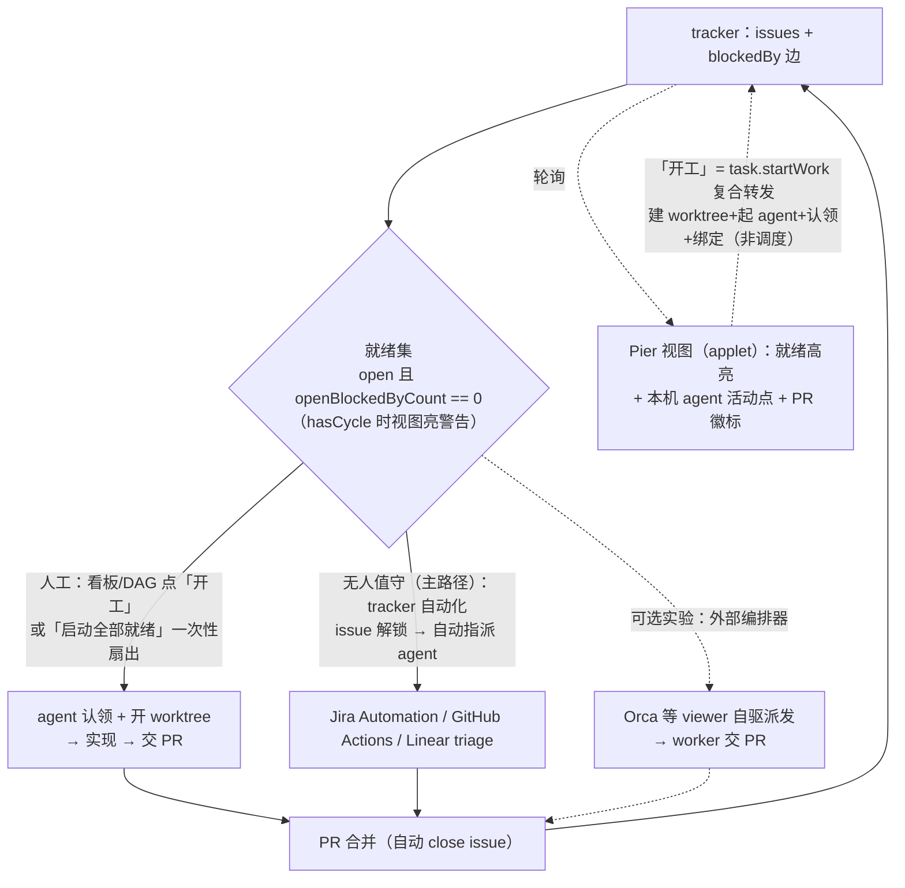

# Canvas 任务管理：外接 Tracker 权威源与任务适配插件设计

状态：评审中 · 2026-08-28
关联：[`2026-08-26-canvas-dual-stage-and-ui-expansion-design.md`](2026-08-26-canvas-dual-stage-and-ui-expansion-design.md)（canvas 壳与积木底座）

> **2026-08-30 注记**：`FlowGraph` / `layoutFlowGraph` 已从 `pier/canvas` 移除（实现效果不达标；后续 DAG 按具体产品能力重新设计）。本文所有「`FlowGraph` 渲染 DAG」段落在定稿时需替换为新的 DAG 视图方案；`Sortable` / `Droppable`、投影/动作纪律链、信任门等其余底座不受影响。

> **2026-08-31 评审修订**：本设计经四模型对抗评审（含业界 14 家多 agent 任务面调研），共识修正已并入正文：
> ① **完成语义**改为「PR 合并 / Project Status=Done」解锁下游，`gh issue close` 仅为 PR 关联的自动副作用（§0/§6）；
> ② 投影增加**需求 scope 参数化**与 `schemaVersion`、`linkedPRs`、`openBlockedByCount`（只数未关闭阻塞者）、`hasCycle` 环检测兜底（§4.4）；
> ③ `task.startWork` 定案为 **renderer 编排桥**（插件 main 认领 → 事件 → 插件 renderer 复用 worktrees.create/openTerminal facade）+ 幂等 + **认领回写**（§4.6，二轮修订替代原「受控命令」方向）；
> ④ 事实更新：GHES 3.19+ 已支持依赖边、gh CLI 2.94+ 原生 `--blocked-by`/`--blocking`、依赖边支持跨仓库（§4.7/§10）；
> ⑤ **视图层升级为 applet 供给体系**（源码级、参数化、含完整逻辑闭环的视图单元），本文 §5 收缩为数据面对接要求，视图设计移交配套文档 [`2026-08-31-canvas-applet-supply-and-task-views-design.md`](2026-08-31-canvas-applet-supply-and-task-views-design.md)；
> ⑥ 发现性补**固定入口 + 首开脚手架**（入口固定、实体仍是画布，不新增 panel kind，§2.5）；
> ⑦ 无人值守整图推进第一路径为 **tracker 自动化**，外部编排器（Orca 等）定位可选实验集成（§6）；
> ⑧ **二轮评审（同日）追加并已行内并入**：完成列 P0 只读（防拖卡绕过 PR 解锁）、投影 scope 全链路（canvas 桥/广播/租约）、工厂式入口（quick pick + scope 向导）、bundled 安装面与 external projectSettings facade 前置、三列启发式、按卡 mutation lane + 乐观保护窗、卡片语义状态 + 消息中心通知、清理工作树、task-dag 实验定位。

> **2026-09-05 工作台重设计提案（待实施）**：主路径的「任务跟踪」拟改称「议题」，与宿主的项目命令运行区分；入口复用当前已有 panel / applet，不要求先生成 Canvas。「设置负责人」与「交给智能体」分开，启动不隐式认领；按指派分列不得冒充真实工作流状态；创建后的部分失败不得删除已创建目录或已启动终端。对象、字符稿与迁移约束集中在 [工作台方案](./2026-09-03-workbench-ux-and-ergonomics-design.md) §4 / §6.2 / §9.4。本提案保留本文外部权威源与插件所有权，实施时明确替换受影响旧条款。

## 0. 结论速览

看板 / 任务管理 / DAG 三类管理能力按「**任务权威源外接 tracker + 机器本地绑定不同步 + canvas 做灵活视图 + agent 用原生工具写**」落地：

- 任务数据（标题、状态、负责人、依赖边、讨论）的存储、同步、协作、权限、通知**全部外置**到 GitHub Issues（默认）/ Linear / Jira，Pier 不建任务台账、不建同步层。
- 新增一个官方插件 `pier.tasks` 做适配：凭据、轮询缓存、**带需求 scope 的数据投影**、写动作、本机 overlay。形态**已决（2026-08-31）：managed external**，新包 `packages/plugin-tasks`（§11 决策 1）；发布面进 bundled 官方插件清单与打包资源。
- 视图层由配套设计承载：任务视图（看板/任务列表/DAG）以**源码级 applet** 交付（P0 项目地金样、P2 插件贡献点 + eject），canvas/markdown 是装配面——见 [`2026-08-31-canvas-applet-supply-and-task-views-design.md`](2026-08-31-canvas-applet-supply-and-task-views-design.md)。存量 `board` 配方重定位为「分支作用域内容板」并补 CRUD。
- 体验闭环三锚点：**拖卡改状态 P0 即可用**（`task.setStatus` 前置；**完成列 P0 只读**——open 列间拖动只改 label，不得经拖卡 close issue）；卡片**「开工」复合动作**（建工作树 + 起 agent + 认领 + 绑定，renderer 编排桥 §4.6）；发现性 = **工厂式固定入口（已有板 quick pick + 新建 scope 向导）+ 首开脚手架** + skill 意图提议（§2.5）。
- DAG：依赖边存 tracker（GitHub issue dependencies 已 GA，**`openBlockedByCount == 0` 即就绪**——只数未关闭阻塞者），投影带 `hasCycle` 环检测兜底；**完成证据 = PR 合并 / Project Status=Done**；执行推进由 tracker 自动化（主）+ agent 工作循环承担，**调度不进宿主**。
- 现有 canvas 底座（积木、投影/动作纪律链、信任门）验证有效，**不推倒重来**。

## 1. 背景与问题

### 1.1 四个发现

1. **board 配方只教了「看 + 拖 + 存」**：金样板无加卡/改卡/删卡入口，产出的板子不能直接当管理工具用。
2. **兄弟文件状态受 git 限制**：`.pier/canvases/kanban/board.json` 随分支走——跨 worktree 的任务板会在 N 个 worktree 分叉出 N 份数据、污染 PR diff、无权威副本。本仓库 git status 中的演示残留改动即为活例证。
3. **同步是硬需求**：团队共享任务板必须多人多机收敛；自建同步（应用级 store / 操作日志 CRDT / git-refs 传输）技术可行但违反「拒绝业界能力二次封装」判定——任务系统是业界成熟能力。
4. **DAG 依赖边已是 tracker 原生数据**：GitHub issue dependencies（blocked by / blocking）2025-08 GA，GraphQL 查询/变更/webhooks 齐全；Linear `issueRelations`、Jira `issuelinks` 更是长期一等公民。

### 1.2 业界对照（2026-08 时点）

| 产品 | 管理界面 | 工作流状态存储 | 结论 |
|---|---|---|---|
| Cursor | 原生 Agents 窗口（固定） | 应用级全局 SQLite（`~/.cursor`） | worktree 只是执行隔离；`.cursor/plans/` 例外证明「分支内容」可入库 |
| Qoder Quest | 原生任务窗口（固定） | IDE 应用侧 | Local / Worktree 双执行环境；台账不进仓库 |
| Vibe Kanban | 原生看板（固定） | 应用级 SQLite（`db.v2.sqlite`） | 「代码状态归 git，工作流状态归 SQLite，看板不入库」 |
| Copilot coding agent | Linear / Jira 即入口 | tracker | 指派 issue 即派工（Linear GA 2026-07；Jira assign/@提及/automation） |
| Jira marketplace | — | tracker | 已有 GitHub Copilot / Cursor / Claude 三家 coding agent app |
| Beads / git-bug | CLI | Dolt refs / git refs（**非分支**） | 连最 git 原生的任务工具也把数据挪出分支文件 |

行业收敛点：**tracker 即 agent 任务入口**；管理界面固定原生是各家短板——Pier 的 canvas 组装恰好是差异化。

## 2. 产品设计

### 2.1 定位与原则

1. 任务数据不落 Pier：不建台账、不建同步、不建调度（AGENTS.md 01 铁律不动）。
2. 机器本地绑定不同步：task↔worktree/panel 绑定是本机私有数据（路径跨机无意义），落 userData，**同步需求天然消失**。
3. canvas 只做视图组装 + 动作转发：schema 收窄、渲染、把用户动作翻译成插件动作键。
4. agent 写路径走原生工具（gh CLI / MCP）：去掉 Pier 用户仍能完成同一动作；Pier 不代理 tracker API 给 agent。
5. Pier 的增值只来自宿主身份：板上叠加 worktree 状态、agent 实时活动（`foreground-activity`）、run 输出——外部 tracker 给不了的部分。

### 2.2 能力分层

| 层 | 内容 | 状态 |
|---|---|---|
| L0 任务权威源 | GitHub Issues（默认）/ Linear / Jira | 不在 Pier |
| L1 宿主通用底座 | canvas 壳/信任门、`pier/host` 只读面、`useCanvasFile`、`canvasCommand`、插件运行时、`foreground-activity`、`run.*`、`worktree.*` | 现状保持 |
| L2 任务适配插件 `pier.tasks` | 凭据 + 轮询缓存 + 投影 + 动作 + 本机 overlay + projectSettings | **新增（本设计主体）** |
| L3 视图层 | 任务视图以 applet 交付（看板/列表/DAG，配套 spec）；`board` 配方重定位内容板；DAG 双源 | 改造 |
| L4 skill 教学层 | 作用域判据：分支内容→file / 团队任务→tracker / 运行图→编排器 | 改造 |

### 2.3 用户旅程

- **团队任务看板**：用户在项目设置里连上 repo（凭据自动复用 gh CLI）→ 经**固定入口（命令面板「任务板」/空态按钮）首开自动脚手架**、或让 agent 生成装配画布（≈10 行：嵌 tracker-board applet + 传需求 scope），**生成后立即打开预览面板挂进布局**（随 dockview 布局持久化）→ 板子显示 issues 列/卡、每张卡叠加「绑定的 worktree + agent 活动点 + PR 徽标」→ **P0 起拖卡即改状态**（`task.setStatus`），其余改数据可找 agent（gh 原生）→ 卡片「开工」一键建 worktree + 起 agent + 认领 + 自动绑定（P1.5，§4.6）。
- **任务依赖 DAG**：同一投影的 `dag` 键 → DAG 视图渲染节点（issue）与边（blockedBy）→ 就绪节点高亮（`openBlockedByCount == 0`，只数未关闭阻塞者）→ agent 领就绪任务开 worktree，交 PR，**PR 合并后**下游自动解锁。DAG 渲染以 applet 内纯 TS 布局承载（配套 spec §7），投影数据面不受影响。
- **分支内容板**（存量场景）：发布 checklist、分支内规划——继续走兄弟文件（`useCanvasFile`），数据随分支评审是特性；模板补 CRUD 后可直接使用。

### 2.4 非目标

- 不做宿主任务台账 / 看板域 / 调度器（铁律重申）。
- 不做自建同步层（应用级共享 store、操作日志 CRDT、git-refs 传输）——记入 §10 已否决方案作储备。
- 不做 tracker API 的通用封装给 agent（agent 走 gh / MCP 原生入口）。
- 不复制 tracker 的登录流进 canvas（凭据在设置页，对齐既有「Canvas 不复制登录流」约定）。
- 不做黑盒 `<Kanban>` 领域组件进 SDK（物料页仍无领域组件行）。

### 2.5 用户心智与可发现性

心智锚点：**「我的 GitHub Issues 在 Pier 里长出了手脚」**——权威数据在用户已有的 tracker（零学习成本、信任边界清晰），Pier 只叠加本地执行力。界面持续回答「这份数据是谁的」：板标题带 repo 名、卡片号点开浏览器原 issue、陈旧时标「数据来自 x 分钟前」。

发现性四钩子（**2026-08-31 修订**：评审判定「纯靠 skill 提议」发现链断裂——`SKILL.md` 为显式调用模式，无自动触发承载；补固定入口，**入口固定、实体仍是画布**，不新增 panel kind）：

1. **固定入口（工厂式，2026-08-31 二轮定案）**：命令面板「任务板」+ 连接后空态按钮——先列**已有板 quick pick**，「新建」走 scope 向导（默认当前 remote，禁止无过滤全仓首板）后脚手架并打开；关板 = 显式删除确认。信任门如实呈现（「将创建并打开任务板」），拒信保留文件并给下一步；已授信项目下近似无感知。
2. **skill 意图提议**：agent 识别任务管理意图（「帮我管理这些任务」）时主动提议生成 tracker-board（承载机制见配套 spec §8）。
3. **空态直达**：未连接 tracker 的 `Empty` 带 `settings.open` 动作直达 projectSettings 连接页。
4. **生成即打开**：脚手架/agent 生成后立即打开预览面板挂进 dockview 布局（布局持久化，二次启动仍在）。

零配置默认（2026-08-31 二轮修订）：无状态标签时**三列启发式**——未指派 open=待办 / 已指派 open=进行中 / closed=**完成（只读列）**；projectSettings 提供「一键创建标准状态标签」，检测到标签自动升级多列。两列（进行中/已完成）方案已否决：待办与进行中混列丢失「从就绪队列领活」的看板主作业，且拖入「已完成」= close issue 会绕过 PR 合并解锁语义。**首跑不得要求用户先去 GitHub 配置。**

## 3. 总体架构



要点：canvas 与 tracker 之间**没有直连**（canvas CSP 仅 loopback，外网数据走插件投影——既有约定）；agent 与 tracker 之间**不经 Pier**。

## 4. 技术设计 A：`pier.tasks` 插件

### 4.1 模块结构

```
packages/plugin-tasks/src/   # managed external（已决），布局对齐 packages/plugin-codex
├── manifest.ts            # dataProjections: ["board","dag"]；canvasActions（setStatus P0，其余 P1）；projectSettings
├── main/
│   ├── index.ts           # 插件 main 入口：注册 projection/action handler
│   ├── credentials.ts     # gh CLI token 探测 + safeStorage 兜底
│   ├── providers/
│   │   ├── types.ts       # Provider 接口（fetchBoard/fetchDag/mutate）
│   │   └── github.ts      # GraphQL：issues + blockedBy/blocking + sub-issues
│   ├── poller.ts          # watch 租约驱动的轮询 + 限流退避
│   ├── cache.ts           # 内存快照 + userData 落盘（离线只读）
│   ├── overlay.ts         # 本机绑定存储（插件私有 userData JSON）
│   └── projection.ts      # 整形 board/dag shape + overlay join
├── renderer/
│   └── project-settings.tsx  # 项目设置详情 tab：repo 映射、状态映射、凭据状态
└── locales/{en,zh-CN,ja,ko}.json
```

纪律：模块不 import `services/agents/`；投影/动作键未在 manifest 声明一律拒绝（main 侧投影服务声明检查）。**前置缺口（2026-08-31 二轮核实）**：managed external 的 renderer 容境现无 `projectSettings.register` facade（仅 builtin 有）——P0 先补 facade + 声明断言 + 生命周期回收；发布面须列入 bundled 官方插件清单与 electron-builder extraResources，否则生产包内固定入口打开的是空板。

### 4.2 凭据链



- 复用 gh CLI 是推荐路径（agent 已依赖 gh；无 OAuth app 的工程与审核成本），但**必须经设置页显式授权**，不静默读取。
- token 只存 safeStorage（铁律）；插件 renderer/canvas 永不接触 token。

### 4.3 轮询与缓存

- 轮询只由 watch 租约驱动：首个 `pluginData.watchStart("board"|"dag")` 起轮询，归零即停（既有引用计数语义）。间隔默认 30s，窗口失焦退避到 120s；`usageData.refresh` 同款手动刷新动作立即拉。
- 限流：GitHub 认证 REST 5000/h、GraphQL 按点数——单板轮询远低于配额；429/abuse 响应指数退避并在投影里带 `staleSince`。
- 缓存双层：内存快照（投影即时应答）+ userData 落盘（重启/离线时只读展示，UI 标注「数据来自 {time}」）。
- 机会主义刷新：绑定 worktree 内 agent 回合结束（main 侧监听 `foreground-activity` 广播）→ 立即拉取一次；动作写成功后同样即时拉取。消除「终端已完成、看板还旧」的感知失真。
- **手动刷新（2026-08-31 二轮增）**：板顶栏「数据来自 x 分钟前」旁必须有刷新按钮（即时拉取 + 重置轮询计时）；`usageData.refresh` 是用量通道，不得挪用。
- **通知（P1.5）**：被 watch 的板发生「PR 合并 / 下游任务转就绪」时经宿主消息中心投递（遵循既有投递纪律），用户不盯板也不错过解锁；不建任务级会话台账，停止/重试仍在终端面板。

### 4.4 投影契约

投影顶层保留键（`payload`/`key`/`pluginId`）遵守既有信封约定；canvas 侧类型 `unknown` 自行收窄（不把 DTO 写进 `pier/canvas` sdk——既有铁律）。

**需求 scope 参数化（2026-08-31 修订，评审 critical）**：投影键支持规范化查询后缀——`board?milestone=<名>` / `board?label=req%2Fx`（canvas 侧 `useHostSnapshot("plugin:pier.tasks/board?milestone=…")`）。manifest 仍只声明基键（`board` / `dag`），宿主按基键校验声明、按完整键计 watch 租约；`pluginData.snapshot` / `watchStart` 契约需扩一个可选 `params`（现实现给投影 handler 传 `null`）。**改动是全链路（2026-08-31 二轮核实）**：canvas 桥的 watch 目标解析现把 `?` 后整串当 key、声明校验按全键、广播按全键过滤、`useHostSnapshot` 组 payload 不带 params——须同步改 `canvas-host.ts` 的 `parsePluginDataWatchTarget`（拆基键 + 规范化 params）、renderer host 桥传参、命令透传与广播信封带 scope，并以「双 scope × 双窗」测试锁定不串台。**过滤在 provider 查询侧完成、截断在过滤之后**——禁止「全仓拉取 + 前端筛」（每列 50 截断会把需求内的卡漏掉）。多项目窗口下 scope 含 `projectRootPath` 派生的 repo 绑定，不同项目不共享同一份投影。

```ts
// plugin:pier.tasks/board?milestone=<需求>
{
  schemaVersion: 1,                    // 2026-08-31 增：投影 shape 演进锚点（ejected 视图对账用）
  source: { provider: "github", repo: "owner/name", scope: { milestone: "结算重构" } },
  updatedAt: string, staleSince?: string,
  canWrite: boolean,                   // P1 增：当前主体动作能力；只读协作者前置禁用拖拽（不要等 403）
  columns: [{ id, title, totalCount, truncated, readonly? }], // v0: 三列启发式（完成列 readonly）；标签升级多列；P1: Projects V2 可选
  cards: [{
    key,                               // "gh:owner/name#123"（完整键；依赖可跨仓，裸 number 不是唯一桥）
    number, title, state, url,
    assignees: string[], labels: string[],
    milestone?: string | null,
    openBlockedByCount: number,        // 就绪判据：=== 0（只数未关闭阻塞者；GitHub total_blocked_by 含已关闭，不可直用）
    externalBlockedByCount: number,    // 板外/跨仓阻塞者数：>0 时卡片标「外部阻塞」徽标，不得静默隐藏
    externalBlockers?: [{ key, repo, number, title, state, url }],  // P1 增：悬停可见谁在挡（只有计数会把用户赶回 GitHub 排查）
    linkedPRs: [{ number, state, checks? }],  // P1 增：issue→PR→checks 中段；完成证据 = PR 合并
    columnId,
    overlay?: { worktreePath?, panelId?, boundAt }   // 本机 join，跨机自然缺席
  }]
  // 投影默认只含 open issues、每列上限 50（truncated 标记溢出，出口链接去 GitHub 看全量）；
  // 负责人等细筛仍可在视图侧客户端过滤，但需求 scope 必须走投影参数（服务端切片）
}

// plugin:pier.tasks/dag?milestone=<需求>
{
  schemaVersion: 1,
  source, updatedAt,
  hasCycle: boolean,                   // 环检测兜底：GitHub 平台校验环、Jira 明确允许环、Linear 不承诺——投影统一拓扑检测
  cycleKeys: string[],                 // 环上节点：视图亮警告，而非任务静默永不就绪
  nodes: [{ key, number, title, state, openBlockedByCount, url, overlay? }],
  edges: [{ from, to }]                // from blocks to（blockedBy 反向展开）；板外边给幽灵节点或外部徽标
}
```

watch 租约生命周期：



### 4.5 动作契约与写路径

manifest `canvasActions` 声明键与分期：**P0**——`task.setStatus`（拖卡首日可用，工期换体验的已决取舍见 §10）；**P1**——`task.create`、`task.assign`、`task.close`、`dep.add`、`dep.remove`、`task.bindWorktree`、`task.unbindWorktree`；**P1.5**——`task.startWork`（复合动作 + 认领回写 + 幂等，§4.6）。

**拖卡边界（2026-08-31 二轮修订）**：P0 列间拖动仅限 open 列之间（改 label）；「完成」列**只读**——拖卡不得 close issue（否则 `openBlockedByCount` 归零，绕过「PR 合并才解锁」）；完成列条件可写推迟 P1（仅 `linkedPRs` 已 merged 或用户显式确认时允许拖入）。**写收敛协议**：写队列**按卡分 lane**（防跨卡队头阻塞）；mutation 后设 5–8 秒乐观保护窗 + 本地 generation，期间丢弃更旧快照（GitHub 写后副本延迟 0.5–3s，否则写后即拉会把卡弹回原列）；同卡连续操作只保留最新意图；失败回滚后续操作进单测。



### 4.6 本机 overlay

- 存储：`{userData}/plugins/pier.tasks/overlay/<repoKey>.json`，形如 `{ [issueKey]: { worktreePath, panelId?, boundAt } }`。repoKey 从 remote URL 规范化派生（不建 Project 注册表——既有约定）。
- 写入：`task.bindWorktree`（绑定既有工作树）与 `task.startWork` 复合动作；读取只在投影 join 时。
- **`task.startWork`（开工，人体工程学基石）**：卡片一键完成「创建 worktree → 启动 agent 会话并注入 issue 上下文（编号/标题/链接/验收标准）→ **认领回写 tracker**（assign 当前用户或 in-progress label——行业 claim 协议：Copilot「assign 即派工」、Linear delegate 保留 assignee 问责；防两机/两人重复开工）→ 写 overlay 绑定」。定性为**动作转发**（单次、用户触发），不是调度器。**编排桥（2026-08-31 二轮定案）**：插件 main 调不到宿主命令（`authorizeCommand` 默认拒插件主体），但插件 **renderer** 已有 `context.worktrees.create` + `openTerminal({ agentId, taskPrompt })`（git 插件同款 facade）——链路定为：canvas 动作 → `task.startWork` RPC → 插件 main 认领 + 写 overlay → 事件给本窗插件 renderer → 复用既有 facade 建工作树、起 agent 并注入 issue 上下文。**部分成功回滚**（树建了/终端没起/认领已写）进治理测试；不为此新造宿主命令，除非该桥无法满足确认/授权语义。`startWork` 点亮前不得以假按钮上线。**幂等**：已存在有效绑定时按钮变「聚焦会话 / 查看工作树」，不重复创建。「启动全部就绪任务」为一次性扇出（N 次 startWork，用户触发、封顶 N、无等待循环），不构成调度。
- 悬空降级：worktree 路径不存在（`worktree.check`）→ 投影标 `stale: true`，卡片显示「工作树已移除」，不阻塞渲染。
- agent 活动点**不进 overlay**：canvas 直订 `useHostSnapshot("foreground-activity")`，按 overlay 的 panelId/worktreePath 在视图层匹配——插件不 import 活动域，边界单向。**状态映射（2026-08-31 二轮增）**：`waiting`（需要你处理）/`error`/`processing` 须映射为卡片可见语义状态并支持点击聚焦对应面板，不止一个圆点；停止/重试仍留终端面板，不进 applet。
- **清理工作树（P1.5）**：PR merged/closed 且卡片有 overlay 绑定时提供「清理工作树」入口（宿主既有删除流 + 清 overlay），补齐开工→归档生命周期。

### 4.7 Provider 抽象与降级

- 接口封在插件内部（`providers/types.ts`），投影 shape 对 canvas 恒定；**不对外输出通用 tracker SDK**（避免二次封装红线）。Provider 必须声明 **capabilities 矩阵**（依赖边有无、列语义来源 label/status/project、可否建需求容器等），缺什么显式降级什么，不承诺三家完全同构 CRUD/DAG。
- GitHub：issues + dependencies（GA，支持**跨仓库**边 `owner/repo#123`，平台侧有环校验）+ sub-issues；**层级（sub-issues，树）与依赖（dependencies，DAG）是两套关系，分开消费**——前者做需求分组，后者进 `dag` 投影。每 issue 每类依赖上限 50，超大图用 sub-issues 分层。**gh CLI 2.94+（2026-06）原生支持 `--blocked-by`/`--blocking` 及 `--json blockedBy,blocking`**——agent 写路径做版本探测，老版本回退 `gh api graphql`（skill 附模板）。
- GHES：**3.19+ 已支持 dependencies**（REST 端点已入 GHES 3.21 文档）→ label 约定边（`blocked-by:#N`）降级链仅针对更老版本。
- Linear（P3）：`issueRelations`（blocks/blocked-by 一等公民，不承诺防环）；Jira（P3）：`issuelinks` 类型化链接（**明确允许环**、一次 REST 只能加一条、link type 管理员可改名）——环检测统一由投影层兜底（§4.4 `hasCycle`），不依赖任何平台防环。
- 需求容器映射：GitHub milestone / `req/*` label / 父 issue + sub-issues；Linear Project；Jira Epic。需求管理重的团队常见**混合形态**（需求层 Linear/Jira + 开发任务层 GitHub，官方双向同步打通）——Pier 只盯工程侧一头，provider 无需切换。

## 5. 技术设计 B：canvas 视图层与配方

### 5.1 `tracker-board` 配方（新增）

- **2026-08-31 修订**：视图实现改由 **applet** 承载（源码级、参数化、含数据消费/乐观更新/空态错误态的完整闭环单元），applet 契约、供给（P0 项目地 `lib/` 金样、P2 插件贡献点 + eject）、产生环节（固定入口 + 脚手架）与装配面见配套设计 [`2026-08-31-canvas-applet-supply-and-task-views-design.md`](2026-08-31-canvas-applet-supply-and-task-views-design.md)。模板 `templates/tracker-board.canvas.tsx` 收缩为**薄装配示例**（≈10 行：import applet + 传 scope props）+ 配方 `packs/recipes/tracker-board/pack.json`（`stage: fill`）。**不**落 `.pier/canvases/tracker-board/`——仓库 canvases 只留 canvas-kit / pier-cli-user-manual / smoke（见 `.pier/canvases/README.md`）。
- 组装：根 `<Stack fill>`；列 `Droppable` + 卡 `Sortable`（复用现有 DnD 积木）；数据 `useHostSnapshot("plugin:pier.tasks/board")` 收窄渲染；活动点双订阅 foreground-activity。
- 状态面：投影 `status` 为 loading/error/ready 三态 + 无凭据 `Empty` 引导（「未连接任务系统。请在设置 → 项目中连接」，文案进 locale）；`staleSince` 显示数据时间。写失败用壳内 `Alert`（不要 `showAppAlert`）。
- P0 交互：拖卡改状态可用（`task.setStatus`，乐观更新/失败回滚）；卡片标题点开浏览器原 issue（心智锚：数据在 GitHub）；筛选控件（负责人/label/milestone，`Select`/`Input` 客户端过滤投影数据——卡片带 `milestone`）+ 列溢出「在 GitHub 查看全部」出口；「开工」按钮 P1.5 点亮。
- 板标题带 repo 名；`staleSince` 显示「数据来自 x 分钟前」。

### 5.2 DAG 视图（**阻塞：渲染原语待重设计**）

- 原方案（`FlowGraph` + `layoutFlowGraph`，节点按 state 着色、就绪高亮、位置拖拽持久化兄弟 JSON）随 FlowGraph 于 2026-08-30 移除而失效。**2026-08-31 解法**：DAG 布局以**纯 TS 实现内嵌 task-dag applet**（分层布局约百行、SVG 渲染；React 编译围栏禁 node_modules，不引第三方图库）——宿主不再重建通用画图原语，僵局解除。task-dag 从首发清单**后置**（前置条件：tracker-board applet 跑通 + 投影 `dag` 键 `hasCycle`/幽灵节点语义落地）。
- 计划层 / 执行层分工原则保留：**任务依赖 DAG（计划层）读 tracker 投影；运行图（执行层）走编排器 loopback / `run.*`**。两张图不混。原 orchestration 配方已随 FlowGraph 删除。

### 5.3 存量配方改造

- `board` 配方重定位：pack.json description/agentPrompt 明确「分支作用域内容板」适用边界；antiPatterns 增加「团队共享任务数据放兄弟 JSON（应走 tracker-board）」。
- `board` 模板补最小 CRUD 并作为配方金样（2026-08-28 清理已删除旧 kanban 仓库演示）：列底「+ 添加卡片」（`Input` + Enter）、卡片 `Popover` 编辑（`Field`/`Select`）、`DropdownMenu` 删除——全部现有 SDK 积木，写路径复用既有 `persist`/revision 冲突处理；**不**把新演示落回 `.pier/canvases/`（对齐 README 准入；契约测试锁模板）。
- ~~`orchestration` 配方 agentPrompt 补数据源说明~~——该配方已随 FlowGraph 于 2026-08-30 删除；数据源分工说明并入 §5.2 重设计。

### 5.4 skill 教学

- `SKILL.md` 新增「作用域判据」节：分支内容 → `useCanvasFile`；团队任务/依赖 → `plugin:pier.tasks/*` 投影；运行图 → 编排器。recipe 表加 `tracker-board` 行（薄装配形态）。**applet 优先工作流与 authoring 期发现通道**（`plugin.inspect` 是 canvas 运行时 API，agent 在终端 authoring 期读不到 propsSchema——需 CLI 侧发现输出）见配套 spec §8。
- 物料登记：`src/renderer/lib/canvas-materials/catalog-entries.ts` + `settings-materials` 四语 locale；仍无领域组件行（登记的是配方/物料，不是 `<Kanban>` 组件）。
- 意图钩子：skill 教 agent 识别任务管理意图时主动提议 tracker-board，生成后立即打开预览面板（发现性钩子 ②④，§2.5）——注意 `SKILL.md` 现为显式调用模式（`disable-model-invocation: true`），「主动提议」的承载机制在配套 spec §8 给出，不得假设 skill 自动进上下文。

## 6. DAG 执行闭环（无宿主调度器）

**完成语义（2026-08-31 修订，评审 critical）**：解锁下游的判据是 **PR 合并（closingIssuesReferences 自动 close issue）或 Project Status=Done**，不是 agent 自行 `gh issue close`——worker 自报完成可能只是产出了未合并代码，提前解锁会错误放行下游。无人值守整图推进的**第一路径是 tracker 自动化**（Jira Automation 已把 Copilot/Cursor/Claude 列为原生 action step；GitHub Actions / Linear triage 同构）；外部编排器（Orca + orca-dag viewer 自驱 coordinator）定位为**可选实验集成**（同赛道产品 + 社区调度器，供应风险自担；§10 原否决维持），官方文档不指名依赖。



## 7. 改造与删除清单

### 7.1 新增

| 项 | 路径 |
|---|---|
| 任务适配插件 | `packages/plugin-tasks/**`（managed external 已决，布局对齐 `packages/plugin-codex`）+ bundled 官方插件清单与 electron-builder extraResources 注册 |
| tracker-board applet（P0 金样，视图实现） | 官方模板经脚手架放入项目 `.pier/canvases/lib/tracker-board.applet.tsx`（供给与 eject 见配套 spec §5） |
| tracker-board 薄装配模板 + 配方 | `resources/system-skills/pier-canvas/templates/tracker-board.canvas.tsx`（≈10 行）+ `packs/recipes/tracker-board/pack.json` |
| 固定入口 + 脚手架 | 命令面板「任务板」/ 空态按钮 → 首开生成装配画布并打开（配套 spec §6） |
| 治理测试 | `tests/unit/plugins/tasks/`（manifest 声明链、投影 shape + scope 参数、凭据不泄漏）；对齐 plugin-data-projections 既有模式 |

### 7.2 修改

| 项 | 内容 |
|---|---|
| `packs/recipes/board/pack.json` | 重定位内容板 + antiPatterns 补条 + agentPrompt 补 CRUD 教法 |
| `templates/kanban.canvas.tsx`（旧金样板已删，P2 重建） | 补最小 CRUD（加/改/删卡） |
| ~~`packs/recipes/orchestration/pack.json`~~ | 已随 FlowGraph 于 2026-08-30 删除，本行作废 |
| `resources/system-skills/pier-canvas/SKILL.md` | 作用域判据节 + recipe 表 |
| `catalog-entries.ts` + `settings-materials` 四语 | 物料登记 |
| `AGENTS.md` | 「插件数据投影与 Canvas 动作」节补 tasks 域条目 |

### 7.3 删除 / 回滚

| 项 | 处置 |
|---|---|
| 冗余演示画布 ×11（activity-overview / dag-viewer / design-mockup / harness-plugin-architecture / kanban / mobile-companion / multi-agent-orchestration-gold / templates / workbench-examples / workbench-into-canvas / **smoke/world.canvas.tsx**）及其专属测试、配方 gold 指针 | **已删除**（2026-08-28 清理；保留 canvas-kit 物料、pier-cli-user-manual、smoke 编译夹具） |
| 自建同步方案（应用级共享 store / 操作日志 CRDT / git-refs 传输） | 无代码，方案层否决，记入 §10 储备 |

### 7.4 明确不动

canvas 壳/信任门/热重载、`Sortable`/`Droppable`/`useCanvasFile`/`canvasCommand`、`pier/host` 允许清单（无需为本设计扩权）、AGENTS.md 01 铁律、smoke 编译夹具、canvas-kit 物料、pier-cli-user-manual。（原列表中的 `FlowGraph` 已于 2026-08-30 移除。）

## 8. 里程碑

| 期 | 内容 | 解锁 | 量级 |
|---|---|---|---|
| P0 | `packages/plugin-tasks` 骨架（含 bundled 安装面 + external projectSettings facade 前置）+ GitHub 投影（**scope 全链路参数化 + schemaVersion**，服务端过滤后截断）+ `task.setStatus`（open 列间；**完成列只读**；按卡 lane + 乐观保护窗）+ tracker-board **applet**（三列启发式/键盘移动/手动刷新）+ **工厂式入口/脚手架** | 板子出数据且**拖卡可用**；agent gh 写回流 | 约 2 周 |
| P1 | 其余 canvasActions（create/assign/close/dep.*）+ 投影补 `linkedPRs` / `hasCycle` / `externalBlockers` / `canWrite` + **PR 合并解锁判据** + 完成列条件可写 + **Projects V2 绑定可选项** + task-list applet + 批量/键盘完善 | 全量交互写；补齐 issue→PR→checks 中段 | 5-7 天 |
| P1.5 | **renderer 编排桥**（main 认领 + overlay → 事件 → renderer 复用 worktrees.create/openTerminal，部分成功回滚测试）+ `task.startWork`（幂等）+ 卡片语义状态映射 + 消息中心通知 + 清理工作树入口 + 「启动全部就绪」一次性扇出 + 机会主义刷新 | 「看板即驾驶舱」闭环 | 4-5 天 |
| P2 | 存量配方改造（board 模板补 CRUD + 重定位 + skill + 物料登记）∥ **applet 插件贡献点**（`manifest.applets` + 引用解析 + eject；前置条件：投影契约在真实使用中稳定；设计见配套 spec §5.2） | 内容板可用；视图供给制升级 | 见配套 spec |
| P3 | Linear/Jira provider + 老 GHES 降级 + task-dag applet（**实验定位**，设布局质量退出条件）+ markdown 只读嵌入（配套 spec §6.3） | 生态扩展 | 按需 |

## 9. 治理检查点

| 检查点 | 锁定 |
|---|---|
| `tests/unit/plugins/tasks/manifest-governance.test.ts`（新） | 投影/动作键全部声明；插件不 import `services/agents/`；token 不出 main |
| plugin-data-projections 既有套件（扩） | tasks 投影信封/租约语义 |
| 用户文案治理（既有，扩词表） | 新增产品词（见 §11 决策点 4）；Empty/错误文案带下一步 |
| canvas-materials catalog（既有） | tracker-board 登记且仍无领域组件行 |
| skill 契约测试（既有模式） | recipe 表与 pack 目录一致 |

## 10. 已决取舍与已否决方案

- **已否决：Pier 自建同步层**（应用级共享 store → 操作日志 CRDT → git-refs 传输的完整推演见对话记录）。技术可行（git-bug 形式规范可对齐、Automerge/Loro 可嫁接 refs 传输），但违反「业界成熟能力直接走原生入口」判定，且共享数据外置 + 本地绑定不同步的分解让需求消失。**作为储备**：仅当「无 tracker、要跨机团队共享、纯本地」三条件同时出现再评估。
- **已否决：绑定 Orca 等外部编排器作为任务状态所有者**。编排器是同赛道产品；「运行图 viewer」与任务依赖 DAG 的计划/执行分工原则见 §5.2（原 orchestration 配方已随 FlowGraph 删除）。
- **已否决：宿主任务台账 / SDK 领域组件 `<Kanban>`**。铁律 + 业界证伪（react-beautiful-dnd 废弃、商业黑盒组件定制墙）。
- **已决：凭据复用 gh CLI 须显式授权**，不静默读取。
- **已决（2026-08-31 更新）：v0 列语义用三列启发式**（未指派 open / 已指派 open / closed 只读），Projects V2 绑定提前为 **P1 可选项**（团队已用网页板时消除双写不对齐）。
- **已决：`task.setStatus` 前置 P0**——P0 工期从数天增至约一周，换「长得像看板就能拖」的首日体验；只读板违反看板第一直觉。
- **已决：`task.startWork` 定性为动作转发**（用户触发的单次复合，经宿主既有命令面），不触碰「不做调度器」铁律；插件命令授权面缺口在 P1.5 补齐并进治理测试。
- **已决：零配置优先**——无标签三列启发式（完成列只读）+ 一键创建标准标签，首跑不得强制用户先配置 GitHub。
- **已决（2026-08-31 二轮）：P0 完成列只读**——拖卡不得 close issue，完成写入以 PR 证据为前提（P1 条件可写）；否则首日体验就推翻「PR 合并才解锁」。
- **已决（2026-08-31 评审并入）：完成证据 = PR 合并 / Project Status=Done**，`issue close` 只是 PR 关联的自动副作用，不作解锁判据（worker 自报完成 ≠ 验收）。
- **已决（2026-08-31）：开工必须认领**——`startWork` 回写 assignee / in-progress label（行业 claim 协议），叠加幂等（已绑定 → 聚焦会话）；落地走 renderer 编排桥（§4.6），不新造宿主命令。
- **已决（2026-08-31）：投影按需求 scope 切片**（服务端过滤后截断），禁止「全仓拉取 + 前端筛」——每列 50 截断会丢需求内的卡。
- **已否决（2026-08-31）：宿主级成品视图 applet**（activity / cost / git 等）——与「不设官方成品模板」hard ban 及工作台拆除金标准冲突；宿主域继续 hook + 积木教学，applet 供给只有插件级与项目级（配套 spec §5.3）。
- **已否决（2026-08-31）：markdown fence 的 `src` 任意路径变体**——打开文档即执行任意项目代码，项目信任被追溯放宽；只保留「仅 id 引用已安装插件 applet + 显式启用 + 只读」形态且后置 P3（配套 spec §6.3）。
- **残留风险（2026-08-31 更新）**：每类 50 边上限（sub-issues 分层缓解）；轮询实时性秒~分钟级——30-120s 滞后可能诱发滞后拖卡，UI 强制「数据来自 x 分钟前」+ 写后回读收敛，后续可评估 webhook→本地转发器（引入公网面，默认不做）。~~GHES 依赖边不可用~~ 已过时（3.19+ 支持，§4.7）；~~gh 写依赖边须 graphql~~ 已过时（gh 2.94+ 原生 flags，老版本回退模板）。

## 11. 开放决策点

| # | 决策 | 建议 |
|---|---|---|
| 1 | 插件形态：builtin `pier.tasks` vs managed external | **已决（2026-08-31）：managed external**，新包 `packages/plugin-tasks` 对齐 `pier.codex`；决定性证据：builtin 容境仅有 `configuration`（RPC/secrets/paths 只在 external 容境）；前置：external projectSettings facade + bundled 安装面 |
| 2 | GitHub 凭据：复用 gh CLI vs 自建 OAuth app | 复用 gh CLI（显式授权）；补 token 双份生命周期治理（失效清除、登出清 userData 缓存） |
| 3 | v0 列语义：label/state vs Projects V2 | **已决（2026-08-31）**：零配置三列启发式（完成列只读）起步 + 板标题明示「列按标签映射」；Projects V2 绑定为 **P1** projectSettings 可选项 |
| 4 | 产品词：Issue 中文界面用词（议题/任务） | 「任务」（与智能体/工作树同级的产品词，避免直出英文） |
| 5 | kanban 模板 CRUD（P2）是否与 P0 并行 | 并行（互不依赖） |
| 6 | applet 相关决策（产品词、propsSchema 格式、deprecated 治理、目录规范） | 见配套 spec [`2026-08-31-canvas-applet-supply-and-task-views-design.md`](2026-08-31-canvas-applet-supply-and-task-views-design.md) §13 |
