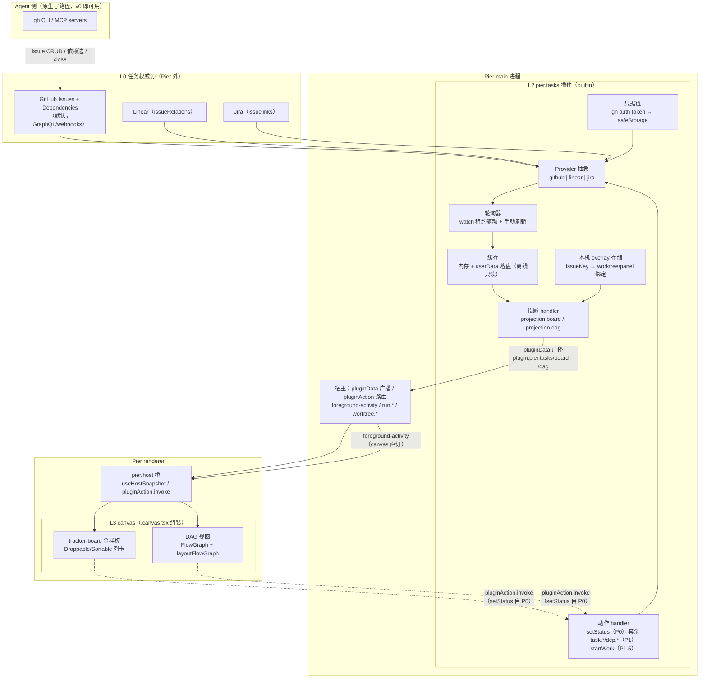
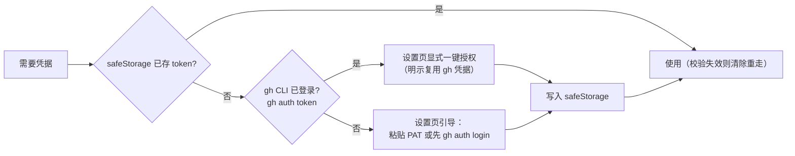
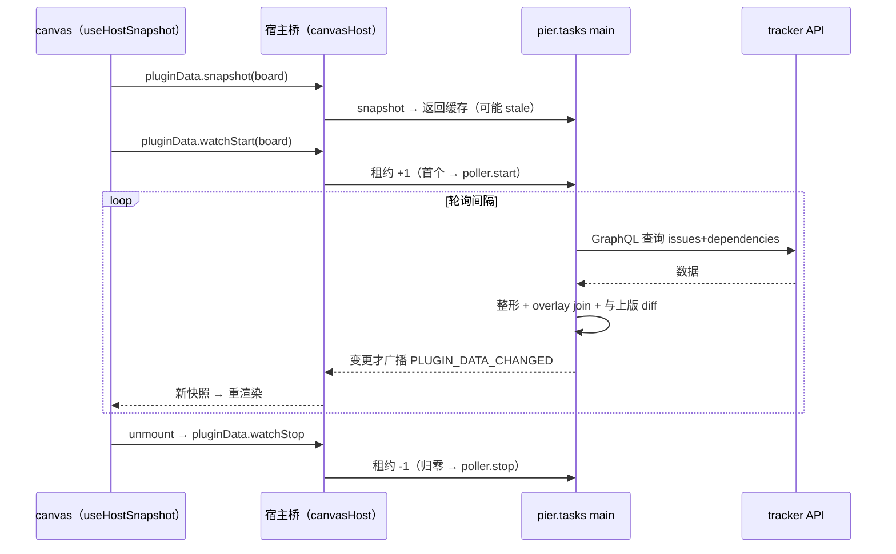
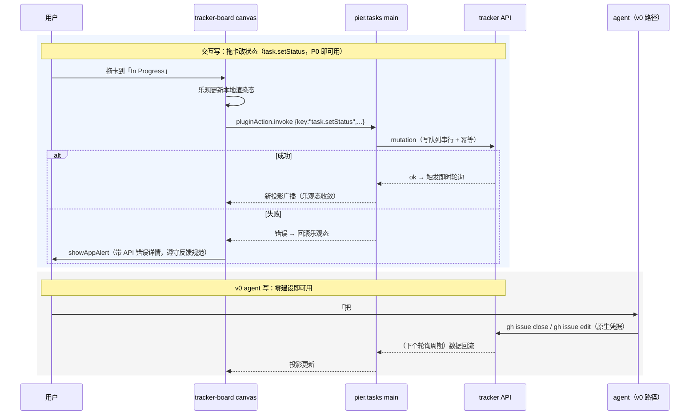
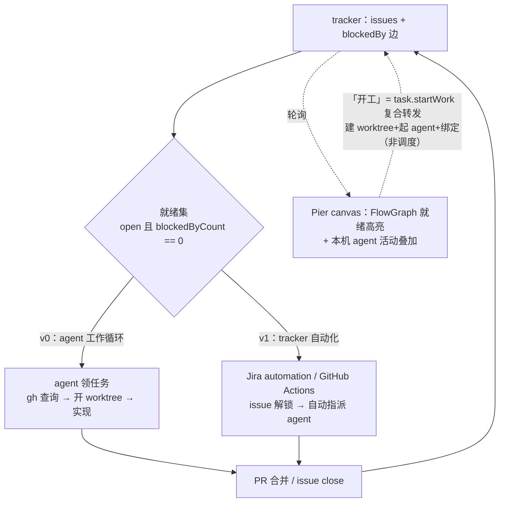

# Canvas 任务管理：外接 Tracker 权威源与任务适配插件设计

状态：评审中 · 2026-08-28
关联：[`2026-08-26-canvas-dual-stage-and-ui-expansion-design.md`](2026-08-26-canvas-dual-stage-and-ui-expansion-design.md)（canvas 壳与积木底座）

## 0. 结论速览

看板 / 任务管理 / DAG 三类管理能力按「**任务权威源外接 tracker + 机器本地绑定不同步 + canvas 做灵活视图 + agent 用原生工具写**」落地：

- 任务数据（标题、状态、负责人、依赖边、讨论）的存储、同步、协作、权限、通知**全部外置**到 GitHub Issues（默认）/ Linear / Jira，Pier 不建任务台账、不建同步层。
- 新增一个官方 builtin 插件 `pier.tasks` 做适配：凭据、轮询缓存、数据投影、写动作、本机 overlay。
- canvas 保持唯一组装层：`tracker-board` 新配方读投影渲染；存量 `board` 配方重定位为「分支作用域内容板」并补 CRUD。
- 体验闭环三锚点：**拖卡改状态 P0 即可用**（`task.setStatus` 前置）；卡片**「开工」复合动作**（建工作树 + 起 agent + 绑定）；发现性走 skill 意图提议 + 空态直达连接 + 生成即打开（§2.5）。
- DAG：依赖边存 tracker（GitHub issue dependencies GA 2025-08，`blockedBy == 0` 即就绪），`FlowGraph` 渲染，执行推进由 agent 工作循环 + tracker 自动化承担，**调度不进宿主**。
- 现有 canvas 底座（积木、投影/动作纪律链、信任门）验证有效，**不推倒重来**。

## 1. 背景与问题

### 1.1 四个发现

1. **board 配方只教了「看 + 拖 + 存」**：金样板无加卡/改卡/删卡入口，产出的板子不能直接当管理工具用。
2. **兄弟文件状态受 git 限制**：`.pier/canvases/kanban/board.json` 随分支走——跨 worktree 的任务板会在 N 个 worktree 分叉出 N 份数据、污染 PR diff、无权威副本。本仓库 git status 中的演示残留改动即为活例证。
3. **同步是硬需求**：团队共享任务板必须多人多机收敛；自建同步（应用级 store / 操作日志 CRDT / git-refs 传输）技术可行但违反「拒绝业界能力二次封装」判定——任务系统是业界成熟能力。
4. **DAG 依赖边已是 tracker 原生数据**：GitHub issue dependencies（blocked by / blocking）2025-08 GA，GraphQL 查询/变更/webhooks 齐全；Linear `issueRelations`、Jira `issuelinks` 更是长期一等公民。

### 1.2 业界对照（2026-08 时点）

| 产品 | 管理界面 | 工作流状态存储 | 结论 |
|---|---|---|---|
| Cursor | 原生 Agents 窗口（固定） | 应用级全局 SQLite（`~/.cursor`） | worktree 只是执行隔离；`.cursor/plans/` 例外证明「分支内容」可入库 |
| Qoder Quest | 原生任务窗口（固定） | IDE 应用侧 | Local / Worktree 双执行环境；台账不进仓库 |
| Vibe Kanban | 原生看板（固定） | 应用级 SQLite（`db.v2.sqlite`） | 「代码状态归 git，工作流状态归 SQLite，看板不入库」 |
| Copilot coding agent | Linear / Jira 即入口 | tracker | 指派 issue 即派工（Linear GA 2026-07；Jira assign/@提及/automation） |
| Jira marketplace | — | tracker | 已有 GitHub Copilot / Cursor / Claude 三家 coding agent app |
| Beads / git-bug | CLI | Dolt refs / git refs（**非分支**） | 连最 git 原生的任务工具也把数据挪出分支文件 |

行业收敛点：**tracker 即 agent 任务入口**；管理界面固定原生是各家短板——Pier 的 canvas 组装恰好是差异化。

## 2. 产品设计

### 2.1 定位与原则

1. 任务数据不落 Pier：不建台账、不建同步、不建调度（AGENTS.md 01 铁律不动）。
2. 机器本地绑定不同步：task↔worktree/panel 绑定是本机私有数据（路径跨机无意义），落 userData，**同步需求天然消失**。
3. canvas 只做视图组装 + 动作转发：schema 收窄、渲染、把用户动作翻译成插件动作键。
4. agent 写路径走原生工具（gh CLI / MCP）：去掉 Pier 用户仍能完成同一动作；Pier 不代理 tracker API 给 agent。
5. Pier 的增值只来自宿主身份：板上叠加 worktree 状态、agent 实时活动（`foreground-activity`）、run 输出——外部 tracker 给不了的部分。

### 2.2 能力分层

| 层 | 内容 | 状态 |
|---|---|---|
| L0 任务权威源 | GitHub Issues（默认）/ Linear / Jira | 不在 Pier |
| L1 宿主通用底座 | canvas 壳/信任门、`pier/host` 只读面、`useCanvasFile`、`canvasCommand`、插件运行时、`foreground-activity`、`run.*`、`worktree.*` | 现状保持 |
| L2 任务适配插件 `pier.tasks` | 凭据 + 轮询缓存 + 投影 + 动作 + 本机 overlay + projectSettings | **新增（本设计主体）** |
| L3 canvas 视图层 | `tracker-board` 新配方；`board` 重定位内容板；DAG 双源 | 改造 |
| L4 skill 教学层 | 作用域判据：分支内容→file / 团队任务→tracker / 运行图→编排器 | 改造 |

### 2.3 用户旅程

- **团队任务看板**：用户在项目设置里连上 repo（凭据自动复用 gh CLI）→ 让 agent 生成 tracker-board canvas，**生成后 agent 立即打开预览面板挂进布局**（随 dockview 布局持久化）→ 板子显示 issues 列/卡、每张卡叠加「绑定的 worktree + agent 活动点」→ **P0 起拖卡即改状态**（`task.setStatus`），其余改数据可找 agent（gh 原生）→ 卡片「开工」一键建 worktree + 起 agent + 自动绑定（P1.5，§4.6）。
- **任务依赖 DAG**：同一投影的 `dag` 键 → `FlowGraph` 渲染节点（issue）与边（blockedBy）→ 就绪节点高亮（`blockedBy == 0`）→ agent 领就绪任务开 worktree，完成 close issue，下游自动解锁。
- **分支内容板**（存量场景）：发布 checklist、分支内规划——继续走兄弟文件（`useCanvasFile`），数据随分支评审是特性；金样板补 CRUD 后可直接使用。

### 2.4 非目标

- 不做宿主任务台账 / 看板域 / 调度器（铁律重申）。
- 不做自建同步层（应用级共享 store、操作日志 CRDT、git-refs 传输）——记入 §10 已否决方案作储备。
- 不做 tracker API 的通用封装给 agent（agent 走 gh / MCP 原生入口）。
- 不复制 tracker 的登录流进 canvas（凭据在设置页，对齐既有「Canvas 不复制登录流」约定）。
- 不做黑盒 `<Kanban>` 领域组件进 SDK（物料页仍无领域组件行）。

### 2.5 用户心智与可发现性

心智锚点：**「我的 GitHub Issues 在 Pier 里长出了手脚」**——权威数据在用户已有的 tracker（零学习成本、信任边界清晰），Pier 只叠加本地执行力。界面持续回答「这份数据是谁的」：板标题带 repo 名、卡片号点开浏览器原 issue、陈旧时标「数据来自 x 分钟前」。

发现性三钩子（本能力无固定产品入口——canvas 哲学的既定代价，目标画像是重度 agent 用户）：

1. **skill 意图提议**：agent 识别任务管理意图（「帮我管理这些任务」）时主动提议生成 tracker-board。
2. **空态直达**：未连接 tracker 的 `Empty` 带 `settings.open` 动作直达 projectSettings 连接页。
3. **生成即打开**：agent 生成后立即打开预览面板挂进 dockview 布局（布局持久化，二次启动仍在）。

零配置默认：无状态标签时降级两列（进行中/已完成，state+assignee 启发式）；projectSettings 提供「一键创建标准状态标签」；检测到标签自动升级多列。**首跑不得要求用户先去 GitHub 配置。**

## 3. 总体架构



要点：canvas 与 tracker 之间**没有直连**（canvas CSP 仅 loopback，外网数据走插件投影——既有约定）；agent 与 tracker 之间**不经 Pier**。

## 4. 技术设计 A：`pier.tasks` 插件

### 4.1 模块结构

```
src/plugins/builtin/tasks/
├── manifest.ts            # dataProjections: ["board","dag"]；canvasActions（setStatus P0，其余 P1）；projectSettings
├── main/
│   ├── index.ts           # 插件 main 入口：注册 projection/action handler
│   ├── credentials.ts     # gh CLI token 探测 + safeStorage 兜底
│   ├── providers/
│   │   ├── types.ts       # Provider 接口（fetchBoard/fetchDag/mutate）
│   │   └── github.ts      # GraphQL：issues + blockedBy/blocking + sub-issues
│   ├── poller.ts          # watch 租约驱动的轮询 + 限流退避
│   ├── cache.ts           # 内存快照 + userData 落盘（离线只读）
│   ├── overlay.ts         # 本机绑定存储（插件私有 userData JSON）
│   └── projection.ts      # 整形 board/dag shape + overlay join
├── renderer/
│   └── project-settings.tsx  # 项目设置详情 tab：repo 映射、状态映射、凭据状态
└── locales/{en,zh-CN,ja,ko}.json
```

纪律：模块不 import `services/agents/`；投影/动作键未在 manifest 声明一律拒绝（既有 `assertDeclaredContribution` 链）。

### 4.2 凭据链



- 复用 gh CLI 是推荐路径（agent 已依赖 gh；无 OAuth app 的工程与审核成本），但**必须经设置页显式授权**，不静默读取。
- token 只存 safeStorage（铁律）；插件 renderer/canvas 永不接触 token。

### 4.3 轮询与缓存

- 轮询只由 watch 租约驱动：首个 `pluginData.watchStart("board"|"dag")` 起轮询，归零即停（既有引用计数语义）。间隔默认 30s，窗口失焦退避到 120s；`usageData.refresh` 同款手动刷新动作立即拉。
- 限流：GitHub 认证 REST 5000/h、GraphQL 按点数——单板轮询远低于配额；429/abuse 响应指数退避并在投影里带 `staleSince`。
- 缓存双层：内存快照（投影即时应答）+ userData 落盘（重启/离线时只读展示，UI 标注「数据来自 {time}」）。
- 机会主义刷新：绑定 worktree 内 agent 回合结束（main 侧监听 `foreground-activity` 广播）→ 立即拉取一次；动作写成功后同样即时拉取。消除「终端已完成、看板还旧」的感知失真。

### 4.4 投影契约

投影顶层保留键（`payload`/`key`/`pluginId`）遵守既有信封约定；canvas 侧类型 `unknown` 自行收窄（不把 DTO 写进 `pier/canvas` sdk——既有铁律）。

```ts
// plugin:pier.tasks/board
{
  source: { provider: "github", repo: "owner/name" },
  updatedAt: string, staleSince?: string,
  columns: [{ id, title, totalCount, truncated }], // v0: state+label 映射（无标签降级两列）；P3: Projects V2 status
  cards: [{
    key,                               // "gh:owner/name#123"
    number, title, state, url,
    assignees: string[], labels: string[],
    blockedByCount: number,            // 就绪判据：=== 0
    columnId,
    overlay?: { worktreePath?, panelId?, boundAt }   // 本机 join，跨机自然缺席
  }]
  // 投影默认只含 open issues、每列上限 50（truncated 标记溢出，出口链接去 GitHub 看全量）；
  // 负责人/label/milestone 细筛在 canvas 侧对投影数据客户端过滤（SDK Select/Input）
}

// plugin:pier.tasks/dag
{
  source, updatedAt,
  nodes: [{ key, number, title, state, blockedByCount, url, overlay? }],
  edges: [{ from, to }]                // from blocks to（blockedBy 反向展开）
}
```

watch 租约生命周期：



### 4.5 动作契约与写路径

manifest `canvasActions` 声明键与分期：**P0**——`task.setStatus`（拖卡首日可用，工期换体验的已决取舍见 §10）；**P1**——`task.create`、`task.assign`、`task.close`、`dep.add`、`dep.remove`、`task.bindWorktree`、`task.unbindWorktree`；**P1.5**——`task.startWork`（复合动作，§4.6）。



### 4.6 本机 overlay

- 存储：`{userData}/plugins/pier.tasks/overlay/<repoKey>.json`，形如 `{ [issueKey]: { worktreePath, panelId?, boundAt } }`。repoKey 从 remote URL 规范化派生（不建 Project 注册表——既有约定）。
- 写入：`task.bindWorktree`（绑定既有工作树）与 `task.startWork` 复合动作；读取只在投影 join 时。
- **`task.startWork`（开工，人体工程学基石）**：卡片一键完成「创建 worktree（宿主 `worktree.create` 命令已存在，复用既有创建流与确认）→ 启动 agent 会话并注入 issue 上下文（编号/标题/链接/验收标准）→ 写 overlay 绑定」。定性为**动作转发**（单次、用户触发、经宿主既有命令面），不是调度器；实现前核实插件侧对 `worktree.create` 与会话启动命令的授权面（`allowedClientKinds`），有缺口则在 P1.5 补受控命令并进治理测试。
- 悬空降级：worktree 路径不存在（`worktree.check`）→ 投影标 `stale: true`，卡片显示「工作树已移除」，不阻塞渲染。
- agent 活动点**不进 overlay**：canvas 直订 `useHostSnapshot("foreground-activity")`，按 overlay 的 panelId/worktreePath 在视图层匹配——插件不 import 活动域，边界单向。

### 4.7 Provider 抽象与降级

- 接口封在插件内部（`providers/types.ts`），投影 shape 对 canvas 恒定；**不对外输出通用 tracker SDK**（避免二次封装红线）。
- GitHub：issues + dependencies（GA）+ sub-issues；每 issue 每类依赖上限 50，超大图用 sub-issues 分层。
- GHES：dependencies 截至 2025-11 未支持 → 探测降级为 label 约定边（`blocked-by:#N`）或引导用 Linear/Jira。
- Linear（P3）：`issueRelations`（blocks/blocked-by 一等公民）；Jira（P3）：`issuelinks` 类型化链接。

## 5. 技术设计 B：canvas 视图层与配方

### 5.1 `tracker-board` 配方（新增）

- 金样板 `.pier/canvases/tracker-board/`、模板 `resources/system-skills/pier-canvas/templates/tracker-board.canvas.tsx`、配方 `packs/recipes/tracker-board/pack.json`（`stage: fill`）。
- 组装：根 `<Stack fill>`；列 `Droppable` + 卡 `Sortable`（复用现有 DnD 积木）；数据 `useHostSnapshot("plugin:pier.tasks/board")` 收窄渲染；活动点双订阅 foreground-activity。
- 状态面：投影 `status` 为 loading/error/ready 三态 + 无凭据 `Empty` 引导（「未连接任务系统。请在设置 → 项目中连接」，文案进 locale）；`staleSince` 显示数据时间。
- P0 交互：拖卡改状态可用（`task.setStatus`，乐观更新/失败回滚）；卡片标题点开浏览器原 issue（心智锚：数据在 GitHub）；筛选控件（负责人/label/milestone，`Select`/`Input` 客户端过滤投影数据）+ 列溢出「在 GitHub 查看全部」出口；「开工」按钮 P1.5 点亮。
- 板标题带 repo 名；`staleSince` 显示「数据来自 x 分钟前」。

### 5.2 DAG 视图

- 同配方或独立 `tracker-dag` 变体：`FlowGraph` + `layoutFlowGraph`，节点按 state 着色、`blockedByCount === 0` 的就绪节点高亮；节点位置拖拽仍持久化到兄弟 JSON（对齐 dag-viewer 既有模式——位置是本地视图偏好，不是任务数据）。
- 与 orchestration 配方的分工：**任务依赖 DAG（计划层）读 tracker 投影；运行 DAG（执行层）仍走编排器 loopback / `run.*`**。两张图不混。

### 5.3 存量配方改造

- `board` 配方重定位：pack.json description/agentPrompt 明确「分支作用域内容板」适用边界；antiPatterns 增加「团队共享任务数据放兄弟 JSON（应走 tracker-board）」。
- `board` 模板补最小 CRUD 并**重建金样板**（2026-08-28 清理已删除旧 kanban 金样板）：列底「+ 添加卡片」（`Input` + Enter）、卡片 `Popover` 编辑（`Field`/`Select`）、`DropdownMenu` 删除——全部现有 SDK 积木，写路径复用既有 `persist`/revision 冲突处理；新金样板须随契约测试落地（对齐 canvases README 准入规则）。
- `orchestration` 配方 agentPrompt 补数据源说明（编排器 loopback | tracker 投影，指向 §5.2 分工）。

### 5.4 skill 教学

- `SKILL.md` 新增「作用域判据」节：分支内容 → `useCanvasFile`；团队任务/依赖 → `plugin:pier.tasks/*` 投影；运行图 → 编排器。recipe 表加 `tracker-board` 行。
- 物料登记：`src/renderer/lib/canvas-materials/catalog-entries.ts` + `settings-materials` 四语 locale；仍无领域组件行（登记的是配方/物料，不是 `<Kanban>` 组件）。
- 意图钩子：skill 教 agent 识别任务管理意图时主动提议 tracker-board，生成后立即打开预览面板（发现性钩子 ①③，§2.5）。

## 6. DAG 执行闭环（无宿主调度器）



## 7. 改造与删除清单

### 7.1 新增

| 项 | 路径 |
|---|---|
| 任务适配插件 | `src/plugins/builtin/tasks/**`（manifest/main/renderer/locales） |
| tracker-board 金样板 | `.pier/canvases/tracker-board/` |
| tracker-board 模板 | `resources/system-skills/pier-canvas/templates/tracker-board.canvas.tsx` |
| tracker-board 配方 | `resources/system-skills/pier-canvas/packs/recipes/tracker-board/pack.json` |
| 治理测试 | `tests/unit/plugins/tasks/`（manifest 声明链、投影 shape、凭据不泄漏）；对齐 plugin-data-projections 既有模式 |

### 7.2 修改

| 项 | 内容 |
|---|---|
| `packs/recipes/board/pack.json` | 重定位内容板 + antiPatterns 补条 + agentPrompt 补 CRUD 教法 |
| `templates/kanban.canvas.tsx`（旧金样板已删，P2 重建） | 补最小 CRUD（加/改/删卡） |
| `packs/recipes/orchestration/pack.json` | agentPrompt 补双源说明 |
| `resources/system-skills/pier-canvas/SKILL.md` | 作用域判据节 + recipe 表 |
| `catalog-entries.ts` + `settings-materials` 四语 | 物料登记 |
| `AGENTS.md` | 「插件数据投影与 Canvas 动作」节补 tasks 域条目 |

### 7.3 删除 / 回滚

| 项 | 处置 |
|---|---|
| 冗余演示画布 ×10（activity-overview / dag-viewer / design-mockup / harness-plugin-architecture / kanban / mobile-companion / multi-agent-orchestration-gold / templates / workbench-examples / workbench-into-canvas）及其专属测试、配方 gold 指针 | **已删除**（2026-08-28 清理；保留 canvas-kit 物料、pier-cli-user-manual、smoke 编译夹具） |
| 自建同步方案（应用级共享 store / 操作日志 CRDT / git-refs 传输） | 无代码，方案层否决，记入 §10 储备 |

### 7.4 明确不动

canvas 壳/信任门/热重载、`Sortable`/`Droppable`/`FlowGraph`/`useCanvasFile`/`canvasCommand`、`pier/host` 允许清单（无需为本设计扩权）、AGENTS.md 01 铁律、smoke 编译夹具、canvas-kit 物料、pier-cli-user-manual。

## 8. 里程碑

| 期 | 内容 | 解锁 | 量级 |
|---|---|---|---|
| P0 | 插件骨架 + GitHub 投影（默认过滤/每列上限）+ `task.setStatus` 动作 + tracker-board 金样板（拖卡/筛选/空态直达/生成即开）+ projectSettings（零配置列默认） | 板子出数据且**拖卡可用**；agent gh 写回流 | 约一周 |
| P1 | 其余 canvasActions（create/assign/close/dep.*）+ 写队列完备 | 全量交互写 | 3-5 天 |
| P1.5 | 本机 overlay + `task.startWork` 开工复合动作 + 活动点叠加 + 机会主义刷新 | 「看板即驾驶舱」闭环 | 3-4 天 |
| P2 | 存量配方改造（重建带 CRUD 的 board 金样板 + 重定位 + skill + 物料登记） | 内容板可直接使用；教法闭环 | 2-3 天，可与 P0 并行 |
| P3 | Linear/Jira provider + Projects V2 status 列 + GHES 降级 | 生态扩展 | 按需 |

## 9. 治理检查点

| 检查点 | 锁定 |
|---|---|
| `tests/unit/plugins/tasks/manifest-governance.test.ts`（新） | 投影/动作键全部声明；插件不 import `services/agents/`；token 不出 main |
| plugin-data-projections 既有套件（扩） | tasks 投影信封/租约语义 |
| 用户文案治理（既有，扩词表） | 新增产品词（见 §11 决策点 4）；Empty/错误文案带下一步 |
| canvas-materials catalog（既有） | tracker-board 登记且仍无领域组件行 |
| skill 契约测试（既有模式） | recipe 表与 pack 目录一致 |

## 10. 已决取舍与已否决方案

- **已否决：Pier 自建同步层**（应用级共享 store → 操作日志 CRDT → git-refs 传输的完整推演见对话记录）。技术可行（git-bug 形式规范可对齐、Automerge/Loro 可嫁接 refs 传输），但违反「业界成熟能力直接走原生入口」判定，且共享数据外置 + 本地绑定不同步的分解让需求消失。**作为储备**：仅当「无 tracker、要跨机团队共享、纯本地」三条件同时出现再评估。
- **已否决：绑定 Orca 等外部编排器作为任务状态所有者**。编排器是同赛道产品；orchestration 配方保留「运行图 viewer」定位，与任务依赖 DAG 分工（§5.2）。
- **已否决：宿主任务台账 / SDK 领域组件 `<Kanban>`**。铁律 + 业界证伪（react-beautiful-dnd 废弃、商业黑盒组件定制墙）。
- **已决：凭据复用 gh CLI 须显式授权**，不静默读取。
- **已决：v0 列语义用 state+label 映射**，Projects V2 status 推迟 P3（GraphQL 复杂度与 Project 依赖）。
- **已决：`task.setStatus` 前置 P0**——P0 工期从数天增至约一周，换「长得像看板就能拖」的首日体验；只读板违反看板第一直觉。
- **已决：`task.startWork` 定性为动作转发**（用户触发的单次复合，经宿主既有命令面），不触碰「不做调度器」铁律；插件命令授权面缺口在 P1.5 补齐并进治理测试。
- **已决：零配置优先**——无标签降级两列 + 一键创建标准标签，首跑不得强制用户先配置 GitHub。
- **残留风险**：GitHub 依赖边 GHES 不可用（降级链 §4.7）；每类 50 边上限（sub-issues 分层）；轮询实时性秒~分钟级（可接受，后续可评估 webhook→本地转发器，但引入公网面，默认不做）；官方 GitHub MCP 写依赖边有缺口（agent 走 `gh api graphql` 无碍）。

## 11. 开放决策点

| # | 决策 | 建议 |
|---|---|---|
| 1 | 插件形态：builtin `pier.tasks` vs managed external | builtin 孵化，稳定后按 `pier.codex` 路径外迁 |
| 2 | GitHub 凭据：复用 gh CLI vs 自建 OAuth app | 复用 gh CLI（显式授权） |
| 3 | v0 列语义：label/state vs Projects V2 | label/state 起步 |
| 4 | 产品词：Issue 中文界面用词（议题/任务） | 「任务」（与智能体/工作树同级的产品词，避免直出英文） |
| 5 | kanban 金样板 CRUD（P2）是否与 P0 并行 | 并行（互不依赖） |
