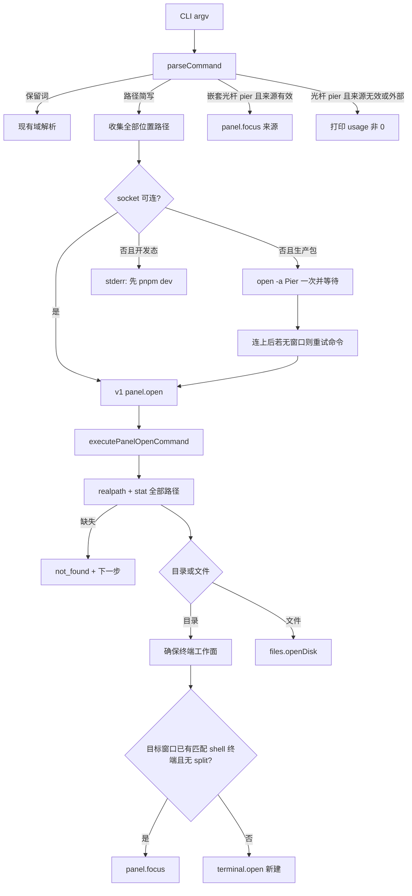
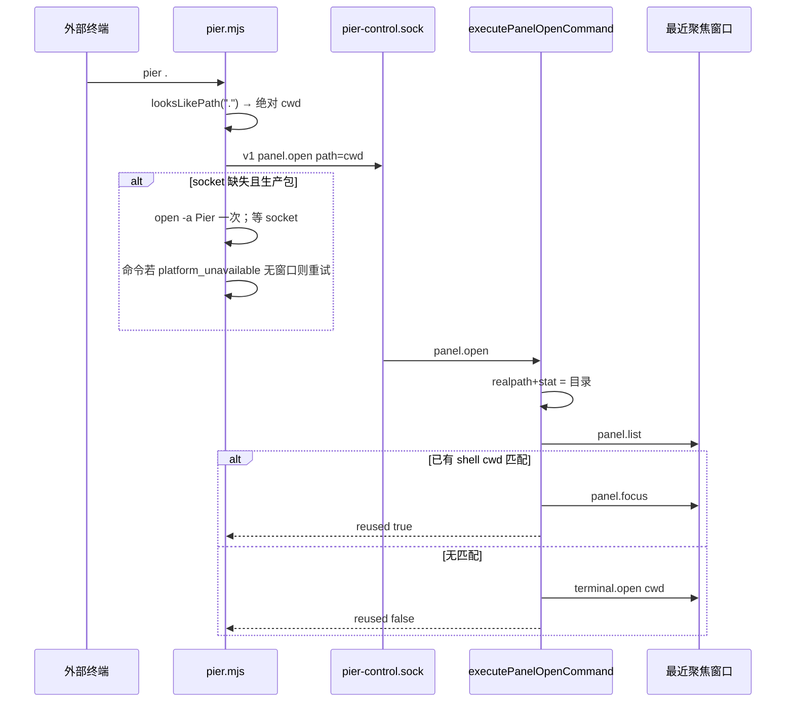
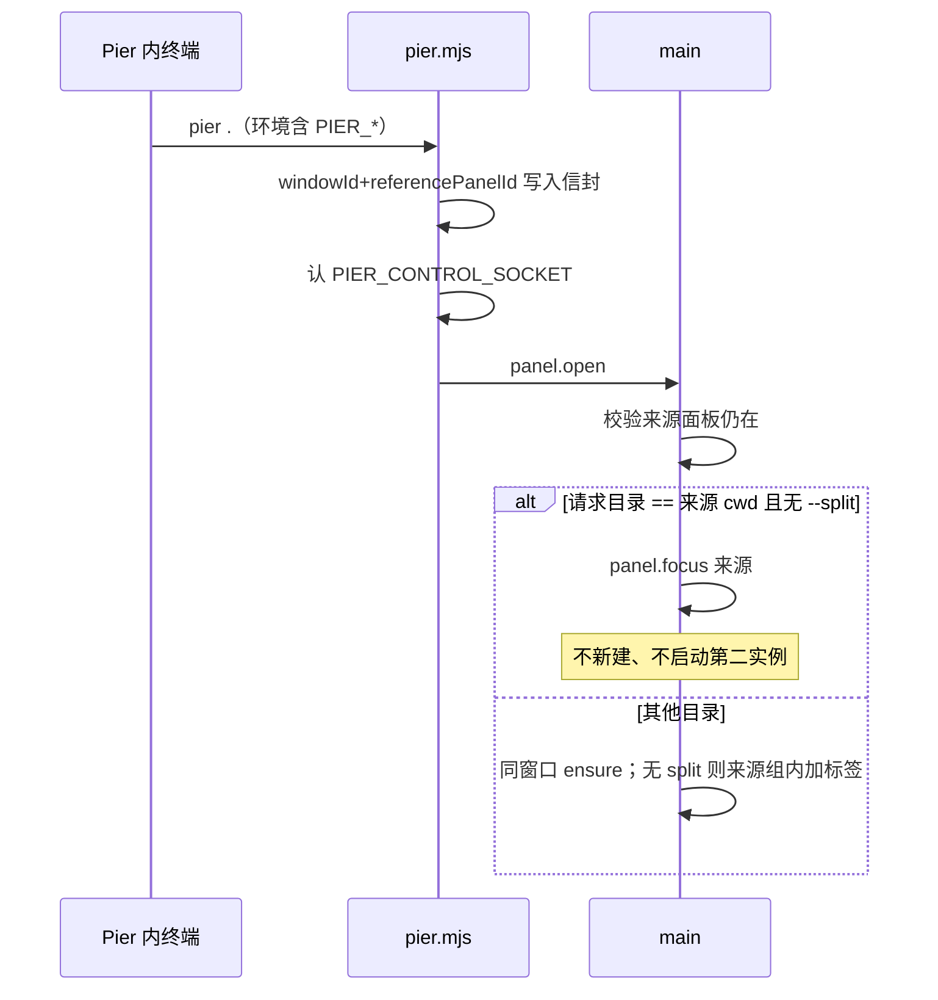
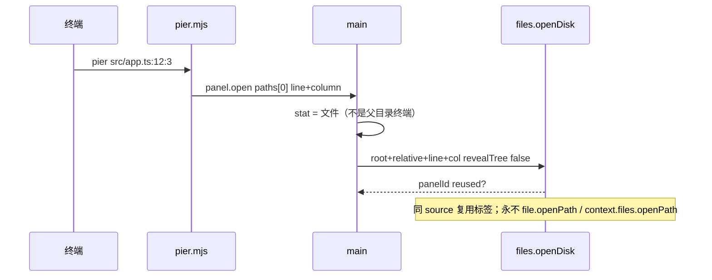

# CLI 路径简写与打开：目录工作面、文件编辑器、嵌套来源、生产包启动

| 字段 | 值 |
| --- | --- |
| 日期 | 2026-08-29 |
| 状态 | 已落地 |
| 产品 | Pier（Electron 43 本机 AI 工作台） |
| 作者 | 待填 |
| 分支 | `feat/fix-20260829` |
| 实现计划 | [`docs/superpowers/plans/2026-08-29-cli-path-open.md`](../plans/2026-08-29-cli-path-open.md) |
| 产品语义权威 | [Pier 本机 CLI 使用手册 Canvas](../../../.pier/canvases/pier-cli-user-manual/) |
| 传输权威 | [`2026-08-10-local-control-v1-v2-design.md`](./2026-08-10-local-control-v1-v2-design.md)（本文不改 v1/v2 帧） |

**层级：** 路径简写已 shipped。产品语义以手册 Canvas 为准；本文保留落地前基线与实现约束。禁止再把 `pier .` 写成暂未实现。

---

## 概述

用户期望 `pier .` / `pier <路径>` 像 `code .` 一样把当前目录或文件交给已经打开的 Pier，而不是报 `unknown pier CLI command`。Pier 的窗口模型是「一个窗口里多块路径锚点面板」，不是 VS Code 的「一个文件夹 = 一个窗口」。因此默认动作是：**复用最近聚焦的窗口**；目录确保一个终端工作面（已有则聚焦，没有再新建）；文件走 Files 编辑器（复用标签、支持 `:行[:列]`）。

本规格在现有本机控制通道（v1 `panel.open`）上补齐：路径简写语法、`stat` 分类、终端复用、嵌套 Pier 终端来源、以及生产安装包在 socket 缺失时先启动再重试。开发态（`pnpm dev` / 工作树 profile）不自动拉起。

---

## 背景与动机

### 落地前基线（已对当时代码核实；现行为见手册）

| 用户输入 | 实际 |
| --- | --- |
| `pier .` / `pier xx.ts` | `bin/pier-cli-parser.js` `parseCommand` 只认已知域，抛 `unknown pier CLI command` |
| `pier open .` | 解析为 v1 `{ type: "panel.open", path: <绝对路径> }` → `executePanelOpenCommand`（`src/main/app-core/commands/panel.ts`）`panelContexts.resolveForPath` → renderer `addPanelForCommand` **永远 `addTerminal()`**（`src/renderer/components/workspace/renderer-commands.ts`）。同 cwd 已有终端也会再开一块 |
| `pier open xx.ts` | 同样走 `panel.open`。`resolvePanelContextForPath` 在 `stat` 为文件时把 `cwd` 收成父目录，于是打开的是「父目录上的新终端」，不是编辑器 |
| `file.openPath` | OS `shell.openPath`（`src/main/app-core/commands/file.ts`）。macOS 上 `.ts` 常被当成 MPEG-TS。产品路径已有 `shouldNeverSystemOpen`（`src/shared/system-open-guard.ts`） |
| CLI 连接 | `bin/pier.mjs` 连 `pier-control.sock`。socket 不在就失败；**不会**启动应用 |
| 第二实例 | `src/main/index.ts` `requestSingleInstanceLock` 失败 → `abortMissingSingleInstanceLock`：开发态 stderr + `exit(1)`，生产包安静 `quit()`。**不转发路径** |
| 嵌套终端 | `withPanelStatusEnv` 注入 `PIER_PANEL_ID` / `PIER_WINDOW_ID` / 可选 `PIER_CONTROL_SOCKET`（`src/main/ipc/terminal/create-launch.ts`）。`agents start` 会读它们；`open` **不会**把它们当成 `windowId` / `referencePanelId` |
| `TERM_PROGRAM` | 宿主 spawn 会剥掉（`clean-env.ts` / `apply-host-env.ts`）。嵌套检测必须用 `PIER_*`，不能用 `TERM_PROGRAM` |
| 终端点路径 | Files 插件 `handleFilesTerminalOpenUrl` + 宿主 `openFilesDiskPath`（`src/renderer/lib/files/open-disk-file-panel.ts`）已复用同 source 标签并支持 `:line[:col]` |

产品 CLI 的定位是「控制已运行的 Pier」（手册 Canvas / local-control 金标准）。窗口是 dockview 工作台，一块窗口里可以同时放多个项目的终端。

痛点：从 iTerm 进仓库敲 `pier .` 失败；在 Pier 终端里再敲 `pier open .` 会堆出重复终端；想打开 `foo.ts` 既没有命令，又会误开父目录终端。

---

## 目标与非目标

### 目标

1. 支持 `pier .` / `pier <路径>` 作为路径简写；目录语义与 `pier open <目录>` 对齐（落地后二者共用「确保工作面」）。
2. 目录：目标窗口内若已有匹配的普通终端则聚焦；否则新建。不复制 VS Code「本文件夹变成新窗口」。
3. 文件：在 Pier Files 编辑器打开（复用标签、`:行[:列]`），策略与终端点击同一条，**禁止**当「父目录终端」打开。
4. 混合参数：`pier . src/app.ts` 既确保目录工作面，又打开文件。
5. 嵌套（`PIER_PANEL_ID` + `PIER_WINDOW_ID` 仍有效）：默认当前窗口；新建且无 `--split` 时在来源组内加标签（dockview `within`）；有 `--split` 才按该方向相对来源面板拆分。同工作目录的 `pier` / `pier .` 只聚焦、不新建，不再开窗口、不 `open -a Pier`。
6. 生产安装包：socket 缺失时启动 Pier 再重试。开发态保持「必须先跑起来」。
7. 缺路径：报错并给出下一步；不静默建空文件。
8. 源码/文本路径永不落到 macOS 默认应用（沿用 `shouldNeverSystemOpen`）。

### 非目标

- `--new-window` 作为默认或本落地必做（除非某一 PR 里加开关成本接近零；默认仍复用最近聚焦窗口）。
- 自动打开 Files 树（布局噪音）。树跟随终端的项目锚点，用户自己打开。
- 开发态自动 `pnpm dev`。
- 封装各智能体原生 CLI（`agents.invoke` 仍是 non-goal）。
- 新增 `pier files` / `pier git` 命令组（`tests/unit/cli/no-files-git-cli-governance.test.ts`）。
- 改 v1/v2 传输帧、peer 校验或 `cli-human` 主体模型。
- 把第二实例改成「把 argv 当 open」的主路径（自动启动只负责把应用拉起来，命令仍走 socket）。

---

## 已关闭的产品决议

下列决议已定，实现时不得再争议。编号 1–14 来自产品意图；15 起是对照代码后的实现细则。

| # | 决议 |
| --- | --- |
| 1 | 支持 `pier .` / `pier <路径>` 路径简写。目录意图与 `pier open <路径>` 相同。 |
| 2 | 不复制 VS Code「本文件夹 = 本窗口」。默认复用最近聚焦窗口。 |
| 3 | 目录 → **确保一个终端工作面**：目标窗口内已有匹配则聚焦，否则新建。不要重复堆终端。 |
| 4 | 文件 → Pier Files 编辑器（复用标签、`:行[:列]`），与终端点击同一策略。`pier foo.ts` 绝不是「打开父目录终端」。 |
| 5 | 混合 `pier . src/app.ts`：既确保目录工作面，又打开文件。 |
| 6 | 嵌套且 `PIER_PANEL_ID` + `PIER_WINDOW_ID` 有效：默认当前窗口。新建且无 `--split` → `referencePanelId` + dockview `within`（来源组里加标签，不是隐式拆分）。有 `--split` → 按该方向相对来源面板拆分。同项目/同工作目录的 `pier` / `pier .` 只聚焦本窗口。不开第二窗口，不 `open -a Pier`。 |
| 7 | 显式 `pier terminal open` **永远新建**（逃生舱）。复用只作用于路径简写和 `pier open <目录>`。 |
| 8 | 打开**目录**时不创建 Files 树面板、不调 `openProjectFiles`。CLI 打开**文件**只出编辑器标签：`files.openDisk` 传 `revealTree: false`，不展开侧栏树（Git 审查 / LSP 点击仍走现有揭示）。 |
| 9 | 生产安装包：socket 缺失则启动再重试。开发态（`pnpm dev` / 工作树 profile）不自动拉起。 |
| 10 | `--new-window` 不是默认，也不进首批落地 PR（除非加开关成本接近零）。保留现有 `--window` / `--split` / `--no-focus`。 |
| 11 | 首词保留词仍是命令（`status`、`open`、`terminal`、`windows`、`panels`、`worktrees`、`tasks`、`plugins`、`preferences`、`agents`、`notifications`、`snapshot`、`watch`，以及日后同类域）。文件夹名叫 `status` 时写 `pier ./status` 或 `pier open status`。 |
| 12 | 路径不存在：报错 + 下一步文案。不静默创建空文件。 |
| 13 | 源码/文本路径永不落到系统默认应用（`.ts` → MPEG-TS）。 |
| 14 | 不封装原生智能体 CLI。本能力是宿主独有：文件面板和 dockview 只存在于 Pier。 |
| 15 | **复用键：** 仅在**目标窗口**内匹配。候选必须是普通 shell 终端。排除（任一即跳过、新建 shell）：① 导出的 `toLocator` 会标成 `agent`（`agentIdFromParams(params) ?? agentRuntimeIndex`，与 `terminal.list` 相同）；② `peekTerminalPanelAgent(target.window.recordId, panelId)` 非 null（running **或** exited，覆盖已结束仍保留的智能体标签）；③ `params.task` 或会话 `task`（同一 store：`windows[recordId].panels[panelId].task`）。**不要**读 `tab.role`——`panelTabChromeSchema` 没有该字段，`panel.list` 快照表达不了终态 role。不要只读 `params.agentId`。`agentIdFromParams` / `toLocator` 从 `terminal-control.ts`（约 255 行，抽得出）**导出**给 `panel-open.ts` 用，禁止再复制一份。匹配 cwd：`peekTerminalPanelContext(target.window.recordId, panelId)?.cwd`（第一个参数是 `WindowInfo.recordId`，即 `handleTerminalCwdChange` 里的 `windowRecordIdFor`；**不是** `WindowInfo.id`，也不是 `PIER_WINDOW_ID`）。没有再退回 snapshot `context.cwd`。比较 `realpath`。不要用 `projectRootPath` / `worktreeRoot` 当键。 |
| 16 | **嵌套 socket：** 终端注入的是 `PIER_CONTROL_SOCKET`（`withPanelStatusEnv`），CLI 今天只认 `PIER_CONTROL_SOCKET_PATH`（`bin/pier.mjs` `resolveSocketPath`）。落地时两者都认，且 `PIER_CONTROL_SOCKET` 优先于按 cwd 爬 `.pier-dev/profile.json`，避免嵌套里连到另一份 userData。 |
| 17 | **能力与命令形状：** 不把 `file:read` 加进 `cli-local` 默认表。路径打开继续走 `panel.open` + `workspace:open`。renderer 指令 `files.openDisk` **不是** `PierCommand`，也不是 `pier files` 域。禁止调用 PierCommand `file.openPath` 与插件 `context.files.openPath`（二者都是 OS `shell.openPath`）。 |
| 18 | `pier open <文件>` 与简写同一套分类：文件进编辑器，不再把父目录当终端 cwd。 |
| 19 | 先对全部路径 `stat`，任一缺失则整句失败、不改布局。 |
| 20 | 生产自动启动首批只做 **macOS** `open -a Pier`（不带业务 argv）。Linux/Windows 保持「应用必须已运行」。 |
| 21 | 嵌套下光杆 `pier`（无路径、无域）→ 聚焦来源窗口 + 来源面板。外部光杆 `pier` 仍打印 usage / 非 0（与今天一致）。 |
| 22 | `--split` 出现时目录路径**强制新建**（与复用互斥）。文件仍走编辑器；`--split` 只影响**新建**文件标签的放置（复用已有编辑器标签时忽略）。嵌套同目录且无 `--split`：只聚焦、不新建。 |
| 23 | **线协议在 PR1 一次定死：** `paths: Array<{ path: string; line?: number; column?: number }>`，且 `path`（字符串）= `paths[0].path` 给旧日志。解析器剥掉 `:行[:列]` 后把数字放进对象，**不要**把带后缀的字符串送进信封（zod 会丢掉未知字段）。 |
| 24 | **打包 CLI 不 import `src/`。** `bin/pier-cli-path.js` 只实现 argv 用的 `:行[:列]` 剥离（1-based、`C:` 守卫），用单测锁与 `parseTerminalPathLocation` 的 **argv 用例**对齐；不复用它的引号/散文标点解包。新 `bin/pier*.js` 必须写进 `electron-builder.yml` `extraResources`。 |

---

## 提议设计

### 总流程



路径打开仍走 **v1** 一问一答（local-control §3.4「open 路径」）。不新开 v2 op。

### 解析器语法

入口仍是 `parseCommand`（`bin/pier-cli-parser.js`）。今日 `stripOptions` 后只解构五个位置参数，无法承载 `pier . a.ts b.ts`。路径简写必须拿走 **全部** 剩余位置参数。

**保留词（首词完全相等才是命令，大小写敏感）：**

`status` · `snapshot` · `watch` · `open` · `terminal` · `windows` · `panels` · `worktrees` · `tasks` · `plugins` · `preferences` · `agents` · `notifications`

抽出为 `PIER_CLI_RESERVED_COMMANDS` 常量（解析与单测共用）。`files` / `git` / `terminals` **不是**保留词，也不要变成域。

**「像路径」判定（按顺序，命中即路径简写）：**

1. `.` 或 `..`
2. 以 `./`、`../`、`/`、`~/` 开头
3. 含 `/`（POSIX；Windows 盘符不在首批）
4. 去掉 `:行[:列]` 后缀后，最后一段含 `.` 且不是保留词（`foo.ts`、`.env`）。`Dockerfile` **没有**点号，不走本条，只靠第 5 条存在性。
5. 展开 `~` 并 `resolve(cwd, token)` 后，`fs.existsSync` 为真（文件或目录）。cwd 下名为 `files` / `git` 的文件夹因此会走路径简写（它们不是保留词）。

未命中 → 继续今日的 `unknown pier CLI command`（避免把 `pier stauts` 这类拼写错误收成「缺路径」）。

**`:行[:列]`（argv 子集，不 import `src/`）：** 打包 CLI 是 extraResources 里的独立脚本，不能 `import` `src/shared/terminal-local-path.ts`。`bin/pier-cli-path.js` 自己实现 argv 剥离：

- 匹配 `^(.*?):(\d+)(?::(\d+))?$`；行/列 1-based 正整数。
- `C:` 盘符守卫与 `parseTerminalPathLocation` 相同（不要把 `C:` 当行号）。
- **不要**复用共享函数的引号/反引号/散文标点解包——argv token 已经是壳层拆好的参数。
- 单测锁：`app.ts:12:3`、`app.ts:12`、`C:` 守卫、相对/绝对路径。与共享函数的 argv 用例对齐，不对散文用例。

剥完后缀、**再**展开 `~`、再 `absolutePath`。`~` 与 `~/…` 用 `os.homedir()` 替换（`resolve(cwd, "~/proj")` 会得到 `$cwd/~/proj`，今日 parser 也没有展开；未加引号时壳层会先展开，加引号的 `'~/proj'` 与 `--print-envelope` 测试必须覆盖）。

**`pier open`：** 保留词 `open` 之后的位置参数全部当路径目标（今日只吃一个，多一个就 `unexpected`）。落地后 `pier open . src/a.ts` 与 `pier . src/a.ts` 同构，都进 `paths` 对象数组。

**嵌套来源注入（解析期，便于 `--print-envelope`）：**

与 `terminal.open` 对齐，用 `windowId` + `referencePanelId`，不新增 `windowIdSource`（zod 会剥未知键）。

- 有 `--window`：只把 flag 写入 `windowId`，**不要**写 `referencePanelId`（避免陈旧 env 把错误 `--window` 降级成「假装成功」）。
- 无 `--window` 且 env 两项都在：两者都写入。main 用 `resolvePathOpenWindow`：窗口找不到且存在 `referencePanelId` → 当作陈旧嵌套来源，降级最近聚焦。
- `--reference-panel` 今日只存在于 `terminal open`；路径简写不新发明该 flag。嵌套无 `--split` 的新建仍用来源面板做 `within` 锚点。

**歧义表**

| 输入 | 判定 | 理由 |
| --- | --- | --- |
| `pier status` | 命令 `app.status` | 保留词优先，即使 cwd 下有名为 `status` 的文件夹 |
| `pier ./status` | 路径 | `./` 规则 |
| `pier open status` | `panel.open` 路径 `resolve(cwd, "status")` | 域是 `open` |
| `pier .` | 路径，cwd | `.` |
| `pier ..` | 路径，父目录 | `..` |
| `pier src/app.ts` | 路径 | 含 `/` |
| `pier app.ts` | 路径 | 扩展名 |
| `pier app.ts:12:3` | 路径 + line=12 column=3 | argv 子集剥离；见下方 `--print-envelope` |
| `pier '~/proj'` | 路径，home 展开 | parser `homedir()`，不依赖壳层 |
| `pier Dockerfile` 且 cwd 有该文件 | 路径 | 存在性（无点号，不是扩展名规则） |
| `pier nosuchdir` | **未知命令** | 无 `/`、无扩展名、磁盘上不存在 → 当拼写错误，不装成缺路径 |
| `pier ./nosuchdir` | 路径 → 主进程 `not_found` | 用户明确写了路径 |
| `pier nosuch.ts` | 路径 → 主进程 `not_found` | 扩展名表示文件意图 |
| `pier . src/a.ts README.md:10` | 三个 `paths` 项，第三项带 line | 混合 |
| `pier terminal open` | 永远新建终端 | 逃生舱 |
| `pier`（外部） | 打印错误 + usage，退出 1 | 与今天一致（catch 里两者都打） |
| `pier --json`（外部） | 同上，usage 仍打到 stderr | 无命令可执行 |
| `pier`（嵌套且来源有效） | `panel.focus` 来源；不进 usage catch | 决议 21 |
| `pier --json`（嵌套且来源有效） | 执行 `panel.focus`，stdout JSON | 见信封示例 |
| `pier --print-envelope`（嵌套且来源有效） | 只打印 `panel.focus` 信封 | 不连 socket |
| `pier --no-focus`（嵌套且来源有效） | `panel.focus` 且 `focus: false` | 不抢前台 |
| `pier --window X`（嵌套、无路径，X 存在） | `window.focus` X | 显式窗口压过来源 |
| `pier`（嵌套但来源窗口/面板已无） | 与外部光杆相同：usage，退出 1 | 不假装聚焦；路径简写的陈旧 env 才降级 |

`bin/pier-cli-parser.js` 已 1222 行（`check:file-size` **不扫** `bin/`，抽出是卫生，不是 500 行门禁）。抽出 `bin/pier-cli-path.js`：`RESERVED`、`looksLikePathToken`、`parsePathLocationToken`、`expandHome`、`parsePathOpenArgs`。`parseCommand` 只多两路分支。该文件必须列入 `electron-builder.yml` `extraResources`（与 `pier-cli-parser.js` 同级），否则安装包里 `import "./pier-cli-path.js"` 会模块缺失。

`usage()`：**PR1 只加目录简写**（`pier .` / `pier open <目录>`），**不要**写 `pier <文件>`，直到 `files.openDisk` 已接线（PR3 或并入 PR1 的编辑器骨架完成之后）。Canvas shipped / 60 秒上手在代码落地前不得抄 `pier .`。

`--print-envelope` 锁定（`pier a.ts:12:3 --print-envelope --json`，cwd=`/Users/me/proj`）：

```json
{
  "protocol": "v1",
  "json": true,
  "envelope": {
    "protocolVersion": 1,
    "command": {
      "type": "panel.open",
      "path": "/Users/me/proj/a.ts",
      "paths": [{ "path": "/Users/me/proj/a.ts", "line": 12, "column": 3 }]
    }
  }
}
```

嵌套光杆 `pier --print-envelope --json`（`PIER_WINDOW_ID=3`，`PIER_PANEL_ID=terminal-1`）：

```json
{
  "protocol": "v1",
  "json": true,
  "envelope": {
    "protocolVersion": 1,
    "command": {
      "type": "panel.focus",
      "panelId": "terminal-1",
      "windowId": "3"
    }
  }
}
```

带 `--no-focus` 时信封加 `"focus": false`。

### `stat` 分类（主进程，解析之后）

解析器只负责「这是路径还是命令」和绝对化。目录 vs 文件必须在主进程对 **realpath 之后** 的路径 `stat`：

| `stat` | 行为 |
| --- | --- |
| 目录（含 symlink→目录） | 确保终端工作面；`cwd` = 该目录 |
| 文件（含 symlink→文件） | Files 编辑器。`panel-open.ts` **直接 import** `resolvePanelContextForPath`（`pathKind: "file"`, `source: "cli"`）。不要走 `panelContexts.resolveForPath`——它只接受 path，且内部 `resolvePanelContextForPath(path, {}, control)`，写不进 `pathKind` / `source`。PR1 硬门槛：文件 **禁止** `addTerminal(dirname)`；编辑器未接线时返回 `unsupported` + 下一步，而不是父目录终端 |
| 不存在 | `not_found`；文案带下一步；**不** `writeFile` |
| 存在但既非文件也非目录（fifo/socket） | `invalid_command`：不是可打开的文件或目录 |
| 权限拒绝 | `permission_denied` / `platform_unavailable`，message 含路径 |

跟随 symlink（与 `resolvePanelContextForPath` 的 `fs.realpath` 一致），复用比较也用 realpath，避免 `foo` 与 `foo/` 与经 symlink 的同一目录打开两块终端。

`resolvePanelContextForPath`（`src/main/services/panel-context-resolver.ts`）已有：文件 → `cwd = dirname(openedPath)`，`projectRootPath = gitRoot ?? cwd`。编辑器打开用 `openedPath` + `projectRootPath` 算相对路径，**不要**把这个 `cwd` 拿去 `addTerminal`。

先 `stat` 全部路径，全部合法再改布局（决议 19）。

### 窗口与嵌套来源

`resolveCommandWindow`（`src/main/app-core/window-routing.ts`）在传入 `windowId` 时**找不到就失败**，没有降级。路径打开**不得**改这个全局函数（会改变所有 `--window`）。在 `panel-open.ts` 写本地：

```ts
function resolvePathOpenWindow(
  command: Extract<PierCommand, { type: "panel.open" }>,
  services: PanelCommandServices
) {
  if (!command.windowId) {
    return resolveCommandWindow(undefined, services, {
      requireStableDefault: true,
    });
  }
  const hit = resolveCommandWindow(command.windowId, services);
  if (hit.window) {
    return hit;
  }
  // 仅当带着 referencePanelId（嵌套 env 注入）时降级；纯 --window 找不到仍失败
  if (command.referencePanelId) {
    return resolveCommandWindow(undefined, services, {
      requireStableDefault: true,
    });
  }
  return hit;
}
```

显式 `--window` 且不带来源面板：找不到就是 `not_found`。无 `--window` 的嵌套：parser 同时写入 `windowId` + `referencePanelId`，窗口已消失则降级最近聚焦。`agents start` 继续硬失败，不要复用本函数。

边角：用户写 `pier . --window stale-id` 且仍在 Pier 终端里（env 也有 panel id）。按上表「flag 权威」应失败。因此 parser 在存在 `--window` 时 **不要** 写 `referencePanelId`，以免误降级。

窗口 id 仍同时认内部 id、`PIER_WINDOW_ID`（Electron `BrowserWindow.id` 数字串）、record UUID。

**嵌套校验：**

1. 来源面板仍在目标窗口的 `panel.list` 里才保留 `referencePanelId`。
2. 路径简写：来源失效 → 降级最近聚焦窗口，整句不失败。
3. 光杆 `pier`：来源失效 → **usage，退出 1**（与外部空 argv 相同），不降级聚焦。
4. 不要用 `TERM_PROGRAM`。

**嵌套光杆 `pier`：** 来源有效 → `panel.focus`（可选 `focus: false`）。成功 JSON：`{ windowId, panelId, reused: true }`。不要经过 `unknown pier CLI command` 的 catch（否则会多打一份 usage）。

**同工作目录只聚焦、不新建：** 请求目录 realpath === 来源面板活 cwd realpath，且无 `--split` → 只聚焦来源窗口/面板，不 `terminal.open`。

**同项目光杆 `pier`：** 不解析 cwd，只聚焦来源（决议 6 / 21）。用户在子目录 `cd` 之后敲光杆 `pier` 仍回到这块终端；确保子目录工作面是 `pier .` 的事。

### 目录：确保工作面

伪代码（实现放进新文件，见密度）：

```ts
async function ensureDirectoryTerminal(args: {
  dir: string; // realpath
  windowId: string;
  referencePanelId?: string;
  placement?: PierCommandPlacement;
  focus?: boolean;
}): Promise<{ panelId: string; reused: boolean; context: PanelContext }> {
  const context = await resolvePanelContextForPath(args.dir, {
    source: "cli",
  });
  if (!args.placement) {
    const match = findMatchingShellTerminal(args.windowId, args.dir);
    if (match) {
      await focusPanel(match.panelId, args.windowId, args.focus);
      return { panelId: match.panelId, reused: true, context };
    }
  }
  // 无匹配或显式 --split → terminal.open（永远新建）
  // 无 placement 时：嵌套带 referencePanelId → dockview within（同组标签）
  return await openNewShellTerminal({ ...args, context });
}
```

**匹配：**

- 范围：目标窗口（`listPanels({ windowId })`）。
- 候选：`isTerminalComponent`（与 `terminal-control.ts` 相同）。
- **排除（不是 shell 工作面 → 跳过，视为无匹配，新建 shell）。** 从 `terminal-control.ts` **导出** `agentIdFromParams` 与 `toLocator`，不要复制。任一为真即排除：
  1. `toLocator(panel, indexAgentByPanel).role === "agent"`（活体：params 嵌套 / runtime index）。
  2. `peekTerminalPanelAgent(target.window.recordId, panel.id)` 非 null（running 或 exited）。
  3. `params.task` 有值，或会话 `windows[recordId].panels[panelId].task` 有值。
  禁止读 `tab.role` / 终态 chrome role（schema 没有该字段）。
- **活 cwd：** `peekTerminalPanelContext(target.window.recordId, panel.id)?.cwd` ?? 快照 `context.cwd`。`recordId` 来自 `resolvePathOpenWindow` 得到的 `WindowInfo`。用 env/`command.windowId`/`WindowInfo.id` peek 会得到 `null`，匹配会静默退回落后的 snapshot。无 cwd 则不当匹配（不要退回 `projectRootPath`）。
- 键：`realpath(cwd) === realpath(dir)`。
- 多块匹配：选 `active` 的；否则列表先出现的。单测锁顺序。
- 单测硬锁：① 活体智能体 cwd = 请求目录 → 不复用；② 已退出仍保留的智能体标签（`peekTerminalPanelAgent` 非 null、index 已无）→ 不复用；③ peek 必须用 `recordId`（用错键则用例会落到 snapshot 路径，应失败）。

`--split`：跳过复用，`terminal.open` + `placement` + `referencePanelId`（嵌套时为来源面板，否则为窗口当前 active）。

无 `--split` 的嵌套新建：`referencePanelId` + **不传** `placement`，沿用 `addTerminal` 的 `direction: "within"`（来源组加标签）。不要猜一个默认拆分方向。

实现时 **不要** 再走 renderer `panel.open` → `addTerminal` 这条「只增不复用」的路。主进程改为：

- 复用：已有 `panel.focus`
- 新建：已有 `executeTerminalOpenCommand` / renderer `terminal.open`

renderer `panel.open` 可暂时留作创建别名，但 `executePanelOpenCommand` 不再调用它。`worktree.open` 已委托 `executePanelOpenCommand`，会自动继承复用——这是期望（两次打开同一工作树应聚焦，而不是堆终端）。

`src/main/app-core/commands/panel.ts` **已满 500 行**。复用逻辑必须抽到例如 `src/main/app-core/commands/panel-open.ts`（或 `ensure-directory-terminal.ts`），`panel.ts` 只留转调。

### 文件：编辑器打开链（扩展，不是原样调用今日的 `openFilesDiskPath`）

**禁止**新造第二条产品 CLI 域。禁止调用 PierCommand `file.openPath` 与插件 `context.files.openPath`（都是 OS `shell.openPath`）。

今日的 `openFilesDiskPath` **不能满足**本规格：返回 `boolean`（填不出 `panelId` / `reused`）、`PluginPanelInstanceOptions` 没有 `placement` / `referencePanelId`、成功时 `notifyFilesDiskPathOpened` 会走 `registerFilesDiskOpenTreeReveal` 展开侧栏树、`false` 同时表示路径非法与 Files 未注册。

因此：扩展 `openFilesDiskPath`，或为 `files.openDisk` 写薄包装（推荐包装，以免 Git 审查 / LSP 行为被 CLI 拖走）：

```ts
type OpenFilesDiskPathResult =
  | { ok: true; panelId: string; reused: boolean }
  | {
      ok: false;
      reason: "invalid-path" | "files-unregistered" | "open-failed";
    };

function openFilesDiskPathForCommand(input: {
  path: string;
  root: string;
  line?: number;
  column?: number;
  context?: PanelContext;
  placement?: PierCommandPlacement;
  referencePanelId?: string;
  revealTree?: boolean; // CLI 必须 false
}): OpenFilesDiskPathResult;
```

- `revealTree: false`：不要 `notifyFilesDiskPathOpened`，或通知时带旗标让 `registerFilesDiskOpenTreeReveal` 跳过。CLI 不展开侧栏树、不 `openProjectFiles`。
- `placement` / `referencePanelId`：仅 **新建** 实例时生效；复用已有 `pier.files.filePanel` 同 source 标签则忽略。宿主 `openPluginPanelInstance` 今日只有 `targetGroupId`，需要按 `addTerminal` 同款把 dockview `position`（`within` / `right` / …）接进插件面板打开，或 `files.openDisk` 处理器自己算 group 再传 `targetGroupId`。
- `ok: false` 映射：`files-unregistered` → `platform_unavailable`；`invalid-path` → `invalid_command`；`open-failed` → `platform_unavailable`。不要猜 `boolean`。

主进程分类为文件后：

1. `context = resolvePanelContextForPath(abs, { pathKind: "file", source: "cli" })`（`panel-open.ts` 直接 import）。
2. `diskTargetPartsForAbsolute(abs, context)` 得到 `{ root, relativePath }`。
3. renderer 命令 `files.openDisk`（须加入 `shouldFocusRendererWindow` 的 exhaustive `switch`，与 `panel.open` 一样认 `command.focus ?? true`）：

```ts
z.object({
  type: z.literal("files.openDisk"),
  root: z.string().min(1),
  path: z.string().min(1),
  line: z.number().int().positive().optional(),
  column: z.number().int().positive().optional(),
  context: panelContextSchema.optional(),
  focus: z.boolean().optional(),
  placement: pierCommandPlacementSchema.optional(),
  referencePanelId: z.string().min(1).optional(),
  revealTree: z.literal(false),
  windowId: z.string().min(1).optional(),
});
```

4. 处理器调用扩展后的打开函数；把 `{ panelId, reused }` 写回 v1 `data`。Files 未注册 → `platform_unavailable`。
5. 守卫：`files.openDisk` 路径上 **不得**调用 `file.openPath` 或 `context.files.openPath`。`shouldNeverSystemOpen` 命中的扩展名同样禁止任何 OS 打开。

`cli-local` 能力保持 `workspace:open`。不要加 `file:read`。

### 混合路径

`pier . src/app.ts README.md:10`：

1. 解析三个目标（目录、文件、文件+行）。
2. `stat` 全过。
3. 按 argv 顺序：先确保 `.` 的终端，再打开两个文件。
4. `--split` 只作用于**新建**的目录终端（或新建的文件标签）；已复用的不管。
5. `--no-focus`：全部 `focus: false`；默认聚焦最后一个目标（与「用户刚请求的东西出现在前」一致）。单测锁这条。

### 响应 JSON（v1 信封不变）

今日成功 `data`（renderer）：`{ context, panelId }`。

兼容策略：

```ts
{
  windowId: string,
  panelId: string,          // 最后一个结果的 panelId（脚本若只读一个字段仍有值）
  reused?: boolean,         // 最后一个结果
  context?: PanelContext,   // 最后一个目录结果的 context；纯文件则可省略或给文件 context
  results: Array<
    | {
        kind: "terminal",
        path: string,
        panelId: string,
        reused: boolean,
      }
    | {
        kind: "file",
        path: string,
        panelId: string,
        reused: boolean,
        line?: number,
        column?: number,
      }
  >,
}
```

- `protocolVersion: 1` 不改。
- 旧脚本只读 `data.panelId` 仍然可用；复用时 `panelId` 是已有终端，不再是新 id。
- 失败：`{ ok: false, error: { code, message } }`。缺路径用 `not_found`。不要新错误码，除非现有 `PierCommandErrorCode` 表达不了（本功能用 `not_found` / `invalid_command` / `platform_unavailable` / `permission_denied` 足够）。

`--json` 人类摘要：沿用「成功可静默、失败 stderr」（local-control §15）。无 `--json` 时目录复用可打一行 `reused panel …`；不要把心跳写进 `--json` stdout。

### 嵌套 `pier .` / 外部 `pier .` / 打开文件







### 生产包：缺 socket 时启动再重试

放在 `bin/pier.mjs` 的连接层，**所有** v1/v2 命令共用（不只是 `open`）。抽出 `bin/pier-cli-launch.js`（`bin/` 无 500 行门禁，仍保持可读）。该文件列入 `electron-builder.yml` `extraResources`。

事实（与原文相反）：`src/main/index.ts` 在 `localControlRegistration.start()`（约 395 行）**之后**才 `restoreOpenWindows()` / `create({ mode: "fresh" })`。socket 可在**还没有任何 renderer 窗口**时就绪。`resolveCommandWindow` 此时返回 `no renderer window available`（`platform_unavailable`）。今日 v1 `request()` 超时 **5s**，可能在窗口出现前就放弃。

**判定开发态（任一即开发，禁止自动启动）：**

- cwd 向上找到 `.pier-dev/profile.json` 且含 `electronUserDataDir`
- 设置了 `PIER_USER_DATA_DIR` / `ELECTRON_USER_DATA_DIR` / `PIER_DEV_PROFILE`
- `PIER_CONTROL_SOCKET_PATH` / `PIER_CONTROL_SOCKET` 已显式指定（只等/报错，不 `open -a`）
- 源码调用：`node ./bin/pier.mjs` / `pnpm cli:dev`（`argv[1]` 不含 `.app/Contents/Resources/bin/`）

**判定生产包（不要只调 `looksLikePierAppCliTarget(process.argv[1])`）：**

该助手匹配的是安装包装的 `…/Contents/Resources/bin/pier`（`pier-app.sh` 目标）。实际脚本是 `ELECTRON_RUN_AS_NODE=1 exec MacOS/Pier …/bin/pier.mjs`，`argv[1]` 以 `/Contents/Resources/bin/pier.mjs` 结尾，助手对它返回 **false**。

生产判定（任一即生产）：

- `argv[1]` 规范化后以 `/Contents/Resources/bin/pier.mjs` 结尾；或
- `ELECTRON_RUN_AS_NODE=1` 且 `process.execPath` 在 `Pier.app/Contents/MacOS/Pier` 内；或
- `looksLikePierAppCliTarget` 对 **解析 symlink 后的 `argv[0]`/`$0`** 为真（用户敲 `pier` 包装脚本时）

**启动与等待（同一 15s 预算）：**

1. `open -a Pier` **一次**（不要 `-n`，不要 `--args` 业务路径）。禁止循环 `open`。
2. 轮询 socket：100–200ms。**仅此阶段**绕过默认 5s connect 超时（每次 connect 可短，总预算 15s）。命令一旦发出，恢复正常超时。
3. socket 连上后发原命令。**只在「还没有 renderer 窗口」时重试**：例如 CLI 侧 `window.list` 为空，或失败 `message` 为 `no renderer window available`。窗口一旦存在，**立即返回**该次命令结果——包括 Files 未注册、`open-failed` 等其它 `platform_unavailable`。不要对所有 `platform_unavailable` 自旋到 15s（启动路径是全部 v1/v2 命令共用的）。
4. `terminal.open` 的 renderer 超时是 20s，与 15s 启动预算分开：窗口已在之后走正常命令超时。
5. 已在跑但 socket 未听：不第二次 `open`，只等。
6. 不要改 `requestSingleInstanceLock` 当主路径。

**错误文案（人类 stderr，无 `--json`）：**

- 开发态连不上：说明先在本工作树运行 `pnpm dev`，再用 `pnpm --silent cli:dev`。不要暗示会自动编译。
- 生产超时：说明打开 Pier 应用，并检查「设置 → 终端」是否已安装 `pier` 命令。
- `--json` 失败：`platform_unavailable` + 英文 `message`（与现有 CLI 错误码风格一致，脚本稳定）。

**风险：** 工作树里敲的是 `/usr/local/bin/pier`（生产包）但用户其实在跑 `pnpm dev`。缓解：嵌套终端注入 `PIER_CONTROL_SOCKET`，CLI 优先用它；外部开发态靠 `.pier-dev/profile.json` 把 socket 指到 dev userData。手册 FAQ 写清：开发请用 `cli:dev`，避免连错实例。

### `--split` 与复用

| 场景 | 行为 |
| --- | --- |
| 外部 `pier .` 无 split，已有匹配 | 聚焦，`reused: true` |
| 外部 `pier .` 无 split，无匹配 | 新建；无 `referencePanelId` 时走窗口当前组 |
| 外部 `pier . --split right` | 强制新建并右拆，即使已有匹配 |
| 嵌套同 cwd，无 split | 只聚焦、不新建 |
| 嵌套其他目录，无 split | 同窗口新建，来源组内加标签（`within`） |
| 嵌套同 cwd，`--split below` | 相对来源向下拆分新建 |
| `pier terminal open --cwd .` | 永远新建（决议 7） |
| `pier open .` 落地后 | 与 `pier .` 相同（含复用） |

### i18n 与用户文案

- **成功：** 面板出现即是强 UI，**不要**再 toast（操作反馈规范）。
- **失败主路径：** CLI stderr + v1 `error`。renderer 不要再弹一条重复 toast。
- **Node CLI（`bin/`）：** 今日 parser 抛英文、`formatPanelList` 已有中文。不把 i18next 引进 CLI。`--json` 的 `error.message` 保持英文、稳定；无 `--json` 的下一步可用中文（与现有面板列表摘要一致）。
- **若** renderer 必须提示（`openFilesDiskPathForCommand` 的 `ok: false`）：走 locale，禁止业务文件内联中英文用户串。建议键（仅当真正需要 UI 时才加）：
  - `files.notifications.cliOpenFailed`（Files 插件 locale）
  - 不要用 `toast.*(…, { description })`；有技术细节用 `showAppAlert`。
- 缺路径英文 message 示例：`path not found: /abs/foo.ts. Pier does not create files. Create it first, then retry.`
- 中文人类摘要示例：`找不到路径 /abs/foo.ts。Pier 不会代为创建文件，请先创建后再试。`

手册 Canvas / README 是用户文案：用「智能体」「工作树」、git 小写；不要写选区、上下文、renderer、耐久性等实现词。本规格作为工程文档可以使用实现词。

---

## 接口变更

### CLI（人类）

落地后：

```text
pier <路径> [路径…] [--window <id>] [--split right|left|below|above] [--no-focus] --json
pier open <路径> [路径…] [--window <id>] [--split …] [--no-focus] --json
```

手册 Canvas 已 shipped：60 秒上手教 `pier .`；`pier open` 与路径简写共用同一套规则。

### `PierCommand` `panel.open`（向后兼容扩展；PR1 一次定死）

`src/shared/contracts/commands.ts` 现 473 行，对象数组 + `superRefine` 可能顶到 500。必要时把 schema 抽到 `src/shared/contracts/panel-open-command.ts` 再并入 discriminatedUnion。

```ts
const panelOpenPathSchema = z.object({
  path: z.string().min(1),
  line: z.number().int().positive().optional(),
  column: z.number().int().positive().optional(),
});

z.object({
  type: z.literal("panel.open"),
  focus: z.boolean().optional(),
  /** 兼容旧客户端与日志：等于 paths[0].path */
  path: z.string().min(1).optional(),
  paths: z.array(panelOpenPathSchema).min(1).optional(),
  placement: pierCommandPlacementSchema.optional(),
  windowId: z.string().min(1).optional(),
  referencePanelId: z.string().min(1).optional(),
}).superRefine((value, ctx) => {
  if (!value.path && !value.paths) {
    ctx.addIssue({ code: "custom", message: "panel.open requires path or paths" });
  }
});
```

旧客户端只发 `path` 仍然合法（视为单目录/单文件、无行列）。CLI 始终填 `paths`，并设 `path: paths[0].path`。**不要**把 `:12:3` 留在字符串上指望 main 再剥——PR1 的 `--print-envelope` 单测锁死对象形状。

能力不变：`workspace:open`。`cli-local` 已有该能力。

### Renderer 命令

新增 `files.openDisk`（仅宿主 IPC）。`renderer-commands.ts` 增加分支；`src/main/services/renderer-command-service.ts` 的 `shouldFocusRendererWindow` 必须加 case（exhaustive `never`，漏了会编译失败）。`command-router` 不必为它新增 `PierCommand`。

`panel.open` renderer 分支可保留，但 main 的 ensure 路径改调 `terminal.open` / `panel.focus` / `files.openDisk`。

### 环境变量

| 变量 | 角色 |
| --- | --- |
| `PIER_WINDOW_ID` | 默认 `--window`；须 main 再校验 |
| `PIER_PANEL_ID` | 默认 `referencePanelId` / 光杆聚焦目标 |
| `PIER_CONTROL_SOCKET` | 与 `PIER_CONTROL_SOCKET_PATH` 同义；**优先** |

---

## 数据模型变更

无持久化 schema 迁移。`panel-context-state.json` 的 recent 列表仍由 `recordRecent` 更新（打开或 OSC 7）。

复用读取的是活面板快照，不是 recent 列表。recent 不得当「是否已有终端」的权威。

---

## 考虑过的替代方案

| 方案 | 做法 | 优点 | 缺点 | 结论 |
| --- | --- | --- | --- | --- |
| A. VS Code 文件夹即窗口 | `pier .` 新窗口，cwd = 该文件夹 | 习惯迁移成本低 | 与 Pier「一窗多锚点」冲突；多项目会窗口爆炸 | **拒绝**（决议 2） |
| B. 永远新建终端（现状） | `panel.open` → `addTerminal` | 实现简单、可预测 | 嵌套/重复 `pier open .` 堆终端 | **拒绝**（决议 3） |
| C. 确保工作面（本规格） | 匹配则聚焦，否则新建；文件走编辑器 | 对齐产品窗口模型；逃生舱仍在 `terminal open` | 匹配键必须精确，否则误复用或仍重复 | **采纳** |
| D. 只文档化 `pier open`、拒绝 `pier .` | 教育用户 | 零代码 | 用户就是要 `code .` 肌肉记忆；`pier foo.ts` 仍无解 | **拒绝**（决议 1） |

另外拒绝：给 CLI 加 `pier files open` 域（治理禁止 files/git 命令组；走 `panel.open` 分类 + `files.openDisk`）。

---

## 安全与隐私

| 威胁 | 缓解 |
| --- | --- |
| 任意路径打开 / 读内容 | CLI 仍是本机 peer `cli-local`；`authorizeCommand` 不变。打开走 `workspace:open`，不授权 `file:read`/`file:write`。不把文件内容塞进 CLI 响应。 |
| 用 CLI 创建文件 | 缺失即失败；无 `writeFile`。 |
| 路径穿越 | 先 `resolve` + `realpath`；编辑器相对路径由 `diskTargetPartsForAbsolute` / `openFilesDiskPath` 的 schema 约束。 |
| 连错 Pier 实例 | 嵌套优先 `PIER_CONTROL_SOCKET`；开发态用 `.pier-dev` userData；生产包用默认 Application Support。 |
| 第二实例被当成攻击面转发 argv | 本规格不把 argv 经 second-instance 转发；只等 socket 再走已有 local-control + peer 校验。 |
| 恶意 `PIER_PANEL_ID` | main 校验面板仍在；失效则降级，不按伪造 id 在错误窗口拆分。 |
| OS 打开 `.ts` | `files.openDisk` 不调用 `file.openPath` 也不调用 `context.files.openPath`；`shouldNeverSystemOpen` 作守卫。 |

不改变 auth 模型（`auth.none` + peer）。无新密钥。

---

## 可观测性

- 使用现有 logger：`cli`（`src/main/index.ts`）、renderer 命令失败已有 `RendererCommandExecutionError`。
- 自动启动：人类模式 stderr 可打「正在启动 Pier…」；`--json` 不要夹杂进度。socket 已通但无窗口时的重试对 `--json` 静默。
- 指标：不新增遥测。
- 成功：无产品 toast。
- 失败：CLI `error.code`；若 renderer 路径失败，只通过命令结果返回，不 `console.error` 了事。

---

## 落地与回滚

不需要功能开关：语法是加法；复用是 `panel.open` 的行为收紧，可用 `pier terminal open` 回到「永远新建」。

分 PR 见文末「PR 计划」。每 PR 可独立回滚：

- 回滚 parser：未知命令重新出现，用户仍可用 `pier open`。
- 回滚复用：`panel.open` 再永远 `addTerminal`。
- 回滚文件：`pier foo.ts` 再失败或 `unsupported`；PR1 硬门槛禁止再误开父目录终端。
- 回滚自动启动：恢复「必须先打开应用」。

---

## 测试

| 层 | 建议文件 | 覆盖 |
| --- | --- | --- |
| Parser | `tests/unit/cli/path-shorthand.test.ts` | 保留词 vs `.` `./` `/` `~/` 扩展名 存在性；`foo.ts:12:3` 的 `--print-envelope`（`paths[0].line/column`，`path` 无后缀）；加引号风格 `~/proj`；`Dockerfile` 靠存在性；`nosuchdir` = 未知命令；嵌套光杆信封；`--split` / `--no-focus` |
| extraResources | 治理单测 | 运行时 `import` 的每个 `bin/pier*.js` 都在 `electron-builder.yml` `extraResources` |
| 治理 | `cli-docs-surface.ts` + `cli-surface-governance.test.ts` | planned `path`；shipped 表面不得可抄写 `pier .`。**shipped 翻转：** `path` 从 `REQUIRED_PLANNED_COMMAND_NAMES` 挪到 `REQUIRED_SHIPPED_COMMAND_NAMES`，删掉手抄 `output`，删除或收窄 `path-shorthand` 违规正则，然后才把 `pier .` 写入 quickStart |
| 路由 | `tests/unit/app-core/panel-open-ensure.test.ts`（**不要**往 `tests/unit/main/app-core/` 加文件，该目录正好 40） | 目录复用/新建；`--split` 强制新建；文件不 `addTerminal(dirname)`；陈旧 env 降级；显式 `--window` 找不到仍失败；`data.panelId` 兼容 |
| 嵌套 | 同上 + `cli-adapter.test.ts` | 有效 `PIER_*`；光杆来源失效 → usage；同 cwd 只聚焦；认 `PIER_CONTROL_SOCKET`；无 split 的新建 = `within` |
| 文件 | `open-disk-file-panel.test.ts` + renderer-commands | `files.openDisk` 返回 `{ ok, panelId, reused }`；`revealTree: false` 不展开树；`--split` 只影响新建标签；永不 `file.openPath` / `context.files.openPath` |
| 匹配 | `panel-open-ensure.test.ts` | 活体智能体不复用；已退出智能体（peek agent 非 null）不复用；peek 用 `WindowInfo.recordId`；任务终端不复用 |
| 启动 | `tests/unit/cli/launch-if-needed.test.ts` | 开发态不 spawn；生产用 `pier.mjs` + `ELECTRON_RUN_AS_NODE`；`open -a` 一次；**仅**无窗口时重试；窗口已在后的 `platform_unavailable`（如 Files 未注册）立即返回；5s bypass 只在等 socket |
| 治理回归 | `no-files-git-cli-governance.test.ts` | 仍无 `domain === "files"` |
| e2e | 闲置机 `pnpm test:e2e:auto` | 外部 `pier .` 聚焦已有 shell；`cd` 后外部 `pier .` 聚焦该面板；`pier file.ts:2` 打开编辑器 |

现有 `cli-bin.test.ts` / `cli-adapter.test.ts` 继续绿：`pier open .` 仍有字符串 `path`；可另有 `paths`。

---

## 行数与目录密度

`scripts/check-file-size.sh` **只扫** `src/` 与 `packages/*/src`（`> 500` 才失败，正好 500 通过）。`bin/` 不在门禁内。

**src 500 行门禁（硬）：**

| 文件 | 约行数 | 约束 |
| --- | --- | --- |
| `src/main/app-core/commands/panel.ts` | **500** | 必须先抽 `executePanelOpenCommand` 到 `panel-open.ts` 再改行为（PR1） |
| `src/main/app-core/command-router.ts` | 491 | 只改 import |
| `src/shared/contracts/commands.ts` | 473 | 对象数组 schema 可能顶满；抽 `panel-open-command.ts` |
| `src/renderer/components/workspace/renderer-commands.ts` | 441 | `files.openDisk` 短分支 |
| `src/main/index.ts` | 487 | 本功能不要改单实例 |

**bin 卫生（非 500 门禁，仍要抽）：**

| 文件 | 约行数 | 约束 |
| --- | --- | --- |
| `bin/pier-cli-parser.js` | 1222 | 抽出 `pier-cli-path.js` |
| `bin/pier.mjs` | 614 | 抽出 `pier-cli-launch.js` |
| 新 `bin/pier*.js` | — | 写入 `electron-builder.yml` `extraResources` |

**目录密度：** `tests/unit/main/app-core/` **正好 40**，禁止再加文件。`src/main/app-core/commands/` 33，可建 `panel-open.ts`。`tests/unit/cli/` 7、`tests/unit/app-core/` 15，可加测试。

禁止 `@ts-ignore` / `as any`。

---

## 风险（严重度）

| 风险 | 严重度 | 缓解 |
| --- | --- | --- |
| 匹配键过宽（按 `projectRootPath`）导致聚焦到错误终端 | 高 | 只用 live `cwd` realpath；单测锁「子目录终端 ≠ 仓库根」 |
| 匹配键过窄（只认 spawn cwd / 落后的 descriptor）导致重复终端 | 中 | peek 用 `target.window.recordId` |
| 复用到智能体面板 | 高 | 导出的 `toLocator` + `peekTerminalPanelAgent` + task；禁止读 `tab.role` |
| 连错 dev/prod socket | 高 | `PIER_CONTROL_SOCKET` 优先；开发态不 `open -a` |
| socket 已通但无窗口，5s 超时 | 高 | 15s 内只对「无 renderer 窗口」重试；其它 `platform_unavailable` 立即返回 |
| 第二实例丢掉路径 | 中 | 不经 argv 转发；等 socket 再发命令 |
| `pier status` vs 文件夹 `status` | 低 | 保留词表 + 手册 FAQ |
| `pier files` 打开名叫 files 的文件夹 | 低 | 非保留词 + 存在性规则；FAQ |
| `panel.open` 行为变化弄坏旧脚本 | 中 | 保留 `data.panelId` 与字符串 `path` |
| 打包 CLI 缺 extraResources | 高 | PR1/PR4 清单 + 治理扫描 |
| `pier open file.ts` 变成父目录终端 | 高 | PR1 硬门槛：文件不得 `addTerminal(dirname)`；`usage()` 在 `files.openDisk` 接线前不写 `pier <文件>` |

---

## 仍开放的问题

无产品方向问题（「要不要支持 `pier .`」已定）。实现期默认如下，不必再问：

- 多窗口时无 `--window`、无嵌套来源：已有 `resolveCommandWindow`（最近聚焦；多窗口都无焦点且无 `lastFocusedAt` 时要求 `--window`）。
- 自动启动非 macOS：首批不做。
- `--new-window`：首批不做。

若实现时发现 Files 插件未加载（极端启动窗），失败码用 `platform_unavailable`，不要静默 OS 打开。

---

## 参考

- 产品手册 Canvas：`.pier/canvases/pier-cli-user-manual/`（`data.json` 为命令语义唯一真源；GitHub 入口 `README.md`）
- 传输金标准：`docs/superpowers/specs/2026-08-10-local-control-v1-v2-design.md`
- 实现计划：`docs/superpowers/plans/2026-08-29-cli-path-open.md`
- 解析：`bin/pier-cli-parser.js` `parseCommand` / `parseOpen`
- 打开：`src/main/app-core/commands/panel.ts` `executePanelOpenCommand`
- 目录工作面：`src/main/app-core/commands/panel-open-ensure.ts` `ensureDirectoryTerminal`（复用 shell 或 `terminal.open`）
- 上下文：`src/main/services/panel-context-resolver.ts` `resolvePanelContextForPath`
- 活 cwd：`peekTerminalPanelContext(WindowInfo.recordId, panelId)`；写入方 `handleTerminalCwdChange` 用 `windowRecordIdFor`
- 智能体排除：导出 `terminal-control.ts` 的 `toLocator` / `agentIdFromParams`；已结束会话用 `peekTerminalPanelAgent`
- 编辑器打开：扩展 `openFilesDiskPath` / `openFilesDiskPathForCommand`；树揭示 `registerFilesDiskOpenTreeReveal`
- 路径 location（argv 子集在 `bin/pier-cli-path.js`；散文解包仍在 `src/shared/terminal-local-path.ts`）
- OS 守卫：`src/shared/system-open-guard.ts`；PierCommand `file.openPath` vs `context.files.openPath`
- 单实例：`src/main/index.ts`（socket 先于窗口）、`src/main/startup-diagnostics.ts`
- 打包 CLI：`bin/pier-app.sh`、`electron-builder.yml` `extraResources`
- 身份 env：`src/main/ipc/terminal/create-launch.ts` `withPanelStatusEnv`
- 手册治理：`tests/unit/cli/cli-docs-surface.ts`、`tests/unit/cli/cli-surface-governance.test.ts`、`tests/unit/cli/no-files-git-cli-governance.test.ts`

---

## PR 计划

独立可审的 PR，后一个依赖前一个的行为，但 diff 应能单独理解。

### PR0 — 文档与手册库存（本回合）

- 本规格 + 实现计划。
- Canvas：新行为 `planned`；shipped `open` 仍写「每次新开终端」。
- `REQUIRED_PLANNED_COMMAND_NAMES` 增加 `path`。
- shipped 表面治理：落地前禁止把 `pier .` 写成可抄写已实现命令；翻转后必现。
- local-control 规格只加交叉链接，不改传输。
- 翻转当日才改根 `README.md` 宣传 `pier .`。

### PR1 — 解析器 + 分类 + 抽出 `panel-open.ts`（硬门槛：文件绝不变成父目录终端）

- 抽出 `bin/pier-cli-path.js`（argv `:行[:列]` 子集 + `~` 展开）；`electron-builder.yml` extraResources 列入。
- `paths: Array<{ path, line?, column? }>` + `path = paths[0].path`；`--print-envelope` 单测。
- **本 PR 抽出** `panel-open.ts`（`panel.ts` 只转调）。`stat` 分类：文件不得 `addTerminal(dirname)`；编辑器未接线则 `unsupported` + 下一步。
- 推荐本 PR 接上 `files.openDisk` 最小实现（返回 `{ ok, panelId, reused }`，`revealTree: false`）。
- `usage()` 只提目录简写，**不**写 `pier <文件>`，直到编辑器接线。
- 治理：运行时 import 的 `bin/pier*.js` 都在 extraResources。

### PR2 — 目录复用 + 嵌套来源（在已抽出的 `panel-open.ts` 上改行为）

- `ensureDirectoryTerminal`：导出的 `toLocator` + `peekTerminalPanelAgent(recordId)` + task；cwd 用 `recordId` peek。
- `resolvePathOpenWindow` 本地降级；不改全局 `resolveCommandWindow`。
- 无 `--split` 的嵌套新建 = `within`；`--split` 强制新建。
- 光杆嵌套信封；来源失效 → usage。
- 认 `PIER_CONTROL_SOCKET`。
- `pier terminal open` 零复用。

### PR3 — 文件编辑器（若未并入 PR1）

- `files.openDisk` + 扩展打开函数；`shouldFocusRendererWindow` case。
- `:line[:col]`、多文件、`--split` 仅新建标签、`revealTree: false`。
- 永不 `file.openPath` / `context.files.openPath`。
- 此时才把 `usage()` 补上文件路径。

### PR4 — 生产自动启动 + 等窗口

- `bin/pier-cli-launch.js` + extraResources。
- 用 `pier.mjs` + `ELECTRON_RUN_AS_NODE` 判定生产包。
- `open -a Pier` 一次；15s 内等 socket；**仅无 renderer 窗口**时重试命令。
- 开发态不 spawn。

### 手册 shipped 翻转（同一变更集）

- `"path"`：`REQUIRED_PLANNED_COMMAND_NAMES` → `REQUIRED_SHIPPED_COMMAND_NAMES`。
- 删掉 planned 手抄 `output`（shipped 禁止手抄响应）。
- 删除或收窄 `path-shorthand` 违规正则。
- 然后才把 `pier .` 写入 quickStart / shipped examples / README 60 秒。
- FAQ/README 的「暂未实现」与上述同一变更集一起改。

每 PR：Conventional Commits；相关 vitest；`pnpm check:file-size`；`pnpm check:dir-density`。e2e 放 PR3/PR4 后，经 `pnpm test:e2e:auto`。
