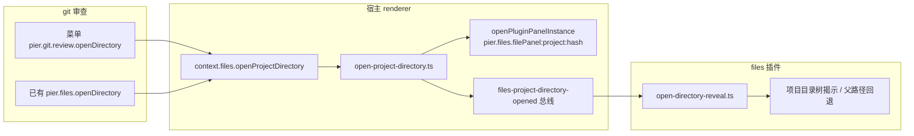
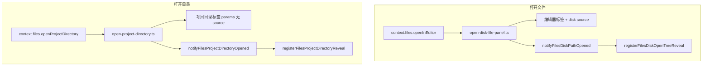
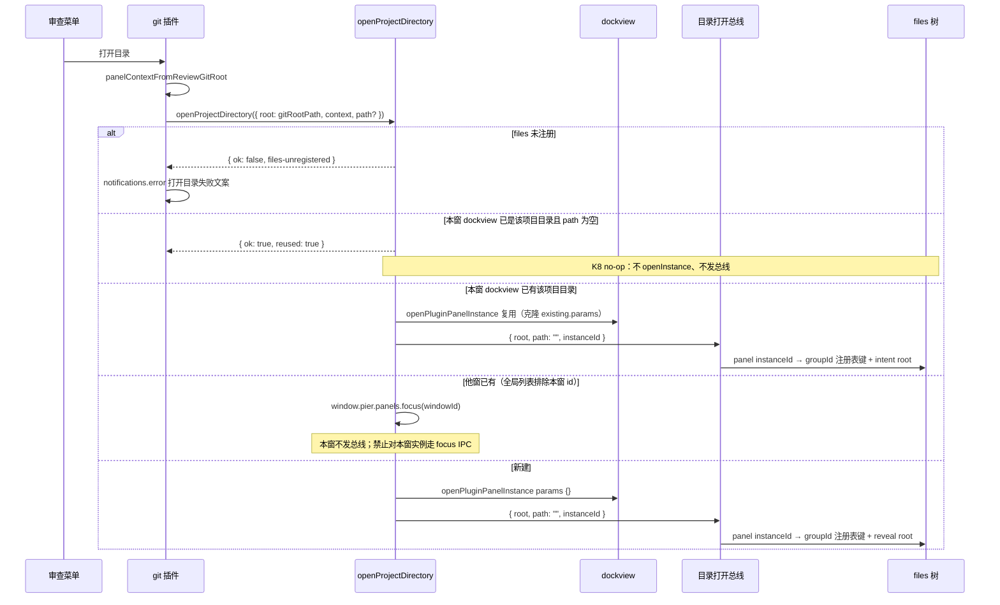

# 审查打开项目目录金标准

日期：2026-08-30  
状态：现行权威  
作者：待填  
范围：从 git 审查进入 **Files 项目目录标签**（只含目录树、不打开文档）；宿主跨插件 `openProjectDirectory` 门面与事件总线；审查树 / diff 上下文菜单。审查顶栏 **没有**「打开目录」芯片。  
不包含：CLI `pier .` 自动打开目录树（已由 [`2026-08-29-cli-path-open-design.md`](docs/superpowers/specs/2026-08-29-cli-path-open-design.md) 禁止）；搜索命中 / 智能体面板 / 工作树列表的新入口；把审查树做成持久 VS Code Explorer；第三条「打开文件」。

### 文档层级（冲突时）

| 文档 | 角色 | 与本文关系 |
|------|------|------------|
| **本文** | **打开项目目录**终态唯一权威：意图分层、入口、宿主门面、事件总线、审查菜单、禁令、验收 | 权威 |
| [`2026-07-31-git-review-gold-standard-endstate-design.md`](docs/superpowers/specs/2026-07-31-git-review-gold-standard-endstate-design.md) | SCM Review 体感 / 加载 / 导航 | 审查主点击、工具栏、始终多文件；**不得**用本文改审查主路径 |
| [`2026-08-29-cli-path-open-design.md`](docs/superpowers/specs/2026-08-29-cli-path-open-design.md) | CLI 路径简写 | 目录默认只确保终端工作面，**禁止** CLI 自动 `openProjectFiles` |
| AGENTS.md「插件边界」「用户可见文案」「交互控件密度」 | 工程纪律 | 实现必须绿；与本文冲突时先改实现或把冲突写入「开放问题」，不得 silently 改产品意图 |

**实现禁令：** 未对照本文时，禁止再合「审查里再加一个打开文件」「点文件夹改成进 Files」「工具栏加文件夹按钮」「git 插件直接 import files 的 `openProjectFiles`」充当结案。

---

## 一句话终态

审查要补的不是又一个「打开这个变更文件」，而是缺掉的 **「进这个项目的目录树」**：打开 Files **项目目录标签**（tree-only、`params` 无 disk `source`），定位到**本次审查的 git 根**，不顺手打开编辑器。

---

## 概述

今天从审查到达 Files 目录树，只能先打开某个变更文件（`context.files.openInEditor` → `notifyFilesDiskPathOpened` 顺带揭示）。干净工作区、空提交、只想逛仓库而不是读 diff 时，没有在场入口。命令面板已有 `pier.files.openDirectory`，但它吃的是**当前面板上下文**，审查树 / diff 右键原先没有对应项。

终态把「打开项目目录」提升为与 `openInEditor` 同构的宿主能力：`context.files.openProjectDirectory`。files 插件现有调用方全部改走同一条实现；git 审查只通过门面进入，禁止跨插件 import。审查主点击、`GitReviewToolbar` 与顶栏身份簇（范围切换）不动。顶栏 **不** 再放 Folder + 路径末段芯片——那会贴着变更摘要 `+N`，像另一套身份，不是需要的入口。

---

## 背景与动机

### 现状（已对当代码核实）

| 意图 | 去哪 | 今天从审查怎么走 |
|------|------|------------------|
| 读/编 **这个文件** | Files 编辑器标签，可选行号 | 已有：diff 标题点击（`useGitReviewOpenFile`）、菜单「打开文件」`pier.git.review.openFile`、菜单「跳转到源码」`pier.git.review.openInEditor`、冲突按钮 |
| 浏览 **这个项目**（不只是变更） | Files **项目目录**标签（只有树，没有文档） | **没有在场入口** |
| 在访达中显示 | 操作系统 | 已有：`pier.git.review.revealInFinder` → `context.files.reveal` |
| 在已打开的 Files 树里揭示 | 侧栏揭示 | 仅作为打开文件的副作用（`registerFilesDiskOpenTreeReveal`） |

打开文件的跨插件金路径（必须保持、不得改语义）：

```
git: context.files.openInEditor
  → 宿主 src/renderer/lib/plugins/host/files-context.ts
  → src/renderer/lib/files/open-disk-file-panel.ts
  → notifyFilesDiskPathOpened（plugins/api/files-disk-path-opened.ts）
  → files: registerFilesDiskOpenTreeReveal
```

打开目录今天是 **files 插件内部** 能力：

- 实现：`openProjectFiles`（`src/plugins/builtin/files/renderer/project/open-project.ts`）
- 调用方：终端状态栏 `status-item.tsx`、命令面板 `createFilesOpenDirectoryAction`（仅 `command-palette`）、终端 URL `open-url/handler.ts`
- 实例 id：`${FILES_FILE_PANEL_ID}:project:${stableFileIdentityHash(root)}`（`pier.files.filePanel:project:<hash>`）
- 复用：本窗同步 `panels.listInstances`（dockview `api.panels`）；他窗才 `listInstancesGlobal` + `focusInstance`
- 目录标签判定（`isProjectDirectoryInstance`）：canonical id / `startsWith(id:)` 优先；否则 **`parseFilesDocumentPanelSource` 非 null 则排除**（schema 是 `disk | untitled`，不是只认 disk）；再否则 `projectAnchor(params.context)` 匹配
- 已是当前活动的项目目录标签 → **直接成功、不闪标签、不揭示**（状态栏 / 命令面板如此；终端 URL 今日会再额外 80ms `revealFilesTreePath`，终态按 K8 对齐为同样 no-op，见下）
- 打开后再 `ensureProjectFileTreeExpanded` + 揭示（今日根意图另有 80ms delay）

git 插件 **不能** 调用 `openProjectFiles`：`dependency-cruiser.config.cjs` 的 `builtin-plugins-not-cross-import` 与 `plugins-not-import-host-implementations` 禁止 `src/plugins/builtin/git` → `src/plugins/builtin/files` 以及插件 → `src/renderer`。git 也无法对 `pier.files.filePanel` 调 `panels.openInstance`（贡献点断言只允许自己声明的 panel）。这正是 `openInEditor` 必须走宿主的原因，打开目录同样。

`FilesDiskPathOpenedEvent` 的注释与字段（`line` / `markdownAnchor` / `preferPreview`）语义是 **「磁盘文档已在编辑器打开」**。不得把它扩成「只开目录树」。

### 痛点

1. 审查空态 / 纯 rename / 只想看仓库结构时，必须先打开一个变更文件，或者离开审查去点终端状态栏 / 命令面板。
2. 打开文件会多一个编辑器标签；目录树揭示只是副作用，且目标可能是「上次聚焦的无关 Files 面板」，而不是本次审查的 git 根。
3. 产品词已经有「打开目录」（`pier.files.openDirectory` / `filePanel.openDirectory.title`）。审查若再发明「打开工作区 / Reveal in Explorer」，会裂成两套话。

---

## 目标与非目标

### 目标

1. 审查在场可进入 **本次审查 git 根** 的 Files 项目目录标签，不必先打开变更文件。
2. 两种意图永远分开：打开文件 ≠ 打开目录。
3. 打开目录 **不得** 同时打开编辑器标签。
4. 目标上下文只来自 `panelContextFromReviewGitRoot`（`src/plugins/builtin/git/renderer/review/context/from-git-root.ts`），禁止沿用「先前聚焦的无关 Files 面板」。
5. 全产品同一句：**打开目录**。菜单标题、失败 toast 都用这句，不要 git 专属「打开工作区」。
6. 一条实现：files 状态栏、命令面板、终端点目录、git 审查全部走宿主门面。
7. 失败可感知；成功靠面板聚焦 / 树揭示，不加成功 toast。

### 非目标

- 持久 VS Code Explorer（审查侧栏仍是变更 index，不是仓库浏览器）。
- 第三条「打开文件」按钮或改 diff 标题主点击。
- 命令面板新增 `git: 打开目录` / `pier.git.review.openDirectory` 进 palette（第三条入口已是聚焦审查时现有的 `pier.files.openDirectory`）。
- 打开审查时自动打开 Files。
- 用访达代替应用内浏览。
- 把 diff 标题路径做成面包屑。
- 把终端状态栏整条搬到审查面板，或在审查顶栏再做一个 Folder + 路径末段芯片。
- 搜索命中、智能体面板、工作树列表的新入口（已有调用同一 helper 的保持即可）。
- CLI 目录自动 `openProjectFiles`（见 CLI 规格非目标：「自动打开 Files 树」）。
- 改写 `openInEditor` / `FilesDiskPathOpenedEvent` 语义。
- 重命名终端状态栏文案 `files.projectStatus.openLabel`（「打开项目文件」）；本里程碑不收拾这处历史用词。

---

## 产品栏

### 意图对照（钉死）

| 意图 | 落点 | 审查主点击 | 审查菜单 | 顶栏 |
|------|------|------------|----------|------|
| 读/编这个文件 | 编辑器标签 + 可选行 | 树文件行 = 展示该 diff；diff 标题 = `useGitReviewOpenFile` | 「打开文件」/「跳转到源码」 | 无新按钮 |
| 浏览这个项目 | 项目目录标签，无文档 | **禁止**改成打开 Files | 「打开目录」（与上一行同组） | **无**（禁止芯片） |
| 在访达中显示 | OS | 无 | 「在访达中显示」（路径组） | 无 |

`PierFileTree`（`packages/ui/src/file/tree.tsx`）已保证：`onOpenPath` **只在 `kind === "file"`** 时触发；文件夹点击只展开/折叠。审查 `openSharedTreePath` 继续只滚 diff。禁止改这层。

### 入口（钉死）

| 优先级 | 入口 | 行为 |
|--------|------|------|
| **主（在场）** | 审查树文件/目录/分组根、diff 表面、以及 **审查 tab**（`dockview-tab`）的「打开目录」 | **一条**命令。树/diff 按目标收窄：无路径/分组根 → 项目根；文件 → 开树并 **揭示该文件（不开编辑器）**；目录 → 揭示该目录。审查 tab → **该次审查 git 根**（无 path）。与「打开文件 / 跳转到源码」同组，**不要**和复制路径 / 在访达中显示混在一组。tab 项 `menuHidden`，除非 `sourcePanelComponent === pier.git.changes` |
| **次** | 命令面板已有 `pier.files.openDirectory`（`getActiveContext()` → `projectAnchor`） | 审查聚焦时沿用。**不**新增 git 命令进 palette。`getActiveContext()` 实际返回 **工作区当前面板** 的 descriptor context、**不做插件过滤**。本里程碑 **禁止** 把 getter 改成插件作用域。菜单继续用 `source.gitRootPath` + `panelContextFromReviewGitRoot` |
| **禁止** | 审查顶栏 Folder + 路径末段芯片；`GitReviewToolbar` 文件夹按钮；终端 / Files 等非审查 tab 出现 `pier.git.review.openDirectory` | 芯片会贴着变更摘要 `+N`。git 命令不得污染其它面板 tab |

非法 source、没有 git 根：菜单目标为空，不显示「打开目录」。空审查 / index 失败不挂树，**审查 tab 仍在**，右键「打开目录」打开 git 根。

已删除 / 工作区里不存在的路径（含 commit 审查里文件已被删）：仍然打开项目目录；揭示 **父目录**，再退到根。叶子不在 **不得** 让面板打开失败。揭示对象是 **工作区树**，不是 commit blob 快照。

### 顶栏（钉死）

`headerLeading` **只** 放 `GitReviewScopeSwitcher`。禁止在范围切换旁再挂 Folder + 路径末段芯片，禁止改 `GitReviewToolbar`。`FilePanelHeader` leading 保持 `shrink-0`（芯片已撤回，不必为截断文字改共享 header）。

### 菜单（钉死）

- 产品句：`pluginText(context, "reviewOpenDirectory", "Open Directory")` → zh-CN「打开目录」。
- `surfaces`: `git/review-tree-item`、`git/review-diff`、`dockview-tab`。**禁止** `"command-palette"`。
- 审查 tab：目标为 `params.source`（`readGitReviewScope`）的 git 根；找不到再退 `sourcePanelContext.gitRoot`。**不要**用 `cwd`（可能是子目录）。非 `pier.git.changes` tab 不显示。
- 分组（字典序，空组不占分隔线）：

  | 组 | 项 | 说明 |
  |----|----|------|
  | `1_open` | 「打开文件」`sortOrder: 0`（仅树文件）；「跳转到源码」`sortOrder: 0`（仅 diff）；「打开目录」`sortOrder: 1` | 应用内打开。两意图并列，中间无分隔线 |
  | `1_review` | 暂存 / 取消暂存 / 丢弃 | git 变更。与打开组之间有分隔线 |
  | `2_view` | 展开文件夹 / 折叠文件夹（仅目录 / 分组根） | |
  | `6_path` | 复制路径 → 复制相对路径 → 复制路径和所选行（仅 diff）→ 在访达中显示 | OS / 剪贴板。Finder **不得**与「打开目录」同组，避免当成系统文件夹 |

- 树文件：打开文件、打开目录 | 暂存、丢弃 | 复制、访达。
- 树目录：打开目录 | 暂存… | 展开、折叠 | 复制、访达。
- 分组根 **没有** `repoPath`：复制/访达 `menuHidden`；打开目录 **必须显示**，目标为项目根。
- diff：跳转到源码、打开目录 | 复制…、访达。
- 审查 tab：打开目录（git 根）出现在 `1_open`；其后仍是宿主 tab 的复制地址 / 新建终端 / 拆分 / 关闭。不在 Files / 终端 tab 显示。
- 「打开文件」继续 `menuHidden: item?.kind !== "file"`。不得把打开目录塞进打开文件的 enabled 条件。
- 仓库写入期间打开文件 / 打开目录仍可用；暂存 / 丢弃禁用。

---

## 禁止

1. 抢审查主点击：树文件行改成开 Files；文件夹点击改成进目录树。
2. 在 `GitReviewToolbar` 上放导航（Folder 按钮、打开目录、Reveal）；在审查顶栏挂 Folder + 路径末段芯片（`git-review-open-directory-chip` / `GitReviewHeaderIdentity` / `GitReviewProjectDirectoryChip`）。
3. 打开目录时顺带 `openInEditor` / 写入 disk `source` / 发 `notifyFilesDiskPathOpened`。
4. git 插件 import `src/plugins/builtin/files/**`（含 `open-project.ts`）。
5. 把 `FilesDiskPathOpenedEvent` 扩成目录专用字段（`intent: "root"` 等）。
6. 命令面板增加 `pier.git.review.openDirectory`。
7. 打开审查时自动打开 Files。
8. 用访达代替应用内浏览。
9. diff 标题做成面包屑。
10. 审查面板复制终端状态栏。
11. 用户文案出现「工作树 / worktree / Agent / 打开工作区 / Reveal in Explorer」。
12. 成功 toast（面板聚焦与树揭示已是强自然反馈）。失败却只有 `console.error`、没有 `notifications.error` / `dialogs.alert`。状态栏今日对 `!result.ok` 已有 error toast；`.catch(() => undefined)` 只吞掉其后的 throw（`openProjectFiles` 已把异常收成 `{ ok: false }`）。PR1 仍应删掉这层 catch，但不要把现状写成「完全静默」。
13. 按钮 `h-8`、业务层写死 hex/rgb、图标不标 `data-icon`。
14. 往 `tree-path-actions.ts`（已 305 行）或 `review/` 根目录再堆新文件（根目录已 40 个源文件 = 密度硬上限）。
15. 往 `files/renderer/tree/` 加新文件（allowlist `max: 41`，棘轮禁止上调）。
16. 用 `parseFilesDiskSourceFromParams !== null` 当「不是目录标签」的唯一谓词（漏掉 untitled / 未来 `source.kind`）。
17. 对 `window.pier.panels.list()` 的生结果直接 `.filter`；或对 **本窗** 实例走 `focusInstance` IPC（全局列表含当前窗，会跳过总线、打破 K8 非空 path 揭示）。
18. 缺失路径按 `ancestorDirectoryPaths` **正序**（根优先）揭示——那会先滚到 `src` 而不是叶子的父目录。
19. 把总线的 panel `instanceId` 直接当树注册表键，或在键尚未登记时走 `findTreeEntry` 的 **last-root 回退**（同 root 最后一棵树经常是旁边的编辑器侧栏；新开的项目目录 tab 的 sidebar `useEffect` 还没 `registerFilesTreeInstance`，一次误命中就会让 `waitUntilRevealReady` **停轮询**）。
20. 声称目录 `explicit` 揭示的 `expandTarget: true`「对齐」`registerFilesDiskOpenTreeReveal`（磁盘打开写死 `false`；目录行需要默认 `true`）。

### 已核实、禁止以「简化」改掉

下列对照代码成立，实现不得图省事拆掉：

- 插件边界：`dependency-cruiser.config.cjs` 的 `builtin-plugins-not-cross-import` 与 `plugins-not-import-host-implementations` 存在。git 不能 import files 或 `src/renderer`，也不能 `openInstance("pier.files.filePanel")`。
- 密度：`review/` 根目录 **40** 个源文件；`files/renderer/tree` allowlist **41**；`tree-path-actions.ts` **305** 行；`changes-panel.tsx` **487**；`surfaces.tsx` **495**。git 新文件只进 `review/directory/`；files 监听器只进 `project/`。禁止上调 allowlist。
- `tree-path-actions.ts` 已同时挂 `git/review-tree-item` 与 `git/review-diff`。新命令走 `registerGitReviewTreeActions` 的 `surfaces` 数组；不要塞进 path-actions。
- hash：宿主 `open-disk-file-panel.ts` 与插件 `document/stable-hash.ts` 字节级相同（33 / 2_147_483_647 / 5381）。宿主侧只抽到 `src/renderer/lib/files/identity-hash.ts`。插件侧 hash 留在插件内。
- `openInEditor` 只断言 `file:read`；`listInstancesGlobal` / `focusInstance` 要 `panel:open`。目录门面断言两者。git/files manifest 已声明；`pier.files.openDirectory` 与 `pier.git.review.openFile` 的 permissions 已含这两项。
- 用户文案：zh-CN「打开目录」/「无法打开项目目录」不含工作树 / worktree / Agent。catalog 标题保持 `git: 打开目录`。本里程碑不改 `files.projectStatus.openLabel`。
- `PierFileTree` 仅在 `kind === "file"` 时调用 `onOpenPath`。

---

## 终态设计

### 架构



与打开文件同构、事件分开：



### 时序（分组根 / 无 path = 根）



### 目标收窄（一条 git 命令）

实现函数建议名：`resolveGitReviewOpenDirectoryTarget`，放在 `src/plugins/builtin/git/renderer/review/directory/open-action.ts`。

| 来源 | 解析 | `path` 交给门面 |
|------|------|-----------------|
| 树行 `parseGitReviewTreeItemMetadata` | 必有 `gitRootPath` + `contextId` | `reviewTreeItemRepoPath(item)`；分组根为 `null` → 省略/空 |
| diff `parseGitReviewDiffOpenMetadata` | 必有 `gitRootPath` + `path` | `metadata.path`（文件） |
| 非法、无 git 根 | `null` | 不调用门面 |

`context` 一律 `panelContextFromReviewGitRoot({ contextId, gitRootPath, sourcePanelContext })`。树菜单已在 `tree-context-menu.ts` 把 `sourcePanelContext` 写成同一 helper；命令 handler 应继续吃 `invocation.sourcePanelContext`。

不要按「上次聚焦的 Files 实例」猜 root。

### 删除/缺失路径

门面 **不** 因叶子不存在而失败。files 监听器（同插件，可 import `ancestorDirectoryPaths`）：

1. **总线字段仍是 panel id**（宿主 `openPluginPanelInstance` 的 `instanceId`，形如 `pier.files.filePanel:project:<hash>`）。**树注册表键不是 panel id。** 真面板几乎总走共享 group 视图：`prefersSharedGroupView = Boolean(runtimeContext && group && props.api?.id && ownerId)`（`panel/index.tsx`）；薄壳不画树，`group-view.tsx` 以 `instanceId={groupId}` 注册（`sidebar-helpers.ts`：「注册表键:共享 group 视图传 groupId,内联回退传 panelId。」）。`reveal-active-action.ts` / `tree/view-actions.ts` 已用 `instance.groupId ?? panelId`。
2. 监听器在 **每一次** 揭示/轮询尝试时解析注册表键（group 认领可能晚于总线；只解析一次会把 `groupId === null` 钉死成 panel id，而树已按 groupId 登记）：

   ```ts
   const registryKey =
     context.panels
       .listInstances(FILES_FILE_PANEL_ID)
       .find((panel) => panel.id === event.instanceId)?.groupId ??
     event.instanceId;
   ```

   `PluginPanelInstanceSnapshot.groupId` 来自 `groupForPanel`。内联回退（无 group）时 `?? event.instanceId`。
3. `ensureProjectFileTreeExpanded(event.root)` **只收 root**（`tree/preferences.ts` 现 API）。不要把 panel id 传进去。
4. 揭示调用必须带 `instanceId: registryKey` 且 **`fallbackToRoot: false`**（见下）。键还不在 `treeRegistry` 时返回 false，**继续轮询**。禁止 `findTreeEntry` 在 id miss 时落到「该 root 最后一棵树」——新开目录 tab 的 sidebar `useEffect` 尚未 `registerFilesTreeInstance` 时，那会命中旁边编辑器树并让 `waitUntilRevealReady` 停轮询。
5. `path === ""` → `intent: "root"`。揭示走 `revealFilesTreePathAfterAncestors`（自带 mount 轮询），**不要**再叠今日的 80ms `setTimeout`，也不要和 after-ancestors 双 delay。
6. 非空 → `intent: "explicit"`，**不**传 `expandTarget`（采用 `resolveRevealPolicy` 默认：explicit 为 `true`）。`expandTarget` 只对 **directory** 目标生效（`packages/ui/src/file/tree-reveal.ts`）。文件行该标志是空操作；目录行需要展开。**禁止**写成「对齐 `registerFilesDiskOpenTreeReveal`」——磁盘打开硬编码 `expandTarget: false`，那是文档打开揭示，不是本总线。可复用 `pinPath`：gitignored 隐藏路径也要能揭示。
7. 叶子不在工作区树（commit 审查、已删文件）：
   - 成功判定：`ensureFilesTreeAncestorsLoaded` 之后 `tryRevealFilesTreePathOnce({ …, fallbackToRoot: false })` 为 true。可选先 `files.stat`：`exists: false` 则跳过对该叶子的等待，直接回退。
   - 祖先列表：`ancestorDirectoryPaths(path)` 是 **根优先**（`"src/foo/bar.ts"` → `["src", "src/foo"]`）。必须 `[...ancestorDirectoryPaths(path)].reverse()` 再揭示，才是近到远（先 `src/foo`）。
   - 根级文件（`"gone.ts"`）helper 返回 `[]`，直接落到 `intent: "root"`。
   - 全部失败再 `path: ""` + `intent: "root"`。
8. 禁止对 commit blob 做「假文件」揭示。git handler 不必 `stat`，把 `repoPath` 原样下传。

**注册表严格查找（改现有文件，禁止在 `tree/` 新增文件）：**

`findTreeEntry`（`tree/registry.ts`，299 行）今日：id miss 则扫同 `root` 最后一棵树（注释：stale treeId）。搜索/重命名等可保留该回退。给 `tryRevealFilesTreePathOnce` / `revealFilesTreePath` / `revealFilesTreePathAfterAncestors` 增加 `fallbackToRoot?: boolean`（缺省 `true`，旧调用方不变）。目录打开传 `false`：`instanceId` 有值且 `treeRegistry.get` 没有 → 返回 `null`/`false`，不 root 回退。`waitUntilRevealReady` 的 last-chance `revealFilesTreePath` **必须**带上同一 flag，否则最后一跳仍会打到错误树。`reveal.ts`（97 行）只改传参，不加新文件。

### 已聚焦 no-op 与 path（K8）

今日 `openProjectFiles`：现有实例 id === 本插件 `getActiveInstanceId(FILES_FILE_PANEL_ID)` 则立刻 `{ ok: true }`，连揭示都不做。状态栏 / 命令面板依赖这一点。

终态 **空 path + 本窗已是该项目目录活动标签 = no-op**（不 `openInstance`、不发总线）。覆盖：状态栏、palette、**终端点仓库根**（`relativePath === ""`）。

今日终端 URL 在 `openProjectFiles` **之后无论是否 no-op** 再 `setTimeout(80ms)` 揭示根。`tests/unit/renderer/files/terminal-open-url-handler.test.ts` **没有**断言这第二次揭示。终态删掉 handler 里这套 delay，根点击在已聚焦时与状态栏对齐为 K8 no-op。这是 **有意对齐**，不是漏测回归。子目录（非空 `path`）仍发总线揭示。

若调用带了非空 `path`：即使已聚焦，也要发总线揭示，只是不闪标签。

他窗 `focusInstance` 成功：本窗不发总线。带 path 的他窗复用可能只聚焦、不揭示叶子——本里程碑可接受；不要为揭示在本窗再开一个项目目录标签，也不要加跨窗 IPC。

### 顶栏组装（避免撑破 500 行）

`changes-panel.tsx` 已约 487 行，`surfaces.tsx` 已 495 行，`review/` 根目录已 40 个源文件。

git 新文件只进 `review/directory/`。本能力在 git 侧只有命令：

```
src/plugins/builtin/git/renderer/review/directory/
  open-action.ts    # 命令 id、目标收窄、register
```

`headerLeading` 继续只传 `GitReviewScopeSwitcher`（loading / error / 空态 / documents **同一处**）。不要改 `GitReviewToolbar`。不要在 `panel-layout.tsx` 的 `headerLeading` 后再追加导航。`FilePanelHeader` leading 保持 `shrink-0`。

---

## 接口变更

### 1. 门面 `RendererPluginFilesFacade`

文件：`src/plugins/api/renderer-facades.ts`

在 `openInEditor` 旁新增（**异步**，因为要走 `window.pier.panels.list` / `focus`，与 `openInEditor` 的同步 boolean 不同）：

```ts
openProjectDirectory(request: {
  context?: PanelContext;
  /** 仓库相对路径。省略或 "" = 项目根。非空 = 只揭示，不打开文档。 */
  path?: string;
  root: string;
}): Promise<OpenProjectDirectoryResult>;
```

```ts
export type OpenProjectDirectoryResult =
  | { ok: true; instanceId: string; reused: boolean }
  | {
      ok: false;
      reason:
        | "no-anchor"
        | "files-unregistered"
        | "invalid-path"
        | "open-failed";
    };
```

宿主实现：`src/renderer/lib/plugins/host/files-context.ts` 的 `createPluginFilesContext`：

- `assertPluginCapability(entry, "file:read")`
- `assertPluginCapability(entry, "panel:open")`  
  （`openInEditor` 今日只断言 `file:read`；打开目录必然 open/focus panel，且复用他窗走的 `listInstancesGlobal` 已要求 `panel:open`。git / files 的 manifest 都已声明这两项。）
- 转调 `openProjectDirectory` helper。
- 不抛；失败以 result 返回。

### 2. 宿主 helper

新文件：`src/renderer/lib/files/open-project-directory.ts`  
（`src/renderer/lib/files/` 现 4 个文件；不要起 `files-open-project-directory.ts`。）

取代 `openProjectFiles`。算法对齐「本窗 dockview 同步 + 他窗 IPC」，**不是** `listInstancesGlobal` 的 drop-in（全局列表含当前窗）。

| 步骤 | 规则 |
|------|------|
| 校验 root | `root` 空 → `no-anchor` |
| 校验 path | `path` 省略或 `""` = 根，合法。非空必须通过 `fileRootRelativePathSchema`（相对、无 `..`）。失败 → `invalid-path`，**不**打开、不揭示。不要把非法 path 并进 `no-anchor`。 |
| 插件 | `getPluginPanelRegistrations().has("pier.files.filePanel")` 否则 `files-unregistered` |
| 身份 | `createProjectFilesInstanceId(root) = pier.files.filePanel:project:${hash(root)}`。hash 与 `open-disk-file-panel.ts` / files `document/stable-hash.ts` 字节级相同（33 / 2_147_483_647 / 5381）。PR1 宿主侧抽到 `src/renderer/lib/files/identity-hash.ts`。插件侧 hash **留在插件内**。 |
| 目录标签判定 | ① id === canonical 或 `startsWith(canonical + ":")` → 是。② 否则若 `params.source` 是带非空 `kind` 字符串的对象（disk、untitled、未来 kind）→ **不是**。③ 否则 `params.context` 的 projectAnchor（`projectRootPath ?? worktreeRoot ?? gitRoot ?? cwd`）等于 `root` → 是。**禁止**用 `parseFilesDiskSourceFromParams !== null` 当排除谓词（只认 disk，untitled 会在 ③ 被当成目录标签，复用时再写空 params 会剥掉 untitled `source`）。`parseFilesDiskSourceFromParams` 仍可用于其它磁盘逻辑，只是这里不够。宿主不得 import files 的 `parseFilesDocumentPanelSource`；用上面的 `kind` 存在性即可。 |
| 本窗列表 | **同步** `useWorkspaceStore.getState().api?.panels`（与 `open-disk-file-panel.ts` 相同：`view.contentComponent`、`params`；复用时 `groupForPanel` 取 `targetGroupId`）。不要对本窗走 `window.pier.panels.list()`。 |
| 本窗命中且已活动且 path 空 | 不 `openInstance`、不发总线（K8） |
| 本窗命中（复用） | `openPluginPanelInstance`：同一 `instanceId`、克隆 **`existing.params`**、刷新 `context`、保留 title/group。**禁止**复用时传入 `params: {}`（那会在误判 untitled 时清掉 `source`）。不要加 `source`。 |
| 远程列表 | `const listed = panelsFromListResult(await window.pier.panels.list())`。无 `windowId` 时 IPC 返回 `{ errors, panels }`，**不是**数组（`preload/panels-api.ts`）。`list(windowId)` 才是该窗数组。必须用已有 `panelsFromListResult`（`panels-context.ts`；可导出或把 15 行拷进 helper，禁止对生结果 `.filter`）。 |
| 远程过滤 | **排除本窗已有实例 id**（`new Set(localPanels.map(p => p.id))`）。全局列表含当前窗（`RendererPluginPanelsFacade` 注释）。对本窗实例 `focusInstance` 会跳过总线，K8 非空 path 揭示会丢。不要为了取 `windowId` 去 import `agent-runtime/current-window-id.ts`（领域不对）；本地 id 集合足够。 |
| 远程命中 | `focusInstance({ componentId, instanceId, windowId })`；`focused` 则返回且 **不发本窗总线**；`error` → `open-failed`；`not_found` 则本窗新建 |
| 新建 | `params: {}`（宿主 `openPluginPanelInstance` 会注入 `context` + `pluginComponentId`），`title` = 根路径末段，**不要**传 `dropUnpinnedInstances`（flag `=== true` 才关 preview；与今日 `open-project.ts` 一致） |
| 总线 | 仅本窗打开/复用后 `notifyFilesProjectDirectoryOpened({ instanceId, root, path: path ?? "" })`。K8 空 path no-op 与远程 focus 成功都不发。 |
| 组件 id | 字符串 `"pier.files.filePanel"`（`FILES_FILE_PANEL_COMPONENT_ID`），禁止 import files 插件包 |

导出 `createProjectFilesInstanceId(root: string)` 供单测。files 插件若仍要识别自己的目录实例，保留本地同公式函数，不要 import 宿主。

PR1 测试必须改用 `open-disk-file-panel.test.ts` 那套 harness（`useWorkspaceStore.setApi` + mock `window.pier.panels` + `getPluginPanelRegistrations`），**不要**继续用插件 `listInstances` mock（`open-project.test.ts` 今日那样）。必须带 **untitled 编辑器** fixture：同锚点 `params.source.kind === "untitled"` 不得被复用为目录标签。

### 3. 兄弟总线

新文件：`src/plugins/api/files-project-directory-opened.ts`  
（对齐 `files-disk-path-opened.ts`：`on*` / `notify*` / `reset*ForTests`，listener 内 try/catch，不得让打开失败。）

```ts
export interface FilesProjectDirectoryOpenedEvent {
  instanceId: string;
  path: string; // "" = 根
  root: string;
}
```

**禁止** 加 `line` / `preferPreview` / `markdownAnchor`。那些属于文档打开总线。

files 监听器：`src/plugins/builtin/files/renderer/project/open-directory-reveal.ts`  
由 `files/renderer/index.tsx` 与 `registerFilesDiskOpenTreeReveal` 并列注册。不要放进 `tree/`（密度棘轮）。

职责：`ensureProjectFileTreeExpanded(event.root)`（只传 root）→ 按「删除/缺失路径」把 **panel `event.instanceId` 解析成 group 注册表键** 再揭示（`fallbackToRoot: false`）。根与非空/缺叶子都走 `revealFilesTreePathAfterAncestors`（自带 mount 轮询），**不要**再加 80ms `setTimeout`，也不要把 80ms 抄进 git。今日 `open-project.ts` 的 `REVEAL_DELAY_MS` 随该函数删除或不再从 handler 调用。

### 4. files 调用方迁到门面

| 调用方 | 今日 | 终态 |
|--------|------|------|
| `status-item.tsx` | 直接 `openProjectFiles`；`!result.ok` 已 `notifications.error`；`.catch(() => undefined)` 只吞后续 throw | 门面 `{ root: anchor, context }`；失败仍 error toast；**删掉**多余 catch（helper 已把 throw 收成 `open-failed`） |
| `open-directory-action.ts` | `openProjectFiles` | 门面；无锚点仍 `notifications.info(filePanel.openDirectory.noProject)`；`invalid-path` / `files-unregistered` / `open-failed` → `filePanel.openDirectory.failed` |
| `open-url/handler.ts` 目录 / 仓库根 | `openProjectFiles` 后再 **无条件** 80ms 揭示（已聚焦的根也会滚一次） | 门面传入 `path`（根 `""`，子目录 `relativePath`）；**删掉** handler 第二套揭示。已聚焦 + 空 path = K8 no-op（与状态栏/palette/分组根菜单对齐；现有 terminal-open-url 单测不断言那次额外揭示）。`files-unregistered` / `invalid-path`：**toast，不要** `openPath` 系统打开。`no-anchor` / `open-failed` 仍可走今日系统打开 fallback。files 插件自己调用门面时按理见不到 `files-unregistered`（自己未注册却还能跑 handler 极罕见）；表里仍要写明，免得并进 OS fallback。 |

`openProjectFiles` 在 files 插件内降为薄封装或删除。终态测试改测宿主 helper，不再把插件内部函数当权威入口。

### 5. git 命令

- id：`pier.git.review.openDirectory`
- 常量：`GIT_REVIEW_OPEN_DIRECTORY_COMMAND_ID`
- manifest（`src/plugins/builtin/git/manifest.ts`）`permissions: ["file:read", "panel:open"]`，`title: "git: Open Directory"`（catalog 句式与其它 review 命令一致；**菜单 title()** 仍是「打开目录」，无 `git:` 前缀）
- 注册：`registerGitReviewTreeActions` 里加一条 disposer（`index.ts` 已调它；diff 表面靠同一 register 的 `surfaces` 数组，不必改 `registerGitReviewDiffActions`）
- handler 伪代码：

```ts
const target = resolveGitReviewOpenDirectoryTarget(invocation);
if (!target) return;
const result = await context.files.openProjectDirectory({
  context: panelContextFromReviewGitRoot({
    contextId: target.contextId,
    gitRootPath: target.gitRootPath,
    ...(invocation?.sourcePanelContext
      ? { sourcePanelContext: invocation.sourcePanelContext }
      : {}),
  }),
  root: target.gitRootPath,
  ...(target.path ? { path: target.path } : {}),
});
if (!result.ok) {
  // no-anchor / files-unregistered / invalid-path / open-failed 同一句用户文案
  context.notifications.error(
    pluginText(context, "reviewOpenDirectoryFailed", "Unable to open project directory")
  );
}
```

### 6. i18n

git `locales/{en,zh-CN,ja,ko}.json` 四份必须齐（治理会扫全部 locale 根）：

| key | en | zh-CN | ja | ko |
|-----|----|-------|----|----|
| `ui.reviewOpenDirectory` | Open Directory | 打开目录 | ディレクトリを開く | 디렉터리 열기 |
| `ui.reviewOpenDirectoryFailed` | Unable to open project directory | 无法打开项目目录 | プロジェクトディレクトリを開けません | 프로젝트 디렉터리를 열 수 없습니다 |
| `commands.pier.git.review.openDirectory.title` | git: Open Directory | git: 打开目录 | git: ディレクトリを開く | git: 디렉터리 열기 |
| `commands.pier.git.review.openDirectory.description` | Open this project directory in the Files tree. | 在文件目录树中打开此项目。 | Files のディレクトリツリーでこのプロジェクトを開きます。 | Files 디렉터리 트리에서 이 프로젝트를 엽니다. |

files 侧失败文案继续 `filePanel.openDirectory.failed`（已是「无法打开项目目录」）。不要在用户串里写工作树 / worktree / Agent。

四份 locale 必须齐；`user-copy-governance` 会扫 git/files locale。

### 7. 数据模型

无磁盘 schema、无 migration。项目目录标签仍是：

- 稳定 id：`pier.files.filePanel:project:<hash(root)>`
- `params` 无 disk `source`（可有宿主写入的 `context` / `pluginComponentId`）
- 布局持久化沿用现有 dockview 实例；不新增 userData key，不新增 feature flag。

---

## Key Decisions

| # | 决策 | 理由 |
|---|------|------|
| K1 | **宿主门面，而不是 git import files** | 与 `openInEditor` 同构；depcruise `builtin-plugins-not-cross-import` / `plugins-not-import-host-implementations` 硬挡。git 不能 `openInstance(pier.files.filePanel)`。 |
| K2 | **新总线，不复用 `FilesDiskPathOpenedEvent`** | 该事件 = 编辑器打开了磁盘文档（line/preview/anchor）。目录打开若共用，files 的 `registerFilesDiskOpenLineReveal` / preview prefer 会误跑，语义也无法机测隔离。 |
| K3 | **在场入口是右键菜单（树 / diff / 审查 tab），不进工具栏，不进顶栏芯片** | 工具栏是 diff 阅读控件。顶栏芯片会贴着变更摘要。空审查没有树，tab 仍在。palette 保持 `pier.files.openDirectory`。git 命令不得出现在终端 / Files tab。 |
| K4 | **一条 git 命令 + 目标收窄，不是两条** | 产品句只有「打开目录」。根/文件/目录只是 target 不同。两条命令会逼出「打开根 / 揭示路径」两套文案。 |
| K5 | **不随审查自动打开 Files** | 审查是多文件 diff 表面；自动开树是布局噪音。CLI 规格已禁止目录简写自动开 Files 树。用户要逛仓库时用菜单或命令面板。 |
| K6 | **分组根打开项目根；文件/目录行带路径揭示** | 文件层 = 进这个项目并看见这个路径。主点击保持「看 diff」。 |
| K7 | **打开目录异步 Result；打开文件仍同步 boolean** | 目录复用他窗必须 `list`/`focus` IPC。不要把 `openInEditor` 改成 async 搭顺风车。 |
| K8 | **已聚焦 + 空 path = no-op；已聚焦 + 非空 path = 只揭示** | 状态栏 / palette / 分组根菜单 / **终端点仓库根** 同一手感。终端 URL 今日额外 80ms 根揭示改为 no-op 是有意对齐（现有单测不断言它）。 |
| K9 | **叶子缺失不失败；祖先 reverse 后再根** | `ancestorDirectoryPaths` 根优先，必须 reverse。工作区树，不是 blob。 |
| K10 | **新文件按领域分子目录，不抬密度白名单** | `review/` = 40 硬顶；`files/tree/` allowlist 41。git 放 `review/directory/`；files 监听器放 `project/`。 |
| K11 | **失败 `notifications.error`；成功无 toast** | 强自然 UI。状态栏已有 `!ok` toast；PR1 只删掉多余 `.catch`。 |
| K12 | **命令权限与门面断言 = `file:read` + `panel:open`** | 与 `pier.git.review.openFile` / `pier.files.openDirectory` 的 manifest 权限对齐。`openInEditor` 仍只断言 `file:read`，不要搭顺风车改它。 |
| K13 | **任何 `params.source.kind` 都不是目录标签** | 今日插件用 `parseFilesDocumentPanelSource`（disk \| untitled）。宿主不得只排除 disk。 |
| K14 | **本窗 dockview 同步列表；远程 IPC 排除本窗 id** | `window.pier.panels.list()` 无参返回 `{ errors, panels }` 且含当前窗。生结果 `.filter` 或对本窗 `focusInstance` 会丢 K8 揭示。 |
| K15 | **树注册表键是 groupId，总线仍带 panel id** | 共享 group 视图把树登记在 `group.id`（`group-view.tsx` `instanceId={groupId}`）。把 panel id 当注册表键会 miss；id miss 再 last-root 会命中同 root 的编辑器树并停轮询。监听器每次 `listInstances` 取 `groupId ?? panelId`，`fallbackToRoot: false`。 |

---

## 否决方案

### A. 只写文档告诉用户去命令面板

`pier.files.openDirectory` 在审查聚焦时已经能用：`getActiveContext()` 是工作区当前面板（含 git 审查），`projectAnchor` 通常等于审查 `gitRootPath`。但这不是在场入口。空审查没有树可右键时仍走 palette / 终端状态栏。禁止把 getter 改成「只返回本插件面板」。

### B. 抢走文件夹主点击

`PierFileTree` 对 directory 不调 `onOpenPath`，展开/折叠是目录树的基本预期。审查树文件夹再绑「打开 Files」会毁掉浏览变更的手感，也违反 Review 金标准「侧栏点击不阻塞 / 点文件看 diff」。

### C. git import `openProjectFiles`

立刻红：`builtin-plugins-not-cross-import`。即便改 cruiser，插件边界（纪律边界）仍要求跨插件 UI 走宿主门面。这是 `openInEditor` 已经付过的税，不要开后门。

### D. 「打开文件」够了，因为树揭示是副作用

副作用要求：**先开一个文档标签**。空变更没有可开的文件；用户要的是逛项目不是读这个 diff；还会把目录树绑到「刚好打开的那个文件」而不是项目根。这正是要加的能力缺口。

### E. 审查工具栏加 Folder 按钮

`GitReviewToolbar` 是 split / wrap / collapse / refresh / commit。导航放进去会变成第三簇 chrome，并与身份层（范围切换）抢注意力。顶栏 Folder 芯片同样否决：贴着变更摘要 `+N`，像另一套项目身份。

其它已否决（产品锁定）：访达当应用内浏览；diff 路径面包屑；审查复制终端状态栏；打开审查自动开 Files；palette 再挂一条 git 打开目录；审查顶栏身份芯片。

---

## 风险

| 严重度 | 风险 | 缓解 |
|--------|------|------|
| 高 | 删掉的工作区路径导致打开失败 | helper 不 stat 叶子；监听器父路径回退；单测覆盖 missing path |
| 高 | git 误用先前聚焦的 Files 根（工作树 A 审查、工作树 B 树） | 门面 `root` 必填且来自 `gitRootPath`；禁止从活动 Files 实例反推 |
| 中 | files 插件未注册 / 被关 | `files-unregistered` → 「无法打开项目目录」；不抛、不静默 |
| 中 | 顶栏溢出 | 不增加芯片；范围切换保持紧凑；trailing 不收缩 |
| 中 | 成功 toast + 面板聚焦双反馈 | 禁令 + 治理测试扫描 git directory 模块不得 `notifications.success` |
| 中 | 点 diff 标题 vs 新菜单抢语义 | 标题继续 `useGitReviewOpenFile`；`hooks/open-file.test.ts` 不得改断言；菜单才是打开目录 |
| 中 | 他窗复用带 path 时不揭示叶子 | K8：本里程碑不加跨窗总线；分组根菜单是根，文件菜单的他窗揭示可后续补 |
| 高 | 把 panel id 当树注册表键 / last-root 命中编辑器树 | K15：`groupId ?? panelId` + `fallbackToRoot: false`；两组同 root 单测 |
| 低 | `review/` 或 `files/tree/` 再丢一个文件导致密度门禁红 | 文件落点表锁死子目录 |
| 低 | 实例 id hash 宿主/插件不一致 | PR1 抽 `identity-hash.ts` + 单测锁定与插件 `stable-hash.ts` 同输出（见 PR1 文件表） |
| 中 | untitled / 未来 source 被当成目录标签 | K13：排除任何 `source.kind`；untitled fixture |
| 中 | 全局 list 对本窗 focus、跳过总线 | K14：本地 id 排除；`panelsFromListResult` |
| 低 | 终端根点击已聚焦不再二次揭示 | K8 有意对齐；PR1 测 no-op，不测「必须再滚一次」 |
| 低 | `changes-panel.tsx` / `tree-path-actions.ts` 超 500 行 | 命令进 `review/directory/`；不往 path-actions 塞 |

---

## 安全与隐私

- 不新增 main 命令、不改 CLI、不改密钥。
- 门面只开已注册的 files 面板。`root` 非空。`path` 省略/`""` 为根；非空必须 `fileRootRelativePathSchema` 通过（相对、无 `..`），否则 `invalid-path` 且不打开。揭示仍走 files 树 API。
- `file:read` + `panel:open` 能力断言；无写盘。
- 插件边界仍是纪律边界不是沙箱；本变更不扩大 git 的文件写权限。
- tooltip / 菜单不把内部 `contextId` 展示给用户。

威胁模型：恶意插件若已有 `file:read`+`panel:open`，本来就能 `openInEditor`；打开目录不增加新的磁盘读取面（揭示用的 `stat`/`list` 仍是 files 已有能力）。

---

## 可观测性与发布

这是桌面 UX，不是服务。

- **发布：** 随宿主版本出荷；**无 feature flag**（仓库里打开目录/打开文件都没有开关先例）。
- **回滚：** 按 PR 逆序 revert。PR1 回滚会拆掉门面，PR2/PR3 必须一起回或先回 3→2→1。
- **日志：** 用户路径只用 `notifications.error` / `dialogs.alert`（技术详情才 alert）。listener 失败 catch 吞掉以免打断打开（与 `notifyFilesDiskPathOpened` 相同）。禁止在点击路径 `console.error` 后结束。非用户路径（启动）才允许 boot-safe console。
- **指标：** 无新遥测要求。单测覆盖复用/他窗/缺失路径即可。
- **AGENTS.md：** PR4 在「用户可见文案」或 git/files 交叉处加一句指针到本文，并写检查点测试名。不要把本文全文贴进 AGENTS。

---

## 开放问题

1. **他窗复用 + 非空 path：** 本里程碑跟随 `openProjectFiles`（聚焦他窗、本窗不揭示）。若自用打磨里「菜单揭示文件却跳到另一窗根」不可接受，后续可改为：非空 path 时跳过他窗复用、在本窗开/复用目录标签。不要在未验证前加跨窗 IPC。
2. **非法 source 但用户仍想逛盘：** 无 git 根则菜单目标为空，这是锁定的。不要用 `cwd` 猜一个目录。

下列 **不是** 开放问题（已锁定）：主点击、工具栏、顶栏芯片、palette 新 git 命令、自动打开、访达替代、面包屑、自动开 Files、`FilePanelHeader` leading 保持 `shrink-0`。

---

## 检查点

### 单测 / 组件（现有必须继续绿）

- `tests/unit/renderer/files/panel/open-project.test.ts` → 迁到宿主 helper，**改用** `open-disk-file-panel.test.ts` harness（workspace store + `window.pier.panels` + 注册表），可改名为 `open-project-directory.test.ts`：no-anchor、`invalid-path`（`../x`）、新建空 params、disk 编辑器不当目录标签、**untitled 编辑器不当目录标签**、他窗 focus（全局 list 聚合对象、排除本窗 id）、已聚焦空 path no-op、非空 path 仍发总线、不通知 disk-opened 总线、hash 与插件 `stable-hash.ts` 同输出
- `tests/unit/renderer/files/panel/open-disk-file-panel.test.ts`：打开文件仍只走 disk 总线；改用共享 `identity-hash.ts`
- `tests/unit/renderer/files/command-palette-surface.test.ts`：`pier.files.openDirectory` 仍仅 palette；git 新命令不得出现在该测试的 files 源码扫描里
- `tests/unit/renderer/files/terminal-open-url-handler.test.ts`：子目录仍揭示；仓库根 + 已聚焦 = K8 no-op（不再无条件 80ms 揭示）；`files-unregistered` / `invalid-path` toast 不系统打开；`open-failed` 仍可系统打开
- `tests/unit/renderer/git/review/tree/actions.test.ts`：打开文件仍仅 file 行；分组根仍无 copy/reveal；**新增**分组根有打开目录；文件/目录行有打开目录；`1_open` | `1_review` | `2_view` | `6_path` 分隔与顺序
- `tests/unit/renderer/git/review/diff/actions.test.ts`：跳转到源码不变；打开目录紧跟其后、与复制/访达之间有分隔线
- `tests/unit/renderer/git/review/hooks/open-file.test.ts`：**不得改主点击断言**
- `tests/unit/renderer/git/review/context/from-git-root.test.ts`：菜单继续用该 helper
- `tests/unit/renderer/git/review/toolbar.test.tsx`：工具栏仍无 Folder / 打开目录
- `tests/unit/renderer/plugins/host-files-context-save-target.test.ts` 同类：门面断言 `file:read` + `panel:open`
- `tests/unit/renderer/app/user-copy-governance.test.ts`：新 locale 不得含禁词
- `tests/unit/scripts/dir-density-governance.test.ts`：新目录若加 bannedPrefix，一并登记（`review/directory` 建议 `directory-` 不必；文件名用 `open-action.ts`）

### 新增

- `tests/unit/renderer/git/review/directory/open-action.test.ts`：目标收窄（文件 / 目录 / 分组根 / diff / 无 git 根）；组为 `1_open`
- `tests/unit/renderer/files/project/open-directory-reveal.test.ts`：每次轮询把 panel id 解析成 `groupId`；`fallbackToRoot: false`；缺叶子 reverse 祖先；根级缺失文件直接 root；`explicit` 不硬编码 `expandTarget: false`；**两组同 root**：项目目录 tab vs 编辑器 tab，揭示必须打到目录组的树，不得打到编辑器组
- `tests/unit/renderer/git/review/open-directory-governance.test.ts`（或 `tests/unit/plugins/review-open-project-directory-governance.test.ts`）：
  - 本文存在且含「一句话终态」「打开目录」「禁止」主点击 / 工具栏 / `FilesDiskPathOpenedEvent`
  - `src/plugins/builtin/git/**` 源码不出现 `@plugins/builtin/files` 或 `open-project.ts`
  - `pier.git.review.openDirectory` 的 `surfaces` 含 `dockview-tab`、不含 `command-palette`，组为 `1_open` 而非 `6_path`
  - `GitReviewToolbar` 不含 `openProjectDirectory` / `reviewOpenDirectory` / 芯片 testid
  - `changes-panel.tsx` 的 loading/error/empty/documents 仍传 `GitReviewScopeSwitcher`；**无** `GitReviewHeaderIdentity` / chip 文件
  - `files-disk-path-opened.ts` 仍无目录专用字段
  - `packages/ui/src/file/tree.tsx` 仍是 `kind === "file"` 才 `onOpenPath`
  - 锁定「已核实的实现禁令」条目（密度数字、hash 常量、`file:read`+`panel:open`）

### 契约 / 工程门禁

- `pnpm check:file-size`（500）；`changes-panel.tsx` 保持 ≤500
- `pnpm check:dir-density`
- `pnpm depcruise`：git ↛ files；插件 ↛ renderer
- manifest 新命令 permissions 含 `file:read` `panel:open`

---

## 文件落点（给实现者）

| 路径 | 动作 |
|------|------|
| `src/renderer/lib/files/identity-hash.ts` | 新建；从 `open-disk-file-panel.ts` 抽出 hash；单测与插件 `stable-hash.ts` 同输出 |
| `src/renderer/lib/files/open-project-directory.ts` | 新建；宿主唯一实现 |
| `src/renderer/lib/plugins/host/files-context.ts` | 加门面方法 |
| `src/plugins/api/renderer-facades.ts` | 加类型 |
| `src/plugins/api/files-project-directory-opened.ts` | 新建总线 |
| `src/plugins/builtin/files/renderer/project/open-project.ts` | 薄封装或删除；实例 id 公式保留本地若仍需要 |
| `src/plugins/builtin/files/renderer/project/open-directory-action.ts` | 改走门面 |
| `src/plugins/builtin/files/renderer/project/status-item.tsx` | 改走门面；去掉静默 catch |
| `src/plugins/builtin/files/renderer/project/open-directory-reveal.ts` | 新建监听器（panel id → `groupId ?? panelId`；`fallbackToRoot: false`；祖先 reverse） |
| `src/plugins/builtin/files/renderer/tree/registry.ts` | 给查找增加 `fallbackToRoot`（缺省 true）；**不**新增 tree/ 文件 |
| `src/plugins/builtin/files/renderer/tree/reveal.ts` | after-ancestors / last-chance 透传 `fallbackToRoot` |
| `src/plugins/builtin/files/renderer/open-url/handler.ts` | 目录分支改门面 |
| `src/plugins/builtin/files/renderer/index.tsx` | 注册监听器 |
| `src/plugins/builtin/git/renderer/review/directory/open-action.ts` | 命令 id、目标收窄、register（组 `1_open`） |
| `src/plugins/builtin/git/renderer/review/tree-actions.ts` | register 新命令；打开文件改 `1_open` |
| `src/plugins/builtin/git/renderer/review/diff-actions.ts` | 跳转到源码改 `1_open` |
| `src/plugins/builtin/git/renderer/changes-panel.tsx` | `headerLeading` 仍为范围切换 |
| `src/plugins/builtin/git/manifest.ts` | 登记命令 |
| `src/plugins/builtin/git/locales/{en,zh-CN,ja,ko}.json` | 文案 |
| `docs/superpowers/specs/2026-08-30-review-open-project-directory-gold-standard.md` | 本文入库 |
| `AGENTS.md` | 短指针 + 检查点测试名 |

明确 **不要改**：`hooks/use-open-file.ts` 主路径、`toolbar.tsx`、`tree.tsx` 的 `onOpenPath` 文件门闩、`files-disk-path-opened.ts` 的事件形状、CLI。

---

## 验收场景

| ID | 场景 | 通过 |
|----|------|------|
| D1 | 有变更的未提交审查，分组根菜单「打开目录」 | 打开/聚焦 **该 git 根** 的项目目录标签；无新编辑器标签；树在根 |
| D2 | 空工作区审查（No changes） | 无树、无顶栏芯片；审查 tab 右键「打开目录」打开 git 根 |
| D3 | index 失败但仍有 `gitRootPath` | 无树、无芯片；审查 tab 右键仍可用 |
| D4 | 非法 git source | 菜单目标为空，不显示「打开目录」 |
| D5 | 树文件主点击 | 仍只展示 diff；`open-file.test.ts` 绿 |
| D6 | 树文件夹主点击 | 仍只展开/折叠 |
| D7 | 树文件菜单「打开目录」 | 开目录树并揭示该文件；无编辑器 |
| D8 | 树目录菜单 | 揭示该目录 |
| D9 | 分组根菜单 | 有「打开目录」；无复制/访达；打开根 |
| D10 | diff 菜单「打开目录」 | 揭示该 diff 文件；「跳转到源码」仍开编辑器 |
| D11 | 文件已从工作区删除 | 面板仍打开；揭示父或根 |
| D12 | 项目目录已是活动标签，分组根菜单 / 状态栏 / palette / 终端点仓库根 | 不闪、不发总线（K8） |
| D13 | 同上，但菜单揭示某文件 | 不闪标签，树揭示该路径（必须打到该 panel 所在 **group** 的树，不是同 root 的编辑器树） |
| D14 | files 未注册 | error toast「无法打开项目目录」；终端 URL **不**系统打开 |
| D15 | 命令面板「打开目录」审查聚焦 | 仍走 `pier.files.openDirectory` + 工作区 `getActiveContext()`；palette 无 `git: 打开目录` |
| D16 | 终端状态栏项目项 | 行为同前，实现走门面 |
| D17 | 工具栏 | 无新按钮 |
| D18 | 本窗已有 untitled 标签且 context 锚点相同 | 新建/复用 **项目目录**标签，不把 untitled 改成目录树 |
| D19 | 非法 `path`（`../x`） | `invalid-path`；不打开 |
| D20 | 缺失 `src/foo/gone.ts` | 揭示 `src/foo` 而不是先 `src` |

---

## 参考

- 打开文件金路径：`src/plugins/api/renderer-facades.ts` `openInEditor`；`src/renderer/lib/files/open-disk-file-panel.ts`；`src/plugins/api/files-disk-path-opened.ts`
- 打开目录现状：`src/plugins/builtin/files/renderer/project/open-project.ts`
- 审查上下文：`panelContextFromReviewGitRoot`
- 树/diff 菜单：`tree-actions.ts`、`tree-path-actions.ts`、`diff-actions.ts`、`tree-context-menu.ts`、`diff-context-menu.ts`
- 顶栏：`changes-panel.tsx` `headerLeading`；`panel-layout.tsx` leading 槽；`surfaces.tsx` 未提交时外挂 surface switcher；`toolbar.tsx` 只属于 trailing
- 树主点击门闩：`packages/ui/src/file/tree.tsx` `selectedItem?.kind === "file"`
- 插件隔离：`dependency-cruiser.config.cjs` `builtin-plugins-not-cross-import`
- 密度：`.pier/dir-density.json`；`review/` 40；`files/renderer/tree` allowlist 41
- CLI 非目标：`docs/superpowers/specs/2026-08-29-cli-path-open-design.md`
- 文案治理：`tests/unit/renderer/app/user-copy-governance.test.ts`
- 审查金标准：`docs/superpowers/specs/2026-07-31-git-review-gold-standard-endstate-design.md`

---

## PR Plan

每个 PR 必须独立可审、可合并、不破坏主点击。合入后 `pnpm check` 绿。不要用一个巨型 PR 把门面 + 菜单绑死。

### PR1 — 宿主门面 + 总线 + files 迁入

- **标题：** `feat(files): host openProjectDirectory facade`
- **依赖：** 无
- **描述：** 把 `openProjectFiles` 提升为宿主唯一实现，files 状态栏 / 命令面板 / 终端目录点击改走 `context.files.openProjectDirectory`。本窗同步 dockview 列表、远程 IPC 排除本窗 id、排除任何 `params.source`。K8：已聚焦空 path no-op（**含终端点仓库根**，去掉 handler 额外 80ms 揭示，有意对齐状态栏）。删掉状态栏多余 catch。不改 git 审查 UI。
- **主要文件：**
  - `src/renderer/lib/files/identity-hash.ts`（新）
  - `tests/unit/renderer/files/panel/identity-hash.test.ts`（新；与 `src/plugins/builtin/files/renderer/document/stable-hash.ts` 同输出）
  - `src/renderer/lib/files/open-project-directory.ts`（新）
  - `src/renderer/lib/files/open-disk-file-panel.ts`（改用共享 hash）
  - `src/renderer/lib/plugins/host/files-context.ts`
  - `src/renderer/lib/plugins/host/panels-context.ts`（若导出 `panelsFromListResult`；否则 helper 内拷贝同等规范化）
  - `src/plugins/api/renderer-facades.ts`
  - `src/plugins/api/files-project-directory-opened.ts`（新）
  - `src/plugins/builtin/files/renderer/project/open-directory-reveal.ts`（新；panel id → groupId）
  - `src/plugins/builtin/files/renderer/tree/registry.ts`（`fallbackToRoot`；不新增 tree/ 文件）
  - `src/plugins/builtin/files/renderer/tree/reveal.ts`（透传 flag）
  - `src/plugins/builtin/files/renderer/project/open-project.ts`（瘦身或删除）
  - `src/plugins/builtin/files/renderer/project/open-directory-action.ts`
  - `src/plugins/builtin/files/renderer/project/status-item.tsx`
  - `src/plugins/builtin/files/renderer/open-url/handler.ts`
  - `src/plugins/builtin/files/renderer/index.tsx`
  - `tests/unit/renderer/files/panel/open-project.test.ts` → 宿主 harness 重写（可改名 `open-project-directory.test.ts`；含 untitled fixture）
  - `tests/unit/renderer/files/panel/open-disk-file-panel.test.ts`
  - `tests/unit/renderer/files/project/open-directory-reveal.test.ts`（新；groupId 解析、`fallbackToRoot: false`、两组同 root）
  - `tests/unit/renderer/files/terminal-open-url-handler.test.ts`（K8 根 no-op；`files-unregistered` 不 OS-open）
  - `tests/unit/renderer/plugins/host-files-context-save-target.test.ts` 同类（断言 `file:read` + `panel:open`）
- **验收：** D12（含终端根）、D14、D18、D19、D20 的 files 侧；磁盘打开总线无目录事件；depcruise 绿。不要求「终端根已聚焦仍再揭示一次」。

### PR2 — 审查命令 + 上下文菜单 + i18n

- **标题：** `feat(git): open directory from review context menus`
- **依赖：** PR1
- **描述：** 登记 `pier.git.review.openDirectory`，挂在 `git/review-tree-item` 与 `git/review-diff`，目标收窄。组为 `1_open`（与打开文件 / 跳转到源码同组，与复制 / 访达分组）。palette 不加。打开文件 / 跳转到源码回归测试保持原断言。
- **主要文件：**
  - `src/plugins/builtin/git/renderer/review/directory/open-action.ts`（新）
  - `src/plugins/builtin/git/renderer/review/tree-actions.ts`（register；打开文件改 `1_open`）
  - `src/plugins/builtin/git/renderer/review/diff-actions.ts`（跳转到源码改 `1_open`）
  - `src/plugins/builtin/git/manifest.ts`
  - `src/plugins/builtin/git/locales/{en,zh-CN,ja,ko}.json`（四份；ja/ko 不得缺 key）
  - `tests/unit/renderer/git/review/directory/open-action.test.ts`（新）
  - `tests/unit/renderer/git/review/tree/actions.test.ts`
  - `tests/unit/renderer/git/review/diff/actions.test.ts`
  - `tests/unit/renderer/git/review/hooks/open-file.test.ts`（只跑，不改产品断言）
  - `tests/unit/renderer/git/review/context/from-git-root.test.ts`（只跑）
  - `tests/unit/renderer/app/user-copy-governance.test.ts`
- **验收：** D1、D4–D11、D15；四 locale 绿；菜单 `1_open` | 变更 | 路径。

### PR3 — 撤回顶栏芯片

- **标题：** `fix(git): drop review header open-directory chip`
- **依赖：** PR2
- **描述：** 审查顶栏不放 Folder + 路径末段。`headerLeading` 只保留范围切换。`FilePanelHeader` leading 保持 `shrink-0`。空审查改走命令面板，不加芯片。
- **主要文件：**
  - 删除 `review/directory/chip.tsx` / `header-leading.tsx` / `path-label.ts` 及对应单测
  - `src/plugins/builtin/git/renderer/changes-panel.tsx`（恢复 `GitReviewScopeSwitcher`）
  - `packages/ui/src/file/panel-layout.tsx`（leading `shrink-0`）
- **验收：** D2、D3、D17；治理扫描无芯片文件、无 `GitReviewHeaderIdentity`。

### PR4 — 规格入库 + 治理测试

- **标题：** `docs: review open-directory gold standard`
- **依赖：** 可与 PR1 并行写文档；治理测试应在菜单落地后锁定源码禁令。
- **描述：** 本文放入 `docs/superpowers/specs/2026-08-30-review-open-project-directory-gold-standard.md`；AGENTS.md 短指针；治理测试锁定标题、禁令、import 边界、palette surfaces、**工具栏与顶栏无芯片**、`changes-panel` 仍用范围切换、disk-opened 事件形状、树主点击门闩、已核实的密度/hash/能力条目。
- **主要文件：**
  - `docs/superpowers/specs/2026-08-30-review-open-project-directory-gold-standard.md`
  - `AGENTS.md`
  - `tests/unit/renderer/git/review/open-directory-governance.test.ts`（新）
- **验收：** 治理测试失败当且仅当有人违反本文禁令。

PR1 可单独给 files 插件带来「打开目录实现单点」的工程价值，即使审查 UI 尚未接上。PR1 **不是**字节级行为冻结：终端点仓库根且目录标签已聚焦，从「额外 80ms 揭示」改为 K8 no-op。PR2 菜单是在场主入口。不要做顶栏芯片。治理测试放最后，锁定 UI 落地后的源码禁令。
