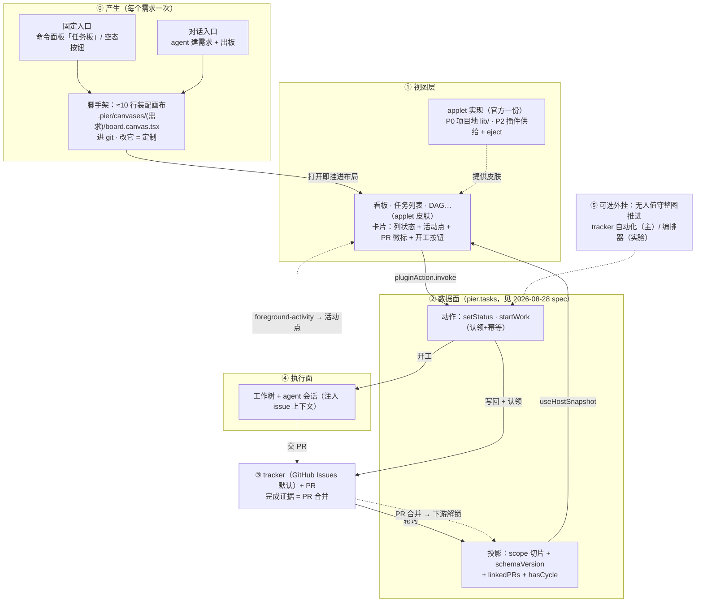

# Canvas 任务视图与 Applet 供给体系设计

状态：草案 · 2026-08-31
关联：[`2026-08-28-canvas-task-management-tracker-adapter-design.md`](2026-08-28-canvas-task-management-tracker-adapter-design.md)（数据面：`pier.tasks` 投影/动作/overlay，2026-08-31 已同步修订）·
[`2026-08-26-canvas-dual-stage-and-ui-expansion-design.md`](2026-08-26-canvas-dual-stage-and-ui-expansion-design.md)（canvas 壳与积木底座）

> 本设计吸收 2026-08-31 四模型对抗评审的共识修正：宿主级 applet **删除**；插件贡献点**后置 P2**（先项目地验证契约）；
> markdown 内嵌收缩为「仅 id 引用 + 显式启用 + 只读」且后置；`pier-applet:` 伪协议**否决**（LSP/typecheck 断裂），改
> tsconfig 别名 + 生成声明文件；eject 分层（数据 hooks / 纯视图）。评审同时确认：源码级 applet 优于运行时组件注册表
> （`canvasWidgets` 否决维持）、优于每画布手搓（现行 `kanban.canvas.tsx` 金样约 340 行是实证）。

## 0. 结论速览

- **能力与形态解耦**：执行能力收敛为三个通用契约——数据（`plugin:pier.tasks/board·dag` 投影）、启动（`task.startWork` 动作）、状态（`foreground-activity` + overlay + `linkedPRs`）；看板 / 任务列表 / DAG / 未来的泳道甘特都是同三契约上的 **applet 皮肤**，新增一种形态的边际成本 = 写一个 applet。
- **applet 定义**：源码级、参数化（props）、逻辑闭环（内部自带投影消费/收窄/乐观更新/空态错误态）的可复用视图单元，文件约定 `*.applet.tsx`。实现层它是「参数化 live module」；对文档嵌入而言是 islands 模式。
- **供给两级**：P0 **项目地**（官方模板金样放入 `.pier/canvases/lib/`，零宿主编译改动）→ P2 **插件贡献点**（`manifest.applets`，引用为默认 + eject 为出口，shadcn 式源码哲学）。**不设宿主级 applet**（评审否决：与「不设官方成品模板」hard ban 及工作台拆除金标准冲突）。
- **产生环节**：**工厂式**固定入口（已有板 quick pick + 新建 scope 向导 / 空态按钮 / 对话），首开**自动脚手架**约 10 行装配画布（配置即代码，进 git，改它 = 定制）；信任门如实呈现，已授信项目下近似无感知。
- **不做**：运行时组件注册表（`canvasWidgets` 否决维持）、宿主任务台账/看板域/调度器（AGENTS.md 01 铁律不动）、`pier/canvas` SDK 领域导出（零 `<Kanban>`）。

## 1. 背景与问题

1. **手搓不可靠**：现行 board 金样约 340 行（DnD + 乐观写队列 + 冲突回读）；让 agent 每个需求重写一遍，生成质量不确定，状态机与样式是高频出错面。
2. **模板复制漂移**：skill 模板复制进项目后与投影 schema 演进脱钩，散落副本静默腐烂。
3. **多形态是真实诉求**：同一份任务数据要看板、列表、DAG 乃至泳道/甘特多种看法，且每种都要能「点卡启动 agent + 看运行状态」；把执行能力焊死在某一种视图里（业界固定看板的做法）复用不了。
4. 评审证伪了两条歧路：**运行时组件注册表**（黑盒定制墙，`canvasWidgets` 否决维持）与**宿主自带成品视图**（逆转 2026-08-24 工作台拆除金标准）。剩下的正解：**源码级 applet，分级供给，eject 逃生**。

## 2. 概念与命名

- 单元名 **applet**（中文产品词候选「小应用」，终名见 §13）：完整逻辑闭环、可传参、可嵌入 canvas 与文档的源码级视图单元。
- 与既有概念的边界：**积木**（`pier/canvas` 原语）是 applet 的实现语言；**配方/模板**（skill packs）是 applet 的教学与脚手架来源；**投影/动作**（插件数据面）是 applet 的唯一数据通道；**装配画布**（`.canvas.tsx`）是放置 applet 并传参的薄壳。
- 用户可见心智只有三层（评审要求，概念课不外溢）：**GitHub 的数据 / 本机的执行信息 / 项目里的视图文件**。applet、引用态、eject 态是作者与 agent 的协议词，不进前台主路径文案。

## 3. 总体架构



三契约一次成型（数据/启动/状态归数据面 spec），形态层唯一职责是渲染与动作转发；执行能力在任何一种皮肤上都是白拿的。

## 4. Applet 契约

### 4.1 文件形态与 import 白名单

- 文件约定 `*.applet.tsx`，默认导出 React 组件（props 即公开契约）；目录内允许拆分 `hooks.ts` / `view.tsx` / 相对子文件（受 `check:file-size` 500 行门禁约束，官方 applet 必须拆文件）。
- import 白名单：`pier/canvas` + **`pier/host`**（数据/命令入口——2026-08-31 评审修正：原「只许 pier/canvas」与投影消费自相矛盾）+ 自身目录内相对文件。**不许** import 插件 renderer 内部代码、宿主 workbench 模块、node_modules（React 围栏既有规则）。
- `.applet.tsx` 不是预览 entry：live-modules root registry 需排除其成为可打开画布（entry 仍只有 `*.canvas.*`）。

### 4.2 数据纪律

- 数据只走已声明的投影键（`useHostSnapshot("plugin:<id>/<key>?<scope>")`），动作只走已声明的 `pluginAction.invoke` 键；applet 不得自带私有数据通道（loopback fetch 属编排器运行图场景，不属任务视图）。
- 投影类型 `unknown` 在 applet 内收窄；`schemaVersion` 不匹配时渲染降级提示而非白屏。
- 状态叠加双订阅：`foreground-activity`（活动点）按 overlay 的 `panelId`/`worktreePath` 在视图层 join；投影 `linkedPRs` 渲染 PR 徽标。

### 4.3 内部分层与 eject 边界

```
tracker-board.applet.tsx     # 组合导出（props 契约在此）
├── hooks.ts                 # 数据层：投影订阅 + 收窄 + 乐观更新队列 + 动作转发
└── view.tsx                 # 纯视图：列/卡渲染，只吃 props 与回调
```

- **引用态**（P2 起）：整体随插件走，插件升级=数据层与视图同步演进。
- **eject 两档**：默认**浅 eject** 只拷 `view.tsx`（定制外观，数据层仍引用插件源码，schema 演进随动）；**完整 eject** 全拷（彻底脱钩）。任何 eject 产物头部自动写 provenance 注释（`source: <pluginId>@<version>, projectionSchema: <n>`），预览 chrome 显示来源芯片（`pier.tasks@1.2` / `已 eject` / `项目自写`），引用态编译失败的错误面必须给「更新插件 / eject 后修复」两条出路——防止「坏了怪谁」无归因（评审 warning）。
- P0 项目地阶段全源码本就在项目里，分层照做（为未来对账留锚点）。

### 4.4 propsSchema 与演进

- manifest 内以 JSON Schema 子集声明 props（供 agent 机器读取与 fence 校验）：

```ts
applets: [{
  id: "tracker-board",                       // 嵌入全名 pier.tasks/tracker-board
  entry: "applets/tracker-board.applet.tsx",
  title: { en: "Task board", "zh-CN": "任务看板" },
  propsSchema: { /* repo: string 必填；milestone / label / columns 可选 */ },
  deprecated?: { since: string, replacedBy?: string },
}]
```

- 演进规则（评审修正「破坏性变更=新 id」不可持续）：**加字段向后兼容优先**；确需破坏性变更时同 id + `schemaVersion` 演进 + `deprecated` 过渡期；**真正产品分叉**（board vs list）才新 id。治理锁：移除 id 前必须经至少一个 release 的 `deprecated` 标记（markdown/历史画布是长寿命消费者）。

## 5. 供给体系

### 5.1 P0：项目地（零宿主编译改动）

- 官方实现以 skill 模板形式维护（`resources/system-skills/pier-canvas/templates/` 旁挂 applet 源码），脚手架/agent 首次出板时放入项目 `.pier/canvases/lib/`；装配画布相对 import。编译器现状即支持（项目内相对导入 + 围栏在项目根内）。
- 代价（已知且接受）：多项目多副本、插件投影演进不自动跟随——由 `schemaVersion` 对账 + agent 修复缓解；这正是 P2 升级为贡献点的动机与验证期。

### 5.2 P2：插件贡献点（前置条件：投影契约在真实使用中稳定）

`manifest.applets` 声明 + 引用为默认 + eject 为出口。评审定性：**这是真工程，不是「复用现有管线」**，设计必须覆盖：

| 项 | 要点 |
|---|---|
| 引用形态 | **否决 `pier-applet:` 伪协议**（tsserver/LSP 无法解析 → agent typecheck 恒报 TS2307，生成闭环崩溃）。改 **tsconfig paths 别名** `@pier-applet/<pluginId>/<appletId>`，宿主在插件装载时生成/维护 `.pier/types/applets.d.ts`（含 props 类型），`tsconfig.canvases.json` 补别名与 `.pier/types` include、`.gitignore` 处理；**声明生成与 typecheck 可独立于宿主运行**，IDE 补全零报错 |
| 编译围栏 | 注册**只读第二围栏根**（插件 applet 源码目录）；realpath 防逃逸沿用；applet 根内 import 纪律比 canvas 更严（禁 tsconfig paths 二跳）；graph/watch 与编译缓存键随根集合扩展 |
| 源码分发与校验 | 插件 applet 源码走**安装目录**分发（managed external 的 `installed/<id>/<version>` 天然满足；asar 内源码 esbuild 原生进程读不了）。**显式任务（二轮修正「解除禁 src」过述）**：`scripts/pack-plugin.mjs` 是白名单打包——按 `manifest.applets[].entry` 归档 `applets/**`；`package-validation` 增条目存在性 + Posix 相对路径防逃逸校验；官方索引/捆绑清单同步；`.tsx` 源码不走 main/renderer 的 eval 扫描，安全由编译围栏承担并以治理测试锁定 |
| 信任合成 | 插件 applet 源码走插件安装信任链（官方索引/签名）；项目画布仍走项目信任门；同一编译图内两条信任来源共存的语义显式定义 |
| eject 工具 | 命令面板/agent 均可触发：复制源码 → 改写 import → 写 provenance 头（§4.3） |
| 发现 | `plugin.inspect` 返回补 `manifest.applets`（含 propsSchema）；authoring 期通道见 §8 |

### 5.3 明确不做：宿主级 applet

评审 3/4 判定与现行治理正面冲突（`references/host-data.md` hard ban「不设官方成品模板」、2026-08-24 工作台拆除金标准刚删除 `ActivityList`/账号成品卡）。宿主域（activity / resources / cost / git / runs）继续「聚合 hook + 积木 + skill 教至少两种拼法」；领域视图随领域插件走。

### 5.4 供给判据（一句话）

**数据的作者供给视图的默认实现**：任务视图随 `pier.tasks`，账号视图随 `pier.codex`（若做）；宿主不供给任何领域成品；项目层永远兜底定制。

## 6. 产生环节与装配面

### 6.1 固定入口 + 首开脚手架

- 入口（**工厂式**，2026-08-31 二轮定案）：命令面板「任务板」/ 连接 tracker 后的空态按钮 / 对话让 agent 建。宿主 action 流程 = 列**已有板 quick pick** →「新建」走 scope 向导（默认当前 remote + milestone/open，**禁止无过滤全仓首板**——每列 50 截断会立刻失真）→ 写入脚手架文件 → 打开预览面板挂进布局。信任门如实呈现（文案「将创建并打开任务板」）；拒信保留文件并给下一步；已授信项目下近似无感知。关板 = 显式删除确认（区分「关面板」与「删板文件」）。
- 生成物（配置即代码，全文示例）：

```tsx
// .pier/canvases/req-settlement/board.canvas.tsx
import TrackerBoard from "../lib/tracker-board.applet.tsx"; // P2 起：@pier-applet/pier.tasks/tracker-board

export const canvas = { kind: "composition", title: "结算重构 · 任务板" };

export default function Board() {
  return <TrackerBoard repo="acme/webapp" milestone="结算重构" />;
}
```

- scope 由脚手架交互或 agent 对话确定（milestone / label / Project 绑定，见数据面 spec §11 决策 3）；文件进 git，重启/换机/同事 clone 后仍在，不存在二次生成。

### 6.2 canvas 装配（现状能力）

纯 ESM import + React props，编译器已支持项目内导入（`fixtures/live-modules/import-button.canvas.tsx` 为既有证据）；顶层 mount 无需改动（props 在画布文件内传递）。

### 6.3 markdown 内嵌（P3，收缩形态）

评审 4/4 critical：任意 md 即执行代码 = 信任门追溯放宽；且与阅读版心/分页/滚动治理冲突。收缩为：

- 仅 **`id` 引用已安装插件 applet**（`src` 任意路径变体**否决**）；props 为纯数据 YAML，校验失败降级静态代码块。
- **只读渲染**：无 DnD、无写动作（动作区渲染为「在 Canvas 中打开」跳转）；分页卸载即释放 watch 租约。
- **逐文档显式启用**（非全局默认）；外部渲染器（GitHub 等）看到的是可读 YAML fence，diff 无噪声。
- 宿主改动：`mountLiveModuleExport` 增加 `props` 选项（fence 桥专用；canvas 页装配不需要）。

## 7. 任务视图三件套

| 视图 | props（示意） | 数据 | 动作 | 期 |
|---|---|---|---|---|
| `tracker-board` 看板 | `repo` · `milestone/label` · 列映射覆盖 | `board?scope` + `foreground-activity` | `task.setStatus`（拖卡）· `task.startWork` | P0（开工 P1.5 点亮） |
| `task-list` 任务列表 | `repo` · `filter` · `groupBy` | 同上 | 同上 | P1~P2 |
| `task-dag` DAG | `repo` · `milestone` | `dag?scope`（`hasCycle` / 幽灵节点） | 点就绪节点开工 | P3（**实验定位**：FlowGraph 曾因效果不达标被移除，纯 TS 分层布局须设质量退出条件，不作金标准必达件；宿主不重建通用画图原语） |

共同要求（2026-08-31 二轮增强）：空态带下一步（未连接 → `settings.open` 直达；未安装插件/拒信各有引导）；`staleSince` 显示「数据来自 x 分钟前」+ **手动刷新按钮**（即时拉取 + 重置轮询）；写失败壳内 `Alert` 回滚乐观态，**按卡 mutation lane + 5–8s 乐观保护窗 + 本地 generation 丢弃过期快照**（防写后副本延迟回跳）；**键盘契约**：卡片 `tabIndex` + 产品 focus ring +「移动到列」菜单（拖拽只是加速路径）；**完成列 P0 只读**；`canWrite=false` 时前置禁用拖拽；活动状态映射 `waiting`（需要你处理）/`error`/`processing` 为可见语义态并可点击聚焦面板；卡片号点开浏览器原 issue（心智锚：数据在 tracker）；`hasCycle` 时亮环警告。文案全部进 locale。

## 8. 生成链路与 agent 教学

1. **skill 反转为 applet 优先**：识别任务管理意图 → 发现可用 applet → 三行装配嵌入 → 用户要定制才 eject 降级到积木组装。skill 仍须教**至少一种积木拼法**（eject 后场景；保留组合教学，评审弱形式采纳）。
2. **authoring 期发现通道**（评审 warning：`plugin.inspect` 是 canvas 运行时 API，agent 在终端读不到）：pier CLI 增只读子命令输出已安装插件的 applets + propsSchema（对齐 `plugin.catalog.list` 允许 `cli-local` 的先例）；markdown fence 语法教学并入同一输出与 skill。
3. **意图提议的承载**：`SKILL.md` 为显式调用模式（`disable-model-invocation: true`），「主动提议」不假设 skill 自动进上下文——由宿主侧入口（命令面板/空态）承担主发现，skill 负责被显式调用后的正确产出。
4. 脚手架产物与 applet 骨架进 skill 模板；治理测试锁 recipe 表与 pack 目录一致。

## 9. 治理修订清单（随 P2 实现与治理测试同步落地，文档不先行改 AGENTS.md）

| 现行条文 | 修订为 |
|---|---|
| AGENTS.md 01「不做：…看板…」 | 「不做**宿主台账式看板域**（任务数据/固定面板）；tracker 投影 + applet 视图不在此列」 |
| 「`.canvas.tsx` 是唯一组装层」 | 「applet 是可复用组装单元；canvas/markdown 是装配面；`pier/canvas` SDK 仍零领域导出」 |
| 「不增加 `canvasWidgets`」 | 「禁**运行时组件注册表**；源码级 `applets` 贡献点（引用 + eject）不在此列」 |
| host-data「不设官方成品模板」 | 宿主域禁令**保留**；补插件 applet 例外条款（领域插件可供给自己域的源码级视图） |
| skill「至少两种拼法」 | 保留弱形式：applet 优先 + eject 后至少教一种积木拼法 |

不动项：台账/调度/同步三不做、CSP loopback、投影/动作声明制、插件边界纪律、smoke 夹具。

## 10. 里程碑（视图侧，与数据面 spec §8 对齐）

| 期 | 内容 | 解锁 |
|---|---|---|
| V0（并入数据面 P0） | tracker-board applet 项目地金样（三列启发式/完成列只读/键盘移动/手动刷新/乐观保护窗）+ 薄装配模板 + **工厂式入口**/脚手架命令 + `.applet.tsx` entry 排除 | 板子可用、产生环节闭环 |
| V1（并入 P1/P1.5） | PR 徽标/`externalBlockers`/`canWrite` + 语义状态映射与聚焦 + 开工按钮（renderer 编排桥）+ 消息中心通知 + 清理工作树 + task-list applet | 看板即驾驶舱 |
| V2（= P2 贡献点） | `manifest.applets` + 别名解析/声明文件生成 + 第二围栏根 + 源码分发 + eject 工具 + 来源芯片 + deprecated 治理 | 供给制升级、多项目零漂移 |
| V3（= P3） | task-dag applet + markdown 只读 fence（显式启用） | 多形态完整 |

## 11. 治理检查点

| 检查点 | 锁定 |
|---|---|
| `tests/unit/plugins/tasks/applet-governance.test.ts`（新） | applet import 白名单（pier/canvas + pier/host + 相对文件）；无 node_modules/插件内部 import；文件行数门禁 |
| live-modules 围栏套件（扩，V2） | 第二围栏根 realpath 防逃逸；`.applet.tsx` 非 entry；别名解析与声明文件生成 |
| manifest schema 套件（扩，V2） | `applets` 声明链（id 前缀、entry 存在、propsSchema 必填、deprecated 语义） |
| markdown 治理（扩，V3） | fence 仅 id 引用、只读降级、显式启用、阅读版心不受活块破坏 |
| 用户文案治理（既有，扩词表） | applet 中文产品词定名后入表；空态/错误带下一步 |
| canvas-materials catalog（既有） | 登记配方/物料，仍无领域组件行 |

## 12. 已决取舍与已否决方案

- **已否决：运行时组件注册表**（canvasWidgets 复活）——黑盒定制墙，评审 4/4 维持否决。
- **已否决：宿主级成品视图 applet**——治理冲突（§5.3），评审 3/4。
- **已否决：`pier-applet:` 伪协议**——LSP/typecheck 断裂杀死 agent 生成闭环；改 tsconfig 别名 + 生成声明文件。
- **已否决：markdown fence `src` 任意路径变体**——打开文档即执行任意项目代码。
- **已决：整块胖 eject 默认否决**——分层（hooks/view）+ 浅 eject 默认 + provenance 头 + 来源芯片。
- **已决：贡献点后置 P2**——评审 3/4：底座（围栏/分发/信任/类型）未完成前，项目地更安全且零改动即可交付价值；插件供给的增量只在投影契约稳定后才划算。
- **已决：「破坏性变更=新 id」收窄**——同 id schema 演进 + deprecated 期优先，分叉才新 id（§4.4）。
- **已决：applet 优先不豁免组合教学**——skill 保留至少一种积木拼法（评审「积木教学死亡」弱形式采纳）。

## 13. 开放决策点

| # | 决策 | 建议 |
|---|---|---|
| 1 | applet 中文产品词（小应用 / 视图 / 物料细分） | 「小应用」候选；定名后入用户文案治理词表 |
| 2 | propsSchema 格式（JSON Schema 子集 vs zod 序列化） | JSON Schema 子集（跨 agent 机器可读、fence 校验可复用） |
| 3 | 项目地目录（`.pier/canvases/lib/` vs `.pier/applets/`） | `lib/`（留在既有预览根围栏内，无需新增 contentDirectories） |
| 4 | 浅 eject 是否与 V2 同期（依赖跨根引用） | 同期（浅 eject 本质是引用态的局部覆盖，机制同源） |
| 5 | 固定入口命令的宿主归属（宿主命令 vs 插件命令） | 宿主命令（入口先于插件安装存在，未连接时引导连接） |
| 6 | 浅 eject 的 ViewModel 版本契约（`viewApiVersion` / 兼容范围） | 定义稳定 ViewModel 类型 + 版本号，来源芯片提示「可升级 / 需完整 eject」（二轮评审建议） |
