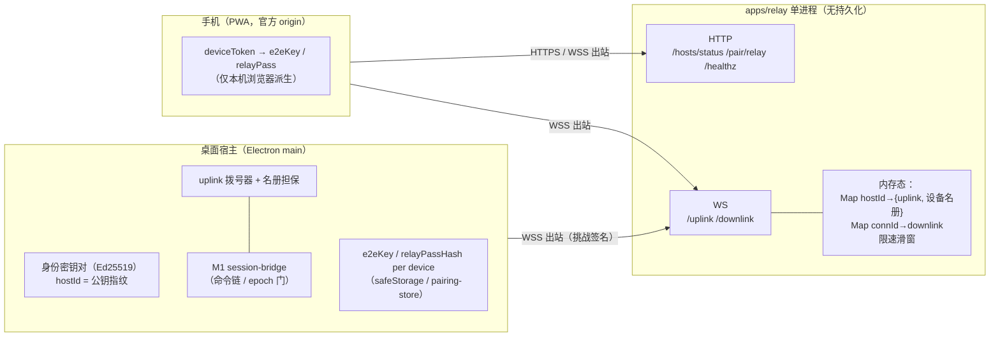
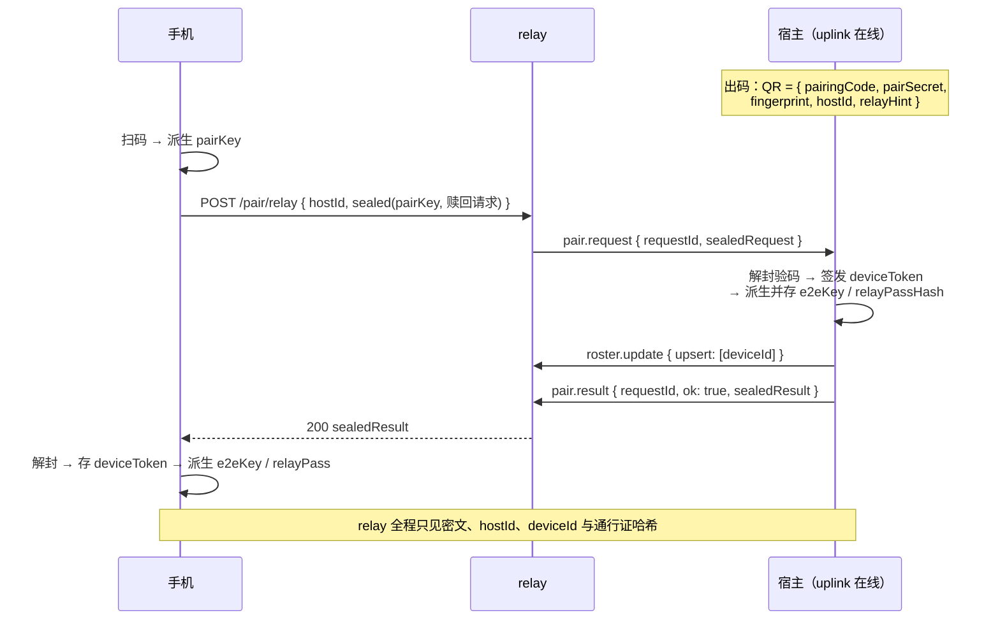
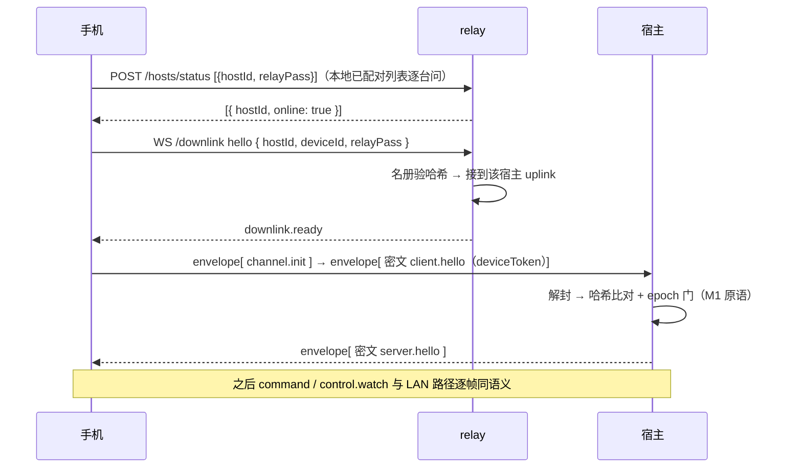

# Pier 会合云（relay）服务端设计

> 日期：2026-08-31（同日第二次修订：**去账号**——宿主身份密钥自证明 + 设备通行证；relay 零持久化。首版曾采用 GitHub OAuth 账号，经产品评审判定过重，已废弃）
>
> 状态：草案（待评审）
>
> 前置文档：[2026-08-26 移动端方案](2026-08-26-mobile-companion-design.md)（§9.2 / §17 冻结契约；第十三次修订「会合去账号」即本设计）、[M2 实施计划](../plans/2026-08-31-mobile-companion-m2-remote-wake.md)、[M2 收尾](../plans/2026-08-31-mobile-companion-m2-closeout.md)
>
> 本文是会合云服务端的实现设计单一来源。产品语义（为什么要会合云、闭环六条）以移动端方案为准；本文只回答「服务器端怎么做」。

## 1 定位：一台盲交换机，且无账号、零持久化

会合云解决且只解决一个问题：**手机和桌面都在 NAT / 防火墙后面，互相够不着；两边都能出站，所以让两边都拨到同一个中间点，由中间点接线。**（Happy 文档的比喻：邮局——双方都往外寄，邮局只搬信封。）

| 做 | 不做 |
|---|---|
| 宿主准入（身份密钥挑战签名，hostId = 公钥指纹，无法抢注） | **不做用户账号**（无注册、无登录、无 OAuth；未来配额/商业化需要时作为可选层 additive 引入） |
| 设备准入（宿主担保的通行证名册，relay 只见哈希） | **不持设备令牌任何形态**（令牌只对宿主出示，且在密文内传输） |
| 在线态与密文帧转发（按 `(hostId, deviceId)` 接线） | 不解密、不解析、不存帧、无消息信箱、**无任何数据库** |
| 配对赎回盲传（密文过手） | 不参与授权：`tokenEpoch` / 能力集核对永远在宿主 |
| 滥用防护（限速、名册准入、帧尺寸上限） | 不做推送（Web Push 由宿主直发，前置 §12）；不持仓库 / 文件 / 终端 |

**为什么可以这么薄**：① Pier 的同步原语是「revision 门控的全量快照」（`control.watch`），断线重连即拉最新帧，天然幂等——relay 不需要 Happy 那样的密文信箱（那是聊天消息流的产物）；宿主离线时手机本来就无事可做，无帧可存。② 准入所需的全部事实（谁是这台宿主、哪些设备被授权）都由宿主在连接期担保，relay 无需记住任何东西——**重启即全忘，宿主重拨即全恢复**。

## 2 总体架构

单 Node 进程（`apps/relay/`），HTTP 与 WebSocket 同端口；TLS 由部署层终结。**无数据库、无磁盘状态。**



关键点：**两端都是出站连接**。宿主不监听公网（LAN listener 是 M1 的另一条路径）；relay 是唯一公网可达的组件，而它手里既没有能读懂流量的钥匙，也没有值得偷的数据。

## 3 状态模型：全内存，无库

| 内存结构 | 内容 | 来源 | 重启后 |
|---|---|---|---|
| `Map<hostId, UplinkEntry>` | 宿主连接 + **设备名册** `Map<deviceId, relayPassHash>` + lastSeenAt | 宿主 `uplink.hello` 携带名册担保；配对/吊销经 `roster.update` 增删 | 宿主退避重拨自动重建 |
| `Map<connId, DownlinkEntry>` | 活跃手机管道 `{ hostId, deviceId }` | `downlink.hello` 对名册验证通过后建立 | 手机重连自动重建 |
| 限速滑窗 | 按 IP / hostId 计数 | 运行时 | 归零（可接受） |

- **在线态** = uplink Map 成员资格。**设备归属** = 该宿主名册——事实源是宿主自己的 `pairing-store`（`PierPairedDevice` 列表），relay 只是连接期的投影。
- **relay 重启的代价**：全部连接断开 → 宿主按退避重拨（秒级恢复在线并重新担保名册）、手机下次操作时重连。无状态丢失可言，因为本来就没有状态。无备份、无迁移、无 litestream。
- 契约层面：`PierHostRegistration` / `PierAccountRef` 为**保留位**（未来可选账号层），M2 不实现（前置文档 §17.3 第十三次修订注记）。

## 4 身份与信任：四种凭据，全部不依赖账号

| 凭据 | 谁签发 | 谁验证 | 证明什么 | relay 可见性 |
|---|---|---|---|---|
| 宿主身份密钥（Ed25519） | 宿主首启自生成（取代 M1 `instanceSecret`，后者就此退役——前置 §17.2「演进为宿主身份密钥」） | relay（连接期挑战签名）；手机（QR `fingerprint` 肉眼核验） | 「我就是 hostId 这台宿主」——hostId = sha256(公钥)，**自证明、无法抢注**；`fingerprint` = hostId 前 16 hex（同源派生，不再是独立概念） | 公钥可见（本就公开） |
| 设备通行证 `relayPass` | 双端各自从 `deviceToken` 派生（`HKDF, info="pier-m2-relay-pass"`） | relay（对照宿主担保的名册哈希） | 「这部手机被这台宿主授权使用 relay」 | 见原文（bearer，仅连接期）；名册中只有哈希 |
| 设备令牌 `deviceToken` | 宿主（配对赎回） | **仅宿主**（哈希比对 + `tokenEpoch`） | 命令执行的真正门票 | **永不可见**（密文内传输） |
| E2E 密钥 `e2eKey` | 双端各自从 `deviceToken` 派生（`info="pier-m2-e2e"`，与 relayPass 同根不同 info，互不可推） | 双端（GCM 认证） | 帧内容只有配对双方可读 | 永不可见 |

信任链：`QR（摄像头带外）→ pairingCode + pairSecret → 密封赎回 → deviceToken → { e2eKey, relayPass }`。全程没有出现「注册账号」这一步：**本地存储即身份**——手机丢了 localStorage 就等于丢了身份，重扫一次码即可（与账号版结局相同，因为令牌本来也在本地）。

推论：relay 被攻破 ≠ 用户数据泄露——攻击者只得到连接元数据与通行证哈希名册；连使用者的任何真实身份（邮箱 / GitHub）都不存在。这比 Tailscale DERP（盲转发）更进一步：DERP 背后还有账号化的协调服务器，Pier 的协调事实全部在宿主本机。

## 5 连接与帧协议

### 5.1 uplink（宿主 ↔ relay，每宿主一条常驻）

| 帧 | 方向 | 载荷 | 语义 |
|---|---|---|---|
| `server.challenge` | ←relay | `{ nonce }` | WS 建立后 relay 首发 |
| `uplink.hello` | 宿主→ | `{ hostId, hostPubKey, signature, roster: [{ deviceId, relayPassHash }] }` | `signature = sign(hostPrivKey, nonce)`；relay 校验 `hostId === sha256(hostPubKey)` 且签名有效 → 标在线 + 收名册。同 `hostId` 重复拨号踢旧连接（后来者胜） |
| `uplink.ready` | ←relay | `{}` | 注册完成 |
| `envelope` | 双向 | `{ deviceId, frame }` | 透传帧；wire 上 `hostId` 由连接隐含，只带复用所需的 `deviceId`。`frame` 载体见 §6。冻结契约 `pierRelayEnvelopeSchema` 全形（含 hostId）保留为概念路由元组与未来多区域 mesh 转发格式，不在单实例 wire 上出现 |
| `roster.update` | 宿主→ | `{ upsert?: [{ deviceId, relayPassHash }], remove?: [deviceId] }` | 配对成功 / 吊销时增删名册；`remove` 同时断开该设备全部 downlink |
| `pair.request` | ←relay | `{ requestId, sealedRequest }` | 赎回盲传（§5.3） |
| `pair.result` | 宿主→ | `{ requestId, ok, sealedResult }` | 结果本体密文；`ok` 仅用于 HTTP 状态码映射 |
| `downlink.gone` | ←relay | `{ deviceId }` | 该设备最后一条 downlink 已断开；宿主销毁虚拟通道，避免 remotePush 仍视为前台会话 |

保活：WS ping/pong 30s（对齐 M1）。断线：宿主指数退避重拨（1s→60s），「远程访问」关闭即停。

### 5.2 downlink（手机 ↔ relay，每「设备×宿主」一条按需）

| 帧 | 方向 | 载荷 | 语义 |
|---|---|---|---|
| `downlink.hello` | 手机→ | `{ hostId, deviceId, relayPass }` | 宿主离线 → `server.error host_offline`；在线则对照名册验 `sha256(relayPass)`，不符 → `server.error auth_failed` + close |
| `downlink.ready` | ←relay | `{}` | 管道就绪；此后手机发的第一个密文帧就是 M1 语义的 `client.hello`（含 deviceToken，宿主侧走既有认证） |
| 载体帧 | 双向 | `RelayEnvelopeFrame` **直发** | downlink 管道已绑定 `(hostId, deviceId)`，**不套 envelope 包装**（省一层 JSON 嵌套）；与 relay 控制帧（`downlink.ready` / `server.error`）以类型字段区分 |
| `server.error` | ←relay | `{ code: host_offline \| auth_failed \| rate_limited }` | 传输层错误；`device_revoked` 不由 relay 发——那是宿主的判定，密文帧内回 |

在线态查询（H1 主机列表的在线点）：`POST /hosts/status`，body `[{ hostId, relayPass }]` → 逐项返回 `online | offline`。宿主离线或通行证不符一律答 `offline`——**没有有效通行证就探测不到任何 hostId 的存在性**。

宿主中途离线：relay 向该宿主全部 downlink 发 `host_offline` 并关闭；手机按可重试处理（回主机列表）。

### 5.3 配对赎回（跨网 bootstrap，唯一的先有鸡问题）

赎回发生在还没有 `deviceToken` 的时刻，而响应体里恰恰有 `deviceToken`——**若明文过 relay，relay 可派生 e2eKey 与 relayPass，盲性全毁**。因此 QR 载荷含高熵 `pairSecret`（32 字节随机，additive 字段），双端派生 `pairKey = HKDF(pairSecret, salt=fingerprint)`，赎回往返全程用 `pairKey` 密封。6 位配对码保留人工输码语义，但**人工输码只允许 LAN 直连路径**（低熵码经 relay 可被离线穷举，relay 路径直接 403）。



安全门是 `pairingCode + pairSecret`（带外 QR）；名册担保只是准入记账。恶意 relay 无法凭空造出能通过宿主验码的赎回请求。

### 5.4 日常连接（每次打开手机）



## 6 E2E 密封与防重放

密封载体（envelope 的 `frame` 字段，联合类型；字段名对齐冻结契约 `pierRelayEnvelopeSchema.frame`）：

```ts
type RelayEnvelopeFrame =
  | { kind: "sealed"; v: 1; seq: number; iv: string; ct: string }      // AES-256-GCM；seq 入 AAD
  | { kind: "plain"; handshake: ChannelHandshakeFrame };               // 仅 channel.init / channel.ack
```

- **密钥派生链（PSK + ECDHE 混合，前向保密默认达成）**：`e2eKey = HKDF-SHA256(deviceToken, salt=fingerprint, info="pier-m2-e2e")`（长期认证根，随 `tokenEpoch` 轮换）→ 每次管道建立时握手帧交换随机 16 字节 nonce 与 **P-256 临时公钥**（`channel.init { clientNonce, clientEphPub }` / `channel.ack { hostNonce, hostEphPub }`，明文——盐与公钥都不是秘密）→ `channelKey = HKDF(e2eKey ‖ ECDH(临时密钥对), salt=clientNonce‖hostNonce, info="pier-m2-channel")`，临时私钥用后即弃。中间人分析：relay 替换临时公钥也补不出 `e2eKey`，GCM 必失败，只能造成断连（它本就能断连）——与 TLS-PSK-DHE / Noise psk 模式同型。
- **防重放**：每方向维护单调 `seq`（入 GCM AAD），接收侧拒绝 `≤` 已见值；跨管道重放因 `channelKey` 不同天然失效。
- **失败语义**：宿主侧无该 `deviceId` 的密钥（未配对 / 已吊销）或 GCM 认证失败 → 明文 `server.error`（`device_revoked` / `auth_failed`，载荷无敏感内容）→ 关闭该设备管道；手机侧解封失败 → 视为传输错误重建管道，连续失败提示重新配对。
- **relay 视角一览**（治理红线，源码级锁定）：

| relay 能看见 | relay 永远看不见 |
|---|---|
| hostId · deviceId · relayPass（连接期 bearer）与名册哈希 · 帧数与字节数 · 时间 | deviceToken（任何形态）· 帧内容（命令 / 快照 / 终端屏幕 / diff / 文件）· pairSecret · e2eKey / channelKey · 使用者任何真实身份 |

**选型说明（标准与自研的分界）**：

- 密码学**原语**零自研：HKDF-SHA256（RFC 5869）、AES-256-GCM、Ed25519、P-256 ECDH 全部来自平台标准实现（宿主 `node:crypto`、手机 WebCrypto）。自研的只是原语之上约两百行的**组合层**（派生链、channel nonce、seq）。
- 标准替代是 **Noise Protocol Framework**（Codex relay 即 Noise IK）：换来成熟的形式化分析背书，代价是浏览器可用的 Noise 库依赖。v1 取平台原语组合（零依赖、双端同构、向量可测），以 PSK+ECDHE 混合达成同级前向保密。
- **前向保密——默认达成**：channelKey 混入每管道 P-256 临时 ECDH，临时私钥即弃——deviceToken 事后泄露（如手机备份泄露）也解不开此前被恶意 relay 录下的密文。选 P-256 而非 X25519 只因 WebCrypto 覆盖面；本场景安全余量等价。
- **无账号准入的先例**：Happy（公钥挑战认证，无密码无邮箱）、herdr-mobile-relay（QR 即密钥）、RustDesk（ID + 密钥，无账号）、Tailscale DERP（NaCl box 证明持有所声称公钥）。账号制的四大厂（Codex/Claude/Cursor/Copilot）是因为其手机端本来就是自家已登录的账号 App——Pier 无此前提，无需为会合发明账号。

## 7 失效模式

| 场景 | 表现 | 恢复 |
|---|---|---|
| relay 进程重启 | 全连接断；内存态清零 | 宿主退避重拨并重新担保名册（秒级）；手机操作时重连。**无数据可丢** |
| 宿主睡眠 / 断网 | uplink 掉线 → 在线表移除 | 手机端主机列表转离线；宿主醒来重拨即恢复（对齐 Claude「睡醒自动重连」） |
| 同 hostId 双拨（多开 / 僵尸连接） | 后来者胜，旧连接被踢 | 唯一存活连接，避免脑裂；伪造者无私钥签不过挑战 |
| 手机切后台 / 断网 | downlink 掉线 | 回前台重建管道 + 重拉快照（M1 客户端退避逻辑复用） |
| 吊销 | 宿主发 `roster.update { remove }`；删 e2eKey/relayPassHash、epoch 递增 | relay 断该设备管道；手机收 `device_revoked` 转终态（M1 `FATAL_AUTH_CODES` 语义复用） |
| 背压（某端消费过慢） | 单连接出站队列超上限（4 MiB） | 断该连接（快照模型重连自愈），不做无界缓冲 |

## 8 滥用防护（首版随交付，不后补）

| 面 | 限额 | 超限行为 |
|---|---|---|
| WS hello | 失败 5 次/IP → 60s 拒绝（对齐 M1 LAN 限速）；名册外 downlink 直接拒 | 拒连 |
| 每宿主 | downlink 并发 ≤ 名册设备数 × 2 | 拒连 |
| envelope | 单帧 ≤ `LOCAL_CONTROL_MAX_FRAME_BYTES`（16 MiB，契约复用）；≤ 200 帧/s/连接 | 断连 |
| 赎回 | 10 次/时/hostId + 5 次/分/IP | 429 |
| /hosts/status | 60 次/分/IP | 429 |

## 9 可观测性与隐私红线

- 日志只含：伪匿名 id（hostId/deviceId）、事件类型、字节计数、错误码。**禁止**记录 envelope frame、relayPass 原文、任何令牌、pairSecret——治理测试对 relay 源码扫描日志语句。
- 指标：在线宿主数、活跃管道数、转发帧数/字节数、认证失败率、赎回成功率。`GET /healthz` = 进程活性。
- 无第三方分析、无 IP 归档（限速窗口过期即弃）、**无用户真实身份可泄露**。

## 10 部署形态与演进

### 10.1 是否需要自营服务器：是，且没有回避路径

这是 Pier 第一个需要长期运营的云端组件。产品承诺是「用户只看见 Pier、不填主机地址」（前置文档 G5，对齐四家会合模式），会合点必须由 Pier 官方持有。两条替代路径都不满足默认体验：用户 DIY（Tailscale / 自建网关）保留为逃生舱但不能当默认；借第三方中继则供应链与隐私不可控。运维负担被「无账号 + 零持久化」压到接近静态服务的水平。

### 10.2 v1 参考拓扑：一台机器跑全部

```text
手机 / 桌面（全部出站）
   │
   ├─ https://m.pier.codes        ← PWA 静态资源
   ├─ https://relay.pier.codes    ← HTTP（/hosts/status /pair/relay /healthz）
   └─ wss://relay.pier.codes      ← /uplink /downlink
   ▼
┌─ 1 台 VM（1 vCPU / 1 GB 起步）────────────────┐
│ Caddy（自动 HTTPS，Let's Encrypt）              │
│   ├─ m.pier.codes      → /srv/mobile-web 静态   │
│   └─ relay.pier.codes  → reverse_proxy :8787    │
│ relay 容器（node:24-slim，无 volume、无库）      │
└───────────────────────────────────────────────┘
```

- 区域选主要用户低延迟处；内测建议香港 / 新加坡（免备案、中美双向可达）。多区域是演进项（10.7），不挡 v1。
- 静态资源 v1 与 relay 同机（Caddy 直接托管），后续可整体挪 CDN——**origin 域名不变即可**，令牌与推送订阅不受影响。
- 配置全环境变量（`RELAY_PORT` / `RELAY_PUBLIC_URL` / 限速参数）。dev/staging 经宿主 `PIER_RELAY_URL` override 指向测试实例。**无数据库连接串、无密钥材料**——relay 进程里没有任何秘密可配。

### 10.3 发布流水线

- **本地**：仓库根 `pnpm dev:relay`（默认 `:8787`），`GET /healthz` → `{"ok":true}`。桌面 `PIER_RELAY_URL=ws://127.0.0.1:8787 pnpm dev`。命令与环境变量清单：[`apps/relay/README.md`](../../../apps/relay/README.md)。
- **relay**：GitHub Actions 触发于 tag `relay-v*` → `docker build` → 推 GHCR → SSH 到 VM `docker compose pull && up -d`。当前 workflow 先做构建校验（dry-run）；接入部署密钥后启用推镜像与 SSH。重启即全连接断开，宿主秒级重拨（§7），**发布无需停机公告，也无 schema 迁移**（无库）。
- **mobile-web**：Actions 触发于 tag `mobile-web-v*` → `pnpm build:mobile-web` → rsync 产物到 `/srv/mobile-web`。SPA 无 SW fetch 缓存（M2 计划 Task 10），刷新即最新版。
- 与宿主发布解耦：协议帧版本化 + 能力广告（前置 §9 末条），过旧一侧收 `protocol_too_old` 引导升级。

### 10.4 灾难半径

relay 无状态，「全丢」这个概念不存在；最坏情况（机器永久损毁）= 换台机器重新 `compose up`，宿主重拨即恢复。设备令牌、能力集、E2E 密钥、推送句柄全部在宿主与手机上。

### 10.5 成本量级

VM $5–10/月 + 子域名 $0（`pier.codes` 已有）+ 证书 $0（Let's Encrypt）。无对象存储、无备份成本。合计每月十美元级。

### 10.6 容量与演进

- **容量直觉**：转发是内存拷贝 + WS 写，单实例数千宿主常驻连接无压力（DERP 单节点承载整区域的先例）；瓶颈先到带宽而非 CPU。
- **演进路径（非 v1）**：静态挪 CDN → relay 多区域（hostId 粘性路由：一致性哈希或共享在线表，参照 DERP 区域 mesh——区域内互转、区域间不路由；**零持久化让多区域无需共享数据库**，只需共享在线表）→ P2P 打洞（RustDesk hbbs 形态）作带宽优化。全部不改帧契约与密封层（传输无关性，前置 §9.1 末条）。
- **未来账号层（触发条件明确才做）**：按账号配额计费、跨设备漫游主机列表、团队共享宿主——届时以 additive 方式启用 `PierAccountRef` / `PierHostRegistration` 保留位，现有无账号路径继续可用。

### 10.7 运行时选型：Node/TS，而非 Rust / Bun / Go

- **成本地板是 VM，不是运行时**：v1 负载（数千空闲长连接、转发 = 内存拷贝）下 Node 与 Rust 跑在同一档 $5–10 VM 上；到量后瓶颈也先到带宽。
- **契约单一来源是硬收益**：relay 直接 import `src/shared/contracts/**` 的 zod schema、与宿主/Web 壳共享密封测试向量；换语言 = 契约双写 + 漂移风险。§13 治理（relay 源码扫描、vitest in-process 冒烟）同样依赖同仓 TS。
- **Bun 单列**：性能收益在本负载下是边际量；且测试与治理链跑在 Node/vitest 上，代码必须 runtime-agnostic 才可测——Bun 专有 API 恰好用不上。
- **规模化逃生舱**：协议冻结 + relay 零业务零状态，未来把**转发面**用 Rust/Go 重写是低风险平移（DERP 即 Go）。推迟到 10.6 多区域阶段一并评估。

## 11 威胁模型

| 攻击者 | 能做什么 | 拿不到什么 | 缓解 |
|---|---|---|---|
| 攻破 relay / 恶意运营者 | 看连接元数据、断服务、回放密文帧 | 帧内容、令牌、配对能力、使用者真实身份 | E2E + AAD seq 防重放 + 信任根在带外 QR + **无账号可泄露** |
| 抢注 / 冒充 hostId | 不可能 | — | hostId = 公钥指纹，挑战签名自证明 |
| 网络中间人 | 无（外层 TLS + 内层 E2E 双重） | — | wss 强制 |
| 偷到 relayPass（不含令牌） | 占管道向宿主发垃圾密文 | 读不了任何帧、执行不了任何命令（无 deviceToken/e2eKey） | 宿主丢弃垃圾帧；吊销换 epoch 即换全部派生密钥 |
| 偷到手机（未锁屏） | 以该设备身份操作 | 其它设备 / 宿主本体 | 桌面按设备吊销即断（epoch + `roster.update remove`） |
| 拿到 QR 截图（5 分钟窗口内） | 完成一次配对 | — | 码一次性 + 5 分钟过期 + 设备列表可见可吊销（与 Codex「一机一码」同险面） |

## 12 业界对照

| | Pier relay | Tailscale DERP | RustDesk hbbs/hbbr | Happy server |
|---|---|---|---|---|
| 账号 | **无**（宿主公钥自证明 + 设备通行证） | 无（DERP 层键即地址；协调服务器另有账号） | 无（ID + 密钥） | 无传统账号（公钥挑战，无密码邮箱） |
| 角色 | 准入 + 在线态 + 盲转发 | 盲转发（键即地址） | 注册 + 打洞协调 + 中继兜底 | E2E 信箱 + 转发 + 推送 |
| 持久化 | **无** | 无 | SQLite（peer 表） | Postgres（密文消息，多端同步需要） |
| 打洞 | 无（后补） | disco 优先直连 | 优先直连 | 无 |

## 13 检查点（随 M2 Task 12 落地）

- `tests/unit/relay/governance.test.ts`：① relay 源码无帧解析（禁 import `e2e-seal`、禁解析 envelope `.frame` 内容 / 解构 `ct`）；② **零持久化锁**——`apps/relay/src/**` 禁 import `node:sqlite` / `node:fs` 写路径；③ **无账号锁**——源码无 `oauth` / `github` / `accountId` 业务字样（保留位契约 import 除外）；④ 日志语句无 frame / relayPass / 令牌字段；⑤ 赎回路径断言只经手密文（无 `deviceToken` 字面量）。
- `tests/unit/relay/forward.test.ts`：§5 全部帧语义（挑战签名、名册担保、roster.update、status 端点不泄露存在性）+ §7 失效模式逐条。
- `tests/unit/main/pairing/e2e-seal.test.ts` + `tests/unit/mobile-web/e2e-seal.test.ts`：共享向量互解 + seq 防重放 + 跨管道重放失效 + relayPass/e2eKey 同根不可互推（info 隔离）。
- 宿主侧「只出站」：uplink 源码无 `.listen(`（并入既有 remote-control governance）。

## 14 开放项（均为采购操作，设计与实现不被阻塞）

- 最终域名确认（推荐 `m.pier.codes` + `relay.pier.codes` 子域）与 VM 供应商下单（10.2 给出规格与区域建议；内测可先用测试域名，切正式域名 = 换 Caddy 配置 + 重发 QR，令牌不失效——令牌认宿主不认 relay 域名）。
- ~~GitHub OAuth App 创建~~（去账号后不再需要）。
- 滥用应对预案观察项：若出现无差别流量攻击，评估在 Caddy 层加 IP 信誉过滤（不引账号）。
