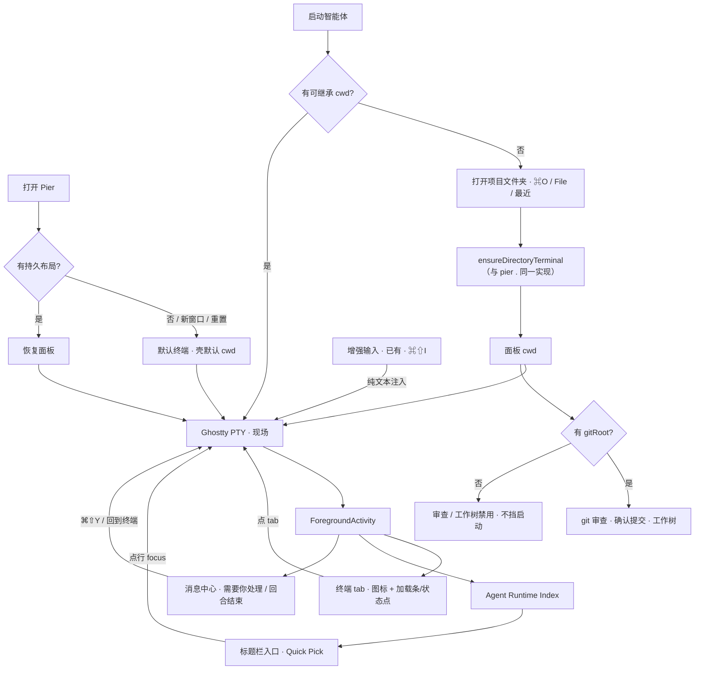
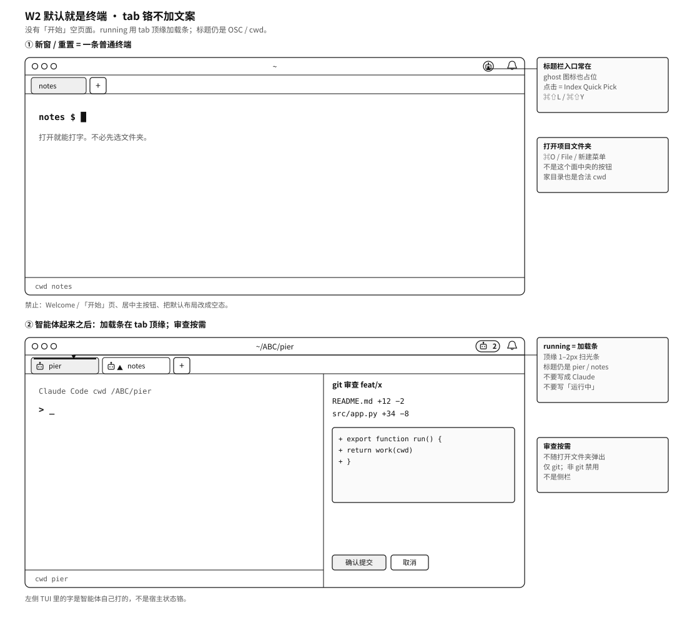
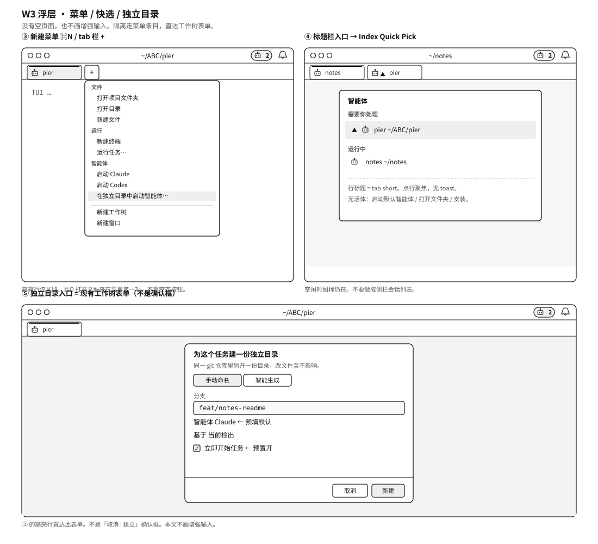

# 工作台体验与人体工程学

日期：2026-09-03  
状态：现行权威（设计定稿 · 待实施）  
范围：把 Pier 放进 2026 年「监督智能体写代码」品类里对照，锁定桌面落地：默认就是终端、打开项目文件夹、标题栏入口常在、tab 注意标记沿用现有铬、门控续跑、工作树说明。  
不包含：Welcome / 「开始」空页面、移动端视觉 / T2、Canvas 作者工具、宿主聊天 transcript、会话管理器、云执行、常驻智能体侧栏、把窗口改成 VS Code「一文件夹一窗口」、给增强输入做新的发现入口。  
与 [`2026-07-15-agent-runtime-index-and-attention-design.md`](./2026-07-15-agent-runtime-index-and-attention-design.md) §6.1「v1 不做侧栏」一致：活体的「那一行」是终端 tab，跨窗总览是 Index Quick Pick，本文不新增列表区域。

相关规格（本文不另写一份）：

| 主题 | 规格 | 本文关系 |
|---|---|---|
| `pier .` 确保终端工作面 | [`2026-08-29-cli-path-open-design.md`](./2026-08-29-cli-path-open-design.md) | GUI 打开文件夹复用同一实现 |
| 新建菜单分组标题 | [`2026-09-02-command-list-heading-gold-standard.md`](./2026-09-02-command-list-heading-gold-standard.md) | 只改分类序 |
| Index 不是 Session Manager | [`2026-07-15-agent-runtime-index-and-attention-design.md`](./2026-07-15-agent-runtime-index-and-attention-design.md) | 标题栏入口与 Quick Pick 只消费 Index |
| Agent 状态模型 | [`2026-08-25-agent-status-industry-alignment.md`](./2026-08-25-agent-status-industry-alignment.md) | 状态词不改 |
| 面板 tab 铬 | [`2026-08-29-panel-tab-chrome-gold-standard.md`](./2026-08-29-panel-tab-chrome-gold-standard.md) | running 顶缘加载条不改；本文不加状态文案 |
| 移动端 | [`2026-08-26-mobile-companion-design.md`](./2026-08-26-mobile-companion-design.md) | 不映射 dockview |
| 增强输入 | [`../../archive/superpowers/specs/2026-07-22-rich-input-structured-composer-design.md`](../../archive/superpowers/specs/2026-07-22-rich-input-structured-composer-design.md) | 已实现；本文不补发现性 |
| 能力边界 | [`../../archive/superpowers/specs/2026-06-25-ai-workbench-capability-scorecard.md`](../../archive/superpowers/specs/2026-06-25-ai-workbench-capability-scorecard.md) | 不做项不变 |

竞品调研的证据与逐产品心智见附录 A；正文只写结论与决策。

---

## 1. 结论

### 1.1 市场是三件产品

| 族 | 用户心智 | 代表 | Pier |
|---|---|---|---|
| **A 本地终端工作台** | 智能体还是原来的 CLI；工作台让我看见谁在等、隔开目录、在旁边看 diff | Warp、herdr、Orca、cmux、Ghostty、Claude Squad | **是** |
| **B 宿主指挥中心** | 会话是聊天线程；宿主 spawn；diff 围着线程 | Codex App、Cursor Agents Window、Claude Desktop · Code、VS Code Agents Window、Zed ACP | 否——做成 B 就要 transcript、会话列表当真源 |
| **C 云同事** | 发消息给一直开机的队友；合盖也在跑 | Grok Bot、Cursor Cloud Agents、Codex cloud、Claude Cowork、Amp Orbs | 否——可当未来插件交接，不能当宿主默认 |

### 1.2 A 族主循环

**打开 Pier 就是终端 → 需要时把这个窗口的工作面切到一个文件夹 → 启动智能体 → 谁在等一眼能跳回去 → 若是 git，在同一应用里看 diff。短指令打在 TUI；长提示仍走已有的增强输入，不另做入口。**

Pier 后半段（状态、审查、增强输入、通知）已在。缺的是：**打开文件夹埋在设置 → 项目，标题栏智能体入口在空闲时消失，`⌘⇧A` 与附件抢快捷键。** 缺的不是一张空页面。

### 1.3 两条底线（全文只写这一次）

1. **地方先于智能体。** 启动智能体 / 运行任务 / 打开文件树需要可继承的面板 cwd。壳默认目录（常是家目录）也是合法的地方——不要用空页面把终端挡住，再逼用户「先选文件夹才能看见壳」。
2. **git 是附加能力，不是门票。** 审查、确认提交、工作树、分支芯片只在 `gitRoot` 存在时可用；启动智能体、tab 状态、标题栏入口与 git 无关。代码已是 `projectRootPath = gitRoot ?? cwd`（`panel-context-resolver.ts`），路径门控 `projectPathFromContext` 也回落到 `cwd`——本文不允许任何新入口倒退成「请先打开 git 仓库」。

### 1.4 方向审查（相对上一稿）

| 方向 | 判定 |
|---|---|
| 默认 / 新窗 / 重置 = 普通终端 | **成立。** 空页面（Welcome / 「开始」）取消，不再做 |
| `打开项目文件夹`（`⌘O` / File / 新建菜单 / 最近） | **成立。** 这是切工作面的动作，不是入场门票 |
| 标题栏智能体入口常在 + Index Quick Pick | **成立** |
| tab 即那一行；不做侧栏 | **成立。** 视觉沿用顶缘加载条 + 状态点，**不加文案、不改 OSC 标题** |
| 路径门控续跑 | **成立。** 默认已有终端时几乎不触发；无 cwd 的边角仍要能先选文件夹再跑 |
| 审查按需、仅 git | **成立** |
| 第二个任务走菜单条目，不弹确认框 | **成立** |
| 回合结束通知附「查看更改」 | **成立** |
| 给增强输入加状态栏开关 | **不做。** 能力已在，`⌘⇧I` 维持；本文只拆 `⌘⇧A` 双义 |

---

## 2. 产品词

面向用户的词；实现词不进菜单 / toast 标题。

| 用途 | zh-CN | en |
|---|---|---|
| 新命令 | 打开项目文件夹 | Open Project Folder |
| File 子菜单 | 最近的项目 | Recent Projects |
| Index 空态（已检测到 CLI） | 启动默认智能体 | Start Default Agent |
| Index 空态（未检测到） | 安装智能体 | Install an Agent |
| 标题栏入口（无活体） | 智能体 | Agents |
| 新建菜单隔离入口 | 在独立目录中启动智能体… | Start Agent in a Separate Directory… |
| 工作树创建对话框标题 | 为这个任务建一份独立目录 | New working directory for this task |
| 已有 `pier.files.openDirectory` | 打开目录 | Open Directory |
| 已有工作树 | 工作树 | Worktree |
| 增强输入（禁止「富文本」；本文不新写入口文案） | 增强输入 | Rich Input |

必须分清的三对：

| 这个 | 不是那个 |
|---|---|
| **打开项目文件夹**：选文件夹并确保本窗终端工作面 | **打开目录**：给已有锚点的项目打开 Files 树 |
| **打开项目文件夹**：进入工作 | **添加项目**（设置 → 项目）：登记环境 / 技能 / MCP |
| **项目文件夹**：你正在工作的任意文件夹 | **git 仓库**：只决定审查 / 工作树是否可用 |

禁止用「开始」「Welcome」当用户可见的窗口空态标签。

---

## 3. 人体工程学规则

| # | 规则 | 违反时的体感 |
|---|---|---|
| E1 | 打开 Pier = 终端。禁止 Welcome / 「开始」空页面挡在壳前面 | 像 IDE 启动页；A 族用户打不开就能打字 |
| E2 | 活体必须占一条可见行——在 Pier 就是终端 tab；空闲时也要有入口 | 标题栏空白 = 产品不存在；或再造一个列表复述 tab |
| E3 | 注意力画在那一行上：running 用现有顶缘加载条，waiting / failed 用状态点；再加零选择跳转。不加「运行中」文案 | 铬变重；或只有全局快捷键 |
| E4 | 并行隔离是可发现的入口，不是强迫，也不是弹窗 | 非 git 被强迫 clone；或每次启动都被问一次 |
| E5 | 有 git 时审查在工作台内，提交是一次确认；无 git 则入口禁用、不挡启动 | 非 git 弹出审查空壳 |
| E6 | TUI 是现场。增强输入按需、默认关；本文不新做开关 | 把 Pier 收成聊天窗 |
| E7 | 手机不映射面板目录；云同事是另一产品 | 半成品第二 IDE；空态学 Bot |

不抄：聊天线程当现场、每任务强制 worktree、Bot / 云 VM 当默认执行面、看板主键、ACP 宿主驱动、PTY 搬进外部 daemon 当唯一运行时、编辑器式欢迎页。

---

## 4. 目标架构

现场 = PTY。ForegroundActivity（FA）是状态唯一语义源：本窗 tab 铬吃按窗 FA，标题栏入口与 Quick Pick 吃 Index（本机投影）；两者都不存历史、不拥有进程。窗口仍是多路径锚点工作台。



桌面骨架（目标态）：

- 标题栏：路径长名 · 智能体入口（常在，点开 Quick Pick）· 铃铛
- dockview tab：智能体图标 + running 顶缘加载条或 waiting/failed 状态点 + OSC / cwd 标题；`+` = 新建菜单。dockview 之外不加第二个列表
- dockview 内容：终端 TUI 为主；审查、文件树按需。不要空页面占一个 tab

---

## 5. 能力前提与门控（单一真源）

| 能力 | 需要工作目录 | 需要 git | 需要活体 | 缺前提时 |
|---|---|---|---|---|
| 打开项目文件夹 | 否（自己就是选目录） | 否 | 否 | — |
| 启动智能体 / 运行任务 / 打开目录（文件树） | 是（含壳默认 cwd） | 否 | 否 | 无任何可继承 cwd 时：菜单禁用并显示理由；键盘 / 命令面板触发 → 先选文件夹再续跑（§7.4）。未检测到 CLI → 打开设置 → 智能体 |
| 新建终端 | 否 | 否 | 否 | 无可继承 cwd 时用壳默认目录 |
| 标题栏入口 / Quick Pick / `⌘⇧Y` | 否 | 否 | 否 | 图标常在；空态分流见 §7.3 |
| 增强输入 | 跟当前终端 | 否 | 是 | 普通 shell / 任务终端不可用；本文不改入口 |
| git 审查 / 确认提交 / 评论回智能体 | 是 | 是 | 否 | 禁用；理由「当前文件夹不是 git 仓库」；不弹选目录 |
| 新建工作树 / 在独立目录中启动 | 是 | 是且 `worktreeSupported !== false` | 否 | 同上；不支持工作树时理由「当前仓库不支持工作树」 |

文案见 §7.8。默认窗口已有终端时，「无工作目录」几乎只出现在无面板上下文的边角（例如命令面板在窗口尚未 ready 时）。不要为了让门控好看而造一张没有 cwd 的空页。

---

## 6. 冻结决策

### 6.1 窗口与布局

| # | 决策 | 理由 |
|---|---|---|
| **K1** | 窗口仍是 dockview 多路径锚点工作台。打开文件夹 = 在**当前窗**确保该路径的普通终端工作面 | 已有 `pier .` 语义；手机按会话工作树投影，不能改成「窗口 = 唯一项目」 |
| **K2** | 默认布局 = 一条普通终端。`applyDefaultLayout` 与 `resetLayout` 必须是同一函数，且就是今天的 `terminal-1`，**禁止改成 welcome** | A 族打开就是壳；空页面会挡打字 |
| **K3** | 删除 `pier.panel.newTab`（今天 `addTab()` 会新建 Welcome）。插件禁用清空布局时的补位改默认终端，禁止再补 Welcome | Welcome 不是可新建的标签类型；空页会污染工作中的窗口 |
| **K4** | 「最后一个面板关闭 = 关窗」不变。任何路径都**不得**插入空页面来避免关窗 | 不改 `⌘W` 肌肉记忆 |
| **K5** | 打开文件夹**不**自动开 Files / Changes；不关用户正在用的其他终端 | 确保工作面只保证这个目录里有一条普通终端 |

### 6.2 打开项目文件夹

| # | 决策 | 理由 |
|---|---|---|
| **K6** | `pier.project.openFolder`：系统选目录 → `recordOpen` → 走与 `pier .` 同一条 `ensureDirectoryTerminal`。renderer 禁止自己 `addTerminal({ cwd })`；main 的 `commandForSender` 给 `panel.open` 注入发起窗 `windowId` | 确保工作面只准一处；今天 `panel.open` 从 renderer 发出时落到「最近聚焦窗」而非发起窗 |
| **K7** | 登记只写索引，不写用户目录：新增 `localEnvironments.recordOpen(path)`——realpath；主 checkout 进 `projects`、linked worktree 进 `worktreeBindings`（沿用现有折叠规则）；被打开的那条写 `lastOpenedAt`；**不** seed `.pier/environment.json`（只有设置页编辑环境时才写）；Pier Home 在选目录后前置拒绝、不进最近列表 | 现有 `addProject` 会往任意文件夹写盘、把工作树折叠成主仓、对 Home 抛错 |
| **K8** | 最近的项目 = 项目条目 ∪ 工作树绑定，按 `lastOpenedAt` 降序取 8，显示用户实际打开的路径；入口在 File 子菜单，不在空页面 | `updatedAt` 是环境配置修改时间，重开不会上浮 |
| **K9** | `⌘O` → openFolder；`⌘N` 仍是新建菜单；`⌘P` 仍是快速打开文件；新建窗口只在菜单 / 新建菜单 / 命令面板。`pier.project.openFolder` 进 `APP_HANDLED_NATIVE_TERMINAL_COMMANDS` | 终端 NSView 持键盘时只转发白名单和弦 |
| **K10** | 设置 → 项目的「添加项目」保持登记语义 | 设置页不是打开项目的入口 |

### 6.3 门控

| # | 决策 | 理由 |
|---|---|---|
| **K11** | 路径门控续跑契约（§7.4）：菜单里显示禁用 + 理由；键盘 / 命令面板 Enter 触发 → 先 openFolder，成功用新工作面的 invocation 重跑原 handler；取消静默 | 今天快捷键只 toast 原因；失败要变成下一步 |
| **K12** | git 能力门控只禁用、只说「不是 git 仓库」，不弹选目录。无 cwd 时先走 K11，仍不是 git 再禁用 | git 能力才绑 git |
| **K13** | 新建终端不受路径门控；无可继承 cwd 时用壳默认目录 | 新窗口上「新建终端」应仍可开；今天 `activeTerminal` 偏好下会禁用 |

### 6.4 智能体入口与注意标记

| # | 决策 | 理由 |
|---|---|---|
| **K14** | 标题栏智能体入口常在（`AgentIndexCountsControl` 不再返回 `null`）。点击 = 现有 Index Quick Pick；空态主项分流：有可继承 cwd 且检测到 CLI → 启动默认智能体；无可继承 cwd → 打开项目文件夹；未检测到 → 安装智能体。Index 空态的「启动默认智能体」必须过同一路径门控 | 无活体退路；今天空态直接 `handleNewAgent` 绕过门控 |
| **K15** | 不做常驻现场条 / 智能体侧栏。「那一行」= 现有终端 tab 铬：`activityTabChromeOverlay` 写智能体图标；`running` = `.pier-tab-running-bar` 顶缘加载条；`waiting` / `failed` = 状态点（已有 warning / danger 色）。标题仍是 OSC / cwd / 用户钉名。**不加状态文案、不把标题改成 Claude / Codex。** tab 溢出或跨窗由标题栏计数 + Quick Pick + `⌘⇧Y` 承接 | 加载条已经在说话；再写字过重。Index 规格 §6.1 仍成立 |
| **K16** | `⌘⇧A` 只属于 `pier.agent.new`；`pier.terminal.composerAttach` 去掉快捷键，纸夹按钮留在增强输入内 | 同一和弦两义是假动作 |

### 6.5 输入与工作树

| # | 决策 | 理由 |
|---|---|---|
| **K17** | 增强输入保持既有规格：仅活体终端、按需、`⌘⇧I`、默认关。本文**不**加状态栏开关、不改默认 | 能力已在；再做一个入口会让人以为要把 TUI 收成聊天 |
| **K18** | 第二个任务的隔离是**入口**，不是弹窗：当前 `worktreeKey` 内已有活体智能体 ∧ `gitRoot` ∧ `worktreeSupported !== false` 时，新建菜单出现「在独立目录中启动智能体…」→ 直达工作树表单，预填默认智能体、「立即开始任务」= 开。`⌘⇧A` / Index 空态 / 「启动 X」永远同 cwd 直接启动。非 git 不出现该项 | 同一 cwd 叠多个智能体合法；弹窗规范禁止「记住上次」，确认框会成为永久打断 |
| **K19** | 工作树产品词不变。创建对话框标题「为这个任务建一份独立目录」，说明「同一 git 仓库里另开一份目录，改文件互不影响。」；命令面板仍「新建工作树」 | 教目的，不改名词 |

### 6.6 通知

| # | 决策 | 理由 |
|---|---|---|
| **K20** | `agent.turn-finished` 主 action「回到终端」（现有 `focus-panel`）。main ingest 时对该 cwd 的 `gitRoot` 跑一次 `git status --porcelain`（限时 1 s；失败 / 超时视为无变更），有变更才附「查看更改」（新 action `open-review` → `git.openReviewPanel`）。非 git 不出现 | 不要只落 inbox；非 git 不要假的审查入口 |

### 6.7 不做

- Welcome / 「开始」空页面；默认布局、新窗口、重置、插件补位、最后一个面板关闭，任何一条都不得插入空页
- 自动打开 Files 树或默认「树 | 终端」分屏
- 一窗口只能一个项目；把 `cd` 换仓废掉
- 常驻现场条 / 智能体侧栏；Index 做成会话侧栏 / 协作台 / transcript 库
- 在 tab 上写「运行中 / 需要你处理」文案，或把 tab 标题改成 provider 名
- 默认打开增强输入；把 TUI 收成聊天窗；给增强输入加状态栏开关（本文范围）
- 第二套项目对象或 userData 账本（只在现有 `local-environments.json` 条目上加 `lastOpenedAt`）
- 第二个任务前弹确认框
- 改 OSC 标签主标题规则
- 空态出现「创建 Bot / 打开 Canvas / 配对手机」
- 移动端 / Canvas 专项体验（本文不改 `apps/mobile-web`）

---

## 7. 表面规格

视觉稿用独立 SVG、正文用图片引用（当图看，不当内嵌 DOM）。几何与文案以本节框线为准；图中不出现空页面、智能体侧栏、「独立目录」确认框、增强输入发现开关。





### 7.1 默认窗口

出现条件：无持久布局、新窗口、重置布局、插件禁用清空后的补位。结构就是今天的一条普通终端。

```
┌ 红绿灯 ────────────── ~/ ──────── [智能体] [铃] ┐
│ [ notes ] [+]                                       │
│                                                     │
│  notes $ █                                          │
│                                                     │
└─────────────────────────────────────────────────────┘
  壳默认 cwd。标题栏路径和 tab 标题让人看见自己在哪。没有「开始」页。
```

- 标签短名走现有终端规则（OSC / cwd basename），不是「开始」或 `Welcome`。
- 标题栏智能体入口即使无活体也在（K14）。
- 「打开项目文件夹」在 File / `⌘O` / 新建菜单，不在这个面的中央按钮。

### 7.2 打开项目文件夹

| 项 | 值 |
|---|---|
| id | `pier.project.openFolder` |
| surfaces | `command-palette`、`create-menu`、系统 File 菜单 |
| 门控 | 无 |
| categoryKey / group / sortOrder | `file` / `1_new` / `0`（文件组第一条） |
| 参数 | 可选 `path`（File「最近的项目」传入时跳过选目录） |

步骤：

1. 无 `path` → `environments.pickProjectDirectory()`（现有 IPC）；取消 → 结束，无 toast。
2. Pier Home → 结束，`toast.error`「Pier 主目录不能作为项目打开」。
3. `localEnvironments.recordOpen(path)`（K7）；失败仍继续开工作面，登记失败走 `showAppAlert`，不回滚。
4. renderer 发 `panel.open { paths: [{ path }] }`；main 注入发起窗 `windowId`（K6），`ensureDirectoryTerminal` 以 `source: "command"` 解析上下文：已有匹配的普通终端（非智能体、非任务）→ focus；否则新建终端。
5. 成功靠终端出现 / 聚焦，禁止 success toast。不关其他面板。
6. 目录不存在 / 无权限 → `showAppAlert`，body 为系统错误，下一步提 macOS 文件夹权限。

与相邻命令：

| 命令 | 关系 |
|---|---|
| `pier .` / `panel.open` 目录 | 同一 ensure；本命令多 GUI 选择 + `recordOpen` |
| `pier.files.openDirectory` | 仍要求已有锚点；打开树，不选新文件夹 |
| 设置「添加项目」 | 只登记（会 seed 环境文件）；不改 |

嵌套 Pier 终端、`--split`、生产包拉起仍走 CLI 规格。

### 7.3 系统菜单、新建菜单、标题栏与 tab

File 菜单（四语进 `src/shared/i18n/app-menu.ts`）：

```
文件
  打开项目文件夹        ⌘O
  最近的项目          ▶   索引为空时 disabled
  ────────
  新建窗口
  新建终端              ⌘T
  关闭面板              ⌘W
```

- 应用菜单在 main 构建；除 `preferences.changed` 外还要在 `ENVIRONMENTS_CHANGED` 时重建，子菜单才会跟索引走。
- `MENU_COMMAND_REQUEST` 载荷从 `commandId` 扩为 `{ commandId, args? }`；点最近项 = renderer 执行 `pier.project.openFolder` 带 `args.path`。

新建菜单（`⌘N` / `+`）：只改 `CREATE_MENU_CATEGORY_ORDER` 为 `file → run → panel → worktree → window`；标题门槛、合并单项、智能体抽出、无「最近」块一律不改；同步改分组标题金标准第 4 条与草图。

```
文件
  打开项目文件夹
  打开目录                     ← 无可继承 cwd：禁用；键盘触发走 K11
  新建文件
运行
  新建终端
  运行任务…
智能体
  启动 Claude                  ← 不要求 git
  启动 Codex
  在独立目录中启动智能体…       ← 仅 K18 条件成立时出现
新建工作树                     ← 非 git：禁用「当前文件夹不是 git 仓库」
新建窗口
```

标题栏（mac `title-bar.tsx` 与非 mac `agent-index-chrome-bar.tsx` 同位）：

| 状态 | 标题栏 | 终端 tab（本窗） |
|---|---|---|
| 无运行中、无需要你处理 | ghost `Bot` 图标，aria「智能体」；28×28 位始终占着 | 普通 tab（OSC / cwd） |
| 仅运行中 | 现有 info 点 + 数字 | 智能体图标 + **顶缘加载条**（已有 `.pier-tab-running-bar`） |
| 有需要你处理 | 现有 warning 点 + 数字 | 智能体图标 + `waiting` 状态点（已有 warning 色） |

点击标题栏 = 现有 `openAgentIndexQuickPick`；空列表主项：

| 条件 | 主项 | accept |
|---|---|---|
| 有可继承 cwd 且已检测到智能体 | 启动默认智能体 | `pier.agent.new`（过路径门控） |
| 无可继承 cwd | 打开项目文件夹 | `pier.project.openFolder` |
| 未检测到智能体 | 安装智能体 | `openSection("agents")` |

tab 就是那一行：

```
┌ 红绿灯 ──────────── ~/ABC/pier ───── [🤖 2] [铃] ┐
│ [🤖 pier ≡] [🤖 notes ▲] [+]     │ git 审查 (feat/x) │
│                                  │ README.md  +12 −2 │
│  （TUI，标题仍是 OSC / cwd）        │ src/app.py +34 −8 │
│  > _                             │ [确认提交] [取消] │
└──────────────────────────────────────────────────────┘
  ≡ 顶缘加载条 = running；▲ waiting。不要在 tab 上写「Claude」「运行中」。
```

- 铬沿用现状：`activityTabChromeOverlay` + `.pier-tab-running-bar`；本文不改几何、不加文案。
- 总览与跨窗：标题栏计数 + Quick Pick（`⌘⇧L`）；行内容用 `resolveAgentListTitle`，与 tab short 一致。`⌘⇧Y` 零选择跳转，无目标 toast「没有需要处理的智能体」。
- tab 溢出看不见加载条时，依赖标题栏计数与消息中心投递（Index 规格已接受的取舍）。
- 审查面板只在 git 且用户打开时出现，不随打开文件夹自动弹出。协作视图 `pier.agents.collaboration` 仍只在命令面板。

### 7.4 门控续跑契约

今天：`projectPathActionDisabledReason` 只让菜单禁用、快捷键 toast 后结束。改为：

| 触发面 | 无可继承 cwd 时 |
|---|---|
| 新建菜单 / 右键菜单 | 显示禁用 + 理由，点击不动 |
| 快捷键 | 走 fallback |
| 命令面板 Enter 禁用项 | 走 fallback |
| Index 空态主项 | 走 fallback |

契约：

- `ActionContribution` 新增 `fallback?: "open-project-folder"`；插件 `context.actions.register` 透传同一字段（`RendererPluginAction`），宿主 dispatcher 统一处理，插件不另写选目录逻辑。
- fallback 流程：执行 `pier.project.openFolder` → 成功后用 `{ sourcePanelId, sourcePanelGroupId, sourcePanelContext }` 重跑原 handler，其中 `sourcePanelContext` 直接取 `panel.open` 返回的 `context`，不等待新面板 descriptor 异步写入。
- 续跑传入的 `sourcePanelContext` 视为显式锚点，优先于 `terminalNewCwdPolicy`（`shellDefault` 不得把刚选的目录静默换成家目录）。
- 用户取消选目录 → 中止，不 toast；openFolder 失败 → `showAppAlert`，不重跑。
- 未检测到智能体：优先 `openSection("agents")`；设置打不开再 `showAppAlert`。
- 加 `fallback` 的动作：`pier.agent.new`、`pier.agent.start.*`、`pier.run.task`、`pier.files.openDirectory`。git 能力（K12）不加。
- 壳默认 cwd 算「有工作目录」。不要为了演示这条契约而先清掉终端。

### 7.5 增强输入（本文冻结，不交付）

已实现，按需，`⌘⇧I`。发送仍是纯文本灌进 PTY。

本文只做 K16（拆 `⌘⇧A`）。不加状态栏开关，不改默认关，不在线框里画第二键盘。

### 7.6 第二个任务与工作树

- K18 入口「在独立目录中启动智能体…」：条件 = 当前 `worktreeKey` 内 Index 已有活体 ∧ `gitRoot` ∧ `worktreeSupported !== false`；点击直达现有工作树创建表单（`create-overlay.tsx`），`agentId` 预填默认智能体、`startTask` 预置为开；用户仍可改命名方式 / 基线分支。
- 工作树模型、默认路径、命名偏好不改。
- 对话框文案按 K19；不复制第二个表单。

### 7.7 结束后的通知

```
回到终端                    ← 始终有（focus-panel）
查看更改                    ← 仅当该 cwd 的 gitRoot 有变更（open-review）
```

- `agent-attention/service.ts` ingest `ready` 事件时经 `resolveLocation` 拿 `gitRoot`，调用新注入的 `hasGitChanges(gitRoot)`（`git status --porcelain`，1 s 超时）决定是否附 `open-review`。
- renderer `lib/notifications/actions.ts` 新增 `open-review`：经 PierCommand `git.openReviewPanel` 打开（宿主不 import git 插件）。
- 其余投递规则（聚焦路由、dedupe、DND）不变。

### 7.8 失败文案

| 场景 | 标题级短句 | key |
|---|---|---|
| 无可继承 cwd（禁用理由） | 请先打开项目文件夹 | 复用 `commandPalette.run.noTaskContextDetail`，文案收成这句 |
| 有文件夹但不是 git | 当前文件夹不是 git 仓库 | 复用 git 插件 `ui.worktreeUnavailable.notGitRepository`，四语同步为「文件夹」 |
| git 但不支持工作树 | 当前仓库不支持工作树 | 新 key；`activeWorktreeTarget` 两种不可用要分开返回 |
| 未检测到智能体 | 未检测到可用智能体。请先在设置中安装。 | 扩 `commandPalette.agents.noAgentDetected` |
| 打开文件夹失败 | 无法打开项目文件夹 | 新 key |
| Pier Home 被选中 | Pier 主目录不能作为项目打开 | 新 key |

禁止 `toast.*(…, { description })`；短句里必须已经是下一步。

---

## 8. 用户闭环

每条：触发 → 系统 → 可见反馈 → 成功 / 失败。禁止只做「能打开对话框」。

| 闭环 | 触发 | 通过标准 |
|---|---|---|
| **L1 新窗打开** | 首次安装 / 新窗口 / 重置布局 | 看见一条普通终端（壳默认 cwd），能立刻打字；**不是** Welcome / 「开始」 |
| **L2 选文件夹** | `⌘O` / File / 新建菜单 | 选目录后本窗出现该路径普通终端；同路径已有普通终端则聚焦不新开；用户目录里没有新文件 |
| **L3 最近项目** | File「最近的项目」 | 与 L2 同一确保工作面；刚打开的路径排到最前；无登记则子菜单 disabled |
| **L4 启动智能体** | `⌘⇧A` / 新建菜单 / Index 空态 | 有 cwd（不必 git，家目录也算）→ 新终端启动默认智能体；仅无可继承 cwd 时走 L2 再启动；未检测到 → 设置 → 智能体 |
| **L5 谁在等你** | 终端 tab / 标题栏入口 / `⌘⇧Y` | 无活体：入口仍在，空态有下一步；有活体：running 见顶缘加载条，waiting 见状态点，标题栏计数正确，Quick Pick 点行回现场；tab 上无状态文案；成功靠窗 / 面板激活，禁止 success toast |
| **L6 门控续跑** | 无可继承 cwd 时执行启动智能体 / 打开目录 / 运行任务 | 先选文件夹，取消静默停；成功则原命令用新工作面执行 |
| **L7 第二个任务** | 同一工作树已有活体，再打开新建菜单 | git + 支持工作树：多出「在独立目录中启动智能体…」；普通「启动 X」仍同 cwd 直接启动；非 git 无该项、无弹窗 |

---

## 9. 阶段

原则：A 族入场券先于工艺细节；不把 Pier 拉去 B / C；不造空页面。

### A — 打开地方（现在实施）

| ID | 做什么 | 闭环 / 决策 |
|---|---|---|
| P0.1 | 默认 / 新窗 / 重置 / 插件补位 = 终端；删 `pier.panel.newTab`；禁止 Welcome 空态 | L1、K2–K4 |
| P0.2 | `打开项目文件夹`：`⌘O`、File、新建菜单、最近子菜单；`recordOpen` + 同一 ensure；`panel.open` 注入发起窗 | L2–L3、K1、K5–K10 |
| P0.3 | 门控续跑契约（含 Index 空态过门控） | L4、L6、K11–K13 |
| P0.4 | 未检测到 CLI → 设置 → 智能体 | K14、§7.8 |
| P0.5 | 标题栏入口常在；新建菜单分类 `file → run → …` | K14、L5 |

### B — 主循环可发现（紧接 A，不拖过一个版本）

| ID | 做什么 | 闭环 / 决策 |
|---|---|---|
| P1.1 | 治理锁：不新增智能体列表；tab 铬不改标题、不加状态文案；running 仍走顶缘加载条 | L5、K15 |
| P1.2 | 拆开 `⌘⇧A`（附件快捷键去掉，纸夹留在增强输入内） | K16 |
| P1.3 | 「在独立目录中启动智能体…」入口；工作树对话框人话 | L7、K18–K19 |
| P1.4 | 结束后通知：回到终端 / 查看更改 | K20 |

### C — 不挡 A / B

| ID | 状态 | 何时再做 |
|---|---|---|
| P3.1 设置按任务重切 | 可后 | A 若需「安装智能体」只 `openSection("agents")` |
| P3.2 设置项目列表「在此窗口打开」 | 可后 | K10 |
| P3.3 增强输入状态栏开关 | 可后 | 不在本文；已有 `⌘⇧I` |
| P3.4 移动端视觉 / T2 | 能力进行中 | 配对 → 已有会话 → 处理一次注意 闭环稳定后 |
| P3.5 Canvas 活动页 / applet | 能力进行中 | 项目里能稳定打开一份活页面 |
| P3.6 云交接（Grok Bot / Cloud Agent） | 不做宿主 | 仅当官方插件有真实交接协议 |
| P3.7 内置浏览器 / computer use / ACP 驱动 | 已拒绝 | 继续不做 |

明确推迟：移动端空态文案等 L1–L4 落地后再写；Canvas 空态；标签显示 provider 名；协作对话框提成常驻监督台。

---

## 10. 实现边界

| 层 | 放哪 |
|---|---|
| 命令 id / 白名单 | `src/shared/commands.ts`（`APP_HANDLED_NATIVE_TERMINAL_COMMANDS`）、`src/shared/keybindings.ts`（`⌘O`；去掉 `composerAttach` 绑定）；删除 `pier.panel.newTab` |
| 确保工作面 | 现有 `src/main/app-core/commands/panel-open-ensure.ts` `ensureDirectoryTerminal`（`source` 改为参数）；GUI 经 `panel.open`；`src/main/ipc/command.ts` `commandForSender` 加 `panel.open` |
| 索引 | `src/main/services/local-environments-service.ts` 新增 `recordOpen`；`src/shared/contracts/environment.ts` 条目与绑定加 `lastOpenedAt` |
| 默认布局 | `default-layout.ts` 与 `workspace.store.ts` `resetLayout` 收成同一函数且保持 `terminal`；`plugin-panel-bridge.ts` 补位改 `addTerminal`，禁止 `addTab()` / welcome；`welcome-panel.tsx` 不再作为产品空态 |
| 打开文件夹 action | `src/renderer/lib/actions/`（新文件）；参数 `path` |
| 门控续跑 | `src/renderer/lib/actions/contribution-types.ts`（`fallback` 字段）、`project-path-action-gate.ts`、`src/renderer/lib/keybindings/use-registry.ts`、命令面板 Enter 路径、`src/plugins/api/renderer.ts`（透传） |
| 系统菜单 | `src/main/app-menu.ts`（File 项、最近子菜单、监听 `ENVIRONMENTS_CHANGED`）、`src/main/menu/window-actions.ts` 与 `src/preload/api-types.ts` `onMenuCommand` 载荷带 `args`、`src/renderer/lib/command-palette/menu-request.ts` |
| 标题栏 | `src/renderer/components/common/agent-index-counts-control.tsx`；空态分流在 `open-agent-index-quickpick.tsx` / `index-quickpick.ts` |
| tab 注意标记 | 现有 `tab-chrome.ts` `activityTabChromeOverlay` + `panel-tab-tooltip.tsx` `.pier-tab-running-bar`；本文不改样式 |
| 新建菜单序 | `src/renderer/lib/command-palette/present-groups.ts` `CREATE_MENU_CATEGORY_ORDER` |
| 独立目录入口 | git 插件 `worktree/operation-actions.ts` 新 action；`create-overlay.tsx` 接受预填 |
| 结束通知 | `src/main/services/agent-attention/service.ts`（注入 `hasGitChanges`）、`src/renderer/lib/notifications/actions.ts`（`open-review`） |
| 文案 | 宿主 `src/renderer/i18n/locales/**`、`src/shared/i18n/app-menu.ts`、git / files 插件 `locales/**`；四语同步 |

进程边界：renderer 不 import main 的 ensure；经 IPC / `window.pier` 命令。宿主不 import git / files 插件；跨域走 PierCommand 或插件 action 契约。

不要为「打开项目」新增第二套宿主工作区对象。智能体继续靠终端 cwd / `pier .`。

---

## 11. 检查点

落地时补（名称可微调，语义必须锁）：

| 测试 | 锁什么 |
|---|---|
| `tests/unit/renderer/workspace/default-layout-governance.test.ts` | 本文标题存在；默认布局与重置同一函数且是 `terminal` 不是 `welcome`；`pier.panel.newTab` 不存在；插件禁用补位用终端；打开文件夹与 `pier.files.openDirectory` 文案不是同一 key；产品路径不出现「开始」空态 |
| `tests/unit/main/preferences/local-environments-service.test.ts` | `recordOpen` 不写 `.pier/environment.json`；linked worktree 的绑定与主条目各自 `lastOpenedAt`；Pier Home 拒绝 |
| `tests/unit/app-core/panel-open-ensure.test.ts` | GUI 与 CLI 同一 exclude（agent / task 不当普通工作面）；`source` 可传 |
| `tests/unit/main/ipc/command-for-sender.test.ts` | `panel.open` 注入发起窗 `windowId` |
| `tests/unit/renderer/actions/path-gate-fallback.test.ts` | 菜单禁用不触发 fallback；快捷键 / 命令面板 / Index 空态触发；取消静默；续跑 invocation 带 `panel.open` 返回的 `context` 且不受 `shellDefault` 影响 |
| `tests/unit/command/present-groups.test.ts` | `file` 在 `run` 前；打开文件夹在文件组第一；无 `newTab` |
| `tests/unit/renderer/agent-runtime/index-control-always-on.test.ts` | 无 entries 仍渲染入口；空态三分流 |
| `tests/unit/renderer/agent-runtime/no-agent-sidebar-governance.test.ts` | dockview 之外不存在智能体列表组件；running 仍由 `.pier-tab-running-bar` 驱动；Quick Pick 行标题与 tab short 同源；tab 标题不写 provider 名 |
| `tests/unit/main/app-menu.test.ts` | File 含打开项目文件夹与最近子菜单；索引变化重建；菜单载荷带 `args` |
| `tests/unit/main/agent-attention/turn-finished-actions.test.ts` | 有 git 变更才附 `open-review`；非 git / 超时只有 `focus-panel` |
| `tests/unit/renderer/app/user-copy-governance.test.ts` | 新文案无 worktree 当中文主按钮、无「富文本」、无 `Welcome` / 「开始」当窗口空态标签、无 Bot 空态 |
| `tests/e2e/workspace/open-project-folder.spec.ts` | 新窗是终端 → 打开夹具仓 → 终端 cwd 为该仓；再开一次同路径不堆第二个普通终端；夹具目录无 `.pier/` |

---

## 附录 A. 竞品对照

调研方法：官方站点 / 文档 / GitHub README / 已核实的仓库规格，不是安装测评。数字会变，心智与结构才锁定。**Grok Build（`grok`）** 是 A 族 TUI 住客（与 Claude / Codex 同权），不要与 **Grok Bot** 混为一谈。

### A.1 来源心智

同一个人一周里会用两族产品。Pier 必须假设：

| 来自 | 他以为打开之后 | 若 Pier 不像那样 |
|---|---|---|
| Ghostty / iTerm / tmux | 一个壳，`cd` 就是项目 | 空终端能懂；启动智能体失败会骂 |
| Warp | `+` 能开 Agent / 终端 / 工作树；竖标签有分支和状态 | 水平 tab 只有目录名，找不到「谁在跑」 |
| herdr | 侧栏就是 agent 表；blocked 会叫 | 标题栏没数字 = 没有监督产品 |
| Orca | 工作树是列表主对象；每个任务一份目录 | 「创建工作树」像高级 git，不会点 |
| cmux | 侧栏 tab 有通知环；`⌘⇧U` 跳未读 | 水平 tab + 偶发计数芯片，注意力学弱一档 |
| Codex App / Claude Desktop | 打开项目 → 新线程自动 worktree → 聊天 → 审查队列 | 找不到输入框，以为坏了 |
| Cursor Agents Window | 左侧全是 agent；本地 / 云 / 手机同一列表 | 找不到聊天真源；列表还在则能接受 CLI 在终端里 |
| Grok Bot | 给有名字的同事发消息；电脑在云上 | 完全另一产品；不要用 Bot 空态设计 Pier 空态 |
| Cursor 编辑器 | 编辑器中间，Agent 在侧栏 | 会找文件树；只有终端会觉得「这不是 IDE」 |

对 A 族用户，Pier 要像「带监督的终端」——打开就能打字。对 B 族用户，不能假装是 Codex App，但必须在 10 秒内完成「`⌘O` 打开文件夹 → 启动智能体 → 看到 TUI」。

### A.2 逐产品

| 产品 | 它让用户相信什么 | 现场在哪 | 对 Pier 的含义 |
|---|---|---|---|
| **Warp** | 终端已是 ADE：命令是 block，Agent 是同流富 block；第三方 CLI 也能跑 | block 流 + 竖标签 | 不抄 block 当第二套渲染，也不抄竖标签（Pier 的行是水平 tab）。抄：`+` 菜单、标签上的状态、工作树一键 |
| **herdr** | 终端活在后台运行时；关盖 agent 还在；pane 标 working / blocked / idle | 现有终端 + 侧栏 | 不改成 PTY 只活在外部 daemon。抄：状态永远画在那一行上（Pier 的行是水平 tab） |
| **Orca** | 每个任务一份 worktree；终端 + diff + 浏览器 + 手机遥控 | worktree 行 → 终端 | 不默认 Chat UI。抄：隔离可一键 |
| **cmux** | 原生 macOS 终端，为并行 agent 加通知环和侧栏元数据 | libghostty pane | 未读必须画在「那一条」上，并有零选择跳转 |
| **Ghostty** | 最好的终端，不管 agent | 终端 | 基线：打开就是壳；tab = OSC / cwd；叠加身份时不破坏 |
| **Claude Squad** | tmux + worktree 的舰队 | tmux pane | Pier 增值是监督 + 审查，不是再做一个 tmux |
| **Codex App** | 多线程指挥中心；每线程自动 worktree；审查队列 | 聊天线程 | 审查队列 / 确认提交可学；不以线程当主键 |
| **Cursor · Agents Window** | agent-first 窗；本地 / 云 / SSH / 手机同一侧栏 | 侧栏会话 + 聊天 + diff | 抄跨窗总览能装下所有活体（Index Quick Pick）；不抄侧栏会话当真源、云 VM、聊天真源 |
| **Claude Desktop · Code** | 和 CLI 同一引擎的图形面；自动 worktree | 图形会话 | 同一引擎两张皮；Pier 只做 TUI 皮的工作台 |
| **Grok Bot** | 有名字的云同事；只在要你审批时出现 | 消息 + 云桌面 | 未来交接方向，不是宿主；空态不要做成「创建你的第一个同事」 |
| **Zed Agent Panel** | ACP 宿主驱动 turn；也可嵌 TUI | ACP 聊天或嵌 TUI | 嵌 TUI + 薄铬与 Pier 面板同构；不做 ACP 驱动 |
| **Conductor / Crystal** | 平行 agent + worktree + 审查 / 合并 | 工作区卡片 | 抄审查人话；不抄「每个 workspace 一张任务卡」 |
| **Vibe Kanban** | 任务卡是主键 | 看板 | 明确不做宿主看板 |
| **Happy / Moshi / VibeTunnel** | 会话同步到手机 / 手机真终端 / 任意命令变会话 | 手机 | 学配对 / E2EE；不学包装掉 TUI；不挡桌面默认终端 |

### A.3 维度矩阵

| 维度 | A 族标配 | Pier 今天 | 本文动作 |
|---|---|---|---|
| 打开 | 打开就是壳；选文件夹是菜单动作 | 默认已是终端；打开文件夹埋在设置 | §7.1、§7.2——保持终端，补 `⌘O` / File / 最近。**不抄编辑器欢迎页** |
| 身份与注意力 | 活体占一条可见行；一键跳最急 | tab 已有图标 + 顶缘加载条 + 状态点；标题栏计数空闲即消失 | K14、K15——补入口常在；铬不加文案、不加侧栏 |
| 隔离 | 可一键「新开一份目录」，不强迫 | 有命令，文案像 git 专家功能 | K18、K19 |
| 输入 | 第三方 CLI 也可有第二键盘 | `⌘⇧I` 按需已实现 | K16、K17——只拆双义快捷键 |
| 审查 | 应用内 diff + 提交 + 评论回 agent | 多文件审查 + 确认提交卡 + 评论 chip，已强 | 不改；仅 git 时出现 |
| 持久 / 手机 | 关窗 agent 仍在；手机是遥控器 | Ghostty 可活过 UI reload；companion 已定 | 不改 |

### A.4 明确不抄

| 不做 | 谁在做 | Pier |
|---|---|---|
| 编辑器欢迎页 / 空态营销卡 | VS Code / Cursor 编辑器窗 | 不做 |
| 宿主任务台账 / 看板 | Vibe Kanban；Codex 线程≈任务 | 不做 |
| 自有 transcript 域 | Warp block 流、Codex / Cursor / Claude D | 不做 |
| 驱动 ACP turn | Zed、各自有协议的宿主 | 旁观 |
| 云沙箱执行 | Warp Oz、Cursor Cloud、Codex cloud、Grok Bot | 不做 |
